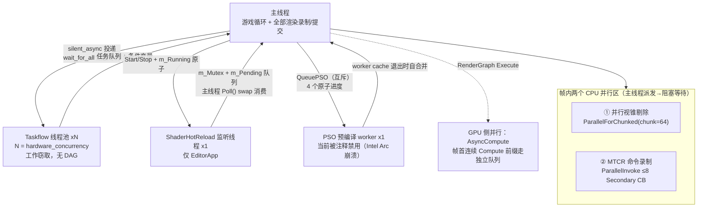
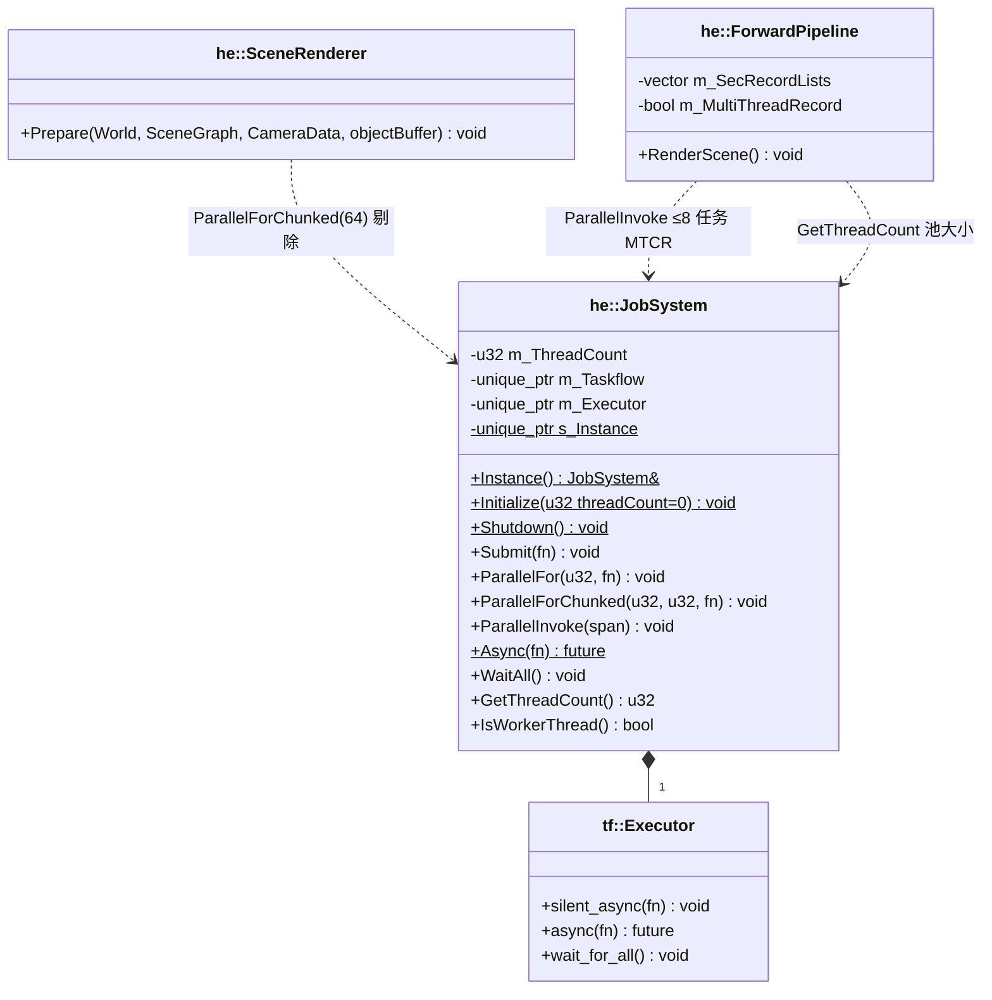
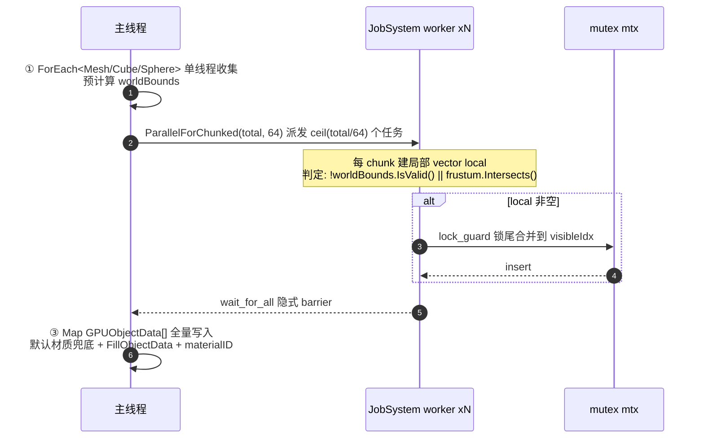
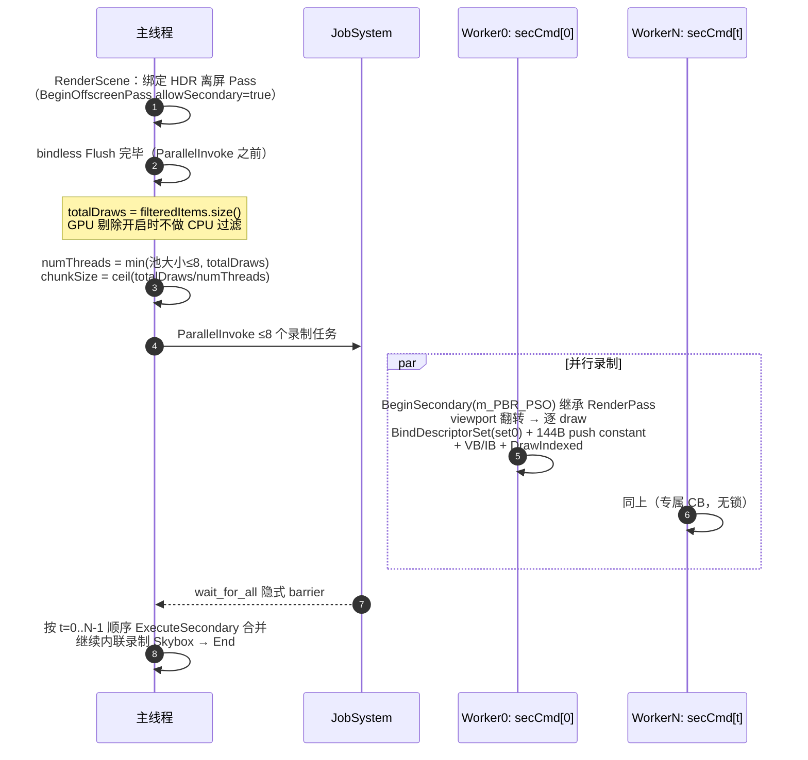
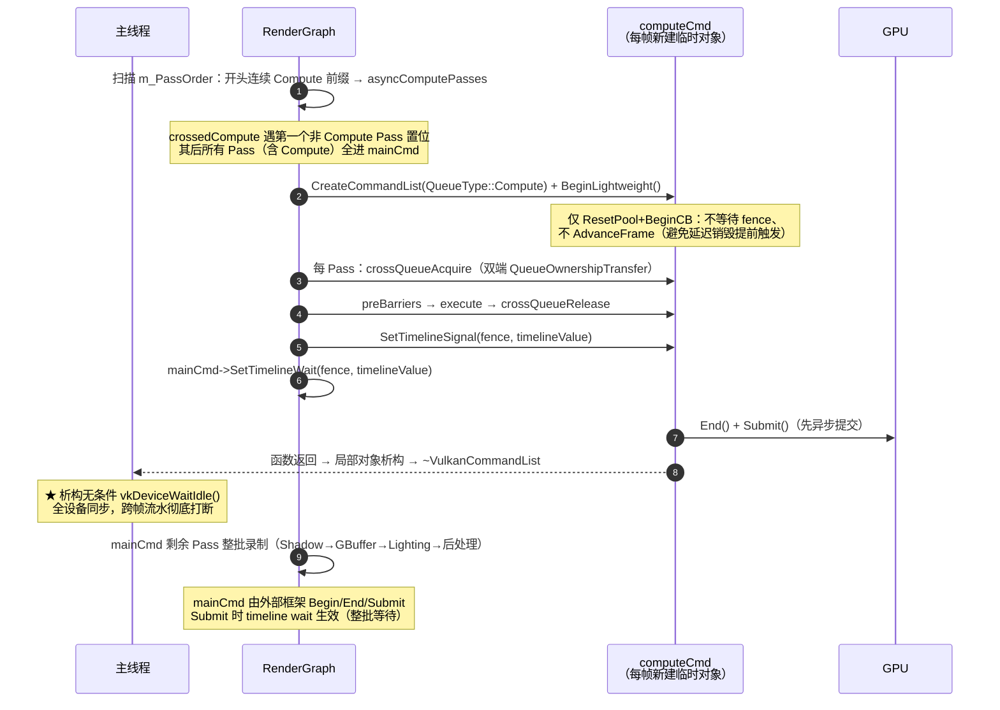
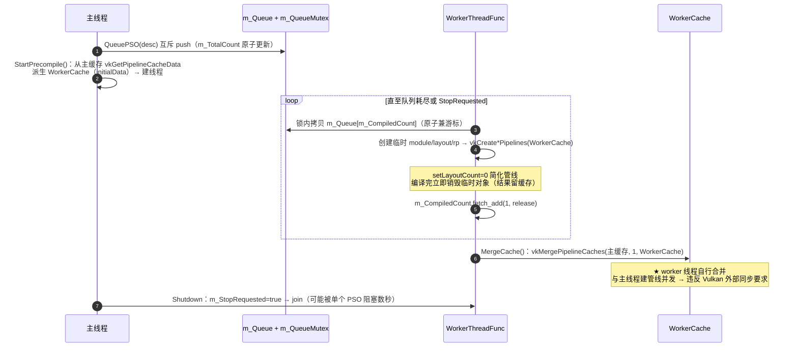
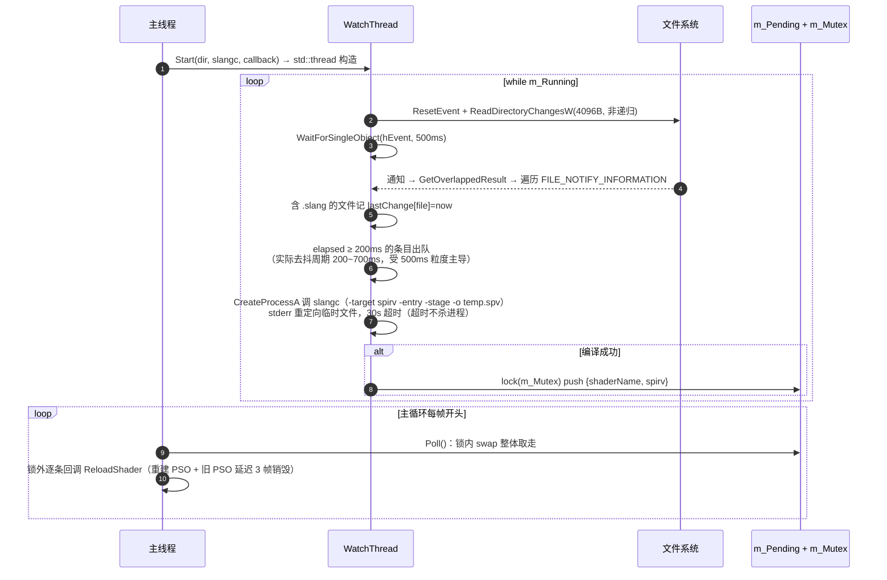

# HugEngine 多线程渲染实现分析

> 基于全工程源码逐行分析（2026-08-19），覆盖 JobSystem 任务并行、MTCR 多线程命令录制、
> AsyncCompute 跨队列并行、背景线程（PSO 预编译 / Shader 热重载）、多帧在飞行 CPU-GPU 同步。
> 本文是对 `docs/技术分析文档/HugEngine多线程架构分析.md`（2026-07-17）的代码级更新与纠错，
> 差异对照见 [§10](#10-与旧文档差异对照)。

---

## 目录

1. [线程全景图](#1-线程全景图)
2. [核心结论](#2-核心结论)
3. [JobSystem 任务并行](#3-jobsystem-任务并行)
4. [并行视锥剔除](#4-并行视锥剔除)
5. [MTCR 多线程命令录制](#5-mtcr-多线程命令录制)
6. [AsyncCompute 跨队列并行](#6-asynccompute-跨队列并行)
7. [背景线程](#7-背景线程)
8. [多帧在飞行与 CPU-GPU 同步](#8-多帧在飞行与-cpu-gpu-同步)
9. [线程安全设计清单](#9-线程安全设计清单)
10. [与旧文档差异对照](#10-与旧文档差异对照)
11. [坑与风险汇总](#11-坑与风险汇总)

---

## 1. 线程全景图



线程总数：主线程 1 + Taskflow N + 热重载 1（仅 Editor）+ 预编译 1（禁用中）。

---

## 2. 核心结论

1. **没有独立渲染线程**：全部渲染录制/提交在主线程；JobSystem 的两个并行区都是
   "主线程派发 → **阻塞等待（wait_for_all）** → 主线程继续"的帧内同步 barrier，无帧间流水线重叠。
2. **JobSystem 有效使用面极小**：全引擎仅 3 处调用（并行剔除、MTCR 派发、线程数查询）；
   `Submit/Async/WaitAll/ParallelForEach/IsWorkerThread` 全部零调用点；
   `tf::Taskflow` 图对象从未使用（纯冗余成员）。
3. **AsyncCompute 管道已建成但当前零并行收益**：computeCmd 是每帧新建的局部对象，
   析构时 `vkDeviceWaitIdle()`（VulkanCommandList.cpp:139）——"异步提交"后立即全设备同步；
   且 mainCmd 整批等待 timeline，无 Phase 交错。实际只有帧首 GPU_Cull 一个 Pass 走 Compute 队列。
4. **多线程录制（MTCR）是唯一真正有效的 CPU 并行**：8 个 Secondary CB 并行录制 + 无锁设计，
   但仅 ForwardPipeline 非 RG 路径使用，且忽略 GPU 剔除结果。
5. **PSO 预编译架构已实现但运行未启用**（Intel Arc igc-default64.dll ~50% 概率 SIGSEGV），
   且存在两处规范级问题：worker 线程自行 `vkMergePipelineCaches`（与主线程建管线并发，
   违反 Vulkan 外部同步要求）、setLayoutCount=0 的简化管线与真实 PSO 的缓存键不匹配
   （预编译命中率存疑）。
6. **瞬态分配器双堆安全依赖 FIFO，但引擎优先 MAILBOX** → 帧 N+2 重用 Heap A 时帧 N 的 GPU
   读可能未完成，存在真实竞态窗口（`SignalHeapFence` 是预留空实现）。

---

## 3. JobSystem 任务并行

### 3.1 类图与接口实现



### 3.2 接口实现细节表

| 接口 | 实现（JobSystem.cpp） | 阻塞语义 | 调用点 |
|---|---|---|---|
| `JobSystem(u32)` | `m_ThreadCount = max(n,1)`；创建 tf::Taskflow + tf::Executor(n) | — | — |
| `~JobSystem()` | `wait_for_all()` 后 Executor 析构 join 全部 worker | 阻塞 | — |
| `Instance()` | 直接解引用 s_Instance（**Initialize 前调用是空指针 UB**） | — | 3 处调用点 |
| `Submit(job)` | `executor->silent_async` | 非阻塞 | **零调用点** |
| `ParallelFor(count, body)` | **逐元素**建 count 个 std::function（绕开 MSVC 2026 下 for_each_index 链接问题）→ ParallelInvoke | 阻塞 | **零调用点** |
| `ParallelForChunked(count, chunk, body)` | numChunks 个任务，每任务 [start,end) | 阻塞 | SceneRenderer.cpp:42 |
| `ParallelInvoke(span)` | 逐任务 silent_async 后**立即 wait_for_all()**——引擎实际主要并行原语 | 阻塞到本批完成 | ForwardPipeline.cpp:928 |
| `Async<T>(task)` | `executor->async` 返回 future | 非阻塞 | **零调用点** |
| `WaitAll()` | wait_for_all | 阻塞 | **零调用点** |
| `IsWorkerThread()` | **恒返回 false**（注释"Taskflow doesn't expose this directly"；实际有 tf::this_worker TLS 可接，未接入） | — | **零调用点** |
| `ParallelForEach`（模板） | count>1024 走 ParallelFor，否则串行 | 阻塞（>1024 时） | **零调用点** |

### 3.3 Taskflow v3.9.0 语义（Engine/External/taskflow 实证）

- 线程数：`hardware_concurrency()` = 逻辑核心数（含超线程），全部 5 个 Sample 用 auto；
- **DAG/依赖图完全未使用**：`m_Taskflow` 创建后闲置（cpp:18），全部任务走 `silent_async`
  异步任务路径 → 外部提交进**全局 freelist**，worker 随机 victim 工作窃取；
- worker 本地队列 LIFO pop（深度优先、cache 友好）；连续窃取失败 yield → 超 100 次休眠等 notify；
- `wait_for_all` 在 C++20 下用 `_num_topologies.wait(n)` 无锁等待；
- worker 循环 catch(...) 存异常于 topology，`silent_async` 无 future → **异常可能静默滞留**。

### 3.4 死代码与陷阱

- `tf::Taskflow m_Taskflow`：从未使用；
- `Engine::m_JobSystem` + `GetJobSystem()`：从未初始化（Engine.cpp 只用静态 s_Instance），调用即空指针；
- `EngineConfig::enableMultiThreadRecord`：**从未被读取**（旧文档称其为 MTCR 开关是错的）；
- 嵌套并行死锁风险：worker 任务内再调 ParallelInvoke/WaitAll 会死锁（wait_for_all 等全部拓扑），
  当前所有调用在主线程故安全；
- 剔除合并顺序不确定：chunk 完成顺序不保证，visibleIdx 为插入序拼接 → DrawItem 顺序每帧可能变化。

---

## 4. 并行视锥剔除

`SceneRenderer::Prepare`（SceneRenderer.cpp:13-91），每帧被 ForwardPipeline.cpp:858 调用：



- chunk=64 连续分段；锁粒度 = chunk 产出次数（≤ 几十次/帧），全引擎 JobSystem 路径唯一显式锁；
- 上限 `visibleCount > MAX_OBJECTS(1024)` 截断；
- 开关：`enableFrustumCull`（默认 true），02.Cube ImGui 运行时切换。

---

## 5. MTCR 多线程命令录制

仅 ForwardPipeline 非 RG 路径使用（ForwardPipeline.cpp:893-933）。与 AsyncCompute 的关系：
MTCR 是 **CPU 侧**并行（GPU 仍是单串行流），二者当前不叠加。

### 5.1 帧内时序



### 5.2 Secondary CB 池与 Vulkan 层细节

| 维度 | 实现（VulkanCommandList.cpp:118-135, 166-197） |
|---|---|
| 池大小 | `min(kMaxSecRecordLists=8, max(JobSystem::GetThreadCount(),1))`，每条 = 辅助构造的 VulkanCommandList |
| 每 CB 轮转 | 专属 VkCommandPool（RESET 标志）+ 一次分配 `kMaxSecondaryCBs=3` 个 SECONDARY 级 CB；`BeginSecondary` 取 `m_SecSlot%3`，End 时 ++；3 帧一轮回 |
| 继承信息 | `VkCommandBufferInheritanceInfo{ renderPass = PSO 的 RenderPass, subpass=0, framebuffer=NULL }`（来源是传入 PSO 而非主 CB 活动 Pass——同源故兼容） |
| flags | `RENDER_PASS_CONTINUE \| ONE_TIME_SUBMIT`（无 SIMULTANEOUS_USE——正确，每 CB 只提交一次） |
| 前置条件 | 主 CB 必须以 `SUBPASS_CONTENTS_INLINE_AND_SECONDARY_COMMAND_BUFFERS_KHR` 开 Pass（BeginHDRPass → allowSecondary=true） |
| 别名技巧 | `m_CmdBuffers[m_FrameIndex] = m_SecCmdBuffers[idx]`（cpp:183）——后续 vkCmd* 无需分支直接录进 sec CB（脆弱：若对 sec 列表调 Begin()/Submit() 会因 pool=NULL 崩溃） |
| 合并 | `vkCmdExecuteCommands(主CB, 1, &对方 m_SecCmdBuffers[m_SecActive])`，按 worker 序号升序保持全局 draw 顺序 |

### 5.3 线程安全设计

| 维度 | 内容 |
|---|---|
| 独占 | 每 worker 独占 `m_SecRecordLists[t]`：自己的 VkCommandPool + 3 个 sec CB + 状态缓存字段 |
| 共享（只读） | filteredItems（const 引用）、framePC（每任务先拷贝 `pc = framePC`）、描述符集句柄、PSO、mesh VB/IB |
| 锁 | **完全无锁**（全文件无 lock_guard） |
| 跨线程通信 | 仅 JobSystem join 建立 happens-before |
| 隐患 | `m_SecActive` 是 worker 写、主线程 join 后读的**普通 u32**（非原子）——靠 join 可见性，易碎设计 |
| 规范符合性 | CommandPool 线程安全要求"分配/重置外部同步"——每 sec 列表独享 pool 且分配只在初始化期，录制期每 pool 单 worker → 符合规范；3-CB 轮转 + 主 CB 同槽 fence 对冲"重录时 GPU 未完成"风险 |

### 5.4 性能考量与限制

- 每 draw 重绑描述符集 + VB/IB（无惰性/去重）；144B push constant 每 draw；debug label 每 draw
  （受 `r.Debug.DrawMarker` 控制，默认开——每 draw 一次 vkCmdInsertDebugLabelEXT）；
- 静态均分 chunk 不均衡：按 draw 数量切分，不考虑三角形数差异；Taskflow 窃取只能平衡任务级负载；
- 每帧 2 次动态分配（任务 vector）；`wait_for_all` 每帧全量 join；
- **与 GPU 剔除脱节**：MTCR 路径忽略剔除结果（filteredItems = move(allDrawItems)），录制量不受可见性影响。

---

## 6. AsyncCompute 跨队列并行

### 6.1 能力检测与 Timeline Semaphore 封装

- **队列族三级检测**（VulkanDevice.cpp:80-128）：必须级 Graphics+Compute+Present 族（找不到断言）→
  Tier 2 = 不含 GRAPHICS/TRANSFER 的纯 Compute 族 → Tier 1 = Compute+Transfer 族 → Tier 0 =
  无独立族（`m_ComputeQueue = m_GraphicsQueue`，HasAsyncComputeQueue=false）。
  注意：检测用"含不含 TRANSFER"分级，GetCaps 用"family 是否相同"分级，两处标准不一致。
- **RHIFenceHandle = u64 句柄 = 索引+1**（`m_Fences[fence-1]`，kInvalidFence=0）；
  `FenceState{ VkSemaphore, currentValue }`；DestroyFence 不压缩 vector 不复用句柄；
  `fs.currentValue` 只写不读（死字段），真值由 `GetFenceValue` 走 vkGetSemaphoreCounterValue。
- **SignalFenceOnQueue/WaitFenceOnQueue 的"空提交"**（VulkanDevice.cpp:783-828）：
  commandBufferCount=0 的 VkSubmitInfo + VkTimelineSemaphoreSubmitInfo 挂 pNext——Vulkan 的
  timeline signal/wait 只能经 vkQueueSubmit 附带，空提交 = 任意队列上贴信号/等待的瞬时执行点。
  **当前主链路未消费这些接口**（主链路用 CommandList 级 SetTimelineSignal/Wait）。

### 6.2 RenderGraph 拆分与同步



### 6.3 每帧时间线值

- DeferredPipeline.cpp:344-349：`SetTimelineBase(m_FrameCounter); m_FrameCounter += 2`——
  **每帧实际只用 1 个值**（signal 值须严格递增，+2 是保守余量，奇数全跳过）；
  u64 回绕需 2.6×10⁹ 年，不可达；
- fence 首次启用 AsyncCompute 时惰性创建（DeferredPipeline.cpp:329-333）；
- Submit 合并（VulkanCommandList_Submit.cpp:147-216）：wait[0]=swapchain 二进制（COLOR_ATTACHMENT_OUTPUT）、
  wait[1]=timeline（ALL_COMMANDS）；signal 同理；`waitSemaphoreValueCount` 填**含二进制的总数**；
  **隐患**：只有二进制无 timeline 的 Submit 会让值数组指向未初始化栈槽（UB），当前两条路径恰好填对。

### 6.4 哪些 Pass 真正异步

标记 `RGPassQueue::Compute` 的共 3 个（DeferredPipeline_FrameGraph.cpp）：GPU_Cull(:114/134)、
DDGI_Update(:272)、AutoExposure(:456)。拓扑序：**GPU_Cull（Compute）**→ Shadow → GB_Clear →
HiZ → Phase2 → DDGI_Update（Compute）→ SSAO → … → AutoExposure（Compute）→ Particle。

按"连续 Compute 前缀"规则：**只有 GPU_Cull（或两阶段模式的 GPU_Cull_Phase1）真正走 Compute 队列**；
DDGI_Update/AutoExposure 因 crossedCompute 落回 mainCmd。SSAO/SSR/SSGI/Denoise/HiZ/Phase2
均为全屏三角形 Graphics Pass（未标记 Compute）。

### 6.5 缺陷清单（重要）

| # | 缺陷 | 位置 | 影响 |
|---|---|---|---|
| 1 | **每帧 vkDeviceWaitIdle**：computeCmd 局部对象析构无条件 `vkDeviceWaitIdle()` + FlushAll 延迟销毁 | VulkanCommandList.cpp:137-144 | "异步"后立即全同步，三缓冲流水被打断——**AsyncCompute 当前性能为负** |
| 2 | **整批等待 = 零并行**：mainCmd 单批提交、整批 wait timeline，设计文档的三阶段交错模型未实现 | VulkanCommandList_Submit.cpp:180-185 | GPU 侧无并行收益 |
| 3 | **死分析**：`asyncSchedule/requiresSync` 只在 ScheduleAsyncPasses 写入，全库无读取点；调度只看 queueHint+前缀规则 | RenderGraph.cpp:591,597 | canAsync 分析白做 |
| 4 | **依赖漏检**：canAsync 只查 RAW（writes vs 后续 reads），漏 WAR（GPU_Cull 读 gbDepth vs GB_Clear 写 gbDepth） | RenderGraph.cpp:576-588 | 恰好语义安全（读上帧深度），但分析不完整 |
| 5 | **跨队列 barrier 实际为空**：GPU_Cull 的 gbDepth 首次使用仍 Undefined，acquire 被跳过；无 writes → release 为空——严格规范下所有权转移未配对 | RenderGraph.cpp:620 | validation layer 可能报错，靠驱动容忍 |
| 6 | **stage 死数据**：BarrierRecord 填 BottomOfPipe/ComputeShader/TopOfPipe，但 QueueOwnershipTransfer 接口不带 stage，实际发 ALL_COMMANDS | VulkanCommandList_Submit.cpp:73-76 | 精度损失 |
| 7 | **shadow descriptor 就地改绑无跨队列防护**：Shadow/Phase2 pass 内 UpdateDescriptorSet 改共享 GBuffer 描述符集，AsyncCompute 下 compute 队列在用 GPU_Cull 描述符时主队列改绑 | DeferredPipeline_FrameGraph.cpp:184-193, 246-248 | 潜在竞争 |
| 8 | computeCmd 3 个 fence 从不等待——安全依赖 timeline 传递链（compute 提交 → mainCmd wait → 帧 N-3 主 fence 等待）；若 AsyncCompute 路径被跳过需重新论证 | VulkanCommandList.cpp:236-246 | 脆弱前提 |

---

## 7. 背景线程

### 7.1 PSO 预编译 worker（当前禁用）



- 原子变量 4 个：m_CompiledCount（worker release 写/主线程 acquire 读进度）、m_TotalCount、
  m_Running、m_StopRequested；
- **禁用原因**（DeferredPipeline.cpp:155-160 注释）：Intel Arc B370 上 worker 在 igc-default64.dll
  内随机 SIGSEGV（~50% 概率）→ 当前代码库不存在运行中的预编译线程；
- **命中率存疑**：VkPipelineCache 的键含完整管线状态，worker 用 setLayoutCount=0 建的简化管线
  与真实带描述符布局的 PSO **不会命中同一缓存条目**——预热对真实管线基本无效（无布局的全屏
  三角形除外）；
- StartPrecompile 二次启动会覆盖 m_WorkerCache 句柄泄漏（仅 m_Running 检查挡并发启动）。

### 7.2 ShaderHotReload 监听线程（仅 EditorApp）



- 健壮性缺陷：GetOverlappedResult 失败（变化事件超 4096B 缓冲，如 git checkout）→ **直接 break
  线程永久失效**且无错误日志；非递归监控不监听子目录；只认 .vert/.frag/.comp.slang 三种扩展名
  （RT shader 不触发）；temp.spv/err 固定文件名（多实例互相覆盖，当前单实例无碍）。

---

## 8. 多帧在飞行与 CPU-GPU 同步

### 8.1 三缓冲与帧围栏

```
VulkanCommandList：m_CmdPools[3] / m_CmdBuffers[3] / m_Fences[3]（初始 SIGNALED）+ m_FrameIndex

帧 N Begin():
  ① vkWaitForFences(fence[N%3], UINT64_MAX)   // 等帧 N-3 提交完成（单点挂起风险：GPU 超 3 帧即永久阻塞）
  ② device->AdvanceFrame()                    // m_CurrentFrame++
  ③ AdvanceDeferredDestroy(frameId)           // 帧 ID 去重（同一帧多次 Begin 只推进一次）
  ④ 待重建的旧 Framebuffer 入延迟销毁队列
  ⑤ vkResetCommandPool(slot N%3) + vkBeginCommandBuffer

Submit()（VulkanCommandList_Submit.cpp:147-216）:
  wait:  swapchain m_ImageAcquired（COLOR_ATTACHMENT_OUTPUT）+ 可选 timeline（ALL_COMMANDS）
  signal: m_RenderComplete + 可选 timeline
  vkResetFences(fence[N%3]) → vkQueueSubmit(..., fence[N%3]) → m_FrameIndex=(N+1)%3
```

- swapchain 仅**一对二进制信号量**（非 per-frame 数组），安全前提是主线程每帧严格
  acquire→submit→present 顺序；
- **延迟销毁队列**（DeferredDestructionQueue）：`m_Queue[3]` + 写索引，Enqueue 后恰好 3 次
  Advance 被销毁（此时 fence 等待已保证 GPU 完成该帧）；帧 ID 去重保护"同一帧多次 Begin"；
- **BeginLightweight 为何不推进**：computeCmd 每帧新建，若再调 AdvanceFrame 一帧推进两次 →
  延迟销毁提前一帧触发、资源仍在 GPU 使用即被销毁。

### 8.2 瞬态分配器双堆的竞态窗口（重要）

- `kNumHeaps=2` ×128MB，`AdvanceFrame` 切堆重置 bump 游标；调用点在 RenderGraph::Execute 帧首；
- 注释声称双堆安全："SwapChain Present 提供至少 2 帧 GPU 间隔"——**前提是 FIFO**；
- **但引擎优先 MAILBOX**（VulkanSwapChain.cpp:62-68，vsync 参数在 Present 中被忽略）：
  MAILBOX 下 CPU 可超前 GPU 最多 2 帧，帧 N+2 重用 Heap A 时帧 N 的 GPU 工作可能仍在执行；
  主列表 Begin 的 fence 等待只保证帧 N-1 完成——**真实竞态窗口**；
- `SignalHeapFence()` 是预留空实现（Phase 3 优化位）——作者已知风险未闭环。
  修复方向：堆数改 3（对齐 kMaxFramesInFlight）或实现 per-heap fence。

### 8.3 主线程帧循环同步点清单

| 位置 | 同步点 | 停顿条件 |
|---|---|---|
| SwapChain::AcquireNextImage | vkAcquireNextImageKHR(UINT64_MAX) | 无可用图像（FIFO 主要节流） |
| CommandList::Begin | vkWaitForFences(UINT64_MAX) | 帧 N-3 未完成（3 帧深度回退） |
| 帧内（可选） | GetQueryResults 带 WAIT_BIT | 仅 Profiler 启用时 |
| JobSystem 并行区 | wait_for_all ×2 | 剔除/MTCR 任务完成 |
| AsyncCompute | computeCmd 析构 vkDeviceWaitIdle | **全 GPU 空闲（当前每帧）** |
| Present | vkQueuePresentKHR | FIFO 队列满 |
| 退出 | WaitIdle | 一次 |

---

## 9. 线程安全设计清单

### 9.1 跨线程共享（有保护）

| 数据 | 保护 | 访问方 |
|---|---|---|
| PSO 预编译 m_Queue | m_QueueMutex 整向量锁 | 主线程写 / worker 读 |
| PSO 预编译 4 原子 | std::atomic（release/acquire） | 双方 |
| HotReload m_Pending | m_Mutex + 锁内 swap 消费 | worker 写 / 主线程 Poll 读 |
| HotReload m_Running | std::atomic | 主线程写 / worker 轮询 |
| HotReload 配置（callback/path/dir） | 线程创建前赋值（std::thread 构造建立 happens-before） | 只读 |
| 剔除合并 visibleIdx | std::mutex + lock_guard | worker 写 / 主线程读 |
| PipelineStateDesc 内 shader 裸指针 | 无锁，依赖生命周期约定 | 主线程持有 / worker 拷贝读 |
| JobSystem 任务 | Taskflow 无锁队列 + 条件变量 | 主线程 + N worker |

### 9.2 主线程独占（无锁）

VulkanDevice::m_CurrentFrame / m_LastDeferredAdvanceFrame / m_PSOCache（无锁 unordered_map）/
m_DeferredDestroy / m_TransientAllocator / m_PipelineCache；主命令列表实例及其 fence/pool/semaphore。

### 9.3 每线程私有

Taskflow worker：各自独占的 Secondary 命令列表（m_SecRecordLists[t]）、剔除 local 向量；
HotReload：lastChange map、4096B 缓冲、句柄；PSO worker：m_WorkerCache（线程边界移交）。

---

## 10. 与旧文档差异对照

对照 `docs/技术分析文档/HugEngine多线程架构分析.md`（2026-07-17）：

| # | 旧文档表述 | 代码事实（2026-08-19） |
|---|---|---|
| 1 | ParallelFor "等分并行" | **逐元素**拆 count 个任务（JobSystem.cpp:49-52） |
| 2 | WaitAll/Async 的"使用场景" | **零调用点**（纯推测） |
| 3 | MTCR 录制含 `BindDescriptorSet(1, perDrawSet)` | set=1 已移除（bindless u_Textures[] 取代，ForwardPipeline.cpp:915 注释） |
| 4 | MTCR 开关 = `EngineConfig::enableMultiThreadRecord` | 该字段**从未被读取**；实际开关 ForwardPipeline.h:146 硬默认 true |
| 5 | 剔除判定仅 frustum.Intersects | 另有 `!worldBounds.IsValid()` 前置保留 |
| 6 | 线程全景图 3 类线程（缺 PSO 预编译） | 已实现 PSOPrecompileManager（架构上第 4 类），但因 Intel Arc 崩溃禁用 |
| 7 | "PSO 在主线程串行创建"（未实现清单） | 后台预编译已实现（禁用中），且存在 worker 自合并缓存的规范违规 |
| 8 | 200ms debounce 表述 | 实际去抖周期 200~700ms（受 500ms wait 超时粒度主导） |
| 9 | AsyncCompute 五阶段时序 | 与实现一致，但未指出**整批等待、每帧 waitIdle、零并行**三个实现级问题 |
| 10 | 未覆盖 | 延迟销毁队列三槽、三缓冲 fence 轮换、swapchain 单对信号量、瞬态双堆、帧 ID 去重 |

---

## 11. 坑与风险汇总

| 严重度 | 问题 | 位置 |
|---|---|---|
| ★★★ | AsyncCompute 每帧 vkDeviceWaitIdle（computeCmd 局部对象析构）→ 跨帧流水被打断 | VulkanCommandList.cpp:137-144 |
| ★★★ | 瞬态分配器双堆安全依赖 FIFO，实际 MAILBOX → 帧 N+2 重用与帧 N GPU 读重叠竞态 | TransientResourceAllocator.cpp:210-242 |
| ★★★ | PSO 预编译 worker 线程自行 vkMergePipelineCaches，与主线程建管线并发违反 Vulkan 外部同步 | PSOPrecompileManager.cpp:436 |
| ★★ | AsyncCompute mainCmd 整批等待 timeline → GPU 侧零并行 | VulkanCommandList_Submit.cpp:180-185 |
| ★★ | GPU_Cull 跨队列所有权转移 barrier 实际为空（Undefined 跳过 + 无 release） | RenderGraph.cpp:620 |
| ★★ | shadow/Phase2 描述符就地改绑无跨队列防护 | DeferredPipeline_FrameGraph.cpp:184-193 |
| ★★ | Begin 的 UINT64_MAX fence 等待 = 单点挂起风险（GPU 超 3 帧即永久阻塞） | VulkanCommandList.cpp:205 |
| ★★ | MTCR 忽略 GPU 剔除结果（filteredItems = move(allDrawItems)） | ForwardPipeline.cpp:877-881 |
| ★★ | PSO 预热 setLayoutCount=0 与真实 PSO 缓存键不匹配 → 命中率存疑 | PSOPrecompileManager.cpp:173 |
| ★ | Submit 信号值数组未初始化槽位 UB（仅二进制无 timeline 时） | VulkanCommandList_Submit.cpp:160-192 |
| ★ | ScheduleAsyncPasses 死分析（asyncSchedule/requiresSync 无读取点）+ 漏 WAR | RenderGraph.cpp:591 |
| ★ | m_SecActive 非原子跨线程读写（靠 join 可见性） | VulkanCommandList.h:146-148 |
| ★ | HotReload GetOverlappedResult 失败 → 线程永久退出无日志 | ShaderHotReload.cpp:141 |
| ★ | HotReload slangc 30s 超时不杀进程 | ShaderHotReload.cpp:252 |
| ★ | JobSystem 死代码：m_Taskflow 未用、Engine::m_JobSystem 未初始化、enableMultiThreadRecord 未读 | 多处 |
| ★ | IsWorkerThread() 恒 false 语义陷阱；嵌套并行死锁风险；剔除 DrawItem 顺序不确定 | JobSystem.cpp:80-83 |

---

*本文档由 4 个并行分析代理通读 JobSystem / MTCR / AsyncCompute / 背景线程与帧同步全部源码生成，
含 Taskflow v3.9.0 内部语义实证与 60+ 条带文件:行号引用的实现细节。*
