# HugEngine 架构 UML 与可扩展性分析

> 基于全工程源码逐文件分析生成（2026-08-18）；分析日期 2026-08-04；最后更新 2026-09-21（补 AI/Physics 模块，按当前源码基线校订事实、计数与行号）。
> 范围：Engine 全模块（Core/Reflect/Serialize/RHI/Shader/Scene/Asset/Render/Editor/Physics/AI）+ Samples，聚焦**架构结构**与**可扩展性**。
> 依据：全库 include 依赖扫描、各模块 CMake 链接关系、渲染管线/资源/序列化代码通读。
> 所有图使用 Mermaid 语法，GitHub / VS Code / Typora 等可直接渲染。
> 本文件由《HugEngine架构UML文档》与《HugEngine架构可扩展性分析》合并而成，并按内容重新排布章节（总览 → 静态结构 → 动态时序 → 可扩展性评估 → 附录数据表）。

---

## 目录

### 第一部分 · 架构总览

1. [总体分层架构](#1-总体分层架构)
2. [模块职责与依赖评价](#2-模块职责与依赖评价)
3. [全局单例与通信方式](#3-全局单例与通信方式)

### 第二部分 · 分层与模块详图（静态结构）

4. [Core 基础库](#4-core-基础库)
5. [RHI 抽象接口层](#5-rhi-抽象接口层)
6. [Vulkan 实现层](#6-vulkan-实现层)
7. [Render 框架与 GPU 场景](#7-render-框架与-gpu-场景)
8. [Render 特性子系统](#8-render-特性子系统)
9. [Scene / Reflect / Serialize / Editor](#9-scene--reflect--serialize--editor)

### 第三部分 · 关键时序（动态行为）

10. [帧循环时序](#10-帧循环时序)
11. [GPU 资源延迟销毁时序](#11-gpu-资源延迟销毁时序)
12. [PSO 预编译时序](#12-pso-预编译时序)
13. [瞬态资源时序](#13-瞬态资源时序)
14. [路径追踪时序](#14-路径追踪时序)

### 第四部分 · 可扩展性评估与债务

15. [扩展路径评估：加"新 X"要改几处](#15-扩展路径评估加新-x要改几处)
16. [值得保留的好模式](#16-值得保留的好模式)
17. [关键问题清单（P0-1 / P0-2 / P0-3 / P1 / P2）](#17-关键问题清单p0-1--p0-2--p0-3--p1--p2)
18. [改进建议（按投入产出排序）](#18-改进建议按投入产出排序)
19. [结论](#19-结论)

### 附录

- [附录 A · 关键数据表](#附录-a--关键数据表)

---

# 第一部分 · 架构总览

## 1. 总体分层架构

依赖方向：上层 → 下层；CMake 构建顺序即依赖方向（Core → Reflect → Serialize → RHI → Shader → Scene → Asset → Render → Editor → Physics → AI）。

分层骨架（CMake 链接级）：

```
Core (L0 平台/工具)
  ← Reflect (L1) / Serialize (L1)
  ← RHI (L2, 抽象接口 + Vulkan 实现)
    ← Shader (L3, INTERFACE 库)
      ← Scene (L5 组件层)  ← Asset (L4)
        ← Render (L4)      ← Editor (L8) ← Physics (C2, Jolt) ← AI (L2.5 AI 运行时) ← Samples
```

- 各模块链接关系见各子目录 CMakeLists.txt（Core 仅外部库；Reflect→Core；Serialize→Reflect；RHI→Core+Vulkan；Shader(INTERFACE)→RHI；Scene→Reflect+Core+RHI；Asset→Scene+Reflect；Render→RHI+Shader+Scene+Asset；Editor→Render+Serialize+imgui；Physics→Scene+Core+Jolt；AI→Scene+Core+Render+Editor+Physics+nlohmann_json）
- 全量 include 扫描确认：**无循环依赖**，AI 是引擎内依赖顶端（消费 Render/Editor/Physics），Render 退为纯消费者之一

下面是同一分层的模块级展开（含 Samples 应用层与第三方库）：

```mermaid
flowchart TD
    subgraph samples["Samples 应用层（各自独立 main，无共享基类）"]
        s01["01.Triangle<br/>裸 RHI 演示"]
        s02["02.Cube<br/>三管线全功能演示（模式 0~3）"]
        s03["03.Sponza-Forward<br/>glTF + Forward"]
        s04["04.Sponza-Deferred<br/>GBuffer + Lighting"]
        s05["05.Sponza-PathTracing<br/>glTF + 全路径追踪"]
        s06["06.GILab<br/>GI 实验台"]
        s07["07.AISamples<br/>AI 综合示例（LLM/Agent/AIGC）"]
        s08["07.Nanite<br/>虚拟几何"]
        sedit["HugEditor<br/>EditorApp 编辑器"]
    end

    subgraph engine["Engine 引擎层"]
        subgraph L8["Editor（8 文件）"]
            e1["EditorContext"]
            e2["CommandHistory"]
            e3["ImGuiIntegration"]
            e4["SceneSerializer<br/>.hescene"]
        end
        subgraph Lp["Physics（8 文件，Jolt 集成）"]
            p1["PhysicsWorld<br/>Jolt 世界封装"]
            p2["PhysicsSystem<br/>刚体步进 + 回写 Transform"]
            p3["RigidBodyComponent<br/>+ PhysicsReflect"]
        end
        subgraph Lai["AI（53 文件，L2.5 AI 运行时）"]
            ai1["SceneBuilder / TypeSchema<br/>LLM JSON → World"]
            ai2["AgentSystem / Brain<br/>Agent · Goal · Memory 组件"]
            ai3["Runtime<br/>AIModule / InferenceScheduler / Backend"]
            ai4["AIGC / WorldModel<br/>生成资产 / 观测·动作"]
        end
        subgraph L4["Render（194 文件）"]
            r1["IRenderPipeline x3<br/>Forward/Deferred/PathTrace<br/>（HybridRT 已删除）"]
            r2["RenderGraph<br/>帧编排"]
            r3["SceneRenderer / GPUScene<br/>GPU 场景"]
            r4["阴影 / GI / 后处理 / AA"]
            r5["RT / PT / ReSTIR"]
            r6["ShaderHotReload"]
            r7["ProfilerManager"]
        end
        subgraph L5b["Asset（2 文件）"]
            a1["LoadGLTF<br/>cgltf 解析"]
        end
        subgraph L5["Scene（76 文件）"]
            sc1["World<br/>ECS 组件容器"]
            sc2["SceneGraph<br/>层级变换"]
            sc3["Component ×32<br/>Transform/Mesh/Light/...（含 3 基类）"]
        end
        subgraph L3["Shader"]
            sh1["CompileShaders<br/>.slang → .spv.h"]
        end
        subgraph L2["RHI（49 文件）"]
            rh1["IRHIDevice / IRHICommandList<br/>纯虚接口 + 工厂"]
            rh2["IRHIBindlessHeap<br/>纹理/采样器/SSBO 统一堆"]
            rh3["RayTracing / MeshShader / DGC<br/>抽象描述"]
            subgraph L2v["Vulkan 实现"]
                v1["VulkanDevice"]
                v2["DeferredDestructionQueue"]
                v3["PSO 缓存 + GPL + 预热"]
                v4["TransientResourceAllocator"]
                v5["VMA 集成"]
            end
        end
        subgraph L1s["Serialize（3 文件）"]
            se1["IArchive / BinaryArchive<br/>二进制序列化"]
        end
        subgraph L1r["Reflect（5 文件）"]
            rf1["TypeRegistry<br/>宏驱动反射"]
        end
        subgraph L0["Core（21 文件）"]
            c1["Engine<br/>启动引导"]
            c2["JobSystem<br/>Taskflow 封装"]
            c3["Window<br/>GLFW 封装"]
            c4["CVar<br/>控制台变量"]
            c5["Logger / Math / Containers / Memory"]
        end
    end

    subgraph third["第三方库"]
        t1["GLFW / glm / spdlog"]
        t2["Taskflow / VMA / slang"]
        t3["cgltf / stb_image / ImGui"]
        t4["Jolt / nlohmann_json / meshoptimizer"]
    end

    s01 -.-> L2
    s02 -.-> L4
    s03 -.-> L4
    s04 -.-> L4
    s05 -.-> L4
    s06 -.-> L4
    s07 -.-> L4
    s08 -.-> L4
    sedit -.-> L8
    L8 -.->|"Viewport 渲染"| L4
    L8 -.-> L5
    L8 -.-> L1s
    r2 -.->|"录制/提交"| rh1
    r3 -.->|"ForEach 收集"| L5
    r4 -.-> rh1
    r5 -.-> rh3
    r6 -.->|"调 slangc"| sh1
    a1 -.->|"写入 World/SceneGraph"| L5
    sc3 -.->|"持有 GPU 缓冲"| L2
    sc3 -.->|"HE_COMPONENT 注册"| L1r
    L2 -.->|"CVar/JobSystem"| L0
    L1s -.->|"ForEachProperty"| L1r
    L1r -.-> L0
    c2 -.->|"Taskflow"| t2
    L2v -.->|"VMA"| t2
    r6 -.->|"slangc"| t2
    a1 -.->|"cgltf/stb"| t3
    e3 -.->|"ImGui"| t3
    p2 -.->|"回写 TransformComponent"| L5
    p1 -.->|"Jolt"| t4
    ai1 -.->|"写入 World"| L5
    ai2 -.-> L4
    ai3 -.->|"复用 Command 系统"| L8
    ai4 -.->|"JSON 解析"| t4
```

---

## 2. 模块职责与依赖评价

各层职责评价：

| 模块 | 职责 | 评价 |
|---|---|---|
| Core (L0) | 窗口/JobSystem/CVar/日志/内存 | 最干净的一层，无反向依赖 |
| Reflect (L1) | 宏驱动反射（HE_CLASS → TypeRegistry） | 小巧、依赖面单一 |
| Serialize (L1) | Archive/BinaryArchive 基于反射的序列化 | 仅依赖 ReflectionAPI，解耦良好 |
| RHI (L2) | IRHIDevice 纯虚接口 + Vulkan 实现 + 瞬态资源 | 抽象设计良好，但有 void* 逃逸口（见 三.1） |
| Shader (L3) | slangc→SPIR-V→内嵌 .spv.h 编译管线 | C++/Slang 共享常量设计巧妙 |
| Scene (L5) | 自制组件系统：World + Entity + Component + SceneGraph | 职责明确，但组件直接持有 GPU 资源（见 三.2） |
| Asset (L4) | glTF 加载（cgltf 单头文件） | 加载与 ECS 强耦合，无加载器注册表 |
| Physics (C2) | Jolt 封装：PhysicsWorld/PhysicsSystem/RigidBodyComponent | 组件放本模块，Scene 不依赖 Jolt，边界干净 |
| AI (L2.5) | SceneBuilder/TypeSchema/Agent/AIGC/推理运行时 | 位于依赖顶端；复用 Editor 的 Command，耦合面偏大 |
| Render (L4) | 3 条管线 + IRenderSubsystem 子系统 + RenderGraph | 架构意图最好的一层 |
| Editor (L8) | EditorContext/ImGui 集成/SceneSerializer | 模块边界存在，但有 Vulkan 泄漏（见 三.1） |

各模块规模与依赖：

| 模块 | 文件数 | 依赖 | 定位 |
|---|---|---|---|
| HugEngineCore | 21 | GLFW/glm/spdlog/Taskflow（WIN32 另加 dbghelp） | L0 基础库 |
| HugEngineReflect | 5 | Core | 宏驱动反射 |
| HugEngineSerialize | 3 | Reflect | 二进制序列化 |
| HugEngineRHI | 49 | Core, Vulkan, VMA | 图形抽象 + Vulkan 实现 |
| HugEngineShader | （.slang 资产，156 个） | RHI（INTERFACE 库） | slang 编译生成 .spv.h |
| HugEngineScene | 76 | Reflect, Core, RHI（PRIVATE stb） | ECS + SceneGraph |
| HugEngineAsset | 2 | Scene, Reflect, cgltf | glTF 加载 |
| HugEngineRender | 194 | RHI/Shader/Scene/Asset（PRIVATE meshoptimizer） | 管线 + 特性 |
| HugEngineEditor | 8 | Render/Serialize/imgui | 编辑器框架 |
| HugEnginePhysics | 8 | Scene, Core, Jolt | Jolt 刚体集成 |
| HugEngineAI | 53 | Scene/Core/Render/Editor/Physics, nlohmann_json | LLM 场景生成 + Agent/AIGC/推理运行时 |
| Samples | 48 | 组合链接静态模块 | 9 个可执行目标（8 示例 + HugEditor） |

---

## 3. 全局单例与通信方式

### 全局单例模式

- `rhi::g_Device`（RHIBase.cpp:7）：裸全局指针，最危险——跨层可见、生命周期无主
- 其余单例（JobSystem/Logger/TypeRegistry/Allocator）均为标准成对或 Meyers 单例，合理
- AI 模块另引入 `ai::AIModule`（静态 `s_Scheduler` / `s_Device`，AIModule.h:32-33）：模块级单例，生命周期独立于 Engine

### 通信方式

以直接函数调用为主，配以良好的接口层（`IRenderSubsystem`/`IGlobalIllumination`/`IShadowSystem`/`IRenderPipeline`/`IRHIDevice`）+ 少量回调（窗口 resize、选中变化、shader 热重载）。**没有真正的中枢 god class**——真正的全局中枢是 `rhi::GetDevice()` 而非某个类。

---

# 第二部分 · 分层与模块详图（静态结构）

## 4. Core 基础库

L0 静态库 `HugEngineCore`：启动引导、任务并行、窗口、控制台变量、数学几何。
外部依赖：GLFW、glm、spdlog、Taskflow。

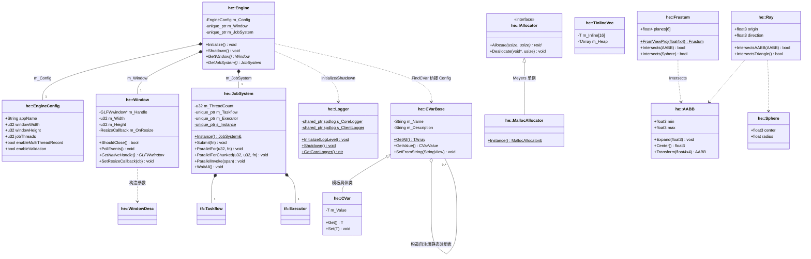

> **线程模型要点**：无独立渲染线程——渲染提交全在主线程串行执行。
> JobSystem 承担两处 CPU 并行：`SceneRenderer::Prepare` 视锥剔除（ParallelForChunked）、
> `ForwardPipeline::RenderScene` 多线程命令录制（ParallelInvoke，≤8 个 Secondary CB）。
> `ParallelFor/Invoke` 内部 `wait_for_all`，即帧内同步点。
> CVar 体系：`CVarBase` 构造自注册到静态 `TArray<CVarBase*>`，`CVar<T>` 用
> `std::variant<i32,f32,String,bool>` 类型擦除。

---

## 5. RHI 抽象接口层

设计：**纯虚接口 + 工厂**（类似 UE RHI / Filament Driver），设备全局单例
`g_Device` + `GetDevice()/SetDevice()`；资源工厂返回 `unique_ptr` 所有权转移。
引擎其他模块依赖 `RHI/*.h` 公共头；**例外**：`GI/GI_RSM.cpp` 与 `Editor/ImGuiIntegration.cpp`
仍直接 include `Vulkan/Vulkan*.h`（后端纪律缺口，见 §17 P0-1）。

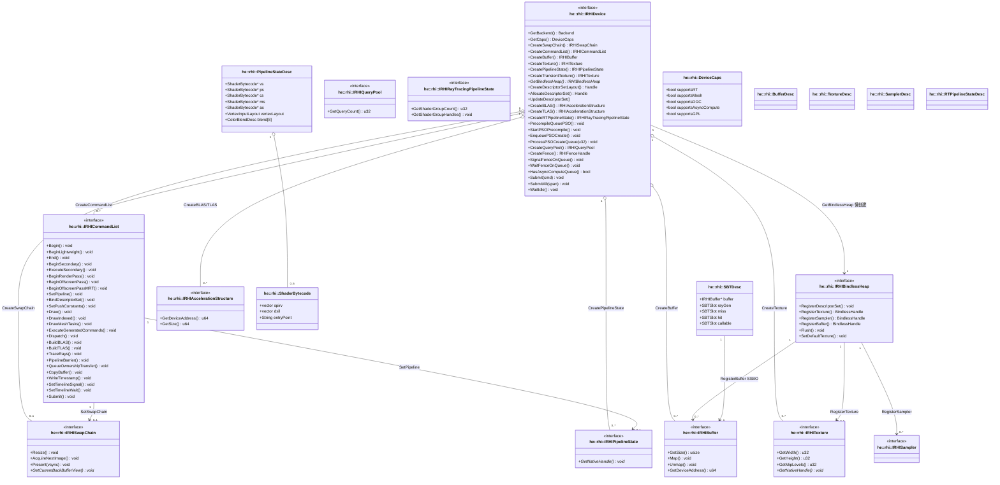

> **关键设计**：
> - **无 `IRHIShader` 接口**：shader 是纯数据（`ShaderBytecode`：SPIR-V + DXIL 双载体），
>   Mesh 只有描述结构 `MeshPipelineStateDesc`，PSO 统一走 `IRHIPipelineState`。
> - **句柄三元化**：资源 = `unique_ptr<IRHI*>`；描述符集/Fence = `u64` 索引（kInvalid=0）；
>   跨模块图像视图/DGC = `void*` 后端句柄。
> - **Bindless**：`BindlessHandle = u32` 即类型数组内索引，shader 直接当索引用；
>   单堆统一管理纹理 + 采样器 + SSBO，`Register*` 只 push 指针标 pending，`Flush()` 写全部已登记描述符集。
> - 大量"后端可选"能力在接口上给默认空实现（瞬态纹理、PSO 预热、DGC、ImGui、DebugLabel），
>   后端不支持时安全跳过。

---

## 6. Vulkan 实现层

`VulkanDevice` 是唯一生命周期根，值组合 6 个子系统（BindlessHeap 为 unique_ptr 懒创建）；
所有其他对象经工厂创建返回，不反向持有 Device。

```mermaid
classDiagram

class `he::rhi::VulkanDevice` {
    -VkInstance m_Instance
    -VkDevice m_Device
    -VkQueue m_GraphicsQueue
    -VkQueue m_ComputeQueue
    -bool m_SupportsRT
    -bool m_SupportsMesh
    -bool m_SupportsDGC
    -bool m_SupportsGPL
    -VmaAllocator m_VmaAllocator
    -VulkanRTDispatch m_RT
    -VulkanDGC m_DGC
    -unique_ptr<VulkanBindlessHeap> m_BindlessHeap
    -TransientResourceAllocator m_TransientAllocator
    -PSOPrecompileManager m_PSOPrecompileManager
    -PipelineLibraryCache m_PipelineLibraryCache
    -DeferredDestructionQueue m_DeferredDestroy
    -map<u64, PSOCacheEntry> m_PSOCache
    +Initialize() void
    +Shutdown() void
    +AdvanceFrame() void
    +AdvanceDeferredDestroy() void
    +GetCachedPSORef() void
    +LoadPipelineCache() void
    +SavePipelineCache() void
}
class `he::rhi::VulkanCommandList` {
    -VkCommandBuffer m_CmdBuffers[3]
    -VkFence m_Fences[3]
    -VkCommandBuffer m_SecCmdBuffers[3]
    -VkSemaphore m_WaitSemaphore
    -VkSemaphore m_SignalSemaphore
    -VkSemaphore m_TimelineSignalSem
    -VkPipeline m_CurrentPipeline
    -VkFramebuffer m_Framebuffers
    +Begin() void
    +BeginLightweight() void
    +BeginSecondary() void
    +BuildBLAS() void
    +BuildTLAS() void
    +TraceRays() void
    +DrawMeshTasks() void
    +ExecuteGeneratedCommands() void
}
class `he::rhi::VulkanPipelineState` {
    -VkPipeline m_Pipeline
    -VkPipelineLayout m_PipelineLayout
    -VkRenderPass m_RenderPass
    -shared_ptr<u32> m_CacheRef
    -DeferredDestructionQueue* m_DeferredDestroy
}
class `he::rhi::VulkanBindlessHeap` {
    -vector<RegisteredSet> m_RegisteredSets
    -vector<IRHITexture*> m_Textures
    -vector<IRHISampler*> m_Samplers
    -vector<IRHIBuffer*> m_Buffers
    -IRHITexture* m_DefaultTexture
    +Flush() void
}
class `he::rhi::VulkanSwapChain` {
    -VkSwapchainKHR m_Swapchain
    -u32 m_ImageCount
    -VkSemaphore m_ImageAcquired
    -VkSemaphore m_RenderComplete
}
class `he::rhi::VulkanQueryPool`
class `he::rhi::VulkanBuffer` {
    -VmaAllocation m_Allocation
    -bool m_IsCoherent
    -u64 m_DeviceAddress
    +Map() void
    +Unmap() void
}
class `he::rhi::VulkanTexture` {
    -VkImageView m_FaceViews[6]
}
class `he::rhi::VulkanPlacedTexture`
class `he::rhi::VulkanSampler`
class `he::rhi::VulkanAccelerationStructure` {
    -VkAccelerationStructureKHR m_AS
    -u64 m_DeviceAddress
    -BLASBuildDesc m_BLASDesc
}
class `he::rhi::VulkanRTPipelineState` {
    -VkPipeline m_Pipeline
    -vector<u8> m_Handles
}
class `he::rhi::DeferredDestructionQueue` {
    -vector<function> m_Queue[kSlots]
    -u32 m_WriteIndex
    +Enqueue(deleter) void
    +Advance() void
    +FlushAll() void
}
class `he::rhi::PSOPrecompileManager` {
    -mutex m_QueueMutex
    -atomic m_CompiledCount
    -VkPipelineCache m_WorkerCache
    +QueuePSO(desc) void
    +StartPrecompile() void
    +MergeCache() void
}
class `he::rhi::PipelineLibraryCache` {
    -map<u64, VkPipeline> m_Libs[4]
    -DeferredDestructionQueue* m_DDQ
    +GetOrCreateVertexInputLibrary() void
    +GetOrCreatePreRasterLibrary() void
    +GetOrCreateFragmentShaderLibrary() void
    +GetOrCreateFragmentOutputLibrary() void
    +LinkPipeline() void
}
class `he::rhi::GraphicsPipelineParts`
class `he::rhi::TransientResourceAllocator` {
    -Heap m_Heaps[2]
    -map m_ImageCache
    +AllocateImage(createInfo) PlacedImage
    +AdvanceFrame() void
}
class `he::rhi::VulkanDGC` {
    -VkIndirectCommandsLayoutEXT m_Layout
    -VkIndirectExecutionSetEXT m_ExecutionSet
    -VkBuffer m_PreprocessBuffer
    +Initialize() void
    +Shutdown() void
}
class `he::rhi::VulkanRTDispatch`
class `he::rhi::VulkanDGCFuncs`

`he::rhi::IRHIDevice` <|-- `he::rhi::VulkanDevice`
`he::rhi::IRHICommandList` <|-- `he::rhi::VulkanCommandList`
`he::rhi::IRHIPipelineState` <|-- `he::rhi::VulkanPipelineState`
`he::rhi::IRHIBindlessHeap` <|-- `he::rhi::VulkanBindlessHeap`
`he::rhi::IRHISwapChain` <|-- `he::rhi::VulkanSwapChain`
`he::rhi::IRHIQueryPool` <|-- `he::rhi::VulkanQueryPool`
`he::rhi::IRHIBuffer` <|-- `he::rhi::VulkanBuffer`
`he::rhi::IRHITexture` <|-- `he::rhi::VulkanTexture`
`he::rhi::IRHITexture` <|-- `he::rhi::VulkanPlacedTexture`
`he::rhi::IRHISampler` <|-- `he::rhi::VulkanSampler`
`he::rhi::IRHIAccelerationStructure` <|-- `he::rhi::VulkanAccelerationStructure`
`he::rhi::IRHIRayTracingPipelineState` <|-- `he::rhi::VulkanRTPipelineState`

`he::rhi::VulkanDevice` *-- "1" `he::rhi::DeferredDestructionQueue` : m_DeferredDestroy
`he::rhi::VulkanDevice` *-- "1" `he::rhi::PSOPrecompileManager`
`he::rhi::VulkanDevice` *-- "1" `he::rhi::PipelineLibraryCache`
`he::rhi::VulkanDevice` *-- "1" `he::rhi::TransientResourceAllocator`
`he::rhi::VulkanDevice` *-- "1" `he::rhi::VulkanDGC`
`he::rhi::VulkanDevice` *-- "1" `he::rhi::VulkanRTDispatch`
`he::rhi::VulkanDevice` *-- "1" `he::rhi::VulkanDGCFuncs`
`he::rhi::VulkanDevice` *-- "0..1" `he::rhi::VulkanBindlessHeap` : unique_ptr 懒创建
`he::rhi::VulkanCommandList` --> "1" `he::rhi::VulkanDevice` : m_VulkanDevice 句柄解析
`he::rhi::VulkanCommandList` --> "1" `he::rhi::DeferredDestructionQueue` : Framebuffer 入队
`he::rhi::VulkanPipelineState` --> "1" `he::rhi::DeferredDestructionQueue` : 缓存模式析构入队
`he::rhi::PipelineLibraryCache` --> "1" `he::rhi::DeferredDestructionQueue` : 库段 Shutdown 入队
`he::rhi::VulkanBindlessHeap` --> "1" `he::rhi::VulkanDevice` : Flush 调 UpdateDescriptorSet
```

> **延迟销毁机制（DeferredDestructionQueue）**：环形槽位 `m_Queue[kSlots]`（`kSlots = 2 × kMaxFramesInFlight = 6`），
> 资源销毁 lambda 压入当前写槽位；每帧 `Begin()` 等 GPU fence 后 `Advance()` 轮转并执行最老槽位——
> GPU 必已用完。入队来源四类：缓存模式 PSO（最后引用释放）、SwapChain Framebuffer 重建、
> 离屏临时 Framebuffer、GPL 四段库（Shutdown）。替代原先分散的 ad-hoc 管理（消除 ~22 个历史 bug）。
>
> **PSO 缓存链**：FNV-1a 64 哈希（覆盖 5 个 shader SPIR-V 字节内容 + per-MRT 混合状态）→
> `m_PSOCache` 去重 + `shared_ptr<u32>` 共享引用 → 缓存模式 `VulkanPipelineState` 双所有权 →
> 最后引用释放入延迟销毁队列；磁盘持久化 `pipeline_cache.bin`。
>
> **GPL 四段库**：VertexInput / PreRaster / FragmentShader / FragmentOutput 分别按段哈希，
> 任一段命中即复用，只重编变化段（fast-link 约 0.5ms vs 单片 50ms）；任一段失败回退单片路径。
>
> **描述符池**：7 种 DescriptorPoolSize（SSBO 16384 / SampledImage 32768 / Sampler 32768 等），
> maxSets=1024，`UPDATE_AFTER_BIND`；bindless 最大 binding 号额外加 `VARIABLE_DESCRIPTOR_COUNT`。

---

## 7. Render 框架与 GPU 场景

无中枢单例、无独立渲染线程。3 个平行管线继承 `IRenderPipeline`，应用层按
CVar `r.Pipeline.Mode`（0=Forward 1=Deferred 2=Deferred(RT sources) 3=PathTrace）实例化。
（原 `HybridRTPipeline` 已于 2026-09 删除，RT 效果并入 Deferred 层栈。）
帧编排 = 每帧新建 RenderGraph + 手写注册序 + 自动拓扑/Barrier/别名/裁剪。

```mermaid
classDiagram

class `he::render::IRenderPipeline` {
    <<interface>>
    +Initialize(IRHIDevice*) bool
    +Shutdown() void
    +NextFrame() void
    +Render(cmd, World, SceneGraph, CameraData, dt) void
    +OnResize(w, h) void
    +GetShadowSystem() IShadowSystem*
    +GetGI() IGlobalIllumination*
    +ReloadShader(name, spirv) int
}
class `he::render::ForwardPipeline` {
    -unique_ptr<IShadowSystem> m_ShadowSystem
    -unique_ptr<IGlobalIllumination> m_GI
    -unique_ptr<IAntiAliasing> m_AA
    -unique_ptr<IRHIBuffer> m_MaterialBuffer
    -vector<PSORecord> m_PSORegistry
    -bool m_UseBindlessMaterial
    +UploadMaterialBindless() void
    +RenderScene() void
}
class `he::render::DeferredPipeline` {
    -unique_ptr<GBufferRenderer> m_GBuffer
    -LightingPass m_LightingPass
    -PostProcessChain m_PostProcess
    -unique_ptr<IShadowSystem> m_ShadowSystem
    -unique_ptr<SceneRenderer> m_SceneRenderer
    -ClusteredShading m_ClusteredShading
    -GPUCulling m_GPUCulling
    -GPUScene m_GPUScene
    -ParticleRenderer m_ParticleRenderer
    +BuildFrameGraph(rg) void
    +CollectLights() void
}
%% 已删除（2026-09）：RT 效果并入 Deferred 层栈，类与文件都不存在；以下保留为历史结构记录
%% class `he::render::HybridRTPipeline` {
%%     -RTEffectPass* m_RTShadow
%%     -RTEffectPass* m_RTAO
%%     -RTEffectPass* m_RTReflection
%%     -RTEffectPass* m_RTGI
%%     -RTPass m_RTPass
%% }
class `he::render::PathTracingPipeline` {
    -unique_ptr<RTPass> m_RTPass
    -unique_ptr<PTPass> m_PT
    -unique_ptr<ReSTIRPass> m_ReSTIR
    -unique_ptr<RTDenoiser> m_PTDenoiser
    -unique_ptr<PTAtrousPass> m_PTAtrous
    -unique_ptr<STBNTexture> m_STBN
}
class `he::render::RenderGraph` {
    +AddPass(name, reads, writes, exec, queueHint) void
    +Compile() void
    +Execute() void
    +SetAsyncComputeEnabled(bool) void
    +SetCrossQueueFence(fence) void
}
class `he::render::PassNode` {
    +String name
    +vector reads
    +vector writes
    +RGPassQueue queueHint
    +bool asyncSchedule
    +bool requiresSync
}
class `he::render::SceneRenderer` {
    +Prepare(World, SceneGraph, CameraData, objectBuffer) void
}
class `he::render::GPUScene` {
    +Collect(World) void
    +Upload() void
}
class `he::render::MeshBatcher`
class `he::render::GPUCulling`
class `he::render::ClusteredShading` {
    +BuildClusters() void
    +CullLights() void
}
class `he::render::GBufferRenderer` {
    -unique_ptr<IGBufferRenderer> m_Renderer
    -unique_ptr<IRHITexture> m_A
    -unique_ptr<IRHITexture> m_Depth
}
class `he::render::IGBufferRenderer` {
    <<interface>>
}
class `he::render::GBufferRenderer_CPU`
class `he::render::GBufferRenderer_GPU`
class `he::render::LightingPass` {
    +Render(cmd, inputs) void
}
class `he::render::ParticleRenderer` {
    -vector<CompState> m_Components
    +DispatchCompute() void
    +Render() void
    +RegisterComponent() u32
}
class `he::render::ProfilerManager`
class `he::render::GPUObjectData` {
    <<GPU 208B binding2>>
}
class `he::render::GPUSceneObject` {
    <<GPU 128B>>
}
class `he::render::GPUMaterialData` {
    <<GPU 112B binding30>>
}
class `he::render::GPULight` {
    <<GPU 64B binding1>>
}
class `he::render::GPUShadowData` {
    <<GPU 256B binding3>>
}
class `he::render::PBRMaterial` {
    <<CPU>>
    +float3 baseColor
    +float metallic
    +float roughness
    +float dielectricF0
}
class `he::render::CameraData` {
    <<CPU 经 push constant>>
}

`he::render::IRenderPipeline` <|-- `he::render::ForwardPipeline`
`he::render::IRenderPipeline` <|-- `he::render::DeferredPipeline`
%% `he::render::IRenderPipeline` <|-- `he::render::HybridRTPipeline`   （已删除，2026-09）
`he::render::IRenderPipeline` <|-- `he::render::PathTracingPipeline`

`he::render::DeferredPipeline` *-- "1" `he::render::GBufferRenderer`
`he::render::DeferredPipeline` *-- "1" `he::render::LightingPass`
`he::render::DeferredPipeline` *-- "1" `he::render::SceneRenderer`
`he::render::DeferredPipeline` *-- "1" `he::render::GPUCulling`
`he::render::DeferredPipeline` *-- "1" `he::render::GPUScene`
`he::render::DeferredPipeline` *-- "1" `he::render::MeshBatcher`
`he::render::DeferredPipeline` *-- "1" `he::render::ClusteredShading`
`he::render::DeferredPipeline` *-- "1" `he::render::ParticleRenderer`
`he::render::GBufferRenderer` o-- "1" `he::render::IGBufferRenderer` : 策略
`he::render::IGBufferRenderer` <|-- `he::render::GBufferRenderer_CPU`
`he::render::IGBufferRenderer` <|-- `he::render::GBufferRenderer_GPU`
`he::render::RenderGraph` *-- "0..*" `he::render::PassNode`
`he::render::SceneRenderer` ..> `he::render::GPUScene`
`he::render::PBRMaterial` ..> `he::render::GPUMaterialData` : FillMaterialData
```

> **GPU 场景三层 SSBO 上传策略**（单一数据源 `ShaderTypes.slang`）：
>
> | SSBO | 元素/容量 | 上传策略 |
> |---|---|---|
> | GPUObjectData（208B, binding 2） | MAX_OBJECTS=1024 | 每帧全量 Map/Unmap |
> | GPUSceneObject（128B） | kMaxGPUObjects=2048 | 矩阵比较去重 → 脏标记增量 memcpy |
> | u_Materials / GPUMaterialData（112B, binding 30） | 动态 | 材质 ID 去重后重建式上传（材质集静态，非每帧） |
> | GPULight（64B, binding 1） | MAX_LIGHTS=8 | 每帧逐光源 Map 写入 |
> | GPUShadowData（256B, binding 3） | MAX_SHADOWS=4 | 每帧聚合上传 |
>
> **材质 bindless 读取开关**：`PushConstantData.useBindlessMaterial` 由 `m_UseBindlessMaterial`
> 驱动，默认 false 走内联路径（从 GPUObjectData 字段读）；bindless 路径 `u_Materials[materialID>>2]`。
> 纹理 4 槽/材质（BaseColor/Normal/MetallicRoughness/Occlusion），`materialID` 即 bindless 纹理基索引。
>
> **RenderGraph Compile 五步**：BuildDependencies(RAW/WAW/WAR) → TopologicalSort →
> DeriveBarriers → CullDeadPasses → ApplyAliasing（贪心生命周期合并 → 瞬态内存池）→ ScheduleAsyncPasses。
>
> **Deferred 管线 Pass 顺序**：GPU_Cull → Shadow(CSM×3+Spot/Rect) → GB_Clear(8×MRT+D32) → HiZ →
> DDGI → SSAO → SSR → SSGI → Lighting(全屏 PBR+IBL+阴影+聚集着色) → Skybox → Particle →
> Bloom → DOF → MotionBlur → TAA → ToneMap → ColorGrading → CameraEffects → SMAA/FXAA。

---

## 8. Render 特性子系统

### 8.1 阴影：双层策略模式

外层 `IShadowSystem`（Mode：None/Traditional/RayTraced）→ 组合器 `ShadowSystem` 注册 4 个技术；
内层 `IShadowTechnique` 按光源类型分派（CSM/Point/Spot/Rect），软硬阴影差异由采样侧 PCF 决定。

### 8.2 后处理/AA/GI/RT/PT

```mermaid
classDiagram

class `he::render::IRenderSubsystem` {
    <<interface>>
    +Initialize() bool
    +Shutdown() void
    +Update(ctx) void
    +Render(cmd) void
}
class `he::render::IShadowSystem` {
    <<interface>>
    +GetMode() Mode
    +GetShadowMapCount() u32
    +GetShadowIndex(light) i32
    +SetRenderResources() void
}
class `he::render::IShadowTechnique` {
    <<interface>>
    +CollectLights() u32
    +Render(cmd, shadowData, start) void
}
class `he::render::ShadowSystem` {
    -vector<unique_ptr> m_Techniques
    -vector<GPUShadowData> m_AllShadowData
}
class `he::render::ShadowNone`
class `he::render::CSMTechnique` {
    -IRHITexture* m_ShadowMaps[3]
    -float4x4 m_LightVPs[3]
}
class `he::render::PointShadowTechnique` {
    -IRHITexture* m_PointShadowMap
}
class `he::render::SpotShadowTechnique` {
    -IRHITexture* m_SpotShadowMap
}
class `he::render::RectLightShadowTechnique` {
    -IRHITexture* m_RectShadowMap
}
class `he::render::IPostProcessPass` {
    <<interface>>
    +SetInput(tex, sampler) void
    +GetOutputFormat() Format
    +OwnsOutput() bool
}
class `he::render::IAntiAliasing` {
    <<interface>>
    +GetMode() AAMode
    +GetJitterOffset() float2
    +OnBeginFrame() void
}
class `he::render::AA_TAA` {
    -IRHITexture* m_HistoryColor[2]
    +SetGBufferInputs() void
    +UpdateUniforms() void
}
class `he::render::AA_FXAA`
class `he::render::AA_SMAA`
class `he::render::AA_MSAA`
class `he::render::AA_None`
class `he::render::PostProcessChain` {
    -BloomPass m_Bloom
    -ToneMapPass m_ToneMap
    -unique_ptr<IAntiAliasing> m_TAA
    -IRHITexture* m_LDRTarget
}
class `he::render::IGlobalIllumination` {
    <<interface>>
    +SetRenderResources() void
    +Update(ctx) void
    +IsDirty() bool
}
class `he::render::GI_IBL`
class `he::render::GI_RSM`
class `he::render::GI_SSGI`
class `he::render::GI_SSR`
class `he::render::GI_DDGI`
class `he::render::GI_None`
class `he::render::RTPass` {
    -map<MeshComponent*, BLASEntry> m_BLASMap
    -unique_ptr<IRHIAccelerationStructure> m_TLAS
    +BuildAS() void
    +CreateEffectPipeline() RTEffectPipeline
}
class `he::render::RTEffectPass` {
    <<abstract>>
    -RTEffectPipeline m_Pipeline
    +BindRT() void
    +TraceRays() void
}
class `he::render::RTShadowPass`
class `he::render::RTAOPass`
class `he::render::RTReflectionPass`
class `he::render::RTGIPass`
class `he::render::PTPass` {
    -IRHITexture* m_HDR
    -IRHITexture* m_Depth
    -IRHITexture* m_Normal
    -IRHITexture* m_Velocity
    -IRHITexture* m_AlbedoMetallic
    +Execute(ctx) void
}
class `he::render::PTRenderContext` {
    +float4x4 invViewProj
    +u32 frameIndex
    +u32 maxBounces
    +u32 flags
    +IRHIBuffer* finalReservoir
}
class `he::render::ReSTIRPass` {
    -IRHIBuffer* m_Initial
    -IRHIBuffer* m_TemporalBuf[2]
    -IRHIBuffer* m_Final
    -ComputePipe m_ComputePipes[3]
    +Execute(cmd, ctx) void
    +EndFrame() void
}
class `he::render::RTDenoiser` {
    -IRHITexture* m_History
    -IRHITexture* m_Output
    +SetMotionBlend() void
}
class `he::render::PTAtrousPass`
class `he::render::STBNTexture` {
    +Load() void
}
class `he::render::ShaderHotReload` {
    -thread WatchThread
    +Start() void
    +Poll() void
}

`he::render::IRenderSubsystem` <|-- `he::render::IShadowSystem`
`he::render::IRenderSubsystem` <|-- `he::render::IGlobalIllumination`
`he::render::IRenderSubsystem` <|-- `he::render::IPostProcessPass`
`he::render::IShadowSystem` <|-- `he::render::ShadowSystem`
`he::render::IShadowSystem` <|-- `he::render::ShadowNone`
`he::render::ShadowSystem` *-- "4" `he::render::IShadowTechnique` : m_Techniques
`he::render::IShadowTechnique` <|-- `he::render::CSMTechnique`
`he::render::IShadowTechnique` <|-- `he::render::PointShadowTechnique`
`he::render::IShadowTechnique` <|-- `he::render::SpotShadowTechnique`
`he::render::IShadowTechnique` <|-- `he::render::RectLightShadowTechnique`
`he::render::IPostProcessPass` <|-- `he::render::IAntiAliasing`
`he::render::IAntiAliasing` <|-- `he::render::AA_TAA`
`he::render::IAntiAliasing` <|-- `he::render::AA_FXAA`
`he::render::IAntiAliasing` <|-- `he::render::AA_SMAA`
`he::render::IAntiAliasing` <|-- `he::render::AA_MSAA`
`he::render::IAntiAliasing` <|-- `he::render::AA_None`
`he::render::PostProcessChain` *-- "0..1" `he::render::IAntiAliasing`
`he::render::IGlobalIllumination` <|-- `he::render::GI_IBL`
`he::render::IGlobalIllumination` <|-- `he::render::GI_RSM`
`he::render::IGlobalIllumination` <|-- `he::render::GI_SSGI`
`he::render::IGlobalIllumination` <|-- `he::render::GI_SSR`
`he::render::IGlobalIllumination` <|-- `he::render::GI_DDGI`
`he::render::IGlobalIllumination` <|-- `he::render::GI_None`
`he::render::RTEffectPass` <|-- `he::render::RTShadowPass`
`he::render::RTEffectPass` <|-- `he::render::RTAOPass`
`he::render::RTEffectPass` <|-- `he::render::RTReflectionPass`
`he::render::RTEffectPass` <|-- `he::render::RTGIPass`
`he::render::RTEffectPass` ..> `he::render::RTPass` : CreateEffectPipeline
`he::render::PTPass` --> "1" `he::render::PTRenderContext`
```

> **阴影贴图规格**：CSM 3 级联 2048² D32（混合分割 λ=0.5）｜Point 512² Cubemap（6 面逐面渲染）｜Spot 1024² D32｜RectLight 1024² D32（2D 透视投影）。
> Deferred 中 Spot 阴影索引 = 4。
>
> **TAA（AA_TAA）**：Halton(2,3) 8 样本 jitter 循环表；历史双缓冲末帧 swap；GBuffer MRT3 存
> 速度（RG16F）；velocity 重投影 → depth/normal/速度三信号去遮挡 → YCoCg 3×3 AABB 邻域裁剪。
>
> **路径追踪（Mode=3）**：
> - 阶段 A `PTPass`：RayGen（NEE+MIS+俄罗斯轮盘赌+天空），输出 5 张 UAV；
>   材质经 `sceneMaterialTex`（4×N RGBA32F）规避 ClosestHit 中 SSBO GPU fault。
> - 阶段 B `ReSTIRPass`：Init WRS → Temporal（双缓冲历史）→ Spatial 三个 compute 顺序放入
>   同一 RG Pass（同队列提交序天然有序）；PT 反弹 0 读上帧 `finalReservoir`；
>   `reservoirReady` = 帧号>1 且光源数未变（历史失效判定）。
> - 降噪：`RTDenoiser` 时域累积（velocity 重投影 + 去遮挡 + 相机运动自适应混合）→
>   `PTAtrousPass` SVGF 风格多迭代边感知滤波；输入选择 atrous → denoised → raw。
> - 质量开关全部 CVar 热更新（`r.PT.*`）；STBN 蓝噪声 128×128×64 由 PT + ReSTIR 三 Pass 共用。
>
> **Shader 热重载**：后台线程 `ReadDirectoryChangesW` 监听 `.slang`（200ms debounce）→
> `CreateProcessA` 调 slangc 编译 → mutex 队列投递主线程 `Poll()` → `IRenderPipeline::ReloadShader`
> 经 `m_PSORegistry` 匹配 shader 名重建 PSO 热替换（失败保留旧 PSO）。

---

## 9. Scene / Reflect / Serialize / Editor

SoA 风格 ECS（按 type_index 分桶）+ 独立层级 SceneGraph；宏驱动反射；二进制场景序列化；
EditorApp 是唯一"全知"应用编排者。

```mermaid
classDiagram

class `he::Entity`
class `he::World` {
    -map<type_index, vector> m_Store
    -SceneGraph* m_SceneGraph
    +AddComponent(T) T*
    +GetComponent(T) T*
    +ForEach(T, fn) void
    +Update(dt) void
}
class `he::ComponentEntry` {
    +EntityID entityID
    +unique_ptr<Component> ptr
}
class `he::SceneGraph` {
    -map<EntityID, Node> m_Nodes
    -World& m_World
    +SetParent() void
    +MarkDirty() void
    +ComputeWorldMatrix() void
}
class `he::Component` {
    -ComponentState m_State
    +OnCreate() void
    +OnUpdate() void
    +OnDestroy() void
}
class `he::TransformComponent`
class `he::MeshComponent` {
    -unique_ptr<IRHIBuffer> m_VertexBuffer
    -unique_ptr<IRHIBuffer> m_IndexBuffer
    -u32 materialID
}
class `he::CubeComponent`
class `he::SphereComponent`
class `he::LightComponent`
class `he::DirectionalLight`
class `he::PointLight`
class `he::SpotLight`
class `he::RectLight`
class `he::CameraComponent`
class `he::SkyboxComponent`
class `he::PhysicalSkyComponent`
class `he::ParticleComponent`
class `he::AnimationComponent`
class `he::LevelComponent`
class `he::InstancedMeshComponent`
class `he::SkeletalMeshComponent`
class `he::SplineComponent`
class `he::SplineMeshComponent`
class `he::BillboardComponent`
class `he::TextRenderComponent`
class `he::CollisionDebugComponent`
class `he::DecalComponent`
class `he::CollisionComponent`
class `he::CharacterMovementComponent`
class `he::ProjectileMovementComponent`
class `he::HealthComponent`
class `he::AbilityComponent`
class `he::NavMeshComponent`
class `he::NavAgentComponent`
class `he::SpringArmComponent`
class `he::RigidBodyComponent`
class `he::ai::AgentComponent`
class `he::ai::GoalComponent`
class `he::ai::MemoryComponent`
class `he::reflect::ClassInfo` {
    +String name
    +u64 typeHash
    +ClassInfo* parent
    +vector<PropertyInfo> properties
}
class `he::reflect::PropertyInfo` {
    +String name
    +usize offset
    +String typeName
    +u32 flags
}
class `he::reflect::TypeRegistry` {
    -map<u64, ClassInfo*> m_ClassMap
    +Instance() TypeRegistry&
    +FindClassByHash(u64) ClassInfo*
}
class `he::serialize::IArchive` {
    <<interface>>
    +Serialize(bool&) void
    +Serialize(i32&) void
    +BeginObject() void
    +EndObject() void
}
class `he::serialize::BinaryArchive` {
    -vector<u8> m_Data
}
class `he::editor::EditorContext` {
    -World* m_World
    -SceneGraph* m_SceneGraph
    -CommandHistory* m_CommandHistory
    -TArray<Entity> m_Selection
    +SelectEntity() void
}
class `he::editor::Command`
class `he::editor::CommandHistory` {
    -deque undo
    -deque redo
    +Execute(cmd) void
    +Undo() void
    +Redo() void
}
class `he::editor::PropertyChangeCommand` {
    -lambda undoFn
    -lambda redoFn
}
class `he::editor::ImGuiIntegration`
class `he::editor::SceneSerializer` {
    +Save(World&, path) void
    +Load(World&, path) void
}
class `he::editor::EditorApp` {
    -Engine m_Engine
    -IRHIDevice* m_Device
    -World m_World
    -SceneGraph m_SceneGraph
    -ForwardPipeline m_Pipeline
    -EditorContext m_EditorContext
    +Run() void
}
class `he::asset::LoadGLTF` {
    <<自由函数>>
    +LoadGLTF(World&, SceneGraph&, path) glTFResult
}

`he::Component` <|-- `he::TransformComponent`
`he::Component` <|-- `he::MeshComponent`
`he::MeshComponent` <|-- `he::CubeComponent`
`he::MeshComponent` <|-- `he::SphereComponent`
`he::MeshComponent` <|-- `he::InstancedMeshComponent`
`he::MeshComponent` <|-- `he::SkeletalMeshComponent`
`he::MeshComponent` <|-- `he::SplineMeshComponent`
`he::MeshComponent` <|-- `he::BillboardComponent`
`he::MeshComponent` <|-- `he::CollisionDebugComponent`
`he::MeshComponent` <|-- `he::DecalComponent`
`he::BillboardComponent` <|-- `he::TextRenderComponent`
`he::Component` <|-- `he::LightComponent`
`he::LightComponent` <|-- `he::DirectionalLight`
`he::LightComponent` <|-- `he::PointLight`
`he::LightComponent` <|-- `he::SpotLight`
`he::LightComponent` <|-- `he::RectLight`
`he::Component` <|-- `he::CameraComponent`
`he::Component` <|-- `he::SkyboxComponent`
`he::Component` <|-- `he::PhysicalSkyComponent`
`he::Component` <|-- `he::ParticleComponent`
`he::Component` <|-- `he::AnimationComponent`
`he::Component` <|-- `he::LevelComponent`
`he::Component` <|-- `he::SplineComponent`
`he::Component` <|-- `he::CollisionComponent`
`he::Component` <|-- `he::CharacterMovementComponent`
`he::Component` <|-- `he::ProjectileMovementComponent`
`he::Component` <|-- `he::HealthComponent`
`he::Component` <|-- `he::AbilityComponent`
`he::Component` <|-- `he::NavMeshComponent`
`he::Component` <|-- `he::NavAgentComponent`
`he::Component` <|-- `he::SpringArmComponent`
`he::Component` <|-- `he::RigidBodyComponent`
`he::Component` <|-- `he::ai::AgentComponent`
`he::Component` <|-- `he::ai::GoalComponent`
`he::Component` <|-- `he::ai::MemoryComponent`
`he::World` *-- "0..*" `he::ComponentEntry`
`he::World` --> "0..1" `he::SceneGraph` : SetSceneGraph 不拥有
`he::SceneGraph` --> "1" `he::World` : m_World 引用
`he::MeshComponent` *-- "2" `he::rhi::IRHIBuffer` : VB/IB
`he::Component` ..> `he::reflect::ClassInfo` : HE_COMPONENT 宏
`he::reflect::TypeRegistry` o-- "0..*" `he::reflect::ClassInfo`
`he::reflect::ClassInfo` *-- "0..*" `he::reflect::PropertyInfo`
`he::serialize::IArchive` <|-- `he::serialize::BinaryArchive`
`he::editor::EditorContext` --> "0..1" `he::World`
`he::editor::EditorContext` --> "0..1" `he::editor::CommandHistory`
`he::editor::CommandHistory` o-- "0..256" `he::editor::Command`
`he::editor::Command` <|-- `he::editor::PropertyChangeCommand`
`he::editor::SceneSerializer` ..> `he::reflect::TypeRegistry` : FindClassByHash
`he::editor::SceneSerializer` ..> `he::serialize::BinaryArchive`
`he::asset::LoadGLTF` ..> `he::World` : 写入实体
`he::editor::EditorApp` *-- "1" `he::World`
`he::editor::EditorApp` *-- "1" `he::editor::EditorContext`
`he::editor::EditorApp` *-- "1" `he::editor::CommandHistory`
```

> **场景图结构**：不是树形 Node 继承，而是两套正交结构 —— `World`（实体容器 + 组件分桶存储，
> 一实体同类型最多一个组件）与 `SceneGraph`（层级变换：Node 存 parent/children/local/world 矩阵，
> dirty 递归级联，世界矩阵递归连乘）。World 不拥有 SceneGraph（单向绑定）。
>
> **反射链**：`HE_CLASS()/HE_COMPONENT()` 宏注入 `StaticClass()`；`HE_BEGIN_REGISTER` 生成
> 静态 `ClassInfo`（FNV-1a typeHash + factory）；`HE_REGISTER_PROPERTY` 用 offsetof 记录成员偏移。
> 注意：property 注册宏（`HE_REGISTER_PROPERTY`）在 SceneReflect / AgentReflect / PhysicsReflect
> 共 104 处调用点，Save 走 `ForEachProperty` + typeName 字符串分派写属性；`ClassInfo::factory`
> 仍无消费方，Load 的组件构造按类型名 if-else。
>
> **.hescene 二进制格式**：`HESC magic(u32) + version(u32=1) + entity_count +
> [entityID u64 + comp_count + [typeHash u64 + data_size u32 + 反射属性字节流]...] + 层级配对`。
> GPU 资源不序列化，靠原 glTF 重建。
>
> **编辑器**：`EditorContext` 状态中枢（不拥有任何对象，只持裸指针 + 多选 + 回调广播）；
> Undo 走 `PropertyChangeCommand` undo/redo lambda 对（双 deque 上限 256 条）；
> 8 个面板全部只依赖 `EditorContext*` 注入；渲染固定用 ForwardPipeline。
>
> **Samples**：无 SampleBase 基类 —— 每个 sample 独立 `int main()` + 同构启动模板
> （Engine → CreateDevice → SwapChain → World → Pipeline → 主循环）。

---

# 第三部分 · 关键时序（动态行为）

## 10. 帧循环时序

单渲染线程（= 游戏线程）；RenderGraph 编译五步；AsyncCompute 时首个 Compute 段走独立队列。

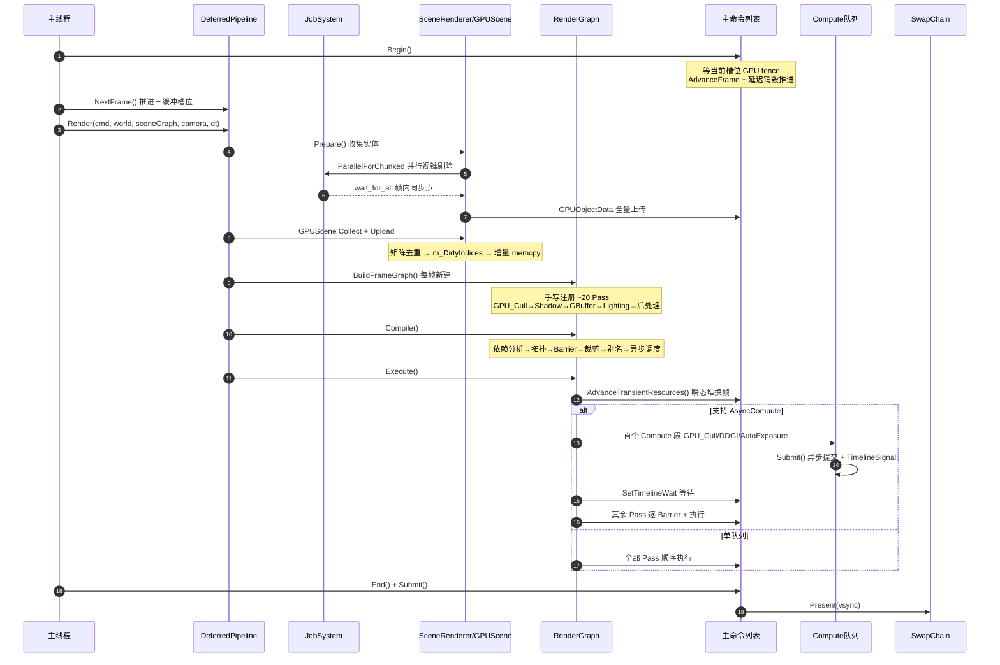

---

## 11. GPU 资源延迟销毁时序

环形槽位（kSlots = 2 × kMaxFramesInFlight = 6）+ 每帧 GPU fence 确认后轮转并执行最老槽位的销毁 lambda。

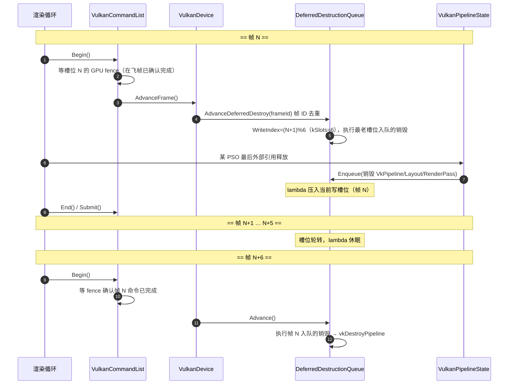

> 入队来源四类：缓存模式 PSO（最后引用释放）、SwapChain Framebuffer 重建、
> 离屏临时 Framebuffer（EndOffscreenPass 时 CB 尚未提交）、GPL 四段库（Shutdown）。
> Shutdown 时 WaitIdle 后 `FlushAll()` 全量执行。

---

## 12. PSO 预编译时序

后台 worker 线程预热 + GPL 四段库变体 + 帧内限流创建（目标：首次编译 ~50ms → 预热命中 ~2ms，GPL 变体 ~0.5ms）。

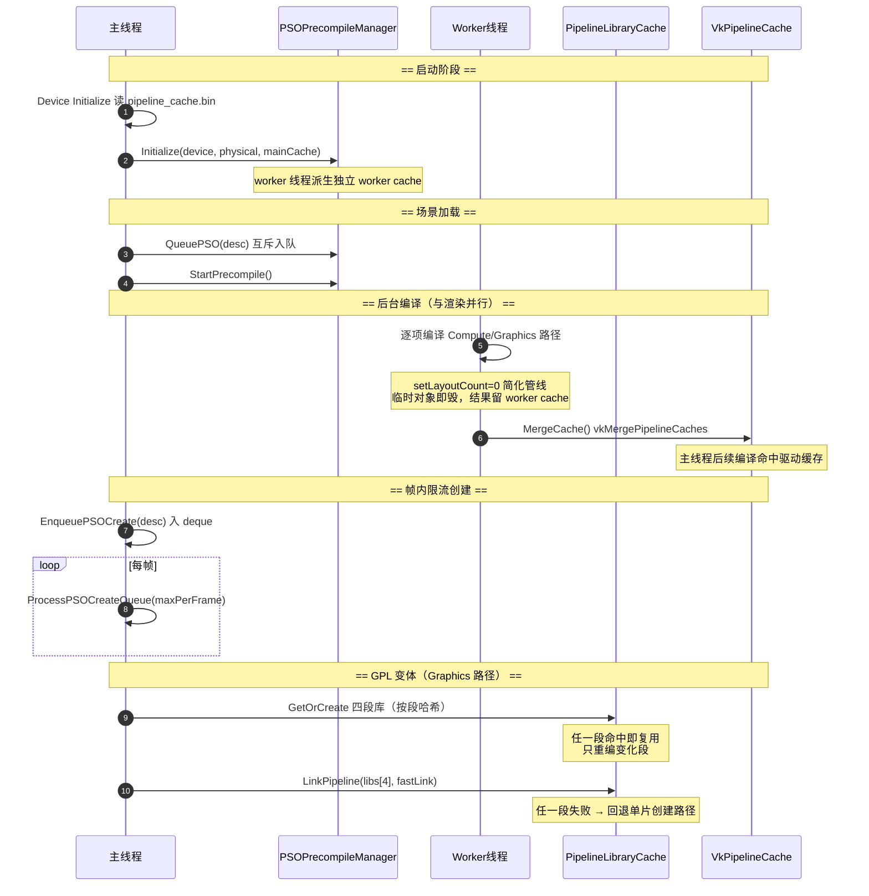

---

## 13. 瞬态资源时序

RenderGraph 别名分析 + 双缓冲 Heap（各 128MB）bump 分配。

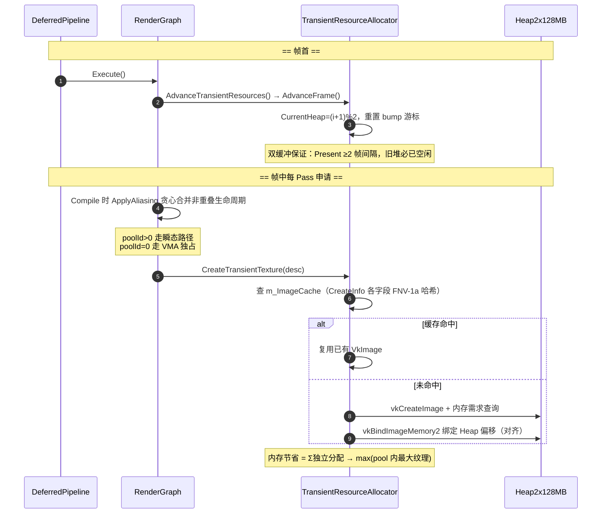

---

## 14. 路径追踪时序

Mode=3：阶段 A 参考 PT + 阶段 B ReSTIR DI 帧内流程。

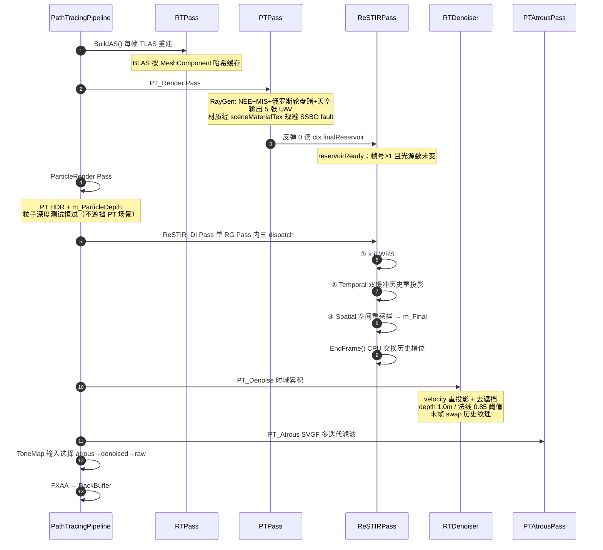

> 质量开关全部 CVar 热更新：`r.PT.SPP / Bounces / SkyIntensity / Denoise / ReSTIR / MIS /
> Roulette / Denoise.Blend / Atrous.* / ReSTIR.*`。
> STBN 蓝噪声 128×128×64 RGBA8 由 PT + ReSTIR 三 Pass 共用（初始化失败则禁用 RT）。

---

# 第四部分 · 可扩展性评估与债务

## 15. 扩展路径评估：加"新 X"要改几处

| 扩展路径 | 改动量 | 评价 |
|---|---|---|
| 新独立 Pass | 4-6 处（RG AddPass lambda） | 好，RG 自动推导依赖/Barrier/别名 |
| 新渲染管线（如全 PT 生产管线） | 5-6 处，全在应用层 | 差：模式切换是每个 Sample 里复制 if/else（02.Cube/06.GILab/07.Nanite 各一份），引擎无管线注册表 |
| 新光源类型（如管状光源） | **8-12 处** | **最痛**：CollectLights 序列化 switch 复制 3 份 + GPU 侧魔数编码 |
| 新材质模式 | 4-6 处 | 标志位方案，shader 分支随标志位增多 |
| 新阴影技术 | 2-3 处 | 最好，管线端阴影索引魔数化是隐患 |
| 新后端（D3D12/Metal） | **受阻** | void* 泄漏 + 描述符模型 Vulkan 化 |
| 新组件类型（仅运行时） | 4 处 ≈30 行 | 好，World::AddComponent/ForEach 天然支持 |
| 新组件类型（全链路：渲染+存盘+编辑器） | **8-12 处硬编码点** | 差：Render 模块 8 处逐类型 ForEach，漏改一处即静默不渲染 |
| 新资源格式 | 单个成本低，规模化路径断 | 无加载器注册表、无引擎级缓存、全同步 |
| 新 CVar | 1-2 处 | 好（RTQualityCVars/PTQualityCVars 集中声明） |

---

## 16. 值得保留的好模式

1. **RenderGraph**（RenderGraph.h）：pass 只声明 reads/writes，Barrier/别名/裁剪/异步计算调度自动，瞬态资源别名复用
2. **IRenderSubsystem 子系统框架**（Subsystem/RenderSubsystem.h）：Shadow/GI/AA/后处理均实现同一生命周期接口，管线可注入替换（已实现 6 种 GI），配 Null Object（GI_None/ShadowNone）
3. **IShadowTechnique + ShadowSystem 组合器**：新阴影技术 = 新类 + 注册一行
4. **RTEffectPass 基类**：RTShadow/AO/Reflection/GI 共享管线创建/SBT/屏障逻辑，子类只实现 Execute
5. **每 Pass 每帧上下文结构体**（RTExecuteContext/PTRenderContext/ReSTIRDispatchContext）：管线与 Pass 显式数据契约
6. **ShaderTypes.slang 单一数据源 + static_assert**：C++/Slang 共享 GPU 布局，尺寸不符编译期报错
7. **RHI 集中式生命周期**：DeferredDestructionQueue 环形槽位轮转（kSlots = 2 × kMaxFramesInFlight = 6）+ PSO 哈希缓存（历史 5 次 crash 修复记录）
8. **反射 + 序列化驱动编辑器属性面板**（骨架）

---

## 17. 关键问题清单（按优先级）

### P0-1：后端抽象纪律失守 —— Vulkan 泄漏到 Render/Editor

- `Engine/Render/GI/GI_RSM.cpp:5` 直接 `#include "Vulkan/VulkanResources.h"`（死依赖：该文件全文未使用任何 Vulkan 符号）
- `Engine/Editor/Editor/ImGuiIntegration.cpp:14` include `Vulkan/VulkanDevice.h`，用 `rhi::VulkanDeviceAccess::GetInstance/GetPhysical/GetDevice`（VulkanDevice.h:428 / VulkanDevice.cpp:1334-1349）取出 `VkInstance`/`VkDevice`；Editor 的 CMake 为此专门暴露后端头路径（Editor/CMakeLists.txt:23）
- RHI 接口自身有 `void*` 逃逸口：`GetNativeHandle()` 返回 VkImageView（Buffer.h:60）、`BeginOffscreenPass(void*...)`（CommandList.h:62）、`UpdateDescriptorSetWithImageView`、`GetBackendFormat()` 返回 VkFormat 数值；Types.h:53 注释自认 StageMask 常量"当前映射 Vulkan VkShaderStageFlagBits"
- **事实修正**：当前后端是 **Vulkan**（D3D12 代码已在 commit `5c62523` 删除），`Backend` 枚举里的 D3D12/Metal/WebGPU 只是占位
- **后果**：加 D3D12/Metal 后端时，GI_RSM 和 ImGuiIntegration 直接编译失败；`BeginOffscreenPass` 等泄漏点需逐处后端化

### P0-2：Scene 组件层反向依赖 RHI —— 数据层被 GPU 类型污染

- `MeshComponent.h:4,94-95` 直接持有 `unique_ptr<rhi::IRHIBuffer>`，Skybox/Particle 组件同样（Skybox 持 `unique_ptr<IRHITexture>`/`IRHISampler`，Particle 持 bindless 纹理句柄）；Scene/CMakeLists.txt:98 链接 RHI
- **后果**：ECS 无法脱离 GPU 复用（服务器模拟、离线烘焙、headless 测试全不可行）；组件生命周期与 GPU 资源纠缠
- 正确做法：组件存 CPU 数据 + 句柄，GPU 缓冲归 Render/Asset 层持有

### P0-3：序列化链路"半残" —— 属性已能存盘，反序列化仍靠硬编码名字表

- `HE_REGISTER_PROPERTY` 已在 SceneReflect.cpp（89 处）/ AgentReflect.cpp（4 处）/ PhysicsReflect.cpp（11 处）共 **104 处**调用（宏定义见 ReflectionMacros.h:54）；`SceneSerializer::Save` 走 `reflect::ForEachProperty`（SceneSerializer.cpp:64-66）逐属性写入，**.hescene 存盘不再丢属性值**
- 仍"半残"的一侧在 Load：`ClassInfo::factory`（ReflectionAPI.h:66，宏在 ReflectionMacros.h:49 自动生成）**无任何消费方**——反序列化靠 SceneSerializer.cpp:130-138 / LevelLoader.cpp:45-54 两份名字 if-else，且 SceneSerializer 只覆盖 8 种组件类型，其余类型数据直接跳过（`p+=ds; continue`）
- 类型分派表复制了 3 份（Archive.h:72-83 / SceneSerializer.cpp:27-37 / LevelLoader.cpp:28-38），加一个属性类型要改 3 处；已注册的 `u8` 属性（`DecalComponent::blendMode`、`CollisionComponent::shape`）不在任何一份分派表里 → 静默不存
- 好消息：基础设施齐全，接线成本低

### P1：全局设备指针 + 应用层样板复制

- `rhi::GetDevice()` 裸全局（RHIBase.cpp:7），Scene/Render 到处取，多设备/多上下文/单测不可行
- 渲染模式切换链（02.Cube.cpp:1229-1276 的 `cvPipelineMode` 分派）在 3 个 Sample 里各复制一份（06.GILab.cpp:925-932 / 07.Nanite.cpp:996-1003 的 `g_PipelineMode` 开关），`r.Pipeline.Mode` 只定义在应用层（02.Cube.cpp:76）而非引擎；管线注册表/工厂缺失
- Sample 层 ~50% 样板重复：配置解析、相机主循环、skybox、stb_image 纹理加载各复制一份；01.Triangle 还链接了 Editor（复制粘贴事故）
- Core 缺口：无输入/时间/文件系统封装，glfwGetKey 直接散落在 Sample

### P2：Render 层细节债

- `LightingPass::Render` 曾以 **20+ 裸指针参数**扩散（"新效果→新参数"）；现已收敛为 `LightingInputs` 结构体（LightingPass.h:129-130）——此处债务已还，但结构体本身仍随新 GI 源增长
- 三缓冲 SSBO 在 3 条管线各声明一份（ForwardPipeline.h:158-163 / DeferredPipeline.h:204-207 / PathTracingPipeline.h:132；原第 4 处 HybridRTPipeline.h:164 已随该类于 2026-09 删除），创建代码同构复制；SSBO 完全绕过 RenderGraph（依赖单一队列提交序，ReSTIRPass.h:43 自认）
- 魔数：阴影索引硬编码 `GetShadowMap(4)`（DeferredPipeline_FrameGraph.cpp:216）、物理模式用 `positionRange.w < 0` hack、`static bool firstFrame` 函数级静态变量（DeferredPipeline_FrameGraph.cpp:88）
- 两个裸 `static int32_t` 未走 CVar（DeferredPipeline_FrameGraph.cpp:31,34）；RT 着色器（.rgen/.rchit）不触发热重载（ShaderHotReload.cpp:67-86 只认 vert/frag/comp）

---

## 18. 改进建议（按投入产出排序）

1. **① 先还 P0-2**：把 MeshComponent 的 GPU 缓冲上移到 Render 侧资源管理器，组件只留路径/句柄——收益最大，同时消除"8 处逐类型 ForEach"的根因之一（组件实现统一 Renderable 接口后枚举自然收敛）
2. **② 封住后端泄漏**：GI_RSM 的下沉调用补进 RHI 接口；ImGuiIntegration 全走 RHI 已有的 CreateImGui* 虚函数；void* 接口逐个换强类型抽象——这是未来 D3D12 的必经之路
3. **③ 打通序列化**（成本最低、见效快）：SceneSerializer::Load 改用 ClassInfo::factory 替代 if-else（属性注册已就绪，只差工厂接线）；3 份类型分派表收敛到 Archive::SerializeObject 一处并补齐 `u8` 等已注册类型——完成后"新组件全链路"从 8-12 处降到 5 处
4. **④ 收编应用层样板**：引擎内加 PipelineRegistry（注册表 + 工厂，替代 Sample 里的模式 if/else）和 AppBase（设备/交换链/主循环/配置），8 个 Sample 去重，新增 Sample 成本从"复制 700 行"降到"继承一个基类"
5. **⑤ 抽公共渲染组件**：3 份 CollectLights switch 抽成单一 LightSerializer；三缓冲 SSBO 封装成可复用类（LightingPass 参数收敛为上下文结构体一条已由 `LightingInputs` 完成）

---

## 19. 结论

**架构骨架是健康的**——分层单向无环、接口化程度高、无 god class，这个规模的引擎该有的抽象大多都有；**但存在两个结构性硬伤**（Vulkan 泄漏到业务层、场景组件与 GPU 资源职责混叠）和一批"扩展成本随类型数量线性增长"的样板代码点，且反射驱动的自动化只完成了一半。

1. **无独立渲染线程**：渲染提交全在主线程；并行来自四处局部点 —— JobSystem 视锥剔除、
   Forward 多线程命令录制（≤8 Secondary CB）、RenderGraph AsyncCompute（GPU 侧）、
   PSO 预热 worker 线程 + Shader 热重载监听线程。
2. **无 god-class Renderer**：3 个平行管线类（Forward/Deferred/PathTracing；原 HybridRT 已于 2026-09 删除）继承
   `IRenderPipeline`，由 CVar `r.Pipeline.Mode` 切换；Deferred 为最完整主管线（~20 Pass）。
3. **帧编排 = 每帧新建 RenderGraph**：手写注册序 + 自动拓扑排序/Barrier 推导/死 Pass 裁剪/
   别名分析（瞬态内存池）/异步调度；首个 Compute 段走独立队列 + Timeline Semaphore 同步。
4. **GPU 场景三层 SSBO**：GPUObjectData(208B) 每帧全量、GPUSceneObject(128B) 矩阵去重后
   脏标记增量、u_Materials(112B) 材质 ID 去重后重建式上传（bindless SSBO，binding 30）。
5. **GPU 资源生命周期中枢**：VulkanDevice 值组合 6 个子系统 —— 延迟销毁队列（环形槽位 kSlots=6 +
   帧围栏确认）、PSO 哈希缓存+共享引用、GPL 四段库（变体 ~0.5ms）、后台预编译（~50ms→~2ms）、
   瞬态分配器（双 128MB Heap bump 分配）、VMA。
6. **阴影 = 双层策略**：外层 IShadowSystem（None/Traditional/RayTraced）+ 内层 IShadowTechnique
   （CSM 3 级联 2048² / Point Cubemap 512² / Spot 1024² / RectLight 1024²）；软硬阴影由采样侧 PCF 决定。
7. **路径追踪（Mode=3）**：阶段 A PTPass（NEE+MIS+俄罗斯轮盘赌，5 UAV 输出）→ 阶段 B
   ReSTIRPass（Init/Temporal/Spatial 三 dispatch，PT 反弹 0 读上帧 reservoir）→ RTDenoiser
   时域累积 → PTAtrousPass SVGF 滤波；STBN 蓝噪声共用。
8. **ECS + 反射 + 序列化闭环**：World 按 type_index 分桶存组件，HE_COMPONENT 宏注入
   ClassInfo（FNV-1a 哈希），.hescene 二进制经 BinaryArchive 按反射属性流存取，编辑器
   Undo 走 PropertyChangeCommand lambda 对。
9. **单例约束**：全局单例仅 5 处 —— RHI g_Device、JobSystem::s_Instance、MallocAllocator、
   TypeRegistry、AI 的 AIModule（s_Scheduler / s_Device）；其余全部组合注入，EditorApp 是唯一"全知"应用编排者。
10. **句柄三元化**：资源 = unique_ptr<IRHI*>、描述符集/Fence = u64 索引、跨模块图像视图/DGC = void*。

> 分层正确、接口有章法、但自动化不彻底——**加新渲染特性（Pass/阴影/着色器）的路径已经打通且成本可控**（历史已验证 4 次），主要债务集中在三处：后端抽象纪律（Vulkan 泄漏）、组件与 GPU 资源耦合、反射序列化半成品。这三处不还，D3D12 后端、多设备、完整编辑器存档三条扩展路径都会被卡住。

---

## 附录 A · 关键数据表

### A.1 线程模型

| 线程 | 数量 | 职责 |
|---|---|---|
| 主线程 | 1 | 游戏循环 + 全部渲染提交（无独立渲染线程） |
| JobSystem worker（Taskflow） | hardware_concurrency | 视锥剔除、多线程命令录制（≤8 Secondary CB） |
| PSO 预热 worker | 1 | 后台 PSO 编译 + 缓存合并 |
| ShaderHotReload 监听 | 1 | .slang 文件监听 + slangc 编译 |

### A.2 描述符集与绑定约定（与 ShaderTypes.slang 严格同步）

| 常量 | 值 | 用途 |
|---|---|---|
| kDescSetPerFrame | 0 | 每帧 UBO/SSBO 集 |
| kDescSetMaterial | 1 | 材质集 |
| kDescSetBindless | 2 | bindless 集（TLAS 等） |
| kBindingObjectData | 2 | GPUObjectData SSBO |
| kBindingLight | 1 | GPULight SSBO |
| kBindingShadowData | 3 | GPUShadowData SSBO |
| kBindingBindlessTextures | 5 | u_Textures[] 采样纹理数组（VARIABLE_COUNT） |
| kBindingBindlessSamplers | 6 | u_Samplers[] |
| kBindingLightGrid / kBindingLightIndexList | 7 / 8 | 聚集着色 |
| kBindingBindlessSSBO | 30 | u_SSBO[] / u_Materials[]（最大 binding 承载 VARIABLE_COUNT） |

### A.3 关键常量

| 常量 | 值 |
|---|---|
| kMaxFramesInFlight | 3（三缓冲；延迟销毁槽位 kSlots = 2 × 该值 = 6） |
| kSwapchainImageCount | 3 |
| kMaxColorAttachments | 8（GBuffer 用 7 + 深度） |
| kMaxMeshShaderStages | 3（Task/Mesh/Fragment） |
| kMaxPushConstantSize | 256B |
| MAX_OBJECTS / kMaxGPUObjects | 1024 / 2048 |
| MAX_LIGHTS / MAX_SHADOWS | 8 / 4 |
| kNumHeaps（瞬态分配器） | 2 × 128MB |

---

*本文档由全工程源码逐文件分析生成，类名/关系/行号经六个子系统探索代理交叉验证。
命名空间已确认为 `he` / `he::rhi` / `he::render` / `he::editor` / `he::asset` / `he::reflect` / `he::serialize`
/ `he::ai` / `he::physics`；2026-09-21 按当前源码基线校订。*
