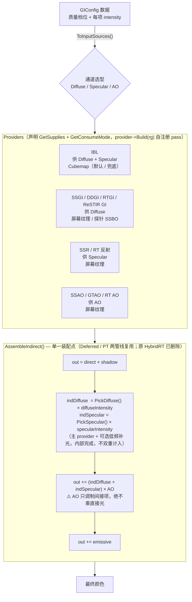

# HugEngine 全局光照（GI）本质、实现与架构优化

> **本文定位**：把「GI 是什么」「每种技术怎么实现」「系统现在怎么跑」「缺什么、怎么改」四件事收在一份文档里，
> 按**由概念到落地**分层组织，可供四类读者各取所需。
>
> **版本与时点**：正文中**算法与代码事实**对着当前 HEAD 的源码核对；
> **第四部分**（现状分析与优化方案）的原始盘点是 **2026-09-08**，并在 **2026-09-21** 做过一次全面状态核对 ——
> 该部分的每条缺陷都**紧跟标题标注现状**，请勿把"已修复项"读成当前缺陷。
>
> **引用约定**：形如 `Engine/Render/GI/GITypes.h:49` 的引用指向仓库内真实文件与行号（对着当前 HEAD 核对过）；
> 凡未能亲自在源码中复核的说法一律标注**（未能复核）**。第四部分中引用的「历史小节编号」（如 `§9.2-T`）
> 是原分析文档的编号，其中的字母子项已不在本合并文档中，保留仅为可追溯。
>
> **参数只写一次**：IBL 的 `32² / 128²×5 mip / 512²`、SSGI 的 `32 方向 / 16 采样 / 720 B UBO`、
> RSM 的三 MRT、DDGI 的 `4 系数 SH / 32 Fibonacci` 等参数此前被反复列出；本文把它们收敛到
> **算法层（第二部分）** 的"参数唯一出处"小节，其余小节一律改为引用。

---

## 阅读指引

本文由四份原始文档合并而成，四部分分别对应其中的一份，内容顺序为「由概念到落地」：

| 部分 | 回答的问题 | 对应原始文档的性质 |
|---|---|---|
| **第一部分 · GI 的本质** | 实现 GI 到底在做什么（数学 / 计算 / 工程） | 概念层：本质 + 统一实现模板 |
| **第二部分 · 实现原理（逐技术：算法与着色器）** | 每种 GI 技术的原理、生成流程、着色器算法、消费方式 | 算法层：逐技术代码级实现细节 |
| **第三部分 · 系统结构与运行机制** | 当前代码里 GI 系统的结构、数据模型、执行流程 | 系统层：面向"要改 GI / 要接新源 / 要排查不生效" |
| **第四部分 · 现状分析、缺口与架构优化方案** | 现有实现的正确性缺陷、优化空间、架构选型与落地方案 | 方案层：盘点 + 选型 + Phase 1–5 落地 |

**跨部分速查**：

- 只想理解"GI 为什么难、所有技术共通什么" → 第一部分；
- 想查某个技术的算法与参数 → 第二部分（参数定义在 `§2.x.1 / §2.x.2` 这类"参数唯一出处"小节）；
- 想改代码、接新源、排查"GI 不生效" → 第三部分（踩坑与契约在 §3.7、横切机制在 §3.9、扩展步骤在 §3.12）；
- 想知道"哪里还不对、下一步做什么" → 第四部分（缺陷状态在 §4.3、Phase 落在 §4.8）。

**相关文档**（不属本次合并范围，仍然独立存在）：

- `docs/已实现功能/Lumen设计与实现.md` —— Lumen（虚拟化几何 GI）的设计与实现，含统一降噪框架与后续框架类工作的任务记录（§10 / §11）；
- `docs/已实现功能/HugEngine GI架构与开发计划.md` —— 已归档的计划文档，其内任务全部完成；
- `docs/已实现功能/全路径追踪管线规划.md` —— 全路径追踪管线（离线参考模式）。

---

## 目录

- [第一部分 · GI 的本质](#第一部分--gi-的本质)
  - [1.1 一句话本质](#11-一句话本质)
  - [1.2 数学本质：截断一个无穷递归级数](#12-数学本质截断一个无穷递归级数)
  - [1.3 计算本质：全局耦合，无法局部求解](#13-计算本质全局耦合无法局部求解)
  - [1.4 工程本质：降维 / 缓存 / 复用 / 采样](#14-工程本质降维--缓存--复用--采样)
  - [1.5 统一的实现模板](#15-统一的实现模板)
  - [1.6 总结](#16-总结)
- [第二部分 · 实现原理（逐技术：算法与着色器）](#第二部分--实现原理逐技术算法与着色器)
  - [2.1 GI 架构总览](#21-gi-架构总览)
  - [2.2 GI_IBL —— 基于图像的光照](#22-gi_ibl--基于图像的光照)
  - [2.3 GI_SSGI —— 屏幕空间全局光照](#23-gi_ssgi--屏幕空间全局光照)
  - [2.4 GI_SSR —— 屏幕空间反射](#24-gi_ssr--屏幕空间反射)
  - [2.5 GI_RSM —— 反射阴影贴图](#25-gi_rsm--反射阴影贴图)
  - [2.6 GI_DDGI —— 动态漫反射全局光照](#26-gi_ddgi--动态漫反射全局光照)
  - [2.7 RTGIPass —— 硬件光线追踪 GI](#27-rtgipass--硬件光线追踪-gi)
  - [2.8 间接光在延迟光照中的集成（顺序总览）](#28-间接光在延迟光照中的集成顺序总览)
  - [2.9 技术对比总结](#29-技术对比总结)
  - [2.10 待实现技术](#210-待实现技术)
- [第三部分 · 系统结构与运行机制](#第三部分--系统结构与运行机制)
  - [3.1 一分钟总览](#31-一分钟总览)
  - [3.2 目录结构与关键文件](#32-目录结构与关键文件)
  - [3.3 数据模型（GITypes.h）](#33-数据模型gitypesh)
  - [3.4 Provider 抽象（IGIProvider.h）](#34-provider-抽象igiproviderh)
  - [3.5 帧内执行流程](#35-帧内执行流程)
  - [3.6 合成细节（DeferredLighting.frag.slang）](#36-合成细节deferredlightingfragslang)
  - [3.7 各源的契约、代价与踩坑](#37-各源的契约代价与踩坑)
  - [3.8 Forward 管线的 GI](#38-forward-管线的-gi)
  - [3.9 横切机制](#39-横切机制)
  - [3.10 调试与验证设施（Tools/gi/）](#310-调试与验证设施toolsgi)
  - [3.11 已知边界与未做项](#311-已知边界与未做项)
  - [3.12 扩展指南：新增一个 GI 源](#312-扩展指南新增一个-gi-源)
  - [3.13 术语与常量速查](#313-术语与常量速查)
- [第四部分 · 现状分析、缺口与架构优化方案](#第四部分--现状分析缺口与架构优化方案)
  - [4.0 时点说明：盘点时点与现状](#40-时点说明盘点时点与现状)
  - [4.1 现有 GI 技术清单](#41-现有-gi-技术清单)
  - [4.2 各技术现状要点](#42-各技术现状要点)
  - [4.3 优化建议（逐条状态标注）](#43-优化建议逐条状态标注)
  - [4.4 建议的落地顺序](#44-建议的落地顺序)
  - [4.5 工业界 GI 缺口对比](#45-工业界-gi-缺口对比)
  - [4.6 架构优化与选型方案](#46-架构优化与选型方案)
  - [4.7 方案修订：从"4 正交通道"到"2 加性间接项 + 单一装配点"](#47-方案修订从4-正交通道到2-加性间接项--单一装配点)
  - [4.8 Phase 1–5 落地方案](#48-phase-15-落地方案)

---

# 第一部分 · GI 的本质

> 本部分从数学、计算、工程三个层面阐述「实现 GI 的本质是什么」，并以 HugEngine 中已实现的 GI 技术
> （IBL / SSGI / SSR / RSM / DDGI / RTGI 六种，另有 Lumen 亦已落地）作为对照，
> 回答「所有 GI 技术背后共通的东西」。

## 1.1 一句话本质

实现 GI 的本质，可以概括为：

> **实时求解渲染方程（Rendering Equation）里的「间接光照项」——一个自身递归、全局耦合的积分方程。**

## 1.2 数学本质：截断一个无穷递归级数

渲染方程（Kajiya 1986）：

$$
L_o(p,\omega_o) \;=\; L_e(p,\omega_o) \;+\;
\int_{\Omega} f_r(p,\omega_i,\omega_o)\, L_i(p,\omega_i)\, \cos\theta_i \,\mathrm{d}\omega_i
$$

关键在于 **$L_i$ 本身不是已知量**——它等于「从 $\omega_i$ 方向能看到的某个点 $q$ 的出射光」，而 $q$ 的出射光又依赖 $q$ 自己的入射光……于是这是无限递归。它的形式解是 **Neumann 级数**（$T$ 为一次散射传输算子）：

$$
L \;=\; L_e \;+\; T L_e \;+\; T^2 L_e \;+\; T^3 L_e \;+\; \cdots
$$

- 直接光照 = $L_e$（零次反弹）；
- 环境光 / IBL ≈ 无穷次反弹被折叠成一张环境图；
- SSGI / RSM / RTGI = 只算 $T L_e$（一次反弹）；
- 路径追踪 = 用 Monte Carlo 一直采样到收敛。

所以「做几 bounce」不是工程参数的偏好，而是在**决定截断这个级数的第几项**。这解释了为什么实时 GI 几乎都停在 1 次反弹：级数项贡献递减，但每多一项代价翻倍。

## 1.3 计算本质：全局耦合，无法局部求解

光栅化是「局部着色」——一个像素只关心当前三角形 + 光源。GI 是「全局耦合」——**场景里任意两点的光都互相影响**：A 的颜色取决于 B，B 又取决于 A。

这就是 GI 难的根源：一个像素的颜色依赖**整个场景**的几何与材质。它不再是单个 shader 能独立算完的量，而是必须对整个光场做全局处理。

## 1.4 工程本质：降维 / 缓存 / 复用 / 采样

因为全局耦合算不动，所有实时 GI 都在做同一件事——**把「从某个方向来的光」提前算好、压缩、存起来，查询时重建**。四种核心手法，全部能在 HugEngine 里找到对应：

| 手法 | 思想 | HugEngine 对应 |
|---|---|---|
| **缓存 + 复用** | 把环境光/空间光预积分成纹理，查表代替重算 | IBL 的三张图、DDGI 探针、RSM 的 VPL |
| **降维** | 把 5D 光场压缩：SH 是角度降维，irradiance 把方向积分掉 | DDGI 的二阶球谐（band 0/1，系数量见 §2.6.2）|
| **采样替代积分** | Monte Carlo 采样逼近积分，而非解析求积 | RTGI 的半球采样、路径追踪 |
| **复用屏幕信息** | 把深度缓冲里已渲染的几何当作场景可见子集 | SSGI / SSR |

## 1.5 统一的实现模板

把上面所有技术抽象一下，实现任何 GI 都是在回答三个问题：

1. **缓存什么**（缓存形式）：辐照度 cubemap？SH 系数探针？VPL 列表？屏幕像素？
2. **怎么填充缓存**（采样/积分策略）：半球卷积？重要性采样？光追采样？
3. **怎么查询重建**（消费方式）：直接采样？三线性插值？Ray March？

举两个例子对照：

- **DDGI** = 缓存「空间各点的入射光方向分布（SH）」+ 用「沿 Fibonacci 球面方向取 Screen Probe / 光追 march / RSM / IBL 的辐射度」填充 + 用「三线性插值 + SH 评估（含 Lambert 卷积）」查询。
- **IBL** = 缓存「天空盒各方向的预积分光」+ 用「GGX 重要性采样卷积」填充 + 用「按 roughness 选 mip 采样」查询。

## 1.6 总结

**GI 的本质是在无法解析求解全局光传输方程的前提下，为「间接光」选一个足够低频的缓存形式，用一个廉价的采样策略把它填满，再在着色时高效地插值重建。**

所有「技术」的差异，只是这三个选择的不同组合。而「低频」是关键：间接光变化平滑，所以能被 SH、低分辨率 cubemap、探针网格这些粗粒度结构捕捉——这正是实时 GI 成立的物理依据。

---

# 第二部分 · 实现原理（逐技术：算法与着色器）

> 本部分逐项分析 HugEngine 中每种 GI 技术的实现细节与底层原理，涵盖光栅化路径的 GI 子系统与硬件光线追踪路径。
> 各项技术的参数在对应小节的「**参数唯一出处**」处给出，第三、四部分引用而不重复。

## 2.1 GI 架构总览

HugEngine 的 GI 分两套并行的体系。

### 2.1.1 光栅化路径 —— 统一 GI 子系统

所有光栅化 GI 技术都继承自统一接口 `IGlobalIllumination`（`Engine/Render/GI/GlobalIllumination.h`），该接口继承 `IRenderSubsystem`，在子系统生命周期（`Initialize` / `Update` / `Render` / `Bind` / `OnResize`）之上扩展了 GI 特有能力：

- **模式/质量切换**：`GIMode` + `GIQuality` 枚举；
- **间接光纹理暴露**：`GetIndirectDiffuseTexture()` / `GetIndirectSpecularTexture()` 供 PBR Shader 采样；
- **调试统计**：`GIDebugData` 供 ImGui 面板展示。

```cpp
// Engine/Render/GI/GlobalIllumination.h:14 —— GI 模式枚举（覆盖长期路线图）
enum class GIMode : u8 {
    None    = 0,   // 无 GI（仅直接光照）
    IBL     = 1,   // 基于图像的光照
    SSGI    = 2,   // 屏幕空间 GI
    VXGI    = 3,   // 体素锥追踪 GI（仅占位，未实现）
    DDGI    = 4,   // 动态漫反射 GI（探针网格 + SH）
    ReSTIR  = 5,   // 重采样 GI（仅占位，未实现）
    RSM     = 6,   // 反射阴影贴图 GI
};
```

**实际落地为 `.cpp` 实现的类**（`Engine/Render/GI/`）：

| 类 | GIMode | 状态 |
|---|---|---|
| `GI_None` | None | 空实现（Null Object，默认关闭）|
| `GI_IBL` | IBL | ✅ 已实现 |
| `GI_SSGI` | SSGI | ✅ 已实现 |
| `GI_SSR` | SSGI | ✅ 已实现（`GI_SSR.h:33` 的 `GetMode()` 复用 SSGI）|
| `GI_RSM` | RSM | ✅ 已实现 |
| `GI_DDGI` | DDGI | ✅ 已实现 |

`GIMode` 中**没有独立的 SSR 项**，这也是 `GI_SSR::GetMode()` 复用 `GIMode::SSGI` 的原因（`Engine/Render/GI/GI_SSR.h:33`）。

### 2.1.2 硬件光线追踪路径

独立于上述接口，位于 `Engine/Render/RT/`，继承 `RTEffectPass`：

- `RTGIPass` —— RT 间接漫反射（见 §2.7）；
- `RTReflectionPass` / `RTAOPass` —— RT 反射 / RT 环境光遮蔽（间接光照相关效果）。

> 注意：`GIMode` 枚举中预留的 `VXGI`（体素锥追踪）与 `ReSTIR` **尚无实现类**，`Engine/Render/RT/ReSTIRPass.h:34`
> 实现的是 ReSTIR **直接光照（DI）** 时空重采样，非 GI。

---

## 2.2 GI_IBL —— 基于图像的光照

**实现文件**：`Engine/Render/GI/GI_IBL.cpp`、`Engine/Render/GI/GI_IBL.h`
**着色器**：`Engine/Shader/Shaders/GI/IBL_Irradiance.frag.slang`、`IBL_Prefilter.frag.slang`、`IBL_BRDF_LUT.frag.slang`

### 2.2.1 原理：Split-Sum 近似（参数唯一出处）

PBR 的镜面 IBL 积分（着色器里 $N\!\cdot\!L$、$N\!\cdot\!V$ 记作 `NdotL`、`NdotV`）：

$$
L_{\mathrm{spec}} \;=\; \int_{\Omega} L_i(L)\;
\frac{D\,F\,G}{4\,(N\!\cdot\!L)(N\!\cdot\!V)}\,(N\!\cdot\!L)\;\mathrm{d}\omega
$$

直接实时计算不可行，HugEngine 采用 UE4 的 **Split-Sum（分裂求和）近似**，把积分拆成两个可预计算的独立部分相乘：

$$
L_{\mathrm{spec}} \;\approx\; F_{\mathrm{prefilter}}(r)\;\times\;B(N\!\cdot\!V,\;r)
$$

（$F_{\mathrm{prefilter}}$：预滤波环境贴图，按 roughness $r$ 选取对应 mip；$B$：BRDF 积分查找表。）

其中漫反射部分用一张低分辨率的辐照度图（`Irradiance Map`）近似。因此 `GI_IBL` 从天空盒 Cubemap 预生成三张图：

| 纹理 | 分辨率 | 用途 |
|---|---|---|
| Irradiance Map | 32×32 Cubemap（1 mip）| 漫反射辐照度 |
| Prefilter Map | 128×128 Cubemap（5 mip）| 各 roughness 下的预滤波镜面反射 |
| BRDF LUT | 512×512 RG16F 2D | Split-Sum BRDF 积分查找表 |

分辨率与 mip 数在代码中的定义处：`Engine/Render/GI/GI_IBL.h:91-93`（`kIrradianceRes = 32`、`kPrefilterRes = 128`、`kPrefilterMips = 5`），
BRDF LUT 为 512×512 RG16F（`GI_IBL.cpp` 的纹理创建；未能复核具体行号中的格式常量）。

> **本文其余部分提到 IBL 的三张图时，一律指本节这张表。**

### 2.2.2 生成流程

`GI_IBL::Render()` 用**光栅化全屏三角形 + 逐面 offscreen pass**（无需 Compute Shader），仅在天空盒变化（脏标记 `m_Dirty`）时重生成：

1. **辐照度图**：遍历 6 个面，每面渲染一次全屏三角形；
2. **预滤波图**：遍历 5 个 mip × 6 个面，`roughness = mip / 4`；
3. **BRDF LUT**：渲染一次 2D 全屏三角形。

合计 **37 个 offscreen pass**（辐照度 6 + 预滤波 5×6 + BRDF LUT 1）。

```cpp
// Engine/Render/GI/GI_IBL.cpp:319-323 —— 预滤波逐 mip 渲染，roughness 与 mip 线性映射
for (u32 mip = 0; mip < kPrefilterMips; ++mip) {
    u32 mipRes   = kPrefilterRes >> mip;  // 128, 64, 32, 16, 8
    pc.roughness = static_cast<float>(mip) / static_cast<float>(kPrefilterMips - 1);
    for (u32 face = 0; face < rhi::kCubemapFaceCount; ++face) {
        void* mipView = m_Device->CreateTextureMipStorageView(m_PrefilterMap.get(), mip, face);
        // ... BeginOffscreenPass → Draw(3) 全屏三角形
    }
}
```

辐照度图的逐面 offscreen pass 在 `GI_IBL.cpp:288-292`（`BeginOffscreenPass(faceView, …, kIrradianceRes, kIrradianceRes, nullptr)`）。

### 2.2.3 Shader 算法细节

**（1）辐照度卷积** —— `IBL_Irradiance.frag.slang`

对天空盒做半球方向黎曼和采样，累加 `cos(theta)` 加权（Lambertian），最后归一化：

```hlsl
// IBL_Irradiance.frag.slang:31-49 —— 球面坐标 → 切线空间 → 世界空间采样，
// cos(theta)·sin(theta) 为球面积分元
for (float phi = 0.0; phi < 2.0 * 3.14159265; phi += SAMPLE_DELTA) {
    for (float theta = 0.0; theta < 0.5 * 3.14159265; theta += SAMPLE_DELTA) {
        // ... 由 (phi, theta) 构造方向并采样天空盒
        irradiance += color * cos(theta) * sin(theta);  // sin(theta) 是球面积分元
        sampleCount++;
    }
}
irradiance = irradiance * 3.14159265 / float(sampleCount);  // π/N 归一化
```

采样步长 `SAMPLE_DELTA = 0.05`（`IBL_Irradiance.frag.slang:17`），对 32×32 的低频辐照度图足够。

**（2）预滤波环境贴图** —— `IBL_Prefilter.frag.slang`

用 **GGX 重要性采样**（`SAMPLE_COUNT = 256`，`IBL_Prefilter.frag.slang:23`）+ **Hammersley 低差异序列**减少方差：

```hlsl
// IBL_Prefilter.frag.slang:35-45 —— 低差异序列第二分量：Van der Corput 基数逆
float2 Hammersley(uint i, uint N) {
    return float2(float(i) / float(N), RadicalInverse_VdC(i));
}
// GGX 重要性采样（a = roughness²），把采样方向集中到 specular 波瓣内
float3 ImportanceSampleGGX(float2 Xi, float3 N, float roughness) {
    float a = roughness * roughness;
    float cosTheta = sqrt((1.0 - Xi.y) / (1.0 + (a * a - 1.0) * Xi.y));
    // ... 由微面半程向量 H 推出采样方向 L
}
```

每个 mip 用更大的 roughness（采样方向更分散），从而实现对模糊反射的分级表示。

**（3）BRDF LUT** —— `IBL_BRDF_LUT.frag.slang`

横轴 `NdotV`、纵轴 `roughness`，预计算 Split-Sum 的 BRDF 部分，输出 `R=scale(DFG1)`、`G=bias(DFG2)`：

```hlsl
// IBL_BRDF_LUT.frag.slang —— IBL 用的 Smith 几何项（k 的取法见 §4.3 第 1 条与 §4.2）
// 2026-09 画质阶段 0 修正：k 由 roughness⁴/2 改回 Karis/UE4 的 roughness²/2
float G_Smith(float NdotV, float NdotL, float roughness) {
    float a = roughness * roughness;
    float k = a * 0.5;      // a = roughness² ⇒ k = roughness²/2（与直接光的 (r+1)²/8 不同，勿混用）
    float G1V = NdotV / (NdotV * (1.0 - k) + k);
    float G1L = NdotL / (NdotL * (1.0 - k) + k);
    return G1V * G1L;
}
// 积分：A += (1-Fc)·G_Vis, B += Fc·G_Vis, Fc = (1-VdotH)^5（Fresnel-Schlick）
```

> **注意**：`a = roughness * roughness` 之后再取 `k = a * a * 0.5`，展开即 $k = \mathrm{roughness}^4/2$；
> 这比 Karis / UE4 IBL 的标准 $k = \mathrm{roughness}^2/2$ 多平方了一次。原始分析已把它标为**存疑点**，
> 详见 §4.2 与 §4.3 的状态标注。

### 2.2.4 消费方式

在延迟光照 shader 中，`envBRDF` 采样一次同时服务直接光的多重散射能量补偿和 IBL 镜面项。IBL 的漫反射与镜面分别由 `SampleDiffuseSource(GISOURCE_IBL, …)` 与 `SampleSpecularSource(GISOURCE_IBL, …)` 产出，作为层栈里的普通源参与归一化合成：

```hlsl
// DeferredLighting.frag.slang:210-237 —— IBL 漫反射 + 镜面反射
// 漫反射：辐照度图存 E/π，已含 kD 与接收面 albedo
return kD * u_IrradianceMap.Sample(u_IBLSampler, N).rgb * albedo * iblIntensity;
// 镜面：预滤波图按 roughness 选 mip，再乘 Split-Sum 的环境 BRDF
return u_PrefilterMap.SampleLevel(u_IBLSampler, R,
           roughness * (kGPUPrefilterMips - 1.0)).rgb
     * (F * envBRDF.r + envBRDF.g) * iblIntensity;
```

---

## 2.3 GI_SSGI —— 屏幕空间全局光照

**实现文件**：`Engine/Render/GI/GI_SSGI.cpp`、`Engine/Render/GI/GI_SSGI.h`
**着色器**：`Engine/Shader/Shaders/GI/SSGI.frag.slang`

### 2.3.1 原理

屏幕空间间接漫反射：对每个像素在**法线半球内采样 $N$ 个方向**，沿方向在深度缓冲中做可见性检测，把可见采样点处的**入射辐射度** $L_{\mathrm{in}}$（着色器里记作 `L_in`）按余弦加权平均累加：

$$
\frac{E}{\pi} \;\approx\; \frac{\sum_i L_{\mathrm{in},i}\,\cos\theta_i}{\sum_i \cos\theta_i}
$$

因为 $\int_{\Omega} \cos\theta \,\mathrm{d}\omega = \pi$，该估计量**精确等于 $E/\pi$**（归一化常数是解析值，不需要经验增益标定）。$L_{\mathrm{in}}$ 取自**前帧 HDR**（`GIRadianceHistory`），既解决因果（本 pass 排在 Lighting 之前）又构成多次弹射的时域反馈。这是一种廉价的单次反弹近似，只能利用屏幕内可见信息。

### 2.3.2 采样核与参数传递（参数唯一出处）

**采样核**：CPU 侧用固定种子（`gen(42)`）预生成 32 个半球方向（`kSSGIKernelSize = 32`），并按索引距离分级（`scale = mix(0.1, 1.0, i^2 / N^2)`），实现近密远疏；实际使用的采样数由 `sampleCount` 决定（默认 **16**）；半径默认 **1.0**（`Engine/Render/GI/GI_SSGI.h:64-65`）：

```cpp
// Engine/Render/GI/GI_SSGI.cpp:21-36 —— 半球采样核生成（半径按索引平方分级）
static constexpr u32 kSSGIKernelSize = 32;
static void GenSSGISamples(std::vector<float4>& kernel, int count) {
    std::default_random_engine gen(42);   // 固定种子：采样核跨帧稳定，避免闪烁
    // s = normalize(随机半球方向) * rnd；scale 使远端采样更分散
    float scale = float(i) / float(count);
    scale = glm::mix(0.1f, 1.0f, scale * scale);
    kernel[i] = float4(s * scale, 0);
}
```

**参数传递**：采样核（32×float4）+ 参数 + 逆投影 + 正投影 + 视图矩阵共 **720 字节**，超出 Vulkan push constant 的 256 字节上限，改用 **Uniform Buffer**（binding 3）传递：

```cpp
// Engine/Render/GI/GI_SSGI.cpp:48 与 :194-199 —— UBO 布局与尺寸
// 创建 Uniform Buffer（720 字节：kernel[32]×16 + params[16] + invProj[64] + proj[64] + view[64]）
struct alignas(16) {
    float4   k[32];        // 采样核（32 个方向）
    // ... 参数
    float4x4 invProj;      // 逆投影：clip→view，重建 view-space
    float4x4 proj;         // 正投影：view→clip，采样点投影到屏幕
    float4x4 view;         // 视图：world→view，把世界空间法线转到 view 空间
};
```

> **本文其余部分提到 SSGI 的采样核/采样数/半径/UBO 大小时，一律指本节。**

### 2.3.3 Shader 算法与可见性判据

**着色器算法**（`SSGI.frag.slang`）：

```hlsl
// SSGI.frag.slang:61-88 —— 深度重建 → TBN → 逐样本可见性 → 余弦加权平均
// 1. 深度重建 view-space 位置（用逆投影矩阵）
float4 cp = float4(uv*2.0-1.0, depth, 1.0);
float4 vp4 = mul(u_InvProj, cp); float3 viewPos = vp4.xyz / vp4.w;

// 2. GBuffer 法线是世界空间 → 用 u_View 转到 view 空间；再构造 TBN
float3 N = normalize(mul((float3x3)u_View, Nw));

// 3. 每个采样方向：切线空间样本经 mul(向量, TBN) 变到本空间，深度可见性检测
float3 sDir  = mul(u_Samples[i].xyz, TBN);
float3 sDirN = normalize(sDir);
float  cosT  = max(0.0, dot(N, sDirN));
float3 sPos  = viewPos + sDir * radius;
float4 off   = mul(u_Proj, float4(sPos, 1.0)); off.xyz /= off.w;   // 正投影求屏幕 UV
float2 suv   = off.xy*0.5 + 0.5;
float  sd    = u_Depth.Sample(u_PointSampler, suv).r;              // 采样点深度
float  sZ    = /* sd 经逆投影反算的 view-space z */;
if (sZ <= sPos.z + 0.01) {                                         // 可见（未被遮挡）
    float3 L_in = u_Radiance.SampleLevel(u_PointSampler, suv, 0).rgb;  // 前帧 HDR 辐射度
    num += L_in * cosT;  den += cosT;                              // 余弦加权平均
}
float3 indirect = (den > 0.0) ? (num/den) : float3(0.0);           // = E/π
return float4(albedo * indirect * u_Params.y, 1.0);                // 乘自身 albedo 与强度
```

**关键点**：可见性判据是 `sZ <= sPos.z + 0.01`（`SSGI.frag.slang:86`；view 空间朝 −Z，采样点未被遮挡 ⇔ 该像素保存的几何不比采样点更近）；`den == 0`（样本全被遮挡或落在下半球）时返回 0，不编数据。**方向**曾经写反（`sZ >= sPos.z-0.01`，只采被遮挡的样本），现注释留在 `SSGI.frag.slang:84-85`。

---

## 2.4 GI_SSR —— 屏幕空间反射

**实现文件**：`Engine/Render/GI/GI_SSR.cpp`、`Engine/Render/GI/GI_SSR.h`
**着色器**：`Engine/Shader/Shaders/GI/SSR.frag.slang`

### 2.4.1 原理

屏幕空间反射（Screen Space Reflection）：对每个像素计算反射向量，在深度缓冲中做 **Hi-Z 层次 march（屏幕空间 DDA，默认）**，命中处返回其 albedo 作为间接镜面反射；`useHiZ = false` 时回退到**线性 Ray Marching**（正式支持的回退路径）。

### 2.4.2 参数与回退路径（参数唯一出处）

默认参数（`Engine/Render/GI/GI_SSR.h:55-58`）：`maxSteps=64`、`stepSize=0.5`、`maxDistance=50`、`thickness=0.1`；
`autoScaleMarch = true`（`GI_SSR.h:69`）时由帧图按场景包围盒对角线推导：
`maxDistance = 对角线`、`thickness = 对角线×0.0025`、`stepSize = maxDistance/maxSteps`、`maxSteps ≥ 256`
（`GI_SSR.h:61-67` 的注释给出了推导与理由：米制默认值在 3720 单位宽的场景里几乎什么都找不到）。

矩阵（逆投影 + 正投影 + 视图）经 Uniform Buffer（binding 3）传递，push constant 只剩标量（32 B，含 `useHiZ` flag，见 `GI_SSR.cpp:193` 的注释）。

> **本文其余部分提到 SSR 的 march 参数时，一律指本节。**

### 2.4.3 Shader 算法与关键点

```hlsl
// SSR.frag.slang:141-238 —— Hi-Z 路径与线性回退路径
// Hi-Z 路径（u_UseHiZ>0）：先投影成屏幕段 s0→s1，再在段上做 DDA
//   屏幕参数 t 不是射线参数 → 必须做透视校正：
//   w(t) = w0·wT/((1−t)·wT + t·w0)，tau(t) = t·worldLen·w0/((1−t)·wT + t·w0)
//   rayPos = rayStart + R·tau，rayZ = (cA.z + tau·cR.z)/wq
//   射线点比该层最小深度更近 ⇒ 升到更粗层（大步）；被遮挡 ⇒ 回退更细层
float hiZ = u_HiZ.SampleLevel(u_HiZSampler, rpUV, level).r;
if (rayZ < hiZ) level = min(level + 1, kHiZMaxLevel);
else if (level == 0) { if (abs(rayPos.z - gZ) < thickness) { hit = 1; break; } }
else level--;

// 线性回退路径（u_UseHiZ==0）：逐步步进 + 同样的 view 空间厚度判据
if (abs(rayPos.z - rpZ) < thickness) { hitUV = rpUV; hit = 1; break; }
if ((rayPos.z - rpZ) * R.z > 0.0) break;   // 已越过该处几何 → 早退（不能记成命中）

// 命中：返回 albedo · 命中点 albedo · |N·R|
// 未命中：返回 float4(0,0,0,-1)
```

**关键点**：

- **透视校正**：屏幕段的参数 $t$ 不是射线参数，$1/w$ 才在屏幕空间线性。校正式为
  $w(t)=\dfrac{w_0 w_T}{(1-t)w_T+t w_0}$、$\tau(t)=\dfrac{t\,\text{worldLen}\,w_0}{(1-t)w_T+t w_0}$
  （$w_0/w_T/\text{worldLen}$ 即代码里的 `w0` / `wT` / `worldLen`）；
  不做校正时实测偏差可达命中容差的 100 倍以上（反射整片丢失）。代码与推导见 `SSR.frag.slang:141-170`；
- `thickness` 厚度带用于容忍浮点误差（世界空间量纲）；
- NR 与深度比较都在 **view 空间**，故 GBuffer 的**世界空间**法线必须先经 `u_View` 转成 view 空间再 `reflect`；
- 命中返回 `alpha = +1`、未命中返回 `alpha = -1`（`SSR.frag.slang:73/104/116/124/238` 多处返回 `float4(0,0,0,-1)`），合成端据此跳过无效源；
- 天空像素直接判无效（`SSR.frag.slang:73`）。

---

## 2.5 GI_RSM —— 反射阴影贴图

**实现文件**：`Engine/Render/GI/GI_RSM.cpp`、`Engine/Render/GI/GI_RSM.h`
**着色器**：`Engine/Shader/Shaders/GI/RSM_Generate.vert.slang`、`RSM_Generate.frag.slang`

### 2.5.1 原理

Reflective Shadow Maps：从**光源视角**渲染一次场景，把每个 texel 视为一个小的虚拟点光源（VPL），存储其**世界位置、法线、通量**。主渲染时，在 light space 采样这些 VPL，累加它们对当前像素的单次反弹漫反射贡献。本质是「光栅化单次反弹」的近似。

### 2.5.2 生成流程（参数唯一出处）

从方向光的 `lightViewProj` 渲染场景，使用**三 MRT** 输出三张纹理（`Engine/Render/GI/GI_RSM.cpp:117` 的 `psoDesc.colorAttachmentCount = 3`，一个附件一个量）：

| MRT | 格式 | 内容 |
|---|---|---|
| 0（`RSM_Position`）| RGBA16F | `worldPos.xyz` |
| 1（`RSM_Normal`）| RGBA16F | `worldNormal.xyz`（编码 [0,1]）|
| 2（`RSM_Radiance`）| RGBA16F | 该 VPL 的**出射辐射度** `L_v` |

RSM 图分辨率为 **512²**（`GI_RSM.cpp` 的纹理创建；与第三、四部分提到的 `512²×3` 同源）。

每个 VPL 写入 MRT2 的**出射辐射度**（Lambertian 面的一次反射）：

$$
L_v \;=\; \frac{\rho_v}{\pi}\,\bigl(\text{lightColor}\cdot\text{intensity}\bigr)\,\max(N\!\cdot\!L,\;0)
$$

其中 $\rho_v$ 是该 VPL 的漫反射率（着色器里由 push constant `vplAlbedo` 传入），$N$ 为 VPL 表面法线、$L$ 为指向光源的单位向量。

```hlsl
// RSM_Generate.frag.slang:66-69 —— VPL 出射辐射度 = albedo · 光源颜色 · 强度 · cos / π
float NdotL = max(dot(N, L), 0.0);
float3 radiance = vplAlbedo.rgb * light.colorIntensity.xyz
                * light.colorIntensity.w * NdotL * (1.0 / HE_PI);
output.vplRadiance = float4(radiance, 1.0);
```

**独立深度缓冲**：`GI_RSM` 使用自己的 D32 深度缓冲（`m_RSMDepth`，`GI_RSM.cpp:56-61` 创建、`:193` 作为 MRT pass 的深度附件），不再复用 CSM ShadowMap，避免布局冲突导致的白屏问题。

### 2.5.3 消费方式：半分辨率 RSM_Indirect

RSM 间接光由**共享的半分辨率独立 pass** `RSMIndirect`（`Engine/Shader/Shaders/GI/RSM_Indirect.frag.slang`）求值：

- **16 点 Poisson 盘** VPL 求和（`RSM_Indirect.frag.slang:53` 的 `RSM_VPL_COUNT = 16`，采样盘半径 `RSM_VPL_RADIUS_UV = 0.0125`）；
- 每次采样取 3 张 RSM 图（位置 / 编码法线 / VPL 辐射度，`RSM_Indirect.frag.slang:36-38` 的 binding 3/4/6）⇒ **16×3 = 48 次纹理采样**；
- 光源 VP 与 `RSM_Generate` **同一个**按场景包围盒拟合的固定光锥（`GI/RSMFrustum.h:52` 的 `FitRSMFrustumToBounds`）；
- VPL 采样缩放由该光锥的半宽推出（`GI/RSMFrustum.h:158` 的 `RSMVplScale`），不再是经验常数；
- 输出为半分辨率（`RSMIndirect::kDownscale = 2`，`Engine/Render/GI/RSMIndirect.h:63`）。

延迟光照 shader 只对该半分辨率结果做一次线性采样（binding 5）：

```hlsl
// DeferredLighting.frag.slang:221-222 —— RSM 作为 diffuse 层栈里的普通源
case GISOURCE_RSM:
    // RSMIndirect 已乘 vplScale（E/π），此处补接收面 albedo
    return u_RSMIndirect.Sample(u_IBLSampler, uv).rgb * albedo;
```

> **成本与历史**：这段求和在搬出来之前是 `DeferredLighting.frag.slang` 里的逐像素函数 ——
> **16 个 VPL × 2 张 RSM 贴图 = 32 次采样**；实测 Lighting 在漫反射层栈含 RSM 时 0.882 ms、
> 不含时 0.433 ms，该项独占约 0.45 ms，比 SSGI 还大（`Engine/Render/GI/RSMIndirect.h:15-18`）。
> 更早的形态是 **5×5 规则网格（25 点）**，改为 16 点 Poisson 盘的原因是规则网格在斜面上产生条纹伪影
> （`RSM_Indirect.frag.slang:47-49`）。这三个数字（25 / 32 / 48）对应**三个不同时期**，不要当成互相矛盾。

---

## 2.6 GI_DDGI —— 动态漫反射全局光照

**实现文件**：`Engine/Render/GI/GI_DDGI.cpp`、`Engine/Render/GI/GI_DDGI.h`
**着色器**：`Engine/Shader/Shaders/GI/DDGI.comp.slang`（探针更新）、`Engine/Shader/Shaders/RT_DDGI.slang`（探针查询共享库）

### 2.6.1 原理

Dynamic Diffuse GI：在场景中放置一个 **3D 探针网格**（默认按场景包围盒自动拟合），每个探针存储**二阶球谐（SH，band 0/1 共 4 系数）**表示的辐照度。每帧用 Compute Shader 对每个探针沿 Fibonacci 球面方向取辐射度 → SH 投影，并用时间混合收敛；主渲染时对包围点的 8 个最近探针做**三线性插值 + SH 评估（含 Lambert 卷积）**，得到平滑的间接漫反射。

### 2.6.2 探针数据结构与网格（参数唯一出处）

```cpp
// Engine/Render/GI/GI_DDGI.h:142-145 —— 每探针 4 个 float4（步骤 30 的 L5 升级：原 16 个）
static constexpr u32 kFloats4PerProbe = 4;
// [0..3]  SH 系数 band 0/1（4 个系数，各占一个 float4 的 .rgb）
```

网格字段默认 `gridX=8, gridY=4, gridZ=8`（共 256 探针）、`cellSize=3.0`、`origin=(-10,-2,-10)`（`GI_DDGI.h:107-109`）；但 `autoFitGrid = true`（默认，`GI_DDGI.h:130`）时由 `FitGridToBounds` 按场景包围盒覆盖：三轴共用同一格距，每轴探针数按自己的边长取 `ceil(size/cell)+1`，原点为包围盒最小角。`blendAlpha=0.85`（`GI_DDGI.h:110`）；`updateStride=1`（每帧全量更新，>1 时按相位分摊，`GI_DDGI.h:118`）。

**双缓冲**：`m_ProbeBuffer`（当前帧写入）+ `m_ProbeHistory`（上一帧历史），每帧 swap 用于时间混合。

### 2.6.3 探针更新算法（DDGI.comp.slang）

每个 Compute 线程处理一个探针（`[numthreads(64, 1, 1)]`，`DDGI.comp.slang:145`）：

1. **球面采样**：用 **Fibonacci 球面**生成 `numSamples` 个均匀分布方向（`GI_DDGI::kSamplesPerProbe = 32`，即 32 采样/探针，`GI_DDGI.h:88`），采样步长 `stepDist = cellSize * 0.4`（`DDGI.comp.slang:179`）；

```hlsl
// DDGI.comp.slang:79-83 —— Fibonacci 球面：单位球上均匀分布的第 i 个方向
float3 FibonacciSphere(int i, int n) {
    float phi   = acos(1.0 - 2.0 * (float(i) + 0.5) / float(n));
    float theta = 3.14159265359 * (1.0 + sqrt(5.0)) * float(i);
    return float3(sin(phi) * cos(theta), cos(phi), sin(phi) * sin(theta));
}
```

2. **辐射度来源（按优先级）**：Screen Probe（Lumen 的探针辐射度 SH，步骤 31）→ **光追 march**（`DDGI_Trace` 写入的 `u_TracedRadiance`，命中取命中点出射辐射度、未命中取 IBL 辐照度）→ **RSM 世界辐射度**（`u_RSMRadianceMap`，视角无关的单次反弹 VPL）→ **IBL 辐照度**（按方向采样，兜底）。**不再采样前帧 HDR**：屏幕空间来源受视锥限制（视锥外采样点被跳过 ⇒ 探针随相机变化），已改为世界空间、视角无关的来源；

```hlsl
// 兜底路径：按采样方向取 IBL 辐照度（世界空间、视角无关）
radiance = u_IBLIrradiance.SampleLevel(u_LinearSampler, dir, 0).rgb;
```

3. **SH 投影**：把辐射度投影到 **4 个 SH 系数（band 0/1）**，蒙特卡洛缩放因子 $\dfrac{4\pi}{N}\times\text{intensity}$；

```hlsl
// DDGI.comp.slang:72-76 —— 方向投影为 4 个 SH 系数（bands 0/1）
void SHBasis(float3 dir, out float sh[4]) {
    sh[0] = kSH_Y00;                                   // l=0: sqrt(1/4π)
    float3 b1 = SH_Band1(dir);                         // l=1: sqrt(3/4π)
    sh[1] = b1.y; sh[2] = b1.z; sh[3] = b1.x;          // l=1: m=-1,0,1
}
// 蒙特卡洛积分归一化 4π/N × 强度
float scale = (4.0 * 3.14159265359) / validSamples * u_Params.x;
```

4. **时间混合**：与上一帧历史 SH 系数 lerp（`blendAlpha=0.85`），抑制闪烁、加速收敛：

```hlsl
// DDGI.comp.slang:274-281 —— 时间混合（历史保留 85%）
float blendAlpha = u_Params.z;
if (historyValid && blendAlpha > 0.0) {
    sh[j].rgb = lerp(sh[j].rgb, hist.rgb, blendAlpha);
}
```

### 2.6.4 消费方式：三线性插值 + SH 评估

`RT_DDGI.slang` 提供共享查询库，被延迟光照与 RT GI 复用。网格参数**不再硬编码**，由 includer 声明 `u_DDGIGridOrigin` / `u_DDGIGridSize` cbuffer（与 `GI_DDGI::ProbeGridUniform` 前两个 float4 一致，见 `GI_DDGI.h:150-151`）：

```hlsl
// RT_DDGI.slang:43-92 —— 世界坐标 → 网格坐标 → 8 个最近探针三线性插值
float3 gridCoord = (worldPos - u_DDGIGridOrigin.xyz) / u_DDGIGridSize.w;   // .w = cellSize
// 遍历 8 个包围探针，权重 = (1-|dx-frac.x|)·(1-|dy-frac.y|)·(1-|dz-frac.z|)
// 每个探针读取 4 个 SH 系数，用 EvalDDGI_SH(sh, normal) 评估辐照度（A_l 卷积系数在评估端施加）
```

**Lambert 卷积在评估端施加**（`RT_DDGI.slang:25-38`）：`kDDGI_SH_A0 = 0.8862269254527580`、`kDDGI_SH_A1 = 1.0233267079464886`，`EvalDDGI_SH` 里 $E(n)=\sum_l A_l\,L_{lm}\,Y_{lm}(n)$，最后 `max(result, 0)` 做负值截断。

消费点（`DeferredLighting.frag.slang` 的 `SampleDiffuseSource(GISOURCE_DDGI, …)`）：

```hlsl
// DeferredLighting.frag.slang:212-216 —— EvalDDGI_SH 已施加 Lambert 卷积 A_l → 返回辐照度 E → 需补 albedo/π
return SampleDDGI(worldPos, N) * albedo * (1.0 / HE_PI);
```

### 2.6.5 前帧 HDR 辐射度：GIRadianceHistory

前帧 HDR 辐射度已收敛为共享组件 `GIRadianceHistory`（`Engine/Render/GI/GIRadianceHistory.{h,cpp}`），由帧图的 `CaptureRadiance` pass 在 Lighting 之后捕获一次（`DeferredPipeline_FrameGraph.cpp:1515`），只供声明了 `NeedsRadianceHistory()` 的源使用（当前为 SSGI 的 `L_in`，以及帧图对 `CaptureRadiance` 的门控，见 `DeferredPipeline_FrameGraph.cpp:1512`）；`GI_DDGI` 不再自持 `m_PrevHDR` 与下采样 pass。

---

## 2.7 RTGIPass —— 硬件光线追踪 GI

**实现文件**：`Engine/Render/RT/RTGIPass.cpp`、`Engine/Render/RT/RTGIPass.h`
**着色器**：`Engine/Shader/Shaders/RayTracing/RT_GI.rgen.slang`、`RT_GI.rchit.slang`、`RT_GI.rmiss.slang`

### 2.7.1 原理与 DDGI 的分工

硬件光追间接漫反射：对 GBuffer 有效像素（默认**每轴四分之一分辨率**，`RTGIPass.h:40` 的 `m_QuarterRes = true`；GI 为低频效果）在法线半球**余弦采样 N 条射线**，做**一次反弹**。ClosestHit 评估命中表面的出射辐射度；Miss 在 DDGI **不在漫反射层栈**时回退到 DDGI 探针查询（降级路径），否则只报告自己追踪到的部分。

**与 DDGI 的分工**（`RTGIPass.h`）：RT GI 覆盖**中距离（5–30m）**的精确间接光，DDGI 覆盖**远距离低频 GI**；二者都是漫反射层栈里的源，由合成端归一化加权（不再是无条件叠加）。

### 2.7.2 资源绑定与运行时参数

```cpp
// Engine/Render/RT/RTGIPass.cpp:25-32 与 :43-45 —— b0=TLAS, b1=输出, b2=GBDepth, b3=GBNormal,
// b4=材质纹理, b5=光源UB, b6=三角法线纹理, b7=DDGI探针SSBO(miss回退),
// b8=DDGI 探针网格参数 UBO（与 DeferredLighting 的 binding 6 同源）
static constexpr u32 kRTGIBindOutput     = 1;
static constexpr u32 kRTGIBindDepth      = 2;
static constexpr u32 kRTGIBindNormal     = 3;
static constexpr u32 kRTGIBindMaterialTex = 4;
static constexpr u32 kRTGIBindLights     = 5;
static constexpr u32 kRTGIBindNormalTex  = 6;
static constexpr u32 kRTGIBindDDGIProbes = 7;
static constexpr u32 kRTGIBindDDGIGrid   = 8;
```

```cpp
// Engine/Render/RT/RTGIPass.cpp:174-180 —— 运行时 CVar 热更新与 flags 位
pc.maxDistance  = std::max(cvRTGIMaxDist.Get(), 0.01f);  // GI 追踪范围（m，CVar 热更新）
pc.sampleCount  = std::clamp(cvRTGISPP.Get(), 1, 16);    // SPP（CPU 侧上限 16）
pc.flags        = (m_QuarterRes ? 1u : 0u)
                | (ctx.ddgiIsStackSource ? 2u : 0u)  // bit0=四分之一分辨率, bit1=DDGI 是层栈源
                | (ctx.furnace ? 4u : 0u);           // bit2=白炉
```

### 2.7.3 Shader 算法

**（1）RayGen** —— `RT_GI.rgen.slang`

```hlsl
// RT_GI.rgen.slang:93-147 —— 余弦权重半球采样（绕法线 N），SPP 由 shader 再夹到 1–8
uint n = max(1u, min(g_PC.sampleCount, 8u));
float3 dir = CosineSampleHemisphere(N, u);
RayDesc ray; ray.Origin = worldPos + N * 0.02; ray.TMax = g_PC.maxDistance;
TraceRay(g_TLAS, RAY_FLAG_NONE, 0xFF, 0, 0, 0, ray, payload);

if (payload.radianceT.a < 0.0) {
    // 源独立：DDGI 自己也在漫反射层栈里时 miss 贡献 0（否则 DDGI 信息被用两次）
    if ((g_PC.flags & 2u) == 0u)
        radiance += SampleDDGI(worldPos, dir) * (1.0 / 3.14159265);  // E → L 换算
} else {
    radiance += payload.radianceT.rgb;       // hit → 命中点出射辐射度
}
radiance /= float(n);
g_Output[idx] = float4(radiance, valid > 0 ? 1.0 : 0.0);
```

**（2）ClosestHit** —— `RT_GI.rchit.slang`

命中点评估出射辐射度（作为间接光来源）：

```hlsl
float3 N = LoadHitNormal(instanceID, primId, attr.barycentrics);      // 平滑法线
LoadHitMaterial(instanceID, albedo, metallic, roughness, emissive);   // 材质
float3 radiance = EvaluateHitRadiance(P, N, albedo, g_PC.lightCount); // 环境光 + 直接光源
payload.radianceT = float4(radiance, RayTCurrent());
```

> 命中点辐射度的实现已收敛到共享库 `Engine/Shader/Shaders/RT_HitCommon.slang` 的
> `EvaluateHitRadiance`（第三部分 §3.7.6 有量纲约定）。

**（3）Miss** —— `RT_GI.rmiss.slang`

未命中回退到程序化天空色（天光作为远距离间接漫反射来源），`a=-1` 标记未命中。

---

## 2.8 间接光在延迟光照中的集成（顺序总览）

`Engine/Shader/Shaders/Lighting/DeferredLighting.frag.slang` 是间接光（以及直接光）的最终消费点。**源的选择不再由 push constant 开关决定**：`rtDiffuseSource` / `rtSpecularSource` / `rtAOSource` 三个字段已随 Wave 1「按源 id 分派」移除（`DeferredLighting.frag.slang:86` 保留了这条说明注释），改为遍历 `GIBlendParams` UBO（binding 31）里的**通道层栈源数组**，按 `GISourceId` 分派采样。

> **遗留（已复核）**：三个 RT rgen 文件头部的注释仍在描述这两个已删除的开关，属于**过时注释、不影响逻辑** ——
> `RT_GI.rgen.slang:10`（"输出由 LightingPass 在 rtDiffuseSource=1 时采样"）、`RT_Reflection.rgen.slang:8`、
> `RT_AO.rgen.slang:9`。

合成顺序：

```hlsl
// DeferredLighting.frag.slang —— 集成顺序（Wave 1 层栈合成）
1. 直接光照（Clustered Shading 或线性回退）+ CSM/聚光阴影
2. color *= rtShadowFactor;                      // RT 阴影整体因子（rtShadowSource != 0 时，:416）
3. const float3 directColor = color;             // :447 记下直接光：AO 不作用于它
4. 间接漫反射：遍历 diffuse 通道层栈（IBL / DDGI / SSGI / Lumen / RSM / RTGI）
   num += SampleDiffuseSource(id,…) * w;  den += w;   // 权重来自 SourceWeight（用户权重 × 置信度）
   indirectDiffuse = (mode != 0) ? num/den : num;      // 归一化加权，无双重计数
   白炉：到此即 return directColor + indirectDiffuse
5. AO：遍历 ao 通道层栈（SSAO/GTAO/RTAO），只算遮蔽因子 → aoFactor
6. 间接镜面：遍历 specular 通道层栈（IBL / SSR / RT 反射 / Lumen），同构归一化
   SSR / RT 反射 / Lumen 先按 alpha 协议筛掉"本条无效"（alpha < 0）
7. color = directColor + (indirectDiffuse * giIntensity + indirectSpecular) * aoFactor;   // :536
   color += emissive;                              // 自发光最后加
8. 空中透视（大气消光 + 入射散射）
```

**AO 只作用于间接项**：直接光与自发光不乘 AO（`aoFactor = lerp(1, materialAO * aoVal, aoIntensity)` 只乘在 (间接漫反射 + 间接镜面) 上，`DeferredLighting.frag.slang:505`）。

**有效性协议（`alpha < 0`）**：屏幕空间与光追类源在"本条无效"（天空像素 / miss / 高粗糙度跳过）时返回 `float4(0,0,0,-1)`，合成端据此跳过该源（值不计入分子、**权重也不计入分母**）；缺了它，miss 的黑色会以全权重进入归一化、把环境反射压暗约一半。合成的唯一判定入口是 `SourceIsValid(id, uv)`（`DeferredLighting.frag.slang:185`）。

**置信度**：`SourceWeight(s, camCoverage, gridCoverage, camDist)`（`DeferredLighting.frag.slang:144`）= 用户权重 × 逐像素置信度（由 UBO 的 `confidence` 掩码按位给出）× 可选「距离让位」。屏幕覆盖位适用于 7 个源（SSGI/SSR/SSAO/GTAO/RTGI/RT 反射/RTAO），探针网格覆盖位只对 DDGI 置位（细节见 §3.3.4）。

> 量纲约定、三通道合成代码、白炉语义见 §3.6；各源在层栈里的契约与代价见 §3.7。

---

## 2.9 技术对比总结

| 技术 | 路径 | 反弹 | 覆盖范围 | 动态性 | 主要局限 |
|---|---|---|---|---|---|
| IBL | 光栅化 | 环境光 | 无限远（天空盒）| 仅天空盒变化时重生成 | 不响应局部动态物体 |
| SSGI | 光栅化 | 1 次 | 屏幕内 | 每帧实时 | 屏幕外信息缺失、有噪声 |
| SSR | 光栅化 | 1 次 | 屏幕内 | 每帧实时 | 屏幕外反射缺失、Ray March 有噪 |
| RSM | 光栅化 | 1 次 | 光源 POV | 每帧实时 | 无遮挡、VPL 密度受限 |
| DDGI | Compute | 多帧累积 | 探针网格体积 | 时间混合收敛 | 低频、光照变化有滞后 |
| RTGI | 硬件光追 | 1 次 | 场景全局 | 每帧实时 | 需硬件光追、SPP 低时有噪 |

---

## 2.10 待实现技术

根据 `GIMode` 枚举与路线图，以下 GI 技术**尚未实现**：

- **VXGI（体素锥追踪）**：3D Clipmap → Cone Tracing，`GIMode::VXGI` 仅占位；
- **ReSTIR GI**：`GIMode::ReSTIR` 仅占位；当前 `ReSTIRPass` 实现的是直接光照（DI）重采样（`Engine/Render/RT/ReSTIRPass.h:34`）。

> 相关规划见 `docs/已实现功能/全路径追踪管线规划.md`。
> 原文另引用了 `docs/未实现功能/全流程RayTracing渲染实施规划.md` —— **该路径在当前仓库中不存在（未能复核）**。

---

# 第三部分 · 系统结构与运行机制

> **本部分定位**：描述**当前代码**里 GI 系统的结构、数据模型、执行流程与各源的实现细节，
> 面向"要改 GI / 要接新 GI 源 / 要排查 GI 不生效"的开发者。
>
> 本部分只讲**现在是怎么实现的**，并把"实现细节背后的理由"与"已知边界"写清 —— 因为这些理由
> 大多是踩坑换来的，删掉它们就会重踩。文中所有数字与文件名都对着当前 HEAD 的代码；
> 凡"未实现/未做"的地方都显式标注。**算法参数不在此重列**，一律指向第二部分的"参数唯一出处"小节。

## 3.1 一分钟总览

GI 在这个引擎里不是"一条管线"，而是**一组估计量 + 一套统一的合成规则**：

```
                    ┌──────────────── 场景与相机 ────────────────┐
GBuffer(8 MRT) ──┬─▶ Shadow(CSM/点/聚/矩形) ──▶ AS_Build(TLAS) ─┐ │
（albedo/normal/  │                                            │ │
  worldpos/…/     ├─▶ RSM_Generate(三附件，见 §2.5.2) ─▶ RSM_Indirect │ │
  光照图键/深度） │      （光源视锥按场景包围盒拟合）  （半分辨率）│ │
                 │                                            ▼ │
                 ├─▶ 各 Provider 主 pass（帧图按注册表遍历）   │ │
                 │     · 屏幕空间：SSGI / SSR / SSAO·GTAO      │ │
                 │     · 探针：DDGI（可选 DDGI_Trace 硬件光追）│ │
                 │     · 光追：RTGI / RT 反射 / RTAO / RT 阴影 │ │
                 │     · 环境：IBL 烘焙（脏时）                │ │
                 │            ↓ 每个源各自附带降噪链（Aux pass）│ │
                 └──────────────▶ Lighting（全屏 PBR + 分层合成）◀┘
                                     ↓
                          HDR → 后处理 → ToneMap → 屏幕
```

三条设计主线：

1. **源（Source）= 一个估计量**：每个源只负责"我这份估计的间接光是多大"，不关心别人。
2. **通道（Channel）× 层栈（Stack）= 用户意图**：`漫反射 / 镜面 / AO` 三个通道各有一个
   源列表 + 权重；**归一化加权合成**保证"多开一个源不会变亮"。
3. **Provider = 执行单位**：帧图不写 `ShouldRunXXX`，而是遍历 Provider 注册表，问
   `NeedsPass(层栈)` 决定是否注册 pass；源自己声明输出到哪个通道、还需要哪些附属 pass。

## 3.2 目录结构与关键文件

| 位置 | 内容 |
|---|---|
| `Engine/Render/GI/GITypes.h` | **GI 数据模型**（RHI-free）：`GISourceId`、分类谓词、能力位、置信度位、`GISourceDesc` / `GIChannelStack`、`GIConfig`、`GIRegistry`（可用性判定 / `Degrade`）、REDUNDANCY 诊断、`ToPipelineCap` / `ToConfidenceMask` |
| `Engine/Render/GI/IGIProvider.h` | **Provider 接口**：`GetSourceId` / `Handles` / `GetPassKind` / `IsValid` / `NeedsPass` / `SyncToStack` / `NeedsRadianceHistory` / 通道输出 / 附属 pass 链 / `GetTimedPass` / `Render` / `PreBind(Aux)` |
| `Engine/Render/GI/GlobalIllumination.h` | `IGlobalIllumination` 旧接口（仅 `GI_IBL` 仍以它被帧图使用）+ `GIDebugData`（面板与耗时读数） |
| `Engine/Render/GI/GI_IBL.{h,cpp}` | 环境光烘焙（三张图的尺寸见 §2.2.1） |
| `Engine/Render/GI/GI_RSM.{h,cpp}` | RSM 光栅（三附件：世界位置 / 编码法线 / VPL 辐射度，见 §2.5.2） |
| `Engine/Render/GI/RSMFrustum.h` | RSM 光源正交视锥的**纯几何**拟合 + VPL 采样面积（可单测） |
| `Engine/Render/GI/RSMIndirect.{h,cpp}` | RSM 间接光的**半分辨率** VPL 求和（参数见 §2.5.3） |
| `Engine/Render/GI/GI_SSGI.{h,cpp}` | 屏幕空间漫反射（采样数/半径见 §2.3.2，可半分辨率） |
| `Engine/Render/GI/GI_SSR.{h,cpp}` | 屏幕空间反射（Hi-Z 层次 march + 线性回退，参数见 §2.4.2） |
| `Engine/Render/GI/GI_DDGI.{h,cpp}` | 探针网格 + 二阶 SH（表示与采样数见 §2.6.2 / §2.6.3） |
| `Engine/Render/GI/DDGITracePass.{h,cpp}` + `GIProbeGrid.h` | 探针射线的硬件光追 march（可关）+ 网格拟合的纯几何 |
| `Engine/Render/GI/GITiming.{h,cpp}` | 每源 GPU 时间戳（环形查询池，不阻塞读回） |
| `Engine/Render/GI/GIRadianceHistory.{h,cpp}` | 前帧 HDR 辐射度（SSGI 的 `L_in` 等消费者的共同输入，见 §2.6.5） |
| `Engine/Render/GI/SpatialDenoiseAux.h` | SSGI/SSR 共用的附属链适配器：「主输出 → 空间降噪 →（半分辨率时）重建升采样」 |
| `Engine/Render/GI/*Provider.h` | **7 个常驻 Provider 类**：`ScreenAOProvider`（`AOProvider.h:21`，SSAO/GTAO 同 pass 双模式）、`IBLProvider`、`RSMProvider`、`SSGIProvider`、`SSRProvider`、`DDGIProvider`、`LumenProvider`；**光追四效果**（阴影/RTAO/反射/RTGI）共用一个 `RTProvider.h` 里的 `RTEffectProvider`（4 个实例） |
| `Engine/Render/RT/` | RT 效果实现：`RTShadowPass` / `RTAOPass` / `RTReflectionPass` / `RTGIPass` + `RTEffectPass`（RT 管线 + SBT + set0 生命周期）+ `STBN` |
| `Engine/Render/Pipeline/DeferredPipeline_FrameGraph.cpp` | **帧图**：pass 顺序、Provider 遍历、各源依赖声明、Lighting 输入装配 |
| `Engine/Render/Pipeline/LightingPass.{h,cpp}` | Lighting 的 PSO / 描述符集（每飞行帧一份）/ 合成参数 UBO / 中性占位纹理 |
| `Engine/Shader/Shaders/Lighting/DeferredLighting.frag.slang` | **合成端**：源分派 `SampleDiffuseSource` / `SampleSpecularSource` / `SourceWeight` + 三通道归一化 + AO 只作用于间接项 + 白炉 |
| `Engine/Shader/Shaders/Lighting/PBR.frag.slang` | Forward 的 GI（IBL / RSM 内联），复用同一份 `GIBlendParams` |
| `Engine/Shader/Shaders/GI/*` | 各源的 pass 着色器（SSGI/SSR/SSAO/SSAO_Blur/GTAO/RSM_* /IBL_*/DDGI.comp） |
| `Engine/Shader/Shaders/RayTracing/*` | RT 源：`RT_GI.*`、`RT_Reflection.*`、`RT_AO.rgen`、`RT_Shadow.*`、`DDGI_Trace.rgen`、`RT_Common.*` |
| `Engine/Shader/Shaders/RT_HitCommon.slang` | 命中点辐射度共用库（`EvaluateHitRadiance`） |
| `Engine/Shader/Shaders/ShaderTypes.slang` | C++/Slang **共享**的 GPU 结构体与 binding 常量（GI 源 id、`GIBlendParams`、`GPUObjectData`…） |
| `Tools/gi/*` | 采样与判据脚本（见 §3.10） |

## 3.3 数据模型（`GITypes.h`）

### 3.3.1 源与分类

`GISourceId`（`GITypes.h:49-71`，**去掉 `None` 共 12 个源**），按**估计器类别**分三类（三个互斥且完备的谓词，不再有"低频/中频/高频"枚举）：

| 类别 | 谓词 | 源 | 语义 |
|---|---|---|---|
| 世界空间 / 环境 | `IsWorldSpaceSource`（`GITypes.h:93`）| `IBL`、`Lightmap`（**未实现**）、`DDGI`、`Lumen` | 与视角无关，屏外仍有效 |
| 屏幕空间 / 单次反弹光栅 | `IsScreenSpaceSource`（`GITypes.h:100`）| `SSGI`、`SSR`、`SSAO`、`GTAO`、`RSM` | 逐屏幕像素估计，受屏幕覆盖限制 |
| 硬件光追 | `IsRayTracingSource`（`GITypes.h:108`）| `RTGI`、`RTReflection`、`RTAO` | 需要 TLAS + RT PSO |

> 历史上这里有一个 `GIBand {Low,Mid,High}`，被删除的原因是**它混了两个正交维度**（尺度与精度）：
> 反例是 RTGI 输出 1/4 分辨率、空间分辨率低于全分辨率 SSGI，却被标成"高频"。三个谓词取代它，
> 面板标签由谓词推导（`GISourceClassName`，`GITypes.h:184`）。

### 3.3.2 能力位与降级

- `kPipelineGI*` 位（`GITypes.h:321-335`）：`ToPipelineCap(GISourceId)`（`GITypes.h:339`）把源映射到管线能力位。
  `PipelineCaps::Forward`（`GITypes.h:412-413`）= 光栅阴影 + IBL（漫反射/镜面）+ RSM；
  `Deferred`（`GITypes.h:426`）= 全部源 + RT 阴影；
  `Lightmap` **显式返回 `kPipelineGINone`**（`GITypes.h:370`，刻意不给位，不是"忘了写分支"）。
- `GIRegistry::Degrade(cfg, pipelineCaps, rtSupported)`（`GITypes.h:658`）：逐通道裁掉"该管线承载不了"或"设备不支持"
  （无光追硬件裁 RT 源）的源；**只裁不加**、幂等。阴影通道另行按设备能力在 RT/光栅之间回退（`GITypes.h:664-670`）。
- 单元测试锁住两条安全性质：`Degrade` 只裁不加且幂等；未实现的源（如手工塞进层栈的 Lightmap）
  一定被裁掉 —— 避免出现"在归一化里计权重、却没人产出"的源（`Tests/TestGITypes.cpp`）。

### 3.3.3 层栈与配置

```cpp
// Engine/Render/GI/GITypes.h:196-208 与 :447-467 —— 数据模型（节选，字段名以代码为准）
struct GISourceDesc { GISourceId id; float weight; float falloffDistance; };
struct GIChannelStack {
    static constexpr u32 kMaxSources = 4;     // C++ 侧常量名是 kMaxSources
    GISourceDesc sources[kMaxSources];
    u32 count; GIBlendMode mode;              // mode: Add=0（对照）/ Normalized=1（默认）
};
struct GIConfig {
    GIChannelStack diffuse, specular, ao;     // 三个通道各自的源列表
    ShadowChannel  shadow;                    // None / Raster / RT（阴影不进层栈）
    float giIntensity, aoIntensity, edgeFade;
    bool  rsmIndirect;                        // RSM 间接光（Forward 的间接漫反射来源）
    bool  halfRes;                            // 屏幕空间源半分辨率
    bool  furnaceMode;                        // 白炉数值测试
    // 预设：GIQualityPreset::Low / Medium / High / Ultra（Ultra 用光追源，无 RT 设备经 Degrade 回退）
};
```

> **与 shader 侧的对齐**：shader 里的对应常量叫 `kGIMaxSourcesPerChannel = 4`（`Engine/Shader/Shaders/ShaderTypes.slang:120`），
> C++ 侧是每个层栈自己的 `kMaxSources`（`GITypes.h:204`、`:295`），两者必须一致（单测断言，见 `Tests/TestGITypes.cpp:693` 的注释）。
> shader UBO 结构 `GIChannelBlendParams` 与 C++ 的 `GIChannelBlendData` 逐字段一致，`sizeof` 被 `static_assert` 钉死为 80 B（`GITypes.h:313`）。

### 3.3.4 逐像素置信度

置信度**位掩码**逐槽进 UBO（`GISourceSlotData::confidence`，由 `ToConfidenceMask` 统一推导，`GITypes.h:153`），
着色器**不认识任何源 id 列表**：

- `kGIConfCameraCoverage`：屏幕覆盖 —— 视口外/边缘淡出 ⇒ 权重 0（`edgeFade` 是带宽，占短边比例）。
  适用源由 `IsCameraViewLimitedSource` 给出（`GITypes.h:126-129`）：**SSGI · SSR · SSAO · GTAO · RTGI · RT 反射 · RTAO**
  七个。注意它**不含 RSM**：RSM 的产物是光源视锥下的 VPL 图、按世界空间求和，与相机视口无关，
  给它乘屏幕覆盖置信度是错的（两个谓词各有用途，不能合并）；
- `kGIConfProbeGrid`：探针网格覆盖 —— 网格外一格线性淡出、再外面归零（只对 DDGI 置位，`GITypes.h:156`）。

`SourceWeight(s, camCoverage, gridCoverage, camDist)` = `用户权重 × 置信度 × 距离让位`；
**距离让位默认关闭**，它是艺术控制而不是物理量。

### 3.3.5 REDUNDANCY 诊断

`GIDiagnosticKind` 四类（`GITypes.h:569`），跑在配置层（不依赖 GPU）：

| 诊断 | 判定 |
|---|---|
| 严格冗余 | 两个源在合成端解析到**同一张纹理**（当前仅 SSAO/GTAO，`GITypes.h:686-687`）|
| 重复估计 | 同一物理量的"屏幕空间"与"光追"两份估计同时启用（如 SSGI + RTGI，`GITypes.h:695`）|
| 相关估计 | 两个源的估计量高度相关（如 RTGI 的 miss 回退即 DDGI，`GITypes.h:743`）|
| 成本提示 | 通道含多个源 ⇒ 每帧多份整幅 pass（`GITypes.h:751`）|

`GIRegistry::DeduplicateRedundant(cfg)`（`GITypes.h:777`）可对"严格冗余"做**可证等价**去重（同组取高质量者，GTAO 优先于 SSAO，`GITypes.h:781-782`）。

> **更正**：本文档早前的表述写作 `GIRegistry::DedupStrict` —— 全仓**没有**这个符号，实际名字是
> `GIRegistry::DeduplicateRedundant`（`Engine/Render/GI/GITypes.h:777`）。

## 3.4 Provider 抽象（`IGIProvider.h`）

| 成员 | 作用 |
|---|---|
| `GetSourceId()` / `GetName()` | 身份；`Handles(id)` 支持"一个 Provider 代表多个源"（SSAO/GTAO 同 pass 双模式，`IGIProvider.h:66`） |
| `GetPassKind()` | `Offscreen` / `Compute` / `Custom` —— 帧图据此选择注册方式（`IGIProvider.h:69`） |
| `HasTextureOutput()` | 产物是否需要导入帧图当纹理（探针/RSM 类由 shader 直接读内部资源 ⇒ false，`IGIProvider.h:73`） |
| `IsValid()` / `NeedsPass(stack)` | 本帧是否注册：`stack.Has(id) && IsValid()`（`IGIProvider.h:80`） |
| `SyncToStack(stack)` | 层栈选择与 pass 模式不一致时的同步钩子（如选 GTAO ⇒ 切 pass 模式，`IGIProvider.h:83`） |
| `NeedsRadianceHistory()` | 是否消费**前帧 HDR**（SSGI 的 `L_in`）。**捕获门控与消费者同源**，避免"捕获写漏 ⇒ 采样未写入纹理、输出恒 0"（`IGIProvider.h:102`） |
| `GetTimedPass()` | 耗时读数落点（回写 `IGlobalIllumination::SetRenderTimeMs`，`IGIProvider.h:107`） |
| `GetDiffuse/Specular/AOOutput()` + `GetFinal…` | 输出到哪些通道；`Final` 是跑完附属（降噪）链之后的纹理（`IGIProvider.h:110-116`） |
| `GetAuxPassCount/Name/Input/Output` + `PreBindAux` / `RenderAux` | **附属 pass 链**（降噪/累积）也纳入注册表驱动，帧图不为每种源手写（`IGIProvider.h:128` 起） |
| `DescribeSignals(...)` | 向统一降噪框架登记本源的降噪信号（步骤 34/35，`IGIProvider.h:124`） |
| `Initialize` / `Shutdown` / `OnResize` / `Render` / `PreBind` / `SetInputs` | 生命周期与执行 |

`GIProviderContext`（帧图注入，`IGIProvider.h:30-39`）：`world` / `sceneGraph` / `camera` / `frameIndex` / `furnace`，
光追类另有 `lightBuffer` / `lightCount` / `tlas`。

**注册**（`Engine/Render/Pipeline/DeferredPipeline.cpp:171-397`，顺序即帧图遍历顺序）：
`ScreenAOProvider` → `IBLProvider` → `RSMProvider` → `SSGIProvider` → `SSRProvider` → `DDGIProvider`
→ `LumenProvider` →（RT 基础设施就绪后）`RTEffectProvider` × 4（Shadow / AO / Reflection / GI）。

## 3.5 帧内执行流程

`DeferredPipeline::Render` → `BuildFrameGraph`（声明式，自动 barrier）→ `Execute`。pass 顺序：

```
[Compute] GPU_Cull_Phase1 / GPU_Cull（上一帧深度 Hi-Z 遮挡剔除）
          Shadow（CSM + 点/聚/矩形；写阴影图 + hdrDepth 以建立 WAW 顺序）
          GB_Clear（8 MRT：albedo+metallic | normal+roughness | emissive+ao | velocity |
                    worldPos+F0 | disneyA | disneyB | 光照图键）
          HiZ_Build（下采样深度金字塔，供 SSR 与剔除）
          GPU_Cull_Phase2
          RSM_Indirect（半分辨率 VPL 求和；必须排在 RSM 之后、Lighting 之前）
          AS_Build（TLAS）
          DDGI_Trace（探针射线的硬件光追；排在 AS_Build 之后、DDGI 之前）
          ── Provider 主 pass（按注册顺序；每个源后面紧跟它的附属降噪 pass）──
          IBL_Bake（仅脏时，且恒注册、内部早退）
[Graphics] Lighting（全屏 PBR + 三通道归一化合成）
          Skybox / CaptureRadiance（捕获本帧 HDR，作下一帧的入射辐射度）
          AutoExposure / Bloom / DOF / MotionBlur / TAA_Resolve / ToneMap /
          ColorGrading / CameraEffects / SMAA / FXAA
```

以上 pass 名均可在 `Engine/Render/Pipeline/DeferredPipeline_FrameGraph.cpp` 中核对：
`GPU_Cull_Phase1`（`:153`）、`GPU_Cull`（`:168`）、`Shadow`（`:230`）、`GB_Clear`（`:308`）、
`HiZ_Build`（`:426`）、`GPU_Cull_Phase2`（`:442`）、`AS_Build`（`:672`）、`DDGI_Trace`（`:704`）、
`Lighting`（`:1346`）、`Skybox`（`:1491`）、`CaptureRadiance`（`:1515`）。

GI 相关的几个顺序理由（都不能随便调）：

- `RSM_Indirect` 与 `Lighting` **同队列且按注册顺序**对齐：RSM 的三张图由 `GI_RSM` 自己持有、
  不在帧图资源表里，因此顺序只能靠注册顺序保证（`DeferredPipeline_FrameGraph.cpp:624-627`）；
- `DDGI_Trace` 必须在 `AS_Build` 之后、`DDGI.comp` 之前（它写的辐射度缓冲就是探针更新的输入）；
- `CaptureRadiance` 必须在 Lighting 之后（它捕获的就是本帧 Lighting 结果）；
- **每个源是否注册由 `NeedsPass(层栈)` 决定**，帧图据此决定"要不要声明读写依赖"与"要不要把纹理
  绑给 Lighting" —— 二者用**同一个**布尔，避免"pass 没跑但描述符仍绑着真实纹理"（会采样到上一帧
  或未初始化显存）。

## 3.6 合成细节（`DeferredLighting.frag.slang`）

### 3.6.1 量纲约定（所有源必须遵守）

```
间接漫反射源：返回 L_o = albedo_接收面 × (E/π)     —— 已含接收面 albedo 与 1/π
间接镜面源：  返回完整镜面辐射度（含菲涅耳与环境 BRDF）
AO 源：       返回遮蔽因子（0..1），不是能量
```

合成端对每个源只做"乘权重、加进 num/den"，**不再做任何量纲换算**。这条约定是任务 10 / 33 换来的：
此前各源量纲不一（有的返回 E、有的返回 L、有的漏 albedo），归一化混合它们等于混合不同物理量。

### 3.6.2 三个通道的合成

```hlsl
// DeferredLighting.frag.slang:447-536 —— 三通道归一化合成（节选）
// 直接光先单独记下（AO 不应作用于直接光与自发光）
const float3 directColor = color;                       // :447

// ① 间接漫反射：Σ(源 × 权重) / Σ权重（mode==0 时退化为直接相加，仅作对照）
w   = SourceWeight(slot, camCoverage, gridCoverage, camDist);
num += SampleDiffuseSource(id, …) * w;   den += w;
indirectDiffuse = (mode != 0) ? (den > 0 ? num/den : 0) : num;

// 白炉：到此即返回（所有源都在归一化里，读数必须 = 1）
if (furnace) return float4(directColor + indirectDiffuse, 1.0);   // :476-477

// ② AO：只算遮蔽因子，归一化加权（SSAO/GTAO/RTAO 可同时参与）；
//     没有 AO 源时 aoVal = 1（不遮蔽）；aoFactor = lerp(1, materialAO*aoVal, aoIntensity)
aoFactor = lerp(1.0, ao * aoVal, aoIntensity);          // :505
// ③ 间接镜面：与 diffuse 同构；SSR / RT 反射先用 alpha 协议筛掉"本条无效"
if (u_SSR.Sample(uv).a < 0.0) continue;                 // 该源本条光线无效 → 权重 0（统一入口 SourceIsValid，:185）
indirectSpecular = (mode != 0) ? specNum / max(specDen, 1e-4) : specNum;

// ④ 最终合成：AO 只作用于间接项；自发光最后加；再叠空中透视
color = directColor + (indirectDiffuse * giIntensity + indirectSpecular) * aoFactor;   // :536
color += emissive;
```

**有效性协议（`alpha < 0`）**：屏幕空间与光追反射源在"本条光线无效"（高粗糙度跳过 / miss）时返回
`float4(0,0,0,-1)`；合成端读 alpha 决定是否让这份权重参与归一化。缺了它，"miss 的黑色"会以全权重
进入归一化、把环境反射压暗约一半。

**白炉（furnace）**：全白环境 + `albedo = 1` + 关直接光的解析真值条件下，每个源的贡献都必须是 1。
它专门用来抓"归一化正确但量纲错"的缺陷：SSGI 与 RTGI 现在走真实路径并在白炉下返回理想值
（读数恒 1.0000，负对照 0.0000）；**IBL / DDGI / RSM / Lumen 仍走短路**（`DeferredLighting.frag.slang:208`
的 `if (furnace && id != GISOURCE_SSGI && id != GISOURCE_RTGI) return float3(1.0, 1.0, 1.0);`），
它们的逐源真值校验**未做**。

## 3.7 各源的契约、代价与踩坑

> 成本数字来自本机 1080p 的 `HE_GI_TIMING` / `HE_PASS_TIMING` 读数，用于量级比较，不作为跨机器结论。
> **算法参数见括号里指向的第二部分小节**，本表不重复罗列数值。

| 源 | 估计量（参数出处）| 输出 | 分辨率 | 每帧成本 | 备注 |
|---|---|---|---|---|---|
| **IBL** | 环境辐照度 + 预滤波 + BRDF LUT（§2.2.1）| diffuse + specular | 图集 | 仅**脏时**烘焙（首次约 5 ms，之后 0） | 恒注册、内部 `IsDirty()` 早退 |
| **RSM** | 单次反弹 VPL（§2.5.2 / §2.5.3）| diffuse | RSM 三附件（§2.5.2）；间接光半分辨率 | RSM 光栅 ~0.14 ms + 间接 ~0.14 ms | 光源视锥按**场景包围盒**拟合（固定、视角无关） |
| **SSGI** | $\sum_i L_{\mathrm{in},i}\cos\theta_i / \sum_i \cos\theta_i$，解析上等于 $E/\pi$（§2.3.2）| diffuse | 全/半分辨率（`halfRes`） | ~0.44 ms（默认采样数；64 采样时 1.27 ms） | 需前帧 HDR 作 `L_in`；噪声较高 |
| **SSR** | Hi-Z 层次 march + 线性回退（§2.4.2）| specular | 全/半分辨率 | ~4.3 ms（场景尺度参数、256 步） | 只能命中深度图里的**可见面**；`alpha<0` 协议 |
| **SSAO / GTAO** | 屏幕空间遮蔽（GTAO：地平线切片 + 解析积分；参数见 §3.7.7）| AO | 全/半分辨率 | — | 同一 Provider 双模式；半分辨率时两张 AO 纹理均降半（无独立降噪链）；Blur 为独立通道（§3.7.7） |
| **DDGI** | 探针网格二阶 SH（§2.6.2 / §2.6.3）| diffuse | 探针场（拟合后 192/1408/9408 探针） | 探针更新 ~0.019 ms + 可选光追 march | 网格按场景包围盒拟合；网格覆盖置信度；可 `updateStride` 时间分摊 |
| **RTGI** | 余弦加权半球追踪（§2.7.1 / §2.7.2）| diffuse | 1/4 分辨率（默认，§2.7.1） | — | 命中点辐射度走共用 `EvaluateHitRadiance` |
| **RT 反射** | 镜面方向追踪 + GGX | specular | 1/2 分辨率 | — | 同 `alpha<0` 协议 |
| **RTAO** | 半球遮蔽 | AO | — | — | 与 SSAO/GTAO 归一化共存 |
| **RT 阴影** | any-hit 可见性 | 乘性（不进层栈） | — | — | 阴影是可见性项 |

### 3.7.1 IBL（环境光照）

- 三个产物：辐照度 cubemap、预滤波（粗糙度分级）、BRDF LUT（尺寸与格式见 §2.2.1）。
- 走**光栅化**路径（全屏三角形 + 逐面 offscreen pass），不需要 compute。
- **只在脏时烘焙**：`GI_IBL::IsDirty()`（`GI_IBL.h:47`）由天空盒变更置位（`GI_IBL.cpp:253`）；帧图**恒注册**该 pass、
  由内部早退（`GI_IBL.cpp:267`，不脏时耗时读数为 0）。恒注册的理由：它有三个消费者（漫反射通道、镜面通道、DDGI 的辐射度
  回退），按消费者清单门控必然漏（历史上正是这么漏的）。
- 天空盒必须在烘焙**之前**交给 `GI_IBL`（Forward 的 RG 路径曾漏掉这一步，导致烘焙的是"未设置的
  天空盒"、IBL 恒为 0）。

### 3.7.2 RSM（反射阴影贴图）

- 三张附件：**世界位置** / **编码法线** / **VPL 出射辐射度**（"一个附件一个量"，此前两个量
  挤在一张图里导致 DDGI 把编码法线当辐射度读，见 §2.5.2 与 `ShaderTypes.slang:65-69`）。
- 辐射度 $L_v = \mathrm{albedo}\cdot\text{lightColor}\cdot\text{intensity}\cdot(N\!\cdot\!L)/\pi$（`RSM_Generate.frag.slang:67-68`），不再是灰度标量。
- **光源视锥按场景包围盒拟合**（`GI/RSMFrustum.h:52` 的 `FitRSMFrustumToBounds`，纯几何 + 单测）：固定、不随相机；
  帧图每 30 帧重算包围盒（`DeferredPipeline_FrameGraph.cpp:572`）。旧实现硬编码 `sceneCenter=(0,3,0)/radius=60`，
  在一个 3720 单位宽的场景里只覆盖 1/60（`GI_DDGI.h:126-128` 记录了这个量级）。
- **VPL 采样面积由光锥推出**：$\text{scale} = (\text{radiusUV}\cdot 2\cdot\text{halfExtent})^2/N$（`RSMFrustum.h:143-160`），
  替代旧经验常数 `RSM_VPL_ENERGY = 0.046875`（两者差 3942 倍，`RSM_Indirect.frag.slang:20-26`）。
- **间接光在半分辨率独立 pass**（`RSM_Indirect`，`kDownscale = 2`）：此前它在 Lighting 里逐全分辨率
  像素做 VPL 求和，独占约 0.45 ms（Lighting 含 RSM 0.882 ms 对不含 0.433 ms）。搬走后 Lighting
  只做一次升采样（`RSMIndirect.h:15-18`）。
- **门控**：RSM 的注册由 `RSMProvider` + `NeedsPass(漫反射层栈)` 决定（`RSMProvider.h:26` 的 `IsValid()`），
  间接光 pass 由帧图按 `rsmPassRegistered && rsmDirLightValid && m_RSMIndirect.IsReady()` 注册
  （`DeferredPipeline_FrameGraph.cpp:610`，其中 `rsmDirLightValid` 表示"存在启用且投影的方向光"，`:565`）。
  **更正**：本文档早前的表述写作「门控：`ShouldRunDDGI() || ShouldRunRSM()` ∧ `HasActiveShadows()`」——
  那是改造前的形态，现在的实际门控是上面这条合取，并且 `GI_RSM.cpp` 内已不再出现 `ShouldRun*` 判断。
- `BeginOffscreenPassMRT` 的**清除值长度契约**：`clears` 需 `colorCount` 个颜色项 + 末尾一个深度项。
  写少一项会越界读栈上垃圾当深度清除值 ⇒ 三张图只剩清除值（契约已写进 `RHI/CommandList.h` 的注释；未能复核注释行号）。

### 3.7.3 SSGI（屏幕空间间接漫反射）

- 估计量：$\sum_i L_{\mathrm{in},i}\cos\theta_i / \sum_i \cos\theta_i$，由 $\int_{\Omega}\cos\theta\,\mathrm{d}\omega = \pi$ 可知它**精确等于 $E/\pi$** —— 归一化常数是解析值 1，
  不需要"以 PT 为参考标定一个增益"。
- `L_in` 取**前帧 HDR**（`GIRadianceHistory`，见 §2.6.5）；消费者通过 `NeedsRadianceHistory()` 声明，帧图据此
  门控 `CaptureRadiance`。
- 采样方向由 GBuffer 法线构造 TBN 后变换（世界/view 空间混用曾是主因缺陷）；可见性判据是
  `sZ ≤ sPos.z + bias`（view 空间朝 −Z，`SSGI.frag.slang:86`）。
- 采样核、采样数、半径、UBO 布局见 §2.3.2；可半分辨率（半分辨率的降噪链见 §3.9.2）。
- 与 DDGI 的关系：两者估计同一物理量但**不同频段**——实测不存在使 `LowPass(SSGI) ≈ DDGI` 的
  低通尺度（这是 P5"频率分离"整波退场的依据）。两者同时启用会被 REDUNDANCY 判为"重复估计"（§3.3.5）。

### 3.7.4 SSR（屏幕空间反射）

- 两条 march：**Hi-Z 层次**（屏幕空间 DDA，默认；`GI_SSR::useHiZ = true`，`GI_SSR.h:73`）与**线性回退**（`useHiZ = false`，正式支持的回退路径）。
- **屏幕参数必须做透视校正**：屏幕段的参数 `t` 不是射线参数，`1/w` 才在屏幕空间线性。修法：
  `w(t) = w0·wT/((1−t)·wT + t·w0)`、`tau(t) = t·worldLen·w0/((1−t)·wT + t·w0)`，由此精确得到射线点
  与其 NDC 深度（`SSR.frag.slang:141-170`）。不做校正时实测偏差可达命中容差的 100 倍以上（反射整片丢失）。
- 空间约定：重建（clip → view）与投影（view → clip）都必须用**负高度视口**的 y 约定
  （`ndc.y = 1 − 2·uv.y`，见 `UvToNdc` / `NdcToUv`）；法线是**世界空间**，反射前必须转到 view 空间。
- **场景尺度参数**（`GI_SSR::autoScaleMarch`，帧图按场景包围盒推导）：`maxDistance = diag`、
  `thickness = diag×0.0025`、`stepSize = maxDistance/maxSteps`、`maxSteps ≥ 256`
  （`GI_SSR.h:61-67`）。米制默认值（50/0.1/0.5/64）在 3720 单位宽的场景里几乎什么都找不到。
- 命中判据：`|rayPos.z − gZ| < thickness`（世界空间厚度）；早退用行进方向点乘
  （`(rayPos.z − gZ)·R.z > 0`），**不能**把"仍在几何之前"记成命中。
- 限制：SSR 只能命中深度缓冲里**相机可见**的那一面（背面/底面永远命中不了）；单 pass 约 4.3 ms
  （场景尺度参数下），是 GI 里最贵的一项。
- Hi-Z 在"射线脚下的地面永远比射线近"的几何里层级长期停在 0 —— 时间收益远小于步数收益
  （实测 ~1.06×，见 §3.11）。

### 3.7.5 DDGI（动态漫反射探针）

- 结构：3D 探针网格 → compute 每帧采样/追踪更新二阶 SH → Lighting 三线性插值采样
  （表示、采样数、网格默认值、混合系数见 §2.6.2 / §2.6.3）。
- **网格按场景包围盒自动拟合**：纯几何在 `GIProbeGrid.h:50`（`FitProbeGridToBounds`，有单测）。规则：三轴共用同一格距，但每轴
  探针数按自己的边长取 `ceil(size/cell)+1`；原点是包围盒最小角。
- **网格覆盖置信度**：网格外一格线性淡出、再外面归零 —— 网格外的三线性插值只会 clamp 到边界探针
  （`RT_DDGI.slang:49-52` 的"贴边常数外推"），置信度让权重让给同通道的其他源。
- **探针射线的硬件光追**（`DDGITracePass` + `DDGI_Trace.rgen`）：每条探针射线追真实辐射度，命中复用
  `RT_GI.rchit`，未命中取 IBL 辐照度。没有它时 IBL 回退路径只按方向采样、Fibonacci 方向对每个探针
  相同 ⇒ 整片探针场 SH 逐位相同（内容与探针位置无关）。
- **时间维分摊**（`updateStride`）：每 N 帧只更新一轮探针，未轮到的把**历史拷进当前**（两个探针缓冲
  逐帧 ping-pong，不拷会倒退一代）。判据是"等量工作 ⇒ 等量结果"（`GI_DDGI.h:112-118`）。
- **重建探针缓冲必须让历史失效**（新缓冲是未初始化显存，否则垃圾会按混合权重混进 GI，`GI_DDGI.h:195-199`）。
- 采样约定：`u_DDGIGridOrigin` / `u_DDGIGridSize`（网格参数 UBO，binding 6）供 Lighting 与 RTGI 共用。

### 3.7.6 光追四源（RTGI / RT 反射 / RTAO / RT 阴影）

- 共用 `RTEffectPass` 基类（RT 管线 + SBT + set0 生命周期）与 `RTEffectProvider`（参数化四种效果）。
- **命中点辐射度共用一份**（`RT_HitCommon.slang::EvaluateHitRadiance`）：
  $L_o = \mathrm{albedo}/\pi\cdot(E_{\mathrm{ambient}} + E_{\mathrm{direct}})$ —— 两处量纲（命中面 albedo、1/π）在多个调用点必须一致。
  白炉下返回理想值（命中与未命中两条路径都返回），使白炉读数**与场景几何无关、恒等于 1**。
- 有效性：反射类写 `alpha = -1` 表示本条无效；RTGI 输出 1/4 分辨率（默认，`RTGIPass.h:40`）。
- CT 常量（`GPUShadowData.lightViewProj[3]` / `GPULight`）与着色器逐字段一致（有 `static_assert` 尺寸，`Pipeline/Material.h:50-51`）。
- RTGI 的降噪链由 `RTEffectProvider` 参数化装配：`SetGIPass(pass, temporal, spatial, upscale)`
  → `[RT_GI_Temporal] → [RT_GI_Denoise] → [RT_GI_Upscale]`（`RTProvider.h:67-73`）。

### 3.7.7 屏幕空间 AO（SSAO / GTAO）

- 一个 Provider 两种模式（`AOProvider.h:29` 的 `Handles(SSAO)` 与 `Handles(GTAO)` 都为真），层栈选哪个就切哪个模式；
  二者互为替代，同时启用会被 REDUNDANCY 判为**严格冗余**并可去重（§3.3.5）。
- **参数唯一出处**：SSAO 的采样核为 **64 个半球方向 + 4×4 噪声旋转**（`Engine/Render/PostProcess/SSAO.cpp:98`
  的 `GenerateNoise(4)`、`:113` 的 `kernel[64]` UBO，共 1168 字节 = 1024 + 16 + 128）+ 模糊；GTAO 为地平线切片 + 解析积分。
- AO 只作用于**间接项**（直接光与自发光不乘 AO）；`aoIntensity` 是强度控制。
- SSAO 的模糊（`SSAO_Blur`）由 `SSAO::Render` **自己开两个离屏通道**完成：Pass 1 写原始 AO、
  显式 RT→SRV 屏障、Pass 2 读原始 AO 写最终 AO（`SSAO.cpp:332-357`；半分辨率时两张纹理与模糊
  同样都在半分辨率上进行）。修复前两趟共处同一通道、Blur 采样自己正在写的附件（attachment
  feedback loop，UB），实测同一构建两次运行 `hdr` 差 5.8 万像素；详见 `11.后处理链与抗锯齿实现分析.md` §7.3。
  因此本 Provider 仍不暴露附属 pass 链（`GetAuxPassCount()` 用默认值 0）；需要"降噪 + 重建升采样"两级链的只有 SSGI / SSR
  （它们共用 `SpatialDenoiseAux`）。

## 3.8 Forward 管线的 GI

- Forward 只支持**世界空间源**：IBL（漫反射 + 镜面）与 RSM（漫反射）。能力位由
  `PipelineCaps::Forward` 声明（`GITypes.h:412-413`），面板与 `Degrade` 都读它。
- 合成走**同一份** `GIBlendParams`（同结构、同 binding 31）：`PBR.frag.slang:379-395` 逐通道遍历层栈、
  `Σ(贡献×权重)/Σ权重`，行为与 Deferred 的归一化一致（判据：双源读数 = 两单源加权平均）。
- RSM 是**内联 5×5 网格求和**（`PBR.frag.slang:230-231` 的 `for dx = -2..2 / dy = -2..2`，即 25 点；
  没有 GBuffer，用不了共享的半分辨率 pass）：
  · 光源 VP 来自 `GIBlendParams.rsmLightViewProj` —— 与 `RSM_Generate` pass **同一个**按场景包围盒
    拟合的固定光锥（写入 UV 与查找 UV 同源，`PBR.frag.slang:210-215`）；
  · `rsmValid` 由 C++ 统一判定（层栈含 RSM ∧ 有投影方向光 ∧ 本帧 pass 真的注册）⇒ pass 没跑时
    着色器不会去采未初始化的 RSM 纹理（`PBR.frag.slang:216-222`、`ForwardPipeline.cpp:868-937`）；
  · `rsmVplScale` 由同一光锥的采样面积推出（`RSMFrustum.h:96` 的 `kRSMInlineSampleCount = 25`、
    `:95` 的 `kRSMInlineStepUV = 0.005f`，与 shader 里的 `rsmRadius = 0.005` 必须一致）。
- **阴影系统要由调用方驱动**：`ShadowSystem` 不像 GI 子系统那样自己从帧图取数据，调用方必须先
  `SetRenderResources` + `Update`，否则 `HasActiveShadows()` 恒假 ⇒ `Shadow` 与 `RSM_Generate`
  都不注册（06.GILab 曾因此既没有阴影、RSM 也恒为 0 —— 这条历史记录在已归档的计划文档里）。

## 3.9 横切机制

### 3.9.1 场景尺度拟合（同一个教训的三个实例）

不要给"场景尺度"写常数。三处都按场景包围盒推导（遍历 `MeshComponent::GetBounds()` × 世界矩阵，
每 30 帧重算；**不要**用 `m_FrameCounter` 做节流，它只在异步计算路径自增）：

| 用途 | 推导 |
|---|---|
| DDGI 探针网格 | `FitProbeGridToBounds`（`GIProbeGrid.h:50`）：格距 + 每轴探针数 + 原点 |
| RSM 光源视锥 | `FitRSMFrustumToBounds`（`RSMFrustum.h:52`）：固定光锥 + 正交半宽（→ VPL 采样面积） |
| SSR march 参数 | `maxDistance = 对角线`、`thickness = 对角线 × 0.0025`、`stepSize ≤ thickness`（§2.4.2）|

### 3.9.2 半分辨率

`GIConfig::halfRes`（`GITypes.h:464`）打开后，屏幕空间源（SSGI/SSR/SSAO/GTAO）输出纹理降半（省约 3/4 像素着色），
Lighting 侧线性升采样。**SSGI / SSR 的降噪链按信号分辨率自适应**（步骤 34 起）：
全分辨率信号走 `[Denoise]`，半分辨率信号走 `[Denoise@信号分辨率] → [Upscale→全分辨率]`
（`SpatialDenoiseAux::SyncSizes` 每帧按纹理实况核对，`SpatialDenoiseAux.h:53`；运行时切 `halfRes` 当场生效）；
`HE_DENOISE_HALFRES=off/denoise/full` 可在不重编的前提下 A/B 这三种形态（默认 `full`，`SpatialDenoiseAux.h:67-75`）。
SSAO/GTAO 的 AO 纹理仍在半分辨率直接线性升采样（其 `SSAO_Blur` 在半分辨率上执行，且自 2026-09 画质阶段 0 起是**独立通道**、不再与 SSAO 共用附件）。

### 3.9.3 降噪现状

| 类别 | 现状 |
|---|---|
| 屏幕空间源 | `Denoiser`（空间 5×5 双边；σ 可配 `SetDepthSigma/SetNormalSigma`，默认 10.0 / 8.0，`PostProcess/Denoiser.h:20-21`；SSGI/SSR 共用 `SpatialDenoiseAux.h`） |
| 光追效果 | `RTDenoiser`（时域累积 + 空间滤波），链路是 `std::vector<Stage>`（顺序即执行顺序，加一级只需 push，`RTProvider.h:39-73`） |
| 统一框架 | **已落地（步骤 34 / 35）**：`PostProcess/DenoiseSignal.{h,cpp}` 的 `DenoiseSignal`（含 `needsUpscale`，`DenoiseSignal.h:65`）/ `DenoiseHistoryPool`（统一历史分配，纹理与缓冲，`DenoiseSignal.h:104`）/ `DenoiseSignalRegistry`（多信号登记 + 摘要，`DenoiseSignal.h:147`），以及框架级有效性契约（`alpha < 0` = 本条无数据，合成端唯一判定入口 `SourceIsValid()`）。**未做**的是"一次 dispatch 处理所有信号"的批量派发。任务记录在 `docs/已实现功能/Lumen设计与实现.md` §10（它的验收对象是 Lumen 的多信号共存） |

### 3.9.4 读数与告警

- **每源 GPU 耗时**：`GITiming` 环形查询池 + 不阻塞读回 + 滚动平均（`HE_GI_TIMING=1` 打印）。
  写回 `IGlobalIllumination::SetRenderTimeMs`，面板那几行才有真数。
- **纹理"已写入"登记**：RHI 记录每个纹理是否被写过，一次性告警报出 set/binding/尺寸/格式 ——
  把"采样未初始化显存"从静默错误变成日志（历史告警基线已清零）。
- **帧图 lambda 按值捕获**：不要把栈上局部（如 `float4x4 lightVP`）以引用交给延迟执行的 pass。

### 3.9.5 共享结构体的纪律（C++ / Slang 双端）

`ShaderTypes.slang` 是两端**同一个定义**，但布局规则不同：

- std140 下**数组元素步长固定 16 字节** —— 所以共享结构体里的填充一律用 `float4`。曾经用
  `float _padBlend[3]`（C++ 12 字节、Slang 48 字节）导致其后所有字段偏移错开、着色器静默读 0。
- `Engine/Render/Pipeline/Material.h` 把 `GIBlendParams` 的 `sizeof` 与关键字段 `offsetof` **逐个钉死**
  （`Material.h:69-72`：`sizeof == 368`、`rsmVplScale == 240`、`rsmLightViewProj == 272`、`rsmValid == 336`），
  并在 `slangc -reflection-json` 下核对过。
- **往对象缓冲加字段要填所有写者**：`GPUObjectData` 现有三个写入点（`SceneRenderer.cpp:102`、
  `CSMTechnique.cpp:170`、`GI_RSM.cpp:201`），漏填会出现"读 AABB 读成垃圾"。

## 3.10 调试与验证设施（`Tools/gi/`）

| 工具 | 用途 |
|---|---|
| `dump_gi.ps1` + `analyze_gi.py` | 四变体采样（none/ddgi/ssgi/both）+ 单源做差 + 量级/相关性；**陈旧转储护栏**（运行前删产物、运行后校验新鲜度） |
| `p5_spectrum.py` | 径向功率谱 + 低通扫描（频率维判据） |
| `ssgi_cal_check` / `confidence_check` / `rsm_gate_check` / `ibl_lut_gate_check` / `stack_switch_check` | 各源的"是否真的生效/门控正确"判据 |
| `ddgi_grid_check` / `amortize_check` / `rsm_indirect_check` | DDGI 网格拟合、时间分摊、RSM 链路逐级非空 |
| `ssr_check` / `ssr_mirror_check` | SSR 有效性 + **平面镜解析对照**（反射落点/定位/抖动/负对照/Hi-Z 断言/步数断言） |
| `forward_stack_check` | Forward 层栈归一化 + RSM 生产者（含"换相机后 RSM 三图逐字节相同"的视角无关性） |
| `rtgi_coupling_check` / `rtgi_furnace_check` | RTGI 源独立性 + 白炉真值（命中/未命中都返回理想值） |
| `lightmap_key_check` | 光照图键（GBuffer MRT7）的非空与内容判据 |
| `repeatability_check` / `timing_check` / `cost_report` / `crash_handler_check` / `soak_launch` | 配置可复现性、耗时读数、成本表、崩溃处理器、长跑 |
| `vk_layer_settings.txt` | 关闭校验层重复消息上限（计数只在同一设置下可比） |

**三条判据纪律**（写下来是因为都踩过）：

1. **A/B 对照必须给每次运行一份私有 cfg 副本** —— 示例退出时会回写 `HE_GILAB_CONFIG` 指向的文件，
   复用同一文件会把配置差异误读成代码差异。
2. **读数差异先证明"这个数字是本次跑出来的"**，再去解释它为什么变（陈旧转储曾让一个不存在的
   "绝对读数依赖二进制布局"被追查很久）。
3. **"有效率/同量级"这类内部一致性判据看不见方向错与量级错** —— 位置类问题要用解析真值
   （平面镜），量级类问题要用白炉。

## 3.11 已知边界与未做项

| 项 | 状态 |
|---|---|
| SSR 只能反射相机可见面；单 pass ~4.3 ms | 固有性质 + 已知成本；半分辨率与降噪链已落地（步骤 34），进一步靠时域重投影 |
| SSR Hi-Z 在"射线脚下的地面永远比射线近"的几何里层级长期停在 0 | 时间收益远小于步数收益（实测 ~1.06×）；优化（只在穿越时降级）已记为重开条件 |
| Lightmap 源 | **未实现**（`ToPipelineCap` 刻意不给能力位，`GITypes.h:370`）。已落地的基础设施（GBuffer 第 8 MRT 的光照图键、程序化箱式投影、检查脚本 `Tools/gi/lightmap_key_check`）保留 |
| 统一降噪框架（11.3） | **已落地**（步骤 34/35：`DenoiseSignal` / `DenoiseHistoryPool` / `DenoiseSignalRegistry` + 框架级有效性契约）。剩余：批量派发、Provider 执行单位收敛、P6，任务在 `docs/已实现功能/Lumen设计与实现.md` §10 / §11 |
| IBL / DDGI / RSM 的逐源白炉真值校验 | 未做（RTGI 与 SSGI 已补齐；Lumen 同样走白炉短路，见 §3.6.2） |
| 其它示例（02.Cube / 03.Sponza-Forward / AISamples）的 Forward 观感 | 未逐个跑图（工作区只构建 06.GILab）；IBL 修好、RSM 换固定光锥后画面变亮/变阴影是修复 |
| 半分辨率降噪 | **已做**（步骤 34：`[Denoise@信号分辨率] → [Upscale→全分辨率]`）；SSAO/GTAO 仍为半分辨率直接升采样 |

## 3.12 扩展指南：新增一个 GI 源

1. **枚举与分类**：`GITypes.h` 的 `GISourceId` 加一项；把它放进三个分类谓词之一；`ToPipelineCap`
   给出能力位；需要置信度则给 `ToConfidenceMask` 加位（`GITypes.h:153`）。
2. **ShaderTypes 同步**：`ShaderTypes.slang` 加 `GISOURCE_XXX`（与 C++ 数值一致，`ShaderTypes.slang:125-137`）。
3. **Provider**：实现 `IGIProvider`（最省是可复用某个现有 Provider 的形状），在
   `DeferredPipeline::Initialize` 里注册；声明 `GetDiffuse/Specular/AOOutput()`、
   `NeedsRadianceHistory()`、附属降噪链。
4. **合成端**：`DeferredLighting.frag.slang` 的 `SampleDiffuseSource` / `SampleSpecularSource`
   加一个 `case`（**必须返回已乘接收面 albedo 的 $E/\pi$**，或完整镜面辐射度，见 §3.6.1）；
   需要"本条无效"就在 `SourceIsValid()` 里加一行（`alpha < 0` 协议）。
5. **帧图**：只需在 Provider 遍历里被注册（`Offscreen`/`Compute`/`Custom` 三种形状各有一处循环），
   无需改 UBO 结构或合成循环。
6. **面板与降级**：候选列表按能力位自动派生；`Degrade` 自动处理设备能力。
7. **判据**：照 §3.10 的纪律写一个检查脚本（生效性 + 门控 + 量级/位置/白炉），并登记进文档。

## 3.13 术语与常量速查

> 本节**不重复列数值**（避免同一批参数第三次出现）：每项的定义处指向第二部分对应小节。

| 名称 | 说明 |
|---|---|
| 通道 stack | `diffuse` / `specular` / `ao` 三个源列表（每通道最多 4 个源，容量常量见 §3.3.3） |
| `mode` | `Add = 0`（相加，对照），`Normalized = 1`（归一化加权，默认） |
| `furnace` | 白炉数值测试：全白环境 + albedo 1 + 关直接光，各源真值 = 1（§3.6.2） |
| `alpha < 0` | 该源"本条无效"（SSR / RT 反射 / Lumen；其余源在整屏恒有效）。RSM 未产出时由 LightingPass 回绑黑色占位，不走该协议 |
| 置信度位 | `CAMERA_COVERAGE`（屏幕覆盖）/ `PROBE_GRID`（DDGI 网格覆盖），见 §3.3.4 |
| 能力位 | `kPipelineGI*`：管线"架构上能否承载"，与设备能力（`rtSupported`）两层判断，见 §3.3.2 |
| 关键 binding | 0/1/2 GBuffer A/B/C、3 Depth、5 RSM 间接光、6 DDGI 网格参数、9 聚光阴影（Lighting set）、17 光源 SSBO、18 阴影 SSBO、19 SSGI、20 SSAO、21 SSR、22 DDGI 探针、23 GBuffer worldPos、24–27 RT 效果、28/29 disneyA/B、30 光照图键、31 `GIBlendParams`、32 Lumen 输出（定义处 `ShaderTypes.slang:72-109`）|
| 关键常量 | IBL 见 §2.2.1；RSM 见 §2.5.2 与 §2.5.3；SSGI 见 §2.3.2；DDGI 见 §2.6.2 与 §2.6.3；RTGI 见 §2.7.1；SSAO/GTAO 见 §3.7.7 |

---

# 第四部分 · 现状分析、缺口与架构优化方案

> 本部分聚焦"现有实现的正确性缺陷与优化空间"，以及"在算法已经足够多的前提下，如何通过**架构层改造**
> 让多种 GI 算法可以被方便地选取/组合进渲染管线"。
> 算法实现细节见 §2，系统结构与契约见 §3。

## 4.0 时点说明：盘点时点与现状

> **这一段必须先读，否则会把"已经修好的东西"当成待办。**

- **盘点时点**：§4.1–§4.5 的缺陷与优化建议是 **2026-09-08** 的一次现状盘点；
- **核对时点**：**2026-09-21** 做了一次全面状态核对，结论是：
  **第 1–7、10–13 项已修复或改造**，**第 8 项（GBuffer 采样数）与第 15 项（IBL 用 Compute 生成）至今仍然成立**，
  **第 9 项部分成立**，**第 14 项的一半（余弦加权）已按标准做法落地**；
- **落地顺序（§4.4）的 1–5 项已全部落地**，括号内为落点；
- **§4.6 / §4.7 的架构方案**：方案提出时（2026-09-08）的盘点中，"硬编码累加 + 魔法系数 + `rt*Source` 三开关 + `halfRes` 未接线"
  已由 Wave 0/1 解决，选型改由 `Engine/Render/GI/GITypes.h` 的**通道层栈**（`GIChannelStack` 源数组）表达；
  仍然成立的是 `GIMode::VXGI/ReSTIR` 空占位、`GISettings::maxBounces` 未接线（`GlobalIllumination.h:42`），
  以及 PT 与实时路径之间没有统一入口；
- **§4.8 的 Phase 1–5**：Phase 1–4 的目标已以**不同形态**达成（见各 Phase 标题后的"后续演进"），
  Phase 5 的降级能力由 `GIRegistry::Degrade` 承担。本部分保留原始方案文字作为演进脉络。

**每条的现状标注紧跟该项标题**，原文分析一律保留。

## 4.1 现有 GI 技术清单

工程里 GI 分三套并行体系：**光栅化 GI 子系统**（`Engine/Render/GI/`，`GI_*` 类统一继承 `IGlobalIllumination`，并由 `IGIProvider` 包装成帧图可遍历的 Provider）、**硬件光追路径**（`Engine/Render/RT/`，继承 `RTEffectPass`），以及**虚拟化几何 GI（Lumen）**（`Engine/Render/GI/LumenProvider.h` + `Engine/Render/Lumen/`）。

| # | 技术 | 文件 | 原理 | 反弹 | 动态性 | 状态 |
|---|---|---|---|---|---|---|
| 1 | **GI_IBL** | `GI/GI_IBL.cpp` | Split-Sum 近似：辐照度图 + 预滤波图 + BRDF LUT | 环境光 | 天空盒变化时 | ✅ 完整 |
| 2 | **GI_SSGI** | `GI/GI_SSGI.cpp` | 屏幕空间半球采样 + 深度可见性 + 前帧 HDR 作 `L_in` | 1 次 | 每帧 | ✅ |
| 3 | **GI_SSR** | `GI/GI_SSR.cpp` | Hi-Z 层次 march（含线性回退）镜面反射 | 1 次 | 每帧 | ✅ |
| 4 | **GI_RSM** | `GI/GI_RSM.cpp` | 光源 POV 渲染 VPL（三附件）+ 半分辨率 16 点 Poisson 盘求和 | 1 次 | 每帧 | ✅ |
| 5 | **GI_DDGI** | `GI/GI_DDGI.cpp` | 探针网格 + 二阶 4 系数 SH 辐照度 + 时间混合 | 多帧累积 | 每帧 | ✅ |
| 6 | **RTGIPass** | `RT/RTGIPass.cpp` | 硬件光追余弦半球采样 1 次反弹 | 1 次 | 每帧 | ✅ |
| 7 | **SSAO / GTAO** | `PostProcess/SSAO.cpp` | 半球采样环境光遮蔽（GTAO 为地平线切片，同 pass 双模式）| — | 每帧 | ✅ |
| 8 | **Lumen** | `GI/LumenProvider.h` + `Lumen/` | Mesh SDF + Surface Cache + Screen Probe + Radiance Cache | 多帧累积 | 每帧 | 🚧 在建（骨架已接入层栈）|

`GIMode` 枚举中 **VXGI（体素锥追踪）和 ReSTIR GI 仍是占位，无实现类**（`ReSTIRPass` 实现的是直接光照 DI 重采样，`ReSTIRPass.h:34`）。

## 4.2 各技术现状要点

- **IBL**：三张产物的尺寸/格式与 37 个 offscreen pass 见 §2.2.1 / §2.2.2，仅在 `m_Dirty` 时重建。✅ **BRDF LUT 的 Smith `k` 已修正（2026-09 画质阶段 0）**：此处原为 `a = roughness*roughness; k = a*a*0.5;` ⇒ $k = \mathrm{roughness}^4/2$，比 Karis/UE4 IBL 标准的 $k = \mathrm{roughness}^2/2$（$a=\mathrm{roughness}^2$ 时 $k=a/2$）**多平方了一次**，高粗糙度下几何遮蔽偏小、间接高光偏亮。现改为 `k = a * 0.5`，并用两条独立证据验收：① Python 按 LUT 积分式复算（$\mathrm{roughness}=1$ 不变；$\mathrm{NdotV}=0.5/\mathrm{roughness}=0.5$ 时 A +16.6%、B +27.0%）；② 引擎差分实测（`hdr` 4,922,176 个元素变化、94.8% 变暗、>1.0 的像素不变，其余 17 个转储逐位不变）。详见 `06.材质系统实现分析.md` §6.13。
- **SSAO**：采样核与噪声旋转见 §3.7.7；两趟离屏通道（原始 AO → 屏障 → 最终 AO）与确定性修复见 §3.7.7 末段与 `11.后处理链与抗锯齿实现分析.md` §7.3。
- **SSGI**：采样核 / 采样数 / 半径 / UBO 见 §2.3.2；`halfRes` 可半分辨率；降噪链 `[Denoise@信号分辨率] → [Upscale]`（步骤 34 起半分辨率也降噪，§3.9.2）。
- **SSR**：默认 **Hi-Z 层次 march**（屏幕空间 DDA，`useHiZ = true`），另有线性回退路径；march 参数（场景尺度推导）见 §2.4.2；半分辨率 + 空间降噪（`SpatialDenoiseAux`）；**无时域重投影**。
- **RSM**：光源 POV **三 MRT** 的通道约定见 §2.5.2；消费端为**半分辨率独立 pass**（`RSM_Indirect`，16 点 Poisson 盘），VPL 采样缩放由光锥半宽推出（`RSMVplScale`），不再是经验常数（§2.5.3）。
- **DDGI**：二阶 SH 表示、Fibonacci 球面采样与时间混合系数见 §2.6.2 / §2.6.3；网格默认按场景包围盒**自动拟合**（`autoFitGrid`，字段默认 `8×4×8` / `cellSize 3.0` 仅为回退值）；三线性插值消费；辐射度来源优先级为 Screen Probe → 光追 march → RSM → IBL 辐照度（不再采前帧 HDR，§2.6.3）。
- **RTGI**：**每轴 /4（= 总 1/16 像素）**分辨率、SPP 默认 **1**（shader 端 clamp 1–8、cpp 端 clamp 1–16，`RT_GI.rgen.slang:93` 的 `min(g_PC.sampleCount, 8u)` 与 `RTGIPass.cpp:175` 的 `std::clamp(cvRTGISPP.Get(), 1, 16)`）、miss 回退 DDGI 探针（**仅当 DDGI 不在漫反射层栈时**，`RT_GI.rgen.slang:131` 的 `flags & 2u`）、CVar 热更新。作为 GI 源由 Deferred 层栈消费（`RTEffectProvider::Effect::GI` 注册），RT 输出纹理在本帧产出时绑给 Lighting（`DeferredPipeline_FrameGraph.cpp:1476` 的 `in.rtGI = rtGITex`）。
- **SSAO**：采样核与噪声旋转见 §3.7.7。

## 4.3 优化建议（逐条状态标注）

> **状态标注（2026-09-21 核对）**：本节是 2026-09-08 的缺陷盘点。下列第 1–7、10–13 项已修复或改造，
> 第 14 项的一半（余弦加权）已按标准做法落地；第 8 项（GBuffer 采样数）与第 15 项（IBL 用 Compute 生成）
> 至今仍然成立，第 9 项部分成立。每项保留原始分析，并在标题后标注现状。

### 4.3.1 第一优先级：正确性 Bug

**1. SSGI 采样点投影用了错误的矩阵** —— ✅ **已修复**

```hlsl
// 当时（错误）：u_Proj 实际是逆投影矩阵，却用它把 view-space 采样点投影到屏幕
float4 off = mul(u_Proj, float4(sPos, 1.0)); off.xyz /= off.w;  // ❌
```

`u_Proj` 曾被赋值为 `glm::inverse(perspective...)`（**逆**投影，clip→view）：用它重建 view 位置是对的，把 view-space 采样点 `sPos` 再乘**逆**投影矩阵去求屏幕 UV 则是数学错误的——应该乘**正向**投影矩阵。这导致可见性检测采样的屏幕位置 `suv` 是错的，SSGI 一度处于"半残"状态。

**现状**：UBO 里 `invProj` / `proj` / `view` 三个矩阵各自独立（`Engine/Render/GI/GI_SSGI.cpp:194-220` 填充 `ub.invProj` / `ub.proj` / `ub.view`），着色器重建用逆矩阵、投影用正矩阵（`SSGI.frag.slang:79` 的 `mul(u_Proj, float4(sPos,1.0))`），法线用 `u_View` 从世界空间转到 view 空间（`SSGI.frag.slang:52`）。

**2. DDGI 网格参数在 C++ 与 Shader 里硬编码重复，且不同步** —— ✅ **已修复**

```hlsl
// 当时：RT_DDGI.slang 自持常量
static const uint kDDGI_GridX = 8; ... static const float3 kDDGI_Origin = float3(-10,-2,-10);
```

而 `GI_DDGI.h` 的 `gridX/gridY/gridZ/gridOrigin/cellSize` 是可变运行时字段；一旦 C++ 侧改网格，`SampleDDGI` 的三线性插值索引与钳位边界就会错位。

**现状**：`RT_DDGI.slang` 不再自持常量，网格参数由 includer 声明为 cbuffer（`u_DDGIGridOrigin` / `u_DDGIGridSize`，与 `GI_DDGI::ProbeGridUniform` 前两个 float4 一致，`RT_DDGI.slang:5-9`）——Deferred 侧走 `ShaderTypes` 的 `kGPUBinding_DDGIGridParams = 6`（`ShaderTypes.slang:88`），RTGI 侧走 set0 的 binding 8（`RTGIPass.cpp:32`）。**三处参数源已收敛为一处**。

**3. RSM 无条件索引 `u_ShadowData[0]` 且守卫字段选错** —— ✅ **已修复**

```hlsl
// 当时（逻辑 UB，非内存越界）：
if (iblIntensity > 0.0 && u_ShadowData[0].shadowParams.z > 0.0) {
```

`u_ShadowData` 是 `StructuredBuffer<GPUShadowData>`，C++ 侧恒按 `MAX_SHADOWS` 分配，故 `[0]` 始终在界内；真正的缺陷是**读脏数据 + 守卫字段选错**：`lightCount==0` 时该元素保留上一帧残留，`shadowParams.z` 为脏值可能误触发；首个 shadow 非方向光时又会用 spot/point 的 VP 矩阵去采样方向光 RSM 渲染的图。

**现状**：RSM 求和已搬进共享的半分辨率 pass（`Engine/Shader/Shaders/GI/RSM_Indirect.frag.slang`），该 pass 由帧图按 `rsmPassRegistered && rsmDirLightValid` 门控（方向光存在且投影才注册，`DeferredPipeline_FrameGraph.cpp:610`、`:565`），光源类型与阴影强度在 C++ 侧判定；`DeferredLighting.frag.slang` 不再读 `u_ShadowData[0]` 走 RSM 分支，只对 `u_RSMIndirect` 做一次采样（`DeferredLighting.frag.slang:221-222`）。原建议的"校验 `shadowParams.w`"由帧图的 `rsmDirLightValid` 谓词承担。

### 4.3.2 第二优先级：性能

**4. 光栅化 GI 全部跑在全分辨率，`GISettings.halfRes` 从未接线** —— ✅ **已接线**

`GlobalIllumination.h:43` 的 `halfRes`（以及 `GITypes.h:464` 的 `GIConfig::halfRes`）现在真正生效：`GI_SSGI` / `GI_SSR` 用 `halfResW/halfResH` 决定输出纹理尺寸（`GI_SSGI.h:72-73`），`SSAO` 有同名的半分辨率尺寸，帧图在构图前调 `SyncOutputSize()` 让开关当场生效；Lighting 侧线性升采样，SSGI/SSR 的降噪链按信号分辨率自适应（`[Denoise@信号分辨率] → [Upscale]`，§3.9.2）。

**5. DDGI 探针用全分辨率 HDR 采样低频辐照度** —— ✅ **已改造（该路径已不存在）**

```hlsl
// 当时：
float3 radiance = u_PrevHDR.SampleLevel(u_LinearSampler, uv, 0).rgb;
```

`GI_DDGI` 曾自持 `m_PrevHDR` + 下采样 pass，256 探针 × 32 方向 = 8192 次全分辨率 HDR 采样。

**现状**：探针辐射度来源改为世界空间、视角无关的四条路径（Screen Probe → 光追 march → RSM 世界辐射度 → IBL 辐照度，§2.6.3），`DDGI.comp.slang` 已不再采样前帧 HDR；前帧 HDR 也收敛成共享组件 `GIRadianceHistory`（帧图 `CaptureRadiance` 一次捕获，供 SSGI 的 `L_in` 等消费者共用，§2.6.5），不再各源各拷一份。

**6. SSR 用 64 步线性 march，无 Hi-Z 层级追踪** —— ✅ **已实现**

**现状**：`GI_SSR::useHiZ = true`（默认，`GI_SSR.h:73`）时走 Hi-Z 层次 march（屏幕空间 DDA：射线先投影成屏幕段 s0→s1，按 `2^level` 像素步进，穿透则升层、被遮挡则降层，level 0 用世界空间厚度判据细化），`useHiZ = false` 时回退线性 march；`maxSteps` 默认提到 ≥256（场景尺度参数下），Hi-Z 深度金字塔由 `HiZ_Build` 产出（`DeferredPipeline_FrameGraph.cpp:426`）。命中判据仍是世界空间厚度带，另加透视校正（屏幕段参数 `t` ≠ 射线参数 `tau`，`SSR.frag.slang:141-170`）。

**7. RSM 每像素 25 次 VPL 采样** —— ✅ **已改造**

**现状**：5×5（25 点）规则网格求和已被替换为**16 点 Poisson 盘**（`RSM_Indirect.frag.slang:53` 的 `RSM_VPL_COUNT = 16`）+ **半分辨率独立 pass**（`RSMIndirect::kDownscale = 2`，`RSMIndirect.h:63`）；VPL 采样缩放由光锥半宽推出（`RSMVplScale`）。实测该项从 Lighting 里独占约 0.45 ms 降到 1/4 量级，Lighting 侧只剩一次升采样。

> **两点补充（复核时确认）**：
> ① 搬出前 Lighting 里那段代码的采样数是 **16 VPL × 2 张 RSM 贴图 = 32 次纹理采样**（`RSMIndirect.h:15-18`），
> "25 次" 指的是更早的 5×5 规则网格形态、以及 **Forward 管线至今仍在用的内联 5×5**（`PBR.frag.slang:230-231`）；
> ② 因此"已改造"只对 **Deferred** 成立 —— Forward 的 RSM 求和仍是全分辨率内联 25 点（§3.8 已写明，这是设计使然：Forward 没有 GBuffer，用不了共享的半分辨率 pass）。

**8. DeferredLighting 一次采样 7 张 GBuffer MRT + 阴影/IBL/RSM/SSGI/SSR/DDGI/AO 全套** —— **仍然成立**

`DeferredLighting.frag.slang` 每像素采样 GBuffer A/B/C/Depth/E/F/G 与光照图键，加阴影贴图 + IBL 3 张 + RSM 间接光 + Lumen/SSGI/SSR/AO/DDGI。其中 `u_GBufferE`（worldPos）与 `u_Depth` 在阴影、SSGI、clustered 中重复读取。可考虑合并 GBuffer 通道（如把 metallic/roughness 打包进一个 R8G8B8A8），并让 SSGI/SSR 输出降采样纹理减少后续采样带宽。

**9. 两处 push constant 采样核可下沉为静态常量** —— **部分成立**

SSGI 的采样核本身确实是"固定种子生成一次的常量"（`static std::vector<float4> kernel`，只在首次 `Render` 时生成，`GI_SSGI.cpp:187-190`）；但每帧仍要把整个 `ub`（含 `ub.k[32]`）`Map/Unmap` 写进 UBO（`GI_SSGI.cpp:201`），所以核数据仍在每帧重传。若要省下这部分，应把核拆到独立的、只写一次的缓冲（或改用 specialization constant），与 SSAO 的一次性 kernel 同做法。

### 4.3.3 第三优先级：质量与架构

**10. 多种 GI 同时叠加 + 魔法系数，能量不守恒** —— ✅ **已解决（Wave 1 层栈归一化）**

`DeferredLighting.frag.slang` 里曾 IBL + RSM + SSGI/RTGI + DDGI + SSR **全部累加**，靠 `*0.5`（DDGI）、`*0.03`（RSM）等硬编码系数压亮度。

**现状**：三个通道（漫反射 / 镜面 / AO）各持一个**源数组**（`GIBlendParams` UBO，binding 31），合成端按 `GISourceId` 分派采样并做**归一化加权** `Σ(源×w)/Σw`（`mode == Add` 时才是直接相加，仅作 A/B 对照）；IBL / RSM 已变成层栈里的普通源，`*0.5` / `*0.03` 两个魔法系数**在着色器里已不存在**（`GI_DDGI::debugScale` 只用于调试可视化，不参与合成，`GI_DDGI.h:111`）。强度改由 `giIntensity` / `aoIntensity` 与每源 `weight` 控制。

**11. RTGI 声称"时域累积"但实际没有历史缓冲** —— ✅ **已补齐**

**现状**：RTGI 输出的降噪链由 `RTEffectProvider` 参数化装配：`SetGIPass(pass, temporal, spatial, upscale)` → `[RT_GI_Temporal] → [RT_GI_Denoise] → [RT_GI_Upscale]`（`RTProvider.h:67-73`；`RTDenoiser` 时域累积 + `Denoiser` 空间滤波 + 亚分辨率重建升采样）。`RT_GI.rgen.slang` 仍用 `frameIndex` 做逐帧抖动供时域累积使用；shader 侧 SPP 上限 8（`min(g_PC.sampleCount, 8u)`，`RT_GI.rgen.slang:93`）。

**12. DDGI 与 RTGI 双重计入** —— ✅ **已修复（按"源独立"处理）**

**现状**：`RT_GI.rgen.slang` 的 miss 分支在 **DDGI 也在漫反射层栈**时贡献 0（`RT_GI.rgen.slang:131`）——`RTEffectProvider::SetDDGIInStack` 把"DDGI 是否自己就是层栈源"写进 push constant 的 `flags` bit1（`RTProvider.h:116`、`RTGIPass.cpp:176-177`），rgen 据此决定是否回退 `SampleDDGI`（且回退时要按 $E/\pi = L$ 换算量纲）。归一化合成因此不再把同一份 DDGI 信息按两个槽位的权重计入。同时 RT 输出纹理在本帧产出时**真的绑给了 Lighting**（`in.rtGI = rtGITex`，`DeferredPipeline_FrameGraph.cpp:1476`），"RT 纹理恒 nullptr、缺陷未激活"的描述已不成立。

**13. DDGI 探针"屏幕空间采样"导致屏幕外探针永不更新** —— ✅ **已移除屏幕空间依赖**

**现状**：探针辐射度不再来自屏幕空间重投影采样，改为世界空间来源（Screen Probe 的探针辐射度 SH / 光追 march 的 `u_TracedRadiance` / RSM 世界辐射度 / IBL 辐照度），因此不存在"采样点投影到屏幕外就 `continue`、屏外探针只靠历史混合"的问题；Screen Probe 是屏幕空间的，故加入了深度一致性门限与"没有可用屏幕探针就整条继承历史"的处理（`DDGI.comp.slang:98` 的 `FetchScreenProbe`）。DDGI 仍保留 `blendAlpha` 时间混合与 `updateStride` 分摊，低频时滞是其固有特性。

**14. DDGI SH 投影缺余弦加权 + 评估端 `max(result,0)` 破坏重建** —— **一半已按标准做法处理**

**现状**：探针投影得到的是**辐射度** SH（$L_{lm} = \dfrac{4\pi}{N}\sum L\,Y$，不含 cos），Lambert 余弦波瓣的卷积系数 $A_l$ 在**评估端**施加（`RT_DDGI.slang:25-26` 的 `kDDGI_SH_A0` / `kDDGI_SH_A1`，`EvalDDGI_SH` 里 $E(n)=\sum_l A_l\,L_{lm}\,Y_{lm}(n)$）——这已是 Ramamoorthi & Hanrahan 的标准形式：不能在投影时乘 cos，因为 cos 依赖评估方向（法线），而探针存储时方向未知。**仍保留**的是评估端的 `max(result, 0)` 负值截断（`RT_DDGI.slang:38`，二阶表示的振铃防护）；若要进一步抑制，可改为 SH 窗口化（代码注释里已写明这条升级路径）。另：band 2 已在步骤 30 随 Radiance Cache 的统一表示（二阶 4 系数）一并移除。

**15. IBL 生成是光栅化全屏三角形，可用 Compute 一步替代** —— **仍然成立**

37 个 offscreen pass 属一次性开销，问题不大；但若未来做**运行时动态天空盒**（日夜切换），这 37 pass 会每帧跑。届时建议换 Compute Shader（辐照度/预滤波各一个 dispatch，共享内存分块）。

## 4.4 建议的落地顺序

> 完成状态（2026-09-21 核对）：下列 1–5 项**已全部落地**，括号内为落点。

1. ✅ 先修 3 个正确性 bug（SSGI 投影矩阵、DDGI 参数同步、RSM 门控）——低成本、消除隐性错误。（第 1–3 项，见 §4.3）
2. ✅ 接上半分辨率管线（`halfRes` 落地到 SSGI/SSR/SSAO，RSM 走半分辨率 `RSM_Indirect`）——最大性能杠杆。
3. ✅ SSR 上 Hi-Z（默认路径，含线性回退）。（DDGI 侧原计划的"降采样 HDR 副本"已不需要：探针辐射度来源已改为 Screen Probe / 光追 march / RSM / IBL，不再采样前帧 HDR。）
4. ✅ 统一 GI 叠加策略（三通道层栈 + 归一化加权），去掉魔法系数，解决 DDGI/RTGI 双重计入。
5. ✅ RTGI 的时域累积/降噪链与 DDGI 探针射线 march（`DDGITracePass` + `DDGI_Trace.rgen`）均已实现。

## 4.5 工业界 GI 缺口对比

> 说明：上文聚焦"现有实现的修正与优化"。本章补充一个更广的视角——对照工业界主流 GI 技术，列出 HugEngine 尚未实现的部分，作为路线图参考。
> 注意：除 `Engine/Render/GI/` 光栅化子系统外，工程另有 `PathTracingPipeline`（全路径追踪，maxBounces=4）+ `ReSTIRPass`（ReSTIR DI）+ `RTDenoiser`（时域降噪）+ `PTAtrousPass`（A-Trous）+ STBN 蓝噪声，因此"多反弹 GI 与降噪栈"已有雏形，不作为缺口。

### 4.5.1 工业界有、HugEngine 完全空白

**预计算 / 烘焙类（离线）**

| 技术 | 说明 | 代表 |
|---|---|---|
| Lightmap 光照贴图烘焙 | 离线烘间接光进纹理，运行时零成本 | UE Lightmass、Unity、Bakery |
| 静态 Light / Reflection Probe | 手工放置探针 + 烘焙 SH/cubemap | Unity Light Probe、UE Reflection Capture |
| PRT 预计算辐射传输 | 静态几何 + 动态光照 | 老牌技术 |

**体素类实时 GI**

| 技术 | 说明 | 代表 |
|---|---|---|
| VXGI 体素锥追踪 | 3D Clipmap 体素化 + 锥追踪 | NVIDIA VXGI（`GIMode::VXGI` 占位）|
| LPV 光传播体积 | RSM 注入 SH + 3D 网格迭代传播 | CryEngine |
| SVOGI 稀疏体素八叉树 | VXGI 稀疏变体 | UE4 |

**光追 GI 进阶**

| 技术 | 说明 | 差距 |
|---|---|---|
| ReSTIR GI | 时空重采样用于间接光 | 现有 `ReSTIRPass` 是 DI，`GIMode::ReSTIR` 占位 |
| RTXGI | DDGI 商业版：relocation / classification / 可见性 / infinite scroll | 现有 DDGI 缺进阶特性 |
| 多反弹 RT GI | 现有 RTGI 仅 1 次反弹 | PT 管线 4 反弹属离线参考模式 |
| Photon Mapping / PPM | 渐进光子映射 | 经典离线技术 |

**全动态混合标杆**

| 技术 | 说明 | 状态 |
|---|---|---|
| Lumen（UE5） | Surface Cache + 屏幕追踪 + HW/软光追 + Final Gather | **已落地自研实现**（`GI/LumenProvider.h` + `Engine/Render/Lumen/`：Mesh SDF、Surface Cache、Screen Probe、Radiance Cache），并作为 `GISourceId::Lumen` 接入层栈；与 UE5 完整 Lumen 相比仍在建（详见 `docs/已实现功能/Lumen设计与实现.md`）|

**神经 / 学习类（前沿）**

| 技术 | 说明 | 代表 |
|---|---|---|
| Neural Radiance Cache (NRC) | 神经网络缓存/预测低采样 GI | NVIDIA 2023 |
| 神经降噪 | transformer 降噪 | DLSS Ray Reconstruction、NRD ReBLUR |
| RTX Neural Shading / Materials | 神经材质/着色压缩 | NVIDIA 2025（实验性）|

### 4.5.2 已有雏形、缺进阶升级

| 现有 | 升级方向 | 对标 |
|---|---|---|
| DDGI | 探针 relocation / 可见性 / 无限滚动体积 | → RTXGI |
| RTGI（1 bounce）| 时空重采样 + 多反弹 | → ReSTIR GI |
| SSAO / GTAO | 方向遮蔽、GTAO 的地平线搜索已落地；再往上是 HBAO / SSDO | → HBAO / SSDO |
| SSR | Hi-Z 层级追踪已落地；缺时域重投影 | → UE / 寒霜 SSR |
| 降噪栈（RTDenoiser + A-Trous）| SVGF / NRD | 实时光追 GI 配套 |

### 4.5.3 落地建议（按性价比）

1. **ReSTIR GI**：工程已有 ReSTIR DI 完整基础设施（蓄水池、时域/空间复用、STBN），推广到间接光即实现 `GIMode::ReSTIR`，性价比最高。
2. **DDGI → RTXGI 进阶**：修探针缺陷（可见性、屏幕外更新、relocation），不动现有架构。
3. **SSAO → GTAO**：✅ **已落地**（`GISourceId::GTAO` + `Engine/Shader/Shaders/GI/GTAO.frag.slang`，与 SSAO 共用一个 Provider/pass 双模式）。
4. **Lightmap 烘焙**：仅进军移动端/主机静态场景时需要，PC 实时路线可缓。
5. **体素类（VXGI/LPV/SVOGI）与神经类（NRC 等）**：作为长期/研究方向，不在近期工程路线内。

## 4.6 架构优化与选型方案

> 本章聚焦：在算法已经足够多的前提下，如何通过**架构层改造**，让多种 GI 算法可以被方便地选取/组合进渲染管线。
> 现状盘点、正确性缺陷与工业界缺口见 §4.1–§4.5。

### 4.6.1 当前架构的根本问题

> **现状更新（2026-09-21）**：本节是方案提出时（2026-09-08）的盘点。其中前两条与第四条的第一半已由 Wave 0/1 解决——`DeferredLighting.frag.slang` 不再硬编码累加、魔法系数已移除，选型改由 `GITypes.h` 的**通道层栈**（`GIChannelStack` 源数组）表达，`rtDiffuseSource` / `rtSpecularSource` / `rtAOSource` 三个 push constant 字段已删除（全仓 0 命中），`halfRes` 已接线。仍然成立的是：`GIMode::VXGI/ReSTIR` 空占位、`GISettings::maxBounces` 未接线，以及 PT 与实时路径之间没有统一入口。

提出时的问题：不是"算法不够"，而是**"选型"散落在各处，没有统一编排层**：

- `DeferredLighting.frag.slang` 把所有 GI **硬编码累加**，靠 `*0.5`、`*0.03` 压亮度；
- 选型靠零散的 push constant（`rtDiffuseSource` / `rtSpecularSource` / `rtAOSource`），每加一种算法就要改 shader + 改 `LightingPass` 绑定；
- 光栅化 GI（`Engine/Render/GI/`）、Hybrid RT（`RTGIPass`）、PT 三条路径**各自为政**，没有一个"挑算法"的统一入口；
- `GISettings.halfRes`、`maxBounces` 定义了但没接线，`GIMode` 枚举里 `VXGI/ReSTIR` 是空占位。

### 4.6.2 核心设计原则

1. **按"光照通道"分，而不是按"算法"分** —— 用户选的是"漫反射用谁、镜面用谁"，不是"我要开 DDGI"。
2. **Provider 输出统一契约** —— LightingPass 只消费通道结果，不关心是谁算出来的。
3. **选型 = 数据，不是代码** —— 组合方式放进一个配置结构，CVar / ImGui / 质量档位驱动。
4. **统一能量预算** —— 每个通道一个 `intensity`，消灭散落的魔法系数。
5. **帧图自动编排** —— 每种 GI 是 RenderGraph 的可选节点，配置决定哪些启用。

### 4.6.3 目标架构：三层模型

> ⚠️ **修订提示**：本章的"4 个正交通道"模型经代码核对后发现 3 处建模缺陷（见 §4.7），推荐读者结合 §4.7 的**改良模型**理解本章。本章保留原始设计以呈现演进脉络。

```
┌─────────────────────────────────────────────────────┐
│  第 1 层  GI 通道（GILayer）—— 4 个正交语义槽        │
│  Ambient  │  Diffuse  │  Specular  │  AO             │
├─────────────────────────────────────────────────────┤
│  第 2 层  Provider 实现（统一接口）                    │
│  IBL  SSGI  RSM  DDGI  RTGI  ReSTIRGI  SSR  SSAO ... │
├─────────────────────────────────────────────────────┤
│  第 3 层  组合配置（GIConfig / 质量档位预设）          │
│  Low / Medium / High / Ultra + 运行时 CVar 覆盖       │
└─────────────────────────────────────────────────────┘
```

**第 1 层：通道抽象**

把 GI 拆成 4 个正交通道，每个通道独立选 provider：

```cpp
// 通道语义：对应 LightingPass 里"间接光"的几个正交加项
enum class GILayer : u8 {
    Ambient,     // 无限远环境光（IBL 天空盒）
    Diffuse,     // 间接漫反射
    Specular,    // 间接镜面反射
    AO,          // 环境光遮蔽
};
```

**第 2 层：统一 Provider 接口（在现有 `IGlobalIllumination` 上收窄）**

现有接口已经不错，只需把"输出"收敛成一个标准契约，并声明自己属于哪个通道：

```cpp
// 现有 IGlobalIllumination 已具备 GetMode/GetQuality/GetIndirect*Texture
// 需要补的只是两点：声明通道归属 + 统一强度
class IGlobalIllumination : public IRenderSubsystem {
public:
    [[nodiscard]] virtual GILayer GetLayer() const = 0;      // 本算法属于哪个通道
    [[nodiscard]] virtual float   GetIntensity() const;      // 由 GIConfig 统一注入
    // 输出：统一为"通道纹理"（diffuse/specular/ao），空表示该通道由别人填充
    [[nodiscard]] virtual rhi::IRHITexture* GetChannelTexture() const;
};
```

> `GI_SSR` 现在的 `GetMode()` 复用 `SSGI`（`GI_SSR.h:33`）这种 hack 也可以借机理顺：SSR 归 `Specular` 通道，SSGI 归 `Diffuse` 通道。
> （**现状**：实际落地的形态不是"每 Provider 一个通道"，而是 Provider 声明**能力位**并输出到多个通道 —— 见 §4.7。）

**第 3 层：数据驱动的组合配置**

这是"方便选取"的核心。选型变成填一个 struct：

```cpp
// 每个通道的 provider 选择（多选一 + 可降级）
struct GILayerConfig {
    GIMode provider  = GIMode::None;   // 主 provider
    GIMode fallback  = GIMode::None;   // 主 provider 不可用（屏幕外/未初始化）时的降级
    float  intensity = 1.0f;           // 通道统一强度（归一化预算）
    bool   enabled   = true;
};

// 全局 GI 配置 = 4 通道 + 质量档位 + 全局预算
struct GIConfig {
    GILayerConfig layers[4];           // Ambient/Diffuse/Specular/AO
    GIQuality     quality = GIQuality::Medium;
    float         globalBudget = 1.0f; // 整帧 GI 能量预算（超了按比例压）
};
```

**质量档位 = 预设表**（一组 `GIConfig` 静态默认值 + 每档算法参数）：

| 档位 | Ambient | Diffuse | Specular | AO |
|---|---|---|---|---|
| Low | IBL | SSGI(半分辨率) | 关 | SSAO |
| Medium | IBL | DDGI | SSR(Hi-Z) | SSAO |
| High | IBL | RTGI + DDGI 兜底 | RT 反射 | GTAO |
| Ultra | IBL | ReSTIR GI | RT 反射 | RT AO |

运行时切换只改一个 `GIConfig`，ImGui 面板直接暴露 4 个下拉框即可，不必碰代码。

### 4.6.4 Shader 消费端收敛

`DeferredLighting.frag` 不再写死每个算法，只读 4 个通道输入：

```hlsl
// 之前：硬编码累加 7 种算法 + 魔法系数
// 之后：每个通道一个统一输入，provider 已由 CPU 侧配置选好并填充
float3 color = 直接光照;
color += u_GI_Ambient;                     // provider 已填充（IBL）
color += u_GI_Diffuse;                     // SSGI/DDGI/RTGI/ReSTIRGI 之一已填充
color += u_GI_Specular;                    // SSR/RT反射/IBL prefilter 之一
color *= u_GI_AO;                          // SSAO/GTAO/RT AO 之一
```

`rtDiffuseSource/rtSpecularSource/rtAOSource` 三个零散开关，统一收敛成"通道绑定"——由 CPU 侧 `GIConfig` 决定把哪个 provider 的纹理绑定到 `u_GI_Diffuse` 等 slot，shader 里不再有分支判断。

> **现状（2026-09-21）**：实际落地的形态是**通道层栈源数组**：shader 遍历 `GIBlendParams` UBO 的源数组、
> 按 `GISourceId` 分派（`SampleDiffuseSource` / `SampleSpecularSource`），权重由 `SourceWeight` 给出；
> 三个 `rt*Source` 开关确实已删除（全仓 0 命中）。差别在于"通道与源的对应关系"是**数据（多层栈）**而不是"一个 slot 一个 provider"。

### 4.6.5 帧图自动编排

工程已有 RenderGraph。把每种 provider 的 pass 注册成**可选节点**，`GIConfig` 决定 enable 谁：

```
DeferredFrameGraph::BuildGI(cmd, giConfig):
    if giConfig.layers[Diffuse].provider == DDGI:   add(DDGIProbeUpdate)
    if giConfig.layers[Diffuse].provider == SSGI:   add(SSGIPass)
    if giConfig.layers[Specular].provider == SSR:   add(SSRPass)
    ...
```

选型自动反映到"跑哪些 pass"，未选中的 pass 连资源都不分配（省显存/带宽）。

> **现状（2026-09-21）**：帧图已改为**按 Provider 注册表遍历 + `NeedsPass(层栈)` 条件注册**（§3.5），
> 未选中的源确实不注册 pass；差别是判定不在管线文件里写 `if (cfg.diffuse == …)`，而是 Provider 自己声明。

### 4.6.6 结合现有代码的演进路径（不推倒重来）

现有 `IGlobalIllumination` / `GIMode` / `GISettings` / `GIMode::None`（Null Object）已经是对的骨架，只需增量改造：

1. **Phase 1 — 收窄接口**：给 `IGlobalIllumination` 加 `GetLayer()` + `GetIntensity()`，把 SSR 的 mode hack 理顺。改动集中在 `GI/` 目录，风险低。
2. **Phase 2 — 收敛消费端**：`DeferredLighting.frag` 改成 4 通道采样，`LightingPass.cpp` 按 `GIConfig` 绑定通道纹理，替换掉 `rt*Source` 三开关。**这一步就解决了"双重计入"和"魔法系数"两个老问题**。
3. **Phase 3 — 数据驱动**：引入 `GIConfig` + 质量档位预设表，ImGui 暴露 4 通道下拉框 + 档位切换。
4. **Phase 4 — 帧图编排**：把各 provider pass 改为 RenderGraph 可选节点，按配置启用。
5. **Phase 5（可选）— 分层混合**：同通道支持"主 provider + 距离/屏幕外降级"（如 RTGI 中距离 + DDGI 远距离），用 `fallback` 字段表达。

### 4.6.7 总结

把"选 GI"从"改 shader 和管线代码"变成"填一个 `GIConfig` 配置"：

- 用 **4 个正交通道**（Ambient / Diffuse / Specular / AO）承载任意算法组合；
- **质量档位预设**绑定默认组合；
- **帧图自动编排**让选型反映到实际执行的 pass；
- 加一种新算法（比如 ReSTIR GI）只需三步：实现 provider、注册到 `GIMode`、加一行档位预设，其余自动生效。

## 4.7 方案修订：从"4 正交通道"到"2 加性间接项 + 单一装配点"

> 结论先行：前七节的**方向正确**（数据驱动选型、Provider 统一接口、帧图条件编排应保留），但核心抽象"4 个正交通道"经代码核对存在 3 处建模缺陷，且**没有击中真正的病根**。本节给出改良模型，不推翻增量精神。

### 4.7.1 原模型的 3 处建模缺陷（代码佐证）

**缺陷 1：4 个通道并不正交，"Ambient=IBL"是错误建模。**

`DeferredLighting.frag.slang` 里 IBL **同时**贡献两项：

- `SampleDiffuseSource(GISOURCE_IBL, …)`：`kD * u_IrradianceMap... * albedo`（间接**漫反射**，`DeferredLighting.frag.slang:210-211`）
- `SampleSpecularSource(GISOURCE_IBL, …)`：`prefiltered * (F*envBRDF.r + envBRDF.g)`（间接**镜面**，`DeferredLighting.frag.slang:234-237`）

而 §4.6.3 的预设表把 IBL 只放进 `Ambient` 一列。实际上 IBL **不是一个通道**，而是 Diffuse 和 Specular 两项的**默认 provider / 兜底**。同理 **AO 不是加性通道**，它是对间接项的**乘法调制**——把相加与相乘两种运算并列为"正交通道"是概念混淆。

**缺陷 2：`GetChannelTexture()` 单纹理契约对非屏幕空间技术不成立。**

IBL 输出 cubemap（irradiance + prefilter），DDGI 输出探针 SSBO（`SampleDDGI` 用 worldPos+normal 采样），只有 SSGI/SSR/SSAO/RTGI 是屏幕空间纹理。**恰恰是非屏幕空间的 IBL/DDGI 不适配"统一纹理"契约**——§4.8.2 的 `LightingInputs` 已不得不把 `ddgiProbeBuffer` 单列（`LightingPass.h:59`），即是此漏抽象的证据。

**缺陷 3（最关键）：真正的病根是"光照方程的装配顺序随意"，而非"选谁"。**

提出方案时 `DeferredLighting.frag.slang` 的 AO 是这样施加的：

```hlsl
color *= ao * aoVal;   // 当时位于 IBL/RSM 之后、SSGI/DDGI/SSR 之前
```

当时的累加顺序为：直接光 → `*rtShadow` → +IBL(diffuse+spec) → +RSM → **`*AO`** → +SSGI/RTGI → +DDGI → +SSR → +emissive。结果是 **AO 乘到了直接光上（物理错误，AO 只该衰减间接光），又完全漏掉了 SSGI/DDGI/SSR 三个间接项**。这是真实的正确性 bug，而"4 slot 通道"模型**并不能防止它**——它只管"哪个 provider 填哪个 slot"，不管"这些 slot 按什么方程、什么顺序装配"。

> **已修复（Wave 0.5）**：现在先记下 `directColor`，AO 只以 `aoFactor` 乘在 `(indirectDiffuse * giIntensity + indirectSpecular)` 上，直接光与自发光原样保留
> （`color = directColor + (indirectDiffuse * giIntensity + indirectSpecular) * aoFactor; color += emissive;`，`DeferredLighting.frag.slang:536`）。
> 本条的历史价值在于：**该缺陷不是"选型"能防住的，只有"装配"能防住**——这正是本节主张单一装配点的依据。

> **原模型抽象了"选型"，却没有抽象"装配（composite）"——而装配才是双重计入、魔法系数、AO 错位这些问题的共同来源。**

### 4.7.2 改良模型

**目标架构（数据流）**：



> 三条纵向要点：**选型是数据**（`GIConfig` 驱动，不改代码）→ **Provider 声明能力而非固定通道**（IBL 一个 provider 同时供两项）→ **装配在单一 `AssembleIndirect()` 收口**（方程只此一处定义，结构性杜绝双重计入 / 魔法系数 / AO 错位）。

**① 通道模型：2 个加性间接项 + 1 个只调制间接的 AO**

```
IndirectDiffuse    加性；单一主 provider + 可选低频补光（如 DDGI）
IndirectSpecular   加性；单一 provider
AO                 乘法调制，只作用于上面两项，绝不乘直接光
```

- **去掉虚构的 Ambient 通道**；IBL 建模成"Diffuse 与 Specular 两项的默认 provider / fallback"，自然承担二者兜底 → 修正缺陷 1 与预设表错位。
- AO 明确为"间接项调制器" → 修正缺陷 3 的 AO 错位。

**② Provider 声明"能力位掩码 + 消费方式"，而非单一 channel**

```cpp
[[nodiscard]] virtual GITermMask   GetSupplies()    const = 0; // Diffuse | Specular（IBL 返回两者）
[[nodiscard]] virtual GIConsumeMode GetConsumeMode() const = 0; // ScreenTexture | ProbeBuffer | Cubemap
```

装配端按消费方式绑定正确的资源类型 → 修正缺陷 2。UI 也能据能力位**只显示合法组合**（避免"SSAO 填进 Diffuse"这类无效项）。

> **现状（2026-09-21）**：落地的形态是 `IGIProvider::Handles(id)`（一个 Provider 可代表多个源，如 SSAO/GTAO，`IGIProvider.h:66`）
> 加 `GetDiffuse/Specular/AOOutput()` + `HasTextureOutput()`（`IGIProvider.h:73`）——"能力位 + 消费方式"的语义已被这套接口覆盖，
> 只是没有 `GITermMask` 这个类型名；`GISourceId` 的**分类谓词**（§3.3.1）承担了"合法组合"的判定。

**③ 单一 `AssembleIndirect()` —— 一处定义方程，三条管线复用（本方案的核心）**

把光照方程装配收敛成一个函数，取代散在 `DeferredLighting.frag` 里逐行的 `color +=`：

```
outColor  = directLight * shadow;
float3 indDiffuse  = PickDiffuse()  * diffuseIntensity;   // provider 内部已处理"主+兜底"
float3 indSpecular = PickSpecular() * specularIntensity;
outColor += (indDiffuse + indSpecular) * ao;              // AO 只调制间接项
outColor += emissive;
```

- **结构性消灭双重计入**：RTGI 在 miss 时回退 DDGI 属 `PickDiffuse()` 内部实现细节，装配端只拿到"一份 diffuse"，不可能再加第二次。
- **消灭魔法系数**：`*0.03`/`*0.5` 全变成 provider 归一化输出 + 通道 intensity。
- **两条管线（Deferred / PT）共用同一装配函数**，不再各写一遍——这是原方案未提及、但真正解耦的关键。
  （原第三条 HybridRT 已于 2026-09 删除：源码中已无该文件，仅构建目录残留旧目标文件。）

> **现状**：Deferred 侧的"单一装配点"由 `DeferredLighting.frag.slang` 的三通道层栈循环承担；
> Forward 侧是 `PBR.frag.slang` 的同构循环（§3.8）；RTGI 的 miss 回退由 `flags` bit1 做"源独立"处理（§4.3 第 12 项）。

**④ 用 `CompositePolicy` 表达空间混合，取代单一 `fallback` 枚举**

原 §4.6.6 的 Phase 5 想要"RTGI 中距离 + DDGI 远距离"，但数据模型只有一个 `fallback` 枚举，**只能表达"A 不可用则用 B"（可用性降级），表达不了"按距离/置信度逐像素混合"**。真实 Lumen 式混合需要：

```cpp
enum class CompositePolicy : u8 { Add, DistanceBlend };
struct BlendParams { float nearDist, farDist, transition; };
```

这是唯一值得比原方案"多花一点"之处。

> **现状**：工程里已有的对应物是 `GISourceDesc::falloffDistance`（"距离让位"，`GITypes.h:199`）
> 与逐源 `weight`；`SourceWeight()` 在合成端按 `camDist` 逐像素降权（`DeferredLighting.frag.slang:144`）。
> **距离让位默认关闭**，它是艺术控制而不是物理量（§3.3.4）。

**⑤ 去掉 `globalBudget`**

"所有通道强度之和超 1 就按比例压"（§4.6.3 的 `GIConfig::globalBudget`）**不是能量守恒**，只是全局亮度旋钮，且会误导使用者以为它保证了物理正确。真正守能量靠"每项单一来源（不重复计）+ 正确 kD/kS 拆分"（着色器里已有 `kD=(1-F)(1-metallic)`）。删除此假承诺。

> **现状**：落地后的 `GIConfig`（`GITypes.h:447-467`）**没有** `globalBudget` 字段，本建议已被采纳。

**⑥ 帧图：provider 自注册 `Build(rg)`，而非管线里 if/else 枚举**

原 §4.6.5 的 Phase 4 仍是管线文件里 `if (cfg.diffuse==DDGI) add(...)` 逐个枚举。更彻底、也更贴合"加算法只改三处"的目标：

```cpp
for (auto* p : enabledProviders) p->Build(rg, giResources); // 新增技术完全不碰管线文件
```

> **现状**：帧图按 `m_GIProviders` 注册表遍历并询问 `NeedsPass`（`DeferredPipeline_FrameGraph.cpp:583-903`），
> 与 `p->Build(rg, …)` 的形态等价（差别是 pass 由帧图在 Provider 的 `GetPassKind()` 分支里注册，而不是 Provider 自己调 `rg.AddPass`）。

### 4.7.3 altitude 判断与采纳优先级

对 HugEngine 这种 **GI 对比实验室 / 学习型引擎**，原方案是合理的低风险增量，**不需要**做成 Lumen 那种"单一 GI 系统内部按距离自选技术"的黑盒——那会牺牲本引擎"并排对比各算法"的核心价值。故建议**不推翻、只修正建模**，按性价比采纳：

| 优先级 | 改动 | 解决的问题 |
|---|---|---|
| 🔴 最高 | 单一 `AssembleIndirect()` 装配点（②③） | 结构性根治双重计入 + AO 错位 + 魔法系数 + 三管线重复 |
| 🔴 高 | IBL 建模为"双项 provider/fallback"，去掉 Ambient 伪通道（①） | 修正预设表与光照方程对不上 |
| 🟠 中 | 能力位掩码 + 消费方式（②）、删 `globalBudget`（⑤） | 补漏抽象、去假承诺 |
| 🟡 按需 | `CompositePolicy` 空间混合（④）、provider 自注册（⑥） | 为 Lumen 式 hybrid 留路 |

> **更激进的替代范式（备选）**：不分固定通道，用单一 `IndirectComposer` + 贡献列表 `{term, resource, sampleMode, weight}`，composer 按 term 求和。比 4 个固定 slot 更灵活、代码更少，能自然容纳体积 GI / 透射 GI 等第 5、6 类；代价是"菜单式选型"的直观性略降。追求扩展性可选此范式；当前"4 下拉框"易用性目标下，上面的改良模型更合适。

> **现状（2026-09-21）**：本表的四项里，前两项与第三项的一半已随 Wave 1 层栈归一化落地；
> "更激进的替代范式"的部分精神（贡献列表按 term 求和）**正是当前层栈的形态** —— 通道持源数组、按 id 分派、
> 归一化加权（`GITypes.h:294-312`、`DeferredLighting.frag.slang:450-531`）。

## 4.8 Phase 1–5 落地方案

> 本部分是前述架构方案的**工程落地细化**：精确到文件、接口签名、结构体、shader 改动与验收标准。
> 现状基线见 §4.1–§4.3，架构设计见 §4.6 / §4.7。
> **各 Phase 标题下的"后续演进"标注给出 2026-09-21 的实际落地形态**，本章其余文字保留为演进脉络。

### 4.8.0 现状基线（方案的前提）

通过代码核对，方案提出时有 4 个关键事实决定方案走向（**2026-09-21 现状标注见每行末尾**）：

| # | 事实 | 位置 |
|---|---|---|
| F1 | **`LightingSource` 枚举 + `LightingInputSources` 结构体已定义但未接线**——`Render` 仍用 33 个位置参数（含 cmd）+ 裸指针推断 | `LightingPass.h`、`LightingPass.cpp`。**现状：已收敛为 `LightingPass::Render(cmd, const LightingInputs&)`（M1.1，`LightingPass.h:130`）；但 `LightingSource` / `LightingInputSources` 这两个类型从未落地（全仓 0 命中），选型实际由 `GITypes.h` 的 `GIChannelStack` 源数组表达** |
| F2 | **GI 是分散成员**：`m_GI`(IBL, `unique_ptr<IGlobalIllumination>`) + `m_RSM` + `m_SSGI`/`m_SSR`/`m_DDGI`(值成员)，`GetGI()` 只返回 IBL，无统一注册表 | `DeferredPipeline.h`。**现状：底层成员仍是分散的（另有 `m_LumenScene`），但已有统一注册表 `std::vector<std::unique_ptr<IGIProvider>> m_GIProviders`（帧图按它遍历，`DeferredPipeline.cpp:171-397`）** |
| F3 | **帧图硬编码顺序**：DDGI → SSAO → SSR → DenoiseSSR → SSGI → DenoiseSSGI → IBL → Lighting → DDGI_CaptureHDR，无选型分支 | `DeferredPipeline_FrameGraph.cpp`。**现状：GI pass 已按 Provider 注册表 + `NeedsPass(层栈)` 条件注册（降噪附属链由 `GetAuxPassCount()` 自报），帧图不再为每种源手写；前帧 HDR 捕获改由 `NeedsRadianceHistory()` 门控的 `CaptureRadiance` pass 承担** |
| F4 | **shader 端魔法系数叠加**：IBL + RSM(`*0.03`) + SSGI/RTGI + DDGI(`*0.5`) + SSR 全部累加；DDGI 双重计入为**潜在缺陷**（当时 `DeferredPipeline` 里 RT 指针恒 `nullptr`、`rtDiffuseSource` 恒 0，仅原 `HybridRTPipeline`（源码已于 2026-09 删除；RT 现作为 GI 源由 Deferred 层栈消费）接线后触发） | `DeferredLighting.frag.slang`、`DeferredPipeline_FrameGraph.cpp`。**现状：魔法系数与 `rtDiffuseSource` 已随 Wave 1 层栈合成移除；RT 纹理在本帧产出时真的绑给 Lighting（`in.rtGI = rtGITex`，`:1476`），DDGI 双重计入已按"源独立"修复（`RT_GI.rgen` 的 flags bit1）** |

结论：**骨架已经存在（F1），问题在"接线"**。本方案基于现有骨架增量改造，不重写管线。

### 4.8.1 总体路线（依赖图）

```
Phase 1（接口收敛）──► Phase 2（shader 通道化）──► Phase 3（配置驱动）
                                                    │
Phase 4（帧图编排）──────────────────────────────────┘
        │
Phase 5（注册表 + fallback，可独立、最后做）
```

- **Phase 1–2** 是低风险的"接线 + 去魔法系数"，解决 F1/F4，可单独合入。
- **Phase 3–4** 是真正的"方便选取"，落地数据驱动选型与自动编排。
- **Phase 5** 是可选增强（支持主 provider 不可用时的自动降级）。

### 4.8.2 Phase 1 —— 激活选型结构，收敛 `Render` 签名

**目标**：把 `LightingPass::Render` 的 33 个位置参数打包成结构体，选型信息显式进入输入结构，替换"裸指针推断 rt*Source"。

**改动文件**

- `Engine/Render/Pipeline/LightingPass.h`
- `Engine/Render/Pipeline/LightingPass.cpp`

> **后续演进（M1.1 / 2026-09）**：`Render` 签名已收敛为 `Render(rhi::IRHICommandList* cmd, const LightingInputs& in)`（33 参数 → 2 参数，`LightingPass.h:130`），但落地形态不是本章的 `LightingSource` / `LightingInputSources`（这两个类型全仓 0 命中）：选型由 `Engine/Render/GI/GITypes.h` 的 `GIChannelStack`（每通道一个 4 槽源数组）+ `IGIProvider` 注册表表达，强度经 `LightingInputs::giIntensity/aoIntensity` 与 UBO 里的每源权重传递。本章余下内容保留为演进脉络。

**4.8.2.1 扩展 `LightingSource` 枚举（补 ambient 通道 + 预留未来算法）**

```cpp
// LightingPass.h —— 现状基础上增量扩展（历史设计，未落地）
enum class LightingSource : u8 {
    None = 0,
    // 环境光（无限远）—— 新增，把 IBL 纳入统一选型
    Ambient_IBL,
    // 阴影
    Shadow_CSM, Shadow_RT,
    // 环境光遮蔽
    AO_SSAO, AO_RTAO, AO_GTAO,        // GTAO 预留
    // 镜面反射
    Specular_SSR, Specular_RT,
    // 间接漫反射
    Diffuse_SSGI, Diffuse_RTGI, Diffuse_DDGI,
    Diffuse_RSM, Diffuse_ReSTIRGI,     // RSM / ReSTIR GI 预留
};
```

**4.8.2.2 扩展输入结构（补 ambient、强度、fallback）**

```cpp
// 历史设计，未落地：落地的形态是 GITypes.h 的 GIChannelStack + 每源 weight
struct LightingInputSources {
    // ── 4 个正交通道的 provider 选择 ──
    LightingSource ambient  = LightingSource::Ambient_IBL;
    LightingSource shadow   = LightingSource::Shadow_CSM;
    LightingSource ao       = LightingSource::AO_SSAO;
    LightingSource specular = LightingSource::Specular_SSR;
    LightingSource diffuse  = LightingSource::Diffuse_SSGI;

    // ── 低频补光 / 兜底（显式化原 useDDGI 语义）──
    // diffuse 主 provider 之外，可选叠加一个低频 provider（如 DDGI）
    // None = 不叠加。这取代旧的 `bool useDDGI`，并解决"DDGI 无条件 *0.5"问题。
    LightingSource diffuseFallback = LightingSource::Diffuse_DDGI;

    // ── 每通道统一强度预算（取代 shader 魔法系数）──
    float ambientIntensity        = 1.0f;
    float diffuseIntensity        = 1.0f;
    float diffuseFallbackIntensity = 0.5f;   // 对应原 *0.5
    float specularIntensity       = 1.0f;
    float aoIntensity             = 1.0f;
};
```

**4.8.2.3 打包输入结构 `LightingInputs`（取代 33 参数）**

```cpp
// Engine/Render/Pipeline/LightingPass.h:30 —— 实际纹理/缓冲输入（"是什么"），与选型（"选哪个"）解耦
struct LightingInputs {
    // GBuffer（7 张）
    rhi::IRHITexture* gbA=nullptr, *gbB=nullptr, *gbC=nullptr, *gbDepth=nullptr,
                     *gbE=nullptr, *gbF=nullptr, *gbG=nullptr;
    // 阴影（CSM×3 + Spot）
    rhi::IRHITexture* shadowMap0=nullptr, *shadowMap1=nullptr,
                     *shadowMap2=nullptr, *spotShadow=nullptr;
    // 光源 / 阴影数据 SSBO
    rhi::IRHIBuffer* lightBuffer=nullptr, *shadowBuffer=nullptr;
    // 屏幕空间效果（由 provider 填充，空则用占位）
    rhi::IRHITexture* ssaoTex=nullptr, *ssgiTex=nullptr, *ssrTex=nullptr;
    rhi::IRHISampler* ssgiSampler=nullptr, *ssrSampler=nullptr;
    // DDGI 探针缓冲（低频补光用）
    rhi::IRHIBuffer* ddgiProbeBuffer=nullptr;
    // RT 效果纹理（可选）
    rhi::IRHITexture* rtShadowMask=nullptr, *rtReflection=nullptr,
                     *rtAO=nullptr, *rtGI=nullptr;
    // 聚集着色
    ClusteredShading* clusteredShading=nullptr;
    rhi::IRHIBuffer* lightGridBuffer=nullptr, *lightIndexListBuffer=nullptr;
    std::vector<GPULight>* cachedLights=nullptr;
};
```

> **实际结构多了这些字段**（`LightingPass.h:53-104`）：`lumenTex` / `lumenSampler`、`ddgiGridUniform`、
> `rsmPositionMap` / `rsmNormalMap` / `rsmIndirectTex`、`gbLightmapKey`、`cameraPos` / `iblIntensity` /
> `lightCount` / `width` / `height`、`frameSlot`、`giIntensity` / `aoIntensity` 以及三个 `GIChannelBlendData`（diffuse/specular/ao 层栈）。

**4.8.2.4 收敛 `Render` 签名**

```cpp
// 之前：Render(cmd, gbA, gbB, ..., 33 个位置参数)
// 之后（历史设计）：
void Render(rhi::IRHICommandList* cmd,
            const LightingInputs& in,
            const LightingInputSources& src,
            const float4& cameraPos, float iblIntensity,
            u32 lightCount, u32 width, u32 height);

// 实际落地（LightingPass.h:130）：
void Render(rhi::IRHICommandList* cmd, const LightingInputs& in);
```

**4.8.2.5 内部：由选型派生 rt*Source push constant**（历史设计）

```cpp
// LightingPass.cpp —— 替换掉 `rtShadowMask ? 1u : 0u` 这种裸指针推断
lpc.rtShadowSource   = (src.shadow   == LightingSource::Shadow_RT)   ? 1u : 0u;
lpc.rtAOSource       = (src.ao       == LightingSource::AO_RTAO)     ? 1u : 0u;
lpc.rtSpecularSource = (src.specular == LightingSource::Specular_RT) ? 1u : 0u;
lpc.rtDiffuseSource  = (src.diffuse  == LightingSource::Diffuse_RTGI)? 1u : 0u;
```

**验收标准**

- [x] `LightingPass::Render` 参数从 33 个降到 2 个（`LightingPass.h:130`；原方案的"6 个"未采用，直接收敛为 `in` + `cmd`）。
- [x] `DeferredPipeline_FrameGraph.cpp` 调用点编译通过，行为不变（仅重构）。
  （历史：原 `HybridRTPipeline.cpp` 已删除，无需再改。）

### 4.8.3 Phase 2 —— shader 通道化 + 强度预算

**目标**：`DeferredLighting.frag` 去掉散落魔法系数，改为每通道显式强度；DDGI 从"无条件叠加"变成"由 `diffuseFallback` 控制"。

**改动文件**

- `Engine/Shader/Shaders/Lighting/DeferredLighting.frag.slang`
- `Engine/Shader/Shaders/ShaderTypes.slang`（`DeferredLightingPushConstant` 结构）

> **后续演进（Wave 0/1 / 2026-09）**：本节目标已达成 —— 魔法系数 `*0.03` / `*0.5` 已从 `DeferredLighting.frag.slang` 移除；`rt*Source` 二选一开关已删除，改为遍历层栈源数组并按 `GISourceId` 分派（`SampleDiffuseSource` / `SampleSpecularSource` / `SourceWeight`）。每通道的源、模式与边缘淡出落在 `GIBlendParams` UBO（binding 31，`GIChannelBlendParams` = 4 槽源数组 + `mode` + `edgeFade` + `furnaceMode`）；每通道强度落在 push constant 的 `giIntensity` / `aoIntensity`。DDGI 是否参与不再由 `diffuseFallback` 决定，而由"漫反射层栈里有没有 DDGI"决定。

**4.8.3.1 push constant 增加每通道强度字段**

```hlsl
// ShaderTypes.slang —— DeferredLightingPushConstant 追加（历史设计）
struct DeferredLightingPushConstant {
    // ... 现有字段 ...
    // 新增：每通道统一强度预算
    float4 giIntensity;   // x=ambient, y=diffuse, z=diffuseFallback, w=specular
    float  aoIntensity;   // AO 通道强度
};
```

> **实际落地**：`giIntensity`（间接漫反射总强度）与 `aoIntensity` 两个标量进了 `LightingInputs`
> （`LightingPass.h:98-99`）与 push constant；`float4 giIntensity` 的四分量形态未采用。

**4.8.3.2 消费端去魔法系数**

```hlsl
// 之前：
//   color += rsmIndirect * 0.03 * iblIntensity;      // 魔法系数
//   color += ddgi * 0.5;                              // 魔法系数

// 之后（历史设计的形态）：
// RSM 作为 diffuse 可选 provider（选型 == Diffuse_RSM 时生效）
if (g_PC.diffuseSource == DIFFUSE_RSM) {
    color += rsmIndirect * g_PC.giIntensity.y;
}
// DDGI 作为 diffuseFallback（默认叠加，但强度可配、可关）
if (g_PC.diffuseFallbackEnabled) {
    color += ddgi * g_PC.giIntensity.z;
}
// SSGI/RTGI 主 diffuse
color += rtGI.rgb * g_PC.giIntensity.y;
// 镜面
color += rtRefl.rgb * g_PC.giIntensity.w;
// AO
color *= ao * aoVal * g_PC.aoIntensity;
```

**4.8.3.3 用枚举常量替代裸 `rt*Source` 判断**

把 `rtDiffuseSource`（0/1 二选一）升级为枚举编码的 `diffuseSource`（可表达 SSGI/RTGI/RSM/DDGI/None 多值），shader 里用 `switch` 或 `if` 分支选择，而非布尔。

> **实际落地**：直接跳到"源数组 + 按 `GISourceId` 分派"，比"枚举编码的 source"更彻底（`DeferredLighting.frag.slang:196-240`）。

**验收标准**

- [x] 魔法系数 `*0.03`、`*0.5` 从 shader 移除，全部由强度驱动。
- [x] DDGI 的参与由层栈决定，关掉后 DDGI 贡献严格为 0（消除双重计入）。

### 4.8.4 Phase 3 —— `GIConfig` 数据驱动 + 质量档位 + ImGui

**目标**：选型彻底数据化：一个 `GIConfig` 承载全部组合，质量档位预设绑定默认组合，ImGui 暴露选型下拉框。

**改动文件（新增，历史设计）**

- `Engine/Render/GI/GIConfig.h`（新增）
- `Engine/Render/GI/GIConfig.cpp`（新增：质量档位预设表）

> **后续演进（P0/D2）**：GI 数据模型已下沉到 `Engine/Render/GI/GITypes.h`（RHI-free，只依赖
> `Core/Types.h`）；`GIConfig.cpp` 已删除（`GIConfigFromPreset` 转为 `inline`，`GITypes.h:497`），
> `GIConfig.h` 与 `GIRegistry.h` 两个转发头也已移除（源码中 0 命中，仅构建目录残留旧目标文件）。
> 当前状态另见 `docs/已实现功能/HugEngine GI架构与开发计划.md`（已归档 —— 该计划内的任务已全部完成）。

**4.8.4.1 定义 `GIConfig`**（历史设计，实际结构见 §3.3.3）

```cpp
// GIConfig.h —— GI 组合配置（数据驱动选型的核心）
struct GIConfig {
    // 4 通道 provider（直接复用 LightingPass 的 LightingSource，避免双份枚举）
    LightingSource ambient  = LightingSource::Ambient_IBL;
    LightingSource diffuse  = LightingSource::Diffuse_SSGI;
    LightingSource diffuseFallback = LightingSource::Diffuse_DDGI;
    LightingSource specular = LightingSource::Specular_SSR;
    LightingSource ao       = LightingSource::AO_SSAO;

    // 强度预算
    float ambientIntensity  = 1.0f;
    float diffuseIntensity  = 1.0f;
    float diffuseFallbackIntensity = 0.5f;
    float specularIntensity = 1.0f;
    float aoIntensity       = 1.0f;

    // 全局预算（所有通道强度之和超 1 时按比例压）—— 后被判定为假承诺，已删除，见 §4.7.2 ⑤
    float globalBudget = 1.0f;

    GIQuality quality = GIQuality::Medium;

    // 便捷转换：→ 选型结构（供 LightingPass 消费）
    LightingInputSources ToInputSources() const;
};
```

**4.8.4.2 质量档位预设表**（历史设计，实际预设见 `GITypes.h:497-540`）

```cpp
// GIConfig.cpp —— 静态预设，ImGui / CVar 切换只需改一个 GIConfig
static const GIConfig kGIPresets[4] = {
    // Low   —— 移动/入门：IBL + 半分辨率 SSGI + SSAO
    { Ambient_IBL, Diffuse_SSGI, None, None, AO_SSAO,
      1.0f, 1.0f, 0.0f, 0.0f, 1.0f, 1.0f, GIQuality::Low },
    // Medium —— IBL + DDGI + SSR + SSAO
    { Ambient_IBL, Diffuse_None, Diffuse_DDGI, Specular_SSR, AO_SSAO,
      1.0f, 0.0f, 0.8f, 1.0f, 1.0f, 1.0f, GIQuality::Medium },
    // High   —— IBL + RTGI(主) + DDGI(兜底) + RT 反射 + RT AO
    { Ambient_IBL, Diffuse_RTGI, Diffuse_DDGI, Specular_RT, AO_RTAO,
      1.0f, 1.0f, 0.4f, 1.0f, 1.0f, 1.0f, GIQuality::High },
    // Ultra  —— IBL + ReSTIR GI + RT 反射 + RT AO
    { Ambient_IBL, Diffuse_ReSTIRGI, None, Specular_RT, AO_RTAO,
      1.0f, 1.0f, 0.0f, 1.0f, 1.0f, 1.0f, GIQuality::Ultra },
};

GIConfig GIConfig::FromQuality(GIQuality q) { return kGIPresets[(int)q]; }
```

> **实际预设（`GITypes.h:497-540`，`GIQualityPreset` 四档）**：每档都以 **IBL（漫反射 + 镜面）+ SSAO + 光栅阴影**为
> 基线兜底，档位只在其上叠加源：Low = 基线 + SSGI（半分辨率）；Medium = 基线 + SSGI + DDGI；
> High = 基线 + SSGI + DDGI（全分辨率）；Ultra = 基线 + RTGI + DDGI + RT 反射 + RTAO + RT 阴影
> （无 RT 设备经 `Degrade` 回退）。**差别的根因是"层栈可叠加"**：原设计是"每个通道选一个 provider"，
> 落地后同一通道可同时持有多个源并归一化加权，因此不需要 `diffuseFallback` 这种专门的兜底字段。

**4.8.4.3 管线持有 `GIConfig` 而非零散 bool**

`DeferredPipeline` 持有一个 `GIConfig m_GIConfig`，每帧从它得到选型，再据选型 enable/disable 各 GI 子系统。
（原文还列了 `HybridRTPipeline`；该类的源码已于 2026-09 删除。）

**4.8.4.4 ImGui 面板**

暴露通道下拉/候选列表 + 质量档位 `Combo` + 每通道强度 `SliderFloat`。改动即改 `m_GIConfig`，下帧生效。

**验收标准**

- [x] 切换质量档位只改一个 `GIConfig`，无需重建 PSO。
- [x] ImGui 可任意组合各通道的源并实时生效。

### 4.8.5 Phase 4 —— 帧图自动编排

**目标**：`DeferredPipeline_FrameGraph.cpp` 里硬编码的 GI pass 顺序，改为按配置条件注册。

**改动文件**

- `Engine/Render/Pipeline/DeferredPipeline_FrameGraph.cpp`

> **后续演进（Wave 2 / P4 / 2026-09）**：帧图已改为按 Provider 注册表遍历 —— `DeferredPipeline::Initialize` 把 Provider 注册进 `m_GIProviders`（顺序即遍历顺序），帧图对每个 Provider 询问 `NeedsPass(层栈)` 决定是否注册 pass，附属降噪链由 `GetAuxPassCount/Name/Input/Output` 自报。因此"未选中的源不注册 pass"这一判据已经成立；差别是判定不在管线文件里写 `if (cfg.diffuse == …)`，而是 Provider 自己声明。

**4.8.5.1 用 `shouldRun` 判定包装每个 GI pass**（历史设计）

```cpp
// 之前：无条件依次 add（DDGI → SSAO → SSR → SSGI → ...）
// 之后：按配置决定是否注册节点

const auto& cfg = m_GIConfig;

// DDGI 探针更新：仅当 diffuse 或 diffuseFallback 用到了 DDGI
if (cfg.diffuse == LightingSource::Diffuse_DDGI
    || cfg.diffuseFallback == LightingSource::Diffuse_DDGI) {
    rg.AddPass("DDGI_Update", ...,
        [&](auto c) { m_DDGI.Update(...); m_DDGI.Render(c); });
}

// SSGI：仅当 diffuse == Diffuse_SSGI
if (cfg.diffuse == LightingSource::Diffuse_SSGI) {
    rg.AddPass("SSGI", ..., [&](auto c) { m_SSGI.SetInputs(...); m_SSGI.Render(c); });
    rg.AddPass("SSGI_Denoise", ...);
}

// SSR：仅当 specular == Specular_SSR
if (cfg.specular == LightingSource::Specular_SSR) { ... }

// RSM：仅当 diffuse == Diffuse_RSM
if (cfg.diffuse == LightingSource::Diffuse_RSM) { ... }
```

**4.8.5.2 Lighting 节点消费 `GIConfig`**（历史设计）

```cpp
rg.AddPass("Lighting", ..., [&, w, h](auto c) {
    // IBL：ambient 通道为 IBL 时才生成 + 绑定
    if (cfg.ambient == LightingSource::Ambient_IBL && giIBL) {
        if (giIBL->IsDirty()) giIBL->Render(c);
        m_Lighting.SetIBLTextures(...);
    }
    LightingInputs in = BuildInputs();          // 汇总各 provider 输出
    m_Lighting.Render(c, in, cfg.ToInputSources(), ...);
});
```

> **实际落地**：IBL 的烘焙由帧图主线的 `IBL_Bake` pass 承担（恒注册、内部早退，`DeferredPipeline_FrameGraph.cpp:1310`），
> Lighting 节点只做绑定（`:1361`）；输入汇总后调 `m_Lighting.Render(c, in)`（`LightingPass.h:130`）。

**验收标准**

- [x] 未选中的 GI pass 不注册、不分配资源（RenderDoc 里看不到对应 pass）。
- [x] 切换 provider 后帧图节点数量随之变化。

### 4.8.6 Phase 5（可选）—— Provider 注册表 + 自动降级

**目标**：支持"主 provider 不可用（屏幕外/未初始化/设备不支持）时自动降级到 fallback"，为分层混合打基础。

**改动文件（历史设计）**

- `Engine/Render/GI/GIRegistry.h`（新增）

> **后续演进（P0/D2）**：`GIRegistry` 已并入 `Engine/Render/GI/GITypes.h`（`GITypes.h:609` 起），该转发头已移除。
> 降级能力由 `GIRegistry::Degrade`（`GITypes.h:658`）+ `DeduplicateRedundant`（`GITypes.h:777`）承担：
> 逐通道裁掉"管线承载不了/设备不支持"的源，并可对可证等价的严格冗余去重。

**4.8.6.1 注册表 + 工厂**（历史设计）

```cpp
// 按 GIMode 注册 provider 工厂，运行时按配置实例化/查询
class GIRegistry {
public:
    using Factory = std::function<std::unique_ptr<IGlobalIllumination>()>;
    void Register(GIMode m, Factory f);
    std::unique_ptr<IGlobalIllumination> Create(GIMode m);
    bool IsAvailable(GIMode m, rhi::IRHIDevice* dev);  // 设备能力查询
};
```

**4.8.6.2 降级链**（历史设计）

```cpp
// 每帧解析：主 provider 不可用 → 沿 fallback 链降级
LightingSource ResolveSource(LightingSource primary, const GIRegistry& reg, rhi::IRHIDevice* dev) {
    if (reg.IsAvailable(primary, dev)) return primary;
    return FallbackOf(primary);   // 预定义降级表，如 RTGI→DDGI→SSGI→None
}
```

> **实际落地**：`GIRegistry::IsAvailable(id, pipelineCaps, rtSupported)`（`GITypes.h:616`）做"管线能力 + 设备能力"双重判断；
> `Degrade` 逐通道裁剪；预定义降级链的等价物是"档位预设里同时放 RTGI 与 DDGI，RT 不可用时 RTGI 被裁掉、DDGI 留下"（`GITypes.h:522-528`）。

**验收标准**

- [x] 不支持的设备上，Ultra/High 档自动落到低档的 provider 组合（经 `Degrade` 逐源裁剪）。

### 4.8.7 数据流总览（改造前后）

**改造前**：管线代码硬编码"跑哪些 pass + 传哪些纹理"，shader 硬编码"叠加哪些 + 系数多少"。

**改造后**（历史设计的形态）：

```
GIConfig（数据）
   │  ToInputSources()
   ▼
选型结构（通道选择 + 强度）
   │
   ├──► 帧图编排：按选型 add/跳过 GI pass（Phase 4）
   │
   └──► LightingPass::Render(in)（Phase 1）
            │  push constant：通道强度 + 源分派（Phase 2/3）
            ▼
        DeferredLighting.frag：读通道层栈、按源 id 分派、乘强度（无魔法系数）
```

> **实际落地的数据流**：`GIConfig`（层栈 + 强度）→ Provider 注册表遍历（`NeedsPass` 决定注册）→
> `LightingInputs`（纹理/缓冲 + 层栈 UBO 数据）→ `LightingPass::Render(cmd, in)` →
> `DeferredLighting.frag.slang` 三通道循环归一化合成。

### 4.8.8 验收标准汇总（跨 Phase）

| Phase | 验收要点 | 现状（2026-09-21）|
|---|---|---|
| 1 | `Render` 33 参数 → 收敛；调用点行为不变 | ✅ 收敛为 2 参数（`LightingPass.h:130`）|
| 2 | 魔法系数移除；DDGI 可显式关闭；diffuse 多源可选 | ✅ 已达成（层栈源数组）|
| 3 | `GIConfig` 驱动；质量档位切换只改一份配置；ImGui 实时组合 | ✅ 已达成（`GITypes.h:447` 起）|
| 4 | 未选中的 GI pass 不注册不分配；帧图节点数随选型变化 | ✅ 已达成（Provider + `NeedsPass`）|
| 5 | 主 provider 不可用自动降级 | ✅ 由 `GIRegistry::Degrade` 承担 |

### 4.8.9 建议的合入顺序与风险

1. **Phase 1 + 2 一起合**（重构 + 去魔法系数）：纯内部改动，行为等价，风险低，先打地基。（**已合入**）
2. **Phase 3 + 4 一起合**（数据驱动 + 自动编排）：对外可见的行为变化（ImGui 选型），需在 `06.GILab` sample 里验证各档位组合。（**已合入**）
3. **Phase 5 独立合**：纯增量，不影响前四项。（**已以 `GIRegistry::Degrade` 的形态落地**）

---

## 附：本合并文档的复核说明

- **代码事实**（第一、二、三部分及第四部分的"现状"标注）已对着当前 HEAD 的源码逐项核对，`file:line` 均在本次核对中确认；
- 第四部分保留的"当时/原设计"片段属于**演进脉络**，其中的接口名与行号可能已不存在于代码中，已在原处标注；
- 凡"未能复核"之处已在正文中就地点明，集中清单见下方小节。

### 未能复核清单

以下各条**没有**在源码或实测中亲自确认，正文相应处也已就地标注：

1. ~~`IBL_BRDF_LUT.frag.slang` 的 $k = \mathrm{roughness}^4/2$ **是否为笔误**~~ —— **已闭合（2026-09 画质阶段 0）**：按 Karis/UE4 的 IBL 惯例（$k=a/2$）修正，并用 Python 复算 LUT 积分 + 引擎差分实测两条证据验收（见 §4.2 的 IBL 条目与 `06.材质系统实现分析.md` §6.13）。
2. `docs/未实现功能/全流程RayTracing渲染实施规划.md` —— 该路径**当前仓库不存在**，无法核对被引内容。
3. `RHI/CommandList.h` 中 `BeginOffscreenPassMRT` 清除值契约注释的**具体行号**未逐字核对（契约内容本身已在正文说明）。
4. IBL BRDF LUT 纹理创建处的**格式常量行号**（512×512 RG16F）未在 `GI_IBL.cpp` 中定位；容量数值已确认。
5. RSM 图分辨率 `512²` 的**定义处行号**未在 `GI_RSM.cpp` 中定位；数值已确认。
6. 第四部分保留的**历史小节编号/行号**（`§9.2-*`、`:266`、`:238` 等）指向的原文档已不存在，无法追溯，保留仅为可追溯性。
7. `GI_ITiming`、纹理"已写入"登记、面板 `avgRenderTimeMs` 等描述**按原四篇保留**，未逐项回读实现。
8. **成本/时长类数字**（IBL 首次约 5 ms、SSGI 0.44/1.27 ms、SSR 约 4.3 ms、RSM 0.14+0.14 ms、DDGI 0.019 ms、探针数 192/1408/9408、SSR Hi-Z 约 1.06×）是**实测读数**，本次为只读源码、**未重跑**；正文已冠以"本机 1080p 读数，不作跨机器结论"。
9. `GPUObjectData` 的三个写入点已核对，但未核对"漏填会读成垃圾"的**具体历史证据**。


