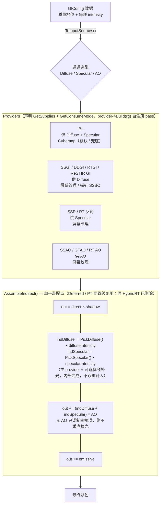

# HugEngine 全局光照（GI）本质、实现与架构优化

> **本文定位**：把「GI 是什么」「每种技术怎么实现」「系统现在怎么跑」「缺什么、怎么改」四件事收在一份文档里，
> 按**由概念到落地**分层组织，可供四类读者各取所需。
>
> **版本与时点**：正文中**算法与代码事实**对着当前 HEAD 的源码核对；
> **第四部分**（现状分析与优化方案）的原始盘点是 **2026-09-08**，并在 **2026-09-21** 做过一次全面状态核对 ——
> 该部分的每条缺陷都**紧跟标题标注现状**，请勿把"已修复项"读成当前缺陷。
>
> **引用约定**：形如 `Engine/Render/GI/GITypes.h:49` 的引用指向仓库内真实文件与行号（对着当前 HEAD 核对过）；
> 凡未能亲自在源码中复核的说法一律标注**（未能复核）**。第四部分中引用的「历史小节编号」（如 `§9.2-T`）
> 是原分析文档的编号，其中的字母子项已不在本合并文档中，保留仅为可追溯。
>
> **参数只写一次**：IBL 的 `32² / 128²×5 mip / 512²`、SSGI 的 `32 方向 / 16 采样 / 720 B UBO`、
> RSM 的三 MRT、DDGI 的 `4 系数 SH / 32 Fibonacci` 等参数此前被反复列出；本文把它们收敛到
> **算法层（第二部分）** 的"参数唯一出处"小节，其余小节一律改为引用。

---

## 阅读指引

本文由四份原始文档合并而成，四部分分别对应其中的一份，内容顺序为「由概念到落地」：

| 部分 | 回答的问题 | 对应原始文档的性质 |
|---|---|---|
| **第一部分 · GI 的本质** | 实现 GI 到底在做什么（数学 / 计算 / 工程） | 概念层：本质 + 统一实现模板 |
| **第二部分 · 实现原理（逐技术：算法与着色器）** | 每种 GI 技术的原理、生成流程、着色器算法、消费方式 | 算法层：逐技术代码级实现细节 |
| **第三部分 · 系统结构与运行机制** | 当前代码里 GI 系统的结构、数据模型、执行流程 | 系统层：面向"要改 GI / 要接新源 / 要排查不生效" |
| **第四部分 · 现状分析、缺口与架构优化方案** | 现有实现的正确性缺陷、优化空间、架构选型与落地方案 | 方案层：盘点 + 选型 + Phase 1–5 落地 |

**跨部分速查**：

- 只想理解"GI 为什么难、所有技术共通什么" → 第一部分；
- 想查某个技术的算法与参数 → 第二部分（参数定义在 `§2.x.1 / §2.x.2` 这类"参数唯一出处"小节）；
- 想改代码、接新源、排查"GI 不生效" → 第三部分（踩坑与契约在 §3.7、横切机制在 §3.9、扩展步骤在 §3.12）；
- 想知道"哪里还不对、下一步做什么" → 第四部分（缺陷状态在 §4.3、Phase 落在 §4.8）。

**相关文档**（不属本次合并范围，仍然独立存在）：

- `docs/已实现功能/Lumen设计与实现.md` —— Lumen（虚拟化几何 GI）的设计与实现，含统一降噪框架与后续框架类工作的任务记录（§10 / §11）；
- `docs/已实现功能/HugEngine GI架构与开发计划.md` —— 已归档的计划文档，其内任务全部完成；
- `docs/已实现功能/全路径追踪管线规划.md` —— 全路径追踪管线（离线参考模式）。

---

## 目录

- [第一部分 · GI 的本质](#第一部分--gi-的本质)
  - [1.1 一句话本质](#11-一句话本质)
  - [1.2 数学本质：截断一个无穷递归级数](#12-数学本质截断一个无穷递归级数)
  - [1.3 计算本质：全局耦合，无法局部求解](#13-计算本质全局耦合无法局部求解)
  - [1.4 工程本质：降维 / 缓存 / 复用 / 采样](#14-工程本质降维--缓存--复用--采样)
  - [1.5 统一的实现模板](#15-统一的实现模板)
  - [1.6 总结](#16-总结)
- [第二部分 · 实现原理（逐技术：算法与着色器）](#第二部分--实现原理逐技术算法与着色器)
  - [2.1 GI 架构总览](#21-gi-架构总览)
  - [2.2 GI_IBL —— 基于图像的光照](#22-gi_ibl--基于图像的光照)
  - [2.3 GI_SSGI —— 屏幕空间全局光照](#23-gi_ssgi--屏幕空间全局光照)
  - [2.4 GI_SSR —— 屏幕空间反射](#24-gi_ssr--屏幕空间反射)
  - [2.5 GI_RSM —— 反射阴影贴图](#25-gi_rsm--反射阴影贴图)
  - [2.6 GI_DDGI —— 动态漫反射全局光照](#26-gi_ddgi--动态漫反射全局光照)
  - [2.7 RTGIPass —— 硬件光线追踪 GI](#27-rtgipass--硬件光线追踪-gi)
  - [2.8 屏幕空间环境光遮蔽（SSAO / GTAO）](#28-屏幕空间环境光遮蔽ssao--gtao)
  - [2.9 RTReflectionPass —— 硬件光线追踪反射](#29-rtreflectionpass--硬件光线追踪反射)
  - [2.10 RTAOPass —— 硬件光线追踪环境光遮蔽](#210-rtaopass--硬件光线追踪环境光遮蔽)
  - [2.11 Lumen —— 虚拟化几何 GI（世界空间源）](#211-lumen--虚拟化几何-gi世界空间源)
  - [2.12 间接光在延迟光照中的集成（顺序总览）](#212-间接光在延迟光照中的集成顺序总览)
  - [2.13 技术对比总结](#213-技术对比总结)
  - [2.14 待实现技术](#214-待实现技术)
- [第三部分 · 系统结构与运行机制](#第三部分--系统结构与运行机制)
  - [3.1 一分钟总览](#31-一分钟总览)
  - [3.2 目录结构与关键文件](#32-目录结构与关键文件)
  - [3.3 数据模型（GITypes.h）](#33-数据模型gitypesh)
  - [3.4 Provider 抽象（IGIProvider.h）](#34-provider-抽象igiproviderh)
  - [3.5 帧内执行流程](#35-帧内执行流程)
  - [3.6 合成细节（DeferredLighting.frag.slang）](#36-合成细节deferredlightingfragslang)
  - [3.7 各源的契约、代价与踩坑](#37-各源的契约代价与踩坑)
  - [3.8 Forward 管线的 GI](#38-forward-管线的-gi)
  - [3.9 横切机制](#39-横切机制)
  - [3.10 调试与验证设施（Tools/gi/）](#310-调试与验证设施toolsgi)
  - [3.11 已知边界与未做项](#311-已知边界与未做项)
  - [3.12 扩展指南：新增一个 GI 源](#312-扩展指南新增一个-gi-源)
  - [3.13 术语与常量速查](#313-术语与常量速查)
- [第四部分 · 现状分析、缺口与架构优化方案](#第四部分--现状分析缺口与架构优化方案)
  - [4.0 时点说明：盘点时点与现状](#40-时点说明盘点时点与现状)
  - [4.1 现有 GI 技术清单](#41-现有-gi-技术清单)
  - [4.2 各技术现状要点](#42-各技术现状要点)
  - [4.3 优化建议（逐条状态标注）](#43-优化建议逐条状态标注)
  - [4.4 建议的落地顺序](#44-建议的落地顺序)
  - [4.5 工业界 GI 缺口对比](#45-工业界-gi-缺口对比)
  - [4.6 架构优化与选型方案](#46-架构优化与选型方案)
  - [4.7 方案修订：从"4 正交通道"到"2 加性间接项 + 单一装配点"](#47-方案修订从4-正交通道到2-加性间接项--单一装配点)
  - [4.8 Phase 1–5 落地方案](#48-phase-15-落地方案)

---

# 第一部分 · GI 的本质

> 本部分从数学、计算、工程三个层面阐述「实现 GI 的本质是什么」，并以 HugEngine 中已实现的 GI 技术
> ——**共 11 种**：IBL / SSGI / SSR / SSAO / GTAO / RSM / DDGI / RTGI / RT 反射 / RTAO / Lumen
> （完整索引与实现位置见 §2.1.1）——作为对照，
> 回答「所有 GI 技术背后共通的东西」。

## 1.1 一句话本质

实现 GI 的本质，可以概括为：

> **实时求解渲染方程（Rendering Equation）里的「间接光照项」——一个自身递归、全局耦合的积分方程。**

## 1.2 数学本质：截断一个无穷递归级数

渲染方程（Kajiya 1986）：

$$
L_o(p,\omega_o) \;=\; L_e(p,\omega_o) \;+\;
\int_{\Omega} f_r(p,\omega_i,\omega_o)\, L_i(p,\omega_i)\, \cos\theta_i \,\mathrm{d}\omega_i
$$

关键在于 **$L_i$ 本身不是已知量**——它等于「从 $\omega_i$ 方向能看到的某个点 $q$ 的出射光」，而 $q$ 的出射光又依赖 $q$ 自己的入射光……于是这是无限递归。它的形式解是 **Neumann 级数**（$T$ 为一次散射传输算子）：

$$
L \;=\; L_e \;+\; T L_e \;+\; T^2 L_e \;+\; T^3 L_e \;+\; \cdots
$$

- 直接光照 = $L_e$（零次反弹）；
- 环境光 / IBL ≈ 无穷次反弹被折叠成一张环境图；
- SSGI / RSM / RTGI = 只算 $T L_e$（一次反弹）；
- 路径追踪 = 用 Monte Carlo 一直采样到收敛。

所以「做几 bounce」不是工程参数的偏好，而是在**决定截断这个级数的第几项**。这解释了为什么实时 GI 几乎都停在 1 次反弹：级数项贡献递减，但每多一项代价翻倍。

## 1.3 计算本质：全局耦合，无法局部求解

光栅化是「局部着色」——一个像素只关心当前三角形 + 光源。GI 是「全局耦合」——**场景里任意两点的光都互相影响**：A 的颜色取决于 B，B 又取决于 A。

这就是 GI 难的根源：一个像素的颜色依赖**整个场景**的几何与材质。它不再是单个 shader 能独立算完的量，而是必须对整个光场做全局处理。

## 1.4 工程本质：降维 / 缓存 / 复用 / 采样

因为全局耦合算不动，所有实时 GI 都在做同一件事——**把「从某个方向来的光」提前算好、压缩、存起来，查询时重建**。四种核心手法，全部能在 HugEngine 里找到对应：

| 手法 | 思想 | HugEngine 对应 |
|---|---|---|
| **缓存 + 复用** | 把环境光/空间光预积分成纹理，查表代替重算 | IBL 的三张图、DDGI 探针、RSM 的 VPL |
| **降维** | 把 5D 光场压缩：SH 是角度降维，irradiance 把方向积分掉 | DDGI 的二阶球谐（band 0/1，系数量见 §2.6.2）|
| **采样替代积分** | Monte Carlo 采样逼近积分，而非解析求积 | RTGI 的半球采样、路径追踪 |
| **复用屏幕信息** | 把深度缓冲里已渲染的几何当作场景可见子集 | SSGI / SSR |

## 1.5 统一的实现模板

把上面所有技术抽象一下，实现任何 GI 都是在回答三个问题：

1. **缓存什么**（缓存形式）：辐照度 cubemap？SH 系数探针？VPL 列表？屏幕像素？
2. **怎么填充缓存**（采样/积分策略）：半球卷积？重要性采样？光追采样？
3. **怎么查询重建**（消费方式）：直接采样？三线性插值？Ray March？

举两个例子对照：

- **DDGI** = 缓存「空间各点的入射光方向分布（SH）」+ 用「沿 Fibonacci 球面方向取 Screen Probe / 光追 march / RSM / IBL 的辐射度」填充 + 用「三线性插值 + SH 评估（含 Lambert 卷积）」查询。
- **IBL** = 缓存「天空盒各方向的预积分光」+ 用「GGX 重要性采样卷积」填充 + 用「按 roughness 选 mip 采样」查询。

## 1.6 总结

**GI 的本质是在无法解析求解全局光传输方程的前提下，为「间接光」选一个足够低频的缓存形式，用一个廉价的采样策略把它填满，再在着色时高效地插值重建。**

所有「技术」的差异，只是这三个选择的不同组合。而「低频」是关键：间接光变化平滑，所以能被 SH、低分辨率 cubemap、探针网格这些粗粒度结构捕捉——这正是实时 GI 成立的物理依据。

---

# 第二部分 · 实现原理（逐技术：算法与着色器）

> 本部分逐项分析 HugEngine 中每种 GI 技术的实现细节与底层原理，涵盖光栅化路径的 GI 子系统与硬件光线追踪路径。
> 各项技术的参数在对应小节的「**参数唯一出处**」处给出，第三、四部分引用而不重复。

## 2.1 GI 架构总览

HugEngine 的 GI 分**三套并行的体系**：**光栅化 GI 子系统**（`Engine/Render/GI/` 的 `GI_*` 类）、**硬件光追路径**（`Engine/Render/RT/` 的 `RTEffectPass`）、**虚拟化几何 GI（Lumen）**（`GI/LumenProvider.h` + `Engine/Render/Lumen/`）。三者在**帧图层**统一：每个源都包成 `IGIProvider`，由**注册表**（`GIRegistry`）按能力位与质量档位裁剪后形成通道层栈，合成端按 `GISourceId` 分派（§3.3、§3.5）。

### 2.1.1 本部分覆盖的全部 GI 源（实现原理索引）

以 `GISourceId`（`Engine/Render/GI/GITypes.h`）为权威口径，**已实现 11 个源**，另有 1 项已取消：

| `GISourceId` | 实现 | 本部分章节 |
|---|---|---|
| `IBL` = 1 | `GI/GI_IBL.cpp` | §2.2 |
| `Lightmap` = 2 | **未实现**（原任务 31 已取消，枚举内保留占位并注明） | — |
| `DDGI` = 3 | `GI/GI_DDGI.cpp` + `DDGITracePass` + `GIProbeGrid` + `GIRadianceHistory` | §2.6 |
| `SSGI` = 4 | `GI/GI_SSGI.cpp` | §2.3 |
| `SSR` = 5 | `GI/GI_SSR.cpp` | §2.4 |
| `SSAO` = 6 | `GI/AOProvider.h`（`ScreenAOProvider`）+ `PostProcess/SSAO.cpp` | §2.8 |
| `RSM` = 7 | `GI/GI_RSM.cpp` + `RSMIndirect` + `RSMFrustum` | §2.5 |
| `RTGI` = 8 | `RT/RTGIPass.cpp` | §2.7 |
| `RTReflection` = 9 | `RT/RTReflectionPass.cpp` | §2.9 |
| `RTAO` = 10 | `RT/RTAOPass.cpp` | §2.10 |
| `GTAO` = 11 | 与 SSAO 同一个 pass 的另一种模式（`useGTAO`） | §2.8 |
| `Lumen` = 12 | `GI/LumenProvider.h` + `Engine/Render/Lumen/` | §2.11（完整版见《08.Lumen实现分析》） |

> **RT 阴影**（`RT/RTShadowPass.cpp`）不在上表：它是**阴影技术**而非 GI 源（走独立的 `ShadowChannel` 枚举、不进 GI 层栈），实现见《12.阴影系统实现分析》。

### 2.1.2 历史接口：`GIMode` 与 `IGlobalIllumination`（仍在用，但已不是"源清单"）

光栅化的 `GI_*` 类仍继承统一接口 `IGlobalIllumination`（`Engine/Render/GI/GlobalIllumination.h`，该接口继承 `IRenderSubsystem`），其能力是：

- **模式/质量切换**：`GIMode` + `GIQuality` 枚举；
- **间接光纹理暴露**：`GetIndirectDiffuseTexture()` / `GetIndirectSpecularTexture()` 供 PBR Shader 采样；
- **调试统计**：`GIDebugData` 供 ImGui 面板展示。

```cpp
// Engine/Render/GI/GlobalIllumination.h:14 —— GI 模式枚举（覆盖长期路线图）
enum class GIMode : u8 {
    None    = 0,   // 无 GI（仅直接光照）
    IBL     = 1,   // 基于图像的光照
    SSGI    = 2,   // 屏幕空间 GI
    VXGI    = 3,   // 体素锥追踪 GI（仅占位，未实现）
    DDGI    = 4,   // 动态漫反射 GI（探针网格 + SH）
    ReSTIR  = 5,   // 重采样 GI（仅占位，未实现）
    RSM     = 6,   // 反射阴影贴图 GI
};
```

**实际落地为 `.cpp` 实现的类**（`Engine/Render/GI/`）：

| 类 | `GIMode` | 状态 |
|---|---|---|
| `GI_None` | None | 空实现（Null Object，默认关闭）|
| `GI_IBL` | IBL | ✅ 已实现 |
| `GI_SSGI` | SSGI | ✅ 已实现 |
| `GI_SSR` | SSGI | ✅ 已实现（`GI_SSR.h:33` 的 `GetMode()` 复用 SSGI）|
| `GI_RSM` | RSM | ✅ 已实现 |
| `GI_DDGI` | DDGI | ✅ 已实现 |

> ⚠ **口径提醒（2026-09-22 复核）**：`GIMode` 是**先于**注册表架构的枚举，它**没有** SSAO / GTAO / RT 反射 / RTAO / Lumen 的位置（这些源在后来的 `GISourceId` 里才有编号），也没有独立的 SSR 项（这正是 `GI_SSR::GetMode()` 复用 `GIMode::SSGI` 的原因）。因此：
> - **列举"引擎有哪些 GI 源"必须用 `GISourceId`（§2.1.1 的表）**，不要用 `GIMode`；
> - §2.14 的"待实现技术"同样以 `GISourceId` 为准。

### 2.1.3 硬件光线追踪路径

独立于上述接口，位于 `Engine/Render/RT/`，统一继承 `RTEffectPass` 并由 `RTEffectProvider` 参数化装配：

- `RTGIPass` —— RT 间接漫反射（§2.7）；
- `RTReflectionPass` —— RT 反射（§2.9）；
- `RTAOPass` —— RT 环境光遮蔽（§2.10）；
- `RTShadowPass` —— RT 阴影（非 GI 源，见《12.阴影系统实现分析》）。

四者共用 `RT_HitCommon.slang::EvaluateHitRadiance` 与 `RTRayEffectPushConstant`（量纲约定见 §3.7.6）。

> 历史遗留的 `GIMode::VXGI`（体素锥追踪）与 `GIMode::ReSTIR` 仍无实现类：`Engine/Render/RT/ReSTIRPass.h:34` 实现的是 ReSTIR **直接光照（DI）** 时空重采样，不是 GI（详见 §2.14）。

---

## 2.2 GI_IBL —— 基于图像的光照

**实现文件**：`Engine/Render/GI/GI_IBL.h`（97 行）、`Engine/Render/GI/GI_IBL.cpp`（386 行）
**着色器**：`Engine/Shader/Shaders/GI/IBL_Irradiance.{vert,frag}.slang`、`IBL_Prefilter.{vert,frag}.slang`、`IBL_BRDF_LUT.{vert,frag}.slang`
**Provider**：`Engine/Render/GI/IBLProvider.h`
**消费端**：`Lighting/DeferredLighting.frag.slang`（延迟）、`Lighting/PBR.frag.slang`（前向）、`GI/DDGI.comp.slang` 与 `RayTracing/DDGI_Trace.rgen.slang`（DDGI 的辐射度回退）

### 2.2.1 原理：Split-Sum 近似（三个产物各解决什么）

镜面 IBL 的物理目标是这条积分（着色器里 $N\!\cdot\!L$、$N\!\cdot\!V$ 记作 `NdotL`、`NdotV`）：

$$
L_o^{spec}(R)=\int_\Omega f_{spec}(l,R)\,L_i(l)\,(n\!\cdot\!l)\,\mathrm d\omega,
\qquad
f_{spec}=\frac{D(h)\,F(v,h)\,G(l,v)}{4\,(n\!\cdot\!l)(n\!\cdot\!v)}
$$

HugEngine 采用 UE4 的 **Split-Sum（分裂求和）近似**，把积分拆成两个各自可预计算的因子：

$$
L_o^{spec}\;\approx\;
\underbrace{\frac{\int_\Omega L_i(l)\,D(l)\,(n\!\cdot\!l)\,\mathrm d\omega}{\int_\Omega D(l)\,(n\!\cdot\!l)\,\mathrm d\omega}}_{F_{\mathrm{prefilter}}(R,\,r)}
\;\times\;
\underbrace{\int_\Omega \frac{D\,G\,F}{4\,(n\!\cdot\!l)(n\!\cdot\!v)}(n\!\cdot\!l)\,\mathrm d\omega}_{B(n\cdot v,\,r)}
$$

$B$ 再按 Schlick 的 $F=F_0(1-F_c)+F_c$、$F_c=(1-v\!\cdot\!h)^5$ 拆成 $F_0 A+B$：因为 Schlick 对 $F_0$ **线性**，这一步是**精确**的，所以工程上只要预存两个标量 $(A,B)$，材质自己的 $F_0$ 由逐像素的 `F` 提供（`DeferredLighting.frag.slang:237` 的 `F * envBRDF.r + envBRDF.g`）。漫反射一侧则用一张低分辨率辐照度图近似
$L_o^{diff}=k_D\cdot\mathrm{albedo}\cdot E/\pi$，其中 $E=\int_\Omega L_i\,(n\!\cdot\!l)\,\mathrm d\omega$：
辐照度图**按约定存 $E/\pi$**（`IBL_Irradiance.frag.slang:49` 的 `× π / sampleCount`，见 §3.6.1）。

因此 `GI_IBL` 从天空盒 Cubemap 预生成三张图，**三者分工不重叠**：

| 纹理 | 分辨率 / 格式 | 解决哪一项 | 谁在什么时候读它 |
|---|---|---|---|
| Irradiance Map | 32×32 Cubemap，1 mip，`RGBA16_FLOAT`（`GI_IBL.cpp:58-71`）| 漫反射：$\int L_i\cos\theta\,\mathrm d\omega = E$，按 $E/\pi$ 存 | 逐像素按法线采样一次，与视角无关（`DeferredLighting.frag.slang:211`）|
| Prefilter Map | 128×128 Cubemap，5 mip，`RGBA16_FLOAT`（`GI_IBL.cpp:73-86`）| Split-Sum **第一因子** $F_{\mathrm{prefilter}}$：按 roughness 选 mip | 按反射方向 `R` + `roughness*(kGPUPrefilterMips-1)` 采样（`DeferredLighting.frag.slang:235-237`）|
| BRDF LUT | 512×512 2D，`RG16_FLOAT`（`GI_IBL.cpp:88-99`；`kBRDF_LUT_Res` 见 `GI_IBL.h:94`）| Split-Sum **第二因子** $(A,B)$：与天空盒**无关**，只依赖 $(N\!\cdot\!V,\ r)$ | 采样一次，直接光的多重散射补偿也复用它（`DeferredLighting.frag.slang:279`）|

> **本文其余部分提到 IBL 的三张图时，一律指本节这张表。**

**Split-Sum 牺牲了什么**（写清近似到底发生在哪一步）：

1. **预滤波假设 $V=N=R$**（`IBL_Prefilter.frag.slang:62` 的 `float3 V = N;`）——在 Cubemap 的逐 texel 视图里本来就满足，但这意味着 $F_{\mathrm{prefilter}}$ 只是"沿 $R$、按 $D$ 加权的入射辐射度**平均值**"，无法表示 $n\ne v$ 时的波瓣拉伸（N≠V distortion）；
2. **$L_i$ 与 BRDF 项的相关性被丢弃**：两个因子各自平均后相乘，波瓣内"亮源"与 $D\,G$ 的乘积关系不再成立（掠射角的镜面环境因此偏"圆"）；
3. **粗糙度被量化到 5 档**（`GI_IBL.cpp:321` 的 `roughness = mip/(kPrefilterMips-1)` ⇒ 0 / 0.25 / 0.5 / 0.75 / 1.0），档间靠三线性插值；
4. 环境被当作**无限远、静态**：不响应局部动态物体与遮挡。

| 固有限制 | 后果 | 本工程的兜底 |
|---|---|---|
| 环境无限远、只随天空盒变化 | 局部动态物体、近场遮挡不影响 IBL | AO 通道（SSAO/GTAO/RTAO）只对**间接项**做乘法调制（`DeferredLighting.frag.slang:536`）；动态细节交给 SSR / RT 反射。§2.13 的对比表首行记的就是这一条（"不响应局部动态物体"）|
| $V=N=R$ 假设 | 掠射角与大波瓣的镜面形状不准 | 无兜底（记档于 §2.2.8 缺口 7）|
| 辐照度是**均匀网格黎曼和** | 含太阳盘的天空漏亮斑、DC 偏低 1.85% | 无兜底（§2.2.4 的定量分析、缺口 1）|
| 天空盒没变就不重烘焙 | 天空盒内容/参数变化不一定反映 | 脏标记只看指针（§2.2.3、缺口 4）|

### 2.2.2 数据流与资源绑定

```
SkyboxComponent::cubemap（外部加载的 Cubemap + Sampler；示例给的是 RGBA8_UNORM）
   │  快照：SnapshotSkybox{cubemap, sampler, enabled, intensity}（FrameSceneSnapshot.h:186-193）
   ▼
GI_IBL::SetIBLSkybox()（GI_IBL.cpp:247） —— 两个裸指针都没变时早退（:250），否则置 m_Dirty（:253）
   ▼
帧图 pass "IBL_Bake"（恒注册、内部早退；DeferredPipeline_FrameGraph.cpp:1343-1353）
   ▼
GI_IBL::Render()（GI_IBL.cpp:266；:267 不脏即 return）
   ├─ Pass1 辐照度  ：6 面 × Draw(3)          → m_IrradianceMap 32²×6 RGBA16F（1 mip）
   ├─ Pass2 预滤波  ：5 mip × 6 面 × Draw(3)   → m_PrefilterMap 128²×6 RGBA16F（5 mip）
   └─ Pass3 BRDF LUT：1 × Draw(3)             → m_BRDF_LUT 512² RG16F
   合计 6 + 30 + 1 = 37 个 offscreen pass；每个产物后各一次 COLOR_ATTACHMENT→SHADER_READ 屏障
   （GI_IBL.cpp:299-304 / :343-348 / :364-369）
   ▼
Lighting 描述符集 binding 12/13/14（LightingPass.cpp:265-266，SetIBLTextures :447-460）
   ├─ DeferredLighting.frag.slang:211       漫反射（辐照度）
   ├─ DeferredLighting.frag.slang:235-237   镜面（预滤波 × (F·A+B)）
   └─ DeferredLighting.frag.slang:279       envBRDF（直接光的多重散射补偿也用它）
另有两个世界空间消费者：DDGI.comp.slang:238/245（binding 9）、DDGI_Trace.rgen.slang:95（binding 8）
```

| 绑定 | 内容 | 位置 |
|---|---|---|
| set 0 / b0（辐照度与预滤波**各自一个描述符集**）| `CombinedImageSampler` = 天空盒 Cubemap + 其 Sampler | `GI_IBL.cpp:125-127`（辐照度）、`:161-163`（预滤波）；绑定号常量 `kIBLBindInput = 0`（`:22`）|
| push constant（声明 96 B，实推 80 B）| `float4x4 invVP`（每面不同）+ `roughness` + `_pad[3]`，`alignas(16)` | `GI_IBL.cpp` 的范围 `:117-120`；结构 `:276`、`:315`；`SetPushConstants` `:293`、`:336` |
| set = `rhi::kDescSetPerFrame` | 上述描述符集绑到 set 0 | `GI_IBL.cpp:279`、`:317` |
| BRDF LUT pass | **无描述符集、无 push constant**（其 PSO 也不设 `descriptorSetLayouts`）| `GI_IBL.cpp:203-215`、`:351-361` |
| 消费端 | binding 12 = Irradiance、13 = Prefilter、14 = BRDF LUT | `ShaderTypes.slang:61-63`；`LightingPass.cpp:265-266` |

**为什么矩阵走 push constant 而不是 UBO**：本 pass 只需要**一个** `invVP`（64 B）+ 一个标量，声明 96 B 就装得下（Vulkan 保证的 push constant 至少 128 B）——与 §2.4 的 SSR 恰成对照：SSR 需要**三个**矩阵（192 B）才被迫进 UBO（binding 3）。**输入纹理不持有所有权**：`m_SkyboxCubemap` / `m_SkyboxSampler` 是外部裸指针（`GI_IBL.h:84-86`），只在 `SetIBLSkybox` 时更新描述符集（`:256-263`）。

### 2.2.3 必须先立对的约定（空间 / 量纲 / 方向 / 坐标系）

| 约定 | 内容 | 错了会怎样 |
|---|---|---|
| **量纲 = $E/\pi$** | 辐照度图存 $E/\pi$（`IBL_Irradiance.frag.slang:49`），消费端再乘 `kD * albedo * iblIntensity`（`DeferredLighting.frag.slang:211`）| 合成端的归一化加权要求各源估**同一个量**（§3.6.1）；量纲不一会让结果随 albedo 偏移（§9.2-A）。注意 `DeferredLighting.frag.slang:210` 的注释写作"辐照度图存 E/π，**已含 kD 与接收面 albedo**"，与代码不符——kD 与 albedo 是**乘在图上**的，不在图里；照注释改会把 kD 少乘一次 |
| **Cubemap 面方向表** | face 0..5 = `+X,-X,+Y,-Y,+Z,-Z`（`GI_IBL.cpp:28-35`），对应的 up = `(0,-1,0)/(0,-1,0)/(0,0,1)/(0,0,-1)/(0,-1,0)/(0,-1,0)`（`:36-43`），`view = lookAtRH(0, faceDir, up)`（`:45-50`），`proj = perspectiveRH_ZO(90°,1,0.1,100)`（`:271`）| 这张表必须与**天空盒是怎么造出来的**成对修改：`06.GILab.cpp:328-335` 生成输入 Cubemap 的面时用的是**同一张表**（逐项相同），但那里的 `up` 是"v 增大的方向"，而 `lookAtRH` 要的是"图像上边"。按静态推导，烘出的每个面相对输入在 v 方向会镜像（**未在 GPU 上复核**，见 §2.2.9 末）；面顺序本身写错则 IBL 整体错位 |
| **负高度视口** | 三个 pass 都用 `SetViewport({0, res, res, -res, 0, 1})`（`:289-291`、`:333-334`、`:356-358`）⇒ NDC 的 `+y` 对应图像**上边**（纹理 v=0）| 与引擎其它离屏通道同一约定（`SSR.frag.slang:58-59`、`Nanite_ClusterBVH.comp.slang:285`）；本 pass 用 `invVP` 反算方向，等价于"图像行序与 Vulkan Cubemap 的存储行序一致"这个前提 |
| **深度：本 pass 不适用** | 三个 PSO 都是 `depthTest/depthWrite = false`、`depthFormat = Unknown`（`:142-146`、`:178-182`、`:207-211`）| 因此 zero-to-one 与 reverse-Z 之别在这里**无意义**；顶点把 clip `z` 取 1（远平面方向，`IBL_Irradiance.vert.slang:26`），由于视点在原点、只取方向，`z` 取 0 或 1 落在同一条视线上（方向相同）|
| **切线基右手性** | `T = normalize(cross(up, N))`、`B = cross(N, T)`（`IBL_Irradiance.frag.slang:23-25`，预滤波同）| $(T,B,N)$ 右手 ⇒ `tangentDir = (sinθcosφ, sinθsinφ, cosθ)`（`:34-37`）与之自洽。`up` 的选取加了 `abs(N.y) < 0.999` 的兜底，避免 `cross` 退化。方向反了会让半球积分落在 $-N$ 侧，而 32² 的低频图**不会报任何错** |
| **LUT 的行序（存疑）** | `IBL_BRDF_LUT.vert.slang:23` 的 `uv = pos*0.5+0.5` **没有**做 y 翻转，而同一引擎里全屏三角形都要翻（`DeferredLighting.vert.slang:17` 的 `uv.y = 1.0 - uv.y`，注释"Vulkan Y 翻转"）| 负高度视口下纹理行 0 = `ndc.y=+1` ⇒ 按静态推导，LUT 第 v 行存的是 $\mathrm{roughness}=1-v$，而消费端按 `float2(NdotV, roughness)` 采样（`:279`）⇒ **roughness 轴镜像**（低粗糙度读到高粗糙度的 $A,B$）。**仅静态推导，未在 GPU 上复核**；若是真的，§4.2 里那次 $k$ 修正的差分实测两侧同样被污染、抓不到它 |

### 2.2.4 核心算法（伪代码 + 每一步的理由）

**（1）辐照度卷积 —— 均匀网格黎曼和**（`IBL_Irradiance.frag.slang:19-50`）

```hlsl
N = normalize(input.worldDir);                       // :20 每个 texel 的法线 = 该面的世界方向
up = abs(N.y) < 0.999 ? (0,1,0) : (1,0,0); T = normalize(cross(up,N)); B = cross(N,T);  // :23-25
for (phi = 0.0; phi < 2π; phi += SAMPLE_DELTA)       // :31 126 次（ceil(2π/0.05)）
  for (theta = 0.0; theta < π/2; theta += SAMPLE_DELTA) {   // :32 32 次（ceil((π/2)/0.05)）
    d = T*sinθcosφ + B*sinθsinφ + N*cosθ;            // :34-40 球面坐标 → 切线空间 → 世界空间
    irradiance += skybox.Sample(d).rgb * cosθ * sinθ;// :43-44 cosθ 是 Lambert 权重，sinθ 是球面积分元
    sampleCount++;                                   // :45
  }
irradiance = irradiance * π / float(sampleCount);    // :49 归一化：意图是输出 E/π
```

采样步长 `SAMPLE_DELTA = 0.05`（`:17`），实际样本数 **126 × 32 = 4032**（两处循环判据都是 `<`，把不满一格的部分也算一格）。这是**均匀网格黎曼和**：方向集与 `N` 无关，每个 texel 固定 4032 次天空盒采样。

**定量问题 (a)：白炉（$L\equiv1$）DC 响应偏低 1.85%。** 按 shader 的循环逐项数值复算：

- 理想值 $E/\pi = 1$；shader 的和 $\sum\sum\cos\theta\sin\theta = 1259.7152$（$\theta$ 取左端点 0, 0.05, …, 1.55），输出 $1259.7152\times\pi/4032 = \mathbf{0.981526}$ ⇒ **偏低 1.85%**。
- 主项是**归一化常数与网格不匹配**：把 $\sum$ 换算回 $E/\pi$ 的正确系数是 $\Delta\theta\Delta\phi/\pi = \pi/N^{*}$，其中 $N^{*}=\pi^{2}/\Delta^{2}=3947.8$ 才是"按步长铺满半球"的样本数；循环实际取了 4032 个（$\phi$ 侧 $\lceil 2\pi/0.05\rceil=126$、$\theta$ 侧 $\lceil(\pi/2)/0.05\rceil=32$），于是每样本权重 $\pi/4032$ 比正确值小 $3947.8/4032-1=\mathbf{-2.09\%}$。
- 次项是**采样域覆盖与左端点规则的残差**，可精确分解：$\theta$ 侧 32 个左端点样本的和是理想值（$\frac{1}{\Delta}\int_0^{\pi/2}\!\cos\theta\sin\theta\,\mathrm d\theta=10$）的 **0.99977** 倍（−0.023%；最后一个样本停在 1.55 rad，截掉的 $[1.55,\pi/2]$ 只占 $E$ 的 **0.043%**，可忽略）；$\phi$ 侧有 126 行、而"按步长铺满"只需 $2\pi/\Delta=125.66$ 行 ⇒ **+0.267%**。两项合起来让 $\sum$ 比理想网格和高 **0.245%**（$0.99977\times1.00268=1.00245$，即 $1259.7152/1256.6371$）。
- 净效果：$0.97913\times1.00245=\mathbf{0.98153}$ ⇒ **−1.85%**。**它抓不到**：白炉测试在合成端把 IBL 短路（`DeferredLighting.frag.slang:208` 的 `if (furnace && id != SSGI && id != RTGI) return 1.0`），"归一化正确但源本身偏低 1.85%"这一项在读回值里看不见——该 shader 的注释自己引了这条教训（`DeferredLighting.frag.slang:198-207` 引的 §11.4「白炉只验归一化、不验量纲」，§3.6 同）。

**定量问题 (b)：天空盒含太阳盘时漏亮斑。** 引擎的解析天空有一个亮盘：`PhysicalSky.frag.slang:107` 的 `smoothstep(0.9975, 0.9990, sunDot)` ⇒ 角半径 **2.563°（内）~ 4.052°（外）**。取盘中值 3°：立体角 $\Omega=2\pi(1-\cos3°)=0.0086\,\mathrm{sr}$，占半球 **0.137%** ⇒ 每个 texel 的 4032 个样本里**期望只有 5.5 个**命中（相对涨落 $1/\sqrt{5.5}\approx\pm43\%$）。后果不是"系统性偏暗"（均匀网格对测度是**无偏**的），而是**每个 texel 命中数不同**：太阳的贡献要么整块为 0、要么由 5～6 个样本各按 $1/4032$ 的半球测度记入，逐 texel/逐面呈现与面网格对齐的"太阳斑"，**相对误差量级 ±43%（是相对太阳那一项，不是相对该 texel 的总辐照度）**。32² 的辐照度图上 1 个 texel 在面中心处约占 2.8° 视角，太阳盘正好落在 1～2 个 texel 内，低频图无法把它平滑掉。
（该亮盘要进入 IBL，天空盒 Cubemap 里必须先有它：**本仓两个设置天空盒的示例给的都是文件加载的 Cubemap**（`06.GILab.cpp:328-376`、`02.Cube.cpp:636-673`），`PhysicalSky` 目前只被 `SkyboxPass` 直接画到屏幕、没有烘成 Cubemap 的路径——这一步**未能复核**，见 §2.2.9 末。）

**改进方向的名字**（只记方向，本文不写方案）：余弦加权采样 / 环境亮度重要性采样（brightness-weighted importance sampling）/ SH-9 投影。三者都能同时改善 (a) 的归一化偏差与 (b) 的小立体角漏采。

**（2）预滤波环境贴图 —— Hammersley + GGX 重要性采样**（`IBL_Prefilter.frag.slang:60-81`）

```hlsl
N = normalize(input.worldDir); V = N;               // :61-62 Cubemap 前提：V = N = R
for (i < SAMPLE_COUNT /*256, :23*/) {
    Xi = Hammersley(i, 256);                        // :68 低差异序列（Van der Corput 基数逆，:26-37）
    H  = ImportanceSampleGGX(Xi, N, roughness);     // :69 a = roughness²，cosθ 由 Xi.y 反解（:40-58）
    L  = normalize(2*dot(V,H)*H - V);               // :70 半向量 → 采样方向
    if (NdotL > 0) { color += skybox.SampleLevel(L, 0.0).rgb * NdotL; totalWeight += NdotL; }  // :72-76
}
color = totalWeight > 0 ? color / totalWeight : 0;  // :79 除以 Σ(N·L) ⇒ D 加权的**平均**，不是求和
```

每个 mip 用更大的 roughness（采样方向更分散），从而分级表示模糊反射；`roughness` 与 mip 的映射在 C++（`GI_IBL.cpp:319-321`），shader 只接收这个标量。
**两处值得记下的取舍**：① 除以 `totalWeight`（$=\sum N\!\cdot\!L$）而不是样本数，才得到 $\int L D\cos/\int D\cos$ 的估计；② `SampleLevel(..., 0.0)`（`:74`）**恒取天空盒 mip 0**，没有按采样立体角选源 mip（Karis 的 `saSample/saTexel`）——同样是"固定样本数 + 无源 mip 选择"，含太阳盘的天空盒在粗糙档下会有闪烁。

**（3）BRDF LUT —— Split-Sum 的第二项 $B(N\!\cdot\!V,r)$**（`IBL_BRDF_LUT.frag.slang:61-96`）

```hlsl
V = (sqrt(1-NdotV²), 0, NdotV); N = (0,0,1);        // :62-69 把问题折算到 NdotV 一维
for (i < 256) {
    H = ImportanceSampleGGX(Xi, roughness, N); L = normalize(2*dot(V,H)*H - V);   // :72-74
    NdotL, NdotH, VdotH = ...;                       // :76-78
    G = G_Smith(NdotV, NdotL, roughness);            // :81 k = α/2，α = roughness²（:49-55）
    G_Vis = (G * VdotH) / max(NdotH * NdotV, 0.001); // :82 环境 BRDF 的标准形式（Karis）
    Fc = pow(1.0 - VdotH, 5.0);                      // :83 Schlick 掠射项
    A += (1.0 - Fc) * G_Vis;  B += Fc * G_Vis;       // :85-86 ⇒ 消费端 F·A + B
}
return float2(A, B) / 256;                           // :90
```

横轴 `NdotV`、纵轴 `roughness`（`fragmentMain` 直接用 `input.uv`，`:94`），输出 `R=A`、`G=B`（写进 `RG16_FLOAT`，`:95`）。**$k$ 的取法在 2026-09 画质阶段 0 被修正**：原式 `a = roughness*roughness; k = a*a*0.5;` 展开是 $k=\mathrm{roughness}^4/2$，比 Karis/UE4 的 IBL 惯例 $k=a/2=\mathrm{roughness}^2/2$ 多平方了一次；$k$ 越小 ⇒ 分母越小 ⇒ $G_1$ 越大 ⇒ 几何遮蔽越少 ⇒ **间接高光偏亮**（$\mathrm{roughness}=1$ 时两式相等，只影响中低粗糙度）。现为 `k = a * 0.5`（`:55`），历史与验收见 §2.2.9 缺陷 1。**注意勿混用**：直接光走的是另一套 $k=(\mathrm{roughness}+1)^2/8$（`pbr_common.slang:53`）。

**（4）生成流程与 push constant**（`GI_IBL.cpp:266-374`）：Pass1 逐面 `BeginOffscreenPass(faceView, nullptr, 32, 32, nullptr)`（`:288-296`）；Pass2 逐 mip（128/64/32/16/8）逐面用 `CreateTextureMipStorageView` 取"某 mip 某面"的存储视图（`:319-340`，临时视图缓存在 `m_CachedMipViews`）；Pass3 全屏三角形一次（`:351-361`）。每个面的 `invVP = inverse(proj * CubeFaceViewMatrix(face))` 都重算（`:285-286`、`:328-329`）。

### 2.2.5 输出契约与合成端

| 产物 | alpha | 说明 |
|---|---|---|
| Irradiance Map | `1.0`（`IBL_Irradiance.frag.slang:50`）| 恒有效 |
| Prefilter Map | `1.0`（`IBL_Prefilter.frag.slang:80`）| 恒有效 |
| BRDF LUT | `1.0`（`IBL_BRDF_LUT.frag.slang:95`）| 声明为 `Texture2D<float2>`，只读 `RG`（`DeferredLighting.frag.slang:41`）|

- **alpha 契约**：IBL 三张产物永远写 `alpha = 1.0`，**不使用**"负 alpha = 本条无数据"协议；`SourceIsValid()` 对 IBL 走 `default: return true`（`DeferredLighting.frag.slang:190-193`）。
- **置信度掩码 = 0**：IBL 是世界空间/环境类源（`GITypes.h:93-94`），`ToConfidenceMask` 不给它 `kGIConfCameraCoverage`、也不给 `kGIConfProbeGrid`（`:153-161`）⇒ 权重逐像素恒定，只由层栈 `weight` 与可选的 `falloffDistance` 决定（`DeferredLighting.frag.slang:144-150`）。
- **合成端**：diffuse 与 specular 各走一遍"乘权重 → 加进 `num/den` → 归一化"（`DeferredLighting.frag.slang:456-470`、`:517-531`），最后 `color = directColor + (indirectDiffuse * giIntensity + indirectSpecular) * aoFactor`（`:536`）——**AO 只作用间接项**，`giIntensity` 只作用间接漫反射。
- **与 §3.6.1 量纲约定的一致性**：diffuse 返回 $L_o=k_D\cdot\mathrm{albedo}\cdot E/\pi$ ✅、specular 返回完整镜面辐射度（含 $F$ 与 `envBRDF`）✅、alpha 契约 ✅。**但 IBL 是唯一乘 $k_D$ 的漫反射源**：SSGI（`:218`）、DDGI（`:216`）、RSM（`:222`）、RTGI（`:224`）都只乘 albedo ⇒ 同一归一化通道里金属/掠射角处的能量口径并不一致（见 §2.2.8 缺口 2）。
- **强度三处可调**：源级 `iblIntensity`（`:211`、`:237`，来自 `GISettings::intensity`，默认 1.0）、通道级 `giIntensity`（只作用漫反射）、层栈 per-source `weight`。前向路径复用同一份 `GIBlendParams` 与同样的三个量（`PBR.frag.slang:250`、`:264`）。

### 2.2.6 关键参数表

| 参数 | 默认值 | 位置 | 含义 |
|---|---|---|---|
| `kIrradianceRes` | `32` | `GI_IBL.h:91` | 辐照度图边长（6 面，1 mip）|
| `kPrefilterRes` / `kPrefilterMips` | `128` / `5` | `GI_IBL.h:92-93` | 预滤波图边长与 mip 数（最高 mip 为 8²）|
| `kBRDF_LUT_Res` | `512` | `GI_IBL.h:94` | BRDF LUT 边长（`RG16_FLOAT`，格式在 `GI_IBL.cpp:91`）|
| `SAMPLE_DELTA` | `0.05` | `IBL_Irradiance.frag.slang:17` | 均匀网格步长 ⇒ 126×32 = **4032** 样本/texel（注释仍写着"16 采样点足矣"，与实现不符）|
| 辐照度归一化 | `× π / sampleCount` | `IBL_Irradiance.frag.slang:49` | 输出量纲 $E/\pi$ |
| `SAMPLE_COUNT` | `256` | `IBL_Prefilter.frag.slang:23`、`IBL_BRDF_LUT.frag.slang:14` | 重要性采样样本数（两处都有）|
| `roughness(mip)` | `mip / (kPrefilterMips-1)` | `GI_IBL.cpp:321` | 写入预滤波 push constant |
| 采样 mip | `roughness * (kGPUPrefilterMips - 1)` | `DeferredLighting.frag.slang:236`；常量 `5.0` 见 `ShaderTypes.slang:222` | 预滤波图查询 LOD |
| IBL 采样器 | Linear / Linear / Linear，`maxLod = 4`，`ClampToEdge` ×3 | `GI_IBL.cpp:104-111` | 三张产物共用一个采样器（含 LUT）|
| push constant 范围 | `96` B（实际推入 80 B）| `GI_IBL.cpp:120` | 96 B 在 Vulkan 保证的 128 B 之内 |
| `iblIntensity` | `1.0` | `GlobalIllumination.h:41`（`GISettings::intensity`）| 源级强度；示例从 cfg 键 `ibl_intensity` 读（`06.GILab.cpp:627`），Forward 走 `ForwardPipeline.cpp:985` |
| `giIntensity` / `aoIntensity` | `1.0` / `1.0` | `GITypes.h:458-459`（`giIntensity` 被 `GIConfigFromPreset` 按档改写：0.6/0.8/1.0/1.2，`:497-543`）| 通道级强度；**IBL 没有 CVar**，全部输入就是天空盒 + 上述常量 |

### 2.2.7 分辨率、降噪与 Provider 契约

- **分辨率**：三张图与视口无关（`GI_IBL::OnResize` 是空实现，`GI_IBL.cpp:382-384`），不受 `GIConfig::halfRes` 影响；产物尺寸在 `Initialize` 里一次定死（`:58-99`）。
- **降噪**：**没有降噪链**——产物是低频、静态、不在每帧通路上的烘焙结果。`IBLProvider` 不实现 `DescribeSignals`（默认空，`IGIProvider.h:135-137`）⇒ 不进 `DenoiseSignalRegistry`；`GetAuxPassCount()` 默认 0、`GetAuxPassName` 默认 `""`（`:139-140`）。
- **Provider 契约**（`IBLProvider.h`）：`GetSourceId() = GISourceId::IBL`（`:26`）、`Handles(IBL)`（`:27`）、`IsValid() = m_IBL != nullptr`（`:28`）、`NeedsPass(stack) = stack.Has(IBL) && IsValid()`（`:31-33`）、`GetDiffuseOutput() = 辐照度图`（`:35-37`）、`GetSpecularOutput() = 预滤波图`（`:38-40`）、`Render()` 内部 `if (IsDirty()) m_IBL->Render(cmd)`（`:46-48`）、`GetTimedPass() = m_IBL`（`:52`）。**它是唯一一个同时供 diffuse 与 specular 两个通道的源**（`:12`、`GITypes.h:349` 的 `ToPipelineCap` 返回两个能力位）。
- **帧图侧**：Deferred 里 `IBL_Bake` **恒注册**，pass 内部按 `IsDirty()` 早退（`DeferredPipeline_FrameGraph.cpp:1343-1353`；恒注册的理由是"消费者清单必然会漏"，历史见 §2.2.9 缺陷 3）；Forward 的 RG 路径由 `giIBL->IsEnabled()` 门控（`ForwardPipeline_FrameGraph.cpp:110-128`）。
- **`GetPassKind()` 是死元数据**：`IBLProvider` 未覆写 ⇒ 返回默认 `Offscreen`，而 `IGIProvider.h:65` 的注释把 `Custom` 写成"仅重建资源：IBL 烘焙"；全仓 `GetPassKind` 只有 3 处（默认实现 + DDGI/Lumen 两个覆写），**没有任何消费点**。
- **计时读数**：帧图的 `m_GITimer.Begin/End(c, giIdx)`（`DeferredPipeline_FrameGraph.cpp:1349-1351`）经 `GetTimedPass()` 写回 `IGlobalIllumination::SetRenderTimeMs`（`GlobalIllumination.h:101-104`）。**IBL 只在重建的那一帧非零**（`IBLProvider.h:51-52`）：本机 1080p 首次烘焙约 5 ms，之后恒 0（实测读数，本次未重跑，§未能复核 8）。

### 2.2.8 已知边界与缺口

| # | 缺口 | 说明与依据 |
|---|---|---|
| 1 | **辐照度仍是均匀网格黎曼和** | 白炉 DC 偏低 1.85%、含太阳盘时每 texel 命中数涨落 ±43%（§2.2.4 的定量分析）；白炉测试因 IBL 被短路而抓不到（`DeferredLighting.frag.slang:208`）。这就是 §2.14（3）那张表里记的"IBL 辐照度仍是均匀网格黎曼和：对含太阳盘的天空会漏掉亮斑"那一条 |
| 2 | **$k_D$ 只乘在 IBL 上** | `DeferredLighting.frag.slang:211` 乘 `kD`，而 SSGI(`:218`)/DDGI(`:216`)/RSM(`:222`)/RTGI(`:224`) 都只乘 albedo ⇒ 与 §3.6.1 的"$L_o=\mathrm{albedo}\times E/\pi$"相比，IBL 多了一因子；金属与掠射角处各源能量口径不同 |
| 3 | **输入天空盒的格式不由 GI_IBL 约束** | 示例给的是 `RGBA8_UNORM`（`06.GILab.cpp:366-376`），且先把 HDR 用 `c/(1+c)` 压到 LDR（`:352-360`）⇒ 环境能量在进入卷积前就被破坏（示例侧，不是 `GI_IBL` 的缺陷，但会掩盖上面两条的观感）|
| 4 | **脏标记只看裸指针** | `SetIBLSkybox` 比较 `m_SkyboxCubemap`/`m_SkyboxSampler` 两个指针（`GI_IBL.cpp:250`）⇒ 同一纹理对象被重新填充、或 `SkyboxComponent::intensity`（进快照，`FrameSceneSnapshot.h:192`）变化时都不重烘焙；`SkyboxComponent::rotation`（`SkyboxComponent.h:35`）在渲染侧**没有任何消费者**（`SkyboxPass.cpp` 与 `Skybox.*.slang` 都不含 rotation）|
| 5 | **BRDF LUT 是天空盒无关的静态表，却每次脏时重算** | `GI_IBL.cpp:351-361` 的 pass 无描述符集、无 push constant ⇒ 与天空盒无关；37 个 pass 里它永远白跑一遍（量级很小）|
| 6 | **预滤波无源 mip 选择** | `IBL_Prefilter.frag.slang:74` 恒取 mip 0；标准缓解是 Karis 的 `saSample/saTexel` 源 mip 选择。亮小源（太阳盘）在粗糙档下会闪烁 |
| 7 | **$V=N=R$ + 5 档 roughness** | `IBL_Prefilter.frag.slang:62`、`GI_IBL.cpp:321` ⇒ 波瓣拉伸不可表示、粗糙度被量化（档间三线性）|
| 8 | **`RenderCubemapFaces` 只有声明** | `GI_IBL.h:57-61` 声明了逐面渲染辅助函数，全仓**无定义**（逐面循环内联在 `Render()` 里）⇒ 死声明 |
| 9 | **逐 mip 面视图立即销毁（潜在 UAF）** | 每次烘焙在 `GI_IBL.cpp:309-313` 销毁上一批视图，而 `DestroyTextureMipView` 是**立即** `vkDestroyImageView`（`VulkanDevice_Descriptors.cpp:506-513`），头注释却称"延迟销毁用"（`GI_IBL.h:70`）⇒ 若在 ≤`kMaxFramesInFlight`（=3，`RHI/Types.h:17`）个飞行帧内再次烘焙（天空盒连续两帧变化），上一帧命令缓冲引用过的附件视图可能已被销毁。**未在 GPU 上复核** |
| 10 | **Forward 侧烘焙的唯一门控是 `IsEnabled()`** | `ForwardPipeline_FrameGraph.cpp:111`：一旦把 IBL 关掉，`u_BRDF_LUT` 就再也不被写入，而 `PBR.frag.slang:324` 仍无条件采样它（§9.2-X 同一族）。当前没有任何调用方把它置 false（默认 `RenderSubsystem.h:121` 为 `true`）⇒ 潜在缺口 |
| 11 | **面朝向 / LUT 行序两个静态推导存疑点** | 分别见 §2.2.3 约定表的"**Cubemap 面方向表**"行与"**LUT 的行序（存疑）**"行；两者都要靠 GPU 对照（一次转储即可）定论，不在本次只读源码的范围内 |

### 2.2.9 缺陷复核清单（这张表就是"为什么代码长这样"）

| # | 曾经的错误 | 实测现象 | 位置 |
|---|---|---|---|
| 1 | **BRDF LUT 的 Smith $k$ 多平方一次**（$k=\mathrm{roughness}^4/2$）| 高粗糙度下几何遮蔽偏小 ⇒ 间接高光偏亮。两条独立证据：① Python 按 LUT 积分式复算（$r=1$ 不变；`NdotV=0.5/r=0.5` 处 $A$ 偏大 16.6%、$B$ 偏大 27.0%）；② 引擎差分实测（`hdr` 4,922,176 个元素变化、94.8% 变暗、>1.0 的像素不变，其余 17 个转储逐位不变）| 现式 `IBL_BRDF_LUT.frag.slang:49-55`；历史与验收见 `06.材质系统实现分析.md` §6.13 与本文 §4.2 |
| 2 | **Forward 的 RG 路径从未把天空盒交给 `GI_IBL`** | 烘焙的是"未设置的天空盒"⇒ 辐照度/预滤波近全黑，IBL 漫反射与镜面**恒为 0**，而层栈/能力位/面板全部正常。指纹：`pipeline_mode=0` 下把漫反射栈从 `{IBL}` 换成 `{IBL,RSM}` 甚至只放 `{RSM}`，HDR 读数**逐位相同**（0.1836214）；修后 `{IBL}` 0.1269305 / `{RSM}` 0.0866324（任务 34 更正后的真读数）/ `{IBL,RSM}` 0.1067809 | 修复现场与注释：`ForwardPipeline_FrameGraph.cpp:101-118`；§9.2-AB、任务 26 |
| 3 | **烘焙的注册门控漏了第四个消费者** | 门控只列了"漫反射栈 ∨ 镜面栈 ∨ DDGI"，而 `u_BRDF_LUT` 是 PBR 在**直接光路径**上无条件采样的 ⇒ 镜面栈为空时那张 LUT 从未写入，直接光读到未初始化显存。读数：三通道全空 `mean 0.2022 / max 463.32`（亮点固定在 (416,996)）；`specular={IBL}` 时 `0.0694 / 42.20`；修后空栈 `0.0429` ——**这不是"一个亮点"，而是整幅画面的直接光都算错了 4.7 倍** | `DeferredPipeline_FrameGraph.cpp:1330-1353`；§9.2-X、任务 27 |
| 4 | **Deferred 侧同族缺陷：IBL 从未烘焙、消费者照采** | 未初始化显存被采样 ⇒ 绝对量级跨构建不可复现（DDGI 的绝对量级问题就源于此），后由 RHI"已写入登记 + 一次性告警"放大暴露 | §9.2-Q / §9.2-R / §9.2-S |
| 5 | **"通道被裁空就补一个 IBL"的隐式兜底** | 同一份配置在两条调用路径上含义不同（一条补成 `{IBL}`、一条保持空），回写配置文件后读数相差 **32%**；现改为"只裁不加" | `GITypes.h:647-657`；§9.2-Y、任务 28 |
| 6 | **注释与实现不符**：`IBL_Irradiance.frag.slang:16` 写"32×32 辐照度图，16 采样点足矣"，实现是 126×32 = 4032 次采样；`DeferredLighting.frag.slang:210` 写"辐照度图已含 kD 与接收面 albedo"，实现是乘在图上的 | 读注释改代码会得到相反的量纲结论 | `IBL_Irradiance.frag.slang:16-17`、`DeferredLighting.frag.slang:210-211` |
| 7 | **文档遗留的格式行号未定位**（512² RG16F）| 现已定位：纹理创建 `GI_IBL.cpp:88-99`（`Format::RG16_FLOAT` 在 `:91`），边长常量 `GI_IBL.h:94` | 本文 §未能复核清单第 4 条的闭合 |

> **未能复核（本节新增断言）**：① 面朝向镜像与 LUT roughness 轴镜像（§2.2.3）——只有代码静态推导链，需一次 GPU 转储对照；② `PhysicalSky` 的太阳盘进入 IBL 输入的路径——本仓两个示例给的都是文件 Cubemap，`PhysicalSky` 是否/如何烘成 Cubemap 未复核，故 §2.2.4 的太阳盘分析按"天空盒里含小立体角亮源"这一前提表述；③ 立即销毁逐 mip 视图是否真的命中 UAF（缺口 9）——未做 GPU 复核；④ 本机耗时读数（首次约 5 ms）为原文档实测值，本次只读源码、未重跑。

### 2.2.10 小结：IBL 在这个引擎里的定位

- **作用**：最低频的环境源，同时供**漫反射**（辐照度，$E/\pi$）与**镜面**（预滤波 + BRDF LUT）两个通道，是所有质量档位的基线兜底（`GITypes.h:500-503`），并为 DDGI 提供辐射度回退。
- **强项**：一次烘焙、零每帧成本（不脏时耗时读数为 0）；量纲与节内约定是 §3.6.1 的**基准**；不依赖 GBuffer、不依赖相机、屏外依然有效。
- **弱项**：辐照度仍是均匀网格黎曼和（DC 偏低 1.85%、漏小立体角亮源）；预滤波 $V=N=R$ + 5 档粗糙度 + 无源 mip 选择；输入天空盒的 HDR 能量在示例侧已被压掉。
- **实现要点**：三张产物一个采样器；矩阵走 push constant（只有一个 `invVP`）；脏标记只看指针；烘焙必须**恒注册**（消费者会一直增加），天空盒必须**先交给 `GI_IBL`** 再判脏——这三条都是踩坑换来的，动任何一条都要重跑白炉与天空盒对照。

---

## 2.3 GI_SSGI —— 屏幕空间全局光照

**实现文件**：`Engine/Render/GI/GI_SSGI.h`（99 行）、`Engine/Render/GI/GI_SSGI.cpp`（245 行）
**着色器**：`Engine/Shader/Shaders/GI/SSGI.frag.slang`（102 行；**文件头 1-30 行是量纲与标度的缺陷复核记录**，§2.3.9 逐条整理）
**Provider**：`Engine/Render/GI/SSGIProvider.h`（166 行）
**降噪链**：`Engine/Render/GI/SpatialDenoiseAux.h`（与 SSR 共用同一份实现，任务 11.1）
**入射辐射度**：`Engine/Render/GI/GIRadianceHistory.{h,cpp}`（前帧 HDR，§2.6.5）
**顶点着色器**：复用 `Engine/Shader/Shaders/GI/SSAO.vert.slang`（全屏三角，`GI_SSGI.cpp:5,74-75`；它给出本引擎的 uv↔clip 约定 `uv.y = 0.5 - 0.5·clip.y`）

### 2.3.1 原理：估计什么、估计量为什么精确、以及它精确的**前提**

屏幕空间间接漫反射。目标是每个可见像素的间接出射辐射度 $L_o=\mathrm{albedo}\times E/\pi$，其中

$$
E=\int_\Omega L_{\mathrm{in}}(\omega)\,(N\!\cdot\!\omega)\,\mathrm d\omega
$$

`L_in` 是**入射辐射度**（着色器里记作 `L_in`），取自**前帧 HDR**（`u_Radiance` ← `GIRadianceHistory`，`SSGI.frag.slang:36,92-93`）。取前帧有两个理由（`SSGI.frag.slang:20-22`）：本 pass 在帧图里排在 Lighting **之前**（它要供 Lighting 采样），同帧结果此时不存在；而取上一帧又天然构成"多次弹射"的时域反馈。

**估计量是比值形式**（`SSGI.frag.slang:70-99`）：

$$
\hat G=\frac{\sum_i L_{\mathrm{in}}(\omega_i)\cos\theta_i}{\sum_i\cos\theta_i}
$$

设采样方向的概率密度为 $p(\omega)$，则 $\hat G$ 的极限是**两个积分之比**：

$$
\hat G \xrightarrow{N\to\infty}
\frac{\int_\Omega L_{\mathrm{in}}\cos\theta\,p(\omega)\,\mathrm d\omega}
     {\int_\Omega \cos\theta\,p(\omega)\,\mathrm d\omega}
$$

**当且仅当 $p$ 在半球上是常数**（均匀半球采样，$p=1/2\pi$）时它精确等于 $E/\pi$：分子 $=E/2\pi$，分母 $=\pi/2\pi=1/2$，比值 $=(E/2\pi)/(1/2)=E/\pi$——归一化常数是**解析值 1**，不需要"以 PT 为参考拟合一个增益"（`SSGI.frag.slang:24-27`）。这一步正是选比值而不是 $\sum/N$ 的原因：$p$ *只*以 $p\cdot\cos\theta$ 的形式出现在分子分母里，均匀时整体约掉；换成 $\sum/N$ 就必须显式知道 pdf，丢样本时还会系统性低读（旧形式白炉实测 0.444，见 §2.3.9 缺陷 P）。

**白炉下它恒为 1**：白炉条件是"各方向 $L_{\mathrm{in}}\equiv1$ + 接收面归 albedo=1"，此时分子分母都是 $\sum\cos\theta$，比值恒等于 1，**与 $p$ 的分布、与被丢掉的样本都无关**（`SSGI.frag.slang:24-26`；`L_in` 被强制取解析真值 1，`:92`）。这是本节最硬的一条性质，也是它同时是**一条测不出角向偏差的判据**的原因（§2.3.8 缺口 1）。

| 固有限制 | 后果 | 本工程兜底 |
|---|---|---|
| 只用**屏幕内可见**的几何 | 屏外、背面、被前景遮挡的表面拿不到间接光 | 与 IBL/DDGI 在**同一条漫反射层栈**里归一化加权；屏幕边缘按 `CameraCoverage` 淡出（`DeferredLighting.frag.slang:146,463`） |
| 单次屏幕空间反弹 | 屏幕上看不到"多次弹射" | 前帧 HDR 反馈给出时域近似（同时是发散风险的来源，§2.3.8 缺口 7） |
| **固定半径处取一个样本** | 没有采样点与几何的实际距离 ⇒ 距离衰减不可求 | 旧的距离项（量纲错，用的是 $|sDir|^2$）**已删除**，偏差记为已知近似（`SSGI.frag.slang:28-30`） |
| 深度图只有一个面 | 薄物体可被"穿过"或误遮挡 | 宽度恒为 `0.01` 的比较带（`SSGI.frag.slang:86`），与半径同属"把场景尺度写成常数"（§2.3.6 参数表、§2.3.8 缺口 2） |
| `L_in` 是 **1/4 分辨率**纹理（`GIRadianceHistory.h:29`）且按点采样读 | `L_in` 以 4×4 像素分块 | 主 pass 之后的 `[Denoise] → [Upscale]` 链（§2.3.7） |

### 2.3.2 数据流与资源绑定（采样核 / 采样数 / 半径 / UBO 的**唯一出处**）

```
GBuffer 深度 / 世界空间法线 / 反照率 ─┐
GIRadianceHistory（前帧 HDR，1/4 尺寸）┴─▶ GI_SSGI::Render（全屏三角，Draw(3)）
                                          ├─ b3 Uniform Buffer（720 B）：kernel[32] / params / invProj / proj / view
                                          └─ 每帧由 CPU Map+memcpy 写入（GI_SSGI.cpp:222-226）
                                                     ↓
                             输出：RGBA16_FLOAT（信号分辨率，halfRes 时降半）
                             rgb = albedo × (ΣL_in·cosθ / Σcosθ) × intensity，alpha 恒 1
```

| 绑定 | 内容 | 位置 |
|---|---|---|
| b0 | GBuffer 深度（`u_PointSampler` 点采样） | `SSGI.frag.slang:33`、`GI_SSGI.cpp:14,157-159` |
| b1 | GBuffer **世界空间**法线（shader 内再转 view） | `SSGI.frag.slang:34`、`GI_SSGI.cpp:15,160-163` |
| b2 | GBuffer 反照率 | `SSGI.frag.slang:35`、`GI_SSGI.cpp:16,164-167` |
| b3 | 参数 Uniform Buffer（720 B） | `SSGI.frag.slang:39-45`、`GI_SSGI.cpp:17,48-53` |
| b4 | 前帧 HDR 辐射度（`L_in`） | `SSGI.frag.slang:36`、`GI_SSGI.cpp:18,232-243` |
| b0(set0) | `u_PointSampler`（Nearest/ClampToEdge） | `SSGI.frag.slang:37`、`GI_SSGI.cpp:93-97` |

**帧图侧的装配**（主 pass + 附属 pass 由 Provider 自报，帧图不再为 SSGI 手写降噪）：

```cpp
// DeferredPipeline_FrameGraph.cpp:908-955 —— 按 Provider 注册 pass（SSGI 段）
prov->SyncToStack(m_GIConfig.diffuse);          // 构图之前：层栈→开关、halfRes 当场生效、两级尺寸对齐
if (!prov->NeedsPass(m_GIConfig.diffuse)) continue;
prov->SetInputs(m_GBuffer->GetDepth(), m_GBuffer->GetNormal(), m_GBuffer->GetAlbedo());
rg.AddPass(prov->GetName(), {}, {{mainH, ResourceAccess::Write}}, ...);   // 主 pass（含 GI 计时）
for (u32 i = 0; i < prov->GetAuxPassCount(); i++) { ... lastOut = auxH; } // 降噪→升采样依次串联
ssgiDenoised = lastOut;                          // 通道最终纹理（注册期算定，供 Lighting 声明读依赖）
```

未注册 pass 时**不绑输出纹理**：`in.ssgiTex = ssgiProduced ? ... : nullptr`（`:1468-1471`），由 `LightingPass` 回绑**黑色**中性占位（`LightingPass.cpp:107-108,370-371`）——"逻辑上没跑"与"绑了一张没写过的纹理"必须区分开（§9.2-T）。

**采样核**（CPU 侧，固定种子，跨帧稳定）：

```cpp
// Engine/Render/GI/GI_SSGI.cpp:21-36 —— 半球采样核生成（count 恒为 kSSGIKernelSize = 32）
float3 s(rnd(gen) * 2 - 1, rnd(gen) * 2 - 1, rnd(gen));   // x,y ∈ [-1,1]，z ∈ [0,1]
s = glm::normalize(s) * rnd(gen);                          // 归一化（方向）+ 独立随机长度
float scale = float(i) / float(count);
scale = glm::mix(0.1f, 1.0f, scale * scale);               // 近密远疏：索引平方分级
kernel[i] = float4(s * scale, 0);
```

调用的 `count` 恒为 `kSSGIKernelSize = 32`（`GI_SSGI.cpp:190`），而实际采样数由 `u_Params.z`（= `sampleCount`，默认 16）决定（`SSGI.frag.slang:67,71`）。**方向的角向分布不是均匀半球**（它是"立方体体积均匀采样后归一化"），这一点连同"32 与 sampleCount 不一致"的后果记在 §2.3.8 缺口 1、2。

**参数进 UBO 而不进 push constant**：采样核（32×16 B）+ 参数（16 B）+ 三个 `mat4`（192 B）= **720 B**，远超 Vulkan 规格保证的 push constant 范围（引擎按 **128 B** 设计，`SSR.frag.slang:32`；`GI_SSGI.cpp:187` 的注释按 256 B 记），故整体走 binding 3 的 Uniform Buffer（`GI_SSGI.cpp:48` 的尺寸表达式）。C++ 与 Slang 两侧的 720 B 结构**逐字段同序、全部为 16 B 对齐类型**（`float4` / `float4x4`），因此没有 §9.2-AF 那类 std140 步长陷阱（对比共享结构体里 `float[3]` 占 48 B 的案例）。

> **本文其余部分提到 SSGI 的采样核 / 采样数 / 半径 / UBO 大小时，一律指本节。**

### 2.3.3 四条必须先立对的约定（错了"能跑但全错"）

| 约定 | 内容 | 错了会怎样 |
|---|---|---|
| **空间一致** | 深度重建出的 `viewPos`、采样点 `sPos` 都在 **view 空间**；GBuffer 法线是**世界空间** ⇒ 必须先 `mul((float3x3)u_View, Nw)` | 采样方向与 `viewPos` 不同空间；单独修它反而更暗（见 §2.3.9 的耦合教训） |
| **TBN 用 `mul(向量, 矩阵)`** | HLSL 的 `float3x3(T,B,N)` 把 T/B/N 当**行** ⇒ `mul(v,TBN) = v.x·T+v.y·B+v.z·N` | `mul(TBN,v)` 得到的是 $(T\!\cdot\!v,B\!\cdot\!v,N\!\cdot\!v)$，方向几乎与法线垂直，半球采样失效（实测 $\overline{dot(N,sDir)}$ 仅 **0.012**，正确应在 0.5 量级） |
| **深度是 zero-to-one，不是 reverse-Z** | 引擎用 `perspectiveRH_ZO`（近 0 / 远 1）⇒ 可见性判据只有 `sZ <= sPos.z + 0.01` 一个方向 | 方向写反（`sZ >= sPos.z-0.01`）等于**只累加被遮挡的样本**（只翻符号即令产出 ×3.0） |
| **UV ↔ NDC 的 y 翻转** ⚠ | 引擎用**负高度视口**（`GI_SSGI.cpp:181` 的 `SetViewport({0,oh,ow,-oh,0,1})`）+ 顶点着色器 `uv.y = 0.5 - 0.5·clip.y`（`SSAO.vert.slang:4`）⇒ `ndc.y = 1 - 2v`（`SSR.frag.slang:58-68` 的 `UvToNdc`/`NdcToUv`） | **本 pass 两处都仍缺这个翻转**：`SSGI.frag.slang:60` 的 `uv*2.0-1.0` 与 `:80` 的 `off.xy*0.5+0.5` 都是"无翻转"形式。两次错误在往返里相互抵消（所以看起来能跑），但离线按同一套相机复核（`perspectiveRH_ZO` fov60/aspect16:9/near0.1/far2000）得到：重建出的 `viewPos.y` 是真实值的**镜像**（+70 → −70，与 §2.4.11 缺陷 5 实测的 +70.3 / −70.7 同型），且**采样偏移的 y 分量符号反了**（实测意图偏移 $(du,dv)=(+0.467,-1.066)$ px，实际取 $(+0.467,+0.795)$ px；x 分量正确）。当前被"半径不足一像素"掩盖（§2.3.8 缺口 2、3） |

### 2.3.4 核心算法（逐步都带理由）

```hlsl
// SSGI.frag.slang:47-101（按行摘录，注释即理由）
float2 uv=input.uv; float depth=u_Depth.Sample(u_PointSampler,uv).r;
if(depth>=1.0) return float4(0,0,0,1);                 // 天空像素没有间接光：返回 0（alpha 仍为 1，见 §2.3.5）
float3 Nw=normalize(u_Normal.Sample(u_PointSampler,uv).rgb*2.0-1.0);
float3 N =normalize(mul((float3x3)u_View,Nw));          // 世界→view：与 viewPos/sPos 同空间（约定 1）
float3 albedo=u_Albedo.Sample(u_PointSampler,uv).rgb;
if(u_Params.w>0.5) albedo=float3(1,1,1);               // 白炉：本 pass 必须自己按 albedo=1 求值，否则标度测不出
float4 cp=float4(uv*2.0-1.0,depth,1.0);
float4 vp4=mul(u_InvProj,cp); float3 viewPos=vp4.xyz/vp4.w;   // 深度→view 位置（用渲染深度图的那套相机，§9.2-E）
float3 T=normalize(float3(N.z,0,-N.x)+float3(0.001,0.001,0)); // (N.z,0,-N.x)·N ≡ 0 ⇒ 可作任意朝向的切线
float3 B=cross(N,T); float3x3 TBN=float3x3(T,B,N);
float radius=u_Params.x; int samples=int(u_Params.z);
float3 num=0; float den=0.0;
for(int i=0;i<samples;i++){
    float3 sDir =mul(u_Samples[i].xyz,TBN);            // 切线空间→view：必须 mul(向量,矩阵)（约定 2）
    float3 sDirN=normalize(sDir);                      // 长度是"采样距离"，方向单独归一化（旧的 cos 混长度已修）
    float  cosT =max(0.0,dot(N,sDirN));                // 只剩余弦项
    if(cosT<=0.0) continue;                            // 余弦权重为 0 的样本不参与（也不会进 den）
    float3 sPos=viewPos+sDir*radius;                   // 固定半径取一个样本（§2.3.8 缺口 2）
    float4 off=mul(u_Proj,float4(sPos,1.0)); off.xyz/=off.w;
    float2 suv=off.xy*0.5+0.5;                         // 采样点投影到屏幕（缺 y 翻转，§2.3.3 第 4 条）
    float sd=u_Depth.Sample(u_PointSampler,suv).r;
    float sZ=(mul(u_InvProj,float4(suv*2.0-1.0,sd,1.0)).z)/(...).w;   // 该处几何的 view z
    if(sZ<=sPos.z+0.01){                               // 未被遮挡：没有比采样点更近的几何（约定 3）
        float3 L_in=(u_Params.w>0.5)?float3(1,1,1)     // 白炉：取解析真值 1（用前帧 HDR 是循环定义）
                                    :u_Radiance.SampleLevel(u_PointSampler,suv,0).rgb;
        num+=L_in*cosT; den+=cosT;                     // 余弦加权：num/den 同为"余弦权重的入射辐射度"
    }
}
float3 indirect=(den>0.0)?(num/den):float3(0.0);       // den==0（样本全被遮挡/落在下半球）⇒ 不编数据
return float4(albedo*indirect*u_Params.y,1.0);          // L_o = albedo × E/π × intensity（§3.6.1 的统一量纲）
```

两个易漏点：① **`den` 只在可见样本上累加**，因此"被遮挡丢样本"不会低读（这是比值形式的直接好处）；② `L_in` 用的是 **`u_PointSampler`**（不是 binding 4 上挂的线性采样器），从 1/4 分辨率纹理里取最近邻值。

### 2.3.5 输出契约与合成端

| 情况 | 输出 | 合成端行为 |
|---|---|---|
| 正常几何 | `float4(albedo·E/π·intensity, **+1**)` | 权重计入归一化分子与分母 |
| 天空像素（`depth>=1`） | `float4(0,0,0,+1)` | 该像素随后被 Skybox 覆盖，故实际影响可忽略 |
| `den==0`（16 个样本全被遮挡） | `float4(0,0,0,+1)` | **黑色以全权重进入归一化** ⇒ 会稀释同通道其它源 |

**量纲**：本源返回 $L_o=\mathrm{albedo}\times E/\pi\times \mathrm{intensity}$，与 §3.6.1 的约定**一致**（任务 10 / §9.2-P 的成果；合成端因此只做一次纹理采样，`DeferredLighting.frag.slang:217-218`）。注意 `intensity` 在 **pass 内**乘（`SSGI.frag.slang:101`），层栈权重在外层再乘（`SourceWeight`，`:144-150`）——单源时归一化让层栈权重抵消，只剩 `intensity`。

**alpha 协议**：`alpha < 0` 表示"本条无数据"是框架级契约（`DeferredLighting.frag.slang:173-183`），但 **SSGI 恒返回 +1**，且漫反射循环只对 `GISOURCE_LUMEN` 检查 alpha（`:462`）；`SourceIsValid` 的 `default` 分支把 SSGI 归入"处处给估计"的源（`:190-192`）。于是 `den==0` 的黑色无法被剔除——与 §2.4.7 "未命中返回 alpha=1 把环境反射压暗约一半"是**同一类问题**（§2.3.8 缺口 4）。

**合成端**（`:449-470` 漫反射通道、`:534-536` 总合成）：

```hlsl
if (s.id == GISOURCE_LUMEN && u_Lumen.Sample(u_GBufferSampler, uv).a < 0.0) continue;   // 只跳过 Lumen
float w = SourceWeight(s, camCoverage, gridCoverage, camDist);   // 含 CameraCoverage 边缘淡出
num += SampleDiffuseSource(s.id, worldPos, N, uv, albedo, kD, furnace) * w;  den += w;
indirectDiffuse = (den > 0.0) ? (num / den) : float3(0.0);       // SSGI 直接返回纹理（已含接收面 albedo）
color = directColor + (indirectDiffuse * giIntensity + indirectSpecular) * aoFactor;   // AO 只作用间接项
```

**白炉例外**：`:196-215` 的逐源分派里，**SSGI（与 RTGI）在白炉下不走短路**，而是让本 pass 自己按白炉条件求值

```hlsl
if (furnace && id != GISOURCE_SSGI && id != GISOURCE_RTGI) return float3(1.0, 1.0, 1.0);
```

理由写在 `:198-202`：白炉条件（全白环境 + 接收面 albedo=1）**恰好就是 SSGI 估计量的解析真值条件**，让它走真实路径 ⇒ 白炉同时校验它的**标度**，而不是像以前那样被短路掩盖（§11.4 的"白炉只验归一化、不验量纲"）。

### 2.3.6 关键参数表（唯一出处）

| 参数 | 默认值 | 位置 | 含义 |
|---|---|---|---|
| `radius` | **1.0** | `GI_SSGI.h:64`；配置键 `ssgi_radius`（`06.GILab.cpp:631`；落盘值 `Content/Config/04_Deferred.cfg:73`） | 采样半径（世界单位）。**无任何场景尺度/视距自适应**（§2.3.8 缺口 2） |
| `sampleCount` | **16** | `GI_SSGI.h:65`；`ssgi_samples`（`06.GILab.cpp:632`）；面板范围 4~64（`:1473`） | 逐像素实际执行的样本数（`u_Params.z`）。可与核大小 32 不一致（§2.3.8 缺口 2） |
| `kSSGIKernelSize` | **32** | `GI_SSGI.cpp:21` | UBO 里 `u_Samples[32]` 的容量；核生成时的 `count` 恒为它（`:190`） |
| `intensity` | **1.0** | `GI_SSGI.cpp:45`（`GISettings.intensity`）；`ssgi_intensity` | 在 pass 内乘到输出上 |
| `halfRes` | **false**（`Low` 档预设为 true） | `GlobalIllumination.h:43`；`GITypes.h:510` | 输出纹理降半（省约 3/4 像素着色） |
| 白炉标志 `u_Params.w` | 关 | `GI_SSGI.cpp:204`、`SSGIProvider.h:107` | 置位后：接收面 albedo 取 1（`SSGI.frag.slang:57`）、`L_in` 取解析真值 1（`:92`） |
| 可见性比较带 | **0.01**（硬编码） | `SSGI.frag.slang:86` | view 空间世界单位，非场景尺度自适应 |
| 核随机种子 | **42** | `GI_SSGI.cpp:26` | 固定 ⇒ 采样核跨帧稳定，避免闪烁 |
| 核径向分级 | `mix(0.1, 1.0, (i/count)²)` | `GI_SSGI.cpp:33-34` | 近密远疏；`count=32` 而只用前 16 个 ⇒ 有效半径被压缩（缺口 2） |
| UBO 大小 | **720 B** | `GI_SSGI.cpp:48-50` | `kernel[32]×16 + params[16] + 3×mat4[64]` |

### 2.3.7 分辨率、降噪与 Provider 契约

- **输出尺寸**：`halfResW/H`（`GI_SSGI.h:72-73`）决定信号分辨率；`SyncOutputSize()` 必须在帧图**构图之前**调用，否则本帧导入渲染图的句柄指向旧尺寸纹理（§9.2-G 的第三重真值）。Provider 在 `SyncToStack` 里做这件事（`SSGIProvider.h:56`），帧图在注册 pass 前调用（`DeferredPipeline_FrameGraph.cpp:910`）。
- **降噪链**（与 SSR **同一份** `SpatialDenoiseAux`，任务 11.1）：`[Denoise@信号分辨率] →（信号 < 消费端时）[Upscale→消费端分辨率]`；级数由 `Count()` 给出（`SpatialDenoiseAux.h:92-95`），尺寸每帧按**纹理实况**核对（`SyncSizes`，`:53-64`）。`HE_DENOISE_HALFRES` 三态开关 `off`/`denoise`/`full`（`:67-81`）。**半分辨率也降噪**——旧行为在 halfRes 时直接跳过降噪（`SSGIProvider.h:152-156`、`SpatialDenoiseAux.h:17-22`）。降噪器是 5×5 双边（`Denoiser.h:10-21`），σ 取默认 10 / 8（`SetGuideSigmas` 全仓无调用点；`DeferredPipeline.cpp:163-173` 记录了"放宽到 2/2 只再降 5% 高频"的实测理由）。
- **信号登记**：`DescribeSignals` 登记 `name="SSGI"`、`input/output`、`needsUpscale = AuxActive() && m_Aux.NeedsUpscale()`、`targetWidth/Height`（halfRes 时为全分辨率）、`depthSigma/normalSigma`（`SSGIProvider.h:128-149`）。
- **Provider 契约**：`GetSourceId()/Handles() = GISourceId::SSGI`、输出进 **diffuse** 通道（`GetDiffuseOutput`）、`IsValid` 依赖 `m_SSGI->IsEnabled()`、`ProducedThisFrame = IsValid() && m_InStack`、`SyncToStack` 让层栈成为开关唯一真值（不变量 1）、`GetTimedPass()` 交帧图 GPU 计时器、`GetAuxPassCount/Name/Input/Output` + `PreBindAux/RenderAux` 全部委托 `SpatialDenoiseAux`（`:78-89`）。
- **`NeedsRadianceHistory()` 返回真**（`SSGIProvider.h:42-44`）：帧图据此决定是否注册 `CaptureRadiance`（`DeferredPipeline_FrameGraph.cpp:1563-1574`）。写漏这个消费者就会"采样到从未写入的纹理、输出恒 0 而表面一切正常"（§9.2-P 的同族缺陷）。
- **计时**：帧图按 Provider 注册下标计时主 pass 与附属 pass（`DeferredPipeline_FrameGraph.cpp:925-927`、`946-948`；附属 pass 用 `GITimer::kAuxItemBase + idx`）。实测 SSGI 16 采样 **0.436 ms**、64 采样 **1.271 ms**（×2.92，随工作量线性；§9.2-Z / 任务 29）。
- **与 SSR 的对称性**：同一套 Provider 形态（主 pass + 附属降噪链）、同一份 `SpatialDenoiseAux`、同一个 `halfRes` 机制、同一个 `SyncToStack`/`DescribeSignals`/`GetTimedPass` 契约、同一个 `SourceWeight` 归一化与 `CameraCoverage` 淡出。**区别只有两处**：输出通道（diffuse vs specular，`SSGIProvider.h:35` 对 `SSRProvider.h:25`，后者的文件头 `:6-8` 明确写着"区别仅在输出通道不同"）与 `L_in` 的来源（SSGI 用前帧 HDR 的**入射辐射度**，SSR 用深度图里命中面的 **base color 近似**，见 §2.4.10 缺口 1）。**一处不对称**：SSR 走 `alpha<0` 的有效性协议（未命中返回 −1），SSGI 恒返回 +1（§2.3.8 缺口 4）。

### 2.3.8 已知边界与缺口

| # | 缺口 | 说明与依据 |
|---|---|---|
| 1 | ⚠ **采样方向的角向分布不是均匀半球**（⇒ 比值估计量对非恒定环境有方向性偏差，白炉测不出） | `GI_SSGI.cpp:30-31` 是"**立方体 $[-1,1]^2\times[0,1]$ 体积均匀采样后归一化**"（已逐行复核：x,y 取 `rnd*2-1`，z 取 `rnd`，故 z 范围确为 [0,1]，再 `normalize` 后乘一个独立随机长度）。令 $\ell(\omega)$ 为从原点沿 $\omega$ 到该盒边界的射线长度，由 $p=\omega r$ 的体积元 $\mathrm d p=r^2\mathrm dr\,\mathrm d\omega$ 得角向密度 $\propto\ell(\omega)^3$。解析可得 $\ell=\min(1/|\omega_x|,1/|\omega_y|,1/\omega_z)$（已用射线-盒求交逐点核对）：法线方向 $\ell^3=1$、水平轴向 $1$、面对角 45° 处 $2\sqrt2\approx2.83$、**体对角 $(1,1,1)$ 方向（与法线夹角 54.7°，即离水平面仰角 35.3°）达 $3\sqrt3\approx5.20$**。按 40 万样本复现同一分布，方位平均后的角向密度相对均匀半球为：0~5° **×0.52**、45~50° **×1.55**、85~90° **×0.78**。其后果（离线按同一分布数值求极限，非引擎内实测）：$L\equiv1$ 时恒为 **1.0000**；只在法线 30° 内为 1 的环境，估计 0.1557 对真值 0.2500（**−37.7%**）；30~60° 带为 1 时 0.6136 对 0.5000（**+22.7%**）；掠射 60~90° 为 1 时 0.2307 对 0.2500（−7.7%）；$L=\cos\theta$ 时 0.6460 对 0.6667（−3.1%）。**白炉（$L\equiv1$）与采样分布无关，所以白炉 1.0000 这条判据完全测不出这个偏差**。修正方向二选一：①真正的均匀半球方向采样（$z\sim U(0,1)$、$\varphi\sim U(0,2\pi)$、$r=\sqrt{1-z^2}$），保持现估计量形式不变；②保留该分布但**显式除以 pdf**（$\sum(L\cos\theta/\ell^3)/\sum(\cos\theta/\ell^3)$——$\ell$ 在切线空间可由方向直接解析算出，代价很小） |
| 2 | **采样核大小 32 与可配 `sampleCount`（4~64）不一致** | 核生成时 `count` 恒为 32（`GI_SSGI.cpp:190`），于是 `scale=mix(0.1,1,(i/32)²)`：默认 16 采样只用前 16 项，`scale` 仅覆盖 **0.1000~0.2978**（`sampleCount=32` 才用满 1.0）。又因 `s = normalize(...) * rnd` 的长度期望为 0.5，**实际采样距离均值 ≈0.084·radius、最大 0.298·radius**；`radius` 只有"声明处默认 1.0（`GI_SSGI.h:64`）"与"示例读配置（`06.GILab.cpp:631`）"两个来源，**没有任何按场景尺度推导的代码**，而落盘值就是 1.0（`Content/Config/04_Deferred.cfg:73`）——Sponza 场景宽 **3720 单位**（§2.4.8）。按同一套相机离线复核：600 单位视距处，**完整** `radius`（1.0）的偏移只对应约 **1 个像素**（§2.4.8 从另一取向给出的换算"1 像素 ≈ 0.4 单位"与此同量级）⇒ 默认 16 采样只用到 0.298×半径以内，**不足一个像素**。**本 pass 没有 SSR 那样的 `autoScaleMarch`、也没有 SSAO 的 `radius*|viewZ|*0.5` 视距缩放**（后者见 §2.8.3）⇒ 采样退化为"取本像素（及紧邻像素）的辐射度"，即**逐像素的时域自反馈/局部模糊**，而不是邻域一次反弹；这与"与 DDGI 相关性仅 0.148、`std/mean` 1.8（DDGI 0.45）"的实测形态一致（前者见 §3.3，后者见《HugEngine GI架构与开发计划》§10.1 任务 10 的遗留记录）。⚠ 该后果是从代码推出的推论，**未在引擎内实测**。另：`sampleCount>32`（面板 4~64、`Tools/gi/timing_check.ps1` 用 64）时 `SSGI.frag.slang:71` 会读 `u_Samples[32..63]`（UBO 偏移 512~1023 B）：32~44 落在 `u_Params`/`u_InvProj`/`u_Proj` 上，从 **45 起越过 720 B 缓冲末尾**（Robust Buffer Access 下应读回 0，`normalize(0)` 产生 NaN）。**实际读到什么、是否被后续判据滤掉，未能复核**。修法：核按 `sampleCount` 生成（或 `std::clamp(sampleCount, 1, 32)` + 面板上限改 32），并按场景包围盒推导 radius |
| 3 | **uv↔ndc 两处缺 y 翻转** | `SSGI.frag.slang:60` / `:80`（详见 §2.3.3 第 4 条与 §2.3.9）。当前被"半径不足一像素"掩盖，但**先修 y 约定再放大半径**，否则会复现 §2.4.11 缺陷 5 的形态 |
| 4 | **没有逐像素"无数据"语义**（`den==0` 与天空都返回 alpha=+1） | `SSGI.frag.slang:49,98-101`；合成端只检查 LUMEN 的 alpha（`DeferredLighting.frag.slang:462`）、`SourceIsValid` 默认给 SSGI 恒真（`:190-192`）。与 §2.4.7 的教训同型：黑色的全权重参与会让同通道其它源被稀释。修法：`den==0` 返回 `float4(0,0,0,-1)` 并把 `GISOURCE_SSGI` 加进 `SourceIsValid` 与漫反射循环的判定 |
| 5 | **参数 UBO 是单份，却每帧 Map+memcpy** | `GI_SSGI.h:88`（单个 `m_UniformBuffer`）+ `GI_SSGI.cpp:222-226`；而 `kMaxFramesInFlight = 3`（`RHI/Types.h:17`）。**同型缺陷在 SSAO 上已被实测确认并修掉**（`PostProcess/SSAO.h:91-98`：同一形态的单份 UBO 造成"AO 逐帧不确定"，实测两次运行差 2.5~23.9 万像素；现改为按槽数组）。SSGI 的内容里只有 `intensity`/白炉标志/矩阵会变，**影响面未实测**；但相机移动时矩阵正是每帧在变的那一项 |
| 6 | **`L_in` 的点采样 + 1/4 分辨率** | `GIRadianceHistory.h:29`（`kDownsampleFactor = 4`）、`SSGI.frag.slang:93` 用 `u_PointSampler`（binding 4 上挂的线性采样器未被使用）⇒ `L_in` 以 4×4 像素（halfRes 下 2×2）分块，且**无时域累积** |
| 7 | **时域反馈有发散风险** | 前帧 HDR 里含本 pass 上一帧的输出（`CaptureRadiance` 捕获的是 Lighting 的 HDR 目标，`DeferredPipeline_FrameGraph.cpp:1572`）⇒ `intensity>1` 或 albedo 接近 1 时构成正反馈。计划文档已把"需确认不发散"记为风险项，**未做** |
| 8 | **噪声高、且现有空间降噪几乎不动它** | `std/mean` 1.8 对 DDGI 的 0.45；放宽双边 σ 到 2/2 只再降 5% 高频 ⇒ 瓶颈是 5×5 核本身与**缺少时域累积**（`DeferredPipeline.cpp:163-167`） |
| 9 | 与 §3.6.1 量纲约定的一致性 | **一致**：输出 $L_o=\mathrm{albedo}\times E/\pi\times\mathrm{intensity}$，合成端不再换算（`:217-218`）。这一项是任务 10 / §9.2-P 的直接成果；此前不一致（累加项是命中点 albedo） |
| 10 | Forward 管线没有 SSGI | `PipelineCaps::Forward` 的 GI 源位为空（§9.2-H），SSGI 只在 Deferred 生效 |

### 2.3.9 缺陷复核清单（这张表就是"为什么代码长这样"）

`SSGI.frag.slang` 的文件头（1-30 行）与 `SSGIProvider.h`/`GI_SSGI.h` 的注释保留了大量带实测数字的历史。按顺序列出（编号沿用计划文档 §9.2）：

| # | 曾经的错误 | 实测现象 | 位置 |
|---|---|---|---|
| 1 | **L · Provider 覆写改名**：写成 `SetGBuffer`，而基类 `IGIProvider::SetInputs` 带**空实现默认体** ⇒ 输入恒 `nullptr` ⇒ `Render` 在守卫处提前返回 | 「SSGI 已启用、`IsValid()` 真、面板正常，但对画面贡献**恒为 0**」；SSGI 原始纹理亮度恒 0，`ssgi_intensity` 放大 1000 倍无变化（修后精确 ×1000）；SSGI 独开的一组与空栈基线**逐位相同** | `SSGIProvider.h:25-33`、`GI_SSGI.cpp:171-173` |
| 2 | **M · TBN 变换方向反了**（`mul(TBN,样本)`） | 诊断通道读到 `dot(N,sDir)` 均值仅 **0.012**（正确应在 0.5 量级） | `SSGI.frag.slang:7-10,74` |
| 3 | **N · 世界/view 空间混用** + 用硬编码 FOV/near/far 自拼投影矩阵（同属 §9.2-E） | 代码实读 + 修后产出变化；对照项：`cam_fov=100` 时 AO 输出最大差 **0.387**、均值差 −0.79% | `SSGI.frag.slang:3-5,52`、`GI_SSGI.cpp:205-220` |
| 4 | **O · 可见性判据方向相反**（只累加被遮挡的样本） | **只翻转符号即令产出 ×3.0** | `SSGI.frag.slang:83-86` |
| 5 | **P · 累加项不是入射辐射度**：只累加命中点 albedo、余弦项用未归一化的 `sDir`（cos 与样本长度混在一起）、距离项写成 `1/(1+dot(sDir,sDir)·radius)`（长度的平方，量纲错） | 它不是 $E/\pi$ 的估计：白炉下把估计式改回"除以 N"读 **0.444**（正确 1.0000）；DDGI/SSGI 量级比 **21×**；SSGI 在输出中的占比仅 **4.5%**；与 DDGI 相关性 **0.9238**（= 几乎只是同一份低频量的缩放） | `SSGI.frag.slang:12-30,92-96,100-101` |
| 6 | **矩阵没地方放**（push constant 只有 128 B）⇒ 采样核与矩阵改走 UBO binding 3 | 与 SSR 的 §9.2-B（只传逆矩阵却当正投影用）同源 | `GI_SSGI.cpp:48,187-199` |
| 7 | **半分辨率时直接跳过降噪**（`AuxActive()` 里带 `!halfRes`） | 半分辨率恰恰最需要降噪；现改为"降噪后再重建升采样" | `SSGIProvider.h:152-156` |
| 8 | **`Provider::Initialize` 在 SSGI/SSR 上从未被调用** ⇒ 升采样级永远"未就绪"，半分辨率路径静默退回"直接采样降噪结果" | 代码实读；现由 `DeferredPipeline` 在注册时显式调用 | `DeferredPipeline.cpp:211-214` |
| 9 | **`CaptureRadiance` 门控只写死 DDGI** ⇒ `diffuse={SSGI}` 时从不捕获，SSGI 采样到**从未写入**的纹理、输出恒 0 | 与 §9.2-Q（IBL 烘焙门控）同一族：一份产物 + 多个消费者，按手工清单门控必然漏 | `IGIProvider.h:105-113`、`DeferredPipeline_FrameGraph.cpp:1561-1566` |
| 10 | **层栈与子系统开关是两套真值**（§9.2-G）：`enabled` 只在 Initialize 时按当时的层栈算一次，之后层栈变化即脱节 ⇒ 勾选却静默失效；`halfRes` 是第三重（等 `OnResize`） | 修法是把对齐放进框架的 `SyncToStack`（含 `SyncOutputSize`），并删掉示例里的手工补丁 | `SSGIProvider.h:46-62` |

**修复后的实测（任务 10 / §9.2-P 的验收）**：白炉单源中心/背景 **1.0000**（把估计式临时改回"除以 N"则 **0.444** ⇒ 判据确实在校验标度）；DDGI/SSGI 量级比 **21× → 2.2×**；SSGI 在等权重输出中的占比 **4.5% → 31%**；与 DDGI 的相关性 **0.9238 → 0.1480**。分步 A/B（单源层栈，Frame=120，每步只改一项，SSGI 原始纹理亮度）：起点 3.935e-4 → 只修 O 1.190e-3 → O+N（M 未修）9.436e-4 → **M+N+O 全修 2.052e-3**（合成贡献 9.356e-4，正贡献像素 99.5%）。

> **两条教训**：① **M 与 N 必须同时修**——单独修 N 反而让输出变小（N 转到 view 空间后法线 z 分量接近 0，而缺陷 M 恰使 `dot(N,sDir)` 等于 $N_z s_z$）⇒ "某个改动让指标变差"不等于该改动是错的；② 第 1~5 条**没有一条**能靠"读代码 / 有效率 / 白炉"发现，只能靠把中间纹理读回来做数值对照（`HE_DUMP_GI` 的 `prov3_raw`，§3.10）。文件头第 24-27 行写的"旧 $\sum\cos/N$ 会读出约 0.5"与计划文档实测的 **0.444** 是同一件事的两个描述（不同轮次），以实测值为准。

### 2.3.10 小结：SSGI 在这个引擎里的定位

- **作用**：中频屏幕空间间接漫反射，是同通道里**唯一有解析归一化常数**的源（$\int\cos\theta\,\mathrm d\omega=\pi$ ⇒ 常数 1，无需拟合增益），也是白炉下不走短路、因而能校验**自身标度**的两个漫反射源之一（另一个是 RTGI，§3.6.2）；
- **强项**：不需要硬件光追、每帧实时（16 采样 0.44 ms）、与 SSR 完全同构地复用 Provider / 降噪链 / `halfRes` 机制；
- **弱项**：采样核的角向密度 $\propto\ell^3$（白炉测不出的方向性偏差）、半径/斜向分级与场景尺度脱钩（亚像素）、`den==0` 无无效语义、噪声高；
- **实现要点**：view 空间统一 + `mul(向量,矩阵)` + zero-to-one 深度三条约定；白炉下必须走真实路径；修半径之前**先补 uv↔ndc 的 y 翻转**——这些和 §2.4 一样，都是踩坑换来的，改任何一条都要重跑 `Tools/gi/ssgi_cal_check.ps1`。

---

## 2.4 GI_SSR —— 屏幕空间反射

**实现文件**：`Engine/Render/GI/GI_SSR.{h,cpp}`（207 行 cpp）
**着色器**：`Engine/Shader/Shaders/GI/SSR.frag.slang`（239 行，含大段缺陷复核注释）
**Provider**：`Engine/Render/GI/SSRProvider.h`
**Hi-Z 金字塔**：**复用 GPU 剔除系统的那一张**（`Culling/HiZDownsample.comp.slang` 构建，由 `GPUCulling` 持有），SSR 不额外建金字塔

### 2.4.1 原理：为什么 SSR 只能"近似"，以及近似在哪

SSR 的物理目标是求**镜面（或半粗糙）反射的入射辐射度**：

$$
L_o^{\mathrm{spec}} = \int_\Omega f_{\mathrm{spec}}(\omega)\,L_i(\omega)\,(N\!\cdot\!\omega)\,\mathrm d\omega
$$

它的做法是**把深度缓冲当作几何**，在屏幕空间里求"反射射线与已渲染几何的交点"，再取该点的着色作为 $L_i$。这条路径有四个**固有**限制（不是实现缺陷，而是方法本身的边界）：

| 固有限制 | 后果 | 本工程的兜底 |
|---|---|---|
| 只有**屏幕内可见**的几何 | 屏幕外的物体、被前景遮挡的物体，其反射拿不到 | 与 IBL 预滤波在**同一镜面层栈**里归一化加权；合成端按 `CameraCoverage` 做边缘淡出（`DeferredLighting.frag.slang:514`） |
| **无厚度信息**：深度图只有一个面，射线穿过薄物体时无法判断是"命中"还是"穿过" | 必须用一个**世界空间的厚度带 `thickness`** 代替精确的射线-三角形求交 | `abs(rayPos.z - gZ) < thickness` |
| **单次反弹** | 反射里看不到"镜子里的镜子" | 与其它源叠加后再受后处理/时域影响 |
| **无背面信息** | 视线背后的几何无法贡献反射 | 同上，由其它源兜底 |

**加速结构的选择**：朴素做法是沿射线线性步进（步数受限、远距离易漏或过采样）。本工程改用 **Hi-Z 层次 march**——把深度图下采样成 mip 链，**每层存该 2×2 区域的"最小深度"（= 离相机最近的几何）**（`Culling/HiZDownsample.comp.slang:31-32`）。这样一条判据就够判断"这一格是不是空的"：

> 射线点的深度 **小于** 该格最小深度 ⇒ **射线比这一格里的一切都更近** ⇒ 这一格是空的 ⇒ 可以大步前进；反之 ⇒ 这一格里可能有东西 ⇒ 退到更细的层细看。

金字塔最多 **8 级**（`GPUCulling.h:130` 的 `kHiZMips = 8`），SSR 侧只用到 **5 级**（`SSR.frag.slang:53` 的 `kHiZMaxLevel`，即最大 32 像素一步）。

### 2.4.2 数据流与资源绑定

```
GBuffer(深度 / 世界空间法线 / 反照率) ─┐
GPU 剔除的 Hi-Z 金字塔（8 级 min 深度）┴─▶ GI_SSR::Render（全屏三角形）
                                         ├─ 矩阵 UBO(binding 3)：invProj / proj / view
                                         └─ push constant(32B)：maxSteps / stepSize / maxDistance / thickness / useHiZ
                                                    ↓
                                       输出：反射色 rgb + 有效性 alpha（+1 / −1）
```

| 绑定 | 内容 | 位置 |
|---|---|---|
| b0 / b1 / b2 | GBuffer 深度 / 法线 / 反照率 | `SSR.frag.slang:23-25` |
| b4 | Hi-Z 金字塔（`R32_FLOAT`，多 mip） | `SSR.frag.slang:26`、`GI_SSR.h:104-105` |
| b3 | 矩阵 UBO：`u_InvProj`（clip→view）、`u_Proj`（view→clip）、`u_View`（world→view） | `SSR.frag.slang:36-44` |

**为什么矩阵放 UBO 而不放 push constant**：引擎保证的 push constant 只有 **128 B**，两个 `mat4` 恰好用满——而本 pass 需要**三个**矩阵。历史上正是"矩阵没地方放"导致只传了逆矩阵、shader 却拿它当正投影用（→ 见 §2.4.9 缺陷 4）。现在矩阵进 UBO（binding 3），push constant 缩到 32 B 只放标量。

### 2.4.3 三条必须先立对的约定（否则"能跑但全错"）

这三条都是本 pass 踩过坑之后写进注释的，且**都属于"有效率指标看不出来"的错误**：

| 约定 | 内容 | 错了会怎样 |
|---|---|---|
| **空间一致** | GBuffer 法线是**世界空间**，而深度重建、`V`/`R`、深度比较都在 **view 空间** ⇒ 必须 `mul((float3x3)u_View, N)` 后再 `reflect` | 反射方向只在"相机与世界轴对齐"时正确；平面镜解析对照下预测像素有效率 0.1% |
| **UV ↔ NDC 的 y 翻转** | 本引擎用负高度视口渲染 ⇒ `ndc.y = 1 − 2v`（`UvToNdc`/`NdcToUv`，`SSR.frag.slang:67-68`） | 重建出的 `viewPos.y` 镜像（实测 +70.3 vs 真值 −70.7）⇒ 反射方向错，但"有效率 48%~66%"看起来完全正常 |
| **深度方向：zero-to-one，不是 reverse-Z** | 引擎用 `perspectiveRH_ZO`（近 0 / 远 1），金字塔是 **min** 深度 ⇒ 判据只有 `rayZ < hiZ ⇒ 前进` 一个方向 | 方向写反时射线"一路前进到 t>1 退出"，**永远走不到命中判定**（实测 `specular={SSR}` 输出逐像素 RGB=0、alpha 100% 为 −1） |

### 2.4.4 Hi-Z 层次 march 算法（屏幕空间 DDA）

```hlsl
// SSR.frag.slang:98-197（结构摘要，含每一步的理由）
// 1) 把射线投影成屏幕段 s0→s1；终点若在相机后方则反复缩短（最多 4 次）
float4 c0 = mul(u_Proj, float4(rayStart, 1.0));
float2 s0 = NdcToUv(c0.xy / c0.w);
// …算出 s1 与 worldLen（worldLen 可能缩到 maxDist/8）
// 2) 段长（像素）：用 Hi-Z 第 0 级尺寸；不足 1 像素直接判 miss
float2 dPix = (s1 - s0) * float2(hizW, hizH);
float  lenPix = max(abs(dPix.x), abs(dPix.y));
// 3) DDA：屏幕上每步 2^level 像素，level ∈ [0, 5]
for (iter < maxSteps) {
    float stepPix = float(1 << level);
    t += stepPix / lenPix;                       // t 是【屏幕段参数】，不是射线参数
    if (t > 1.0) break;
    float2 rpUV = s0 + (s1 - s0) * t;
    // 【透视校正】t 只在屏幕上是线性的；用 1/w 线性插值还原射线参数与深度：
    float denom = (1.0 - t) * wT + t * w0;
    float wq    = w0 * wT / denom;               // 该屏幕位置的 clip.w（= −viewZ）
    float tau   = t * worldLen * w0 / denom;     // 对应射线参数（世界长度）
    float3 rayPos = rayStart + R * tau;
    float  rayZ   = (cA.z + tau * cR.z) / wq;    // NDC 深度（近 0 / 远 1）

    float hiZ = u_HiZ.SampleLevel(u_HiZSampler, rpUV, level).r;
    if (rayZ < hiZ) { level = min(level + 1, kHiZMaxLevel); }   // 该格是空的 → 升层大步走
    else if (level > 0) { level--; }                            // 可能有几何 → 退细层（不前进）
    else {                                                      // level 0：与线性 march 同一判据
        float gZ = /* 用 invProj 重建该处几何的 view 深度 */;
        if (abs(rayPos.z - gZ) < thickness) { hit = 1; hitUV = rpUV; break; }
        if ((rayPos.z - gZ) * R.z > 0.0) break;                  // 已沿行进方向穿过该处几何 → 早退
    }
}
```

**透视校正是本算法的核心**（`SSR.frag.slang:127-148` 有完整推导）：屏幕段的参数 $t$ 与射线参数 $\tau$ 之间是**射影**关系，因为只有 $1/w$ 在屏幕空间线性：

$$
w(t)=\frac{w_0 w_T}{(1-t)w_T+t w_0},
\qquad
\tau(t)=\frac{t\,\text{worldLen}\,w_0}{(1-t)w_T+t w_0}
$$

其中 $w_0,w_T$ 是段两端的 `clip.w`。**不做校正的实测后果**：在预测反射像素所在的屏幕分数处，算出的射线点比真实射线点远 **1251（红盒）/ 1481（绿盒）世界单位**——是命中容差（11.6）的 **100 倍以上**，于是深度比较比的是别的点：红盒的反射只是"蒙对"了附近像素，绿盒**一个像素都找不到**。

### 2.4.5 线性 march 回退路径（`useHiZ = 0`）

保留这条路径有两个用途：金字塔不可用时兜底；以及**作为 Hi-Z 路径的对照基准**（两条路径的有效性占比必须同量级，见 §2.4.9）。

```hlsl
// SSR.frag.slang:198-225
float3 rayPos = rayStart;
for (i < maxSteps) {
    rayPos += R * stepSz;
    if (length(rayPos - viewPos) > maxDist) break;
    // 投影到屏幕 → 取该处深度 → 用 invProj 重建 view 深度 rpZ
    if (abs(rayPos.z - rpZ) < thickness) { hitUV = rpUV; hit = 1; break; }   // 命中
    if ((rayPos.z - rpZ) * R.z > 0.0) break;   // 沿行进方向已穿过 → 早退，绝不能记成命中
}
```

- **命中判据与 Hi-Z 路径完全一致**（世界空间厚度差），这是刻意的：两条路径必须能相互对照，否则差异无法归因；
- 早退条件用 `(rayPos.z - rpZ) * R.z > 0` **同时覆盖"射线朝远处走"与"射线朝相机走"两种情况**——`R.z == 0`（纯水平）时不早退，交给步数上限。

### 2.4.6 起点偏移：必须大于命中容差

```hlsl
// SSR.frag.slang:89-94
float3 rayStart = viewPos + R * max(0.1, thickness * 2.0);
```

历史上这里是**固定的 0.1 世界单位**（给"1 单位≈1 米"的世界写的），而 `thickness` 现在按场景尺度取（Sponza 下约 11.6）⇒ 第一个采样点就落在**自身表面的容差带内**，于是**每条射线都"立刻命中自己"**：实测地面镜上 62% 的像素"有效"，输出的却是镜面自己的 albedo（白），一个物体颜色都没有。现在偏移取 `max(0.1, 2×thickness)`，保证射线从自身容差带**之外**出发。

### 2.4.7 输出契约与合成端

| 情况 | 输出 | 合成端行为 |
|---|---|---|
| 命中 | `float4(albedo·hitAlbedo·|N·R|, +1)` | 权重计入归一化分子与分母 |
| 未命中 / 天空像素 / 屏幕位移不足 1 像素 / 起点在相机后方 | `float4(0, 0, 0, **−1**)` | `Sample(...).a < 0` ⇒ **整条跳过**（分子与分母都不计） |

第三条（alpha = −1）是**框架级契约**（§3.6.2、`:173-183`）：负 alpha 表示"本条无数据"。历史上这里返回 `1.0`，导致判定永不成立——SSR 未命中的**黑色**会以全权重进入归一化，把环境反射**压暗约一半**。同一协议与 RT 反射一致（`RT_Reflection.rgen` 的 `float4(0,0,0,-1)`）。

合成端（`DeferredLighting.frag.slang:508-536`）：

```hlsl
for (i < bs.count) {                                    // 镜面层栈
    if (s.id == GISOURCE_SSR && u_SSR.Sample(...,uv).a < 0.0) continue;   // 本条无效 → 跳过
    float w = SourceWeight(s, camCoverageSpec, gridCoverage, camDist);    // 含 CameraCoverage 边缘淡出
    specNum += SampleSpecularSource(s.id, uv, R, roughness, F, envBRDF) * w;
    specDen += w;
}
indirectSpecular = specNum / max(specDen, 1e-4);        // 归一化加权
color = directColor + (indirectDiffuse * giIntensity + indirectSpecular) * aoFactor;   // AO 只作用间接项
```

### 2.4.8 参数（唯一出处）与自适应推导

默认值（`GI_SSR.h:55-58`）：`maxSteps = 64`、`stepSize = 0.5`、`maxDistance = 50`、`thickness = 0.1`。

**但默认值对本仓库的场景几乎必然失效**：它们是给"1 单位 ≈ 1 米"的世界写的（50 米射程、0.1 米容差），而 Sponza 场景 **3720 单位宽、对角线 4636**——射线走 50 单位就停，容差只有 0.1 单位（在 600 单位距离处**一个像素的足迹就有约 0.4 单位**）⇒ 几乎不可能命中。这与任务 30 的 RSM 光锥是**同一类缺陷：把场景尺度假设写成常数**。

因此 `autoScaleMarch = true`（`GI_SSR.h:69`）时由帧图按**场景包围盒对角线**推导（`GI_SSR.h:59-68`）：

| 参数 | 推导式 | Sponza 下 |
|---|---|---|
| `maxDistance` | 对角线 | ≈ 4636 |
| `thickness` | 对角线 × 0.0025 | ≈ 11.6（≈1080p/fov60 下 2~3 像素足迹） |
| `stepSize` | `maxDistance / maxSteps` | 线性路径按步数均分 |
| `maxSteps` | ≥ 256 | — |

置 0 可关闭自动推导（用 cfg 给出的显式值）。

### 2.4.9 分辨率、降噪与 Provider 契约

- **输出尺寸**：受 `GISettings.halfRes` 控制（省约 3/4 像素着色）；**必须在帧图构图之前**用 `SyncOutputSize()` 对齐，否则本帧导入渲染图的句柄会指向旧尺寸纹理（`GI_SSR.h:41-44`，§9.2-G 的第三重真值）；
- **降噪链**：与 SSGI **共用同一份** `SpatialDenoiseAux`（任务 11.1）——「主 pass → 空间降噪 →（半分辨率时）重建升采样」。半分辨率下**仍然降噪再升采样**（步骤 34）；`SSRProvider::DescribeSignals` 会把该链登记进统一降噪框架（`DenoiseSignal`，含 `needsUpscale` / `depthSigma` / `normalSigma`）；
- **Provider 契约**：`GetSourceId() = GISourceId::SSR`、输出进 **specular 通道**、`SyncToStack` 把层栈的 `Has(SSR)` 同步到 `SetEnabled`（层栈是唯一真值）、`IsValid` 依赖 `m_SSR->IsEnabled()`；计时读数经 `GetTimedPass()` 交帧图的 GPU 计时器；
- **与 RT 反射的关系**：二者在镜面层栈里是竞争源，`GITypes.h` 的 `RTCounterpartOf` 把 SSR→RTReflection 登记为"同一物理量的两份估计"（供 REDUNDANCY 诊断）。

### 2.4.10 已知边界与缺口

| # | 缺口 | 说明与依据 |
|---|---|---|
| 1 | **命中返回的是"反照率近似"而不是真实辐射度** | 输出 `albedo·hitAlbedo·|N·R|`（`SSR.frag.slang:227-232`）：用命中点的**base color** 代替它的着色辐射度 $L_i$，且**没有接收面的菲涅耳 $F$**、没有粗糙度权重。而 §3.6.1 的约定要求"间接镜面源返回**完整镜面辐射度（含菲涅耳与环境 BRDF）**"，IBL 的镜面路径确实乘了 `(F·envBRDF.x + envBRDF.y)`（`DeferredLighting.frag.slang:234-237`），SSR 则直接返回（`:238`）⇒ **同一归一化通道里的两项量纲并不一致**。可行的修法与 SSGI 对齐：命中点改取**前帧 HDR** 的辐射度（`GIRadianceHistory`），并补上 $F$ 与粗糙度权重 |
| 2 | **不含厚度信息** | 薄物体（玻璃、叶片）的反射会"穿透"或误命中；`thickness` 是场景尺度相关的经验带（§2.4.8） |
| 3 | **屏幕空间固有限制** | 屏外/被遮挡几何无反射 ⇒ 由 IBL 与 RT 反射兜底，并按 `CameraCoverage` 做边缘淡出 |
| 4 | **Forward 管线没有 SSR** | `PBR.frag.slang` 中 `u_SSR` 零命中 ⇒ SSR 只在 Deferred 生效 |
| 5 | **两条 march 路径需人工对照** | `useHiZ` 开关就是为此保留（`GI_SSR.h:70-73`）：两条路径的**有效性占比必须同量级**，否则说明有一条已经坏了 |

### 2.4.11 缺陷复核清单（这张表就是"为什么代码长这样"）

本 pass 的注释保留了大段带实测数字的缺陷记录。它们是理解实现的关键，故集中列出：

| # | 曾经的错误 | 实测现象 | 位置 |
|---|---|---|---|
| 1 | **深度方向写反**（按 reverse-Z 写，实际是 zero-to-one + min 金字塔） | 射线一路前进到 `t>1` 退出，**永远到不了命中判定**：`specular={SSR}` 时输出逐像素 RGB=0、alpha 100% 为 −1 | `:6-13` |
| 2 | **层级步长方向反**（用 `1/2^level` 当步长，而非 `2^level/段长像素`） | level 0 一步就跨完整条射线，第二轮 `t=1.5` 越界退出 | `:15-18` |
| 3 | **空间混用**：世界空间法线直接参与 view 空间的 `reflect` | 反射方向只在"相机与世界轴对齐"时正确；平面镜解析对照下预测像素有效率 **0.1%** | `:39-43` |
| 4 | **只传逆投影却当正投影用** | Hi-Z 与线性**两条路径都在错误的屏幕位置采样深度**（§9.2-B）——矩阵进 UBO 正是为修它 | `GI_SSR.cpp:169-173`、`:30-44` |
| 5 | **UV↔NDC 漏 y 翻转** | 重建出的 `viewPos.y` 镜像（+70.3 vs 真值 −70.7）⇒ 反射去了别处，但"有效率 48%~66%"看起来正常 | `:55-66` |
| 6 | **缺透视校正**（把屏幕参数 `t` 当射线参数） | 射线点位置差 **1251/1481** 世界单位（容差的 100 倍以上）：红盒"蒙对"、绿盒一个像素都找不到 | `:127-148` |
| 7 | **起点偏移恒为 0.1**（小于场景尺度容差） | 每射线"立刻命中自己"：地面镜 62% 像素有效，输出却是镜面自身 albedo（白） | `:89-94` |
| 8 | **level 0 未过判据即 `break`** | 粗层 min 深度可能属于路径**旁边**的物体 ⇒ 目标立方体反射整片丢失（预测像素附近有效率 0.1%）；改为与线性 march 同一条早退判据 | `:186-192` |
| 9 | **线性路径把"射线仍在几何之前"记成命中 0.5** | 把穿过几何当成命中 | `:218-223` |
| 10 | **未命中返回 alpha = 1** | 判定永不成立 ⇒ SSR 的黑色以全权重进归一化，**环境反射被压暗约一半** | `:234-237` |

> **判据层面的教训**：上述 10 条里有 6 条**无法**被"有效率 / 两条 march 是否同量级"这类指标发现（#3~#7），只有**平面镜 + 解析真值**的对照才能一上来暴露它们——这也是本工程把"解析对照"列为 GI 验收必选项的原因（§3.10）。

---

### 2.4.12 小结：SSR 在这个引擎里的定位

- **作用**：中频镜面源，提供"屏幕内可见几何"的反射细节；屏外与低粗糙度场景由 IBL 预滤波兜底，有硬件光追时由 RT 反射竞争同一层栈位；
- **强项**：不需要硬件光追、每帧实时、与 SSGI 共用降噪链与 Provider 抽象；
- **弱项**：命中点用 base color 近似（缺口 1）、无厚度、屏外无信息；
- **实现要点**：view 空间统一 + y 翻转 + zero-to-one 深度三条约定；屏幕空间 DDA 必须做透视校正；命中判据两条路径共用；起点偏移必须大于容差；`autoScaleMarch` 按场景对角线推导——**这些都是踩坑换来的，改任何一条都要重跑平面镜解析对照。**

---

## 2.5 GI_RSM —— 反射阴影贴图

**实现文件**：
- `Engine/Render/GI/GI_RSM.{h,cpp}`（108 / 275 行）——在光源正交视锥下光栅化场景，产出三张 RSM 附件；持有**自己的** `GPUObjectData[]` 与独立 D32 深度
- `Engine/Render/GI/RSMFrustum.h`（163 行）——**纯几何、RHI-free**：光锥拟合 `FitRSMFrustumToBounds` + VPL 采样面积 `RSMVplScale`；单测 `Tests/TestRSMFrustum.cpp`（6 例 / 994 断言）
- `Engine/Render/GI/RSMIndirect.{h,cpp}`（99 / 167 行）——半分辨率 VPL 求和的**求值** pass
- `Engine/Render/GI/RSMProvider.h`（48 行）——Provider 契约

**着色器**：`Engine/Shader/Shaders/GI/RSM_Generate.vert.slang`（40 行）、`RSM_Generate.frag.slang`（72 行，**三 MRT**）、`RSM_Indirect.frag.slang`（104 行，16 点 Poisson 盘）；消费端 `Lighting/DeferredLighting.frag.slang:221-222`（Deferred）与 `Lighting/PBR.frag.slang:220-256`（Forward 内联 5×5）；**第二消费者** `GI/DDGI.comp.slang:220-240`；通道约定集中在 `ShaderTypes.slang:64-69` 的「RSM 贴图通道约定」

**Provider**：`RSMProvider.h` —— 它只承担**生成 pass**。RSM 间接光的求值 pass `RSMIndirect` 由管线持有、**不注册进 `IGIProvider` 表**（与 SSAO 同类：没有自己的通道输出、不参与归一化合成，`RSMIndirect.h:19-25`）。

### 2.5.1 原理：从光源视角把场景变成一堆 VPL

反射阴影贴图的物理目标是**单次反弹的间接漫反射**：从光源视角光栅化一次场景，把每个 texel 当作一个虚拟点光源（VPL，virtual point light），主渲染时对光源空间邻域里的 VPL 求和：

$$E(p)=\sum_j L_{v,j}A_j\frac{\max(N_p\cdot\hat d_j,0)\;\max(N_j\cdot(-\hat d_j),0)}{|p_j-p|^2}V_j,\qquad \hat d_j=\frac{p_j-p}{|p_j-p|}$$

其中 $p$ 是接收点、$N_p$ 其法线，$p_j,N_j$ 是第 $j$ 个 VPL 的位置与法线，$L_{v,j}$ 是它的**出射辐射度**，$A_j$ 是**该采样点代表的世界面积**（VPL 的有效面积），$V_j$ 是可见性。按 §3.6.1 的约定，本源返回的必须是 $E/\pi$，接收面 albedo 由合成端乘。

**公式里每一项与代码的对应**（这就是"三个附件为什么够"）：

| 公式里的量 | 存在哪 | 编码 / 怎么来的 | 位置 |
|---|---|---|---|
| $p_j$（VPL 世界位置）| MRT0 `RSM_Position` RGBA16F | `worldPos.xyz` **线性世界单位、无编码**；a 写 1 | `RSM_Generate.frag.slang:57` |
| $N_j$（VPL 法线）| MRT1 `RSM_Normal` RGBA16F | `N*0.5+0.5` 编码到 [0,1]，消费端 `*2-1` 解码 | `:60-61`、`RSM_Indirect.frag.slang:95` |
| $L_{v,j}$ | MRT2 `RSM_Radiance` RGBA16F | $L_v=\mathrm{albedo}\cdot\text{lightColor}\cdot\text{intensity}\cdot\max(N\cdot L,0)/\pi$ | `:63-69` |
| $A_j$ | **不在纹理里**，由光锥半宽推出 | $A=\pi\,(\mathrm{radiusUV}\cdot 2h)^2/N$（$h$ = 正交半宽） | `RSMFrustum.h:143-147` |
| $N_p$、$p$ | GBuffer（法线 / worldPos）| 世界空间；法线在 GBuffer 里已是 [0,1] | `RSM_Indirect.frag.slang:86-87` |
| $V_j$ | **不存在**（恒为 1）| 见下"固有限制"与 §2.5.8 缺口 1 | — |

$L$ 是**指向光源**的单位向量：`normalize(-light.directionType.xyz)`（`GPULight::directionType.xyz` 存的是光的**传播方向**，`RSM_Generate.frag.slang:65`）。

这个估计量有四个**固有**限制（不是实现缺陷，是方法边界）：

| 固有限制 | 后果 | 本工程的兜底 |
|---|---|---|
| **2.5D 几何**：只有光源视角**可见的那一面**能当 VPL | 背面、被遮挡的几何不发光；接收点与 VPL **共面**时两个余弦同时趋零（这正是该项量级仍然很低的物理原因）| 无算法内兜底；与 SSGI/DDGI 在 diffuse 层栈里归一化共存 |
| **单次反弹** | 只有一级颜色渗色 | 与其它源叠加后受后处理/时域影响 |
| **VPL 密度受"512² 分到整条光锥"限制** | 采样盘里大部分区域没有采样点可读（量化见 §2.5.8 缺口 2）| 只能靠放大采样盘（实测不是杠杆） |
| **无可见性项 $V$** | 光会穿过遮挡体（漏光）| **无兜底**（缺口 1） |

### 2.5.2 数据流与资源绑定

```
快照 draw 列表（只取 SnapshotMeshClass::Base）+ MeshRegistry ─┐
GPULight SSBO（方向光颜色/强度，CollectLights 已提前）─────────┼─▶ GI_RSM::RenderRSMPass
场景包围盒 + 方向光方向 → FitRSMFrustumToBounds ──────────────┘   （光源正交视锥 / 负高度视口 / 512²）
                                        ├ 三 MRT：RSM_Position / RSM_Normal / RSM_Radiance
                                        └ 独立 D32 深度（m_RSMDepth，非 CSM ShadowMap）
                                        │
                    ┌───────────────────┴────────────────────┐
                    ▼                                        ▼
   RSMIndirect（半分辨率，16 点 Poisson 盘求和）      DDGI.comp 探针射线（B 路径）
     → u_RSMIndirect（RGBA16F，值 = E/π）              直接读 MRT2 的辐射度
                    │
                    ▼
   DeferredLighting.frag:221-222：u_RSMIndirect × albedo → diffuse 层栈里的一个普通源
```

| 绑定（RSM_Generate 自己的 set）| 内容 | 位置 |
|---|---|---|
| b1 | `GPULight[]` SSBO（`u_Lights`，先/片两段都要）| `GI_RSM.cpp:83`、`RSM_Generate.frag.slang:43` |
| b2 | **本 pass 自己的** `GPUObjectData[]`（每帧只重写 worldMatrix/bounds）| `GI_RSM.cpp:84,:204-218` |
| push constant 96 B | `lightViewProj`(64) + `objectIndex` + `lightIndex` + `_pad[2]` + `vplAlbedo`(16) | `GI_RSM.cpp:104-108,:229-236` |
| 颜色附件 0/1/2 | `RSM_Position` / `RSM_Normal` / `RSM_Radiance`（均 RGBA16_FLOAT）| `:119-122,:190-194` |
| 深度附件 | `m_RSMDepth` D32_FLOAT，`TextureUsage::DepthStencil`（**仅深度，不可采样**）| `:56-63,:196` |

`RSM_Indirect` 的绑定（自己的 set）：0/1/2 = GBuffer 深度 / worldPos / 法线（**点采样**）；3/4/6 = RSM 三张图（线性 clamp）；5 = 参数 UBO（`u_LightViewProj` + `u_Params` = `lightCount, shadowType, shadowStrength, vplScale`）；采样器 b0 点 / b1 线性（`RSMIndirect.cpp:24-46,:136-146`、`RSM_Indirect.frag.slang:33-45`）。

**关键设计取舍的"为什么"**：

- **矩阵走 push constant（而 SSR 走 UBO）**：本 pass 只需要**一个** `mat4`（64 B）+ 32 B 标量 = 96 B ≤ 引擎保证的 128 B（`ShaderTypes.slang:198`）；SSR 需要三个矩阵恰好放不下（§2.4.2）——同一个约束的两种结果。
- **独立 D32 深度**：复用 CSM ShadowMap 会因布局冲突白屏（`GI_RSM.cpp:56`）。`SetShadowDepthView` 保留但**已废弃**（`GI_RSM.h:60-62`）。
- **albedo 随 push constant + 本 pass 自己持有 `GPUObjectData[]`**：借来的对象缓冲索引空间是**相机可见性列表**（本 pass 遍历全部网格、索引用自己的计数器），从它读材质字段会读到没填过的槽（`RSM_Generate.frag.slang:23-28`、`GI_RSM.h:50-55`，缺陷史 #2）。
- **三个附件而不是两个**：通量以前挤在法线图的 `.a` 里，消费者必须记住"rgb 是法线、a 才是通量"，DDGI 就曾把编码法线当辐射度读（缺陷史 #4）。
- **清除值长度契约**：`clears` 必须是「colorCount 个颜色项 + 末尾一个深度项」，深度项写远平面 1.0（`GI_RSM.cpp:182-188`；契约定义在 `RHI/RHI/CommandList.h:13-17`）——写少一项就会越界读栈上垃圾（缺陷史 #1）。
- **帧图里本 pass 声明的是空输出**（贴图由 `GI_RSM` 自己持有，不在资源表里）⇒ 与 Lighting 的先后**只能靠同队列的注册顺序**（`DeferredPipeline_FrameGraph.cpp:617-621,:636-637,:667`）。

### 2.5.3 必须先立对的约定（否则"能跑但全错"）

| 约定 | 内容 | 错了会怎样 |
|---|---|---|
| **世界空间源 ⇒ 固定光锥** | 光锥由**场景包围盒**拟合，**不拟合相机视锥**（`RSMFrustum.h:44-49`）。RSM 被当作世界空间源使用（接收点与 DDGI 探针都在世界空间查表）| ① 探针辐射度变成**视角相关**，DDGI 的 B 路径（"世界空间、视角无关"）前提被破坏；② CSM 的 VP 由 Shadow pass 在**执行时**才写入，而帧图里 Shadow 与 RSM_Generate 声明的是互不相干的纹理、**没有依赖边** ⇒ 顺序一变三张图只剩清除值（实测，缺陷史 #5）|
| **量纲 $E/\pi$** | 两处 1/π：生成端 $L_v$ 除 π（`RSM_Generate.frag.slang:68`）+ 采样缩放 $scale=A/\pi$（`RSMFrustum.h:117-120`）。消费端**只乘接收面 albedo** | 量纲不一致会让归一化加权的结果随 albedo 偏移（§9.2-A），而白炉测试因源被短路抓不到 |
| **深度 one-to-one** | 引擎是 `perspectiveRH_ZO`（近 0 / 远 1），**不是 reverse-Z**：天空判据是 `depth >= 1.0`（`RSM_Indirect.frag.slang:70`），深度清除值写 1.0（远平面）| 判据写反时天空像素会被当成有接收面，采到 GBuffer 里的垃圾 |
| **法线编码/解码成对** | 写 `N*0.5+0.5`、读 `*2-1`；GBuffer 法线与 RSM 法线**都是世界空间**，无需空间转换（与 SSR 恰好相反，§2.4.3）| 解码错 ⇒ VPL 朝向项 `max(N_j·(-d),0)` 全错，但图看起来"有内容" |
| **UV ↔ NDC 的 y 方向** | 写入端用**负高度视口**（`GI_RSM.cpp:198-200`），而三个读取端都用 `ndc.xy*0.5+0.5`（`RSM_Indirect.frag.slang:90`、`PBR.frag.slang:227`、`DDGI.comp.slang:224`）| 见下 |

**关于 y 方向（本节新增的一处疑点，未在 GPU 上复核）**：同引擎内负高度视口的正确读取式是 $(\mathrm{ndc}.x\cdot0.5+0.5,\;0.5-\mathrm{ndc}.y\cdot0.5)$ —— CSM 的阴影查找正是这么写的（`pbr_common.slang:88`）、SSR 的 `NdcToUv` 也是（`SSR.frag.slang:68`），而 `NaniteSettings.h:83-89` 明确记录了**历史写法 `ndc.xy*0.5+0.5` 会把 v 当"y 向上"用、采样到上下颠倒的 texel**（Nanite Hi-Z 就是这么错的，已修，并留了 `hiz_flip` 做 A/B）。RSM 的写入端用的是与 CSM 完全相同的负高度视口，读取端却用历史写法 ⇒ **三个读取端疑似垂直镜像**。静态推断的三条依据齐备，但本次无法跑 GPU（见"未能复核"）。

### 2.5.4 核心算法

**(a) 光锥拟合**（`FitRSMFrustumToBounds`，`RSMFrustum.h:52-88`）：

```cpp
size = mx - mn;  if (!(size.x>=0)||!(size.y>=0)||!(size.z>=0)) return nullopt;  // NaN 走同一分支
if (!(dot(lightDir,lightDir) > 0)) return nullopt;                              // 零方向
center = (mn+mx)*0.5;  radius = length(size)*0.5;
dir = normalize(lightDir);                          // 光的【传播方向】
margin = max(radius*0.05, 0.1);
eye = center - dir*(radius + margin);               // 视点放在包围球外
up  = (|dir.y| > 0.99) ? (0,0,1) : (0,1,0);         // 避 lookAt 退化
view = lookAt(eye, center, up);
for (8 corners c) { v = view * c;  maxAbsX = max(maxAbsX,|v.x|); maxAbsY = max(maxAbsY,|v.y|);
                    maxDepth = max(maxDepth, -v.z); }        // RH 视图空间前方是 −z
halfExtent = max(max(maxAbsX, maxAbsY), 1e-3);       // 【恒方形正交盒】
nearPlane = 0.1;  farPlane = maxDepth + margin;
proj = orthoRH_ZO(-h, h, -h, h, nearPlane, farPlane);        // zero-to-one
viewProj = proj * view;
```

每一步的理由：

- **固定、不随相机**：见 §2.5.3 第一行。**视点在球外 + `margin`**：近平面取 0.1 能安全的原因在 `margin`——最近角点到视点的深度 ≥ `radius+margin-radius = margin ≥ 0.1`，故永不裁掉几何（这是推导，不是"1 单位 = 1 米"的假设：`0.1` 是**防退化的绝对下限**，与 `margin` 同族）；远平面 `maxDepth + margin` 覆盖全部角点。
- **恒取方形 + 逐角点求紧致范围**：512×512 的贴图必须对应方形世界区域，否则 texel 是长方形、Poisson 盘在世界里变成椭圆（`RSMFrustum.h:34-36`）；而范围要逐角点取紧致值而不是用包围球半径——球半径对细长场景会白铺一半以上 texel。单测因此同时锁**上界**（≤ 球半径 ×1.001）与**下界**（≥ 最长轴的一半，`TestRSMFrustum.cpp:107-116`），并用"被修掉的硬编码视锥一个角点都罩不住 Sponza"作反证（`:89-105`）。
- **退化输入返回 `nullopt`、调用方保持原参数**：与 `FitProbeGridToBounds` 同一约定（`RSMFrustum.h:50-51`；Forward 侧则直接"本帧不注册 RSM"，`ForwardPipeline.cpp:816`）。

**(b) 采样面积与量纲闭合**（`RSMFrustum.h:134-161`，这一版修的核心）：把 $A_j$ 取成"每个采样点均分它覆盖的那片区域"，Poisson 盘的 UV 半径是 `radiusUV` ⇒ 世界上是半径 $\mathrm{radiusUV}\cdot2h$ 的圆：

$$A=\frac{\pi(\mathrm{radiusUV}\cdot 2h)^2}{N},\qquad scale=\frac{A}{\pi}=\frac{(\mathrm{radiusUV}\cdot 2h)^2}{N}\quad(\mathrm{the}\ \pi\ \mathrm{cancels})$$

代入 $E(x)=\sum L_v A\cos\theta_p\cos\theta_j/d^2$ 即得源要返回的 $E/\pi = scale\cdot\sum L_v\cos\theta_p\cos\theta_j/d^2$。**尺度不变性**：场景整体缩放 $k$ 倍 ⇒ $h\propto k$ ⇒ $scale\propto k^2$，而 $d^{-2}\propto k^{-2}$ ⇒ 估计量不变（辐射度是尺度不变量）。旧实现里 $scale$ 是硬编码常数 `RSM_VPL_ENERGY = 0.046875`，数值上恰好等于"一个 RSM texel 在 radius=60 光锥下的世界面积"（$(120/512)^2=0.0549$，比值 0.85）⇒ 把整项钉死在一个隐含的 60 单位场景上（缺陷史 #3）；单测把这两条都写进断言（`TestRSMFrustum.cpp:132-154`）。**唯一没有随尺度走的常数在消费端**：`d2 = max(dot(dir,dir), 0.01)`（`RSM_Indirect.frag.slang:98`），它是世界单位平方的下限，只在 $d<0.1$ 世界单位时生效（缺口 3）。

**(c) 生成 pass**（`RSM_Generate.vert/frag.slang`）：

```hlsl
// VS:38 —— 光源空间位置 + 世界空间法线（法线用世界矩阵的 3×3 部分，不做平移）
out.position = mul(lightViewProj, obj.worldMatrix * float4(inPosition,1));
out.worldNormal = normalize(mul((float3x3)obj.worldMatrix, inNormal));
// FS:57-69 —— 三附件：位置线性、法线编码、辐射度带 albedo 与光源颜色
MRT0 = float4(input.worldPos, 1.0);
MRT1 = float4(normalize(N)*0.5 + 0.5, 1.0);
L = normalize(-u_Lights[lightIndex].directionType.xyz);
MRT2 = vplAlbedo.rgb * light.colorIntensity.xyz * light.colorIntensity.w * max(dot(N,L),0) * (1/HE_PI);
```

逐 draw 的 push constant 里 `lightIdx` **恒为 0**（"使用第一个方向光"，`GI_RSM.cpp:234`）、`vplAlbedo = it.object.baseColorFactor`（`:235`）；几何只收 `SnapshotMeshClass::Base`（`:212`，与旧式 `world.ForEach<he::MeshComponent>` 的精确类型口径一致）。

**(d) 半分辨率 VPL 求和**（`RSM_Indirect.frag.slang:68-103`）：

```hlsl
if (depth >= 1.0) return float4(0,0,0,1);                       // 天空像素：没有接收面
if (lightCount == 0 || shadowType >= 0.5 || shadowStrength <= 0) return float4(0,0,0,1);  // 入口门控
worldPos = u_WorldPos.Sample(point, uv).xyz;
N        = normalize(u_Normal.Sample(point, uv).rgb*2-1);
rsmUV    = saturate(mul(u_LightViewProj, float4(worldPos,1)).xy / w * 0.5 + 0.5);
for (i < 16) {
    suv  = saturate(rsmUV + kRSMPoisson16[i] * RSM_VPL_RADIUS_UV);      // 盘半径 0.0125
    ps   = u_RSMPositionMap.Sample(linear, suv);                        // 世界位置
    sN   = normalize(u_RSMNormalMap.Sample(linear, suv).rgb*2-1);       // 解码法线
    Lv   = u_RSMRadianceMap.Sample(linear, suv).rgb;                    // VPL 出射辐射度
    dir  = ps.xyz - worldPos;  d2 = max(dot(dir,dir), 0.01);
    sum += Lv * max(dot(N, normalize(dir)),0) * max(dot(sN,-normalize(dir)),0) / d2;
}
return float4(sum * vplScale, 1.0);        // = E/π（调用方只再乘接收面 albedo）
```

- 两个 `max` 分别是**接收面余弦** $N_p\cdot\hat d$ 与 **VPL 自身朝向项** $N_j\cdot(-\hat d)$：物理意义是"这个 VPL 是否朝接收点发光"。
- **`saturate` 的代价**：视锥外的采样点被**夹到边界 texel** ⇒ 边界处重复读同一个（很可能是空的）VPL，且"每采样点均分盘面积"的归一化在边缘不成立。这是一个已知的、有意的简化（不夹会采到 clamp 以外）。
- **空 texel 自然贡献 0**：清除值默认 `color = {0,0,0,1}`（`RHI/RHI/CommandList.h:14`）⇒ 空 texel 的 `Lv = 0`，不需要额外的有效性判据。

### 2.5.5 输出契约与合成端

- **RSM 三张图不是"通道输出"**：`RSMProvider::GetDiffuseOutput()` 返回 `nullptr`（`RSMProvider.h:29`）；层栈里的 `GISOURCE_RSM` 真正被采样的是 `u_RSMIndirect`。
- **alpha 契约**：`RSM_Indirect` 的所有返回路径 alpha 都是 **1.0**（`:70,:80,:81,:82,:103`）⇒ 按 §3.6.2 的框架契约，RSM 属于"处处给估计"的源（`SourceIsValid` 走 `default: return true`，`DeferredLighting.frag.slang:190-192`），**天空像素也返回 0 而不是负 alpha**。理由写在 `RSM_Indirect.frag.slang:28-30`：写 0 之后双线性升采样会在物体轮廓混入一点 0（一圈很细的偏暗），而"不写"会插值到上一步的垃圾值。
- **合成端（Deferred，含 Forward 内联版）**：`case GISOURCE_RSM: return u_RSMIndirect.Sample(u_IBLSampler, uv).rgb * albedo;`（`:221-222`）——半分辨率→全分辨率的升采样就是这一次线性采样。**核实结论：这一分支只有 `* albedo`，本身不再含 1/π**（1/π 已在 §2.5.3 的两处）；其注释里的"经验常数已含 1/π"是**过时措辞**——那个常数现在已经不是经验的（`RSMFrustum.h` 解析推出）。Forward 内联版先判 `rsmValid`、再由 `FwdDiffuseSource` 乘 albedo（`PBR.frag.slang:221-223,:252-255`），量纲与 Deferred 完全一致。
- **门控**：`rsmPassRegistered && rsmDirLightValid && m_RSMIndirect.IsReady()` 三条同时成立才注册（`DeferredPipeline_FrameGraph.cpp:640`）；未产出时 `in.rsmIndirectTex = nullptr` ⇒ `LightingPass` 回绑**黑色占位**（`LightingPass.cpp:125`），语义等于"无间接光"。
- **第二消费者 DDGI**：探针射线直接读 MRT2 的辐射度（`DDGI.comp.slang:229`），不在归一化通道内，采不到时逐样本回退 IBL 辐照度（`:234-240`）——见 §2.6.5 / §3.7.5。

### 2.5.6 参数表（唯一出处）

| 参数 | 默认值 | 位置 | 含义 |
|---|---|---|---|
| RSM 分辨率 | **512**（`kDefaultRSMResolution`）| `GI_RSM.h:15`、`GI_RSM.cpp:27`（`Initialize` 里硬编码，忽略传入的 width/height）| 三张附件与深度的边长；**无 CVar** |
| 三附件格式 | RGBA16_FLOAT ×3 | `GI_RSM.cpp:120-122` | 位置 / 编码法线 / VPL 辐射度 |
| 深度格式 | D32_FLOAT，`DepthStencil` 用法 | `:58-62` | 独立深度，不可采样 |
| push constant | 96 B（Vertex \| Fragment）| `:104-108` | 见 §2.5.2 绑定表 |
| PSO 深度状态 | `depthTest/Write=true`、`LessEqual`、zero-to-one | `:115-118` | 深度清除值 1.0（远平面）配套 |
| RSM 采样器 | Linear / ClampToEdge | `:65-70` | 供 `RSM_Indirect` 与 DDGI 采三张图 |
| `RSM_VPL_COUNT` | **16** | `RSM_Indirect.frag.slang:53`；C++ 同源常量 `kRSMIndirectVplCount`（`RSMFrustum.h:92`）| VPL 采样点数（分母：均分盘面积）|
| `RSM_VPL_RADIUS_UV` | **0.0125** | `:54`；`kRSMIndirectRadiusUV`（`RSMFrustum.h:93`）| Poisson 盘半径（UV 空间）|
| `kDownscale` | **2** | `RSMIndirect.h:63` | 间接光**恒半分辨率**（不受 `halfRes` 控制）|
| `halfExtent` | 由包围盒拟合；Sponza ≈ **2174.8** | `RSMFrustum.h:80`；实测值见 GI 计划 §10.2 任务 30 | 正交半宽（世界单位）= 半高（恒方形）|
| `vplScale` | $(\mathrm{radiusUV}\cdot2h)^2/N$；Sponza ≈ **184.8** | `RSMFrustum.h:158`，调用点 `DeferredPipeline_FrameGraph.cpp:647-648` | 每采样点代表的世界面积 / π；比旧常数大 **3942×** |
| Forward 内联采样 | **5×5 = 25 点**，`rsmRadius = 0.005` | `PBR.frag.slang:229-231`；`kRSMInlineStepUV` / `kRSMInlineSampleCount`（`RSMFrustum.h:95-96`）| Forward 没有 GBuffer，用不了共享 pass |
| CVar | `gi_blend_diffuse_rsm`（层栈权重）、`gi_rsm_indirect`（开关）| `Samples/06.GILab/06.GILab.cpp:687,:717` | 面板/配置唯一入口 |
| 场景包围盒刷新 | 每 30 帧（`kSceneBoundsRefreshFrames = 30`）| `DeferredPipeline.h:318`、使用点 `DeferredPipeline_FrameGraph.cpp:503-508` | 光锥与 DDGI 网格共用这一份包围盒 |

**成本**（GI 计划 §10.2 任务 30，同机 1080p）：`RSM` 光栅 **0.147 ms** + `RSM_Indirect` **0.126 ms**（修量级前是 0.086 / 0.108 ms，而且内容恒空）；把 VPL 求和从 Lighting 搬出去之前，Lighting 在漫反射层栈含 RSM 时 **0.882 ms**、不含时 **0.433 ms**（这一项独占 0.449 ms，比 SSGI 还大），搬走后 0.513 ms；同一份代码只改 `kDownscale` 测过全分辨率是 **0.310 ms**（半分辨率约 1/2.8）。

### 2.5.7 分辨率、降噪与 Provider 契约

- **分辨率**：间接光**恒半分辨率**（`kDownscale = 2`，`RSMIndirect.cpp:99-110` 用 `(w+1)/2` 向上取整）；这与 SSGI/SSR 的 `GIConfig::halfRes` 语义不同——RSM 没有全分辨率档（只有任务 30 的 A/B 临时改常量）。
- **降噪链**：**没有**。不登记 `DenoiseSignalRegistry`、不走 `SpatialDenoiseAux`（`RSMProvider` 未覆写 `DescribeSignals`，`GetAuxPassCount()` 用默认 0）。理由是该项的空间变化来自接收点位置与法线、且 16 个 VPL 分布在光源空间的一个小盘上（`RSM_Indirect.frag.slang:9-11`），半分辨率只做**一次双线性升采样**；保真度用 A/B 量过并重测（同构建只改 `kDownscale`）：均值差 **0.25%**、逐像素相关 **0.941**、对比度 `std(半)/std(全↓)` **1.11**（任务 16 在信号放大 1e6 下量到的是 0.60% / 0.781 / 0.65，见 §2.5.9 的判据教训）。
- **Provider 契约**（`RSMProvider.h`）：`GetSourceId() = GISourceId::RSM`、`Handles(RSM)`；`IsValid() = (m_RSM != nullptr)`（**只表示 pass 对象在**，不代表本帧层栈要它，`IGIProvider.h:96-103`）；`NeedsPass` 用默认实现（层栈 `Has(RSM) ∧ IsValid`，`IGIProvider.h:90-92`）；`SyncToStack` 用默认空实现——**RSM 不把层栈状态同步到 `SetEnabled`**（与 SSR 的 `SyncToStack` 不同，§2.4.9）；`GetTimedPass()` 未覆写 ⇒ 返回 `nullptr`（缺口 5）。
- **计时读数落点**：因为 `GetTimedPass()` 是默认 `nullptr`，`DeferredPipeline.cpp:778-781` 那条"Provider → `SetRenderTimeMs`"的写回**不覆盖 RSM**，面板上也没有 RSM 那一行（`06.GILab.cpp` 只显示 SSGI/DDGI/IBL/SSR）；RSM 的耗时只出现在 `HE_PASS_TIMING` 的按 pass 名统计里（`RSM` / `RSM_Indirect`）。执行顺序同理不靠依赖图：生成 pass 在帧图里声明空读写集合、`RSM_Indirect` 挂 `RGPassQueue::Graphics`（`DeferredPipeline_FrameGraph.cpp:657-667`），顺序由"同队列 + 注册顺序"保证（见 §2.5.2 末条）。

### 2.5.8 已知边界与缺口

| # | 缺口 | 说明与依据 |
|---|---|---|
| 1 | **没有可见性项 $V$（漏光）** | 核实结论：`RSM_Indirect.frag.slang` **全文没有任何遮挡判据**（不采阴影图、不做深度比较、没有 SDF/光追）；`shadowType` / `shadowStrength` 只是**入口门控**（`:73-82`，且帧图恒传 0 / 1 ⇒ 在 Deferred 恒不触发），`max(dot(sN,-d),0)` 是 VPL 的**背面剔除**而非可见性。Forward 内联版同样没有（`PBR.frag.slang:230-241`）。后果：间接光穿过墙与遮挡体。可行补法（未做）：每个采样点做一次阴影图/RT 可见性测试，成本 ×16 或换稀疏采样 |
| 2 | **VPL 采样密度受限（半分辨率 + 16 点的取舍量化）** | Sponza 下光锥边长 $2h\approx4349.6$ 世界单位 ⇒ 一个 texel ≈ **8.5** 世界单位；Poisson 盘世界半径 $\mathrm{radiusUV}\cdot2h\approx54.4$ ⇒ 盘直径 ≈ **12.8 texel**，盘内约 **129** 个 texel 的 VPL 只被 16 个采样点代表（采样率 ≈12%）。这些是**由常量推的算术值，不是实测**；实测侧只有"把盘半径从 0.0125 扫到 0.125（6.4→64 texel）均值只在 0.8e-3~2.0e-3 波动、非零占比恒 17%"，即扩大采样盘不是杠杆（GI 计划 §10.2 任务 30）|
| 3 | **`d2` 的下限是世界空间的常数** | `d2 = max(dot(dir,dir), 0.01)`（`RSM_Indirect.frag.slang:98`）是唯一没有随场景尺度走的常数（`0.01` = 距离 0.1 世界单位的平方）。Sponza 下不触发（texel 就有 8.5 单位），但只要场景缩到 1/100 就会开始截断 ⇒ 与 §2.4.8 的"场景尺度假设写成常数"同类，量级小得多。合理形式应与 texel 尺度挂钩（如 $(2h/512)^2$）|
| 4 | **Forward 与 Deferred 是两套 VPL 求和** | 5×5 网格（25 点、`rsmRadius=0.005`）对 16 点 Poisson 盘（0.0125）；两套采样图案、两套 scale（`RSMSquareArea` 对 `RSMDiskArea`），只有"光锥同源"这一条共用 ⇒ 同一份配置在两条管线下**结果不同**（Forward `{RSM}` 读数 0.0866324，GI 计划 §10.2 任务 34）。`RSMFrustum.h:90-96` 已写明"必须与着色器常量一致"|
| 5 | **`RSMProvider` 的声明/接口与实际不符** | `HasTextureOutput()` 未覆写（默认 **true**，`IGIProvider.h:84`）而 `GetDiffuseOutput()` 返回 `nullptr`；`GetPassKind()` 未覆写（默认 `Offscreen`，`IGIProvider.h:80`）而实际是几何光栅 pass（对照 `DDGIProvider.h:41,:48` 的显式声明）；`GetTimedPass()` 未覆写 ⇒ 计时写回不覆盖 RSM（§2.5.7）。另外 `GI_RSM::SetLightViewProj` 收的 resolution 与已创建的纹理尺寸无关：纹理在 `Initialize` 里按硬编码 512 建好，事后改 `m_RSMResolution` 不会重建（`GI_RSM.h:56-58`、`GI_RSM.cpp:27`），当前调用点恰好传 512 才一致 |
| 6 | **RSM 的辐射度用的是 `lightIndex = 0`，而光锥方向取的是快照里**最后一条**方向光** | `GI_RSM.cpp:234` 写死 `pc.lightIdx = 0`，而 `DeferredPipeline_FrameGraph.cpp:593-597`（与 `ForwardPipeline.cpp:803-807`）逐个覆盖 ⇒ 取最后一条 Directional。多方向光场景下"光锥朝向"与"算辐射度用的光源"会不是同一个（未复核是否有场景真的这么配）|
| 7 | **与 §3.6.1 的量纲约定是否一致** | **一致**：源返回 $E/\pi$、合成端乘接收面 albedo（`DeferredLighting.frag.slang:221-222`）。附带两处措辞/白炉问题：注释"经验常数已含 1/π"过时（§2.5.5）；`furnace` 下 RSM 被短路为 1（`DeferredLighting.frag.slang:208`）⇒ 逐源真值校验未做（§3.6.3）|
| 8 | **边界语义与轮廓代价** | ① `saturate(rsmUV + …)` 把视锥外的采样夹到边界 texel（§2.5.4d），"每采样点均分盘面积"的归一化在边界不成立，且未做"越界即丢弃该样本并相应减少 N"；② 天空像素写 0 之后，双线性升采样会在物体轮廓混入 0（一圈很细的偏暗），这是与 SSGI 相同的约定、代价与收益由 A/B 判定（`RSM_Indirect.frag.slang:28-30`），但**本次未找到该 A/B 的具体读数** |

### 2.5.9 缺陷复核清单（这张表就是"为什么代码长这样"）

| # | 曾经的错误 | 实测现象 | 位置 |
|---|---|---|---|
| 1 | **清除值长度契约被越界读**：调用点写 `ClearValue clears[2]` 而 `colorCount=2`，实现读 `clears[colorCount].depth` 当深度清除值 | 深度被清成使 `LessEqual` 全失败的值 ⇒ **一个片元都没通过**，三张图只剩清除值 `(0,0,0,1)`；`S_rsm` 逐像素为 0（16 位转储下连 1e-8 都取不出）而两个 pass 的耗时照付 0.086 / 0.108 ms | `GI_RSM.cpp:182-188`（修后 `clears[4]`）、`RHI/RHI/CommandList.h:13-17`、GI 计划 §9.2-AA① |
| 2 | **VPL 的 albedo 读错索引空间**：从 `u_Objects[objectIndex].baseColorFactor` 读，而对象缓冲是**相机可见性列表**（只写可见物体、索引是相机列表下标），本 pass 遍历的却是全部网格 | 只有 **3.18%** 的 texel 拿到非零 albedo（有 albedo 约 6% × `N·L>0` 53.31% 恰为交）；RSM 间接光因此长期恒为 0（`S_rsm` 0～1e-7），而 VPL 求和的成本照样在付 | `RSM_Generate.frag.slang:23-28`、`GI_RSM.h:50-55`、`GI_RSM.cpp:226-235`、GI 计划 §9.2-AA② |
| 3 | **量级归一是场景尺度相关的**：硬编码 `RSM_VPL_ENERGY = 0.046875`（数值上 = 半径 60 光锥下一个 texel 的世界面积，比值 0.85）与硬编码 `sceneCenter=(0,3,0)/sceneRadius=60` | `1/d²` 让整项掉到 **1e-8**（16 位浮点转储的噪声底）⇒"pass 在跑、成本在付、画面里没有" | `RSMFrustum.h:6-11`、`TestRSMFrustum.cpp:142-154`、GI 计划 §9.2-AA③ |
| 4 | **两个附件塞三个量**（MRT1 = 编码法线.rgb + 通量.a）| DDGI 把 `flux.rgb`（其实是编码法线）当辐射度读；标量通道也装不下 albedo 与光源颜色 ⇒ 彩色物体的一次反弹失去颜色 | `GI_RSM.cpp:45-47`、`RSM_Generate.frag.slang:9-15`、`DDGI.comp.slang:226-229` |
| 5 | **光源 VP 与查找 VP 不同源**：贴图用固定光锥渲染，Lighting 查表用 `u_ShadowData[0].lightViewProj[0]` = **CSM 级联 0** | 写入 UV 与读取 UV 不在同一个光源空间；且 CSM 的 VP 拟合相机视锥（视角一变 RSM 内容就变）、由 Shadow pass **执行时**才写入、与 `RSM_Generate` 无依赖边 ⇒ 顺序一变三张图就只剩清除值 | `DeferredPipeline_FrameGraph.cpp:626-637`、`PBR.frag.slang:210-215`、GI 计划 §10.2 任务 16 |
| 6 | **门控把所有 RSM 逻辑嵌在 `ShouldRunDDGI()` 之内** | 只勾 RSM、关掉 DDGI 时 Deferred 的 RSM **永不注册**，而 Forward 的 `ShouldRunRSM()` 本来就是独立判据 ⇒ 同一份配置在两套管线下行为不同，就是"配置说谎" | `DeferredPipeline_FrameGraph.cpp:574-581`、`Tools/gi/rsm_gate_check.ps1:4-15` |
| 7 | **`CollectLights` 排在 RSM 之后** | 生成着色器读到的光源颜色/强度是**上一帧**（或首帧未初始化）的值 | `DeferredPipeline_FrameGraph.cpp:550-558` |
| 8 | **Forward：整条链路没有生产者**（四层根因叠加：示例不驱动阴影系统 ⇒ `Shadow`/`RSM_Generate` 都不注册；用 CSM 级联 0 的 VP；RG 路径从不调 `UpdateRSMBindings()` ⇒ 采的是 bindless 占位纹理；共享结构体里 `float[3]` 的步长是 16 ⇒ `rsmValid` 恒读 0）| `{RSM}` 的 HDR 与**空漫反射栈**逐位相同（0.0865436），而"层栈改变画面 / 多源不变亮 / 双源等于加权平均"三条判据在"某个源恒为 0"时**全部成立** ⇒ 一条看不出源为 0 的检查（§9.2-AD / §9.2-AF）| `ForwardPipeline.cpp:783-829`、`ShaderTypes.slang:171-191`、GI 计划 §9.2-AD |
| 9 | **`PreBind` 晚于 `BeginOffscreenPass`**（`RSMIndirect`）| RHI 用"当前已绑定的 PSO"推导 RenderPass 建 Framebuffer，先开 pass 再绑管线会建出附件数不匹配的 Framebuffer（`VUID-VkFramebufferCreateInfo-attachmentCount-00876`）⇒ **设备直接挂住、进程不再推进** | `RSMIndirect.h:48-51`、`RSMIndirect.cpp:149-159`、GI 计划 §9.2-V |
| 10 | **RSM 查找疑似漏 y 翻转**（本节静态发现，**未在 GPU 上复核**）| 三个读取端都用历史写法 `ndc.xy*0.5+0.5`，而写入端用的是与 CSM 完全相同的负高度视口；同引擎内该写法已两次被证明会采到**上下颠倒**的 texel（Nanite Hi-Z 已修并留 `hiz_flip` 做 A/B、SSR 的 `NdcToUv` 是正确的那条）⇒ RSM 读到的很可能是"镜像位置上的 VPL" | `RSM_Indirect.frag.slang:90`、`PBR.frag.slang:227`、`DDGI.comp.slang:224` **对** `NaniteSettings.h:83-89`、`pbr_common.slang:88`、`SSR.frag.slang:68`、`GI_RSM.cpp:198-200` |

**与 §2.4.8（SSR）的历史对照**：本节的 #3 与 SSR 的 march 参数是**同一类缺陷**——"把一个场景尺度假设写成常数"。依据有三处，且是代码与文档互相印证的：① `GI_SSR.h:59-68` 的注释直接点名"这与**任务 30 的 RSM 光锥**是同一类缺陷"；② `DeferredPipeline_FrameGraph.cpp:512-515` 在 SSR 自动推导处写着"与任务 30 的 RSM 光锥同一类缺陷"；③ §3.9.1 把 RSM 光锥、DDGI 探针网格、SSR march 参数并列为"**同一个教训的三个实例**"。三者的修法也同构：抽出纯几何函数 + 单测锁性质（`RSMFrustum.h` / `GIProbeGrid.h`）+ 帧图按场景包围盒推导。

> **判据层面的教训**（与 §2.4.11 同构）：#1 / #2 / #8 都是"pass 在跑、成本在付、内容恒空"型失效——**层栈、覆盖率类判据、甚至"多源是否变亮"都看不出来**，只有**逐级落盘**（`rsm_pos` / `rsm_nrm` / `rsm_rad` / `rsm_indirect`）与"源必须到达 HDR"（`S_rsm > 1e-6`）才能暴露；#10 是"方向类"错误，任何结构性判据都看不见，只有**解析对照**（已知物体在光源视口的落点）或一个 `rsm_flip` 式 A/B 才能一上来暴露它——这也是 §3.10 把解析对照列为 GI 验收必选项的原因。

### 2.5.10 小结：RSM 在这个引擎里的定位

- **作用**：diffuse 通道的**中频**源，也是**唯一的世界空间单次反弹源**——它同时喂两个消费者：Lighting 的间接漫反射，以及 DDGI 探针的辐射度（B 路径，视角无关）；也因此它必须用**固定的、覆盖场景的光锥**，不能用 CSM 的相机视锥。
- **强项**：不依赖屏幕内容（屏外/背后的物体照样贡献）、不需要硬件光追、不依赖前帧 HDR；纯几何部分（光锥拟合 + 采样面积）与 GPU 解耦、可单测锁死尺度不变性。
- **弱项**：**没有可见性项**（漏光）、2.5D 光源视角几何 + 单个小采样盘 ⇒ 共面时两个余弦同时趋零（量级天然很低）、半分辨率 + 16 点采样（结构对、密度稀）；Forward 与 Deferred 两套采样图案，同一配置两边结果不同。
- **实现要点**：量纲 $E/\pi$ = 生成端 $1/\pi$ × 采样缩放 $A/\pi$（$\pi$ 在 $A$ 里约掉），**光锥尺度决定一切**（`scale\propto h^2` 抵消 $1/d^2$）；世界空间源必须用固定光锥；写入与查找必须同源（同一个 `rsmViewProj`）、同一套 y 约定；清除值长度契约、`PreBind` 早于 `BeginOffscreenPass`——**改任何一条都要重跑 `rsm_indirect_check` 的逐级产出判据。**

**未能复核**（本次仅静态阅读源码与文档，未运行引擎/GPU）：

1. **缺陷史 #10 的 y 翻转是否真的造成镜像**——静态依据齐全（同引擎两处已修的先例 + CSM 的正确写法对照），但没有 GPU 实测。可判定的最小实验：把单个已知立方体放在光锥内的确定位置，检查它在 `rsm_pos` 上的落点 texel；或加一个 `rsm_flip` 开关做 A/B（对照 Nanite 的 `hiz_flip`），比较光源侧不对称性。
2. **Sponza 下的具体数字**：`halfExtent ≈ 2174.8`、`vplScale ≈ 184.8`、比值 3942×、半分辨率保真度（0.25% / 0.941 / 1.11）、覆盖率 53.36% 等，全部取自 GI 计划 §10.2 任务 30 的实测记录，本次未重跑（重算脚本未入库）；单测只把 `halfExtent` 与 `scale` 锁在宽区间里（`TestRSMFrustum.cpp:153-154` 是 1000～100000）。
3. **天空像素写 0 的 A/B 读数**：`RSM_Indirect.frag.slang:28-30` 只说"由 A/B 读数判定"，未找到具体数字。
4. **`RSMIndirect` 的两条入口门控在 Deferred 是否还有意义**：帧图恒传 `shadowType=0 / shadowStrength=1`（`DeferredPipeline_FrameGraph.cpp:652-653`）⇒ `:81-82` 两条恒不触发；它们是搬移前 Lighting 里的旧判据保留下来的。
5. **缺陷史 #1 的"清除值长度契约"实现细节**：本次只确认了 `ClearValue` 的默认值（`RHI/RHI/CommandList.h:13-17`），"实现读 `clears[colorCount].depth`"这一说法来自文档（§3.7.2 同样标注未能复核），未逐行读实现。

---

## 2.6 GI_DDGI —— 动态漫反射全局光照

**实现文件**：`Engine/Render/GI/GI_DDGI.{h,cpp}`（237 / 418 行）、`Engine/Render/GI/GIProbeGrid.h`（71 行，探针网格拟合的**纯几何**，有单测 `Tests/TestGIProbeGrid.cpp`）、`Engine/Render/GI/DDGITracePass.{h,cpp}`（87 / 184 行）、`Engine/Render/GI/GIRadianceHistory.{h,cpp}`（前帧 HDR 辐射度，共享组件）
**着色器**：`Engine/Shader/Shaders/GI/DDGI.comp.slang`（318 行，探针更新）、`Engine/Shader/Shaders/RT_DDGI.slang`（99 行，**查询共享库**，无资源绑定）、`Engine/Shader/Shaders/RayTracing/DDGI_Trace.rgen.slang`（107 行，可选的探针射线光追）
**Provider**：`Engine/Render/GI/DDGIProvider.h`（83 行）
**消费端**：`DeferredLighting.frag.slang:212-216`（合成）、`RT_GI.rgen.slang:131-138`（miss 降级回退）
**帧图**：`DeferredPipeline_FrameGraph.cpp:487-511`（网格拟合）、`:683-786`（光追 march + Lumen 输入）、`:793-809`（探针更新 pass）

### 2.6.1 原理：解决什么，以及为什么只能是近似

DDGI 要的物理量是**探针位置处的入射辐照度**（world space，视角无关）：

$$
E(\mathbf n)=\int_\Omega L(\boldsymbol\omega)\,\max(0,\mathbf n\!\cdot\!\boldsymbol\omega)\,\mathrm d\omega
\qquad\Longrightarrow\qquad
E(\mathbf n)=\sum_{l\le 1}\sum_m A_l\,L_{lm}\,Y_{lm}(\mathbf n)
$$

做法：场景里摆一个 3D 探针网格，每帧对每颗探针在球面上取 32 个方向的辐射度并投影成 **SH 系数**（`DDGI.comp.slang:193-267`）；着色时对包围点的 8 颗最近探针做三线性插值并求值（`RT_DDGI.slang:42-98`）。相对屏幕空间源（SSGI/SSR）的**分工**是"屏外与远场低频"：探针钉在世界空间，相机一转内容不变。

| 固有限制 | 后果 | 本工程兜底 |
|---|---|---|
| **角向带限**：只存 band 0/1（4 个系数） | 探针只能表达"很平滑的角分布"；band 2 在步骤 30 被删除（`DDGI.comp.slang:68-69`），余弦波瓣更易振铃 | 求值端 `max(result, 0)` 负值截断（`RT_DDGI.slang:36-38`）；注释里预留了 SH 窗口化（Hanning）这一后续手段 |
| **空间带限**：插值精度由格距决定 | 出现**格子感**（网格对齐调制）。实测：距离权重把调制从 35.67% 推高到 57.12%（越接近最近邻越明显），smoothstep 与线性无差别（36.09%/19.61% vs 35.67%/19.54%）；把最长轴格数从 16 提到 24/32，调制降到 22.42%/20.11% —— **格子感是分辨率造成的，不是权重造成的**（`RT_DDGI.slang:57-65`） | 拟合参数 `fitCellsMax`（`GI_DDGI.h:135`）；权重保持纯三线性不动 |
| **单次反弹** | 探针里没有"多次弹射"的显式信息 | 时域反馈（探针 SH 逐帧 lerp）+ Lumen 输入路径本身可带多弹射（见 §2.11） |
| **时间混合的滞后** | 光照突变（开关灯、太阳转向）后画面要几十帧才跟上 | 见 §2.6.4 步 5（时间常数 $\alpha/(1-\alpha)\approx5.7$ 帧）；`blendAlpha` 可调 |
| **同帧不可得**：探针要读"本帧的 GI 结果"就成环 | 只能读**上一帧**的探针缓冲 | 帧图里 DDGI 段注册在 Lumen 段**之前**（`DeferredPipeline_FrameGraph.cpp:800` vs `:1007`），天然构成一帧延迟 |

### 2.6.2 数据流与资源绑定

```
GBuffer(albedo/normal/worldpos) ──(Lumen 屏幕探针的输入，非本 pass 直接读)
Screen Probe 缓冲 + 16×16 单元映射 ─┐
DDGI_Trace(硬件光追, 可选)         ├─▶ DDGI.comp（1 线程/探针，64/组）
RSM 辐射度图(单次反弹 VPL)          │      ├─ 32 方向 Fibonacci 球面采样
IBL 辐照度 cubemap                  ┘      ├─ SH 投影（4 系数）+ 4π/N 归一
                                            └─ 与上一帧历史 lerp(blendAlpha)
                                                       ↓
                                   探针 SSBO（每探针 4×float4，逐帧 ping-pong）
                                                       ↓
   Lighting(binding 22 探针 + binding 6 网格 UBO) ─▶ SampleDDGI → EvalDDGI_SH → E
   RT_GI.rgen(binding 7 探针) ── miss 回退 ─────────▶ SampleDDGI×(1/π)
```

| 绑定 | 内容 | 位置 |
|---|---|---|
| DDGI.comp b0 / b1 / b2 | GBufferA / GBufferB / 深度 | `DDGI.comp.slang:12-14`（**声明了但从不采样**，见 §2.6.8 缺口 4） |
| DDGI.comp b3 / b5 | 探针输出（RW）/ 上一帧历史（只读） | `:18`、`:21`；C++ 侧 `GI_DDGI.cpp:13,18` |
| DDGI.comp b4 | `ProbeGridUniform`（网格 + 相机 + 混合 + flags + 两个 VP） | `:45-55`；结构体 `GI_DDGI.h:149-166` |
| DDGI.comp b6 / b7 / b8 / b9 | 前帧 HDR / RSM 位置图 / RSM 辐射度 / IBL 辐照度 | `:25,29,30,33`（b6/b7 **从不采样**） |
| DDGI.comp b10 | 光追 march 的逐射线辐射度，布局 `[probeIndex*numSamples + i]` | `:37`，写方 `DDGI_Trace.rgen.slang:28` |
| DDGI.comp b11 / b12 / b13 | Screen Probe 缓冲 / 16×16 单元→探针下标 / 收敛统计 | `:40-42` |
| 消费端 b22 + b6 | `StructuredBuffer<float4> u_DDGIProbes` + 网格 cbuffer | `DeferredLighting.frag.slang:6-8,59`；常量值 `ShaderTypes.slang:87-88` |
| 消费端 b7 / b8（RTGI） | 同一探针缓冲（b7）+ 同一网格 UBO 句柄（b8） | `RT_GI.rgen.slang:25,14`；句柄由 `SetDDGIFallback` 注入（`DeferredPipeline.cpp:413`） |

**为什么网格参数进 UBO**：查询端（Lighting / RTGI）**不再硬编码** grid/cell/origin —— 网格由场景包围盒拟合、每帧可能变，硬编码常量必然不同步（`RT_DDGI.slang:8-10`）。UBO 只发**前两个 float4**，与 `ProbeGridUniform` 逐字段一致。

**输入来源的优先级是"投影流程一行不动、只换输入"**：Screen Probe（`u_ScreenProbeFlags.x`）→ 光追 march（`u_Flags.w`）→ RSM（`u_Flags.x`）→ IBL（兜底），见 `DDGI.comp.slang:203-247`。步骤 30 把两边收敛到同一个表示（4 系数 RGB SH）之后，`SetScreenProbeInput` 才成为一次纯替换（`GI_DDGI.h:47-50`、`GI_DDGI.cpp:331-339`）。

### 2.6.3 必须先立对的约定（空间 / 量纲 / 方向）

| 约定 | 内容 | 错了会怎样 |
|---|---|---|
| **世界空间、视角无关** | 探针位置、采样方向、四个辐射度来源全在世界空间；射线从探针出发（`DDGI_Trace.rgen.slang:74-84`） | 曾经的"屏幕 HDR 回退"依赖视锥：视锥外的采样点被跳过 ⇒ **探针随相机位置/视角变化**，DDGI 不再是世界空间源；现在回退改为按方向采 IBL 辐照度（`DDGI.comp.slang:241-246`） |
| **量纲：存的是辐射度 SH，评估端才卷积成 E** | 投影端 `L_{lm}=4\pi/N\cdot\sum L\,Y`（**不含 cos**，`DDGI.comp.slang:262-267`）⇒ 缓冲里是 $L_{lm}$；`EvalDDGI_SH` 才乘 $A_l$ ⇒ 返回**辐照度 $E$**（`RT_DDGI.slang:17-39`） | 把 cos 乘在投影端是错的：cos 依赖评估方向（法线），探针存储时方向未知（`RT_DDGI.slang:22-23`）。只改一边会让"少的那一档"变成静默偏移（`:27-28`） |
| **两处 $1/\pi$：合成端补 `albedo/π`，RTGI miss 补 `1/π`** | 见下方"量纲链"，**两处自洽** | 差 π 倍是历史高发区：`EvaluateHitRadiance` 曾返回 `albedo×辐照度`，DDGI_Trace 自己除 π 而 RTGI/RT 反射没除（§9.2-AC，`DDGI_Trace.rgen.slang:99-103`） |
| **探针缓冲步长是一个跨语言不变量** | `kFloats4PerProbe = 4`（`GI_DDGI.h:145`）＝ `DDGI.comp.slang` 的 `kStride`（`:58`）＝ `RT_DDGI.slang` 的 `kDDGI_Stride`（`:11`） | 只改一处 ⇒ 探针缓冲的**索引整体错位**（读到别的探针的系数，画面是"整体偏色 + 结构错乱"，不是黑） |
| **屏幕相关运算只有一处：探针→屏幕投影的 y 翻转** | `uv = (ndc.x*0.5+0.5, 0.5-ndc.y*0.5)`（`DDGI.comp.slang:106`），用的是 `u_ViewProj` | 漏翻转 ⇒ 探针取到上下颠倒的屏幕单元 ⇒ 采纳了不相干表面的辐射度（"拖影"），而距离门限仍会放行一部分 |
| **深度方向（zero-to-one / 非 reverse-Z）本算法不适用** | DDGI 既不重建深度、也不采样深度缓冲：b2 绑了却从不读（§2.6.8 缺口 4） | 无——它没有任何依赖深度的判据。唯一的"深度"判据是 Screen Probe 的**相机距离一致性**（下节），与深度缓冲无关 |

**量纲链（第 3 条的两处换算，并核实自洽）**：

$$
\underbrace{L_{lm}=\tfrac{4\pi}{N}\sum_i L_iY_{lm}}_{\text{DDGI.comp.slang:257-267}}
\;\xrightarrow[\text{RT_DDGI.slang:31-39}]{\;A_0Y_{00}=0.8862269254527580,\;A_1B_1=1.0233267079464886\;}
E(\mathbf n)
\;\xrightarrow[\text{DeferredLighting.frag.slang:216}]{\;\times\,\mathrm{albedo}/\pi\;}
L_o
$$

第二条路径：`RT_GI.rgen.slang:136` 在 miss 时 `SampleDDGI(worldPos, dir) * (1/π)`，把它当作**沿该方向的入射辐射度**与命中分支的 $L_o$ 相加，最后除采样数（`:147`）；合成端 `GISOURCE_RTGI` 再乘 albedo（`DeferredLighting.frag.slang:223-224`）。两条路径都做了一次 $E\to L$ 的 $1/\pi$，且都只乘一次：

- **自洽**。两处都是 $L=E/\pi$，差别只在"求值方向"：合成端用法线 $\mathbf n$（再单独以 $\mathrm{albedo}/\pi$ 表达余弦加权 BRDF），RTGI miss 用射线方向 $\boldsymbol\omega$。
- `A_l·Y` 常数核对：$\pi\cdot\sqrt{1/4\pi}=0.8862269$、$(2\pi/3)\cdot\sqrt{3/4\pi}=1.0233267$，与代码常量逐位相符（`RT_DDGI.slang:25-26`）。
- **残留近似（不是不一致）**：$L_i(\boldsymbol\omega)=E(\boldsymbol\omega)/\pi$ 只在**局部环境均匀**时精确；有 $l=1$ 项时 $E(\boldsymbol\omega)/\pi$ 是"辐照度/π"而非该方向的真实辐射度 —— 代码在 `RT_GI.rgen.slang:132-135` 显式声明了这个假设。

### 2.6.4 核心算法（探针更新）

```hlsl
// DDGI.comp.slang:146-317（结构摘要 + 每一步的理由）
uint probeIndex = id.x;  if (probeIndex >= probeCount) return;      // 1 线程 = 1 探针

// ── 时间维分摊（updateStride > 1）──
if (updateStride > 1 && (probeIndex % updateStride) != updatePhase) {
    for (i < kStride) u_Probes[base+i] = u_ProbeHistory[base+i];    // 未轮到的**必须显式拷历史**
    return;                                                          // 两个缓冲 ping-pong ⇒
}                                                                    // 否则每帧倒退一代（:155-169）

float3 probePos = u_GridOrigin.xyz + float3(gx,gy,gz) * cellSize;    // 索引分解与 shader 逐位一致
float  stepDist = cellSize * 0.4;                                    // 首个采样点到探针中心的距离

// ── 步骤 31：先定归属哪个 Screen Probe（与采样方向无关，循环外取一次）──
uint spIndex = FetchScreenProbe(probePos);                           // 0xFFFFFFFF = 没有可用

for (i < numSamples) {                                               // 32 个 Fibonacci 方向
    float3 dir = FibonacciSphere(i, numSamples);                     // 单位球面近似均匀
    float3 samplePos = probePos + dir * stepDist;
    if      (spIndex != 0xFFFFFFFF) radiance = EvalScreenProbeRadiance(spIndex, dir); // 主路径
    else if (u_Flags.w > 0.5)       radiance = u_TracedRadiance[probeIndex*n+i].rgb;  // A 路径
    else if (u_Flags.x > 0.5)       radiance = RSM(samplePos) /* 逐样本回退 IBL */;    // B 路径
    else                            radiance = u_IBLIrradiance.SampleLevel(…, dir, 0); // 兜底
    if (!valid) continue;                                            // 丢弃该方向
    SHBasis(dir, basis);
    for (j < 4) sh[j].rgb += radiance * basis[j];                     // 累积（未归一）
    validSamples += 1;
}
if (validSamples > 0) for (j<4) sh[j].rgb *= (4π / validSamples) * u_Params.x;  // MC 归一 × 强度
else sh[0] = float4(0.02, 0.03, 0.08, 0);                            // 弱环境光兜底常数（:270）

// ── 时间混合：历史保留 blendAlpha（默认 0.85）──
if (historyValid && blendAlpha > 0) for (j<4) sh[j].rgb = lerp(sh[j].rgb, hist.rgb, blendAlpha);
```

1. **归一化因子 $4\pi/N_{\text{valid}}$ 用"有效样本数"而不是 $N$**（`:264`）：被丢弃的方向不参与平均，代价是"被丢弃方向的平均亮度被假定等于保留方向的平均亮度"——在仅靠 IBL/RSM 的回退路径上，这同时意味着**没有任何遮蔽变暗**（见缺口 1）；
2. **$u\_Params.x$（`m_Settings.intensity`，默认 1.0）乘在 SH 上**（`GI_DDGI.cpp:280`）：它改的是**存储的物理量本身**。合成端刻意不再乘 `debugScale`（`DeferredLighting.frag.slang:213-214`：会在归一化里引入非物理缩放）；
3. **`historyValid` 必须由 CPU 显式给出**：探针数变化导致缓冲重建后，新缓冲是未初始化显存，若当有效历史参与 0.85 的混合，等于把垃圾逐帧喂进 GI（静默偏色，读数随显存布局变化，`GI_DDGI.h:195-199`、`GI_DDGI.cpp:238,283`）；
4. **"没有可用屏幕探针就整条继承历史"**（`:289-300`）：采纳了屏幕探针但在所有方向上求值都是 0（例如法线朝墙内）时，与其写入接近零的值，不如保持旧值；
5. **时间混合的滞后是固有代价**：$s\leftarrow(1-\alpha)s_{\text{new}}+\alpha s_{\text{hist}}$（$\alpha=0.85$）对阶跃输入的收敛时间常数约 $\alpha/(1-\alpha)=5.7$ 帧；`updateStride = N` 时同一时间常数要 $N$ 倍帧数才走完（`GI_DDGI.h:112-118`）。收敛读数：逐探针 $\sum|\text{new}-\text{hist}|/\sum|\text{new}|$ 以定点 ×65536 累加（`:302-314`），CPU 侧**先读后清**、换算回浮点并只在日志里打（`GI_DDGI.cpp:242-259`）。

**Screen Probe 归属的距离门限**（本 pass 唯一的"重投影"判据，`DDGI.comp.slang:98-131`）：

```hlsl
dProbe  = distance(u_CameraPos.xyz, probePos);       // DDGI 探针到相机
dSample = distance(u_CameraPos.xyz, sp.position);    // 屏幕探针到相机
tol     = u_ScreenProbeFlags.y + 0.2 * dProbe;       // 绝对门限（= 1 个格距）+ 20% 相对松弛
if (abs(dProbe - dSample) > tol) return 0xFFFFFFFF;  // 不是同一处表面 ⇒ 不采纳
```

**"格距作为距离门限"的物理含义**：`maxMatchDistance = m_DDGI.cellSize`（`DeferredPipeline_FrameGraph.cpp:779-780`），即"探针与屏幕表面上那个点，沿相机方向的深度差不超过**一格**就算同一表面"。网格越粗（Sponza 拟合后格距 248 单位）门限越松；越细越严。第一版用的是**世界空间距离** `< 1 个格距`，对粗网格几乎全部被拒（网格点常常离任何可见表面数百单位），于是改成比较"到相机的距离"（`:119-123` 的注释即这段历史）。

### 2.6.5 输出契约与合成端

| 情况 | 输出 | 合成端行为 |
|---|---|---|
| 正常 | 探针 SH = $L_{lm}$；查询返回 $E(\mathbf n)$（含 $A_l$） | 乘 `albedo/π` ⇒ $L_o$；乘 `SourceWeight` 后进归一化 |
| 探针网格 AABB 外 | 查询端只能把网格坐标 clamp 到边界探针（贴边常数外推） | `ProbeGridConfidence` 在**网格外留一格**线性淡出、再外面归零（`DeferredLighting.frag.slang:129-136`），权重让给同通道其它源 |
| 全体采样无效 | `sh[0] = (0.02,0.03,0.08)` 硬编码常数 | **看不出来**：DDGI 没有逐像素/逐探针的有效性通道，`SourceIsValid` 对它恒真（`DeferredLighting.frag.slang:185-193`） |

合成端（`DeferredLighting.frag.slang:456-469`）：逐源 `SampleDiffuseSource × SourceWeight` 累加，`indirectDiffuse = num/den`；`gridCoverage` 逐像素算一次（`:432`）供所有带 `GICONF_PROBE_GRID` 位的源使用（当前**仅 DDGI**，`GITypes.h:154-156`、`ShaderTypes.slang:149`）。DDGI 在漫反射层栈里的默认权重为 1.0（预设有 `Medium` / `High` / `Ultra` 都含 DDGI：`GITypes.h:537`、`:517`、`:525`；`Low` 不含探针，`:507-512`）。探针缓冲是**每帧无条件绑给 Lighting** 的（`FrameGraph:1481`，不像 SSGI/SSR/RSM 那样按产出做 nullptr 门控）—— 其安全性依赖"层栈里没有该源 ⇒ 合成循环不会采样它"。

### 2.6.6 关键参数表

| 参数 | 默认值 | 位置 | 含义 |
|---|---|---|---|
| `gridX/gridY/gridZ` | 8 / 4 / 8（256 探针） | `GI_DDGI.h:107` | 各轴探针数；**被自动拟合覆盖** |
| `gridOrigin` / `cellSize` | (-10,-2,-10) / 3.0 | `GI_DDGI.h:108-109` | 世界空间原点 / 三轴共用格距 |
| `autoFitGrid` / `fitCellsMax` | true / 16 | `GI_DDGI.h:130,135` | 按场景包围盒拟合；最长轴探针数 |
| `blendAlpha` | 0.85 | `GI_DDGI.h:110` | 时间混合：**历史保留比例**（0=无历史，1=完全历史） |
| `updateStride` / `updatePhase` | 1 / 逐帧自增 | `GI_DDGI.h:118-120` | 每 N 帧更新一轮探针（未轮到的继承历史） |
| `kSamplesPerProbe` | 32 | `GI_DDGI.h:88` | 每探针球面采样数；**必须与 DDGI_Trace 一致**（射线缓冲按它索引） |
| `kScreenProbeSymmetricScale` | 2.0 | `GI_DDGI.h:94` | 单侧（半球）SH → 整球的外推系数（`DDGI.comp.slang:143`） |
| `m_Settings.intensity` | 1.0 | `GI_DDGI.cpp:38` → `u_Params.x` | 乘在 SH 上的强度（见 §2.6.4 步 2） |
| `stepDist` | `cellSize × 0.4` | `DDGI.comp.slang:179` | 首个采样点距探针中心（探针埋在几何里时避免自交） |
| 光追 march 追踪距离 | `max(cellSize × 4, 1)` | `FrameGraph:725` | 用**网格尺度**而不是米数（场景 3720 单位，固定 30m 只覆盖探针脚下） |
| Screen Probe 距离门限 | `cellSize` + 20% 相对 | `FrameGraph:780` + `DDGI.comp.slang:126` | 见 §2.6.4 末 |
| `m_ScreenProbeDims` 单元边长 | 16（硬编码在 shader） | `DDGI.comp.slang:110-111` | 屏幕按 16×16 像素分单元（与 Lumen 的 `kScreenProbeCellSize` 同源） |
| 收敛统计定点 | ×65536 | `DDGI.comp.slang:312`、`GI_DDGI.cpp:249` | 相对变化以 uint 累加，CPU 侧换算 |
| `HE_DDGI_INPUT` | 未设 = 用 Screen Probe；`traced` = 自追踪 | `FrameGraph:761-764` | A/B 开关（环境变量，不是 CVar） |
| 场景包围盒刷新 | 每 30 帧 | `DeferredPipeline.h:318` | 拟合输入的刷新周期（**不要用 `m_FrameCounter`**，普通路径恒为 0，`FrameGraph:495-496`） |

**无 CVar**：DDGI 的全部参数是 `GI_DDGI` 的公开字段（可 grep 字段名），面板通过 `GIConfig` 层栈控制"是否启用 + 权重"，没有 `r.DDGI.*` 形式的控制台变量。

**网格拟合公式**（`GIProbeGrid.h:50-69`，可单测、无需 GPU）：

$$
\begin{aligned}
&\text{cellSize}=\frac{\max(\text{size}_x,\text{size}_y,\text{size}_z)}{\max(2,\text{cells})-1},\qquad
N_i=\max\!\left(2,\ \left\lceil \text{size}_i/\text{cellSize}\right\rceil+1\right),\qquad
\text{origin}=\mathbf{mn}
\end{aligned}
$$

三轴共用同一格距（否则三线性插值在短轴上被拉伸），每轴探针数**刚好罩住该轴**（若三轴统一取最长边的探针数，Sponza 的 Z 轴会白铺 63% 的探针）。实测：Sponza `3720.9×1555.9×2288.2`、`cells=16` ⇒ 格距 **248.06**、`16×8×11 = 1408` 探针（`Tests/TestGIProbeGrid.cpp:66-72`）；`cells = 8 / 32` 分别给出 **192 / 9408** 探针（格距 531 / 120，`DDGI_Trace.rgen.slang:6-7`）。退化包围盒（任一轴 ≤0 或 NaN，含默认构造的 `min=+FLT_MAX`）返回 `nullopt`，调用方**保持原参数**（`GIProbeGrid.h:52-54`、`GI_DDGI.cpp:390`）。

### 2.6.7 分辨率、降噪与 Provider 契约

- **没有通道纹理、没有降噪链**：`HasTextureOutput() = false`、`GetDiffuseOutput() = nullptr`（`DDGIProvider.h:47-49`），产物是探针缓冲，由 shader 的 `SampleDDGI()` 直读；帧图据此不做 `ImportTexture` 与输出依赖（`DDGIProvider.h:10-12`）。它不参与 `halfRes`、不走 `SpatialDenoiseAux`、不实现 `DescribeSignals`（即**不进** `DenoiseSignalRegistry`）——"降噪"由 SH 带限 + 时间混合 + **网格分辨率**承担。
- **与分辨率无关**：产物是探针场；`OnResize` 只记尺寸（`GI_DDGI.cpp:176-179`），屏幕相关的只有 Screen Probe 输入的 16×16 单元定位（当帧尺寸由帧图注入，`FrameGraph:777-778`）。
- **Provider 契约**（`DDGIProvider.h`）：`GetSourceId() = GISourceId::DDGI`、`Handles`、`GetPassKind() = Compute`、`IsValid() = m_DDGI && IsEnabled()`；`SyncToStack` 把层栈的 `Has(DDGI)` 同步到 `SetEnabled`（层栈是唯一真值；此前开关只在管线 Initialize 时算一次，层栈再变就脱节 —— 层栈里有 DDGI 而开关是关的，pass 不注册却照常参与归一化，`DDGIProvider.h:33-38`、§9.2-G）；`Render` 内部顺序固定为 `SetGBufferInputs → Update(相机) → Render(cmd)`（`:61-68`）；计时经 `GetTimedPass()` 交帧图 GPU 计时器（`:73`，读数打印见 `FrameGraph:1104-1106`）。
- **`NeedsRadianceHistory()` 恒真**（`DDGIProvider.h:44-46`）—— 但这个声明现在已经**名不副实**：`DDGI.comp.slang` 不再采样前帧 HDR（见缺口 4）。旧文档 §2.6.5 说"当前消费者是 SSGI 的 `L_in`"，与这里的 `return true` 冲突；以代码为准。

### 2.6.8 已知边界与缺口

| # | 缺口 | 说明与依据 |
|---|---|---|
| 1 | **没有深度矩（depth moments），也没有逐方向可见性** | 每探针只存 **4 个 SH float4**（`GI_DDGI.h:142-145`），没有 mean/mean² 与 Chebyshev 可见性——在 `Engine/Render` 与 `Engine/Shader` 下 grep `moment`/`chebyshev`/`深度矩` **零命中**（该实现不存在，故无法复核其行为，`External/` 第三方库的命中不算）。可见性只有两条来源：输入本身真的追踪了几何（Screen Probe / RT march）；**回退路径（RSM / IBL）完全没有**，被挡的方向只是 `continue` 掉、再从 $N_{\text{valid}}$ 归一里静默消失（`DDGI.comp.slang:249-260`）。`DDGI.comp.slang:4-6` 的文件头仍写着"每探针 16 float4 / [9..15] 保留"，是**过期注释**（`kStride = 4`，`:58`） |
| 2 | **"完全无有效采样"的回退常数是编数据** | `sh[0] = (0.02,0.03,0.08)`（`:268-271`）与"真实很暗的环境"不可区分；且没有逐探针有效性标记可让合成端跳过（对比 `alpha<0` 契约） |
| 3 | **与 §3.6.1 量纲约定：一致** | 两处 $1/\pi$ 自洽（§2.6.3 已核实）。残留在"`intensity` 乘进 SH"这一条：它让缓冲里存的量带上了用户缩放，但默认 1.0 且合成端不再叠加缩放，不构成量纲错误。**注意白炉校验未覆盖 DDGI**：白炉下它走短路 `return 1`（`DeferredLighting.frag.slang:208`），所以上述核对目前只能靠人工 |
| 4 | **半数绑定是死的**：GBuffer b0/b1/b2、前帧 HDR b6、RSM 位置图 b7 在 `DDGI.comp.slang` 中声明、每帧绑定/提交，但**着色器从不采样**（唯二真正被采的纹理是 b8 RSM 辐射度 `:229-230` 与 b9 IBL `:238,245`）。后果：①`NeedsRadianceHistory()` 恒真 ⇒ `CaptureRadiance`（1/4 尺寸全屏下采样，`GIRadianceHistory::Capture:89-114`）每帧为 DDGI 白付一次，正是 §3.5 反对的"白付一份全量成本"；②DDGI pass 仍声明 `gbA/gbB/gbDepth` 读依赖（`FrameGraph:801`），`SetGBufferInputs` / `BindRadianceHistory` / `kDDGIBindDepth` 一整条路径没有消费者 |
| 5 | **RSM 回退路径既无可见性也无位置校验** | 只把 `samplePos` 投到光源空间、直接取该处 VPL 的出射辐射度（`DDGI.comp.slang:222-232`），既不比较深度也不判断射线是否被挡 ⇒ 会把"墙背面/被遮挡处"的 VPL 当成入射光；`u_RSMPositionMap`（b7）绑了不用，正是本该做这件事的资源 |
| 6 | **Screen Probe 输入带来屏幕空间依赖 + 一帧延迟** | 相机一转，单元归属就换；保护只有距离门限 + "求值为零则继承历史"（`DDGI.comp.slang:284-299`）。收敛读数（`GetProbeRelChange` / `GetProbesCarried` / `GetProbesScreenSampled`）**没有任何外部消费者**，只落日志（`GI_DDGI.cpp:250-256`），没有自动判据 |
| 7 | **两条输入路径同时付费** | 只要 RT 可用，`DDGI_Trace` 就发射**全量** `probeCount × 32` 条射线（`DDGITracePass.cpp:84`、`FrameGraph:718-747`；1408 探针 ⇒ 45056 条），而默认配置下 traced 结果只对 `spIndex == 0xFFFFFFFF` 的探针（屏外/门限不过）有用（`DDGI.comp.slang:203-219`） |
| 8 | **死成员 / 小瑕疵** | `SetScreenProbeInput` 存的 `in.viewProj`（`m_ScreenViewProj`）从未被使用（着色器用 `u_ViewProj`，`GI_DDGI.cpp:345` vs `DDGI.comp.slang:103`）；`debugScale = 0.5`（`GI_DDGI.h:111`）除注释外无消费者；`m_Width/m_Height` 只被赋值 |
| 9 | **未能复核** | ①`DDGITracePass` 基类那张 1×1 占位输出纹理的实际开销（头文件只说"从不被写、从不被采样"，`:20-23`）；②`debugScale` 的"调试可视化"落点；③面板是否间接读收敛读数 |

### 2.6.9 缺陷复核清单（这张表就是"为什么代码长这样"）

| # | 曾经的错误 | 实测现象 | 位置 |
|---|---|---|---|
| 1 | **探针从不追踪几何**：把 `samplePos` 算出来却只用 `dir` 去采 IBL cubemap | 整片探针场 SH **逐位相同**，等价于"IBL 辐照度的方向函数"；三种拟合（格距 531/248/120 ⇒ 192/1408/9408 探针）画面贡献两两相差 **0.0015%** —— 探针位置根本没进入结果（`Tools/gi/ddgi_grid_check.ps1`） | `DDGI_Trace.rgen.slang:3-8` |
| 2 | **网格不覆盖场景 + 没有覆盖语义** ⇒ 贴边常数外推 | 默认 8×4×8、格距 3 只覆盖 `21×9×21`，场景 `3720.9×1555.9×2288.2`；加上 `kGIConfProbeGrid` 后 DDGI 贡献从 **0.019594 掉到 1.1e-7** —— 此前那个贡献**整个**来自 clamp | `GI_DDGI.h:124-129`、`FrameGraph:489-493` |
| 3 | **RSM 打包图被当成辐射度读**（rgb=编码法线、a=标量通量） | 探针拿到的是法线，探针 SH 与场景光照无关 | `DDGI.comp.slang:226-228`（§9.2-AA ②） |
| 4 | **`useRSM` 由"纹理非空"推导**：帧图"本帧不再调用 `SetRSM`"时成员仍非空 | `useRSM` 恒为 1 ⇒ 探针一直消费**过期甚至已被重建**的 RSM 纹理 | `GI_DDGI.h:67-72`、`GI_DDGI.cpp:380-385`（§9.2-F/R） |
| 5 | **探针缓冲重建后没让历史失效** | 新缓冲是未初始化显存，按 0.85 权重逐帧喂进 GI：**静默偏色且读数随显存布局变化** | `GI_DDGI.h:195-199`、`GI_DDGI.cpp:238` |
| 6 | **`updateStride` 未轮到的探针没有拷历史** | 两个探针缓冲逐帧 ping-pong ⇒ 本帧"当前"缓冲里是**两帧前**的值 ⇒ 未轮到的探针每帧倒退一代 | `DDGI.comp.slang:155-169` |
| 7 | **Screen Probe 重投影第一版用"世界空间距离 < 1 格距"** | 粗网格（格距 248）下几乎全部被拒（网格点常离可见表面数百单位）⇒ 改为比较"到相机的距离"，绝对门限 + 20% 相对松弛 | `DDGI.comp.slang:119-128` |
| 8 | **DDGI 在层栈里时 RTGI 的 miss 仍回退 DDGI** | DDGI 信息以**两个槽位的总权重**进入归一化、失去无偏性：同一份 RTGI 输出，`diffuse={RTGI}` 均值 0.0575 vs `{DDGI,RTGI}` 0.2034（**差 3.5 倍**，完全由"DDGI 在不在层栈"决定） | `RT_GI.rgen.slang:122-131`（§9.2-I） |
| 9 | **π 残留**：`EvaluateHitRadiance` 返回 `albedo×辐照度`，DDGI_Trace 自己除 π 而 RTGI/RT 反射没除 | 三个调用点量纲不一致 | `DDGI_Trace.rgen.slang:99-103`（§9.2-AC；现在换算只在函数内部发生一次） |
| 10 | **捕获门控写漏**：帧图只写 `m_DDGI.IsEnabled()` | `diffuse={SSGI}` 这一配置下 `CaptureRadiance` 从不捕获 ⇒ **SSGI 恒为 0 且表面一切正常** | `IGIProvider.h:105-113`（§9.2-Q） |
| 11 | **`SyncToStack` 缺失**：开关只在 Initialize 时按层栈算一次 | 层栈里有 DDGI 而开关仍是关的 ⇒ pass 不注册却照常参与归一化 | `DDGIProvider.h:33-38`（§9.2-G） |
| 12 | **未绑定就当"没用到的绑定"读** | 探针读一个没绑的缓冲 / 上一帧缓冲（与 §9.2-T 同一约定：不能让"用了却没绑"发生） | `GI_DDGI.cpp:267-273`、`FrameGraph:748-753` |

> **判据层面的教训**：这张表里只有 #2、#5、#8 能被画面/读数直接发现；#1（探针场逐位相同）与 #7（门限全拒）都表现为"看起来正常、只是没什么效果"——这正是本工程要求"**换网格分辨率后画面贡献必须显著变化**"这类判据的原因（§3.10）。

### 2.6.10 小结：DDGI 在这个引擎里的定位

- **作用**：世界空间、视角无关的低频漫反射源，负责屏外与远场；同时是 Lumen 的 **Radiance Cache**（`SetScreenProbeInput` 把输入换成 Lumen 的 Screen Probe 输出，因帧图里 DDGI 段在 Lumen 段之前而构成一帧延迟；细节见 §2.11），也是 RTGI 在 DDGI **不在层栈**时的 miss 降级来源。
- **强项**：与分辨率解耦、天然多弹射（时域反馈）、屏外有效、可用 `updateStride` 做时间维分摊；输入来源可替换（Screen Probe / 光追 march / RSM / IBL）。
- **弱项**：4 系数表示 + 格距决定空间精度（格子感）、**无可见性存储**（回退路径下遮挡完全丢失）、时间混合滞后、半数绑定已死（缺口 4、7）。
- **实现要点**：投影存 $L_{lm}$、评估端乘 $A_l$ 得 $E$、合成端补 `albedo/π`、RTGI miss 补 `1/\pi`（两处自洽，§2.6.3）；探针缓冲步长 4 是跨 C++/两个 shader 的不变量；网格必须真的罩住场景（拟合 + 覆盖置信度）；`historyValid` 与 `updateStride` 的拷贝是两条"不写就静默错"的规则。

---

## 2.7 RTGIPass —— 硬件光线追踪 GI

**实现文件**：`Engine/Render/RT/RTGIPass.cpp`（189 行）、`Engine/Render/RT/RTGIPass.h`（43 行）；基类 `Engine/Render/RT/RTEffectPass.{h,cpp}`（132 / 180 行）
**着色器**：`Engine/Shader/Shaders/RayTracing/RT_GI.rgen.slang`（151 行）、`RT_GI.rchit.slang`（35 行）、`RT_GI.rmiss.slang`（15 行）；共享命中库 `Engine/Shader/Shaders/RT_HitCommon.slang`（136 行）、DDGI 查询库 `Engine/Shader/Shaders/RT_DDGI.slang`（99 行）
**Provider**：`Engine/Render/GI/RTProvider.h` 的 `RTEffectProvider`（`Effect::GI`，`RTProvider.h:30-34`）；装配点 `DeferredPipeline.cpp:411-413`

### 2.7.1 原理：解决什么、为什么只能是近似

RTGI 求的是**间接漫反射的出射辐射度**，且约定由合成端补接收面 albedo（§3.6.1）：

$$
L_o = \mathrm{albedo}\cdot\frac{E}{\pi},\qquad E=\int_\Omega L_i(\omega)\,(N\!\cdot\!\omega)\,\mathrm d\omega
$$

它用 **N 条余弦加权单反弹射线**把 $E/\pi$ 估计成 $\frac1n\sum_s L(\omega_s)$：射线打到谁，就评估谁的一次反弹出射辐射度当 $L_i$（`RT_GI.rgen.slang:97-147`）。相对屏幕空间的 SSGI，它的价值是**质询的是全场景加速结构而不是深度图**——屏外几何、被前景遮挡的几何都能贡献间接光（`RTGIPass.h:11-13`）。

| 固有限制 | 后果 | 本工程的兜底 |
|---|---|---|
| **单次反弹**（递归深度 2 / `TMax = maxDistance`，`RHI/RHI/Types.h:42`、`RT_GI.rgen.slang:105`） | 看不到二次以上弹射（彩色渗透、亮部溢出） | 与 DDGI / SSGI / Lumen 同栈归一化；多反弹由 Lumen（世界空间探针）与离线 PT 参考路径负责 |
| **有限 SPP + 纯 MC 估计** | 噪声随 $1/\sqrt{n}$ 下降，默认 `SPP = 1` ⇒ 原始输出是噪点图 | `[Temporal] → [Spatial] → [Upscale]` 三级链（§2.7.7） |
| **射程截断**（默认 30 m，`RTQualityCVars.cpp:21`） | 远处的几何完全不产生间接光（外面是"黑的"） | 远场由 DDGI 探针覆盖；DDGI 不在层栈时 miss 回退探针查询（§2.7.4 分支 B） |
| **命中点只做朗伯近似**：环境常数 + 直接光，无自发光、无金属/粗糙度 | 命中金属或自发光面的间接光偏低/缺失 | `LoadHitMaterial` 已经读出 `emissive` 但未参与（`RT_GI.rchit.slang:27-29`）——见 §2.7.8 缺口 5 |
| **射线起点偏移是常数 0.02 世界单位** | 与 §2.4.8 同类问题：把场景尺度假设写成常数（Sponza 对角线 4636） | `TMin = 0.02` 双重抑制自交（`RT_GI.rgen.slang:102-104`），与 RTAO 同口径（`RT_AO.rgen.slang:93-95`） |
| **亚分辨率产出**（默认每轴 1/4） | 空间分辨率**低于**全分辨率 SSGI，却被 `GIBandOf` 标成"高频"（`GITypes.h:82-84` 的反证） | 链尾的引导重建升采样（`Denoise_Upscale.frag.slang:32-59`） |

**与 DDGI 的分工**：RTGI 覆盖**中距离（5–30 m）的精确间接光**，DDGI 覆盖**远距离低频 GI**（`RTGIPass.h:16`、`RT_GI.rgen.slang:7-8`）。二者都是漫反射层栈里的**平级源**，由合成端做归一化加权（`DeferredLighting.frag.slang:456-470`），不是"RTGI 加 DDGI"。

### 2.7.2 数据流与资源绑定

```
TLAS(RTPass 构建) ─────────────┐
GBuffer 深度 / GBufferB(法线) ─┤
场景材质纹理 + 三角形法线 + 命中光源 UBO(基类每帧抽取) ─┤
DDGI 探针 SSBO + 探针网格 UBO(miss 回退) ─────────────┤
                                                      ▼
                       RTGIPass::Execute（RTGIPass.cpp:129-187）
                         ├─ 更新 set0 全部 9 个绑定（:138-162）
                         ├─ FillHitLightUB（:165 → RTEffectPass.cpp:126-148）
                         ├─ push constant：invViewProj / dispatchDim / maxDistance / sampleCount / flags
                         └─ BindRT → SetPushConstants → TraceRays（:184-186）
                                                      ▼
                       1 个 RayGen + 1 个 Hit + 1 个 Miss SBT 组（:88-109）
                                                      ▼
                       输出 RGBA16_FLOAT、默认 (W+3)/4 × (H+3)/4（:39-40、:117）
```

| 绑定 | C++ 常量（`RTGIPass.cpp:24-32`） | 内容 | 着色器声明 | 阶段 |
|---|---|---|---|---|
| b0 | `kRTGIBindTLAS` | TLAS | `RT_GI.rgen.slang:21` | RayGen |
| b1 | `kRTGIBindOutput` | `RWTexture2D<float4>` 输出（rgb + 有效性 a） | `:22` | RayGen |
| b2 | `kRTGIBindDepth` | GBuffer 深度（**全分辨率**，`GBufferRenderer.cpp:161-196`） | `:23` | RayGen |
| b3 | `kRTGIBindNormal` | GBufferB：`worldNormal.xyz`（编码为 `v*0.5+0.5`） | `:24` | RayGen |
| b4 | `kRTGIBindMaterialTex` | 场景材质纹理 `4×N RGBA32F`（albedo+metallic / roughness+ao / 法线索引 / emissive） | `RT_HitCommon.slang:20` | ClosestHit |
| b5 | `kRTGIBindLights` | `RTHitLight[16]`（48 B/个，CPU 每帧抽取，`RTEffectPass.cpp:110-120`、`:126-148`） | `RT_HitCommon.slang:34-36` | ClosestHit |
| b6 | `kRTGIBindNormalTex` | 三角形顶点法线纹理（平滑法线插值用） | `RT_HitCommon.slang:25` | ClosestHit |
| b7 | `kRTGIBindDDGIProbes` | DDGI 探针 SSBO（每探针 **4** 个 `float4` SH） | `RT_GI.rgen.slang:25`、`RT_DDGI.slang:11` | RayGen |
| b8 | `kRTGIBindDDGIGrid` | 探针网格参数 cbuffer（origin + size/cellSize） | `RT_GI.rgen.slang:14-17`（只声明前两个 `float4`） | RayGen |

三处关键取舍：

- **b4/b5/b6 只给 ClosestHit，b0–b3/b7/b8 只给 RayGen**（`RTGIPass.cpp:47-55` 的 stage 掩码）。原因是 **ClosestHit 里访问 `StructuredBuffer` 会让 slangc 生成会 GPU fault 的代码**（`RT_HitCommon.slang:12-13`）⇒ 光源与材质改用"纹理 + cbuffer"表达；DDGI 探针 SSBO 因此只能留给 RayGen。
- **矩阵进 push constant 而不是 UBO**：本 pass 只需要 1 个 `mat4` + 若干标量，`RTRayEffectPushConstant` 共 112 B（`ShaderTypes.slang:393-404`）够用，故无需像 SSR 那样另开 UBO（对比 §2.4.2）。基类会把 pcRange 的 stage 掩码补全成五级，否则每帧每级的未声明 stage 都会触发 `VUID-vkCmdPushConstants-offset-01795`（`RTEffectPass.cpp:27-34`）。
- **推送顺序必须是"先绑管线、再推常量"**：`vkCmdPushConstants` 用"当前绑定的布局"，先推常量会让值落到上一个 Pass（降噪图形 PSO）的布局上，范围不匹配 ⇒ 静默写入失败（`RTGIPass.cpp:182-183`、`RTEffectPass.cpp:150-155`）。

### 2.7.3 必须先立对的约定（空间 / 量纲 / 方向）

| 约定 | 内容 | 错了会怎样 |
|---|---|---|
| **量纲三段链** | ① `EvaluateHitRadiance` **自己**完成 $L_o=\mathrm{albedo}/\pi\cdot(E_{\mathrm{ambient}}+E_{\mathrm{direct}})$（`RT_HitCommon.slang:100-104`、`:135`）；② rgen 的余弦加权平均在期望上**就是** $E/\pi$（推导见 §2.7.4）；③ 合成端只补接收面 `albedo`（`DeferredLighting.frag.slang:223-224`） | 任一段重复乘/除 $\pi$ 就整体偏 $\pi$ 倍：①漏掉 ⇒ 偏大 3.14 倍（**历史缺陷，被白炉短路掩盖**，§2.7.9 缺陷 2）；②再除一次 ⇒ 偏小 3.14 倍 |
| **DDGI 回退项要换算** | `SampleDDGI` 返回的是**辐照度 E**（`EvalDDGI_SH` 已施加 Lambert 卷积系数 $A_l$，`RT_DDGI.slang:17-39`），命中项返回的是**辐射度 L** ⇒ miss 分支必须乘 $1/\pi$ 才能相加（`RT_GI.rgen.slang:132-136`） | 回退项自身比命中项大 $\pi$ 倍，估计量内部量纲不一致（命中与未命中两条路径给出不同标度） |
| **Vulkan NDC 的 y 翻转** | `ndc.y = -ndc.y`（`RT_GI.rgen.slang:69-70`），与 SSR 的 `UvToNdc` 同一约定 | 重建出的世界坐标上下镜像 ⇒ 射线从"屏幕另一侧的表面点"出发（§2.4.9 缺陷 5 是同类错） |
| **深度是 zero-to-one，不是 reverse-Z** | `depth >= 1.0` 判天空（`RT_GI.rgen.slang:84`）；`invViewProj` 由 `glm::inverse(camera->GetViewProjMatrix())` 每帧重算（`RTProvider.h:384`） | 天空判据反了 ⇒ 天空像素也发射线，`invViewProj` 反向则世界坐标整体跑飞 |
| **GBuffer 读取用纹素坐标，不用采样器** | `g_Depth.Load(int3(idx,0))` / `g_NormalRough.Load(int3(idx,0))`（`:83-88`），描述符创建时采样器传 `nullptr`（`RTGIPass.cpp:143-147`） | 用 `Sample` 会引入不必要滤波；且 idx 的语义见 §2.7.8 缺口 4 |
| **alpha 与 `valid`** | 命中写 `a = RayTCurrent()`（>0），miss 写 `a = -1`（`RT_GI.rchit.slang:34`、`RT_GI.rmiss.slang:14`）；**输出** alpha 是 `valid > 0 ? 1 : 0`（`RT_GI.rgen.slang:150`），**恒 ≥ 0** | 与"负 alpha = 本条无数据"的框架契约半脱节：RTGI 从不写负值 ⇒ 见 §2.7.5 |
| **flags 位语义** | bit0 = 亚分辨率、bit1 = **DDGI 是漫反射层栈的源**、bit2 = 白炉（`RTGIPass.cpp:176-180`）；rgen **只读 bit1 / bit2**（`:117`、`:131`） | bit0 无人读取（分辨率由 dispatch 尺寸决定）；`ShaderTypes.slang:402` 把 bit0 注释成"半分辨率"，对 GI 已不准确 |

### 2.7.4 核心算法（伪代码 + 每一步的理由）

**（1）RayGen** —— `RT_GI.rgen.slang:80-151`

```hlsl
uint2 idx = DispatchRaysIndex().xy;                    // 1/4 分辨率域
float depth = g_Depth.Load(int3(idx, 0)).r;
if (depth >= 1.0 || depth <= 0.0) { g_Output[idx] = float4(0,0,0,0); return; }  // 天空无间接光（写 0 而不是 -1）
float3 N = normalize(g_NormalRough.Load(int3(idx,0)).xyz * 2.0 - 1.0);          // GBufferB 解码世界法线
float3 worldPos = ReconstructWorldPos(idx, depth);      // uv=(idx+.5)/dispatchDim → NDC → invViewProj

uint n = max(1u, min(g_PC.sampleCount, 8u));            // ★ 第二道夹紧：C++ 已夹 1..16，这里再夹 1..8
for (uint s = 0; s < n; s++) {
    float3 dir = CosineSampleHemisphere(N, u);          // 余弦加权（pdf = cosθ/π）⇒ 权重恒 1 即可
    RayDesc ray; ray.Origin = worldPos + N * 0.02; ray.Direction = dir;
    ray.TMin = 0.02; ray.TMax = g_PC.maxDistance;       // 自交双重抑制 + 射程截断
    GIPayload payload; payload.radianceT = float4(0,0,0,-1);
    TraceRay(g_TLAS, RAY_FLAG_NONE, 0xFF, 0, 0, 0, ray, payload);

    if (payload.radianceT.a < 0.0) {                    // ── miss：三分支 ──
        if (flags & 4u) { radiance += 1.0; valid++; continue; }        // A 白炉：入射辐射度 = 1
        if ((flags & 2u) == 0u) { radiance += SampleDDGI(worldPos, dir) * (1/π); valid++; }  // B 降级回退
        // C 否则贡献 0 且不计 valid（源独立）
    } else { radiance += payload.radianceT.rgb; valid++; }             // hit：命中点出射辐射度
}
radiance /= float(n);                                   // 分母恒为 n：miss 记 0 时不放大命中射线
g_Output[idx] = float4(radiance, valid > 0 ? 1.0 : 0.0);
```

**miss 三分支的判断条件与"为什么"**（`RT_GI.rgen.slang:111-139`）：

- **A：白炉（`flags & 4`）在最前面**。白炉条件 = 全白环境（辐射度 1）+ albedo 1 + 关直接光，此时"每个方向的入射辐射度都是 1"，未命中方向也应计 1 ⇒ 与命中分支（`EvaluateHitRadiance` 返回 `albedo`）合起来使输出**恒等于 1、与场景几何无关**（`:114-121`）。这个顺序很重要：白炉必须**覆盖** DDGI 分支，否则读数会依赖探针内容；
- **B：`(flags & 2) == 0` ⇒ DDGI 不是层栈源 ⇒ 允许回退**。这是**降级路径**（DDGI 缺席时的远场替代），乘 $1/\pi$ 做 E→L 换算；
- **C：否则（DDGI 在层栈里）贡献 0 且不计 valid**。归一化合成假定"每个源给出的是同一物理量的**独立**估计"；若 RTGI 的 miss 又去查 DDGI，DDGI 的信息会以 `(RTGI 槽位权重 + DDGI 槽位权重)` 的总权重进入画面，加权平均失去无偏性。**实测指纹**（写在注释里，`RT_GI.rgen.slang:126-127`）：`diffuse = 仅 RTGI` 时输出均值 **0.0575**，`diffuse = {DDGI, RTGI}` 时 **0.2034**——相差 3.5 倍，完全由"DDGI 在不在层栈"决定（§9.2-I，§2.7.9 缺陷 1）。

**余弦加权平均为什么等于 $E/\pi$**（②段量纲的闭式依据）：余弦半球采样的 pdf 是 $p(\omega)=\cos\theta/\pi$，故

$$
\mathbb E\!\left[\frac1n\sum_s L(\omega_s)\right]=\int_\Omega L(\omega)\,p(\omega)\,\mathrm d\omega=\frac1\pi\int_\Omega L(\omega)\cos\theta\,\mathrm d\omega=\frac{E}{\pi}
$$

即**估计器本身就输出 $E/\pi$**，不需要（也不允许）在 rgen 里再除一次 $\pi$。

**（2）ClosestHit** —— `RT_GI.rchit.slang:19-34`（复用 `RT_Reflection.rchit` 的整套逻辑，只有 Payload 类型不同）

```hlsl
float3 N = LoadHitNormal(instanceID, primId, attr.barycentrics);   // 三角形顶点法线 + 重心插值（不依赖 position_fetch）
LoadHitMaterial(instanceID, albedo, metallic, roughness, emissive);
float3 radiance = EvaluateHitRadiance(P, N, albedo, g_PC.lightCount, (g_PC.flags & 4u) != 0u);
payload.radianceT = float4(radiance, RayTCurrent());
```

`EvaluateHitRadiance`（`RT_HitCommon.slang:100-136`）：白炉分支返回 `albedo*(1/π)*π = albedo`（`:101-104`，把换算过程写出来避免"魔法 1"）；否则 `totalE = float3(0.22,0.23,0.26)`（**艺术常数、量纲是辐照度 E、无物理标定**，`:106-108`）加最多 16 个直接光源的 $\mathrm{lightColor}\cdot\mathrm{intensity}\cdot(N\!\cdot\!L)$ 与距离衰减（`:110-133`），最后 `return albedo * (1/π) * totalE`（`:135`）。命中面法线来自 `LoadHitNormal`，并在背面命中时按 `dot(N, -WorldRayDirection()) < 0` 翻转（`RT_HitCommon.slang:75-77`）。

**（3）Miss** —— `RT_GI.rmiss.slang:9-15`

```hlsl
float t = clamp(WorldRayDirection().y * 0.5 + 0.5, 0.0, 1.0);
float3 sky = lerp(float3(0.1,0.12,0.2), float3(0.75,0.78,0.85), t);
payload.radianceT = float4(sky * 0.5, -1.0);   // ← 这个 rgb 在 RTGI 里【从未被读取】
```

miss 着色器只负责把 `a` 保持为 −1（哨兵）；**它算出的天空色对 RTGI 输出零贡献**——rgen 的 miss 分支只读 `payload.radianceT.a`，rgb 走白炉 / DDGI / 0 三条分支（`:111-139`）。对照 RT 反射：那边 rgen 是 `g_Output[idx] = payload.colorT`，天空色**真的**进了画面（同 `09.硬件光追与路径追踪实现分析.md:965-968` 的复核结论）。

### 2.7.5 输出契约与合成端

| 情况 | 输出（rgb, a） | 合成端行为 |
|---|---|---|
| 命中（`a = RayTCurrent() > 0`） | `(L_o, …)`，最终 a = 1 | 按权重进归一化分子/分母 |
| 未命中 + 白炉 | 每条 1.0 ⇒ 整像素 1.0，a = 1 | 白炉下走**真实路径**（不被短路），读数即量纲判据 |
| 未命中 + DDGI 不在层栈 | `SampleDDGI·(1/π)`，a = 1 | 同上 |
| 未命中 + DDGI 在层栈 | 该条贡献 0；若全部 miss ⇒ rgb = 0 | **a 仍为 0（不是 −1）** ⇒ 见下 |
| 天空像素（`depth >= 1.0`） | `float4(0,0,0,0)`（`:85`） | a = 0 被当作"有效"，0 值以权重进入归一化 |

**这就是本 pass 的 alpha 契约缺口**：输出 alpha **恒 ≥ 0**（`valid > 0 ? 1 : 0`），而框架契约是"`alpha < 0` ⇒ 本条无数据，分子分母都不计"（§3.6.2）。两处消费端因此都把它当有效：

- `SourceIsValid(GISOURCE_RTGI)` 走 `default: return true`（`DeferredLighting.frag.slang:185-193` 的注释："IBL / DDGI / RSM / SSGI / RTGI / AO 在整屏上恒有效"）；
- `Denoise_Upscale.frag.slang:43` 只丢弃 `s.a < 0.0` 的样本 ⇒ **a = 0 的天空/全 miss 像素照样参与重建**（`outc.a` 最后被强制写 1.0，`:58`）。

合成端（`DeferredLighting.frag.slang:449-470`、`:534-536`）：

```hlsl
for (i < bl.count) {                                   // 漫反射层栈
    float w = SourceWeight(s, camCoverage, gridCoverage, camDist);  // 用户权重 × 逐像素置信度 × 距离让位
    num += SampleDiffuseSource(s.id, worldPos, N, uv, albedo, kD, furnace) * w;
    den += w;
}
indirectDiffuse = num / max(den, 1e-4);                // 归一化加权（bl.mode != 0 时）
color = directColor + (indirectDiffuse * giIntensity + indirectSpecular) * aoFactor;  // AO 只作用间接项
```

RTGI 的那一行是 `case GISOURCE_RTGI: return u_RT_GI.Sample(u_GBufferSampler, uv).rgb * albedo;`（`:223-224`）——**只补接收面 albedo，不补 $1/\pi$**，因为 $1/\pi$ 已在 rgen 的估计器里（§2.7.3 约定 1、§2.7.4 闭式）。

**白炉例外**：`if (furnace && id != GISOURCE_SSGI && id != GISOURCE_RTGI) return float3(1.0,1.0,1.0);`（`:208`）——RTGI 与 SSGI 在合成端被排除在"短路返回 1"之外，走真实路径，于是白炉同时校验它们的**标度与量纲**；其余源（IBL/DDGI/RSM/Lumen）在白炉下仍被短路。这条例外正是任务 33 为 RTGI 加上的（注释 `:203-207`：它此前经 `EvaluateHitRadiance` 返回 `albedo × 辐照度`，比辐射度大 π 倍，而短路让它一直读不出这个错）。

**在 GI 体系里的身份**：`GISOURCE_RTGI = 8`（`ShaderTypes.slang:133` 与 `GITypes.h:61` 同值）；`IsRayTracingSource`（`GITypes.h:106-110`）与 `IsCameraViewLimitedSource`（`:126-129`）都为真 ⇒ 带 `GICONF_CAMERA_COVERAGE` 掩码（`:154`），屏幕边缘由 `SourceWeight` 做边缘淡出；`RTCounterpartOf(SSGI) = RTGI`（`:695-703`）把两者登记为"同一物理量的两份估计"（REDUNDANCY 诊断），而 `RTGI + DDGI` 同时启用会被登记为**相关估计**（`:742-750`）。

### 2.7.6 关键参数表

| 参数 | 默认值 | 位置 | 含义与实测口径 |
|---|---|---|---|
| `r.RT.GI.SPP` | **1** | `RTQualityCVars.cpp:20` | 每像素射线数。C++ 夹 `[1,16]`（`RTGIPass.cpp:175`），**rgen 再夹 ≤ 8**（`RT_GI.rgen.slang:93`）⇒ 有效区间是 **1..8**，**设 12 与设 8 完全等价**（`09.硬件光追与路径追踪实现分析.md:901-904` 同结论） |
| `r.RT.GI.MaxDistance` | **30.0** m | `RTQualityCVars.cpp:21` | 射线 `TMax`；C++ 侧再取 `max(v, 0.01)`（`RTGIPass.cpp:174`）。注意 `RT_GI.rgen.slang:105` 的行末注释写死"30m"，改 CVar 后该注释即过期 |
| `r.RT.GI.QuarterRes` | true | `RTQualityCVars.cpp:14` | **空开关**：全仓库无读取点；实际分辨率来自 `HE_RT_FULLRES`（`DeferredPipeline.cpp:265-269`、`:288`） |
| `r.RT.GI` | true | `RTQualityCVars.cpp:9` | **空开关**：实际开关是漫反射层栈 `diffuse.Has(GISOURCE_RTGI)`（`GITypes.h:472`、`DeferredPipeline_FrameGraph.cpp:1216`） |
| `r.RT.Denoise.GI.Blend` | 0.15 | `RTQualityCVars.cpp:33` | **空开关**：实际时域混合因子硬编码为 0.15（`DeferredPipeline.cpp:356`） |
| `m_QuarterRes` | `true` | `RTGIPass.h:40`、`:27` | 每轴 1/4；输出 `(W+3)/4 × (H+3)/4`（`RTGIPass.cpp:39-40`） |
| 射线起点偏移 / `TMin` | 0.02 / 0.02 | `RT_GI.rgen.slang:102-104` | 世界单位常量（尺度假设，见 §2.7.1 限制表） |
| 命中光源上限 | 16（CPU 最多写 8） | `RTEffectPass.cpp:112`、`RT_HitCommon.slang:35` | `kGPUMaxLights = 8` ⇒ 16 只是余量 |
| 时域引导阈值 | 0.15 / 0.05 / 0.80 | `DeferredPipeline.cpp:356-358` | `temporalBlend` / `depthThreshold` / `normalThreshold` |
| 空间滤波双边 sigma | depth 10 / normal 8 | `Denoiser.h:20-21` | `DescribeSignals` 上报给统一降噪框架（`RTProvider.h:257-263`） |
| 输出格式 / 载荷 / 递归深度 | `RGBA16_FLOAT` / 16 B / 2 | `RTGIPass.cpp:117-119`、`RHI/RHI/Types.h:42-43` | 载荷与其它三个 RT 效果一致（单个 `float4`） |

### 2.7.7 分辨率、降噪与 Provider 契约

- **分辨率**：`Initialize(..., quarterRes = true)`（`RTGIPass.h:27`、`:40`）⇒ 每轴 `/4`（**总 1/16 像素**）；`HE_RT_FULLRES=1` 时 `DeferredPipeline.cpp:288` 传 `false` ⇒ 全分辨率。输出比消费端小 ⇒ `UpscaleActive()` 为真（`RTProvider.h:155-160`），链尾升采样自动启用；`HE_RT_UPSCALE=0` 回到旧行为（`DeferredPipeline.cpp:373-383`）。四个 RT 效果里只有 RTGI 是 `/4`，其余三个是 `/2`（`RTAOPass.h:39`、`RTReflectionPass.h:40`、`RTShadowPass.h:50`）。
- **降噪链是"数据"不是"位置约定"**：每一级滤波是 `m_Stages` 里的一个元素，**顺序即执行顺序**（`RTProvider.h:38-41`）。RTGI 的装配是 `[RT_GI_Temporal] → [RT_GI_Denoise] → [RT_GI_Upscale]`（`RTProvider.h:67-73`）。与其余三个效果的**实际**差别（以装配点 `DeferredPipeline.cpp:400-415` 为准）：阴影与 AO 只有 `[Temporal] → [Upscale]`（无空间级）；**RT 反射与 RTGI 的级数完全相同**（`SetReflectionPass(..., m_ReflectionDenoiser, &m_ReflectionSpatial, &m_ReflectionUpscale)`，`:407-409`）。因此"RTGI 是四效果里唯一装配三级链的"这一说法**与代码不符**（已核实）。
- **真正只有 RTGI 具备的两点**：① 主输出 `/4` ⇒ 升采样倍率 **4×**（其余 2×），而重建核 `Denoise_Upscale.frag.slang:38-39` 的 3×3 源邻域与"以**目标**纹素为单位的 σ=1 高斯"（`:50-51`）是按 2× 写的；② 它的输入是探针 SSBO + 命中点光源的双重依赖（DDGI 回退），其它三个不用 DDGI。
- **Provider 契约**（`Effect::GI`）：`GetSourceId() = GISourceId::RTGI`（`:83-90`）、`IsValid()` 只看 `m_GI != nullptr`（`:92`、`:325-332`）、`NeedsPass(stack) = stack.Has(RTGI)`（`:95-99`）、`SyncToStack` 每帧把层栈事实写进 `m_Wanted` 并供 `ProducedThisFrame()` 使用（`:102-113`，注释说明了"`IsValid` 只说明 pass 对象在，不代表当帧要跑"）；`GetDiffuseOutput()` 只在 GI 时非空（`:134-136`）；`GetFinalDiffuseOutput()` 取链尾（升采样优先，`:174-176`、`:343-353`）；`SetDDGIFallback` 注入探针（`:76-78`，调用点 `DeferredPipeline.cpp:413`）；`SetDDGIInStack` 由帧图每帧告知（`:116`，调用点 `DeferredPipeline_FrameGraph.cpp:1203`）。
- **附属 pass 的管线绑定**：`PreBindAux` 必须为每一级绑自己的 PSO，否则帧图的 `BeginOffscreenPass` 会用"当前绑定的 PSO"（可能还是 RTGI 的光线追踪管线）去建 Framebuffer，附件数不匹配，**实测设备直接挂住、进程不再推进**（`RTProvider.h:184-195`，§9.2-V）。
- **计时读数落点**：`RTEffectProvider` **未覆写** `IGIProvider::GetTimedPass()`（默认 `nullptr`，`IGIProvider.h:118`；只有 IBL/SSGI/SSR/DDGI 覆写，如 `SSGIProvider.h:123`）⇒ 四种 RT 效果都不进 `DeferredPipeline.cpp:778` 的 GPU 计时器读数，RT 的耗时只能由帧图 pass 级统计体现。

### 2.7.8 已知边界与缺口

| # | 缺口 | 说明与依据 |
|---|---|---|
| 1 | **alpha 有效性契约未落实** | 输出 alpha 恒 ≥ 0（`RT_GI.rgen.slang:150`），而 `SourceIsValid` 对 RTGI 走 `default: true`（`DeferredLighting.frag.slang:190-193`）、升采样只丢 `a < 0`（`Denoise_Upscale.frag.slang:43`）⇒ 天空像素（`:85` 写 `float4(0,0,0,0)`）与"全部 miss"像素的 0 值**以全权重**进入重建与归一化：升采样在物体轮廓处的邻域里会取到天空纹素的 0 值并把间接光拉暗，且这类变暗无法归因到哪一个源。修法方向：全 miss 与天空像素写 `-1`（与 RT 反射同一协议） |
| 2 | **程序化天空色从不参与** | `RT_GI.rmiss.slang:14` 写的 `sky*0.5` 无人读取（rgen 的 miss 三分支只用 `a`，`RT_GI.rgen.slang:111-139`）；对照 RT 反射 rgen 直接输出 `payload.colorT`。结论同 `09.硬件光追与路径追踪实现分析.md:965-968` |
| 3 | **DDGI 在层栈时没有天空替代** | `flags bit1` 为真 ⇒ miss 贡献 0（**:131-139**），而此时天光只能靠 DDGI 槽位补。室内场景无影响，户外/开阔场景 RTGI 的间接光会系统性偏低——这是"源独立"（§2.7.4 分支 C）的既定代价，不是 bug，但必须与 DDGI 同时启用才成立 |
| 4 | **深度/法线的取样坐标与重建出的 uv 不是同一个屏幕位置** | `ReconstructWorldPos` 把 `idx` 当作覆盖全屏的 1/4 域 ⇒ 其 uv 恰是屏幕 4×4 块的**中心**（`(idx+0.5)/W_q = (4·idx+2)/W_full`，`RT_GI.rgen.slang:68`），升采样也按此语义采样源纹理（`Denoise_Upscale.frag.slang:41-42`）；但 `g_Depth.Load(int3(idx,0))`（`:83`）取的是**全分辨率图**（`GBufferRenderer.cpp:161-196`）的 `(idx.x, idx.y)` 处，即屏幕左上 1/4 区域——两者相差 4 倍，只有每 4×4 块的左上角像素的几何被真正查询。同一模式在 RT 反射（`RT_Reflection.rgen.slang:78`）与 RTAO（`RT_AO.rgen.slang:75`）里也有，不是 RTGI 独有。**画面后果未做实测对照（未能复核）** |
| 5 | **命中点不含自发光/金属/粗糙度** | `LoadHitMaterial` 读出 `emissive` 但注释明说"间接光近似暂不使用"（`RT_GI.rchit.slang:27-29`）；`metallic`/`roughness` 也未参与 `EvaluateHitRadiance`。环境项 `float3(0.22,0.23,0.26)` 是艺术常数、量纲为 E（`RT_HitCommon.slang:106-108`）⇒ RTGI 的**绝对量级没有物理标定**，只有相对一致性可验 |
| 6 | **只有一次反弹 + 30 m 截断** | `RTGIPass.h:11-12`、`RT_GI.rgen.slang:105`；二次弹射与远处的间接光不在本 pass 职责内 |
| 7 | **SPP 上限 8、C++ 侧 16，两道夹紧不一致** | `RTGIPass.cpp:175` vs `RT_GI.rgen.slang:93`；默认 SPP=1 ⇒ 画质完全依赖时域/空间链 |
| 8 | **`r.RT.GI` / `r.RT.GI.QuarterRes` / `r.RT.Denoise.GI.Blend` 三个空开关** | 均只在 `RTQualityCVars.cpp:9/14/33` 定义、无读取点（同 `09.硬件光追与路径追踪实现分析.md:972-977`） |
| 9 | **与 §3.6.1 量纲约定的一致性** | ✅ **一致**：命中项 $L_o=\mathrm{albedo}/\pi\cdot E$（`RT_HitCommon.slang:135`）、rgen 输出 $E/\pi$（§2.7.4 闭式）、合成端补接收面 albedo（`DeferredLighting.frag.slang:224`）——三段串起来恰是 $\mathrm{albedo}\cdot E/\pi$，**没有任何一段重复除 π** |

> **未能复核**：① 缺口 4 的画面后果（需要"1/4 分辨率对照全分辨率 + 逐像素对齐"的实测，本节只核到坐标语义不一致这一层）；② DDGI 不在层栈时回退用的探针数据新鲜度（`DeferredPipeline.cpp:155` 保证 DDGI 对象存在、`:413` 注入探针缓冲，但该情形下 DDGI pass 是否仍每帧更新探针，本节未逐帧追踪）；③ 4× 重建核未按倍率调参对画质的影响（只核到 `Denoise_Upscale.frag.slang:38-51` 的 σ 以目标纹素为单位这一事实）。

### 2.7.9 缺陷复核清单（这张表就是"为什么代码长这样"）

代码注释与 GI 计划里保留了本 pass 的两条带实测数字的历史缺陷，它们是理解当前实现的关键：

| # | 曾经的错误 | 实测现象 | 位置 / 记录 |
|---|---|---|---|
| 1 | **RTGI 用 DDGI 做 miss 回退，破坏"源独立"**（§9.2-I） | 同一帧、同一相机，只改漫反射层栈：`diffuse = {RTGI}` 时 RTGI 原始输出均值 **0.0575**，`diffuse = {DDGI, RTGI}` 时 **0.2034**（3.5 倍）⇒ 同一份 RTGI 的读数完全由"DDGI 在不在层栈里"决定，加权平均失去无偏性 | `RT_GI.rgen.slang:122-139`（注释含实测数字）；`RTEffectPass.h:30-32`；`RTGIPass.cpp:176-180`；`RTProvider.h:114-116`；回归检查 `Tools/gi/rtgi_coupling_check.ps1:7-16`、判据 `:100-112` |
| 2 | **命中点出射辐射度少乘 albedo 与 $1/\pi$**（§9.2-AC） | `EvaluateHitRadiance` 此前返回 $\mathrm{albedo}\cdot E_{\mathrm{ambient}}+\sum(\mathrm{lightColor}\cdot\mathrm{intensity}\cdot N\!\cdot\!L)$：① 直接光项**没乘命中面 albedo**；② 整体**没除 π**。三处调用点里只有 `DDGI_Trace.rgen` 在调用后除了 π（任务 17 加的补偿），RTGI 与 RT 反射直接当辐射度用 ⇒ 绝对量级偏大约 3.14 倍（实测 RTGI 命中项修正前后之比约 0.21） | `RT_HitCommon.slang:84-98`（注释完整记录）；`RT_GI.rchit.slang:32`；`DDGI_Trace.rgen.slang:97-102`；记录 `docs/已实现功能/HugEngine GI架构与开发计划.md:965` |
| 3 | **白炉短路掩盖了缺陷 2** | 合成端此前对**所有**源在白炉下直接返回 1 ⇒ 量纲错了也读不出来。修法：把 RTGI（与 SSGI）排除出短路（`DeferredLighting.frag.slang:204-208`），让它们走真实路径。**修后**：`diffuse={RTGI}` 白炉读数中心 **1.0000**；把 pass 自己的白炉分支关掉做负对照读到 **0.0000** | `DeferredLighting.frag.slang:196-208`；判据 `Tools/gi/rtgi_furnace_check.ps1:12-19`、`:131-132`（接受区间 0.98~1.02） |
| 4 | **时域降噪不绑管线 ⇒ 启用 RTGI 即挂死**（§9.2-V） | 帧图用"当前绑定的 PSO"建 Framebuffer，RTGI 的 RT 管线还绑着 ⇒ 附件数不匹配（`VUID-VkFramebufferCreateInfo-attachmentCount-00876`），实测更严重：**设备直接挂住、进程再也不会推进**，启用 RTGI 时稳定复现 | `RTProvider.h:184-195`；这是缺陷 1 的**验证前提**（不修它任何 RT 相关测量都跑不起来）——`docs/已实现功能/HugEngine GI架构与开发计划.md:862` |

> **判据层面的教训**：① 缺陷 1 的相对判据（`rtgi_coupling_check`）**只能比均值，不能比逐像素**——射线抖动种子取自帧计数器，多一个 DDGI pass 会改变每帧提交次数，逐像素必然不同，要不变的是"估计量本身"（`Tools/gi/rtgi_coupling_check.ps1:85-86`）；② 白炉是"逐像素恒等"的解析判据，它抓得住 π 倍的标度错（缺陷 2/3），却**看不见任何空间错位**——§2.7.8 缺口 4 那类错误在白炉下仍然读出 1.0000；③ 改共享头 `RT_HitCommon.slang` 后**增量 Slang 构建不跟踪 include 依赖**，"改了没效果"必须先查 `.spv` 新鲜度（`Tools/gi/rtgi_furnace_check.ps1:22-28`、`:56-71`；`22.开发与验证手册.md:192`）。

### 2.7.10 小结：RTGI 在这个引擎里的定位

- **能做什么**：能覆盖**屏外几何**的实时间接漫反射源（另一条世界空间路径是 Lumen；SSGI/SSR 等屏幕空间源做不到），余弦半球单反弹，命中点走全场景共享的 `EvaluateHitRadiance`，量纲与 DDGI / 反射严格一致；
- **强项**：与 SSGI 互为 counterpart（硬件光追可用时直接竞争漫反射层栈位）、四效果共用 `RTEffectPass` + `RTEffectProvider` 一套抽象、带完整的 `[Temporal]→[Spatial]→[Upscale]` 链；
- **弱项**：1/4 分辨率 + 默认 SPP 1（噪声全靠时域）、单反弹 + 30 m 截断、命中点无 emissive/metallic、alpha 契约与天空色两处未接通（缺口 1/2）；
- **实现要点**：量纲三段链（`EvaluateHitRadiance` 除 π ⇒ rgen 出 $E/\pi$ ⇒ 合成端只补 albedo）、miss 三分支里"源独立"优先于"回退"、DDGI 在层栈时**禁止**再查 DDGI——**改任何一条都要重跑 `rtgi_coupling_check` 与 `rtgi_furnace_check`**。

---

## 2.8 屏幕空间环境光遮蔽（SSAO / GTAO）

**实现文件**：`Engine/Render/PostProcess/SSAO.h`（136 行）、`Engine/Render/PostProcess/SSAO.cpp`（359 行）——两种模式共用**同一套**资源、UBO、PSO 描述符布局与两趟离屏通道
**着色器**：`Engine/Shader/Shaders/GI/SSAO.frag.slang`（80 行）、`GTAO.frag.slang`（135 行）、`SSAO_Blur.frag.slang`（27 行）；顶点着色器 `SSAO.vert.slang`（5 行，同一份 SPIR-V 另被至少 10 处后处理 pass 复用：`PostProcess/Denoiser.cpp:25`、`BloomPass.cpp:35`、`MotionBlurPass.cpp:31`、`DOFPass.cpp:35`、`RTDenoiser.cpp:89`、`ColorGradingPass.cpp:25` 等）
**Provider**：`Engine/Render/GI/AOProvider.h`（`ScreenAOProvider`，**一个 Provider 代表两个源**：`Handles(SSAO)` 与 `Handles(GTAO)` 都为真，`AOProvider.h:29-31`）
**接入点**：帧图注册 `Pipeline/DeferredPipeline_FrameGraph.cpp:812-850`；读依赖与纹理绑定 `:1363-1374`、`:1462`；合成端 `Shader/Shaders/Lighting/DeferredLighting.frag.slang:442-505`、`:534-538`

### 2.8.1 原理：AO 是「间接项的可见性」，不是独立辐照度

AO 估计的是**半球可见性**（接收面的余弦加权可见比例）：

$$
\mathrm{Vis}(\mathbf N)\;=\;\frac{1}{\pi}\int_{\Omega_{\mathbf N}} V(\omega)\,\cos\theta\,\mathrm d\omega,
\qquad \theta=\angle(\mathbf N,\omega)
$$

其中 $V\in\{0,1\}$ 是沿 $\omega$ 方向「走一小段距离内有没有几何」的二值（SSAO）或由地平线解析给出的连续值（GTAO），$\Omega_{\mathbf N}$ 是法线半球，$\pi$ 是同一半球的余弦加权测度 $\int\cos\theta\,\mathrm d\omega$，故 $\mathrm{Vis}\in[0,1]$。

**关键性质：它只调制间接项。** 合成端先把直接光结果单独记下（`DeferredLighting.frag.slang:447` 的 `directColor = color`），最后才做

```hlsl
color = directColor + (indirectDiffuse * giIntensity + indirectSpecular) * aoFactor;   // :536
color += gbC.rgb;                                                                      // :538  自发光不乘 AO
```

因此 AO **不是**一个独立的辐照度估计量，而是对**其它漫反射源的调制因子**——这解释了为什么它能与 IBL / DDGI / SSGI / RTGI / Lumen 任意共存而不构成「重复估计」，也解释了它为什么**不参与**漫反射/镜面通道的归一化（`aoFactor` 只有一个标量，`:484-505`）。在源关系上只有两条值得记：SSAO 与 GTAO 被判为**严格冗余**（`GITypes.h:685-688`，因为二者解析到同一张纹理），SSAO/GTAO 与 RTAO 是「同一物理量的屏幕空间/光追两份估计」（`RTCounterpartOf`，`GITypes.h:695-703`）。

**固有限制**（不是实现缺陷，而是方法本身的边界）：

| 固有限制 | 后果 | 本工程的兜底 |
|---|---|---|
| 只有**屏幕内可见**的几何能当遮挡体 | 屏外物体、被前景挡住的大遮挡体不贡献遮蔽 | AO 只是调制因子，缺了不会变黑：无 AO 源时 `aoVal = 1`（`:504`），`LightingPass` 还会绑白色占位（`LightingPass.cpp:372`）；屏幕边缘按 `CameraCoverageConfidence` 淡出（`:492`、`:500`） |
| 深度图只有**一个面**（无厚度、无背面） | 薄物体/多层表面会把「后面」误判成「有遮蔽」 | 深度偏移 `bias`（`SSAO.frag.slang:69` 的 `d1 < d2 - bias`）；GTAO 另用 `dlen < max(bias, 1e-4)` 丢弃自交采样（`GTAO.frag.slang:120`） |
| 每像素只有固定次数采样，而 AO 是低频量 | 结果带噪声/条带，必须模糊 | 固定 5×5 box（`SSAO_Blur.frag.slang:18-26`）；**没有时域累积、没有登记进 `DenoiseSignalRegistry`**（见 §2.8.7） |
| 用「半球可见比例」代替方向相关可见性 | 对镜面项也乘同一个标量是近似 | 刻意同时作用间接漫反射与间接镜面（`:536`，§9.2-D 的修法），不是遗漏 |

两种模式**互为替代**：SSAO 在半球内撒点、用 0/1 判遮挡再平均（噪声大、边缘偏软）；GTAO 沿方位角切片搜索地平线、再对地平线角做**解析积分**（同采样数下更准、无 0/1 量化误差）。层栈里同时启用会被 REDUNDANCY 判为严格冗余，`DeduplicateRedundant` 的去重规则是「保留 GTAO、移除 SSAO」且**可证与去重前逐像素等价**（归一化平均 $\Sigma(v\,w)/\Sigma w\equiv v$，`GITypes.h:768-787`）。

### 2.8.2 数据流与资源绑定

```
GBuffer 深度（zero-to-one）─┐
GBuffer 法线（世界空间）   ─┼─▶ SSAO::Render（自管两趟离屏通道，SSAO.cpp:260）
4×4 噪声 RGBA16_FLOAT      ─┘        │
                                      ├─ Pass 1：SSAO.frag / GTAO.frag → m_RawAOTexture（R16_FLOAT）
                                      │    参数 UBO（按帧槽一份）：u_Samples[64] + u_Params + u_InvProj + u_Proj
                                      ├─ 显式屏障 RenderTarget → ShaderResource（SSAO.cpp:338-342）
                                      └─ Pass 2：SSAO_Blur.frag（push constant = texelSize）→ m_AOTexture
                                                                                    ↓
                          Lighting：u_SSAO（binding 20）→ aoVal → aoFactor（:505）→ 只乘间接项（:536）
```

| 绑定 | 内容 | 位置 |
|---|---|---|
| set0/b0 | GBuffer 深度（`Texture2D<float>`，点采样） | `SSAO.frag.slang:7`、`SSAO.cpp:241` |
| set0/b1 | GBuffer 法线（`Texture2D<float4>`，点采样；**世界空间**） | `SSAO.frag.slang:8`、`SSAO.cpp:242` |
| set0/b2 | 4×4 噪声（`RGBA16_FLOAT`，`GenerateNoise(4)`，种子 123） | `SSAO.frag.slang:9`、`SSAO.cpp:42-56`、`:98`、`:243` |
| set0/b3 | 参数 UBO：`kernel[64]` + `params` + `u_InvProj` + `u_Proj`（**1168 B** = 1024+16+128） | `SSAO.frag.slang:13-18`、`GTAO.frag.slang:31-36`、`SSAO.cpp:113` |
| blur set0/b0 | 待模糊的原始 AO（= `m_RawAOTexture`） | `SSAO_Blur.frag.slang:7`、`SSAO.cpp:86-89` |
| blur push constant | `texelSize = 1/aoW, 1/aoH`（按 AO 纹理**实际**尺寸，半分辨率时为半分辨率倒数） | `SSAO_Blur.frag.slang:10-13`、`SSAO.cpp:350-352` |

**为什么矩阵进 UBO 而不是 push constant**：本 pass 需要 `u_InvProj` + `u_Proj` 两个 `mat4`，再加 1024 B 的采样核；引擎保证的 push constant 只有 128 B（§2.4.2 的同一教训），放不下。UBO 尺寸固定写在 `SSAO.cpp:113`，而**两种模式共用这一个布局**——只有 `u_Params.w` 的语义随模式切换（`SSAO.cpp:306-309`）：

```cpp
// SSAO: x=radius, y=bias, z=intensity, w=sampleCount
// GTAO: x=radius, y=bias, z=intensity, w=sliceCount（复用同一 UBO 布局）
float4 p(radius, bias, intensity, useGTAO ? float(sliceCount) : float(sampleCount));
```

这也是 GTAO 「换片段着色器即换算法」的工程含义：`m_GTAO_PsoDesc` 与 `m_SSAO_PsoDesc` 只有 `pixelShader` 一行不同（`SSAO.cpp:131-168` 对比），顶点着色器、描述符布局、UBO、输出纹理、两趟通道**全部复用**，C++ 侧只有一处填参数。

**参数 UBO 与描述符集按帧在飞分槽**：`kMaxFramesInFlight = 3`（`RHI/RHI/Types.h:17`），故 `m_ParamUBO[3]` + `m_SSAOSets[3]`（`SSAO.cpp:109-121`），槽位由帧图经 Provider 每帧注入（`AOProvider.h:63` 的 `SetFrameSlot(ctx.frameIndex)`）。`m_BlurSet` 仍是单份：Blur 的参数走 push constant，且它的输入纹理地址在两次重建之间不变，所以描述符只在 `CreateRawAOTexture` 里写一次（`SSAO.cpp:83-89`）。`SetInputs` 用「地址变了才写」把每帧写描述符降为输入变化时写一次（`SSAO.cpp:231-246`）。

### 2.8.3 必须先立对的约定

| 约定 | 内容 | 错了会怎样 |
|---|---|---|
| **空间统一** | 深度重建与采样点位移都在 **view 空间**；GBuffer 法线是**世界空间**（`GBuffer.frag.slang:71`、`:100`）⇒ 必须先 `mul((float3x3)u_View, N)` | 只在「相机与世界轴对齐」时正确（SSR 的实测：平面镜解析对照下预测像素有效率 0.1%，`SSR.frag.slang:39-43`）。**本 pass 目前没有做这一步，UBO 里也没有 `u_View`** ——见 §2.8.9 新发现 1 |
| **UV ↔ NDC 的 y 翻转** | 本引擎离屏通道用**负高度视口**（`SSAO.cpp:295`、`GBufferRenderer_GPU.cpp:64`）⇒ `ndc.y = 1-2v`（`SSR.frag.slang:67`、`RT_AO.rgen.slang:61-62`、`PT_Common.slang:398-399`） | 重建出的位置在 y 上镜像（SSR 的实测：`viewPos.y = +70.3` 而真值 `-70.7`）。**本 pass 用的是反号的 `uv*2-1`**（`SSAO.frag.slang:28`、`:62`、`GTAO.frag.slang:42`）——见 §2.8.9 新发现 2 |
| **深度方向**：`perspectiveRH_ZO`（近 0 / 远 1），**不是 reverse-Z** | `Camera.h:55-61`；`depth >= 1.0` 即天空，直接返回 1（不遮蔽） | 天空像素参与积分会把地平线当成遮挡体；本 pass 两处都判天空（`SSAO.frag.slang:23`、`:61`；`GTAO.frag.slang:69`、`:115`） |
| **量纲（第三类）** | 输出是**遮蔽因子** 0..1，不是能量：`float4(ao, ao, ao, 1)`（`SSAO.frag.slang:79`）、`float4(visibility, …)`（`GTAO.frag.slang:134`）；**无负 alpha 契约**（AO 恒全屏有效） | 若返回成能量，归一化会把「遮蔽」与「辐照度」混为一谈（§3.6.1 的三类量纲） |
| **`radius` 是视距缩放的角半径，不是世界半径** | `scaledRadius = radius * max(abs(viewPos.z), 0.1) * 0.5`（`SSAO.frag.slang:45-46`、`GTAO.frag.slang:80-81`） | 固定世界半径在远处会覆盖过多屏幕像素；反之若把 1.0 当「1 单位」写死，则在任何场景尺度下都不成立。按默认 fov 60°（`Core/Core/Types.h:86`）折算，`radius=1.0` 的采样球半角约 $\arctan 0.5\approx26.6^\circ$，即屏幕上 ~470 px 量级的半径带（该折算为推导，未做画面实测）——所以默认值是**大尺度环境遮蔽**而非接触阴影 |

### 2.8.4 核心算法（两种模式各一段伪代码）

**（A）SSAO —— 半球撒点 + view 空间深度比较 + 距离范围检查**（`SSAO.frag.slang:20-79`）

```hlsl
float depth = u_Depth.Sample(u_PointSampler, uv).r;          // :22
if (depth >= 1.0) return float4(1,1,1,1);                    // :23  天空：不遮蔽
float3 N = normalize(u_Normal.Sample(u_PointSampler, uv).rgb * 2.0 - 1.0);   // :25
float4 viewP4 = mul(u_InvProj, float4(uv*2.0-1.0, depth, 1.0)); viewPos = viewP4.xyz/viewP4.w;  // :28-30

// 随机旋转 TBN（意图是避免所有像素用同一组方向；见 §2.8.9 新发现 4）
float3 randVec = normalize(u_Noise.Sample(u_PointSampler, uv * float2(320.0,180.0)).rgb * 2.0 - 1.0);  // :33-34
float3 tangent = normalize(randVec - N * dot(randVec, N));   // :35  投影到 ⊥N ⇒ 只需 2 个随机自由度
float3x3 TBN = float3x3(tangent, cross(N, tangent), N);      // :37
float scaledRadius = radius * max(abs(viewPos.z), 0.1) * 0.5; // :45-46  按视距缩放
for (int i = 0; i < samples; i++) {                           // :49  samples = int(u_Params.w)
    float3 sPos = viewPos + mul(TBN, u_Samples[i].xyz) * scaledRadius;   // :50-51
    float2 suv = /* 用 u_Proj 投影 sPos 得屏幕 uv，越界则 continue */;      // :54-57
    float geoDepth = u_Depth.Sample(u_PointSampler, suv).r;
    if (geoDepth >= 1.0) continue;                            // :61   采样落到天空 ⇒ 该方向开阔
    float3 geoPos = Reconstruct(suv, geoDepth);               // :63-64
    if (abs(geoPos.z) < abs(sPos.z) - bias) {                 // :69   几何更近 ⇒ 采样点被遮挡
        occlusion += smoothstep(scaledRadius, 0.0, length(geoPos - viewPos));   // :71 距离范围检查
    }
}
occlusion /= float(samples);  ao = pow(1.0 - occlusion, intensity);   // :76-78
```

三个要点：**视距缩放**让 AO 的视觉尺度与画面一致（否则远处出现整片 AO）；**距离范围检查**只让半径内的几何贡献遮蔽，抑制远处大遮挡物造成的「黑边」；**`intensity` 是幂指数**（`pow(ao, intensity)`），不是线性缩放。

**（B）GTAO —— 方位角切片 + 地平线搜索 + 解析积分**（`GTAO.frag.slang:1-14` 的头注释即算法说明；它引作 Jimenez 2016 *Practical Realtime Strategies for Accurate IBL*，论文原题是 *Practical Real-Time Strategies for Accurate Indirect Occlusion*）

```hlsl
const int kSteps = 6;                                       // :89  每侧步数（硬编码）
for (int s = 0; s < slices; s++) {                          // :92  slices = max(int(u_Params.w), 1)
    const float phi = (float(s) + rand) * GTAO_PI / float(slices);   // :93  rand = 噪声 .r
    float3 T = sliceDir - N * dot(sliceDir, N);             // :97  切片平面内的切向
    if (length(T) < 1e-5) continue;  T = normalize(T);      // :98-100 退化方向跳过（SSAO 无同类保护）
    float cosHorizon[2] = {-1.0, -1.0};                     // :103 哨兵：该侧还没找到遮挡体
    for (side in {+1,-1}) for (step = 1..kSteps) {          // :104-106
        float3 sp = P + T * (sgn * (float(step)/float(kSteps)) * scaledRadius);   // :107-108 近密远疏
        if (!ProjectToUV(sp, suv)) break;                   // :112
        if (gDepth >= 1.0) continue;                        // :115 采样到天空 ⇒ 开阔
        float3 D = geoPos - P; float dlen = length(D);
        if (dlen < max(bias, 1e-4)) continue;               // :120 自交/过近 ⇒ 忽略
        cosHorizon[side] = max(cosHorizon[side], clamp(dot(D, N)/dlen, -1.0, 1.0));   // :122-123
    }
    occlusion += IntegrateArc(cosHorizon[0], cosHorizon[1], cosN);   // :127
}
occlusion /= max(float(slices), 1.0);                       // :131
float visibility = saturate(1.0 - occlusion / GTAO_PI);      // :132  每切片最多贡献 π
visibility = pow(visibility, max(intensity, 0.001));         // :133
```

**`IntegrateArc` 的闭式与其输入**（`GTAO.frag.slang:56-64`）：

```hlsl
//   h1/h2 = 两侧地平线的仰角余弦（-1 表示该侧无遮挡）；n = 视线方向与法线夹角的余弦
float IntegrateArc(float h1, float h2, float n) {
    float h1n = (-cos(2.0*h1 - n) + cos(n) + 2.0*h1*sin(n)) * 0.25;   // :61
    float h2n = (-cos(2.0*h2 - n) + cos(n) + 2.0*h2*sin(n)) * 0.25;   // :62
    return abs(h1 - h2) * (h1n + h2n);                                // :63
}
```

把它当一个数学对象看：$\mathrm{arc}(h,n)=h_{1n}$ 满足

$$
\frac{\partial}{\partial h}\,\mathrm{arc}(h,n)=\sin h\,\cos(h-n),
\qquad\Longrightarrow\qquad
\mathrm{arc}(h,n)=\int_0^{h}\sin\gamma\,\cos(\gamma-n)\,\mathrm d\gamma
$$

（本人推导 + 数值核对：取 $(h,n)$ 若干组做数值积分，与闭式最大偏差 $5\times10^{-12}$）。这条恒等式说明闭式的**输入是两个角**：$\gamma$ 是切片平面内**从视线方向量起的仰角**、$n$ 是**视线与法线（投影到切片平面后）夹角的带符号角**，而 `abs(h1-h2)*(h1n+h2n)` 是「两侧地平线之间的被遮蔽楔形」的余弦加权立体角。三个输入的**实际**取值分别是 `cosHorizon[side]`（`dot(D,N)/|D|`，即**相对于 N 的仰角余弦**，`:122`，初值哨兵 `-1`）与 `cosN = clamp(dot(normalize(-P), N), 0, 1)`（`:84`，视线–法线夹角**余弦**）。

由此可直接推出一个界：在代码的定义域内（$h_1,h_2\in[-1,1]$、$n=\cos N\in[0,1]$）扫描该式，最大值 1.4161（取 $h_1=-1,h_2=+1,n=0$）⇒ `occlusion/π ≤ 0.4508` ⇒ **`visibility ≥ 0.549`（`intensity = 1`）**，即该写法在形式上不可能产生强遮蔽；对照实现 [XeGTAO](https://github.com/GameTechDev/XeGTAO)（Intel 的 Jimenez 2016 实现）先把地平线余弦 `acos` 成角、且地平线是相对**视线**取的（`shc = dot(sampleHorizonVec, viewVec)`），并对切片乘 `projectedNormalVecLength` 权重。本工程既没换算也没这个权重，故其**数值正确性未能复核**（`Tools/gi` 下没有 GTAO 的解析/对照判据，见 §2.8.8 缺口 9）。

**采样次数核实（本条为逐行核对结论）**：GTAO 的每像素深度采样数 = `sliceCount` × 2 侧 × `kSteps` = **4 × 2 × 6 = 48**（`SSAO.frag` 的 `u_Samples[64]` 在 GTAO 里只占位、**从未被读取**）；SSAO 模式 = `sampleCount` × 1 = **默认 16** 次（外加中心像素 1 次），核内虽有 64 个方向（`kKernelSize = 64`，`SSAO.h:121`），但循环上界是 `u_Params.w`，**实际只用到前 `sampleCount` 个**。

### 2.8.5 输出契约与合成端

| 情况 | 输出 | 合成端行为 |
|---|---|---|
| 有几何的像素 | `float4(ao, ao, ao, 1)`（`SSAO.frag.slang:79`、`GTAO.frag.slang:134`），`ao ∈ [0,1]` = 可见比例 | 参与 AO 通道的归一化加权：`aoNum += v*w; aoDen += w`（`DeferredLighting.frag.slang:501-502`） |
| 天空 / 背景（`depth >= 1.0`） | **1.0**（不遮蔽） | 同上；1.0 是该通道的中性值（`LightingPass.cpp:372` 的占位白同义） |
| 本帧没有 AO 源（层栈空 / pass 未注册） | — | `aoDen == 0 ⇒ aoVal = 1.0`（`:504`）——「该处只剩世界空间源」，不是「全黑」 |
| 屏幕边缘 | 不特殊处理 | 走 `SourceWeight`（AO 源属 CAMERA_COVERAGE 源），权重自然趋 0 ⇒ `aoVal` 回到 1（`:489-500` 注释） |

**AO 不使用负 alpha 契约**：SSR / RT 反射用 `alpha < 0` 表示「本条无数据」，而对 AO 来说每个像素都有一条数据（遮蔽比例），没有「无效像素」概念，故两处都是 `float4(v,v,v,1)`——这与 §3.6.2 的框架契约不冲突，是**该类量的定义域**决定的。

**两个强度旋钮不要混**：`aoFactor = lerp(1.0, ao * aoVal, aoIntensity)`（`:505`）里的 `ao` 是**材质烘焙 AO**（`gbC.a`，`DeferredLighting.frag.slang:268`，来自 GBuffer 的 `emissiveAO`，`GBuffer.frag.slang:79-81`、`:101`），`aoVal` 才是本 pass 的屏幕空间遮蔽；而本 pass 自己的 `intensity` 是**着色器内的幂指数**（`pow`，§2.8.4）。三者相乘关系为 $\mathrm{aoFactor}=\mathrm{lerp}\bigl(1,\ \mathrm{AO_{mat}}\cdot\mathrm{Vis}^{\,\mathrm{intensity}},\ \mathrm{aoIntensity}\bigr)$。

**白炉短路注意**：`furnace` 模式下合成在漫反射通道后即 `return`（`:476-478`），AO 通道整段不执行 —— 所以白炉判据（§3.6.2）**不覆盖** AO，别把「白炉 1.0000」当作 AO 正确的证据。

### 2.8.6 关键参数表（唯一出处）

| 参数 | 默认值 | 位置 | 含义 |
|---|---|---|---|
| `radius` | 1.0 | `SSAO.h:25` | **角半径系数**（乘 `abs(viewZ)*0.5`，见 §2.8.3） |
| `bias` | 0.025 | `SSAO.h:26` | view 空间深度偏移（SSAO 的遮挡判据、GTAO 的自交下限都用它） |
| `intensity` | 1.0 | `SSAO.h:27` | **幂指数**，不是线性系数（`SSAO.frag.slang:78`；GTAO 侧另取 `max(intensity, 0.001)`，`GTAO.frag.slang:133`） |
| `sampleCount` | 16 | `SSAO.h:28` | SSAO 模式每像素采样数（UI 滑块范围 4..32，`06.GILab.cpp:1561`）；cfg 键 `ssao_samples`（`06.GILab.cpp:764`） |
| `halfRes` | false | `SSAO.h:29` | 两张 AO 纹理同时降半（省约 3/4 像素着色）；cfg 键 `ssao_half_res`（`:765`）；程序另把 `GIConfig::halfRes` 抄给它（`:1369`） |
| `useGTAO` | false | `SSAO.h:35` | 切换片段着色器；**只由层栈驱动**（`AOProvider.h:46`），UI/cfg 都不直接写它 |
| `sliceCount` | 4 | `SSAO.h:36` | GTAO 方位角切片数（× 2 侧 × 6 步 = 48 次深度采样） |
| `kKernelSize` | 64 | `SSAO.h:121` | SSAO 半球核（`u_Samples[64]`，1024 B），生成用 `gen(42)`、方向归一化后乘随机长度、再按 $\mathrm{scale}=\mathrm{mix}(0.1,1,(\frac{i}{64})^2)$ 向中心收缩（`SSAO.cpp:26-39`） |
| `kSteps` | 6 | `GTAO.frag.slang:89` | GTAO 每侧步数（步长按步数递增：近密远疏） |
| 噪声纹理 | 4×4、`RGBA16_FLOAT`、种子 123，每 texel `float4(rnd,rnd,0,0)` | `SSAO.cpp:42-56`、`:47`、`:98` | ⇒ `rgb*2-1` 的 z 分量恒为 −1 |
| 采样核/参数 UBO | 1168 B；AO 纹理格式 `R16_FLOAT`（同时用作渲染目标与着色器资源，原始/最终各一张） | `SSAO.cpp:113`、`:60`、`:76` | `kernel[64]` + `params` + `u_InvProj` + `u_Proj`，**两模式共用** |

### 2.8.7 分辨率、降噪与 Provider 契约

- **半分辨率**：`halfResW/H` 把 `m_AOTexture` 与 `m_RawAOTexture` **都**降半（`SSAO.cpp:71-72`、`:205-206`、`:229`），两趟通道的视口/清屏尺寸一律取 AO 纹理实际尺寸（`:273-275`、`:295`、`:347`），因此 Blur 也在半分辨率上执行、**不存在跨分辨率的第二级**。消费端按 AO 纹理实际尺寸线性升采样，但用的**不是** Pass 自己的采样器：Lighting 把 `in.ssaoTex` 绑在 `m_HDRSampler` 上（`LightingPass.cpp:109`，该采样器是 `Linear`，`:234-237`），而 `SSAO::GetAOSampler()`（`Linear`+`ClampToEdge`，`SSAO.cpp:66-69`）**全仓库没有任何调用点**。
- **降噪链**：**不走** `SpatialDenoiseAux`，也**没有** `DescribeSignals` 登记（`AOProvider.h` 未覆写）⇒「半分辨率 → 降噪 → 重建升采样」这条链与它无关（对照 §2.4.9：SSGI/SSR 共用 `SpatialDenoiseAux`）。它自带的是 `SSAO_Blur`：一次 5×5 box（`R=2` ⇒ 25 tap，`SSAO_Blur.frag.slang:18-26`）。**注意头注释写的是「4×4 box, depth-aware」，但实现里没有任何深度/法线项**（全文件 27 行、只绑一张 AO 纹理）——见 §2.8.9 新发现 5。
- **Provider 契约与计时落点**（`AOProvider.h`）：`GetSourceId()` 按 `m_Pass->useGTAO` 返回**当前生效**的源（`:26-28`）；`Handles(id)` 对 `SSAO` / `GTAO` 都返回 true（`:29-31`，面板候选与 `NeedsPass` 匹配都靠它）；`IsValid() = m_Pass && m_Pass->enabled`（`:32-34`）；`NeedsPass(stack) = stack.Has(SSAO) || stack.Has(GTAO)` 且有效（`:36-38`）；`SyncToStack` **同时**对齐 `enabled` 与 `useGTAO`（`:43-47`，注释记录了历史：此前只切模式、把开关留给调用方，于是「层栈要求参与、子系统却关闭」会静默失效，§9.2-G）；`Render` 注入 `ctx.camera` 与 `ctx.frameIndex`（`:57-66`）。`GetTimedPass()` 未覆写 ⇒ 默认 `nullptr`（`IGIProvider.h:115-118` 明说「屏幕空间 AO 与光追效果不走 `IGlobalIllumination`」）⇒ 面板的「每源耗时」里 AO **没有真数**，只有帧图 `m_GITimer.Begin/End` 的 pass 级读数（`DeferredPipeline_FrameGraph.cpp:846-848`，`HE_GI_TIMING`）。
- **`GetAuxPassCount()` 仍返回 0（不暴露附属 pass 链）的理由**：帧图的附属链是「主 pass 输出 → 第 i 个附属 pass 的输入/输出」这一条**逐级纹理对**的线性序列，每一级都要 `GetAuxPassInput/Output` 声明、`PreBindAux` 与独立 `BeginOffscreenPass`（`:879-895`）；而 AO 的第二趟是**同尺寸、同格式、中间只差一条 layout 屏障**的内部趟次，输入纹理地址在两次重建之间不变（描述符只写一次，`SSAO.cpp:83-89`），所以暴露出去只会让帧图多两条依赖边与一个 pass 条目，换不到任何调度或复用收益。帧图对 AO 只需知道「本 pass 写最终 AO」这一个对外资源（`DeferredPipeline_FrameGraph.cpp:840-845` 的注释，同 `AA_SMAA` 的多趟写法）。对比之下，SSGI/SSR 必须暴露 `[Denoise@信号分辨率] → [Upscale→全分辨率]` 两级，因为两级的分辨率不同、帧图必须知道（`SpatialDenoiseAux.h:53`）。

### 2.8.8 已知边界与缺口

| # | 缺口 | 说明与依据 |
|---|---|---|
| 1 | **世界空间法线当 view 空间用**（AO 侧未修） | `SSAO.frag.slang:25` / `GTAO.frag.slang:71` 直接读 GBuffer 法线；SSR 与 SSGI 都显式转了（`SSR.frag.slang:84`、`SSGI.frag.slang:52`）。详见 §2.8.9 新发现 1 |
| 2 | **UV→NDC 的 y 符号与全引擎相反** | 详见 §2.8.9 新发现 2 |
| 3 | **GTAO 闭式的输入约定与参考实现不一致**（余弦当角用；地平线相对 N 而非相对视线；无 `projectedNormalVecLength` 权重） | §2.8.4；可推出的界 `visibility ≥ 0.549`；数值正确性**未能复核** |
| 4 | **噪声纹理被钳成常量**（ClampToEdge + `uv*float2(320,180)`） | 详见 §2.8.9 新发现 4 ⇒ SSAO 的旋转抖动与 GTAO 的切片抖动在整屏上实际是同一个值 |
| 5 | **模糊不感知深度/法线**（头注释说 depth-aware） | `SSAO_Blur.frag.slang:1` vs `:15-26`（无深度绑定、无权重）⇒ 跨轮廓处 AO 泄漏到相邻物体 |
| 6 | **无时域分量** | 噪声没有帧序号输入（`GTAO.frag.slang:87` 只取 `.r`；SSAO 同理），也没有历史纹理 ⇒ 切片条带/噪点是**静止**的，TAA 无法把它平均掉（对照 XeGTAO 的 Hilbert+R2 时序抖动） |
| 7 | **SSAO 无退化保护、`sampleCount` 无上界** | `SSAO.frag.slang:35` 对零向量 `normalize`（`randVec ∥ N` 时）；`:76` 除以 `float(samples)`（0 会得 NaN；GTAO 侧有 `max(...,1)`）；`sampleCount` 只受 UI 滑块 4..32 约束（`06.GILab.cpp:1561`），cfg 路径不 clamp（`:764`）而核只有 64 项（`SSAO.h:121`）⇒ >64 会越界读 cbuffer |
| 8 | **`halfRes` 是两份真值** | `GIConfig::halfRes`（`GITypes.h:464`）与 `SSAO::halfRes` 靠示例程序手工抄（`06.GILab.cpp:1369`、`07.Nanite.cpp:1417`，Low 档预设见 `GITypes.h:510`），不在 `SyncToStack` 里（对比 §2.4.9 的 `SyncOutputSize`） |
| 9 | **没有解析/对照判据** | `Tools/gi` 下与 AO 相关的只有 `ibl_lut_gate_check`（把 `ao={SSAO}` 当作「镜面栈为空」的配置，不是 AO 的正确性判据）⇒ 上表 1~4 这类「有效率/画面看起来正常但方向或量纲错」的问题**当前没有任何设施能抓**（§3.10 的判据纪律、§2.4.9 的教训） |
| 10 | **与 §3.6.1 量纲约定一致** | 一致：返回遮蔽因子（不是能量），合成端不做量纲换算（`DeferredLighting.frag.slang:501-505`）。本条为「必查项」，结论是**无缺口** |

### 2.8.9 缺陷复核清单（代码/文档里记录过的错误史 + 本次复核新发现）

**A. 已记录并已修复的（这张表就是「为什么代码长这样」）**

| # | 曾经的错误 | 实测现象 | 位置 |
|---|---|---|---|
| 1 | **AO 乘到了直接光上，且完全不作用于镜面** | `color *= lerp(1, ao*aoVal, aoIntensity)` 紧跟在直接光累加之后：纯直接光下 `AO={SSAO}` 读数 **0.1007917 → 0.2021757**（与 AO 栈为空完全一致）；只留镜面 IBL 时 **0.02649925 → 0.01478481（×0.558）** | `DeferredLighting.frag.slang:442-446`、`:534-536`（§9.2-D） |
| 2 | **屏幕空间源用硬编码默认投影**（`kDefaultFOV=60/0.1/2000`），深度却由真实相机渲染 | `cam_fov=100` 时 AO 输出逐像素最大差 **0.387**、均值差 **−0.79%**；`cam_fov=60` 时与重复运行抖动同量级（0.069 对 0.078） | 修法：Provider 传 `ctx.camera`（`AOProvider.h:60`）、pass 用 `CameraData::GetProjMatrix()`（`SSAO.cpp:316-327`）；`SSAO.h:46-49`（§9.2-E） |
| 3 | **参数 UBO 与描述符集是单份、却每帧整块重写** | 三帧在飞下 CPU 写第 N+1 帧会覆写 GPU 正在读的第 N 帧 ⇒ AO 逐帧不确定：同一构建两次运行 `prov0_ao_*` 差 **2.5~23.9 万像素**；把 AO 从层栈关掉后 20 个转储逐位相同 | `SSAO.h:91-100`、`SSAO.cpp:109-121` |
| 4 | **两趟共处同一离屏通道，Blur 采样自己正在写的附件**（attachment feedback loop，Vulkan 明确列为 UB） | 同一构建两次运行 `hdr` 差 **5.8 万像素**、`prov0_ao_*` 差 **2.2 万像素**；关掉 AO 后全部转储逐位相同；修后连跑三次逐位一致 | `SSAO.cpp:277-290`、`:332-357`；`SSAO.h:107-111`；`11.后处理链与抗锯齿实现分析.md` §7.3 |
| 5 | **帧图给 AO pass 声明的是空 `reads`** | 排不出相对 GBuffer 写入方的顺序（注册序 ≠ 执行序）⇒ AO 可能读到半成品 GBuffer：`hdr` 差 **242 万像素**；关 AO 后 20 个转储逐位相同 | `DeferredPipeline_FrameGraph.cpp:827-833` |
| 6 | **Lighting 少了 AO→Lighting 的读依赖** | 不给屏障 ⇒ Lighting 在 AO 仍停 `COLOR_ATTACHMENT`、甚至仍被 Blur 写入时采样：连跑 7 趟其中 1 趟 `hdr` 差 **133 万像素**（差异集中在物体轮廓 = AO 最强处） | `DeferredPipeline_FrameGraph.cpp:1363-1374` |
| 7 | **`SyncToStack` 只切模式、不切开关** | 「层栈要求参与、子系统却关闭」⇒ `IsValid()` 为假、pass 不注册，静默失效 | `AOProvider.h:40-42`（§9.2-G） |

> 这张表的共同教训与 §2.4.9 相同：**没有一条是画面上直接看得出来的**。#3~#6 只有靠「同一构建重复运行是否逐位一致 / 关掉该源是否逐位一致」才发现，#1、#2 靠数值 A/B（纯直接光读数、`cam_fov` 对照）才看得见——而 AO 侧至今**没有**解析对照判据（缺口 9）。

**B. 本次复核新发现（代码级已核实；画面级后果未实测）**

| # | 发现 | 依据与推论 |
|---|---|---|
| 1 | **世界空间法线直接参与 view 空间采样**：`N` 来自 GBuffer（**世界空间**，`GBuffer.frag.slang:71`、`:100`），却被用来构造 `TBN` 去偏移 **view 空间**的 `viewPos`，并用 `u_Proj`（view→clip）把采样点投回屏幕；两个着色器的 UBO 里**没有 `u_View`**，C++ 也只上传 `u_InvProj/u_Proj` | `SSAO.frag.slang:13-18`、`:25`、`:50-54`；`GTAO.frag.slang:31-36`、`:71`；`SSAO.cpp:312-327`。SSR/SSGI 的同类修复先例：`SSR.frag.slang:39-43`、`SSGI.frag.slang:5`；计划文档里那一项的修法原文就写了「`SetCamera` + UBO 补 `u_View`」（`docs/已实现功能/HugEngine GI架构与开发计划.md:1339`），实际只补到了 SSR/SSGI。**推论**：与 §2.4.9 #3 同族——只在「相机与世界轴对齐」时正确 |
| 2 | **UV→NDC 的 y 符号与全引擎约定相反**：本引擎离屏通道是负高度视口，约定为 `ndc.y = 1-2v`，而 AO 用 `uv*2-1`（重建）与 `ndc*0.5+0.5`（投影） | 约定侧：`SSAO.cpp:295`、`GBufferRenderer_GPU.cpp:64`、`SSR.frag.slang:58-67`、`RT_AO.rgen.slang:58-62`、`PT_Common.slang:398-399`、`Nanite_ClusterBVH.comp.slang:70`；AO 侧：`SSAO.frag.slang:28`、`:56`、`:62`、`GTAO.frag.slang:42`、`:52`。**推论**：重建与投影**互相自洽**（这正是 SSR 那次「有效率 48%~66% 看起来完全正常」的失效形态），但重建出的位置相对真值在 y 上镜像 ⇒ 探针几何取自镜像行。需要一条解析/对照判据才能定量；`Nanite设计与实现.md` §14.28 记录过同一约定在 Hi-Z 上的真实镜像实测 |
| 3 | **GTAO 闭式的输入量纲/参考系与参考实现不一致** | `GTAO.frag.slang:60-64` 与 `:122`、`:84`；参考实现（XeGTAO / Jimenez 2016）把地平线余弦 `acos` 成角且相对**视线**取。**可直接推出的界**：代码定义域内该式 ≤ 1.4161 ⇒ `visibility ≥ 0.549`（`intensity = 1`）（本次复核计算，见 §2.8.4） |
| 4 | **噪声被采样器钳成常量**：`uv * float2(320,180)` 绑在 `ClampToEdge` 的点采样器上 ⇒ `u>1/320` 或 `v>1/180` 的坐标全被钳到 1.0，整屏（除左上细条）读到**同一个 texel** | `SSAO.frag.slang:33-34`、`GTAO.frag.slang:87`；`SSAO.cpp:200-203`（`m_PointSampler` 是 ClampToEdge）、`:243`（噪声就是绑它）；`VulkanResources.cpp:293`。旧文档写的「放大采样以避免相邻像素同向」只在 Repeat 采样器下成立 ⇒ 该注释的意图**没有实现** |
| 5 | **`SSAO_Blur` 名不符实**：头注释「4×4 box, depth-aware」+ 实际 5×5 无权重 box（无深度/法线绑定） | `SSAO_Blur.frag.slang:1`（注释）、`:7-8`（只有一个 AO 纹理绑定）、`:18-26`（25 tap 等权平均） |

### 2.8.10 小结：AO 在这个引擎里的定位

- **作用**：AO 通道唯一的屏幕空间源，提供「半球可见比例」这一**调制因子**，只乘间接漫反射与间接镜面（直接光与自发光不乘），因此可与任意漫反射/镜面源共存；GTAO 是 SSAO 的高质量替代，两者共用一个 pass、互为严格冗余。
- **强项**：不依赖硬件光追、零额外资源（复用 GBuffer 深度+法线）、一个 Provider 两种模式、半分辨率与两张纹理尺寸自洽、两趟通道与依赖关系已被 2026-09 画质阶段 0 修到「重复运行逐位一致」。
- **弱项**：没有时域分量（条带静止）、模糊不感知深度法线、噪声实际是常量；且 §2.8.9-B 的五条都属「画面看起来正常」的方向/量纲错误——**在补上解析对照判据之前，AO 的正确性不能被任何现有读数证明**。
- **实现要点**：`u_Params.w` 是模式复用字段（采样数 ↔ 切片数）；矩阵进 UBO 而非 push constant；两趟必须拆开且中间显式发 layout 屏障；`GetAuxPassCount()` 保持 0 是因为内部趟次同尺寸同格式、暴露出去零收益。**改这一节任何一行 y 符号、空间或闭式输入之前，先造一条 AO 的解析判据。**

---

## 2.9 RTReflectionPass —— 硬件光线追踪反射

**实现文件**：`Engine/Render/RT/RTReflectionPass.{h,cpp}`（h 43 行 / cpp 177 行）
**着色器**：`RayTracing/RT_Reflection.rgen.slang`（118 行）、`RT_Reflection.rchit.slang`（37 行）、`RT_Reflection.rmiss.slang`（16 行）；命中评估与 RTGI **共用**`Shaders/RT_HitCommon.slang`（136 行）
**Provider**：`Engine/Render/GI/RTProvider.h` 的 `RTEffectProvider{Effect::Reflection}`（四种 RT 效果共用一个参数化实现）
**基类**：`Engine/Render/RT/RTEffectPass.{h,cpp}`（set0 布局 / 效果 RT 管线 + SBT / 输出 UAV 生命周期 / ClosestHit 光源 UBO）

### 2.9.1 原理：解决什么，以及为什么只能是估计

物理目标是求该像素的**镜面出射辐射度**：

$$
L_o^{\mathrm{spec}}(\omega_o)=\int_\Omega f_{\mathrm{spec}}(\omega_o,\omega)\,L_i(\omega)\,(N\!\cdot\!\omega)\,\mathrm d\omega
$$

本 pass 用一个**蒙特卡洛单样本**去估计它：按 GGX 微表面法线重要性采样得到**一条**方向 $\omega$，射一条光线，把**命中点的出射辐射度**当作 $L_i$ 的样本、未命中则交回 IBL 槽位。这与 SSR 是同一条物理量、同一层栈位（§2.9.7），差别在几何来源：SSR 把深度缓冲当几何（屏幕内、有厚度假设），RT 反射走 TLAS，因此**能反射屏外与被遮挡的物体**。

| 固有限制 | 后果 | 本工程的兜底 |
|---|---|---|
| **单次反弹**（1 ray / 1 hit） | 镜中镜看不到，反射内容没有二次间接光 | 与其它镜面源归一化加权；miss 交 IBL |
| **每像素仅 1 条射线**（`sampleCount` 空开关，§2.9.8 缺口 1） | 粗糙表面方差大，逐帧采样方向还不同 | 链上的 `RT_Reflection_Temporal`（§2.9.7） |
| **粗糙度 > `maxRoughness` 不发射射线**（`RT_Reflection.rgen.slang:88-91`） | 高频镜面细节完全缺席 | 交 IBL prefilter（预滤波图正是为这一档准备的） |
| **命中点用解析近似着色**（`EvaluateHitRadiance`：常数半球环境 + 直接光 $N\!\cdot\!L$） | 反射内容偏平；无阴影、无间接光、命中点自身的高光也不在 | 与 RTGI 共用同一函数，至少两源一致 |
| **只有相机可见的像素出发** | 视口外无数据 | `IsCameraViewLimitedSource` 给出屏幕覆盖置信度（`GITypes.h:126-130`） |
| 需硬件光追 + TLAS | 无 RT 设备不可用 | `GIRegistry::Degrade` 逐源裁剪后回退 SSR/IBL（`GITypes.h:616-623`） |

**回退边界为什么定在粗糙度**：一条方向样本估计的是一整片 BRDF 支持域上的积分。低粗糙时 $f_{\mathrm{spec}}$ 集中在镜面方向附近，单样本就近似该积分；粗糙度越大支持域越铺满半球，单条射线的估计方差趋近信号本身——此时**发一条射线等于付了 RT 成本却给出一个不比 IBL 预滤波更好的数**。阈值因此是"这条光线还有没有意义"的判据（默认 `0.6`，`RTQualityCVars.cpp:26`），而不是画质档位。

### 2.9.2 数据流与资源绑定

```
GBuffer 深度 ────────────────────┐
GBufferB（worldNormal.xyz + roughness.w）┤
TLAS ────────────────────────────┼─▶ RTReflectionPass::Execute（半分辨率派发）
ClosestHit 侧：场景材质纹理 / 三角形法线纹理 / 命中点光源 UBO ──┘
                                       ├─ BindRT → SetPushConstants(RTRayEffectPushConstant)
                                       └─ TraceRays(w, h, 1)
                                                  ↓
                      输出 RGBA16_FLOAT：rgb=反射色，a=命中距离（-1 = 本条无数据）
                                                  ↓（Provider 链，§2.9.7）
                      RT_Reflection_Temporal → RT_Reflection_Denoise → RT_Reflection_Upscale
                                                  ↓
                 LightingPass 绑到 kGPUBinding_RT_Reflection → DeferredLighting 镜面层栈归一化合成
```

| 绑定 | 内容 | 阶段 | 位置 |
|---|---|---|---|
| b0 | TLAS（`AccelerationStructure`） | RayGen | `RTReflectionPass.cpp:44` |
| b1 | 输出 `StorageImage`（RGBA16_FLOAT） | RayGen | `:45`、`:135-136` |
| b2 | GBuffer 深度（`Texture2D<float>`） | RayGen | `:46` |
| b3 | GBufferB：`worldNormal.xyz + roughness.w` | RayGen | `:47` |
| b4 | 场景材质纹理（3×N RGBA32F） | ClosestHit | `:48`、`:143-145` |
| b5 | 命中点光源 UBO（`RTHitLightGPU[16]`，48 B/个） | ClosestHit | `:49`、`:146-148` |
| b6 | 三角形顶点法线纹理（平滑法线用） | ClosestHit | `:50`、`:149-151` |
| push constant | `RTRayEffectPushConstant`（112 B，范围声明 128 B） | RayGen + ClosestHit | `:54-56`、`RT_Reflection.rgen.slang:19` |

**为什么命中点光源要"显式抽取成 UBO"而不是直接给 `GPULight[]` SSBO**：ClosestHit 里访问 `StructuredBuffer` 有已知的 slangc GPU fault（`RT_HitCommon.slang:12-13`），故材质/法线走纹理、光源走紧凑 UBO（`FillHitLightUB`，`RTEffectPass.cpp:126-148`，上限 16 个光源）。**为什么 `dispatchDimX/Y` 必须在 push constant 里**：`ReconstructWorldPos` 用 `(idx + 0.5) / dispatchDim` 还原 uv（`RT_Reflection.rgen.slang:62`），派发尺寸就是"输出分辨率"的唯一真值，不能用全屏尺寸顶替（否则半分辨率下 uv 直接错一倍——这正是缺口 4 的另一半）。

### 2.9.3 必须先立对的约定（空间 / 量纲 / 坐标系）

| 约定 | 内容 | 错了会怎样 |
|---|---|---|
| **全程世界空间** | 深度经 `invViewProj` 重建出**世界**坐标（`:61-68`），法线取自 GBufferB 的 worldNormal，射线、`reflect`、`WorldRayOrigin/Direction` 都在世界空间 | 与 SSR 相反（SSR 在 view 空间并需矩阵转法线，§2.4.3）；此处若把世界法线当 view 法线用，反射方向只在相机与世界轴对齐时正确（SSR 的同类缺陷实测有效率 0.1%） |
| **NDC 的 y 翻转** | `ndc = uv*2-1; ndc.y = -ndc.y`（`:63-64`）——本引擎用**负高度视口**渲染，NDC 的 +y 向上而 UV 的 v 向下 | 重建位置在 y 上镜像：SSR 的同一条约定漏掉时实测 `viewPos.y = +70.3` 而真值 `−70.7`，反射去了别处但"有效率 48%~66%"看着正常（§2.4.3）。**RT 反射这条路径上没有同名的实测对照（未能复核）**，但失效形态同源：位置镜像 + 法线不镜像 ⇒ 反射方向错。**与 `RT_Sponza.rgen.slang:46-47` 必须一致的理由**：两者是同一引擎、同一负高度视口下的"深度/uv → 世界坐标"反投影，共用同一套 NDC 约定才能对同一张深度图给出同一个世界坐标（`RT_Sponza` 是该约定的参考实现） |
| **深度方向：zero-to-one，不是 reverse-Z** | `perspectiveRH_ZO`，近 0 / 远 1；`clipPos = float4(ndc, depth, 1.0)` 直接反投影（`:65-66`），天空判据是 `depth >= 1.0 \|\| depth <= 0.0`（`:79`） | 按 reverse-Z 写会把天空与近平面判反：整个屏幕要么全"无效"，要么在最远处发射反射线 |
| **量纲：命中返回出射辐射度** | `EvaluateHitRadiance` 返回 $L_o=\mathrm{albedo}\cdot E/\pi$（含 $1/\pi$，`RT_HitCommon.slang:98-135`；白炉分支 `:101-104`） | 该函数此前返回 $\mathrm{albedo}\cdot E$（**大 π 倍**），而 `RT_Reflection.rchit` 正是没除 π 的两处调用点之一（`RT_HitCommon.slang:84-89`）⇒ 绝对量级约 3.14 倍 |
| **随机流是"逐帧变化"的** | PCG 风格整数哈希 + `(像素, 帧号, 采样号)` 三元组播种（`:31-44`），帧号参与 | 样本逐帧变化是**时域链能累积**的前提；若帧号不进种子，粗糙反射会固化成静态花纹 |

### 2.9.4 核心算法（摘自真实着色器）

```hlsl
// RT_Reflection.rgen.slang:75-117（结构摘要，每步附理由）
uint2 idx = DispatchRaysIndex().xy;
float depth = g_Depth.Load(int3(idx, 0)).r;
if (depth >= 1.0 || depth <= 0.0) { g_Output[idx] = float4(0,0,0,-1); return; }  // 天空无反射
float4 gbB = g_NormalRough.Load(int3(idx, 0));
float3 N = normalize(gbB.xyz * 2.0 - 1.0);      // 世界空间法线（GBufferB 编码）
float roughness = gbB.w;

// ① 回退边界：高粗糙不发射射线，直接判无效 → 合成端交给 IBL（§2.9.1）
if (roughness > g_PC.maxRoughness) { g_Output[idx] = float4(0,0,0,-1); return; }

// ② 世界坐标 + 视线方向（世界空间，与命中着色同一套）
float3 worldPos = ReconstructWorldPos(idx, depth);
float3 V = normalize(g_PC.cameraPos.xyz - worldPos);

// ③ 方向：镜面 → （粗糙时）GGX 半向量重要性采样
float3 R = reflect(-V, N);
if (roughness > 0.02) {                          // 阈值在代码里无注释；见下方说明（推断）
    float2 u = float2(Rand(idx, g_PC.frameIndex, 0), Rand(idx, g_PC.frameIndex, 1));
    float3 H = SampleGGX(N, roughness, u);
    R = reflect(-V, H);
    if (dot(R, N) < 0.0) R = reflect(-V, N);     // 采样射入表面内 → 回退镜面，避免自交
}

// ④ 发射（world 空间）：沿法线偏移 + TMin 双重防自交，TMax = 追踪距离
RayDesc ray; ray.Origin = worldPos + N * 0.01;
ray.Direction = R; ray.TMin = 0.01; ray.TMax = g_PC.maxDistance;
ReflectionPayload payload; payload.colorT = float4(0,0,0,-1);
TraceRay(g_TLAS, RAY_FLAG_NONE, 0xFF, 0, 0, 0, ray, payload);
g_Output[idx] = payload.colorT;                  // rgb=辐射度，a=命中距离（>0）或 -1
```

- **`SampleGGX`（`:47-58`）**：`a = max(rough², 1e-4)`，按 $u$ 采样半向量的 $\cos\theta$，再用"取一个与 N 不平行的参考轴 → 叉乘出切/副切"的通用正切空间变换到 N 周围；与 IBL 预滤波的 `ImportanceSampleGGX` 同源（半向量重要性采样 + 正切空间变换），故两者对同一粗糙度的方向分布一致。**`roughness > 0.02` 这个阈值在代码里没有注释**（`:99`）：按实现推断，它省掉的是"粗糙度已低于可分辨尺度时仍走采样"的那一步（`SampleGGX` 自身把 `a` 夹到 `1e-4`，镜面方向与采样方向在该档已不可分）——**属推断，非代码注释（未能复核）**；
- **"射入表面内则回退镜面"（`:103`）** 是重要性采样在**几何**上的必需兜底：GGX 采样可以在 $N\!\cdot\!R<0$ 处给出半向量，那条射线会扎进自身表面 ⇒ 要么自交、要么立刻命中背面的三角形。回退到镜面方向至少保证射线朝外；
- **SBT 只有一份 ClosestHit**（`RTReflectionPass.cpp:82-104`：RayGen=0 / Hit=1 / Miss=2），`TraceRay` 的 sbt 记录偏移恒为 0 ⇒ 所有 TLAS 实例共用同一份 `RT_Reflection.rchit`；
- **命中着色（`RT_Reflection.rchit.slang:20-36`）**：`P = WorldRayOrigin + WorldRayDirection * RayTCurrent()`；平滑法线走材质纹理行 2 的线性起始 → 三角形法线纹理三个顶点 → 重心插值（`LoadHitNormal`，`RT_HitCommon.slang:59-78`，**刻意不依赖** `position_fetch`，GTX 1070 等设备不支持该扩展）；材质只用到 `albedo`，`metallic/roughness/emissive` 读出但**不参与**反射色；输出 `float4(radiance, RayTCurrent())`——**`a` 是命中距离**，且它只在"是否 ≥ 0"这一件事上被消费（§2.9.5）；
- **未命中（`RT_Reflection.rmiss.slang:11-15`）**：按射线方向的 y 分量插值程序化天空色，并把 `a` 置 `-1`。

### 2.9.5 输出契约与合成端

| 情况 | 输出 | 合成端行为 |
|---|---|---|
| 命中（合法深度 + 粗糙度达标 + 命中几何） | `float4(L_o, RayTCurrent())`，`a > 0` | `a ≥ 0` ⇒ 有效：rgb 乘权重进分子，权重进分母 |
| **miss**（射线未命中） | `float4(sky, -1)` | `a < 0` ⇒ **整条跳过**（分子分母都不计）——**天空色在合成端被丢弃** |
| 天空像素（`depth ≥ 1` 或 `≤ 0`） | `float4(0,0,0,-1)` | 同上，跳过 |
| 粗糙度 > `maxRoughness` | `float4(0,0,0,-1)` | 同上，跳过 ⇒ 该像素只剩 IBL（若 IBL 在层栈内） |

```hlsl
// DeferredLighting.frag.slang:517-531（镜面层栈）
if (s.id == GISOURCE_RT_REFLECTION) { if (u_RT_Reflection.Sample(...).a < 0.0) continue; }  // :522-523
float w = SourceWeight(s, camCoverageSpec, gridCoverage, camDist);        // 含相机覆盖置信度
specNum += SampleSpecularSource(s.id, uv, R, roughness, F, envBRDF) * w;  // :239 直接返回 .rgb
specDen += w;
indirectSpecular = specNum / max(specDen, 1e-4);                          // :531
color = directColor + (indirectDiffuse * giIntensity + indirectSpecular) * aoFactor;  // :536
```

- **负 alpha = 本条无数据**是框架级契约（`DeferredLighting.frag.slang:173-194`、§3.6.2）：符号不参与均值，故整条降噪链只传符号不传值（`RT_DenoiseTemporal.frag.slang:66-77`、`Denoise.frag.slang:35/46-48`、`Denoise_Upscale.frag.slang:43/56-58`）；
- 未产出时 LightingPass 回绑**黑色占位**（`LightingPass.cpp:130`），槽位本身由层栈决定；
- **实测读数**（`docs/已实现功能/Lumen设计与实现.md` 附四十三）：RT 反射主输出 `alpha < 0` 占比 **81.86%**（默认链）、**85.61%**（`HE_RT_UPSCALE=0`）；输出 rgb 均值 0.02753 / 0.02297。也就是说"有效性"读数是**大多数像素无效**——天空、高粗糙、miss 三类都记在同一个 `a < 0` 里，只看这个比例无法区分是哪一类（§2.4.11 那条"有效性指标会骗人"的同类问题）。

### 2.9.6 关键参数表

| 参数 | 默认值 | 位置 | 含义 |
|---|---|---|---|
| `r.RT.Reflection` | `true` | `RTQualityCVars.cpp:8` | 开关——**声明后全仓无 `.Get()` 读取**（启用与否实际由镜面层栈决定） |
| `r.RT.Reflection.HalfRes` | `true` | `:13` | 半分辨率——同为**未读数**；分辨率实际由 `HE_RT_FULLRES` 决定 |
| `r.RT.Reflection.SPP` | `1`（cpp 侧 clamp 1..16） | `:18`、`RTReflectionPass.cpp:164` | 写进 `pc.sampleCount`，但 rgen **不读**（§2.9.8 缺口 1） |
| `r.RT.Reflection.MaxDistance` | `500.0`（m） | `:19`、`RTReflectionPass.cpp:163` | `ray.TMax`；最小取 0.01，热更新 |
| `r.RT.Reflection.MaxRoughness` | `0.6` | `:26`、`RTReflectionPass.cpp:165` | 超过则不发射射线，交 IBL prefilter |
| `HE_RT_FULLRES`（环境变量） | 未设 = 半分辨率 | `DeferredPipeline.cpp:261-270` | 四种 RT 效果切全分辨率；是诊断入口，**不是**可用的精度参照（§2.9.9） |
| `HE_RT_UPSCALE`（环境变量） | 未设 = 启用 | `DeferredPipeline.cpp:368-385` | 链尾重建升采样级的总开关（置 0 = 回到亚分辨率直接采样） |
| 时域链配置 | `temporalBlend 0.10`、`depthThreshold 0.05`、`normalThreshold 0.80` | `DeferredPipeline.cpp:336-343` | 反射时域降噪参数（硬编码在这里，不走 CVar） |
| 空间级引导 | `depthSigma 10.0` / `normalSigma 8.0` | `Denoiser.h:20-21` | 反射链第二级；`DescribeSignals` 从这里读出来登记 |
| 硬编码常量 | `roughness > 0.02`、偏移 `0.01`、`TMin 0.01`、`RAY_FLAG_NONE`、cullMask `0xFF` | `RT_Reflection.rgen.slang:99/108/110/115` | 见 §2.9.4 与缺口 6 |

推常量前**必须先绑 RT 管线**（`RTReflectionPass.cpp:170-174`：`BindRT` → `SetPushConstants` → `TraceRays`），否则常量会按上一 Pass（降噪图形 PSO）的布局推送、范围不匹配而写入失败。

### 2.9.7 分辨率、降噪与 Provider 契约

- **分辨率**：默认半分辨率 `((w+1)/2, (h+1)/2)`（`RTReflectionPass.cpp:37-38`）；`RTReflectionPass.h:40` 的 `m_HalfRes` 只影响输出尺寸与 `pc.flags` 的 bit0（**该位在 rgen 侧无人读取**，见缺口 1），`HE_RT_FULLRES=1` 时全分辨率（`DeferredPipeline.cpp:282-286`）；
- **降噪链（由 Provider 装配，不是 pass 自己的）**：`SetReflectionPass` 按顺序 push `RT_Reflection_Temporal`（`RTDenoiser`，重投影 + 深度/法线去遮挡 + 自适应混合）→ `RT_Reflection_Denoise`（5×5 双边）→ 链尾 `RT_Reflection_Upscale`（引导重建升采样）（`RTProvider.h:59-66`、`:144-214`）。**链是数据不是位置约定**：加一级只需 push 一个 stage（`RTProvider.h:38-41`）；
- **升采样是否生效按尺寸判**：`UpscaleActive()` = 深度图比主输出大 ⇒ 亚分辨率（`RTProvider.h:155-160`）；链尾级总在最后（`IsUpscaleStage`，`:151-153`），并把输出提到消费端分辨率；
- **Provider 契约**：`GetSourceId() = GISourceId::RTReflection`、输出进 **specular 通道**（`GetSpecularOutput`，`:137-139`）；`SyncToStack` 把层栈的 `Has(RTReflection)` 同步成"本帧是否真的产出"（`:108-113`），帧图**先 `SyncToStack` 再 `NeedsPass`**（`DeferredPipeline_FrameGraph.cpp:1215-1216`）；未入栈时显式清空标记，避免日志报出并不存在的信号（`:1270-1279`）；`DescribeSignals` 登记 `RT Reflection` 信号（含 `needsUpscale` 与空间级引导参数，`RTProvider.h:231-265`）；计时读数：主 pass 用 `GITimer` 的该 Provider 下标、附属级用 `kAuxItemBase + idx`（`DeferredPipeline_FrameGraph.cpp:1233-1235`、`:1256-1258`）；
- **与 SSR 的关系**：二者在**镜面层栈**里是同一位的竞争源。`GITypes.h:695-703` 的 `RTCounterpartOf` 把 SSR→RTReflection 登记成"同一物理量的两份估计"，层栈诊断据此报 `DuplicateEstimate`（"成本翻倍，归一化会互相稀释"，`GITypes.h:729-740`）。可用性由层栈 + 设备能力共同决定：Ultra 预设只放 RT 反射（`GITypes.h:526`），无光追设备经 `GIRegistry::Degrade` 裁掉后回退 SSR/IBL（`:616-623`、`:636-645`）。

### 2.9.8 已知边界与缺口

| # | 缺口 | 说明与依据 |
|---|---|---|
| 1 | **`r.RT.Reflection.SPP` 是空开关；pass 自身无累积缓冲** | 复核命令与结果见下方。C++ 侧写 `pc.sampleCount = clamp(cvRTReflectionSPP, 1, 16)`（`RTReflectionPass.cpp:164`），但 `RT_Reflection.rgen.slang` **0 次**引用它 ⇒ 每像素恒定 **1 条**射线，改 SPP 不改变结果。采样方向随帧号变化（`:41-44`、`:100`），方差**只**由 Provider 的时域链压（blend 0.10 ≈ 10 帧滑动平均）。**⚠ 更正旧稿**：§2.9.3 旧文与 §3.9 缺口表写的"无时域累积"不准确——主 pass 自己没有累积缓冲，但 Provider 已装配 `RT_Reflection_Temporal → Denoise → Upscale`（`RTProvider.h:59-66`、`DeferredPipeline.cpp:335-350`）；只有链未就绪时才是纯逐帧噪点。`RT_Reflection.rgen.slang` 的 `flags` 亦不被读 ⇒ bit0（半分辨率）在反射这条路径上同样无人消费 |
| 2 | **量纲与 §3.6.1 的镜面约定不一致（必查项）** | §3.6.1 要求"间接镜面源返回**完整镜面辐射度（含菲涅耳与环境 BRDF）**"。IBL 分支确实乘了 `(F*envBRDF.r + envBRDF.g)`（`DeferredLighting.frag.slang:234-237`），而 RT 反射分支**直接返回**（`:239`）。rchit 侧：`RT_Reflection.rchit.slang` 与 `RT_HitCommon.slang` 全文 **0 次**出现 Fresnel/envBRDF/F0（grep 验证），返回的是**命中点的出射辐射度**（漫反射近似）——既没有接收面的 $F$、也没有环境 BRDF，也没有粗糙度权重。⇒ 同一归一化通道里的两项**不是同一个量**：量级方向可推算（介质 $F_0\approx0.04$ ⇒ 垂直入射附近 IBL 项带因子 $F\cdot A+B\approx0.04\!\sim\!0.05$，掠射趋近 1；RT 项缺这个因子），**但未做实测，量值未能复核**。影响：归一化加权在"IBL 权重大的像素"上会被量纲更大的 RT 项抬亮，且随视角/粗糙度漂移 |
| 3 | **命中点是"近似着色"而非真实辐射度** | `EvaluateHitRadiance` = 常数半球环境 `(0.22,0.23,0.26)` + 直接光 $N\!\cdot\!L$（`RT_HitCommon.slang:106-135`）：无阴影、无间接光、无命中点自身镜面项；`metallic/roughness/emissive` 读出但不用（`RT_Reflection.rchit.slang:29-31`）⇒ 反射内容偏平，金属与粗糙度不改变反射内容 |
| 4 | **半分辨率下 GBuffer 索引未缩放（左上象限偏差）** | rgen 用 `Load(int3(idx,0))` 读深度/法线（`:78`、`:83`），而 `idx` 是**半分辨率派发坐标**、两张 GBuffer 纹理是**全分辨率** ⇒ 只取到左上象限的纹素；重建 uv 却按全屏归一化（`:62`）⇒ 深度与方向不属于同一个屏幕位置。既有记录：`05.渲染管线实现分析.md:604-605`、`:745`（"渲染偏差 / 中"）。`HE_RT_FULLRES=1` 时该偏差不存在 |
| 5 | **多个 CVar 是空开关** | `r.RT.Reflection`、`r.RT.Reflection.HalfRes`、`r.RT.Denoise.Temporal`、`r.RT.Denoise.Spatial`、`r.RT.Denoise.Reflection.Blend` 在 `RTQualityCVars.{h,cpp}` 里声明，全仓 grep **只有声明处命中**（无 `.Get()`）⇒ 面板上改它们不改行为；降噪参数实际是 `DeferredPipeline.cpp:336-343` 的硬编码 |
| 6 | **起点偏移与 TMin 是硬编码 0.01 世界单位** | `RT_Reflection.rgen.slang:108/110`（对照：RTGI 用 0.02）。按 §2.4.8 的教训，这属于"把场景尺度假设写成常数"：Sponza 量级（数千单位）下偏移是否足以避免自交，**未实测（未能复核）** |
| 7 | **只有 Deferred 管线有 RT 反射** | Forward 的能力位集合是 `kPipelineGIShadowRaster \| kPipelineGIDiffIBL \| kPipelineGISpecIBL \| kPipelineGIDiffRSM`（`GITypes.h:412-413`），不含 `kPipelineGISpecRT` ⇒ `Degrade` 会把 RT 反射裁掉（`:616-623`）。与 SSR 的"Forward 没有 SSR"是同一类通道缺口 |
| 8 | **miss 的天空色在合成端被丢弃** | rmiss 写了程序化天空（`RT_Reflection.rmiss.slang:14-15`）却置 `a=-1`，合成端见 `a<0` 即 `continue`（`DeferredLighting.frag.slang:522-523`）⇒ 该颜色只对 pass 转储/白炉核对有意义，对最终画面无贡献（写清以免误判"miss 有贡献"） |
| 9 | **滤波会把有效反射扩散到无效像素** | 空间级与升采样级都是"邻域有任一有效样本 ⇒ 输出 `a=+1`"（`Denoise.frag.slang:46-48`、`Denoise_Upscale.frag.slang:56-58`）⇒ 高粗糙度（设计上应让位 IBL）的像素可能以"带邻居颜色的估计"进入归一化；与"`a<0` ⇒ 整条跳过"的意图不完全一致 |
| 10 | **没有逐像素收敛度信息** | 置信度掩码只有相机覆盖位（`GITypes.h:153-161`、`DeferredLighting.frag.slang:144-150`）；1 spp 的方差不会被表达成权重（`GITypes.h:148` 明确说"光追收敛度 / SPP：当前没有逐像素收敛信息可用，声明了就是空承诺"） |

**缺口 1 的复核命令与结果**（PowerShell，工作目录 `Engine/Shader/Shaders/RayTracing`）：

```powershell
Select-String -Path RT_Reflection.rgen.slang -Pattern 'sampleCount'   # 0 次命中
Select-String -Path RT_GI.rgen.slang        -Pattern 'sampleCount'   # 1 次：:93  uint n = max(1u, min(g_PC.sampleCount, 8u));
Select-String -Path RT_AO.rgen.slang        -Pattern 'sampleCount'   # 1 次：:85  同上
foreach ($f in 'RT_Reflection.rgen.slang','RT_GI.rgen.slang','RT_AO.rgen.slang') {
    "$f = " + (Select-String -Path $f -Pattern 'sampleCount' -AllMatches).Matches.Count
}
# 输出：RT_Reflection.rgen.slang = 0 / RT_GI.rgen.slang = 1 / RT_AO.rgen.slang = 1
# （另：RT_Sponza.rgen.slang 有 4 处，:39 的 n 上限为 64）
```

RTGI / RTAO 在 rgen 内确有 `for (uint s = 0; s < n; s++)` 循环（`RT_GI.rgen.slang:97`、`RT_AO.rgen.slang:88`），本 pass 没有 ⇒ 三者口径不一致；`ShaderTypes.slang:400` 的注释"`sampleCount`：AO/GI 每像素采样数（**Reflection=1**）"与代码一致，即**反射的 1 spp 是有意写死的**，但 C++ 侧仍在写这个字段、CVar 也仍在面板上，属"半死开关"。

### 2.9.9 缺陷复核清单（"为什么代码长这样"）

| # | 曾经的错误 | 实测现象 / 依据 | 位置 |
|---|---|---|---|
| 1 | **命中辐射度漏 `1/π`**（返回 $\mathrm{albedo}\cdot E$） | `RT_HitCommon.slang:84-89` 明确点名 `RT_Reflection.rchit` 是"没除 π"的两处调用点之一 ⇒ 绝对量级约 **3.14 倍**；该注释自称 §9.2-AC / 任务 33 的修法：函数自己返回辐射度、调用点一律不再换算 | `RT_HitCommon.slang:100-135` |
| 2 | **先推 push constant 再绑管线** | 常量按上一 Pass（降噪图形 PSO）的布局推送 → 范围不匹配、写入失败 → rgen 读到过期数据 | `RTEffectPass.cpp:150-154`、`RTReflectionPass.cpp:170-172` |
| 3 | **push constant 的 stage 掩码不全** | `VUID-vkCmdPushConstants-offset-01795`，实测"任何开 RT 源的配置每次运行 10 条" ⇒ 基类统一补齐 RayGen/Miss/ClosestHit/AnyHit/Callable | `RTEffectPass.cpp:27-35` |
| 4 | **附属 pass 前未绑管线** | Framebuffer 附件数与 RenderPass 不匹配（`VUID-VkFramebufferCreateInfo-attachmentCount-00876`），实测更严重——设备直接挂住、进程不再推进 | `RTProvider.h:184-195` |
| 5 | **把"配置里存在"当成"本帧产出"** | 默认配置下 4 条 RT 信号全被登记，而 RG pass 列表里一个 RT pass 都没有 ⇒ 引入 `SyncToStack` / `ProducedThisFrame` | `RTProvider.h:102-113`、`DeferredPipeline_FrameGraph.cpp:1270-1279` |
| 6 | **滤波链上有效性符号被破坏**（三处） | ① `Denoise.frag.slang:8-9`：旧兜底 `totalW>0 ? sum/totalW : center` 会把"本无数据"的像素原样透出并伪造 `a=1`；② 时域若把 alpha 一并 lerp，"无数据"像素会继承历史合法性而**永不失效**；③ 升采样旧路（亚分辨率直接双线性采样）实测**模糊有效性 3.84%**，重建升采样后 **0.0000%** | `Denoise.frag.slang:35/46-48`、`RT_DenoiseTemporal.frag.slang:66-77`、附四十三 |
| 7 | **`HE_RT_FULLRES` 曾被当作"精度参照"，实测被证伪** | 全分辨率 vs 半分辨率的 RT 反射 rgb 均值 **0.03498 vs 0.02293（−34%）**（RTGI 更甚：−88%）⇒ 估计量本身依赖分辨率，"全分辨率 = 更细采样"不成立；开关保留为诊断入口，但不再声称是参照 | 附四十三 ④（`Lumen设计与实现.md:3851-3859`） |
| 8 | **RT 着色器无热重载路径** | `.rgen/.rchit` 不会被 watcher 触发（原 HybridRT 管线遗留） | `05.渲染管线实现分析.md:603` |
| 9 | 半分辨率采样偏差（同缺口 4） | 半/四分之一分辨率 RT Pass 直接 `Load(int3(idx))` 全分辨率 GBuffer，未做坐标缩放 | `05.渲染管线实现分析.md:604-605`、`:745` |

> **判据层面的教训**：缺口 4 与缺陷 6/7 都属于"读数看着正常、量值已经错了"的类型——`alpha<0` 占比（81.86%）与 rgb 均值这类总量指标**分辨不出**是"几何取错象限"还是"高粗糙让位 IBL"。要判 RT 反射是否自洽，只有**平面镜解析对照**（§3.10）与**白炉读数**两条路。

**未能复核**：① 缺口 2 的量纲偏差量值（只做了 BRDF 量级推算，无实测对照）；② 缺口 6 中偏移 0.01 在 Sponza 量级下是否自交（无实测）；③ 1 spp + 时域 0.10 混合下粗糙反射的实际噪声水平（现有转储只给有效性占比与 rgb 均值）；④ Forward 管线下降级后层栈形态（由能力位推断，未运行验证）。

### 2.9.10 小结：RT 反射在这个引擎里的定位

- **作用**：高频镜面源，用地 TLAS 反射**屏外与被遮挡**几何；粗糙度 > 0.6 与未命中像素整段让位 IBL，与 SSR 在镜面层栈同一位竞争（`RTCounterpartOf` 登记为同一物理量的两份估计）；
- **强项**：不受屏幕空间限制、每帧实时、复用 RTGI 的命中评估与四效果共用的 Provider/降噪链抽象；
- **弱项**：每像素恒定 1 条射线（SPP 空开关）、命中点用解析近似着色、**没有接收面菲涅耳/环境 BRDF ⇒ 与 IBL 在同一归一化里量纲不一致**（缺口 2）、半分辨率下还存在左上象限偏差（缺口 4）；
- **实现要点**：世界空间 + `ndc.y` 翻转 + zero-to-one 深度三条约定；`roughness > maxRoughness` 直接判 `a=-1` 交 IBL；`a` 只当有效性用（负值 = 本条无数据）；先 `BindRT` 再推常量；改任何一条都要重跑平面镜解析对照与白炉读数。

---

## 2.10 RTAOPass —— 硬件光线追踪环境光遮蔽

**实现文件**：`Engine/Render/RT/RTAOPass.{h,cpp}`（cpp 152 行；公共骨架在基类 `Engine/Render/RT/RTEffectPass.{h,cpp}`）
**着色器**：`Engine/Shader/Shaders/RayTracing/RT_AO.rgen.slang`（109 行），**复用** `RT_Shadow.rahit.slang`（AnyHit 置 `blocked = true`）与 `RT_Common.rmiss.slang`（未命中置 `false`）——三份字节码一起组成效果管线（`RTAOPass.cpp:13-15`、`:51-97`；SBT 组 = RayGen(0) + Hit(anyHit=1) + Miss(2)，`:76-97`）
**Provider**：`Engine/Render/GI/RTProvider.h` 的 `RTEffectProvider(Effect::AO)`（`GetSourceId() = GISourceId::RTAO`，`:86`；实例化于 `DeferredPipeline.cpp:419`）

### 2.10.1 原理：解决什么、为什么更准、又为什么仍只是近似

RTAO 估计的物理量与 §2.8 的 SSAO/GTAO **完全相同**——法线半球的可见性（遮蔽因子）：

$$
\mathrm{Vis}(N)=\frac{1}{\pi}\int_{\Omega}V(\omega)\,(N\!\cdot\!\omega)\,\mathrm d\omega
$$

它属于**另一个估计器类别**（`IsRayTracingSource`，`GITypes.h:108-111`），与 SSAO/GTAO 在 `GIConfig::ao` 层栈（`GITypes.h:452`）里**互为替代**。比屏幕空间源更准的原因只有一条，但很关键：求交用的是**硬件 BVH（TLAS）**，不是深度图，因此**不受屏幕空间信息缺失影响**——屏外的遮蔽体能正常贡献遮蔽（`RTAOPass.h:15` 自陈"不限于屏幕空间，更物理准确；无 SSAO 的半径/采样伪影"）。代价是必须有硬件光追，且只要层栈里有任一光追源就得每帧构建/更新 TLAS（`AnyRTSource()`，`GITypes.h:485-487`；帧图门控 `DeferredPipeline_FrameGraph.cpp:1185`）。

| 固有限制 | 后果 | 本工程的兜底 |
|---|---|---|
| **有限射线数**（默认 2 条/像素，`r.RT.AO.SPP`） | 遮蔽率是 0/1 二值的 $n$ 次平均 ⇒ 值域步长 $1/n$、且是空间噪声 | 半分辨率 + 时域累积（`RT_AO_Denoise`，混合 0.05）+ 链尾重建升采样（§2.10.7） |
| **`TMax` 截断**（默认 2.0） | 只统计**遮蔽半径内**的几何 ⇒ 它是"局部 AO"，不是整条视线的可见性 | 半径可运行时热更新；远场遮蔽交由材质 AO 与间接光本身（见 §2.10.3 约定 6） |
| **几何一律视为不透明** | 玻璃/叶片/栅栏按"全遮挡"计，AO 在这些面附近出黑边（与 RT 阴影同一条限制） | 无。AnyHit 无条件置位（`RT_Shadow.rahit.slang:17-19`）；BLAS 几何硬编码 `VK_GEOMETRY_OPAQUE_BIT_KHR`（`Engine/RHI/Vulkan/VulkanRT.cpp:317`） |
| **需硬件光追**；Forward 管线不可用 | 无 RT 设备 / 前向管线无法承载 | `GIRegistry::Degrade` 按能力位逐源裁剪（`kPipelineGIAORTAO`，`GITypes.h:325`、`:343`）；`PipelineCaps::Forward` 不含任何屏幕空间/光追 AO 位（`GITypes.h:412-413`），回退 SSAO/GTAO |
| **与 SSAO/GTAO 是同一物理量的两份估计** | 同时入栈 ⇒ 成本翻倍、归一化互相稀释 | REDUNDANCY 诊断报 `DuplicateEstimate`（`GITypes.h:695-703` 的 `RTCounterpartOf(SSAO/GTAO) = RTAO`，诊断在 `:729-740`）——**仅提示，不强制剔除**（S1.5 有意允许共存） |

注意 AO 本身**不是独立辐照度估计量**：合成端只把它乘在间接项上（§2.8.1、§3.6.2），这也正是它可以与 IBL / DDGI / Lumen 任意共存而不构成"重复估计"的原因。

### 2.10.2 数据流与资源绑定

```
GBuffer 深度 / GBufferB(世界空间法线) ─┐
TLAS（RTPass 持有；开了任一 RT 源时每帧都跑）┴─▶ RTAOPass::Execute  (DispatchRays m_Width×m_Height)
                                            ├─ set0：b0 TLAS / b1 输出 UAV / b2 深度 / b3 法线
                                            └─ push constant(RTRayEffectPushConstant，112B)
                                                       ↓ TraceRay(TMax = 遮蔽半径)
                        输出：R8_UNORM 遮蔽值（1 = 无遮蔽，0 = 全遮蔽）→ RTDenoiseTemporal → DenoiseUpscale
                                                       ↓
                                    Lighting：u_RT_AO（binding kGPUBinding_RT_AO）
```

| 绑定 | 内容 | 位置 |
|---|---|---|
| b0 | TLAS（`DescriptorType::AccelerationStructure`） | `RTAOPass.cpp:24`、`:40`；`RT_AO.rgen.slang:14` |
| b1 | 输出 `RWTexture2D<float>`（StorageImage） | `RTAOPass.cpp:25`、`:41`；`RT_AO.rgen.slang:15` |
| b2 | GBuffer 深度 `Texture2D<float>` | `RTAOPass.cpp:26`、`:42`；`RT_AO.rgen.slang:16` |
| b3 | GBufferB（`float4`，`.xyz` = worldNormal 编码 0~1） | `RTAOPass.cpp:27`、`:43`；`RT_AO.rgen.slang:17` |
| push constant | `RTRayEffectPushConstant`（C++/Slang 共享布局，112B） | `RT_AO.rgen.slang:20`；`ShaderTypes.slang:393-404` |

**为什么矩阵放 push constant 而不是 UBO**：本 pass 只需要**一个**矩阵（`invViewProj`，用于深度→世界重建），加上相机位置/派发尺寸/帧号/两个标量共 112 B，正好落在引擎保证的 128 B push constant 内（声明范围 `pc.size = 128`，`RTAOPass.cpp:46-49`；实际推送 `sizeof(pc)`，`:148`）。这与 §2.4 的 SSR 相反——那里需要三个矩阵，只能走 UBO。

**顺序是硬约束**：必须 `BindRT() → SetPushConstants() → TraceRays()`（`RTAOPass.cpp:145-149`）。`vkCmdPushConstants` 用的是**当前绑定管线**的布局，先推常量会落到上一 Pass（降噪等图形 PSO）的布局上、范围不匹配导致写入失败——这条是踩过坑之后写进注释的（`RTEffectPass.cpp:150-155`、`RTEffectPass.h:48-51`，见 §2.10.9 缺陷 1）。

### 2.10.3 必须先立对的约定（空间 / 量纲 / 方向 / 坐标系）

| # | 约定 | 内容 | 错了会怎样 |
|---|---|---|---|
| 1 | **空间统一** | GBuffer 法线是**世界空间**（编码 0~1，解码 `N = normalize(gbB.xyz*2-1)`，`RT_AO.rgen.slang:80-81`），重建出的也是世界坐标，射线的起点与方向同样在世界空间（不需要任何 view 变换） | 与 §2.4.3 的 SSR 相反：这里**不需要** view 变换。若照 SSR 的旧写法再把世界法线乘 `u_View`，余弦半球方向与几何整体错位（SSR 那次实测有效率 0.1%） |
| 2 | **UV ↔ NDC 的 y 翻转** | `uv = (idx+0.5)/dispatchDim` → `ndc = uv*2-1` → **`ndc.y = -ndc.y`**（`RT_AO.rgen.slang:60-62`） | 漏掉则重建出的世界位置上下镜像（SSR 的同类实测：`viewPos.y = +70.3` 对真值 `−70.7`）⇒ 遮蔽统计到的是画面另一侧的几何，而"有效率"看起来完全正常 |
| 3 | **深度方向：zero-to-one，不是 reverse-Z** | 重建把 GBuffer 深度**直接当 NDC z** 用：`clipPos = float4(ndc, depth, 1.0)`（`RT_AO.rgen.slang:63`），与引擎的 `perspectiveRH_ZO`（近 0 / 远 1）一致 | 若按 reverse-Z 写，天空早退判据（`:76` 的 `depth >= 1.0`）与重建同时失效（§2.4.3 约定 3 的 SSR 实例：射线永远走不到命中判定、输出逐像素为 0） |
| 4 | **量纲：返回遮蔽因子，不是能量** | 输出单通道 $1-\mathrm{occluded}/n \in [0,1]$，1 = 无遮蔽 | 若误当 $E/\pi$ 参与漫反射归一化，会与 §3.6.1 的通道约定冲突（本工程要求 AO 源返回遮蔽因子） |
| 5 | **低分辨率索引 vs 全分辨率 GBuffer** | `DispatchRaysIndex()` 是**低分辨率网格**下标（`m_Width/m_Height` 已是半分辨率，`RTAOPass.cpp:34-35`、`:138-139`、`:149`），而 `.Load(int3(idx,0))` 把同一个 `idx` 当成**全分辨率**纹素下标（`RT_AO.rgen.slang:75`、`:80`） | 着色点由低分辨率尺寸算出的 uv 决定、几何却来自 `uv/2` 处 ⇒ 遮蔽特征整体错位且尺度翻倍。**本条为静态阅读推论，未运行验证**，详见 §2.10.8 缺口 3 |
| 6 | **场景尺度** | `maxDistance` 的单位在 CVar 里写作"米"（`RTQualityCVars.cpp:17`），法线偏移与 `TMin` 是**绝对世界单位常数** 0.02（`RT_AO.rgen.slang:93`、`:95`）；**RTAO 没有任何按场景包围盒自适应**（对比 §2.4.8 的 `autoScaleMarch`） | 场景不以"米"为单位时（Sponza 3720 单位宽，§2.4.8），"2 m 半径"与 0.02 偏移都不成立 ⇒ 与 §2.4.8、§9.2-AA ③ **同一类缺陷：把场景尺度假设写成常数** |

### 2.10.4 核心算法（从真实着色器摘录）

```hlsl
// RT_AO.rgen.slang:72-108
uint2 idx = DispatchRaysIndex().xy;
float depth = g_Depth.Load(int3(idx, 0)).r;
if (depth >= 1.0 || depth <= 0.0) { g_Output[idx] = 1.0; return; }        // ① 天空/非法深度：不遮蔽
float3 N = normalize(g_NormalRough.Load(int3(idx, 0)).xyz * 2.0 - 1.0);   // ② 法线解码
float3 worldPos = ReconstructWorldPos(idx, depth);                        // ③ y 翻转 + invViewProj
uint n = max(1u, min(g_PC.sampleCount, 8u));                              // ④ SPP 的 shader 侧夹紧
uint occluded = 0;
for (uint s = 0; s < n; s++) {
    float2 u = float2(Rand(idx, g_PC.frameIndex, s*2), Rand(idx, g_PC.frameIndex, s*2+1));
    float3 dir = CosineSampleHemisphere(N, u);                            // ⑤ 余弦权重半球采样
    RayDesc ray; ray.Origin = worldPos + N * 0.02;                        // ⑥ 法线偏移
    ray.Direction = dir; ray.TMin = 0.02; ray.TMax = g_PC.maxDistance;    // ⑦ 第二道自交防线 + 遮蔽半径
    ShadowPayload payload; payload.blocked = false;
    TraceRay(g_TLAS,
        RAY_FLAG_ACCEPT_FIRST_HIT_AND_END_SEARCH | RAY_FLAG_SKIP_CLOSEST_HIT_SHADER,  // ⑧ 只要一位信息
        0xFF, 0, 0, 0, ray, payload);
    if (payload.blocked) occluded++;
}
g_Output[idx] = 1.0 - float(occluded) / float(n);                          // ⑨ 遮蔽率 → AO
```

每一步的理由与要点：

- **① 天空早退**（`:76-79`）：`depth >= 1.0` 是背景，`depth <= 0.0` 是非法值。两条都不是"要不要遮蔽"的问题，而是**逆投影在 depth=1 处重建出的世界坐标没有意义**、且背景像素没有法线 ⇒ 直接写 1.0 并跳过全部射线（顺带省掉对这些像素白付的 $n$ 条射线）。
- **⑤ 余弦采样与归一化常数**（`:46-56`）：`CosineSampleHemisphere` 返回绕 N 的余弦权重方向（`z = sqrt(1-u.y)` 使 $r^2+z^2=u_y+(1-u_y)=1$，故结尾的 `normalize` 是数值意义上的恒等）。余弦 pdf 为 $p(\omega)=\cos\theta/\pi$，蒙特卡洛权重 $\cos\theta/p = \pi$ 是**解析常数**，于是"每条射线要么 0 要么 $\pi$"平均后恰好是 $\mathrm{Vis}(N)$：

  $$\widehat{\mathrm{Vis}}=\frac1n\sum_{s=1}^{n}V(\omega_s),\qquad
  \mathrm{ao}=1-\frac{\mathrm{occluded}}{n}$$

  也就是说 `1 - occluded/n` **不需要任何经验增益**（与 §9.2-P 给 SSGI 立的那条规矩同源），且它估计的正是 SSAO/GTAO 的同一个量——这才是 `RTCounterpartOf` 敢把它们登记为"同一物理量"的依据。
- **⑧ 两个 ray flag 的准确含义**（本轮已复核到 SPIR-V 与规范）：
  - `RAY_FLAG_ACCEPT_FIRST_HIT_AND_END_SEARCH`（DXR/Slang 值 `0x04`）＝ SPIR-V/Vulkan `TerminateOnFirstHitKHR`（值 `0x0004`）：**第一个光线-图元交点**在 AnyHit 之后立即触发 `AcceptHitAndEndSearch`，**即使没有 AnyHit 也会触发**；唯一例外是 AnyHit 调用了 `IgnoreHit`（而这要求 AnyHit **确实被执行**）。被接受的那个命中**被当作"最近命中"**，尽管更近的命中可能根本没被访问过 ⇒ 遍历**不必求出真正的最近交点**。
  - `RAY_FLAG_SKIP_CLOSEST_HIT_SHADER`（值 `0x08`）＝ SPIR-V `SkipClosestHitShaderKHR`（值 `0x0008`）：它**不改变遍历**，只表示"即使已提交了最近命中、且该 Hit Group 有 ClosestHit，也不执行它"。
  - 两者组合的产物：这次 `TraceRay` 可观测的全部信息就是 payload 的那一位"是否命中"，材质/距离/图元属性一概不算 —— 这正是把"是否遮挡"做到最省的写法，也是本 pass 与 RT 阴影共用同一套 AnyHit/Miss 的原因（`RT_Shadow.rahit.slang:4-10`）。
  - **前提是 AnyHit 必须存在并置位**：Slang/DXR 没有"命中发生了"这一内建输出，二者都只经 payload 传达。若改用 ClosestHit 置 `blocked`，`SKIP_CLOSEST_HIT_SHADER` 会让 payload 永远是 `false`（阴影恒为 1.0、无阴影）——`RT_Shadow.rahit.slang:9-10` 明确记录了这是旧版 bug 的根源。本 pass 的 Hit Group 甚至**根本没有绑定 ClosestHit**（`RTAOPass.cpp:85-90` 只设 `anyHitShader = 1`；`RTShaderGroup::closestHitShader` 默认 `kRTShaderUnused`，`Engine/RHI/RHI/RayTracing.h:111-118`）⇒ 这里的 `SKIP_CLOSEST_HIT_SHADER` 属**双保险**而非必需项。
  - **取值直接验证**：`Build/Engine/Shader/Shaders/RT_AO.rgen.spv` 反汇编出 `OpTraceRayKHR %279 %uint_12 %uint_255 ... %float_0_0199999996 ...`，即 Ray Flags 立即数 `0x000C = 0x04 | 0x08`（`spirv-dis` 实测；同一行的 `TMin` 立即数 `0.0199999996 ≈ 0.02` 与源码一致）。SPIR-V 的枚举名与取值见 **Vulkan SDK 的 `spirv-headers/spirv.core.grammar.json`**（外部 SDK 文件，**不在本仓库**；本轮核对时为 SDK 1.4.341.1，其中 `TerminateOnFirstHitKHR = 0x0004`、`SkipClosestHitShaderKHR = 0x0008`）。
- **⑥⑦ 自交抑制的两道防线**（都是世界单位常数，**各自防的东西不同**）：
  - `ray.Origin = worldPos + N*0.02`（`:93`）——**起点偏移**：把射线起点抬离表面，防的是"射线起点落在三角形自身的容差带内"，或法线朝向与几何法线略有不一致时**立刻命中所属三角形**。它与入射方向无关，效果在**法线附近（近垂直入射）**最好；掠射时沿法线的位移在射线方向上的分量趋于 0，防不住。
  - `ray.TMin = 0.02`（`:95`）——**沿射线的近端裁剪**：即使起点没有被抬起（掠射情形），也不统计 $t < 0.02$ 内的命中，防的是"贴着表面掠过的射线在起点附近自交"。
  - 两者数值相同（0.02）并非巧合，而是同一条经验尺度的两种用法：近端裁剪与起点抬升处在同一量级，任何一侧单独失效时另一侧仍在工作。与 SSR 的教训（起点偏移必须大于命中容差，§2.4.6）不同——那里两个量取自**不同尺度**的常数（0.1 与按场景尺度算出的 11.6），一旦量级关系反了就"每条射线立刻命中自己"。这里两个常数相等，量级关系不可能反向；但**"哪个值才够"没有代码依据**，属经验取值（未复核）。
- **⑨ 无提前退出**：循环里没有任何"已经够了"的 break，每像素恒定发 $n$ 条射线 ⇒ 成本与 SPP 严格线性、且各像素负载完全一致（对 GPU 友好，但无法靠提前退出省成本）。

### 2.10.5 输出契约与合成端

| 情况 | 输出（`R8_UNORM`） | 合成端行为 |
|---|---|---|
| 几何像素 | `1 - occluded/n ∈ [0,1]`，1 = 无遮蔽 | 参与 AO 通道的归一化加权 |
| 天空像素 / 非法深度 | `1.0` | 同上——但 Lighting 只对几何像素着色，该值通常无人读取 |
| **无"本条无数据"通道** | 单通道，没有 alpha | 与 §3.6.2 的负 alpha 契约**不适用**：AO 源无法声明"本像素不可信"，只能表达为"不遮蔽"。对比 specular 源的 `a < 0 ⇒ 整条跳过`（`DeferredLighting.frag.slang:520-526`） |

合成端（`DeferredLighting.frag.slang:480-506`，AO 通道与 diffuse/specular 同构）：

```hlsl
// 只算遮蔽因子，施加对象留给最后合成
const float camCoverageAO = CameraCoverageConfidence(uv, ba.edgeFade);
for (i < ba.count) {
    float v = (s.id == GISOURCE_RTAO) ? u_RT_AO.Sample(u_GBufferSampler, uv).r
                                      : u_SSAO.Sample(u_GBufferSampler, uv).r;   // SSAO/GTAO 共用 u_SSAO
    float w = SourceWeight(s, camCoverageAO, gridCoverage, camDist);
    aoNum += v * w; aoDen += w;
}
float aoVal = (aoDen > 0.0) ? (aoNum / aoDen) : 1.0;      // 无 AO 源 ⇒ 不遮蔽
aoFactor = lerp(1.0, ao * aoVal, aoIntensity);            // ao = 材质 AO（gbC.a，:268）
color = directColor + (indirectDiffuse * giIntensity + indirectSpecular) * aoFactor;   // :536
```

- **AO 只作用间接项**：`directColor`（`:447`）与自发光（`:538`）都不乘 `aoFactor`。历史版本把 AO 乘在直接光上且不作用于镜面，是实打实的能量错误（§2.10.9 缺陷 5）。
- **RTAO 仍带屏幕覆盖置信度**：它在 `IsCameraViewLimitedSource` 里（`GITypes.h:126-130`）。这不是自相矛盾——**遮蔽体可以在屏外，但被着色的像素必须在屏内**；逐屏幕像素估计在视口边缘与外面没有意义，故权重乘 `CameraCoverageConfidence`（`:492`、`:500`），权重全归零处 `aoVal = 1`，语义正是"该处只剩世界空间源"（`GITypes.h:113-125` 对此有专门说明）。
- **未产出时的中性占位**：RTAO 不在层栈里时 Lighting 把 `kGPUBinding_RT_AO` 绑到 `m_PlaceholderWhite`（`LightingPass.cpp:129-131`、`:361`）——白色 = 不遮蔽，与"没有 AO 源"一致；不能只是不更新绑定（否则采样未初始化显存，§9.2-T / 缺陷 3）。

### 2.10.6 关键参数表（唯一出处）

| 参数 | 默认值 | 位置 | 含义 |
|---|---|---|---|
| `r.RT.AO` | `true` | `RTQualityCVars.cpp:7` | ⚠ **死开关**：全仓无读取点；"是否跑"的真值是层栈 `GIConfig::ao` 是否含 `RTAO`（`GITypes.h:479`、`:485-487`） |
| `r.RT.AO.HalfRes` | `true` | `RTQualityCVars.cpp:12` | ⚠ **死开关**：全仓无读取点；实际分辨率在 `Initialize` 时由 `HE_RT_FULLRES` 决定（`DeferredPipeline.cpp:265-269`、`:278`） |
| `r.RT.AO.SPP` | `2` | `RTQualityCVars.cpp:16` | 每像素射线数。C++ 侧 `clamp(…, 1, 16)`（`RTAOPass.cpp:142`）；**rgen 内再夹到 8**（`RT_AO.rgen.slang:85`）⇒ 12 与 8 等价，且 `0` 会被抬到 1（不是"关闭"） |
| `r.RT.AO.MaxDistance` | `2.0` | `RTQualityCVars.cpp:17` | 遮蔽半径（标称米）。C++ 侧下限 `max(…, 0.01)`（`RTAOPass.cpp:141`）⇒ 写 0 也不会禁用 |
| 半分辨率 | `true` | `DeferredPipeline.cpp:269`、`:278` | `HE_RT_FULLRES=1` 切全分辨率（步骤 36 的"参照档"）；`RTAOPass::SetHalfRes`（`RTAOPass.h:35`）**无调用点** |
| 输出格式 | `R8_UNORM` | `RTAOPass.cpp:102`；`RT_AO.rgen.slang:15` | 1 = 无遮蔽，0 = 全遮蔽 |
| 法线偏移 / `TMin` | `0.02` / `0.02` | `RT_AO.rgen.slang:93`、`:95` | 自交抑制两道防线；**不是 CVar**，不可运行时调 |
| 实例掩码 | `0xFF` | `RT_AO.rgen.slang:102` | 追踪所有实例（TLAS 全部实例 `sbtOffset = 0`，`RTPass.cpp:382-383`） |
| payload 上限 / 递归深度 | `rhi::kRTMaxPayloadSize` / `kRTMaxRecursionDepth` | `RTAOPass.cpp:104` | payload 结构只有一个 `bool blocked`（`RT_AO.rgen.slang:23-25`）；四个 RT 效果共用同一上限（`RTEffectPass.h:75`） |

### 2.10.7 分辨率、降噪与 Provider 契约

- **分辨率**：半分辨率时输出 `(fullWidth+1)/2 × (fullHeight+1)/2`（`RTAOPass.cpp:34-35`），理由写在头文件里——"AO 是低频效果"（`RTAOPass.h:39`）。默认半分辨率，`HE_RT_FULLRES=1` 时全分辨率。
- **降噪链**（`RTProvider.h:53-58`）：`SetAOPass(pass, temporal, upscale)` 组成 `[Temporal(RT_AO_Denoise)] → [Upscale(RT_AO_Upscale)]`。**AO 链只有时域级，没有空间滤波级**（反射/GI 才有，`:59-74`）——半分辨率 + 2 SPP 的噪声全靠时域累积与引导升采样。
- **时域级**：`RTDenoiser`（`DeferredPipeline.cpp:323-333`）配置为 `R8_UNORM`、`temporalBlend = 0.05`、`depthThreshold = 0.02`、`normalThreshold = 0.85`，历史纹理由 `DenoiseHistoryPool` 统一分配（`:305`）。着色器 `PostProcess/RT_DenoiseTemporal.frag.slang:29-77`：首帧直通（`isFirstFrame = (m_FrameIndex <= 1)`，`RTDenoiser.cpp:200`）、velocity 重投影（`currUV - prevUV`）、深度/法线去遮挡（不通过则 `historyWeight = 0`）、有效性的**符号**只取当前帧不参与混合（`:66-76`；对 R8 格式写入 alpha 会被丢弃，无副作用）。
- **升采样级**：`DenoiseUpscale` 用**全分辨率**深度/法线做引导重建（`RTProvider.h:196-204`），是否启用按**实测尺寸**判定（`UpscaleActive()`，`:154-160`），`HE_RT_UPSCALE=0` 可回到"半分辨率直接采样"的旧行为（`DeferredPipeline.cpp:373-385`）。
- **Provider 契约**：`GetSourceId() = RTAO`、`Handles`、`IsValid() = pass 指针非空`（`:92`）、`NeedsPass(stack) = stack.Has(RTAO)`（`:95-99`）、`SyncToStack`/`ProducedThisFrame`（`:108-113`，用于信号登记与转储的"当帧事实"）、`GetAOOutput`（`:140-142`）、`GetFinalAOOutput = FinalOutput()`（`:180-182`，即链尾升采样结果）、`DescribeSignals` 登记 `DenoiseSignal`（`:231-265`，`needsUpscale` 按尺寸实测，引导参数只在有空间级时取）。
- **帧图**：主 pass 与附属 pass 的注册、依赖与句柄记录见 `DeferredPipeline_FrameGraph.cpp:1197-1268`；`rtAOTex` 取**链尾**输出（`:1266`）并交给 Lighting（`:1527`）。
- **计时读数落点**：主 pass 用 provider 注册序下标（`:1233-1235`，`[GI 耗时] RTAO=x.xxxms`，`DeferredPipeline.cpp:789-803`）；降噪 + 升采样合并为一格 `GITimer::kAuxItemBase + giIdx`（`:1256-1258`，`kAuxItemBase = kMaxSources/2`，`GITiming.h:38`），在 `HE_PASS_TIMING=1` 的汇总里以"附属 pass（RTAO）"打印（`DeferredPipeline_FrameGraph.cpp:1909-1915`）。注意 `RTEffectProvider` **没有覆写** `GetTimedPass()`（`IGIProvider.h:118` 返回 `nullptr`）⇒ RT 效果的耗时不会写回 `GIDebugData` 面板读数。

### 2.10.8 已知边界与缺口

| # | 缺口 | 说明与依据 |
|---|---|---|
| 1 | **量纲与 §3.6.1 的约定一致** | 约定要求"AO 源返回遮蔽因子"，RTAO 输出 $1-\mathrm{occluded}/n$，一致。参见 §3.6.1 与 §3.7 |
| 2 | ⚠ **SPP 双夹不一致**（已核实） | C++ 侧 `clamp(cvRTAOSPP, 1, 16)`（`RTAOPass.cpp:142`）而 rgen 内 `min(g_PC.sampleCount, 8u)`（`RT_AO.rgen.slang:85`）⇒ `r.RT.AO.SPP 12` 与 `8` **完全等价**，8 以上全是虚设；`0` 被抬到 1。与《09》§10.2 第 8 项同一记录，RTGI 也如此；RT 反射则是空开关（§2.9.3） |
| 3 | ⚠ **低分辨率派发不换算 GBuffer 索引**（本轮静态阅读发现，**未运行验证**） | 见 §2.10.3 约定 5：`idx` 既是低分辨率 uv 的来源（`RT_AO.rgen.slang:60`、`dispatchDim = m_Width`），又当全分辨率纹素下标用（`:75`、`:80`）。反证同族的屏幕空间实现是自洽的：`SSAO.frag.slang:21-25` 用**归一化 uv** 采样深度/法线，升采样级也按归一化 uv 对应（`Denoise_Upscale.frag.slang:41-45`）⇒ 框架约定是"低分辨率信号覆盖整屏"。同一写法出现在 `RT_Shadow.rgen.slang:159-160`、`RT_Reflection.rgen.slang:78-83`、`RT_GI.rgen.slang:83-88`（RTGI 为 1/4 分辨率 ⇒ 偏差按 `uv/4`）。全分辨率档下不存在该问题 ⇒ 步骤 36 的"全分辨率参照 / 半分辨率 / 半分辨率+升采样"三档对照会把两种差异混在一起。**验证配方**：同场景分别以 `HE_RT_FULLRES=1` 与默认档转储 RTAO 输出，比较 AO 特征的屏幕位置/尺度；或把 rgen 的 `Load(int3(idx,0))` 改为按 `uv` 采样后 A/B |
| 4 | ⚠ **AnyHit 是否真的会执行，存疑**（**未运行验证**） | BLAS 几何硬编码 `VK_GEOMETRY_OPAQUE_BIT_KHR`（`VulkanRT.cpp:317`），而 Vulkan 规范对该位的定义是"**即使命中组里存在 any-hit 着色器，也不会调用它**"（[VkGeometryFlagBitsKHR](https://docs.vulkan.org/refpages/latest/refpages/source/VkGeometryFlagBitsKHR.html)）；DXR 侧同样说明：命中被当作不透明时 any-hit 被跳过，且此时 `AcceptHitAndEndSearch` 仍然被调用（[RAY_FLAG 枚举](https://learn.microsoft.com/en-us/windows/win32/direct3d12/ray_flag)）。本 pass 的 Ray Flags 实测为 `0x0C`，**不含** `RAY_FLAG_FORCE_NON_OPAQUE`（`0x02` ≡ SPIR-V `NoOpaqueKHR`），TLAS 实例侧 `inst.flags = 0`（`RTPass.cpp:383`）也不覆盖 ⇒ **按规范字面**，`payload.blocked` 永远不会被置位，RTAO 恒输出 1.0、RT 阴影恒为 1.0（即"开关为真、pass 在跑、成本在付、内容恒空"，与 §9.2-L/W/X/AA 同族）。这条**未在本机运行验证**；若属实则修法是去掉该几何位或给射线加 `RAY_FLAG_FORCE_NON_OPAQUE`（注意会带来透明材质语义问题），验证配方：转储 RTAO 输出看是否逐像素恒 1.0（`Tools/gi/` 下目前**没有任何 RTAO/RT 阴影判据**，见缺口 7） |
| 5 | **自交抑制与遮蔽半径都是尺度无关常数** | `0.02` / `0.02`（`RT_AO.rgen.slang:93`、`:95`）与"2 m"（`RTQualityCVars.cpp:17`）都没有按场景包围盒推导；RTAO 没有 SSR 的 `autoScaleMarch`（§2.4.8）。场景单位不是米时两者同时失真，且**遮蔽半径偏小**会表现为"AO 太弱"，很容易被当成"算法不好" |
| 6 | **几何一律不透明** | AnyHit 无条件置 `blocked = true`（`RT_Shadow.rahit.slang:17-19`），没有 alpha test/透明累积 ⇒ 玻璃、叶片、栅栏附近的 AO 偏黑；与《09》§10.1 第 5 项同一条 |
| 7 | **无自动化判据** | `Tools/gi/` 下没有任何以 RTAO（或 RT 阴影）为对象的检查脚本；白炉判据也**看不见** AO —— 白炉在 AO 合成之前就 `return`（`DeferredLighting.frag.slang:476-478` 对 `:484`）⇒ AO 根本不参与白炉读数 |
| 8 | **窗口 resize 不重建 RT 输出与降噪历史** | `RTEffectProvider::OnResize` 是空实现（`RTProvider.h:219`），`RTEffectPass`/`RTAOPass`/`RTDenoiser` 都没有被 `DeferredPipeline::OnResize` 触碰（`DeferredPipeline.cpp:689-719` 只重建链尾升采样目标与各 Provider 的 `OnResize`）⇒ 静态阅读看，AO 信号仍是旧尺寸/旧视口比例。**未运行验证** |
| 9 | **历史累积在 8 位纹理上做** | 时域级格式为 `R8_UNORM`（`DeferredPipeline.cpp:325`）：每次混合结果都被量化到 1/255，稳态精度被钉在 8 位，低对比度区域可能出现量化台阶（静态推论，未实测） |
| 10 | **AO 与材质 AO 相乘** | `aoFactor = lerp(1, ao*aoVal, aoIntensity)` 里 `ao = gbC.a` 是材质 AO（`DeferredLighting.frag.slang:268`、`:505`）⇒ 若材质 AO 已烘入空腔遮蔽，与 RTAO 叠加会双重变暗；共享问题见 §2.8 |
| 11 | **开销模型** | 每像素恒定 $n$ 条射线、无提前退出；半分辨率 + `n=2` 是默认配置，链尾还有一次时域与一次引导升采样。RT 效果的实际耗时只能从 `HE_GI_TIMING` / `HE_PASS_TIMING` 日志读（§2.10.7 末条） |

**未能复核（本轮静态阅读，未运行）**：① 缺口 3 与缺口 8 的失效形态（需要转储/resize 对照）；② 缺口 4 的规范推论在本机驱动上的实际表现；③ `r.RT.AO.MaxDistance` 的"米"在本工程内容里是否真的等于米（场景单位约定未复核）；④ Vulkan C 侧枚举名与取值——本机 SDK 的 `vulkan_core.h` 里**没有**任何 `*RAY_FLAG*` 记号（实测 token 计数 0），故旗标语义以 SPIR-V 枚举（外部 SDK 的 `spirv.core.grammar.json` 中的 `TerminateOnFirstHitKHR` / `SkipClosestHitShaderKHR` 两项）、DXR/Slang 名称与编译产物反汇编三方对齐为准。

### 2.10.9 缺陷复核清单（这张表就是"为什么代码长这样"）

| # | 曾经的错误 | 现象/后果 | 位置与依据 |
|---|---|---|---|
| 1 | **先推 push constant 再绑 RT 管线** | 常量落到上一 Pass（降噪等图形 PSO）的布局上、范围不匹配 ⇒ 写入失败、数据过期；该提交标题即"修复 RT 管线黑屏与 push constant 顺序" | 提交 `191dc7e`；现为 `BindRT() → SetPushConstants() → TraceRays()`（`RTAOPass.cpp:145-149`；`RTEffectPass.cpp:150-155`） |
| 2 | **push constant 的 stageMask 未覆盖 RHI 实际推送的五个阶段** | 每帧每级触发 `VUID-vkCmdPushConstants-offset-01795`，实测"任何开 RT 源的配置每次运行 10 条"⇒ 基类统一补全掩码，调用方不必各自记住 | `RTEffectPass.cpp:27-34` |
| 3 | **关闭 RT AO/GI/反射后 Lighting 采样到未初始化描述符** | 画面黑屏（配置看起来正常） | 提交 `191dc7e`；修法 = 未产出的效果改绑中性占位（`LightingPass.cpp:129-131`、`:361`；§9.2-T 的告警基线 4/4/3 → 0/0/0） |
| 4 | **SPP 与遮蔽半径硬编码**（`2.0f` / `2`） | 改配置不生效；本条记录即 `RTQualityCVars.cpp` 的引入 | 提交 `dea4052`；现由 `cvRTAOMaxDist`/`cvRTAOSPP` 提供（`RTAOPass.cpp:141-142`） |
| 5 | **AO 乘在直接光上，且完全不作用于镜面** | 纯直接光下 AO 会压暗画面（实测 0.1007917 → 修后 0.2021757，与关 AO 一致）；镜面 IBL 下 AO 原本不生效（0.02649925 → 0.01478481） | `DeferredLighting.frag.slang:442-447`、`:536`；§9.2-D |
| 6 | **绑定索引魔法数**（`0/1/2/3`） | 可读性/可维护性；同一提交把注释写坏：`RTAOPass.cpp:23-27` 至今是乱码（`git show aa4d657` 可复现） | 提交 `aa4d657`；`kRTAOBind*`（`RTAOPass.cpp:24-27`） |
| 7 | **时域降噪不绑管线** | 启用 RTGI 时设备直接挂住、进程不再推进（§9.2-V）；四条 RT 效果的附属 pass 同一条路径 | `RTProvider.h:184-195` 的 `PreBindAux` 即为此而立；附属 pass 的注册见 `DeferredPipeline_FrameGraph.cpp:1246-1260` |
| 8 | **分辨率"标志位"无人读** | `pc.flags` 的 bit0（半分辨率）由 `RTAOPass.cpp:143` 写入，但 `RT_AO.rgen.slang` 全文不读（分辨率由派发尺寸决定）；同理 `pc.cameraPos`/`pc.lightCount` 在本 rgen 中也不使用 | 《09》§10.2 第 11 项；`RTAOPass.cpp:137`、`:143-144` 与 `RT_AO.rgen.slang` 全文对照 |

> **判据层面的教训**：本 pass 至今**没有一条**以它自己为对象的数值判据（缺口 7），而白炉这类全局判据恰好绕过了 AO（白炉提前返回）。缺口 3、4 这两种"有效率/画质统计都看不出来"的失效形态因此可以长期存续——对照 §2.4 的结论（6/10 的 SSR 缺陷只有解析对照才逮得到），RTAO/RT 阴影缺的正是同一种"解析真值"：**可放置一个已知球体/平面，用解析遮挡角算出 AO 的期望值**。

### 2.10.10 小结：RTAO 在这个引擎里的定位

- **作用**：`ao` 通道里的**高精度替代源**（Ultra 档默认，`GITypes.h:527`），用硬件 BVH 求"遮蔽半径内是否有点"，不受屏幕空间信息缺失影响；与 SSAO/GTAO 同通道竞争、被 REDUNDANCY 判为"重复估计"；
- **强项**：物理上更干净（余弦权重 + 解析归一化常数 1、无需经验增益）、无深度壳/半径伪影、与 RT 阴影共用 AnyHit/Miss 与整套 RT 骨架（基类、Provider、降噪链、升采样）；
- **弱项**：几何一律不透明、`TMax` 截断使其只是"局部 AO"、参数是尺度无关常数、SPP 上限名不副实，且（按缺口 3/4）低分辨率索引换算与 AnyHit 是否执行两件事都还没有运行验证；
- **实现要点**：世界空间 + y 翻转 + zero-to-one 三条约定；两个 ray flag 的语义（AnyHit 即终止、不跑 ClosestHit）**必须配 AnyHit 才成立**；绑定顺序 `BindRT → SetPushConstants → TraceRays`；未产出必须绑中性占位（白）——**改任何一条都要重跑一次解析对照。**

---

## 2.11 Lumen —— 虚拟化几何 GI（世界空间源）

**实现文件**：`Engine/Render/GI/LumenProvider.h`（332 行，Provider，本节主体）；`Engine/Render/Lumen/`（14 个文件：`LumenScene.h/.cpp`、`LumenScene_SurfaceCache.cpp`、`LumenScene_Irradiance.cpp`、`LumenScene_ProbeFilter.cpp`、`LumenSDF.h/.cpp`、`LumenSH.h`、`LumenTraceConfig.h/.cpp`、`SurfaceCacheTypes.h/.cpp`、`LumenFarFieldPass.h/.cpp`）
**着色器**：`Engine/Shader/Shaders/Lumen/`（27 个 `.slang`，其中 4 个是共享头：`ScreenProbe.slang` / `ScreenProbeSampling.slang` / `SurfaceCache.slang` / `LumenFarField.slang`，其余 23 个是编译入口）
**完整实现原理**：见姊妹文档《[08.Lumen实现分析.md](08.Lumen实现分析.md)》（753 行）——**本节只做"概览 + 指向"**，不复述算法；凡 08 已展开处一律给小节号。

### 2.11.1 定位：一个 Provider、一份估计量、两个通道、世界空间

Lumen 是 `IGIProvider` 的一个实例（`LumenProvider.h:28`），注册在 DDGI 之后、RT Provider 之前（`DeferredPipeline.cpp:224-238` 与 `:286-288`；注释写明"放在 RT Provider 之前注册……**顺序即计时下标**"），`GIPassKind::Offscreen`（`LumenProvider.h:39`）——主 pass 要在一个 offscreen render pass 里把结果当**颜色附件**写出去（`DeferredPipeline_FrameGraph.cpp:1160-1165`）。

三条只属于它的接入约定：

1. **一份估计量同时喂漫反射与镜面** ⇒ 帧图必须**按 Provider 遍历**。`GetDiffuseOutput()` 与 `GetSpecularOutput()` 返回**同一张** `m_Scene->GetOutput()`（`LumenProvider.h:61-62`），能力位也同时给两个通道（`GITypes.h:351-352`）。若按 source id 分派，两条循环会各跑一遍同一份计算 —— 所以 Lumen 用的是帧图里**第 8 条按 Provider 的循环**（`DeferredPipeline_FrameGraph.cpp:957-977`），而不是前面 7 条按 id 的循环。
2. **它是世界空间源**（`GITypes.h:91-96` 的 `IsWorldSpaceSource`）：产物与命中都在世界空间，**屏外仍可命中**。因此 `ToConfidenceMask(Lumen)` **刻意不加任何位**（`GITypes.h:157-159`）——既不进 `IsCameraViewLimitedSource`（`:126-130`），也不是探针网格源（`kGIConfProbeGrid` 只给 DDGI，`:155-156`）。语义是"屏幕边缘不退化"，与 SSGI / 光追三源的屏幕覆盖问题不同（依据见《Lumen设计与实现》§15.2，第 990 行起）。
3. `NeedsRadianceHistory()` 保持 `false`（`LumenProvider.h:56-58`）：骨架阶段不消费共享前帧 HDR，声明为真会让 `CaptureRadiance` 白捕获一次。`GetAuxPassCount()` 与 `GetTimedPass()` 都未覆写（默认 0 / nullptr，`IGIProvider.h:118,139`）。

### 2.11.2 四个构成件（一句话 + 关键常量 + 出处处）

| 构成件 | 一句话 | 关键常量（代码位置） | 细节出处 |
|---|---|---|---|
| **Mesh SDF / Global SDF** | 每 mesh 一张局部空间距离场，按相机合成两层全局 clipmap，供探针做 sphere tracing | `resolution = 128`（`LumenSDF.h:35`）、`maxMeshes = 128`、`maxTrisPerMesh = 20000`、`meshesPerFrame = 4`（`:41-43`）、`globalResolution = 128`、`globalLayers = 2`（`:45-46`）、`R16F ⇒ 4.2 MB/mesh`（`:38-40`） | 08 §3 |
| **Surface Cache** | 卡片软件光栅化的世界空间材质缓存：逻辑页 ≤1024、物理页 64 | `kAtlasPageRes = 64`、`kAtlasGridDim = 8`、`kAtlasSize = 512`（`LumenScene.h:255-257`）；3 张 512² RGBA16F；三段预算 8 / 8 / 256（`:262-264`）；逻辑页 `min(卡片数, 1024)`（`LumenScene_SurfaceCache.cpp:75`） | 08 §4 |
| **Screen Probe gather** | 16×16 像素一个单元、2×2 平坦单元合并，每探针沿 SDF 追 8 条光线 | `kScreenProbeCellSize = 16`、`kScreenProbeMaxMerge = 4`（`ScreenProbe.slang:41-42`）；`m_MergeNormalCos = 0.995`（`LumenScene.h:324`）；`traceRep = 8`（合法 8..16）、`shadeRep = 1`（`LumenTraceConfig.h:36-37`）；探针 96 B（`ScreenProbe.slang:30-39`） | 08 §5 |
| **SH 与滤波 + 远场 HW RT** | 二阶 4 系数 SH，3×3 单元 YCoCg AABB 空间滤波 + 时域重投影 EMA；远场与同一条光线做逐光线对照后按距离混合 | SH：$\hat A_0=\pi$、$\hat A_1=2\pi/3$（`LumenSH.h:39-40`），白炉 $l_0=\sqrt\pi$（`:23-24`）；滤波：$\gamma=1.0$、$\alpha=0.9$、模式 2（`LumenScene.h:392-395`）；远场：阈值 50、重叠带 $\pm0.2$ ⇒ `[40,60]`、$\mathrm{TMax}=500$（`LumenScene.h:434-435,451`） | 08 §6 / §7 |

每帧内部顺序（全部录制在**一个**名为 `Lumen_SDF_Build` 的 compute pass 里，`DeferredPipeline_FrameGraph.cpp:1007-1077`）：SDF 构建 → 页表/捕获/反馈 → 探针布置 → 半球追踪 → 远场 RT 与合并 → 命中点着色 → SH 投影 → 探针滤波 → 逐像素辐照度 → SDF 调试视图。之所以是独立 compute pass 而不是塞进主 pass：Vulkan 不允许在 render pass 内 dispatch compute（`LumenProvider.h:111-113`）。

### 2.11.3 输出契约与合成端

Provider 输出是一张**屏幕尺寸 RGBA16F** 纹理（`LumenScene.cpp:164-169`），漫反射与镜面共用（`LumenScene.h:68-71` 写明"届时再拆成两张"）。链路：`RunProbeIrradiance` 写逐像素辐照度纹理（`Lumen_ProbeIrradiance.comp.slang:24`，`w` = 有效）→ 主 pass 里 `DrawIrradiance` 贴到输出（`LumenProvider.h:107-109`）。

**alpha 契约**（沿用框架约定，`alpha < 0` ⇒ 本条无数据，合成端分子分母都不计）：

| pass | 有效 | 无效 | 位置 |
|---|---|---|---|
| 辐照度纹理 | `w = 1.0` | `w = 0.0`（无世界坐标 / 单元无探针 / 探针无效） | `Lumen_ProbeIrradiance.comp.slang:43,47,50,63` |
| 输出 pass | `alpha = 1.0` | `alpha = -1.0`（该像素探针无覆盖） | `Lumen_Irradiance.frag.slang:27-28` |
| 白炉骨架 | `alpha = +1` 且 RGB = 1 | 常态骨架 `alpha = -1`、RGB = 0 | `LumenProvider.h:114`、`Lumen_Skeleton.frag.slang:19-29` |

合成端两处都按 `SourceIsValid` / 显式判断消费（`DeferredLighting.frag.slang:187`、`:462`、`:524-525`），无效则 `continue`（该源权重**不进分母**——否则同通道其它源被无端稀释，画面变暗且无法归因）。世界空间源的**权重**另有 `SourceWeight` 按置信度掩码取值，Lumen 的掩码为空 ⇒ 全屏权重为 1。

**量纲核对结论（本节新增，逐行实读）**：

- **漫反射分支一致**：`GISOURCE_LUMEN → return u_Lumen.Sample(...).rgb;`（`:219-220`），而 Lumen 输出确是 $L_o=\mathrm{albedo}\times E/\pi$（`Lumen_ProbeIrradiance.comp.slang:62`，注释 `:7`）⇒ 与 §3.6.1 的漫反射约定相符。
- **镜面分支不符**：`SampleSpecularSource` 的 LUMEN 分支同样**直接取用**原始 RGB（`:240`），即把上式的 `albedo·E/π` 当镜面辐射度用。对照 §3.6.1 的镜面约定（"返回完整镜面辐射度，含菲涅耳与环境 BRDF"）：① 缺 $F$ 与 `envBRDF`（IBL 分支是 `×(F*envBRDF.r + envBRDF.g)`，`:235-237`）；② 多带了**接收面 albedo**（镜面量不含接收面 albedo）。⇒ 同一归一化通道里 IBL（合格）与 Lumen（不合格）量纲不一致，已记入 §2.11.7 缺口表。附注：帧图按原样直取 `GetFinalDiffuseOutput()`（`DeferredPipeline_FrameGraph.cpp:1169`），合成端未做任何量纲换算 —— 与 §3.6.1 要求的"源自己保证量纲"一致，故问题在**源侧**。

### 2.11.4 与 DDGI 的关系：Radiance Cache 就是 DDGI

不新写一套缓存：**Radiance Cache = 现有 DDGI**，只把 DDGI 的逐样本辐射度来源从"自追踪 / RSM"换成 Lumen 的 Screen Probe 结果（投影流程一行没动，`GI_DDGI.h:47-58`）。

| 接线点 | 事实 | 位置 |
|---|---|---|
| 输入内容 | 探针缓冲（**过滤后**的那一份，为空才回退未过滤）+ 16×16 单元→探针映射 + 当帧 viewProj + 屏幕尺寸 | `LumenProvider.h:220-224`、`DeferredPipeline_FrameGraph.cpp:770-781` |
| 距离门限 | `1` 个 DDGI 格距（`in.maxMatchDistance = m_DDGI.cellSize`） | `DeferredPipeline_FrameGraph.cpp:779-780` |
| 单侧 → 整球 | `kScreenProbeSymmetricScale = 2.0f`（Lumen 探针只积 $2\pi$，DDGI 投影域是 $4\pi$，直接代入只剩一半能量） | `GI_DDGI.h:90-94` |
| 开关 | `HE_DDGI_INPUT=traced` 切回自追踪路径做 A/B | `DeferredPipeline_FrameGraph.cpp:761-764` |

**一帧延迟的成因**：DDGI 段注册在 Lumen 段**之前**（DDGI 在 `:793-810`，Lumen 在 `:957-1174`；帧图注释 `:756-758`），所以 DDGI 读到的是**上一帧**的探针缓冲；步骤 35 起那还是**已降噪**的一份（Lumen 段内部的滤波每帧写 `m_ProbeFilteredBuf`，`DeferredPipeline_FrameGraph.cpp:1061-1065`）。这是本设计里 Lumen 的主要降级来源之一（08 §8.3）。

### 2.11.5 关键参数表（速查，详细表见 08 §9）

| 参数 | 值 | 位置 |
|---|---|---|
| 输出格式 / 分辨率 | `RGBA16F` / 屏幕尺寸 | `LumenScene.cpp:164,138`；`LumenScene.h:235` |
| 漫反射-镜面输出数 | **1**（共用） | `LumenProvider.h:61-62` |
| 探针容量 `kMaxScreenProbes` | `65536` | `LumenScene.h:323` |
| 探针 march 步数 / 距离 | 复用 SDF 配置 `384 / 400` | `LumenSDF.h:54-55`、`LumenScene.h:469-470` |
| 远场 RT 最大距离 `m_FarFieldTMax` | `500.0`（比 SDF 的 400 远，才能看见"只有三角形命中"） | `LumenScene.h:451` |
| 降噪信号名 | `"Lumen_ScreenProbe"`（**缓冲类**信号，宽度 = 探针数 × 1） | `LumenProvider.h:303-314` |
| 运行期开关 | `HE_LUMEN_TRACE_OUT`（输出分支诊断，每 60 帧一条）、`HE_LUMEN_DETERMINISTIC`、`HE_LUMEN_SDF_DEBUG` | `LumenProvider.h:97-104`、`LumenScene.h:472-477` |

### 2.11.6 分辨率、降噪与 Provider 契约

- **分辨率**：辐照度与输出都是**全分辨率**（逐像素）；稀疏的是中间载体 —— 探针"每 16×16 像素一个"（`LumenScene.h:201-202`），逐像素辐照度按"单元→探针"**最近邻**取值重建（不做双线性，`Lumen_ProbeIrradiance.comp.slang:10-12`）。
- **降噪**：不走 `SpatialDenoiseAux` 那套图像降噪链，而是 Lumen 内部的探针滤波（3×3 **单元** YCoCg AABB + 时域重投影 EMA，历史走统一池 `DenoiseHistoryPool`，`LumenScene_ProbeFilter.cpp:132-137`）。对外只**登记**为一条缓冲类信号（`LumenProvider.h:295-315`）：`s.width = probes, s.height = 1, s.needsUpscale = false`，引导参数位改用 `note`（核不是双边上双边滤波，避免 `LogSummary` 打出两个假的 sigma）。
- **Provider 契约**：`GetSourceId → GISourceId::Lumen`、`Handles` 只认自己（`:35-38`）、`GetPassKind → Offscreen`（`:39`）、`ProducedThisFrame → m_InStack`（`:44-47,53-55`）。`NeedsPass` **未覆写**，用基类默认 `stack.Has(GetSourceId()) && IsValid()`（`IGIProvider.h:90-92`）。
  - **不能用 `IsValid()` 当"本帧是否产出"**：只要输出纹理在它就恒真，Lumen 不进任何层栈时也真 ⇒ 会让转储落到 `prov6_*` 这类上一帧/未使用纹理上，也会让信号登记报一条没跑的源（`LumenProvider.h:44-47,289-294`）。
- **计时读数**：不走 `GetTimedPass()`（返回 nullptr），而是帧图按注册下标归属 —— 计算 pass 整体 29、SDF 构建 25、页表+捕获+反馈 26、探针+追踪+着色+SH+辐照度 27、SDF 调试视图 28、远场光追 30（`DeferredPipeline_FrameGraph.cpp:52-57`）。**启动期与稳态必须分开读**：首帧建 101 个 mesh 场（注释记实测峰值 1996 ms），mesh 场建完时帧图把平均值清零（`:1087-1094`）。

### 2.11.7 已知边界与缺口

| 缺口 | 说明与依据 |
|---|---|
| **镜面通道量纲与 §3.6.1 不符** | `SampleSpecularSource` 的 LUMEN 分支直接取原始 RGB（`DeferredLighting.frag.slang:240`），既无 $F$ / `envBRDF`、又含接收面 albedo，而输出本身是 `RunProbeIrradiance` 算的漫反射 $L_o$（`Lumen_ProbeIrradiance.comp.slang:62`）。**依据**：IBL 分支 `:234-237`；约定原文 §3.6.1。 |
| **无 screen trace** | `LumenTraceConfig::screenTrace = false`（`LumenTraceConfig.h:38`），打开后判为 `LegalNotImplemented` ⇒ 两套表示（SDF/卡片 vs 三角形）的偏差**没有兜底层**，薄面 / WPO / 蒙皮 / 过期卡片会直接变成可见错误（08 §10.1；《Lumen设计与实现》§15.2 第 999 行、§17 第 1077 行）。 |
| **Surface Cache 单次捕获、无多弹射** | atlas 只有 albedo / normal / emissive 三通道，**没有辐照度通道**，命中点取到的是材质本身而不是上一次反弹结果；材质来源是本帧 GBuffer，实测 atlas albedo 有效 texel 占比 **9.1%**（08 §10.2；`LumenScene.h:282`）。 |
| **无 Hit Lighting** | `SDF × HitLighting` 在配置期被 `Validate()` 拒掉；着色收到 `atlasParams.w = 1` 时返回中性值（08 §10.1）。 |
| **Global SDF 分辨率低于设计** | 实现 `2 × 128³`（`LumenSDF.h:45-46`），设计写 `512³` 单层 → `4×256³`（《Lumen设计与实现》§15.2-15.3）。 |
| **白炉对 Lumen 走短路** | `if (furnace && id != GISOURCE_SSGI && id != GISOURCE_RTGI) return float3(1,1,1);`（`DeferredLighting.frag.slang:208`）⇒ Lumen 的逐源标度/量纲**未被白炉校验**（依据 §3.6.2 末段）。 |
| **未能复核** | ① `LumenSDF.h:15-17` 的头注释仍写"分辨率默认 32³（gather 版）"，而结构体默认已是 `128`（`:35`）且注释 `:38-42` 按 scatter + R16F 测算 —— 该头注释疑为过时，但**未逐行核对 git 历史**，故不认定；② 单元场景下 Lumen 实际的探针数与「8 万探针」量级**未能复核**（`GetProbeCount()` 是运行期读数，`ScreenProbe.slang` 只给容量上限 65536）。 |

### 2.11.8 缺陷复核清单（代码里记录过的错误史）

| 曾经的错误 | 实测现象 | 位置 |
|---|---|---|
| 在 render pass 内 dispatch compute 做 SDF 构建 | **直接访问违例崩溃** | `LumenProvider.h:111-113`、`DeferredPipeline_FrameGraph.cpp:997-999` |
| 探针缓冲"布置写 → 追踪读 → SH 写"缺屏障 | 背靠背两次运行 hit 数一致，但探针 SH 的 $l_0$ 均值不同（0.3274 vs 0.3249），逐像素辐照度 **98.6% 不同** | `LumenScene.h:222-226` |
| 自持存储图像从未转 `GENERAL` 布局 | 校验层报 `expects VK_IMAGE_LAYOUT_GENERAL — instead … UNDEFINED`（基线 10 行）；本步实测过一次"统计正常但图像整幅为黑" | `LumenSDF.h:166-173`、`LumenScene.h:51-58` |
| Feedback 槽位缓冲未双缓冲（CPU 读 GPU 正在写的缓冲） | 那次读要 **12.95 ms**，同一配置两次运行请求数 8103 / 8115 不同（数据竞争，读数不可复现） | `LumenScene.h:307-310` |
| 滚动平均不区分启动期/稳态 | 报出"计算 pass 27.110 ms / SDF 构建 23.956 ms"，实为启动期平均（真实稳态见 08 §11.1） | `DeferredPipeline_FrameGraph.cpp:1082-1086` |
| 描述符集在一次提交里反复改写（别名） | 所有注入 dispatch 都采到**同一张**（0 值）纹理 ⇒ Global SDF 注入全空 | `LumenSDF.h:338-342` |
| 定点累加统计用 ×65536 | 和值回绕后平均亮度读成 **0.0018**（真值约 0.2）；改为 ×1024（和约 4e8，安全） | `Lumen_ProbeIrradiance.comp.slang:26-27` |
| `InterlockedCompareExchange` 的 compare/value 写反 | 永远只把目标往小里改，最大值读数**恒为 0** | `Lumen_ProbeIrradiance.comp.slang:71-72` |
| clipmap 近层未跟随相机 | 近层退化成"以场景中心为心的盒子"，实测那块盒子里几乎没有几何 | `LumenSDF.h:148-150` |

### 2.11.9 小结

- **定位**：延迟管线里的一个 `GIPassKind::Offscreen` 世界空间 GI 源，注册在 DDGI 之后、RT 之前；**一份估计量喂两个通道** ⇒ 帧图按 Provider 遍历；**刻意不声明相机屏幕覆盖判据** ⇒ 屏外可命中。
- **强项**：唯一不依赖屏幕覆盖的逐像素 GI 源；四级追踪 + 远场 HW RT 有逐光线可断言的对照读数（08 §7.4）；Radiance Cache 复用现有 DDGI，接入成本极低。
- **弱项**：镜面通道量纲不符 §3.6.1（本节已记档）；无 screen trace、无 Hit Lighting、Surface Cache 单次捕获；DDGI 输入天然有一帧延迟。
- **实现要点**：SDF 构建必须是独立 compute pass；自持图像首帧必须显式转布局；`ProducedThisFrame()` 必须由层栈写入，不能拿 `IsValid()` 顶替。

---

## 2.12 间接光在延迟光照中的集成（顺序总览）

`Engine/Shader/Shaders/Lighting/DeferredLighting.frag.slang` 是间接光（以及直接光）的最终消费点。**源的选择不再由 push constant 开关决定**：`rtDiffuseSource` / `rtSpecularSource` / `rtAOSource` 三个字段已随 Wave 1「按源 id 分派」移除（`DeferredLighting.frag.slang:86` 保留了这条说明注释），改为遍历 `GIBlendParams` UBO（binding 31）里的**通道层栈源数组**，按 `GISourceId` 分派采样。

> **遗留（已复核）**：三个 RT rgen 文件头部的注释仍在描述这两个已删除的开关，属于**过时注释、不影响逻辑** ——
> `RT_GI.rgen.slang:10`（"输出由 LightingPass 在 rtDiffuseSource=1 时采样"）、`RT_Reflection.rgen.slang:8`、
> `RT_AO.rgen.slang:9`。

合成顺序：

```hlsl
// DeferredLighting.frag.slang —— 集成顺序（Wave 1 层栈合成）
1. 直接光照（Clustered Shading 或线性回退）+ CSM/聚光阴影
2. color *= rtShadowFactor;                      // RT 阴影整体因子（rtShadowSource != 0 时，:416）
3. const float3 directColor = color;             // :447 记下直接光：AO 不作用于它
4. 间接漫反射：遍历 diffuse 通道层栈（IBL / DDGI / SSGI / Lumen / RSM / RTGI）
   num += SampleDiffuseSource(id,…) * w;  den += w;   // 权重来自 SourceWeight（用户权重 × 置信度）
   indirectDiffuse = (mode != 0) ? num/den : num;      // 归一化加权，无双重计数
   白炉：到此即 return directColor + indirectDiffuse
5. AO：遍历 ao 通道层栈（SSAO/GTAO/RTAO），只算遮蔽因子 → aoFactor
6. 间接镜面：遍历 specular 通道层栈（IBL / SSR / RT 反射 / Lumen），同构归一化
   SSR / RT 反射 / Lumen 先按 alpha 协议筛掉"本条无效"（alpha < 0）
7. color = directColor + (indirectDiffuse * giIntensity + indirectSpecular) * aoFactor;   // :536
   color += emissive;                              // 自发光最后加
8. 空中透视（大气消光 + 入射散射）
```

**AO 只作用于间接项**：直接光与自发光不乘 AO（`aoFactor = lerp(1, materialAO * aoVal, aoIntensity)` 只乘在 (间接漫反射 + 间接镜面) 上，`DeferredLighting.frag.slang:505`）。

**有效性协议（`alpha < 0`）**：屏幕空间与光追类源在"本条无效"（天空像素 / miss / 高粗糙度跳过）时返回 `float4(0,0,0,-1)`，合成端据此跳过该源（值不计入分子、**权重也不计入分母**）；缺了它，miss 的黑色会以全权重进入归一化、把环境反射压暗约一半。合成的唯一判定入口是 `SourceIsValid(id, uv)`（`DeferredLighting.frag.slang:185`）。

**置信度**：`SourceWeight(s, camCoverage, gridCoverage, camDist)`（`DeferredLighting.frag.slang:144`）= 用户权重 × 逐像素置信度（由 UBO 的 `confidence` 掩码按位给出）× 可选「距离让位」。屏幕覆盖位适用于 7 个源（SSGI/SSR/SSAO/GTAO/RTGI/RT 反射/RTAO），探针网格覆盖位只对 DDGI 置位（细节见 §3.3.4）。

> 量纲约定、三通道合成代码、白炉语义见 §3.6；各源在层栈里的契约与代价见 §3.7。

---

## 2.13 技术对比总结

| 技术 | 路径 | 反弹 | 覆盖范围 | 动态性 | 主要局限 |
|---|---|---|---|---|---|
| IBL | 光栅化 | 环境光 | 无限远（天空盒）| 仅天空盒变化时重生成 | 不响应局部动态物体 |
| SSGI | 光栅化 | 1 次 | 屏幕内 | 每帧实时 | 屏幕外信息缺失、有噪声 |
| SSR | 光栅化 | 1 次 | 屏幕内 | 每帧实时 | 屏幕外反射缺失、Ray March 有噪 |
| RSM | 光栅化 | 1 次 | 光源 POV | 每帧实时 | 无遮挡、VPL 密度受限 |
| DDGI | Compute | 多帧累积 | 探针网格体积 | 时间混合收敛 | 低频、光照变化有滞后 |
| RTGI | 硬件光追 | 1 次 | 场景全局 | 每帧实时 | 需硬件光追、SPP 低时有噪 |
| SSAO / GTAO | 屏幕空间光栅化 | —（只调制间接项） | 屏幕内 | 每帧实时 | 屏外几何不参与遮蔽；SSAO 噪点较多 |
| RT 反射 | 硬件光追 | 1 次 | 场景全局 | 每帧实时 | 需硬件光追；粗糙度 > 0.6 回退 IBL |
| RTAO | 硬件光追 | —（只调制间接项） | 场景全局（限遮蔽半径内） | 每帧实时（SPP 靠时域累积） | 需硬件光追；半径外几何不计入 |
| Lumen | SDF 追踪 + 远场光追 | 多帧累积 | 场景全局（**世界空间**） | 每帧实时 | 无 screen trace；Surface Cache 单次捕获；SDF 分辨率限制 |

> 两点读表注意：
> - **SSAO / GTAO / RTAO 三行不是独立的辐照度估计量**，它们只对间接项做可见性调制（§2.8.1），因此可以与表中的任意漫反射源共存而不构成重复估计；
> - **Lumen 是唯一的世界空间源**（屏外仍可命中）⇒ 不参与屏幕覆盖置信度掩码，与 SSGI/SSR/光追三源的退化行为不同（§2.11.1）。

---

## 2.14 待实现技术

**口径声明**：本节按 **`GISourceId` + `GIRegistry`**（当前架构）判定，不再按遗留的 `GIMode`（见 §2.1.2 的口径提醒）。

**（1）枚举内已声明、但明确未实现**

- **`Lightmap`（烘焙光照）**：`GISourceId::Lightmap = 2` 保留占位，**原任务 31 已取消**（`GITypes.h` 的枚举注释即写明）；`ToPipelineCap` 有对应说明，且单元测试锁定"即使把它放进层栈，`GIRegistry::Degrade` 也会把它裁掉"。当前 Nanite 侧只落了 MRT7 的 `lightmapKey` 通道（`Nanite/NaniteRaster.h:167`），**没有任何着色器采样光图**。

**（2）路线图上有、但尚无实现类的**

- **VXGI（体素锥追踪）**：`GIMode::VXGI` 仅占位，无实现类。注意：全仓出现 "Voxel" 的地方**全部是 Lumen 的 128³ SDF 体素**，不是独立的体素 GI；
- **ReSTIR GI（间接光重采样）**：`GIMode::ReSTIR` 仅占位；已实现的 `ReSTIRPass` 只做**直接光照（DI）**的时空重采样（`RT/ReSTIRPass.h:34`），且默认关闭。

**（3）已实现、但离参考级还有距离的（不是"未实现"，但列在此处便于排期）**

| 技术 | 现状缺口 | 依据 |
|---|---|---|
| RT 反射 | **`SPP` 是空开关**：rgen 不读 `sampleCount`（`RT_Reflection.rgen.slang` 中 **0 次**命中，对比 `RT_GI.rgen.slang:93` 与 `RT_AO.rgen.slang:85` 各 1 次且在 rgen 内循环）⇒ 每像素恒定 1 条射线，采样方向随 `frameIndex` 变化。但**降噪链已装配**：`RT_Reflection_Temporal`（`RTDenoiser`，blend 0.10）→ `RT_Reflection_Denoise`（5×5 双边）→ `RT_Reflection_Upscale`（`RTProvider.h` 的 `SetReflectionPass`、`DeferredPipeline.cpp:407-409`）⇒ 稳态方差被时域滑动平均压制，"逐帧噪点"只在链未就绪时成立 | §2.9.3 |
| RTAO | 有**两级**链：`RT_AO_Denoise`（时域）→ `RT_AO_Upscale`（`RTProvider.h` 的 `SetAOPass`、`DeferredPipeline.cpp:402-404`）；SPP 在 rgen 内循环生效但被 shader 夹到 ≤8（C++ 侧允许到 16）⇒ **设 12 与设 8 等价** | §2.10.3 |

> **四效果的降噪链组成（2026-09-22 复核，权威依据 `RTProvider.h` 的四个 `Set*Pass`）**：
> Shadow / AO = **2 段**（`*_Denoise` 时域 → `*_Upscale`）；**Reflection / GI = 3 段**（`*_Temporal` → `*_Denoise` 空间 → `*_Upscale`）。
> 因此"RTGI 是唯一装配三级链的"这一说法**不成立**——RTGI 真正独有的是主输出 **1/4 分辨率**（升采样倍率 4×，其余为 2×）与对 DDGI 探针回退的依赖。
| RTAO | **SPP 双夹不一致**：C++ clamp 到 1..16（`RTAOPass.cpp:142`），rgen 内再夹到 1..8（`RT_AO.rgen.slang:85`）⇒ 设 12 与设 8 等价 | §2.10.2 |
| IBL 辐照度 | 仍是**均匀网格黎曼和**：对含太阳盘的天空会漏掉亮斑（太阳盘仅占半球约 0.14% 立体角 ⇒ 每 texel 期望仅约 5 个样本命中） | §2.2.3 |
| Lumen | 两处已记档降级：**无 screen trace**、**Surface Cache 单次捕获**（无多弹射反馈） | §2.11.2、《08.Lumen实现分析》§10 |

> 相关规划见 `docs/已实现功能/全路径追踪管线规划.md`。
> 原文另引用了 `docs/未实现功能/全流程RayTracing渲染实施规划.md` —— **该路径在当前仓库中不存在（未能复核）**。

---

# 第三部分 · 系统结构与运行机制

> **本部分定位**：描述**当前代码**里 GI 系统的结构、数据模型、执行流程与各源的实现细节，
> 面向"要改 GI / 要接新 GI 源 / 要排查 GI 不生效"的开发者。
>
> 本部分只讲**现在是怎么实现的**，并把"实现细节背后的理由"与"已知边界"写清 —— 因为这些理由
> 大多是踩坑换来的，删掉它们就会重踩。文中所有数字与文件名都对着当前 HEAD 的代码；
> 凡"未实现/未做"的地方都显式标注。**算法参数不在此重列**，一律指向第二部分的"参数唯一出处"小节。

## 3.1 一分钟总览

GI 在这个引擎里不是"一条管线"，而是**一组估计量 + 一套统一的合成规则**：

```
                    ┌──────────────── 场景与相机 ────────────────┐
GBuffer(8 MRT) ──┬─▶ Shadow(CSM/点/聚/矩形) ──▶ AS_Build(TLAS) ─┐ │
（albedo/normal/  │                                            │ │
  worldpos/…/     ├─▶ RSM_Generate(三附件，见 §2.5.2) ─▶ RSM_Indirect │ │
  光照图键/深度） │      （光源视锥按场景包围盒拟合）  （半分辨率）│ │
                 │                                            ▼ │
                 ├─▶ 各 Provider 主 pass（帧图按注册表遍历）   │ │
                 │     · 屏幕空间：SSGI / SSR / SSAO·GTAO      │ │
                 │     · 探针：DDGI（可选 DDGI_Trace 硬件光追）│ │
                 │     · 光追：RTGI / RT 反射 / RTAO / RT 阴影 │ │
                 │     · 环境：IBL 烘焙（脏时）                │ │
                 │            ↓ 每个源各自附带降噪链（Aux pass）│ │
                 └──────────────▶ Lighting（全屏 PBR + 分层合成）◀┘
                                     ↓
                          HDR → 后处理 → ToneMap → 屏幕
```

三条设计主线：

1. **源（Source）= 一个估计量**：每个源只负责"我这份估计的间接光是多大"，不关心别人。
2. **通道（Channel）× 层栈（Stack）= 用户意图**：`漫反射 / 镜面 / AO` 三个通道各有一个
   源列表 + 权重；**归一化加权合成**保证"多开一个源不会变亮"。
3. **Provider = 执行单位**：帧图不写 `ShouldRunXXX`，而是遍历 Provider 注册表，问
   `NeedsPass(层栈)` 决定是否注册 pass；源自己声明输出到哪个通道、还需要哪些附属 pass。

## 3.2 目录结构与关键文件

| 位置 | 内容 |
|---|---|
| `Engine/Render/GI/GITypes.h` | **GI 数据模型**（RHI-free）：`GISourceId`、分类谓词、能力位、置信度位、`GISourceDesc` / `GIChannelStack`、`GIConfig`、`GIRegistry`（可用性判定 / `Degrade`）、REDUNDANCY 诊断、`ToPipelineCap` / `ToConfidenceMask` |
| `Engine/Render/GI/IGIProvider.h` | **Provider 接口**：`GetSourceId` / `Handles` / `GetPassKind` / `IsValid` / `NeedsPass` / `SyncToStack` / `NeedsRadianceHistory` / 通道输出 / 附属 pass 链 / `GetTimedPass` / `Render` / `PreBind(Aux)` |
| `Engine/Render/GI/GlobalIllumination.h` | `IGlobalIllumination` 旧接口（仅 `GI_IBL` 仍以它被帧图使用）+ `GIDebugData`（面板与耗时读数） |
| `Engine/Render/GI/GI_IBL.{h,cpp}` | 环境光烘焙（三张图的尺寸见 §2.2.1） |
| `Engine/Render/GI/GI_RSM.{h,cpp}` | RSM 光栅（三附件：世界位置 / 编码法线 / VPL 辐射度，见 §2.5.2） |
| `Engine/Render/GI/RSMFrustum.h` | RSM 光源正交视锥的**纯几何**拟合 + VPL 采样面积（可单测） |
| `Engine/Render/GI/RSMIndirect.{h,cpp}` | RSM 间接光的**半分辨率** VPL 求和（参数见 §2.5.3） |
| `Engine/Render/GI/GI_SSGI.{h,cpp}` | 屏幕空间漫反射（采样数/半径见 §2.3.2，可半分辨率） |
| `Engine/Render/GI/GI_SSR.{h,cpp}` | 屏幕空间反射（Hi-Z 层次 march + 线性回退，参数见 §2.4.2） |
| `Engine/Render/GI/GI_DDGI.{h,cpp}` | 探针网格 + 二阶 SH（表示与采样数见 §2.6.2 / §2.6.3） |
| `Engine/Render/GI/DDGITracePass.{h,cpp}` + `GIProbeGrid.h` | 探针射线的硬件光追 march（可关）+ 网格拟合的纯几何 |
| `Engine/Render/GI/GITiming.{h,cpp}` | 每源 GPU 时间戳（环形查询池，不阻塞读回） |
| `Engine/Render/GI/GIRadianceHistory.{h,cpp}` | 前帧 HDR 辐射度（SSGI 的 `L_in` 等消费者的共同输入，见 §2.6.5） |
| `Engine/Render/GI/SpatialDenoiseAux.h` | SSGI/SSR 共用的附属链适配器：「主输出 → 空间降噪 →（半分辨率时）重建升采样」 |
| `Engine/Render/GI/*Provider.h` | **7 个常驻 Provider 类**：`ScreenAOProvider`（`AOProvider.h:21`，SSAO/GTAO 同 pass 双模式）、`IBLProvider`、`RSMProvider`、`SSGIProvider`、`SSRProvider`、`DDGIProvider`、`LumenProvider`；**光追四效果**（阴影/RTAO/反射/RTGI）共用一个 `RTProvider.h` 里的 `RTEffectProvider`（4 个实例） |
| `Engine/Render/RT/` | RT 效果实现：`RTShadowPass` / `RTAOPass` / `RTReflectionPass` / `RTGIPass` + `RTEffectPass`（RT 管线 + SBT + set0 生命周期）+ `STBN` |
| `Engine/Render/Pipeline/DeferredPipeline_FrameGraph.cpp` | **帧图**：pass 顺序、Provider 遍历、各源依赖声明、Lighting 输入装配 |
| `Engine/Render/Pipeline/LightingPass.{h,cpp}` | Lighting 的 PSO / 描述符集（每飞行帧一份）/ 合成参数 UBO / 中性占位纹理 |
| `Engine/Shader/Shaders/Lighting/DeferredLighting.frag.slang` | **合成端**：源分派 `SampleDiffuseSource` / `SampleSpecularSource` / `SourceWeight` + 三通道归一化 + AO 只作用于间接项 + 白炉 |
| `Engine/Shader/Shaders/Lighting/PBR.frag.slang` | Forward 的 GI（IBL / RSM 内联），复用同一份 `GIBlendParams` |
| `Engine/Shader/Shaders/GI/*` | 各源的 pass 着色器（SSGI/SSR/SSAO/SSAO_Blur/GTAO/RSM_* /IBL_*/DDGI.comp） |
| `Engine/Shader/Shaders/RayTracing/*` | RT 源：`RT_GI.*`、`RT_Reflection.*`、`RT_AO.rgen`、`RT_Shadow.*`、`DDGI_Trace.rgen`、`RT_Common.*` |
| `Engine/Shader/Shaders/RT_HitCommon.slang` | 命中点辐射度共用库（`EvaluateHitRadiance`） |
| `Engine/Shader/Shaders/ShaderTypes.slang` | C++/Slang **共享**的 GPU 结构体与 binding 常量（GI 源 id、`GIBlendParams`、`GPUObjectData`…） |
| `Tools/gi/*` | 采样与判据脚本（见 §3.10） |

## 3.3 数据模型（`GITypes.h`）

### 3.3.1 源与分类

`GISourceId`（`GITypes.h:49-71`，**去掉 `None` 共 12 个源**），按**估计器类别**分三类（三个互斥且完备的谓词，不再有"低频/中频/高频"枚举）：

| 类别 | 谓词 | 源 | 语义 |
|---|---|---|---|
| 世界空间 / 环境 | `IsWorldSpaceSource`（`GITypes.h:93`）| `IBL`、`Lightmap`（**未实现**）、`DDGI`、`Lumen` | 与视角无关，屏外仍有效 |
| 屏幕空间 / 单次反弹光栅 | `IsScreenSpaceSource`（`GITypes.h:100`）| `SSGI`、`SSR`、`SSAO`、`GTAO`、`RSM` | 逐屏幕像素估计，受屏幕覆盖限制 |
| 硬件光追 | `IsRayTracingSource`（`GITypes.h:108`）| `RTGI`、`RTReflection`、`RTAO` | 需要 TLAS + RT PSO |

> 历史上这里有一个 `GIBand {Low,Mid,High}`，被删除的原因是**它混了两个正交维度**（尺度与精度）：
> 反例是 RTGI 输出 1/4 分辨率、空间分辨率低于全分辨率 SSGI，却被标成"高频"。三个谓词取代它，
> 面板标签由谓词推导（`GISourceClassName`，`GITypes.h:184`）。

### 3.3.2 能力位与降级

- `kPipelineGI*` 位（`GITypes.h:321-335`）：`ToPipelineCap(GISourceId)`（`GITypes.h:339`）把源映射到管线能力位。
  `PipelineCaps::Forward`（`GITypes.h:412-413`）= 光栅阴影 + IBL（漫反射/镜面）+ RSM；
  `Deferred`（`GITypes.h:426`）= 全部源 + RT 阴影；
  `Lightmap` **显式返回 `kPipelineGINone`**（`GITypes.h:370`，刻意不给位，不是"忘了写分支"）。
- `GIRegistry::Degrade(cfg, pipelineCaps, rtSupported)`（`GITypes.h:658`）：逐通道裁掉"该管线承载不了"或"设备不支持"
  （无光追硬件裁 RT 源）的源；**只裁不加**、幂等。阴影通道另行按设备能力在 RT/光栅之间回退（`GITypes.h:664-670`）。
- 单元测试锁住两条安全性质：`Degrade` 只裁不加且幂等；未实现的源（如手工塞进层栈的 Lightmap）
  一定被裁掉 —— 避免出现"在归一化里计权重、却没人产出"的源（`Tests/TestGITypes.cpp`）。

### 3.3.3 层栈与配置

```cpp
// Engine/Render/GI/GITypes.h:196-208 与 :447-467 —— 数据模型（节选，字段名以代码为准）
struct GISourceDesc { GISourceId id; float weight; float falloffDistance; };
struct GIChannelStack {
    static constexpr u32 kMaxSources = 4;     // C++ 侧常量名是 kMaxSources
    GISourceDesc sources[kMaxSources];
    u32 count; GIBlendMode mode;              // mode: Add=0（对照）/ Normalized=1（默认）
};
struct GIConfig {
    GIChannelStack diffuse, specular, ao;     // 三个通道各自的源列表
    ShadowChannel  shadow;                    // None / Raster / RT（阴影不进层栈）
    float giIntensity, aoIntensity, edgeFade;
    bool  rsmIndirect;                        // RSM 间接光（Forward 的间接漫反射来源）
    bool  halfRes;                            // 屏幕空间源半分辨率
    bool  furnaceMode;                        // 白炉数值测试
    // 预设：GIQualityPreset::Low / Medium / High / Ultra（Ultra 用光追源，无 RT 设备经 Degrade 回退）
};
```

> **与 shader 侧的对齐**：shader 里的对应常量叫 `kGIMaxSourcesPerChannel = 4`（`Engine/Shader/Shaders/ShaderTypes.slang:120`），
> C++ 侧是每个层栈自己的 `kMaxSources`（`GITypes.h:204`、`:295`），两者必须一致（单测断言，见 `Tests/TestGITypes.cpp:693` 的注释）。
> shader UBO 结构 `GIChannelBlendParams` 与 C++ 的 `GIChannelBlendData` 逐字段一致，`sizeof` 被 `static_assert` 钉死为 80 B（`GITypes.h:313`）。

### 3.3.4 逐像素置信度

置信度**位掩码**逐槽进 UBO（`GISourceSlotData::confidence`，由 `ToConfidenceMask` 统一推导，`GITypes.h:153`），
着色器**不认识任何源 id 列表**：

- `kGIConfCameraCoverage`：屏幕覆盖 —— 视口外/边缘淡出 ⇒ 权重 0（`edgeFade` 是带宽，占短边比例）。
  适用源由 `IsCameraViewLimitedSource` 给出（`GITypes.h:126-129`）：**SSGI · SSR · SSAO · GTAO · RTGI · RT 反射 · RTAO**
  七个。注意它**不含 RSM**：RSM 的产物是光源视锥下的 VPL 图、按世界空间求和，与相机视口无关，
  给它乘屏幕覆盖置信度是错的（两个谓词各有用途，不能合并）；
- `kGIConfProbeGrid`：探针网格覆盖 —— 网格外一格线性淡出、再外面归零（只对 DDGI 置位，`GITypes.h:156`）。

`SourceWeight(s, camCoverage, gridCoverage, camDist)` = `用户权重 × 置信度 × 距离让位`；
**距离让位默认关闭**，它是艺术控制而不是物理量。

### 3.3.5 REDUNDANCY 诊断

`GIDiagnosticKind` 四类（`GITypes.h:569`），跑在配置层（不依赖 GPU）：

| 诊断 | 判定 |
|---|---|
| 严格冗余 | 两个源在合成端解析到**同一张纹理**（当前仅 SSAO/GTAO，`GITypes.h:686-687`）|
| 重复估计 | 同一物理量的"屏幕空间"与"光追"两份估计同时启用（如 SSGI + RTGI，`GITypes.h:695`）|
| 相关估计 | 两个源的估计量高度相关（如 RTGI 的 miss 回退即 DDGI，`GITypes.h:743`）|
| 成本提示 | 通道含多个源 ⇒ 每帧多份整幅 pass（`GITypes.h:751`）|

`GIRegistry::DeduplicateRedundant(cfg)`（`GITypes.h:777`）可对"严格冗余"做**可证等价**去重（同组取高质量者，GTAO 优先于 SSAO，`GITypes.h:781-782`）。

> **更正**：本文档早前的表述写作 `GIRegistry::DedupStrict` —— 全仓**没有**这个符号，实际名字是
> `GIRegistry::DeduplicateRedundant`（`Engine/Render/GI/GITypes.h:777`）。

## 3.4 Provider 抽象（`IGIProvider.h`）

| 成员 | 作用 |
|---|---|
| `GetSourceId()` / `GetName()` | 身份；`Handles(id)` 支持"一个 Provider 代表多个源"（SSAO/GTAO 同 pass 双模式，`IGIProvider.h:66`） |
| `GetPassKind()` | `Offscreen` / `Compute` / `Custom` —— 帧图据此选择注册方式（`IGIProvider.h:69`） |
| `HasTextureOutput()` | 产物是否需要导入帧图当纹理（探针/RSM 类由 shader 直接读内部资源 ⇒ false，`IGIProvider.h:73`） |
| `IsValid()` / `NeedsPass(stack)` | 本帧是否注册：`stack.Has(id) && IsValid()`（`IGIProvider.h:80`） |
| `SyncToStack(stack)` | 层栈选择与 pass 模式不一致时的同步钩子（如选 GTAO ⇒ 切 pass 模式，`IGIProvider.h:83`） |
| `NeedsRadianceHistory()` | 是否消费**前帧 HDR**（SSGI 的 `L_in`）。**捕获门控与消费者同源**，避免"捕获写漏 ⇒ 采样未写入纹理、输出恒 0"（`IGIProvider.h:102`） |
| `GetTimedPass()` | 耗时读数落点（回写 `IGlobalIllumination::SetRenderTimeMs`，`IGIProvider.h:107`） |
| `GetDiffuse/Specular/AOOutput()` + `GetFinal…` | 输出到哪些通道；`Final` 是跑完附属（降噪）链之后的纹理（`IGIProvider.h:110-116`） |
| `GetAuxPassCount/Name/Input/Output` + `PreBindAux` / `RenderAux` | **附属 pass 链**（降噪/累积）也纳入注册表驱动，帧图不为每种源手写（`IGIProvider.h:128` 起） |
| `DescribeSignals(...)` | 向统一降噪框架登记本源的降噪信号（步骤 34/35，`IGIProvider.h:124`） |
| `Initialize` / `Shutdown` / `OnResize` / `Render` / `PreBind` / `SetInputs` | 生命周期与执行 |

`GIProviderContext`（帧图注入，`IGIProvider.h:30-39`）：`world` / `sceneGraph` / `camera` / `frameIndex` / `furnace`，
光追类另有 `lightBuffer` / `lightCount` / `tlas`。

**注册**（`Engine/Render/Pipeline/DeferredPipeline.cpp:171-397`，顺序即帧图遍历顺序）：
`ScreenAOProvider` → `IBLProvider` → `RSMProvider` → `SSGIProvider` → `SSRProvider` → `DDGIProvider`
→ `LumenProvider` →（RT 基础设施就绪后）`RTEffectProvider` × 4（Shadow / AO / Reflection / GI）。

## 3.5 帧内执行流程

`DeferredPipeline::Render` → `BuildFrameGraph`（声明式，自动 barrier）→ `Execute`。pass 顺序：

```
[Compute] GPU_Cull_Phase1 / GPU_Cull（上一帧深度 Hi-Z 遮挡剔除）
          Shadow（CSM + 点/聚/矩形；写阴影图 + hdrDepth 以建立 WAW 顺序）
          GB_Clear（8 MRT：albedo+metallic | normal+roughness | emissive+ao | velocity |
                    worldPos+F0 | disneyA | disneyB | 光照图键）
          HiZ_Build（下采样深度金字塔，供 SSR 与剔除）
          GPU_Cull_Phase2
          RSM_Indirect（半分辨率 VPL 求和；必须排在 RSM 之后、Lighting 之前）
          AS_Build（TLAS）
          DDGI_Trace（探针射线的硬件光追；排在 AS_Build 之后、DDGI 之前）
          ── Provider 主 pass（按注册顺序；每个源后面紧跟它的附属降噪 pass）──
          IBL_Bake（仅脏时，且恒注册、内部早退）
[Graphics] Lighting（全屏 PBR + 三通道归一化合成）
          Skybox / CaptureRadiance（捕获本帧 HDR，作下一帧的入射辐射度）
          AutoExposure / Bloom / DOF / MotionBlur / TAA_Resolve / ToneMap /
          ColorGrading / CameraEffects / SMAA / FXAA
```

以上 pass 名均可在 `Engine/Render/Pipeline/DeferredPipeline_FrameGraph.cpp` 中核对：
`GPU_Cull_Phase1`（`:153`）、`GPU_Cull`（`:168`）、`Shadow`（`:230`）、`GB_Clear`（`:308`）、
`HiZ_Build`（`:426`）、`GPU_Cull_Phase2`（`:442`）、`AS_Build`（`:672`）、`DDGI_Trace`（`:704`）、
`Lighting`（`:1346`）、`Skybox`（`:1491`）、`CaptureRadiance`（`:1515`）。

GI 相关的几个顺序理由（都不能随便调）：

- `RSM_Indirect` 与 `Lighting` **同队列且按注册顺序**对齐：RSM 的三张图由 `GI_RSM` 自己持有、
  不在帧图资源表里，因此顺序只能靠注册顺序保证（`DeferredPipeline_FrameGraph.cpp:624-627`）；
- `DDGI_Trace` 必须在 `AS_Build` 之后、`DDGI.comp` 之前（它写的辐射度缓冲就是探针更新的输入）；
- `CaptureRadiance` 必须在 Lighting 之后（它捕获的就是本帧 Lighting 结果）；
- **每个源是否注册由 `NeedsPass(层栈)` 决定**，帧图据此决定"要不要声明读写依赖"与"要不要把纹理
  绑给 Lighting" —— 二者用**同一个**布尔，避免"pass 没跑但描述符仍绑着真实纹理"（会采样到上一帧
  或未初始化显存）。

## 3.6 合成细节（`DeferredLighting.frag.slang`）

### 3.6.1 量纲约定（所有源必须遵守）

```
间接漫反射源：返回 L_o = albedo_接收面 × (E/π)     —— 已含接收面 albedo 与 1/π
间接镜面源：  返回完整镜面辐射度（含菲涅耳与环境 BRDF）
AO 源：       返回遮蔽因子（0..1），不是能量
```

合成端对每个源只做"乘权重、加进 num/den"，**不再做任何量纲换算**。这条约定是任务 10 / 33 换来的：
此前各源量纲不一（有的返回 E、有的返回 L、有的漏 albedo），归一化混合它们等于混合不同物理量。

### 3.6.2 三个通道的合成

```hlsl
// DeferredLighting.frag.slang:447-536 —— 三通道归一化合成（节选）
// 直接光先单独记下（AO 不应作用于直接光与自发光）
const float3 directColor = color;                       // :447

// ① 间接漫反射：Σ(源 × 权重) / Σ权重（mode==0 时退化为直接相加，仅作对照）
w   = SourceWeight(slot, camCoverage, gridCoverage, camDist);
num += SampleDiffuseSource(id, …) * w;   den += w;
indirectDiffuse = (mode != 0) ? (den > 0 ? num/den : 0) : num;

// 白炉：到此即返回（所有源都在归一化里，读数必须 = 1）
if (furnace) return float4(directColor + indirectDiffuse, 1.0);   // :476-477

// ② AO：只算遮蔽因子，归一化加权（SSAO/GTAO/RTAO 可同时参与）；
//     没有 AO 源时 aoVal = 1（不遮蔽）；aoFactor = lerp(1, materialAO*aoVal, aoIntensity)
aoFactor = lerp(1.0, ao * aoVal, aoIntensity);          // :505
// ③ 间接镜面：与 diffuse 同构；SSR / RT 反射先用 alpha 协议筛掉"本条无效"
if (u_SSR.Sample(uv).a < 0.0) continue;                 // 该源本条光线无效 → 权重 0（统一入口 SourceIsValid，:185）
indirectSpecular = (mode != 0) ? specNum / max(specDen, 1e-4) : specNum;

// ④ 最终合成：AO 只作用于间接项；自发光最后加；再叠空中透视
color = directColor + (indirectDiffuse * giIntensity + indirectSpecular) * aoFactor;   // :536
color += emissive;
```

**有效性协议（`alpha < 0`）**：屏幕空间与光追反射源在"本条光线无效"（高粗糙度跳过 / miss）时返回
`float4(0,0,0,-1)`；合成端读 alpha 决定是否让这份权重参与归一化。缺了它，"miss 的黑色"会以全权重
进入归一化、把环境反射压暗约一半。

**白炉（furnace）**：全白环境 + `albedo = 1` + 关直接光的解析真值条件下，每个源的贡献都必须是 1。
它专门用来抓"归一化正确但量纲错"的缺陷：SSGI 与 RTGI 现在走真实路径并在白炉下返回理想值
（读数恒 1.0000，负对照 0.0000）；**IBL / DDGI / RSM / Lumen 仍走短路**（`DeferredLighting.frag.slang:208`
的 `if (furnace && id != GISOURCE_SSGI && id != GISOURCE_RTGI) return float3(1.0, 1.0, 1.0);`），
它们的逐源真值校验**未做**。

## 3.7 各源的契约、代价与踩坑

> 成本数字来自本机 1080p 的 `HE_GI_TIMING` / `HE_PASS_TIMING` 读数，用于量级比较，不作为跨机器结论。
> **算法参数见括号里指向的第二部分小节**，本表不重复罗列数值。

| 源 | 估计量（参数出处）| 输出 | 分辨率 | 每帧成本 | 备注 |
|---|---|---|---|---|---|
| **IBL** | 环境辐照度 + 预滤波 + BRDF LUT（§2.2.1）| diffuse + specular | 图集 | 仅**脏时**烘焙（首次约 5 ms，之后 0） | 恒注册、内部 `IsDirty()` 早退 |
| **RSM** | 单次反弹 VPL（§2.5.2 / §2.5.3）| diffuse | RSM 三附件（§2.5.2）；间接光半分辨率 | RSM 光栅 ~0.14 ms + 间接 ~0.14 ms | 光源视锥按**场景包围盒**拟合（固定、视角无关） |
| **SSGI** | $\sum_i L_{\mathrm{in},i}\cos\theta_i / \sum_i \cos\theta_i$，解析上等于 $E/\pi$（§2.3.2）| diffuse | 全/半分辨率（`halfRes`） | ~0.44 ms（默认采样数；64 采样时 1.27 ms） | 需前帧 HDR 作 `L_in`；噪声较高 |
| **SSR** | Hi-Z 层次 march + 线性回退（§2.4.2）| specular | 全/半分辨率 | ~4.3 ms（场景尺度参数、256 步） | 只能命中深度图里的**可见面**；`alpha<0` 协议 |
| **SSAO / GTAO** | 屏幕空间遮蔽（GTAO：地平线切片 + 解析积分；参数见 §3.7.7）| AO | 全/半分辨率 | — | 同一 Provider 双模式；半分辨率时两张 AO 纹理均降半（无独立降噪链）；Blur 为独立通道（§3.7.7） |
| **DDGI** | 探针网格二阶 SH（§2.6.2 / §2.6.3）| diffuse | 探针场（拟合后 192/1408/9408 探针） | 探针更新 ~0.019 ms + 可选光追 march | 网格按场景包围盒拟合；网格覆盖置信度；可 `updateStride` 时间分摊 |
| **RTGI** | 余弦加权半球追踪（§2.7.1 / §2.7.2）| diffuse | 1/4 分辨率（默认，§2.7.1） | — | 命中点辐射度走共用 `EvaluateHitRadiance` |
| **RT 反射** | 镜面方向追踪 + GGX | specular | 1/2 分辨率 | — | 同 `alpha<0` 协议 |
| **RTAO** | 半球遮蔽 | AO | — | — | 与 SSAO/GTAO 归一化共存 |
| **RT 阴影** | any-hit 可见性 | 乘性（不进层栈） | — | — | 阴影是可见性项 |

### 3.7.1 IBL（环境光照）

- 三个产物：辐照度 cubemap、预滤波（粗糙度分级）、BRDF LUT（尺寸与格式见 §2.2.1）。
- 走**光栅化**路径（全屏三角形 + 逐面 offscreen pass），不需要 compute。
- **只在脏时烘焙**：`GI_IBL::IsDirty()`（`GI_IBL.h:47`）由天空盒变更置位（`GI_IBL.cpp:253`）；帧图**恒注册**该 pass、
  由内部早退（`GI_IBL.cpp:267`，不脏时耗时读数为 0）。恒注册的理由：它有三个消费者（漫反射通道、镜面通道、DDGI 的辐射度
  回退），按消费者清单门控必然漏（历史上正是这么漏的）。
- 天空盒必须在烘焙**之前**交给 `GI_IBL`（Forward 的 RG 路径曾漏掉这一步，导致烘焙的是"未设置的
  天空盒"、IBL 恒为 0）。

### 3.7.2 RSM（反射阴影贴图）

- 三张附件：**世界位置** / **编码法线** / **VPL 出射辐射度**（"一个附件一个量"，此前两个量
  挤在一张图里导致 DDGI 把编码法线当辐射度读，见 §2.5.2 与 `ShaderTypes.slang:65-69`）。
- 辐射度 $L_v = \mathrm{albedo}\cdot\text{lightColor}\cdot\text{intensity}\cdot(N\!\cdot\!L)/\pi$（`RSM_Generate.frag.slang:67-68`），不再是灰度标量。
- **光源视锥按场景包围盒拟合**（`GI/RSMFrustum.h:52` 的 `FitRSMFrustumToBounds`，纯几何 + 单测）：固定、不随相机；
  帧图每 30 帧重算包围盒（`DeferredPipeline_FrameGraph.cpp:572`）。旧实现硬编码 `sceneCenter=(0,3,0)/radius=60`，
  在一个 3720 单位宽的场景里只覆盖 1/60（`GI_DDGI.h:126-128` 记录了这个量级）。
- **VPL 采样面积由光锥推出**：$\text{scale} = (\text{radiusUV}\cdot 2\cdot\text{halfExtent})^2/N$（`RSMFrustum.h:143-160`），
  替代旧经验常数 `RSM_VPL_ENERGY = 0.046875`（两者差 3942 倍，`RSM_Indirect.frag.slang:20-26`）。
- **间接光在半分辨率独立 pass**（`RSM_Indirect`，`kDownscale = 2`）：此前它在 Lighting 里逐全分辨率
  像素做 VPL 求和，独占约 0.45 ms（Lighting 含 RSM 0.882 ms 对不含 0.433 ms）。搬走后 Lighting
  只做一次升采样（`RSMIndirect.h:15-18`）。
- **门控**：RSM 的注册由 `RSMProvider` + `NeedsPass(漫反射层栈)` 决定（`RSMProvider.h:26` 的 `IsValid()`），
  间接光 pass 由帧图按 `rsmPassRegistered && rsmDirLightValid && m_RSMIndirect.IsReady()` 注册
  （`DeferredPipeline_FrameGraph.cpp:610`，其中 `rsmDirLightValid` 表示"存在启用且投影的方向光"，`:565`）。
  **更正**：本文档早前的表述写作「门控：`ShouldRunDDGI() || ShouldRunRSM()` ∧ `HasActiveShadows()`」——
  那是改造前的形态，现在的实际门控是上面这条合取，并且 `GI_RSM.cpp` 内已不再出现 `ShouldRun*` 判断。
- `BeginOffscreenPassMRT` 的**清除值长度契约**：`clears` 需 `colorCount` 个颜色项 + 末尾一个深度项。
  写少一项会越界读栈上垃圾当深度清除值 ⇒ 三张图只剩清除值（契约已写进 `RHI/CommandList.h` 的注释；未能复核注释行号）。

### 3.7.3 SSGI（屏幕空间间接漫反射）

- 估计量：$\sum_i L_{\mathrm{in},i}\cos\theta_i / \sum_i \cos\theta_i$，由 $\int_{\Omega}\cos\theta\,\mathrm{d}\omega = \pi$ 可知它**精确等于 $E/\pi$** —— 归一化常数是解析值 1，
  不需要"以 PT 为参考标定一个增益"。
- `L_in` 取**前帧 HDR**（`GIRadianceHistory`，见 §2.6.5）；消费者通过 `NeedsRadianceHistory()` 声明，帧图据此
  门控 `CaptureRadiance`。
- 采样方向由 GBuffer 法线构造 TBN 后变换（世界/view 空间混用曾是主因缺陷）；可见性判据是
  `sZ ≤ sPos.z + bias`（view 空间朝 −Z，`SSGI.frag.slang:86`）。
- 采样核、采样数、半径、UBO 布局见 §2.3.2；可半分辨率（半分辨率的降噪链见 §3.9.2）。
- 与 DDGI 的关系：两者估计同一物理量但**不同频段**——实测不存在使 `LowPass(SSGI) ≈ DDGI` 的
  低通尺度（这是 P5"频率分离"整波退场的依据）。两者同时启用会被 REDUNDANCY 判为"重复估计"（§3.3.5）。

### 3.7.4 SSR（屏幕空间反射）

- 两条 march：**Hi-Z 层次**（屏幕空间 DDA，默认；`GI_SSR::useHiZ = true`，`GI_SSR.h:73`）与**线性回退**（`useHiZ = false`，正式支持的回退路径）。
- **屏幕参数必须做透视校正**：屏幕段的参数 `t` 不是射线参数，`1/w` 才在屏幕空间线性。修法：
  `w(t) = w0·wT/((1−t)·wT + t·w0)`、`tau(t) = t·worldLen·w0/((1−t)·wT + t·w0)`，由此精确得到射线点
  与其 NDC 深度（`SSR.frag.slang:141-170`）。不做校正时实测偏差可达命中容差的 100 倍以上（反射整片丢失）。
- 空间约定：重建（clip → view）与投影（view → clip）都必须用**负高度视口**的 y 约定
  （`ndc.y = 1 − 2·uv.y`，见 `UvToNdc` / `NdcToUv`）；法线是**世界空间**，反射前必须转到 view 空间。
- **场景尺度参数**（`GI_SSR::autoScaleMarch`，帧图按场景包围盒推导）：`maxDistance = diag`、
  `thickness = diag×0.0025`、`stepSize = maxDistance/maxSteps`、`maxSteps ≥ 256`
  （`GI_SSR.h:61-67`）。米制默认值（50/0.1/0.5/64）在 3720 单位宽的场景里几乎什么都找不到。
- 命中判据：`|rayPos.z − gZ| < thickness`（世界空间厚度）；早退用行进方向点乘
  （`(rayPos.z − gZ)·R.z > 0`），**不能**把"仍在几何之前"记成命中。
- 限制：SSR 只能命中深度缓冲里**相机可见**的那一面（背面/底面永远命中不了）；单 pass 约 4.3 ms
  （场景尺度参数下），是 GI 里最贵的一项。
- Hi-Z 在"射线脚下的地面永远比射线近"的几何里层级长期停在 0 —— 时间收益远小于步数收益
  （实测 ~1.06×，见 §3.11）。

### 3.7.5 DDGI（动态漫反射探针）

- 结构：3D 探针网格 → compute 每帧采样/追踪更新二阶 SH → Lighting 三线性插值采样
  （表示、采样数、网格默认值、混合系数见 §2.6.2 / §2.6.3）。
- **网格按场景包围盒自动拟合**：纯几何在 `GIProbeGrid.h:50`（`FitProbeGridToBounds`，有单测）。规则：三轴共用同一格距，但每轴
  探针数按自己的边长取 `ceil(size/cell)+1`；原点是包围盒最小角。
- **网格覆盖置信度**：网格外一格线性淡出、再外面归零 —— 网格外的三线性插值只会 clamp 到边界探针
  （`RT_DDGI.slang:49-52` 的"贴边常数外推"），置信度让权重让给同通道的其他源。
- **探针射线的硬件光追**（`DDGITracePass` + `DDGI_Trace.rgen`）：每条探针射线追真实辐射度，命中复用
  `RT_GI.rchit`，未命中取 IBL 辐照度。没有它时 IBL 回退路径只按方向采样、Fibonacci 方向对每个探针
  相同 ⇒ 整片探针场 SH 逐位相同（内容与探针位置无关）。
- **时间维分摊**（`updateStride`）：每 N 帧只更新一轮探针，未轮到的把**历史拷进当前**（两个探针缓冲
  逐帧 ping-pong，不拷会倒退一代）。判据是"等量工作 ⇒ 等量结果"（`GI_DDGI.h:112-118`）。
- **重建探针缓冲必须让历史失效**（新缓冲是未初始化显存，否则垃圾会按混合权重混进 GI，`GI_DDGI.h:195-199`）。
- 采样约定：`u_DDGIGridOrigin` / `u_DDGIGridSize`（网格参数 UBO，binding 6）供 Lighting 与 RTGI 共用。

### 3.7.6 光追四源（RTGI / RT 反射 / RTAO / RT 阴影）

- 共用 `RTEffectPass` 基类（RT 管线 + SBT + set0 生命周期）与 `RTEffectProvider`（参数化四种效果）。
- **命中点辐射度共用一份**（`RT_HitCommon.slang::EvaluateHitRadiance`）：
  $L_o = \mathrm{albedo}/\pi\cdot(E_{\mathrm{ambient}} + E_{\mathrm{direct}})$ —— 两处量纲（命中面 albedo、1/π）在多个调用点必须一致。
  白炉下返回理想值（命中与未命中两条路径都返回），使白炉读数**与场景几何无关、恒等于 1**。
- 有效性：反射类写 `alpha = -1` 表示本条无效；RTGI 输出 1/4 分辨率（默认，`RTGIPass.h:40`）。
- CT 常量（`GPUShadowData.lightViewProj[3]` / `GPULight`）与着色器逐字段一致（有 `static_assert` 尺寸，`Pipeline/Material.h:50-51`）。
- RTGI 的降噪链由 `RTEffectProvider` 参数化装配：`SetGIPass(pass, temporal, spatial, upscale)`
  → `[RT_GI_Temporal] → [RT_GI_Denoise] → [RT_GI_Upscale]`（`RTProvider.h:67-73`）。

### 3.7.7 屏幕空间 AO（SSAO / GTAO）

- 一个 Provider 两种模式（`AOProvider.h:29` 的 `Handles(SSAO)` 与 `Handles(GTAO)` 都为真），层栈选哪个就切哪个模式；
  二者互为替代，同时启用会被 REDUNDANCY 判为**严格冗余**并可去重（§3.3.5）。
- **参数唯一出处**：SSAO 的采样核为 **64 个半球方向 + 4×4 噪声旋转**（`Engine/Render/PostProcess/SSAO.cpp:98`
  的 `GenerateNoise(4)`、`:113` 的 `kernel[64]` UBO，共 1168 字节 = 1024 + 16 + 128）+ 模糊；GTAO 为地平线切片 + 解析积分。
- AO 只作用于**间接项**（直接光与自发光不乘 AO）；`aoIntensity` 是强度控制。
- SSAO 的模糊（`SSAO_Blur`）由 `SSAO::Render` **自己开两个离屏通道**完成：Pass 1 写原始 AO、
  显式 RT→SRV 屏障、Pass 2 读原始 AO 写最终 AO（`SSAO.cpp:332-357`；半分辨率时两张纹理与模糊
  同样都在半分辨率上进行）。修复前两趟共处同一通道、Blur 采样自己正在写的附件（attachment
  feedback loop，UB），实测同一构建两次运行 `hdr` 差 5.8 万像素；详见 `11.后处理链与抗锯齿实现分析.md` §7.3。
  因此本 Provider 仍不暴露附属 pass 链（`GetAuxPassCount()` 用默认值 0）；需要"降噪 + 重建升采样"两级链的只有 SSGI / SSR
  （它们共用 `SpatialDenoiseAux`）。

## 3.8 Forward 管线的 GI

- Forward 只支持**世界空间源**：IBL（漫反射 + 镜面）与 RSM（漫反射）。能力位由
  `PipelineCaps::Forward` 声明（`GITypes.h:412-413`），面板与 `Degrade` 都读它。
- 合成走**同一份** `GIBlendParams`（同结构、同 binding 31）：`PBR.frag.slang:379-395` 逐通道遍历层栈、
  `Σ(贡献×权重)/Σ权重`，行为与 Deferred 的归一化一致（判据：双源读数 = 两单源加权平均）。
- RSM 是**内联 5×5 网格求和**（`PBR.frag.slang:230-231` 的 `for dx = -2..2 / dy = -2..2`，即 25 点；
  没有 GBuffer，用不了共享的半分辨率 pass）：
  · 光源 VP 来自 `GIBlendParams.rsmLightViewProj` —— 与 `RSM_Generate` pass **同一个**按场景包围盒
    拟合的固定光锥（写入 UV 与查找 UV 同源，`PBR.frag.slang:210-215`）；
  · `rsmValid` 由 C++ 统一判定（层栈含 RSM ∧ 有投影方向光 ∧ 本帧 pass 真的注册）⇒ pass 没跑时
    着色器不会去采未初始化的 RSM 纹理（`PBR.frag.slang:216-222`、`ForwardPipeline.cpp:868-937`）；
  · `rsmVplScale` 由同一光锥的采样面积推出（`RSMFrustum.h:96` 的 `kRSMInlineSampleCount = 25`、
    `:95` 的 `kRSMInlineStepUV = 0.005f`，与 shader 里的 `rsmRadius = 0.005` 必须一致）。
- **阴影系统要由调用方驱动**：`ShadowSystem` 不像 GI 子系统那样自己从帧图取数据，调用方必须先
  `SetRenderResources` + `Update`，否则 `HasActiveShadows()` 恒假 ⇒ `Shadow` 与 `RSM_Generate`
  都不注册（06.GILab 曾因此既没有阴影、RSM 也恒为 0 —— 这条历史记录在已归档的计划文档里）。

## 3.9 横切机制

### 3.9.1 场景尺度拟合（同一个教训的三个实例）

不要给"场景尺度"写常数。三处都按场景包围盒推导（遍历 `MeshComponent::GetBounds()` × 世界矩阵，
每 30 帧重算；**不要**用 `m_FrameCounter` 做节流，它只在异步计算路径自增）：

| 用途 | 推导 |
|---|---|
| DDGI 探针网格 | `FitProbeGridToBounds`（`GIProbeGrid.h:50`）：格距 + 每轴探针数 + 原点 |
| RSM 光源视锥 | `FitRSMFrustumToBounds`（`RSMFrustum.h:52`）：固定光锥 + 正交半宽（→ VPL 采样面积） |
| SSR march 参数 | `maxDistance = 对角线`、`thickness = 对角线 × 0.0025`、`stepSize ≤ thickness`（§2.4.2）|

### 3.9.2 半分辨率

`GIConfig::halfRes`（`GITypes.h:464`）打开后，屏幕空间源（SSGI/SSR/SSAO/GTAO）输出纹理降半（省约 3/4 像素着色），
Lighting 侧线性升采样。**SSGI / SSR 的降噪链按信号分辨率自适应**（步骤 34 起）：
全分辨率信号走 `[Denoise]`，半分辨率信号走 `[Denoise@信号分辨率] → [Upscale→全分辨率]`
（`SpatialDenoiseAux::SyncSizes` 每帧按纹理实况核对，`SpatialDenoiseAux.h:53`；运行时切 `halfRes` 当场生效）；
`HE_DENOISE_HALFRES=off/denoise/full` 可在不重编的前提下 A/B 这三种形态（默认 `full`，`SpatialDenoiseAux.h:67-75`）。
SSAO/GTAO 的 AO 纹理仍在半分辨率直接线性升采样（其 `SSAO_Blur` 在半分辨率上执行，且自 2026-09 画质阶段 0 起是**独立通道**、不再与 SSAO 共用附件）。

### 3.9.3 降噪现状

| 类别 | 现状 |
|---|---|
| 屏幕空间源 | `Denoiser`（空间 5×5 双边；σ 可配 `SetDepthSigma/SetNormalSigma`，默认 10.0 / 8.0，`PostProcess/Denoiser.h:20-21`；SSGI/SSR 共用 `SpatialDenoiseAux.h`） |
| 光追效果 | `RTDenoiser`（时域累积 + 空间滤波），链路是 `std::vector<Stage>`（顺序即执行顺序，加一级只需 push，`RTProvider.h:39-73`） |
| 统一框架 | **已落地（步骤 34 / 35）**：`PostProcess/DenoiseSignal.{h,cpp}` 的 `DenoiseSignal`（含 `needsUpscale`，`DenoiseSignal.h:65`）/ `DenoiseHistoryPool`（统一历史分配，纹理与缓冲，`DenoiseSignal.h:104`）/ `DenoiseSignalRegistry`（多信号登记 + 摘要，`DenoiseSignal.h:147`），以及框架级有效性契约（`alpha < 0` = 本条无数据，合成端唯一判定入口 `SourceIsValid()`）。**未做**的是"一次 dispatch 处理所有信号"的批量派发。任务记录在 `docs/已实现功能/Lumen设计与实现.md` §10（它的验收对象是 Lumen 的多信号共存） |

### 3.9.4 读数与告警

- **每源 GPU 耗时**：`GITiming` 环形查询池 + 不阻塞读回 + 滚动平均（`HE_GI_TIMING=1` 打印）。
  写回 `IGlobalIllumination::SetRenderTimeMs`，面板那几行才有真数。
- **纹理"已写入"登记**：RHI 记录每个纹理是否被写过，一次性告警报出 set/binding/尺寸/格式 ——
  把"采样未初始化显存"从静默错误变成日志（历史告警基线已清零）。
- **帧图 lambda 按值捕获**：不要把栈上局部（如 `float4x4 lightVP`）以引用交给延迟执行的 pass。

### 3.9.5 共享结构体的纪律（C++ / Slang 双端）

`ShaderTypes.slang` 是两端**同一个定义**，但布局规则不同：

- std140 下**数组元素步长固定 16 字节** —— 所以共享结构体里的填充一律用 `float4`。曾经用
  `float _padBlend[3]`（C++ 12 字节、Slang 48 字节）导致其后所有字段偏移错开、着色器静默读 0。
- `Engine/Render/Pipeline/Material.h` 把 `GIBlendParams` 的 `sizeof` 与关键字段 `offsetof` **逐个钉死**
  （`Material.h:69-72`：`sizeof == 368`、`rsmVplScale == 240`、`rsmLightViewProj == 272`、`rsmValid == 336`），
  并在 `slangc -reflection-json` 下核对过。
- **往对象缓冲加字段要填所有写者**：`GPUObjectData` 现有三个写入点（`SceneRenderer.cpp:58` 的 `Map()` / `:68` 的填充、
  `Shadow/CSMTechnique.cpp:176` / `:184-188`、`GI/GI_RSM.cpp:204` / `:216-218`），漏填会出现"读 AABB 读成垃圾"。
  > 2026-09-22 复核：本条原先引用的 `SceneRenderer.cpp:102`、`CSMTechnique.cpp:170`、`GI_RSM.cpp:201` 三处行号已失效
  > （`SceneRenderer.cpp` 现在只有 83 行），上面为按当前源码校正后的位置。

## 3.10 调试与验证设施（`Tools/gi/`）

| 工具 | 用途 |
|---|---|
| `dump_gi.ps1` + `analyze_gi.py` | 四变体采样（none/ddgi/ssgi/both）+ 单源做差 + 量级/相关性；**陈旧转储护栏**（运行前删产物、运行后校验新鲜度） |
| `p5_spectrum.py` | 径向功率谱 + 低通扫描（频率维判据） |
| `ssgi_cal_check` / `confidence_check` / `rsm_gate_check` / `ibl_lut_gate_check` / `stack_switch_check` | 各源的"是否真的生效/门控正确"判据 |
| `ddgi_grid_check` / `amortize_check` / `rsm_indirect_check` | DDGI 网格拟合、时间分摊、RSM 链路逐级非空 |
| `ssr_check` / `ssr_mirror_check` | SSR 有效性 + **平面镜解析对照**（反射落点/定位/抖动/负对照/Hi-Z 断言/步数断言） |
| `forward_stack_check` | Forward 层栈归一化 + RSM 生产者（含"换相机后 RSM 三图逐字节相同"的视角无关性） |
| `rtgi_coupling_check` / `rtgi_furnace_check` | RTGI 源独立性 + 白炉真值（命中/未命中都返回理想值） |
| `lightmap_key_check` | 光照图键（GBuffer MRT7）的非空与内容判据 |
| `repeatability_check` / `timing_check` / `cost_report` / `crash_handler_check` / `soak_launch` | 配置可复现性、耗时读数、成本表、崩溃处理器、长跑 |
| `vk_layer_settings.txt` | 关闭校验层重复消息上限（计数只在同一设置下可比） |

**三条判据纪律**（写下来是因为都踩过）：

1. **A/B 对照必须给每次运行一份私有 cfg 副本** —— 示例退出时会回写 `HE_GILAB_CONFIG` 指向的文件，
   复用同一文件会把配置差异误读成代码差异。
2. **读数差异先证明"这个数字是本次跑出来的"**，再去解释它为什么变（陈旧转储曾让一个不存在的
   "绝对读数依赖二进制布局"被追查很久）。
3. **"有效率/同量级"这类内部一致性判据看不见方向错与量级错** —— 位置类问题要用解析真值
   （平面镜），量级类问题要用白炉。

## 3.11 已知边界与未做项

| 项 | 状态 |
|---|---|
| SSR 只能反射相机可见面；单 pass ~4.3 ms | 固有性质 + 已知成本；半分辨率与降噪链已落地（步骤 34），进一步靠时域重投影 |
| SSR Hi-Z 在"射线脚下的地面永远比射线近"的几何里层级长期停在 0 | 时间收益远小于步数收益（实测 ~1.06×）；优化（只在穿越时降级）已记为重开条件 |
| Lightmap 源 | **未实现**（`ToPipelineCap` 刻意不给能力位，`GITypes.h:370`）。已落地的基础设施（GBuffer 第 8 MRT 的光照图键、程序化箱式投影、检查脚本 `Tools/gi/lightmap_key_check`）保留 |
| 统一降噪框架（11.3） | **已落地**（步骤 34/35：`DenoiseSignal` / `DenoiseHistoryPool` / `DenoiseSignalRegistry` + 框架级有效性契约）。剩余：批量派发、Provider 执行单位收敛、P6，任务在 `docs/已实现功能/Lumen设计与实现.md` §10 / §11 |
| IBL / DDGI / RSM 的逐源白炉真值校验 | 未做（RTGI 与 SSGI 已补齐；Lumen 同样走白炉短路，见 §3.6.2） |
| 其它示例（02.Cube / 03.Sponza-Forward / AISamples）的 Forward 观感 | 未逐个跑图（工作区只构建 06.GILab）；IBL 修好、RSM 换固定光锥后画面变亮/变阴影是修复 |
| 半分辨率降噪 | **已做**（步骤 34：`[Denoise@信号分辨率] → [Upscale→全分辨率]`）；SSAO/GTAO 仍为半分辨率直接升采样 |

## 3.12 扩展指南：新增一个 GI 源

1. **枚举与分类**：`GITypes.h` 的 `GISourceId` 加一项；把它放进三个分类谓词之一；`ToPipelineCap`
   给出能力位；需要置信度则给 `ToConfidenceMask` 加位（`GITypes.h:153`）。
2. **ShaderTypes 同步**：`ShaderTypes.slang` 加 `GISOURCE_XXX`（与 C++ 数值一致，`ShaderTypes.slang:125-137`）。
3. **Provider**：实现 `IGIProvider`（最省是可复用某个现有 Provider 的形状），在
   `DeferredPipeline::Initialize` 里注册；声明 `GetDiffuse/Specular/AOOutput()`、
   `NeedsRadianceHistory()`、附属降噪链。
4. **合成端**：`DeferredLighting.frag.slang` 的 `SampleDiffuseSource` / `SampleSpecularSource`
   加一个 `case`（**必须返回已乘接收面 albedo 的 $E/\pi$**，或完整镜面辐射度，见 §3.6.1）；
   需要"本条无效"就在 `SourceIsValid()` 里加一行（`alpha < 0` 协议）。
5. **帧图**：只需在 Provider 遍历里被注册（`Offscreen`/`Compute`/`Custom` 三种形状各有一处循环），
   无需改 UBO 结构或合成循环。
6. **面板与降级**：候选列表按能力位自动派生；`Degrade` 自动处理设备能力。
7. **判据**：照 §3.10 的纪律写一个检查脚本（生效性 + 门控 + 量级/位置/白炉），并登记进文档。

## 3.13 术语与常量速查

> 本节**不重复列数值**（避免同一批参数第三次出现）：每项的定义处指向第二部分对应小节。

| 名称 | 说明 |
|---|---|
| 通道 stack | `diffuse` / `specular` / `ao` 三个源列表（每通道最多 4 个源，容量常量见 §3.3.3） |
| `mode` | `Add = 0`（相加，对照），`Normalized = 1`（归一化加权，默认） |
| `furnace` | 白炉数值测试：全白环境 + albedo 1 + 关直接光，各源真值 = 1（§3.6.2） |
| `alpha < 0` | 该源"本条无效"（SSR / RT 反射 / Lumen；其余源在整屏恒有效）。RSM 未产出时由 LightingPass 回绑黑色占位，不走该协议 |
| 置信度位 | `CAMERA_COVERAGE`（屏幕覆盖）/ `PROBE_GRID`（DDGI 网格覆盖），见 §3.3.4 |
| 能力位 | `kPipelineGI*`：管线"架构上能否承载"，与设备能力（`rtSupported`）两层判断，见 §3.3.2 |
| 关键 binding | 0/1/2 GBuffer A/B/C、3 Depth、5 RSM 间接光、6 DDGI 网格参数、9 聚光阴影（Lighting set）、17 光源 SSBO、18 阴影 SSBO、19 SSGI、20 SSAO、21 SSR、22 DDGI 探针、23 GBuffer worldPos、24–27 RT 效果、28/29 disneyA/B、30 光照图键、31 `GIBlendParams`、32 Lumen 输出（定义处 `ShaderTypes.slang:72-109`）|
| 关键常量 | IBL 见 §2.2.1；RSM 见 §2.5.2 与 §2.5.3；SSGI 见 §2.3.2；DDGI 见 §2.6.2 与 §2.6.3；RTGI 见 §2.7.1；SSAO/GTAO 见 §3.7.7 |

---

# 第四部分 · 现状分析、缺口与架构优化方案

> 本部分聚焦"现有实现的正确性缺陷与优化空间"，以及"在算法已经足够多的前提下，如何通过**架构层改造**
> 让多种 GI 算法可以被方便地选取/组合进渲染管线"。
> 算法实现细节见 §2，系统结构与契约见 §3。

## 4.0 时点说明：盘点时点与现状

> **这一段必须先读，否则会把"已经修好的东西"当成待办。**

- **盘点时点**：§4.1–§4.5 的缺陷与优化建议是 **2026-09-08** 的一次现状盘点；
- **核对时点**：**2026-09-21** 做了一次全面状态核对，结论是：
  **第 1–7、10–13 项已修复或改造**，**第 8 项（GBuffer 采样数）与第 15 项（IBL 用 Compute 生成）至今仍然成立**，
  **第 9 项部分成立**，**第 14 项的一半（余弦加权）已按标准做法落地**；
- **落地顺序（§4.4）的 1–5 项已全部落地**，括号内为落点；
- **§4.6 / §4.7 的架构方案**：方案提出时（2026-09-08）的盘点中，"硬编码累加 + 魔法系数 + `rt*Source` 三开关 + `halfRes` 未接线"
  已由 Wave 0/1 解决，选型改由 `Engine/Render/GI/GITypes.h` 的**通道层栈**（`GIChannelStack` 源数组）表达；
  仍然成立的是 `GIMode::VXGI/ReSTIR` 空占位、`GISettings::maxBounces` 未接线（`GlobalIllumination.h:42`），
  以及 PT 与实时路径之间没有统一入口；
- **§4.8 的 Phase 1–5**：Phase 1–4 的目标已以**不同形态**达成（见各 Phase 标题后的"后续演进"），
  Phase 5 的降级能力由 `GIRegistry::Degrade` 承担。本部分保留原始方案文字作为演进脉络。

**每条的现状标注紧跟该项标题**，原文分析一律保留。

## 4.1 现有 GI 技术清单

工程里 GI 分三套并行体系：**光栅化 GI 子系统**（`Engine/Render/GI/`，`GI_*` 类统一继承 `IGlobalIllumination`，并由 `IGIProvider` 包装成帧图可遍历的 Provider）、**硬件光追路径**（`Engine/Render/RT/`，继承 `RTEffectPass`），以及**虚拟化几何 GI（Lumen）**（`Engine/Render/GI/LumenProvider.h` + `Engine/Render/Lumen/`）。

| # | 技术 | 文件 | 原理 | 反弹 | 动态性 | 状态 |
|---|---|---|---|---|---|---|
| 1 | **GI_IBL** | `GI/GI_IBL.cpp` | Split-Sum 近似：辐照度图 + 预滤波图 + BRDF LUT | 环境光 | 天空盒变化时 | ✅ 完整 |
| 2 | **GI_SSGI** | `GI/GI_SSGI.cpp` | 屏幕空间半球采样 + 深度可见性 + 前帧 HDR 作 `L_in` | 1 次 | 每帧 | ✅ |
| 3 | **GI_SSR** | `GI/GI_SSR.cpp` | Hi-Z 层次 march（含线性回退）镜面反射 | 1 次 | 每帧 | ✅ |
| 4 | **GI_RSM** | `GI/GI_RSM.cpp` | 光源 POV 渲染 VPL（三附件）+ 半分辨率 16 点 Poisson 盘求和 | 1 次 | 每帧 | ✅ |
| 5 | **GI_DDGI** | `GI/GI_DDGI.cpp` | 探针网格 + 二阶 4 系数 SH 辐照度 + 时间混合 | 多帧累积 | 每帧 | ✅ |
| 6 | **RTGIPass** | `RT/RTGIPass.cpp` | 硬件光追余弦半球采样 1 次反弹 | 1 次 | 每帧 | ✅ |
| 7 | **RT 反射** | `RT/RTReflectionPass.cpp` | GGX 重要性采样发射反射光线；粗糙度 > 0.6 回退 IBL 预滤波 | 1 次 | 每帧 | ✅ |
| 8 | **RTAO** | `RT/RTAOPass.cpp` | 余弦半球采样 N 条射线，AnyHit 置 `blocked`；`TMax` = 遮蔽半径 | —（调制间接项） | 每帧（SPP 靠时域累积） | ✅ |
| 9 | **SSAO / GTAO** | `PostProcess/SSAO.cpp` | 半球撒点环境光遮蔽（GTAO 为地平线切片 + 解析积分，同 pass 双模式）| —（调制间接项） | 每帧 | ✅ |
| 10 | **Lumen** | `GI/LumenProvider.h` + `Lumen/` | Mesh SDF + Surface Cache + Screen Probe + Radiance Cache（= DDGI） | 多帧累积 | 每帧 | ✅ 已接入层栈（两处已记档降级，见 §2.11）|

`GIMode` 枚举中 **VXGI（体素锥追踪）和 ReSTIR GI 仍是占位，无实现类**（`ReSTIRPass` 实现的是直接光照 DI 重采样，`ReSTIRPass.h:34`）。

## 4.2 各技术现状要点

- **IBL**：三张产物的尺寸/格式与 37 个 offscreen pass 见 §2.2.1 / §2.2.2，仅在 `m_Dirty` 时重建。✅ **BRDF LUT 的 Smith `k` 已修正（2026-09 画质阶段 0）**：此处原为 `a = roughness*roughness; k = a*a*0.5;` ⇒ $k = \mathrm{roughness}^4/2$，比 Karis/UE4 IBL 标准的 $k = \mathrm{roughness}^2/2$（$a=\mathrm{roughness}^2$ 时 $k=a/2$）**多平方了一次**，高粗糙度下几何遮蔽偏小、间接高光偏亮。现改为 `k = a * 0.5`，并用两条独立证据验收：① Python 按 LUT 积分式复算（$\mathrm{roughness}=1$ 不变；$\mathrm{NdotV}=0.5/\mathrm{roughness}=0.5$ 时 A +16.6%、B +27.0%）；② 引擎差分实测（`hdr` 4,922,176 个元素变化、94.8% 变暗、>1.0 的像素不变，其余 17 个转储逐位不变）。详见 `06.材质系统实现分析.md` §6.13。
- **SSAO**：采样核与噪声旋转见 §3.7.7；两趟离屏通道（原始 AO → 屏障 → 最终 AO）与确定性修复见 §3.7.7 末段与 `11.后处理链与抗锯齿实现分析.md` §7.3。
- **SSGI**：采样核 / 采样数 / 半径 / UBO 见 §2.3.2；`halfRes` 可半分辨率；降噪链 `[Denoise@信号分辨率] → [Upscale]`（步骤 34 起半分辨率也降噪，§3.9.2）。
- **SSR**：默认 **Hi-Z 层次 march**（屏幕空间 DDA，`useHiZ = true`），另有线性回退路径；march 参数（场景尺度推导）见 §2.4.2；半分辨率 + 空间降噪（`SpatialDenoiseAux`）；**无时域重投影**。
- **RSM**：光源 POV **三 MRT** 的通道约定见 §2.5.2；消费端为**半分辨率独立 pass**（`RSM_Indirect`，16 点 Poisson 盘），VPL 采样缩放由光锥半宽推出（`RSMVplScale`），不再是经验常数（§2.5.3）。
- **DDGI**：二阶 SH 表示、Fibonacci 球面采样与时间混合系数见 §2.6.2 / §2.6.3；网格默认按场景包围盒**自动拟合**（`autoFitGrid`，字段默认 `8×4×8` / `cellSize 3.0` 仅为回退值）；三线性插值消费；辐射度来源优先级为 Screen Probe → 光追 march → RSM → IBL 辐照度（不再采前帧 HDR，§2.6.3）。
- **RTGI**：**每轴 /4（= 总 1/16 像素）**分辨率、SPP 默认 **1**（shader 端 clamp 1–8、cpp 端 clamp 1–16，`RT_GI.rgen.slang:93` 的 `min(g_PC.sampleCount, 8u)` 与 `RTGIPass.cpp:175` 的 `std::clamp(cvRTGISPP.Get(), 1, 16)`）、miss 回退 DDGI 探针（**仅当 DDGI 不在漫反射层栈时**，`RT_GI.rgen.slang:131` 的 `flags & 2u`）、CVar 热更新。作为 GI 源由 Deferred 层栈消费（`RTEffectProvider::Effect::GI` 注册），RT 输出纹理在本帧产出时绑给 Lighting（`DeferredPipeline_FrameGraph.cpp:1476` 的 `in.rtGI = rtGITex`）。
- **SSAO**：采样核与噪声旋转见 §3.7.7。

## 4.3 优化建议（逐条状态标注）

> **状态标注（2026-09-21 核对）**：本节是 2026-09-08 的缺陷盘点。下列第 1–7、10–13 项已修复或改造，
> 第 14 项的一半（余弦加权）已按标准做法落地；第 8 项（GBuffer 采样数）与第 15 项（IBL 用 Compute 生成）
> 至今仍然成立，第 9 项部分成立。每项保留原始分析，并在标题后标注现状。

### 4.3.1 第一优先级：正确性 Bug

**1. SSGI 采样点投影用了错误的矩阵** —— ✅ **已修复**

```hlsl
// 当时（错误）：u_Proj 实际是逆投影矩阵，却用它把 view-space 采样点投影到屏幕
float4 off = mul(u_Proj, float4(sPos, 1.0)); off.xyz /= off.w;  // ❌
```

`u_Proj` 曾被赋值为 `glm::inverse(perspective...)`（**逆**投影，clip→view）：用它重建 view 位置是对的，把 view-space 采样点 `sPos` 再乘**逆**投影矩阵去求屏幕 UV 则是数学错误的——应该乘**正向**投影矩阵。这导致可见性检测采样的屏幕位置 `suv` 是错的，SSGI 一度处于"半残"状态。

**现状**：UBO 里 `invProj` / `proj` / `view` 三个矩阵各自独立（`Engine/Render/GI/GI_SSGI.cpp:194-220` 填充 `ub.invProj` / `ub.proj` / `ub.view`），着色器重建用逆矩阵、投影用正矩阵（`SSGI.frag.slang:79` 的 `mul(u_Proj, float4(sPos,1.0))`），法线用 `u_View` 从世界空间转到 view 空间（`SSGI.frag.slang:52`）。

**2. DDGI 网格参数在 C++ 与 Shader 里硬编码重复，且不同步** —— ✅ **已修复**

```hlsl
// 当时：RT_DDGI.slang 自持常量
static const uint kDDGI_GridX = 8; ... static const float3 kDDGI_Origin = float3(-10,-2,-10);
```

而 `GI_DDGI.h` 的 `gridX/gridY/gridZ/gridOrigin/cellSize` 是可变运行时字段；一旦 C++ 侧改网格，`SampleDDGI` 的三线性插值索引与钳位边界就会错位。

**现状**：`RT_DDGI.slang` 不再自持常量，网格参数由 includer 声明为 cbuffer（`u_DDGIGridOrigin` / `u_DDGIGridSize`，与 `GI_DDGI::ProbeGridUniform` 前两个 float4 一致，`RT_DDGI.slang:5-9`）——Deferred 侧走 `ShaderTypes` 的 `kGPUBinding_DDGIGridParams = 6`（`ShaderTypes.slang:88`），RTGI 侧走 set0 的 binding 8（`RTGIPass.cpp:32`）。**三处参数源已收敛为一处**。

**3. RSM 无条件索引 `u_ShadowData[0]` 且守卫字段选错** —— ✅ **已修复**

```hlsl
// 当时（逻辑 UB，非内存越界）：
if (iblIntensity > 0.0 && u_ShadowData[0].shadowParams.z > 0.0) {
```

`u_ShadowData` 是 `StructuredBuffer<GPUShadowData>`，C++ 侧恒按 `MAX_SHADOWS` 分配，故 `[0]` 始终在界内；真正的缺陷是**读脏数据 + 守卫字段选错**：`lightCount==0` 时该元素保留上一帧残留，`shadowParams.z` 为脏值可能误触发；首个 shadow 非方向光时又会用 spot/point 的 VP 矩阵去采样方向光 RSM 渲染的图。

**现状**：RSM 求和已搬进共享的半分辨率 pass（`Engine/Shader/Shaders/GI/RSM_Indirect.frag.slang`），该 pass 由帧图按 `rsmPassRegistered && rsmDirLightValid` 门控（方向光存在且投影才注册，`DeferredPipeline_FrameGraph.cpp:610`、`:565`），光源类型与阴影强度在 C++ 侧判定；`DeferredLighting.frag.slang` 不再读 `u_ShadowData[0]` 走 RSM 分支，只对 `u_RSMIndirect` 做一次采样（`DeferredLighting.frag.slang:221-222`）。原建议的"校验 `shadowParams.w`"由帧图的 `rsmDirLightValid` 谓词承担。

### 4.3.2 第二优先级：性能

**4. 光栅化 GI 全部跑在全分辨率，`GISettings.halfRes` 从未接线** —— ✅ **已接线**

`GlobalIllumination.h:43` 的 `halfRes`（以及 `GITypes.h:464` 的 `GIConfig::halfRes`）现在真正生效：`GI_SSGI` / `GI_SSR` 用 `halfResW/halfResH` 决定输出纹理尺寸（`GI_SSGI.h:72-73`），`SSAO` 有同名的半分辨率尺寸，帧图在构图前调 `SyncOutputSize()` 让开关当场生效；Lighting 侧线性升采样，SSGI/SSR 的降噪链按信号分辨率自适应（`[Denoise@信号分辨率] → [Upscale]`，§3.9.2）。

**5. DDGI 探针用全分辨率 HDR 采样低频辐照度** —— ✅ **已改造（该路径已不存在）**

```hlsl
// 当时：
float3 radiance = u_PrevHDR.SampleLevel(u_LinearSampler, uv, 0).rgb;
```

`GI_DDGI` 曾自持 `m_PrevHDR` + 下采样 pass，256 探针 × 32 方向 = 8192 次全分辨率 HDR 采样。

**现状**：探针辐射度来源改为世界空间、视角无关的四条路径（Screen Probe → 光追 march → RSM 世界辐射度 → IBL 辐照度，§2.6.3），`DDGI.comp.slang` 已不再采样前帧 HDR；前帧 HDR 也收敛成共享组件 `GIRadianceHistory`（帧图 `CaptureRadiance` 一次捕获，供 SSGI 的 `L_in` 等消费者共用，§2.6.5），不再各源各拷一份。

**6. SSR 用 64 步线性 march，无 Hi-Z 层级追踪** —— ✅ **已实现**

**现状**：`GI_SSR::useHiZ = true`（默认，`GI_SSR.h:73`）时走 Hi-Z 层次 march（屏幕空间 DDA：射线先投影成屏幕段 s0→s1，按 `2^level` 像素步进，穿透则升层、被遮挡则降层，level 0 用世界空间厚度判据细化），`useHiZ = false` 时回退线性 march；`maxSteps` 默认提到 ≥256（场景尺度参数下），Hi-Z 深度金字塔由 `HiZ_Build` 产出（`DeferredPipeline_FrameGraph.cpp:426`）。命中判据仍是世界空间厚度带，另加透视校正（屏幕段参数 `t` ≠ 射线参数 `tau`，`SSR.frag.slang:141-170`）。

**7. RSM 每像素 25 次 VPL 采样** —— ✅ **已改造**

**现状**：5×5（25 点）规则网格求和已被替换为**16 点 Poisson 盘**（`RSM_Indirect.frag.slang:53` 的 `RSM_VPL_COUNT = 16`）+ **半分辨率独立 pass**（`RSMIndirect::kDownscale = 2`，`RSMIndirect.h:63`）；VPL 采样缩放由光锥半宽推出（`RSMVplScale`）。实测该项从 Lighting 里独占约 0.45 ms 降到 1/4 量级，Lighting 侧只剩一次升采样。

> **两点补充（复核时确认）**：
> ① 搬出前 Lighting 里那段代码的采样数是 **16 VPL × 2 张 RSM 贴图 = 32 次纹理采样**（`RSMIndirect.h:15-18`），
> "25 次" 指的是更早的 5×5 规则网格形态、以及 **Forward 管线至今仍在用的内联 5×5**（`PBR.frag.slang:230-231`）；
> ② 因此"已改造"只对 **Deferred** 成立 —— Forward 的 RSM 求和仍是全分辨率内联 25 点（§3.8 已写明，这是设计使然：Forward 没有 GBuffer，用不了共享的半分辨率 pass）。

**8. DeferredLighting 一次采样 7 张 GBuffer MRT + 阴影/IBL/RSM/SSGI/SSR/DDGI/AO 全套** —— **仍然成立**

`DeferredLighting.frag.slang` 每像素采样 GBuffer A/B/C/Depth/E/F/G 与光照图键，加阴影贴图 + IBL 3 张 + RSM 间接光 + Lumen/SSGI/SSR/AO/DDGI。其中 `u_GBufferE`（worldPos）与 `u_Depth` 在阴影、SSGI、clustered 中重复读取。可考虑合并 GBuffer 通道（如把 metallic/roughness 打包进一个 R8G8B8A8），并让 SSGI/SSR 输出降采样纹理减少后续采样带宽。

**9. 两处 push constant 采样核可下沉为静态常量** —— **部分成立**

SSGI 的采样核本身确实是"固定种子生成一次的常量"（`static std::vector<float4> kernel`，只在首次 `Render` 时生成，`GI_SSGI.cpp:187-190`）；但每帧仍要把整个 `ub`（含 `ub.k[32]`）`Map/Unmap` 写进 UBO（`GI_SSGI.cpp:201`），所以核数据仍在每帧重传。若要省下这部分，应把核拆到独立的、只写一次的缓冲（或改用 specialization constant），与 SSAO 的一次性 kernel 同做法。

### 4.3.3 第三优先级：质量与架构

**10. 多种 GI 同时叠加 + 魔法系数，能量不守恒** —— ✅ **已解决（Wave 1 层栈归一化）**

`DeferredLighting.frag.slang` 里曾 IBL + RSM + SSGI/RTGI + DDGI + SSR **全部累加**，靠 `*0.5`（DDGI）、`*0.03`（RSM）等硬编码系数压亮度。

**现状**：三个通道（漫反射 / 镜面 / AO）各持一个**源数组**（`GIBlendParams` UBO，binding 31），合成端按 `GISourceId` 分派采样并做**归一化加权** `Σ(源×w)/Σw`（`mode == Add` 时才是直接相加，仅作 A/B 对照）；IBL / RSM 已变成层栈里的普通源，`*0.5` / `*0.03` 两个魔法系数**在着色器里已不存在**（`GI_DDGI::debugScale` 只用于调试可视化，不参与合成，`GI_DDGI.h:111`）。强度改由 `giIntensity` / `aoIntensity` 与每源 `weight` 控制。

**11. RTGI 声称"时域累积"但实际没有历史缓冲** —— ✅ **已补齐**

**现状**：RTGI 输出的降噪链由 `RTEffectProvider` 参数化装配：`SetGIPass(pass, temporal, spatial, upscale)` → `[RT_GI_Temporal] → [RT_GI_Denoise] → [RT_GI_Upscale]`（`RTProvider.h:67-73`；`RTDenoiser` 时域累积 + `Denoiser` 空间滤波 + 亚分辨率重建升采样）。`RT_GI.rgen.slang` 仍用 `frameIndex` 做逐帧抖动供时域累积使用；shader 侧 SPP 上限 8（`min(g_PC.sampleCount, 8u)`，`RT_GI.rgen.slang:93`）。

**12. DDGI 与 RTGI 双重计入** —— ✅ **已修复（按"源独立"处理）**

**现状**：`RT_GI.rgen.slang` 的 miss 分支在 **DDGI 也在漫反射层栈**时贡献 0（`RT_GI.rgen.slang:131`）——`RTEffectProvider::SetDDGIInStack` 把"DDGI 是否自己就是层栈源"写进 push constant 的 `flags` bit1（`RTProvider.h:116`、`RTGIPass.cpp:176-177`），rgen 据此决定是否回退 `SampleDDGI`（且回退时要按 $E/\pi = L$ 换算量纲）。归一化合成因此不再把同一份 DDGI 信息按两个槽位的权重计入。同时 RT 输出纹理在本帧产出时**真的绑给了 Lighting**（`in.rtGI = rtGITex`，`DeferredPipeline_FrameGraph.cpp:1476`），"RT 纹理恒 nullptr、缺陷未激活"的描述已不成立。

**13. DDGI 探针"屏幕空间采样"导致屏幕外探针永不更新** —— ✅ **已移除屏幕空间依赖**

**现状**：探针辐射度不再来自屏幕空间重投影采样，改为世界空间来源（Screen Probe 的探针辐射度 SH / 光追 march 的 `u_TracedRadiance` / RSM 世界辐射度 / IBL 辐照度），因此不存在"采样点投影到屏幕外就 `continue`、屏外探针只靠历史混合"的问题；Screen Probe 是屏幕空间的，故加入了深度一致性门限与"没有可用屏幕探针就整条继承历史"的处理（`DDGI.comp.slang:98` 的 `FetchScreenProbe`）。DDGI 仍保留 `blendAlpha` 时间混合与 `updateStride` 分摊，低频时滞是其固有特性。

**14. DDGI SH 投影缺余弦加权 + 评估端 `max(result,0)` 破坏重建** —— **一半已按标准做法处理**

**现状**：探针投影得到的是**辐射度** SH（$L_{lm} = \dfrac{4\pi}{N}\sum L\,Y$，不含 cos），Lambert 余弦波瓣的卷积系数 $A_l$ 在**评估端**施加（`RT_DDGI.slang:25-26` 的 `kDDGI_SH_A0` / `kDDGI_SH_A1`，`EvalDDGI_SH` 里 $E(n)=\sum_l A_l\,L_{lm}\,Y_{lm}(n)$）——这已是 Ramamoorthi & Hanrahan 的标准形式：不能在投影时乘 cos，因为 cos 依赖评估方向（法线），而探针存储时方向未知。**仍保留**的是评估端的 `max(result, 0)` 负值截断（`RT_DDGI.slang:38`，二阶表示的振铃防护）；若要进一步抑制，可改为 SH 窗口化（代码注释里已写明这条升级路径）。另：band 2 已在步骤 30 随 Radiance Cache 的统一表示（二阶 4 系数）一并移除。

**15. IBL 生成是光栅化全屏三角形，可用 Compute 一步替代** —— **仍然成立**

37 个 offscreen pass 属一次性开销，问题不大；但若未来做**运行时动态天空盒**（日夜切换），这 37 pass 会每帧跑。届时建议换 Compute Shader（辐照度/预滤波各一个 dispatch，共享内存分块）。

## 4.4 建议的落地顺序

> 完成状态（2026-09-21 核对）：下列 1–5 项**已全部落地**，括号内为落点。

1. ✅ 先修 3 个正确性 bug（SSGI 投影矩阵、DDGI 参数同步、RSM 门控）——低成本、消除隐性错误。（第 1–3 项，见 §4.3）
2. ✅ 接上半分辨率管线（`halfRes` 落地到 SSGI/SSR/SSAO，RSM 走半分辨率 `RSM_Indirect`）——最大性能杠杆。
3. ✅ SSR 上 Hi-Z（默认路径，含线性回退）。（DDGI 侧原计划的"降采样 HDR 副本"已不需要：探针辐射度来源已改为 Screen Probe / 光追 march / RSM / IBL，不再采样前帧 HDR。）
4. ✅ 统一 GI 叠加策略（三通道层栈 + 归一化加权），去掉魔法系数，解决 DDGI/RTGI 双重计入。
5. ✅ RTGI 的时域累积/降噪链与 DDGI 探针射线 march（`DDGITracePass` + `DDGI_Trace.rgen`）均已实现。

## 4.5 工业界 GI 缺口对比

> 说明：上文聚焦"现有实现的修正与优化"。本章补充一个更广的视角——对照工业界主流 GI 技术，列出 HugEngine 尚未实现的部分，作为路线图参考。
> 注意：除 `Engine/Render/GI/` 光栅化子系统外，工程另有 `PathTracingPipeline`（全路径追踪，maxBounces=4）+ `ReSTIRPass`（ReSTIR DI）+ `RTDenoiser`（时域降噪）+ `PTAtrousPass`（A-Trous）+ STBN 蓝噪声，因此"多反弹 GI 与降噪栈"已有雏形，不作为缺口。

### 4.5.1 工业界有、HugEngine 完全空白

**预计算 / 烘焙类（离线）**

| 技术 | 说明 | 代表 |
|---|---|---|
| Lightmap 光照贴图烘焙 | 离线烘间接光进纹理，运行时零成本 | UE Lightmass、Unity、Bakery |
| 静态 Light / Reflection Probe | 手工放置探针 + 烘焙 SH/cubemap | Unity Light Probe、UE Reflection Capture |
| PRT 预计算辐射传输 | 静态几何 + 动态光照 | 老牌技术 |

**体素类实时 GI**

| 技术 | 说明 | 代表 |
|---|---|---|
| VXGI 体素锥追踪 | 3D Clipmap 体素化 + 锥追踪 | NVIDIA VXGI（`GIMode::VXGI` 占位）|
| LPV 光传播体积 | RSM 注入 SH + 3D 网格迭代传播 | CryEngine |
| SVOGI 稀疏体素八叉树 | VXGI 稀疏变体 | UE4 |

**光追 GI 进阶**

| 技术 | 说明 | 差距 |
|---|---|---|
| ReSTIR GI | 时空重采样用于间接光 | 现有 `ReSTIRPass` 是 DI，`GIMode::ReSTIR` 占位 |
| RTXGI | DDGI 商业版：relocation / classification / 可见性 / infinite scroll | 现有 DDGI 缺进阶特性 |
| 多反弹 RT GI | 现有 RTGI 仅 1 次反弹 | PT 管线 4 反弹属离线参考模式 |
| Photon Mapping / PPM | 渐进光子映射 | 经典离线技术 |

**全动态混合标杆**

| 技术 | 说明 | 状态 |
|---|---|---|
| Lumen（UE5） | Surface Cache + 屏幕追踪 + HW/软光追 + Final Gather | **已落地自研实现**（`GI/LumenProvider.h` + `Engine/Render/Lumen/`：Mesh SDF、Surface Cache、Screen Probe、Radiance Cache），并作为 `GISourceId::Lumen` 接入层栈；与 UE5 完整 Lumen 相比仍在建（详见 `docs/已实现功能/Lumen设计与实现.md`）|

**神经 / 学习类（前沿）**

| 技术 | 说明 | 代表 |
|---|---|---|
| Neural Radiance Cache (NRC) | 神经网络缓存/预测低采样 GI | NVIDIA 2023 |
| 神经降噪 | transformer 降噪 | DLSS Ray Reconstruction、NRD ReBLUR |
| RTX Neural Shading / Materials | 神经材质/着色压缩 | NVIDIA 2025（实验性）|

### 4.5.2 已有雏形、缺进阶升级

| 现有 | 升级方向 | 对标 |
|---|---|---|
| DDGI | 探针 relocation / 可见性 / 无限滚动体积 | → RTXGI |
| RTGI（1 bounce）| 时空重采样 + 多反弹 | → ReSTIR GI |
| SSAO / GTAO | 方向遮蔽、GTAO 的地平线搜索已落地；再往上是 HBAO / SSDO | → HBAO / SSDO |
| SSR | Hi-Z 层级追踪已落地；缺时域重投影 | → UE / 寒霜 SSR |
| 降噪栈（RTDenoiser + A-Trous）| SVGF / NRD | 实时光追 GI 配套 |

### 4.5.3 落地建议（按性价比）

1. **ReSTIR GI**：工程已有 ReSTIR DI 完整基础设施（蓄水池、时域/空间复用、STBN），推广到间接光即实现 `GIMode::ReSTIR`，性价比最高。
2. **DDGI → RTXGI 进阶**：修探针缺陷（可见性、屏幕外更新、relocation），不动现有架构。
3. **SSAO → GTAO**：✅ **已落地**（`GISourceId::GTAO` + `Engine/Shader/Shaders/GI/GTAO.frag.slang`，与 SSAO 共用一个 Provider/pass 双模式）。
4. **Lightmap 烘焙**：仅进军移动端/主机静态场景时需要，PC 实时路线可缓。
5. **体素类（VXGI/LPV/SVOGI）与神经类（NRC 等）**：作为长期/研究方向，不在近期工程路线内。

## 4.6 架构优化与选型方案

> 本章聚焦：在算法已经足够多的前提下，如何通过**架构层改造**，让多种 GI 算法可以被方便地选取/组合进渲染管线。
> 现状盘点、正确性缺陷与工业界缺口见 §4.1–§4.5。

### 4.6.1 当前架构的根本问题

> **现状更新（2026-09-21）**：本节是方案提出时（2026-09-08）的盘点。其中前两条与第四条的第一半已由 Wave 0/1 解决——`DeferredLighting.frag.slang` 不再硬编码累加、魔法系数已移除，选型改由 `GITypes.h` 的**通道层栈**（`GIChannelStack` 源数组）表达，`rtDiffuseSource` / `rtSpecularSource` / `rtAOSource` 三个 push constant 字段已删除（全仓 0 命中），`halfRes` 已接线。仍然成立的是：`GIMode::VXGI/ReSTIR` 空占位、`GISettings::maxBounces` 未接线，以及 PT 与实时路径之间没有统一入口。

提出时的问题：不是"算法不够"，而是**"选型"散落在各处，没有统一编排层**：

- `DeferredLighting.frag.slang` 把所有 GI **硬编码累加**，靠 `*0.5`、`*0.03` 压亮度；
- 选型靠零散的 push constant（`rtDiffuseSource` / `rtSpecularSource` / `rtAOSource`），每加一种算法就要改 shader + 改 `LightingPass` 绑定；
- 光栅化 GI（`Engine/Render/GI/`）、Hybrid RT（`RTGIPass`）、PT 三条路径**各自为政**，没有一个"挑算法"的统一入口；
- `GISettings.halfRes`、`maxBounces` 定义了但没接线，`GIMode` 枚举里 `VXGI/ReSTIR` 是空占位。

### 4.6.2 核心设计原则

1. **按"光照通道"分，而不是按"算法"分** —— 用户选的是"漫反射用谁、镜面用谁"，不是"我要开 DDGI"。
2. **Provider 输出统一契约** —— LightingPass 只消费通道结果，不关心是谁算出来的。
3. **选型 = 数据，不是代码** —— 组合方式放进一个配置结构，CVar / ImGui / 质量档位驱动。
4. **统一能量预算** —— 每个通道一个 `intensity`，消灭散落的魔法系数。
5. **帧图自动编排** —— 每种 GI 是 RenderGraph 的可选节点，配置决定哪些启用。

### 4.6.3 目标架构：三层模型

> ⚠️ **修订提示**：本章的"4 个正交通道"模型经代码核对后发现 3 处建模缺陷（见 §4.7），推荐读者结合 §4.7 的**改良模型**理解本章。本章保留原始设计以呈现演进脉络。

```
┌─────────────────────────────────────────────────────┐
│  第 1 层  GI 通道（GILayer）—— 4 个正交语义槽        │
│  Ambient  │  Diffuse  │  Specular  │  AO             │
├─────────────────────────────────────────────────────┤
│  第 2 层  Provider 实现（统一接口）                    │
│  IBL  SSGI  RSM  DDGI  RTGI  ReSTIRGI  SSR  SSAO ... │
├─────────────────────────────────────────────────────┤
│  第 3 层  组合配置（GIConfig / 质量档位预设）          │
│  Low / Medium / High / Ultra + 运行时 CVar 覆盖       │
└─────────────────────────────────────────────────────┘
```

**第 1 层：通道抽象**

把 GI 拆成 4 个正交通道，每个通道独立选 provider：

```cpp
// 通道语义：对应 LightingPass 里"间接光"的几个正交加项
enum class GILayer : u8 {
    Ambient,     // 无限远环境光（IBL 天空盒）
    Diffuse,     // 间接漫反射
    Specular,    // 间接镜面反射
    AO,          // 环境光遮蔽
};
```

**第 2 层：统一 Provider 接口（在现有 `IGlobalIllumination` 上收窄）**

现有接口已经不错，只需把"输出"收敛成一个标准契约，并声明自己属于哪个通道：

```cpp
// 现有 IGlobalIllumination 已具备 GetMode/GetQuality/GetIndirect*Texture
// 需要补的只是两点：声明通道归属 + 统一强度
class IGlobalIllumination : public IRenderSubsystem {
public:
    [[nodiscard]] virtual GILayer GetLayer() const = 0;      // 本算法属于哪个通道
    [[nodiscard]] virtual float   GetIntensity() const;      // 由 GIConfig 统一注入
    // 输出：统一为"通道纹理"（diffuse/specular/ao），空表示该通道由别人填充
    [[nodiscard]] virtual rhi::IRHITexture* GetChannelTexture() const;
};
```

> `GI_SSR` 现在的 `GetMode()` 复用 `SSGI`（`GI_SSR.h:33`）这种 hack 也可以借机理顺：SSR 归 `Specular` 通道，SSGI 归 `Diffuse` 通道。
> （**现状**：实际落地的形态不是"每 Provider 一个通道"，而是 Provider 声明**能力位**并输出到多个通道 —— 见 §4.7。）

**第 3 层：数据驱动的组合配置**

这是"方便选取"的核心。选型变成填一个 struct：

```cpp
// 每个通道的 provider 选择（多选一 + 可降级）
struct GILayerConfig {
    GIMode provider  = GIMode::None;   // 主 provider
    GIMode fallback  = GIMode::None;   // 主 provider 不可用（屏幕外/未初始化）时的降级
    float  intensity = 1.0f;           // 通道统一强度（归一化预算）
    bool   enabled   = true;
};

// 全局 GI 配置 = 4 通道 + 质量档位 + 全局预算
struct GIConfig {
    GILayerConfig layers[4];           // Ambient/Diffuse/Specular/AO
    GIQuality     quality = GIQuality::Medium;
    float         globalBudget = 1.0f; // 整帧 GI 能量预算（超了按比例压）
};
```

**质量档位 = 预设表**（一组 `GIConfig` 静态默认值 + 每档算法参数）：

| 档位 | Ambient | Diffuse | Specular | AO |
|---|---|---|---|---|
| Low | IBL | SSGI(半分辨率) | 关 | SSAO |
| Medium | IBL | DDGI | SSR(Hi-Z) | SSAO |
| High | IBL | RTGI + DDGI 兜底 | RT 反射 | GTAO |
| Ultra | IBL | ReSTIR GI | RT 反射 | RT AO |

运行时切换只改一个 `GIConfig`，ImGui 面板直接暴露 4 个下拉框即可，不必碰代码。

### 4.6.4 Shader 消费端收敛

`DeferredLighting.frag` 不再写死每个算法，只读 4 个通道输入：

```hlsl
// 之前：硬编码累加 7 种算法 + 魔法系数
// 之后：每个通道一个统一输入，provider 已由 CPU 侧配置选好并填充
float3 color = 直接光照;
color += u_GI_Ambient;                     // provider 已填充（IBL）
color += u_GI_Diffuse;                     // SSGI/DDGI/RTGI/ReSTIRGI 之一已填充
color += u_GI_Specular;                    // SSR/RT反射/IBL prefilter 之一
color *= u_GI_AO;                          // SSAO/GTAO/RT AO 之一
```

`rtDiffuseSource/rtSpecularSource/rtAOSource` 三个零散开关，统一收敛成"通道绑定"——由 CPU 侧 `GIConfig` 决定把哪个 provider 的纹理绑定到 `u_GI_Diffuse` 等 slot，shader 里不再有分支判断。

> **现状（2026-09-21）**：实际落地的形态是**通道层栈源数组**：shader 遍历 `GIBlendParams` UBO 的源数组、
> 按 `GISourceId` 分派（`SampleDiffuseSource` / `SampleSpecularSource`），权重由 `SourceWeight` 给出；
> 三个 `rt*Source` 开关确实已删除（全仓 0 命中）。差别在于"通道与源的对应关系"是**数据（多层栈）**而不是"一个 slot 一个 provider"。

### 4.6.5 帧图自动编排

工程已有 RenderGraph。把每种 provider 的 pass 注册成**可选节点**，`GIConfig` 决定 enable 谁：

```
DeferredFrameGraph::BuildGI(cmd, giConfig):
    if giConfig.layers[Diffuse].provider == DDGI:   add(DDGIProbeUpdate)
    if giConfig.layers[Diffuse].provider == SSGI:   add(SSGIPass)
    if giConfig.layers[Specular].provider == SSR:   add(SSRPass)
    ...
```

选型自动反映到"跑哪些 pass"，未选中的 pass 连资源都不分配（省显存/带宽）。

> **现状（2026-09-21）**：帧图已改为**按 Provider 注册表遍历 + `NeedsPass(层栈)` 条件注册**（§3.5），
> 未选中的源确实不注册 pass；差别是判定不在管线文件里写 `if (cfg.diffuse == …)`，而是 Provider 自己声明。

### 4.6.6 结合现有代码的演进路径（不推倒重来）

现有 `IGlobalIllumination` / `GIMode` / `GISettings` / `GIMode::None`（Null Object）已经是对的骨架，只需增量改造：

1. **Phase 1 — 收窄接口**：给 `IGlobalIllumination` 加 `GetLayer()` + `GetIntensity()`，把 SSR 的 mode hack 理顺。改动集中在 `GI/` 目录，风险低。
2. **Phase 2 — 收敛消费端**：`DeferredLighting.frag` 改成 4 通道采样，`LightingPass.cpp` 按 `GIConfig` 绑定通道纹理，替换掉 `rt*Source` 三开关。**这一步就解决了"双重计入"和"魔法系数"两个老问题**。
3. **Phase 3 — 数据驱动**：引入 `GIConfig` + 质量档位预设表，ImGui 暴露 4 通道下拉框 + 档位切换。
4. **Phase 4 — 帧图编排**：把各 provider pass 改为 RenderGraph 可选节点，按配置启用。
5. **Phase 5（可选）— 分层混合**：同通道支持"主 provider + 距离/屏幕外降级"（如 RTGI 中距离 + DDGI 远距离），用 `fallback` 字段表达。

### 4.6.7 总结

把"选 GI"从"改 shader 和管线代码"变成"填一个 `GIConfig` 配置"：

- 用 **4 个正交通道**（Ambient / Diffuse / Specular / AO）承载任意算法组合；
- **质量档位预设**绑定默认组合；
- **帧图自动编排**让选型反映到实际执行的 pass；
- 加一种新算法（比如 ReSTIR GI）只需三步：实现 provider、注册到 `GIMode`、加一行档位预设，其余自动生效。

## 4.7 方案修订：从"4 正交通道"到"2 加性间接项 + 单一装配点"

> 结论先行：前七节的**方向正确**（数据驱动选型、Provider 统一接口、帧图条件编排应保留），但核心抽象"4 个正交通道"经代码核对存在 3 处建模缺陷，且**没有击中真正的病根**。本节给出改良模型，不推翻增量精神。

### 4.7.1 原模型的 3 处建模缺陷（代码佐证）

**缺陷 1：4 个通道并不正交，"Ambient=IBL"是错误建模。**

`DeferredLighting.frag.slang` 里 IBL **同时**贡献两项：

- `SampleDiffuseSource(GISOURCE_IBL, …)`：`kD * u_IrradianceMap... * albedo`（间接**漫反射**，`DeferredLighting.frag.slang:210-211`）
- `SampleSpecularSource(GISOURCE_IBL, …)`：`prefiltered * (F*envBRDF.r + envBRDF.g)`（间接**镜面**，`DeferredLighting.frag.slang:234-237`）

而 §4.6.3 的预设表把 IBL 只放进 `Ambient` 一列。实际上 IBL **不是一个通道**，而是 Diffuse 和 Specular 两项的**默认 provider / 兜底**。同理 **AO 不是加性通道**，它是对间接项的**乘法调制**——把相加与相乘两种运算并列为"正交通道"是概念混淆。

**缺陷 2：`GetChannelTexture()` 单纹理契约对非屏幕空间技术不成立。**

IBL 输出 cubemap（irradiance + prefilter），DDGI 输出探针 SSBO（`SampleDDGI` 用 worldPos+normal 采样），只有 SSGI/SSR/SSAO/RTGI 是屏幕空间纹理。**恰恰是非屏幕空间的 IBL/DDGI 不适配"统一纹理"契约**——§4.8.2 的 `LightingInputs` 已不得不把 `ddgiProbeBuffer` 单列（`LightingPass.h:59`），即是此漏抽象的证据。

**缺陷 3（最关键）：真正的病根是"光照方程的装配顺序随意"，而非"选谁"。**

提出方案时 `DeferredLighting.frag.slang` 的 AO 是这样施加的：

```hlsl
color *= ao * aoVal;   // 当时位于 IBL/RSM 之后、SSGI/DDGI/SSR 之前
```

当时的累加顺序为：直接光 → `*rtShadow` → +IBL(diffuse+spec) → +RSM → **`*AO`** → +SSGI/RTGI → +DDGI → +SSR → +emissive。结果是 **AO 乘到了直接光上（物理错误，AO 只该衰减间接光），又完全漏掉了 SSGI/DDGI/SSR 三个间接项**。这是真实的正确性 bug，而"4 slot 通道"模型**并不能防止它**——它只管"哪个 provider 填哪个 slot"，不管"这些 slot 按什么方程、什么顺序装配"。

> **已修复（Wave 0.5）**：现在先记下 `directColor`，AO 只以 `aoFactor` 乘在 `(indirectDiffuse * giIntensity + indirectSpecular)` 上，直接光与自发光原样保留
> （`color = directColor + (indirectDiffuse * giIntensity + indirectSpecular) * aoFactor; color += emissive;`，`DeferredLighting.frag.slang:536`）。
> 本条的历史价值在于：**该缺陷不是"选型"能防住的，只有"装配"能防住**——这正是本节主张单一装配点的依据。

> **原模型抽象了"选型"，却没有抽象"装配（composite）"——而装配才是双重计入、魔法系数、AO 错位这些问题的共同来源。**

### 4.7.2 改良模型

**目标架构（数据流）**：


```mermaid
flowchart TD
  Config["GIConfig 数据<br/>质量档位 + 每项 intensity"]
  Sel{"通道选型<br/>Diffuse / Specular / AO"}
  Config -->|"ToInputSources()"| Sel

  subgraph PROV["Providers（声明 GetSupplies + GetConsumeMode，provider->Build(rg) 自注册 pass）"]
    direction LR
    IBL["IBL<br/>供 Diffuse + Specular<br/>Cubemap（默认 / 兜底）"]
    DIFF["SSGI / DDGI / RTGI / ReSTIR GI<br/>供 Diffuse<br/>屏幕纹理 / 探针 SSBO"]
    SPEC["SSR / RT 反射<br/>供 Specular<br/>屏幕纹理"]
    AOP["SSAO / GTAO / RT AO<br/>供 AO<br/>屏幕纹理"]
  end
  Sel --> PROV

  subgraph ASM["AssembleIndirect() — 单一装配点（Deferred / PT 两管线复用；原 HybridRT 已删除）"]
    direction TB
    A1["out = direct × shadow"]
    A2["indDiffuse&nbsp;&nbsp;= PickDiffuse() × diffuseIntensity<br/>indSpecular = PickSpecular() × specularIntensity<br/>（主 provider + 可选低频补光，内部完成，不双重计入）"]
    A3["out += (indDiffuse + indSpecular) × AO<br/>⚠️ AO 只调制间接项，绝不乘直接光"]
    A4["out += emissive"]
    A1 --> A2 --> A3 --> A4
  end
  PROV --> ASM

  ASM --> Out["最终颜色"]
```

> 三条纵向要点：**选型是数据**（`GIConfig` 驱动，不改代码）→ **Provider 声明能力而非固定通道**（IBL 一个 provider 同时供两项）→ **装配在单一 `AssembleIndirect()` 收口**（方程只此一处定义，结构性杜绝双重计入 / 魔法系数 / AO 错位）。

**① 通道模型：2 个加性间接项 + 1 个只调制间接的 AO**

```
IndirectDiffuse    加性；单一主 provider + 可选低频补光（如 DDGI）
IndirectSpecular   加性；单一 provider
AO                 乘法调制，只作用于上面两项，绝不乘直接光
```

- **去掉虚构的 Ambient 通道**；IBL 建模成"Diffuse 与 Specular 两项的默认 provider / fallback"，自然承担二者兜底 → 修正缺陷 1 与预设表错位。
- AO 明确为"间接项调制器" → 修正缺陷 3 的 AO 错位。

**② Provider 声明"能力位掩码 + 消费方式"，而非单一 channel**

```cpp
[[nodiscard]] virtual GITermMask   GetSupplies()    const = 0; // Diffuse | Specular（IBL 返回两者）
[[nodiscard]] virtual GIConsumeMode GetConsumeMode() const = 0; // ScreenTexture | ProbeBuffer | Cubemap
```

装配端按消费方式绑定正确的资源类型 → 修正缺陷 2。UI 也能据能力位**只显示合法组合**（避免"SSAO 填进 Diffuse"这类无效项）。

> **现状（2026-09-21）**：落地的形态是 `IGIProvider::Handles(id)`（一个 Provider 可代表多个源，如 SSAO/GTAO，`IGIProvider.h:66`）
> 加 `GetDiffuse/Specular/AOOutput()` + `HasTextureOutput()`（`IGIProvider.h:73`）——"能力位 + 消费方式"的语义已被这套接口覆盖，
> 只是没有 `GITermMask` 这个类型名；`GISourceId` 的**分类谓词**（§3.3.1）承担了"合法组合"的判定。

**③ 单一 `AssembleIndirect()` —— 一处定义方程，三条管线复用（本方案的核心）**

把光照方程装配收敛成一个函数，取代散在 `DeferredLighting.frag` 里逐行的 `color +=`：

```
outColor  = directLight * shadow;
float3 indDiffuse  = PickDiffuse()  * diffuseIntensity;   // provider 内部已处理"主+兜底"
float3 indSpecular = PickSpecular() * specularIntensity;
outColor += (indDiffuse + indSpecular) * ao;              // AO 只调制间接项
outColor += emissive;
```

- **结构性消灭双重计入**：RTGI 在 miss 时回退 DDGI 属 `PickDiffuse()` 内部实现细节，装配端只拿到"一份 diffuse"，不可能再加第二次。
- **消灭魔法系数**：`*0.03`/`*0.5` 全变成 provider 归一化输出 + 通道 intensity。
- **两条管线（Deferred / PT）共用同一装配函数**，不再各写一遍——这是原方案未提及、但真正解耦的关键。
  （原第三条 HybridRT 已于 2026-09 删除：源码中已无该文件，仅构建目录残留旧目标文件。）

> **现状**：Deferred 侧的"单一装配点"由 `DeferredLighting.frag.slang` 的三通道层栈循环承担；
> Forward 侧是 `PBR.frag.slang` 的同构循环（§3.8）；RTGI 的 miss 回退由 `flags` bit1 做"源独立"处理（§4.3 第 12 项）。

**④ 用 `CompositePolicy` 表达空间混合，取代单一 `fallback` 枚举**

原 §4.6.6 的 Phase 5 想要"RTGI 中距离 + DDGI 远距离"，但数据模型只有一个 `fallback` 枚举，**只能表达"A 不可用则用 B"（可用性降级），表达不了"按距离/置信度逐像素混合"**。真实 Lumen 式混合需要：

```cpp
enum class CompositePolicy : u8 { Add, DistanceBlend };
struct BlendParams { float nearDist, farDist, transition; };
```

这是唯一值得比原方案"多花一点"之处。

> **现状**：工程里已有的对应物是 `GISourceDesc::falloffDistance`（"距离让位"，`GITypes.h:199`）
> 与逐源 `weight`；`SourceWeight()` 在合成端按 `camDist` 逐像素降权（`DeferredLighting.frag.slang:144`）。
> **距离让位默认关闭**，它是艺术控制而不是物理量（§3.3.4）。

**⑤ 去掉 `globalBudget`**

"所有通道强度之和超 1 就按比例压"（§4.6.3 的 `GIConfig::globalBudget`）**不是能量守恒**，只是全局亮度旋钮，且会误导使用者以为它保证了物理正确。真正守能量靠"每项单一来源（不重复计）+ 正确 kD/kS 拆分"（着色器里已有 `kD=(1-F)(1-metallic)`）。删除此假承诺。

> **现状**：落地后的 `GIConfig`（`GITypes.h:447-467`）**没有** `globalBudget` 字段，本建议已被采纳。

**⑥ 帧图：provider 自注册 `Build(rg)`，而非管线里 if/else 枚举**

原 §4.6.5 的 Phase 4 仍是管线文件里 `if (cfg.diffuse==DDGI) add(...)` 逐个枚举。更彻底、也更贴合"加算法只改三处"的目标：

```cpp
for (auto* p : enabledProviders) p->Build(rg, giResources); // 新增技术完全不碰管线文件
```

> **现状**：帧图按 `m_GIProviders` 注册表遍历并询问 `NeedsPass`（`DeferredPipeline_FrameGraph.cpp:583-903`），
> 与 `p->Build(rg, …)` 的形态等价（差别是 pass 由帧图在 Provider 的 `GetPassKind()` 分支里注册，而不是 Provider 自己调 `rg.AddPass`）。

### 4.7.3 altitude 判断与采纳优先级

对 HugEngine 这种 **GI 对比实验室 / 学习型引擎**，原方案是合理的低风险增量，**不需要**做成 Lumen 那种"单一 GI 系统内部按距离自选技术"的黑盒——那会牺牲本引擎"并排对比各算法"的核心价值。故建议**不推翻、只修正建模**，按性价比采纳：

| 优先级 | 改动 | 解决的问题 |
|---|---|---|
| 🔴 最高 | 单一 `AssembleIndirect()` 装配点（②③） | 结构性根治双重计入 + AO 错位 + 魔法系数 + 三管线重复 |
| 🔴 高 | IBL 建模为"双项 provider/fallback"，去掉 Ambient 伪通道（①） | 修正预设表与光照方程对不上 |
| 🟠 中 | 能力位掩码 + 消费方式（②）、删 `globalBudget`（⑤） | 补漏抽象、去假承诺 |
| 🟡 按需 | `CompositePolicy` 空间混合（④）、provider 自注册（⑥） | 为 Lumen 式 hybrid 留路 |

> **更激进的替代范式（备选）**：不分固定通道，用单一 `IndirectComposer` + 贡献列表 `{term, resource, sampleMode, weight}`，composer 按 term 求和。比 4 个固定 slot 更灵活、代码更少，能自然容纳体积 GI / 透射 GI 等第 5、6 类；代价是"菜单式选型"的直观性略降。追求扩展性可选此范式；当前"4 下拉框"易用性目标下，上面的改良模型更合适。

> **现状（2026-09-21）**：本表的四项里，前两项与第三项的一半已随 Wave 1 层栈归一化落地；
> "更激进的替代范式"的部分精神（贡献列表按 term 求和）**正是当前层栈的形态** —— 通道持源数组、按 id 分派、
> 归一化加权（`GITypes.h:294-312`、`DeferredLighting.frag.slang:450-531`）。

## 4.8 Phase 1–5 落地方案

> 本部分是前述架构方案的**工程落地细化**：精确到文件、接口签名、结构体、shader 改动与验收标准。
> 现状基线见 §4.1–§4.3，架构设计见 §4.6 / §4.7。
> **各 Phase 标题下的"后续演进"标注给出 2026-09-21 的实际落地形态**，本章其余文字保留为演进脉络。

### 4.8.0 现状基线（方案的前提）

通过代码核对，方案提出时有 4 个关键事实决定方案走向（**2026-09-21 现状标注见每行末尾**）：

| # | 事实 | 位置 |
|---|---|---|
| F1 | **`LightingSource` 枚举 + `LightingInputSources` 结构体已定义但未接线**——`Render` 仍用 33 个位置参数（含 cmd）+ 裸指针推断 | `LightingPass.h`、`LightingPass.cpp`。**现状：已收敛为 `LightingPass::Render(cmd, const LightingInputs&)`（M1.1，`LightingPass.h:130`）；但 `LightingSource` / `LightingInputSources` 这两个类型从未落地（全仓 0 命中），选型实际由 `GITypes.h` 的 `GIChannelStack` 源数组表达** |
| F2 | **GI 是分散成员**：`m_GI`(IBL, `unique_ptr<IGlobalIllumination>`) + `m_RSM` + `m_SSGI`/`m_SSR`/`m_DDGI`(值成员)，`GetGI()` 只返回 IBL，无统一注册表 | `DeferredPipeline.h`。**现状：底层成员仍是分散的（另有 `m_LumenScene`），但已有统一注册表 `std::vector<std::unique_ptr<IGIProvider>> m_GIProviders`（帧图按它遍历，`DeferredPipeline.cpp:171-397`）** |
| F3 | **帧图硬编码顺序**：DDGI → SSAO → SSR → DenoiseSSR → SSGI → DenoiseSSGI → IBL → Lighting → DDGI_CaptureHDR，无选型分支 | `DeferredPipeline_FrameGraph.cpp`。**现状：GI pass 已按 Provider 注册表 + `NeedsPass(层栈)` 条件注册（降噪附属链由 `GetAuxPassCount()` 自报），帧图不再为每种源手写；前帧 HDR 捕获改由 `NeedsRadianceHistory()` 门控的 `CaptureRadiance` pass 承担** |
| F4 | **shader 端魔法系数叠加**：IBL + RSM(`*0.03`) + SSGI/RTGI + DDGI(`*0.5`) + SSR 全部累加；DDGI 双重计入为**潜在缺陷**（当时 `DeferredPipeline` 里 RT 指针恒 `nullptr`、`rtDiffuseSource` 恒 0，仅原 `HybridRTPipeline`（源码已于 2026-09 删除；RT 现作为 GI 源由 Deferred 层栈消费）接线后触发） | `DeferredLighting.frag.slang`、`DeferredPipeline_FrameGraph.cpp`。**现状：魔法系数与 `rtDiffuseSource` 已随 Wave 1 层栈合成移除；RT 纹理在本帧产出时真的绑给 Lighting（`in.rtGI = rtGITex`，`:1476`），DDGI 双重计入已按"源独立"修复（`RT_GI.rgen` 的 flags bit1）** |

结论：**骨架已经存在（F1），问题在"接线"**。本方案基于现有骨架增量改造，不重写管线。

### 4.8.1 总体路线（依赖图）

```
Phase 1（接口收敛）──► Phase 2（shader 通道化）──► Phase 3（配置驱动）
                                                    │
Phase 4（帧图编排）──────────────────────────────────┘
        │
Phase 5（注册表 + fallback，可独立、最后做）
```

- **Phase 1–2** 是低风险的"接线 + 去魔法系数"，解决 F1/F4，可单独合入。
- **Phase 3–4** 是真正的"方便选取"，落地数据驱动选型与自动编排。
- **Phase 5** 是可选增强（支持主 provider 不可用时的自动降级）。

### 4.8.2 Phase 1 —— 激活选型结构，收敛 `Render` 签名

**目标**：把 `LightingPass::Render` 的 33 个位置参数打包成结构体，选型信息显式进入输入结构，替换"裸指针推断 rt*Source"。

**改动文件**

- `Engine/Render/Pipeline/LightingPass.h`
- `Engine/Render/Pipeline/LightingPass.cpp`

> **后续演进（M1.1 / 2026-09）**：`Render` 签名已收敛为 `Render(rhi::IRHICommandList* cmd, const LightingInputs& in)`（33 参数 → 2 参数，`LightingPass.h:130`），但落地形态不是本章的 `LightingSource` / `LightingInputSources`（这两个类型全仓 0 命中）：选型由 `Engine/Render/GI/GITypes.h` 的 `GIChannelStack`（每通道一个 4 槽源数组）+ `IGIProvider` 注册表表达，强度经 `LightingInputs::giIntensity/aoIntensity` 与 UBO 里的每源权重传递。本章余下内容保留为演进脉络。

**4.8.2.1 扩展 `LightingSource` 枚举（补 ambient 通道 + 预留未来算法）**

```cpp
// LightingPass.h —— 现状基础上增量扩展（历史设计，未落地）
enum class LightingSource : u8 {
    None = 0,
    // 环境光（无限远）—— 新增，把 IBL 纳入统一选型
    Ambient_IBL,
    // 阴影
    Shadow_CSM, Shadow_RT,
    // 环境光遮蔽
    AO_SSAO, AO_RTAO, AO_GTAO,        // GTAO 预留
    // 镜面反射
    Specular_SSR, Specular_RT,
    // 间接漫反射
    Diffuse_SSGI, Diffuse_RTGI, Diffuse_DDGI,
    Diffuse_RSM, Diffuse_ReSTIRGI,     // RSM / ReSTIR GI 预留
};
```

**4.8.2.2 扩展输入结构（补 ambient、强度、fallback）**

```cpp
// 历史设计，未落地：落地的形态是 GITypes.h 的 GIChannelStack + 每源 weight
struct LightingInputSources {
    // ── 4 个正交通道的 provider 选择 ──
    LightingSource ambient  = LightingSource::Ambient_IBL;
    LightingSource shadow   = LightingSource::Shadow_CSM;
    LightingSource ao       = LightingSource::AO_SSAO;
    LightingSource specular = LightingSource::Specular_SSR;
    LightingSource diffuse  = LightingSource::Diffuse_SSGI;

    // ── 低频补光 / 兜底（显式化原 useDDGI 语义）──
    // diffuse 主 provider 之外，可选叠加一个低频 provider（如 DDGI）
    // None = 不叠加。这取代旧的 `bool useDDGI`，并解决"DDGI 无条件 *0.5"问题。
    LightingSource diffuseFallback = LightingSource::Diffuse_DDGI;

    // ── 每通道统一强度预算（取代 shader 魔法系数）──
    float ambientIntensity        = 1.0f;
    float diffuseIntensity        = 1.0f;
    float diffuseFallbackIntensity = 0.5f;   // 对应原 *0.5
    float specularIntensity       = 1.0f;
    float aoIntensity             = 1.0f;
};
```

**4.8.2.3 打包输入结构 `LightingInputs`（取代 33 参数）**

```cpp
// Engine/Render/Pipeline/LightingPass.h:30 —— 实际纹理/缓冲输入（"是什么"），与选型（"选哪个"）解耦
struct LightingInputs {
    // GBuffer（7 张）
    rhi::IRHITexture* gbA=nullptr, *gbB=nullptr, *gbC=nullptr, *gbDepth=nullptr,
                     *gbE=nullptr, *gbF=nullptr, *gbG=nullptr;
    // 阴影（CSM×3 + Spot）
    rhi::IRHITexture* shadowMap0=nullptr, *shadowMap1=nullptr,
                     *shadowMap2=nullptr, *spotShadow=nullptr;
    // 光源 / 阴影数据 SSBO
    rhi::IRHIBuffer* lightBuffer=nullptr, *shadowBuffer=nullptr;
    // 屏幕空间效果（由 provider 填充，空则用占位）
    rhi::IRHITexture* ssaoTex=nullptr, *ssgiTex=nullptr, *ssrTex=nullptr;
    rhi::IRHISampler* ssgiSampler=nullptr, *ssrSampler=nullptr;
    // DDGI 探针缓冲（低频补光用）
    rhi::IRHIBuffer* ddgiProbeBuffer=nullptr;
    // RT 效果纹理（可选）
    rhi::IRHITexture* rtShadowMask=nullptr, *rtReflection=nullptr,
                     *rtAO=nullptr, *rtGI=nullptr;
    // 聚集着色
    ClusteredShading* clusteredShading=nullptr;
    rhi::IRHIBuffer* lightGridBuffer=nullptr, *lightIndexListBuffer=nullptr;
    std::vector<GPULight>* cachedLights=nullptr;
};
```

> **实际结构多了这些字段**（`LightingPass.h:53-104`）：`lumenTex` / `lumenSampler`、`ddgiGridUniform`、
> `rsmPositionMap` / `rsmNormalMap` / `rsmIndirectTex`、`gbLightmapKey`、`cameraPos` / `iblIntensity` /
> `lightCount` / `width` / `height`、`frameSlot`、`giIntensity` / `aoIntensity` 以及三个 `GIChannelBlendData`（diffuse/specular/ao 层栈）。

**4.8.2.4 收敛 `Render` 签名**

```cpp
// 之前：Render(cmd, gbA, gbB, ..., 33 个位置参数)
// 之后（历史设计）：
void Render(rhi::IRHICommandList* cmd,
            const LightingInputs& in,
            const LightingInputSources& src,
            const float4& cameraPos, float iblIntensity,
            u32 lightCount, u32 width, u32 height);

// 实际落地（LightingPass.h:130）：
void Render(rhi::IRHICommandList* cmd, const LightingInputs& in);
```

**4.8.2.5 内部：由选型派生 rt*Source push constant**（历史设计）

```cpp
// LightingPass.cpp —— 替换掉 `rtShadowMask ? 1u : 0u` 这种裸指针推断
lpc.rtShadowSource   = (src.shadow   == LightingSource::Shadow_RT)   ? 1u : 0u;
lpc.rtAOSource       = (src.ao       == LightingSource::AO_RTAO)     ? 1u : 0u;
lpc.rtSpecularSource = (src.specular == LightingSource::Specular_RT) ? 1u : 0u;
lpc.rtDiffuseSource  = (src.diffuse  == LightingSource::Diffuse_RTGI)? 1u : 0u;
```

**验收标准**

- [x] `LightingPass::Render` 参数从 33 个降到 2 个（`LightingPass.h:130`；原方案的"6 个"未采用，直接收敛为 `in` + `cmd`）。
- [x] `DeferredPipeline_FrameGraph.cpp` 调用点编译通过，行为不变（仅重构）。
  （历史：原 `HybridRTPipeline.cpp` 已删除，无需再改。）

### 4.8.3 Phase 2 —— shader 通道化 + 强度预算

**目标**：`DeferredLighting.frag` 去掉散落魔法系数，改为每通道显式强度；DDGI 从"无条件叠加"变成"由 `diffuseFallback` 控制"。

**改动文件**

- `Engine/Shader/Shaders/Lighting/DeferredLighting.frag.slang`
- `Engine/Shader/Shaders/ShaderTypes.slang`（`DeferredLightingPushConstant` 结构）

> **后续演进（Wave 0/1 / 2026-09）**：本节目标已达成 —— 魔法系数 `*0.03` / `*0.5` 已从 `DeferredLighting.frag.slang` 移除；`rt*Source` 二选一开关已删除，改为遍历层栈源数组并按 `GISourceId` 分派（`SampleDiffuseSource` / `SampleSpecularSource` / `SourceWeight`）。每通道的源、模式与边缘淡出落在 `GIBlendParams` UBO（binding 31，`GIChannelBlendParams` = 4 槽源数组 + `mode` + `edgeFade` + `furnaceMode`）；每通道强度落在 push constant 的 `giIntensity` / `aoIntensity`。DDGI 是否参与不再由 `diffuseFallback` 决定，而由"漫反射层栈里有没有 DDGI"决定。

**4.8.3.1 push constant 增加每通道强度字段**

```hlsl
// ShaderTypes.slang —— DeferredLightingPushConstant 追加（历史设计）
struct DeferredLightingPushConstant {
    // ... 现有字段 ...
    // 新增：每通道统一强度预算
    float4 giIntensity;   // x=ambient, y=diffuse, z=diffuseFallback, w=specular
    float  aoIntensity;   // AO 通道强度
};
```

> **实际落地**：`giIntensity`（间接漫反射总强度）与 `aoIntensity` 两个标量进了 `LightingInputs`
> （`LightingPass.h:98-99`）与 push constant；`float4 giIntensity` 的四分量形态未采用。

**4.8.3.2 消费端去魔法系数**

```hlsl
// 之前：
//   color += rsmIndirect * 0.03 * iblIntensity;      // 魔法系数
//   color += ddgi * 0.5;                              // 魔法系数

// 之后（历史设计的形态）：
// RSM 作为 diffuse 可选 provider（选型 == Diffuse_RSM 时生效）
if (g_PC.diffuseSource == DIFFUSE_RSM) {
    color += rsmIndirect * g_PC.giIntensity.y;
}
// DDGI 作为 diffuseFallback（默认叠加，但强度可配、可关）
if (g_PC.diffuseFallbackEnabled) {
    color += ddgi * g_PC.giIntensity.z;
}
// SSGI/RTGI 主 diffuse
color += rtGI.rgb * g_PC.giIntensity.y;
// 镜面
color += rtRefl.rgb * g_PC.giIntensity.w;
// AO
color *= ao * aoVal * g_PC.aoIntensity;
```

**4.8.3.3 用枚举常量替代裸 `rt*Source` 判断**

把 `rtDiffuseSource`（0/1 二选一）升级为枚举编码的 `diffuseSource`（可表达 SSGI/RTGI/RSM/DDGI/None 多值），shader 里用 `switch` 或 `if` 分支选择，而非布尔。

> **实际落地**：直接跳到"源数组 + 按 `GISourceId` 分派"，比"枚举编码的 source"更彻底（`DeferredLighting.frag.slang:196-240`）。

**验收标准**

- [x] 魔法系数 `*0.03`、`*0.5` 从 shader 移除，全部由强度驱动。
- [x] DDGI 的参与由层栈决定，关掉后 DDGI 贡献严格为 0（消除双重计入）。

### 4.8.4 Phase 3 —— `GIConfig` 数据驱动 + 质量档位 + ImGui

**目标**：选型彻底数据化：一个 `GIConfig` 承载全部组合，质量档位预设绑定默认组合，ImGui 暴露选型下拉框。

**改动文件（新增，历史设计）**

- `Engine/Render/GI/GIConfig.h`（新增）
- `Engine/Render/GI/GIConfig.cpp`（新增：质量档位预设表）

> **后续演进（P0/D2）**：GI 数据模型已下沉到 `Engine/Render/GI/GITypes.h`（RHI-free，只依赖
> `Core/Types.h`）；`GIConfig.cpp` 已删除（`GIConfigFromPreset` 转为 `inline`，`GITypes.h:497`），
> `GIConfig.h` 与 `GIRegistry.h` 两个转发头也已移除（源码中 0 命中，仅构建目录残留旧目标文件）。
> 当前状态另见 `docs/已实现功能/HugEngine GI架构与开发计划.md`（已归档 —— 该计划内的任务已全部完成）。

**4.8.4.1 定义 `GIConfig`**（历史设计，实际结构见 §3.3.3）

```cpp
// GIConfig.h —— GI 组合配置（数据驱动选型的核心）
struct GIConfig {
    // 4 通道 provider（直接复用 LightingPass 的 LightingSource，避免双份枚举）
    LightingSource ambient  = LightingSource::Ambient_IBL;
    LightingSource diffuse  = LightingSource::Diffuse_SSGI;
    LightingSource diffuseFallback = LightingSource::Diffuse_DDGI;
    LightingSource specular = LightingSource::Specular_SSR;
    LightingSource ao       = LightingSource::AO_SSAO;

    // 强度预算
    float ambientIntensity  = 1.0f;
    float diffuseIntensity  = 1.0f;
    float diffuseFallbackIntensity = 0.5f;
    float specularIntensity = 1.0f;
    float aoIntensity       = 1.0f;

    // 全局预算（所有通道强度之和超 1 时按比例压）—— 后被判定为假承诺，已删除，见 §4.7.2 ⑤
    float globalBudget = 1.0f;

    GIQuality quality = GIQuality::Medium;

    // 便捷转换：→ 选型结构（供 LightingPass 消费）
    LightingInputSources ToInputSources() const;
};
```

**4.8.4.2 质量档位预设表**（历史设计，实际预设见 `GITypes.h:497-540`）

```cpp
// GIConfig.cpp —— 静态预设，ImGui / CVar 切换只需改一个 GIConfig
static const GIConfig kGIPresets[4] = {
    // Low   —— 移动/入门：IBL + 半分辨率 SSGI + SSAO
    { Ambient_IBL, Diffuse_SSGI, None, None, AO_SSAO,
      1.0f, 1.0f, 0.0f, 0.0f, 1.0f, 1.0f, GIQuality::Low },
    // Medium —— IBL + DDGI + SSR + SSAO
    { Ambient_IBL, Diffuse_None, Diffuse_DDGI, Specular_SSR, AO_SSAO,
      1.0f, 0.0f, 0.8f, 1.0f, 1.0f, 1.0f, GIQuality::Medium },
    // High   —— IBL + RTGI(主) + DDGI(兜底) + RT 反射 + RT AO
    { Ambient_IBL, Diffuse_RTGI, Diffuse_DDGI, Specular_RT, AO_RTAO,
      1.0f, 1.0f, 0.4f, 1.0f, 1.0f, 1.0f, GIQuality::High },
    // Ultra  —— IBL + ReSTIR GI + RT 反射 + RT AO
    { Ambient_IBL, Diffuse_ReSTIRGI, None, Specular_RT, AO_RTAO,
      1.0f, 1.0f, 0.0f, 1.0f, 1.0f, 1.0f, GIQuality::Ultra },
};

GIConfig GIConfig::FromQuality(GIQuality q) { return kGIPresets[(int)q]; }
```

> **实际预设（`GITypes.h:497-540`，`GIQualityPreset` 四档）**：每档都以 **IBL（漫反射 + 镜面）+ SSAO + 光栅阴影**为
> 基线兜底，档位只在其上叠加源：Low = 基线 + SSGI（半分辨率）；Medium = 基线 + SSGI + DDGI；
> High = 基线 + SSGI + DDGI（全分辨率）；Ultra = 基线 + RTGI + DDGI + RT 反射 + RTAO + RT 阴影
> （无 RT 设备经 `Degrade` 回退）。**差别的根因是"层栈可叠加"**：原设计是"每个通道选一个 provider"，
> 落地后同一通道可同时持有多个源并归一化加权，因此不需要 `diffuseFallback` 这种专门的兜底字段。

**4.8.4.3 管线持有 `GIConfig` 而非零散 bool**

`DeferredPipeline` 持有一个 `GIConfig m_GIConfig`，每帧从它得到选型，再据选型 enable/disable 各 GI 子系统。
（原文还列了 `HybridRTPipeline`；该类的源码已于 2026-09 删除。）

**4.8.4.4 ImGui 面板**

暴露通道下拉/候选列表 + 质量档位 `Combo` + 每通道强度 `SliderFloat`。改动即改 `m_GIConfig`，下帧生效。

**验收标准**

- [x] 切换质量档位只改一个 `GIConfig`，无需重建 PSO。
- [x] ImGui 可任意组合各通道的源并实时生效。

### 4.8.5 Phase 4 —— 帧图自动编排

**目标**：`DeferredPipeline_FrameGraph.cpp` 里硬编码的 GI pass 顺序，改为按配置条件注册。

**改动文件**

- `Engine/Render/Pipeline/DeferredPipeline_FrameGraph.cpp`

> **后续演进（Wave 2 / P4 / 2026-09）**：帧图已改为按 Provider 注册表遍历 —— `DeferredPipeline::Initialize` 把 Provider 注册进 `m_GIProviders`（顺序即遍历顺序），帧图对每个 Provider 询问 `NeedsPass(层栈)` 决定是否注册 pass，附属降噪链由 `GetAuxPassCount/Name/Input/Output` 自报。因此"未选中的源不注册 pass"这一判据已经成立；差别是判定不在管线文件里写 `if (cfg.diffuse == …)`，而是 Provider 自己声明。

**4.8.5.1 用 `shouldRun` 判定包装每个 GI pass**（历史设计）

```cpp
// 之前：无条件依次 add（DDGI → SSAO → SSR → SSGI → ...）
// 之后：按配置决定是否注册节点

const auto& cfg = m_GIConfig;

// DDGI 探针更新：仅当 diffuse 或 diffuseFallback 用到了 DDGI
if (cfg.diffuse == LightingSource::Diffuse_DDGI
    || cfg.diffuseFallback == LightingSource::Diffuse_DDGI) {
    rg.AddPass("DDGI_Update", ...,
        [&](auto c) { m_DDGI.Update(...); m_DDGI.Render(c); });
}

// SSGI：仅当 diffuse == Diffuse_SSGI
if (cfg.diffuse == LightingSource::Diffuse_SSGI) {
    rg.AddPass("SSGI", ..., [&](auto c) { m_SSGI.SetInputs(...); m_SSGI.Render(c); });
    rg.AddPass("SSGI_Denoise", ...);
}

// SSR：仅当 specular == Specular_SSR
if (cfg.specular == LightingSource::Specular_SSR) { ... }

// RSM：仅当 diffuse == Diffuse_RSM
if (cfg.diffuse == LightingSource::Diffuse_RSM) { ... }
```

**4.8.5.2 Lighting 节点消费 `GIConfig`**（历史设计）

```cpp
rg.AddPass("Lighting", ..., [&, w, h](auto c) {
    // IBL：ambient 通道为 IBL 时才生成 + 绑定
    if (cfg.ambient == LightingSource::Ambient_IBL && giIBL) {
        if (giIBL->IsDirty()) giIBL->Render(c);
        m_Lighting.SetIBLTextures(...);
    }
    LightingInputs in = BuildInputs();          // 汇总各 provider 输出
    m_Lighting.Render(c, in, cfg.ToInputSources(), ...);
});
```

> **实际落地**：IBL 的烘焙由帧图主线的 `IBL_Bake` pass 承担（恒注册、内部早退，`DeferredPipeline_FrameGraph.cpp:1310`），
> Lighting 节点只做绑定（`:1361`）；输入汇总后调 `m_Lighting.Render(c, in)`（`LightingPass.h:130`）。

**验收标准**

- [x] 未选中的 GI pass 不注册、不分配资源（RenderDoc 里看不到对应 pass）。
- [x] 切换 provider 后帧图节点数量随之变化。

### 4.8.6 Phase 5（可选）—— Provider 注册表 + 自动降级

**目标**：支持"主 provider 不可用（屏幕外/未初始化/设备不支持）时自动降级到 fallback"，为分层混合打基础。

**改动文件（历史设计）**

- `Engine/Render/GI/GIRegistry.h`（新增）

> **后续演进（P0/D2）**：`GIRegistry` 已并入 `Engine/Render/GI/GITypes.h`（`GITypes.h:609` 起），该转发头已移除。
> 降级能力由 `GIRegistry::Degrade`（`GITypes.h:658`）+ `DeduplicateRedundant`（`GITypes.h:777`）承担：
> 逐通道裁掉"管线承载不了/设备不支持"的源，并可对可证等价的严格冗余去重。

**4.8.6.1 注册表 + 工厂**（历史设计）

```cpp
// 按 GIMode 注册 provider 工厂，运行时按配置实例化/查询
class GIRegistry {
public:
    using Factory = std::function<std::unique_ptr<IGlobalIllumination>()>;
    void Register(GIMode m, Factory f);
    std::unique_ptr<IGlobalIllumination> Create(GIMode m);
    bool IsAvailable(GIMode m, rhi::IRHIDevice* dev);  // 设备能力查询
};
```

**4.8.6.2 降级链**（历史设计）

```cpp
// 每帧解析：主 provider 不可用 → 沿 fallback 链降级
LightingSource ResolveSource(LightingSource primary, const GIRegistry& reg, rhi::IRHIDevice* dev) {
    if (reg.IsAvailable(primary, dev)) return primary;
    return FallbackOf(primary);   // 预定义降级表，如 RTGI→DDGI→SSGI→None
}
```

> **实际落地**：`GIRegistry::IsAvailable(id, pipelineCaps, rtSupported)`（`GITypes.h:616`）做"管线能力 + 设备能力"双重判断；
> `Degrade` 逐通道裁剪；预定义降级链的等价物是"档位预设里同时放 RTGI 与 DDGI，RT 不可用时 RTGI 被裁掉、DDGI 留下"（`GITypes.h:522-528`）。

**验收标准**

- [x] 不支持的设备上，Ultra/High 档自动落到低档的 provider 组合（经 `Degrade` 逐源裁剪）。

### 4.8.7 数据流总览（改造前后）

**改造前**：管线代码硬编码"跑哪些 pass + 传哪些纹理"，shader 硬编码"叠加哪些 + 系数多少"。

**改造后**（历史设计的形态）：

```
GIConfig（数据）
   │  ToInputSources()
   ▼
选型结构（通道选择 + 强度）
   │
   ├──► 帧图编排：按选型 add/跳过 GI pass（Phase 4）
   │
   └──► LightingPass::Render(in)（Phase 1）
            │  push constant：通道强度 + 源分派（Phase 2/3）
            ▼
        DeferredLighting.frag：读通道层栈、按源 id 分派、乘强度（无魔法系数）
```

> **实际落地的数据流**：`GIConfig`（层栈 + 强度）→ Provider 注册表遍历（`NeedsPass` 决定注册）→
> `LightingInputs`（纹理/缓冲 + 层栈 UBO 数据）→ `LightingPass::Render(cmd, in)` →
> `DeferredLighting.frag.slang` 三通道循环归一化合成。

### 4.8.8 验收标准汇总（跨 Phase）

| Phase | 验收要点 | 现状（2026-09-21）|
|---|---|---|
| 1 | `Render` 33 参数 → 收敛；调用点行为不变 | ✅ 收敛为 2 参数（`LightingPass.h:130`）|
| 2 | 魔法系数移除；DDGI 可显式关闭；diffuse 多源可选 | ✅ 已达成（层栈源数组）|
| 3 | `GIConfig` 驱动；质量档位切换只改一份配置；ImGui 实时组合 | ✅ 已达成（`GITypes.h:447` 起）|
| 4 | 未选中的 GI pass 不注册不分配；帧图节点数随选型变化 | ✅ 已达成（Provider + `NeedsPass`）|
| 5 | 主 provider 不可用自动降级 | ✅ 由 `GIRegistry::Degrade` 承担 |

### 4.8.9 建议的合入顺序与风险

1. **Phase 1 + 2 一起合**（重构 + 去魔法系数）：纯内部改动，行为等价，风险低，先打地基。（**已合入**）
2. **Phase 3 + 4 一起合**（数据驱动 + 自动编排）：对外可见的行为变化（ImGui 选型），需在 `06.GILab` sample 里验证各档位组合。（**已合入**）
3. **Phase 5 独立合**：纯增量，不影响前四项。（**已以 `GIRegistry::Degrade` 的形态落地**）

---

## 附：本合并文档的复核说明

- **代码事实**（第一、二、三部分及第四部分的"现状"标注）已对着当前 HEAD 的源码逐项核对，`file:line` 均在本次核对中确认；
- 第四部分保留的"当时/原设计"片段属于**演进脉络**，其中的接口名与行号可能已不存在于代码中，已在原处标注；
- 凡"未能复核"之处已在正文中就地点明，集中清单见下方小节。

### 未能复核清单

以下各条**没有**在源码或实测中亲自确认，正文相应处也已就地标注：

1. ~~`IBL_BRDF_LUT.frag.slang` 的 $k = \mathrm{roughness}^4/2$ **是否为笔误**~~ —— **已闭合（2026-09 画质阶段 0）**：按 Karis/UE4 的 IBL 惯例（$k=a/2$）修正，并用 Python 复算 LUT 积分 + 引擎差分实测两条证据验收（见 §4.2 的 IBL 条目与 `06.材质系统实现分析.md` §6.13）。
2. `docs/未实现功能/全流程RayTracing渲染实施规划.md` —— 该路径**当前仓库不存在**，无法核对被引内容。
3. `RHI/CommandList.h` 中 `BeginOffscreenPassMRT` 清除值契约注释的**具体行号**未逐字核对（契约内容本身已在正文说明）。
4. IBL BRDF LUT 纹理创建处的**格式常量行号**（512×512 RG16F）未在 `GI_IBL.cpp` 中定位；容量数值已确认。
5. RSM 图分辨率 `512²` 的**定义处行号**未在 `GI_RSM.cpp` 中定位；数值已确认。
6. 第四部分保留的**历史小节编号/行号**（`§9.2-*`、`:266`、`:238` 等）指向的原文档已不存在，无法追溯，保留仅为可追溯性。
7. `GI_ITiming`、纹理"已写入"登记、面板 `avgRenderTimeMs` 等描述**按原四篇保留**，未逐项回读实现。
8. **成本/时长类数字**（IBL 首次约 5 ms、SSGI 0.44/1.27 ms、SSR 约 4.3 ms、RSM 0.14+0.14 ms、DDGI 0.019 ms、探针数 192/1408/9408、SSR Hi-Z 约 1.06×）是**实测读数**，本次为只读源码、**未重跑**；正文已冠以"本机 1080p 读数，不作跨机器结论"。
9. `GPUObjectData` 的三个写入点已核对，但未核对"漏填会读成垃圾"的**具体历史证据**。


