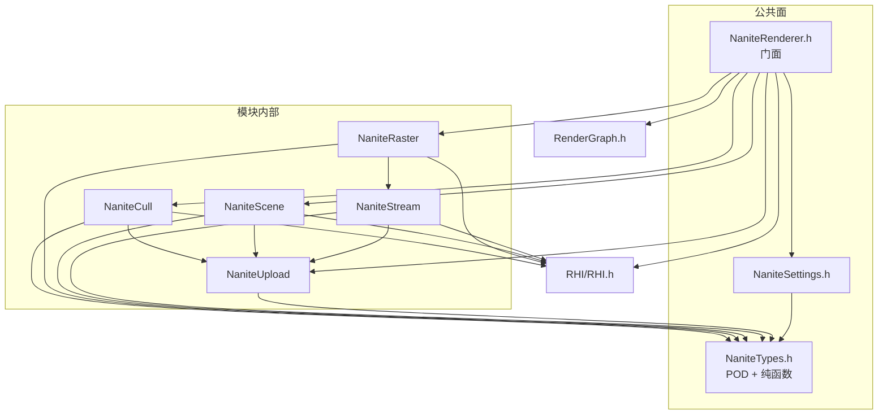
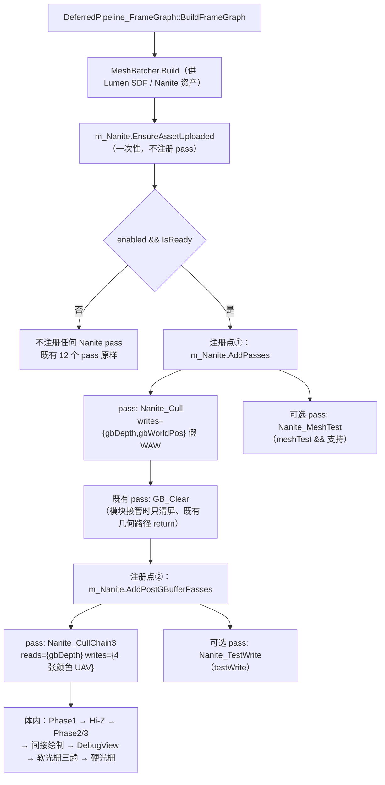
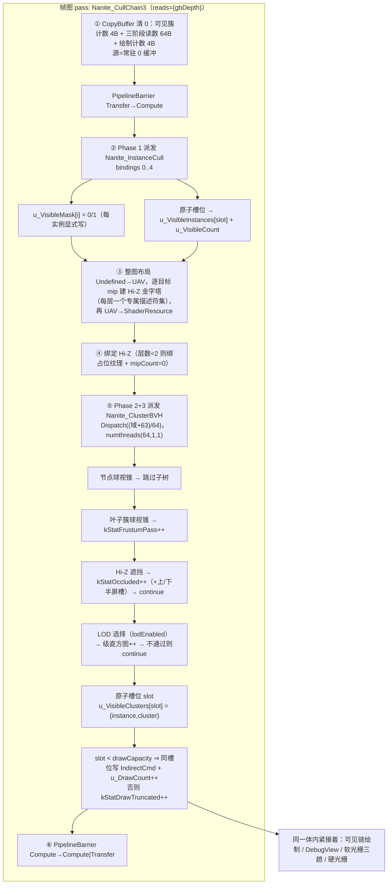
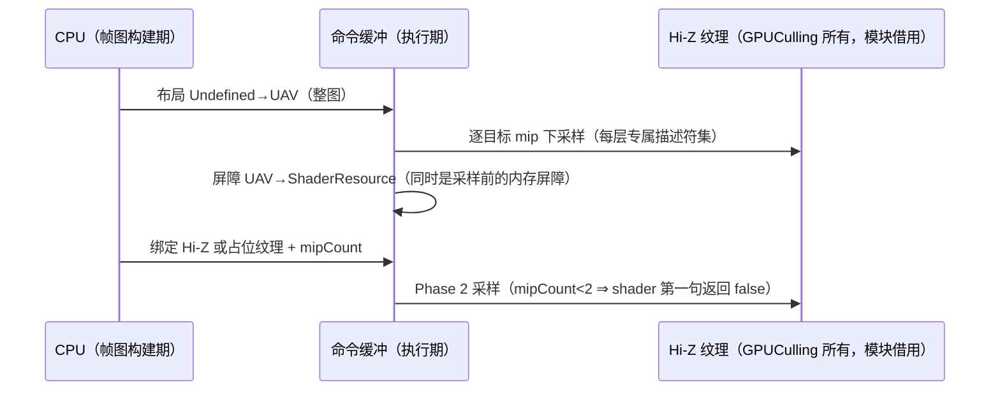
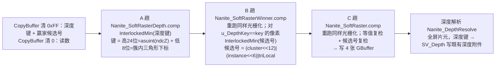
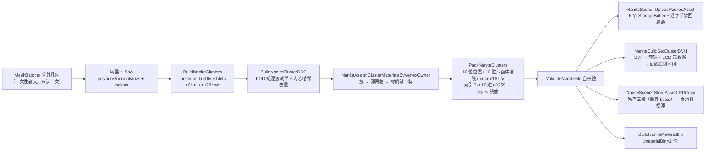
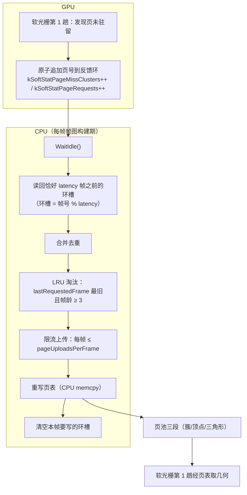
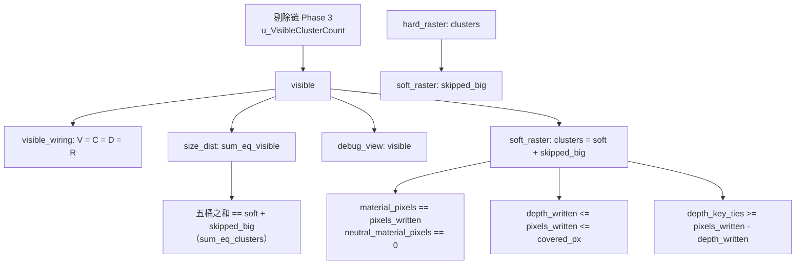
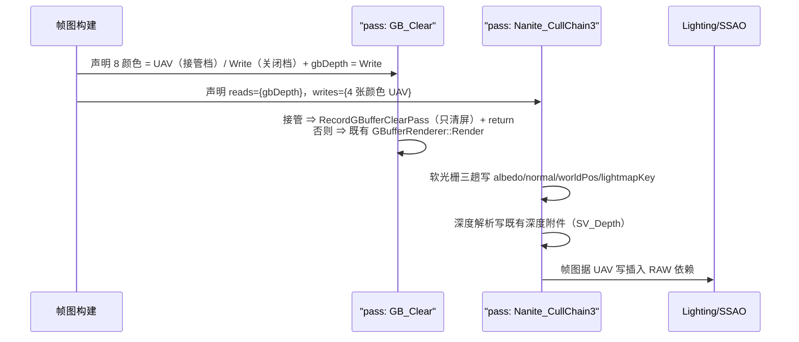

# HugEngine Nanite 实现分析：数学原理、架构设计与实现细节

> **本文定位**：面向"要读懂 / 修改 / 扩展 Nanite"的读者，按 **数学原理 → 架构设计 → 实现细节** 三层组织：
> 第一部分讲"**为什么这样算**"（LOD 误差度量与 DAG 割、锥体与视锥剔除、屏幕空间误差、量化与解码、
> 软光栅与确定性仲裁的数学、Hi-Z、BVH、页与流式、材质归属与软硬分流）；
> 第二部分讲"**怎么拼起来的**"（模块边界、帧图集成、剔除链次序、资产与流式管线、开关门控、
> 读数契约、数据结构 ABI）；
> 第三部分讲"**代码在哪里、怎么做**"（CPU 各文件与 20 个着色器逐项，含 `file:line`）。
>
> **与设计文档的分工**：设计意图、任务清单与逐次验收记录在
> [`docs/已实现功能/Nanite设计与实现.md`](../已实现功能/Nanite设计与实现.md)；本文**不重复**那份的任务史，
> 只做面向实现的代码级分析。两处说法冲突时**以代码为准**，并在正文注明。
>
> **引用约定**：形如 `Engine/Render/Nanite/NaniteTypes.h:676` 的引用指向仓库内真实文件与行号，
> 均已对着当前 HEAD 核对过；凡未能亲自核实的说法一律就地标注**（未能复核）**。
> 本文由四份并行撰写的分析片段合并而成，各部分的"复核说明与遗留问题"集中在文末附录。

## 目录

- [第一部分 · 数学原理](#第一部分--数学原理)
  - [1.1 簇与 LOD 的误差度量](#11-簇与-lod-的误差度量)
  - [1.2 DAG 割判据](#12-dag-割判据)
  - [1.3 锥体剔除（cone culling）的数学](#13-锥体剔除cone-culling的数学)
  - [1.4 视锥测试](#14-视锥测试)
  - [1.5 量化与解码的数学](#15-量化与解码的数学)
  - [1.6 软光栅的数学](#16-软光栅的数学)
  - [1.7 深度键编码与"等价于取最近"的论证](#17-深度键编码与等价于取最近的论证)
  - [1.8 确定性赢家仲裁的数学](#18-确定性赢家仲裁的数学)
  - [1.9 Hi-Z 遮挡测试的数学](#19-hi-z-遮挡测试的数学)
  - [1.10 BVH 的数学](#110-bvh-的数学)
  - [1.11 页与流式的数学](#111-页与流式的数学)
  - [1.12 材质归属与软硬分流的数学](#112-材质归属与软硬分流的数学)
  - [附：本节引用到的常量速查（全部已核实行号）](#附本节引用到的常量速查全部已核实行号)
- [第二部分 · 架构设计](#第二部分--架构设计)
  - [2.1 模块边界与文件职责](#21-模块边界与文件职责)
  - [2.2 帧图集成](#22-帧图集成)
  - [2.3 剔除链三阶段 + Hi-Z 的次序与依赖](#23-剔除链三阶段--hi-z-的次序与依赖)
  - [2.4 软光栅三趟与硬光栅 mesh shader 的分工](#24-软光栅三趟与硬光栅-mesh-shader-的分工)
  - [2.5 资产管线](#25-资产管线)
  - [2.6 流式架构](#26-流式架构)
  - [2.7 开关与门控](#27-开关与门控)
  - [2.8 读数契约](#28-读数契约)
  - [2.9 数据结构与 ABI](#29-数据结构与-abi)
  - [2.10 模块与引擎其余部分的接口](#210-模块与引擎其余部分的接口)
- [第三部分 · 实现细节](#第三部分--实现细节)
  - [3.1 NaniteUpload —— 离线纯函数与资产上传](#31-naniteupload--离线纯函数与资产上传)
  - [3.2 NaniteCull —— cluster BVH、可见簇列表与间接命令](#32-nanitecull--cluster-bvh可见簇列表与间接命令)
  - [3.3 NaniteRaster —— PSO、缓冲、派发次序与读回](#33-naniteraster--pso缓冲派发次序与读回)
  - [3.4 NaniteRenderer —— 门面、门控与读数行](#34-naniterenderer--门面门控与读数行)
  - [3.5 NaniteScene 与 NaniteStream —— 资产留存、页表、页池与反馈](#35-nanitescene-与-nanitestream--资产留存页表页池与反馈)
  - [3.6 关键不变量与它们的守卫](#36-关键不变量与它们的守卫)
  - [3.7 剔除链着色器](#37-剔除链着色器)
  - [3.8 软光栅着色器](#38-软光栅着色器)
  - [3.9 硬光栅着色器](#39-硬光栅着色器)
  - [3.10 深度解析与 GBuffer 清屏](#310-深度解析与-gbuffer-清屏)
  - [3.11 调试可视化与自证/测试用着色器](#311-调试可视化与自证测试用着色器)
  - [附：复核说明与遗留问题](#附复核说明与遗留问题)
# 第一部分 · 数学原理

> 口径声明（全文适用）：
> · 每一个 `file:line` 都是**对着当前源码逐行核实**的结果；无法核实的条目一律显式标注 `（未能复核）`。
> · 公式分三类来源，文中逐条标出：**源码/代码注释**（直接引用）、**设计文档结论**（`docs/已实现功能/Nanite设计与实现.md`，注明节号）、
>   **本文的推理解释**（对代码行为的解释性推导，不是从源码里读出来的）。
> · 当设计与代码冲突时**以代码为准**，并在文中标注冲突点（完整清单见本次交付的配套报告）。

---

## 1.1 簇与 LOD 的误差度量

### 1.1.1 `maxParentLODError` 的定义与来源

**定义（源码注释的口径）**：`NaniteClusterRecord::maxParentLODError`（`Engine/Render/Nanite/NaniteTypes.h:532`，偏移 48）
= "切到父级 LOD 的误差阈值"，也就是**用父簇替代本簇**渲染时引入的绝对几何误差。

**来源是一整条计算链**（全部在 `Engine/Render/Nanite/NaniteUpload.cpp` 的 `BuildNaniteClusterDAG` 里）：

1. LOD 链每级把本级簇组合并回索引表，再调 `meshopt_simplify` 目标 = 上一级三角形数的一半
   （`NaniteUpload.cpp:620-630`），终止条件有三条（`NaniteUpload.cpp:614-617`、`:632-636`）：
   级数达 `kNaniteMaxLODLevels = 6`（`NaniteUpload.h:222`）、下一级目标不足一个满簇
   （`kNaniteMinLODTriangles = 64`，`NaniteUpload.h:224`）、简化没有减少索引数。
2. `meshopt_simplify` 回吐的 `relativeError` 是**相对**误差，乘网格尺度得到绝对误差
   （`NaniteUpload.cpp:639-642`）：

   $$
   \text{absoluteError} = \text{relativeError} \times \mathrm{meshopt\_simplifyScale}(\text{positions},\ \text{vertexCount},\ \text{stride})
   $$

   这个 `absoluteError` 按级存进 `stepErrors[level]`（`NaniteUpload.cpp:642`）。
3. 兜底：meshopt 报 0 或负数时，改用**几何兜底界**
   （`NaniteUpload.cpp:668-671`）：

   $$
   \text{bound} = \left\| \mathrm{center}(\text{child}) - \mathrm{center}(\text{parent}) \right\| + \mathrm{radius}(\text{child})
   $$

   即"父簇球心到子簇球边界的最大距离"——一个必然覆盖该次 LOD 切换位移的保守上界。
4. 逐簇写回（`NaniteUpload.cpp:717-727`）：

   ```text
   error(L) = (L + 1 < levelCount) ? (stepErrors[L] 或 levelFallbackError[L]) : 0
   ```

   注意 `L + 1 == levelCount` 时 `error` 保持 0 —— 这就是**"根写 0"**的落点：
   最粗一级（根）没有父级，因此它的 `maxParentLODError` 恒为 0。
   同时 `stats.maxLODError` 取全簇最大值，写进文件头（`NaniteUpload.cpp:1063` →`NaniteTypes.h:459`）。

**为什么这样设计**：
· 同一个 LOD 级的所有簇**共用那一次简化的误差**（`NaniteUpload.cpp:722` 只按 `level` 取值，不看簇），
  因此它是该级的**保守上界**而不是逐簇精确误差。设计文档把这条如实记成"偏保守（32 单位网格实测 22.19），
  方向安全（LOD 切换偏晚 = 偏细）"（`docs/已实现功能/Nanite设计与实现.md` §14.19 ⑥2，文档结论）。
· 用"绝对误差"而不是"相对误差"：判据要与相机距离、像素焦距相乘比较，必须是世界单位。

### 1.1.2 `ownError` / `parentError` 的构造

每簇的 LOD 元数据是 `NaniteClusterLODInfo`（`NaniteTypes.h:1389-1400`，16B：

| 偏移 | 字段 | 定义（源码注释 `NaniteTypes.h:1379-1386`） |
|---|---|---|
| 0 | `ownError` | 用本簇替代它的**全部孩子**渲染时的绝对误差 = 孩子记录的 `maxParentLODError`（叶子 = 0） |
| 4 | `parentError` | 用本簇的**父簇替代本簇**渲染时的绝对误差 = 本簇自己的 `maxParentLODError`（根 = 0） |
| 8 | `lodLevel` | 本簇所属 LOD 级（0 = 最细） |
| 12 | `flags` | bit0 = 根簇（`kNaniteLODInfoFlagRoot = 1u`，`NaniteTypes.h:1403`） |

**代码落点** `BuildNaniteClusterLODInfo`（`NaniteUpload.cpp:1737-1798`）：

$$
\begin{aligned} \text{ownError} &= (\text{childCount} > 0)\ ?\ \text{clusters}[\text{childClusterOffset}].\text{maxParentLODError} : 0 \\ \text{parentError} &= \mathrm{max}(\text{record}.\text{maxParentLODError},\ 0) \end{aligned}
$$
// :1786-1788、:1791

两者都做了 NaN/负值归零的防御（`:1788`、`:1791`）。注意 `lodLevel` 是**单次线性扫描**推出来的
（`:1772`、`:1778-1783`：簇表按级升序，取满足 `lodOffsets[L] <= i` 的最大 L），不是二分。

**为什么要两个误差而不是一个**：它们回答两个不同的问题 —— `ownError` 回答"本簇够不够好"
（可不可以停止细化），`parentError` 回答"父簇是不是已经够好"（如果父簇够好，本簇就不该出现）。
只有两者配合才能把"选哪一级"写成一条**局部判据**（见 1.2）。

### 1.1.3 为什么"根簇必须显式判定"

这是本节唯一一处**必须用标志位而不能用数值**的地方。

判据的第二条（见 1.2）写的是"**父簇不够好**才选本簇"。如果按数值实现成
`parentError > 阈值` 的反面（即 `parentError <= 阈值 ⇒ 父簇够好 ⇒ 不选`），
那么**根簇会被永远筛掉**——因为根的 `parentError` 恰好也是 **0**
（`NaniteUpload.cpp:721-724` 的"根写 0"），而 0 在任何正阈值下都满足 `<= 阈值`。
后果不是"少画一点"，而是**一个簇都选不出来**。

源码把这条写死在三处：

· 结构注释 `NaniteTypes.h:1387-1388`：
  "**必须显式给出**：根的 `parentError` 也是 0，若只靠 `parentError == 0` 判断，根会被永远判成
  '父簇够好'⇒ 一个簇都选不出来"。
· 判据实现 `NaniteTypes.h:1458`：`if ((info.flags & kNaniteLODInfoFlagRoot) != 0u) return true;`
  —— **先判根、再判 `parentError`**。
· GPU 侧同构 `Engine/Shader/Shaders/Nanite/Nanite_ClusterBVH.comp.slang:326`：`if ((info.flags & 1u) != 0u) return true;`
  以及该文件的注释 `:317` 复述了同一条理由。

`flags` 本身是**推导**出来的，不是构建期记下来的：`BuildNaniteClusterLODInfo` 先把所有
`childClusterOffset/childCount` 展开成 `hasParent[]`（`NaniteUpload.cpp:1756-1769`），
再令 `flags = (hasParent[i] == 0) ? 根 : 0`（`:1793`）。这条展开同时给出越界防御（`:1761-1765`）。
`childClusterOffset` 的布局本身由 DAG 构建保证"按出现下标升序"（`NaniteUpload.cpp:708-715`），
所以"没有被任何簇引为孩子"就是根。

---

## 1.2 DAG 割判据

### 1.2.1 为什么 Phase 3 的 LOD 选择是"在 DAG 上切一刀"

DAG 的节点是**簇出现**（occurrence），边是 `childClusterOffset/childCount` 给出的父子关系；
每个非根簇恰有一个父、父级一定更粗（`NaniteUpload.cpp:651-706` 的认父算法），因此这个图**无环**，
并且根唯一（`NaniteTypes.h:1387`）。

误差沿级**单调**（`maxParentLODError` 随级递增，`NaniteTypes.h:1446`），于是把每个簇按
"它的投影误差是否超过阈值"分成"够好 / 不够好"两类之后，沿着**任意一条根→叶的链**
误差是单调的，因此这条链上"够好"的判定至多翻转一次 —— 这一刀就是 LOD 边界。
把每条链的那一刀合起来，得到的就是可见簇集合。源码把这个形态直接写成一句
"**为什么这样就得到一条'割'**"（`NaniteTypes.h:1446-1449`）。

### 1.2.2 判据的数学形式

**误差 → 像素**（`NaniteTypes.h:1320-1332` 的"量纲修正"注释，以及 `NaniteTypes.h:1417-1429`）：

$$
\begin{aligned} \text{projectedErrorPixels} &= \frac{\text{error}}{\text{distance}} \times \text{focalPixels} \\ \text{focalPixels} &= \frac{0.5 \times \text{screenH}}{\mathrm{tan}(\text{fovY} / 2)} \end{aligned}
$$
// = 半屏高 × 投影矩阵 m11

`NaniteClusterLODFocalPixels` 实现（`NaniteTypes.h:1423-1429`）：
`screenH <= 0` 或 `tan(fov/2)` 过小 ⇒ 返回 0（`focalPixels == 0` 表示**关闭 LOD 选择**）。

**谓词**（`NaniteTypes.h:1434-1438`）：

$$
\text{NaniteLODErrorTooCoarse}(\text{error},\ \text{distance},\ \text{focal},\ \text{threshold}) \Leftrightarrow \text{error} \times \text{focal} > \text{threshold} \times \text{distance}
$$
// 乘法形式，等价于除法但少一次舍入

距离下限兜底 `kNaniteLODMinDistance = 1.0e-4`（`NaniteTypes.h:1367`、`:1436`），
GPU 侧同常量同分支（`Nanite_ClusterBVH.comp.slang:323`）。

**DAG 割判据**（`NaniteTypes.h:1451-1460`）：

$$
\text{selected}(\text{info}, d) \Leftrightarrow \neg\,\text{TooCoarse}(\text{info}.\text{ownError},\ d) \land \left( \text{isRoot}(\text{info}) \lor \text{TooCoarse}(\text{info}.\text{parentError},\ d) \right)
$$
// ① 本簇已经够好
// ② 父簇不够好（根簇自动成立）

`focalPixels <= 0` ⇒ 直接返回 true（不筛任何簇，退化为"全选"，`NaniteTypes.h:1454`）。
阈值取自设计原文"threshold = 1 pixel"：`kNaniteLODThresholdPixels = 1.0f`（`NaniteTypes.h:1363`，**数值未改**）。

GPU 侧逐句同构：`Nanite_ClusterBVH.comp.slang:319-328`（`lodSelected`），调用点 `:423-428`。
CPU 参考实现与 GPU 用同一判据（`NaniteTypes.h:1928-1944`）。

**判据的固有边界（源码如实记录）**：这是**逐簇局部**判据，父子簇的投影距离跨过阈值时
**可能同时选中父子两级**；真实 Nanite 用"父不可见则孩子不遍历"的 DAG 遍历消掉它。
本仓库的遍历是在**BVH（空间层次）** 上做的（`NaniteTypes.h:1847-1967`、`Nanite_ClusterBVH.comp.slang:330-474`），
判据只被当作叶子里的一个纯谓词调用，**没有**"父簇被选中 ⇒ 不再访问其孩子"的剪枝。
⇒ 因此"至多一个交点"这条结论在本实现里是**近似的**，源码把它记录为已知边界
（`NaniteTypes.h:1447-1449`：可接受的理由是"CPU 与 GPU 用同一判据 ⇒ 不影响 逐簇一致 这条验收"）。

### 1.2.3 `lodHistogram`

```text
lodHistogram[L] = 被选中的 L 级簇引用数          // 长度固定 kNaniteLODHistogramLevels = 8
```

· 定义与长度：`NaniteTypes.h:1372`（`kNaniteLODHistogramLevels = 8u`）、`:1373-1374`（`static_assert >= 6`，
  因为 LOD 链上限是 6 级）。
· CPU：`NaniteTypes.h:1809-1811`（结构体字段）、`:1941-1943`（写入，越界级钳到最后一槽）。
· GPU：`Nanite_ClusterBVH.comp.slang:426-427`（`level = min(lodLevel, 7)`）。
· 读回：`NaniteCull.h:180`、`NaniteRenderer.cpp:1306-1320`（`cull3` 行的 `lod=[…]` 与 `cpu_lod=[…]` 并列）。

**为什么是 8 而不是 6**：`NaniteTypes.h:1369-1371` 说明这是**反向依赖**的规避 ——
`NaniteTypes.h` 不能 include `NaniteUpload.h`（那是 Types→Upload 的反向依赖），
所以取 8（2 的幂、且 ≥ 6）。这正是"直方图上界由本文件自持"的设计取舍。

---

## 1.3 锥体剔除（cone culling）的数学

> ⚠ **本节最重要的核实结论（先写在最前）**：锥数据**被完整地算出并落盘**，但**在本仓库中没有任何剔除路径消费它**。
> 详见 1.3.4。以下 1.3.1–1.3.3 描述的是"数据与判据的数学"，其中判据函数是一个**当前无调用点**的函数。

### 1.3.1 `NaniteConeAxisAngle` 的轴角表示

```text
axis[3]        : 单位锥轴（单位向量）
cosHalfAngle   : cos(锥半角)      ← 就是 meshopt 的 cone_cutoff
```

· 结构定义与偏移：`NaniteTypes.h:490-497`（16B，`axis` 偏移 0、`cosHalfAngle` 偏移 12；
  Slang 镜像是 `Engine/Shader/Shaders/Nanite/NaniteTypes.slang:132-135`，簇记录里摊平成 `float4 coneAxisAngle`，`:140`）。
· "无锥"哨兵：`cosHalfAngle == kNaniteConeNoCullCos = -1.0f`（`NaniteTypes.h:483-485`），
  语义是"半角 180° ⇒ 恒不可被锥剔除"，此时 `axis` **允许为 0 向量**。
· 合法性判据 `IsValidConeAxisAngle`（`NaniteTypes.h:499-511`）：`cos ∈ [-1,1]`（含 NaN 拒绝）
  且轴模长平方与 1 的差 ≤ `kNaniteConeAxisTolerance = 1e-3`（`NaniteTypes.h:488`）；
  哨兵分支**跳过长检查**（`:503`）。
· 半角反解 `NaniteConeHalfAngleRadians = acos(clamp(cos))`（`NaniteTypes.h:513-518`），哨兵给出 π。
· 落盘口径：`MakeConeAxisAngle`（`NaniteUpload.cpp:69-88`）——`cone_cutoff` 直接搬运并夹到 `[-1,1]`；
  若 `cone_axis` 模长平方为 0（meshopt 给不出可用锥：三角形全零面积等），
  写 `axis = 0` + `cosHalfAngle = -1`（**不伪造一个单位轴**，`NaniteUpload.cpp:71-80`），
  并计入 `noConeClusterCount`（`NaniteUpload.cpp:437`、`:611`；`NaniteUpload.h:106`）。
· **一个容易误读的口径**：簇切分时 `meshopt_buildMeshlets` 的 `cone_weight = 0.0f`
  （`NaniteUpload.cpp:358`），即**锥不参与簇形状优化**，只作为事后统计/落盘的副产品。
  设计文档确认 `cone_cutoff` 就是剔除测试里的那个 cos（`docs/已实现功能/Nanite设计与实现.md`
  不直接涉及；依据见 `NaniteUpload.h:76-79` 的核实话术与上述代码）。

### 1.3.2 判据与保守性

判据函数（`NaniteTypes.slang:430-435`）：

$$
\text{naniteConeCulls}(\text{axis},\ \text{cosHalfAngle},\ \text{directionToCluster}) \Leftrightarrow \text{cosHalfAngle} \ne -1 \land \mathrm{dot}(\mathrm{normalize}(\text{directionToCluster}),\ \text{axis}) \ge \text{cosHalfAngle}
$$

即：**视线方向与锥轴的夹角 ≤ 锥半角** ⇒ 整个法线锥背向相机 ⇒ 可剔除。

**保守性（宁可多留不可误杀）体现为三层**：

1. **哨兵层**：`cosHalfAngle == -1` 恒返回 false（不剔除）。对"网格边界/薄壳上法线铺开接近半球"的簇，
   meshopt 会直接给出退化的 cone（两种退化形态记在 `NaniteUpload.h:86`：
   `cone_cutoff = 1`（该簇不参与锥剔除）与"簇内三角形全是零面积 ⇒ 返回全零 bounds"；
   代码落点 `MakeConeAxisAngle`），本实现把它映射成"永不剔除"而不是"用 0 轴参与运算"。
2. **数据层**：`cone_weight = 0`（`NaniteUpload.cpp:358`）⇒ 锥没有被优化得"刚好贴合"，
   落盘的锥只会比真实法线分布更宽。
3. **判据层**：判据是"锥全部背向"才剔除（`>= cosHalfAngle` 而不是 `>` 某个收紧值），
   且**没有**乘任何收缩系数。对比 meshoptimizer demo 里那条更激进的写法
   （`Engine/External/meshoptimizer/demo/main.cpp:1061`：`dot(...) >= cutoff*len + radius`，
   把包围球半径也当作保守量加进去），本仓库的判据**没有加半径项** ——
   这一条是"若将来真的接入锥剔除时需要重新论证"的点（3 中列在报告里）。

### 1.3.3 与包围球视锥测试的分工

两者在数学上是**互补而不同**的判据：

| 判据 | 剔除的是什么 | 依据的几何量 | 本仓库的实现位置 |
|---|---|---|---|
| 包围球 vs 6 平面 | **位置**在视锥外（背面/侧面/前后） | `boundsCenterRadius`（球心 + 半径） | `NaniteTypes.h:1293-1305`（CPU）、`Nanite_ClusterBVH.comp.slang:240-248`（GPU） |
| 法线锥 | 位置可能在视锥内、但**朝向**背对相机的整簇（如背面密集簇） | `coneAxisAngle`（轴 + cos 半角）+ 相机位置 | **只有定义，无调用点**（`NaniteTypes.slang:432`） |

分工的设计意图是：视锥测试是**粗筛**（所有簇都做，判据最便宜：6 次点积），
锥剔除是**补充**（位置在视锥内但朝向背对，视锥测试完全看不见这种情况）。
两者都必须保守，否则会漏画。

### 1.3.4 核实结论：锥剔除在本仓库**未被接入**

证据（逐条可复核）：

1. 全仓库对 `naniteConeCulls` 只有 **1 处**匹配 —— 它的定义 `NaniteTypes.slang:432`，
   **没有任何调用点**（对整个仓库 grep 该标识符得到唯一一条）。
2. `Nanite_ClusterBVH.comp.slang` 的叶子判据只有 `sphereVisibleInFrustum`（`:406`）→
   可选的 `hizOccluded`（`:414`）→ 可选的 `lodSelected`（`:424`），**没有**任何锥测试。
3. CPU 参考遍历同样只有 `NaniteSphereVisibleInFrustum`（`NaniteTypes.h:1913`），无锥测试。
4. Nanite 模块内的 `cone` 出现处只有：类型/常量定义（`NaniteTypes.h`）、构建与统计
   （`NaniteUpload.cpp:69/390/437/611`）、以及测锥字段合法性的单测（`Tests/TestNaniteBuilder.cpp:494/1011` 等）。
5. `naniteConeCulls` 也**没有**被单测引用（`Tests/TestNaniteTypes.cpp` 只测 `IsValidConeAxisAngle` /
   `NaniteConeHalfAngleRadians`：`:900-942`）。

⇒ **本节的数学描述的是"已落盘的数据契约 + 一个待接入的判据"，不是当前运行的剔除路径。**
（这与设计 §5.1 的 Phase 2 原文只写 "Frustum cull cluster bounds" 是一致的：
设计里本来也没把锥剔除列进 Phase 2。）本报告把它列为"文档-代码认知偏差"的第 1 条候选。

---

## 1.4 视锥测试

### 1.4.1 平面约定

6 个平面用 POD `NaniteFrustumPlanes`（`NaniteTypes.h:1236-1241`，`float planes[6][4]`，96B）：

```text
planes[i] = (n.xyz, d) ； dot(n, p) + d >= 0 表示 p 在平面内侧
顺序        = [左, 右, 下, 上, 近, 远]
法线        = 已归一化
```

坐标系口径：实例的 `boundsMin/boundsMax`、包围球球心与视锥平面**全部是世界空间**
（`NaniteTypes.h:1132-1140`）。簇球的球心是**资产网格空间**，世界球 = 网格空间球心 + 实例平移
（列主序 `localToWorld[12..14]`；`NaniteTypes.h:1876-1881`、`Nanite_ClusterBVH.comp.slang:379`）。

### 1.4.2 `NaniteExtractFrustumPlanes` 的数学（Gribb/Hartmann 行组合）

实现：`NaniteTypes.h:1250-1285`。取列主序 view-proj 的 16 个 float（`m[col*4 + row]`），然后

- 左 : $ \text{row}_3 + \text{row}_0 $ 右 : $ \text{row}_3 - \text{row}_0 $
- 下 : $ \text{row}_3 + \text{row}_1 $ 上 : $ \text{row}_3 - \text{row}_1 $
- 近 : $ \text{row}_2 $ （Vulkan [0,1]：z >= 0 ⇒ 直接取 row2，不是 row3+row2）
- 远 : $ \text{row}_3 - \text{row}_2 $

`makePlane` 的循环体（`NaniteTypes.h:1257-1262`）：`outPlane[col] = m[col*4+3] + sign * m[col*4+row]`。
随后**按 xyz 长度归一化**（`:1273-1283`），且注释明确"不取反、保留 Gribb/Hartmann 原始朝向"。

与既有实现逐字同源（已核实）：`Engine/Core/Math/Geometry.cpp:12-45` 的 `he::Frustum::FromViewProj`
是同一套 `makePlane(rowN, add)`（`:19-27`）、同样的平面顺序（`:29-35`）、同样的"不取反、只按长度归一化"
（`:37-42`）、同样的近平面取 `row2`（`:33-34` 的注释写明是 Vulkan [0,1] 而非 OpenGL 的 `row3+row2`）。

**为什么归一化**：球-平面距离判据 `dot(n,c)+d < -r` 只有在 $ \|n\| = 1 $ 时量纲才等于"世界距离"，
否则阈值会被 $ \|n\| $ 缩放（`NaniteTypes.h:1273`）。

**为什么 CPU 要自己写一份而不是调 `he::Frustum`**：`NaniteTypes.h` 是 RHI-free 的（`NaniteTypes.h:18-21`），
而 `he::Frustum` 牵入 `Math/Geometry.h`（本不在它的依赖白名单内）；两处的一致靠单测比对同一个 view-proj
的逐平面结果（`NaniteTypes.h:1246-1248`）。

### 1.4.3 球-平面判据与 CPU/GPU 逐项一致

可见 ⇔ $ \forall i \in [0, 6) : \mathrm{dot}(n_i, c) + d_i \ge -r $

CPU：`NaniteSphereVisibleInFrustum`（`NaniteTypes.h:1293-1305`），
`radius < 0` 按 0 处理（`:1296`），任一面 `distance < -radius` ⇒ 不可见（`:1302`）。
GPU：`sphereVisibleInFrustum`（`Nanite_ClusterBVH.comp.slang:240-248`），逐字符同一表达式与同一比较符
（`:242` 的半径归零、`:245` 的 `if (distance < -r) return false`）。

与 `he::Frustum::Intersects(Sphere)`（`Geometry.cpp:78-87`）**完全一致**（无 epsilon）。
**注意不要与 AABB 版本混淆**：`Frustum::Intersects(const AABB&)`（`Geometry.cpp:53-71`）用了
`+ 0.001f` 的 epsilon（`:67`），而球版本没有 —— 这是两条不同的判据，Nanite 只复用球版本
（源码明确写了"不加 epsilon，与 GPU 侧同一判据"：`NaniteTypes.h:1137-1139`）。

**为什么簇球表要单独落一张而不是让 shader 读 64B 的簇记录**：① 访存步长小 4 倍；
② 由 CPU 从 `boundsCenterRadius` **逐位搬运**（`NaniteUpload.cpp:1652-1660`），
CPU 参考与 GPU 读**同一份比特**，避免"GPU 现推 sqrt 的末位差异翻转边界可见性"
（`NaniteTypes.h:1760-1765`）。这条纪律在实例包围球上有同样表述（`NaniteTypes.h:1198-1202`）。

簇球半径的构建期防御：`SanitizeClusterBVHRadius` 把 NaN/负值归 0（`NaniteUpload.cpp:1471-1473`），
与遍历期"radius < 0 按 0"同口径（`NaniteUpload.cpp:1467-1470`）。

### 1.4.4 "非法包围盒 ⇒ 前置保留"的意义

问题描述里的 `!worldBounds.IsValid()` **不在 Nanite 模块内**。核实结果：

· `Engine/Render/SceneRenderer.cpp:87`：

  ```cpp
  if (!entries[i].worldBounds.IsValid() || frustum.Intersects(entries[i].worldBounds))
  ```

  即"**AABB 非法（min > max 的某一个轴）时，不做视锥测试、直接保留该网格**"。
· `AABB::IsValid()` 的定义是逐轴 `min <= max`：`Engine/Core/Math/Geometry.h:36`。
· 这是一条**保守前置**：非法 AABB 意味着"没有有效的空间范围可以判"，任何"通过测试才保留"的写法都会
  把它误杀；改成"非法就保留"则退化成"多画一点"，不会漏画。同一份分析文档也把它记为
  "剔除判定仅 `frustum.Intersects`"之外的另一条前置保留
  （`docs/HugEngine引擎介绍/15.多线程架构与渲染实现分析.md:791`，文档结论）。

**Nanite 模块内与之同精神的对应物**（不是同一段代码）：半径的"NaN/负值归 0"
（`NaniteTypes.h:1296`、`NaniteUpload.cpp:1471-1473`）与"N 个角跨越相机平面 ⇒ 保守不剔除"
（`NaniteTypes.h:1488-1490`、`:1513`、`:1565`、`:1568`；GPU 侧 `Nanite_ClusterBVH.comp.slang:281`、`:298`）。
即：**只要判据的输入不可用，一律倒向"保留"**。
（这四处是本文从代码逐条读出的同一口径；未在某一节集中表述过，故不指向具体文档节号。）

---

## 1.5 量化与解码的数学

三层落点：**C++ 权威实现**（`NaniteTypes.h` 的量化函数）、**Slang 镜像**（`NaniteTypes.slang` 的解码函数，
供 shader include）、**单测**（`Tests/TestNaniteTypes.cpp` 钉住往返误差与位边界）。
源码明确要求这三处（加设计 §8）逐字一致（`NaniteTypes.h:409-415`、`NaniteTypes.slang:15-21`）。

### 1.5.1 顶点位置：簇内局部量化 + 簇球心 + `meshMaxExtent`

**位域**：`packedPosition` 是 R10G10B10A2（x[9:0] y[19:10] z[29:20] w[31:30]），
三轴各 **10 位有符号**，`w = 1`。打包/解包：`NaniteTypes.h:607-618`；位宽常量 `:571-573`
（`kNaniteVertexQuantBits = 10`、`mask = 0x3FF`、`bias = 512`）。

**编码公式**（`NaniteQuantizePositionAxis`，`NaniteTypes.h:676-686`）：

$$
\begin{aligned} \text{signed} &= \mathrm{clamp}\left(\mathrm{round}\left(\frac{v - \text{origin}}{\text{range}} \times 1022\right),\ -512,\ +511\right) \\ \text{raw} &= \mathrm{clamp}_{10}(\text{signed} + 512) \end{aligned}
$$

**解码公式**（`NaniteDequantizePositionAxis`，`NaniteTypes.h:694-699`）：

$$
v' = \text{origin} + \frac{\text{raw} - 512}{1022} \times \text{range}
$$

其中 `1022 = kNaniteVertexQuantFullScale = 2 × 511`（`NaniteTypes.h:579-581`，带 `static_assert == 1022`）。
往返误差上界 = 半个量化步 = `range / 2044`（`:688`）。

**三轴解码**（Slang，`NaniteTypes.slang:300-311`）：

$$
\begin{aligned} \text{naniteDecodePosition}(\text{packed},\ \text{quantBias},\ \text{clusterCenter},\ \text{meshMaxExtent}) &= \mathrm{float3}\left( \mathrm{decodeAxis}((\text{packed} \gg 0)\ \&\ \text{0x3FF},\ c.x,\ \text{meshMaxExtent},\ \text{quantBias}), \right. \\ &\quad \mathrm{decodeAxis}((\text{packed} \gg 10)\ \&\ \text{0x3FF},\ c.y,\ \text{meshMaxExtent},\ \text{quantBias}), \\ &\quad \left. \mathrm{decodeAxis}((\text{packed} \gg 20)\ \&\ \text{0x3FF},\ c.z,\ \text{meshMaxExtent},\ \text{quantBias}) \right) \\ \text{naniteDecodeVertexPosition}(v,\ \text{cluster},\ \text{meshMaxExtent}) &= \text{naniteDecodePosition}(v.\text{packedPosition},\ v.\text{quantBias},\ \text{cluster}.\text{boundsCenterRadius}.xyz,\ \text{meshMaxExtent}) \end{aligned}
$$

`bias` 来自**顶点记录自己的** `quantBias` 字段（`NaniteTypes.h:595`，默认 +512）⇒ 解码**自包含**
（不需要外部常量表，裁决 #7/#9 的理由，`NaniteTypes.h:588-590`）。

**为什么 `origin` 是簇 AABB 中心、`range` 是整网格最大轴长**（这是**本节最关键的设计决定**）：

· 判据：调用口径固定为 `origin = boundsCenterRadius.xyz`（**簇 AABB 中心**）、
  `range = meshMaxExtent = max(bboxMax − bboxMin)`（**整网格**尺度）。见 `NaniteTypes.h:661-670`
  与 `NaniteTypes.slang:30-34`，以及调用点 `NaniteTypes.slang:394`。
· **不 clamp 的证明**：簇是网格的子集 ⇒ `|v − origin| ≤ 簇局部半轴长 ≤ meshExtent/2 = range/2`
  ⇒ `|signed| ≤ 511`，恒落在 `[-512, 511]` 内（`NaniteTypes.h:661-665`）。
  `range` 的**一半**恰好是"任何簇可能达到的最大半轴长"，所以这个基准既吃满 1024 个码点，
  又天然不溢出。函数内仍保留夹取（防御 NaN / 调错口径），并用
  `NanitePositionQuantizeClamps`（`NaniteTypes.h:707-716`）把它变成**可测读数** `positionClampCount`
  （`NaniteUpload.cpp:905-907`；`NaniteUpload.h:408` 注明"必须 0"）。
· **为什么不用"每簇自己的尺度"**：那会引入每簇尺度字段，并且会**破坏共享内容口径** ——
  DAG 去重后不同位置的簇共用同一份 `vertexOffset`（`NaniteTypes.h:585-587`），
  只有各自用自己的簇心才能还原到不同位置。这条就是 §14.19 的**硬约束①**
  （见 1.5.5）。
· **为什么改基准（相对设计 §8.4）**：原 `bboxMin` 口径把 `[bboxMin, bboxMin+maxExtent]` 映到有符号
  `[0, 511]`，盒内顶点只用到 10 位的上半段（等效 ~9 位）；改成盒中心 + 乘数 1022 后步长从
  `range/511` 减半到 `range/1022`，往返误差上界从 `range/1022` 收到 `range/2044`
  （`NaniteTypes.h:650-659`）。裁决记录在 `docs/已实现功能/Nanite设计与实现.md` §14.20 ①（文档结论）。
· 实测（文档结论，§14.20 ①）：4 个测试网格 `positionClampCount = 0`；
  往返误差"恰好压在上界"：6→0.002935、32→0.015656、48→0.023483、68→0.033268。

### 1.5.2 法线：八面体 10+10 位

**位域**：`packedNormal` 复用 R10G10B10A2 的 **x/y 两个 10 位域**，z、w **恒写 0**
（`NaniteTypes.h:720-723`、`:807-813`）。位值按 **UNORM** 解释（不走纹理采样语义）。

- [-1,1] → 10 位： $ \text{raw} = \mathrm{clamp}_{10}(\mathrm{round}(\mathrm{clamp}((v + 1) \times 0.5 \times 1023,\ 0,\ 1023))) $  // :741-748
- 10 位 → [-1,1]： $ v = \frac{\text{raw}}{1023} \times 2 - 1 $  // :751-753

**八面体编码**（`NaniteEncodeOctahedral`，`NaniteTypes.h:761-784`）：

```text
n ← normalize(n) ;   l1 = |x| + |y| + |z| ;   (x, y) ← (x/l1, y/l1)
if z < 0:                                   // 下半球折叠（abs 的分量是**交换**的）
    x ← (1 − |y|) × sgn0(x)
    y ← (1 − |x|) × sgn0(y)
```

**解码**（`NaniteDecodeOctahedral`，`NaniteTypes.h:787-805`）：

```text
z = 1 − |x| − |y|
if z < 0:  x ← (1 − |y|) × sgn0(x) ;  y ← (1 − |x|) × sgn0(y)
n ← normalize(float3(x, y, z))
```

三个必须在两处**逐字相同**的细节：

1. **符号函数用 `x >= 0 ? +1 : −1` 而不是 `sign(x)`**（`NaniteTypes.h:757-759`）：
   `x == 0` 必须稳定取 +1；Slang 的 `sign(0) = 0` 会直接把坐标清零，导致编解码两端在 0 附近取到不同符号。
   Slang 镜像用同一写法（`NaniteTypes.slang:341-342`、`:357-358`）。
2. **折叠时 abs 的分量是交换的**（`x` 用 `|y|`、`y` 用 `|x|`），这是八面体折叠的标准形式；
   两处注释都专门点出（`NaniteTypes.h:774`、`NaniteTypes.slang:340`）。
3. **退化输入**：零向量/NaN ⇒ 编码输出 `(0,0)`，解码回来是 `+Z`（往返自洽，`NaniteTypes.h:760`、`:800`）。

**为什么是 10 位而不是把整个 u32 当成 R16G16_SNORM**：位域表由 §8.4 定稿为 R10G10B10A2，
换成 R16G16 会同时改 C++/Slang/§8 三处（`NaniteTypes.h:724-728`）。
**角度误差上界**（源码给出的解析估计，`NaniteTypes.h:729-733`）：八面体把单位球双射到 `[-1,1]²`，
每轴 10 位 ⇒ 格距 2/1023；球面"面心"处角误差 ≈ 半格 ≈ 0.056°，棱/角附近放大约 2~4 倍，
实测最坏 < 0.2°。单测阈值取 `kNaniteNormalAngleErrorBoundDegrees = 0.5f`（2.5 倍余量，`:734-738`）。
误差度量用 `acos(dot)` 而不是 `1 − cos`（阈值下点积已在 0.99996 附近，`1−cos` 会丢有效位；
入参夹到 [-1,1] 以免 NaN）：`NaniteNormalAngleErrorRadians`，`NaniteTypes.h:826-831`。

**解码入口**（Slang）：`naniteDecodeNormal`（`NaniteTypes.slang:377-381`）= 两次
`naniteUnpackR10G10B10A2(packedNormal, 0/1)` → `naniteDequantizeUNorm10` → `naniteDecodeOctahedral`。
**注意 w 位不做 §8.4 的 "=1" 约定**（`NaniteTypes.h:807`）。

### 1.5.3 UV：R16G16_UNORM

- packedUV : u = 低 16 位、v = 高 16 位  // :625-633
- 编码： $ \text{raw} = \mathrm{lround}(\mathrm{clamp}(v \times 65535,\ 0,\ 65535)) $  // :850-856，NaN ⇒ 0
- 解码： $ v' = \frac{\text{raw}}{65535} $  // :859-861

· 位宽与满值：`kNaniteUVQuantMax = 0xFFFF`（`NaniteTypes.h:847`）。
· 往返误差 ≤ 1/131070（半个量化步，`NaniteTypes.h:858`）。
· **为什么不取 binary16**（`NaniteTypes.h:835-845`）：unorm16 在 `[0,1]` 上**均匀**，步长恒 1/65535；
  binary16 在 `(0.5,1)` 上间距 2^−11 ≈ 4.9e-4（是 unorm16 的 **32 倍**）；并且与 GPU 的
  `R16G16_UNORM` 采样语义一致。
· **如实的代价**：unorm16 表示不了越界 UV（`>1` 平铺 / `<0`）。本实现 **clamp 到 [0,1]**，
  越界分量计入 `NanitePackStats::uvClampCount`（`NaniteTypes.h:842-845`；判据 `NaniteUVNeedsClamp`
  `:864-866`；读数落点 `NaniteUpload.h:420`）。
· **解码入口**（Slang）：`naniteDecodeUV`（`NaniteTypes.slang:399-402`），
  逐分量 `naniteDecodeUVComponent`（`:394-396`）。

### 1.5.4 三角形索引：3×u16 进 `u32[2]`（8B/三角形）

$$
\begin{aligned} \text{lo} &= i_0 \mid (i_1 \ll 16) \\ \text{hi} &= i_2 \end{aligned}
$$
// i0 低 16 位、i1 高 16 位
// 高 16 位保留写 0

· 结构：`NanitePackedTriangle`（`NaniteTypes.h:881-889`，8B，`static_assert` 钉住尺寸与偏移）。
· 打包/取索引：`NanitePackTriangle` / `NaniteTriangleIndex0/1/2`（`NaniteTypes.h:892-910`）。
· **索引语义**：i0/i1/i2 是**簇内局部**顶点下标，合法区间 `[0, 127]`；全局顶点下标 =
  `NaniteClusterRecord::vertexOffset + local`（`NaniteTypes.h:876-880`）；
  合法判据 `IsValidClusterLocalVertexIndex`（`NaniteTypes.h:912-915`，阈值 `kNaniteMaxClusterVertices = 128`，`:872`）。
· **为什么是 8B 而不是 12B**（裁决 #6，`NaniteTypes.h:395-398`）：两个候选都不是 16B 对齐 ⇒ 规则②不裁决、
  落到"取更省方案"⇒ 8B < 12B（索引带宽 −33%）；且每簇 ≤128 顶点让簇内下标只需 7 位，u16 绰绰有余。
· **结构性前提**：`indexCount` 必须是 3 的倍数（`IsNaniteTriangleIndexCount`，`NaniteTypes.h:922-924`），
  否则"三角形数 = indexCount/3"无法表示；校验函数以 `NaniteFileError::BadIndexCount` 挡住
  （`NaniteTypes.h:1035-1037`）。
· **解码入口**（Slang）：`naniteDecodeTriangle`（`NaniteTypes.slang:409-413`）：
  `uint3(lo & 0xFFFF, (lo >> 16) & 0xFFFF, hi & 0xFFFF)`。
  调用点：`Nanite_SoftRasterCommon.slang:384`（第 1/2/2.5 趟共用的取三角形函数）与
  `Nanite_SoftRaster.comp.slang:101`（第 2 趟为了取属性又取了一次）。

**每簇上限的两个常量**：`kNaniteMaxClusterTriangles = 64`、`kNaniteMaxClusterVertices = 128`
（`NaniteTypes.h:871-872`）。**注意**硬光栅的输出顶点数是 `3 × 64 = 192`（逐图元角点展开、不做索引去重），
与 128 不是同一个量（`NaniteTypes.h:2430-2432`、`Nanite_HardRaster.mesh.slang:26-30`）。

### 1.5.5 `meshMaxExtent` 与 §14.19 的硬约束①

**硬约束①的内容（文档结论 + 代码注释）**：位置解码必须用
"**簇内局部量化 + 各自的簇心 `boundsCenterRadius.xyz` + 整网格最大范围 `meshMaxExtent`**"，
**绝不能用"每簇自己的尺度"**；否则去重后的共享 `vertexOffset` 会让不同位置的簇解出错误的坐标
（`docs/已实现功能/Nanite设计与实现.md` §14.19 ⑥1；`NaniteTypes.h:585-587`、`:690-692`；
`NaniteTypes.slang:30-34`）。

**`meshMaxExtent` 的来源与传递路径**（已核实）：

1. 打包期算出并记入读数：`NaniteUpload.cpp:848` → `NanitePackStats::meshMaxExtent`
   （`NaniteUpload.h:405`，注释"= max(每轴范围)，与任务 9 同口径"）。
   同一个函数 `ComputeMeshBounds` 也被 DAG 构建复用（`NaniteUpload.cpp:479`），**口径只此一处**。
2. 运行期由 CPU 读回并塞进 push constant：`NaniteRenderer.cpp:613-618`（`m_MeshMaxExtent`），
   字段落点 `NaniteTypes.h:2217`（`NaniteSoftRasterParams::meshMaxExtent`，偏移 80；
   Slang 侧 `Nanite_SoftRasterCommon.slang:208`）。
3. shader 使用：`Nanite_SoftRasterCommon.slang:394`（`naniteDecodeVertexPosition(v, cluster, meshMaxExtent)`），
   第 2 趟写 worldPos 时再用一次（`Nanite_SoftRaster.comp.slang:147-150`）。
4. **可核对读数**：`diag_extent_milli`（`meshMaxExtent × 1000` 的定点回读）
   —— 软光栅侧 `NaniteTypes.h:2465`、`Nanite_SoftRasterDepth.comp.slang:35`；
   硬光栅侧 `NaniteTypes.h:2479`、`Nanite_HardRaster.mesh.slang:66`。
   它的用途正是"验证浮点字段没被错位读成 0"（`NaniteRaster.cpp:1941`）。

**为什么把它放进 push constant 而不是让 shader 从文件头算**：打包器已经算过真值，
且"同一个数两端只推一次"是本模块反复使用的纪律（`NaniteRenderer.cpp:613-617`）。

---

## 1.6 软光栅的数学

> 前置裁决（不是数学，但决定了下文的形态）：本仓库**不能**用"一趟 + ROV/interlock"。
> 依据是实测：Slang 2026.13 对 compute 入口里的 `RasterizerOrderedTexture2D` **静默降级**成普通
> `RWTexture2D`，且 SPIR-V 规定 interlock 的 execution mode 只对 Fragment 入口合法
> （`Nanite_SoftRasterCommon.slang:9-23`；`NaniteTypes.h:2181-2192`）。
> ⇒ 改成 **A 趟（原子深度键）→ B 趟（赢家仲裁）→ C 趟（等值复检写 GBuffer）**，零额外设备特性。

### 1.6.1 clip → NDC → 帧缓冲像素

**投影**（`SoftRasterProjectWorld`，`Nanite_SoftRasterCommon.slang:261-264`）：
view-proj 被拆成 **4 个 `float4` 行**（push constant `vpRow0..vpRow3`，`:200-203`），
每行与齐次点显式点积：

$$
\begin{aligned} \text{hp} &= \mathrm{float4}(\text{worldPos},\ 1) \\ \text{clip} &= \mathrm{float4}(\mathrm{dot}(\text{vpRow}_0,\ \text{hp}),\ \mathrm{dot}(\text{vpRow}_1,\ \text{hp}),\ \mathrm{dot}(\text{vpRow}_2,\ \text{hp}),\ \mathrm{dot}(\text{vpRow}_3,\ \text{hp})) \end{aligned}
$$

**为什么拆成 4 个行**：Slang 的 `float4x4` 行/列主序与内存 16 个 float 的对应依赖编译选项；
拆开后 `vpRow{r}` **无条件**是列主序矩阵的 row r（`Nanite_SoftRasterCommon.slang:196-197`、
`Nanite_ClusterBVH.comp.slang:56-60`）。CPU 侧按同一口径填（`NaniteTypes.h:2212`）。

**NDC 与像素**（`Nanite_SoftRasterCommon.slang:273-276`）：

$$
\begin{aligned} \text{ndc} &= \frac{\text{clip}.xyz}{\text{clip}.w} \\ \text{col} &= (0.5 + 0.5 \times \text{ndc}.x) \times \text{screenWidth} \\ \text{row} &= (0.5 - 0.5 \times \text{ndc}.y) \times \text{screenHeight} \end{aligned}
$$
← y 必须翻

**y 反转的原因**（`:266-272`）：引擎用 `glm::perspectiveRH_ZO`（NDC y 向上），而 Vulkan 帧缓冲 y 向下；
引擎的离屏通道统一用**负高度视口**（`SetViewport({..., -height, ...})`）抵消 ⇒ NDC y = +1 落在帧缓冲**第 0 行**。
⇒ $ \text{row} = (0.5 - 0.5 \cdot \text{ndc}.y) \cdot H $ 。同一条约定被剔除链的 Hi-Z 采样复用（见 1.9.3）。

**有效性判据**（`softRasterFetchTriangle`，`:374-420`）：

```text
三个顶点的 clip.w 都必须 > 1e-6        // :397 —— 跨越相机平面直接丢弃，不做近平面裁剪
ndc 中不得有 NaN                        // :403
|area2| > 1e-8 才算非退化               // :414-416
area2 = (p1.x − p0.x)(p2.y − p0.y) − (p2.x − p0.x)(p1.y − p0.y)
```

### 1.6.2 2D 包围盒

A/C 两趟（以及 B 趟）用**逐字相同**的四行（`Nanite_SoftRasterDepth.comp.slang:117-122`、
`Nanite_SoftRaster.comp.slang:113-118`、`Nanite_SoftRasterWinner.comp.slang:97-102`）：

$$
\begin{aligned} \text{lo} &= \mathrm{min}(p_0, p_1, p_2),\quad \text{hi} = \mathrm{max}(p_0, p_1, p_2) \\ \text{bmin} &= \mathrm{clamp}(\lfloor \text{lo} \rfloor,\ 0,\ (W - 1,\ H - 1)) \\ \text{bmax} &= \mathrm{clamp}(\lceil \text{hi} \rceil,\ 0,\ (W - 1,\ H - 1)) \end{aligned}
$$

**为什么用 `floor`/`ceil` 而不是 `±1`**：`floor(lo)` 是"第一个可能被覆盖的像素中心所在的行/列"，
`ceil(hi)` 是"最后一个"，因为像素中心取 `px + 0.5`、`py + 0.5`（`:128`）。
**为什么夹到 `W−1`/`H−1`**：把盒裁进帧缓冲，避免越界写；代价是"完全在屏幕外的三角形"的盒会退化成一个
边缘像素，由覆盖判据自己否掉（见下）。

循环体是"每线程一个三角形 × 盒内像素串行"（`:124-150`）——与设计 §5.2 的
"逐三角形光栅化（投影到屏幕、2D 包围盒、重心坐标）"一致，只是把"每簇一个 wave、像素级并行"
换成"每簇一个工作组、三角形级并行 + 像素串行"。源码把这一处组织差异与其三个好处写在工作组织小节
（`Nanite_SoftRasterDepth.comp.slang:10-16`）。

### 1.6.3 重心坐标覆盖判据（`softRasterCovered`）

实现：`Nanite_SoftRasterCommon.slang:426-456`。

$$
\begin{aligned} \text{e}_0 &= p_1 - p_0,\quad \text{e}_1 = p_2 - p_1,\quad \text{e}_2 = p_0 - p_2 \\ a_0 &= \text{e}_0.x\,(p.y - p_0.y) - \text{e}_0.y\,(p.x - p_0.x) \\ a_1 &= \text{e}_1.x\,(p.y - p_1.y) - \text{e}_1.y\,(p.x - p_1.x) \\ a_2 &= \text{e}_2.x\,(p.y - p_2.y) - \text{e}_2.y\,(p.x - p_2.x) \\ \text{area2} &= (p_1.x - p_0.x)(p_2.y - p_0.y) - (p_2.x - p_0.x)(p_1.y - p_0.y) \\ \text{flip} &= (\text{area2} < 0)\ ?\ -1 : +1 \end{aligned}
$$

**三个细节，每一个都有实测踩坑记录**：

1. **子面积的符号约定必须与 `area2` 一致**（`:430-433`）。写反会让子面积与总面积差一个负号
   ⇒ 三角形内部的三个边函数全为负 ⇒ **一个像素都覆盖不到**。
   源码记录的实测："61 个三角形、9767 次像素测试、0 次覆盖"。
2. **双面光栅化：必须按有向面积符号翻转**（`:437-445`）。屏幕空间顺时针绕序的三角形，
   三个边函数在内部**全为负**；统一乘 `sign(area2)` 后判据只依赖"点在不在三角形里"，与绕序无关。
   这与既有 GBuffer 路径默认的双面行为一致（cullMode 在模块内的软光栅里不适用，`:422-423`）。
   实测记录同上一处。
3. **极小容差 `kEdgeTolerance = −1.0e-4`**（`:446`）：接受 `a_i >= −1e-4`。
   浮点边函数在像素中心恰好落在线上的情形会因舍入抖动；**同一个常量在三趟里是同一个**
   ⇒ 覆盖集合逐位一致（等值复检成立的前提，`:424-425`）。

**退化/共线判据（两层）**：

```text
① 三角形层：|area2| > 1e-8，否则 tri.valid = false（softRasterFetchTriangle :414-416）
② 像素层：|a0 + a1 + a2| > 1e-12，否则返回 false（softRasterCovered :451-452）
```

②是除零保护：`bary = (a1, a2, a0) / sum`（`:453-454`，注意对应关系是
"`a1` 对顶点 0、`a2` 对顶点 1、`a0` 对顶点 2" —— 边函数与对角顶点的对应，`:453`）。

### 1.6.4 为什么 NDC 深度可以直接重心插值（不需透视校正）

代码里的结论与实现：`Nanite_SoftRasterDepth.comp.slang:131-132`（"NDC 深度是屏幕坐标的线性函数
⇒ 直接重心插值（不需要透视校正）"），代码为

$$
\text{ndcZ} = \text{bary}.x \times \text{tri}.\text{z}_0 + \text{bary}.y \times \text{tri}.\text{z}_1 + \text{bary}.z \times \text{tri}.\text{z}_2
$$

（`tri.z0/1/2` 是三个顶点的 NDC z，`:408`；同样三行出现在
`Nanite_SoftRaster.comp.slang:126` 与 `Nanite_SoftRasterWinner.comp.slang:111`。）

**为什么成立（本文的推理解释）**：

1. 对**平面三角形**上的点，`1/w` 是屏幕坐标的**仿射**函数（这是透视正确插值的标准前提）。
2. 本引擎的投影是 `glm::perspectiveRH_ZO`（`NaniteTypes.h:1420`、`Nanite_SoftRasterCommon.slang:267`），
   即 Vulkan `[0,1]` 深度。对右手系，`w_clip = −z_eye`，而
   `z_clip = m22·z_eye + m32`（`m22`、`m32` 为投影矩阵第 2 行元素）⇒

   $$
   z_{\text{ndc}} = \frac{z_{\text{clip}}}{w_{\text{clip}}} = -m_{22} + m_{32} \times \frac{1}{w_{\text{clip}}}
   $$

   即 `z_ndc` 是 `1/w` 的**仿射**函数。
3. 仿射 ∘ 仿射 = 仿射，而重心坐标本身就是屏幕坐标的仿射函数
   ⇒ `z_ndc` 在屏幕空间仿射 ⇒ **用重心坐标线性插值得到的就是精确值**。

**注意这条结论的两个前提**（都由代码保证）：
· 三角形是**平面**的（簇内三个顶点确定一个平面，`softRasterFetchTriangle` 直接取解码后的三个顶点）；
· 三角形**不跨相机平面**（否则 `1/w` 的线性关系在裁剪前后改变）—— 由 `clip.w > 1e-6` 对三个顶点逐个把关
  （`:397`），跨平面的三角形被**整个丢弃**（不做近平面裁剪，源码在 `:370-371` 明确写了这条取舍）。

### 1.6.5 属性插值为什么**必须**透视校正

实现：`softRasterAttribute`（`Nanite_SoftRasterCommon.slang:458-467`）：

$$
\begin{aligned} w_k &= \frac{\text{bary}_k}{\text{clipW}_k} \\ \text{sum} &= w_0 + w_1 + w_2 \\ \text{attr} &= \frac{a_0 \cdot w_0 + a_1 \cdot w_1 + a_2 \cdot w_2}{\text{sum}} \end{aligned}
$$
// 即 bary_k × invW_k（tri.invW0/1/2 = 1/clip.w，:409-411）

调用点（第 2 趟写 GBuffer 前）：`Nanite_SoftRaster.comp.slang:147-153`
（worldPos、normal（再 normalize）、uv）。

**为什么必须校正（本文的推理解释）**：屏幕空间的线性插值只在被插值量是屏幕坐标的仿射函数时才精确。
属性（世界坐标、法线、UV）在**物体表面**上是透视投影下的有理函数，只有**除以 w 之后**才落回仿射类：
屏幕空间的线性插值给出的其实是 $ \sum \text{bary}_k \cdot \text{attr}_k $ ，而正确的透视值必须写成
$ \frac{\sum \left( \frac{\text{bary}_k}{w_k} \right) \cdot \text{attr}_k}{\sum \left( \frac{\text{bary}_k}{w_k} \right)} $ 。若不校正，离相机近的三角形纹理会被拉伸错位
（经典的"仿射纹理映射"扭曲）。

**与 1.6.4 的边界为什么刚好相反**（源码在 `:459` 一句话点明）：
"平面深度不需要透视校正 —— NDC z 是屏幕坐标的线性函数，直接 Σ(bary × z) 即可"。
即：**z 落在仿射类里（所以线性插值即精确），属性落在有理类里（所以必须除以 Σw）**。

**退化保护**：`|sum| > 1e-20` 否则返回 `a0`（`:465`）—— 与覆盖判据的 `1e-12` 是**不同**的阈值，
用在不同的量上（一个防除零于面积和、一个防除零于 w 和）。

---

## 1.7 深度键编码与"等价于取最近"的论证

### 1.7.1 编码

C++ 权威定义（`NaniteSoftRasterDepthKey`，`NaniteTypes.h:2612-2624`）：

$$
\text{key} = (\mathrm{asuint}(\text{ndcZ})\ \&\ \text{0xFFFFFF00}) \mid (\text{triLocal}\ \&\ \text{0xFF})
$$

Slang 镜像（`softRasterDepthKey`，`Nanite_SoftRasterCommon.slang:355-357`）逐字符相同
（`(asuint(ndcZ) & 0xFFFFFF00u) | (triLocal & 0xFFu)`）。

| 位段 | 宽度 | 内容 |
|---|---|---|
| [31:8] | 24 位 | NDC 深度（Vulkan `[0,1]`，近 = 0）的**浮点位模式** |
| [7:0] | 8 位 | **簇内**三角形下标（实际只占 6 位，`≤ 63`） |

哨兵：`kNaniteSoftRasterNoGeometryKey = 0xFFFFFFFF`（`NaniteTypes.h:2610`），
数组创建时被清成它（`NaniteRaster.cpp:970-974`；`u_DepthKeyZeroSrc` 是常驻的全 `0xFF` 镜像源）。
源码论证"真实键恒 < `0x3F800000|0xFF`（NDC 深度 ≤ 1.0）⇒ 与哨兵不可能撞上"
（`Nanite_SoftRasterCommon.slang:31-32`）——注意这条论证依赖 `ndcZ ∈ [0,1]`，见 1.7.4。

### 1.7.2 为什么 `InterlockedMin` 等价于"取最近"

**源码给出的理由**（`Nanite_SoftRasterCommon.slang:26-28`、`NaniteTypes.h:2614-2615`）：

> 非负浮点的位模式与无符号整数**同序** ⇒ 直接 `InterlockedMin` 就是"取最近"
> （与 Lumen 的 `InterlockedMin(asuint())` 同一惯用法）。

**为什么同序（本文的推理解释）**：IEEE-754 单精度 `float` 的位模式是
`[符号 1][指数 8][尾数 23]`；固定符号位 = 0（非负）时，位模式按无符号整数比较的次序
与按浮点值比较的次序**完全一致**：指数大的数更大、指数相同则尾数大的数更大。
（这也正是"浮点不能直接比大小、需要先做符号位翻转"这类技巧存在的原因 —— 对非负浮点不需要翻转。）

**在本实现里还额外用到了"低 8 位不破坏深度序"这一点**：由于深度占据高位 24 位，
只要两个键的深度**不同**，深度的大小关系就等同于键的大小关系（低 8 位无论如何翻转都不足以跨过
一个 24 位深度差）。只有当深度位模式**完全相同**时，低 8 位的差异才起作用 ——
那正是"平局"（同一像素上簇内下标不同、或不同簇但下标相同）。

### 1.7.3 24 位截断带来什么代价

源码的表述（`Nanite_SoftRasterCommon.slang:28`）："截掉低 8 位只损失 **256 ulp** 的深度精度"。

· **量化的量**：不是"24 位定点深度"，而是"把 32 位浮点的尾数丢掉最低 8 位"。
  对 `[0,1]` 区间内一个 `ndcZ ≈ 2^-e · m` 的数，丢掉 8 位低位相当于把深度量化到
  `2^(−e−15)` 的格子上（相对精度 2^−15 ≈ 3.05e-5）。
· **为什么要牺牲这 8 位**：这 8 位被**用来装簇内三角形下标**，目的是让"深度恰好相同"的平局
  在**同一个簇内部**变成**全序**（`Nanite_SoftRasterCommon.slang:29-30`），
  于是第 2 趟的等值复检才有确定性可言。
· **不够用的地方**：低 8 位只有**簇内**唯一性 —— 两个**不同簇**的三角形若深度位模式相同
  **且簇内下标相同**，键就逐位相同。这正是 1.8 整节要修的问题，源码把它写成
  "跨簇完全没有唯一性"（`Nanite_SoftRasterWinner.comp.slang:7-15`，含实测数据：
  阈值 16 档 4 张 GBuffer 有 68 个字段不同；阈值 64 档 587 万个字段不同、全部转储合计 800 万个）。

### 1.7.4 一处需要留意的边界：`ndcZ < 0` 时"同序"不成立

**这是本文的推理解释 + 对源码前提的核对，不是源码里已记录的结论，请当作"待判断项"看待。**

· 同序论证的前提是**非负**浮点（符号位 = 0）。
· 代码只把关了 `clip.w > 1e-6`（`Nanite_SoftRasterCommon.slang:397`），
  **没有**把关 `ndcZ >= 0`，也**没有**做近平面裁剪（`:370-371` 明确"不做近平面裁剪"）。
  ⇒ 位于"相机与近平面之间"的三角形（`0 < |z_eye| < near`）三个顶点的 `w` 都为正、会被保留，
  而它们解出的 `ndcZ` 是**负数**。
· 此时 `asuint(ndcZ) & 0xFFFFFF00` 的最高位（符号位）为 1 ⇒ 作为无符号整数它**很大**
  （≥ `0x80000000`），在 `InterlockedMin` 里会被**任何合法的正深度键**打败
  （合法键 < `0x3F800100`）。
· 后果：同一像素上"更近的（但落在近平面之前的）"三角形会输给"更远的合法"三角形。
  与哨兵的区分仍然安全（`0x80000000… < 0xFFFFFFFF`），所以不会与"没有几何"混淆。
· 这一条**只影响近平面之前的几何**（硬件路径会把它按规范裁掉，软光栅不裁），
  与设计文档记录的"软光栅不做近/远平面裁剪、硬件按规范裁掉"属同一类差异
  （该记录由 §14.34 表格第 14 行转述：`§14.31 ③④，实测 3496 px 100% 在远平面外`；本文未直接阅读 §14.31，
  也未复跑该实测 —— 那是**远**侧，本条的近侧没有被单独记录）。
  ⇒ 建议由你判断是否需要把 `ndcZ >= 0`（或"丢弃 z_ndc < 0 的三角形"）作为一条显式约束写进文档。

---

## 1.8 确定性赢家仲裁的数学

### 1.8.1 为什么需要第三趟（A → B → C）

**问题**：A 趟用 `InterlockedMin(深度键)` 把"每个像素归哪个三角形"定下来；C 趟做
`u_DepthKey[p] == 自己的 key` 的**等值复检**，相等才写 GBuffer。由于深度键的低 8 位只有**簇内**唯一性，
跨簇撞键时**两个候选都能通过复检** ⇒ 谁最后写谁赢，由 UAV 写序决定 ⇒ 不可复现
（`Nanite_SoftRasterWinner.comp.slang:4-15`）。

**修法**：在 A 与 C 之间插入 **B 趟**，把赢家从"写序"改成一个**全局唯一候选号**的原子最小值
（`Nanite_SoftRasterWinner.comp.slang:16-25`）。三趟的分工：

| 趟 | 着色器 | 数学动作 |
|---|---|---|
| A | `Nanite_SoftRasterDepth.comp.slang:145` | `InterlockedMin(u_DepthKey[p], key)` —— 深度最小 |
| B | `Nanite_SoftRasterWinner.comp.slang:142` | 仅对 `u_DepthKey[p] == key` 的像素做 `InterlockedMin(u_WinnerID[p], candidateID)` |
| C | `Nanite_SoftRaster.comp.slang:131/143-144` | 等值复检 ∧ `u_WinnerID[p] == candidateID` 才写 GBuffer |

**为什么"再加一趟"而不是"加宽键"**：把键加宽到 64 位并做 64 位 `InterlockedMin` 需要
`shaderBufferInt64Atomics`（`VK_KHR_shader_atomic_int64`）设备特性，违反本模块
**零额外设备特性**的纪律（`docs/已实现功能/Nanite设计与实现.md` §14.40 ②，文档结论；
着色器侧 `Nanite_SoftRasterWinner.comp.slang:32-34` 也写明"只用 `RWStructuredBuffer<uint>` 上的
`InterlockedMin`"）。B 趟只是"同尺寸同格式的 R32_UINT storage buffer 再要一块"
（`NaniteRaster.cpp:938-941`；初值 `0xFFFFFFFF` 由复用既有的 `m_DepthKeyZeroSrc` 拷贝得到，`:970-974`）。

**B 趟的读写边界**（`Nanite_SoftRasterWinner.comp.slang:38-42`）：只写 `u_WinnerID`，
不写 GBuffer、不写 `u_DepthKey`、**不碰任何一个 `kSoftStat*` 计数**。
后者尤其重要：把仲裁趟计进像素读数会让 `soft_raster` 行的语义被悄悄改掉。

### 1.8.2 候选号的位宽依据与单射性

**编码**（逐字相同的两处：`Nanite_SoftRasterWinner.comp.slang:141` 与
`Nanite_SoftRaster.comp.slang:143-144`）：

$$
\text{candidateID} = (\text{ref}.\text{cluster} \ll 12) \mid (\text{ref}.\text{instance} \ll 6) \mid (\text{triLocal}\ \&\ \text{0x3F})
$$

| 字段 | 位段 | 位宽 | 上限常量 | 上限值 |
|---|---|---|---|---|
| `ref.cluster` | bits 12..25 | 14 | `kNaniteMaxBVHClusters`（`NaniteTypes.h:1692`） | 16384 = 2^14 |
| `ref.instance` | bits 6..11 | 6 | `kNaniteMaxBVHInstances`（`NaniteTypes.h:1685`） | 64 = 2^6 |
| `triLocal` | bits 0..5 | 6 | `kNaniteMaxClusterTriangles`（`NaniteTypes.h:871`） | 64 = 2^6 |

合计 **26 位**（`Nanite_SoftRasterWinner.comp.slang:134`：最大值
`16383<<12 | 63<<6 | 63 = 0x3FFFFF < 2^26`，不溢出）。

**单射性论证（本文的推理解释，与源码注释 `:133-134` 的表述一致）**：
三段位域**互不重叠**，且每个字段的取值都严格小于它那一段的容量
（`cluster < 2^14`、`instance < 2^6`、`triLocal < 2^6`）。
于是候选号就是"以 `(2^14, 2^6, 2^6)` 为基的**混合进制展开**"，这个展开是**双射**的：
给定一个 26 位整数，三段可以逐段唯一还原；反过来不同的三元组必然得到不同的编号。
⇒ "取最小候选号"就是"取唯一确定的那个三元组"。

**三条编译期钉子**（`NaniteTypes.h:1710-1712`）：

```cpp
static_assert(kNaniteMaxBVHClusters     <= (1u << 14), "候选号位段：cluster 占 14 位（bits 12..25）");
static_assert(kNaniteMaxBVHInstances    <= (1u << 6),  "候选号位段：instance 占 6 位（bits 6..11）");
static_assert(kNaniteMaxClusterTriangles <= (1u << 6), "候选号位段：triLocal 占 6 位（bits 0..5）");
```

源码把耦合关系写成"**⚠ 改大任何一个上限，必须同步改着色器里的位段与移位量**"，
并给出两种修法（收紧上限 / 重排位段），见 `NaniteTypes.h:1694-1709` 与
`Nanite_SoftRasterWinner.comp.slang:135-138`。

### 1.8.3 为什么不能用可见列表的槽位

**不能用**（源码有实测记录，`Nanite_SoftRasterWinner.comp.slang:119-127` 与
`docs/已实现功能/Nanite设计与实现.md` §14.40 ④，文档结论）：

· 可见簇列表是剔除链用 `InterlockedAdd(u_VisibleClusterCount[0], 1u, slot)` **追加**出来的
  （落点：`NaniteTypes.h:1932`；GPU 侧 `Nanite_ClusterBVH.comp.slang:432`）。
  每个实例一个线程各自遍历自己的 BVH 并抢号 ⇒ **谁先抢到哪个槽位由 GPU 线程调度决定，两次运行不同**。
· 于是候选号若写成 `(gid.x << 8) | triLocal`，**赢家会跟着槽位洗牌而变** ⇒ 等于没仲裁。
  实测：该版本两次运行差 **8,003,785** 个像素元素
  （`albedo 1908881 / gb_lightmapkey 1558673 / gb_normal 1528493 / gb_worldpos 876262 / hdr 1589668`），
  "**比不修还糟**"（文档结论 §14.40 ④；着色器注释 `:126` 给出同一现象的量级 800 万）。
· **旁证**：同期两次运行 `pixels_written == depth_written == 921399`、`ties_eq_diff = 0` 都成立
  ⇒ "只让赢家写"这条链路本身是通的，错的只是**身份的选择**（着色器注释 `:123-124` 与文档一致）。
· 另一条容易误读的旁证：`cull3` 行的 `mismatch=0` **不能**说明槽位顺序稳定 ——
  那个判据在比较前把列表按 `(instance, cluster)` 排序了
  （`Nanite_SoftRasterWinner.comp.slang:123-125`；CPU 侧排序与集合比较见
  `NaniteRenderer.h:376-379`）。

**稳定身份的三个分量都取自与列表顺序无关的量**：`ref.cluster`（资产簇下标）、
`ref.instance`（实例下标）、`triLocal`（簇内三角形下标）——`ref` 就是 `u_VisibleClusters[slot]`
这一条 **(instance, cluster) 二元组**本身（`Nanite_SoftRasterWinner.comp.slang:18-20`）。

### 1.8.4 为什么"键最小 + 候选号最小"能得到唯一赢家

**本文的推理解释（对代码行为的说明）**：

1. **候选集合是确定的**。A 趟与 B 趟枚举的是**同一批**候选：同一个 `u_VisibleClusters[slot]`、
   同一条页解析、同样的 `triangleCount` 夹取与阈值跳过、同样的浮点表达式
   （B 趟的取簇逻辑在 `Nanite_SoftRasterWinner.comp.slang:58-90`，与 A/C 逐句同构；
   三趟"口径一致是等值复检成立的前提"写在 `:58` 与 `Nanite_SoftRaster.comp.slang:57`）。
   ⇒ "写入过某个键的候选集合"是确定的，与线程调度无关。
2. **像素的最终键是确定的**。`InterlockedMin` 是可交换、可结合的：无论线程以什么顺序执行，
   终值都等于候选键集合的最小值。B 趟运行在 A 趟之后、有屏障定序（`NaniteRaster.cpp:1234-1240`），
   所以 B 看到的是**最终**最小键，而不是中间态。
3. **B 趟的候选集合 = 键恰好等于该最小键的那些候选**（复检 `u_DepthKey[p] == key`）。
   这是一个**确定**的集合（由第 1、2 条决定），与执行顺序无关。
4. **在这个确定集合上再取候选号的 `InterlockedMin`**，同样可交换可结合 ⇒ 终值是**唯一的**最小值，
   而候选号在 1.8.2 已证为单射 ⇒ 唯一对应一个 `(instance, cluster, triLocal)` 三元组。
5. C 趟用**逐位相同的**候选号表达式再复检一次（`Nanite_SoftRaster.comp.slang:143-144`）
   ⇒ 只有第 4 步算出的那一个候选能通过两道复检、写 GBuffer ⇒ **每个像素恰好一个赢家写一次**。

**为什么"恰好一个"很重要（而不只是"唯一"）**：多张 GBuffer 目标（albedo / normal / worldPos /
lightmapKey）由同一段代码顺序写入（`Nanite_SoftRaster.comp.slang:163-166`），
**没有**跨目标的互锁。只要"每个像素只有一个候选能进来"，四张目标天然一致；
这正是"两趟/三趟写法替代 ROV"的全部价值（`NaniteTypes.h:2188-2192`）。

**实测结论（文档结论 §14.40 ⑤）**：修复后"4 张 GBuffer 在观察到的所有重复对里从未出现过差异"；
与修复前对照（阈值 16：差 100 个元素；阈值 64：差 9,865,196 个元素）⇒
"4 张 GBuffer 从每次都不同变成逐位相同"。文档同时**如实限定**："不宣称接管档完全逐位可复现"
（抖动族 `hdr` / `prov0_ao_*` 仍会逐对变化，且已独立验证与 Nanite 无关）。

### 1.8.5 不变式 `ties >= pixels_written - depth_written`

**三个量各自的定义**（源码）：

| 量 | 槽位 | 定义 | 落点 |
|---|---|---|---|
| `pixels_written` | 4 | C 趟**通过两道复检**后真正写 GBuffer 的"簇×三角形×像素"写次数（原子计数） | `NaniteTypes.h:2265`、`Nanite_SoftRaster.comp.slang:167` |
| `depth_written` | 14 | 深度解析通道写入**非远平面**深度的**去重**像素数（原子计数） | `NaniteTypes.h:2271-2277`；`NaniteRaster.cpp:2017-2021` 的读回注释 |
| `depth_key_ties` | 22 | 第 1 趟原子取最小值时"**回读到的旧值 == 本次写入的键**且非哨兵"的次数 | `NaniteTypes.h:2369`、`Nanite_SoftRasterDepth.comp.slang:144-148` |

**`ties` 的计数语义**（`Nanite_SoftRasterDepth.comp.slang:136-147`）：
`InterlockedMin` 会**返回旧值** `prev`；`prev == key` 说明这个像素上已经有**键完全相同**的三角形先到。
显式排除哨兵（`:146` 的 `key != 0xFFFFFFFFu`）——第一次写入时旧值仍是哨兵，那不是平局
（且合法键恒 `< 0x3F800100`，见 1.7.1）。

**推导"≥"（本文的推理解释；源码在 `NaniteTypes.h:2344-2356` 给出同一结论的文字版）**：

· 逐像素看。设某像素上被写入过的键集合为 `K`，其最小值为 `m = min(K)`。
· `ties` 在该像素上累计的是"写入当时与**当时**最小值同键"的次数（`:2347-2350` 的原话：
  "本计数器计的是第 1 趟写入**当时**与当时的最小值同键的次数，而原子最小值是**递减**的"）。
· 而 C 趟的等值复检只认**最终**最小值 `m` ⇒ `pixels_written` 在该像素上 = `|{k ∈ K : k == m}|`
  （在"每个像素只有一个赢家"成立后恰好是 1；见 1.8.4）。
· 原子最小值只会**下降**：任何一次"当时同键"的平局，其键 `k` 要么最终就是 `m`、要么后来被更小的
  `m' < k` 取代。第一种计入且最终也在 `m` 那一侧；第二种**也计入**，但最终不在 `m` 那一侧。
  ⇒ `ties` 至少覆盖"最终最小键那一侧的同键次数 − 1"，即

  $$
  \text{depth\_key\_ties} \ge \text{pixels\_written} - \text{depth\_written}
  $$

· **等号成立条件**（源码 `NaniteTypes.h:2352-2354`）：该帧里"最小键**一旦写定就不再被更小的键取代**"。
  源码给出的实测：阈值 16 档 `3158 == 3264 − 106` ✓（等号成立）；
  阈值 64 档 `98,714,537 vs 43,396,808` ✗（本项**偏大**）。`ties_eq_diff` 就是"是否相等"的
  **信息性判定**（`NaniteRaster.cpp:2028-2031`），源码三处都写明"**不参与任何 PASS/FAIL 判据**"
  （`NaniteTypes.h:2358-2359`、`NaniteRaster.cpp:1998-2002`、`Nanite_SoftRasterCommon.slang:169-171`）。
  文档侧的口径一致（§14.34 表 #7 的任务 26 回应栏，文档结论）。

**⚠ 本次核实需要提醒你的一处口径变化**：引入 B 趟（§14.40）之后，`pixels_written` 的语义被
**加强成"真正写出的不同像素数"**（文档结论 §14.40 ⑥：实测 `pixels_written == depth_written`
（阈值 64 时都是 921399）、`ties_eq_diff = 0`）。若"每个像素恰好一个赢家写一次"成立，
则 `pixels_written − depth_written` 恒为 0，`ties >= 0` 这条不等式就**退化为恒真**。
⇒ 该不变式作为"空洞守卫"的价值已经下降；现在真正有判别力的是 `ties` 的**量级**
（它直接量化"同键竞争过多少次"，也就是 §14.40 ① 转述的原有故障模式的强度 —— 本文未直接阅读 §14.31 ⑩）。
这一点源码尚未在注释里更新（注释仍以"差额可比"为主口径），属建议补充项。

---

## 1.9 Hi-Z 遮挡测试的数学

### 1.9.1 金字塔降采样

**降采样规则**：从上一级取 2×2 四个纹素的**最小深度**写进下一级
（`Nanite_HiZDownsample.comp.slang:66`：`u_DstMip[id.xy] = min(min(d00,d10), min(d01,d11))`）。
源码把它与既有实现口径绑死："与仓库既有 `Culling/HiZDownsample.comp.slang:31` **逐字相同**"
（`Nanite_HiZDownsample.comp.slang:4-5`）。

**为什么取最小**：深度是 Vulkan `[0,1]`（近 = 0），**最小值 = 最近表面**
（`Nanite_HiZDownsample.comp.slang:5`）。层 L 的一个 texel 因此代表"该 `2^L × 2^L` 足迹里最近的表面深度"。

**格式/层数/覆盖关系**：`R32_FLOAT`、最多 8 层、层 L 覆盖 `2^L × 2^L` 足迹
（`Nanite_HiZDownsample.comp.slang:6`；C++ 侧 `kNaniteMaxHiZMips = 8u`，`NaniteTypes.h:1357`）。
层数公式 = `1 + floor(log2(max(w,h)))` 再钳到 8（`NaniteHiZPyramidMipCount`，`NaniteTypes.h:1409-1415`）。

**mip0 从未被写入**：既有构建器把源深度下采样进 **mip1**（不是 mip0）
⇒ 遮挡测试的层下限必须钳到 `kNaniteHiZMinMip = 1`（`NaniteTypes.h:1359-1360`；
着色器 `Nanite_ClusterBVH.comp.slang:235-237` 的 `kHiZMinMip = 1.0f`）。
源码同时记下"既有 `GPUCull_TwoPhase.comp.slang:34` 把下限钳到 0（会采样未写入的 mip0）
—— 这是一处**既有缺陷**，属本任务'只读参考'的范围"（`NaniteTypes.h:1342-1345`）。

**一个模块自建下采样的理由（两个硬原因，`Nanite_HiZDownsample.comp.slang:9-24`）**：
① 布局冲突 —— 源与目标是**同一张**纹理的不同 mip，"写目标"要 `GENERAL`、"采样源"要
`SHADER_READ_ONLY`，一张图不可能同时是两种（RHI 只暴露整图屏障）；本实现把 mip>0 的源改成
**存储图像读取**（`RWTexture2D`，`:30`），于是整条链只需开始/结束各一次布局转换。
② 描述符更新次序 —— 既有构建器在循环里逐 mip 更新**同一个**描述符集，而本引擎的 GPU 在
**执行期**读取描述符、最后一次主机写对整段命令缓冲生效 ⇒ 那 7 次派发全部用最后一个状态、
金字塔全 0（实测）；本实现改为"每个目标 mip 一个专属描述符集"（`NaniteCull.cpp:1207-1219`）。
源码还记下"既有路径为什么一直没被发现"（`HiZ_Build` pass 的注册条件恒假/未启用，
`Nanite_HiZDownsample.comp.slang:21-23`）。

### 1.9.2 mip 选择与保守性

**选层公式**（CPU：`NaniteHiZSelectMip`，`NaniteTypes.h:1540-1549`；GPU：
`Nanite_ClusterBVH.comp.slang:302-304`）：

```text
largestPixels = max(1, max(盒宽像素, 盒高像素))
mip           = clamp(ceil(log2(largestPixels)), 1, mipCount − 1)
```

**为什么按屏幕盒大小选层（源码理由，`NaniteTypes.h:1537-1538`）**：
层 L 覆盖 `2^L × 2^L` 的足迹 ⇒ 当盒子的**最长边 ≤ 2^L 像素**时，
4 个角的采样点各覆盖一个"**不小于盒子**"的足迹 ⇒ 不会漏掉盒内的遮挡物（**保守方向**）。
反过来说：选层偏小（mip 太低）会漏遮挡物 ⇒ 漏剔除（安全）；选层偏大 ⇒ 过度剔除（危险）。
公式取 `ceil(log2(largest))` 是"够大就往下走一层"，配合 `clamp` 下限 1（mip0 未写入）。

**测试本身（CPU：`NaniteHiZOccluded`，`NaniteTypes.h:1557-1589`；GPU：`hizOccluded`，
`Nanite_ClusterBVH.comp.slang:260-312`）**：

```text
① 世界球 → 屏幕 UV 包围盒 [minUV, maxUV] + 最近 ndc.z（8 个角；任一角 clip.w <= 1e-6 或 NaN ⇒ 保守返回 false）
② 完全在屏幕外（盒与 [0,1]² 无交）⇒ 保守不剔除
③ 按屏幕盒大小选层 mip
④ 取 4 个角（minUV,minV）/（maxU,minV）/（minU,maxV）/（maxU,maxV）的**最小深度**，取其中**最大**者 deepest
⑤ zNear > deepest ⇒ 被遮挡
```

**保守性的四处落点**：8 角投影失败 → 不剔除（`NaniteTypes.h:1513`、`:1518`；
GPU `:281`、`:284`）；完全在屏外 → 不剔除（`NaniteTypes.h:1568`；GPU `:298`）；
`hizMipCount < 2` 或采样器为空 → 关闭（`NaniteTypes.h:1561`；GPU `:265`）；
采样失败 → 不剔除（`NaniteTypes.h:1579-1582`）。

**"4 个角而不是整盒"的理由（源码，`Nanite_ClusterBVH.comp.slang:255-256`）**：
层 L 的每个 texel 覆盖 `2^L × 2^L` 足迹；取 4 个角的采样 ⇒ 覆盖盒子的 4 个象限，
对"盒子不比 texel 足迹大"的情形不会漏掉遮挡物。
**为什么取 4 角的 min 深度再取 max**（`:310-311`）：这是"盒内最近表面上界"的保守估计 ——
若连这个上界都比球最近点更远，则盒内所有已光栅化表面都在球之后 ⇒ 可剔除。

**UV 的 y 翻转（P0 修复）**：`NaniteTypes.h:1483-1487` 与 `Nanite_ClusterBVH.comp.slang:69-75`、`:257-258`：
本引擎离屏通道用负高度视口 ⇒ 纹理 v 向下增长 ⇒ 正确的采样 UV 是
$ s = (\text{ndc}.x \cdot 0.5 + 0.5,\ 0.5 - 0.5 \cdot \text{ndc}.y) $ （**y 要翻**）；历史写法 `ndc.xy*0.5+0.5` 会采样到上下颠倒的 texel。
由 `params.misc.w`（`hizFlip`）选择，1 = 正确、0 = 历史镜像约定（仅用于可复现 A/B 对照，
`Nanite_ClusterBVH.comp.slang:176-178`）。

### 1.9.3 `occl_mip` / `hiz_half` / `occl_uv` 的含义

`cull3` 行（`NaniteRenderer.cpp:1306-1331`）里这三个字段的准确口径：

| 字段 | 含义 | 代码落点 |
|---|---|---|
| `occl_mip=[8 个数]` | **CPU 侧按与 GPU 同一公式复算**的选层分布：对"CPU 参考可见但 GPU 判为遮挡"的簇，逐个复算 `mip = NaniteHiZSelectMip(sizeX, sizeY, mipCount)` 并累加 | `NaniteCull.cpp:1148-1197`（`CountOccludedClustersByMip`）；`NaniteRenderer.h:382-383` 明确"CPU 侧按同一公式复算" |
| `occl_uv=[上, 下]` | 被遮挡簇按"投影包围盒中心的 **ndc.y**"分上/下半屏的个数（分类用**原始 ndc.y**，与 UV 约定无关 ⇒ 避免"用错的约定自证对的结论"） | 计数：`Nanite_ClusterBVH.comp.slang:416-418`（`occlNdcY > 0` 记上半屏）；中心：`:295` `outNdcYCenter = 0.5·(nyMin + nyMax)`；常量槽 `:226-227` |
| `hiz_half=[上, 下]` | Hi-Z **mip1** 的上/下半屏**平均深度**（定点 ×1e6 打印：整数部分 `.` 小数部分，`NaniteRenderer.cpp:1328-1330`） | 采样与累加：`Nanite_ClusterBVH.comp.slang:339-360`（32×32 网格 ×2 半屏，一个线程一次） |

**`hiz_half` 的定点为什么要 ×1e6 而不是 ×1000**（源码，`Nanite_ClusterBVH.comp.slang:356-357`）：
本引擎 near = 0.1 / far = 2000 的 ZO 投影把深度压到 0.999x，**×1000 会截断成同一个数**
⇒ 半屏差异读不出来；×1e6 后 u32 仍远不溢出（均值 ≤ 1）。
**为什么这组读数必须在任何 early-return 之前写**（`:334-338`）：0 号实例是"故意在视锥外"的样本，
它的 Phase 1 掩码为 0，放在后面就永远不会执行；这里只需要"恰好一个线程"，与实例是否可见无关。

**`occl_mip` 的作用（设计意图）**：把"Hi-Z 两档（`hiz=0` / `hiz=1`）的差异"量化到
"这些簇恰好是投影盒较大、落在金字塔较深层的那批"（`NaniteRenderer.h:382-383`）。
它同时是一致性判据的材料：判据 ⑦ 的判定式是 `extra_gpu == 0 且 mismatch == sum(occl_mip)`
（文档结论 §14.34 #17②；`NaniteRenderer.cpp:1280-1282` 有"归并差 vs 选层统计不自洽"的告警）。
源码/文档同时如实标注该判据"只有 `sum > 0` 这一条空转守卫，对量级不敏感"
（文档结论 §14.34 #17②）—— 即 `occluded=4` 与 `occluded=56346` 同样 PASS。

### 1.9.4 为什么默认档下这一档读数"偏薄"

**默认档 `hiz = false`**：`NaniteSettings.h:81`（`bool hiz = false;`，cfg 键 `nanite_hiz` 默认 0）。
后果链：

1. `hizMipCount` 传 0 ⇒ GPU 的 `hizOccluded` **第一条就返回 false**
   （`Nanite_ClusterBVH.comp.slang:265`：`if (mipCount < 2u) return false;`）；
   CPU 侧的关闭路径同理（`NaniteTypes.h:1561`）。
   ⇒ `occluded = 0`，`occl_mip` 全 0（`CountOccludedClustersByMip` 的第一条守卫
   `m_FrameHiZMipCount < 2u ⇒ return 0`，`NaniteCull.cpp:1154`），
   `occl_uv = [0,0]`，且 `cull3` 行打 `hiz=off`。
2. `hiz_half` 的两个数仍然是**真的**（它由 `hp.misc.x >= 2u` 门控，`:341`）——
   但也正因为不受 `hiz` 开关影响，默认档下如果金字塔没被构建/绑定，它会读出常量值。
   历史实测症状：模块接管时 Hi-Z 金字塔**恒为 1.0**
   （`hiz_half=[1.000000,1.000000]`、`occluded` 与深度无关），
   根因是深度解析通道只写了第 0 行（`NaniteTypes.h:2241-2251` 的 P0 修复记录；
   同一实测现象在 `NaniteRaster.cpp:870-871` 被再次引用）。
   ⇒ 这就是"默认阈值下该档读数偏薄"的实质：**读数存在、但语义上不携带信息**。
3. `he::` 侧的判据 ⑦ 因此必须在 `hiz1` 档（显式 `nanite_hiz=1`）才做开关对照，
   默认档没有可对照的两侧（`NaniteSettings.h:71-80` 说明 `hizMipCount = 0` 是关闭路径；
   `NaniteRenderer.h:375` 定义 `hiz=on` 要求"金字塔层数 ≥ 2 且外部纹理已绑定"）。

**如实记录的另一半**：默认省电的代价是"Hi-Z 这条剔除路径在默认运行里**从未真正参与**"。
源码把这个设计选择与它的退化口径写清楚（关闭时恒不剔除、不报错），
因此"默认档能跑出正确画面"与"Hi-Z 没生效"这两件事在读数上是**可区分**的（靠 `hiz=off` 与 `hiz_req`）。

---

## 1.10 BVH 的数学

### 1.10.1 分裂策略

完整口径写在 `NaniteUpload.h:688-713`，实现是 `BuildClusterBVHNode`（`NaniteUpload.cpp:1522-1641`）。

```text
① 叶子判据：clusterCount <= kNaniteBVHLeafCapacity(=4)  或  depth >= kNaniteBVHMaxDepth(=24)   // :1531
② 分裂轴  ：该结点内全部**簇球质心**在 x/y/z 上的跨度最大者                                   // :1552-1571
③ 切点    ：splitPosition = (cmin[axis] + cmax[axis]) × 0.5（空间中点）                        // :1572
            split = 第一个满足 质心[axis] >= splitPosition 的位置（左边全是 < 中点者）          // :1585-1586
④ 排序    ：按该轴坐标排序，比较器带**下标兜底**（坐标相同则按下标）⇒ 全序、结果唯一         // :1574-1582
⑤ 回退    ：split == begin 或 == end，或任一侧 < ceil(n/3) ⇒ split = begin + n/2（数量中位数） // :1595-1599
```

**为什么不用 SAH**（源码理由，`NaniteUpload.h:691-695`）：SAH 要对每个候选分裂算面积代价（或分桶），
既有浮点分箱又有"桶边界 vs 精确坐标"的对比；而本任务的验收是**可复现**与 **CPU/GPU 逐项一致**，
中点分裂只有"一次排序 + 一次扫描"，确定性与可解释性都更强，且沿分裂轴产生**互不重叠**的孩子体积
——对"节点不可见 ⇒ 整棵子树跳过"的早退最有利。

**为什么必须有 n/3 护栏（源码给出实测）**：Sponza 这类"少量离群簇 + 一大团"的分布会让纯中点分裂
一次只切掉 1~2 个簇，树深退化。**实测未加护栏时 8287 簇的树深恰好顶到上限 24、叶子数 3103**
⇒ 大量 1~2 簇的叶子、节点数 6205（`NaniteUpload.cpp:1589-1591`；`NaniteUpload.h:696-699`）。
加护栏后每次分裂都把规模压到 ≤ 2n/3 ⇒

```text
depth <= 1 + log_{1.5}(n / 叶子容量)
```

对 `n <= kNaniteMaxBVHClusters = 16384` **恒 ≤ 22 < 24** ⇒ 深度上限重新变成**安全网**，
而不是形状的决定因素（`NaniteUpload.cpp:1592-1594`；`NaniteUpload.h:700-701`）。
注：`NaniteUpload.h:703` 记的是"实测 8287 簇 ⇒ **19 级**"，而 `NaniteTypes.h:1656-1658` 的注释写
"本仓库实测资产 8287 簇 ⇒ 深度 13 级" —— 这两处对同一实测量的表述**不一致**（19 vs 13），
本文按两处原文都列出，列为"未能复核的数值分歧"（见配套报告）。

**确定性的三重来源**（`NaniteUpload.h:712-713`）：不含随机数、不读时间、不并行；
排序比较器带下标兜底 ⇒ 即使坐标大量重复，顺序仍然唯一。同一输入两次构建逐位一致。

### 1.10.2 节点 / 叶子的表示

`NaniteBVHNode`（`NaniteTypes.h:1734-1750`，32B = `float4 centerRadius` + `uint4 link`）：

```text
偏移  0：center.xyz = 网格空间包围球心 ;  w = 半径
偏移 16：left  = 内部节点左孩子下标 / 叶子 = 叶子簇表首下标
偏移 20：right = 内部节点右孩子下标 / 叶子 = kNaniteBVHNoChild = 0xFFFFFFFF
偏移 24：count = 内部节点恒 2 / 叶子 = 该叶子的簇数（≥ 1）
偏移 28：flags = bit0 = 1 表示叶子（kNaniteBVHNodeFlagLeaf = 1，:1753）
```

**为什么用"左/右孩子显式下标"而不是"右孩子 = 左 + 1"**（源码理由，`NaniteTypes.h:1730-1732`）：
后一种要求两个孩子**下标相邻**，而自顶向下的递归构建无法保证（左子树会吃掉中间的下标）；
显式写两个下标只多 4B，换掉一整类布局约束，也让 shader 压栈只需读一个 `uint4`。
**`flags` 只定义 bit0**，其余位保留写 0（`:1733`），避免"某些位有语义但没人知道"。

**节点球的构建口径（确定性）**（`NaniteUpload.h:707-710`）：

```text
叶子     ：该叶子全部簇球的 AABB 包围球（ComputeSphereUnion，NaniteUpload.cpp:1481-1513）
           center = 全部球 AABB 的中心；radius = max_k( ‖center_k − center‖ + r_k )
内部节点 ：两个孩子球做同样的 AABB 包围（NaniteUpload.cpp:1612-1629），顺序固定为 (左, 右)
```

**父球恒包含所有子球（以及后代簇球）** ⇒ "父球不可见 ⇒ 后代全不可见"这条早退是正确的
（`NaniteUpload.cpp:1475-1480`）。只用 min/max/max 这类与顺序无关的运算 ⇒ 逐位可复现。
半径防御 `SanitizeClusterBVHRadius` 把 NaN/负值归 0（`NaniteUpload.cpp:1471-1473`），
与遍历判据同口径（否则会出现两处口径不一致导致的边界翻转）。

**产物结构**（`NaniteClusterBVH`，`NaniteUpload.h:716-741`）：`nodes`（`[0]` 恒为根、DFS 布局）、
`leafClusterIndices`（扁平叶子簇表，叶子用 `[left, left+count)`）、`clusterSpheres`
（每簇一个 16B 球，由 `boundsCenterRadius` 逐位搬运，`NaniteUpload.cpp:1652-1660`）。
**节点数上界 = 2 × 叶子数 − 1 ≤ 2 × 簇数 − 1**（满二叉树；`NaniteUpload.cpp:1662-1663` 预留、
`:1681` 自校验；`NaniteTypes.h:1718-1719` 的容量上限 `kNaniteMaxBVHNodes = 2 × cluster上限`）。

**每簇球表为什么要单独落一张**（`NaniteTypes.h:1760-1765`）：① 遍历只需 16B，
紧凑表让访存步长与缓存占用小 4 倍；② 由 CPU 从簇记录逐位搬运 ⇒ CPU 参考读的是同一份比特。

### 1.10.3 DFS 显式栈与深度上界

**构建期用递归**（`NaniteUpload.cpp:1462-1463` 说明：深度 ≤ 24，调用栈吃不满），
**遍历期用显式栈**（shader 没有递归）。

CPU 参考遍历 `NaniteTraverseClusterBVHCPU`（`NaniteTypes.h:1847-1967`）：

```text
栈容量  ：u32 stack[kNaniteBVHMaxStackDepth]（= 32），无分配            // :1868
每实例一次独立 DFS：stack[0] = 0（根恒为 0），先压右、再压左 ⇒ 左子树先访问   // :1883-1884、:1953-1956
每弹出一个节点即 visitedNodes += 1（**先计数、后判可见**，与 GPU 同位置）   // :1889
节点球不可见 ⇒ continue（整棵子树跳过）                                // :1897-1898
叶子：对 [left, left+count) 每个簇做球测试 → 三阶段判据 → 写入（容量内计数不受限） // :1901-1951
溢出：stackSize + 2 > 容量 ⇒ ++stackOverflows（构建期上界保证恒 0）     // :1954-1958
```

GPU 侧同构：`Nanite_ClusterBVH.comp.slang:216-217`（`kBVHMaxStackDepth = 32u`，注释要求与
C++ 侧 `kNaniteBVHMaxStackDepth` 一致）、`:383-385`（数组与根压栈）、`:464-467`（先右后左）。
`NaniteTypes.h:1866-1867` 给出"DFS 栈里同时存在的条目数不会超过树高"的构造性论证。

**两个常量的分工**（`NaniteTypes.h:1661-1674`）：

| 常量 | 值 | 含义 | 代码落点 |
|---|---|---|---|
| `kNaniteBVHMaxDepth` | 24 | **深度硬上限**（节点数，根 = 1）。超上限即停止分裂（该结点变成"更大的叶子"）⇒ 把"显式栈会不会溢出"从**运行期风险**变成**构建期不变量** | `NaniteTypes.h:1666`；构建处 `NaniteUpload.cpp:1531`；自校验 `:1682`（`> 上限 ⇒ 返回 false`） |
| `kNaniteBVHMaxStackDepth` | 32 | GPU 显式栈容量（**必须 ≥ 前者**）。多留 8 层余量，让"栈容量"与"树深"各自有余量、不会因为将来调 `kNaniteBVHMaxDepth` 而互相踩到 | `NaniteTypes.h:1673`；`static_assert(kNaniteBVHMaxStackDepth >= kNaniteBVHMaxDepth)`（`:1674`） |

**为什么"栈里同时存在的条目数不超过树高"**：DFS 每进入一个内部节点至多压入一个"待访问的右兄弟"
（`.slang:465-466`、`NaniteTypes.h:1953-1956`），左孩子立刻被弹出继续下行 ⇒ 栈深上界 = 树高。
构建器把这条写成显式读数 `maxStackDepthUpperBound = maxDepth`（`NaniteUpload.cpp:1678-1679`），
单测用它核对 ≤ 栈容量（`NaniteUpload.h:726`）。

### 1.10.4 "每簇深度 = 节点数、根 = 1"的口径

```text
depth = **节点数**，根（nodes[0]）= 1；空 BVH = 0
```

· 定义：`NaniteClusterBVH::depth`（`NaniteUpload.h:724`，注释明确"最大深度（**节点数**；根 = 1；空 BVH = 0）"）；
  写入 `NaniteUpload.cpp:1528`（`if (depth > maxDepth) maxDepth = depth;`，递归入口传 `1u`，`:1672`）。
· 每簇深度表 `ComputeNaniteClusterBVHDepths`（`NaniteUpload.cpp:1693-1731`）：
  显式栈 DFS（元素 = (节点下标, 该节点深度)，根压 `{0u, 1u}`，`:1707`），
  叶子把 `[left, left+count)` 的每个簇记成**该叶子的深度**（`:1714-1723`）；
  输出长度**恒等于簇数**，未出现在任何叶子里的簇保持 0（"这个簇不在 BVH 里"是可读信息，`NaniteUpload.h:765-766`）。
· 与可视化口径的关系（`NaniteTypes.h:2536-2540`）：模式 4 的**面板 A** = 该 tile 内可见簇在 BVH 里
  节点深度的**最大值**（根 = 1；面板 B = 该 tile 内的簇计数）；
  "合法簇的深度恒 ≥ 1 ⇒ A == 0 明确表示该 tile 没有簇（B 也为 0 可交叉确认）"。

**为什么是"节点数"而不是"边数"**：源码统一取节点数（根 = 1）并在两处显式写出该口径
（`NaniteUpload.h:724`、`:762`）。这使"深度"天然落在 `[1, 24]`，与 `kNaniteBVHMaxDepth` 同量纲；
用边数会让根 = 0，与"未出现在 BVH 里 ⇒ 0"的哨兵语义**撞车**，无法区分"根簇"与"不在 BVH 里"。
（最后这句因果是**本文的推理解释**；源码只给出了"根 = 1"与"未出现者 = 0"两条事实。）

---

## 1.11 页与流式的数学

> 权威设计是 `docs/已实现功能/Nanite设计与实现.md` §14.32（含 6 处修正）；
> §14.37 实施记录本次**未直接阅读**，本文中凡提到它都是转述**代码注释里指向它的那句话**。
> 本文把设计措辞与**当前代码**对齐，措辞偏离处逐条标注。

### 1.11.1 页粒度定义

**一个页 = 簇段 + 顶点段 + 三角形段各取一段**（`NaniteTypes.h:2631-2640`，设计 ② 修正后的默认项）：

```text
顶点段  = 共享（去重后）数组上**连续 K 份共享内容**的区间（K = kNanitePageContentsPerPage = 512）
三角形段 = 同理，用去重升序的 cluster.triangleOffset 集合
簇段    = 引用了这些共享内容的那些"簇出现"记录（按出现下标升序密集打包）
```

· K 的默认值：`kNanitePageContentsPerPage = 512u`（`NaniteTypes.h:2666`）。
  **口径说明**：任务书给的默认值是"512 **簇**/页"，而修正后页必须对齐到"整份共享内容"边界
  ⇒ 512 的含义变成 **512 份共享内容/页**；两者在去重率低的资产上数值接近
  （Sponza 实测去重率很低，8287 个簇出现对应约 8000+ 份共享内容，`NaniteTypes.h:2660-2665`）。
· **页边界从资产本身即可推出**（`NaniteTypes.h:2632-2634`）：端点由"去重升序的 `cluster.vertexOffset` 集合"
  直接给出（最后一份到 `vertices.size()`）⇒ **不需要改 .nanite 格式、也不需要保留构建期的
  `uniqueVertexOffset[]`**。实现处：`BuildNanitePagePlan` 的两份去重升序起点表（`NaniteUpload.cpp:1858-1869`）。
· **守卫：每份共享内容不跨页**（`NaniteTypes.h:2641-2643`）：页划分按"整份内容"对齐 ⇒ 按构造成立；
  实现里**仍然真的检查**并按 `page_straddle` 退化（`NaniteUpload.cpp:1964-1984`，
  读数 `plan.stats.pageStraddleCount`，`:1982`）。
· **页表项带"页起点"**（`NanitePageTableEntry`，`NaniteTypes.h:2724-2729`，16B）：
  `slot / vertexBegin / triangleBegin / resident`。理由（`NaniteTypes.h:2650-2657`）：
  页对齐到共享内容边界后每页顶点条数**可变**，只有知道页起点才算得出页内偏移。
  **与设计措辞的一处等价偏离**：设计建议带 `poolBase`；本实现改为"带 `slot` + 把三段槽步长放进 push constant"
  —— 因为三段各有各的步长，"一个 poolBase"表达不了三段（`NaniteTypes.h:2654-2657`；
  该处的"已在 §14.37 说明"是**代码注释的指向**，本文未直接阅读 §14.37）。
· **每页顶点/三角形条数可变 ⇒ 不做除法、不做二分**（`NaniteTypes.h:2645-2648`）：
  着色器只做两次查表 —— `ref = u_ClusterPage[clusterIndex]` → `entry = u_PageTable[ref.page]` → 偏移换算。
  实现 `softRasterResolveCluster`（`Nanite_SoftRasterCommon.slang:296-328`）：

  - 池内地址 = $ \text{e}.\text{slot} \times \text{stride} + (\text{cluster}.\text{vertexOffset} - \text{e}.\text{vertexBegin}) $  // :323
  - 三角形段同理用 triangleStride / triangleBegin  // :324
  - 记录 = $ \text{u\_Clusters}[\text{e}.\text{slot} \times \text{clusterStride} + \text{cp}.\text{local}] $  // :322
· **簇 → 页映射项**（`NaniteClusterPageRef`，`NaniteTypes.h:2740-2743`）：`page`（页号）+ `local`（**页内**序号）。
  `local` 的口径由单测抓出来过（`NaniteTypes.h:2744-2749`）：它**不是**绝对下标，而是"该页自己的收集段里的下标"；
  着色器用它算 `slot × clusterStride + local`（槽内第一条 = 0），CPU 侧装页时
  `收集位置 = pageClusterBegin[page] + local`。误用绝对下标时"第 0 页碰巧正确、第 1 页起读到位移错的记录"。
· **开启/关闭档共用同一段取值表达式**：`pagesEnabled == 0` 时返回簇记录里的原始偏移
  （`Nanite_SoftRasterCommon.slang:284-285`、`:303-311`）⇒ "间接层算错没算错"有一条**逐位可比**的判据：
  页池足够大时两档的四个 GBuffer 必须一致（`:92-97`）。

### 1.11.2 页划分为何按"收集序"而不是区间

**根本原因：去重路径下 `cluster.vertexOffset` 不单调**
（`NaniteTypes.h:2637-2639`；命中共享内容时会指回更早的一份，落点 `NaniteUpload.cpp:595-596`
把 `record.vertexOffset` 改成 `result.uniqueVertexOffset[uniqueIndex]`，而 `uniqueIndex` 来自去重查找）。
设计 §14.32 ② 的修正记录给了复核过程与结论：该假设在正式路径上是**假的**，
按初稿的守卫会让正式资产"直接判 `nonmonotonic` 并**永远禁用流式** ⇒ 设计等同不可用
（文档结论，§14.32 ② 的 2026-09-21 修正框）。

**于是出现"不可能同时是区间"的取舍**：

```text
去重路径下，一个连续簇区间里的簇可以引用任意分散的共享内容
⇒ "连续簇下标区间" 与 "连续顶点区间" 不可兼得
⇒ 本实现让**顶点段/三角形段保持区间**（偏移换算才能只靠一次减法），
   **簇段改为收集 + 每簇一个页内序号**（8B/簇）
```

（`NaniteTypes.h:2637-2640`、`NaniteUpload.cpp:1830-1832`。）
**代价如实记录**：每簇 8B 的 `NaniteClusterPageRef`（Sponza 8287 簇 ⇒ 66 KB），
换来的是"页的顶点/三角形段是真正的连续区间"这条能让偏移换算保持"一次减法 + 一次乘法"的性质
（`NaniteTypes.h:2736-2739`）。

**收集的三步实现**（`NaniteUpload.cpp:1936-1962`）：先数（`:1937-1939`）、
再前缀和（`:1940-1948`，并校验"收集后总条数 == 簇出现总数"，`:1946-1947`）、
再填（`:1949-1961`，**每页从 0 开始计数** `cursor`，`:1950-1956`）。
页数 = `ceil(内容份数 / K)`（`NaniteUpload.cpp:1890`）。
**秩一致性守卫**：同一簇的两个秩（顶点段秩、三角形段秩）必须相等（`:1893-1914`），
不等则 `rank_mismatch` 退化并打一条 WARN（`:1900-1911`）。

### 1.11.3 池占用与驻留

**槽步长（定长槽必须装得下最坏的那一页）**（`NaniteUpload.cpp:1986-1999`）：

$$
\begin{aligned} \text{clusterStride} &= \mathrm{max}_p(\text{pageClusterCount}[p]) \\ \text{vertexStride} &= \mathrm{max}_p(\text{pageVertexCount}[p]) \\ \text{triangleStride} &= \mathrm{max}_p(\text{pageTriangleCount}[p]) \end{aligned}
$$

三者都必须 ≥ 1（页非空），否则池槽建不出来（`:1995-1999`）。
字节数换算 `slotClusterBytes = clusterStride × 64` 等（`:2000-2002`）。
池槽数默认 64（`kNanitePagePoolSlotsDefault`，`NaniteTypes.h:2668`），硬上限 1024（`:2670`）。

**驻留/未驻留是**两个独立字段**而不是"哨兵塞进 slot"**（`NaniteTypes.h:2718-2720`）：
`resident` 是"这一页在不在池里"，`slot` 是"在哪一个槽"；用哨兵合并后
"槽号非法"与"页未驻留"就再也分不开，而验收 (b) 正好要求把这两件事分别核对。
非驻留时 `slot = kInvalidNanitePageSlot = 0xFFFFFFFF`（`NaniteTypes.h:2732`），
两个字段的一致性由 CPU 侧保证（`:2731`）；页表缓冲的驻留条数可被 Map 读回复核
（`gpu_resident`，`NaniteRenderer.cpp:804-805`；自洽判据 `PageTableSelfConsistent` 给出
`resident + nonresident == pages_total` 与"没有两页共用一个槽"，`:801-803`）。

**LRU 淘汰 + 帧龄门槛**（`NaniteStream.cpp:346-373`）：

```text
① 有空闲槽 ⇒ 直接用（线性扫描，槽数 ≤ 1024）                      // :347-350
② 池满 ⇒ 选 lastRequestedFrame 最小、且满足
        last + kNanitePageEvictionSafetyFrames(=3) <= frameIndex 的页  // :355-362
   （帧龄门槛的理由：挡住"刚被请求就被踢掉"的抖动 —— 请求有 feedbackLatency 帧的延迟，
     门槛保证一个页至少活过"请求 → 读回 → 上传"这条链）            // :352-354
   没有合格牺牲者 ⇒ 返回"无槽"，调用方**本帧到此为止**、该页下一帧被重新请求   // :363、:434-439
```

**每帧同步点**：`BeginFrame` 一进来就 `WaitIdle()`（`NaniteStream.cpp:381-388`），
理由是页表与页池都是**CPU 写、GPU 读**，缓冲是持久映射的 host-visible 内存，CPU 写与 GPU 读之间没有隐式同步。
代价（把 CPU/GPU 压成串行）由代码注释指向文档 §14.37 的"存疑未做"（`NaniteStream.cpp:385-387`；本文未直接阅读该节）。

### 1.11.4 反馈延迟

**环的数学（为什么延迟恰好是 `feedbackLatency`，不需要任何时间戳）**
（`NaniteStream.cpp:390-395`，源码注释原话）：

```text
环槽 = frameIndex % L        （L = feedbackLatency，默认 2）
帧 N 的 GPU 请求写进环槽 N % L；CPU 在帧 N + L 读它
⇒ "请求到驻留的延迟"恰好 = L
```

`kNaniteFeedbackLatencyDefault = 2u`（`NaniteTypes.h:2672`），硬上限 8（`:2674`，= 环的条数）。
环槽数 `kNanitePageRequestSlots = 1024`（`:2694`），反馈缓冲总条数 = 2（头部：写入计数 + 溢出计数）+ 1024
（`kNanitePageFeedbackRingOffset = 2`，`:2696`；`kNanitePageFeedbackWords = 2 + 1024`，`:2698`；
`static_assert` 钉住"头部 + 环恰好等于总条数"，`:2759-2760`）。
CPU 读完后把"本帧要用的环槽 + 戳记数组"一次 `memset` 清 0（`NaniteStream.cpp:418-421`），
清零发生在 `WaitIdle` 之后 ⇒ 无竞争。

**GPU 侧按页去重（`softRasterRequestPage`，`Nanite_SoftRasterCommon.slang:338-352`）**：

```text
InterlockedExchange(戳记[page], 1, prev)
if (prev != 0) return;                       // 本帧已有别的调用者请求过这一页
slot = InterlockedAdd(反馈[0], 1, slot)      // 原子取号
if (slot < 1024) 反馈[2 + slot] = page ; 原子计数 ++页面请求条数
else            原子累加溢出计数（不静默丢）
```

**为什么必须去重（实测踩过，`NaniteTypes.h:2700-2704` 与 `Nanite_SoftRasterCommon.slang:335-337`）**：
不去重时一个缺页会被引用它的**每一个可见簇**各请求一次 ——
首次实测 31648 个可见簇 → 单帧请求 31648 条，而环只有 1024 槽 ⇒ `overflow_total = 119476`，
且"某一页的请求恰好全部落在环外"时该页**永远不会被上传**（画面与关流式档不同，且极难查）。
按页去重后单帧请求条数 ≤ 页数（Sponza 17）⇒ 环再也不会满。
**为什么不放在页表里做**（设计 ④ 原写"去重由 `requestedFrame == 当前帧` 判定"）：
那要求 **GPU 写页表**，而页表同时被 CPU 每帧重写 ⇒ 同一块内存无同步地双边写；
改用一个**独立的戳记数组**（反馈缓冲尾部，CPU 只在 `WaitIdle` 后清 0、GPU 只在帧内写）
⇒ 页表仍然**只由 CPU 写**（`NaniteTypes.h:2686-2691`、`Nanite_SoftRasterCommon.slang:331-334`）。
戳记区起点 `kNanitePageFeedbackStampOffset = kNanitePageFeedbackWords`（`NaniteTypes.h:2710`）。

**CPU 侧再去重一次**（`NaniteStream.cpp:406-417`）：非法页号丢弃（`:408`）、
已驻留者跳过（`:409`）、刷新 LRU 键（`:410`）、`m_Queued[page]` 保证只入队一次（`:412-416`）。

**限流上传（FIFO）**：每帧最多 `uploadsPerFrame`（默认 4，`kNanitePageUploadsPerFrameDefault`，
`NaniteTypes.h:2676`；上限 64，`:2677`），按请求到达顺序（`NaniteStream.cpp:425-443`）。
**为什么用 FIFO 而不是"屏幕误差贡献"**（`:426-427`）：后者需要 LOD 选择与逐簇误差，属阶段二
（§14.32 ⑫ 明确不做）；阶段一的优先级就是"谁先被请求谁先来"，可复现、可核对。

### 1.11.5 计数不变式的推导

**核心不变式**：

$$
\text{soft} + \text{skipped\_big} + \text{page\_misses} = \text{visible}
$$

**推导（源码给出三个计数的位置，据此可推）**——第 1 趟里的顺序是决定性的
（`Nanite_SoftRasterDepth.comp.slang`）：

```text
① 取可见簇引用：slot >= visibleCount ⇒ return（多派发的组）                  // :40-42
② 越界引用 / 空实例 ⇒ return                                             // :45、:59
③ 页解析 softRasterResolveCluster(ref.cluster)                            // :65
       !valid 且 page != 0xFFFFFFFF（= 页未驻留）⇒ page_misses++ 后 return   // :66-74
       ↑ 这一步在**任何分流判据之前**（源码 :62-64 明确写了这条理由）
④ triangleCount 夹到 64；== 0 ⇒ return                                  // :84-87
⑤ 五桶计数（**在分流判据之前**，五桶覆盖软 + 硬两侧）                        // :93-95
⑥ triangleCount > maxTriangles ⇒ skipped_big++ 后 return                 // :98-101
⑦ 否则 soft++                                                          // :102
```

⇒ 每一个"通过 ①②③"的可见簇引用**恰好**落进 ④⑤之后的三个互斥且穷尽的出口之一：
"退化簇（不计入三者）"、"skipped_big"、"soft"；而"③ 缺页"那一支被单独计入 `page_misses`。
再叠加：

```text
五桶之和 == soft + skipped_big         （第 ⑤ 步在第 ⑥⑦ 之前 ⇒ 同一次枚举、同一个合法性子集）
```

⇒ 在"没有退化簇、没有容量截断"的正常档位下，把 `page_misses` 算进来就得到上面那条不变式。
文档把它作为已核对的事实记录（§14.34 表 #12 的任务 26 回应栏：池 8 槽档实测真跑到
`page_misses=122`、`evicted=58`，"且读数与 `visible` 精确对账（`soft + skipped_big + page_misses == visible`）"，
文档结论）。

**代码里实际打印/判定的两条**（`NaniteRenderer.cpp:984-990`）：

```text
sum_eq_clusters ⇔ (五桶之和 == soft + skipped_big)          // ①
sum_eq_visible  ⇔ (soft + skipped_big == visible)          // ②
```

**⚠ 需要你判断的一处口径差**：代码里的 `sum_eq_visible` **没有把 `page_misses` 算进去**，
而它上面那句注释列出的"会让它变小的原因"是
"容量截断、`triangleCount == 0` 的退化簇、越界引用"——**没有列 `page_misses`**
（`NaniteRenderer.cpp:987-988`）。
⇒ 在流式开启且真的发生缺页的档位，`sum_eq_visible` 会打 0（因为缺页簇已经 `return` 了），
而完整的不变式其实成立。也就是说：**打印出来的这个判定位在流式档位下不能直接当"不变式成立"读**，
需要把 `page_misses` 加回去。这属于"代码与它自己的注释/设计措辞之间的口径差"，
本文如实列出（配套报告第 4 节）。

**另一条可核对的不变式（五桶）**：`NaniteTypes.h:2287-2292` 给出桶区间与
"五桶之和 == `kNaniteSoftStatRasterClusters + kNaniteSoftStatSkippedClusters`"；
桶区间上界 `{4, 8, 16, 32, 64}`（`NaniteTypes.h:2387-2391`，`static_assert` 要求最后一桶上界
== 簇三角形上限 64），CPU 侧镜像 `NaniteSizeBucketOf`（`:2400-2405`）与 shader 的 5 级阶梯
（`Nanite_SoftRasterCommon.slang:185-191`）必须给出相同结果（单测 1..64 全枚举比对）。

---

## 1.12 材质归属与软硬分流的数学

### 1.12.1 顶点归属投票的规则

**为什么要投票**（问题背景）：资产是"整份合并几何当一个资产"，簇是在合并后的顶点/索引段上切出来的，
簇记录里**没有**"我来自哪个原始网格"的信息，而材质是**逐网格**的
（`NaniteUpload.h:456-458`）。

**第一步：建"顶点 → 源网格"归属表**（`NaniteAssignClusterMaterialsByVertexOwner`，
`NaniteUpload.cpp:1191-1210`）：

```text
ownerOfVertex[] ← kNoSourceMesh = 0xFFFFFFFF            // 哨兵（:1176）
for m in meshes:
    for tri in [range.firstTriangle, +range.triangleCount):
        for k in 0..2: ownerOfVertex[indices[tri*3 + k]] = m     // 每顶点只写一次
```

· **为什么由"原始索引 + 三角形区间"反推、而不是让调用方多传一份顶点区间**（`:1191-1195`）：
  `meshes[]` 已经完整（区间首尾相接、覆盖全部原始三角形），每个原始三角形的 3 个顶点必然都落在
  它所属网格那一段里，所以扫一遍原始索引就能把归属表建全 —— **零新增输入**。
· 越界防御：`base + 2 >= indices.size()` 时 `break`（`:1203-1204`）。

**第二步：逐三角形投票**（`:1251-1288`）：

```text
candidate[3] / candidateVotes[3]                   // 最多 3 个不同顶点
for k in 0..2:
    owner = ownerOfVertex[簇内第 k 个顶点映射回的原始顶点]
    owner 无效 ⇒ 弃权（不投票）
    累加该 owner 的票（首次出现则新开一个候选槽）
若 candidateCount == 0 ⇒ 这个三角形弃权（continue）
获胜者 = 票数最大者；票数相同 ⇒ 取**下标更小**的网格（:1278-1285）
votes[获胜者]++
```

**第三步：逐簇多数票**（`:1290-1306`）：

```text
bestMesh = argmax_m votes[m]，平票取下标更小者（遍历用 > 而不是 >=，:1297）
```

### 1.12.2 多数票与平票取小下标

**确定性来源**：

· 逐三角形平票 ⇒ 取下标更小的网格（`NaniteUpload.cpp:1278-1285`，注释"`>` 而非 `>=`"）。
· 逐簇平票 ⇒ 取下标更小的网格（`:1294-1298`，同样用 `>`）。
· 逐簇投票缓冲 `votes` 提到循环外只做清零（`:1213-1214`、`:1249`），避免每簇一次堆分配；
  它的清零是 `std::fill`（与容器遍历序无关）。

⇒ 全部映射规则**不含哈希容器遍历序、不含随机数、不并行**，因此逐位可复现
（`NaniteUpload.h:524` 把这条写成契约）。

**为什么"平票取小下标"是必要的而不是随意的**：合批后的顶点区间互不相交
（"每个网格各拷一份自己的顶点"，`NaniteUpload.cpp:1195`），所以"3 个顶点分属 3 个网格"只会出现在
**简化产生的新三角形**上；此时票数相等是常态。若平票取"先遍历到的那个"，
结果会依赖 `meshes[]` 的顺序（虽然那本身也是确定的，但会把"网格顺序"偷偷变成语义的一部分）；
取**下标最小**则把这条规则显式化并写进契约（`NaniteUpload.h:479-481`）。

### 1.12.3 `unmapped` / `multi_mesh` 的定义

| 读数 | 定义（源码） | 落点 |
|---|---|---|
| `unmappedClusters` | **一个三角形都投不出源网格**的簇数（正常必须 0） | `NaniteUpload.h:503`；实现 `NaniteUpload.cpp:1243-1247`（共享内容/顶点区间越界⇒按未映射处理）与 `:1300-1304`（`bestMesh` 非法或 `mappedTriangles == 0`） |
| `multiMeshClusters` | **三角形跨越 ≥ 2 个源网格**的簇数（按三角形多数票归属；如实计数、不隐藏） | `NaniteUpload.h:502`；实现 `NaniteUpload.cpp:1293-1296`（`contributingMeshes` 计数）与 `:1305`（`> 1 ⇒ ++`） |

**为什么 `unmapped` 必须为 0**（`NaniteUpload.h:483-484`）：合并几何是连续拼接的，
每个原始三角形的 3 个顶点都落在同一个源网格里 ⇒ 只要归属表建对，就不该有投不出票的簇。
**历史教训（可核对）**：修复前 Sponza 实测 `unmapped = 4103`（49.5%）——
根因不是"资产合法地存在未覆盖三角形"，而是**两个坐标系混用**：
`meshes[]` 描述的是原始合并索引段，而 `cluster.triangleOffset` 是**去重后的共享三角形段**下标
（`meshopt_buildMeshlets` 会按簇内局部性重排三角形；级 ≥1 的簇来自 `meshopt_simplify` 的新三角形，
共享段偏移整体追加在原始表之后）。实测：4103 个簇的 `triangleOffset ≥ 262267`（原始三角形数）
⇒ 按它投票**必然全部落空**；LOD0 的 4099 个簇虽落得进区间，其中 **3957 个会选出错的源网格**
（`NaniteUpload.h:464-476`）。修复后 `unmapped = 0`，并由常驻单测
`Tests/TestNaniteMaterialMap.cpp` 钉住（`docs/已实现功能/Nanite设计与实现.md` §14.34 #8，文档结论）。

**本轮核实到的一处措辞不一致（小）**：`NaniteUpload.h:483` 写"一个三角形都没投出的簇 ⇒
**归属 0 号网格**并计入 `unmappedClusters`"，而代码给的是 `fallbackMaterial = meshes[0].materialIndex`
（`NaniteUpload.cpp:1217`、`:1302`）——即"**0 号网格的材质下标**"（`materialIndex` 未必是 0）。
语义一致，措辞在"网格/材质"之间滑了一次，列为建议修正项。

### 1.12.4 软硬分流的阈值判据

**判据**（`NaniteTypes.h:2421-2423`，与设计 §5.2 原文对齐）：

- $ \text{cluster}.\text{triangleCount} > \text{softMaxTriangles} $ ⇒ 硬光栅（mesh shader）
- $ \text{cluster}.\text{triangleCount} \le \text{softMaxTriangles} $ ⇒ 软光栅（compute）

**两侧共用同一个字段、同一份列表**（这是"并集全覆盖、交集为空"的全部依据）：

· 阈值字段：`NaniteSoftRasterParams::maxTriangles`（`NaniteTypes.h:2215`，偏移 72；
  Slang `Nanite_SoftRasterCommon.slang:206`），CPU 侧只推一次（`NaniteRenderer.cpp:195`），
  软/硬两条路径与调试可视化都用它（`:195-196`）。
· 可见簇列表：两侧都按 `u_VisibleClusters` 的**槽位下标**解读（软光栅 `gid.x = slot`；
  硬光栅 `SV_GroupID.x = 槽位`，`Nanite_HardRaster.mesh.slang:11-20`）。
· 软光栅侧的"跳过并计数"：`Nanite_SoftRasterDepth.comp.slang:98-101`（`skipped_big`）；
  硬光栅侧的"接手并计数"：`kHardStatClusters`（`Nanite_HardRaster.mesh.slang:51`），
  源码明确"应 == 软光栅的 skipped_big"（`NaniteTypes.h:2448`）。
· 阈值默认 16（`NaniteSettings.h:143`），cfg 钳到 `[1, 64]`
  （`NaniteSettings.h:142`；样例的实际钳制 `Samples/07.Nanite/07.Nanite.cpp:634-635`）。
· **硬光栅侧的尺寸常量**（`NaniteTypes.h:2435-2440`）：线程 128（本机 `maxMeshWorkGroupInvocations`）、
  输出顶点 `3 × 64 = 192`（**逐图元角点展开、不做索引去重** ⇒ 与 `kNaniteMaxClusterVertices = 128`
  不是同一个量，`:2430-2432`）、图元 64。建 PSO 前用 `DeviceCaps` 逐项核对，不够就**不建 PSO、不录 pass**
  （`NaniteTypes.h:2425-2427`）。

**实测结论（文档结论 §14.36 ④3）**：在本仓库的测试资产上分布是**双峰**的
（`[61,0,0,0,31587]`）⇒ 阈值 8/16/32 分流**逐项相同**、GPU/帧时都在噪声内
⇒ "阈值 ∈ [4,32] 等价；= 64 退化"（全部软光栅）。**真正决定成本的是"大簇走不走硬件路径"**。

### 1.12.5 "过绘"与"屏幕覆盖率"是两个口径

这两个量必须分开读，源码/文档对此有明确说明：

| 口径 | 定义 | 读数/落点 |
|---|---|---|
| **过绘（片元数）** | 光栅化**写出**的片段数，**含同一像素被多次写入** | `soft_pixels`（`NaniteRaster.cpp:1037` 读 `kSoftStatPixels`）、`hard_pixels`（`:1037` 读 `kHardStatPixels`）；`hard_raster` 行的 `pixels=`（`:1963`） |
| **屏幕覆盖率（唯一像素数）** | 该像素**最终归本路径**的唯一像素数（去重后） | `depth_written`（= 深度解析写入非远平面深度的去重像素数，`NaniteTypes.h:2274-2277`）；软硬占比分母用的是 `soft_pixels + hard_pixels`（`NaniteRaster.cpp:1925-1927`） |

**源码对这个区分的三处明文**：

1. `NaniteTypes.h:2274-2276`：`depth_written` 是**去重后的像素数**，与 `kSoftStatPixels`
   （"簇×三角形×像素"写次数）**不是同一个量**；可核对的不变式是
   `depthResolvedPixels ≤ pixels`（`≤ coveredPixels`）。
2. `NaniteTypes.h:2528-2529`（调试可视化模式 2 的说明）："本模式按**簇数**计占比（不是按像素）：
   按像素的软/硬占比由 `hard_raster` 行的 `hard_share_permille` / `soft_share_permille` 给出
   —— 两者的**分母不同，不要混读**。"
3. `NaniteRaster.cpp:1025-1026`（`perf` 行的口径注释）："
   `soft_pixels / hard_pixels` = 两侧写入的**片段数**（含过绘；屏幕覆盖率是另一个口径）"。

**实测的两个量级差（文档结论，§14.36 ④2 与 ④5）**：

· 阈值 16 的默认档：`pixels_written = 3264` 曾被写成"0.16% 屏幕"—— 那是**片元数之比**；
  真正的唯一覆盖是 **106 px = 0.0051%**（因为该档只画了 61/31648 个可见簇）。
  文档把这条记为"口径纠正"。
· 硬光栅**过绘 336.4×** = `hard_pixels (308810322) ÷ 本帧唯一写标记像素 (917903)`
  （任务 22 的"341×"用的是另一个分母 921399，两者都对）。

**为什么这个区分是数学性的而不是记账性的**：过绘次数是"写入次数"，与像素集合的基数无关；
覆盖率是"像素集合的基数"。两者只有在"每个像素恰好被写一次"时才相等，而软光栅**故意**允许多次写入
（A 趟对每个候选都写一次深度键、C 趟对赢家写一次 GBuffer），硬光栅则是逐簇独立光栅化、
天然存在簇间过绘（相邻簇在屏幕上有重叠三角形）。⇒ 用片元数当"软硬占比"的分母是**有意的工程口径**
（它衡量的是"这条路径干了多少活"），而覆盖率口径衡量的是"画面有多少被这条路径覆盖"。

---

## 附：本节引用到的常量速查（全部已核实行号）

| 常量 | 值 | 落点 |
|---|---|---|
| `kNaniteMaxClusterTriangles` | 64 | `NaniteTypes.h:871` |
| `kNaniteMaxClusterVertices` | 128 | `NaniteTypes.h:872` |
| `kNaniteVertexQuantBits` / `Mask` / `Bias` | 10 / 0x3FF / 512 | `NaniteTypes.h:571-573` |
| `kNaniteVertexQuantFullScale` | 1022 | `NaniteTypes.h:579`（`static_assert` `:580-581`） |
| `kNaniteNormalOctahedralBits` | 10 | `NaniteTypes.h:734` |
| `kNaniteNormalAngleErrorBoundDegrees` | 0.5 | `NaniteTypes.h:738` |
| `kNaniteUVQuantMax` | 0xFFFF | `NaniteTypes.h:847` |
| `kNaniteMaxLODLevels` / `kNaniteMinLODTriangles` | 6 / 64 | `NaniteUpload.h:222` / `:224` |
| `kNaniteLODThresholdPixels` | 1.0 | `NaniteTypes.h:1363` |
| `kNaniteLODMinDistance` | 1.0e-4 | `NaniteTypes.h:1367` |
| `kNaniteLODHistogramLevels` | 8 | `NaniteTypes.h:1372` |
| `kNaniteLODInfoFlagRoot` | 1 | `NaniteTypes.h:1403` |
| `kNaniteConeNoCullCos` | −1.0 | `NaniteTypes.h:485` |
| `kNaniteConeAxisTolerance` | 1.0e-3 | `NaniteTypes.h:488` |
| `kNaniteMaxHiZMips` / `kNaniteHiZMinMip` | 8 / 1 | `NaniteTypes.h:1357` / `:1360` |
| `kNaniteBVHLeafCapacity` | 4 | `NaniteTypes.h:1659` |
| `kNaniteBVHMaxDepth` | 24 | `NaniteTypes.h:1666` |
| `kNaniteBVHMaxStackDepth` | 32 | `NaniteTypes.h:1673` |
| `kNaniteMaxBVHInstances` / `kNaniteMaxBVHClusters` | 64 / 16384 | `NaniteTypes.h:1685` / `:1692` |
| `kNaniteSoftRasterNoGeometryKey` | 0xFFFFFFFF | `NaniteTypes.h:2610` |
| `kNaniteSoftStatsCapacity` | 23 | `NaniteTypes.h:2370` |
| `kNaniteHardStatsCapacity` | 11 | `NaniteTypes.h:2484` |
| `kNanitePageContentsPerPage` | 512 | `NaniteTypes.h:2666` |
| `kNanitePagePoolSlotsDefault` / `Max` | 64 / 1024 | `NaniteTypes.h:2668` / `:2670` |
| `kNaniteFeedbackLatencyDefault` / `Max` | 2 / 8 | `NaniteTypes.h:2672` / `:2674` |
| `kNanitePageUploadsPerFrameDefault` / `Max` | 4 / 64 | `NaniteTypes.h:2676` / `:2677` |
| `kNanitePageEvictionSafetyFrames` | 3 | `NaniteTypes.h:2679` |
| `kNanitePageRequestSlots` | 1024 | `NaniteTypes.h:2694` |
| `kNanitePageFeedbackRingOffset` / `Words` / `StampOffset` | 2 / 1026 / 1026 | `NaniteTypes.h:2696` / `:2698` / `:2710` |
| `softMaxTriangles`（默认，cfg 钳 `[1,64]`） | 16 | `NaniteSettings.h:143` / `:142` |
| `hiz`（默认） | false | `NaniteSettings.h:81` |

# 第二部分 · 架构设计

> 本文只描述**当前源码**的架构。所有 `file:line` 均已对着工作区源码逐条核实；
> 与既有设计文档冲突之处一律以代码为准，并在 §2.11 之外的"差异清单"里单独列出（见文末附注）。
> 未能在本次核对中直接读到原文的引用，一律标注 `（未能复核）`。

---

## 2.1 模块边界与文件职责

### 决策

`Engine/Render/Nanite/` 是一个**自持整条链**的独立模块：不依赖既有的 GPU 驱动剔除链、
不使用 WorkGraph / DGC，也不改 `GPUCulling`。对外**只暴露三个符号**：
`NaniteRenderer`（生命周期 + 帧图接入）、`NaniteSettings`（开关/档位真值）、
`NaniteTypes.h` 的 POD 与纯函数。

依据：`Engine/Render/Nanite/NaniteRenderer.h:18`（"模块公共面只有三个"）、
`Engine/Render/Nanite/NaniteSettings.h:8-14`（唯一真值 + 三层配置）。

### 14 个文件各自负责什么

| 文件 | 行数 | 职责 | 关键落点 |
|---|---|---|---|
| `NaniteRenderer.h` | 567 | **门面**：生命周期、两处帧图接入点、全部读数行的声明与门控说明 | `NaniteRenderer.h:104`（类）、`:146`（`AddPasses`）、`:168`（`AddPostGBufferPasses`） |
| `NaniteRenderer.cpp` | 1489 | 门面实现：注册 pass、懒建资源、资产构建入口、所有 `[Nanite] …` 读数行 | `:270`（`Nanite_Cull`）、`:346`（`Nanite_CullChain3`） |
| `NaniteSettings.h` | 264 | 20 个开关/档位的**唯一真值**；每个字段的默认值与"为什么默认"都写在字段旁 | `:28`（`enabled`）、`:133`（`softRaster`）、`:173`（`hardRaster`）、`:195`（`streaming`） |
| `NaniteTypes.h` | 2763 | **契约 + 纯函数中枢**：定长 POD、容量常量、`static_assert`、全部 RHI-free 的 CPU 侧算法 | `:400-478`（文件格式）、`:2178-2617`（软光栅/读数）、`:1847`（BVH 遍历）、`:1987`（实例剔除） |
| `NaniteCull.{h,cpp}` | 662 / 1411 | **剔除**：假簇链、实例剔除、per-instance cluster BVH 遍历、Hi-Z 构建、三阶段链录制、间接命令 | `NaniteCull.h:239`（类）、`NaniteCull.cpp:1277`（`RecordCullChainPass`） |
| `NaniteRaster.{h,cpp}` | 625 / 2034 | **光栅**：间接绘制端点、清屏、软光栅三趟、硬光栅 mesh 通道、可视化、全部 GPU 读数缓冲 | `NaniteRaster.h:44`（类）、`NaniteRaster.cpp:1100`（软光栅）、`:1481`（硬光栅） |
| `NaniteScene.{h,cpp}` | 186 / 297 | **资产留存**：`.nanite` 字节镜像 → 6 个 GPU 段的宿主 + 一次性上传读回 + 资产 CPU 副本 + 材质 bin | `NaniteScene.h:87`（`AssetBuffers`）、`:108`（`UploadPackedAsset`）、`:141`（`StoreAssetCPUCopy`） |
| `NaniteUpload.{h,cpp}` | 945 / 2018 | **上传与离线纯函数**：簇切分、DAG 去重、量化打包、BVH 构建、页划分、材质映射/bin | `NaniteUpload.h:923`（类，仅生命周期桩）、`:139/:309/:617/:652/:752/:907`（全部离线纯函数） |
| `NaniteStream.{h,cpp}` | 226 / 491 | **流式**：页池 + 页表 + 反馈环 + LRU 驻留管理 | `NaniteStream.h:98`（类）、`:115`（`Setup`）、`:127`（`BeginFrame`） |

（`NaniteUpload.cpp` 2018 行、`NaniteScene.cpp` 297 行、`NaniteStream.cpp` 491 行按 UTF-8 计行；
其余行数由 `read` 工具报出的 "total N lines" 核实。）

### 依赖方向



核实点：`NaniteRenderer.h:23-31`（门面 include 五个模块头 + RHI + RenderGraph）；
`NaniteCull.h:85-96`；`NaniteRaster.h:34-40`；`NaniteScene.h:19-23`；
`NaniteStream.h:40-46`；`NaniteUpload.h:34-39`（**只** include `NaniteTypes.h` + `<span>`/`<vector>`，
`rhi::IRHIDevice` 是前置声明）。`NaniteStream` 是任务 24 新增的第 13/14 个文件，
设计文档 §14.3 的文件清单尚未收录它（`docs/已实现功能/Nanite设计与实现.md:2124-2134`）。

### 哪些是 RHI-free、可单测的纯函数

模块里存在**两类** RHI-free 代码，它们的边界很清晰：

1. **`NaniteTypes.h` 里的 inline 纯函数**（头文件级，无 RHI 类型）。
   `NaniteTypes.h:313` 明说本文件"`static_assert` 钉住，**不引入任何 RHI 类型**，因此本文件仍是 RHI-free 的"。
   清单（`grep` 核实，均为 `[[nodiscard]] inline`）：
   量化/反量化 `:676/:694/:707/:741/:751/:808/:816/:850/:859`、八面体 `:761/:787`、
   视锥提取与球可见性 `:1250/:1293`、LOD `:1409/:1423/:1434/:1451/:1540`、
   Hi-Z 遮挡 `:1557`、BVH 遍历 `:1847`、实例剔除 `:1987`、
   间接命令打包与校验 `:2104/:2120/:2132/:2157`、深度键 `:2617`、
   分桶 `:2400`。
2. **`NaniteUpload.{h,cpp}` 整个翻译单元**。`NaniteUpload.h:21-26` 写明理由：为了能被单测直接编译，
   该文件不 include RHI。这条纪律的**执行机制**是
   `Tests/CMakeLists.txt:71`（`${CMAKE_SOURCE_DIR}/Engine/Render/Nanite/NaniteUpload.cpp`）
   ——单测目标直接编译这个 .cpp，任何 RHI 依赖闯进来都会让单测目标编译失败
   （`Tests/CMakeLists.txt:67-70` 原文即是这条钉子）。
   纯函数清单：`BuildNaniteClusters`（`NaniteUpload.h:139`）、
   `BuildNaniteClusterDAG`（`:309`/`:316` 两处重载）、`PackNaniteClusters`（`:617`）、
   `BuildNaniteAssetFromGeometry`（`:652`/`:668`）、`BuildNaniteClusterBVH`（`:752`）、
   `ComputeNaniteClusterBVHDepths`（`:774`）、`BuildNaniteClusterLODInfo`（`:802`）、
   `NaniteAssignClusterMaterialsByVertexOwner`（`:525`）、`BuildNaniteMaterialBin`（`:588`/`:594`）、
   `BuildNanitePagePlan`（`:907`）。

**反向边界**：`NaniteUpload` **类本身**是一个空壳——只存 `m_Device` 与视口尺寸
（`NaniteUpload.h:923-943`），真正的 GPU 侧落在 `NaniteScene`。这是刻意的：
`NaniteUpload.h:913-922` 说明"把这份镜像搬上 GPU 的 device 调用落在 `NaniteScene`（它是 GPU 资源宿主）"。

单测文件（`Tests/`）：`TestNaniteTypes.cpp`、`TestNaniteBuilder.cpp`、`TestNaniteMaterialMap.cpp`、
`TestNaniteStream.cpp`、`TestNaniteMaterialBin.cpp`、`TestNaniteBvhDepth.cpp`
（`Tests/CMakeLists.txt:48-66`；设计文档 §14.3 只列了第一个）。

### 为什么这样定

- **可单测性是硬约束，不是偏好**：把簇切分/量化/DAG 从 GPU 宿主里切出来，
  才能在无 Vulkan 设备的情况下把"量化往返误差""段布局""DAG 去重率"钉在单测里。
  代价是模块里出现"类在 A 文件、真正的实现在 B 文件"这种不直观的分布，用注释显式说明。
- **门面唯一入口**：外部（含 `DeferredPipeline`）只通过 `NaniteRenderer` 使用模块；
  四个子对象只以内部 getter 暴露（`NaniteRenderer.h:484-487`），
  且它们都是门面的成员（`:561-564`，流式宿主在 `:538`）。
  这样"关闭档不建资源"只需要在门面一处守住。
- **依赖禁令**（§14.3）写在每个文件头，作为架构约定而非编译期强制：
  `NaniteRenderer.h:13-16`、`NaniteCull.h:16-19`、`NaniteRaster.h:29-31`、
  `NaniteScene.h:13-16`、`NaniteStream.h:36-37`。Hi-Z 纹理通过 `NaniteHiZSource` 的
  **两个 `std::function` 回调**而不是 `GPUCulling.h` 传递，这是禁令的落地方式
  （`NaniteRenderer.h:94-101`，理由是①构建期纹理尚未创建、②尺寸变化会重建裸指针会悬空、
  ③禁止 include）。

---

## 2.2 帧图集成

### 决策

模块**挂两处**注册点，且**开启档只注册 2 个 pass**；其余"派发"全部录进既有 pass 体内。



### 代码落点

| 事项 | 落点 |
|---|---|
| 合并几何按需构建（含 Nanite 条件） | `Engine/Render/Pipeline/DeferredPipeline_FrameGraph.cpp:110`、`:114-117` |
| 资产一次性上传调用点 | `DeferredPipeline_FrameGraph.cpp:126-128` |
| **注册点①**（GBuffer 之前） | `DeferredPipeline_FrameGraph.cpp:290-297` → `NaniteRenderer.cpp:153` |
| `Nanite_Cull` pass | `NaniteRenderer.cpp:270-282` |
| `Nanite_MeshTest` pass（可选） | `NaniteRenderer.cpp:298-305` |
| 让位门控 + `GB_Clear` 声明 | `DeferredPipeline_FrameGraph.cpp:305-312`、`:334-338` |
| **注册点②**（GBuffer 之后） | `DeferredPipeline_FrameGraph.cpp:382-404` → `NaniteRenderer.cpp:308` |
| `Nanite_CullChain3` pass | `NaniteRenderer.cpp:346-428` |
| `Nanite_TestWrite` pass（可选） | `NaniteRenderer.cpp:431-451` |
| Hi-Z 纹理来源（执行期回调） | `DeferredPipeline_FrameGraph.cpp:398-402` |
| `perf` 行的 Nanite pass 归集 | `DeferredPipeline_FrameGraph.cpp:1831-1838`、`:1871` |

### 为什么几个派发都录在既有 `Nanite_CullChain3` 的 pass 体内

理由是**帧图的排序语义**，有明确的代码依据：

> `RenderGraph::TopologicalSort` 对 **inDegree = 0** 的 pass 按 **LIFO** 处理
> ⇒ 注册顺序 ≠ 执行顺序。

出处：`NaniteRenderer.cpp:260-262`（原文）、`NaniteCull.h:49-54`（同一事实的另一处陈述）。

模块的 pass 要么**零帧图资源**（`Nanite_Cull` 只写自持缓冲、`Nanite_MeshTest` 什么都不声明），
要么只声明 `reads={gbDepth}` + 4 张颜色的 UAV 写（`NaniteRenderer.cpp:347-348`）。
"零帧图资源的 pass"之间**帧图不欠任何顺序**：`Nanite_Cull` 与 `Nanite_CullChain3`
在帧图眼里是两个无依赖节点，谁先谁后由 LIFO 决定。因此：

- **Phase 1 → Phase 2/3 的顺序**不能靠两个 pass，只能靠同一 pass 体内的命令缓冲屏障
  （`NaniteCull.cpp:1282-1288` 明确写"帧图对两个零资源 pass 的顺序无法表达……这比
  声明一条帧图依赖更强"）。
- **可见簇 → 间接绘制**的顺序同理：`Nanite_Raster` 这个独立 pass 在任务 16 被删除，
  绘制录在产出命令的同一个 pass 体内（`NaniteRenderer.cpp:259-268`，
  假簇链时在 `Nanite_Cull` 体内 `:275-281`，可见链时在 `Nanite_CullChain3` 体内 `:358-363`）。
- **软光栅三趟 + 深度解析 + 硬光栅**必须排在剔除链之后（要读它写出的可见簇列表与计数），
  同样录在 `Nanite_CullChain3` 体内（`NaniteRenderer.cpp:373-377`、`:416-427`）。
- **调试可视化**也录在同一体内（`NaniteRenderer.cpp:365-371`），
  且刻意放在 `softRasterOn` 早退**之前**，因为它的输入是剔除链输出、与"谁写 GBuffer"无关
  （`:367-369`）。

### 开启档 pass 数与关闭档零注册

- **关闭档（`enabled=0`）或模块未就绪：0 个 Nanite pass**。
  双重保险：调用方 `DeferredPipeline_FrameGraph.cpp:290` 与模块内 `NaniteRenderer.cpp:157`
  各判一次；`AddPostGBufferPasses` 同样两次（`DeferredPipeline_FrameGraph.cpp:382`、
  `NaniteRenderer.cpp:313`）。
- **`enabled=1` 默认档（`softRaster=1`，其余开关默认关）：2 个**——
  `Nanite_Cull` + `Nanite_CullChain3`。这与 `perf` 行的 `nanite_pass_count` 期望值一致
  （`NaniteRenderer.h:328`："受测档应为 2"）。
- 可选追加：`Nanite_MeshTest`（`meshTest && IsMeshTestSupported()`，`NaniteRenderer.cpp:298`）、
  `Nanite_TestWrite`（`testWrite`，`:431`）。
- **`hardRaster` / `debugView` / `streaming` / `materialBin` 都不新增 pass**
  （分别在 `Nanite_CullChain3` 体内录绘制/派发），因此 pass 集合与开启档基线一致。
- 全部既有 12 个 pass 的名字、声明与注册位置不动；`GB_Clear` 只改**声明类型**
  （接管时 8 个颜色附件 `Write` → `UAV`，`DeferredPipeline_FrameGraph.cpp:305-312`）
  与**体内谁写几何**（`:334-338`），深度声明保持 `Write` 不变（`:303-304` 解释了为什么）。

### 为什么"另起 pass"这条路被放弃

历史证据在文件头留着：任务 3 曾是 `Nanite_Cull` + `Nanite_Raster` 两个 pass、共 15 个
（`NaniteRenderer.cpp:6-7`），任务 15 把实例剔除与 BVH 合并成 `Nanite_CullChain3`（16 → 15），
任务 16 又把 `Nanite_Raster` 并进产出端（15 → 14，`:266`）。
**代价如实记录**：pass 数少了，但"谁在什么时候派发"变成必须在源码里读屏障序列才能看懂；
代价被接受，因为另一条路（依赖帧图排序）在 `inDegree=0` 的 LIFO 规则下**不成立**。

（注：`NaniteRenderer.cpp:6-12` 的文件头仍写着"15 个 pass / 含 `Nanite_InstanceCull`、
`Nanite_Raster`"，与 `:266` 及当前实现不一致——见 §2.11 差异清单第 10 条。）

---

## 2.3 剔除链三阶段 + Hi-Z 的次序与依赖

### 决策

"三阶段"是**两段派发**：Phase 1 是独立 compute；Phase 2 与 Phase 3 在同一次 BVH 遍历派发内
按**每簇依次**经过"视锥 → Hi-Z → LOD"三道判据。三段都录在同一个帧图 pass
（`Nanite_CullChain3`）的 pass 体内，靠命令缓冲屏障定序。



### 各阶段的输入/输出

| 阶段 | 实现 | 输入 | 输出 |
|---|---|---|---|
| Phase 1 实例剔除 | `Nanite_InstanceCull.comp.slang`（`[numthreads(64,1,1)]`，`:73`） | binding 0 实例表 `u_Instances`、binding 1 包围球 `u_Spheres`（`Nanite_InstanceCull.comp.slang:59-60`） | binding 2 可见实例列表 `u_VisibleInstances`、binding 3 计数 `u_VisibleCount`、binding 4 **可见掩码** `u_VisibleMask`（`:61-63`） |
| Phase 2 前半 视锥 | `Nanite_ClusterBVH.comp.slang:406-410` | BVH 节点球 / 簇球（`:191`、`:189`） | `u_Stats[kStatFrustumPass]` |
| Phase 2 后半 Hi-Z | `Nanite_ClusterBVH.comp.slang:412-420` | Hi-Z 金字塔采样器（binding 10）、`params.misc.x = hizMipCount`（`:186`） | `u_Stats[kStatOccluded]` + 上/下半屏诊断槽（`:417-418`） |
| Phase 3 LOD | `Nanite_ClusterBVH.comp.slang:422-428` | LOD 元数据（`:196`）、`lodParams.x = focalPixels`、`lodParams.y = thresholdPixels`（`:371-373`） | `u_Stats[kStatLodBase + level]` 直方图 |
| 接受/拒绝 | `Nanite_ClusterBVH.comp.slang:430-459` | 簇绘制区间表（`:201`） | 可见簇列表 + 计数（`:194-195`）、间接命令 + 绘制计数（`:202-203`） |

阶段域钳制：Phase 2 的实例域 = `min(实例数, kNaniteMaxBVHInstances)`，
CPU 与 GPU 用**同一个钳制**（`NaniteCull.cpp:1293-1294`）。
可见容量 = `kNaniteMaxVisibleClusterRefs`（`NaniteCull.cpp:1392` 推给 shader 的
`visibleCapacity`），容量不足时**计数照常累加、只不写列表**（`Nanite_ClusterBVH.comp.slang:433`），
与 CPU 参考的写入口径逐条一致。

### 计数与间接命令的关系

- **可见簇计数**（`m_VisibleClusterCountBuf`）与**绘制计数**（`m_DrawCountBuf`）是**两个**缓冲，
  刻意不合并：前者是验收读数、必须**不截断**；后者必须满足
  "≤ 间接缓冲容量"这条 `vkCmdDrawIndexedIndirectCount` 的硬约束
  （`NaniteCull.h:80-82`）。
- 命令写在**与引用完全相同的槽位**上（`Nanite_ClusterBVH.comp.slang:440-446`），
  容量也刻意取同一个数，因此读回逐条比对不需要映射。
- 两者都"只在真的写了命令时 +1"，并按 `params.misc.z = drawCapacity` 设门
  （`Nanite_ClusterBVH.comp.slang:447-459`）。截断条数进 `kStatDrawTruncated`
  （= CPU 侧 `kNaniteCullStatDrawTruncated`，`NaniteCull.h:211`）。

### 计数的每帧清零为什么必须在命令缓冲内

三处 `CopyBuffer`（可见簇计数 4B、三阶段读数 64B、绘制计数 4B）都在 pass 体内、派发之前，
源是一个常驻 0 缓冲，随后补一条 `Transfer → Compute|ShaderResource` 屏障
（`NaniteCull.cpp:1350-1361`）。理由是实测过的：录制期的主机写会与派发竞争，
CPU 领先 GPU 时两帧原子累加叠加，读数恰为 CPU 参考的 2 倍
（`NaniteCull.cpp:1346-1349`、`NaniteCull.h:298-299`）。

### Hi-Z 的次序与依赖



- **金字塔由谁建**：模块自己建（`NaniteCull::BuildHiZPyramid`，`NaniteCull.cpp:1201`），
  但**复用 `GPUCulling` 的纹理资源与下采样口径**（`R32_FLOAT` / ≤8 层 /
  层 L 存 2^L×2^L 足迹的最小深度 / mip0 从不写）。
- **为什么不调既有的 `GPUCulling::BuildHiZPyramid`**：它"在循环里逐 mip 更新**同一个**描述符集"，
  而本引擎的 GPU 在**执行期**读取描述符、最后一次主机写对整段命令缓冲生效
  ⇒ 7 次派发全用最后一个状态，实测金字塔全 0。完整陈述见 `NaniteRenderer.h:87-93`
  与 `NaniteCull.cpp:1300-1302`。修法是"每个目标 mip 一个**专属**描述符集"
  （`NaniteCull.h:374-375`）。
- **mip0 从不被写入** ⇒ 采样层下限钳到 `kNaniteHiZMinMip = 1`（`NaniteTypes.h:1360`），
  且 `hizMipCount < 2` 时 shader 第一句就判"不遮挡"（`NaniteCull.cpp:1173` 的
  `hizOn = (hizMips >= 2)`）。
- **不 import 进帧图**：既有 `HiZ_Build`（SSR 档）也在同一张纹理上做无声明的存储写入，
  让帧图只跟踪其中一条会与另一条的真实布局打架（`NaniteRenderer.cpp:319-321`、
  `NaniteCull.cpp:1310-1311`）。
- **CPU 参考侧 Hi-Z 恒关闭**：CPU 拿不到金字塔的逐 texel 内容（RHI 的 `CopyTextureToBuffer`
  只读 mip0，而金字塔从不写 mip0）⇒ 参考实现传空采样器
  （`NaniteCull.cpp:1128-1129`、`NaniteCull.h:361-364`）。
  这也正是 `hiz` 开关**默认 false** 的原因（`NaniteSettings.h:72-79`）：
  默认档必须满足"与 CPU 参考逐簇一致"（`mismatch = 0`）。

---

## 2.4 软光栅三趟与硬光栅 mesh shader 的分工

### 决策一：软光栅是"深度键 → 确定性仲裁 → 等值复检写 GBuffer"三趟



落点：`NaniteRaster.cpp:1219-1283`（三段派发 + 深度解析，全部 `Dispatch(visibleCapacity,1,1)`）；
深度键编码 `NaniteTypes.h:2612-2617`；赢家候选号位段
`NaniteTypes.h:1710-1712`（三条 `static_assert` 把 `cluster`/`instance`/`triLocal` 的位宽钉死）。

### 为什么必须是三趟（本仓库 Slang 的裁决）

设计 §5.2 写的是"每簇一个 wave，interlock 写 GBuffer"（ROV）。**本仓库做不到**，
证据逐条在 `NaniteTypes.h:2178-2193`：

- Slang 2026.13 对 compute 入口里的 ROV **静默降级**成普通 `RWTexture2D`
  （exit 0、`-warnings-as-errors all` 下零诊断、SPIR-V 里没有任何
  `OpBeginInvocationInterlockEXT`）；
- SPIR-V 规定 interlock 的 execution mode **只对 Fragment 入口合法**
  （手工汇编后 `spirv-val` 报 "Execution mode can only be used with the Fragment execution model."）。

⇒ 单趟写法（"原子取最小深度后紧接着写 GBuffer"）**有竞态**：更近的三角形赢了深度，
但更远的那个三角形的颜色写入可能后落地。三趟把"谁赢"和"谁写"分开：
A 趟定最小键，B 趟用**与列表顺序无关的稳定身份**（候选号）仲裁平局，C 趟双重复检后才写。

**踩过的坑（必须记下）**：B 趟第一版用"可见簇列表槽位"当身份，而该列表是
`InterlockedAdd` 并行追加产生的、槽位顺序由 GPU 线程调度决定
⇒ 等于没仲裁，实测两次运行差 8,003,785 个像素元素。
见设计文档 §14.40 ④（`docs/已实现功能/Nanite设计与实现.md:4948-4967`）。

**为什么"深度键低 8 位只有簇内唯一性"这件事需要额外一趟**：跨簇撞键时，
等值复检会放行两个候选 ⇒ 像素归属由 UAV 写序决定。B 趟把这个自由度收掉。

### 决策二：大簇交给 mesh shader

- **分流判据**：`cluster.triangleCount > softMaxTriangles ⇒ 硬光栅`，`≤ ⇒ 软光栅`。
  两侧用**同一个 push constant 字段**（`NaniteSoftRasterParams::maxTriangles`）
  与**同一份可见簇列表** ⇒ 并集全覆盖、交集为空
  （`NaniteTypes.h:2421-2423`）。
- **软光栅侧跳过**：`Nanite_SoftRasterDepth.comp.slang:98-101`——
  `triangleCount > maxTriangles` 时计数进 `kSoftStatSkippedClusters` 并 `return`。
- **硬光栅侧接手**：`NaniteRaster.cpp:1481`（`RecordHardRasterPass`），
  mesh 工作组数 = 可见簇容量，`DrawMeshTasks(visibleCapacity,1,1)`
  （`NaniteRaster.cpp:1596`），由 shader 按 `slot >= visibleCount` 早退收口。
- **阈值默认 16**（`NaniteSettings.h:143`），可配且钳到 `[1, 64]`。
- **硬光栅的次序必须在软光栅全部三趟之后**：`NaniteRaster.cpp:1288-1294` 给出推导——
  PSO 是 `depthTest=LessEqual + depthWrite=true + depthLoadOp=Load + colorLoadOp=Load`；
  · 硬片元更近 ⇒ 通过深度测试 ⇒ 硬遮软 ✓
  · 硬片元更远 ⇒ 深度测试失败 ⇒ 软遮硬 ✓
  反过来（硬光栅在前）**不成立**：软颜色趟的等值复检只对照软自己的深度键，看不见硬几何，
  会无条件覆盖更近的硬颜色（`NaniteRaster.h:281-283`）。
  已知边界三条也如实记录在 `NaniteRaster.h:284-290`（深度被截断到 24 位尾数、
  深度恰好相等时 `LessEqual` 让硬片元胜出、硬光栅写深度会改变下游 Hi-Z/SSAO/SSR 的输入）。

### 两者的边界与读数口径

| 量 | 软光栅 | 硬光栅 |
|---|---|---|
| 接手簇数 | `kNaniteSoftStatRasterClusters`（槽 0，`NaniteTypes.h:2261`） | `kNaniteHardStatClusters`（槽 0，`:2448`） |
| 被对面的量 | `skipped_big` = 槽 1（`:2262`） | 应与软光栅 `skipped_big` **相等**（`:2448` 注释） |
| 写入像素 | `kNaniteSoftStatPixels`（槽 4，`:2265`） | `kNaniteHardStatPixels`（槽 2，`:2450`） |
| 兜底像素 | `kNaniteSoftStatFallbackPixels`（槽 13） | `kNaniteHardStatFallbackPixels`（槽 3） |
| 读数行 | `[Nanite] soft_raster …`（`NaniteRaster.cpp:1986-2031`） | `[Nanite] hard_raster …`（`NaniteRaster.cpp:1955-1978`） |

**为什么两条读数行分开**：判据 ⑧a 按**字段名** grep `soft_raster` 那一行
（`soft / material_pixels / pixels_written / neutral_material_pixels / skipped_big`），
改它的字段会让判据直接判红；软硬占比由两行并列读出
（`NaniteRenderer.h:259-261`、`NaniteRaster.cpp:1934-1937`）。
**占比口径**：按**像素**算千分比，`hard_share_permille / soft_share_permille`
（`NaniteRaster.cpp:1919-1927`）。注意可视化模式 2 的"软硬占比"是**按簇数**算的，
分母不同，两者不要混读（`NaniteTypes.h:2528-2529` 明确警告）。

### 硬光栅的设备能力门控

`NaniteRaster.cpp:94-119`：在建 PSO **之前**逐项核对
`maxMeshWorkGroupInvocations >= 128`、`maxMeshOutputVertices >= 192`、
`maxMeshOutputPrimitives >= 64`（常量见 `NaniteTypes.h:2435-2440`），
不够 ⇒ `m_HardRasterCapable = false` ⇒ 不建 PSO、不录绘制，
**不做替代方案**（理由：这些尺寸是编译期常量，PSO 创建会硬失败而不是降级）。

---

## 2.5 资产管线

### 决策

`.nanite` 格式 = **96B 头 + 5 段**，**段偏移不落盘**，全部由头部计数 + 固定步长推导；
CPU 侧离线纯函数产出**字节镜像**，GPU 上传与读回校验落在 `NaniteScene`。



### `.nanite` 格式

```text
[0]    NaniteFileHeader        96B
[+96]  NaniteClusterRecord[]   clusterCount  × 64B
[..]   NaniteVertex[]          vertexCount   × 16B
[..]   NanitePackedTriangle[]  (indexCount/3)× 8B
[..]   NaniteMaterialRecord[]  materialCount × 32B
[..]   u32[]                   lodLevelCount × 4B
```

- 布局与"偏移不落盘"的原始陈述：`NaniteTypes.h:400-407`、
  `NaniteUpload.h:327-336`。**每段起点 16B 对齐、长度向上取整到 16B**
  （`kNaniteFileAlignment = 16`，`NaniteTypes.h:427`）；
  总字节数 = `96 + Σ alignUp(段原始字节,16)`（`NaniteUpload.h:401`）。
- 头部：`NaniteFileHeader`（`NaniteTypes.h:448-460`），`sizeof == 96`
  由 `static_assert` 钉住（`:463-466`），字段偏移逐条 `static_assert`（`:467-478`）。
  魔法 `"NANITE01"`（8B、**不带 NUL**，`:421`）、版本 1（`:424`）、
  保留区 `_reserved[8]`（32B）写 0（`:432`、`:446-447`）。
- **注意口径**："96B 偏移不落盘"这个说法容易误读：96B 是**头部大小**，
  不落盘的是**各段起点偏移**（`_reserved` 写 0 就是为了不给段偏移留位置）。
- 布局推导与校验函数：`TryBuildNaniteFileLayout`（`NaniteTypes.h:1032`）、
  `ValidateNaniteFile`（`:1092`）、`ValidateNaniteHeader`（`:1116`）。
- 段步长常量：`NaniteTypes.h:436-442`。**材质段当前是 32B 而非 8B**
  （`:439` 原文"任务 19：由 8B 最小扩展为 32B"）。

### 去重 DAG

- 函数：`BuildNaniteClusterDAG`（`NaniteUpload.h:309`/`:316` 两个重载），
  LOD 链**逐级减半** + **内容哈希去重**（`NaniteUpload.h:14`）。
- LOD 常量：`kNaniteMaxLODLevels = 6`、`kNaniteMinLODTriangles = 64`、
  `kNaniteNoParentCluster = 0xFFFFFFFF`（`NaniteUpload.h:222-226`）。
- **共享内容的定义在任务 18 的 P0 修复后被收紧**：内容键流不仅覆盖位置+拓扑，
  还把**法线/UV 词按局部下标**一并写进去；前提因此变成"位置/拓扑同构 **且** 逐局部下标属性逐位相同"
  （`NaniteUpload.h:350-364`）。打包器仍重算并比对，期望值从"可能非 0"变成**必须为 0**，
  非 0 直接返回 false（`:366-371`）。
- 顶点段**只落共享内容一份**（`uniqueVertexWords.size()` 条），
  每次"出现"用 `vertexOffset` / `triangleOffset` 指过去
  （`NaniteUpload.h:344-346`）。
- "共享内容份数"`contentCount` 是流式页划分的输入（`NaniteUpload.h:877`）。

### 量化打包

- 位置：10 位（`kNaniteVertexQuantBits = 10`、`Mask = 0x3FF`、`Bias = 512`，
  `NaniteTypes.h:571-573`；误差上界 $ \frac{\text{meshMaxExtent}}{2044} $ ，`NaniteUpload.h:411`）。
  量化尺度 = `meshMaxExtent` = `max(每轴范围)`（`NaniteUpload.h:405`，与 DAG 同口径）。
  打包器**重算一遍位置词**并与 DAG 的词逐位比对（`positionMismatchCount` 必须 0，
  `NaniteUpload.h:342-343`）。
- 法线：八面体 10 位（`kNaniteNormalOctahedralBits = 10`，`NaniteTypes.h:734`；
  角误差阈值 0.5°，`:738`）。
- UV：unorm16（`kNaniteUVQuantMax = 0xFFFF`，`NaniteTypes.h:847`；
  误差上界 `1/65535`，`NaniteUpload.h:419`）。
- 索引：3×u16 打进 `u32[2]`（`NaniteTypes.h:438`、`NanitePackedTriangle` 在 `:881-889`）。
- 实测读数容器：`NanitePackStats`（`NaniteUpload.h:386-431`）。

### 离线纯函数与运行时上传的分界

**分界线是"参数里有没有 RHI 类型"**：

- **离线侧（RHI-free，纯函数）**：`NaniteUpload.{h,cpp}` 全部函数，
  输入是 `std::span` 形式的 CPU 数据，输出是 CPU 结构（含 `bytes` 字节镜像）。
  `NaniteUpload.h:374-376` 明确列出打包器**不做**的事：不建 GPU 缓冲、不读回、不碰 RHI 类型。
- **运行时侧（RHI）**：`NaniteScene::UploadPackedAsset`（`NaniteScene.h:108`）
  建 6 个 `StorageBuffer`（头 + 五段，`NaniteScene.h:65-75`）→ 一次性上传
  （`BufferDesc::initialData`）→ `CopyBuffer` 到 host 可见缓冲 + `Submit` + `WaitIdle` + `Map`
  → 逐字节比较（`NaniteScene.h:77-83`）。
  分成 6 个独立缓冲的三条理由在 `NaniteScene.h:67-74`（各自只绑需要的段、
  段长与镜像逐字节相同、校验覆盖 `[0,totalBytes)`）。
- **调用链**：`NaniteRenderer::EnsureAssetUploaded`（`NaniteRenderer.cpp:461`）
  只读一次 `batcher.GetMergedVertices()/GetMergedIndices()`（`:472-473`），
  转 SoA（`:483-495`），建材质/网格区间（`:505-530`），
  调 `BuildNaniteAssetFromGeometry`（`:532`），`UploadPackedAsset`（`:588`），
  再建 BVH/LOD 元数据（`:593-601`），最后留存 CPU 副本。
  门闩 `m_AssetUploaded`（`NaniteRenderer.cpp:465-466`）保证只做一次。
- **当前并不读磁盘 `.nanite` 文件**：资产来自 `MeshBatcher` 的合并几何；
  `.nanite` 格式当前的作用是"**字节镜像的内存布局契约**"（也是将来落盘的格式）。
  `NaniteUpload.h:17` 把"`.nanite` 资产读取"列为任务 12，但实现路径是
  `BuildNaniteAssetFromGeometry`（从几何直接构建），没有任何文件 I/O 调用。
  （`NaniteUpload.h` 中未见 read/parse/serialize 类函数——`grep` 未命中，此项**已核实为"不存在"**。）

---

## 2.6 流式架构

### 决策

页池 + 反馈 + 有界上传构成一个**闭环**，且刻意让**页表只由 CPU 写**。



### 页粒度

- 一页 = "**整份共享内容**对齐"的簇段 + 顶点段 + 三角形段各取一段
  （`NaniteStream.h:7-9`）。K = 每页共享内容份数，
  `kNanitePageContentsPerPage = 512`（`NaniteTypes.h:2666`）。
- **与设计的一处口径变化**：任务书写"512 **簇**/页"，实现改成"512 **份共享内容**/页"
  （`NaniteSettings.h:199-200` 明确记录了这个变化）。
- 页数 = $ \left\lceil \frac{\text{contentCount}}{K} \right\rceil $ （`NaniteStream.h:133` + `NaniteUpload.h:847`）。
- 槽长 = 每页各段条数的**最大值**（`NaniteStream.h:8-9`），
  因为池是定长槽的物理数组，任何槽都必须装得下最坏的那页。
- **一份共享内容跨页是划分守卫的失败条件** → `PageStraddle`
  （`NaniteStream.h:62`）。

### 驻留与驱逐

- 池槽数 `kNanitePagePoolSlotsDefault = 64`，上界 1024（`NaniteTypes.h:2668-2670`；
  **0 是显式退化**，读数报 `pool_zero_slots`，`NaniteSettings.h:203-205`）。
- 淘汰：LRU，键 = `m_LastRequestedFrame`，且距当前帧 ≥
  `kNanitePageEvictionSafetyFrames = 3`（`NaniteTypes.h:2679`、`NaniteStream.h:15-16`）。
  槽选择逻辑在 `NaniteStream::AcquireSlot`（`NaniteStream.h:180`）。
- 同步：`BeginFrame` 在读回反馈**之前**做一次 `WaitIdle()`
  （`NaniteStream.h:122-124`）。理由：这是"页表由 CPU 写、页池由 CPU 拷"唯一安全的时刻。
  **代价如实记录**：每帧一次全设备停顿（`NaniteStream.h:29-30` 说明它与"帧龄门槛"两者都做）。
- 每帧上传上限 `kNanitePageUploadsPerFrameDefault = 4`，上界 64
  （`NaniteTypes.h:2676-2677`）。
- 延迟 `kNaniteFeedbackLatencyDefault = 2`，上界 8（`NaniteTypes.h:2672-2674`）。
  语义精确："帧 N 提交的请求在帧 N+延迟 被 CPU 读回（环槽 = N % 延迟）"
  （`NaniteSettings.h:207-210`）。

### 缺页的降级行为

- `kVKV` 的缺页判定发生在**着色器里**（它才知道该页有没有驻留）：
  `Nanite_SoftRasterDepth.comp.slang:69` 原子累加 `kSoftStatPageMissClusters`，
  该簇被**跳过**（不画）。
- **为什么必须真 GPU 原子计数**：读数缓冲每帧由 `m_SoftStatsZeroSrc` 清 0，
  若着色器不写这两个槽，读回恒 0 ⇒ "`page_misses == 0`"会在"流式完全没工作"时也成立
  （**空洞通过**）。完整论证见 `NaniteTypes.h:2315-2320`。
- **口径**：`page_misses` 计的是**被跳过的可见簇数**（不是页数），
  它才能对上 `soft + skipped_big + page_misses == visible` 这条不变式；
  页数口径的"请求了多少条"由 `page_requests` 表达（`NaniteTypes.h:2321-2323`）。
- 整段退化（`Setup` 失败）时不是静默：原因进 `NaniteStreamReason`
  （9 个取值，`NaniteStream.h:55-65`；可读名 `NaniteStream.cpp:20-33`），
  读数行报 `stream=off reason=…`（`NaniteRenderer.cpp:790-798`）。

### 与剔除/光栅的接口

- 光栅侧通过 `NaniteStreamViews`（`NaniteStream.h:79-95`）拿到 6 个缓冲：
  簇→页、页表、池三段、反馈环；`enabled=false` ⇒ 着色器直读资产段。
- 描述符槽位固定为 bindings 15..20（`NaniteRaster.cpp:683-688`），
  **关闭档也声明这些绑定**，但绑到既有资产/读数缓冲上作占位、着色器一个字节都不读
  ⇒ 关闭档**不新建任何 GPU 资源**（`NaniteRaster.cpp:679-682`）。
- 剔除链**一行未改**：页请求由光栅第 1 趟产生，而不是剔除链
  ⇒ 任务 16 的 `V == C == D == R` 与 CPU 参考交叉核对在流式开关下仍成立
  （`NaniteRenderer.cpp:747-749`）。
- **push constant 的四个流式数由绑定侧唯一决定**：`pagesEnabled` 由 `views.stream` 决定，
  门面填的值只是"同源镜像"，两者不一致时按绑定侧执行并打一次性告警
  （`NaniteRenderer.cpp:237-240`）。这条是实测教训：曾出现"读数说在缺页但一页都没上传"
  （`resident=0` 而 `page_misses=55379`，`NaniteRenderer.cpp:400-406`）。

---

## 2.7 开关与门控

### 决策：三层配置、一处门控、真值唯一

| 层 | 载体 | 说明 |
|---|---|---|
| 真值 | `NaniteSettings`（`NaniteRenderer` 持有） | 唯一真值，外部只拿 `const&` 读（`NaniteRenderer.h:129-130`） |
| 配置 | CVar `r.Nanite.Enable`（默认 0，`NaniteRenderer.cpp:54-55`）+ cfg 键 `nanite_*` | CVar **只在 `Initialize` 读一次**作启动默认（`NaniteRenderer.cpp:79`） |
| 面板 | 样例 07.Nanite 的 ImGui 勾选框（`Samples/07.Nanite/07.Nanite.cpp:1367-1490`） | 改动即写回 `NaniteSettings` |

三层优先级与"CVar 不再每帧回写"的理由写在 `NaniteRenderer.cpp:77-79`。
cfg 键的解析与回写在 `Samples/07.Nanite/07.Nanite.cpp:589-700`（解析）
与 `:2185-2237`（回写）。

### 各开关的默认值与门控语义

| 字段 | 默认 | 门控语义 | 定义行 |
|---|---|---|---|
| `enabled` | **false** | 模块总开关。关 ⇒ 一个 pass 都不注册 | `NaniteSettings.h:28` |
| `rasterMode` | `Soft` | **枚举占位、无消费者**——"真值落在 `NaniteSettings::rasterMode`，当前没有任何 pass 消费它" | `NaniteTypes.h:43`、`NaniteSettings.h:32` |
| `softRaster` | **true** | 真 ⇒ 模块成为 GBuffer 几何写入者（既有路径让位）；假 ⇒ 既有 `GB_Clear` 几何路径原样执行 | `NaniteSettings.h:133`、`DeferredPipeline_FrameGraph.cpp:305-306`、`:334-338` |
| `hardRaster` | **false** | `enabled && softRaster && hardRaster && 设备支持` 四真才建 PSO、才录绘制 | `NaniteSettings.h:153-159`、`NaniteRenderer.cpp:337-338` |
| `streaming` | **false** | `enabled && softRaster && streaming` 三真才建池；否则连同步都不做 | `NaniteSettings.h:178-182`、`NaniteRenderer.cpp:245-246` |
| `materialBin` | **false** | 只控制"上传期建一份只读 `u32[]` bin" + "dump 帧多打一行"；**不改遍历顺序** | `NaniteSettings.h:218-237`、`NaniteRenderer.cpp:1337` |
| `debugView` | **0** | 0 ⇒ 不建目标、不录派发、不打日志；1..4 = 四种模式 | `NaniteSettings.h:252-261`、`NaniteRenderer.cpp:700-701` |
| `softMaxTriangles` | 16 | 软/硬分流阈值，钳 `[1,64]` | `NaniteSettings.h:143` |
| `hiz` | **false** | true 才建金字塔并做遮挡测试；false 退化为"不遮挡" | `NaniteSettings.h:81` |
| `hizFlip` | **true** | Hi-Z 采样 UV 的 y 翻转（负高度视口的正确约定） | `NaniteSettings.h:94` |
| `testWrite` | false | 追加 `Nanite_TestWrite` pass（UAV 自证） | `NaniteSettings.h:47` |
| `meshTest` | false | 追加 `Nanite_MeshTest` pass（mesh PSO 自证） | `NaniteSettings.h:57` |
| `fakeChain` | false | true ⇒ 消费假簇链；false ⇒ 走可见簇列表 | `NaniteSettings.h:107` |
| `drawCapacity` | 0 | 0 = 用容量上界（不截断）；> 0 = 截断自证 | `NaniteSettings.h:118` |
| `pageContents` / `pagePoolSlots` / `feedbackLatency` / `pageUploadsPerFrame` | 512 / 64 / 2 / 4 | 流式四个数，各自的钳制上界见 `NaniteTypes.h:2666-2679` | `NaniteSettings.h:201/:205/:210/:213` |

### "关闭档零影响"纪律

拆成四条可核对的形式：

1. **不建资源。** 每个"懒建"函数的第一句都是门控：
   `EnsureSoftRasterReady`（`NaniteRenderer.cpp:638`）、
   `EnsureHardRasterReady`（`:667`）、`EnsureDebugViewReady`（`:699-701`）、
   `EnsureStreamReady`（`:752`，内部 `enabled && softRaster && streaming`）、
   `EnsureAssetUploaded`（`:463`）。`hardRaster` 默认关 ⇒ 硬光栅 PSO/描述符集/读数缓冲
   一个都不创建（`NaniteRenderer.h:211-213`）。
2. **不注册 pass。** 见 §2.2：`0 个 Nanite pass`。
3. **不打（每帧/dump 帧的）日志。** 全部 9 条读数行的第一句都是门控早退：
   例如 `LogStreamReadback`（`NaniteRenderer.cpp:787`）、
   `LogSizeDistReadback`（`:965`）、`LogMaterialBinReadback`（`:1337`）、
   `LogDebugViewReadback`（`:732`）、
   软/硬光栅（`NaniteRaster.cpp:1915`、`:1983`）、
   `LogPerfReadback`（`NaniteRenderer.cpp:1014`，复用既有 `HE_CPU_PASSES` 环境开关，默认关）。
   **诚实的范围说明**：`NaniteRenderer::Initialize` 会无条件打印 **2 行**启动 INFO
   （`NaniteRenderer.cpp:104-109` 与 `:113-117`），其中第二行的注释自己写明
   "只打一行、只在启动时打（不是每帧），因此关闭档的每帧开销与日志都与基线一致"
   （`:112`）。所以纪律的精确表述是"关闭档**不产生每帧/dump 帧读数行**"，
   而不是"进程日志零新增"。
4. **转储逐位不变。** `materialBin` / `debugView` / `streaming` 三个开关的注释都逐条写明
   "默认档的日志与转储必须逐字/逐位不变"
   （`NaniteSettings.h:226-231`、`:246-249`、`:184-186`）。

### 它如何被验收判据保护

`build/verify/acceptance_sweep.ps1` 的判据 (6) 与 (8)：

- **(6) 开关不变式**（`acceptance_sweep.ps1:126-183`）：
  - `[6a]`（`:148-150`）关闭档跑两次，pass 列表里 `Nanite` **泄漏数必须为 0**，
    且 pass 列表的 sha 与冻结指纹一致（`:128-131` 记录了指纹的采集日期）；
  - `[6b]`（`:155-159`）"模块在管线内但不接管"档（`nanite_enable=1;nanite_soft_raster=0`）
    必须**至少注册 1 个 Nanite pass**，且**已有 pass 集合不变**（`$onMinus` 与关闭档对比）；
  - `[6c]`（`:163-183`）该档与关闭档的转储逐文件比较，**抖动族之外必须 0 项差异**。
- **(8) 接管档画面级对照**（`acceptance_sweep.ps1:200-215` → `nanite_takeover_cmp.ps1`）：
  - `8a`（`nanite_takeover_cmp.ps1:199-215`）按字段名 grep `soft_raster` 行，
    判 `V=C=D=R`、`material_pixels == pixels_written`、`neutral_material_pixels == 0`、
    `wiring mismatch == 0`；
  - `8b`（`:22-31` 注释）逐文件比较"关闭档 vs 只开 enabled 档"的转储，
    只允许 4 个目标 + 抖动族变化 —— **这一条正是 `hardRaster` 默认必须为 false 的硬理由**
    （`NaniteSettings.h:161-170`：默认阈值 16 档模块覆盖率仅 **0.16%**，
    阈值 64 档是 **44.4%**，一旦默认开分流，`prov1_*` / `rsm_*` / `ssr` / `ibl_irr`
    这些能读到 GBuffer 与深度的下游转储必然跟着变，判据 ⑧b 立刻判红）。

---

## 2.8 读数契约

### 决策

**9 条读数行**，每条在自己所属的门控不成立时**一个字符都不打**；
所有数值都来自**真实 GPU 读回**（`Map` 缓冲 / `CopyTextureToBuffer`），
且已有专门机制防止"恒真读数"（见下文自检）。

### 各行的字段与口径

| 行 | 打印位置 | 门控 | 主要字段 |
|---|---|---|---|
| `fake_clusters` | `NaniteRenderer.cpp:1076` | `enabled && ready && m_DrawFromFakeChain` | `fake_clusters / count_buffer / indirect_cmds / rasterized_clusters` |
| `upload_bytes` | `NaniteScene.h:102` 契约（`NaniteScene.cpp` 打印） | 一次性上传成功 | `upload_bytes / readback_match / mismatch_bytes / clusters / vertices / materials / lod_levels` |
| `cull3` | `NaniteRenderer.cpp:1306-1331` | `enabled && ready` | `phase1/phase2/phase3/hiz/gpu_clusters/cpu_clusters/mismatch/lod[8]/cpu_lod[8]/extra_gpu/occluded/frustum/occl_mip[8]/inst_mismatch/nodes/depth/visited/hiz_req/hiz_mips/hiz_flip/occl_uv[2]/hiz_half[2]/first` |
| `visible_wiring` | `NaniteRenderer.cpp:1156-1162` | `enabled && ready` | `visible/indirect_count/draws/rasterized/empty_draws/mismatch/src/truncated/max_draws/cpu_cmds/placeholder_indices` |
| `soft_raster` | `NaniteRaster.cpp:1986-2031` | **`m_SoftStats != nullptr`**（软光栅资源真建起来了） | `clusters/soft/skipped_big/triangles/pixels_written/degenerate/neutral_material_pixels/material_pixels/fallback_pixels/materials/distinct_materials/textured_materials/multi_mesh_clusters/depth_written/depth_storage_image_supported/depth_src/max_triangles/instances/depth_key_pixels/covered_px/diag_screenw/diag_screenh/diag_maxtri/diag_extent_milli/tested_px/depth_key_ties/ties_eq_diff` |
| `hard_raster` | `NaniteRaster.cpp:1955-1978` | `m_HardStats != nullptr`（硬光栅资源真建起来了） | `clusters/prims/pixels/fallback_pixels/soft_clusters/soft_pixels/skipped_big/hard_share_permille/soft_share_permille/max_triangles/visible_capacity/mesh_supported/pso/diag_screenw/diag_screenh/diag_maxtri/diag_extent_milli/diag_instances/diag_materials/diag_pages/diag_match/diag_cpu[7]` |
| `size_dist` | `NaniteRenderer.cpp:1002-1008` | `enabled && ready && softRaster`（与 `soft_raster` 同门控） | `buckets=[5] / total / clusters / visible / sum_eq_clusters / sum_eq_visible / max_triangles / stat_ok / const_suspect` |
| `perf` | `NaniteRenderer.cpp:1031-1040` | **环境变量 `HE_CPU_PASSES` 存在** + `enabled && ready && softRaster` | `max_triangles/hard_raster/soft_clusters/hard_clusters/soft_pixels/hard_pixels/nanite_pass_ms/nanite_pass_count/frame_ms/frame_fps_equiv/frame_ms_src=gpu_pass_sum` |
| `stream` | `NaniteRenderer.cpp:818-835`（退化档 `:795-797` 也打一行） | `enabled && streaming` | `pages_total/resident/pool/uploads_this_frame/evicted/page_misses/pages_requested/stream/reason/gpu_resident/table_ok/nonresident/dup_slots/contents/K/strides/slot_bytes/pool_bytes/requests_total/pages_requested_total/max_requests_per_frame/overflow_total/latency/uploads_limit` |
| `material_bin` | `NaniteRenderer.cpp:1466-1472` | `enabled && ready && materialBin` | `descriptor_switches/material_switches/material_switches_bin/order_src=gpu_visible_cluster_buffer/visible_refs/bin_clusters/material_switches_asset_order/clusters_per_material=[distinct max min mean]` |
| `debug_view` | `NaniteRaster.cpp:1873-1886` | `enabled && debugView != 0` | `mode/name/target/panels/tiles/px_nonzero/px_nonzero_permille/distinct_vals/panelA=[sum max nonzero]/panelB=[...]/tiled/visible/offscreen/hard_share_clusters_permille/mean_lod_milli/max_bvh_depth/visible_capacity` |
| `mesh_pso` | `NaniteRenderer.cpp:1485-1486` | `enabled && ready && meshTest` | `mesh_pso/meshlet_outputs/target_max` |

（`upload_bytes` 行的打印在 `NaniteScene.cpp` 内，本次未逐行读取该实现文件，字段名取自
`NaniteScene.h:100-102` 的契约注释 —— 标记**部分未复核**：行的确切格式串未核对。）

### 彼此的对账不变式



逐条给出代码依据：

1. **`V = C = D = R`**（visible / indirect_count / draws / rasterized）：
   `mismatch` 把逐条字段不一致数 + `|V−C| + |V−D| + |D−R|` 全加进去
   （`NaniteRenderer.cpp:1149-1153`）；正常档三个差都应为 0
   （`NaniteRenderer.h:358`）。
   四个数**来源彼此独立**（计数缓冲 / 逐条 CPU 核验命令 / 绘制计数缓冲 / 片元原子计数），
   口径在 `NaniteRenderer.h:350-357` 逐条写明。
2. **`empty_draws = visible − rasterized`（下钳 0）**：`NaniteRenderer.cpp:1147`。
3. **五桶之和 == `soft + skipped_big`**：桶计数发生在**分流判据之前**
   ⇒ 覆盖软+硬两侧全部簇（`NaniteTypes.h:2290-2293`）；
   判定位 `sum_eq_clusters`（`NaniteRenderer.cpp:989`）。
   注意"分类到桶里"的前提是簇**通过合法性检查且 `triangleCount != 0`**
   （`Nanite_SoftRasterDepth.comp.slang:86` 的早退在分桶之前），
   所以容量截断/零三角形簇会让它变 0 而不是静默（`NaniteRenderer.cpp:987-988`）。
4. **`soft + skipped_big == visible`**：判定位 `sum_eq_visible`（`NaniteRenderer.cpp:990`）。
5. **`material_pixels == pixels_written` 且 `neutral_material_pixels == 0`**：
   shader 侧两者在同一个分支里累加（`Nanite_SoftRaster.comp.slang:168-172`：
   取到材质 ⇒ `kSoftStatMaterialPixels++`，否则 `kSoftStatFallbackPixels++`；
   `neutral_material_pixels` 自任务 19 起恒 0，`NaniteTypes.h:2266`）；
   验收侧由 `nanite_takeover_cmp.ps1:205` 判定、`:214` 报错。
6. **`depth_written ≤ pixels_written ≤ covered_px`**：
   `NaniteTypes.h:2274-2276` 逐条解释三个量的语义差别
   （去重后的像素数 / 簇×三角形×像素写次数 / 第 1 趟通过重心覆盖测试的像素数）。
7. **`depth_key_ties >= pixels_written − depth_written`**（方向性结论，非恒等式）：
   `NaniteTypes.h:2351-2354` 给出逐像素推导；
   `ties_eq_diff` 是"这一次是否相等"的**信息性**判定，**不参与任何 PASS/FAIL**
   （`:2358-2359`）。
8. **`hard_raster: clusters == soft_raster: skipped_big`**：
   同一条分流判据的两侧计数（`NaniteTypes.h:2448`、`NaniteRaster.cpp:1930`）。
9. **`stream` 的自洽**：驻留 + 非驻留 == 页总数，且没有两页共用一个槽
   （`NaniteStream.h:155-159`，读数行 `table_ok` / `nonresident` / `dup_slots`）；
   另有 `gpu_resident`（**Map 页表缓冲数出来的**驻留条数）与 CPU 的账并列，
   两者不等就是硬失败（`NaniteStream.h:161-166`）。
10. **`stream` 的非空洞守卫**：`requests_total` / `pages_requested_total` 在池足够大时
    **必然 > 0**（开局的每一页都必须先被请求一次才会驻留），
    `NaniteStream.h:140-146`。

### 防"恒真读数"的机械自检

`SelfCheckSoftStats`（声明 `NaniteRenderer.h:308`，实现在 `NaniteRenderer.cpp:890`）两路：

- **已知关系式**：`diag_screenw × diag_screenh == depth_key_pixels`、
  `diag_maxtri == SoftLastMaxTriangles()`、`diag_extent_milli > 0`
  （口径说明 `NaniteRenderer.h:295-299`）。
- **跨读回恒定性**：逐槽记录"是否曾变化过"，若非 0 且从未变过、而同批读回里确有别的槽在变 ⇒ 报疑似恒真
  （`NaniteRenderer.h:300-303`）。**诚实标注**：若本次运行没有任何槽变化（相机固定、只转储一帧），
  则**无法判定**，返回 0 且**不报警**（宁可漏报也不误报）。
- 动机是实测过的：历史上 `depth_written` 曾硬编码成 1，把一个真 bug 掩盖了整整一个任务；
  任务 24 第一版也出现过整块读数被覆写（`NaniteRenderer.h:289-292`）。

### 硬光栅侧的 push constant 回读

现象与软光栅同一手法：mesh shader 在**任何提前返回之前**由 `gid.x==0 && tid==0` 写回 7 个字段
（`NaniteTypes.h:2461-2468`），读数行把 `diag_*` 与 CPU 侧 `diag_cpu[...]` 并排打印，
`diag_match` = 七项全等（`NaniteRaster.cpp:1938-1953`）。
动机：§14.31 记录过"`SetPushConstants` 漏了 mesh 阶段"这种故障模式，
而硬光栅此前**一条回读都没有**（`NaniteTypes.h:2456-2459`）。

---

## 2.9 数据结构与 ABI

### 决策

定长 POD + `static_assert` 钉住尺寸与偏移；结构体字段注释标出每个字段的**字节偏移**；
push constant 用 `alignas(16)` 的结构体 + `static_assert(sizeof)` + 逐字段 `offsetof`。

### 定长结构与 `static_assert`

| 结构 | 大小 | 定义行 | `static_assert` |
|---|---|---|---|
| `NaniteFileHeader` | **96B** | `NaniteTypes.h:448-461` | `:463`（size）、`:465`（align）、`:467-478`（12 个偏移） |
| `NaniteClusterRecord` | **64B** | `:525-536` | `:538`（size）、`:540`（align）、`:541-550`（10 个偏移） |
| `NaniteVertex` | **16B** | `:591-596` | `:598`、`:600`、`:601-604` |
| `NanitePackedTriangle` | **8B** | `:881-884` | `:886`、`:888-889` |
| `NaniteMaterialRecord` | **32B** | `:943-949` | `:951`、`:953-957` |
| `NaniteConeAxisAngle` | 16B | `:490-493` | `:495-497` |
| `NaniteInstanceGpuObject` | **128B**（= `GPUSceneObject` 契约） | `:1167-1179` | `:1181`、`:1183`、`:1184-1194` |
| `NaniteInstanceSphere` | 16B | `:1203-1206` | `:1208-1210` |
| `NaniteFrustumPlanes` | 96B（6×float4） | `:1236-1238` | `:1240-1241` |
| `NaniteClusterLODInfo` | 16B | `:1389-1394` | `:1396-1400` |
| `NaniteBVHNode` | **32B**（float4 + uint4） | `:1734-1741` | `:1743`、`:1744`、`:1745-1750` |
| `NaniteClusterSphere` | 16B | `:1766-1769` | `:1771-1773` |
| `NaniteVisibleClusterRef` | **8B** | `:1780-1783` | `:1785-1787` |
| `NaniteClusterDrawRange` | 16B | `:2045-2050` | `:2052`、`:2054-2057` |
| `NaniteIndirectCommand` | **20B**（= `VkDrawIndexedIndirectCommand`） | `:321-327` | `:328`、`:330-334` |
| `NaniteFakeCluster` | 16B | `:337-342` | `:343` |

### push constant 布局

| 结构 | 大小 | 定义 | 钉住 |
|---|---|---|---|
| `NaniteCullParams`（假簇链） | 8B | `NaniteCull.h:101-104` | `:105` |
| `NaniteInstanceCullParams` | 112B（6×float4 + 4×u32） | `NaniteCull.h:113-119` | `:120-123`（含 `instanceCount@96`） |
| `NaniteClusterBVHParams` | 112B | `NaniteCull.h:130-136` | `:137-142`（含 `visibleCapacity@108`） |
| `NaniteCullChainParams` | 112B | `NaniteCull.h:153-165` | `:166-173` |
| `NaniteHiZDownsampleParams` | 24B | `NaniteCull.h:226-233` | `:234-237` |
| `NaniteSoftRasterParams` | **112B** | `NaniteTypes.h:2211-2225` | `:2227-2239`（11 个偏移） |
| `NaniteDepthResolveParams` | 8B | `NaniteTypes.h:2253-2256` | `:2257-2258` |
| `NaniteDebugViewParams` | **96B** | `NaniteTypes.h:2577-2587` | `:2588-2596` |

**为什么 view-proj 拆成 4 个"行"**：Slang 的 `float4x4` 行/列主序依赖编译选项，
拆成 4 个 float4 + 显式点积后 CPU 与 GPU 乘的是同一个表达式
（`NaniteTypes.h:2200-2201`、`NaniteCull.h:150-152`）。
CPU 侧的填法是 `vpRows[r*4+c] = viewProj[c][r]`（`NaniteRenderer.cpp:209-213`、`:190`）。

**为什么软光栅的 push constant 从 96B 扩到 112B**：任务 24 要额外给 GPU 四个流式数
（开关 + 三段池槽步长），它们不能从资产头部推出来（池槽步长是"每页最大条数"的纯函数，
取决于实际页划分）。原结构偏移 92 处有一个 `_pad1` 空洞 ⇒ 把 `pagesEnabled` 放进空洞、
再追加 3 个 u32 + 1 个对齐 pad ⇒ **既有 7 个字段的偏移与语义一个都没动**
（`NaniteTypes.h:2204-2210`）。

### 读数缓冲的槽位布局

- **剔除链三阶段读数**（扁平 u32，容量 16）：`NaniteCull.h:175-215`，
  16 个槽逐个有名有常量（`kNaniteCullStatFrustumPass` … `kNaniteCullStatHiZLowerMeanMilli`）
  + `static_assert(kNaniteCullStatsU32 <= kNaniteCullStatsCapacity)`（`:215`）。
  shader 侧同名常量在 `Nanite_ClusterBVH.comp.slang:220-231` 逐条对应。
- **软光栅读数**（容量 23）：`NaniteTypes.h:2260-2277` + `:2306-2307` + `:2325-2326` + `:2369-2370`。
  四条互锁 `static_assert` 把"槽位连续、无空洞、容量 = 末槽 + 1"钉死（`:2372-2383`）。
- **五桶区间**：`kNaniteSizeBucketUpperBound = {4,8,16,32,64}`（`:2387-2389`），
  末桶上界必须等于 `kNaniteMaxClusterTriangles`（`static_assert`，`:2390-2391`）；
  CPU 侧镜像函数 `NaniteSizeBucketOf`（`:2400`）。
- **硬光栅读数**（容量 11）：4 个既有槽（`:2448-2451`）+ 7 个 push constant 回读槽
  （`:2476-2484`），三条互锁 `static_assert`（`:2486-2494`）。

### "CPU 与 shader 逐字段对应"是怎么被钉住的

机制是**三层的，且都只在 C++ 侧强制**：

1. **C++ 侧 `static_assert`** —— 尺寸、对齐、逐字段偏移（上表）。
   这是唯一**编译期**的钉子。
2. **Slang 侧的常量镜像 + 互写指针注释** —— `NaniteTypes.slang:49-74` 把文件级常量
   （magic/version/各段步长/头部各字段偏移）写成 `static const uint`；
   `NaniteTypes.slang:21` 自己写明："C++ 侧的 `static_assert` 钉住布局；
   公式与位域靠两侧互写的指针注释（就是本段）+ 单测"。
3. **单测** —— `Tests/TestNaniteTypes.cpp` 覆盖尺寸/偏移/量化往返/边界
   （设计文档 `:2277` 是这条验收的来源；`Tests/CMakeLists.txt:48` 登记）。

**一处必须如实指出的架构事实**：**Slang 侧没有任何 `static_assert`/`sizeof` 检查**
（对 `Engine/Shader/Shaders/Nanite/` 全目录 grep `static_assert|StaticAssert|sizeof(` ，
命中的 13 处**全是注释文字**，没有一处是编译器检查）。
所以"CPU 与 shader 逐字段对应"在**编译期只被钉住了一半**（C++ 那一半）；
另一半靠①两侧互指的注释、②`diag_*` push constant 回读（§2.8）在**运行期**逐项比对、
③单测只覆盖 C++ 侧。

**结构体镜像的分布也与注释口径不完全一致**：
`NaniteTypes.h:409-412` 说"本节的每个结构体都是 C++ 与 `NaniteTypes.slang` 之间的二进制契约"，
但 `NaniteTypes.slang` 实际只定义了 9 个结构体
（`NaniteVertex:124`、`NaniteConeAxisAngle:132`、`NaniteCluster:138`、
`NanitePackedTriangle:152`、`NaniteMaterialRecord:160`、`NanitePageEntry:208`、
`NaniteClusterPageRef:216`、`NaniteClusterSphere:235`、`NaniteClusterLODInfo:241`）；
而 `NaniteFileHeader` 在 slang 侧只有偏移常量、没有结构体；
`BVHNode` / `ClusterSphere` / `ClusterRef` / `LODInfo` / `ClusterDrawRange` / `IndirectCmd` /
`InstanceObject` 则声明在**着色器文件内**（`Nanite_ClusterBVH.comp.slang:104-155`），
不在 `NaniteTypes.slang`。C++ 侧的 `NaniteBVHNode`（`NaniteTypes.h:1734`）与 shader 侧的
`BVHNode` 是**同名不同居**的两份定义，靠 `static_assert(sizeof(NaniteBVHNode) == 32)`
（`:1743`）与实际联调读数共同保证一致。

---

## 2.10 模块与引擎其余部分的接口

### GBuffer 的"让位契约"



- **唯一真值**：`naniteTakesOver = enabled && IsReady() && softRaster`
  （`DeferredPipeline_FrameGraph.cpp:305-306`）。
- **`GB_Clear` 的名字、声明与顺序一个都没变**，只改颜色附件的 `ResourceAccess`
  （`Write` → `UAV`，`:307-312`）与体内"谁写几何"（`:334-338`）。
  这是"最小改动面"的实现（理由在 `:320-328`）。
- **深度声明刻意保持 `Write` 不变**：它是 `Shadow` 那条 WAW 假依赖的一半，
  改它会让 `Shadow → GB_Clear` 的排序静默变化
  （`DeferredPipeline_FrameGraph.cpp:303-304`、`§14.5` 第一条硬约束）。
- **模块自己建 PSO / 附件布局，直接写既有 GBuffer 纹理句柄**，
  因此不需要给 `GBufferRenderer` 加 `Mode::Nanite`
  （`NaniteRenderer.h:44-46`、`docs:2169-2171`）。
- **清屏为什么用 compute 而不是 render pass**：`BeginOffscreenPassMRT` 的 `loadOp` 取自 PSO，
  而 render pass 在 RHI 里按格式组合复用（Decal 用同一组 8 格式 + `Load`）⇒ 实测清不掉
  （未覆盖像素读出 `(0,0,0,0)` 而不是清除值）。
  compute 写 UAV 完全在模块手里（`NaniteRaster.h:214-216`；
  实现 `NaniteRaster.cpp:1032`、`:1084`）。
- **接管期间的已知代价**（如实记录）：既有那段代码不执行 ⇒ 每帧的
  `SetObjectBuffer / SetPrevViewProj / SetInstanceCuller / DGC 上下文` 也不更新；
  它们在接管期间没有消费者，切回关闭档时会在下一帧重新填充
  （`DeferredPipeline_FrameGraph.cpp:329-332`）。

### bindless 材质堆

- 材质走**索引进一个 SSBO**（`u_Materials[materialID]`）+ **bindless 纹理数组**
  （`u_MaterialTextures[]` / `u_MaterialSamplers[]`）取，帧内不重绑
  ⇒ 真实发生的描述符集切换只有"进入软光栅趟（1 次）"与"进入硬光栅趟（0/1 次）"
  （`NaniteRenderer.cpp:1346-1350`）。
  这解释了 `descriptor_switches` **恒为 0～1 是结构决定的，不是"没测到"**
  （`NaniteRenderer.h:396-401`）。
- **模块必须自己 Flush 一次 bindless 堆**：堆只在有 pending 时把纹理数组写进已登记的集合，
  而材质贴图在场景加载期就注册完了（此后 `m_Pending` 恒 false）；
  且唯一每帧调 `heap->Flush()` 的地方是 `GBufferRenderer_CPU::Render`，
  而软光栅开启时该渲染器**让位、根本不执行**
  ⇒ 模块必须自己推一次（`NaniteRaster.cpp:760-771`）。
  做法：`RegisterDescriptorSet(m_SoftColorSet, 13, 14, 0)` + `RegisterTexture(nullptr, nullptr)`
  占位 + `Flush()`（`:772-779`）。
- 硬光栅与软光栅**同源**：mesh shader 把 `cluster.materialID` 透传给片元，
  片元调**同一个**材质求值函数（`NaniteRenderer.cpp:1348-1350`）。

### RHI 能力检测与降级

| 能力 | 检测点 | 不支持时的行为 | 是否降级 |
|---|---|---|---|
| `drawIndirectCount`（Vulkan 1.2 可选特性） | **在 RHI 后端检测**：`VulkanDevice.cpp:601-616` 查询并在不支持时**只告警、设备照常创建** | 属性缺失时 `VulkanCommandList::DrawIndexedIndirectCount` **直接跳过绘制并打告警**（`VulkanCommandList.cpp:407-412`），**不会**让模块 `Initialize` 失败 | **RHI 层跳过**（模块侧无门控；症状是 `visible>0` 而 `rasterized=0` ⇒ 由 `visible_wiring` 的 `mismatch` 暴露） |
| `VK_EXT_mesh_shader`（mesh 自证） | `GetCaps().supportsMeshShaders`（`NaniteRaster.cpp:71`） | 不建 PSO、帧图连 `Nanite_MeshTest` 都不注册（`NaniteRaster.cpp:72-75`、`NaniteRenderer.cpp:298`） | **不降级** |
| mesh 输出上限（硬光栅） | 四项逐项核对（`NaniteRaster.cpp:100-118`） | `m_HardRasterCapable=false` ⇒ 不建 PSO、不录绘制 | **不降级** |
| `D32_SFLOAT` 做存储图像 | `SupportsStorageImage(Format::D32_FLOAT)`（`NaniteRaster.cpp:83`） | **只进读数**：`depth_storage_image_supported=0`；实现仍走 `SV_Depth` + 既有深度附件 | **已降级（跨厂商路径）** |
| 缓冲越界读 | 设备**未**启用 `robustBufferAccess`（`NaniteRaster.h:79-81`） | 模块自建**占位索引缓冲**覆盖整个索引段位置空间，上界 = 资产索引总数，钳到 `kNanitePlaceholderIndexCountMax`（`NaniteRaster.h:85-87`、`NaniteTypes.h:2074-2076`） | **结构性防护** |

**深度为什么不做存储图像写入**是显式裁决：实测本机 NVIDIA RTX 4060 上 `D32_SFLOAT` 支持
`VK_FORMAT_FEATURE_STORAGE_IMAGE_BIT`，但**同机 AMD 核显不支持**
⇒ compute 写深度无法跨厂商；且 GBuffer 深度纹理按 A1 裁决**没有** `UnorderedAccess` usage
（改动面禁止改 `GBufferRenderer`）⇒ 走"模块自持深度键缓冲 + 最后一趟全屏片元 `SV_Depth`"
（`NaniteRaster.h:150-155`、`NaniteRaster.cpp:77-92`、`docs:2172-2178`）。
**降级必须是"被报告"的而不是静默的**（`NaniteRaster.h:154-155`）。

### 与 Lumen / GI 的关系

- **没有任何直接耦合**：模块内不得引用 `GI_*` / `Lumen*` / `GPUCulling` 的内部结构
  （`NaniteRenderer.h:13-16`、`NaniteCull.h:16-19`、`NaniteRaster.h:29-31`、
  `NaniteScene.h:13-16`、`NaniteStream.h:36-37`）。`NaniteRenderer.cpp` **不 include**
  任何 GI/Lumen/GPUCulling 头（`:25-28`）。
- **唯一的接触点是"共享一份合并几何"**：`MeshBatcher` 同时服务 Lumen 的 Mesh SDF 与
  Nanite 的资产构建（`DeferredPipeline_FrameGraph.cpp:104-117`）；
  Nanite 只把它当**一次性输入**（`const&` 出现一次，`NaniteRenderer.cpp:38-39`、`:472-473`），
  与 `LumenSDF::Step(cmd, batcher)` 同款口径。
- **不 import Hi-Z 进帧图**且模块自建金字塔，正是"只借纹理句柄与下采样口径、不引用其内部结构"
  这条禁令的边界所在（`NaniteRenderer.h:87-93`、`NaniteCull.cpp:1310-1311`）。
- 定位上 Nanite 只改"**几何提交方式**"，不另起一条管线：Lighting 及之后完全不动
  （`docs:2090-2091`）。
- **明确不改**：`GBufferRenderer.*`、`LightingPass`、`GPUCulling.*`、`InstanceCuller`、
  四个 Shadow 技术、`RTPass`（虚拟化几何如何进 BLAS 单独裁决，`docs:2206-2207`）。


# 第三部分 · 实现细节

> 范围：Nanite 模块的 **CPU 侧**实现（`Engine/Render/Nanite/` 14 个文件 + 消费方 `Samples/07.Nanite/07.Nanite.cpp`）。GPU 侧着色器只在解释"读数口径/不变式"时被引用，不展开。
> 行号一律取**当前源码**并逐条核实（注意：本仓库用 PowerShell 数行会得到偏小的数字，不可作准）。凡未能对源码复核的引用都显式标注 **（未能复核）**。
> 着色器文件名（如 `Nanite_SoftRaster.comp.slang`）一律相对 `Engine/Shader/Shaders/Nanite/`；其余路径相对仓库根。
> 本模块注释极密且带有裁决记录，因此下面**不复述代码**，只写"对外提供什么 / 内部怎么做的 / 边界在哪 / 踩过什么坑"。

---

## 3.1 NaniteUpload —— 离线纯函数与资产上传

### 3.1.1 这一个文件对外提供什么

`NaniteUpload.{h,cpp}` 提供**整条"合并几何 → `.nanite` 字节镜像"的离线管线**，全部是收 `std::span`、写调用方出参的**纯函数**；它们不持有任何 GPU 资源，也**不 include 任何 RHI 头**（头文件只前置声明 `rhi::IRHIDevice`，见 `Engine/Render/Nanite/NaniteUpload.h:39`，理由写在同文件 `:21-26`）。这样这份翻译单元能被单测目标**直接编译**而不必链接 `HugEngineRender`（注册点 `Tests/CMakeLists.txt:71`，纪律说明在同文件 `:68-70`）。

真正的"上传到 GPU"**不在本文件**：它落在 `NaniteScene::UploadPackedAsset`（`Engine/Render/Nanite/NaniteScene.cpp:117`）。`NaniteUpload` 类本身只是一个"记住设备指针"的壳（`NaniteUpload.h:923-943`），三个方法的方法体只有赋值（`NaniteUpload.cpp:1800-1820`）—— 这是"整个翻译单元 RHI-free"这条纪律的代价与证明。

管线分五步，每步一个公开函数，**失败一律返回 `false` 且不改写出参**（先在本地构建、成功后再整体交出）：

1. **切簇** `BuildNaniteClusters`：`meshopt_buildMeshlets` → ≤64 三角形 / ≤128 顶点的簇。
2. **LOD 链 + DAG 去重** `BuildNaniteClusterDAG`（五参数版本 + 三参数重载）。
3. **量化打包** `PackNaniteClusters`：打成最终 GPU 字节布局。
4. **资产入口** `BuildNaniteAssetFromGeometry`（两个重载）：把 1–3 串起来；带 `meshes` 的重载还会做"簇 → 源网格 → 材质"映射并重写 `materialID`。
5. **派生结构**：`BuildNaniteClusterBVH` / `ComputeNaniteClusterBVHDepths` / `BuildNaniteClusterLODInfo` / `BuildNanitePagePlan` / `BuildNaniteMaterialBin`。

### 3.1.2 函数/成员 → 职责 → 行号

| 函数/成员 | 职责 | 行号 |
|---|---|---|
| `NaniteClusterBuildStats` | 切簇读数（簇数/上限/退化簇/无锥簇） | `NaniteUpload.h:99` |
| `NaniteClusterBuild` | 切簇产物（簇记录 + 每簇局部顶点数 + 局部→网格顶点表 + 打包三角形） | `NaniteUpload.h:117` |
| `BuildNaniteClusters` | **纯函数**：`meshopt_buildMeshlets` 落地 | `NaniteUpload.h:139` / `NaniteUpload.cpp:322` |
| `NaniteClusterDAGStats` | LOD/DAG 读数（级数/去重率/叶子/根/误差） | `NaniteUpload.h:229` |
| `NaniteClusterDAG` | DAG 产物：`unique*`（共享内容）+ 每次"出现"（簇记录/级/唯一内容下标）+ 级视图 + 父子链接 | `NaniteUpload.h:252` |
| `BuildNaniteClusterDAG`(5 参) | **纯函数**：LOD 链（逐级减半）+ 内容哈希去重 | `NaniteUpload.h:316` / `NaniteUpload.cpp:451` |
| `BuildNaniteClusterDAG`(3 参) | 便捷重载：空属性 span 转调 5 参版本（语义与既有调用方不变） | `NaniteUpload.cpp:765` |
| `PackNaniteClusters` | **纯函数**：量化（位置/法线/UV）+ 打包（索引/材质/LOD 段）+ 字节镜像 | `NaniteUpload.h:617` / `NaniteUpload.cpp:785` |
| `NanitePackStats` | 打包读数（段字节、量化误差、无 clamp 证明、属性冲突、材质映射） | `NaniteUpload.h:386` |
| `NanitePackedAsset` | 打包产物：96B 头 + 5 段强类型视图 + `bytes` 镜像 + 读数 | `NaniteUpload.h:438` |
| `BuildNaniteAssetFromGeometry`(6 参) | **资产加载入口**（旧口径：`materialID` 一律保留打包器写的 0） | `NaniteUpload.h:652` / `NaniteUpload.cpp:1145` |
| `BuildNaniteAssetFromGeometry`(7 参) | 带 `meshes` 的重载：映射 `materialID` → 重新序列化簇段 → 再跑一次 `ValidateNaniteFile` | `NaniteUpload.h:668` / `NaniteUpload.cpp:1396` |
| `NaniteSourceMeshRange` | 一个源网格在**原始合并索引段**里的三角形区间 + 材质下标 | `NaniteUpload.h:494` |
| `NaniteAssignClusterMaterialsByVertexOwner` | **纯函数**：按"三角形顶点的源网格归属"投票定簇材质（§14.8 任务 25 修复口径） | `NaniteUpload.h:525` / `NaniteUpload.cpp:1180` |
| `BuildMaterialBinImpl`（匿名命名空间） | 计数排序实现体 | `NaniteUpload.cpp:1326` |
| `BuildNaniteMaterialBin`(span) / (容器重载) | **纯函数**：`u32[clusterCount]` 的"按材质分组"排列（稳定计数排序） | `NaniteUpload.h:588`、`:594` / `NaniteUpload.cpp:1375`、`:1381` |
| `NaniteClusterBVH` | BVH 产物（节点 + 叶子簇表 + 簇球统计 + `View()` 只读视图） | `NaniteUpload.h:717` |
| `BuildNaniteClusterBVH` | **纯函数**：最长轴中点分裂 + 数量中位数回退，叶子容量 4 | `NaniteUpload.h:752` / `NaniteUpload.cpp:1645` |
| `ComputeNaniteClusterBVHDepths` | **纯函数**：逐簇 BVH 节点深度（调试可视化模式 4 的唯一数据源，懒调用） | `NaniteUpload.h:774` / `NaniteUpload.cpp:1693` |
| `BuildNaniteClusterLODInfo` | **纯函数**：每簇 `ownError/parentError/lodLevel/root 标志` | `NaniteUpload.h:802` / `NaniteUpload.cpp:1737` |
| `NanitePagePlanStats` / `NanitePagePlan` | 页划分读数 / 产物（页数、每页三段区间、`clusterPage[]`、池槽步长） | `NaniteUpload.h:839` / `:874` |
| `BuildNanitePagePlan` | **纯函数**：由资产自身推出页边界（§14.8 任务 24） | `NaniteUpload.h:907` / `NaniteUpload.cpp:1834` |
| `ComputeMeshBounds`（匿名） | 网格 AABB + 量化尺度，**DAG 哈希与打包共用** | `NaniteUpload.cpp:132` |
| `BuildClusterCanonicalKeys`（匿名） | 规范键流（位置词/三角形键顺序无关 + 属性词按下标有序） | `NaniteUpload.cpp:188` |
| `MakeConeAxisAngle`（匿名） | meshopt 锥 → 任务 7 `coneAxisAngle`（含"无锥"哨兵映射） | `NaniteUpload.cpp:69` |
| `MergeLevelClusters`（匿名） | 把上一级簇组并回一张索引表（下一级简化的输入） | `NaniteUpload.cpp:305` |
| `ComputeSphereUnion`（匿名） | 内部节点包围球（AABB 包围球口径） | `NaniteUpload.cpp:1481` |
| `NaniteUpload::Initialize/Shutdown/OnResize` | 只记设备与尺寸，**不建任何 GPU 资源** | `NaniteUpload.cpp:1800`、`:1809`、`:1816` |

### 3.1.3 RHI-free 纯函数 / 需设备 的**确切分界**

- **RHI-free（可单测）**：上表里 `NaniteUpload.cpp` 的全部函数，包括 `BuildNaniteAssetFromGeometry` 与所有 `Build*`/`Compute*`/`Pack*`。证据：头文件只做前置声明（`NaniteUpload.h:39`）、`.cpp` 只 include `NaniteUpload.h` + `Core/Log.h` + `<meshoptimizer.h>` + 标准库（`NaniteUpload.cpp:22-37`），且 `NaniteUpload` 方法体只赋值（`:1800-1820`）。`Core/Log.h` 不牵入 RHI（同文件 `:24-27` 有说明），所以失败路径的日志不破坏这条纪律。
- **需设备（`rhi::` 句柄）**：
  - `NaniteScene::UploadPackedAsset` —— 建 6 个段缓冲 + 读回缓冲 + 一次性命令表 + `Submit/WaitIdle/Map`（`NaniteScene.cpp:117`）；
  - `NaniteCull::SetClusterBVH` —— 用 `Map/memcpy` 一次性上传 BVH/叶子/簇球/LOD/绘制参数五个只读缓冲（`NaniteCull.cpp:965`，上传段 `:1000-1043`）；
  - `NaniteStream::Setup/CreateResources/UploadPage/BeginFrame` —— 页池/页表/反馈环（`NaniteStream.cpp:82`、`:164`、`:269`、`:375`）。
- **分界点一句话**：`NaniteUpload.*` 是"资产怎么算出来"，`NaniteScene/NaniteCull/NaniteStream` 是"算出来的东西搬到 GPU 上"。`NaniteRenderer::EnsureAssetUploaded`（`NaniteRenderer.cpp:461`）是这两侧唯一的接缝。

### 3.1.4 踩过的坑（注释原文摘录）

- **meshopt 的参数约束被钉在编译期**，而不是等运行期 assert：`max_vertices ∈ [3,255]`（"是 255，不是 256"）、`max_triangles` 必须是 4 的倍数 —— `NaniteUpload.cpp:52-60`。
- **去重量化原点不能用 meshopt 的包围球心**：它"随簇内顶点顺序漂移（实测：同一份 8×4 子网格的平移副本，球心在 (4.00, 2.00) 与 (3.95, 2.30) 之间跳）"，于是任务 9 把簇记录包围球改写为**簇 AABB 中心 + 到最远顶点距离** → `NaniteUpload.h:187-193`。
- **属性错配（§14.20⑥ / 任务 18 P0）**：内容哈希只覆盖"位置+拓扑"时，簇内顶点顺序不同的两个簇会共享同一份顶点段，按局部下标取属性会读到**别的顶点**的法线/UV；修法是**把属性词按局部下标写进规范键流**，代价是去重率下降（实测 3×3 平铺：修复前 `attributeConflictCount = 1`、修复后 = 0，但 `dedupRate = 0`）→ `NaniteUpload.h:296-307`、`:350-364`，实现 `NaniteUpload.cpp:161-166`、`:264-296`。
- **`triangleOffset` 与 `meshes[]` 不是同一个坐标系**（任务 25 修复的根因）：`triangleOffset` 是去重后共享三角形段的下标；实测 Sponza"4103 个簇的 `triangleOffset ≥ 262267` ⇒ 按它投票必然全部落空"，另有 "3957 个（LOD0 簇）会选出错的源网格"，旧口径 `unmappedClusters = 4103`（49.5%）"**不是**资产合法地存在未覆盖三角形，而是两个坐标系混用" → `NaniteUpload.h:464-484`。
- **页划分第 ④ 步必须"收集"而不是取区间**：去重路径下 `vertexOffset` 不单调 ⇒ 顶点/三角形保持区间、簇段改为收集；`NaniteClusterPageRef::local` 必须是**每页 0..count-1** 的排列，"若这里误用绝对位置…轻则读到自己槽里的错记录，重则越过槽边界读到别的页的数据（**静默错画**）"，这条是单测 `NanitePage:` 抓出来的 → `NaniteUpload.cpp:1950-1955`。
- **失败路径不通过出参外传**：页划分失败时 `stats.rankMismatchCount` 传不到调用方，因此**必须打日志**说清"第几个簇、两个秩各是多少"，否则"会留下一个'看起来能读、实际恒 0'的字段" → `NaniteUpload.cpp:1899-1910`。
- **`stats` 与 `plan` 的同名字段故意冗余但必须都写**：否则判据 `resident + 非驻留 == pages_total` 会变成 `0 == 0 + 0` 的**空洞通过** → `NaniteUpload.h:840-844`、`NaniteUpload.cpp:2004-2012`。

### 3.1.5 常驻单测（本节覆盖的纯函数几乎都有）

`Tests/TestNaniteBuilder.cpp` 覆盖切簇/DAG/打包/资产入口/BVH/LOD 元数据（用例起点 `:243`、`:265`、`:295`、`:318`、`:344`、`:377`、`:411`、`:433`、`:481`、`:531`、`:756`、`:804`、`:869`、`:947`、`:1022`、`:1037`、`:1320`、`:1443`、`:1497`、`:1660`、`:1747`、`:1773`、`:1909`、`:2104`、`:2159`、`:2219`、`:2248`、`:2390`、`:2489`）；`Tests/TestNaniteBvhDepth.cpp:72-244` 钉住深度纯函数；`Tests/TestNaniteStream.cpp:230-490` 钉住页划分；`Tests/TestNaniteMaterialBin.cpp:227-317` 钉住 bin；`Tests/TestNaniteMaterialMap.cpp:164` 在真实 Sponza 上断言 `unmapped == 0`。

---

## 3.2 NaniteCull —— cluster BVH、可见簇列表与间接命令

### 3.2.1 这一个文件对外提供什么

`NaniteCull` 是"**计数 → 间接绘制**"整条链的自持宿主，也是**三阶段剔除链**的宿主。它自己创建并持有全部缓冲/PSO/描述符集，**不改 `GPUCulling`**（`NaniteCull.h:6-14`）。对外只经 `NaniteRenderer` 使用（`NaniteCull.h:476` 注释"外部不得越过 NaniteRenderer"）。

它自持四组资源（头文件逐条列出）：

| 组 | 内容 | 行号 |
|---|---|---|
| 任务 3 假簇链 | 假簇输入 / 间接命令 / 命令计数 / 光栅化簇计数 | `NaniteCull.h:7-14`，成员 `:507-510` |
| 任务 13 实例剔除 | 128B 实例表 / 16B 包围球 / 可见实例列表 / 可见实例计数 / **计数清零源** | `NaniteCull.h:21-29`，成员 `:526-532` |
| 任务 14/15 簇 BVH | 节点 32B / 叶子簇表 / 簇球 16B / 可见簇引用 8B / 可见簇计数 / 已访问节点计数 / LOD 元数据 16B / 三阶段参数 112B / 三阶段读数 / 可见实例掩码 / **统一清零源 96B** | `NaniteCull.h:31-68`，成员 `:602-628` |
| 任务 16 绘制参数 | 每簇绘制参数 16B / 间接命令 20B / 绘制计数 u32 | `NaniteCull.h:70-82`，成员 `:608-617` |

### 3.2.2 函数/成员 → 职责 → 行号

| 函数/成员 | 职责 | 行号 |
|---|---|---|
| `NaniteCullParams` | `Nanite_Cull.comp` push constant（2×u32） | `NaniteCull.h:101`（`static_assert` `:105`） |
| `NaniteInstanceCullParams` | Phase 1 push constant（6 平面 + 实例数，112B） | `NaniteCull.h:113`（断言 `:120-123`） |
| `NaniteClusterBVHParams` | Phase 2/3 push constant（+ `visibleCapacity`） | `NaniteCull.h:130`（断言 `:137-142`） |
| `NaniteCullChainParams` | 三阶段参数 SSBO（vp 4 行 + 相机 + 焦距/阈值/屏幕/层数/开关/flip，112B） | `NaniteCull.h:153`（断言 `:166-173`） |
| `kNaniteCullStat*` | 三阶段读数槽位（0 视锥/1 遮挡/2..9 LOD 直方图/10 访问节点/11 截断/12..15 P0 诊断） | `NaniteCull.h:196-215` |
| `NaniteHiZDownsampleParams` | Hi-Z 下采样 push constant（24B） | `NaniteCull.h:226`（断言 `:234-237`） |
| `NaniteCull::Initialize` | 建全部自持资源 + 4 条 compute PSO | `NaniteCull.cpp:92` |
| `NaniteCull::Shutdown` / `OnResize` | 释放 / 只记尺寸 | `NaniteCull.cpp:524` / `:602` |
| `SetFakeClusterCount` | 钳制并记住假簇数（任务 3 的唯一输入） | `NaniteCull.cpp:609` |
| `ResetFrameBuffers` / `UploadFakeClusters` | 假簇链的每帧重置与上传 | `NaniteCull.cpp:613` / `:636` |
| `RecordCullPass` | 录 `Nanite_Cull`（假簇链 compute） | `NaniteCull.cpp:649` |
| `SetCullChainFrame` | 记录本帧 viewProj/相机/屏幕/fov/实例数，提取视锥、算像素焦距 | `NaniteCull.cpp:723` |
| `BuildTestInstances` | 合成实例网格（NDC 网格反投影 + 故意越界样本） | `NaniteCull.cpp:754` |
| `ResetInstanceCullBuffers` | **只在启动时**的计数清零 + 列表填哨兵 | `NaniteCull.cpp:827` |
| `UploadInstanceCullInputs` | 上传实例表与包围球 | `NaniteCull.cpp:850` |
| `RecordInstanceCullPass` | Phase 1：命令缓冲内清计数 → 上传 → 派发 → 屏障（含掩码） | `NaniteCull.cpp:865` |
| `SetClusterBVH` | 按簇记录建 BVH + LOD 元数据 + 绘制参数，**一次性上传五个只读缓冲** | `NaniteCull.cpp:965` |
| `EnsureClusterBVHDepths` | **懒计算**逐簇节点深度（只算一次并缓存） | `NaniteCull.cpp:1096` |
| `RunCullChainCPUReference` | **CPU 参考遍历**（验收基准；Hi-Z 恒关） | `NaniteCull.cpp:1106` |
| `CountOccludedClustersByMip` | "CPU 可见 / GPU 未见"的选层分布（差异归因） | `NaniteCull.cpp:1148` |
| `BuildHiZPyramid` | 模块自建 Hi-Z（逐目标 mip 专属描述符集） | `NaniteCull.cpp:1201` |
| `EnsureHiZBuildViews` | 缓存/重建目标层存储视图 | `NaniteCull.cpp:1253` |
| `RecordCullChainPass` | 一个 pass 体内录 Phase 1 → Hi-Z → Phase 2/3 | `NaniteCull.cpp:1277` |

### 3.2.3 关键实现意图

- **BVH 构建（CPU，`BuildNaniteClusterBVH`）**：最长轴**中点**分裂 + "任一侧不足 n/3 就退回数量中位数"。加护栏的理由是实测："Sponza 这类'少量离群簇 + 一大团'的分布会让纯中点一次只切掉 1~2 个簇，树深退化（实测未加护栏时 8287 簇的树深恰好顶到上限 24、叶子数 3103 ⇒ 大量 1~2 簇的叶子）"；加护栏后深度 ≤ 22 < 24，"深度上限只是**安全网**" → `NaniteUpload.h:688-705`。
- **三阶段链的顺序不靠帧图**：Phase 1 与 Phase 2/3 录在**同一个帧图 pass 体内**，顺序由命令缓冲里的 `PipelineBarrier` 给出。理由是帧图对"两个零资源 pass"的排序**不可依赖**（`TopologicalSort` 对 inDegree=0 的 pass 按 LIFO 处理 ⇒ 注册顺序 ≠ 执行顺序）→ `NaniteCull.h:49-54`、`NaniteCull.cpp:1282-1288`。
- **Phase 1 → Phase 2 用"可见实例掩码"而不是压缩列表**：掩码与遍历实例域 `[0, min(实例数,64))` 天然对齐，"钳制后的子集是**确定的**"；压缩列表"取前 64 个"在可见数超上限时是不确定子集，会让 CPU/GPU 逐项比较失去意义 → `NaniteCull.h:46-48`。
- **每帧清零必须在命令缓冲内**（常驻 0 源 + 4B/整块 `CopyBuffer`）：录制期的主机写会与派发竞争，"CPU 领先 GPU ⇒ 两帧原子累加叠加，实测读回恰为 CPU 参考的 2 倍" → `NaniteCull.h:296-299`、`:491-493`。清零源是一张 96B 常驻 0 缓冲，槽位布局 `NaniteCull.cpp:80-90`。
- **Hi-Z 金字塔为什么模块自建**：既有 `GPUCulling::BuildHiZPyramid` "在循环里逐 mip 更新**同一个**描述符集，而本引擎的 GPU 在**执行期**读取描述符、最后一次主机写对整段命令缓冲生效（已用对照实验钉死）⇒ 7 次派发全部用最后一个状态，结果整张金字塔全 0" → `NaniteRenderer.h:89-92`，模块侧修法是"每个目标 mip 一个**专属描述符集**"（`NaniteCull.h:374-375`、`:656-658`）。
- **P0：Hi-Z 采样 UV 的 y 翻转**：离屏通道用负高度视口，`s.y = ndc.y*0.5+0.5` 与纹理行是**镜像**的；用"被遮挡簇落在上半屏/下半屏"两个计数槽（`kNaniteCullStatOccludedUpper/Lower`）做**不自我印证**的判据（都用投影包围盒中心的 `ndc.y` 分类，与采样 UV 约定无关）→ `NaniteCull.h:189-197`。
- **CPU 参考遍历（验收基准）**：与 GPU **同一份比特**（同一视锥/实例表/BVH/簇球/LOD 元数据/实例域钳制/焦距与阈值），但 **Hi-Z 恒关**（CPU 拿不到金字塔逐 texel 内容，RHI 的 `CopyTextureToBuffer` 只读 mip0，而金字塔从不写 mip0）→ `NaniteCull.h:358-366`，实现 `NaniteCull.cpp:1111-1129`（`hizMipCount = 0` 在 `:1128`）。
- **BVH 深度镜像的懒计算**：`EnsureClusterBVHDepths` 只在可视化档位被调用（门面 `EnsureDebugViewReady`），第一次走一次 O(节点数+簇数) 的显式栈遍历，此后返回缓存；"默认档一个字节都不算、不分配" → `NaniteCull.h:406-411`、`NaniteCull.cpp:1090-1104`。换 BVH 时镜像作废（`NaniteCull.cpp:1050-1052`）。

### 3.2.4 踩过的坑

- **计数清零用主机写是错的**（任务 13 实测）：见上"每帧清零必须在命令缓冲内"。
- **`NaniteInstanceGpuObject` 与 `GPUSceneObject` 的逐字段同布局**是硬契约，只有 `NaniteCull.cpp` 能 include 真身，因此把 11 个字段偏移的 `static_assert` 钉在这里（`NaniteCull.cpp:33-61`）。
- **`nanite_visible_wiring` 的 `truncated` 与可见计数必须分开**："后者是任务 14/15 的验收读数，必须**不截断**；而绘制计数必须满足'≤ 间接缓冲容量'这条硬约束" → `NaniteCull.h:80-82`。
- **顺手修掉的一处既有笔误**：本头文件过去有 `#include <memory>#include <vector>` 挤在同一行（MSVC 只处理第一条并给 C4067，`<vector>` 从未真正被包含）→ `NaniteCull.h:91-93`。

---

## 3.3 NaniteRaster —— PSO、缓冲、派发次序与读回

### 3.3.1 这一个文件对外提供什么

`NaniteRaster` 是**三个互不相同的绘制端点**的宿主，全部"懒建"（默认档一个资源都不建）：

1. **占位/计数光栅**（任务 3/16）：`DrawIndexedIndirectCount` 消费剔除端写出的命令+计数，画进模块自建 1×1 R8 目标（`NaniteRaster.h:6-24`、`:52-55`、`:70-73`）。
2. **UAV 自证**（任务 4）与 **mesh PSO 自证**（任务 6）：`RecordTestWritePass`（`:106`）、`RecordMeshTestPass`（`:131`），都是独立开关、关闭档不建任何资源。
3. **真正的软光栅**（任务 18）与**硬光栅**（任务 22）：写既有 GBuffer；再加 **GBuffer 清屏**（让位契约）与 **调试可视化**（任务 26）。

### 3.3.2 函数/成员 → 职责 → 行号

| 函数/成员 | 职责 | 行号 |
|---|---|---|
| `GBufferTargets` | 借用的 8 张颜色 + 深度纹理；`HasClearTargets` / `HasSoftRasterTargets` 两道门 | `NaniteRaster.h:159`、`:170`、`:174` |
| `AssetViews` | 借用的资产缓冲（簇/顶点/索引/头/材质）+ `NaniteStreamViews` | `NaniteRaster.h:180`、`:193` |
| `SetMaterialStats` | 材质读数与条数（软光栅日志打印） | `NaniteRaster.h:202` |
| `RecordGBufferClearPass` | **让位契约**：compute 清 8×MRT + `ClearDepthStencil`，不画几何 | `NaniteRaster.h:217` / `NaniteRaster.cpp:1032` |
| `EnsureGBufferClearResources` | 清屏 compute PSO（8 张存储图像 + 128B push constant） | `NaniteRaster.cpp:990` |
| `EnsureSoftRasterResources` | 懒建软光栅（3 个 compute 入口 + 深度解析 + 三套布局） | `NaniteRaster.h:335` / `NaniteRaster.cpp:662` |
| `EnsureDepthKeyBuffers` | 按视口建**深度键缓冲**与**同尺寸同格式的赢家候选号缓冲**，并建**常驻 0xFF 清零源** | `NaniteRaster.h:414` / `NaniteRaster.cpp:917` |
| `RecordDepthKeyClear` | 命令缓冲内 `CopyBuffer`：0xFF 源 → 深度键**与**赢家缓冲 | `NaniteRaster.cpp:966` |
| `RecordSoftStatsClear` / `RecordHardStatsClear` | 命令缓冲内清零读数缓冲 | `NaniteRaster.cpp:982` / `:1466` |
| `RecordSoftRasterPass` | **三趟 compute + 深度解析**（本节核心） | `NaniteRaster.h:229` / `NaniteRaster.cpp:1100` |
| `EnsureHardRasterResources` | 懒建硬光栅（mesh PSO + 同槽位布局 + 读数缓冲） | `NaniteRaster.h:306` / `NaniteRaster.cpp:1312` |
| `RecordHardRasterPass` | 硬光栅绘制（**必须在软光栅三趟之后**） | `NaniteRaster.h:314` / `NaniteRaster.cpp:1481` |
| `ReadbackSoftStats` / `ReadbackHardStats` | 原样读回读数数组（缓冲不存在 ⇒ 全 0） | `NaniteRaster.h:254`、`:264` / `NaniteRaster.cpp:1889`、`:1900` |
| `LogSoftRasterReadback` / `LogHardRasterReadback` | 各打印**恰好一行**读数 | `NaniteRaster.cpp:1981` / `:1910` |
| `SoftLastMaxTriangles()` | 上一次真正推给 GPU 的阈值真值（与 shader 回读比对） | `NaniteRaster.h:258` |
| `EnsureDebugViewResources` / `RecordDebugViewPass` / `LogDebugViewReadback` | 64×32 `R32_UINT` 目标 + 四种模式 + 读回统计 | `NaniteRaster.h:364`、`:373`、`:388` / `NaniteRaster.cpp:1625`、`:1745`、`:1796` |
| `SetPlaceholderIndexCapacity` / `EnsurePlaceholderIndexBuffer` | 占位索引缓冲覆盖整个索引位置空间 | `NaniteRaster.h:87` / `NaniteRaster.cpp:329`、`:402` |

### 3.3.3 软光栅三趟：PSO / 描述符集 / 派发次序 / 屏障

**为什么是三趟而不是设计的"一趟 + interlock"**：设计 §5.2 写的是 ROV（`RasterizerOrderedTexture2D`），但"本仓库的 Slang 版本**在 compute 里静默丢弃 ROV 语义**（实测：exit 0、零诊断、SPIR-V 里没有任何 interlock；SPIR-V 规范规定 interlock 的 execution mode 只对 Fragment 合法）⇒ 单趟写法有竞态"→ `NaniteRaster.h:141-148`、`NaniteTypes.h:2179-2193`。

`RecordSoftRasterPass` 的**实际次序**（全部在同一个命令缓冲里）：

| 步 | 动作 | 行号 |
|---|---|---|
| ⓪ | 绑定：0/1/2 槽"一槽两用"（流式开 ⇒ 页池三段，关 ⇒ 资产段） | `NaniteRaster.cpp:1129-1139` |
| ⓪ | push constant 的流式四数**由绑定侧唯一决定**（`paramsEff`） | `NaniteRaster.cpp:1141-1152` |
| ⓪ | 描述符绑定（0..7 / 15..20；材质 12；赢家号 21 **只写 `m_SoftColorSet`**） | `NaniteRaster.cpp:1164-1192` |
| ⓪ | 4 张颜色目标绑成存储图像（8..11） | `NaniteRaster.cpp:1193-1200` |
| ① | 清深度键 + 清读数（命中 `RecordDepthKeyClear` 的 `Transfer→Compute` 屏障） | `NaniteRaster.cpp:1205-1207` |
| ② | **显式屏障组 1**：4 张颜色 `RenderTarget → UnorderedAccess`（补帧图保守映射只到 RayTracingShader 的缺口） | `NaniteRaster.cpp:1209-1217` |
| ③ | **A 趟** `m_SoftRasterPSO`（`Nanite_SoftRasterDepth.comp`，`m_SoftDepthSet`），`Dispatch(visibleCapacity,1,1)` | `NaniteRaster.cpp:1223-1227` |
| ④ | **屏障 2**：A→B 深度键 RAW（`Compute → Compute`，全局内存屏障） | `NaniteRaster.cpp:1229-1231` |
| ⑤ | **B 趟（2.5 趟，仲裁）** `m_SoftWinnerPSO`，复用 `m_SoftColorSet`，**不写 GBuffer、不加读数** | `NaniteRaster.cpp:1233-1241` |
| ⑥ | **屏障 3**：B→C 赢家候选号 RAW | `NaniteRaster.cpp:1243-1245` |
| ⑦ | **C 趟** `m_SoftColorPSO`，重跑光栅化 + 等值复检 + **候选号复检** → 写 4 张 GBuffer | `NaniteRaster.cpp:1247-1252` |
| ⑧ | **屏障 4 组**：C→深度解析（深度键 UAV→只读；4 张颜色 UAV→可采样） | `NaniteRaster.cpp:1254-1263` |
| ⑨ | 深度解析：全屏片元 `Draw(3)`，`NaniteDepthResolveParams{w,h}` 显式传屏幕尺寸 | `NaniteRaster.cpp:1265-1282` |

- 派发维度**按可见簇容量**而不是按可见数："可见计数是**同一帧 GPU 刚写出的**值，CPU 读不到（读回要等 GPU ⇒ 破坏无停顿）；按容量派发、由 shader 按 `slot >= visibleCount` 早退" → `NaniteRaster.cpp:1219-1222`。
- **赢家号 binding 21 必须在循环外单独写**：第 1 趟的布局根本没有 21，"若把这一句塞进 `{m_SoftDepthSet, m_SoftColorSet}` 循环里，对第 1 趟的集合写一个不存在的绑定就是描述符越界写" → `NaniteRaster.cpp:1185-1192`。
- **常驻清零源**：深度键（4B/像素结构化缓冲）与赢家候选号共用**同一个**常驻 0xFF 源；初值必须是 `0xFFFFFFFF`，"只有'初始值大于任何合法候选号'时，这次原子最小才等价于'取最小候选号'" → `NaniteRaster.cpp:944-946`、`:969-976`。用结构化缓冲而不是 `R32_UINT` 存储图像的理由是"清屏等价于一次 `CopyBuffer`"（代价 4B/像素，1920×1080 ≈ 8.3 MB）→ `NaniteRaster.h:523-527`。
- **深度不走 compute 存储图像**：本机 NVIDIA 支持 `D32_SFLOAT` 做存储图像、同机 AMD 核显不支持，且 GBuffer 深度纹理没有 `UnorderedAccess` usage ⇒ 走全屏片元 + `SV_Depth`；运行时仍会查一次该能力并**把降级打进读数**（`m_DepthStorageImageSupported`，`NaniteRaster.h:557-561`）。

### 3.3.4 硬光栅（mesh shader）：次序即正确性

- **次序裁决**：硬光栅排在软光栅**全部三趟之后**，PSO 上 `depthTest=LessEqual + depthWrite + Load`。于是"更近的硬片元通过测试并**覆盖**软颜色（硬遮软 ✓）、更远的被丢弃、软颜色保留（软遮硬 ✓）"，"正确性只取决于'**后写者**是否带深度测试'，与'谁先写'无关；反过来把硬光栅排在软光栅**之前**才是不成立的" → `NaniteRaster.cpp:1288-1299`，门面侧同一裁决 `NaniteRenderer.cpp:416-420`。
- **三条已知边界（如实记录）**：① 深度解析把软深度截断到 24 位尾数，<256 ULP 的极窄带内胜负可能给错；② 深度恰好相等时 `LessEqual` 让硬片元胜出；③ 硬光栅会写深度附件 ⇒ 下游（Hi-Z/SSAO/SSR/深度重建）看到的是"软+硬"合成深度 —— "这正是 `hardRaster` 必须默认关闭的直接原因" → `NaniteRaster.cpp:1301-1309`。
- **描述符与软光栅同槽位同语义**（0..7 + 12/13/14），因为两个 shader include 同一份 `Nanite_SoftRasterCommon.slang`；**binding 7 指向另一个缓冲**（软光栅 16 槽读数 ↔ 硬光栅 4+7 槽读数），"shader 源码里的 `u_Stats[...]` 是同一行，'写到哪里'完全由描述符指向谁决定" → `NaniteRaster.cpp:1320-1328`。
- **mesh PSO 的尺寸在编译期/建 PSO 前核对**：`kNaniteHardRasterThreads=128 / MaxVertices=192 / MaxPrimitives=64`（`NaniteTypes.h:2435-2440`），设备能力不够就不建 PSO、不录 pass（`NaniteRaster.h:564-567`）。

### 3.3.5 读回统计与 `SelfCheckSoftStats` 的判据

- **硬光栅行的 `diag_match`**：7 个 push constant 字段由 mesh shader"在任何提前返回之前"原样写回，与 CPU 侧**真正推下去的那一份**（`paramsEff`）逐项比较，`diag_match = 1` 表示七项全等 → 判据 `NaniteRaster.cpp:1942-1953`（打印 `:1955-1978`）；口径说明 `NaniteTypes.h:2454-2474`。为什么必须存"推下去的那一份"而不是入参：入参在 `pagesEnabled` 这类由录制侧改写的字段上会与真实推送值分叉 → `NaniteRaster.h:590-594`。
- **软光栅行**打印 `pixels_written`（槽 4）、`depth_written`（槽 14）、`covered_px`（槽 6）、`diag_screenw/h`、`diag_maxtri`、`diag_extent_milli`、`tested_px`、`depth_key_ties`、`ties_eq_diff` → `NaniteRaster.cpp:1986-2031`。
- **`SelfCheckSoftStats`（门面侧，`NaniteRenderer.cpp:890`）两路判据**：
  - ① 三条**已知关系式**：`diag_screenw × diag_screenh == depth_key_pixels`、`diag_maxtri == SoftLastMaxTriangles()`、`diag_extent_milli > 0`（场景非空时）；不成立 ⇒ `outDiagOk = 0` 并告警"**这一帧的读数不可信**" → `NaniteRenderer.cpp:903-921`。
  - ② **跨读回的恒定性**：某槽"非 0 且**从未变过**"、而同批读回里确有别的槽在变 ⇒ 记为"疑似恒真读数"；若本次一个槽都没变则**不下结论、不报警**（"宁可漏报也不误报"）→ `NaniteRenderer.cpp:923-958`。
  - 它存在的理由被明说成"纪律本身**不是工具**：历史上 `depth_written` 曾硬编码成 1，把一个真 bug 掩盖了整整一个任务" → `NaniteRenderer.h:287-303`。
- **调试可视化**：模式 1..4 = 可见簇数 / 软硬占比 / LOD 层级 / BVH 深度，一像素 = 一个屏幕 tile，64×32 `R32_UINT` 分左右 32 列面板；"不是黑屏"的判据是 `px_nonzero`/`distinct_vals`/各面板 sum·max（真实 GPU 读回），"四种模式若产出同一张图，这些数会完全相同" → `NaniteTypes.h:2497-2546`，读回打印 `NaniteRaster.cpp:1796`。

### 3.3.6 踩过的坑

- **结构化缓冲的 `GetDimensions` 返回"元素个数 + 1"**（深度键是一维缓冲）：`Nanite_DepthResolve.frag.slang` 过去当二维尺寸用，于是 `pixel.y >= height` 对第 0 行以外的所有像素成立，"深度解析只写了第 0 行，其余像素被写成远平面"；症状是"模块接管时 Hi-Z 金字塔恒为 1.0"，"把解析通道的输出强制成常量 0.5 也**不改变**读数"；修法是由 CPU 用显式 push constant 传屏幕尺寸 → `NaniteTypes.h:2241-2256`，实现 `NaniteRaster.cpp:1273-1276`。
- **`depth_written` 恒 1 的历史**：旧实现"在 C++ 侧硬编码成 1"，"正是那个恒真读数掩盖了本 bug"；现在是深度解析通道的**真实原子计数**（`Nanite_DepthResolve.frag.slang:65`）→ `NaniteTypes.h:2271-2277`、`NaniteRaster.cpp:2017-2021`。
- **"着色器按页池取址、描述符却指着资产段"**：首次实测症状是"`page_misses` 很大而 `resident` 恒 0"；修法是让 `pagesEnabled` 由 `streamOn`（= 实际绑了谁）反推，结构上不可能不一致，并在两者不一致时打**一次性**错误 → `NaniteRaster.cpp:1141-1162`。
- **`m_MeshTestTarget` / `m_DebugTarget` 的 usage 必须带 `ShaderResource`**：`CopyTextureToBuffer` 拷完 RHI 会无条件还原成 SHADER_READ_ONLY，"缺 SAMPLED 位会报 VUID-VkImageMemoryBarrier-oldLayout-01211"→ `NaniteRaster.h:471-474`、`:602-606`。
- **第 2.5 趟不是可选的**：`RecordSoftRasterPass` 在 `!m_SoftWinnerPSO` 时**直接跳过本帧软光栅**，"第 3 趟现在要核对它写下的候选号，缺了它'仲裁'与'写 GBuffer'两件事都不成立" → `NaniteRaster.cpp:1112-1115`。

---

## 3.4 NaniteRenderer —— 门面、门控与读数行

### 3.4.1 门面职责

`NaniteRenderer` 是模块**唯一**的公共面（§14.3 的"模块公共面只有三个"：本类 + `NaniteSettings` + `NaniteTypes.h` 的 POD）→ `NaniteRenderer.h:18-20`。它持有四个内部段（`m_Scene` / `m_Upload` / `m_Cull` / `m_Raster`，`:561-564`）与 `m_Stream`（`:538`），本身只做**生命周期转发 + 帧图接入 + 读数打印**。头文件对 `MeshBatcher` 与 `CameraData` 都只前置声明（`:36-40`），`.cpp` 才 include 真身。

| 函数/成员 | 职责 | 行号 |
|---|---|---|
| `NaniteGBufferHandles` | 帧图句柄组 + 8 张颜色/深度的**纹理对象** + `HasFullGBufferTextures()` | `NaniteRenderer.h:47`、`:69-77` |
| `NaniteHiZSource` | Hi-Z 的两个**执行期回调**（为什么是回调而非裸指针：第 1 帧纹理还不存在、尺寸变化会重建、§14.3 禁 include） | `NaniteRenderer.h:94`（理由 `:82-93`） |
| `Initialize` / `Shutdown` / `Resize` | 建立/释放/视口变化 | `NaniteRenderer.cpp:70` / `:121` / `:144` |
| `IsReady` / `GetSettings` / `SetSettings` | 就绪与唯一真值 | `NaniteRenderer.h:126`、`:129`、`:130` |
| `AddPasses` | GBuffer 之前的第一处挂钩（`Nanite_Cull`、`Nanite_MeshTest`） | `NaniteRenderer.cpp:153` |
| `AddPostGBufferPasses` | GBuffer 之后的第二处挂钩（`Nanite_CullChain3`、`Nanite_TestWrite`） | `NaniteRenderer.cpp:308` |
| `EnsureAssetUploaded` | 资产构建 + 一次性上传 + 材质接线 | `NaniteRenderer.cpp:461` |
| `EnsureSoftRasterReady` / `EnsureHardRasterReady` / `EnsureDebugViewReady` / `EnsureStreamReady` | 执行期资源懒建（不注册 pass） | `NaniteRenderer.cpp:638` / `:667` / `:698` / `:752` |
| `StepStreaming` | 每帧流式步进 | `NaniteRenderer.cpp:777` |
| `RecordGBufferClearPass` | GBuffer 让位的落点 | `NaniteRenderer.cpp:838` |
| 读数行（13 个 `Log*` + `SelfCheckSoftStats`） | 见下表 | `NaniteRenderer.cpp:730`、`:785`、`:877`、`:883`、`:890`、`:961`、`:1011`、`:1043`、`:1080`、`:1165`、`:1334`、`:1475` |

唯一真值链：CVar `r.Nanite.Enable`（启动默认，`NaniteRenderer.cpp:54`）→ `NaniteSettings`（运行期真值，由面板/cfg 写）→ 模块内部各段只从 `m_Settings` 读（`NaniteRenderer.h:113-114`）。

### 3.4.2 门控链（逐条）

| 位置 | 条件 | 含义 / 为什么 |
|---|---|---|
| `NaniteRenderer.cpp:157` | `!enabled \|\| !m_Ready` ⇒ return | `AddPasses` 兜底门控，保证"关闭 ⇒ 一个 pass 都不注册"不依赖调用方正确性 |
| `NaniteRenderer.cpp:313` | `!enabled \|\| !m_Ready` ⇒ return | 与 `AddPasses` **同一个真值**（不是新门控，`NaniteRenderer.h:153-154`） |
| `NaniteRenderer.cpp:169` | `fakeChain \|\| !m_Cull.IsClusterBVHReady()` | 唯一决定"谁来画"；"实例数为 0 **不算**退化"（那是"零可见簇 ⇒ 零绘制"的边界，必须走可见链）→ `:165-168` |
| `NaniteRenderer.cpp:245-246` | `enabled && softRaster && streaming && sv.enabled && sv.valid()` | 流式四数进 push constant；`EnsureStreamReady` 内部同一判据 |
| `NaniteRenderer.cpp:298` | `meshTest && IsMeshTestSupported()` | mesh 自证 pass 的注册门控（默认关 ⇒ pass 集合与基线逐位一致） |
| `NaniteRenderer.cpp:334-338` | `softRasterOn = softRaster`；`hardRasterOn = softRasterOn && hardRaster && IsHardRasterSupported()` | 按值捕获进 lambda（帧图执行发生在注册之后）；四个条件与 `EnsureHardRasterReady` 完全一致 —— 这里再判一次是兜底 |
| `NaniteRenderer.cpp:378-380` | `!softRasterOn` 或资产三缓冲缺 ⇒ return | 软光栅录制门控（资产未入库则不画） |
| `NaniteRenderer.cpp:421` | `if (hardRasterOn)` | 硬光栅必须在软光栅三趟之后 |
| `NaniteRenderer.cpp:431-434` | `!testWrite` / 缺 albedo 句柄或纹理 ⇒ return | 任务 4 自证 |
| `NaniteRenderer.cpp:463` / `:465` | `!enabled \|\| !m_Ready` / `m_AssetUploaded` | 资产上传"一个资源都不建"+"只做一次" |
| `NaniteRenderer.cpp:879` / `:886` / `:965` / `:1016` / `:1048` / `:1082` / `:1167` | 各读数行自己的门控 | 关闭档 / 未就绪 / 未开对应档位 ⇒ **一行都不打**，保证关闭档日志与基线逐字一致 |
| `NaniteRenderer.cpp:1014` | `std::getenv("HE_CPU_PASSES") == nullptr` ⇒ return | `perf` 行复用仓库既有开关，**连 Map 都不做** |

### 3.4.3 `AddPasses` 里做了什么

1. 两处兜底门控（`:157`）；把档位真值转发给剔除段 —— 假簇数（`:160`）与绘制容量（`:163`）。
2. 定"谁来画"（`:169`）。
3. 每帧输入：`SetCullChainFrame(viewProj, cameraPos, w, h, fov, instanceTestCount)`（`:178-180`）。
4. 填 `m_SoftParams`（`:185-202`）与 `m_DebugParams`（`:206-222`，**同一份列主序→4 行的填法**，保证投影逐位一致）。
5. 四组执行期资源懒建 + 每帧步进（`:224-233`），次序上**硬光栅必须晚于软光栅**（它依赖软光栅建好的深度键缓冲，`:226-229`）。
6. 把流式四个数写进 push constant（`:241-252`；权威在绑定侧，这里只是"同源镜像"）。
7. 注册 `Nanite_Cull`（`:270-282`），**假簇链是绘制来源时**在同一 pass 体内紧接着录绘制（`:275-281`）。
8. 条件注册 `Nanite_MeshTest`（`:298-305`）。

`AddPostGBufferPasses` 里注册 `Nanite_CullChain3`（`:346`），`reads={gbDepth}` 是**真的**读（Hi-Z 由本帧深度下采样），`writes` 只在 `softRasterOn` 时声明 4 张颜色为 UAV（`:340-345`）；**不声明深度**的理由是"深度由 pass 体内的深度解析作为附件写，RHI 的 render pass 结束时会还原成 READ_ONLY…声明成 Write 会把深度转成 ATTACHMENT 布局，破坏 Hi-Z 对本帧深度的采样"（`:331-333`）。pass 体内次序：剔除链 → 可见链绘制 → 调试可视化 → 软光栅三趟+深度解析 → 硬光栅（`:349-427`）。可视化排在 `softRasterOn` 早退**之前**，因为它只消费剔除链输出，`softRaster=0` 的 A/B 档也应该能看到（`:365-371`）。

**`Nanite_Raster` 已不再是独立 pass**（任务 16）：开启档 pass 数 15 → 14，代价与理由写明"绘制必须'紧跟产出命令的那次派发'"（`:259-268`）。

### 3.4.4 读数行逐条（文本 → 数据来源 → 计算位置）

| 读数行 | 字段（V/C/D/R 等） | 数据来源 | 位置 |
|---|---|---|---|
| `fake_clusters=… count_buffer=X indirect_cmds=Y rasterized_clusters=Z` | X 计数缓冲 / Y 间接命令缓冲里"字段合法"条数 / Z 绘制端原子计数 | 三处独立 GPU 读回 | `NaniteRenderer.cpp:1043`（打印 `:1076`；X/Y/Z 计算 `:1051`/`:1058`/`:1073`） |
| `visible_wiring visible=V indirect_count=C draws=D rasterized=R empty_draws=E mismatch=M …` | V 可见簇计数；C 是 `[0,V)` 里"合法且与 CPU 参考逐字段一致"的条数；D 绘制计数；R 片元原子计数；`truncated` 截断计数；`cpu_cmds` CPU 参考命令数 | 四个核心数**来源彼此独立** | `NaniteRenderer.cpp:1080`（V `:1085`、D `:1091`、T `:1100`、R `:1103`、C `:1111-1129`、CPU 参考 `:1134-1143`、判据 `:1146-1153`、打印 `:1156`） |
| `cull3 phase1/phase2/phase3 hiz=… gpu_clusters cpu_clusters mismatch extra_gpu occluded frustum lod=[] occl_mip=[]` | 三阶段逐项 + 集合对称差 + 选层分布 | GPU 读回 vs CPU 参考（Hi-Z 恒关） | `NaniteRenderer.cpp:1165`；字段语义 `NaniteRenderer.h:368-387` |
| `soft_raster clusters soft skipped_big triangles pixels_written degenerate neutral_material_pixels material_pixels fallback_pixels materials distinct_materials textured_materials multi_mesh_clusters depth_written depth_storage_image_supported depth_src max_triangles instances depth_key_pixels covered_px diag_* tested_px depth_key_ties ties_eq_diff` | 软光栅全部读数 | 软光栅读数缓冲（GPU 原子计数） | `NaniteRaster.cpp:1986-2031`；门控包装 `NaniteRenderer.cpp:877-881` |
| `hard_raster clusters prims pixels fallback_pixels soft_clusters soft_pixels skipped_big hard_share_permille soft_share_permille max_triangles visible_capacity mesh_supported pso diag_* diag_match diag_cpu=[]` | 硬光栅 + 占比（**按像素**千分比）+ push constant 回读 | 硬光栅读数缓冲 + 软光栅读数缓冲（同帧） | `NaniteRaster.cpp:1910-1979`；占比计算 `:1923-1927`；`diag_match` `:1949-1953` |
| `size_dist buckets=[…] total clusters visible sum_eq_clusters sum_eq_visible max_triangles stat_ok const_suspect` | 五桶 + 两条不变式判定位 + 自检结论 | 同一次软光栅读数 + 剔除端可见计数 | `NaniteRenderer.cpp:961-1009`（桶和 `:970-976`、`visible` `:979-982`、判定位 `:989-990`） |
| `material_bin descriptor_switches material_switches material_switches_bin order_src visible_refs bin_clusters material_switches_asset_order clusters_per_material=[…]` | 材质切换次数（局部性代理）与 bin 收益 | 可见簇列表缓冲 + CPU bin 数组 | `NaniteRenderer.cpp:1334`；口径与"**不做**改遍历顺序"的理由 `NaniteRenderer.h:389-428` |
| `debug_view mode name px_nonzero distinct_vals panelA/B=[…] tiled visible offscreen mean_lod_milli max_bvh_depth` | 可视化非空证明 + 跨模式量 | 64×32 目标 `CopyTextureToBuffer → Map` | `NaniteRaster.cpp:1796`；门控包装 `NaniteRenderer.cpp:730` |
| `stream pages_total resident pool uploads_this_frame evicted page_misses pages_requested … gpu_resident table_ok nonresident dup_slots contents K requests_total pages_requested_total max_requests_per_frame stream=on/off reason=…` | 流式状态、**页表自洽的三个证据量**（`gpu_resident` / `nonresident` / `dup_slots` / `table_ok`）与退化原因 | 页表/计数缓冲 + CPU 驻留账 | `NaniteRenderer.cpp:785`（两条打印分支 `:795`、`:818-824`）；字段口径 `NaniteRenderer.h:463-481` |
| `perf max_triangles hard_raster soft_clusters hard_clusters soft_pixels hard_pixels nanite_pass_ms frame_ms frame_ms_src=gpu_pass_sum` | 分流与帧时绑一行 | `frame_ms` 由 `LogFrameBudget()` **原样传入** | `NaniteRenderer.cpp:1011-1041`；口径与"为什么不自己再测一遍" `NaniteRenderer.h:311-343` |
| `mesh_pso=ok/fail meshlet_outputs target_max` | mesh 自证两个**互相独立**的读回 | 缓冲原子计数 + 1×1 纹理拷贝 | `NaniteRenderer.cpp:1475`；口径 `NaniteRenderer.h:430-440` |
| `upload_bytes readback_match mismatch_bytes clusters vertices materials lod_levels` | 资产上传校验 | `NaniteScene::UploadPackedAsset` 的逐字节比较 | `NaniteScene.cpp:234-240` |
| `asset_retained clusters vertices triangles materials retained_bytes dropped_mirror_bytes` | CPU 留存实测 | `StoreAssetCPUCopy` | `NaniteScene.cpp:264-268` |
| `stream_setup contents pages clusters K pool_slots strides=(…) slot_bytes=(…) pool_bytes retained_bytes latency uploads_per_frame` | 页划分全部实测读数一次打全 | `NaniteStream::Setup` | `NaniteStream.cpp:149-160` |

### 3.4.5 与 GBuffer 让位 / 材质堆的接线

- **让位契约**：帧图侧由**同一个开关**门控 —— `if (enabled && IsReady() && softRaster) 模块清屏 else 既有 GBufferRenderer::Render(...)`；"既有 pass 的**名字、声明与顺序一个都没变**，变的只是那一个 pass 体内'谁写几何'" → `NaniteRenderer.h:242-249`。清屏不用 render pass 的 loadOp：`BeginOffscreenPassMRT` 的 loadOp 取自 PSO，而 render pass 在 RHI 里按格式组合复用（Decal 用同一组 8 格式 + `Load`）⇒ "**实测清不掉**（未覆盖像素读出 (0,0,0,0) 而不是清除值）" → `NaniteRaster.h:211-216`。
- **材质接线**：`EnsureAssetUploaded` 里 `m_MaterialCount = materials.size()`、`m_MultiMeshClusters = stats.multiMeshClusters`，并调 `m_Raster.SetMaterialStats(...)`（`NaniteRenderer.cpp:540-542`）；材质段条数进 push constant（`:201`），材质段本身作为 binding 12 绑定（`NaniteRaster.cpp:1181-1184`），bindless 纹理/采样器数组走 13/14 且**只登记一次**（`NaniteRaster.h:554-555`、`:581`）。`meshMaxExtent` 取自打包读数（`NaniteRenderer.cpp:618`），`assetClusterCount` 取自资产（`:628`）。
- **资产 CPU 留存**在同一处触发：`m_Scene.StoreAssetCPUCopy(std::move(asset), m_Settings.materialBin)`（`NaniteRenderer.cpp:629`）。

### 3.4.6 NaniteSettings 默认值与钳制

| 字段 | 默认值 | 取值/钳制 | 定义 / 钳制位置 |
|---|---|---|---|
| `enabled` | `false` | — | `NaniteSettings.h:28` |
| `rasterMode` | `Soft` | — | `NaniteSettings.h:32` |
| `fakeClusters` | `6` | 钳到 `kNaniteMaxFakeClusters`(1024) | `NaniteSettings.h:38`；`Cull.h:260-262`、`Cull.cpp:609` |
| `testWrite` | `false` | — | `NaniteSettings.h:47` |
| `meshTest` | `false` | 且需设备支持 mesh shader | `NaniteSettings.h:57`；`NaniteRenderer.cpp:298` |
| `instanceTestCount` | `kNaniteDefaultTestInstances`(64) | 钳到 `kNaniteMaxTestInstances`(256)；软光栅侧再钳到 `kNaniteMaxBVHInstances`(64) | `NaniteSettings.h:65`；`NaniteRenderer.cpp:196-197`、`:217-218` |
| `hiz` | `false` | 纹理不可用/层数 < 2 ⇒ 自动退化 | `NaniteSettings.h:81` |
| `hizFlip` | `true` | — | `NaniteSettings.h:94` |
| `fakeChain` | `false` | — | `NaniteSettings.h:107` |
| `drawCapacity` | `0`（= 容量上界） | 0 或超上界 ⇒ `kNaniteMaxIndirectDraws` | `NaniteSettings.h:118`；`Cull.h:430-433` |
| `softRaster` | `true` | — | `NaniteSettings.h:133` |
| `softMaxTriangles` | `16` | 样例钳到 `[1, kNaniteMaxClusterTriangles]`(64) | `NaniteSettings.h:143`；样例 `07.Nanite.cpp:634-636` |
| `hardRaster` | `false` | 生效条件 4 个（`enabled && softRaster && hardRaster && 设备支持`） | `NaniteSettings.h:173`、`:153-159` |
| `streaming` | `false` | 生效条件 `enabled && softRaster && streaming` | `NaniteSettings.h:195` |
| `pageContents` | `kNanitePageContentsPerPage`(512) | 样例钳到 `[1, 4096]` | `NaniteSettings.h:201`；样例 `07.Nanite.cpp:654-655` |
| `pagePoolSlots` | `kNanitePagePoolSlotsDefault`(64) | 样例钳到 `[0, kNanitePagePoolSlotsMax]`(1024)；**0 = 显式退化** | `NaniteSettings.h:205`；样例 `:656-658` |
| `feedbackLatency` | `kNaniteFeedbackLatencyDefault`(2) | 样例钳到 `[1, kNaniteFeedbackLatencyMax]`(8) | `NaniteSettings.h:210`；样例 `:659-661` |
| `pageUploadsPerFrame` | `kNanitePageUploadsPerFrameDefault`(4) | 样例钳到 `[1, kNanitePageUploadsPerFrameMax]`(64) | `NaniteSettings.h:213`；样例 `:662-664` |
| `materialBin` | `false` | — | `NaniteSettings.h:238` |
| `debugView` | `0` | 样例钳到 `[0, kNaniteDebugViewMaxMode]`(4) | `NaniteSettings.h:261`；样例 `:677-679` |

默认值的**唯一原则**：凡是"新增 GPU 资源 / 新增读数行 / 会改可见画面"的档位一律默认关（§14.2 不变式 1），例外的只有 `softRaster = true` —— 它是"模块真正接管 GBuffer 几何写入"的那一步，默认关闭会让 `nanite_enable=1` 的语义退回任务 16（`NaniteSettings.h:120-133`）。样例侧 cfg 解析在 `07.Nanite.cpp:589-680`，面板写回 `:1361-1480`，cfg 回写 `:2185-2237`，读数消费点在 `:1973-2036`。

---

## 3.5 NaniteScene 与 NaniteStream —— 资产留存、页表、页池与反馈

### 3.5.1 函数/成员 → 职责 → 行号

**NaniteScene（数据宿主 + 唯一碰 device 的 CPU 侧资产入口）**

| 函数/成员 | 职责 | 行号 |
|---|---|---|
| `MeshComponent` 侧常量交叉验证 | `kNormalObjectIndexCapacity == MAX_OBJECTS` 的编译期兜底（**故意放这里**而不是 `NaniteTypes.h`：`Material.h` 会牵入 RHI） | `NaniteScene.cpp:24-31` |
| `Initialize` | 记设备/尺寸、槽表复位、**作废**旧资产/旧 CPU 留存/旧 bin | `NaniteScene.cpp:35`（`:42-52`） |
| `Shutdown` | 释放全部（含十几 MB 的 CPU 留存与几万 u32 的 bin） | `NaniteScene.cpp:57-75` |
| `AllocateInstanceSlot` / `FreeInstanceSlot` | Nanite 段槽位的宿主；耗尽**只告警一次**并返回哨兵 | `NaniteScene.cpp:86` / `:104` |
| `AssetBuffers` | GPU 侧 6 段（头 + 簇/顶点/索引/材质/LOD）+ `totalBytes/mismatchBytes/verified` | `NaniteScene.h:87` |
| `UploadPackedAsset` | 切片 → 建 6 个段缓冲（`initialData`）→ 建读回缓冲 → 一次性命令表逐段 `CopyBuffer` → `WaitIdle` → `Map` 逐字节比较 | `NaniteScene.cpp:117`（切片表 `:135-148`、建缓冲 `:150-175`、读回缓冲 `:177-188`、命令表 `:190-208`、比较 `:210-230`） |
| `StoreAssetCPUCopy` | **资产 CPU 留存**：只留三段 + 材质 + LOD，**丢掉 `bytes` 镜像**；顺带建材质 bin | `NaniteScene.cpp:247`（丢镜像 `:253-257`） |
| `GetAssetCPUCopy` / `HasAssetCPUCopy` | 页池的数据源 | `NaniteScene.h:144` / `:161` |
| `GetMaterialBin` / `HasMaterialBin` | 派生只读数组（**不是资产的一部分**） | `NaniteScene.h:156` / `:158` |

**NaniteStream（页池/页表/反馈/驻留管理）**

| 函数/成员 | 职责 | 行号 |
|---|---|---|
| `NaniteStreamReason` | 8 种退化原因（每种一个名字，"读日志的人不需要猜为什么没生效"） | `NaniteStream.h:55`；`NaniteStream.cpp:20-33` |
| `NaniteStreamConfig` | K / 槽数 / 延迟 / 每帧上限（全部来自 `NaniteSettings`） | `NaniteStream.h:71` |
| `NaniteStreamViews` | 给光栅端的只读视图（簇→页/页表/池三段/反馈）+ 三个池步长 + `enabled` | `NaniteStream.h:79` |
| `Setup` | 退化守卫 → `BuildNanitePagePlan` → 跨页守卫 → `CreateResources` → 打 `stream_setup` 行 | `NaniteStream.cpp:82`（守卫 `:94-125`、页划分 `:108-116`） |
| `CreateResources` | 建簇→页 / 页表 / 池三段 / 反馈环 + CPU 驻留状态 + 反查表 + 视图 | `NaniteStream.cpp:164`（`:171`、`:181`、`:195`、`:215`、`:236`、`:244`、`:255`） |
| `UploadPage` | 一页三段**先全写成功再改驻留状态** | `NaniteStream.cpp:269`（`Map` 失败语义 `:274-278`、失败处理 `:320-332`、页表更新 `:335-343`） |
| `AcquireSlot` | 优先空闲槽，其次 LRU + 帧龄门槛 | `NaniteStream.cpp:346`（LRU `:351-372`） |
| `BeginFrame` | `WaitIdle` → 读 `latency` 帧前的环槽 → 合并去重 → 清环槽 → 限流上传（FIFO）→ 重写页表 | `NaniteStream.cpp:375`（`:381-388`、`:390-423`、`:425-447`、`:449-457`） |
| `PageTableSelfConsistent` | 判据 (b)：`resident + nonResident == pageCount` 且 `duplicateSlots == 0` | `NaniteStream.cpp:460` |
| `ReadbackGpuResidentPages` | Map 页表数"真的被标成驻留"的条数（证明 CPU 的账 == GPU 看到的） | `NaniteStream.cpp:478` |
| 读数访问器 | `PagesTotal/ResidentPages/UploadsThisFrame/EvictedTotal/PagesRequestedThisFrame/RequestsTotal/PagesRequestedTotal/…` | `NaniteStream.h:133-153` |

### 3.5.2 资产 CPU 留存与 bin 的生命周期

- **为什么必须有留存**：`EnsureAssetUploaded` 里的 `NanitePackedAsset asset;` 是**局部变量**、只以 `const&` 传给 `UploadPackedAsset`、整条路径又被 `m_AssetUploaded` 门闩保证只跑一次 ⇒ "上传之后 CPU 侧资产数据即被销毁，页池无页可拷" → `NaniteScene.h:116-120`。
- **只留三段 + 材质 + LOD，丢掉 `bytes`**：那是五段的第二份拷贝，唯一消费者（上传时的逐字节读回校验）已跑完 ⇒ `shrink_to_fit` 真正还给分配器 → `NaniteScene.h:122-125`、实现 `NaniteScene.cpp:253-257`。代价如实记录（Sponza 实测 **13,405,960 字节 = 12.78 MiB**），并被明说是"只开 `enabled` 也不变"这条不变式的**内存侧例外** → `NaniteScene.h:127-132`。
- **bin 与资产同生命周期**：`Initialize`/`Shutdown`/`StoreAssetCPUCopy` 三处都把 `m_MaterialBin` 与资产一起作废/重建（`NaniteScene.cpp:52`、`:70`、`:250`、`:277-292`）。生成时机"与资产留存同处（一次性），因此不需要门面另记一个门闩、也不会每帧重建" → `NaniteScene.h:137-139`。
- **bin 不放进 `NanitePackedAsset`**：那样"就等于让资产本体多一份数据（与'不动资产本体'的硬性要求相悖）" → `NaniteScene.h:148-152`。

### 3.5.3 页表与页池的槽位管理

- **页的定义**：页 p 覆盖共享内容下标 `[p×K, min(C,(p+1)×K))`；顶点段/三角形段是该内容区间的**连续记录区间**；**簇段是"收集"**（去重路径下 `vertexOffset` 不单调 ⇒ 簇下标区间不可能同时是区间）→ `NaniteUpload.h:821-829`。
- **页表只由 CPU 写**（设计的显式偏离）：设计 ④ 要求"去重由页表里的 `requestedFrame == 当前帧` 判定"，那要求 **GPU 写页表**，而页表同时被 CPU 每帧写 ⇒ 无同步的双边写。本实现改成"**GPU 只追加（允许重复）、CPU 读回侧去重**" → `NaniteStream.h:23-27`。
- **槽位分配**：先线性找空闲槽（`m_PageOfSlot[s] == kInvalidNanitePageSlot`），池满则按 `lastRequestedFrame` 最旧且帧龄 ≥ `kNanitePageEvictionSafetyFrames`(=3) 淘汰；**帧龄门槛的意义**是"挡住'刚被请求就被踢掉'的抖动：请求是有延迟的（`feedbackLatency` 帧），门槛保证一个页至少活过 请求 → 读回 → 上传 这条链" → `NaniteStream.cpp:346-362`。
- **池是定长槽**：槽长取"每页各段条数的**最大值**"（`clusterStride/vertexStride/triangleStride`），因为"任何一个槽都必须装得下最坏的那一页，否则上传就会越界" → `NaniteUpload.h:849-854`、`NaniteStream.cpp:195-197`。池总字节 = `slots × (三段槽字节和)`，由 `NanitePagePlan::PoolBytes` 给出（`NaniteUpload.h:896-898`）。
- **反查表**：`m_CollectedClusterIndex` 把"收集序位置"映回原簇下标（装页簇段时用），一次性 O(clusterCount) → `NaniteStream.cpp:244-253`。

### 3.5.4 反馈缓冲与延迟 / 每帧上传节流

- **反馈环 = `latency` 个缓冲**；帧 N 用槽 `N % L` 写，CPU 在帧 N 读的就是那个槽 —— 它上一次被写正是帧 `N-L` ⇒ "**延迟恰好等于常量**，不需要任何时间戳机制" → `NaniteStream.cpp:215-216`、`:390-395`。
- **反馈缓冲大小 = 头 2 + 环 1024 + 戳记 pageCount**；戳记数组（GPU 独占写）用来把"同一页每帧只请求一次"做在 GPU 侧，避免环被同一页的重复请求挤满 → `NaniteStream.cpp:220-223`；环清空是 CPU 的 `memset`（等掉在飞命令之后，"不需要 GPU 侧清屏 pass"）→ `:418-421`。
- **CPU 侧去重**：`m_Queued[page]` 保证同一页只入队一次；`m_PagesRequestedThisFrame` 与 `m_PagesRequestedTotal`（入队次数）与 `m_RequestsTotal`（读出的条数，含重复页）三者分开记 → `NaniteStream.cpp:406-417`。
- **每帧节流**：`while (head < size && uploads < uploadsPerFrame)`，FIFO 顺序（"阶段一的优先级就是'谁先被请求谁先来'，可复现、可核对"）；池满且无合格牺牲者时**回退队列头并 break**（其余页保持原序、不丢）→ `NaniteStream.cpp:425-443`。
- **每帧一次 `WaitIdle`**：页表/页池是 CPU 写、GPU 读，只有"没有在飞命令"时重写才无竞态；代价（把 CPU/GPU 并行度压成串行）与替代方案如实记在 §14.37 → `NaniteStream.cpp:381-388`、`NaniteStream.h:122-126`。

### 3.5.5 缺页时的降级与计数不变式

- **退化原因必须具名**：`pool_zero_slots` / `no_asset` / `plan_failed` / `page_straddle` / `resource_failed` / `no_device` / `requires_soft_raster`，每种都有独立名字与一条 `HE_CORE_WARN`（§14.32 ⑧ 的"必须自动关流式并在读数里报原因"）→ `NaniteStreamReason` 定义 `NaniteStream.h:55-65`，判据点 `NaniteStream.cpp:94-138`。
- **"每份共享内容不跨页"仍然真的查一遍**：即使按构造成立 —— "它把'分页口径被改坏'变成可读的退化，而不是静默错画" → `NaniteUpload.h:860-861`（统计）、`:1964-1984`（实现）、`NaniteStream.cpp:117-125`（退化）。
- **Map 失败绝不能被当成"已驻留"**：否则"着色器会去读一块从未写入的池内存：里面的 `triangleCount` 是任意值，而它直接决定软光栅那个 `for` 的迭代次数 —— 最坏情况下是 4G 次 × 每次跑一遍屏幕包围盒 ⇒ **GPU 看门狗超时、整帧挂死**，而 CPU 侧只表现为 `WaitIdle` 永久阻塞、没有任何错误输出"；所以改成"先把三段都写成功，再改驻留状态" → `NaniteStream.cpp:274-278`、`:320-343`。
- **计数不变式**：`resident + nonResident == pageCount`、`duplicateSlots == 0`（`NaniteStream.cpp:475`），并且用 `ReadbackGpuResidentPages`（`:478`）与 CPU 的账**并列打印** —— "若页表缓冲的写入路径断了…CPU 的账仍然'自洽'，着色器却一页都看不到 —— 那就成了空洞通过" → `NaniteStream.h:161-167`。
- **缺页的可见后果**是"该簇被跳过并计入 `page_misses`（槽 20，真实 GPU 原子计数）"；这一槽必须由 shader 真的写，否则"'page_misses == 0' 会在'流式完全没工作'时也成立（**空洞通过**）" → `NaniteTypes.h:2315-2323`。

---

## 3.6 关键不变量与它们的守卫

下表把散落在头文件注释、读数行、单测与 `static_assert` 里的不变式集中起来。**"守卫"一栏写的是机器可判的东西**（读数行字段 / `static_assert` / 常驻单测），不是"文档里写了"。

| 不变式 | 含义 | 守卫（字段/断言/单测/判据） | 位置 |
|---|---|---|---|
| `V = C = D = R` | 可见簇数 = 命令缓冲里合法且与 CPU 参考一致的条数 = 绘制计数 = 被光栅化的绘制次数 | 读数行 `visible_wiring` 的 `mismatch` 字段：`mismatch = fieldMismatch + \|V−C\| + \|V−D\| + \|D−R\|`；`empty_draws = 0` | 计算 `NaniteRenderer.cpp:1146-1153`；打印 `:1156`；口径 `NaniteRenderer.h:345-366` |
| `empty_draws == 0` | V 里"画了但没产生任何片元"的条数为 0 | 同上行的 `empty_draws`（`visible > rasterized` 时 = `visible − rasterized`） | `NaniteRenderer.cpp:1147`、`:1159` |
| `indirect_count` 逐条与 CPU 参考一致 | 命令缓冲 `[0,V)` 内每条命令字段合法且等于"该簇应有的绘制参数" | `NaniteIsIndirectCommandLegal` / `NaniteIndirectCommandMatchesRange`；`mismatch` 的 `fieldMismatch` 分量 | `NaniteTypes.h:2120-2140`；`NaniteRenderer.cpp:1116-1129` |
| `material_pixels == pixels_written` | 每个写了色的像素都取到了**资产材质**（无中性兜底） | 读数行 `soft_raster` 的 `material_pixels`(槽 12) 与 `pixels_written`(槽 4) 并列；等价条件是 `fallback_pixels`(槽 13) `== 0`；`neutral_material_pixels`(槽 5) **结构上恒 0**（全仓库只有定义、没有任何 `InterlockedAdd`，而读数缓冲每帧被清 0） | 槽定义 `NaniteTypes.h:2266-2270`；`fallback/neutral` 口径 `Engine/Shader/Shaders/Nanite/Nanite_SoftRasterCommon.slang:121-127` 与 `Engine/Shader/Shaders/Nanite/Nanite_SoftRaster.comp.slang:168-175`；打印 `NaniteRaster.cpp:1987-1988`、`:2010-2012` |
| `soft + skipped_big + page_misses == visible` | 可见簇被"软光栅接手 / 大簇跳过 / 缺页跳过"三分且不重不漏 | **部分被守卫**：`size_dist` 行的 `sum_eq_visible` 只判 `soft + skipped_big == visible`（两项目径），**没有**把 `page_misses` 并入的判定位 | 口径（三项）`NaniteTypes.h:2321-2323`；`page_misses` 槽 `:2325`；判定位 `NaniteRenderer.cpp:989-990`、打印 `:1002-1008` |
| 桶和 == `soft + skipped_big` | 五桶覆盖软硬两侧全部簇（计数发生在分流判据**之前**，与分流计数来自同一次枚举） | `size_dist` 行的 `sum_eq_clusters`（1 = 成立） | 口径 `NaniteTypes.h:2286-2293`；判定 `NaniteRenderer.cpp:970-976`、`:989` |
| 桶和 == `visible` | 剔除端写出的每个可见簇都被第 1 趟枚举到 | 同上行的 `sum_eq_visible`；**注释已如实标注**：有容量截断或 `triangleCount == 0` 的退化簇时它会是 0（那时读数如实打印 0，不是静默） | `NaniteRenderer.cpp:987-990`；说明 `NaniteRenderer.h:275-278` |
| `depth_written <= pixels_written`（**现口径偏弱，见下条**） | 深度解析写入非远平面深度的**去重**像素数 ≤ 通过等值复检的写次数 | 无可执行判据字段；只有注释给出的序关系 | `NaniteTypes.h:2274-2277`；`Nanite_DepthResolve.frag.slang:20-24`；读数 `NaniteRaster.cpp:2017-2021` |
| `pixels_written == depth_written`（**现状：应为等式，但无判据**） | §14.40 三趟落地后第 3 趟在计数**之前**先做候选号复检（`if (u_WinnerID[pixelIndex] != …) continue;`，其后才 `InterlockedAdd(u_Stats[kSoftStatPixels], 1u)`）⇒ `pixels_written` 已不再是"写次数（含平局重复）"，而是**每像素唯一赢家**的去重像素数；而 `depth_written` 也是"每像素一次访问"的去重像素数。按计数位点推断两者应**相等**（有键即有赢家、有赢家即写深度）。**这是我从源码位点得出的推断，未在 GPU 上实测** | **无任何 C++ 判据**：既没有 `pixels == depth` 的判定位，`SelfCheckSoftStats` 也不查它。相关注释（`NaniteTypes.h:2274-2277`、`Nanite_DepthResolve.frag.slang:22-23`、设计文档 §14.34 第 7 行）仍写的是 §14.40 **之前**的口径 | 计数位点 `Nanite_SoftRaster.comp.slang:143-144`、`:167`；`Nanite_DepthResolve.frag.slang:59-66`；读数 `NaniteRaster.cpp:1989`、`:2021`。⇒ 列入"需要判断"：**要么补一个 `pixels_eq_depth` 判定位，要么把注释/文档同步到"已等值"** |
| `ties >= pixels_written - depth_written` | 深度键平局次数（写入当时与**当时**的最小值同键，且非哨兵）不小于"差额口径" | `soft_raster` 行的 `ties_eq_diff` 字段 = `ties == pixels − depth`（1 = 相等）。**注释明说它是信息性字段、不参与任何 PASS/FAIL**："0 只说明这一档的最小值下降过，不代表任何一方出错" | 口径与推导 `NaniteTypes.h:2328-2367`；实现（第 1 趟用 `InterlockedMin` 的回读前值判定）`Nanite_SoftRasterDepth.comp.slang:147`；判定与打印 `NaniteRaster.cpp:2028-2031`、`:1997-2003`。**注**：上一条若成立（`pixels == depth`），本式退化为 `ties >= 0`（恒真、不再有信息量），这是 §14.40 之后该口径未被同步的直接后果 |
| `unmapped == 0` | 每个簇的三角形都能投出源网格（合并几何是连续拼接的） | 构建期读数 `cluster_material_id=[… unmapped=…]`；`unmappedClusters > 0` 时**额外打一条中文 WARN**（"契约要求 0"）；常驻单测在真实 Sponza 上直接断言 `unmapped == 0` | 口径与实测 `NaniteUpload.h:425-428`、`:477-484`；读数与告警 `NaniteRenderer.cpp:561-567`、`:580-583`；单测 `Tests/TestNaniteMaterialMap.cpp:164`、`:201`，`Tests/TestNaniteBuilder.cpp:2489` |
| push constant `diag_match` | mesh shader **实际收到**的 7 个 push constant 字段与 CPU **真正推下去**的那一份逐项相等 ⇒ 没漏阶段、没错位 | 读数行 `hard_raster` 的 `diag_match`（1 = 七项全等）+ `diag_cpu=[…]` | 计算 `NaniteRaster.cpp:1942-1953`；打印 `:1959-1960`、`:1976-1978`；口径 `NaniteTypes.h:2454-2474` |
| 软光栅 push constant 回读可信 | `diag_screenw × diag_screenh == depth_key_pixels`、`diag_maxtri == SoftLastMaxTriangles()`、`diag_extent_milli > 0`（场景非空） | `size_dist` 行的 `stat_ok`；不成立时 `HE_CORE_WARN` "**这一帧的读数不可信**" | `NaniteRenderer.cpp:903-921`；打印 `:1002-1008` |
| 读数不得是"恒真/硬编码" | 非 0 且**从未变过**的槽、在同批读回里确有别的槽在变时 ⇒ 疑似恒真读数 | `size_dist` 行的 `const_suspect`；无法判定时**返回 0 且不报警**（宁可漏报不误报） | `NaniteRenderer.cpp:923-958`；理由（`depth_written` 曾硬编码成 1）`NaniteRenderer.h:287-303` |
| 页表自洽：`resident + 非驻留 == pages_total` 且无两页共用一槽 | 页池槽位不重不漏 | `NaniteStream::PageTableSelfConsistent`（拒绝时返回 false，并把越界槽号也计进 `duplicateSlots`）；`gpu_resident`（Map 页表数出的真实条数）与 CPU 的账**并列打印** | `NaniteStream.cpp:460-476`、`:478-489`；口径 `NaniteStream.h:155-167`；读数行 `NaniteRenderer.cpp:785`、字段 `NaniteRenderer.h:468-470` |
| 每份共享内容不跨页 | 页边界必须对齐到整份内容边界，否则着色器会在两个槽里各读到半份 | 页划分时真的查一遍（`stats.pageStraddleCount`）；`!= 0` ⇒ 流式按 `page_straddle` 退化并报数 | `NaniteUpload.h:860-861`；实现 `NaniteUpload.cpp:1964-1984`；退化 `NaniteStream.cpp:117-125` |
| 占位索引缓冲覆盖全部索引位置 | `firstIndex + indexCount ≤ 覆盖上界`，否则 IA 越界读（本设备**未**启用 `robustBufferAccess`） | 上界 = 簇数上限 × 每簇三角形上限 × 3（编译期常量 + `static_assert`）；入库时打印实测"索引位置上界"；`SetPlaceholderIndexCapacity` 按同一钳制建缓冲 | `NaniteTypes.h:2066-2077`；实测读数 `NaniteCull.cpp:1072-1086`；钳制 `NaniteRaster.h:75-87`、`NaniteRaster.cpp:329` |
| 候选号位段不撞号 | `cluster` 14 位 / `instance` 6 位 / `triLocal` 6 位，保证"赢家候选号"单射 | 编译期 `static_assert`（集群/实例/三角形上限必须落在各自位段内） | `NaniteTypes.h:1710-1712` |
| 软/硬读数槽位与 shader 等长 | 两边不等长 = 要么越界写、要么读回恒 0（后者让判据空洞通过） | 编译期 `static_assert` ×4（软光栅 23 槽）+ ×3（硬光栅 11 槽） | `NaniteTypes.h:2372-2383`、`:2486-2494`；桶区间全覆盖 `:2390` |
| BVH 显式栈不溢出 | 构建期深度上限 24 与栈容量 | 编译期 `static_assert(kNaniteBVHMaxStackDepth >= kNaniteBVHMaxDepth)`；构建期报 `maxStackDepthUpperBound`；单测断言 ≤ 栈容量 | `NaniteTypes.h:1674`；`NaniteUpload.h:704-705`、`:726`；`Tests/TestNaniteBvhDepth.cpp:275` |
| 逐簇深度镜像 == 构建期 `depth` | 两条独立路径（构建时统计 / 逐叶展开）口径一致 | 常驻单测直接断言 `maxDepth == bvh.depth` | `Tests/TestNaniteBvhDepth.cpp:244-280`（断言 `:274`） |
| 关闭档 = 基线 | `enabled=false` ⇒ pass 集合/帧图/转储/日志逐位逐字不变，且零新增每帧开销 | 每个档位各自的早退门控（见 §3.4.2 表）；`hardRaster`/`meshTest`/`testWrite`/`materialBin`/`debugView`/`streaming` 默认关的理由都写明"判据 ⑥/⑧ 会判红" | `NaniteSettings.h:27-28`、`:161-173`、`:183-192`、`:226-231`、`:246-261`；门控 `NaniteRenderer.cpp:157`、`:298`、`:431`、`:879`、`:886`、`:1048` |
| objectIndex 分区不重叠、可被 binary16 精确表示 | 普通段 `[0,1024)` / Nanite 段 `[1024,2048)` / 哨兵 `0xFFFFFFFF` | 编译期 `static_assert` ×5 + `NaniteScene.cpp:29` 的 `MAX_OBJECTS` 交叉验证 + 常驻单测（边界逐点） | `NaniteTypes.h:131-140`；`NaniteScene.cpp:29`；`Tests/TestNaniteTypes.cpp:75-232` |

### 3.6.1 ABI 的 `static_assert` 清单（逐项都在编译期钉住）

| 契约 | 断言位置 |
|---|---|
| `objectIndex` 分区表 5 条 | `NaniteTypes.h:131`、`:133`、`:136`、`:138`、`:139` |
| 实例槽分配器容量 == Nanite 段容量 | `NaniteTypes.h:304` |
| 间接命令 == `VkDrawIndexedIndirectCommand`（20B + 5 个偏移） | `NaniteTypes.h:328-334` |
| 假簇条目 16B | `NaniteTypes.h:343` |
| `.nanite` 文件头 96B + 13 个偏移/对齐 | `NaniteTypes.h:463-478` |
| cone 轴角 16B + 2 个偏移 | `NaniteTypes.h:495-497` |
| 簇记录 64B + 10 个偏移 | `NaniteTypes.h:538-550` |
| 顶点记录 16B + 4 个偏移；量化全量程 1022 | `NaniteTypes.h:580`、`:598-604` |
| 打包三角形 8B + 2 个偏移 | `NaniteTypes.h:886-889` |
| 材质记录 32B + 5 个偏移 | `NaniteTypes.h:951-957` |
| 实例表镜像 128B + 11 个偏移 | `NaniteTypes.h:1181-1194` |
| 实例包围球 16B；视锥 96B | `NaniteTypes.h:1208-1210`、`:1240-1241` |
| LOD 元数据 16B + 4 个偏移；直方图 ≥6 级 | `NaniteTypes.h:1373`、`:1396-1400` |
| BVH 节点 32B + 6 个偏移；簇球 16B；可见簇引用 8B | `NaniteTypes.h:1743-1750`、`:1771-1773`、`:1785-1787` |
| 绘制参数 16B + 4 个偏移；占位索引上界 | `NaniteTypes.h:2052-2057`、`:2076` |
| 软光栅 push constant 112B + 11 个偏移 | `NaniteTypes.h:2227-2239` |
| 深度解析 push constant 8B + 偏移 | `NaniteTypes.h:2257-2258` |
| 硬光栅 mesh 尺寸互锁（192 顶点 / 64 图元） | `NaniteTypes.h:2438-2440` |
| 调试视图（4 模式 / 64×32 / 96B + 偏移） | `NaniteTypes.h:2564-2568`、`:2588-2596` |
| 页表项 16B + 4 个偏移；簇→页 8B + 2 个偏移；反馈环布局 | `NaniteTypes.h:2751-2758`、`:2759`、`:2761` |
| Cull 的 4 个 push constant 结构（8B/112B×2/112B）与偏移 | `NaniteCull.h:105`、`:120-123`、`:137-142`、`:166-173` |
| 三阶段读数槽 ≤ 缓冲容量；Hi-Z 下采样参数 24B | `NaniteCull.h:215`、`:234-237` |
| 清零源布局（读数零块 + 绘制计数零块都必须落在 96B 内） | `NaniteCull.cpp:87-90` |
| 实例表镜像 == `GPUSceneObject`（尺寸 + 11 个字段偏移） | `NaniteCull.cpp:44-61` |
| 普通段容量 == `MAX_OBJECTS` | `NaniteScene.cpp:29` |
| meshopt 参数约束（`max_vertices ≤ 255`、`max_triangles` 是 4 的倍数且在 `[1,512]`、stride ∈ `[12,256]` 且 4 的倍数）；LOD 级数 ≥2、终止阈值 == 每簇上限 | `NaniteUpload.cpp:52-60`、`:96-99` |

## 3.7 剔除链着色器

剔除链是模块在 GPU 上唯一权威地决定"本帧要画哪些簇、画几条命令"的地方。四个着色器按
"假簇链 / 实例粗筛 / 簇 BVH 三阶段 / Hi-Z 金字塔"分工，全部只依赖模块自持的 POD 与共享契约
（`NaniteTypes.slang`），不引用 GI/Lumen/GPUCulling。除了假簇链，其余三段都录在**同一个帧图
pass**（`Nanite_CullChain3` 的 pass 体内），顺序由命令缓冲里的显式屏障给出，而不是靠帧图排序
（`Engine/Render/Nanite/NaniteCull.cpp:1277-1288`、`:1346-1361`、`:1405-1408`）。

| 着色器 | 阶段 | 工作组织 | 关键绑定 | 职责 | 行数 |
|---|---|---|---|---|---|
| `Nanite_Cull.comp.slang` | compute | `[numthreads(64,1,1)]`，dispatch = ⌈假簇数/64⌉（`NaniteCull.cpp:693`） | set0：0=假簇 SSBO(RO)、1=间接命令(RW)、2=命令条数(RW)；push constant 8B = {clusterCount, vertexCountPerCluster} | 假簇链的最小闭环：原子取槽 → 写 `VkDrawIndexedIndirectCommand` → 计数值恰 = 命令条数 | 65 |
| `Nanite_InstanceCull.comp.slang` | compute | `[numthreads(64,1,1)]`，dispatch = ⌈实例数/64⌉，**一线程一实例**（`NaniteCull.cpp:937`） | 0=实例表(RO)、1=包围球(RO)、2=可见实例列表(RW)、3=可见计数(RW)、4=可见掩码(RW)；push constant 112B = planes[6] + instanceCount | Phase 1：逐实例世界空间视锥剔除 → 压缩可见列表 + 写每实例掩码 | 104 |
| `Nanite_ClusterBVH.comp.slang` | compute | `[numthreads(64,1,1)]`，dispatch = ⌈实例域/64⌉（`NaniteCull.cpp:1402`）；**一线程一实例 + 实例内显式栈 DFS** | 0=节点、1=叶子簇表、2=簇球、3=实例表、4=可见簇列表(RW)、5=可见簇计数(RW)、6=掩码(RO)、7=LOD 元数据(RO)、8=三阶段参数(RO)、9=读数(RW)、10=Hi-Z（Texture+Sampler 合并槽）、11=绘制参数(RO)、12=间接命令(RW)、13=绘制计数(RW)；push constant 112B = planes[6] + instanceCount + clusterCount + nodeCount + visibleCapacity | 主力：Phase 2（视锥 + Hi-Z）、Phase 3（DAG 割）、可见簇计数、间接命令与绘制计数 | 474 |
| `Nanite_HiZDownsample.comp.slang` | compute | `[numthreads(16,16,1)]`，每个目标 mip 一次 dispatch（`NaniteCull.cpp:1214-1244`） | 0=源深度或点采样器（combined image sampler）、1=源 mip（存储视图）、2=目标 mip（存储视图）；push constant 24B = srcSize/dstSize/srcMip | 2×2 取**最小深度**建 Hi-Z 金字塔（只写 mip1..，mip0 从不写入） | 67 |

**三阶段的过渡条件（这是本节最需要说清的一条链）**

- **Phase 1 → Phase 2 的入口条件**是字段掩码 `u_VisibleMask[id.x]`：`== 0` 直接 `return`，该实例
  一个 BVH 节点都不遍历（`Nanite_ClusterBVH.comp.slang:368`）。掩码对**每个在范围内的实例**都写
  0 或 1（包含空实例，`Nanite_InstanceCull.comp.slang:83`、`:95`、`:98`），所以掩码永远自洽、不需要
  每帧清零；只有"可见实例计数"需要每帧在命令缓冲内清 0（`NaniteCull.cpp:914-921`）。选掩码而不是
  压缩列表做实例域的另一个原因是钳制确定性：掩码与 `[0, min(instanceCount, maxInstances))` 天然
  对齐，而压缩列表"取前 k 个"在超限时是不确定的子集（`Nanite_ClusterBVH.comp.slang:13-17`）。
- **Phase 2 前半（视锥）**（以下四条同属 `Nanite_ClusterBVH.comp.slang`）：先在**节点**层做保守
  剪枝 —— 节点球是后代簇球的保守并集，不可见即整棵
  子树跳过（`:392-395`），失败不计数；进到叶子后对 `[link.x, link.x+link.z)` 逐簇测球
  （`:401-408`），通过的簇才把 `kStatFrustumPass`（槽 0）加一（`:410`）。节点球的世界坐标由
  "实例平移列 + 网格空间球心"构造（`:379`、`:393`），与 CPU 参考同式。
- **Phase 2 后半（Hi-Z）→ Phase 3 的过渡条件**：`hizOccluded()` 的第一句就是 `mipCount < 2` 时返回
  false（`:262-265`）—— 即 `misc.x < 2` 等价于"关闭遮挡测试"，这是 `nanite_hiz=0`（默认）的退化口径。
  判定被遮挡才 `continue`，并把遮挡计数（槽 1）与"落在上/下半屏"（槽 12/13）各加一
  （`:414-418`）。遮挡测试本身是"世界球 → 8 角投影 → 屏幕 UV 包围盒 + 最近 ndc.z；任一角
  `clip.w <= 0`、NaN 或完全在屏幕外 ⇒ 保守不剔除"（`:274-298`），选层为
  `ceil(log2(max(1, 最长边像素)))` 并 **clamp 到 [1, mipCount-1]**（`:302-304`，下限 1 是因为金字塔
  mip0 从未被写入，见 `:235-237`），取 4 角采样的最大值与 `zNear` 比较（`:306-311`）。
- **Phase 3（DAG 割）**：过渡条件是 `lodEnabled = (params.misc.y != 0) && (focalPixels > 0)`
  （`:370-373`）；判定为内联函数 `lodSelected`（`:319-328`）：`ownError × focal > threshold × distance`
  ⇒ 本簇不够细、交给孩子 ⇒ 不接受；再看父簇是否"够好"，够好则本簇不接受；根簇用 `flags` bit0
  区分（**不能**用 `parentError == 0`，根的它也是 0）。被接受时按 `lodLevel` 落 8 槽直方图
  （槽 2..9，`:425-427`）。关掉 LOD 时一个簇都不筛。
- **接受一个簇之后**（`:430-459`）：同一个原子槽位上写两样东西 —— `ClusterRef{instance, cluster}`
  只在 `slot < visibleCapacity` 时写（`:433-438`，容量外**只计数不写**，与 CPU 参考的写入口径一致）；
  间接命令只在 `slot < drawCapacity` 时写，并同时把绘制计数 `u_DrawCount[0]` 加一（`:447-456`），
  超过绘制容量的槽位只把 `kStatDrawTruncated`（槽 11）加一（`:457-459`）。命令的
  `indexCount/firstIndex/vertexOffset` 来自 binding 11 的 `ClusterDrawRange`（`:448-455`），
  `firstInstance = cluster`（光栅端用 `SV_InstanceID` 收）。
- **为什么用第二个计数器**：`u_VisibleClusterCount`（binding 5）是验收读数、必须不截断；而绘制计数
  必须满足"≤ 间接缓冲容量"，否则 `vkCmdDrawIndexedIndirectCount` 的 count 超过 maxDrawCount 不是
  定义行为。两者分开后正常档相等、容量不足档可见计数保持真值（`:30-34`）。间接参数的写出位置因此
  是**同一个槽位**：槽位 k 的引用与命令永远是同一条簇，读回逐条比对不需要任何映射（`:441-446`）。
- **可复现性**：`visited` 在判可见之前就 +1（`:390`），最后一次性原子累加（`:473`），整数加法可交换
  ⇒ 同输入两次运行读数逐位相同。显式栈容量 `kBVHMaxStackDepth = 32`（`:217`），先压右再压左
  （`:462-467`）；驱动端的 `DrawIndexedIndirectCount` 位于同一个 pass 体内、由
  `Compute → DrawIndirect` 屏障定序（`Engine/Render/Nanite/NaniteRaster.cpp:292-295`、
  `NaniteRenderer.cpp:354-363`）。

**绑定与 push constant 的关键字段**

- 三阶段参数不是 push constant 而是**小 SSBO**（binding 8），因为 6 个视锥平面已经占了 96B
  的 push constant 预算（`NaniteCull.h:147-152`）。`CullChainParams` 结构见
  `Nanite_ClusterBVH.comp.slang:179-187`：`vpRow0..3`（列主序 viewProj 的 4 个**行**，显式点积 ⇒ 与
  CPU 同式）、`cameraPos`、`lodParams = (focalPixels, thresholdPixels, screenW, screenH)`、
  `misc = (hizMipCount, lodEnabled, drawCapacity, hizFlip)`。C++ 侧同构体与偏移断言在
  `NaniteCull.h:153-173`，逐帧填充在 `NaniteCull.cpp:1364-1382`（注意 `drawCapacity` 在 C++ 结构里
  的字段名仍是 `_pad1`，见 `NaniteCull.h:163`、`NaniteCull.cpp:1376`）。
- push constant（`:205-214`）在任务 16 之后只用于最热的逐节点测试：`planes[6]` + 4 个 u32
  （instanceCount / clusterCount / nodeCount / visibleCapacity），C++ 侧
  `NaniteCull.h:130-142`。
- **binding 10 是"一槽两用"的合并图像采样器**：Slang 侧 `Texture2D<float>` 与 `SamplerState`
  共用 `[[vk::binding(10,0)]]`（`Nanite_ClusterBVH.comp.slang:199-200`），RHI 侧对应
  `DescriptorType::CombinedImageSampler`（`NaniteCull.cpp:377`），每帧在"真的金字塔"与"占位纹理"
  之间切换（`NaniteCull.cpp:1331-1344`）。没有可用金字塔时把 `misc.x` 置 0，让着色器第一句就关掉
  遮挡测试。
- **Hi-Z 下采样为什么自己写一份**而不是复用 `Culling/HiZDownsample.comp.slang`：既有那份把源当
  可采样图像，而整条链的源与目标是同一张纹理的不同 mip，一张图不可能同时在 `GENERAL` 与
  `SHADER_READ_ONLY`（RHI 只暴露整图屏障）⇒ 把 mip>0 的源改成 `RWTexture2D` 存储读取，整条链只在
  开始/结束各一次整图转换（`Nanite_HiZDownsample.comp.slang:9-20`、`NaniteCull.cpp:1303-1328`）。
  下采样口径与既有实现的 line 31 逐字相同（`Culling/HiZDownsample.comp.slang:31` 已复核），
  但 `srcMip == 0` 走采样器 + int2 偏移取 2×2，`srcMip > 0` 走显式纹素读取（
  `Nanite_HiZDownsample.comp.slang:49-64`）。
- **假簇链**（binding 0/1/2，`Nanite_Cull.comp.slang:38-40`；push constant `:42-45`）是任务 3 的
  最小闭环：用"原子取槽位再写命令"而不是按 id 直接索引，使命令缓冲是**压缩**的、计数值恰好等于
  有效命令条数（`:9-11`、`:53-56`）。`firstInstance = c.clusterId`（`:63`）把簇号透传给绘制端。
  它的三个每帧重置（命令计数 / 光栅化簇计数 / 间接命令哨兵填充）和屏障见
  `NaniteCull.cpp:664-677`。

## 3.8 软光栅着色器

软光栅是模块的几何颜色写入者，由**三趟 compute** 组成：A 趟定深度键、B 趟仲裁赢家、C 趟写
GBuffer。三趟都录在 `Nanite_CullChain3` 的 pass 体内，靠命令缓冲里的显式屏障定序
（`NaniteRaster.cpp:1205-1282`）。

| 着色器 | 阶段 | 工作组织 | 关键绑定 | 职责 | 行数 |
|---|---|---|---|---|---|
| `Nanite_SoftRasterCommon.slang` | 共享 include（**非入口**，进 `SLANG_INCLUDES`：`Engine/Shader/CMakeLists.txt:280`） | — | 声明 0..7、12/13/14、15..20；push constant 112B（`NaniteSoftRasterParams`） | 解码、覆盖判据、透视校正插值、深度键、页解析、材质求值 | 467 |
| `Nanite_SoftRasterDepth.comp.slang` | compute（**第 1 / A 趟**） | `[numthreads(16,1,1)]`，dispatch = 可见簇容量；**一组一可见簇**，组内线程按 `tid + k*16` 步长分三角形 | 0=簇记录、1=量化顶点、2=打包三角形、3=可见簇引用、4=可见簇计数、5=实例表、6=深度键(RW)、7=读数(RW)、15..20=流式视图 | 逐三角形投影 → 2D 包围盒 → 重心覆盖 → **原子深度键** + 平局计数 + 分流/分桶/diag 读数 | 152 |
| `Nanite_SoftRasterWinner.comp.slang` | compute（**第 2.5 / B 趟**） | 同 A/C 趟（`[numthreads(16,1,1)]`、一组一簇） | 复用 C 趟的集合与布局（0..7 + 12..21），只多一个 `binding 21 = u_WinnerID`（`:54`） | 等值复检命中的候选做**全局唯一候选号**的原子最小 ⇒ 确定性赢家 | 146 |
| `Nanite_SoftRaster.comp.slang` | compute（**第 3 / C 趟**） | 同 A 趟 | C 趟专属 8..11 = 4 张 GBuffer 颜色目标（`binding 8/9/10/11`，`:42-45`）+ `binding 21`（`:53`） | 重跑同一段光栅化 → 等值复检 + 候选号复检 → 写 4 张 GBuffer + 材质读数 | 179 |

**为什么必须三趟、且三趟必须逐位一致**

单趟"`InterlockedMin(深度) → 自己更近就写 GBuffer`"有竞态：更近的三角形赢下深度，但更远的那个
三角形的**颜色写入可能后落地**（`Nanite_SoftRasterCommon.slang:9-23`）。设计原文的 ROV/interlock
在本仓库不可行，于是改成"第 1 趟只写深度键 ⇒ 第 2 趟等值复检 ⇒ 相等才写颜色"，用零额外设备特性
拿到正确的最终像素。等值复检成立的前提是**两趟的浮点结果逐位相同**，所以三次光栅化必须共用同一段
代码与同一组常量：

- 取三角形：同一个 `softRasterFetchTriangle`（`:374-420`）—— 解码口径（簇心 + `meshMaxExtent`，
  §14.19 硬约束①）、`clip.w > 1e-6` 的丢弃规则、NaN 兜底、屏幕有向面积阈值 `> 1e-8`、`1/clip.w`
  的取值全在同一个函数里，两档（资产段 / 页池）也只有这一份函数体（`:372-373`）。
- 屏幕坐标：同一个 `softRasterNdcToPixel`（`:273-276`），`row = (0.5 - 0.5*ndc.y) * H` —— 本引擎的
  离屏通道统一用**负高度视口**（`GBufferRenderer_CPU.cpp:61` 已复核为 `SetViewport({0,h,w,-h,0,1})`），
  NDC y=+1 落在帧缓冲第 0 行。
- 包围盒：三处的 `floor/ceil` + clamp 到 `[0, W-1]/[0, H-1]` 写法一字不差（A 趟
  `Nanite_SoftRasterDepth.comp.slang:117-122`、B 趟 `Nanite_SoftRasterWinner.comp.slang:97-102`、
  C 趟 `Nanite_SoftRaster.comp.slang:113-118`）。
- 覆盖判据：同一个 `softRasterCovered`（`:426-456`）—— 三个边函数按 `sign(有向面积)` 翻转（双面
  光栅化，否则顺时针绕序的三角形内部全为负、一个像素都覆盖不到）、容差 `-1e-4` 是两趟共用的同一
  常量。
- 深度：同一个 `softRasterDepthKey`（`:355-357`），`key = (asuint(ndcZ) & 0xFFFFFF00) | (triLocal & 0xFF)`。
  高 24 位用"非负浮点位模式与无符号整数同序"这一性质让 `InterlockedMin` 直接等价于"取最近"
  （`:25-30`）；截掉低 8 位只损失 256 ulp 的深度精度，哨兵 `0xFFFFFFFF` 与真实键不可能撞上。

**跨簇撞键与 B 趟的存在理由**：低 8 位只是**簇内**三角形下标，跨簇**不唯一**。两个不同簇的三角形
若深度位模式相同且簇内下标相同，键就逐位相同 ⇒ 只靠等值复检会有多个候选通过、最终由 UAV 写序决定
像素归属（模块接管档两次相同运行不是逐位可复现，`Nanite_SoftRasterWinner.comp.slang:6-15`）。B 趟把
归属改成一个**稳定身份**候选号的原子最小（`:118-142`）：
`candidateID = (ref.cluster << 12) | (ref.instance << 6) | (triLocal & 0x3F)`，三段互不重叠且
`cluster ≤ 2^14` / `instance ≤ 2^6` / `triLocal ≤ 2^6` ⇒ 单射、最大值 < 2^26（C++ 侧的位宽断言在
`NaniteTypes.h:1710-1711`）。**不能用 `gid.x`（可见簇列表槽位）当身份**：该列表是剔除链用
`InterlockedAdd` 追加出来的，槽位顺序由 GPU 线程调度决定、两次运行不同（`:119-127`）。

**每趟分别"不写"什么（明确边界）**

- A 趟（`Nanite_SoftRasterDepth.comp.slang`）**不碰任何 GBuffer**、不写 winner 缓冲；只写
  `u_DepthKey`（`:145`）与 `u_Stats`（分流、分桶、退化、diag、平局计数，`:93-148`）。它的描述符集
  布局里**没有** binding 21（`NaniteRaster.cpp:670-689`），所以录制时绝不能给那个集合写 21 号描述符。
- B 趟**只写 `u_WinnerID`**；不写 GBuffer、不写深度键、**不加任何一个 `kSoftStat*` 计数**
  （`Nanite_SoftRasterWinner.comp.slang:38-42`）。它复用 C 趟的集合与 PSO 布局，8..11 号颜色目标
  "白白躺着不用"（`NaniteRaster.cpp:798-804`）。
- C 趟**不写深度附件**（深度由 3.10 的解析趟写 `SV_Depth`），也不写 MRT2/3/5/6；只写
  MRT0/1/4/7 与读数（`Nanite_SoftRaster.comp.slang:21-31`、`:163-175`）。
- 三趟的"取簇逻辑"逐字相同（A:40-74、B:59-90、C:58-86），包括越界引用、空实例、页解析的位置
  ——这是等值复检成立的另一半前提。

**算法要点与关键读数**

（本节凡写"A 趟 `:N`"均指 `Nanite_SoftRasterDepth.comp.slang`，"B 趟"指 Winner、"C 趟"指
`Nanite_SoftRaster.comp.slang`；裸引用的公共函数一律在 `Nanite_SoftRasterCommon.slang`。）

- 分流判据 `triangleCount > maxTriangles` ⇒ 跳过并计 `kSoftStatSkippedClusters`（A 趟 `:98-102`），
  默认阈值 16（`Nanite_SoftRasterCommon.slang:198`、`NaniteSettings.h:143`）。硬光栅是它的镜像
  （见 3.9），两侧用**同一个** push constant 字段 ⇒ 并集全覆盖、交集为空。
- **分桶必须在分流判据之前**（A 趟 `:89-95`），于是"五桶之和 ==
  `raster_clusters + skipped_clusters`"成为可核对的不变式；桶界与 C++ 的 `NaniteSizeBucketOf()` 逐
  分支等价（`Nanite_SoftRasterCommon.slang:181-191`）。
- 三角形数**夹到资产契约上限 64** 而不是夹到 `maxTriangles`：后者会把 64 三角形的簇"变成"16 个，
  令其不再被分流跳过而全部涌进软光栅（语义破坏，注释里给了实测读数对比，A 趟 `:76-87`）。
- 页解析的位置在分流判据之前（A 趟 `:62-74`），保证"每簇的页归属只判定一次"且与
  `soft + skipped_big + page_misses == visible` 这条不变式对齐；缺页时由 0 号线程上报一次
  （`softRasterRequestPage`，`Nanite_SoftRasterCommon.slang:338-352`，用独立的戳记数组做按页去重）。
- 诊断回读（A 趟 `:31-36`）把 shader **实际收到**的 `screenWidth/screenHeight/maxTriangles/
  meshMaxExtent` 原样写进读数槽 —— 必须放在任何提前返回之前，否则最常见的档（可见数为 0）会一个
  字节都写不进去、判据空洞通过。
- 材质求值 `softRasterEvaluateMaterial`（`Nanite_SoftRasterCommon.slang:228-258`）：公式与既有
  `GBuffer.frag.slang:57-81` 路径逐句同源；`materialIndex >= materialCount` 返回 false，由调用方
  中性兜底并单独计数。采样用 `SampleLevel(..., 0)` 而非 `Sample`，因为 compute 入口没有 quad
  语义（`[numthreads(16,1,1)]` 的 Y=1 不是 2 的倍数，`Sample` 会直接报 E31210），代价是固定
  mip0、与片元路径的隐式 LOD 存在已记录的偏差（`:241-247`）。
- 读数字段：0=raster_clusters、1=skipped_clusters、2=triangles、3=degenerate、4=pixels、
  5=neutral（任务 19 起恒 0）、6..11=诊断、12=material_pixels、13=fallback_pixels、
  14=depth_resolved.pixels、15..19=簇大小五桶、20=page_misses、21=page_requests、
  22=depth_key_ties、缓冲容量 23（`:116-173`，C++ 侧一一对应并有 static_assert：
  `NaniteTypes.h:2261-2380`）。
- `depth_key_ties` 用 `InterlockedMin` 的**回读前值**判定：`prev == key` 且非哨兵即一次平局
  （A 趟 `:144-148`）。它发生在**写入当时**（对照当时的最小值），而原子最小会继续变小 ⇒ 它
  **不是** `pixels - depth_resolved` 的等式判据，只能作参考（`Nanite_SoftRasterCommon.slang:163-172`）。

## 3.9 硬光栅着色器

硬光栅是混合光栅里的大簇一侧：软件路径把 `triangleCount > maxTriangles` 的簇跳过并计数，硬光栅
消费的**正是那个被跳过的集合**。它走真正的渲染通道（8 个颜色附件 + D32 深度），mesh shader 输出
图元、片元写 GBuffer 并与软光栅逐字段一致。

| 着色器 | 阶段 | 工作组织 | 关键绑定 | 职责 | 行数 |
|---|---|---|---|---|---|
| `Nanite_HardRaster.mesh.slang` | mesh（`MESH_SLANG`：`CMakeLists.txt:259`） | `[numthreads(128,1,1)]` + `[outputtopology("triangle")]`；`DrawMeshTasks(可见簇容量)`（`NaniteRaster.cpp:1596`），**一个工作组 = 一条可见簇引用**，组内**一线程一三角形**（≤64 有效） | 与软光栅**同槽位**：0..7 + 12/13/14（+15..20 流式占位），binding 7 指向**硬光栅自己的** 11 槽读数缓冲；push constant = 与软光栅**同一个** 112B `NaniteSoftRasterParams` | 分流接手大簇 → 逐角点展开（≤192 顶点 / ≤64 图元）+ 无效三角形退化为不产生片元的图元 | 251 |
| `Nanite_HardRaster.frag.slang` | fragment（`FRAG_SLANG`：`CMakeLists.txt:131`） | 每个被光栅化且通过深度测试的片元一次 | 复用同一份 `Nanite_SoftRasterCommon.slang` 的绑定；只声明 4 个输出 location（0/1/4/7） | 材质求值（复用软光栅同一个函数）+ 写 MRT0/1/4/7 + 硬光栅像素/兜底读数 | 105 |

**分流判据与两次自证**

- 判据只有一行：`if (triangleCount <= maxTriangles) HARD_RASTER_BAILOUT();`（mesh `:163`；紧随其后的
  `:166` 是把超上限的 `triangleCount` 夹到输出数组容量）—— 与
  软光栅的 `if (triangleCount > maxTriangles) return;` 用**同一个 push constant 字段**与**同一份**
  `triangleCount` ⇒ 并集全覆盖、交集为空。`kHardStatClusters`（槽 0）应当等于软光栅的
  `skipped_big`。
- **push constant 回读写在任何提前返回之前**（mesh `:110-126`）：本入口有多处
  `HARD_RASTER_BAILOUT()` 早退（多派发的组、越界引用、空实例、缺页、小簇不归硬光栅），若把回读
  写在这些早退之后，最常见的档会一个字节都写不进去、读回恒 0。由**恰好一个**线程
  （`gid.x == 0 && tid == 0`）以**赋值**（非原子累加）方式写 7 个槽（4..10），与软光栅第 1 趟的
  `diag_*` 同一手法。C++ 侧对应的"真值"（`m_HardLast*`）必须在 `pagesEnabled` 由绑定侧定型**之后**
  才记录（`NaniteRaster.cpp:1506-1520`），否则回读判据变成自欺；槽位常量与 `static_assert` 见
  `NaniteTypes.h:2476-2491`。
- 输出顶点为什么是 **192** 而不是 128：簇的几何上限 128 是"顶点**表**的长度"，而 mesh 输出顶点是
  **逐图元角点展开**（不做索引去重）⇒ 64 三角形 × 3 = 192（`:26-30`、`:42-44`）。建 PSO 前拿
  `DeviceCaps` 逐项核对 128 / 192 / 64，不够就**不建 PSO 也不录**（`NaniteRaster.cpp:102-105`）。
- 两个 bailout 都走 `SetMeshOutputCounts(0u, 0u)`（宏 `:100`）。Vulkan 要求所有调用都执行且参数
  逐位一致，所以调用点必须落在**工作组一致**的条件上（槽位/引用/簇记录/三角形数都只依赖 `gid`）
  （`:92-99`）。

**算法要点**

- `SV_POSITION` 故意保留**未除 w 的裁剪空间** `clip`（`:73-79`）：软光栅的属性插值权重里带着各顶点的
  `clip.w`，硬件的透视校正插值也需要原始 clip.w 才是同一份权重；若归一成 `float4(ndc, 1)` 会退化成
  屏幕空间线性插值，同一批几何的两条路径会给出不同的 worldPos / uv。深度不受影响。
- 材质下标与实例下标用 `nointerpolation`（`:85-89`、frag `:43-50`）：整数量插值没有意义，且簇内
  本来就是常量。
- 顶点解码与投影**复用软光栅的同一个 `softRasterProjectWorld`**（`:199-203`），越界局部下标与
  `clip.w <= 1e-6`、NaN 的判定也逐条对齐（`:193-207`）。
- 无效三角形没有"丢弃图元"的接口（`SetMeshOutputCounts` 的图元数是统一值），改用**保证不产生片元**
  的退化图元：三个顶点同位置（面积恒 0）且深度 2.0 > w=1（越出 [0,1] 被裁剪），两道保险任一都够
  （`:209-228`）。
- 片元只声明 4 个 location（0/1/4/7，`:57-62`）；未写的 4 张靠 PSO 的 per-MRT `writeMask = None`
  关掉，颜色附件 `LoadOp::Load` 保留软光栅结果（`NaniteRaster.cpp:1410-1434`）。**深度不写
  `SV_Depth`**，由硬件从 `SV_POSITION` 得到（PSO 是 `LessEqual` + `depthWrite=true` + depth
  `Load`，`NaniteRaster.cpp:1403-1414`）。
- **次序是正确性前提**：硬光栅必须排在软光栅全部三趟之后（`NaniteRenderer.cpp:416-427`）。硬片元
  更近 ⇒ 通过深度测试、覆盖软颜色；更远 ⇒ 被丢弃、软颜色保留 —— 两个方向的遮挡都正确，关键只在
  "后写者是否带深度测试"（完整推导与三条已知边界：`NaniteRaster.cpp:1285-1309`）。
- 视口必须与软光栅/深度解析**同款负高度**（`NaniteRaster.cpp:1588-1592`），否则两条路径不会落在
  同一批像素上。
- 片元读数 `kHardStatPixels` 的语义依赖 early-Z（`:91-99`）：PSO 是 `depthWrite=true` 且没有
  discard，主流驱动下被深度测试淘汰的片元不会进入本函数，所以它等于"真正写进 GBuffer 的像素数"；
  驱动不做 early-Z 时会偏大，这一点如实写在读数说明里。`kHardStatFallbackPixels` = 材质段缺失/
  越界的像素数（正常必须 0）。

## 3.10 深度解析与 GBuffer 清屏

这两个着色器负责"把模块自持的深度键落到既有深度附件"和"把 8 张 GBuffer 清成与既有路径逐位相同的
起点"。

| 着色器 | 阶段 | 工作组织 | 关键绑定 | 职责 | 行数 |
|---|---|---|---|---|---|
| `Nanite_DepthResolve.vert.slang` | vertex | 全屏大三角形，`Draw(3)`、无顶点缓冲、不读输入；`SV_VertexID` 0/1/2 → (-1,-1)/(3,-1)/(-1,3) | 无 | 生成覆盖整个 NDC 的三角形（每像素恰好一个片元 ⇒ 深度写入无竞态） | 25 |
| `Nanite_DepthResolve.frag.slang` | fragment | 每像素一次 | 0=深度键(RO)、1=软光栅读数(RW)；push constant 8B = {screenWidth, screenHeight} | 深度键高 24 位 → `asfloat` → `SV_Depth`；哨兵 → 1.0；非远平面才原子计数 | 68 |
| `Nanite_GBufferClear.comp.slang` | compute | `[numthreads(8,8,1)]`，dispatch = ⌈w/8⌉×⌈h/8⌉（`NaniteRaster.cpp:1084`） | 0..7 = 8 张颜色目标（存储图像，UAV）；push constant 128B = 8×float4 清除值 | 用 UAV 把 8 张 MRT 全屏清成与既有路径逐位相同的清除值 | 54 |

**深度解析**

- 路径选择的理由：`D32_SFLOAT` 的 GBuffer 深度没有 `UnorderedAccess`（本次改动面也禁止改
  `GBufferRenderer`）⇒ compute 写不了深度；走既有的附件路径 + 片元 `SV_Depth`
  （`Nanite_DepthResolve.frag.slang:10-14`、vert `:4-8`）。
- **屏幕尺寸必须由 push constant 传入**：深度键是一维 `RWStructuredBuffer<uint>`，它的
  `GetDimensions` 返回"元素个数 + 1"（宽 = 宽×高、高 = 1），当二维尺寸用会让
  `pixel.y >= height` 对第 0 行以外的所有像素成立 ⇒ 只写第 0 行、其余全被写成远平面
  （frag `:27-33`、`NaniteTypes.h:2241-2256`）。这是 P0 修复的核心。
- 还原式：哨兵 `0xFFFFFFFF` ⇒ 1.0（天空）；否则 `asfloat(key & 0xFFFFFF00)`（frag `:36`、`:59-63`）。
  `SV_Position` 已经是**帧缓冲像素坐标**（y 向下，与深度键的行列一致），所以索引是
  `pixel.y * screenSize.x + pixel.x`（`:51-52`、`:59`）；push constant 宽高为 0 或越界时按"没有几何"
  处理，不越界读（`:53-58`）。
- `depth_written` 是**真实原子计数**（`:64-65`），只统计"真的写入了非远平面深度"的像素。过去 C++
  侧把它硬编码成 1（恒真读数），掩盖了"深度一列都没写进去"的 bug（`:20-24`、
  `Nanite_SoftRasterCommon.slang:128-136`）。因为全屏片元对每个像素只访问一次，它是**去重后**的
  像素数，不是 C 趟的 `pixels`（那是"通过复检的簇×三角形×像素写次数"）；可核对的不变式是
  `depth_resolved <= pixels`。
- PSO 上必须 `depthTest = true` + `CompareFunc::Always` + `depthWrite = true`：Vulkan 规范明确
  "`depthTestEnable` 为 FALSE 时深度写入总是被禁用"，关掉深度测试会把 `SV_Depth` 整块丢弃
  （`NaniteRaster.cpp:861-881`）。
- 同步：C 趟之后把深度键 UAV → 只读、4 张颜色 UAV → 可采样（`NaniteRaster.cpp:1254-1263`），
  渲染通道内的负高度视口与 scissor 在 `:1271-1282`。

**GBuffer 清屏**

- 为什么不用渲染通道清屏：`BeginOffscreenPassMRT` 的 loadOp 取自 **PSO** 的 `colorLoadOp`，而
  render pass 在 RHI 里按"格式组合"复用（Decal 用同一组 8 张格式 + `Load`）⇒ 实测模块清屏后未
  覆盖像素读出的是 (0,0,0,0) 而不是清除值；改用 compute 写 UAV，8 张颜色在任务 4 的 A1 裁决里都
  已带 `UnorderedAccess`（着色器文件头 `:4-12`，布局 `NaniteRaster.cpp:994-1005`）。
- 清除值与既有 `GBufferRenderer_CPU.cpp:38-54` 逐位相同、一个数都不改（`NaniteRaster.cpp:1040-1054`），
  保证"模块接管"与"既有路径"的起点一致。
- 屏障的源状态取 `Undefined` 而不是 `RenderTarget`：本 pass 是全屏 compute 清屏、每个像素都会被
  覆盖，"丢弃上一份内容"在语义上是精确的，同时消掉启动期的一批布局告警
  （`NaniteRaster.cpp:1064-1078`）；清完转回可采样（`:1087-1093`）。
- **深度不在这里清**：`ClearDepthStencil` 在 GBuffer 深度上会报校验错误，而深度解析通道本来就在
  同一个 pass 体内逐像素重写 `SV_Depth`（未覆盖像素写 1.0）（`NaniteRaster.cpp:1095-1098`）。
  这条 pass 的录制门控是 `enabled && IsReady() && softRaster`，纹理句柄不全时一次性告警并跳过
  （`NaniteRenderer.cpp:838-855`）。

## 3.11 调试可视化与自证/测试用着色器

这一节的着色器都**不参与**可见画面的最终语义：一个写模块自建的 64×32 可视化目标，另外五个是任务
3/4/6 的"能不能跑通"自证通道与退化路径。它们与正式路径共用同一套取簇/解码口径，因此可以当作
"读得懂正式路径"的入口。

| 着色器 | 阶段 | 工作组织 | 关键绑定 | 职责 | 行数 |
|---|---|---|---|---|---|
| `Nanite_DebugView.comp.slang` | compute | `[numthreads(64,1,1)]`；**清屏趟**一维展平 64×32=2048 像素，**累加趟**一线程一可见簇（`flat = gid.x*64 + tid.x`，`:132`） | 0=可见簇引用、1=可见簇计数、2=实例表、3=簇包围球、4=LOD 元数据、5=每簇 BVH 深度、6=资产簇记录、7=64×32 R32_UINT 目标(RW)；push constant 96B | 四种模式的 tile 编码（面板 A = 主量、面板 B = 辅助量） | 214 |
| `Nanite_MeshTest.mesh.slang` | mesh | `[numthreads(4,1,1)]`，一线程一顶点，`SetMeshOutputCounts(4,2)` | 无描述符（只输出顶点，不读任何输入） | 任务 6：真正输出 4 顶点 / 2 图元的非空 meshlet（不是桩的 `(0,0)`） | 60 |
| `Nanite_MeshTest.frag.slang` | fragment | 每被光栅化的图元一个片元（目标是 1×1 ⇒ 片元数 = 图元数） | 0=计数缓冲(RW) | 图元原子计数 + 写 1.0（两个独立的"非空"读数） | 32 |
| `Nanite_TestWrite.comp.slang` | compute | `[numthreads(8,8,1)]`，尺寸由 `GetDimensions` 取自纹理本身 | 0=GBuffer albedo 存储图像(RW) | 任务 4 的 UAV 自证：8×8 棋盘两种常数颜色写满 albedo | 44 |
| `Nanite_Raster.vert.slang` | vertex | `DrawIndexedIndirectCount` 的顶点（占位索引缓冲，内容 0,1,2 周而复始） | 无描述符 | `vid % 3` → 覆盖整个 NDC 的三角形；`SV_InstanceID` 接命令的 `firstInstance`（簇号） | 46 |
| `Nanite_Raster.frag.slang` | fragment | 每条命令的每个图元一个片元（目标是 1×1） | 0=绘制计数缓冲(RW) | `SV_PrimitiveID == 0` ⇒ **每个绘制恰好计一次** | 46 |

**调试可视化（任务 26）**

- **一像素代表什么**（以下小节均指 `Nanite_DebugView.comp.slang`）：屏幕被切成 `32×32` 个 tile，
  屏幕像素落在 tile
  `(px × 32 / 屏幕宽, py × 32 / 屏幕高)`；一个可见簇按"包围球球心 + 实例平移"投影后的落点计入一个
  tile（`:15-21`）。球心投影到屏幕外或落在相机平面之后的簇**不落在任何 tile 上**（
  `:160-165`，不做钳制 —— 钳到边缘会让热力图说谎），所以各面板之和可以小于可见簇数。
- **四种模式的编码**（`:26-38`、`:177-211`）：
  1. `visible_cluster_count`：A = 该 tile 的可见簇数（原子加），B 恒 0；
  2. `raster_share`：A = 软光栅簇数（`triangleCount <= maxTriangles`）、B = 硬光栅簇数（按
     **簇数**算占比；按像素的占比由 `hard_raster` 行的 `hard_share_permille` 给出，分母不同不混读）；
  3. `lod_level`：A = 该 tile 内可见簇的 `lodLevel` 之和、B = 簇计数 ⇒ 均值 = A/B（CPU 侧算）；
  4. `bvh_depth`：A = 该 tile 内可见簇的 BVH 节点深度**最大值**（根 = 1）、B = 簇计数；越界簇记 0，
     于是 `A == 0 且 B > 0` 的 tile 数就是"落在深度表外的簇"数量。
- **同一个入口两种行为**：存储图像上的原子累加必须从 0 开始，而 RHI 没有"清一张存储图像"的命令 ⇒
  用**同一个 PSO** 先派发一次 `mode == 0` 的清屏趟（一维展平写 0，`:135-140`），再派发累加趟；两趟
  只差一个 push constant，而 `vkCmdPushConstants` 是逐次录制的（不像描述符集那样"最后一次主机写对
  整段命令缓冲生效"）⇒ 合法且无陷阱（`Nanite_DebugView.comp.slang:40-45`）。屏障与录制见
  `NaniteRaster.cpp:1762-1793`。
- **门控**：`debugView == 0`（默认）时一个资源都不建、一次派发都不录、一行都不打
  （`NaniteRaster.cpp:1630-1633`、`NaniteRenderer.cpp:699-701`）；它录在剔除链之后、软光栅早退之前，
  因为它的输入是**剔除链的输出**、与"谁写 GBuffer"无关（`NaniteRenderer.cpp:365-371`）。目标自建、
  不碰任何 GBuffer，因此对可见画面零影响（`Nanite_DebugView.comp.slang:8-13`）。它还刻意不 include
  `Nanite_SoftRasterCommon.slang`（那个文件带 21 个绑定），自带一份最小绑定
  （`Nanite_DebugView.comp.slang:47-49`）。

**三个自证 / 退化路径着色器，什么时候用**

- `Nanite_MeshTest.mesh.slang` + `.frag.slang`（任务 6）：门控是 cfg 键 `nanite_mesh_test=1`
  （`NaniteSettings.h:53`，默认 0）**且**设备支持
  `VK_EXT_mesh_shader`，两者任一不满足就一个 pass 都不注册（`NaniteRenderer.cpp:296-305`）。用途是
  证明"mesh PSO 能被建出来并真的输出非空画面"：两个互相独立的 GPU 读数 —— 片元原子计数应为 2、
  1×1 R8 目标读回应为 255。它与 `GBuffer/GBuffer.mesh.slang` 的**桩**（`SetMeshOutputCounts(0,0)`）
  是两回事，不要混淆（`:4-8`）。`SetMeshOutputCounts` 必须由所有线程调用且参数一致（`:48-50`）。
- `Nanite_TestWrite.comp.slang`（任务 4）：门控 cfg 键 `nanite_test_write=1`（`NaniteSettings.h:44`），
  默认关（`NaniteRenderer.cpp:430-446`）。用途是证明"compute 用 `RWTexture2D` 直接写既有 GBuffer albedo，
  同帧 Lighting 读到的就是写后的内容"：整图写满 8×8 两种常数颜色（f16 可精确表示），于是转储统计
  指纹就等于图案的解析值（B 通道恒 0.25 最不易与真实场景混淆，`:9-19`）。它由任务 18 的软光栅
  取代，但作为 UAV 通路的证据工具保留。同步是两条显式屏障（`NaniteRaster.cpp:455-478`）。
- `Nanite_Raster.vert.slang` + `.frag.slang`（任务 3，任务 16 改计数语义）：这是**假簇链/可见链的
  绘制端点**，目标是模块自建的 1×1 R8、视口与剪裁也是 1×1。顶点只用 `SV_VertexID` 生成覆盖整个 NDC
  的三角形（不读任何顶点属性）；任务 16 起 `indexCount/firstIndex/vertexOffset` 是簇的真实值，所以
  必须用 `vid % 3`（vid 不再从 0 开始），取模后 `{v, v+1, v+2}` 恰好是 `{0,1,2}` 的一个排列 ⇒ 三角形
  非退化（vert `:8-17`）。片元侧的计数语义也从"片元数 == 绘制数"改成"`SV_PrimitiveID == 0` ⇒ 每个
  绘制恰好一次"，因为一条命令现在会光栅化出多个片元；不能用"按簇号去重位图"，因为命令的
  `firstInstance` 只带簇号，多个实例引用同一簇时会被错误折叠（frag `:4-18`）。用
  `SV_PrimitiveID` 会让 SPIR-V 声明 `OpCapability Geometry`，因此 Vulkan 侧必须启用
  `geometryShader` 特性（本引擎不建任何几何着色器管线，开启只为满足能力要求，frag `:19-23`）。


---

## 附：复核说明与遗留问题

### 附 A · 复核口径

- 全文 `file:line` 均对着**当前 HEAD** 核对；行号用与编码无关的判据（`ReadAllLines` / `Select-String`）核对，避免 PowerShell 5.1 在缺 `-Encoding UTF8` 时按 GBK 误读而少算行号。
- 四份片段各自的"未能复核"清单已合并到附 B；正文中就地标注的**（未能复核）**与附 B 一一对应。

### 附 B · 未能复核清单

1. 源码注释里的所有"实测"数字（如可见簇数、转储差异字段数、`tested_px`/`covered_px` 具体值）：**未复跑**，正文只讲机制、不把注释里的数字当证据。
2. `Slang 2026.13 对 compute 入口里的 ROV 静默降级、SPIR-V 规定 interlock 只对 Fragment 合法` 这一裁决：**未重新编译/反汇编验证**，按"代码如此裁决"陈述。
3. 运行期行为（Hi-Z 是否真开、`nanite_draw_capacity` 实际取值、GPU 上读数）：**未运行验证**。
4. 设计文档 §14.31（近/远平面裁剪实测、平局故障原始记录）、§14.37（流式实施记录）、§14.36（帧时数字）、§14.20 ①（往返误差实测）等历史实测节：**未直接阅读或未复跑**，正文引用处已标注为"文档结论"。
5. 六个常驻单测的内部断言**未逐条阅读**（只核了文件名与 `Tests/CMakeLists.txt` 登记）。
6. `NaniteScene.cpp`、`NaniteUpload.cpp`(2018 行)、`NaniteCull.cpp` 前半、`NaniteRaster.cpp` 部分区段的**实现全文**未逐行读；相关结论只引自声明/注释，正文已注明。
7. `NaniteTypes.slang` 435 行**未逐字段穷尽核对**（只核了本文涉及的 struct）。
8. 部分源码注释里的**历史口径**未逐处改正（属改代码，超出本文范围），已在正文以"当前实现为准"的方式注明。

### 附 C · 本次分析发现、但不属于本文范围的遗留问题

> 这些是**代码或既有设计文档**的问题，本文只做**如实记录**，未改动任何代码或既有文档。按建议处理优先级排列。

**C1 · 锥体剔除已实现但未接入（功能缺口）**
`naniteConeCulls`（`Engine/Shader/Shaders/Nanite/NaniteTypes.slang:432`）与簇的锥轴角数据都被完整算出并落盘（`NaniteUpload.cpp`），但**全仓库零调用点**；剔除链只做**包围球视锥测试**（`Nanite_ClusterBVH.comp.slang:406`）。即"模块声明了锥字段与判据，却没有消费者"，文档里此前没有任何标注。**已登记**：本条已补入 [04.功能缺口与对标分析.md](04.功能缺口与对标分析.md) §16 第 6 条（「已实现但不生效」的路径），与该条原有的两例（MSAA 覆盖钩子、TAA 抖动）并列。

**C2 · 位置量化与法线打包：设计 §8.4 仍是旧口径（未回写）**
§8.4 正文写 $ \text{bboxMin} + \frac{\text{raw}}{511} \times \text{maxExtent} $ （`docs/已实现功能/Nanite设计与实现.md:679-680`、`:718-728`）与 `R10G10B10A2_SNORM` 法线（`:659`、`:668`），而代码是**簇 AABB 中心 + 1022** 与**八面体 10+10 落 x/y（z/w 恒 0）**（`NaniteTypes.h:676-699`、`:807-813`）。裁决只留在 §14.20 ①，**§8.4 正文没有回写、也没有"已被任务 10 取代"的指针**，读起来像"还没决定"。

**C3 · 三趟里只有 A/B 两趟把 `triangleCount` 夹到 64，C 趟没有**
A 趟（`Nanite_SoftRasterDepth.comp.slang:85`）与 B 趟（`Nanite_SoftRasterWinner.comp.slang:88`）都是"先夹到 64 再判阈值"，C 趟（`Nanite_SoftRaster.comp.slang:84-86`）**直接判 `> maxTriangles`**。当"损坏资产 `triangleCount > 64`"**且** `maxTriangles == 64`（cfg 上界恰为 64，`NaniteSettings.h:142`）时，A/B 会处理、C 直接返回 ⇒ 该批像素**有深度键但永远无色**，`pixels_written < depth_written`，与注释记录的不变式方向相反。**合法资产（≤64）不可达。**

**C4 · `pixels_written` 的语义在任务 28（§14.40）之后变了，但注释与设计文档没跟着改**
第 2 趟在计数之前先做候选号复检（`Nanite_SoftRaster.comp.slang:143-144` → `:167`），所以 `pixels_written` 已从"写次数（含平局重复）"变成"每像素唯一赢家"的**去重**像素数，与 `depth_written` 同类 ⇒ 现状应为**等值**。而 `NaniteTypes.h:2274-2277`、`Nanite_DepthResolve.frag.slang:22-23`、设计文档 §14.34 第 7 行仍写旧的"≤ / 差额"口径，`ties >= pixels_written - depth_written` 因此**退化为恒真**。

**C5 · 同文件自相矛盾的过时注释（候选号）**
`Nanite_SoftRaster.comp.slang:17` 的文件头仍写旧的**槽位版**候选号 `(槽位 << 8) | 簇内三角形下标`，而同文件 `:143-144` 已是稳定身份 `(ref.cluster << 12) | (ref.instance << 6) | triLocal`。§14.40 ④ 记录的正是"槽位版是错的"，但这一行注释没改。`NaniteRaster.cpp:972` 的哨兵论证同理（结论仍成立）。

**C6 · 两处注释给出不同的 BVH 实测深度**
`NaniteUpload.h:703` 写"8287 簇 ⇒ **19 级**"，`NaniteTypes.h:1656-1658` 写"8287 簇 ⇒ 深度 **13 级**"。同一资产两个数，必有一处是旧数据或口径不同（本文无法判定哪个是现值）。

**C7 · `sum_eq_visible` 的注释漏了 `page_misses`**
代码判的是 `soft + skipped_big == visible`（`NaniteRenderer.cpp:990`），注释列的原因里**没有缺页**；完整式 `soft + skipped_big + page_misses == visible` 写在 `NaniteTypes.h:2322`。⇒ 流式档真的缺页时该判定位打 0，容易被误读成"不变式被破坏"。

**C8 · 六处"代码注释 / 设计文档 vs 当前实现"的漂移**
- `NaniteRenderer.cpp:6-12` 文件头仍写"15 个 pass / 含 `Nanite_InstanceCull`、`Nanite_Raster`"，与 `:266` 的"15 → 14"及实际（**2 个 Nanite pass**）冲突。
- `NaniteRaster.h:141` 与 `NaniteTypes.h:2179` 写"**两趟**"，实现是**三趟**。
- `NaniteScene.h:92` 注释写"材质段（**8B**/条）"，实为 **32B**（`NaniteTypes.h:439`）。
- 设计 §14.3 的文件清单**缺** `NaniteStream.{h,cpp}`（实际 14 个文件）、单测**只列 1 个**（实际 6 个）。
- 设计 §14.4 的"档位下拉"**没有消费者**（`NaniteTypes.h:43` 自述"枚举占位"）。
- 设计 §14.5 说"`Nanite_Raster` 必须声明同一组 reads/writes"，而它**已不是 pass**（已并入 `Nanite_CullChain3`）。

**C9 · 若将来要接入锥剔除，判据需要重新论证**
本仓库的锥判据**没有** meshoptimizer demo 里的 `+ radius/len` 保守项（`Engine/External/meshoptimizer/demo/main.cpp:1061`）。目前不影响任何运行行为。

**C10 · "关闭档零影响"的精确边界**
`NaniteRenderer::Initialize` **无论开关都会**打印 2 行启动 INFO（`NaniteRenderer.cpp:104-109`、`:113-117`）。因此该纪律的精确表述是"关闭档不产生**每帧/dump 帧读数行**、不注册 pass、不建 GPU 资源"，**不是**进程日志零新增。