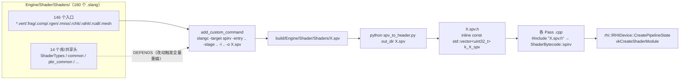

# HugEngine Shader 系统实现分析

> 分析日期：2026-09-22 | 范围：`Engine/Shader/` 全部（CMakeLists + 160 个 `.slang`）+ `Engine/Render/ShaderHotReload.{h,cpp}` 热重载 + RHI / 各 Pass 的消费侧 | 依据：源码与构建脚本逐文件阅读，所有数字与结论均可追到 `文件:行号`

> **本文怎么读**
>
> 1. 本文是「引擎介绍口径」的实现分析，不是教程：每一条结论后面都跟了 `文件:行号`，可以直接 grep 复核。
> 2. **路径勘误**：Shader 系统的实际根目录是 `Engine/Shader/Shaders/`（`Engine/Shader/CMakeLists.txt:27` 里 `SHADER_DIR` 就是这么定的），C++/Slang 共享头 `ShaderTypes.slang` 在 `Engine/Shader/Shaders/ShaderTypes.slang`，**不在** `Engine/Shader/` 根。`Engine/Shader/` 根下只有 `CMakeLists.txt`、`README.md`、`spv_to_header.py` 三个文件。
> 3. 第 2、3、5、7 节是本文的核心价值所在 —— 构建管线、15 个目录的职责、绑定约定、热重载覆盖范围这四件事此前**没有任何文档**。
> 4. 第 9 节写「能核实的缺口」，第 10 节写「没核实的猜测」—— 两者严格分开，第 10 节的内容**不要**当结论引用。

---

## 目录

1. [结论速览](#1-结论速览)
2. [构建管线：Slang → SPIR-V → `.spv.h` 内嵌](#2-构建管线slang--spir-v--spvh-内嵌)
3. [着色器目录组织（15 组）](#3-着色器目录组织15-组)
4. [C++/Slang 单一数据源纪律](#4-cslang-单一数据源纪律)
5. [绑定与描述符约定](#5-绑定与描述符约定)
6. [着色器与管线的对应关系](#6-着色器与管线的对应关系)
7. [热重载](#7-热重载)
8. [编译期错误的定位方式](#8-编译期错误的定位方式)
9. [已知边界与缺口](#9-已知边界与缺口)
10. [未复核清单](#10-未复核清单)

---

## 1. 结论速览

| # | 结论 | 关键依据 |
|---|---|---|
| 1 | Shader 系统是**编译期内嵌**管线：`slangc` → `.spv` → `uint32_t[]` C++ 头 → `#include` 进 `.cpp`。运行时**没有** SPIR-V 资产加载器 | `Engine/Shader/CMakeLists.txt:386`；`Engine/Shader/spv_to_header.py:6-7`；全仓库唯一的磁盘读 SPIR-V 路径在热重载里（`ShaderHotReload.cpp:296-306`） |
| 2 | 着色器源文件 **160** 个 `.slang`：**146** 个是编译入口，**14** 个是非入口库/共享头 | `CMakeLists.txt:40-283`；按扩展名统计见 §1.1 |
| 3 | stage 分布：`.vert` 20 / `.frag` 44 / `.comp` 53 / `.rgen` 9 / `.rmiss` 7 / `.rchit` 7 / `.rahit` 1 / `.rcall` 1 / `.mesh` 4 / `.task` **0** | 文件名统计；CMake 的五张显式列表 `:40`、`:73`、`:133`、`:218`、`:250` |
| 4 | 编译产物 **146** 个 `.spv` + **146** 个 `.spv.h`，落在 `${CMAKE_CURRENT_BINARY_DIR}/Shaders` | `CMakeLists.txt:28`、`:290`、`:387`、`:391` |
| 5 | `CompileShaders` 是 `ALL` 自定义目标；`HugEngineShader` 是 INTERFACE 库（无源码、无库文件） | `CMakeLists.txt:4`、`:415-418`、`:420` |
| 6 | 内嵌变量命名 `k_<Effect>_<stage>_spv`，头文件名 `<Effect>.<stage>.spv.h` | `spv_to_header.py:26-31`；消费示例 `LightingPass.cpp:421,424`、`RTAOPass.cpp:70` |
| 7 | 共享头改动 → **146 个 shader 全量重编**（显式的 `DEPENDS ${SLANG_INCLUDES}`），这是有意的设计代价 | `CMakeLists.txt:296,312,328,357,380`；自陈注释 `:275-278` |
| 8 | 新增 `.slang` 文件**不会**被自动编译（刻意不用 `file(GLOB)`） | `CMakeLists.txt:30` |
| 9 | 单一数据源 `ShaderTypes.slang`：**96** 个 `GPU_CONST` 常量 + **16** 个 `GPU_STRUCT` 结构，C++ 与 Slang 双向 include 同一文件 | `Shaders/ShaderTypes.slang:39-238`、`:139-450`；C++ 侧 `Engine/Render/Pipeline/Material.h:37`、`Engine/Render/Pipeline/LightingPass.cpp:8` |
| 10 | `static_assert` 镜检覆盖 **11 个结构体**的 `sizeof`，外加 `GIBlendParams` 的 `sizeof` + **3 个 `offsetof`**；另有 4 个结构体靠间接检查或**完全没有**静态检查（见 §4.3） | `Material.h:50-60`、`:69-72`；`GI/GITypes.h:287,313`；`LightingPass.cpp:188-191` |
| 11 | 绑定约定：**set 0 是绝对主力**（shader 侧 537 处 `[[vk::binding]]` 中，显式写常量形式的占绝大多数）；`Deferred Lighting set` 把编号 **0..32 全部占满** | `Shaders/ShaderTypes.slang:42-44`；`LightingPass.cpp:250-286`（33 项） |
| 12 | bindless 三件套固定为纹理 5 / 采样器 6 / SSBO 30（30 取最大号以承载 `VARIABLE_COUNT`） | `ShaderTypes.slang:48-50`；`common.slang:68-73`；`RHI/RHI/Types.h:30-32`；`ForwardPipeline.cpp:104,105,117` |
| 13 | 热重载**只覆盖 `.vert.slang` / `.frag.slang` / `.comp.slang`**；`.rgen/.rmiss/.rchit/.rahit/.rcall/.mesh/.task` 一律不触发 | `ShaderHotReload.cpp:67-86`（`InferShaderType` 只有三个分支）、`:177`（返回 false 即 `continue`） |
| 14 | 热重载只被 `Samples/Editor` 使用，且只接在 `ForwardPipeline` 上（PBR.vert / PBR.frag 两个 stage） | `EditorApp.cpp:164-177`；`ForwardPipeline.cpp:411-430`；`IRenderPipeline.h:93` 默认返回 −1 |
| 15 | **无着色器变体管理**：146 个入口各编 1 个变体，任何 `slangc` 调用都不带 `-D`，全仓库也**没有** specialization constant | `CMakeLists.txt:294,310,326,355,378`（命令行全文）；唯一变体宏 `Culling/PersistentCull.comp.slang:6-8` 的 `PTG_PERSISTENT` 恒为默认 0 |
| 16 | **无 SPIR-V 级缓存**：`README.md:8` 宣称的「预编译缓存（P1）」在 `CMakeLists.txt` 里不存在；只有 Vulkan 侧的 `VkPipelineCache`（缓存 PSO，不缓存编译） | `Engine/Shader/README.md:7-8` 对比 `CMakeLists.txt` 全文；`VulkanDevice.cpp:299-300,329`；`PSOPrecompileManager.cpp:55-89` |
| 17 | 依赖跟踪有 **2 处漏项**：`Lumen/LumenFarField.slang` 与 `Lumen/ScreenProbeSampling.slang` 被多处 include，但**不在** `SLANG_INCLUDES` 里 → 改它们不触发重编 | `CMakeLists.txt:264-281`；include 证据 `Lumen_FarField.rgen.slang:13,15`、`Lumen_FarFieldMerge.comp.slang:27`、`Lumen_ProbeIrradiance.comp.slang:17`、`Lumen_ScreenProbe_SHProject.comp.slang:18`、`ScreenProbe_Trace.comp.slang:11` |
| 18 | **5 个 shader 编了但无人使用**（连按名字字符串引用都没有）：`RT_Common.rchit`、`RT_PBR.rchit`、`RT_PositionFetch.rchit`、`RT_Shadow.rmiss`、`Utility/TestClear.comp` | 146 个入口 vs 141 个被 include 的 `.spv.h`，差集即为这 5 个 |

### 1.1 stage 分布与编译入口对账

| 后缀 | 文件数 | CMake 列表 | 入口函数名 | 声明数核对 |
|---|---:|---|---|---:|
| `.vert.slang` | 20 | `VERT_SLANG`（`:40-72`） | `vertexMain` | 20 处 `vertexMain` 声明 |
| `.frag.slang` | 44 | `FRAG_SLANG`（`:73-132`） | `fragmentMain` | 44 处 `fragmentMain` 声明 |
| `.comp.slang` | 53 | `COMP_SLANG`（`:133-214`） | `main` | 53 处 `void main(` |
| `.rgen.slang` | 9 | `RT_SLANG`（`:218-247`） | `main` | 9 |
| `.rmiss.slang` | 7 | 同上 | `main` | 7 |
| `.rchit.slang` | 7 | 同上 | `main` | 7 |
| `.rahit.slang` | 1 | 同上 | `main` | 1 |
| `.rcall.slang` | 1 | 同上 | `main` | 1 |
| `.mesh.slang` | 4 | `MESH_SLANG`（`:250-260`） | `main` | 4 |
| `.task.slang` | **0** | 循环支持但列表为空（`:372-373`） | — | — |
| 无 stage 后缀（库/共享头） | 14 | 12 个在 `SLANG_INCLUDES`（`:264-281`），2 个未列入 | — | — |
| **合计** | **160** | **146 个入口** | | |

> 注：`.task.slang` 一个都没有，所以 `CMakeLists.txt:363-364` 注释里的「Amplification Shader = Task Shader in Vulkan」与 `RHI/RHI/Types.h:71` 的 `kStageMaskAmplification` 目前**没有任何真实着色器使用者**；`PipelineStateDesc::amplificationShader`（`RHI/RHI/Shader.h:65`）同理。

---

## 2. 构建管线：Slang → SPIR-V → `.spv.h` 内嵌

### 2.1 数据流



### 2.2 目标与工具链

| 环节 | 实现 | 依据 |
|---|---|---|
| CMake 目标 | `add_library(HugEngineShader INTERFACE)` —— 纯头文件接口库，本身不产出二进制 | `CMakeLists.txt:4` |
| 头文件搜索路径 | `Public/`、`Shaders/`、`${CMAKE_CURRENT_BINARY_DIR}`、`${CMAKE_CURRENT_BINARY_DIR}/Shaders` | `CMakeLists.txt:6-11` |
| 依赖 RHI | `target_link_libraries(HugEngineShader INTERFACE HugEngineRHI)` | `CMakeLists.txt:13` |
| 编译器定位 | `find_program(SLANGC NAMES slangc HINTS ENV VULKAN_SDK "$ENV{VULKAN_SDK}/bin" "$ENV{VULKAN_SDK}/Bin")` | `CMakeLists.txt:19-22` |
| 找不到编译器 | `message(FATAL_ERROR ...)` —— 整个配置阶段失败，没有降级路径 | `CMakeLists.txt:422-423` |
| 目录变量 | `SHADER_DIR = <src>/Shaders`、`SPV_OUT_DIR = <binary>/Shaders` | `CMakeLists.txt:27-28` |
| 列表维护方式 | **显式列举**，注释直陈「`file(GLOB)` 无法跟踪新增文件」 | `CMakeLists.txt:30` |
| 汇总 | `set(COMPILE_SOURCES ${VERT_SLANG} ${FRAG_SLANG} ${COMP_SLANG} ${RT_SLANG} ${MESH_SLANG})` | `CMakeLists.txt:283` |

> `Public/` 出现在 `:7` 的 include 路径里，但该目录**在磁盘上不存在**（`Engine/Shader/` 下只有 `Shaders/`、`CMakeLists.txt`、`README.md`、`spv_to_header.py`）—— 一条无用的 include 路径。

### 2.3 `slangc` 调用方式与参数

五类 stage 各有一个 `add_custom_command` 循环，命令行**只在 `-entry` / `-stage` 上不同**，其余参数完全一致：

```
slangc <SRC> -target spirv -entry <ENTRY> -stage <STAGE> -I "<SHADER_DIR>" -o <SPV_OUT_DIR>/<NAME>.spv -Wno-39001
```

| 类别 | 循环位置 | `add_custom_command` | `-entry` | `-stage` | 命令行出处 |
|---|---|---|---|---|---|
| 顶点 | `:287-300` | `:291-298` | `vertexMain` | `vertex` | `:294` |
| 片元 | `:303-316` | `:307-314` | `fragmentMain` | `fragment` | `:310` |
| 计算 | `:319-332` | `:323-330` | `main` | `compute` | `:326` |
| 光追 | `:336-361` | `:352-359` | `main` | 由文件名正则推出 | `:355` |
| Mesh | `:365-384` | `:375-382` | `main` | 由文件名正则推出 | `:378` |

光追 / Mesh 的 stage 映射用的是**文件名正则**而不是给每个文件加字段：

| 后缀 | 正则捕获 | `SLANGC_STAGE` | 依据 |
|---|---|---|---|
| `.rgen` | `string(REGEX MATCH "rgen|rmiss|rchit|rahit|rcall" RT_STAGE "${NAME}")` | `raygeneration` | `:339`、`:341-342` |
| `.rmiss` | 同上 | `miss` | `:343-344` |
| `.rchit` | 同上 | `closesthit` | `:345-346` |
| `.rahit` | 同上 | `anyhit` | `:347-348` |
| `.rcall` | 同上 | `callable` | `:349-350` |
| `.mesh` | `string(REGEX MATCH "mesh|task" MS_STAGE "${NAME}")` | `mesh` | `:368`、`:370-371` |
| `.task` | 同上 | `task` | `:372-373` |

**没有传的参数**（这些「没有」本身就是结论）：

- 没有 `-profile`：用 Slang 的默认 target profile，不带 shader model 后缀。
- 没有 `-O*`：不显式设置优化级别。
- 没有 `-g`：SPIR-V 里没有调试行号信息。
- 没有 `-D*`：见 §9.1 变体管理。
- 没有 `-reflection-json`：构建期不做反射，绑定号靠人肉对齐（见 §9.4）。
- 唯一的行为开关是 `-Wno-39001`，五条命令行都带（`:295,311,327,356,379`）；仓库里没有任何注释解释这是哪一类警告 → 见 §10。

### 2.4 产物命名规则与落点

命名链路：`get_filename_component(NAME)` 取裸文件名 → `string(REGEX REPLACE "\\.slang$" "" NAME)` 去掉 `.slang` → 拼 `.spv`。

| 源文件 | CMake `NAME` | `.spv` 落点 | `.spv.h` | 内嵌变量 |
|---|---|---|---|---|
| `Lighting/PBR.vert.slang` | `PBR.vert` | `<build>/Shaders/PBR.vert.spv` | `PBR.vert.spv.h` | `k_PBR_vert_spv` |
| `Lighting/DeferredLighting.frag.slang` | `DeferredLighting.frag` | 同上目录 | `DeferredLighting.frag.spv.h` | `k_DeferredLighting_frag_spv` |
| `GI/DDGI.comp.slang` | `DDGI.comp` | 同上目录 | `DDGI.comp.spv.h` | `k_DDGI_comp_spv` |
| `RayTracing/RT_Shadow.rgen.slang` | `RT_Shadow.rgen` | 同上目录 | `RT_Shadow.rgen.spv.h` | `k_RT_Shadow_rgen_spv` |
| `Nanite/Nanite_HardRaster.mesh.slang` | `Nanite_HardRaster.mesh` | 同上目录 | `Nanite_HardRaster.mesh.spv.h` | `k_Nanite_HardRaster_mesh_spv` |

- 变量名生成：`name = basename.replace('.spv','').replace('.','_')` → `var_name = f'k_{name}_spv'`（`spv_to_header.py:26-28`）。
- 头文件名生成：`header_name = basename + '.h'`（`spv_to_header.py:30`）。
- 注意**目录名不进文件名**：`Lighting/PBR.vert.spv` 与假想的 `Utility/PBR.vert.spv` 会撞名，靠「全局 Effect 名唯一」这一约定规避。
- 生成的头是 `inline const std::vector<uint32_t>`（C++17 内联变量），所以多个 `.cpp` include 同一个头不会重复定义（`spv_to_header.py:39`）。
- 落点在 `${CMAKE_CURRENT_BINARY_DIR}/Shaders`（`CMakeLists.txt:28`），而该目录已在 `:10` 的 include 路径里 —— 这正是消费侧可以写裸文件名 `#include "PBR.frag.spv.h"` 的原因（共 62 个 `.cpp` 采用这个写法）。
- 转换脚本还把 SPIR-V 的 4 字节对齐当硬前置：`assert len(data) % 4 == 0`（`spv_to_header.py:21`），并以 `struct.unpack('<{count}I')` 小端解字（`:24`）。
- 每个 `.spv.h` 头部写死 `// Auto-generated from <name> — DO NOT EDIT`（`spv_to_header.py:34`），并附字节数 / 字数注释（`:38`）。

### 2.5 增量与依赖关系

| 改动对象 | 触发的重编范围 | 依据 |
|---|---|---|
| 单个入口 `.slang`（如 `PBR.frag.slang`） | 该文件 1 个 `.spv` + 1 个 `.spv.h` + include 该头的 `.cpp` | `DEPENDS ${SRC} ${SLANG_INCLUDES}`（`:296` 等）；`.spv.h` 的 `DEPENDS ${SPV} ${SPV_TOOL}`（`:397`） |
| `SLANG_INCLUDES` 里的任一共享头（12 个） | **全部 146 个 `.spv` 与 146 个 `.spv.h`** | `:296,312,328,357,380`；注释明写这是「契约改动必须全量重编」的正确代价（`:275-278`） |
| `spv_to_header.py` | 146 个 `.spv.h` 全部重生成（`.spv` 不重编） | `DEPENDS ${SPV} ${SPV_TOOL}`（`:397`） |
| 新增 `.slang` 文件 | **不触发任何编译**（必须手工加进对应列表） | `:30` 显式列表策略 |
| 改 `Lumen/LumenFarField.slang` 或 `Lumen/ScreenProbeSampling.slang` | **不触发任何编译**（依赖漏项） | 见 §9.3 |

设计注释把「为什么用显式 `SLANG_INCLUDES` 而不是 glob 所有 `.slang`」写清楚了：如果 `DEPENDS` 全量 shader，那么改 `PBR.frag` 会连带触发全部重编译（`:261-263`）。

IDE 视图与真实构建列表**同源**：`SHADER_IDE_SOURCES` 由 `COMPILE_SOURCES` + `SLANG_INCLUDES` 转相对路径后 `list(REMOVE_DUPLICATES)` 得到（`:408-413`），再交给 `huge_source_group()` 生成 `Shaders/Particles` 这类目录树（`:419`；函数定义在根 `CMakeLists.txt`），最后挂在 `add_custom_target(CompileShaders ALL DEPENDS ${SPV_HEADERS} SOURCES ${SHADER_IDE_SOURCES})`（`:415-418`）。注释明确 `SOURCES` 只影响工程文件、不构成构建依赖（`:417`），以及为什么不用 GLOB：「若改用 GLOB，未列入编译的 `.slang` 也会显示出来，造成『看起来编了、其实没编』的错觉」（`:402-406`）。

生成顺序由 `add_dependencies(HugEngineShader CompileShaders)`（`:420`）经 INTERFACE 链接关系传给消费者；采样程序还额外显式声明了同一条依赖（如 `Samples/Editor/CMakeLists.txt:56`、`Samples/01.Triangle/CMakeLists.txt:12`）。

### 2.6 为什么内嵌而不是运行时加载

代码里的理由有两处，都是**编译依赖粒度**而非发行便利：

1. `spv_to_header.py:6-7` 的模块 docstring：「为每个 `.spv` 生成独立的 `<name>.spv.h` 头文件。修改一个 shader 只重编译 include 了对应头文件的 `.cpp`。」—— `.spv` 与 `.h` 是**每个文件独立**的 custom command（`CMakeLists.txt:394-399`），因为 `.spv.h` 是普通头文件，CMake 自动依赖扫描就能把「改 shader → 只重编消费它的 `.cpp`」这件事做对。
2. `CMakeLists.txt:386`：「SPIR-V 二进制 → C++ `uint32_t` 数组（每个 `.spv` 独立生成 `.spv.h`，按需 include）」——「按需 include」是重点：`Utility/TestClear.comp.spv.h` 没有任何人 include，它的字节码就完全没进任何翻译单元。

客观后果（可核实的部分）：

- **正面**：全仓库唯一的「从磁盘读 SPIR-V」代码只有热重载的临时文件路径（`ShaderHotReload.cpp:209` 写 `hug_shader_temp.spv`，`:284` 用 `LoadSpirv` 读回，`:291` 删除）；`LoadSpirv` 这个静态函数只存在于 `ShaderHotReload.cpp:296` / `ShaderHotReload.h:47`。因此发行版**不需要**分发 `Shaders/` 目录，也不存在「shader 文件找不到」的运行时失败模式。
- **代价**：改一行 shader 也必须走完整的 `cmake --build`（除非编辑器开着热重载，见 §7）；且 `.spv.h` 是 `.cpp` 的直接依赖，语义上等价于「shader 是 C++ 的一部分」。
- 与 `README.md` 的口径有出入：`README.md:7` 写「Slang → SPIR-V / **DXIL** 编译」，但构建脚本只产出 SPIR-V（五处 `-target spirv`），`ShaderBytecode::dxil`（`RHI/RHI/Shader.h:33`）在整条 shader 管线里从未被填充。

---

## 3. 着色器目录组织（15 组）

`Engine/Shader/Shaders/` 下 14 个子目录 + 根目录共 15 组，合计 160 个 `.slang`。下面每组的「编译入口数」= CMake 五张列表里属于该目录的条目数。

总体分布：

| 目录 | `.slang` 总数 | 编译入口 | 构成 |
|---|---:|---:|---|
| `AI` | 4 | 4 | comp ×4 |
| `AntiAliasing` | 7 | 7 | vert ×2、frag ×5 |
| `Culling` | 6 | 6 | comp ×6 |
| `Decal` | 2 | 2 | vert ×1、frag ×1 |
| `GBuffer` | 3 | 3 | vert ×1、frag ×1、mesh ×1 |
| `GI` | 17 | 17 | vert ×6、frag ×10、comp ×1 |
| `Lighting` | 9 | 9 | vert ×4、frag ×5 |
| `Lumen` | 27 | 23 | comp ×20、frag ×2、rgen ×1 + 库 ×4 |
| `Nanite` | 20 | 18 | comp ×10、frag ×4、vert ×2、mesh ×2 + 库 ×2 |
| `Particles` | 8 | 7 | comp ×5、vert ×1、frag ×1 + 库 ×1 |
| `PathTracing` | 7 | 7 | comp ×4、rgen ×1、rchit ×1、rmiss ×1 |
| `PostProcess` | 14 | 14 | frag ×12、vert ×1、comp ×1 |
| `RayTracing` | 21 | 21 | rgen ×7、rmiss ×6、rchit ×6、rahit ×1、rcall ×1 |
| `Utility` | 8 | 8 | vert ×2、frag ×3、comp ×2、mesh ×1 |
| 根目录 | 7 | 0 | 全部是共享头 |
| **合计** | **160** | **146** | |

### 3.1 `AI/`（4，全 compute）

**职责**：把 AI 相关的张量 / 纹理算子放到 GPU 上跑，`Engine/AI/Runtime/Backend/GPUBackend.cpp` 是唯一引擎侧消费者。

- `AITensorScale.comp.slang`、`AITensorAdd.comp.slang` —— 逐元素缩放 / 相加（`GPUBackend.cpp:3`、`Samples/07.AISamples/Features/FeatureGPUInference.cpp`）
- `AITextureSample.comp.slang` —— 纹理采样算子
- `AITextureGen.comp.slang` —— GPU 端程序化纹理生成（`solid/gradient/checker/noise`，与 CPU 侧 `TextureGenerator` 同语义），参数走 48 字节 push constant（文件头注释）

### 3.2 `AntiAliasing/`（7 = vert ×2 + frag ×5）

**职责**：FXAA / TAA / SMAA 三种后处理抗锯齿。

- vert：`FXAA.vert.slang`、`TAA_Resolve.vert.slang`
- frag：`FXAA.frag.slang`、`TAA_Resolve.frag.slang`、`SMAA_EdgeDetect.frag.slang`、`SMAA_BlendWeight.frag.slang`、`SMAA_Neighborhood.frag.slang`
- 消费者：`AA_FXAA.cpp:7-8`、`AA_TAA.cpp:2-3`、`AA_SMAA.cpp:14-16`
- 注意：SMAA 的三个 pass **不自己带着色器**，其全屏顶点着色器复用的是 `GI/SSAO.vert.slang`（`AA_SMAA.cpp:13` 引入 `SSAO.vert.spv.h`，注释写明「顶点着色器（全屏三角形，共享）」）。

### 3.3 `Culling/`（6，全 compute）

**职责**：GPU 驱动渲染的可见性剔除与 Hi-Z 金字塔。

- `GPUCull.comp.slang`、`GPUCull_Phase1.comp.slang`、`GPUCull_TwoPhase.comp.slang` —— 单阶段 / 两阶段剔除
- `HiZDownsample.comp.slang` —— Hi-Z 金字塔下采样（「2×2 取最小」口径）
- `InstancedCull.comp.slang` —— 逐实例剔除（产可见实例索引列表，配合 push constant 的 `instanceVisibleHandle`）
- `PersistentCull.comp.slang` —— PTG 持久化线程组版本，双模式由 `PTG_PERSISTENT` 宏切换（默认 0，见 §9.1）
- 消费者：`GPUCulling.cpp`（前 5 个）、`InstanceCuller.cpp`（InstancedCull）

### 3.4 `Decal/`（2）

**职责**：GBuffer 投影贴花（CMake 注释标注「任务 24」）。

- `DecalProject.vert.slang`、`DecalProject.frag.slang`，消费者 `Pipeline/DecalPass.cpp`

### 3.5 `GBuffer/`（3）

**职责**：延迟管线的几何缓冲写入。

- `GBuffer.vert.slang`、`GBuffer.frag.slang` —— 传统光栅路径，消费者 `Pipeline/GBufferRenderer.cpp`
- `GBuffer.mesh.slang` —— Mesh Shader 路径，由 `ForwardPipeline.cpp` 与 `ForwardPipeline_FrameGraph.cpp` 引入（`PipelineStateDesc::meshShader`）

### 3.6 `GI/`（17 = vert ×6 + frag ×10 + comp ×1）

**职责**：屏幕空间与探针式 GI 的全部算法实现。

- vert：`IBL_BRDF_LUT.vert.slang`、`IBL_Irradiance.vert.slang`、`IBL_Prefilter.vert.slang`、`RSM_Generate.vert.slang`、`SSAO.vert.slang`、`SSAO_Blur.vert.slang`
- frag：`IBL_BRDF_LUT.frag.slang`、`IBL_Irradiance.frag.slang`、`IBL_Prefilter.frag.slang`、`RSM_Generate.frag.slang`、`SSAO.frag.slang`、`SSAO_Blur.frag.slang`、`GTAO.frag.slang`、`SSGI.frag.slang`、`SSR.frag.slang`、`RSM_Indirect.frag.slang`
- comp：`DDGI.comp.slang` —— 动态漫反射 GI 探针更新（每线程一个探针，球面采样 GBuffer → SH 投影 → 写探针缓冲）
- **`SSAO.vert.slang` 是引擎里复用度最高的顶点着色器**：被 16 个 `.cpp` 引入，涵盖 SMAA、Bloom、ColorGrading、Denoiser、DOF、GaussianBlur、MotionBlur、RTDenoiser、LumenScene、LumenScene_Irradiance、GI_SSGI、GI_SSR、RSMIndirect、SSAO 等 —— 它是一个「全屏大三角形」生成器（全文仅 286 字节）。
- 消费者：`GI_IBL.cpp`、`GI_RSM.cpp`、`GI_SSGI.cpp`、`GI_SSR.cpp`、`RSMIndirect.cpp`、`GI_DDGI.cpp`、`PostProcess/SSAO.cpp`

### 3.7 `Lighting/`（9 = vert ×4 + frag ×5）

**职责**：直接光照与天空，是 Forward / Deferred 两条管线的核心。

- vert：`DeferredLighting.vert.slang`、`PBR.vert.slang`、`Shadow.vert.slang`、`Skybox.vert.slang`
- frag：`DeferredLighting.frag.slang`（35 KB，全目录最大）、`PBR.frag.slang`（25 KB）、`Shadow.frag.slang`（459 字节，仅写深度）、`Skybox.frag.slang`、`PhysicalSky.frag.slang`
- `Shadow.vert/frag` 被 4 个阴影技术共用：`Shadow/CSMTechnique.cpp`、`PointShadowTechnique.cpp`、`RectLightShadowTechnique.cpp`、`SpotShadowTechnique.cpp`
- 消费者：`Pipeline/LightingPass.cpp`、`Pipeline/DeferredPipeline_FrameGraph.cpp`、`Pipeline/ForwardPipeline.cpp`、`Pipeline/ForwardPipeline_FrameGraph.cpp`、`PostProcess/SkyboxPass.cpp`

### 3.8 `Lumen/`（27 = comp ×20 + frag ×2 + rgen ×1 + 库 ×4）

**职责**：Lumen 式虚拟化几何 GI —— 三层：SDF（距离场）、Surface Cache（表面缓存）、Screen Probe（屏幕探针）+ 远处场。

- SDF 层（9 comp）：`SDF_MeshScatter.comp.slang`、`SDF_MeshFlood.comp.slang`、`SDF_MeshFloodSeeds.comp.slang`、`SDF_MeshConvert.comp.slang`、`SDF_GlobalBuild.comp.slang`、`SDF_LayerProbe.comp.slang`、`SDF_RayMarch.comp.slang`、`SDF_RayMarchDetail.comp.slang`、`SDF_DebugView.comp.slang`
- Surface Cache 层（3 comp）：`SurfaceCache_PageCheck.comp.slang`、`SurfaceCache_Capture.comp.slang`、`SurfaceCache_Feedback.comp.slang`
- Screen Probe / 远场层（8 comp）：`ScreenProbe_Trace.comp.slang`、`ScreenProbe_Gather.comp.slang`、`ScreenProbe_Filter.comp.slang`、`Lumen_SurfaceCacheSample.comp.slang`、`Lumen_ScreenProbe_SHProject.comp.slang`、`Lumen_ProbeIrradiance.comp.slang`、`Lumen_FarFieldCompare.comp.slang`、`Lumen_FarFieldMerge.comp.slang`
- frag：`Lumen_Skeleton.frag.slang`（骨架阶段占位输出）、`Lumen_Irradiance.frag.slang`
- rgen：`Lumen_FarField.rgen.slang`（远处场光追，复用 `RT_GI.rchit` / `RT_GI.rmiss`）
- **库文件 4 个**：`SurfaceCache.slang`、`ScreenProbe.slang`（**在** `SLANG_INCLUDES` 里）；`LumenFarField.slang`、`ScreenProbeSampling.slang`（**不在**，见 §9.3）
- 消费者：`LumenSDF.cpp`（9 个）、`LumenScene_SurfaceCache.cpp`（7 个）、`LumenScene_Irradiance.cpp`、`LumenScene_ProbeFilter.cpp`、`LumenScene.cpp`、`LumenFarFieldPass.cpp`

### 3.9 `Nanite/`（20 = comp ×10 + frag ×4 + vert ×2 + mesh ×2 + 库 ×2）

**职责**：虚拟几何 —— 剔除、软光栅（compute 光栅化）、硬光栅（mesh shader）、可视化。

- 剔除 / 层次（4 comp）：`Nanite_Cull.comp.slang`、`Nanite_InstanceCull.comp.slang`、`Nanite_ClusterBVH.comp.slang`、`Nanite_HiZDownsample.comp.slang`（模块自持的 Hi-Z，与 `Culling/HiZDownsample.comp.slang` 同口径但另起一份，理由见该文件头注释）
- 软光栅三趟（3 comp）：`Nanite_SoftRasterDepth.comp.slang`（第 1 趟原子深度键）、`Nanite_SoftRasterWinner.comp.slang`（第 2.5 趟确定性赢家仲裁）、`Nanite_SoftRaster.comp.slang`（第 2 趟等值复检后写 GBuffer 颜色）
- 辅助 / 自证（3 comp）：`Nanite_TestWrite.comp.slang`（任务 4 的 UAV 自证通道）、`Nanite_GBufferClear.comp.slang`（清 8 张 GBuffer 颜色目标）、`Nanite_DebugView.comp.slang`（屏幕可视化，默认 `nanite_debug_view=0` 时连 PSO 都不建）
- 光栅绘制（vert / frag / mesh 各 2）：`Nanite_Raster.vert/frag.slang`、`Nanite_DepthResolve.vert/frag.slang`、`Nanite_MeshTest.mesh/frag.slang`、`Nanite_HardRaster.mesh/frag.slang`（硬光栅 `SetMeshOutputCounts(3*triCount, triCount)`，最多 192 顶点 / 64 图元）
- **库文件 2 个**：`NaniteTypes.slang`（C++/Slang 共享二进制契约与量化公式，镜像 `Engine/Render/Nanite/NaniteTypes.h`）、`Nanite_SoftRasterCommon.slang`（软 / 硬光栅共用的绑定 + 参数 + 内联光栅化）—— 两者**都在 `SLANG_INCLUDES`**，改任一都会触发全部 shader 重编（`:275-278` 注释明确承认这是刻意接受的成本）
- 消费者：`NaniteCull.cpp`（4 个）、`NaniteRaster.cpp`（14 个）

### 3.10 `Particles/`（8 = comp ×5 + vert ×1 + frag ×1 + 库 ×1）

**职责**：GPU 粒子系统全流程。

- `ParticleInit.comp.slang`、`ParticleEmit.comp.slang`、`ParticleSimulate.comp.slang`、`ParticleCulling.comp.slang`、`ParticleSort.comp.slang`
- `ParticleRender.vert.slang` / `ParticleRender.frag.slang`
- 库：`ParticleTypes.slang`（在 `SLANG_INCLUDES`）
- 消费者：`Pipeline/ParticleRenderer.cpp`（7 个入口全部）

### 3.11 `PathTracing/`（7 = comp ×4 + rgen ×1 + rchit ×1 + rmiss ×1）

**职责**：全路径追踪 + ReSTIR DI。

- `PT_Full.rgen.slang`（15 KB）、`PT_Full.rchit.slang`（10.5 KB）、`PT_Full.rmiss.slang`
- `PT_Atrous.comp.slang` —— 边缘感知 À-Trous 降噪
- ReSTIR DI 三件套：`ReSTIR_Init.comp.slang`、`ReSTIR_Temporal.comp.slang`、`ReSTIR_Spatial.comp.slang`
- 消费者：`RT/PTPass.cpp`、`RT/ReSTIRPass.cpp`、`PostProcess/PTAtrousPass.cpp`
- CMake 注释特别标明 ReSTIR 是「直接光重采样，**非 GI**；由 `PathTracingPipeline` 独占驱动」（`:138`）

### 3.12 `PostProcess/`（14 = frag ×12 + vert ×1 + comp ×1）

**职责**：LDR / HDR 后处理链。

- 色彩与曝光：`ToneMap.vert.slang`、`ToneMap.frag.slang`、`AutoExposure.comp.slang`、`ColorGrading.frag.slang`、`CameraEffects.frag.slang`、`MotionBlur.frag.slang`
- Bloom：`BrightPass.frag.slang`、`BloomComposite.frag.slang`、`GaussianBlur.frag.slang`
- 景深：`DOF_CoC.frag.slang`、`DOF_Composite.frag.slang`
- 降噪：`Denoise.frag.slang`、`Denoise_Upscale.frag.slang`、`RT_DenoiseTemporal.frag.slang`
- 消费者：`AutoExposurePass.cpp`、`ToneMapPass.cpp`、`ColorGradingPass.cpp`、`CameraEffectsPass.cpp`、`MotionBlurPass.cpp`、`BloomPass.cpp`、`GaussianBlurPass.cpp`、`DOFPass.cpp`、`Denoiser.cpp`、`DenoiseUpscale.cpp`、`RTDenoiser.cpp`（各自一一对应）

### 3.13 `RayTracing/`（21 = rgen ×7 + rmiss ×6 + rchit ×6 + rahit ×1 + rcall ×1）

**职责**：硬件光追的 rgen / rchit / rmiss / rahit / rcall 全集，服务 RT 阴影 / AO / 反射 / GI 四个效果，外加两个演示用 Sponza / Triangle 路径。

- rgen（7）：`RT_Triangle.rgen.slang`、`RT_Sponza.rgen.slang`、`RT_Shadow.rgen.slang`、`RT_AO.rgen.slang`、`RT_Reflection.rgen.slang`、`RT_GI.rgen.slang`、`DDGI_Trace.rgen.slang`
- rmiss（6）：`RT_Background.rmiss.slang`、`RT_Sponza.rmiss.slang`、`RT_Shadow.rmiss.slang`、`RT_Common.rmiss.slang`、`RT_Reflection.rmiss.slang`、`RT_GI.rmiss.slang`
- rchit（6）：`RT_Sponza.rchit.slang`、`RT_Common.rchit.slang`、`RT_PBR.rchit.slang`、`RT_PositionFetch.rchit.slang`、`RT_Reflection.rchit.slang`、`RT_GI.rchit.slang`
- rahit（1）：`RT_Shadow.rahit.slang` —— **全仓库唯一的 AnyHit 着色器**（「命中即遮蔽」）
- rcall（1）：`RT_Bindless.rcall.slang` —— 仅在 `Samples/01.Triangle` 里被使用
- 复用关系：`RT_GI.rchit/rmiss` 同时服务 RTGI、Lumen 远处场（`LumenFarFieldPass.cpp`）与 DDGI 探针 march（`DDGITracePass.cpp:9-10` 注释写「与 RTGI 共用，保证两源量纲一致」）；`RT_Shadow.rahit` + `RT_Common.rmiss` 同时服务 RT 阴影与 RT AO（`RTAOPass.cpp:15`、`RTShadowPass.cpp:15`）
- **无消费者 3 个**：`RT_Common.rchit`、`RT_PBR.rchit`、`RT_PositionFetch.rchit`（另有 `RT_Shadow.rmiss`，代码里改用了 `RT_Common.rmiss`）—— 见 §9.5

### 3.14 `Utility/`（8 = vert ×2 + frag ×3 + comp ×2 + mesh ×1）

**职责**：全屏 / 公用几何与测试着色器。

- `Fullscreen.vert.slang`（全屏三角顶点，被 `GIRadianceHistory.cpp`、`DeferredPipeline.cpp` 用）、`Triangle.vert.slang` + `Triangle.frag.slang`（`Samples/01.Triangle` 的光栅路径）
- `FullscreenCopy.frag.slang`（纯拷贝）
- `Triangle.mesh.slang` + `TriangleMesh.frag.slang` —— Mesh Shader 演示路径（`DrawMeshTasks(1,1,1)`，硬编码三顶点，无 VertexBuffer / IndexBuffer 依赖）
- `WorkGraph_Entry.comp.slang` —— Work Graph 入口节点（读 `WGRecord` 数组 → 视锥剔除 → 写输出 Record），消费者 `Pipeline/GPUWorkGraph.cpp`
- `TestClear.comp.slang` —— 仅用于验证 Compute PSO + Dispatch 通路的清屏测试，**无任何消费者**

### 3.15 根目录（7 个共享头，0 个入口）

| 文件 | 作用 | 在 `SLANG_INCLUDES` |
|---|---|---|
| `ShaderTypes.slang` | C++/Slang 共享结构体与常量（§4） | ✅ `:265` |
| `common.slang` | 通用常量（`HE_PI` 等）+ sRGB / ACES / PQ / BT.2020 工具函数 + **bindless 三数组声明**（`:68-73`） | ✅ `:266` |
| `pbr_common.slang` | PBR / BSDF 共用函数 | ✅ `:267` |
| `Atmosphere.slang` | 大气散射（`PhysicalSky.frag` 等用） | ✅ `:268` |
| `PT_Common.slang` | 路径追踪共用（含 PT payload 结构） | ✅ `:269` |
| `RT_DDGI.slang` | DDGI 探针光追共用布局 | ✅ `:270` |
| `RT_HitCommon.slang` | RT 命中着色器共用 | ✅ `:271` |

CMake 注释把「共享头必须留在根目录」的理由写清了：各目录的 shader 以**裸文件名** include 它们，靠 `-I "${SHADER_DIR}"` 解析，因此移动入口 shader 无需改写任何 include（`:34-39`）。

---

## 4. C++/Slang 单一数据源纪律

### 4.1 `ShaderTypes.slang` 是什么

`Engine/Shader/Shaders/ShaderTypes.slang`（460 行）是**同一份文本被两个编译器读**的头文件：

- Slang 侧：`#include "ShaderTypes.slang"` 后用 `-I Shaders` 解析（如 `GI/DDGI.comp.slang`、`Lighting/PBR.frag.slang:41-82`）
- C++ 侧：`#include "ShaderTypes.slang"`，靠 `target_include_directories` 里的 `Shaders/`（`CMakeLists.txt:8`），调用点是 `Engine/Render/Pipeline/Material.h:37` 与 `Engine/Render/Pipeline/LightingPass.cpp:8`

文件头两行就把用法和纪律钉住了（`:4-7`）：「C++ 使用方式: `#include "ShaderTypes.slang"`（需要 Math.h / cstdint 先包含）」/「修改此文件时，必须确保 C++ 端 `static_assert` 尺寸验证全部通过。」

### 4.2 双模宏：让一份文本在两个语言里都合法

`:14-33` 用 `#ifdef __cplusplus` 分流四个宏：

| 宏 | C++ 展开 | Slang 展开 | 依据 |
|---|---|---|---|
| `GPU_UINT` | `uint32_t` | `uint` | `:16` / `:26` |
| `GPU_INT` | `int32_t` | `int` | `:17` / `:27` |
| `GPU_STRUCT` | `struct alignas(16)` | `struct` | `:18` / `:28` |
| `GPU_CONST(decl)` | `static constexpr decl` | `static const decl` | `:23` / `:32` |

`GPU_STRUCT` 的两个分支是这套机制的关键：Slang 会按 GPU 规则自动对齐，C++ 必须显式 `alignas(16)` 才能对齐到同一套规则。文件结束时统一 `#undef`（`:453-458`）。

**96 个 `GPU_CONST`** 按区块组织：

| 区块 | 行号 | 内容 |
|---|---|---|
| Descriptor Set 索引 | `:42-44` | `kGPUDescSet_PerFrame/Material/Bindless = 0/1/2` |
| 共享 Binding（Forward / Deferred / GBuffer 共用） | `:47-52` | `kGPUBinding_ObjectData=2`、`BindlessTextures=5`、`BindlessSamplers=6`、`BindlessSSBO=30`、`LightGrid=7`、`LightIndexList=8` |
| Forward 管线 Binding | `:55-69` | 15 个（`Lights=1` … `RSMRadiance=17`） |
| Deferred 管线 Binding | `:72-109` | 22 个（`GBufferA=0` … `Lumen=32`）；去重后全文件共 **44** 个不同的 `kGPUBinding_*` |
| GI 分层合成 | `:120-137`、`:148-149` | `kGIMaxSourcesPerChannel=4`、`GISOURCE_*` 13 个、`GICONF_*` 2 个 |
| 渲染管线限制 | `:195-204` | `kGPUMaxFramesInFlight=3`、`kGPUMaxColorAttachments=8`、`kGPUMaxPushConstantSize=256`、`kGPURTMaxRecursionDepth=2` 等 |
| 引擎限制 | `:207-211` | `kGPUMaxLights=8`、`kGPUMaxShadows=4`、`kGPUMaxObjects=1024`、`kGPUMaxGPUObjects=2048`、`kGPUCascadeCount=3` |
| 默认值 | `:214-217` | FOV 60 / near 0.1 / far 2000 / 阴影图 2048 |
| 算法常量 | `:220-222` | `kGPUClusterTileSize=64`、`kGPUClusterSlices=12`、`kGPUPrefilterMips=5.0` |
| 材质纹理槽 | `:225-229` | `kGPUMaterialTexSlot_BaseColor/Normal/MetallicRough/Occlusion/Count` |
| 纹理存在掩码 | `:233-236` | `kGPUMaterialTexMask_*` 4 位 |

其中 `kGPUBinding_Lightmap`（`=7`）**声明了但无人使用** —— 声明处的注释自陈「烘焙光照图…暂未使用」（`:97`、`:99`），且它占的 7 与 `kGPUBinding_LightGrid=7` 是同一个号（`LightingPass` 里 7 确实是 `LightGrid`）。

### 4.3 16 个共享结构体与 `static_assert` 覆盖

| # | 结构体 | 行号 | C++ `static_assert` | 位置 |
|---:|---|---|---|---|
| 1 | `GISourceSlot` | `:139` | 无直接断言，靠 `sizeof(GISourceSlotData) == sizeof(GISourceSlot)` 交叉检查 | `LightingPass.cpp:188` |
| 2 | `GIChannelBlendParams` | `:151` | 同上（`GIChannelBlendData` ↔ `GIChannelBlendParams`） | `LightingPass.cpp:190` |
| 3 | `GIBlendParams` | `:159` | `sizeof == 368`、`offsetof` ×3（`rsmVplScale`=240、`rsmLightViewProj`=272、`rsmValid`=336） | `Material.h:69-72` |
| 4 | `GPULight` | `:247` | `sizeof == 64` | `Material.h:51` |
| 5 | `GPUShadowData` | `:257` | `sizeof == 256` | `Material.h:50` |
| 6 | `GPUObjectData` | `:266` | `sizeof == 208` | `Material.h:52` |
| 7 | `GPUMaterialData` | `:293` | `sizeof == 112` | `Material.h:53` |
| 8 | `PushConstantData` | `:318` | `sizeof == 160` | `Material.h:54` |
| 9 | `ShadowPushConstant` | `:339` | `sizeof == 80` | `Material.h:55` |
| 10 | `GBufferPushConstant` | `:346` | **无** | — |
| 11 | `DeferredLightingPushConstant` | `:358` | **无** | — |
| 12 | `RTShadowPushConstant` | `:379` | `sizeof == 112` | `Material.h:56` |
| 13 | `RTRayEffectPushConstant` | `:393` | `sizeof == 112` | `Material.h:57` |
| 14 | `PTPushConstant` | `:410` | `sizeof == 176` | `Material.h:58` |
| 15 | `PTReservoir` | `:428` | `sizeof == 32` | `Material.h:59` |
| 16 | `ReSTIRPushConstant` | `:438` | `sizeof == 128` | `Material.h:60` |

即：**11 个结构体有 `sizeof` 断言**，加上 `GIBlendParams` 的 3 个 `offsetof`；`GBufferPushConstant` 与 `DeferredLightingPushConstant` 是**唯二完全没有 C++ 侧静态尺寸检查**的共享结构 —— `DeferredLightingPushConstant` 在 `LightingPass.cpp:169` 被直接 `{}` 初始化并整体 `SetPushConstants(0, sizeof(lpc), &lpc)`（`:203`），`GBufferPushConstant` 的字段只在 `Engine/Render/Nanite/NaniteTypes.h:61` 的注释里被提到。

间接镜检链（GI 三件套）还有两处，说明这套纪律的完整写法：

- `Engine/Render/GI/GITypes.h:287` `static_assert(sizeof(GISourceSlotData) == 16, ...)`、`:313` `static_assert(sizeof(GIChannelBlendData) == 80, ...)`
- `Engine/Render/Pipeline/LightingPass.cpp:188-191` 再加一层跨头断言（C++ 结构 ↔ shader 结构），并在 `:196-198` 按通道 `memcpy` 进 UBO
- 单元测试侧：`Tests/TestGITypes.cpp:689`、`:690` 复核 16 / 80 字节

### 4.4 std140 陷阱：为什么共享结构体里不许出现非 `float4` 数组

这是 ShaderTypes 最值钱的一条注释（`:171-177`）与 `Material.h:63-68` 的复述，事故现场也写在 `:90-97`。规则本身（以 `float[3]` 为例）：

$$\mathrm{off}_{\mathrm{std140}}\big(a[i]\big) = \mathrm{off}(a) + 16\,i \qquad \mathrm{off}_{\mathrm{cpp}}\big(a[i]\big) = \mathrm{off}(a) + 12\,i$$

两者在数组**之后**的所有成员上永久错开。实测（注释里给了 `slangc -reflection-json` 的数字）：写成 `float _padBlend[3]` 时 Slang 把 `rsmLightViewProj` 放在 304、`rsmValid` 放在 368、块大小 432，而 C++ 是 256 / 320 / 336 —— 于是 `PBR.frag` 读到的 `rsmValid` 恒为 0（落在 C++ 从未写入的区间），RSM 源**静默不产出且没有任何报错**。修法是填充一律用 `float4`（两端都是 16 字节、16 对齐）。

由此得到的 `alignas(16)` 结构体尺寸公式（以 `RTShadowPushConstant` 为例，注释写 108 B，`static_assert` 要求 112 B）：

$$\mathrm{sizeof}_{\mathrm{aligned}}(S) = 16 \left\lceil \frac{\mathrm{sizeof}(S)}{16} \right\rceil, \qquad \mathrm{sizeof}(\texttt{RTShadowPushConstant}) = 16\left\lceil \frac{108}{16} \right\rceil = 112$$

其他同类坑在注释里都留了痕：

- `PTReservoir.lightPos` 必须 `float4` 而非 `float3`，因为 C++ 端 GLM 在 `GLM_FORCE_DEFAULT_ALIGNED_GENTYPES` 下 `vec3` 是 16 B（`:426-427`）
- `GPUObjectData` 的字段偏移写在注释里（`worldMatrix[0..64]` … `boundsMax[184]`，`:267-287`），但**结构体头注释仍写「176 字节」**（`:265`）而 `static_assert` 是 208（`Material.h:52`）—— 注释已过期，以 `static_assert` 为准

### 4.5 C++ 侧的第二份镜像：`RHI/Types.h`

`Engine/RHI/RHI/Types.h` 里有一份**手抄的镜像常量**，注释自称「与 `ShaderTypes: kGPU*` 一致」：

| RHI 常量 | 值 | 对应 ShaderTypes | 位置 |
|---|---|---|---|
| `kDescSetPerFrame` / `kDescSetMaterial` / `kDescSetBindless` | 0 / 1 / 2 | `kGPUDescSet_*` | `Types.h:24-26` |
| `kBindingObjectData` | 2 | `kGPUBinding_ObjectData` | `Types.h:29` |
| `kBindingBindlessTextures` / `kBindingBindlessSamplers` | 5 / 6 | `kGPUBinding_BindlessTextures/Samplers` | `Types.h:30-31` |
| `kBindingBindlessSSBO` | 30 | `kGPUBinding_BindlessSSBO` | `Types.h:32` |
| `kBindingLightGrid` / `kBindingLightIndexList` | 7 / 8 | `kGPUBinding_LightGrid/LightIndexList` | `Types.h:33-34` |
| `kMaxFramesInFlight` / `kMaxColorAttachments` / `kMaxPushConstantSize` / `kRTMax*` / `kRTShaderUnused` | 3 / 8 / 256 / 2,16,8 / `~0u` | `kGPUMaxFramesInFlight` 等 | `Types.h:17,37,46,42-44,51` |

**这份镜像没有任何 `static_assert` 与 ShaderTypes 对账**（RHI 层不 include Slang 头，避免把 Slang 语法塞进 RHI 的翻译单元）。`kDefaultMaxBindlessResources = 1000000`（`Types.h:48`）则是 C++ 独有、Slang 侧无对应物。

同一个文件里还留了一个反向事故记录（`Types.h:60-69`）：`kStageMaskMesh` / `kStageMaskAmplification` 曾**互换**成 64 / 128，而 Vulkan 真值是 Task = 0x40、Mesh = 0x80；这直接导致 mesh PSO 的描述符集布局校验层报错、管线创建失败。

---

## 5. 绑定与描述符约定

### 5.1 三个 Descriptor Set

| set | ShaderTypes 常量（`:42-44`） | RHI 常量（`Types.h:24-26`） | 实际使用者 |
|---:|---|---|---|
| 0 | `kGPUDescSet_PerFrame` | `kDescSetPerFrame` | **几乎所有 Pass**：`BindDescriptorSet(rhi::kDescSetPerFrame, ...)` 在 40+ 个 Pass 里出现 |
| 1 | `kGPUDescSet_Material` | `kDescSetMaterial` | 只有 `RTPass.cpp:1001` 与 `RTEffectPass.cpp:167` 绑定 |
| 2 | `kGPUDescSet_Bindless` | `kDescSetBindless` | 只有 `RTPass.cpp:1003` 与 `RTEffectPass.cpp:169` 绑定 |

着色器侧的声明风格是**直接引用共享常量**，不写魔数：

```slang
[[vk::binding(kGPUBinding_Lights, kGPUDescSet_PerFrame)]] StructuredBuffer<GPULight> u_Lights;      // PBR.frag.slang:41
[[vk::binding(kGPUBinding_BindlessTextures, kGPUDescSet_PerFrame)]] Texture2D<float4> u_Textures[]; // common.slang:68
```

全仓库 `[[vk::binding(...)]]` 出现 **537 次**；用 `[[vk::binding(<数字>, <set 数字>)]]` 这种字面量形式写的只有 12 处（set 0 共 0 处，set 1 共 8 处，set 2 共 4 处）—— 也就是说 **set 1 与 set 2 只被 3 个光追命中着色器用到，且它们写的是字面量而非常量**：

| 文件 | set 1 声明 | set 2 声明 |
|---|---|---|
| `RayTracing/RT_PBR.rchit.slang` | `:23`（`u_MatTex`）、`:27`（`LightCB`）、`:30`（`GPUVertex`）、`:33`（`ByteAddressBuffer`） | `:37`（`u_Textures[]`）、`:38`（`u_Sampler`） |
| `RayTracing/RT_PositionFetch.rchit.slang` | `:17`、`:21` | `:28`、`:29` |
| `RayTracing/RT_Sponza.rchit.slang` | `:15`、`:18` | — |

`kGPUDescSet_Material` / `kGPUDescSet_Bindless` 这两个常量**在着色器里从未被引用**（只有 `RHI/Types.h` 的同名镜像被 C++ 用）。

### 5.2 bindless 三件套

| 资源 | binding | 类型 | 布局侧容量 | 声明位置 |
|---|---:|---|---|---|
| 纹理数组 | **5** | `SampledImage` | 4096，`VARIABLE_COUNT` | `common.slang:68`；`ForwardPipeline.cpp:104` |
| 采样器数组 | **6** | `Sampler` | 4096，`VARIABLE_COUNT` | `common.slang:69`；`ForwardPipeline.cpp:105` |
| SSBO 数组（→ `u_Materials[]`） | **30** | `StorageBuffer` | 4096，`VARIABLE_COUNT`，Vertex\|Fragment | `common.slang:73`；`ForwardPipeline.cpp:117` |

- 30 号是刻意取**最大号**：「binding 号最大以承载 `VARIABLE_COUNT`」（`RHI/Types.h:32` 注释），因为 Vulkan 规范保证至多一个带可变描述符数的绑定、且该绑定必须是布局里编号最大的那个 —— RHI 侧对应 `VkDescriptorSetVariableDescriptorCountAllocateInfo`（`VulkanDevice_Descriptors.cpp:165-166`）。
- 描述符池容量：`SampledImage` / `Sampler` 各按 4096 预留（`ForwardPipeline.cpp:104-105` 的数组长度参数），池里另给 RT TLAS 预留 `kDescPoolSize_AccelStruct = 64`（`VulkanDevice_Descriptors.cpp:54`）。
- 材质寻址约定（两个公式，贯穿全部材质采样点）：

$$\mathrm{slot}(o, j) = \mathrm{materialID}(o) + j,\quad j \in \{0,1,2,3\}, \qquad \mathrm{record}(o) = \left\lfloor \frac{\mathrm{materialID}(o)}{4} \right\rfloor$$

  依据：`GPUObjectData.materialID` 注释「bindless 纹理基索引」（`ShaderTypes.slang:275`）、`kGPUMaterialTexSlot_Count = 4` 注释「每材质纹理槽数（`materialID >> 2` 的依据）」（`:229`）、`common.slang:72` 注释「索引 = `materialID >> 2`」；使用点 `PBR.frag.slang:272`（`texBase = obj.materialID`）、`:281`（`u_Materials[0][obj.materialID >> 2]`）、`GBuffer.frag.slang:57`、`RT_Bindless.rcall.slang:25`、`PT_Full.rchit.slang:77`
- 纹理是否真实存在由 `textureMask` 位掩码决定（`kGPUMaterialTexMask_*`，`:233-236`）；无纹理的槽用中性默认值而非采样占位纹理 —— 注释给出的理由是「占位纹理内容不可信，如白色会污染法线」（`:231-232`）。
- 占位纹理与采样器注册在 `ForwardPipeline.cpp:166-193`（1×1 白 + Linear/Repeat 采样器 + `SetDefaultTexture` + 预留 `materialID=0` 的 4 个槽）。

### 5.3 两张实际生效的 set 0 布局总表

编号 **0..32 合起来看**：Forward 用 1..17、24、25、30、31（共 21 项）；Deferred 的 Lighting set 用满 0..32（共 33 项）。同一编号在两条管线里可以是**不同资源**，这是设计而非疏漏（`ShaderTypes.slang:66-69` 专门解释了 17 号在 Forward 是 `RSMRadiance`、在 Deferred 是 `Lights_DL`）：两边不会同时声明同一个号，所以不冲突。

| 号 | Forward set=0（`ForwardPipeline.cpp:96-121`） | Deferred Lighting set（`LightingPass.cpp:250-286`） | ShaderTypes 常量 |
|---:|---|---|---|
| 0 | — | GBuffer albedo+metallic | `kGPUBinding_GBufferA`（`:72`） |
| 1 | `GPULight[]` SSBO | GBuffer normal+roughness | `kGPUBinding_Lights`（`:55`）/ `kGPUBinding_GBufferB`（`:73`） |
| 2 | `GPUObjectData[]` SSBO | GBuffer emissive+ao | `kGPUBinding_ObjectData`（`:47`）/ `kGPUBinding_GBufferC`（`:74`） |
| 3 | `GPUShadowData[]` SSBO | 深度缓冲 | `kGPUBinding_ShadowData`（`:56`）/ `kGPUBinding_Depth`（`:75`） |
| 4 | CSM cascade 0 | CSM cascade 0 | `kGPUBinding_ShadowMap0`（`:57`） |
| 5 | **bindless 纹理数组**（4096） | RSM 间接光 E（半分辨率） | `kGPUBinding_BindlessTextures`（`:48`）/ `kGPUBinding_RSMIndirect`（`:89`） |
| 6 | **bindless 采样器数组**（4096） | DDGI 探针网格参数 UBO | `kGPUBinding_BindlessSamplers`（`:49`）/ `kGPUBinding_DDGIGridParams`（`:88`） |
| 7 | LightGrid SSBO | LightGrid SSBO | `kGPUBinding_LightGrid`（`:51`） |
| 8 | LightIndexList SSBO | LightIndexList SSBO | `kGPUBinding_LightIndexList`（`:52`） |
| 9 | 点光源阴影 Cubemap | 聚光灯阴影（Deferred 专用号） | `kGPUBinding_PointShadow`（`:58`）/ `kGPUBinding_SpotShadow_DL`（`:80`） |
| 10 | CSM cascade 1 | CSM cascade 1 | `kGPUBinding_ShadowMap1`（`:59`） |
| 11 | CSM cascade 2 | CSM cascade 2 | `kGPUBinding_ShadowMap2`（`:60`） |
| 12 | IBL 辐照度图 | IBL 辐照度图 | `kGPUBinding_IrradianceMap`（`:61`） |
| 13 | IBL 预滤波环境图 | IBL 预滤波环境图 | `kGPUBinding_PrefilterMap`（`:62`） |
| 14 | BRDF 积分 LUT | BRDF 积分 LUT | `kGPUBinding_BRDF_LUT`（`:63`） |
| 15 | RSM 位置图 | RSM 位置图 | `kGPUBinding_RSMPosition`（`:64`） |
| 16 | RSM 法线图 | RSM 法线图 | `kGPUBinding_RSMFlux`（`:65`） |
| 17 | RSM VPL 辐射度图 | `GPULight[]` SSBO（Deferred 专用号） | `kGPUBinding_RSMRadiance`（`:69`）/ `kGPUBinding_Lights_DL`（`:82`） |
| 18 | — | `GPUShadowData[]` SSBO（Deferred 专用号） | `kGPUBinding_ShadowData_DL`（`:83`） |
| 19 | — | SSGI 间接光照 | `kGPUBinding_SSGI`（`:84`） |
| 20 | — | SSAO | `kGPUBinding_SSAO_DL`（`:85`） |
| 21 | — | SSR | `kGPUBinding_SSR`（`:86`） |
| 22 | — | DDGI 探针 | `kGPUBinding_DDGIProbes`（`:87`） |
| 23 | — | GBuffer worldPos（MRT4） | `kGPUBinding_GBufferE`（`:76`） |
| 24 | 聚光灯阴影 | RT 阴影遮罩（R16_FLOAT） | `kGPUBinding_SpotShadow`（`:79`）/ `kGPUBinding_RT_ShadowMask`（`:102`） |
| 25 | 矩形面光阴影 | RT 反射（RGBA16_FLOAT） | `kGPUBinding_RectShadow`（`:81`）/ `kGPUBinding_RT_Reflection`（`:103`） |
| 26 | — | RT AO（R8_UNORM） | `kGPUBinding_RT_AO`（`:104`） |
| 27 | — | RT GI（RGBA16_FLOAT） | `kGPUBinding_RT_GI`（`:105`） |
| 28 | — | GBuffer disneyA（MRT5） | `kGPUBinding_GBufferF`（`:77`） |
| 29 | — | GBuffer disneyB（MRT6） | `kGPUBinding_GBufferG`（`:78`） |
| 30 | **bindless SSBO 数组**（4096） | 光照图键（uv0.xy + objectIndex） | `kGPUBinding_BindlessSSBO`（`:50`）/ `kGPUBinding_LightmapKey`（`:98`） |
| 31 | GI 分层合成参数 UBO | GI 分层合成参数 UBO | `kGPUBinding_GIBlendParams`（`:106`） |
| 32 | — | Lumen 输出（RGBA16_FLOAT） | `kGPUBinding_Lumen`（`:109`） |

这张表本身暴露了一个可读性隐患：**Forward 布局里 3 个条目的常量名与它所承载的资源语义不符** —— binding 1 用 `kGPUBinding_GBufferB` 装 `GPULight[]`、binding 2 用 `kGPUBinding_GBufferC` 装 `GPUObjectData[]`、binding 3 用 `kGPUBinding_Depth` 装 `GPUShadowData[]`（`ForwardPipeline.cpp:98-100`），注释把真语义写在行尾；binding 5 / 30 干脆写的是字面量 `5` / `30`（`:104`、`:117`）而不是 `kGPUBinding_BindlessTextures` / `kGPUBinding_BindlessSSBO`。

### 5.4 每帧 / 每物体 / 每材质 三层划分

| 层 | 载体 | 更新频率 | 依据 |
|---|---|---|---|
| **每帧** | set 0 的逐帧状态（相机、光源、阴影、IBL、GI 源）+ push constant | 每飞行帧一份，`kGPUMaxFramesInFlight = 3` | `ShaderTypes.slang:195`；`ForwardPipeline.cpp:196`（`MAX_FRAMES_IN_FLIGHT` 份描述符集）；`LightingPass.cpp:289-291` |
| **每物体** | `GPUObjectData[]` SSBO（binding 2）+ push constant 的 `objectIndex` / `SV_InstanceID` | 每物体每帧 | `ShaderTypes.slang:266-288`；`PushConstantData.objectIndex/useInstanceID`（`:322-323`）；`GBufferPushConstant.objectIndex`（`:349`） |
| **每材质** | `GPUMaterialData` 作为 bindless SSBO 的一个元素（`u_Materials[materialID>>2]`）+ 4 个绑定的材质纹理槽 | 按材质，多物体共享 | `ShaderTypes.slang:290-307`；`common.slang:71-73` |

材质参数的读法有 **两条路径**，由 push constant 开关选择：`useBindlessMaterial=1` 走 `u_Materials[materialID>>2]`，`=0` 退回读 `GPUObjectData` 的内联字段（`ShaderTypes.slang:331`；`PBR.frag.slang:274-281`）。

Push constant 结构全部在 ShaderTypes 里（8 个），大小与用途：

| 结构 | 声明大小 | 用途 | 行号 |
|---|---:|---|---|
| `PushConstantData`（头文件注释里称 `ForwardPushConstant`，C++ 端别名 `PushConstantData`） | 160 | Forward 每帧（VP / 相机 / 光源数 / cluster 参数 / atmosphere / 实例 SSBO 句柄） | `:318-336` |
| `ShadowPushConstant` | 80 | 阴影通道（光源 VP + objectIndex） | `:339-343` |
| `GBufferPushConstant` | 192 | GBuffer（当前帧 + 上一帧 VP，TAA jitter 与 velocity） | `:346-354` |
| `DeferredLightingPushConstant` | 80 | 延迟光照 | `:358-376` |
| `RTShadowPushConstant` | 108 → 112 | RT 阴影 | `:379-389` |
| `RTRayEffectPushConstant` | 112 | RT 反射 / AO / GI 三效果共享 | `:393-404` |
| `PTPushConstant` | 176 | 全路径追踪 RayGen ↔ ClosestHit 共享 | `:410-422` |
| `ReSTIRPushConstant` | 128 | ReSTIR Init / Temporal / Spatial 共享 | `:438-450` |

上限由 `kGPUMaxPushConstantSize = 256`（`:197`；`RHI/Types.h:46`）与 `kGPUDefaultPushConstantSize = 128`（`:198`；`Types.h:47`）给出；引擎把设备能力直接钉到这个上限（`VulkanDevice.cpp:136` `caps.maxPushConstantsSize = kMaxPushConstantSize`）。

### 5.5 纹理 + 采样器「同号合并」约定

观察到的写法是：需要采样时，**同一个 binding 号上声明一对 `Texture2D` 与 `SamplerState`**，C++ 侧声明为一个 `CombinedImageSampler`。例：

- `PBR.frag.slang:44-45` 两行都用 `kGPUBinding_ShadowMap0`（一个 `Texture2D<float>` + 一个 `SamplerState`）→ 布局侧一条 `{kGPUBinding_ShadowMap0, CombinedImageSampler, 1, 16}`（`ForwardPipeline.cpp:103`）
- 同样模式见 `PBR.frag.slang:50-51`（点光 Cubemap）、`:52-53`（聚光灯）、`:54-55`（矩形光）、`:63-64`（IBL）、`:70-71`（RSM 位置）

而 bindless 数组是**分开**的：`SampledImage`（5）+ `Sampler`（6），着色器里显式配对 `.Sample(u_Samplers[h], uv)`（`common.slang:68-69`；`GBuffer.frag.slang:59`）。两种风格并存，选哪种由「是否 bindless」决定。

---

## 6. 着色器与管线的对应关系

消费侧入口统一是：`#include "<Effect>.<stage>.spv.h"` → 填 `rhi::ShaderBytecode::spirv = k_..._spv` → 交给 `CreatePipelineState` / `CreateRTPipelineState`。

| Pass / 模块 | 源文件 | 使用的着色器 |
|---|---|---|
| Forward（光栅） | `Pipeline/ForwardPipeline.cpp`、`ForwardPipeline_FrameGraph.cpp` | `PBR.vert` + `PBR.frag` + `GBuffer.mesh`（Mesh 路径） |
| Deferred GBuffer | `Pipeline/GBufferRenderer.cpp` | `GBuffer.vert` + `GBuffer.frag` |
| Deferred Lighting | `Pipeline/LightingPass.cpp`、`DeferredPipeline_FrameGraph.cpp` | `DeferredLighting.vert` + `DeferredLighting.frag` |
| Deferred 全屏工具 | `Pipeline/DeferredPipeline.cpp` | `Fullscreen.vert` + `FullscreenCopy.frag` |
| Decal | `Pipeline/DecalPass.cpp` | `DecalProject.vert` + `DecalProject.frag` |
| 阴影（4 个技术） | `Shadow/CSMTechnique.cpp`、`PointShadowTechnique.cpp`、`RectLightShadowTechnique.cpp`、`SpotShadowTechnique.cpp` | `Shadow.vert` + `Shadow.frag` |
| 天空 | `PostProcess/SkyboxPass.cpp` | `Skybox.vert` + `Skybox.frag` + `PhysicalSky.frag` |
| GPU 剔除 | `Pipeline/GPUCulling.cpp` | `GPUCull.comp`、`GPUCull_Phase1.comp`、`GPUCull_TwoPhase.comp`、`HiZDownsample.comp`、`PersistentCull.comp` |
| 实例剔除 | `Pipeline/InstanceCuller.cpp` | `InstancedCull.comp` |
| Work Graph | `Pipeline/GPUWorkGraph.cpp` | `WorkGraph_Entry.comp` |
| 粒子 | `Pipeline/ParticleRenderer.cpp` | `ParticleInit/Emit/Simulate/Culling/Sort.comp` + `ParticleRender.vert/frag` |
| IBL | `GI/GI_IBL.cpp` | `IBL_Irradiance.vert/frag`、`IBL_Prefilter.vert/frag`、`IBL_BRDF_LUT.vert/frag` |
| RSM | `GI/GI_RSM.cpp`、`GI/RSMIndirect.cpp` | `RSM_Generate.vert/frag`、`RSM_Indirect.frag` |
| DDGI | `GI/GI_DDGI.cpp`、`GI/DDGITracePass.cpp` | `DDGI.comp`；`DDGI_Trace.rgen` + `RT_GI.rchit` + `RT_GI.rmiss` |
| 屏幕空间 GI | `GI/GI_SSGI.cpp`、`GI/GI_SSR.cpp`、`PostProcess/SSAO.cpp` | `SSGI.frag`、`SSR.frag`、`SSAO.frag` / `GTAO.frag` / `SSAO_Blur.vert+frag` |
| GI 辐射度历史 | `GI/GIRadianceHistory.cpp` | `Fullscreen.vert` + `FullscreenCopy.frag` |
| 抗锯齿 | `AntiAliasing/AA_FXAA.cpp`、`AA_TAA.cpp`、`AA_SMAA.cpp` | `FXAA.vert/frag`、`TAA_Resolve.vert/frag`、`SMAA_{EdgeDetect,BlendWeight,Neighborhood}.frag` + `SSAO.vert` |
| 后处理 | `PostProcess/*.cpp`（11 个 Pass） | `ToneMap.vert/frag`、`AutoExposure.comp`、`BrightPass` + `BloomComposite` + `GaussianBlur`、`DOF_CoC` + `DOF_Composite`、`MotionBlur`、`ColorGrading`、`CameraEffects`、`Denoise`、`Denoise_Upscale`、`RT_DenoiseTemporal` |
| 光追效果 | `RT/RTShadowPass.cpp`、`RTAOPass.cpp`、`RTReflectionPass.cpp`、`RTGIPass.cpp` | `RT_Shadow.rgen` + `RT_Shadow.rahit` + `RT_Common.rmiss`；`RT_AO.rgen` + `RT_Shadow.rahit` + `RT_Common.rmiss`；`RT_Reflection.rgen/rchit/rmiss`；`RT_GI.rgen/rchit/rmiss` |
| ReSTIR | `RT/ReSTIRPass.cpp` | `ReSTIR_Init.comp`、`ReSTIR_Temporal.comp`、`ReSTIR_Spatial.comp` |
| PathTracing | `RT/PTPass.cpp` | `PT_Full.rgen` + `PT_Full.rchit` + `PT_Full.rmiss` |
| PT 降噪 | `PostProcess/PTAtrousPass.cpp` | `PT_Atrous.comp` |
| Lumen SDF | `Lumen/LumenSDF.cpp` | `SDF_*` 9 个 compute |
| Lumen Surface Cache / Screen Probe | `Lumen/LumenScene_SurfaceCache.cpp`、`LumenScene_ProbeFilter.cpp` | `SurfaceCache_*`、`ScreenProbe_*`、`Lumen_SurfaceCacheSample`、`Lumen_ScreenProbe_SHProject` 共 8 个 |
| Lumen 辐照度 / 远处场 | `Lumen/LumenScene_Irradiance.cpp`、`LumenScene.cpp`、`LumenFarFieldPass.cpp` | `Lumen_ProbeIrradiance`、`Lumen_FarFieldCompare`、`Lumen_FarFieldMerge`、`Lumen_Irradiance.frag`、`Lumen_Skeleton.frag`；`Lumen_FarField.rgen` + `RT_GI.rchit/rmiss` |
| Nanite 剔除 | `Nanite/NaniteCull.cpp` | `Nanite_Cull`、`Nanite_InstanceCull`、`Nanite_ClusterBVH`、`Nanite_HiZDownsample` |
| Nanite 光栅 | `Nanite/NaniteRaster.cpp` | `Nanite_Raster.vert/frag`、`Nanite_TestWrite`、`Nanite_MeshTest.mesh/frag`、`Nanite_SoftRasterDepth`、`Nanite_SoftRaster`、`Nanite_SoftRasterWinner`、`Nanite_DepthResolve.vert/frag`、`Nanite_GBufferClear`、`Nanite_HardRaster.mesh/frag`、`Nanite_DebugView` |
| AI（引擎内） | `AI/Runtime/Backend/GPUBackend.cpp` | `AITensorScale.comp`、`AITextureSample.comp`、`AITextureGen.comp` |
| 采样程序 | `Samples/01.Triangle`、`03.Sponza-Forward`、`07.AISamples` | `Triangle.vert/frag`、`Triangle.mesh` + `TriangleMesh.frag`、`RT_Triangle.rgen` + `RT_Background.rmiss`；`RT_Sponza.rgen/rmiss/rchit` + `RT_Bindless.rcall`；`AITensorAdd.comp` |

---

## 7. 热重载

### 7.1 机制

`Engine/Render/ShaderHotReload.{h,cpp}`（308 行）。仍然是「监控 → 重编译 → 主线程回调 → PSO 替换」四段，但实现细节值得逐条核实。

| 阶段 | 实现 | 依据 |
|---|---|---|
| 启动 | `Start(shaderDir, slangcPath, onReload)` 先 `fs::absolute` + `fs::exists` 校验目录，不存在就报错返回（避免监控线程静默失败） | `ShaderHotReload.cpp:24-42`（`:33-36` 报错、`:38` 日志 `[HotReload] 启动文件监控`） |
| 目录监控 | `ReadDirectoryChangesW`，`bWatchSubtree=TRUE` 递归（注释：shader 已按功能分目录，非递归会漏掉子目录）；过滤 `FILE_NOTIFY_CHANGE_LAST_WRITE \| FILE_NOTIFY_CHANGE_FILE_NAME`；缓冲区 4096 字节；`OVERLAPPED` + 手动重置事件 | `:130-133`、`:115-116`、`:94-113` |
| 退出检查 | `WaitForSingleObject(hEvent, 500)` —— 500 ms 超时用来轮询 `m_Running` | `:140-141` |
| 文件名解码 | `WideCharToMultiByte(CP_UTF8, ...)` 两次调用，只处理含 `.slang` 的条目 | `:151-158` |
| 去抖 | 200 ms debounce，`unordered_map<文件名, 时间点>`，**每次循环（含超时）都检查**，注释说明这是为了「确保累积变更最终被处理」 | `:118-119`、`:168-172` |
| 类型推断 | 见 §7.2 —— 只有三个分支 | `:67-86` |
| 重编译 | `CompileShader`：`CreateProcessA` 直调 slangc（注释说明是为了「避免 cmd.exe 引号转义问题」） | `:202-293` |
| 临时文件 | 输出 `%TEMP%/hug_shader_temp.spv`，stderr 重定向到 `%TEMP%/hug_shader_temp.err` | `:209`、`:225`、`:230-236` |
| 超时 | `WaitForSingleObject(pi.hProcess, 30000)` + `CloseHandle`：**30 秒超时，但返回值被忽略、超时不杀进程** | `:258-260` |
| 结果投递 | 编译成功后从临时 `.spv` `LoadSpirv` 读回 `vector<u32>`，`shaderName = fs::path(filename).stem()`（`"PBR.frag.slang"` → `"PBR.frag"`），加锁 push 进 `m_Pending` | `:181-189`、`:296-306` |
| 主线程消费 | `Poll()` 先在锁内 `swap` 出队列，再在锁外调回调；`spirv` 为空则跳过（不覆盖旧 PSO） | `:51-64` |

`slangc` 命令行与 CMake 完全同构（五个参数一一对应，含 `-Wno-39001`）：`:213-221` vs `CMakeLists.txt:294`。

### 7.2 支持哪些阶段：只支持 vert / frag / comp

`InferShaderType` 的**全部**分支（`ShaderHotReload.cpp:67-86`）：

| 文件名包含 | `outStage` | `outEntry` |
|---|---|---|
| `.vert.slang` | `vertex` | `vertexMain` |
| `.frag.slang` | `fragment` | `fragmentMain` |
| `.comp.slang` | `compute` | `main` |
| 其它一切 | — | 返回 `false` |

调用点对 `false` 的处理是**静默跳过**：`if (!InferShaderType(filename, stage, entry)) continue;`（`:177`）。

因此以下类型的**实际支持情况**（逐条核实）：

| 类型 | 会触发热重载吗 | 证据 |
|---|---|---|
| `.vert.slang` / `.frag.slang` / `.comp.slang` | ✅ 会 | `:70-84` |
| `.rgen` / `.rmiss` / `.rchit` / `.rahit` / `.rcall` | ❌ **不会**：`InferShaderType` 里没有分支，连 `slangc` 都不会被调用 | `:85`（落到 `return false`）、`:177` |
| `.mesh` / `.task` | ❌ **不会**：同上 | 同上 |
| 共享头（`ShaderTypes.slang` 等无 stage 后缀者） | ❌ **不会**，且**不级联**：`docs/已实现功能/Shader热重载设计.md:85-88` 描述的策略（「公共 include 变更 → 重编译所有 Shader」）在代码里**没有实现** —— 监控线程只对**单个变更文件名**调 `InferShaderType`，无后缀即跳过，不会有任何重编 | `:156`（只按 `.slang` 后缀过筛）、`:176-177` |

> 因此即使把某个 `.rgen.slang` 加进 `InferShaderType`，也还要改 `RTPass::ReloadShader`（见 §7.3）才能真正生效 —— 两处是同一个缺口的上下游。

### 7.3 PSO 替换：两条管线的实现，以及 RTPass 的按 stage 匹配

`IRenderPipeline::ReloadShader` 的默认实现返回 −1（`Pipeline/IRenderPipeline.h:93`），全仓库只有两处 override：

**A. `ForwardPipeline::ReloadShader`**（`ForwardPipeline.cpp:438-482`）

- PSO 注册在初始化末尾：`m_PSORegistry` 存 `desc` + **自有 shader 字节码副本**（`vsCopy` / `fsCopy`，注释说明「自有 spirv 数据，ReloadShader 中会被替换」）+ `shaderNames[0]="PBR.vert"`、`[1]="PBR.frag"`（`:411-430`）；`push_back` 后还把 `desc.vertexShader/pixelShader` 重定向到向量内自有副本，否则悬空（`:424-428`）
- `ReloadShader` 按 `shaderNames` **精确匹配**名字 → 只改对应 stage 的 `spirv` → `CreatePipelineState` 重建 → 旧 PSO 进 `m_RetiredPSOs` 延迟 `MAX_FRAMES_IN_FLIGHT` 帧销毁（`:443-475`）

**B. `RTPass::ReloadShader`**（`RTPass.cpp:1006-1044`）

- 匹配方式是**按 stage 子串**，不是按名字：

```cpp
if (shaderName.find("rgen") != StringView::npos && s.stage == rhi::ShaderStage::RayGen)
    { s.spirv = newSpirv; count++; }
```

- 后果：一次 `RT_Shadow.rgen` 的热重载会把**所有** `RayGen` 着色器的字节码替换成同一份；且 `AnyHit` **没有任何分支**，永远不会被更新（`RT_Shadow.rahit` 被排除在外）。
- 不过由于 §7.2 的限制，RT 着色器根本走不到这里 —— 这段代码目前**不可达**。
- 顺带：`EditorApp` 只创建了 `ForwardPipeline`（`EditorApp.cpp:155`），所以它也从来不持有 `RTPass`。

### 7.4 接线与失败行为

| 项 | 事实 | 依据 |
|---|---|---|
| 唯一使用方 | `Samples/Editor`：创建 → `Start(...)` → 每帧 `Poll()` → `Stop()` + `reset()` | `EditorApp.cpp:8,164-177,241-242,548-550` |
| 监控目录 | 硬编码相对路径 `"../../../Engine/Shader/Shaders"`，注释说明是「从 build/bin/Debug 到项目根」 | `EditorApp.cpp:166` |
| slangc 路径 | 硬编码字符串 `"slangc"`，注释写「依赖 PATH 环境变量」—— 与 CMake 侧用 `find_program` + `VULKAN_SDK` 提示的解析方式**不一致** | `EditorApp.cpp:167` vs `CMakeLists.txt:19-22` |
| 回调 | 只调 `m_Pipeline->ReloadShader(shaderName, spirv)`，`n > 0` 时打日志 | `EditorApp.cpp:168-176` |
| 编译成功 | `[HotReload] 编译成功: <file> (<ms>ms, <bytes> bytes)` | `ShaderHotReload.cpp:289-290` |
| 编译失败（产物缺失或 0 字节） | 读 stderr 临时文件 → `HE_CORE_ERROR("[HotReload] 编译失败 ({}ms):\n{}")`，无 stderr 时打 `(无错误输出)`；返回 false → **不入队 → 旧 PSO 原样保留** | `:266-278` |
| slangc 启动失败 | `HE_CORE_ERROR("[HotReload] 无法启动 slangc (错误码: {}):\n  cmd: {}")`，连完整命令行一起打出来 | `:251-255` |
| 读不回 SPIR-V | `[HotReload] 无法读取编译产物: <path>` | `:284-287` |
| 目录不存在 | `[HotReload] Shader 目录不存在: {} (解析为: {})`，线程根本不启动 | `:33-36` |
| 日志前缀 | 全文件统一 `[HotReload]`，PSO 侧也是（`ForwardPipeline.cpp:430,461,474,479`） | — |

---

## 8. 编译期错误的定位方式

### 8.1 构建期：错误发生在自定义命令里

`slangc` 由 `add_custom_command` 直接调用（无 shell 包装），stderr 直通构建控制台，错误以 slangc 原生格式出现（`文件:行:列: error: ...`），位置指向 `.slang` 源而不是生成的 `.spv.h`。定位辅助来自 `COMMENT`：

| 阶段 | 进度行 | 依据 |
|---|---|---|
| 编译 SPIR-V | `Slang -> SPIR-V: <NAME>` | `:297`、`:313`、`:329` |
| 编译 SPIR-V（光追） | `Slang -> SPIR-V (RT): <NAME> [<SLANGC_STAGE>]` —— 中括号里是推断出的 Vulkan stage，是「正则映射错了」的第一现场 | `:358` |
| 编译 SPIR-V（Mesh） | `Slang -> SPIR-V (Mesh): <NAME> [<SLANGC_STAGE>]` | `:381` |
| 生成内嵌头 | `SPV header: <NAME>.spv.h` | `:398` |

失败的自定义命令会让构建失败，其 `OUTPUT`（`.spv` 与 `.spv.h`）不会生成。

### 8.2 `.spv.h` 参与 C++ 编译的方式

- `.spv.h` 生成在 `${CMAKE_CURRENT_BINARY_DIR}/Shaders`（`:28`），该目录在 `target_include_directories` 中（`:10`），所以消费侧写的是裸文件名 `#include "PBR.frag.spv.h"`。
- 它是**普通头文件**，因此 CMake 的依赖扫描自动把「改 shader → 重编消费该头的 `.cpp`」接上；`spv_to_header.py` 的 docstring 就是这个意思（`:6-7`）。
- `#pragma once` + `inline const std::vector<uint32_t>`（`spv_to_header.py:35,39`）保证多翻译单元安全。
- 生成头是**语法上不可读的十六进制表**（每行 8 个字，`spv_to_header.py:40-43`），所以一旦 C++ 编译在 `.spv.h` 内部报错，几乎只可能是生成器坏了（`assert len(data) % 4 == 0` 是唯一自检，`:21`），而非 shader 写错。

### 8.3 共享结构体不一致的错误定位

这是本项目最有价值的一层保护，四类错误各有去处：

| 错误类型 | 在哪一层被拦下 | 依据 |
|---|---|---|
| 结构体**尺寸**与约定不符 | C++ 编译期：`static_assert(sizeof(...) == N, "...")`，消息里直接写结构与字节数 | `Material.h:50-60` |
| 结构体**字段偏移**漂移（最难查的一类） | C++ 编译期：`static_assert(offsetof(GIBlendParams, rsmVplScale) == 240, "rsmVplScale 偏移必须与 Slang 反射一致")` 等 3 条 | `Material.h:70-72` |
| C++ 结构 ↔ 独立定义的 shader 结构不一致 | C++ 编译期：`static_assert(sizeof(GISourceSlotData) == sizeof(GISourceSlot), ...)`；另有 `Tests/TestGITypes.cpp:689-690` 复核数值 | `LightingPass.cpp:188-191` |
| 尺寸相同但布局不同（std140 数组步长） | **编译期拦不住**，只能靠纪律（填充一律 `float4`）+ 手工反射复核 | `ShaderTypes.slang:171-177`、`Material.h:63-68` |

手工复核手法在文档里有记载：`slangc <shader>.slang -target spirv -entry <entry> -stage <stage> -I Engine/Shader/Shaders -o <tmp>.spv -reflection-json <out>.json`，然后在 JSON 里按字段名找 `binding.offset`（`docs/已实现功能/HugEngine GI架构与开发计划.md:2618`）。**构建脚本里没有这条命令**。

### 8.4 运行期（热重载）的错误定位

见 §7.4 的日志表：编译失败会把 slangc 的 stderr 原文打出来（`:274-275`），slangc 起不来会把 `GetLastError()` 与完整命令行打出来（`:252-253`），并附带编译耗时；**旧 PSO 保留**，不会因为一次语法错误让画面黑掉。

### 8.5 绑定号冲突的错误定位

唯一的自动化保护来自 Vulkan 校验层，而不是引擎自身。事故记录留在 `ShaderTypes.slang:90-97`：光照图键纹理曾被放在 binding 4，而 Deferred Lighting set 的 4 是 CSM cascade 0 —— 同一个 set 里 4 出现两次，校验层报 `VUID-VkDescriptorSetLayoutCreateInfo-binding-00279`；更糟的是 C++ 侧对 binding 4 的两次 `UpdateDescriptorSet` 会互相覆盖，光照图键把 CSM0 的描述符顶掉。同类问题还有 `:107-109` 的 `kGPUBinding_Lumen = 32` 注释：「需要同步在 `LightingPass` 的描述符集布局里加同号绑定，否则采样读到未绑定描述符」。

---

## 9. 已知边界与缺口

> 本节只写**能追到源码**的缺口。每条都给了「应该在哪修」的落点。

### 9.1 变体管理：完全没有

- 146 个入口各编译**恰好 1 个变体**；5 条 `slangc` 命令行里没有任何 `-D`（`CMakeLists.txt:294,310,326,355,378`）。
- 全仓库 160 个 `.slang` 里，`#ifdef/#ifndef` 出现的**宏名去重后只有 10 个**，其中 9 个是 include guard（`HUGENGINE_*`）与 `__cplusplus`（`ShaderTypes.slang:14`）。**唯一的功能性变体宏是 `PTG_PERSISTENT`**：

```slang
#ifndef PTG_PERSISTENT
#define PTG_PERSISTENT 0
#endif
```

  （`Culling/PersistentCull.comp.slang:6-8`）注释说明 `=1` 是「持久化线程组，Dispatch 一次后 spin-wait 等待每帧信号」、`=0` 是「每帧 Dispatch」。由于构建从不传 `-D PTG_PERSISTENT=1`，**持久化线程组这条路径在构建产物里不可达**。
- 没有任何 specialization constant（全仓库 `constant_id` / `SpecializationConstant` 命中数为 0），因此也没有 `VkSpecializationInfo` 这条运行时特化通道。
- 影响：像「是否 RT 阴影 / 是否 clustered / MRT 数量」这类差异，目前全部落在 push constant 的运行时分支上（如 `DeferredLightingPushConstant.useClustered`、`rtShadowSource`，`ShaderTypes.slang:367-368`），代价是每次采样都要付分支成本，且真正需要静态化时无路可走。

### 9.2 着色器缓存：只有 PSO 缓存，没有编译缓存

| 层 | 有没有 | 依据 |
|---|---|---|
| Slang / SPIR-V 编译缓存（磁盘，跨机器复用） | ❌ 无。既无 `ccache`，也无 slangc 自身的缓存开关；`README.md:8` 宣称的「预编译缓存（P1）」在 CMake 里查无实据 | `Engine/Shader/README.md:7-8` vs `CMakeLists.txt` 全文 |
| CMake 增量 | ✅ 有，但粒度粗：单个 shader 改 → 1 个 `.spv` + 1 个 `.h`；共享头改 → 146 个全重编 | §2.5 |
| `VkPipelineCache` 磁盘持久化 | ✅ 有：启动 `LoadPipelineCache()`，退出保存 | `VulkanDevice.cpp:299-300`、`:329` |
| PSO 后台预编译 | ✅ 有：`PSOPrecompileManager` 从主缓存派生 worker `VkPipelineCache`，后台编译后 `vkMergePipelineCaches` 合并 | `PSOPrecompileManager.cpp:55-89`；`VulkanDevice.cpp:305-306` |

也就是说：**冷启动的 shader 编译时间无法跨机器缓存**，只有 PSO 创建时间可以。

### 9.3 依赖跟踪：2 个共享头漏项 + 手维护列表

- `SLANG_INCLUDES` 只有 12 项（`CMakeLists.txt:264-281`），但实际被 include 的库文件更多。缺的两个是：

| 漏项文件 | 被谁 include（证据） | 是否在 `SLANG_INCLUDES` |
|---|---|---|
| `Lumen/LumenFarField.slang` | `Lumen_FarField.rgen.slang:13`、`Lumen_FarFieldMerge.comp.slang:27` | ❌ |
| `Lumen/ScreenProbeSampling.slang` | `Lumen_FarField.rgen.slang:15`、`Lumen_ProbeIrradiance.comp.slang:17`、`Lumen_ScreenProbe_SHProject.comp.slang:18`、`ScreenProbe_Trace.comp.slang:11` | ❌ |

  后果：改这两个文件（例如调整探针半球采样 / SH 基）**不会触发任何重编译，也不会触发热重载**，构建产物与源码静默不一致。
- 列表是**手工维护**的：新增一个共享头必须在 `:264-281` 里登记，否则同样漏。这是 `:261-263` 那个「不用 glob」决策的必然代价 —— 决策本身有充分理由（避免改一个 shader 触发全量重编），但缺一个自动校验。
- 入口列表同理：新增 `.slang` 必须手工加进五张表之一（`:30`）。

### 9.4 反射驱动的绑定自动发现：没有

- set 布局**逐条手写**在各自的 Pass 里（`ForwardPipeline.cpp:96-121`、`LightingPass.cpp:250-286`，以及 40+ 个其它 Pass），shader 侧靠共享常量对齐。中间**没有任何自动校验**：没有 `static_assert` 把 C++ 的 binding 号与 shader 反射结果比对，也没有构建期跑 `-reflection-json` 生成布局。
- 已知的症状与历史事故：`ShaderTypes.slang:90-97`（binding 4 重复 → 校验层报错 + 描述符互相覆盖）、`:107-109`（`Lumen=32` 必须在布局里同步添加）、`RHI/Types.h:60-69`（mesh / amplification 位互换 → 管线创建失败）。这三处都是**运行时 / 校验层**才发现，而不是编译期。
- 另一处同源问题：Forward 布局里 3 个条目复用了语义不符的常量名、2 个条目直接写魔数（§5.3），说明「常量 ↔ 位置」的对应关系已经难以靠阅读维持。

### 9.5 编译了但没人用的着色器（5 个）

146 个编译入口 vs 141 个被 include 的 `.spv.h`（脚本对账），差集：

| 文件 | 可能的原因 |
|---|---|
| `RayTracing/RT_PBR.rchit.slang` | 属于已删除的 `HybridRTPipeline` 时代的 PBR 命中着色器（对照 `docs/HugEngine引擎介绍/05.渲染管线实现分析.md:1-6,50-53` 记载 HybridRTPipeline 于 2026-09 删除） |
| `RayTracing/RT_PositionFetch.rchit.slang` | 同上（「位置获取」命中着色器） |
| `RayTracing/RT_Common.rchit.slang` | 同上；当前 RT 效果改用了 `RT_Common.rmiss` + 各自的 rchit |
| `RayTracing/RT_Shadow.rmiss.slang` | 当前 RT 阴影 / AO 用的是 `RT_Common.rmiss`（`RTAOPass.cpp:15`、`RTShadowPass.cpp:15`） |
| `Utility/TestClear.comp.slang` | 自述是「用于验证 Compute PSO + Dispatch 通路的测试着色器」（文件头注释），临时件 |

这 5 个仍参与构建（每次共享头改动都会被重编），清除它们能省 5/146 的编译量，但需要先确认没有外部引用。

### 9.6 其它已核实的小缺口

| 缺口 | 依据 |
|---|---|
| `Engine/Shader/Public` 在 include 路径里但目录不存在 | `CMakeLists.txt:7` vs 磁盘 |
| `README.md` 宣称「SPIR-V / **DXIL** 编译」与「预编译缓存」，两者都不存在；`ShaderBytecode::dxil` 从未被填充 | `README.md:7-8`；`CMakeLists.txt` 只有 `-target spirv`；`RHI/RHI/Shader.h:33` |
| `GPUObjectData` 结构体头注释写「176 字节」（旧值），实际与 `static_assert` 都是 208 | `ShaderTypes.slang:265` vs `Material.h:52` |
| `kGPUBinding_Lightmap`（=7）声明但无人使用，且与 `kGPUBinding_LightGrid`（=7）同号 | `ShaderTypes.slang:97,99`；全仓库仅这两处出现 |
| `.task.slang` 数量为 0，但 CMake 循环、`kStageMaskAmplification`、`PipelineStateDesc::amplificationShader` 都在等一个不存在的着色器 | `:372-373`；`RHI/RHI/Types.h:71`；`RHI/RHI/Shader.h:65` |
| 热重载的 `slangc` 30 s 超时返回值被忽略、超时不杀进程 | `ShaderHotReload.cpp:258`（同类问题在 `docs/HugEngine引擎介绍/15.多线程架构与渲染实现分析.md:772` 被记录过） |
| `RTPass::ReloadShader` 按 stage 子串匹配（会把同 stage 全部替换），且 AnyHit 无分支 | `RTPass.cpp:1011-1022` |
| 热重载的监控目录与 slangc 路径在编辑器里硬编码，与 CMake 的解析方式不一致 | `EditorApp.cpp:166-167` |

---

## 10. 未复核清单

以下内容我**没有**核实，不得当作结论引用：

1. **`-Wno-39001` 到底是哪一类警告**。仓库里没有任何注释解释（`:295` 等五处只有参数本身）。需要 `slangc -help` 或 Slang 文档才能定论。
2. **「同一 binding 上的 `Texture2D` + `SamplerState` 是否真的被 slangc 合并为 combined image sampler」**。我核实的是：shader 侧这么写（`PBR.frag.slang:44-45` 等）、C++ 侧布局声明为 `CombinedImageSampler`（`ForwardPipeline.cpp:103` 等）。没有跑 slangc、没有反汇编 SPIR-V，因此「Slang 的默认行为」这一环仍是推断。
3. **bindless 数组的运行时实际容量**。布局侧写 4096（`ForwardPipeline.cpp:104,105,117`），RHI 侧另有 `kDefaultMaxBindlessResources = 1000000`（`RHI/RHI/Types.h:48`）。两者如何共同决定 `VkDescriptorSetVariableDescriptorCountAllocateInfo`（`VulkanDevice_Descriptors.cpp:165-166`）的最终值，我没有读完整条分配路径。
4. **146 个 `.spv.h` 是否曾以生成物形式被检入仓库**（取决于 `build/` 是否在版本控制内，我没查 `.gitignore`）。
5. **`Samples/02.Cube` 的 `EmbeddedShaders.h`**：`Samples/02.Cube/CMakeLists.txt:19` 提到它，可能与本文描述的 `.spv.h` 机制并行存在另一套内嵌方案，我没读这个文件。
6. **每个 shader 改动在运行时实际影响几个 PSO**：`ForwardPipeline` 只注册了一条 PBR 记录（`ForwardPipeline.cpp:411-430`），其余管线（Deferred / GI / 后处理 / Lumen / Nanite）都没有 `ReloadShader` 实现，因此这个问题在当前代码里只对 PBR 两个 stage 有答案 —— 但我没有穷举所有 `IRenderPipeline` 派生类确认。
7. **D3D12 / Metal 后端的着色器路径**：`ShaderBytecode` 有 `dxil` 字段（`RHI/RHI/Shader.h:33`）、`RHI/Types.h:80-86` 有 `Backend` 枚举，但仓库里只有 Vulkan 实现；我没有核实是否存在未观察到的第二条编译路径。
8. **各 shader 的实际编译耗时与 SPIR-V 体积**：我统计的是源码字节数（`Lighting/DeferredLighting.frag.slang` 35 KB 最大），没有构建产物数据，因此「编译最慢的是谁」无法回答。
9. **`Engine/Shader/README.md` 里列的 Compiler 子系统**（「Slang → SPIR-V / DXIL 编译，Include 解析，预编译缓存」，标 P1）是否对应某个已计划但未落地的模块：我在仓库里没找到对应实现，但也没有排除它记录在别处计划文档里的可能。
10. **`Nanite/NaniteTypes.slang` 与 `Engine/Render/Nanite/NaniteTypes.h` 的逐字段一致性**：该文件 25 KB，我只核实了它在 `SLANG_INCLUDES` 里、以及 CMake 注释声称它是 C++ 侧的镜像（`CMakeLists.txt:275-277`），没有逐字段复核。
11. **`Lumen/LumenFarField.slang` 与 `Lumen/ScreenProbeSampling.slang` 的职责边界**：只在文件头注释里读到「为什么必须共享」的论述，未逐函数读。
12. **采样程序里是否存在绕过 `.spv.h` 的着色器来源**（如运行时读文件或手写字节码）：我只对 `Engine/` 与 `Samples/` 做了 `#include "*.spv.h"` 与 `.spv` 字符串的文本搜索，没有穷举全部二进制 / 资源加载路径。

---

> **文档版本**：v1.0（2026-09-22）｜本文为新建文件，未修改任何其它文件。
