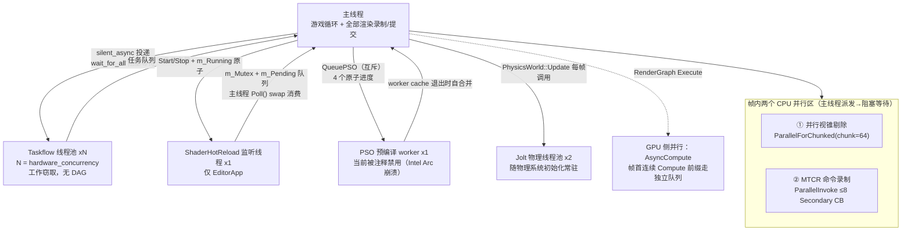
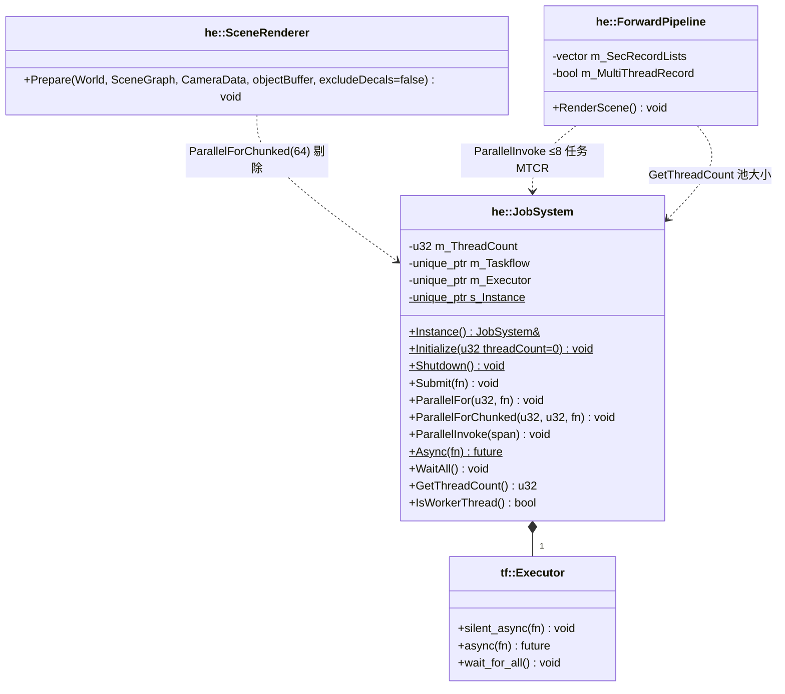
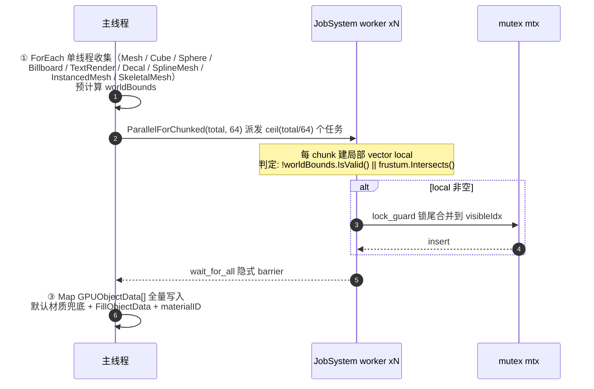
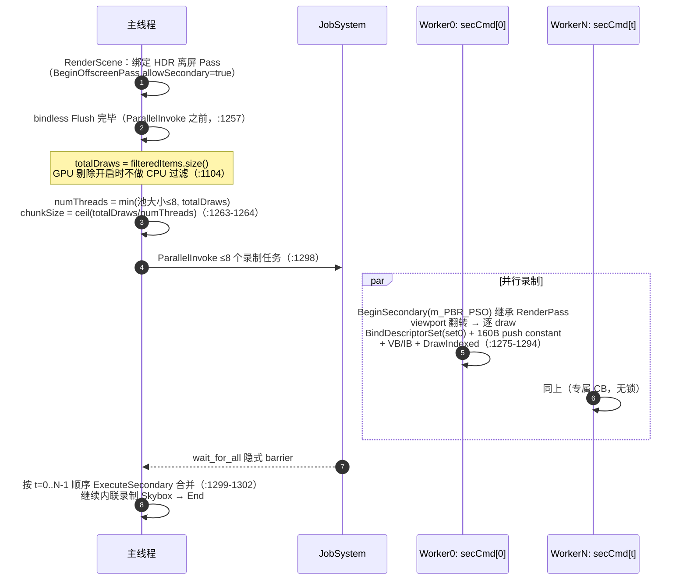
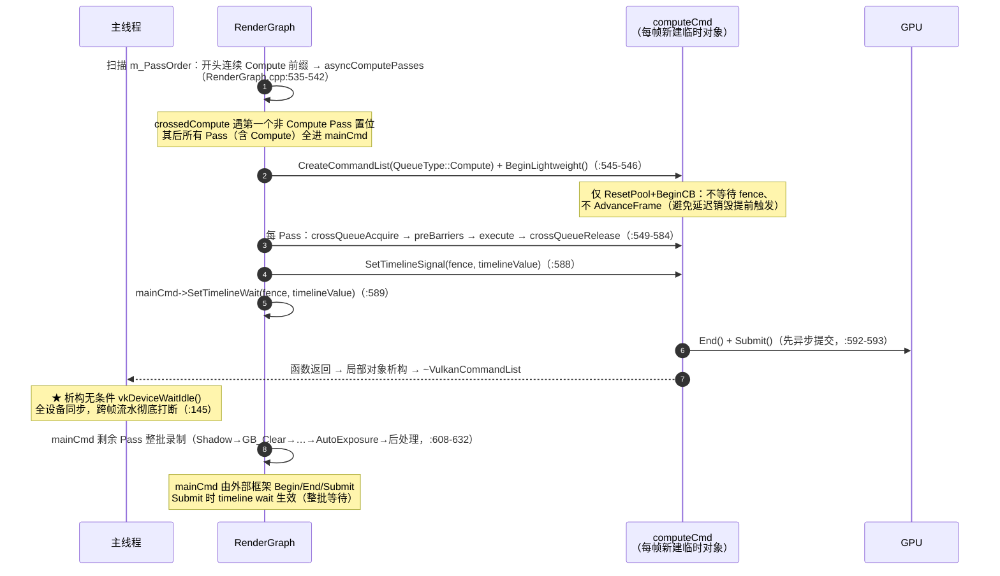
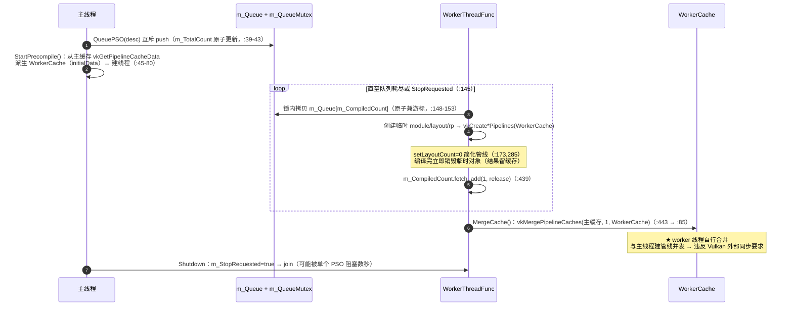
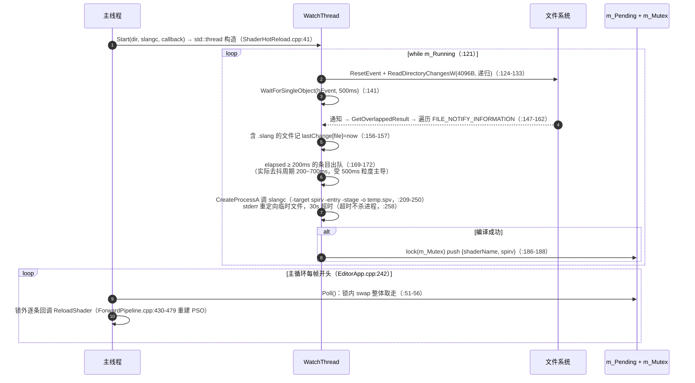

# HugEngine 多线程架构与渲染实现分析

> 分析范围：`Engine/Core/Threading`、`Engine/Render/SceneRenderer`、`Engine/Render/Pipeline`、
> `Engine/Render/RenderGraph`、`Engine/RHI/Vulkan`（同步与命令列表路径）。
> 版本说明：本版由早期两份同主题文档（2026-07-17 版与 2026-08-19 版，后者于 2026-09-21 校订）
> 合并而成，两份文档中重复的六个主题只保留一处，并对全部 `file:line` 引用做了逐条复核
> （历史误述的更正见 [§12](#12-历史误述与遗漏补正记录)）。

---

## 目录

1. [线程全景图](#1-线程全景图)
2. [核心结论](#2-核心结论)
3. [JobSystem 任务并行](#3-jobsystem-任务并行)
4. [并行视锥剔除](#4-并行视锥剔除)
5. [MTCR 多线程命令录制](#5-mtcr-多线程命令录制)
6. [AsyncCompute 跨队列并行](#6-asynccompute-跨队列并行)
7. [背景线程](#7-背景线程)
8. [多帧在飞行与 CPU-GPU 同步](#8-多帧在飞行与-cpu-gpu-同步)
9. [线程安全设计清单](#9-线程安全设计清单)
10. [已实现 vs 未实现 / 当前瓶颈](#10-已实现-vs-未实现--当前瓶颈)
11. [坑与风险汇总](#11-坑与风险汇总)
12. [历史误述与遗漏补正记录](#12-历史误述与遗漏补正记录)

---

## 1. 线程全景图



**层次视图**（自上而下）：

| 层 | 组件 | 并行方式 |
|---|---|---|
| 5. 应用层 | `Samples/*`、`Samples/Editor` | 主线程事件循环 + 帧渲染 |
| 4. 渲染管线层 | `ForwardPipeline` / `DeferredPipeline` | Forward：`ParallelInvoke` 多线程录制到 Secondary CB；Deferred：走 RenderGraph 路径（无 MTCR） |
| 3. 场景准备层 | `SceneRenderer::Prepare` | `ParallelForChunked` 并行视锥剔除 |
| 2. 辅助服务层 | `ShaderHotReload`、`PSOPrecompileManager` | 各自独立的 `std::thread` |
| 1. 任务系统层 | `JobSystem` → Taskflow | 全局工作窃取线程池 |

**线程总数**：主线程 × 1 + Taskflow 工作线程 × N（`std::thread::hardware_concurrency()`，通常 8–16）
+ Shader HotReload 监听线程 × 1（仅 Editor）+ Jolt 物理线程池 × 2
（`Engine/Physics/Physics/PhysicsWorld.cpp:38` 的 `JPH::JobSystemThreadPool(1024, 8, 2)`，随物理系统
初始化而常驻，与 Taskflow 线程池相互独立）+ PSO 预编译 worker × 1（**当前被注释禁用**，
`Engine/Render/Pipeline/DeferredPipeline.cpp:487`）。
⇒ 运行中约 11–19 个系统线程，不含被禁用的预编译线程。

---

## 2. 核心结论

1. **没有独立渲染线程**：全部渲染录制/提交在主线程；JobSystem 的两个并行区都是
   "主线程派发 → **阻塞等待（`wait_for_all`）** → 主线程继续"的帧内同步 barrier，无帧间流水线重叠。
2. **JobSystem 有效使用面极小**：全引擎仅 3 处 `Instance()` 调用
   （`SceneRenderer.cpp:83` 并行剔除、`ForwardPipeline.cpp:1298` MTCR 派发、`ForwardPipeline.cpp:368`
   线程数查询）；`Submit` / `Async` / `WaitAll` / `ParallelForEach` / `IsWorkerThread` 全部零调用点；
   `tf::Taskflow` 图对象从未使用（纯冗余成员）。
3. **AsyncCompute 管道已建成但当前零并行收益**：`computeCmd` 是每帧新建的局部对象，
   析构时 `vkDeviceWaitIdle()`（`VulkanCommandList.cpp:145`）——"异步提交"后立即全设备同步；
   且 `mainCmd` 整批等待 timeline，无 Phase 交错。实际只有帧首 `GPU_Cull`
   （两阶段模式为 `GPU_Cull_Phase1`）一个 Pass 走 Compute 队列。**当前性能为负**。
4. **多线程录制（MTCR）是唯一真正有效的 CPU 并行**：≤8 个 Secondary CB 并行录制 + 无锁设计，
   实现在 `ForwardPipeline::RenderScene`（RG 与非 RG 两条路径都会经过它），且忽略 CPU 剔除结果。
5. **PSO 预编译架构已实现但运行未启用**（Intel Arc `igc-default64.dll` ~50% 概率 SIGSEGV），
   且存在两处规范级问题：worker 线程自行 `vkMergePipelineCaches`（与主线程建管线并发，
   违反 Vulkan 外部同步要求）、`setLayoutCount=0` 的简化管线与真实 PSO 的缓存键不匹配
   （预编译命中率存疑）。
6. **瞬态分配器双堆安全依赖 FIFO，但引擎优先 MAILBOX** → 帧 N+2 重用 Heap A 时帧 N 的 GPU
   读可能未完成，存在真实竞态窗口（`SignalHeapFence` 是预留空实现）。

**核心瓶颈**：`ExecuteSecondary × N` 的 N 次 `vkCmdExecuteCommands` 调用是串行的
（`ForwardPipeline.cpp:1299-1302`），但这 N 次调用的开销通常远小于 N 个线程的录制时间，所以总体
仍是加速的。真正的瓶颈是 **Submit 与 Present 之间的 GPU 等待**，这属于 GPU 端问题而非 CPU
多线程问题。

---

## 3. JobSystem 任务并行

`Engine/Core/Threading/JobSystem.h` / `JobSystem.cpp` 是对 **Taskflow** 的薄封装。

### 3.1 类图与接口实现



### 3.2 API 矩阵

| API | 语义 | 底层实现（JobSystem.cpp） | 阻塞语义 | 调用点 |
|---|---|---|---|:---:|
| `JobSystem(u32)` | 构造 + 建池 | `m_ThreadCount = max(n,1)`（:17）；创建 `tf::Taskflow`(:18) + `tf::Executor(n)`(:19) | — | — |
| `~JobSystem()` | 析构 | `wait_for_all()`（:26）后 Executor 析构 join 全部 worker | 阻塞 | — |
| `Instance()` | 取单例 | 直接解引用 `s_Instance`（:32，**Initialize 前调用是空指针 UB**） | — | 3 处 |
| `Initialize(u32)` / `Shutdown()` | 建池 / 拆池 | `make_unique<JobSystem>`(:36) / `s_Instance.reset()`(:40) | — | `Engine.cpp:39,56` |
| `Submit(job)` | 发射后忘记 | `executor->silent_async`(:44) | 非阻塞 | **零调用点** |
| `ParallelFor(count, body)` | 逐元素并行 | **逐元素**建 `count` 个 `std::function`（:49-51，绕开 MSVC 2026 下 `for_each_index` 链接问题）→ `ParallelInvoke` | 阻塞 | **零调用点** |
| `ParallelForChunked(count, chunk, body)` | 分块并行 | `numChunks = (count+chunk-1)/chunk`（:57）个任务，每任务 `[start,end)`（:60-64）→ `ParallelInvoke` | 阻塞 | `SceneRenderer.cpp:83` |
| `ParallelInvoke(span)` | 一批任务全并行并等全部完成 | 逐任务 `silent_async`（:71）后**立即 `wait_for_all()`**（:73）——引擎实际唯一在用的并行原语 | 阻塞到本批完成 | `ForwardPipeline.cpp:1298` |
| `Async<T>(task)` | 异步 + future | `executor->async`（JobSystem.h:47） | 非阻塞 | **零调用点** |
| `WaitAll()` | 等全部 | `wait_for_all`（:77） | 阻塞 | **零调用点** |
| `IsWorkerThread()` | 查询线程身份 | **恒返回 `false`**（:80-83，注释 "Taskflow doesn't expose this directly"；实际有 `tf::this_worker()` / `this_worker_id()`（`Engine/External/taskflow/taskflow/core/executor.hpp:558,577`）可接，未接入） | — | **零调用点** |
| `ParallelForEach`（模板） | 自动判断是否并行 | `count > 1024`（JobSystem.h:70）走 `ParallelFor`，否则串行 | 阻塞（>1024 时） | **零调用点** |

### 3.3 线程数与配置

```cpp
// 默认构造 → hardware_concurrency
JobSystem::JobSystem() : JobSystem(std::thread::hardware_concurrency()) {}   // JobSystem.cpp:12-14

// 显式构造
JobSystem::JobSystem(u32 threadCount)
    : m_ThreadCount(threadCount > 0 ? threadCount : 1)                      // JobSystem.cpp:16-17，最少 1 线程

// EngineConfig 中配置
config.jobThreads = 0;  // 0 = auto-detect，Engine.h:19
```

全部 Sample（01–07）与 Editor 都未显式设置 `jobThreads`
（全库仅 `Engine/Core/Core/Engine.h:19` 声明 + `Engine.cpp:39` 转发），一律走 auto。

### 3.4 Taskflow v4.1.0 集成与语义

`Engine/Core/CMakeLists.txt:41` 链接 `Taskflow`；版本 `TF_VERSION 400100`
（`Engine/External/taskflow/taskflow/taskflow.hpp:47`）。Taskflow 的核心特性：工作窃取、
每线程无锁工作队列 + 共享带锁 buffer 队列、任务图（DAG）。

- 线程数 = `hardware_concurrency()` = 逻辑核心数（含超线程）；
- **DAG/依赖图完全未使用**：`m_Taskflow` 创建后闲置（`JobSystem.cpp:18`），全部任务走
  `silent_async` 异步任务路径 → 外部提交进带锁的共享 buffer 队列
  （`Executor::_buffers`，共 `bit_width(N)` 个，`executor.hpp:1198,1580-1582`）；
  worker 从自己的 `_wsq`（`executor.hpp:1471`）与共享 `_buffers` 中窃取
  （victim 选取的伪随机源未逐行复核）；
- worker 本地队列 LIFO pop（深度优先、cache 友好）；连续窃取失败后 yield，阈值是
  `MAX_STEALS = (MAX_VICTIM + 1) << 1`（`executor.hpp:1374,1428`）——**4.1.0 已不是固定 100 次**；
  全部队列为空时进入 notifier 两阶段等待（`prepare_wait` / `commit_wait`，
  `executor.hpp:1490,1503,1536`）而非直接休眠；
- `wait_for_all` 在 C++20 下用 `_num_topologies.wait(n, ...)` 无锁等待（`executor.hpp:2411`）；
- worker 循环 `catch(...)`（`executor.hpp:1324`）把异常存进 topology 的 `_exception_ptr`
  （`executor.hpp:1971,1978,1986`），而 `silent_async` 无 future → **异常可能静默滞留**。

### 3.5 便捷模板

```cpp
// ParallelForEach — 自动判断是否并行（JobSystem.h:67-79）
template<typename Container, typename Func>
void ParallelForEach(Container& container, Func&& func) {
    auto count = static_cast<u32>(std::size(container));
    if (count > 1024)  // 阈值判断：小数据量串行避免调度开销
        JobSystem::Instance().ParallelFor(count, [&](u32 i) { func(container[i]); });
    else
        for (u32 i = 0; i < count; ++i) func(container[i]);
}
```

### 3.6 启动与关闭顺序

```cpp
Engine::Initialize()  // Engine.cpp:26-48
  ├─ 1. Logger::Initialize        // :26  日志系统最先
  ├─ 2. JobSystem::Initialize()   // :39  任务系统第二，创建线程池
  └─ 3. Window (GLFW)             // :48  窗口创建

Engine::Shutdown()    // Engine.cpp:53-58
  ├─ 1. m_Window.reset()          // :55
  ├─ 2. JobSystem::Shutdown()     // :56  走 ~JobSystem → wait_for_all() 等待所有任务完成
  └─ 3. Logger::Shutdown()        // :57
```

### 3.7 死代码与陷阱

- `tf::Taskflow m_Taskflow`（`JobSystem.h:59`）：创建后从未使用；
- `Engine::m_JobSystem` + `GetJobSystem()`（`Engine.h:39,44`）：从未初始化
  （`Engine.cpp` 只用静态 `s_Instance`），且 **`GetJobSystem()` 自身也零调用点**；
- `EngineConfig::enableMultiThreadRecord`（`Engine.h:21`）：**从未被读取**——它不是 MTCR 的开关；
- 嵌套并行死锁风险：worker 任务内再调 `ParallelInvoke` / `WaitAll` 会死锁
  （`wait_for_all` 等全部拓扑完成），当前所有调用在主线程故安全；
- 剔除合并顺序不确定：chunk 完成顺序不保证，`visibleIdx` 为插入序拼接
  → `DrawItem` 顺序每帧可能变化。

---

## 4. 并行视锥剔除

`SceneRenderer::Prepare`（`Engine/Render/SceneRenderer.cpp:19-149`），每帧被
`ForwardPipeline::RenderScene` 调用。

### 4.1 执行流程



对应的真实代码（`SceneRenderer.cpp:76-99`）：

```cpp
Frustum frustum = camera.GetFrustum();                       // :77
std::mutex mtx; std::vector<u32> visibleIdx;                 // :78-80
if (enableFrustumCull) {                                      // :82
    JobSystem::Instance().ParallelForChunked(total, 64, [&](u32 start, u32 end) {   // :83
        std::vector<u32> local; local.reserve(end - start);   // :84-85
        for (u32 i = start; i < end; ++i)
            if (!entries[i].worldBounds.IsValid() || frustum.Intersects(entries[i].worldBounds))  // :87
                local.push_back(i);
        if (!local.empty()) { std::lock_guard<std::mutex> lk(mtx);                    // :90
            visibleIdx.insert(visibleIdx.end(), local.begin(), local.end()); }
    });
} else { for (u32 i = 0; i < total; ++i) visibleIdx.push_back(i); }   // :93-94
u32 visibleCount = (u32)visibleIdx.size();
if (visibleCount > MAX_OBJECTS) visibleCount = MAX_OBJECTS;          // :99
```

- `chunk = 64` 连续分段；锁粒度 = chunk 产出次数（≤ 几十次/帧），是**全引擎 JobSystem 路径
  唯一显式锁**；
- 上限 `MAX_OBJECTS` 截断（:99）。`MAX_OBJECTS = kGPUMaxObjects`（`Engine/Render/Pipeline/Material.h:45`），
  其值为 **1024**（`Engine/Render/Nanite/NaniteTypes.h:65,119` 交叉印证，并由
  `NaniteScene.cpp:29` 的 `static_assert` 与 `MAX_OBJECTS` 锁死）；
- 开关：`SceneRenderer::enableFrustumCull` 成员，默认 `true`（`SceneRenderer.h:30`），
  02.Cube 面板可运行时切换（`Samples/02.Cube/02.Cube.cpp:1476-1480`；07.AISamples 与
  02.Cube 启动时也会以代码关闭它：`Samples/07.AISamples/AISamples.cpp:85`、
  `Samples/02.Cube/02.Cube.cpp:769-773`）。

### 4.2 多线程优化要点

| 设计 | 说明 |
|------|------|
| **chunkSize = 64** | 每个线程处理 64 个实体，避免任务过多导致的调度开销 |
| **本地合并** | `local` 向量收集本 chunk 的结果，只在 chunk 有产出时才加锁写入全局 |
| **std::mutex** | 简单的排他锁，只在产生实体时才加锁，热点数据（空 chunk）几乎无竞争 |
| **简化版 AABB-Frustum** | `frustum.Intersects()` 基于 NDC 空间的符号位简化计算，适合快速剔除 |

### 4.3 潜在优化点

| 问题 | 当前状态 | 改进方向 |
|------|----------|----------|
| **Entity 遍历单线程** | 串行遍历 World 所有实体（`SceneRenderer.cpp:36-71`） | 对大型场景可能成为瓶颈 |
| **GPU 数据上传串行** | 只有剔除是并行的，`Map` + 逐条写入在主线程（:102-149） | 可使用 staging buffer + 多线程 memcpy |
| **无 SIMD** | `frustum.Intersects()` 无 SIMD 优化 | 可加入 SSE/AVX 加速 |
| **结果顺序不确定** | 插入序拼接，跨帧不稳定 | 预先按索引分桶写回，保证确定性 |

---

## 5. MTCR 多线程命令录制

这是 HugEngine 最核心的渲染多线程机制。实现在 `ForwardPipeline::RenderScene`
（`Engine/Render/Pipeline/ForwardPipeline.cpp`）：非 RG 路径由 `ForwardPipeline::Render` 调用，
RG 路径由帧图 "Scene" Pass 的回调调用——**即两条路径都会经过 MTCR**。
与 AsyncCompute 的关系：MTCR 是 **CPU 侧**并行（GPU 仍是单串行流），二者当前不叠加。

### 5.1 预分配阶段与开关

```cpp
// ForwardPipeline::Initialize()  —— ForwardPipeline.cpp:367-375
if (m_MultiThreadRecord) {
    u32 threadCount = JobSystem::Instance().GetThreadCount();              // :368
    u32 secCount = std::min(kMaxSecRecordLists, std::max(threadCount, 1u)); // :369，min(8, N)
    for (u32 i = 0; i < secCount; ++i) {
        auto secCL = device->CreateSecondaryCommandList();
        if (secCL) m_SecRecordLists.push_back(std::move(secCL));            // :372
    }
}
```

每个 Secondary CommandBuffer **整个帧生命周期复用**，不分配不销毁
（`ForwardPipeline.cpp:502` 在 Shutdown 路径清空池）。

| 维度 | 值 |
|------|-----|
| 开关 | `ForwardPipeline::m_MultiThreadRecord`，硬默认 `true`（`ForwardPipeline.h:181`），经 `SetMultiThreadedRecording()` 切换（`ForwardPipeline.h:86`）；`EngineConfig::enableMultiThreadRecord` 字段存在但**从未被读取** |
| 池大小 | `min(kMaxSecRecordLists=8, max(GetThreadCount(), 1))`（`ForwardPipeline.h:183` + `ForwardPipeline.cpp:369`） |
| 回退 | `totalDraws == 0`、池为空或开关关闭时走单线程路径（`ForwardPipeline.cpp:1262` / `1304-1340`） |

### 5.2 帧内时序



### 5.3 Secondary CB 池与 Vulkan 层细节

| 维度 | 实现（`Engine/RHI/Vulkan/VulkanCommandList.cpp` 的辅助构造 / `BeginSecondary` / `End` / `ExecuteSecondary`） |
|---|---|
| 池大小 | `min(kMaxSecRecordLists=8, max(JobSystem::GetThreadCount(),1))`，每条 = 辅助构造的 `VulkanCommandList`（`VulkanCommandList.cpp:124-141`） |
| 每 CB 轮转 | 专属 `VkCommandPool`（RESET 标志，:131）+ 一次分配 `kMaxSecondaryCBs=3` 个 SECONDARY 级 CB（:138）；`BeginSecondary` 取 `m_SecSlot % 3`（:196），`End()` 里 `++m_SecSlot`（:289）；3 帧一轮回 |
| 继承信息 | `VkCommandBufferInheritanceInfo{ renderPass = PSO 的 RenderPass, subpass=0, framebuffer=NULL }`（:199-203）——来源是传入 PSO 而非主 CB 的活动 Pass（同源故兼容） |
| flags | `RENDER_PASS_CONTINUE \| ONE_TIME_SUBMIT`（:207-208，无 `SIMULTANEOUS_USE`——正确，每 CB 只提交一次） |
| 前置条件 | 主 CB 必须以 `SUBPASS_CONTENTS_INLINE_AND_SECONDARY_COMMAND_BUFFERS` 开 Pass（`BeginOffscreenPass(..., allowSecondary=true)`） |
| 别名技巧 | `m_CmdBuffers[m_FrameIndex] = m_SecCmdBuffers[idx]`（:212）——后续 `vkCmd*` 无需分支直接录进 sec CB（脆弱：若对 sec 列表调 `Begin()`/`Submit()` 会因 pool 为空而走错分支） |
| 合并 | `vkCmdExecuteCommands(主CB, 1, &对方 m_SecCmdBuffers[m_SecActive])`（:224-225），按 worker 序号升序保持全局 draw 顺序 |
| set=1 | 已移除——纹理采样改走 bindless `u_Textures[]`（`ForwardPipeline.cpp:1284-1285` 注释） |

### 5.4 线程安全设计

| 维度 | 内容 |
|---|---|
| 独占 | 每 worker 独占 `m_SecRecordLists[t]`：自己的 `VkCommandPool` + 3 个 sec CB + 状态缓存字段 |
| 共享（只读） | `filteredItems`（引用）、`framePC`（每任务先拷贝 `pc = framePC`，`ForwardPipeline.cpp:1282`）、描述符集句柄、PSO、mesh VB/IB |
| 锁 | **完全无锁**（`VulkanCommandList.cpp` 全文件无 `mutex` / `lock_guard`） |
| 跨线程通信 | 仅 JobSystem 的 `wait_for_all` join 建立 happens-before |
| 隐患 | `m_SecActive` 是 worker 写、主线程 join 后读的**普通 `u32`（非原子）**（`VulkanCommandList.h:163`）——靠 join 可见性，易碎设计 |
| 规范符合性 | CommandPool 线程安全要求"分配/重置需外部同步"——每 sec 列表独享 pool 且分配只在初始化期，录制期每 pool 单 worker → 符合规范；3-CB 轮转（`VulkanCommandList.cpp:196,289`）配合主 CB 同槽 fence，据代码注释推断用于对冲"重录时 GPU 未完成"风险（**该关联为设计意图推断，未见显式代码断言，未能复核**） |

### 5.5 性能考量与限制

- 每 draw 重绑描述符集 + VB/IB（无惰性/去重）；每 draw 一次 160B push constant
  （尺寸由 `Material.h:54` 的 `static_assert(sizeof(PushConstantData) == 160)` 锁定）；
  debug label 每 draw（受 `r.Debug.DrawMarker` 控制，默认开——`VulkanCommandList.cpp:35`，
  关闭时 `EmitDrawLabel` 直接返回，:638-639）；
- 静态均分 chunk 不均衡：按 draw 数量切分，不考虑三角形数差异；Taskflow 窃取只能平衡任务级负载；
- 每帧 2 次动态分配（任务 vector，`ForwardPipeline.cpp:1266`）；`wait_for_all` 每帧全量 join；
- **与 CPU 剔除结果脱节**：MTCR 路径 `filteredItems = std::move(allDrawItems)`
  （`ForwardPipeline.cpp:1104`），录制量不受 CPU 可见性影响；
- MTCR 池按 `min(8, GetThreadCount())` 预分配，线程数 < 8 的机器上并行度随之下降；
- MTCR 循环里跳过 `di.bInstanced`（`ForwardPipeline.cpp:1281`），实例化/蒙皮网格由专用 Pass 绘制。

### 5.6 ForwardPipeline vs DeferredPipeline

| 管线 | 多线程命令录制 |
|------|:---:|
| **ForwardPipeline** | ✅ 完整实现 |
| **DeferredPipeline** | ❌ 未实现（走 RenderGraph 路径，通过 AsyncCompute 实现 GPU 并行） |

---

## 6. AsyncCompute 跨队列并行

实现在 RenderGraph 层（非 Core 线程层），但属于多线程架构的关键部分。

### 6.1 能力检测与 Timeline Semaphore 封装

- **队列族三级检测**（`Engine/RHI/Vulkan/VulkanDevice.cpp:80-128`）：必须级
  Graphics+Compute+Present 族（找不到即 `HE_ASSERT`，:84）→ Tier 2 = 不含 GRAPHICS/TRANSFER 的
  纯 Compute 族（:115-118）→ Tier 1 = Compute+Transfer 族（:119-122）→ Tier 0 = 无独立族
  （`m_ComputeQueue = m_GraphicsQueue`，`HasAsyncComputeQueue()` 为 false，:123-127）。
  注意：检测按"含不含 TRANSFER"分级（:104-113），而 `GetCaps` 暴露的是
  `supportsAsyncCompute` / `asyncComputeTier`（`VulkanDevice.cpp:166-168`），两处标准不同源；
- **`RHIFenceHandle` = u64 句柄 = 索引 + 1**（`m_Fences[fence-1]`，`kInvalidFence = 0`）；
  `FenceState{ VkSemaphore, currentValue }`（`VulkanDevice.cpp:875-882`）；`DestroyFence` 只置空
  信号量，不压缩 vector 也不复用句柄（:884-891）；`fs.currentValue` 只在 `CreateFence`(:879) 与
  `SignalFenceOnQueue`(:935) 被写、**无读取点**（死字段），真值由 `GetFenceValue` 走
  `vkGetSemaphoreCounterValue`（:907-913）；
- **`SignalFenceOnQueue` / `WaitFenceOnQueue` 的"空提交"**（`VulkanDevice.cpp:915-960`）：
  `commandBufferCount = 0` 的 `VkSubmitInfo` + `VkTimelineSemaphoreSubmitInfo` 挂 `pNext`——
  Vulkan 的 timeline signal/wait 只能经 `vkQueueSubmit` 附带，空提交 = 任意队列上贴信号/等待的
  瞬时执行点。**当前主链路未消费这两个接口**（主链路用 CommandList 级
  `SetTimelineSignal` / `SetTimelineWait`，`VulkanCommandList_Submit.cpp:131-141`）。

### 6.2 多阶段提交模型与 RenderGraph 拆分



`ScheduleAsyncPasses()`（`RenderGraph.cpp:660-692`）在编译阶段分析每个 Compute Pass：
对每个 `writes` 检查其后续 Pass 是否读取同一 handle，无 RAW 则 `asyncSchedule = true` 并调
`InsertCrossQueueBarrier`，否则 `requiresSync = true`。

> 注：`asyncSchedule` / `requiresSync` 两个标志只在本函数写入（:682 / :688），
> 全库没有读取点（声明见 `RenderGraph.h:89-90`）；实际拆分只看 `queueHint`
> 与"帧首连续 Compute 前缀"规则（:536-541，另见 §6.5）。

### 6.3 每帧时间线值

- `DeferredPipeline.cpp:782-783`：`SetTimelineBase(m_FrameCounter); m_FrameCounter += 2`——
  **每帧实际只用 1 个值**（signal 值须严格递增，+2 是保守余量，奇数全跳过）；
  u64 回绕需 2.6×10⁹ 年，不可达；
- fence 首次启用 AsyncCompute 时惰性创建（`DeferredPipeline.cpp:710-712`），
  关闭时销毁（:584-586）；
- Submit 合并（`VulkanCommandList_Submit.cpp:147-222`）：`wait[0]` = swapchain 二进制
  （`COLOR_ATTACHMENT_OUTPUT`，:150,175-179）、`wait[1]` = timeline（`ALL_COMMANDS`，:180-185）；
  signal 同理（:163-168）；`waitSemaphoreValueCount` 填**含二进制的总数**（:189）；
  **隐患**：只有二进制、无 timeline 的 Submit 会让 `pWaitSemaphoreValues` / `pSignalSemaphoreValues`
  指向未初始化栈槽（:161,172 声明，:189,191 用 count 引用），当前两条路径恰好填对。

### 6.4 哪些 Pass 真正异步

标记 `RGPassQueue::Compute` 的共 3 处（`Engine/Render/Pipeline/DeferredPipeline_FrameGraph.cpp`）：
`GPU_Cull_Phase1`（两阶段模式，:153-164）、`GPU_Cull`（单阶段模式，:168-184）、
`AutoExposure`（:1525-1532）——前两者互斥，运行时最多 2 个。

`GPU_Cull` / `GPU_Cull_Phase1` 的 `writes` 声明为**空**（:154-155 / :169-170），
只声明读 `gbDepth`；`AutoExposure` 读 HDR 颜色（:1525）。

原 `DDGI_Update` Pass 已不存在：代码中只剩注释提及旧名（:535），探针更新现在由 DDGI Provider 以
`prov->GetName()`（`"GI_DDGI"`，`Engine/Render/GI/GI_DDGI.h:31`）注册（:770-779），射线追踪是新增的
`DDGI_Trace` Pass（:704-717），两者都显式标记 `RGPassQueue::Graphics`，不再是 Compute 候选。

拓扑序：**GPU_Cull（Compute）** → Shadow → GB_Clear → HiZ_Build → GPU_Cull_Phase2 → DDGI 相关
Pass → AO → … → AutoExposure（Compute）→ Particle。

按"连续 Compute 前缀"规则：**只有 GPU_Cull（或两阶段模式的 GPU_Cull_Phase1）真正走 Compute 队列**；
AutoExposure 因 `crossedCompute` 已置位而落回 mainCmd。SSAO/SSR/SSGI/Denoise/HiZ/GPU_Cull_Phase2
均为全屏三角形 Graphics Pass（未标记 Compute）。

### 6.5 缺陷清单（重要）

| # | 缺陷 | 位置 | 影响 |
|---|---|---|---|
| 1 | **每帧 vkDeviceWaitIdle**：computeCmd 局部对象析构无条件 `vkDeviceWaitIdle()`（曾经的 `FlushAll()` 已移除，析构里另有注释说明不代设备清队列） | `VulkanCommandList.cpp:143-145`（说明性注释 :160-161） | "异步"后立即全同步，三缓冲流水被打断——**AsyncCompute 当前性能为负** |
| 2 | **整批等待 = 零并行**：mainCmd 单批提交、整批 wait timeline，注释里描述的三阶段交错模型未实现 | `VulkanCommandList_Submit.cpp:180-185` | GPU 侧无并行收益 |
| 3 | **死分析**：`asyncSchedule` / `requiresSync` 只在 `ScheduleAsyncPasses` 写入，全库无读取点；调度只看 `queueHint` + 前缀规则 | `RenderGraph.cpp:682,688` | `canAsync` 分析白做 |
| 4 | **依赖漏检**：`canAsync` 只查 RAW（writes vs 后续 reads），漏 WAR（GPU_Cull 读 gbDepth vs GB_Clear 写 gbDepth） | `RenderGraph.cpp:666-680` | 恰好语义安全（读上帧深度），但分析不完整 |
| 5 | **跨队列所有权转移未配对**：release 侧为空（GPU_Cull 向 RG 声明的 `writes` 为空，:154-155 / :169-170），只有 Compute 侧 acquire —— 严格规范下所有权转移未配对 | `RenderGraph.cpp:704-741`（release 写入点 :722-736） | 依赖驱动容忍；validation layer 是否报错（未能复核） |
| 6 | **stage 死数据**：`BarrierRecord` 填 `BottomOfPipe`/`ComputeShader`/`TopOfPipe`（`RenderGraph.cpp:717-718,734-735`），但 `QueueOwnershipTransfer` 接口不带 stage，实际发 `ALL_COMMANDS` | `VulkanCommandList_Submit.cpp:73-76` | 精度损失 |
| 7 | **shadow descriptor 就地改绑共享 GBuffer 描述符集**（binding 2 的 Object Buffer），主命令列表录制中途改绑 | `DeferredPipeline_FrameGraph.cpp:234-243` | 当前**不构成跨队列竞争**（GPU_Cull 系列各自持有独立描述符集，见 §12）；但"录制期改绑共享集合"仍是脆弱写法 |
| 8 | computeCmd 的 3 个 fence 从不等待（`BeginLightweight` 不等待 fence、不推进帧）——安全依赖 timeline 传递链（compute 提交 → mainCmd wait → 帧 N-3 主 fence 等待）；若 AsyncCompute 路径被跳过需重新论证 | `VulkanCommandList.cpp:274-284` | 脆弱前提 |

---

## 7. 背景线程

### 7.1 PSO 预编译 worker（当前禁用）



- 原子变量 4 个：`m_CompiledCount`（worker release 写 / 主线程 acquire 读进度）、`m_TotalCount`、
  `m_Running`、`m_StopRequested`；
- **禁用原因**（`DeferredPipeline.cpp:482-487` 注释 + 唯一启动调用被注释掉，:487）：
  Intel Arc B370 上 worker 在 `igc-default64.dll` 内随机 SIGSEGV（~50% 概率）
  → 当前代码库**不存在运行中的预编译线程**（`VulkanDevice::StartPSOPrecompile`
  `VulkanDevice.cpp:1232-1234` 除被注释的那处外无其它调用点）；
- **命中率存疑**：`VkPipelineCache` 的键含完整管线状态，worker 用 `setLayoutCount = 0`
  建的简化管线（:173,285）与真实带描述符布局的 PSO **不会命中同一缓存条目**——预热对真实管线
  基本无效（无布局的全屏三角形除外）；
- `StartPrecompile` 二次启动会覆盖 `m_WorkerCache` 句柄泄漏（仅 `m_Running` 检查挡并发启动，:46-49）。

### 7.2 ShaderHotReload 监听线程（仅 EditorApp）



关键设计（早期版本中单独成表，此处并入）：

| 设计 | 说明 |
|------|------|
| **独立线程** | `std::thread` 而非 Taskflow，生命周期独立于帧循环 |
| **去抖（debounce）** | `lastChange[name] + 200ms` 判断（:169-172），避免文件保存过程中反复触发编译 |
| **退出标志** | `m_Running` 为 `std::atomic<bool>`（:40,45），线程循环用 `WaitForSingleObject(hEvent, 500ms)`（:141）定期检查 |
| **主线程回调** | 编译完成的 SPIR-V 通过 `m_Pending` 队列传递，主线程 `Poll()` 锁内 swap 消费（:51-56） |
| **slangc 进程** | 每个变动的 shader 启动一次 `CreateProcessA("slangc ...")`，等待编译完成读取 `.spv` |

- 消费端只在 Editor 存在：`Samples/Editor/EditorApp.cpp:164-168` 启动、`:242` 每帧 `Poll()`、
  `:549` 停止；
- 健壮性缺陷：`GetOverlappedResult` 失败（变化事件超 4096B 缓冲，如 `git checkout`）→ **直接
  `break`，线程永久失效**且无错误日志（:147）；`WaitForSingleObject` 非超时非信号也会静默退出
  （:164-165）；
- **递归监控**：`ReadDirectoryChangesW(..., bWatchSubtree = TRUE, ...)`（:131）——子目录**会**被监听
  （早期版本曾表述为非递归，见 §12）；
- 只认 `.vert.slang` / `.frag.slang` / `.comp.slang` 三种扩展名（`InferShaderType`，:67-86），
  光追 / mesh shader 改动不触发；
- 临时文件固定名 `hug_shader_temp.spv` / `hug_shader_temp.err`（:209,225），多实例互相覆盖
  （当前单实例无碍）。

---

## 8. 多帧在飞行与 CPU-GPU 同步

### 8.1 三缓冲与帧围栏

```
VulkanCommandList：m_CmdPools[3] / m_CmdBuffers[3] / m_Fences[3]（初始 SIGNALED）
                   + m_FrameIndex（VulkanCommandList.h:154-157）
kMaxFramesInFlight = 3（Engine/RHI/RHI/Types.h:17）

帧 N Begin()（VulkanCommandList.cpp:232-272）:
  ① vkWaitForFences(fence[N%3], VK_TRUE, UINT64_MAX)   // :234 等帧 N-3 提交完成
                                                        //（单点挂起风险：GPU 超 3 帧即永久阻塞）
  ② device->AdvanceFrame()                              // :239 m_CurrentFrame++
  ③ AdvanceDeferredDestroy(frameId)                     // :240 帧 ID 去重（同一帧多次 Begin 只推进一次）
  ④ 待重建的旧 Framebuffer 入延迟销毁队列               // :244-263
  ⑤ vkResetCommandPool(slot N%3) + vkBeginCommandBuffer // :266-270

Submit()（VulkanCommandList_Submit.cpp:147-222）:
  wait:  swapchain->GetImageAcquiredSemaphore()（COLOR_ATTACHMENT_OUTPUT，:150-151）+ 可选 timeline（ALL_COMMANDS，:180-185）
  signal: swapchain->GetRenderCompleteSemaphore()（:155）+ 可选 timeline（:163-168）
  vkResetFences(fence[N%3]) → vkQueueSubmit(..., fence[N%3])（:206-207）
  → m_FrameIndex = (N+1)%3（:221），并向交换链登记"acquire 已被消费"的栅栏（:213）
```

- **swapchain 的同步原语是"多份"**：acquire 信号量按飞行帧槽位各一份
  （`kAcquireSlots = 3`，`VulkanSwapChain.h:88-92`，各配一个 acquire 栅栏），render-complete
  信号量按交换链图像各一份（`VulkanSwapChain.cpp:199-211`）；提交后在
  `SetAcquireConsumedFence()` 登记该槽位的提交栅栏（`VulkanCommandList_Submit.cpp:213` →
  `VulkanSwapChain.h:100`），复用槽位前先等它（`VulkanSwapChain.cpp:243-246`）——这是
  "信号量已被等待消费"的唯一证明（旧实现每帧复用单个信号量，实测每帧触发
  VUID-vkAcquireNextImageKHR-semaphore-01779，该历史说明保留在
  `VulkanSwapChain.h:85-88` / `VulkanSwapChain.cpp:237-242` 的注释中）；
- **延迟销毁队列**（`Engine/RHI/Vulkan/DeferredDestructionQueue.h`）：`m_Queue[kSlots]`
  （`kSlots = 2 × kMaxFramesInFlight = 6`，:47）+ 写索引，入队槽位要等写索引轮转一整圈才执行
  销毁（远大于 3 帧，为多命令列表"一帧多次推进"留出余量）；帧 ID 去重保护"同一帧多次 Begin"
  （`VulkanDevice.h:236-241`）；
- **BeginLightweight 为何不推进**：computeCmd 每帧新建，若再调 `AdvanceFrame` 一帧推进两次 →
  延迟销毁提前一帧触发、资源仍在 GPU 使用即被销毁（`VulkanCommandList.cpp:274-284` 注释）。

### 8.2 瞬态分配器双堆的竞态窗口（重要）

- `kNumHeaps = 2`（`Engine/RHI/TransientResourceAllocator.h:103`）× 默认 128MB
  （`TransientResourceAllocator.h:46`，实际由 `VulkanDevice.cpp:303` 传 `128 * 1024 * 1024`）；
  `AdvanceFrame` 切堆重置 bump 游标（`TransientResourceAllocator.cpp:218-232`）；
  调用点在帧首：`RenderGraph.cpp:407-408`（`device->AdvanceTransientResources()`）；
- 注释声称双堆安全："SwapChain Present 提供至少 2 帧 GPU 间隔"——**前提是 FIFO**
  （`TransientResourceAllocator.cpp:207-216`）；
- **但引擎优先 MAILBOX**（`VulkanSwapChain.cpp:67-73`，且 `Present(bool /*vsync*/)` 的 vsync 参数
  被忽略，:261）：MAILBOX 下 CPU 可超前 GPU 最多 2 帧，帧 N+2 重用 Heap A 时帧 N 的 GPU 工作可能
  仍在执行；主列表 `Begin` 的 fence 等待只保证帧 N-1 完成——**真实竞态窗口**；
- `SignalHeapFence()` 是预留空实现（`TransientResourceAllocator.cpp:235-242`，Phase 3 优化位）——
  风险未闭环。修复方向：堆数改 3（对齐 `kMaxFramesInFlight`）或实现 per-heap fence。

### 8.3 主线程帧循环同步点清单

| 位置 | 同步点 | 停顿条件 |
|---|---|---|
| `SwapChain::AcquireNextImage`（:243-256） | 先等该槽位的消费栅栏 / acquire 栅栏，再 `vkAcquireNextImageKHR(UINT64_MAX)` | 上一轮同槽位提交未完成，或无可用图像（FIFO 主要节流） |
| `CommandList::Begin`（:234） | `vkWaitForFences(UINT64_MAX)` | 帧 N-3 未完成（3 帧深度回退） |
| 帧内（可选） | `GetQueryResults` 带 `VK_QUERY_RESULT_WAIT_BIT`（:532） | 仅 Profiler 启用时 |
| JobSystem 并行区 | `wait_for_all` ×2（`JobSystem.cpp:73`） | 剔除 / MTCR 任务完成 |
| AsyncCompute | computeCmd 析构 `vkDeviceWaitIdle`（:145） | **全 GPU 空闲（当前每帧）** |
| Present | `vkQueuePresentKHR` | FIFO 队列满 |
| 退出 | `WaitIdle`（`VulkanDevice.cpp:834-836`） | 一次 |

---

## 9. 线程安全设计清单

### 9.1 跨线程共享（有保护）

| 数据 | 保护 | 访问方 |
|---|---|---|
| PSO 预编译 `m_Queue` | `m_QueueMutex` 整向量锁（`PSOPrecompileManager.cpp:40,149`） | 主线程写 / worker 读 |
| PSO 预编译 4 原子 | `std::atomic`（release/acquire） | 双方 |
| HotReload `m_Pending` | `m_Mutex` + 锁内 swap 消费（`ShaderHotReload.cpp:54-56,186`） | worker 写 / 主线程 Poll 读 |
| HotReload `m_Running` | `std::atomic`（:40,45,121） | 主线程写 / worker 轮询 |
| HotReload 配置（callback / path / dir） | 线程创建前赋值（`std::thread` 构造建立 happens-before） | 只读 |
| 剔除合并 `visibleIdx` | `std::mutex` + `lock_guard`（`SceneRenderer.cpp:78,90`） | worker 写 / 主线程读 |
| `PipelineStateDesc` 内 shader 裸指针 | 无锁，依赖生命周期约定 | 主线程持有 / worker 拷贝读 |
| JobSystem 任务 | Taskflow 无锁队列 + 条件变量 | 主线程 + N worker |

### 9.2 主线程独占（无锁）

`VulkanDevice::m_CurrentFrame` / `m_LastDeferredAdvanceFrame` / `m_PSOCache`（无锁 `unordered_map`）/
`m_DeferredDestroy` / `m_TransientAllocator` / `m_PipelineCache`；主命令列表实例及其
fence / pool / semaphore（`VulkanDevice.h:236-250,406,421`）。

### 9.3 每线程私有

Taskflow worker：各自独占的 Secondary 命令列表（`m_SecRecordLists[t]`）、剔除 `local` 向量；
HotReload：`lastChange` map、4096B 缓冲、文件/事件句柄；PSO worker：`m_WorkerCache`
（线程边界移交）。

---

## 10. 已实现 vs 未实现 / 当前瓶颈

### 10.1 已实现

| 功能 | 位置 | 成熟度 |
|------|------|:------:|
| **工作窃取线程池** | `JobSystem` + Taskflow | ✅ |
| **并行视锥剔除** | `SceneRenderer::Prepare`（`SceneRenderer.cpp:83`） | ✅ |
| **多线程命令录制** | `ForwardPipeline::RenderScene`（≤8× SecCB，`min(8, 线程数)`，:1262-1303） | ✅ |
| **AsyncCompute GPU 并行** | `RenderGraph::ExecuteWithAsyncCompute`（`RenderGraph.cpp:505-654`） | ⚠ 已建成但零收益（见 §6.5） |
| **Shader 热重载** | 独立 `std::thread` + `ReadDirectoryChangesW`（仅 Editor） | ✅ |
| **任务阈值自适应** | `ParallelForEach` `count > 1024` 自动选择（JobSystem.h:70） | ✅（零调用点） |
| **分块并行** | `ParallelForChunked` 可调 chunk size | ✅ |
| **帧配置** | `ForwardPipeline::SetMultiThreadedRecording`（`EngineConfig::enableMultiThreadRecord` 未被读取） | ✅ |
| **PSO 后台预编译** | `PSOPrecompileManager`（独立 worker 线程） | ⚠ 已实现但**未启用**（DeferredPipeline.cpp:487 注释掉了启动调用） |

### 10.2 未实现

| 功能 | UE5 对应 | 说明 |
|------|----------|------|
| **专用 RHI 线程** | `FRHIThread` | GPU API 调用在主线程录制 + 提交，没有独立的 RHI 调度线程 |
| **Render Thread** | `FRenderThread` | 剔除在 JobSystem 线程执行但没有持久化的 Render 线程 |
| **Game Thread 分离** | `FGameThread` | 所有逻辑和渲染都在同一线程 |
| **任务图依赖调度** | `tf::Taskflow` DAG | 尽管 Taskflow 支持图，但当前只用了 `silent_async` + `wait_for_all` |
| **流水线并行** | `ParallelFor` + pipe | 当前帧必须完成所有任务才能提交，无帧间重叠 |
| **GPU 端剔除** | `GPUScene` | CPU 剔除之外，GPU 剔除已用于**场景几何**：Forward 的 `RunGPUCulling` + `DrawIndexedIndirect`、Deferred 的 `GPU_Cull`（两阶段为 `GPU_Cull_Phase1/Phase2`）Pass，以及逐实例剔除 `InstanceCuller`；CPU 侧仍保留一套完整剔除作为回退 |
| **DeferredPipeline MTCR** | — | Deferred 管线未实现多线程命令录制 |
| **WorkerThread 识别** | `IsInRHIThread()` | `JobSystem::IsWorkerThread()` 总是返回 false |
| **线程亲和性/优先级** | `FThreadAffinity` | 无 |
| **任务优先级** | `TaskPriority` | 无 |
| **PipelineState 并行创建** | PSO cache + ParallelCreate | PSO 默认在主线程串行创建；后台预编译管理器已实现但当前被注释禁用（见 §7.1） |

### 10.3 当前瓶颈

```
每帧主线程耗时:
  ┌──────────────────┬─────────────────────────────────┐
  │ SceneRenderer    │ 并行剔除 (JobSystem)              │
  ├──────────────────┤                                  │
  │ Pipeline         │                                  │
  │   Render         │ Draws 并行录制 (JobSystem)       │ ← 这部分是异步的
  ├──────────────────┼─────────────────────────────────┤
  │ ExecuteSecondary │ ★ 串行瓶颈: vkCmdExecuteCommands  │ ← 在主线程
  ├──────────────────┤                                  │
  │ cmdList->Submit  │ ★ 串行瓶颈: vkQueueSubmit         │ ← 在主线程
  ├──────────────────┤                                  │
  │ Present          │ ★ 串行瓶颈: vkQueuePresentKHR     │ ← 在主线程
  └──────────────────┴─────────────────────────────────┘
```

---

## 11. 坑与风险汇总

| 严重度 | 问题 | 位置（已复核到当前行号） |
|---|---|---|
| ★★★ | AsyncCompute 每帧 `vkDeviceWaitIdle`（computeCmd 局部对象析构）→ 跨帧流水被打断 | `VulkanCommandList.cpp:143-145` |
| ★★★ | 瞬态分配器双堆安全依赖 FIFO，实际 MAILBOX → 帧 N+2 重用与帧 N GPU 读重叠竞态 | `TransientResourceAllocator.cpp:207-232`（依赖前提 `VulkanSwapChain.cpp:67-73`） |
| ★★★ | PSO 预编译 worker 线程自行 `vkMergePipelineCaches`，与主线程建管线并发违反 Vulkan 外部同步 | `PSOPrecompileManager.cpp:443`（实现 `:83-91`） |
| ★★ | AsyncCompute mainCmd 整批等待 timeline → GPU 侧零并行 | `VulkanCommandList_Submit.cpp:180-185` |
| ★★ | 跨队列所有权转移未配对：release 侧为空（GPU_Cull 声明 `writes = {}`），只有 Compute 侧 acquire | `RenderGraph.cpp:722-736` + `DeferredPipeline_FrameGraph.cpp:154-155,169-170` |
| ★★ | Begin 的 `UINT64_MAX` fence 等待 = 单点挂起风险（GPU 超 3 帧即永久阻塞） | `VulkanCommandList.cpp:234` |
| ★★ | MTCR 忽略 CPU 剔除结果（`filteredItems = std::move(allDrawItems)`），录制量不受可见性影响 | `ForwardPipeline.cpp:1099-1105` |
| ★★ | PSO 预热 `setLayoutCount = 0` 与真实 PSO 缓存键不匹配 → 命中率存疑 | `PSOPrecompileManager.cpp:173,285` |
| ★ | Submit 信号值数组未初始化槽位 UB（仅二进制、无 timeline 时） | `VulkanCommandList_Submit.cpp:160-192` |
| ★ | `ScheduleAsyncPasses` 死分析（`asyncSchedule` / `requiresSync` 无读取点）+ 漏 WAR | `RenderGraph.cpp:666-690` |
| ★ | `m_SecActive` 非原子跨线程读写（靠 join 可见性） | `VulkanCommandList.h:163` |
| ★ | HotReload `GetOverlappedResult` 失败 → 线程永久退出且无日志（另有等待失败静默退出路径） | `ShaderHotReload.cpp:147,164-165` |
| ★ | HotReload slangc 30s 超时不杀进程（`WaitForSingleObject` 返回值被忽略） | `ShaderHotReload.cpp:258` |
| ★ | JobSystem 死代码：`m_Taskflow` 未用、`Engine::m_JobSystem` / `GetJobSystem()` 未初始化且零调用、`enableMultiThreadRecord` 未读 | `JobSystem.h:59`、`Engine.h:39,44,21` |
| ★ | `IsWorkerThread()` 恒 false 语义陷阱；嵌套并行死锁风险；剔除 DrawItem 顺序不确定 | `JobSystem.cpp:80-83`；`SceneRenderer.cpp:90` |
| ★ | Shadow Pass 录制中途就地改绑共享 GBuffer 描述符集（binding 2）——当前不与 Compute 队列竞争，但写法脆弱 | `DeferredPipeline_FrameGraph.cpp:234-243` |
| ★ | MTCR 的 `ExecuteSecondary` 合并与 `Submit` / `Present` 全在主线程串行（并行录制之外的固定开销） | `ForwardPipeline.cpp:1299-1302`、`VulkanCommandList_Submit.cpp:206-207` |

---

## 12. 历史误述与遗漏补正记录

下表记录**早期版本的本文档曾如此表述**、但经逐行复核后与当前代码不符（或需要补充限定）的条目；
行号均已更新为当前行号。

| # | 早期版本表述 | 代码事实 |
|---|---|---|
| 1 | `ParallelFor` 为"等分并行" | **逐元素**拆 `count` 个任务（`JobSystem.cpp:47-53`） |
| 2 | `WaitAll` / `Async` 有实际"使用场景" | **零调用点**（纯推测）；连同 `Submit` / `ParallelForEach` / `IsWorkerThread` 一并零调用 |
| 3 | MTCR 录制含 `BindDescriptorSet(1, perDrawSet)` | `set=1` 已移除（bindless `u_Textures[]` 取代，`ForwardPipeline.cpp:1284-1285` 注释） |
| 4 | MTCR 开关 = `EngineConfig::enableMultiThreadRecord` | 该字段**从未被读取**（仅 `Engine.h:21` 声明）；实际开关是 `ForwardPipeline.h:181` 硬默认 `true` |
| 5 | 剔除判定仅 `frustum.Intersects` | 另有 `!worldBounds.IsValid()` 前置保留（`SceneRenderer.cpp:87`） |
| 6 | 线程全景图只有 3 类线程（缺 PSO 预编译） | 已实现 `PSOPrecompileManager`（架构上第 4 类），但因 Intel Arc 崩溃禁用（`DeferredPipeline.cpp:482-487`） |
| 7 | "PSO 在主线程串行创建"（列在未实现清单） | 后台预编译已实现（禁用中），且存在 worker 自合并缓存的规范违规（`PSOPrecompileManager.cpp:443`） |
| 8 | 热重载 200ms debounce | 实际去抖周期 200~700ms（受 500ms `WaitForSingleObject` 超时粒度主导，`ShaderHotReload.cpp:141,169-172`） |
| 9 | AsyncCompute 五阶段时序 | 与实现一致，但未指出**整批等待、每帧 `vkDeviceWaitIdle`、零并行**三个实现级问题（见 §6.5） |
| 10 | 未覆盖 | 延迟销毁队列多槽（`kSlots=6`）、三缓冲 fence 轮换、swapchain 多份同步原语（按槽位/按图像）、瞬态双堆、帧 ID 去重（见 §8） |
| 11 | 热重载"非递归监控，不监听子目录" | `ReadDirectoryChangesW` 的第 4 个参数为 `TRUE`（`ShaderHotReload.cpp:131`，注释明确写"bWatchSubtree=TRUE：递归监控"）→ **子目录会被监听** |
| 12 | AsyncCompute 的跨队列 acquire 屏障"被跳过"（因 gbDepth 状态为 `Undefined`） | 复核：`ScheduleAsyncPasses` 在 `DeriveBarriers` 之后调用（`RenderGraph.cpp:136-145`），此时 `m_ResourceStates` 已按全帧走完，gbDepth 被 Shadow / GB_Clear 写过（`DeferredPipeline_FrameGraph.cpp:227,312`），状态不是 `Undefined` ⇒ `InsertCrossQueueBarrier` 里的 `continue`（`RenderGraph.cpp:711`）对 gbDepth **不会**触发，acquire 屏障应当被插入。真正缺失的是 release 侧（`writes` 为空）。**该结论为静态推导，未经 validation layer 实测确认** |
| 13 | Shadow Pass 改绑共享描述符集构成"AsyncCompute 下的跨队列竞争" | 复核：GPU_Cull / Phase1 / Phase2 各自持有独立描述符集（`Engine/Render/Pipeline/GPUCulling.cpp:101,147,190`；单阶段 `Dispatch` 绑定 `m_DescSet`，同文件 :416），Shadow 改的是 `m_GBuffer->GetDescriptorSet()`（`DeferredPipeline_FrameGraph.cpp:234`），两者不是同一集合 ⇒ **该跨队列竞争不成立**；保留为"录制期改绑共享集合"的脆弱性提示（§6.5 #7、§11） |
| 14 | AsyncCompute 五阶段模型中"computeCmd 在帧中途析构即冲刷延迟销毁队列" | `FlushAll()` 已从析构移除并有长注释说明不得代设备清理（`VulkanCommandList.cpp:147-158`）；现存问题只剩无条件 `vkDeviceWaitIdle`（§6.5 #1） |
| 15 | 线程总数"约 12–20 个系统线程" | 复核后的构成：主线程 1 + Taskflow N + Jolt 2（`PhysicsWorld.cpp:38`）+ 热重载 1（仅 Editor）；PSO 预编译 1 被禁用 ⇒ 运行中约 11–19（见 §1） |
