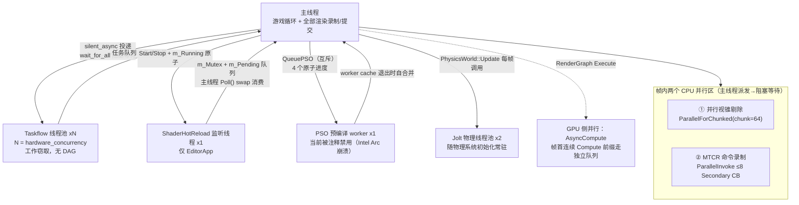
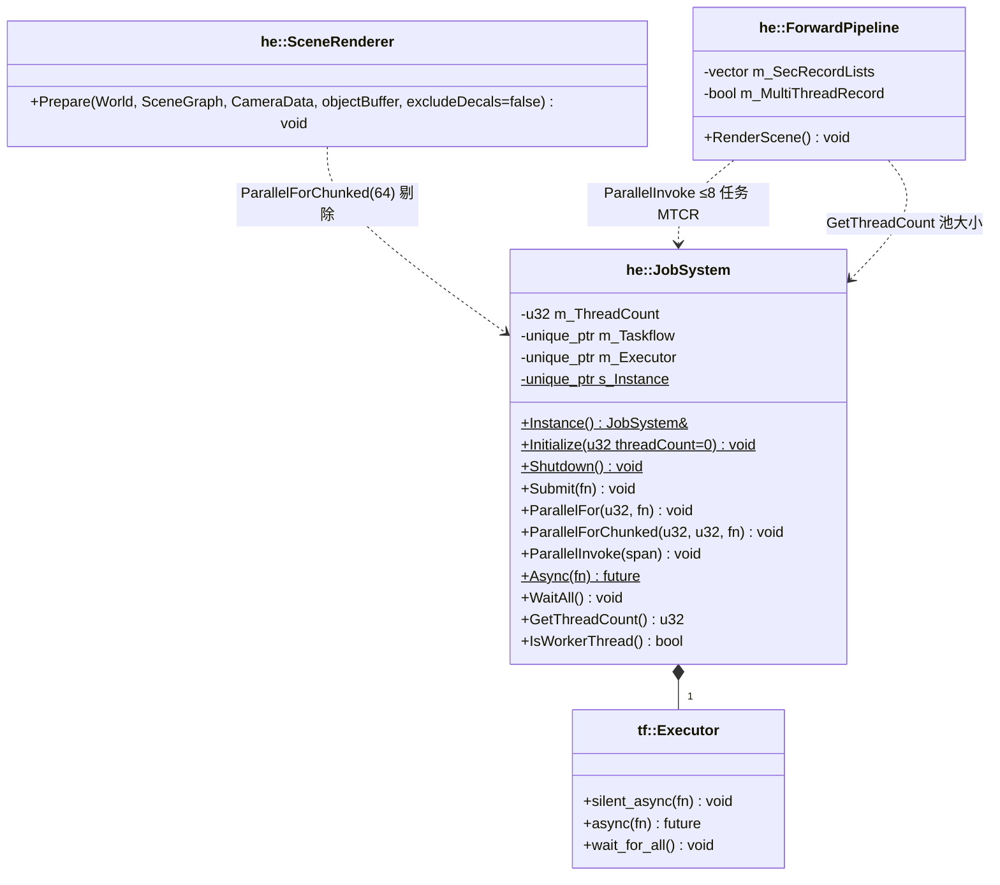
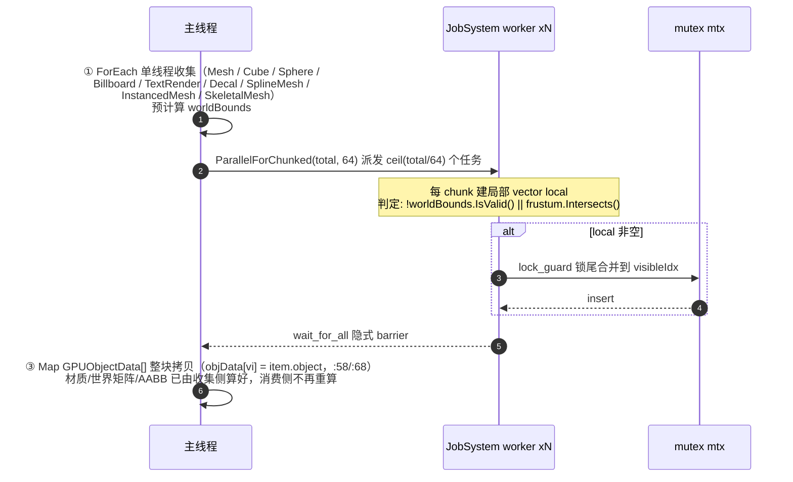
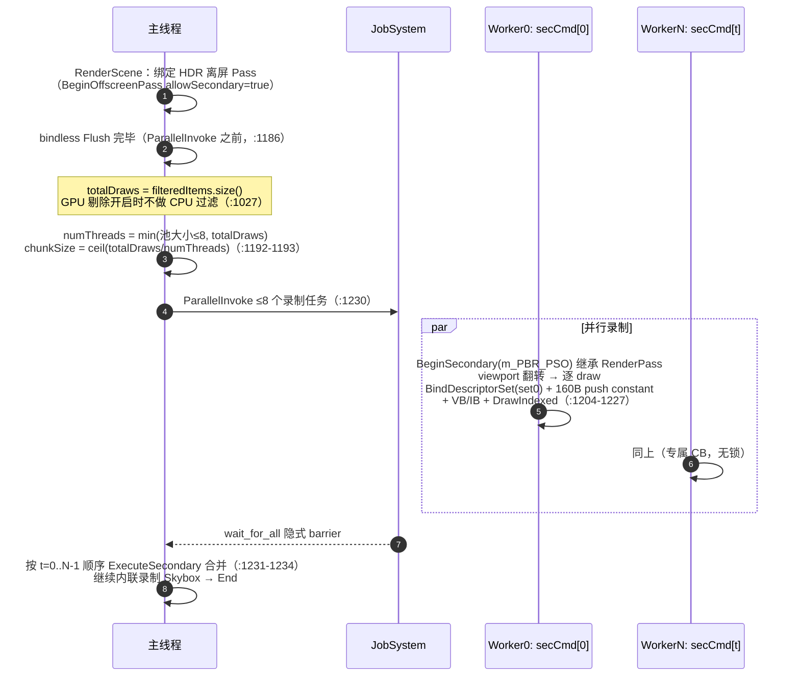
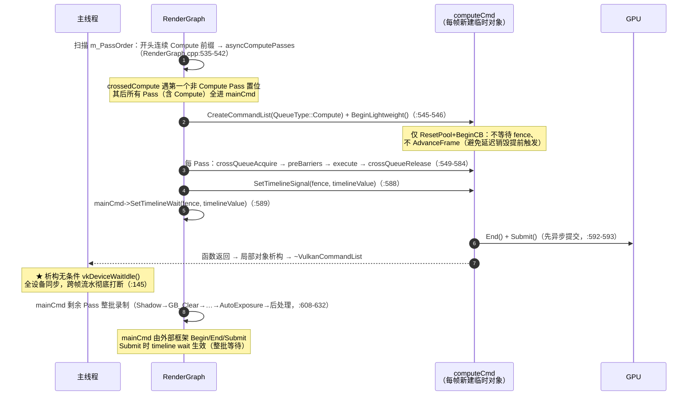
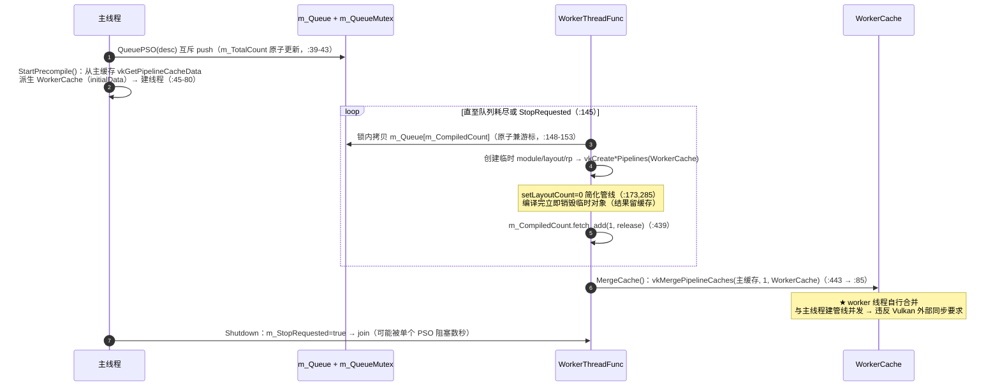
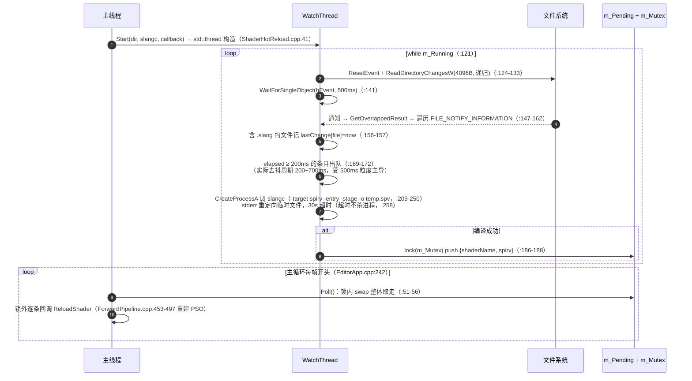

# HugEngine 多线程架构与渲染实现分析

> 分析范围：`Engine/Core/Threading`、`Engine/Render/SceneRenderer`、`Engine/Render/Pipeline`、
> `Engine/Render/RenderGraph`、`Engine/RHI/Vulkan`（同步与命令列表路径）。
> 版本说明：本版由早期两份同主题文档（2026-07-17 版与 2026-08-19 版，后者于 2026-09-21 校订）
> 合并而成，两份文档中重复的六个主题只保留一处，并对全部 `file:line` 引用做了逐条复核
> （历史误述的更正见 [§12](#12-历史误述与遗漏补正记录)）。

---

## 目录

1. [线程全景图](#1-线程全景图)
2. [核心结论](#2-核心结论)
3. [JobSystem 任务并行](#3-jobsystem-任务并行)
4. [并行视锥剔除](#4-并行视锥剔除)
5. [MTCR 多线程命令录制](#5-mtcr-多线程命令录制)
6. [AsyncCompute 跨队列并行](#6-asynccompute-跨队列并行)
7. [背景线程](#7-背景线程)
8. [多帧在飞行与 CPU-GPU 同步](#8-多帧在飞行与-cpu-gpu-同步)
9. [线程安全设计清单](#9-线程安全设计清单)
10. [已实现 vs 未实现 / 当前瓶颈](#10-已实现-vs-未实现--当前瓶颈)
11. [坑与风险汇总](#11-坑与风险汇总)
12. [历史误述与遗漏补正记录](#12-历史误述与遗漏补正记录)

13. [三种模式的实现状态（结论先行）](#13-三种模式的实现状态结论先行)
14. [模式的定义与切换方式](#14-模式的定义与切换方式)
15. [架构与一帧的数据流（模式 1）](#15-架构与一帧的数据流模式-1)
16. [关键数据结构与 API](#16-关键数据结构与-api)
17. [已落地的工作项](#17-已落地的工作项)
18. [验收数据](#18-验收数据)
19. [已知限制与未完成项](#19-已知限制与未完成项)
20. [操作手册](#20-操作手册)
21. [文件清单](#21-文件清单)

---

## 1. 线程全景图


```mermaid
flowchart TD
    main["主线程<br/>游戏循环 + 全部渲染录制/提交"]
    tf["Taskflow 线程池 xN<br/>N = hardware_concurrency<br/>工作窃取，无 DAG"]
    hr["ShaderHotReload 监听线程 x1<br/>仅 EditorApp"]
    pso["PSO 预编译 worker x1<br/>当前被注释禁用（Intel Arc 崩溃）"]
    jolt["Jolt 物理线程池 x2<br/>随物理系统初始化常驻"]

    main -->|"silent_async 投递<br/>wait_for_all 阻塞等待"| tf
    tf -->|"任务队列 + 条件变量"| main
    main -->|"Start/Stop + m_Running 原子"| hr
    hr -->|"m_Mutex + m_Pending 队列<br/>主线程 Poll() swap 消费"| main
    main -->|"QueuePSO（互斥）<br/>4 个原子进度"| pso
    pso -->|"worker cache 退出时自合并"| main
    main -->|"PhysicsWorld::Update 每帧调用"| jolt

    subgraph 并行区["帧内两个 CPU 并行区（主线程派发→阻塞等待）"]
        c1["① 并行视锥剔除<br/>ParallelForChunked(chunk=64)"]
        c2["② MTCR 命令录制<br/>ParallelInvoke ≤8 Secondary CB"]
    end
    main --> 并行区
    gpu["GPU 侧并行：AsyncCompute<br/>帧首连续 Compute 前缀走独立队列"]
    main -.->|"RenderGraph Execute"| gpu
```

**层次视图**（自上而下）：

| 层 | 组件 | 并行方式 |
|---|---|---|
| 5. 应用层 | `Samples/*`、`Samples/Editor` | 主线程事件循环 + 帧渲染 |
| 4. 渲染管线层 | `ForwardPipeline` / `DeferredPipeline` | Forward：`ParallelInvoke` 多线程录制到 Secondary CB；Deferred：走 RenderGraph 路径（无 MTCR） |
| 3. 场景准备层 | `SceneRenderer::Prepare` | `ParallelForChunked` 并行视锥剔除 |
| 2. 辅助服务层 | `ShaderHotReload`、`PSOPrecompileManager` | 各自独立的 `std::thread` |
| 1. 任务系统层 | `JobSystem` → Taskflow | 全局工作窃取线程池 |

**线程总数**：主线程 × 1 + Taskflow 工作线程 × N（`std::thread::hardware_concurrency()`，通常 8–16）
+ Shader HotReload 监听线程 × 1（仅 Editor）+ Jolt 物理线程池 × 2
（`Engine/Physics/Physics/PhysicsWorld.cpp:38` 的 `JPH::JobSystemThreadPool(1024, 8, 2)`，随物理系统
初始化而常驻，与 Taskflow 线程池相互独立）+ PSO 预编译 worker × 1（**当前被注释禁用**，
`Engine/Render/Pipeline/DeferredPipeline.cpp:506`）。
⇒ 运行中约 11–19 个系统线程，不含被禁用的预编译线程。

---

## 2. 核心结论

1. **渲染线程化已落地（模式 1），但模式 2 未实现**：`EngineConfig::renderThreadingMode` /
   `HE_RENDER_THREADING_MODE` 可选单线程（0）与"游戏线程 + 渲染线程"（1）；模式 1 下**整帧 RHI**
   （Acquire → 录制 → ImGui 录制 → Submit → 探测读回 → Present）归一根独立渲染线程，`06.GILab` 已默认走它。
   模式 0 时仍与本文其余结论一致：全部录制/提交在主线程；JobSystem 的两个并行区仍是
   "主线程派发 → **阻塞等待（`wait_for_all`）** → 主线程继续"的帧内同步 barrier，无帧间流水线重叠。
   **实现流程与完整时序见 §13–§21。**
2. **JobSystem 有效使用面极小**：全引擎仅 3 处 `Instance()` 调用
   （`SceneRenderer.cpp:36` 并行剔除、`ForwardPipeline.cpp:1230` MTCR 派发、`ForwardPipeline.cpp:369`
   线程数查询）；`Submit` / `Async` / `WaitAll` / `ParallelForEach` / `IsWorkerThread` 全部零调用点；
   `tf::Taskflow` 图对象从未使用（纯冗余成员）。
3. **AsyncCompute 管道已建成但当前零并行收益**：`computeCmd` 是每帧新建的局部对象，
   析构时 `vkDeviceWaitIdle()`（`VulkanCommandList.cpp:145`）——"异步提交"后立即全设备同步；
   且 `mainCmd` 整批等待 timeline，无 Phase 交错。实际只有帧首 `GPU_Cull`
   （两阶段模式为 `GPU_Cull_Phase1`）一个 Pass 走 Compute 队列。**当前性能为负**。
4. **多线程录制（MTCR）是唯一真正有效的 CPU 并行**：≤8 个 Secondary CB 并行录制 + 无锁设计，
   实现在 `ForwardPipeline::RenderScene`（RG 与非 RG 两条路径都会经过它），且忽略 CPU 剔除结果。
5. **PSO 预编译架构已实现但运行未启用**（Intel Arc `igc-default64.dll` ~50% 概率 SIGSEGV），
   且存在两处规范级问题：worker 线程自行 `vkMergePipelineCaches`（与主线程建管线并发，
   违反 Vulkan 外部同步要求）、`setLayoutCount=0` 的简化管线与真实 PSO 的缓存键不匹配
   （预编译命中率存疑）。
6. **瞬态分配器双堆安全依赖 FIFO，但引擎优先 MAILBOX** → 帧 N+2 重用 Heap A 时帧 N 的 GPU
   读可能未完成，存在真实竞态窗口（`SignalHeapFence` 是预留空实现）。

**核心瓶颈**：`ExecuteSecondary × N` 的 N 次 `vkCmdExecuteCommands` 调用是串行的
（`ForwardPipeline.cpp:1231-1234`），但这 N 次调用的开销通常远小于 N 个线程的录制时间，所以总体
仍是加速的。真正的瓶颈是 **Submit 与 Present 之间的 GPU 等待**，这属于 GPU 端问题而非 CPU
多线程问题。

---

## 3. JobSystem 任务并行

`Engine/Core/Threading/JobSystem.h` / `JobSystem.cpp` 是对 **Taskflow** 的薄封装。

### 3.1 类图与接口实现


```mermaid
classDiagram
direction TB

class `he::JobSystem` {
    -u32 m_ThreadCount
    -unique_ptr<tf::Taskflow> m_Taskflow
    -unique_ptr<tf::Executor> m_Executor
    -unique_ptr<JobSystem> s_Instance$
    +Instance() JobSystem&$
    +Initialize(u32 threadCount=0) void$
    +Shutdown() void$
    +Submit(fn) void
    +ParallelFor(u32, fn) void
    +ParallelForChunked(u32, u32, fn) void
    +ParallelInvoke(span) void
    +Async(fn) future$
    +WaitAll() void
    +GetThreadCount() u32
    +IsWorkerThread() bool
}
class `he::SceneRenderer` {
    +Prepare(World, SceneGraph, CameraData, objectBuffer, excludeDecals=false) void
}
class `he::ForwardPipeline` {
    -vector m_SecRecordLists
    -bool m_MultiThreadRecord
    +RenderScene() void
}
class `tf::Executor` {
    +silent_async(fn) void
    +async(fn) future
    +wait_for_all() void
}

`he::JobSystem` *-- "1" `tf::Executor`
`he::SceneRenderer` ..> `he::JobSystem` : ParallelForChunked(64) 剔除
`he::ForwardPipeline` ..> `he::JobSystem` : ParallelInvoke ≤8 任务 MTCR
`he::ForwardPipeline` ..> `he::JobSystem` : GetThreadCount 池大小
```

### 3.2 API 矩阵

| API | 语义 | 底层实现（JobSystem.cpp） | 阻塞语义 | 调用点 |
|---|---|---|---|:---:|
| `JobSystem(u32)` | 构造 + 建池 | `m_ThreadCount = max(n,1)`（:17）；创建 `tf::Taskflow`(:18) + `tf::Executor(n)`(:19) | — | — |
| `~JobSystem()` | 析构 | `wait_for_all()`（:26）后 Executor 析构 join 全部 worker | 阻塞 | — |
| `Instance()` | 取单例 | 直接解引用 `s_Instance`（:32，**Initialize 前调用是空指针 UB**） | — | 3 处 |
| `Initialize(u32)` / `Shutdown()` | 建池 / 拆池 | `make_unique<JobSystem>`(:36) / `s_Instance.reset()`(:40) | — | `Engine.cpp:61,78` |
| `Submit(job)` | 发射后忘记 | `executor->silent_async`(:44) | 非阻塞 | **零调用点** |
| `ParallelFor(count, body)` | 逐元素并行 | **逐元素**建 `count` 个 `std::function`（:49-51，绕开 MSVC 2026 下 `for_each_index` 链接问题）→ `ParallelInvoke` | 阻塞 | **零调用点** |
| `ParallelForChunked(count, chunk, body)` | 分块并行 | `numChunks = (count+chunk-1)/chunk`（:57）个任务，每任务 `[start,end)`（:60-64）→ `ParallelInvoke` | 阻塞 | `SceneRenderer.cpp:36` |
| `ParallelInvoke(span)` | 一批任务全并行并等全部完成 | 逐任务 `silent_async`（:71）后**立即 `wait_for_all()`**（:73）——引擎实际唯一在用的并行原语 | 阻塞到本批完成 | `ForwardPipeline.cpp:1230` |
| `Async<T>(task)` | 异步 + future | `executor->async`（JobSystem.h:47） | 非阻塞 | **零调用点** |
| `WaitAll()` | 等全部 | `wait_for_all`（:77） | 阻塞 | **零调用点** |
| `IsWorkerThread()` | 查询线程身份 | **恒返回 `false`**（:80-83，注释 "Taskflow doesn't expose this directly"；实际有 `tf::this_worker()` / `this_worker_id()`（`Engine/External/taskflow/taskflow/core/executor.hpp:558,577`）可接，未接入） | — | **零调用点** |
| `ParallelForEach`（模板） | 自动判断是否并行 | `count > 1024`（JobSystem.h:70）走 `ParallelFor`，否则串行 | 阻塞（>1024 时） | **零调用点** |

### 3.3 线程数与配置

```cpp
// 默认构造 → hardware_concurrency
JobSystem::JobSystem() : JobSystem(std::thread::hardware_concurrency()) {}   // JobSystem.cpp:12-14

// 显式构造
JobSystem::JobSystem(u32 threadCount)
    : m_ThreadCount(threadCount > 0 ? threadCount : 1)                      // JobSystem.cpp:16-17，最少 1 线程

// EngineConfig 中配置
config.jobThreads = 0;  // 0 = auto-detect，Engine.h:20
```

全部 Sample（01–07）与 Editor 都未显式设置 `jobThreads`
（全库仅 `Engine/Core/Core/Engine.h:20` 声明 + `Engine.cpp:61` 转发），一律走 auto。

### 3.4 Taskflow v4.1.0 集成与语义

`Engine/Core/CMakeLists.txt:41` 链接 `Taskflow`；版本 `TF_VERSION 400100`
（`Engine/External/taskflow/taskflow/taskflow.hpp:47`）。Taskflow 的核心特性：工作窃取、
每线程无锁工作队列 + 共享带锁 buffer 队列、任务图（DAG）。

- 线程数 = `hardware_concurrency()` = 逻辑核心数（含超线程）；
- **DAG/依赖图完全未使用**：`m_Taskflow` 创建后闲置（`JobSystem.cpp:18`），全部任务走
  `silent_async` 异步任务路径 → 外部提交进带锁的共享 buffer 队列
  （`Executor::_buffers`，共 `bit_width(N)` 个，`executor.hpp:1198,1580-1582`）；
  worker 从自己的 `_wsq`（`executor.hpp:1471`）与共享 `_buffers` 中窃取
  （victim 选取的伪随机源未逐行复核）；
- worker 本地队列 LIFO pop（深度优先、cache 友好）；连续窃取失败后 yield，阈值是
  `MAX_STEALS = (MAX_VICTIM + 1) << 1`（`executor.hpp:1374,1428`）——**4.1.0 已不是固定 100 次**；
  全部队列为空时进入 notifier 两阶段等待（`prepare_wait` / `commit_wait`，
  `executor.hpp:1490,1503,1536`）而非直接休眠；
- `wait_for_all` 在 C++20 下用 `_num_topologies.wait(n, ...)` 无锁等待（`executor.hpp:2411`）；
- worker 循环 `catch(...)`（`executor.hpp:1324`）把异常存进 topology 的 `_exception_ptr`
  （`executor.hpp:1971,1978,1986`），而 `silent_async` 无 future → **异常可能静默滞留**。

### 3.5 便捷模板

```cpp
// ParallelForEach — 自动判断是否并行（JobSystem.h:67-79）
template<typename Container, typename Func>
void ParallelForEach(Container& container, Func&& func) {
    auto count = static_cast<u32>(std::size(container));
    if (count > 1024)  // 阈值判断：小数据量串行避免调度开销
        JobSystem::Instance().ParallelFor(count, [&](u32 i) { func(container[i]); });
    else
        for (u32 i = 0; i < count; ++i) func(container[i]);
}
```

### 3.6 启动与关闭顺序

```cpp
Engine::Initialize()  // Engine.cpp:21-73
  ├─ 1. Logger::Initialize        // :28  日志系统最先
  ├─ 2. JobSystem::Initialize()   // :61  任务系统第二，创建线程池
  └─ 3. Window (GLFW)             // :70  窗口创建

Engine::Shutdown()    // Engine.cpp:75-80
  ├─ 1. m_Window.reset()          // :77
  ├─ 2. JobSystem::Shutdown()     // :78  走 ~JobSystem → wait_for_all() 等待所有任务完成
  └─ 3. Logger::Shutdown()        // :79
```

### 3.7 死代码与陷阱

- `tf::Taskflow m_Taskflow`（`JobSystem.h:59`）：创建后从未使用；
- `Engine::m_JobSystem` + `GetJobSystem()`（`Engine.h:56,61`）：从未初始化
  （`Engine.cpp` 只用静态 `s_Instance`），且 **`GetJobSystem()` 自身也零调用点**；
- `EngineConfig::enableMultiThreadRecord`（`Engine.h:22`）：**从未被读取**——它不是 MTCR 的开关；
- 嵌套并行死锁风险：worker 任务内再调 `ParallelInvoke` / `WaitAll` 会死锁
  （`wait_for_all` 等全部拓扑完成），当前所有调用在主线程故安全；
- 剔除合并顺序不确定：chunk 完成顺序不保证，`visibleIdx` 为插入序拼接
  → `DrawItem` 顺序每帧可能变化。

---

## 4. 并行视锥剔除

`SceneRenderer::Prepare`（`Engine/Render/SceneRenderer.cpp:19-81`），每帧被
`ForwardPipeline::RenderScene` 调用。

### 4.1 执行流程


```mermaid
sequenceDiagram
    autonumber
    participant Main as 主线程
    participant Job as JobSystem worker xN
    participant Mutex as mutex mtx

    Main->>Main: ① ForEach 单线程收集（Mesh / Cube / Sphere /<br/>Billboard / TextRender / Decal / SplineMesh /<br/>InstancedMesh / SkeletalMesh）<br/>预计算 worldBounds
    Main->>Job: ParallelForChunked(total, 64) 派发 ceil(total/64) 个任务
    Note over Job: 每 chunk 建局部 vector local<br/>判定: !worldBounds.IsValid() || frustum.Intersects()
    alt local 非空
        Job->>Mutex: lock_guard 锁尾合并到 visibleIdx
        Mutex-->>Job: insert
    end
    Job-->>Main: wait_for_all 隐式 barrier
    Main->>Main: ③ Map GPUObjectData[] 整块拷贝（objData[vi] = item.object，:58/:68）<br/>材质/世界矩阵/AABB 已由收集侧算好，消费侧不再重算
```

对应的真实代码（`SceneRenderer.cpp:30-55`）：

```cpp
Frustum frustum = camera.GetFrustum();                       // :30
std::mutex mtx; std::vector<u32> visibleIdx;                 // :31-33
if (enableFrustumCull) {                                      // :35
    JobSystem::Instance().ParallelForChunked(total, 64, [&](u32 start, u32 end) {   // :36
        std::vector<u32> local; local.reserve(end - start);   // :37-38
        for (u32 i = start; i < end; ++i) {
            const SnapshotDrawItem& item = snapshot.draws[i]; // :40
            const he::AABB worldBounds{float3(item.object.boundsMin), float3(item.object.boundsMax)};  // :42
            if (!worldBounds.IsValid() || frustum.Intersects(worldBounds))  // :43
                local.push_back(i);
        }
        if (!local.empty()) { std::lock_guard<std::mutex> lk(mtx);                    // :46
            visibleIdx.insert(visibleIdx.end(), local.begin(), local.end()); }
    });
} else { for (u32 i = 0; i < total; ++i) visibleIdx.push_back(i); }   // :48-51
u32 visibleCount = (u32)visibleIdx.size();
if (visibleCount > MAX_OBJECTS) visibleCount = MAX_OBJECTS;          // :55
```

- `chunk = 64` 连续分段；锁粒度 = chunk 产出次数（≤ 几十次/帧），是**全引擎 JobSystem 路径
  唯一显式锁**；
- 上限 `MAX_OBJECTS` 截断（:55）。`MAX_OBJECTS = kGPUMaxObjects`（`Engine/Render/Pipeline/Material.h:45`），
  其值为 **1024**（`Engine/Render/Nanite/NaniteTypes.h:65,119` 交叉印证，并由
  `NaniteScene.cpp:29` 的 `static_assert` 与 `MAX_OBJECTS` 锁死）；
- 开关：`SceneRenderer::enableFrustumCull` 成员，默认 `true`（`SceneRenderer.h:41`），
  02.Cube 面板可运行时切换（`Samples/02.Cube/02.Cube.cpp:1564-1569`；07.AISamples 与
  02.Cube 启动时也会以代码关闭它：`Samples/07.AISamples/AISamples.cpp:87`、
  `Samples/02.Cube/02.Cube.cpp:774-775`）。

### 4.2 多线程优化要点

| 设计 | 说明 |
|------|------|
| **chunkSize = 64** | 每个线程处理 64 个实体，避免任务过多导致的调度开销 |
| **本地合并** | `local` 向量收集本 chunk 的结果，只在 chunk 有产出时才加锁写入全局 |
| **std::mutex** | 简单的排他锁，只在产生实体时才加锁，热点数据（空 chunk）几乎无竞争 |
| **简化版 AABB-Frustum** | `frustum.Intersects()` 基于 NDC 空间的符号位简化计算，适合快速剔除 |

### 4.3 潜在优化点

| 问题 | 当前状态 | 改进方向 |
|------|----------|----------|
| **Entity 遍历单线程** | 串行遍历 World 所有实体（`ad3c7e8` 后已不在 `SceneRenderer.cpp`：见 `Engine/Render/Threading/SceneSnapshotBuilder.cpp:128-181` 的 `BuildObjects`，实体 `ForEach` 在 :151-178） | 对大型场景可能成为瓶颈 |
| **GPU 数据上传串行** | 只有剔除是并行的，`Map` + 逐条写入在主线程（:58-76） | 可使用 staging buffer + 多线程 memcpy |
| **无 SIMD** | `frustum.Intersects()` 无 SIMD 优化 | 可加入 SSE/AVX 加速 |
| **结果顺序不确定** | 插入序拼接，跨帧不稳定 | 预先按索引分桶写回，保证确定性 |

---

## 5. MTCR 多线程命令录制

这是 HugEngine 最核心的渲染多线程机制。实现在 `ForwardPipeline::RenderScene`
（`Engine/Render/Pipeline/ForwardPipeline.cpp`）：非 RG 路径由 `ForwardPipeline::Render` 调用，
RG 路径由帧图 "Scene" Pass 的回调调用——**即两条路径都会经过 MTCR**。
与 AsyncCompute 的关系：MTCR 是 **CPU 侧**并行（GPU 仍是单串行流），二者当前不叠加。

### 5.1 预分配阶段与开关

```cpp
// ForwardPipeline::Initialize()  —— ForwardPipeline.cpp:367-375
if (m_MultiThreadRecord) {
    u32 threadCount = JobSystem::Instance().GetThreadCount();              // :369
    u32 secCount = std::min(kMaxSecRecordLists, std::max(threadCount, 1u)); // :370，min(8, N)
    for (u32 i = 0; i < secCount; ++i) {
        auto secCL = device->CreateSecondaryCommandList();
        if (secCL) m_SecRecordLists.push_back(std::move(secCL));            // :373
    }
}
```

每个 Secondary CommandBuffer **整个帧生命周期复用**，不分配不销毁
（`ForwardPipeline.cpp:518` 在 Shutdown 路径清空池）。

| 维度 | 值 |
|------|-----|
| 开关 | `ForwardPipeline::m_MultiThreadRecord`，硬默认 `true`（`ForwardPipeline.h:226`），经 `SetMultiThreadedRecording()` 切换（`ForwardPipeline.h:92`）；`EngineConfig::enableMultiThreadRecord` 字段存在但**从未被读取** |
| 池大小 | `min(kMaxSecRecordLists=8, max(GetThreadCount(), 1))`（`ForwardPipeline.h:228` + `ForwardPipeline.cpp:370`） |
| 回退 | `totalDraws == 0`、池为空或开关关闭时走单线程路径（`ForwardPipeline.cpp:1191` / `1236-1275`） |

### 5.2 帧内时序


```mermaid
sequenceDiagram
    autonumber
    participant Main as 主线程
    participant Job as JobSystem
    participant W0 as Worker0: secCmd[0]
    participant WN as WorkerN: secCmd[t]

    Main->>Main: RenderScene：绑定 HDR 离屏 Pass<br/>（BeginOffscreenPass allowSecondary=true）
    Main->>Main: bindless Flush 完毕（ParallelInvoke 之前，:1186）
    Note over Main: totalDraws = filteredItems.size()<br/>GPU 剔除开启时不做 CPU 过滤（:1027）
    Main->>Main: numThreads = min(池大小≤8, totalDraws)<br/>chunkSize = ceil(totalDraws/numThreads)（:1192-1193）
    Main->>Job: ParallelInvoke ≤8 个录制任务（:1230）
    par 并行录制
        W0->>W0: BeginSecondary(m_PBR_PSO) 继承 RenderPass<br/>viewport 翻转 → 逐 draw<br/>BindDescriptorSet(set0) + 160B push constant<br/>+ VB/IB + DrawIndexed（:1204-1227）
        WN->>WN: 同上（专属 CB，无锁）
    end
    Job-->>Main: wait_for_all 隐式 barrier
    Main->>Main: 按 t=0..N-1 顺序 ExecuteSecondary 合并（:1231-1234）<br/>继续内联录制 Skybox → End
```

### 5.3 Secondary CB 池与 Vulkan 层细节

| 维度 | 实现（`Engine/RHI/Vulkan/VulkanCommandList.cpp` 的辅助构造 / `BeginSecondary` / `End` / `ExecuteSecondary`） |
|---|---|
| 池大小 | `min(kMaxSecRecordLists=8, max(JobSystem::GetThreadCount(),1))`，每条 = 辅助构造的 `VulkanCommandList`（`VulkanCommandList.cpp:124-141`） |
| 每 CB 轮转 | 专属 `VkCommandPool`（RESET 标志，:132）+ 一次分配 `kMaxSecondaryCBs=3` 个 SECONDARY 级 CB（:138-139）；`BeginSecondary` 取 `m_SecSlot % 3`（:198），`End()` 里 `++m_SecSlot`（:294）；3 帧一轮回 |
| 继承信息 | `VkCommandBufferInheritanceInfo{ renderPass = PSO 的 RenderPass, subpass=0, framebuffer=NULL }`（:201-205）——来源是传入 PSO 而非主 CB 的活动 Pass（同源故兼容） |
| flags | `RENDER_PASS_CONTINUE \| ONE_TIME_SUBMIT`（:209-210，无 `SIMULTANEOUS_USE`——正确，每 CB 只提交一次） |
| 前置条件 | 主 CB 必须以 `SUBPASS_CONTENTS_INLINE_AND_SECONDARY_COMMAND_BUFFERS` 开 Pass（`BeginOffscreenPass(..., allowSecondary=true)`） |
| 别名技巧 | `m_CmdBuffers[m_FrameIndex] = m_SecCmdBuffers[idx]`（:214）——后续 `vkCmd*` 无需分支直接录进 sec CB（脆弱：若对 sec 列表调 `Begin()`/`Submit()` 会因 pool 为空而走错分支） |
| 合并 | `vkCmdExecuteCommands(主CB, 1, &对方 m_SecCmdBuffers[m_SecActive])`（:226-227），按 worker 序号升序保持全局 draw 顺序 |
| set=1 | 已移除——纹理采样改走 bindless `u_Textures[]`（`ForwardPipeline.cpp:1214-1215` 注释） |

### 5.4 线程安全设计

| 维度 | 内容 |
|---|---|
| 独占 | 每 worker 独占 `m_SecRecordLists[t]`：自己的 `VkCommandPool` + 3 个 sec CB + 状态缓存字段 |
| 共享（只读） | `filteredItems`（引用）、`framePC`（每任务先拷贝 `pc = framePC`，`ForwardPipeline.cpp:1211`）、描述符集句柄、PSO、mesh VB/IB |
| 锁 | **完全无锁**（`VulkanCommandList.cpp` 全文件无 `mutex` / `lock_guard`） |
| 跨线程通信 | 仅 JobSystem 的 `wait_for_all` join 建立 happens-before |
| 隐患 | `m_SecActive` 是 worker 写、主线程 join 后读的**普通 `u32`（非原子）**（`VulkanCommandList.h:163`）——靠 join 可见性，易碎设计 |
| 规范符合性 | CommandPool 线程安全要求"分配/重置需外部同步"——每 sec 列表独享 pool 且分配只在初始化期，录制期每 pool 单 worker → 符合规范；3-CB 轮转（`VulkanCommandList.cpp:198,294`）配合主 CB 同槽 fence，据代码注释推断用于对冲"重录时 GPU 未完成"风险（**该关联为设计意图推断，未见显式代码断言，未能复核**） |

### 5.5 性能考量与限制

- 每 draw 重绑描述符集 + VB/IB（无惰性/去重）；每 draw 一次 160B push constant
  （尺寸由 `Material.h:54` 的 `static_assert(sizeof(PushConstantData) == 160)` 锁定）；
  debug label 每 draw（受 `r.Debug.DrawMarker` 控制，默认开——`VulkanCommandList.cpp:36`，
  关闭时 `EmitDrawLabel` 不再插入标签，:639-644）；
- 静态均分 chunk 不均衡：按 draw 数量切分，不考虑三角形数差异；Taskflow 窃取只能平衡任务级负载；
- 每帧 2 次动态分配（任务 vector，`ForwardPipeline.cpp:1195`）；`wait_for_all` 每帧全量 join；
- **与 CPU 剔除结果脱节**：MTCR 路径 `filteredItems = std::move(allDrawItems)`
  （`ForwardPipeline.cpp:1027`），录制量不受 CPU 可见性影响；
- MTCR 池按 `min(8, GetThreadCount())` 预分配，线程数 < 8 的机器上并行度随之下降；
- MTCR 循环里跳过 `di.bInstanced`（`ForwardPipeline.cpp:1210`），实例化/蒙皮网格由专用 Pass 绘制。

### 5.6 ForwardPipeline vs DeferredPipeline

| 管线 | 多线程命令录制 |
|------|:---:|
| **ForwardPipeline** | ✅ 完整实现 |
| **DeferredPipeline** | ❌ 未实现（走 RenderGraph 路径，通过 AsyncCompute 实现 GPU 并行） |

---

## 6. AsyncCompute 跨队列并行

实现在 RenderGraph 层（非 Core 线程层），但属于多线程架构的关键部分。

### 6.1 能力检测与 Timeline Semaphore 封装

- **队列族三级检测**（`Engine/RHI/Vulkan/VulkanDevice.cpp:80-128`）：必须级
  Graphics+Compute+Present 族（找不到即 `HE_ASSERT`，:84）→ Tier 2 = 不含 GRAPHICS/TRANSFER 的
  纯 Compute 族（:115-118）→ Tier 1 = Compute+Transfer 族（:119-122）→ Tier 0 = 无独立族
  （`m_ComputeQueue = m_GraphicsQueue`，`HasAsyncComputeQueue()` 为 false，:123-127）。
  注意：检测按"含不含 TRANSFER"分级（:104-113），而 `GetCaps` 暴露的是
  `supportsAsyncCompute` / `asyncComputeTier`（`VulkanDevice.cpp:166-168`），两处标准不同源；
- **`RHIFenceHandle` = u64 句柄 = 索引 + 1**（`m_Fences[fence-1]`，`kInvalidFence = 0`）；
  `FenceState{ VkSemaphore, currentValue }`（`VulkanDevice.cpp:875-882`）；`DestroyFence` 只置空
  信号量，不压缩 vector 也不复用句柄（:884-891）；`fs.currentValue` 只在 `CreateFence`(:879) 与
  `SignalFenceOnQueue`(:935) 被写、**无读取点**（死字段），真值由 `GetFenceValue` 走
  `vkGetSemaphoreCounterValue`（:907-913）；
- **`SignalFenceOnQueue` / `WaitFenceOnQueue` 的"空提交"**（`VulkanDevice.cpp:915-960`）：
  `commandBufferCount = 0` 的 `VkSubmitInfo` + `VkTimelineSemaphoreSubmitInfo` 挂 `pNext`——
  Vulkan 的 timeline signal/wait 只能经 `vkQueueSubmit` 附带，空提交 = 任意队列上贴信号/等待的
  瞬时执行点。**当前主链路未消费这两个接口**（主链路用 CommandList 级
  `SetTimelineSignal` / `SetTimelineWait`，`VulkanCommandList_Submit.cpp:131-141`）。

### 6.2 多阶段提交模型与 RenderGraph 拆分


```mermaid
sequenceDiagram
    autonumber
    participant Main as 主线程
    participant RG as RenderGraph
    participant CCmd as computeCmd<br/>（每帧新建临时对象）
    participant GPU as GPU

    RG->>RG: 扫描 m_PassOrder：开头连续 Compute 前缀 → asyncComputePasses<br/>（RenderGraph.cpp:535-542）
    Note over RG: crossedCompute 遇第一个非 Compute Pass 置位<br/>其后所有 Pass（含 Compute）全进 mainCmd
    RG->>CCmd: CreateCommandList(QueueType::Compute) + BeginLightweight()（:545-546）
    Note over CCmd: 仅 ResetPool+BeginCB：不等待 fence、<br/>不 AdvanceFrame（避免延迟销毁提前触发）
    RG->>CCmd: 每 Pass：crossQueueAcquire → preBarriers → execute → crossQueueRelease（:549-584）
    RG->>CCmd: SetTimelineSignal(fence, timelineValue)（:588）
    RG->>RG: mainCmd->SetTimelineWait(fence, timelineValue)（:589）
    CCmd->>GPU: End() + Submit()（先异步提交，:592-593）
    CCmd-->>Main: 函数返回 → 局部对象析构 → ~VulkanCommandList
    Note over Main: ★ 析构无条件 vkDeviceWaitIdle()<br/>全设备同步，跨帧流水彻底打断（:145）
    RG->>RG: mainCmd 剩余 Pass 整批录制（Shadow→GB_Clear→…→AutoExposure→后处理，:608-632）
    Note over RG: mainCmd 由外部框架 Begin/End/Submit<br/>Submit 时 timeline wait 生效（整批等待）
```

`ScheduleAsyncPasses()`（`RenderGraph.cpp:660-692`）在编译阶段分析每个 Compute Pass：
对每个 `writes` 检查其后续 Pass 是否读取同一 handle，无 RAW 则 `asyncSchedule = true` 并调
`InsertCrossQueueBarrier`，否则 `requiresSync = true`。

> 注：`asyncSchedule` / `requiresSync` 两个标志只在本函数写入（:682 / :688），
> 全库没有读取点（声明见 `RenderGraph.h:89-90`）；实际拆分只看 `queueHint`
> 与"帧首连续 Compute 前缀"规则（:536-541，另见 §6.5）。

### 6.3 每帧时间线值

- `DeferredPipeline.cpp:782-783`：`SetTimelineBase(m_FrameCounter); m_FrameCounter += 2`——
  **每帧实际只用 1 个值**（signal 值须严格递增，+2 是保守余量，奇数全跳过）；
  u64 回绕需 2.6×10⁹ 年，不可达；
- fence 首次启用 AsyncCompute 时惰性创建（`DeferredPipeline.cpp:710-712`），
  关闭时销毁（:584-586）；
- Submit 合并（`VulkanCommandList_Submit.cpp:147-222`）：`wait[0]` = swapchain 二进制
  （`COLOR_ATTACHMENT_OUTPUT`，:150,175-179）、`wait[1]` = timeline（`ALL_COMMANDS`，:180-185）；
  signal 同理（:163-168）；`waitSemaphoreValueCount` 填**含二进制的总数**（:189）；
  **隐患**：只有二进制、无 timeline 的 Submit 会让 `pWaitSemaphoreValues` / `pSignalSemaphoreValues`
  指向未初始化栈槽（:161,172 声明，:189,191 用 count 引用），当前两条路径恰好填对。

### 6.4 哪些 Pass 真正异步

标记 `RGPassQueue::Compute` 的共 3 处（`Engine/Render/Pipeline/DeferredPipeline_FrameGraph.cpp`）：
`GPU_Cull_Phase1`（两阶段模式，:153-164）、`GPU_Cull`（单阶段模式，:168-184）、
`AutoExposure`（:1525-1532）——前两者互斥，运行时最多 2 个。

`GPU_Cull` / `GPU_Cull_Phase1` 的 `writes` 声明为**空**（:154-155 / :169-170），
只声明读 `gbDepth`；`AutoExposure` 读 HDR 颜色（:1525）。

原 `DDGI_Update` Pass 已不存在：代码中只剩注释提及旧名（:535），探针更新现在由 DDGI Provider 以
`prov->GetName()`（`"GI_DDGI"`，`Engine/Render/GI/GI_DDGI.h:31`）注册（:770-779），射线追踪是新增的
`DDGI_Trace` Pass（:704-717），两者都显式标记 `RGPassQueue::Graphics`，不再是 Compute 候选。

拓扑序：**GPU_Cull（Compute）** → Shadow → GB_Clear → HiZ_Build → GPU_Cull_Phase2 → DDGI 相关
Pass → AO → … → AutoExposure（Compute）→ Particle。

按"连续 Compute 前缀"规则：**只有 GPU_Cull（或两阶段模式的 GPU_Cull_Phase1）真正走 Compute 队列**；
AutoExposure 因 `crossedCompute` 已置位而落回 mainCmd。SSAO/SSR/SSGI/Denoise/HiZ/GPU_Cull_Phase2
均为全屏三角形 Graphics Pass（未标记 Compute）。

### 6.5 缺陷清单（重要）

| # | 缺陷 | 位置 | 影响 |
|---|---|---|---|
| 1 | **每帧 vkDeviceWaitIdle**：computeCmd 局部对象析构无条件 `vkDeviceWaitIdle()`（曾经的 `FlushAll()` 已移除，析构里另有注释说明不代设备清队列） | `VulkanCommandList.cpp:144-146`（说明性注释 :161-162） | "异步"后立即全同步，三缓冲流水被打断——**AsyncCompute 当前性能为负** |
| 2 | **整批等待 = 零并行**：mainCmd 单批提交、整批 wait timeline，注释里描述的三阶段交错模型未实现 | `VulkanCommandList_Submit.cpp:180-185` | GPU 侧无并行收益 |
| 3 | **死分析**：`asyncSchedule` / `requiresSync` 只在 `ScheduleAsyncPasses` 写入，全库无读取点；调度只看 `queueHint` + 前缀规则 | `RenderGraph.cpp:682,688` | `canAsync` 分析白做 |
| 4 | **依赖漏检**：`canAsync` 只查 RAW（writes vs 后续 reads），漏 WAR（GPU_Cull 读 gbDepth vs GB_Clear 写 gbDepth） | `RenderGraph.cpp:666-680` | 恰好语义安全（读上帧深度），但分析不完整 |
| 5 | **跨队列所有权转移未配对**：release 侧为空（GPU_Cull 向 RG 声明的 `writes` 为空，:154-155 / :169-170），只有 Compute 侧 acquire —— 严格规范下所有权转移未配对 | `RenderGraph.cpp:704-741`（release 写入点 :722-736） | 依赖驱动容忍；validation layer 是否报错（未能复核） |
| 6 | **stage 死数据**：`BarrierRecord` 填 `BottomOfPipe`/`ComputeShader`/`TopOfPipe`（`RenderGraph.cpp:717-718,734-735`），但 `QueueOwnershipTransfer` 接口不带 stage，实际发 `ALL_COMMANDS` | `VulkanCommandList_Submit.cpp:73-76` | 精度损失 |
| 7 | **shadow descriptor 就地改绑共享 GBuffer 描述符集**（binding 2 的 Object Buffer），主命令列表录制中途改绑 | `DeferredPipeline_FrameGraph.cpp:234-243` | 当前**不构成跨队列竞争**（GPU_Cull 系列各自持有独立描述符集，见 §12）；但"录制期改绑共享集合"仍是脆弱写法 |
| 8 | computeCmd 的 3 个 fence 从不等待（`BeginLightweight` 不等待 fence、不推进帧）——安全依赖 timeline 传递链（compute 提交 → mainCmd wait → 帧 N-3 主 fence 等待）；若 AsyncCompute 路径被跳过需重新论证 | `VulkanCommandList.cpp:274-284` | 脆弱前提 |

---

## 7. 背景线程

### 7.1 PSO 预编译 worker（当前禁用）


```mermaid
sequenceDiagram
    autonumber
    participant Main as 主线程
    participant Queue as m_Queue + m_QueueMutex
    participant Worker as WorkerThreadFunc
    participant Cache as WorkerCache

    Main->>Queue: QueuePSO(desc) 互斥 push（m_TotalCount 原子更新，:39-43）
    Main->>Main: StartPrecompile()：从主缓存 vkGetPipelineCacheData<br/>派生 WorkerCache（initialData）→ 建线程（:45-80）
    loop 直至队列耗尽或 StopRequested（:145）
        Worker->>Queue: 锁内拷贝 m_Queue[m_CompiledCount]（原子兼游标，:148-153）
        Worker->>Worker: 创建临时 module/layout/rp → vkCreate*Pipelines(WorkerCache)
        Note over Worker: setLayoutCount=0 简化管线（:173,285）<br/>编译完立即销毁临时对象（结果留缓存）
        Worker->>Worker: m_CompiledCount.fetch_add(1, release)（:439）
    end
    Worker->>Cache: MergeCache()：vkMergePipelineCaches(主缓存, 1, WorkerCache)（:443 → :85）
    Note over Cache: ★ worker 线程自行合并<br/>与主线程建管线并发 → 违反 Vulkan 外部同步要求
    Main->>Worker: Shutdown：m_StopRequested=true → join（可能被单个 PSO 阻塞数秒）
```

- 原子变量 4 个：`m_CompiledCount`（worker release 写 / 主线程 acquire 读进度）、`m_TotalCount`、
  `m_Running`、`m_StopRequested`；
- **禁用原因**（`DeferredPipeline.cpp:501-506` 注释 + 唯一启动调用被注释掉，:506）：
  Intel Arc B370 上 worker 在 `igc-default64.dll` 内随机 SIGSEGV（~50% 概率）
  → 当前代码库**不存在运行中的预编译线程**（`VulkanDevice::StartPSOPrecompile`
  `VulkanDevice.cpp:1243-1245` 除被注释的那处外无其它调用点）；
- **命中率存疑**：`VkPipelineCache` 的键含完整管线状态，worker 用 `setLayoutCount = 0`
  建的简化管线（:173,285）与真实带描述符布局的 PSO **不会命中同一缓存条目**——预热对真实管线
  基本无效（无布局的全屏三角形除外）；
- `StartPrecompile` 二次启动会覆盖 `m_WorkerCache` 句柄泄漏（仅 `m_Running` 检查挡并发启动，:46-49）。

### 7.2 ShaderHotReload 监听线程（仅 EditorApp）


```mermaid
sequenceDiagram
    autonumber
    participant Main as 主线程
    participant Watch as WatchThread
    participant File as 文件系统
    participant Pending as m_Pending + m_Mutex

    Main->>Watch: Start(dir, slangc, callback) → std::thread 构造（ShaderHotReload.cpp:41）
    loop while m_Running（:121）
        Watch->>File: ResetEvent + ReadDirectoryChangesW(4096B, 递归)（:124-133）
        Watch->>Watch: WaitForSingleObject(hEvent, 500ms)（:141）
        File-->>Watch: 通知 → GetOverlappedResult → 遍历 FILE_NOTIFY_INFORMATION（:147-162）
        Watch->>Watch: 含 .slang 的文件记 lastChange[file]=now（:156-157）
        Watch->>Watch: elapsed ≥ 200ms 的条目出队（:169-172）<br/>（实际去抖周期 200~700ms，受 500ms 粒度主导）
        Watch->>Watch: CreateProcessA 调 slangc（-target spirv -entry -stage -o temp.spv，:209-250）<br/>stderr 重定向临时文件，30s 超时（超时不杀进程，:258）
        alt 编译成功
            Watch->>Pending: lock(m_Mutex) push {shaderName, spirv}（:186-188）
        end
    end
    loop 主循环每帧开头（EditorApp.cpp:242）
        Main->>Pending: Poll()：锁内 swap 整体取走（:51-56）
        Main->>Main: 锁外逐条回调 ReloadShader（ForwardPipeline.cpp:453-497 重建 PSO）
    end
```

关键设计（早期版本中单独成表，此处并入）：

| 设计 | 说明 |
|------|------|
| **独立线程** | `std::thread` 而非 Taskflow，生命周期独立于帧循环 |
| **去抖（debounce）** | `lastChange[name] + 200ms` 判断（:169-172），避免文件保存过程中反复触发编译 |
| **退出标志** | `m_Running` 为 `std::atomic<bool>`（:40,45），线程循环用 `WaitForSingleObject(hEvent, 500ms)`（:141）定期检查 |
| **主线程回调** | 编译完成的 SPIR-V 通过 `m_Pending` 队列传递，主线程 `Poll()` 锁内 swap 消费（:51-56） |
| **slangc 进程** | 每个变动的 shader 启动一次 `CreateProcessA("slangc ...")`，等待编译完成读取 `.spv` |

- 消费端只在 Editor 存在：`Samples/Editor/EditorApp.cpp:164-168` 启动、`:242` 每帧 `Poll()`、
  `:549` 停止；
- 健壮性缺陷：`GetOverlappedResult` 失败（变化事件超 4096B 缓冲，如 `git checkout`）→ **直接
  `break`，线程永久失效**且无错误日志（:147）；`WaitForSingleObject` 非超时非信号也会静默退出
  （:164-165）；
- **递归监控**：`ReadDirectoryChangesW(..., bWatchSubtree = TRUE, ...)`（:131）——子目录**会**被监听
  （早期版本曾表述为非递归，见 §12）；
- 只认 `.vert.slang` / `.frag.slang` / `.comp.slang` 三种扩展名（`InferShaderType`，:67-86），
  光追 / mesh shader 改动不触发；
- 临时文件固定名 `hug_shader_temp.spv` / `hug_shader_temp.err`（:209,225），多实例互相覆盖
  （当前单实例无碍）。

---

## 8. 多帧在飞行与 CPU-GPU 同步

### 8.1 三缓冲与帧围栏

```
VulkanCommandList：m_CmdPools[3] / m_CmdBuffers[3] / m_Fences[3]（初始 SIGNALED）
                   + m_FrameIndex（VulkanCommandList.h:154-157）
kMaxFramesInFlight = 3（Engine/RHI/RHI/Types.h:17）

帧 N Begin()（VulkanCommandList.cpp:234-275）:
  ① vkWaitForFences(fence[N%3], VK_TRUE, UINT64_MAX)   // :237 等帧 N-3 提交完成
                                                        //（单点挂起风险：GPU 超 3 帧即永久阻塞）
  ② device->AdvanceFrame()                              // :242 m_CurrentFrame++
  ③ AdvanceDeferredDestroy(frameId)                     // :243 帧 ID 去重（同一帧多次 Begin 只推进一次）
  ④ 待重建的旧 Framebuffer 入延迟销毁队列               // :247-267
  ⑤ vkResetCommandPool(slot N%3) + vkBeginCommandBuffer // :269-273

Submit()（VulkanCommandList_Submit.cpp:147-222）:
  wait:  swapchain->GetImageAcquiredSemaphore()（COLOR_ATTACHMENT_OUTPUT，:150-151）+ 可选 timeline（ALL_COMMANDS，:180-185）
  signal: swapchain->GetRenderCompleteSemaphore()（:155）+ 可选 timeline（:163-168）
  vkResetFences(fence[N%3]) → vkQueueSubmit(..., fence[N%3])（:206-207）
  → m_FrameIndex = (N+1)%3（:221），并向交换链登记"acquire 已被消费"的栅栏（:213）
```

- **swapchain 的同步原语是"多份"**：acquire 信号量按飞行帧槽位各一份
  （`kAcquireSlots = 3`，`VulkanSwapChain.h:88-92`，各配一个 acquire 栅栏），render-complete
  信号量按交换链图像各一份（`VulkanSwapChain.cpp:199-211`）；提交后在
  `SetAcquireConsumedFence()` 登记该槽位的提交栅栏（`VulkanCommandList_Submit.cpp:213` →
  `VulkanSwapChain.h:100`），复用槽位前先等它（`VulkanSwapChain.cpp:243-246`）——这是
  "信号量已被等待消费"的唯一证明（旧实现每帧复用单个信号量，实测每帧触发
  VUID-vkAcquireNextImageKHR-semaphore-01779，该历史说明保留在
  `VulkanSwapChain.h:85-88` / `VulkanSwapChain.cpp:237-242` 的注释中）；
- **延迟销毁队列**（`Engine/RHI/Vulkan/DeferredDestructionQueue.h`）：`m_Queue[kSlots]`
  （`kSlots = 2 × kMaxFramesInFlight = 6`，:47）+ 写索引，入队槽位要等写索引轮转一整圈才执行
  销毁（远大于 3 帧，为多命令列表"一帧多次推进"留出余量）；帧 ID 去重保护"同一帧多次 Begin"
  （`VulkanDevice.h:236-241`）；
- **BeginLightweight 为何不推进**：computeCmd 每帧新建，若再调 `AdvanceFrame` 一帧推进两次 →
  延迟销毁提前一帧触发、资源仍在 GPU 使用即被销毁（`VulkanCommandList.cpp:274-284` 注释）。

### 8.2 瞬态分配器双堆的竞态窗口（重要）

- `kNumHeaps = 2`（`Engine/RHI/TransientResourceAllocator.h:103`）× 默认 128MB
  （`TransientResourceAllocator.h:46`，实际由 `VulkanDevice.cpp:303` 传 `128 * 1024 * 1024`）；
  `AdvanceFrame` 切堆重置 bump 游标（`TransientResourceAllocator.cpp:218-232`）；
  调用点在帧首：`RenderGraph.cpp:407-408`（`device->AdvanceTransientResources()`）；
- 注释声称双堆安全："SwapChain Present 提供至少 2 帧 GPU 间隔"——**前提是 FIFO**
  （`TransientResourceAllocator.cpp:207-216`）；
- **但引擎优先 MAILBOX**（`VulkanSwapChain.cpp:67-73`，且 `Present(bool /*vsync*/)` 的 vsync 参数
  被忽略，:261）：MAILBOX 下 CPU 可超前 GPU 最多 2 帧，帧 N+2 重用 Heap A 时帧 N 的 GPU 工作可能
  仍在执行；主列表 `Begin` 的 fence 等待只保证帧 N-1 完成——**真实竞态窗口**；
- `SignalHeapFence()` 是预留空实现（`TransientResourceAllocator.cpp:235-242`，Phase 3 优化位）——
  风险未闭环。修复方向：堆数改 3（对齐 `kMaxFramesInFlight`）或实现 per-heap fence。

### 8.3 主线程帧循环同步点清单

> **渲染线程化的等待语义**（命令 1 等 / 命令 2 只发布 / 转储前排空、票据回收与 FIFO 三推论）见 §15.4。

| 位置 | 同步点 | 停顿条件 |
|---|---|---|
| `SwapChain::AcquireNextImage`（:243-256） | 先等该槽位的消费栅栏 / acquire 栅栏，再 `vkAcquireNextImageKHR(UINT64_MAX)` | 上一轮同槽位提交未完成，或无可用图像（FIFO 主要节流） |
| `CommandList::Begin`（:234） | `vkWaitForFences(UINT64_MAX)` | 帧 N-3 未完成（3 帧深度回退） |
| 帧内（可选） | `GetQueryResults` 带 `VK_QUERY_RESULT_WAIT_BIT`（:532） | 仅 Profiler 启用时 |
| JobSystem 并行区 | `wait_for_all` ×2（`JobSystem.cpp:73`） | 剔除 / MTCR 任务完成 |
| AsyncCompute | computeCmd 析构 `vkDeviceWaitIdle`（:146） | **全 GPU 空闲（当前每帧）** |
| Present | `vkQueuePresentKHR` | FIFO 队列满 |
| 退出 | `WaitIdle`（`VulkanDevice.cpp:834-836`） | 一次 |

---

## 9. 线程安全设计清单

> **RHI 归属的认领与撤销时序**（启动钩子 Claim / 停止钩子 Release / 未 Claim 恒真）见 §15.5。

### 9.1 跨线程共享（有保护）

| 数据 | 保护 | 访问方 |
|---|---|---|
| PSO 预编译 `m_Queue` | `m_QueueMutex` 整向量锁（`PSOPrecompileManager.cpp:40,149`） | 主线程写 / worker 读 |
| PSO 预编译 4 原子 | `std::atomic`（release/acquire） | 双方 |
| HotReload `m_Pending` | `m_Mutex` + 锁内 swap 消费（`ShaderHotReload.cpp:54-56,186`） | worker 写 / 主线程 Poll 读 |
| HotReload `m_Running` | `std::atomic`（:40,45,121） | 主线程写 / worker 轮询 |
| HotReload 配置（callback / path / dir） | 线程创建前赋值（`std::thread` 构造建立 happens-before） | 只读 |
| 剔除合并 `visibleIdx` | `std::mutex` + `lock_guard`（`SceneRenderer.cpp:31,46`） | worker 写 / 主线程读 |
| `PipelineStateDesc` 内 shader 裸指针 | 无锁，依赖生命周期约定 | 主线程持有 / worker 拷贝读 |
| JobSystem 任务 | Taskflow 无锁队列 + 条件变量 | 主线程 + N worker |

### 9.2 主线程独占（无锁）

`VulkanDevice::m_CurrentFrame` / `m_LastDeferredAdvanceFrame` / `m_PSOCache`（无锁 `unordered_map`）/
`m_DeferredDestroy` / `m_TransientAllocator` / `m_PipelineCache`；主命令列表实例及其
fence / pool / semaphore（`VulkanDevice.h:236-250,406,421`）。

### 9.3 每线程私有

Taskflow worker：各自独占的 Secondary 命令列表（`m_SecRecordLists[t]`）、剔除 `local` 向量；
HotReload：`lastChange` map、4096B 缓冲、文件/事件句柄；PSO worker：`m_WorkerCache`
（线程边界移交）。

---

## 10. 已实现 vs 未实现 / 当前瓶颈

### 10.1 已实现

| 功能 | 位置 | 成熟度 |
|------|------|:------:|
| **工作窃取线程池** | `JobSystem` + Taskflow | ✅ |
| **并行视锥剔除** | `SceneRenderer::Prepare`（`SceneRenderer.cpp:36`） | ✅ |
| **多线程命令录制** | `ForwardPipeline::RenderScene`（≤8× SecCB，`min(8, 线程数)`，:1191-1235） | ✅ |
| **AsyncCompute GPU 并行** | `RenderGraph::ExecuteWithAsyncCompute`（`RenderGraph.cpp:505-654`） | ⚠ 已建成但零收益（见 §6.5） |
| **Shader 热重载** | 独立 `std::thread` + `ReadDirectoryChangesW`（仅 Editor） | ✅ |
| **任务阈值自适应** | `ParallelForEach` `count > 1024` 自动选择（JobSystem.h:70） | ✅（零调用点） |
| **分块并行** | `ParallelForChunked` 可调 chunk size | ✅ |
| **帧配置** | `ForwardPipeline::SetMultiThreadedRecording`（`EngineConfig::enableMultiThreadRecord` 未被读取） | ✅ |
| **PSO 后台预编译** | `PSOPrecompileManager`（独立 worker 线程） | ⚠ 已实现但**未启用**（DeferredPipeline.cpp:506 注释掉了启动调用） |
| **渲染线程（模式 1）** | `RenderThread` + `RenderCommandQueue` + `FrameScheduler`（`Engine/Render/Threading/`） | ✅ 已实现并验证（`06.GILab` 默认；其余 6 个样例需 `HE_RENDER_THREAD_STRICT=1`，见 §13） |
| **RHI 归属认领/撤销** | `rhi::ThreadAffinity` + 渲染线程启停钩子 | ✅（未 Claim 时恒真 ⇒ 模式 0 不误报；见 §15.5） |

### 10.2 未实现

| 功能 | UE5 对应 | 说明 |
|------|----------|------|
| **专用 RHI 线程（模式 2）** | `FRHIThread` | **未实现**：枚举与 `UsesRHIThread()` 已就位，但全仓库没有任何 RHI 线程实现（见 §19.1） |
| **Game Thread 分离** | `FGameThread` | 所有逻辑和渲染都在同一线程 |
| **任务图依赖调度** | `tf::Taskflow` DAG | 尽管 Taskflow 支持图，但当前只用了 `silent_async` + `wait_for_all` |
| **流水线并行** | `ParallelFor` + pipe | 当前帧必须完成所有任务才能提交，无帧间重叠 |
| **GPU 端剔除** | `GPUScene` | CPU 剔除之外，GPU 剔除已用于**场景几何**：Forward 的 `RunGPUCulling` + `DrawIndexedIndirect`、Deferred 的 `GPU_Cull`（两阶段为 `GPU_Cull_Phase1/Phase2`）Pass，以及逐实例剔除 `InstanceCuller`；CPU 侧仍保留一套完整剔除作为回退 |
| **DeferredPipeline MTCR** | — | Deferred 管线未实现多线程命令录制 |
| **WorkerThread 识别** | `IsInRHIThread()` | `JobSystem::IsWorkerThread()` 总是返回 false |
| **线程亲和性/优先级** | `FThreadAffinity` | 部分：RHI 归属（`ThreadAffinity` 的 Claim/Release）已用于渲染线程；线程优先级仍无 |
| **任务优先级** | `TaskPriority` | 无 |
| **PipelineState 并行创建** | PSO cache + ParallelCreate | PSO 默认在主线程串行创建；后台预编译管理器已实现但当前被注释禁用（见 §7.1） |

### 10.3 当前瓶颈

```
每帧主线程耗时:
  ┌──────────────────┬─────────────────────────────────┐
  │ SceneRenderer    │ 并行剔除 (JobSystem)              │
  ├──────────────────┤                                  │
  │ Pipeline         │                                  │
  │   Render         │ Draws 并行录制 (JobSystem)       │ ← 这部分是异步的
  ├──────────────────┼─────────────────────────────────┤
  │ ExecuteSecondary │ ★ 串行瓶颈: vkCmdExecuteCommands  │ ← 在主线程
  ├──────────────────┤                                  │
  │ cmdList->Submit  │ ★ 串行瓶颈: vkQueueSubmit         │ ← 在主线程
  ├──────────────────┤                                  │
  │ Present          │ ★ 串行瓶颈: vkQueuePresentKHR     │ ← 在主线程
  └──────────────────┴─────────────────────────────────┘
```

---

## 11. 坑与风险汇总

> **渲染线程化引入的坑**（按“错误 → 现象”对照，含实测像素数）见 §15.9。

| 严重度 | 问题 | 位置（已复核到当前行号） |
|---|---|---|
| ★★★ | AsyncCompute 每帧 `vkDeviceWaitIdle`（computeCmd 局部对象析构）→ 跨帧流水被打断 | `VulkanCommandList.cpp:144-146` |
| ★★★ | 瞬态分配器双堆安全依赖 FIFO，实际 MAILBOX → 帧 N+2 重用与帧 N GPU 读重叠竞态 | `TransientResourceAllocator.cpp:207-232`（依赖前提 `VulkanSwapChain.cpp:67-73`） |
| ★★★ | PSO 预编译 worker 线程自行 `vkMergePipelineCaches`，与主线程建管线并发违反 Vulkan 外部同步 | `PSOPrecompileManager.cpp:443`（实现 `:83-91`） |
| ★★ | AsyncCompute mainCmd 整批等待 timeline → GPU 侧零并行 | `VulkanCommandList_Submit.cpp:180-185` |
| ★★ | 跨队列所有权转移未配对：release 侧为空（GPU_Cull 声明 `writes = {}`），只有 Compute 侧 acquire | `RenderGraph.cpp:722-736` + `DeferredPipeline_FrameGraph.cpp:154-155,169-170` |
| ★★ | Begin 的 `UINT64_MAX` fence 等待 = 单点挂起风险（GPU 超 3 帧即永久阻塞） | `VulkanCommandList.cpp:234` |
| ★★ | MTCR 忽略 CPU 剔除结果（`filteredItems = std::move(allDrawItems)`），录制量不受可见性影响 | `ForwardPipeline.cpp:1022-1028` |
| ★★ | PSO 预热 `setLayoutCount = 0` 与真实 PSO 缓存键不匹配 → 命中率存疑 | `PSOPrecompileManager.cpp:173,285` |
| ★ | Submit 信号值数组未初始化槽位 UB（仅二进制、无 timeline 时） | `VulkanCommandList_Submit.cpp:160-192` |
| ★ | `ScheduleAsyncPasses` 死分析（`asyncSchedule` / `requiresSync` 无读取点）+ 漏 WAR | `RenderGraph.cpp:666-690` |
| ★ | `m_SecActive` 非原子跨线程读写（靠 join 可见性） | `VulkanCommandList.h:163` |
| ★ | HotReload `GetOverlappedResult` 失败 → 线程永久退出且无日志（另有等待失败静默退出路径） | `ShaderHotReload.cpp:147,164-165` |
| ★ | HotReload slangc 30s 超时不杀进程（`WaitForSingleObject` 返回值被忽略） | `ShaderHotReload.cpp:258` |
| ★ | JobSystem 死代码：`m_Taskflow` 未用、`Engine::m_JobSystem` / `GetJobSystem()` 未初始化且零调用、`enableMultiThreadRecord` 未读 | `JobSystem.h:59`、`Engine.h:56,61,22` |
| ★ | `IsWorkerThread()` 恒 false 语义陷阱；嵌套并行死锁风险；剔除 DrawItem 顺序不确定 | `JobSystem.cpp:80-83`；`SceneRenderer.cpp:46` |
| ★ | Shadow Pass 录制中途就地改绑共享 GBuffer 描述符集（binding 2）——当前不与 Compute 队列竞争，但写法脆弱 | `DeferredPipeline_FrameGraph.cpp:234-243` |
| ★ | MTCR 的 `ExecuteSecondary` 合并与 `Submit` / `Present` 全在主线程串行（并行录制之外的固定开销） | `ForwardPipeline.cpp:1231-1234`、`VulkanCommandList_Submit.cpp:206-207` |

---

## 12. 历史误述与遗漏补正记录

> **本阶段补正**：① 本文旧结论“没有持久化的 Render 线程”已失效（模式 1 已实现，见 §13）；
> ② `FrameSnapshotAssembler` 的“每帧只装配一次”幂等标记曾被 Deferred/PT 漏复位，导致这两条管线的快照**只在第一帧装配**（静态场景掩盖、动态场景会冻结）—— 见 §17。

下表记录**早期版本的本文档曾如此表述**、但经逐行复核后与当前代码不符（或需要补充限定）的条目；
行号均已更新为当前行号。

| # | 早期版本表述 | 代码事实 |
|---|---|---|
| 1 | `ParallelFor` 为"等分并行" | **逐元素**拆 `count` 个任务（`JobSystem.cpp:47-53`） |
| 2 | `WaitAll` / `Async` 有实际"使用场景" | **零调用点**（纯推测）；连同 `Submit` / `ParallelForEach` / `IsWorkerThread` 一并零调用 |
| 3 | MTCR 录制含 `BindDescriptorSet(1, perDrawSet)` | `set=1` 已移除（bindless `u_Textures[]` 取代，`ForwardPipeline.cpp:1214-1215` 注释） |
| 4 | MTCR 开关 = `EngineConfig::enableMultiThreadRecord` | 该字段**从未被读取**（仅 `Engine.h:22` 声明）；实际开关是 `ForwardPipeline.h:226` 硬默认 `true` |
| 5 | 剔除判定仅 `frustum.Intersects` | 另有 `!worldBounds.IsValid()` 前置保留（`SceneRenderer.cpp:43`） |
| 6 | 线程全景图只有 3 类线程（缺 PSO 预编译） | 已实现 `PSOPrecompileManager`（架构上第 4 类），但因 Intel Arc 崩溃禁用（`DeferredPipeline.cpp:501-506`） |
| 7 | "PSO 在主线程串行创建"（列在未实现清单） | 后台预编译已实现（禁用中），且存在 worker 自合并缓存的规范违规（`PSOPrecompileManager.cpp:443`） |
| 8 | 热重载 200ms debounce | 实际去抖周期 200~700ms（受 500ms `WaitForSingleObject` 超时粒度主导，`ShaderHotReload.cpp:141,169-172`） |
| 9 | AsyncCompute 五阶段时序 | 与实现一致，但未指出**整批等待、每帧 `vkDeviceWaitIdle`、零并行**三个实现级问题（见 §6.5） |
| 10 | 未覆盖 | 延迟销毁队列多槽（`kSlots=6`）、三缓冲 fence 轮换、swapchain 多份同步原语（按槽位/按图像）、瞬态双堆、帧 ID 去重（见 §8） |
| 11 | 热重载"非递归监控，不监听子目录" | `ReadDirectoryChangesW` 的第 4 个参数为 `TRUE`（`ShaderHotReload.cpp:131`，注释明确写"bWatchSubtree=TRUE：递归监控"）→ **子目录会被监听** |
| 12 | AsyncCompute 的跨队列 acquire 屏障"被跳过"（因 gbDepth 状态为 `Undefined`） | 复核：`ScheduleAsyncPasses` 在 `DeriveBarriers` 之后调用（`RenderGraph.cpp:136-145`），此时 `m_ResourceStates` 已按全帧走完，gbDepth 被 Shadow / GB_Clear 写过（`DeferredPipeline_FrameGraph.cpp:227,312`），状态不是 `Undefined` ⇒ `InsertCrossQueueBarrier` 里的 `continue`（`RenderGraph.cpp:711`）对 gbDepth **不会**触发，acquire 屏障应当被插入。真正缺失的是 release 侧（`writes` 为空）。**该结论为静态推导，未经 validation layer 实测确认** |
| 13 | Shadow Pass 改绑共享描述符集构成"AsyncCompute 下的跨队列竞争" | 复核：GPU_Cull / Phase1 / Phase2 各自持有独立描述符集（`Engine/Render/Pipeline/GPUCulling.cpp:101,147,190`；单阶段 `Dispatch` 绑定 `m_DescSet`，同文件 :416），Shadow 改的是 `m_GBuffer->GetDescriptorSet()`（`DeferredPipeline_FrameGraph.cpp:234`），两者不是同一集合 ⇒ **该跨队列竞争不成立**；保留为"录制期改绑共享集合"的脆弱性提示（§6.5 #7、§11） |
| 14 | AsyncCompute 五阶段模型中"computeCmd 在帧中途析构即冲刷延迟销毁队列" | `FlushAll()` 已从析构移除并有长注释说明不得代设备清理（`VulkanCommandList.cpp:148-159`）；现存问题只剩无条件 `vkDeviceWaitIdle`（§6.5 #1） |
| 15 | 线程总数"约 12–20 个系统线程" | 复核后的构成：主线程 1 + Taskflow N + Jolt 2（`PhysicsWorld.cpp:38`）+ 热重载 1（仅 Editor）；PSO 预编译 1 被禁用 ⇒ 运行中约 11–19（见 §1） |

---

> **以下为渲染线程化实现情况（模式 0 / 1 / 2）** —— 原独立文档《24.渲染线程化实现情况》，按实施计划 T5.4 于 2026-10-09 合并入本文；章节编号并入本文（§13–§21），正文内的自引用编号已同步调整。
> 相关：`计划实现功能/HugEngine渲染线程化实施方案.md`（§6 验收指标 / §9 任务与判据 / §15 交接）

## 13. 三种模式的实现状态（结论先行）

| 模式 | 枚举值 | 字符串名 | 状态 | 依据 |
| --- | --- | --- | --- | --- |
| 单线程渲染 | `SingleThreaded = 0` | `single-threaded` | ✅ **完整支持**（唯一回退态） | 收集/录制/提交/呈现全在游戏线程；所有样例的默认路径；本阶段所有转储与闸门基线均在此模式建立 |
| 游戏线程 + 渲染线程 | `RenderThread = 1` | `game+render` | ✅ **已实现并验证** | `06.GILab` 现在**默认**走它；起一根真实渲染线程，整帧 RHI（Acquire → 录制 → ImGui 录制 → Submit → 探测读回 → Present）全部在它上面；模式 0/1 转储逐位一致、归属断言 0 |
| 游戏线程 + 渲染线程 + RHI 线程 | `RenderThreadAndRHI = 2` | `game+render+rhi` | ❌ **未实现** | 枚举/名字/解析/`UsesRHIThread()` 存在（并有单测覆盖"参数层"真值表），但**全仓库没有任何 RHI 线程类或成员**；`UsesRHIThread()` 在引擎与样例里**零消费者**。设为 2 时因为 `UsesRenderThread()` 只判断"≠ 单线程"，行为**等同模式 1**，且该路径**未验证** |

> **务必不要误读**: 单测里与模式 2 相关的用例（`Tests/TestRenderThreadingMode.cpp`）验证的是**参数层语义**（枚举值、名字、解析、"2 时 `UsesRHIThread()` 为真"），**不代表模式 2 可用**。

---

## 14. 模式的定义与切换方式

### 14.1 枚举与解析

定义在 `Engine/Core/Core/RenderThreadingMode.h`：

- `enum class RenderThreadingMode : u8 { SingleThreaded = 0, RenderThread = 1, RenderThreadAndRHI = 2 };`
- `RenderThreadingModeName(mode)` → `single-threaded` / `game+render` / `game+render+rhi`
- `ParseRenderThreadingMode(text)` 接受：`0/1/2`、`single`/`single-threaded`/`off`/`singlethreaded`、`render`/`renderthread`/`game+render`、`rhi`/`render-thread+rhi`/`game+render+rhi`/`renderthreadandrhi` 等（大小写与分隔符不敏感）
- 进程级单例：`GetRenderThreadingMode()` / `SetRenderThreadingMode(mode)`（`std::atomic`）
- 两个便捷判据：`UsesRenderThread()`（≠ 单线程）、`UsesRHIThread()`（== 模式 2）

### 14.2 三条设置路径（优先级从低到高）

| 路径 | 位置 | 说明 |
| --- | --- | --- |
| ① 配置字段 | `EngineConfig::renderThreadingMode`（`Engine.h`，默认 `SingleThreaded`） | 每个样例可在自己的 `EngineConfig` 里改**只影响自己**的默认值 |
| ② 环境变量 | `HE_RENDER_THREADING_MODE=0/1/2`（或名字） | 在 `Engine::Initialize()` 里**覆盖**配置字段；非法值只告警、保持原值 |
| ③ 运行中 | `he::SetRenderThreadingMode(...)`，或 `06.GILab` 的 ImGui 下拉 | 运行中改必须是原子替换；样例在帧循环里**每帧读取**才可能生效 |

另外，`EngineConfig::renderThreadSpinWaitUs` 字段存在，但样例目前硬编码 `renderThread.SetSpinWaitUs(50)`。

### 14.3 样例级开关（决定"是否真的起线程"）

| 开关 | 作用 | 现状 |
| --- | --- | --- |
| 无 | 模式 ≥1 时**默认起**真渲染线程 | 仅 `06.GILab`（它已实测达标） |
| `HE_RENDER_THREAD_STRICT=1` | 模式 ≥1 时**才**起线程（opt-in） | 其余 6 个样例：`02.Cube`、`03.Sponza-Forward`、`04.Sponza-Deferred`、`05.Sponza-PathTracing`、`07.Nanite`、`07.AISamples` |
| `HE_RENDER_THREAD_FORCE_SHELL=1` | **强制壳模式**（即使模式 ≥1 也不起线程，命令在调用线程就地执行） | 所有样例，用作 A/B 对照 |

> 为什么默认只给 `06.GILab`：当前**流水线深度只有 1**（见 §19.2），轻帧样例在模式 1 下会明显变慢（`02.Cube` 实测约 28%），未测帧时间前不默认打开。

### 14.4 `06.GILab` 的默认模式与下拉

```cpp
EngineConfig config;
config.windowWidth  = 1920;
config.windowHeight = 1080;
// 【默认模式 1】06.GILab 默认走"游戏线程 + 渲染线程"
config.renderThreadingMode = he::RenderThreadingMode::RenderThread;
```

ImGui 里（相机控件区之前）新增：

```
渲染线程模式##threading  [ 0  单线程（收集/录制/提交/呈现都在游戏线程）  ▾ ]
                         [ 1  游戏线程 + 渲染线程（整帧 RHI 归渲染线程）    ]
当前生效：game+render；模式 2（+RHI 线程）未实现；切换在下一帧帧首生效
```

行为：模式不再"进循环前锁存"，改为**每帧读取**；下拉只在 UI 记录目标值，**下一帧帧首**统一切换：

- 切到 1 ⇒ `SetRenderThreadingMode(1)` + `renderThread.Start()`（启动钩子认领 RHI 归属）；
- 切回 0 ⇒ 先 `renderThread.Stop()`（**排空队列**并触发停止钩子撤销归属）再改模式；
- 退出清理带 `IsRunning()` 保护（可能已被切回单线程）。

---

## 15. 架构与一帧的数据流（模式 1）

### 15.1 一帧的时序

```
游戏线程                                        渲染线程
────────                                        ────────
PollEvents / 输入 / 相机（WASD、右键拖拽）
  │
  ├─ 帧首：把下拉选择落地（起/停线程）
  ├─ curPipeline->NextFrame()            推进三缓冲槽位
  │     ├─ m_SnapshotSlot 轮转（每飞行帧一份快照）
  │     └─ m_Assembler.BeginFrame() + Bind(&SnapBuf(), &registry) + SetFrameSlot(m_CurrentFrameSlot)
  ├─ AssembleScene(world, sg, camera)    装配快照（按值，游戏线程）
  ├─ 阴影收集 ShadowSystem::Update(...)  需要快照
  ├─ ResolveLightShadowIndices(...)      补 shadowIndex
  │
  ├─ 命令 1 入队 [Acquire + 尺寸/管线切换落地 + Begin + 管线录制 + 打开 ImGui RP]
  │                                        └─▶ 执行命令 1（整帧 RHI 都在这根线程）
  ├─ ImGui 控件（CPU 侧；含"渲染线程模式"下拉）
  │      └─ 帧号/帧率记账 + 转储判定（**游戏线程**，按值算好后交给命令）
  ├─ 命令 2 入队 [ImGui 录制 + End + Submit + 探测读回 + Present]
  │                                        └─▶ 执行命令 2
  └─ SubmitAndPump()（发布；队列满时背压）
```

关键点：

1. **两条命令的切分点**：命令 1 以"打开 ImGui 的 RenderPass"结束，命令 2 从"ImGui 录制（`imgui.EndFrame(cmdList)`）"开始。**控件与读数留在两条命令之间、仍在游戏线程** —— 这样帧内顺序与改造前逐位一致（把控件移到命令之前会改变 GUI 驱动设置的生效时机，实测会造成整帧差异）。
2. **载荷按值携带**：命令只捕获"本帧渲染输入"的值（管线指针 + 本帧快照指针 + 命令缓冲 + 相机/时长 + 帧号 + 转储判定），**不再按引用捕获游戏线程的栈变量**。这是 T2.4 的核心，也是"游戏线程跑到渲染线程前面"的前提。
3. **转储/读数路径**在发布命令 2 之前显式排空在飞帧（带 5 秒超时，只告警不挂死），保证读回的是"当前这一帧"。

### 15.2 帧内资源与三个"槽位计数器"

| 计数器 | 归谁推进 | 用途 | 渲染期如何取用 |
| --- | --- | --- | --- |
| 队列帧槽位 | `RenderCommandQueue::BeginFrame()`（游戏线程） | 队列帧票据/在飞数 | `CurrentFrameSlot()`（当前实现里 06 用它选命令缓冲） |
| 快照槽位 `m_SnapshotSlot` | 管线 `NextFrame()`（游戏线程） | 每飞行帧一份 `FrameSceneSnapshot` | 命令载荷里的快照指针（自然带槽位） |
| 管线帧槽位 `m_CurrentFrameSlot` | 管线 `NextFrame()`（游戏线程） | 每飞行帧描述符集/光源缓冲/UBO | **`RenderFrameSlot()`**：优先读"快照里的 `frameSlot`"，回退实时计数器 |

`RenderFrameSlot()` 的存在意义：渲染期若直接读 `m_CurrentFrameSlot`，当游戏线程跑到前面时会取到**别的帧**的每帧资源（画面错乱）。因此渲染期所有使用点（两个帧图文件全部 + 三条管线 `.cpp` 的 27 处）都改为读快照里的冻结值；面向游戏线程的 `GetCurrent*()` 访问器仍用实时计数器。

### 15.3 渲染线程侧的执行循环（精确到函数）

`RenderThread` 一共只有 4 个动作，模式 1 的全部"线程行为"都在这里：

```cpp
bool Start() {                       // 幂等：已在跑就直接返回 true
    m_Exit = false; m_Running = true;
    m_Thread = std::thread([this] {
        // ① 线程 id 必须由**新线程自己**登记（否则登记的是调用者的 id）
        s_RenderThreadHash = hash(this_thread::get_id()) + 1;
        // ② 启动钩子：在消费任何帧**之前**、于渲染线程上执行一次
        if (m_StartHook) m_StartHook();          // 样例在此 GetThreadAffinity().Claim()
        ThreadMain();
    });
}

void ThreadMain() {
    while (!m_Exit) {
        if (PumpOnce()) continue;                // 有活就连着干，不睡
        if (m_SpinWaitUs) { 自旋 m_SpinWaitUs 微秒，期间 yield + 继续尝试 PumpOnce }
        else              { sleep_for(200us) }   // 不烧核
    }
    PumpAll();                                   // 退出前排空：已提交的帧不能丢，
}                                                // 否则游戏线程会永远等不到票据回收

bool PumpOnce() {                                // 一次 = 消费一个"队列帧"
    if (!m_Queue.TryConsumeFrame(frame)) return false;
    RenderThreadContext ctx{ frame.frameIndex, frame.frameSlot };
    for (auto& cmd : frame.commands) { cmd(ctx); ++m_ExecutedCommands; }
    m_Queue.RetireFrame({frame.frameIndex, frame.frameSlot});   // 回收票据
    ++m_ExecutedFrames;
    return true;
}

void Stop() {
    if (!m_Running) return;                      // 幂等
    m_Exit = true; join(); m_Running = false;
    s_RenderThreadHash = 0;                      // 回到壳语义（IsCurrent() 恒真）
    if (m_StopHook) m_StopHook();                // 注意：**在调用线程**（游戏线程）上执行
}
```

几个容易忽略但很关键的语义：

1. **`IsCurrent()` 的壳语义**：`s_RenderThreadHash == 0`（从未 `Start`，或已 `Stop`）时恒返回 `true` —— 即"当前线程就是渲染线程"。这是模式 0 能直接在游戏线程调 RHI 的原因。
2. **`Stop()` 的停止钩子在调用线程执行**：线程已经 join，所以撤销 RHI 归属的动作由游戏线程做（收尾期的设备销毁 / `WaitIdle` 因此合法）。
3. **`PumpAll()` 是防挂死的兜底**：退出时把已提交的帧执行完，保证 `WaitFrameRetired` 一定能返回。
4. **自旋时长**：样例设 `SetSpinWaitUs(50)`（低延迟优先）；空闲时 200 µs 休眠。

### 15.4 三个同步点：什么时候等、等谁

所有提交都经过 `FrameScheduler`/`RenderCommandQueue`，共三种语义，模式 1 的组合是"命令 1 等、命令 2 不等"：

| 调用 | 行为 | 模式 1 里的用途 | 代价 |
| --- | --- | --- | --- |
| `SubmitFrameBlocking()` | 发布本帧；**队列满（在飞 = `kMaxFramesInFlight`）时阻塞** | 所有提交的公共路径 ⇒ **背压来源** | 只在队列满时付 |
| `SubmitAndPump()` | 发布；真线程模式**只发布不等待**；壳模式**就地执行并回收** | 命令 2（帧尾整帧发布） | ≈ 0（真线程）/ = 整帧（壳） |
| `SubmitAndWait(timedOut, timeoutMs)` | 发布 + `WaitFrameRetired(frameIndex, timeoutMs)` | 命令 1（**保证本帧做完才进下一帧**） | 一次同步往返 |
| `WaitFrameRetired(idx, timeoutMs)` | 只等某帧票据被回收 | 转储/读数前排空在飞帧（`timeoutMs=5000`，超时**只告警不挂死**） | 诊断路径专用 |

"票据被回收"的定义：渲染线程执行完该队列帧的**全部命令**（`PumpOnce` 末尾 `RetireFrame`）。由于队列是 FIFO、由同一根线程消费，"下一帧的命令 1"必然在本帧全部命令之后执行 —— 这条 FIFO 性质是下列三处正确性的共同基础：

- 同一个 `cmdList` 不会被两帧并发录制；
- `Acquire(N+1)` 必然发生在 `Present(N)` 之后（交换链取像/呈现的节奏）；
- 命令 2 之后游戏线程不等待也不会读到"未呈现"的状态。

### 15.5 RHI 归属的认领与撤销时序

`ThreadAffinity` 的规则是"**未 Claim 时 `IsOwner()` 恒为 true**（断言不触发）"，所以：

| 阶段 | 谁执行 | 动作 | 为什么必须这样 |
| --- | --- | --- | --- |
| 启动 | **渲染线程**（`Start` 里、消费任何帧之前） | `GetThreadAffinity().Claim()` | `Claim()` 记录的是**当前线程 id**，只能在渲染线程里做；本层保持 RHI-free ⇒ 由样例经 `SetThreadStartHook` 注入 |
| 稳态 | 渲染线程 | 命令 1/2 内的所有 RHI（Acquire / 录制 / `Submit` / `Present` / `WaitIdle` / 探测读回） | 归属在渲染线程 ⇒ 断言通过 |
| 停止 | **游戏线程**（`Stop()` 内，线程已 join） | `GetThreadAffinity().Release()` | 归属清零 ⇒ 收尾期设备销毁/`WaitIdle` 在游戏线程合法 |

推论（迁移样例时的硬约束）：**任何 RHI 调用都必须落在命令里**。样例的做法是把窗口尺寸变化回调、以及 GUI 里会碰 RHI 的操作（例如切换管线时的 `SetSwapChain`）改为**只置标志**，由渲染命令在渲染线程落地。

### 15.6 模式 1 的完整时序（启动 → 首帧 → 稳态 → 退出）

**启动**

1. `Engine::Initialize()`：取 `EngineConfig::renderThreadingMode`（或样例设的默认值）→ 若存在 `HE_RENDER_THREADING_MODE` 则覆盖 → `SetRenderThreadingMode(mode)` → 打印 `渲染线程模式 = …`；
2. 样例构造 `RenderCommandQueue renderQueue(kMaxFramesInFlight)`、`RenderThread renderThread(renderQueue)`、`FrameScheduler frameScheduler(renderQueue, renderThread)`；
3. 样例调 `applyThreadingMode(he::GetRenderThreadingMode())`：设置 `SetSpinWaitUs(50)` + 启动/停止钩子 → `renderThread.Start()` → 打印"已起真渲染线程"；随后刷新 `useRenderQueue = he::UsesRenderThread()`；
4. 渲染线程：登记线程 id → `Claim()` → 进入 `ThreadMain` 空转等待队列。

**首帧 / 稳态（每一帧重复）**

| # | 线程 | 动作 |
| --- | --- | --- |
| 1 | 游戏 | `glfwPollEvents()`；输入与相机（WASD / 右键拖拽 / `T` / Shift）**在装配快照之前**更新 |
| 2 | 游戏 | 帧首：若 ImGui 下拉选择与当前生效模式不一致 ⇒ `applyThreadingMode(...)`（切 0 先 `Stop()` 排空，切 ≥1 先设模式再 `Start()`） |
| 3 | 游戏 | `curPipeline->NextFrame()`：推进 `m_CurrentFrameSlot` 与 `m_SnapshotSlot`；`m_Assembler.BeginFrame()` 复位幂等标记 → `Bind(&SnapBuf(), &m_MeshRegistry)` → `SetFrameSlot(m_CurrentFrameSlot)` |
| 4 | 游戏 | `GetFrameAssembler().AssembleScene(world, sg, camCtrl.GetCamera())`：注册网格 → 天空盒/环境/材质 → 物体 → 实例 → 阴影光源 → 光源（内部含 `SyncPhysicalSkyToSun`、`sg.UpdateTransforms()` 两处必须前置的世界写入） |
| 5 | 游戏 | 阴影收集（`ShadowSystem::Update` 等，消费快照）→ `ResolveLightShadowIndices(resolver)` 补齐 `shadowIndex` |
| 6 | 游戏 | `renderQueue.BeginFrame()` 取本帧队列槽位；选该槽位的命令缓冲；把**按值载荷**（管线指针、本帧快照指针、命令缓冲、相机/时长）塞进命令 1 并入队：`[AcquireNextImage(+尺寸/管线切换落地) + cmdList->Begin + 管线录制 + 打开 ImGui 的 RP]` |
| 7 | 渲染 | 消费该队列帧 → 执行命令 1（此时命令 2 尚未入队） |
| 8 | 游戏 | ImGui 控件（CPU 侧；含"渲染线程模式"下拉、相机/光照/GI 面板）；**帧号 + 帧率/步骤 37 记账 + 转储判定**在此完成（不进命令）；按值算出 `renderFrameIndex`/`dumpThisFrame` |
| 9 | 游戏 | 命令 2 入队：`[imgui.EndFrame(cmdList) + EndDebugLabel/EndRenderPass + End + Submit + 探测读回/WaitIdle + Present]`，随后 `SubmitAndPump()` 发布整帧（队列满时在此背压） |
| 10 | 渲染 | 执行命令 2 → `RetireFrame`（该帧票据回收） |
| 11 | 游戏 | 回到 #1。因为命令 2 不等，游戏线程可以**立刻**开始下一帧准备（与渲染线程执行命令 2 重叠）；命令 1 的 `SubmitAndWait` 保证不会把快照/槽位写到"正在被消费的那一帧"上 |

> 转储帧额外做两件事：发布命令 2 之前 `WaitFrameRetired(lastAsyncFrame, 5000)` 排空在飞帧（保证读回的是当前帧）；随后在命令 2 内 `WaitIdle` + 读回 + 落盘，完成后 `glfwSetWindowShouldClose`。

**退出**

1. 样例：`if (renderThread.IsRunning()) renderThread.Stop();` → `GetThreadAffinity().Release();`（可能已被下拉切回单线程）；
2. `Stop()` 内部：`m_Exit = true` → `join` → 清线程 id → **在游戏线程**执行停止钩子（撤销归属）；
3. 之后才是 ImGui/设备/交换链销毁（都在游戏线程，归属已撤销）；`~RenderThread()` 兜底再调一次 `Stop()`（幂等）。

> **【2026-10-09 更正】§15.6 的步骤 3–5 是目标形态，不是 06.GILab 的现状**：
> 06.GILab 当前把**帧推进 / 装配快照 / Forward 阴影驱动**都放在**命令 1 内**
> （`Samples/06.GILab/06.GILab.cpp:1053` `curPipeline->NextFrame()`、`:1057`
> `GetFrameAssembler().AssembleScene(world, sceneGraph, ...)`、`:1068-1079` Forward 阴影
> `SetRenderResources`/`Update`）⇒ **模式 1 下这三件事实际运行在渲染线程**（游戏线程只做了
> 输入/相机与命令入队）。这不违反附录 B1 闸门（它只扫 `Engine/Render/`），但与 T2.4 的意图
> （"游戏线程做输入/相机/装配快照"）有差距；**这也是"流水线深度 ≥2"的前置**：搬迁完成前
> 不能去掉命令 1 的每帧握手 —— 否则游戏线程会跑到前面，与渲染线程里的 `NextFrame()` 抢槽位。
> 03/04/05/07 各样例改造时应以本节 §15.6 的目标形态为准。

### 15.7 分步实现流程（本项目实际推进顺序）

| 步骤 | 改什么 | 为什么先做它 | 判据 |
| --- | --- | --- | --- |
| 1 | 定义**纯值契约** `FrameSceneSnapshot` + 白名单层 `FrameSnapshotAssembler` | 线程化的前提是"帧输入与场景状态解耦"，否则搬什么都等于搬世界 | 快照可独立装配；单元测试覆盖 |
| 2 | ① 实例状态搬迁 + 实例数据进快照 | 实例数据原本散在组件里，是"世界依赖"的大头 | 实例剔除语义不变 |
| 3 | ② `SceneRenderer::Prepare` 收快照、`DrawItem` 去指针 | 让消费侧只吃值 | 组件指针依赖下降 |
| 4 | ③ 帧入口收快照 ⇒ **B1 归零** | 三条管线 `Render`/`BuildFrameGraph` 签名统一，世界读取集中到装配器 | 附录 B1 **渲染期 0 / 加载期 0**、组件指针 0/0 |
| 5 | 样例接入命令队列（先**壳模式**：`SubmitAndPump` 就地执行） | 先把"帧体走队列"的形状搭好，语义仍与旧路径逐位一致 | 模式 0 转储 0 像素 |
| 6 | **起真线程 + 认领归属**（`Start`/`Stop` 钩子、`IsCurrent`） | 让 RHI 有唯一归属线程 | 模式 1 断言 0 |
| 7 | 帧体拆**两条命令**（切分点：打开 ImGui RP ↔ ImGui 录制；控件留在两条命令之间） | 录制与提交都在渲染线程，且保持帧内顺序 | 模式 1 转储逐位一致 |
| 8 | **载荷按值**（含帧号/转储判定）+ 修掉 `[&]` 按引用捕获 | 命令会在另一根线程执行，引用捕获即数据竞争 | 修掉一次真实的按引用缺陷；转储不再早一帧 |
| 9 | **命令 2 只发布**（去掉第二次握手） | 让"准备下一帧"与"渲染线程执行命令 2"重叠 | 帧时间 +1.18% → +0.72%（重帧配置） |
| 10 | **多槽快照 + 帧槽位随命令冻结 + 修 `BeginFrame()` 缺陷** | 深度 ≥2 的前置：帧输入与每帧资源都必须"随帧"而非"随时" | 多槽与单份逐位一致；修复"Deferred/PT 快照只装配一次"的潜在缺陷 |
| 11 | **运行中切换 + 默认模式 1** | 让模式成为可观测、可切换的运行参数 | 运行中切换后转储与纯模式 1 逐位一致；默认运行日志为 `game+render（1）` |

### 15.8 新样例接入模式 1 的检查清单

1. **先枚举**该样例帧循环里所有的 `AcquireNextImage` / `Present` / `device->Submit` / `cmdList->Begin/End` / `WaitIdle`（漏一个就可能出现"二次 acquire"断言或归属断言）；
2. 帧体切成两条命令，切分点参照：① `[Acquire(+尺寸/管线切换落地) + Begin + 管线录制 + 打开 ImGui RP]`、② `[ImGui 录制 + End + Submit + 读回 + Present]`；
3. **ImGui 控件与所有读数留在两条命令之间**（必须留在游戏线程，且顺序不能变）；
4. 命令载荷**按值**；**帧号/记账/转储判定留在游戏线程**，按值传给命令；
5. 窗口尺寸回调、GUI 里会碰 RHI 的操作（`SetSwapChain`、`OnResize`、`Resize`）→ 只置标志，由命令落地；
6. 退出：`if (renderThread.IsRunning()) renderThread.Stop();` + `GetThreadAffinity().Release();`；
7. 模式**每帧读取**（`useRenderQueue = he::UsesRenderThread()`），不要 `const` 锁存，否则运行中切换无效；
8. 验证顺序：构建 → 单测 → **模式 0 转储对照** → **模式 1 转储对照（同批双跑）** → 归属断言 0 → 帧时间（重帧可信；轻帧需多次取中位数）。

### 15.9 典型错误 → 现象对照（本阶段踩过的坑）

| 错误 | 现象（实测） |
| --- | --- |
| 命令**按引用捕获**游戏线程栈变量 | 深度 ≥2 时读到下一帧的值；一次"把帧尾块整体搬进命令"导致 37,190,248 像素差异 + 退出断言 |
| 把**记账**（`frameIndex++`、帧率、转储判定）放进渲染命令 | 游戏线程循环计数不推进 ⇒ 转储永不触发，冒烟 300 秒超时（DIAG 显示 `published=0 execFrames=0` 刷了 13.9 万次） |
| 冻结语句放在 `frameIndex++` **之后** | 转储**早一帧**：模式 0 vs 基线 60,781,523 像素（改对后回到 4615 = 已知底噪） |
| 漏调 `m_Assembler.BeginFrame()`（Deferred/PT 曾漏） | 快照**只在第一帧装配**；静态场景掩盖（Deferred/PT 下动态场景会冻结），多槽轮转时其它槽全空 ⇒ 47.5M 像素差异 |
| 渲染期读 `m_CurrentFrameSlot`（实时计数器） | 游戏线程跑到前面时取到**别的帧**的描述符集/光源缓冲/UBO ⇒ 画面错乱 |
| 一帧里出现**两次** `AcquireNextImage` | 二次 acquire 断言（`VulkanSwapChain.cpp:232`） |
| 帧体切分用**启发式**锚点 | 把 `continue;` 留在帧体层级 ⇒ 每帧都 `continue`，完全不渲染（连续两轮返工；改用**显式锚点**后通过） |
| 只跑 `--world-deps --gate` 复测闸门 | 漏掉 mesh-ptrs 闸门，误判"闸门通过"（必须四项一起跑） |
| 用 `[&]` 捕获的**可变标志**代替按值载荷 | 命令在渲染线程执行时读到下一帧已改写的值（转储早一帧，61.8M 像素差异） |
| 只看单次帧时间下结论 | 轻帧配置下同模式自身波动可达 ±31% ⇒ 必须多次运行取中位数 |

---

## 16. 关键数据结构与 API

### 16.1 `FrameSceneSnapshot`（`Engine/Render/Threading/FrameSceneSnapshot.h`）

**纯值语义**的帧输入，游戏线程装配 → 渲染线程消费，不含任何组件指针。

| 字段 | 说明 |
| --- | --- |
| `frameIndex` / `frameSlot` | 与命令队列对账；帧槽位随命令冻结（见 §15.2） |
| `camera` / `deltaTime` / `viewportWidth` / `viewportHeight` | 本帧渲染参数（TAA 抖动在渲染线程叠加） |
| `atmosphere` / `physicalSky` / `skybox` | 大气与天空盒（物理天空的 `SyncPhysicalSkyToSun` 在装配里做） |
| `draws` | `std::vector<SnapshotDrawItem>`，逐物体 |
| `lights` / `lightSourceEntities` | 光源数据 + 光源实体 id（供阴影系统/回读映射） |
| `materials` / `decals` / `particles` | 按口径按需构建（见 §16.3 的 `build*` 开关） |
| `skinMatrices` | 蒙皮矩阵扁平切片 |
| `instances` 等实例切片 | 实例化数据的值拷贝（①的核心：组件只留变换与版本号） |
| `sceneBoundsMin` / `sceneBoundsMax` | 场景包围盒 |

### 16.2 快照内的口径字段

- `SnapshotDrawItem`：`object`(GPUObjectData)、`prevWorldMatrix`、`meshIndex`、`bInstanced`、`bShadowCaster`、`meshClass`、`castsShadow`、`rtMaterial`、`objectID`、`sourceEntity`、`visibilityFlags`、索引区间、`materialIndex`、`skinMatrixOffset/Count/Version`、`bHasSkeleton`
- `SnapshotMeshClass`：`Base/Cube/Sphere/Billboard/Text/Decal/Spline/Instanced/Skeletal` —— **消费侧按各自历史口径过滤**（例如某些 pass 只吃 `Base|Cube|Sphere`）
- `SnapshotRTMaterial`：`baseColorAvg/metallicAvg/roughnessAvg/ior/transmission/attenuationColor/attenuationDistance`（光追材质去组件化）
- `SnapshotLight`：`colorIntensity`、`directionType`、`positionRange`（**负值 = 物理单位标记**）、`coneAngles`、`shadowIndex`（-1 = 无阴影）、`shadowRadius`

### 16.3 `FrameSnapshotAssembler`（`Engine/Render/Threading/`）

**白名单层**：所有"读世界"的动作集中在这里，管线只配置口径。

| API | 说明 |
| --- | --- |
| `Configure(settings)` / `Settings()` | `FrameSnapshotAssemblySettings`：`physicalUnitsEnabled`、`buildSkybox`、`buildEnvironment`、`buildMaterials`、`buildInstances`、`buildShadowLights`、`buildDecals`、`buildParticles` |
| `Bind(out, registry)` | 绑定输出快照与网格注册表（管线 `Initialize`/`NextFrame` 调用） |
| `SetFrameSlot(slot)` | 记录"本帧的管线帧槽位"，随快照冻结给渲染命令 |
| `BeginFrame()` | 复位"每帧只装配一次"的幂等标记 → **必须每帧由管线调用**（历史上 Deferred/PT 漏调，见 §17） |
| `AssembleScene(world, sg, camera)` | 注册网格 → 天空盒/环境/材质 → 物体 → 实例 → 阴影光源 → 光源；内部含两处**必须前置**的世界写入（`SyncPhysicalSkyToSun`、`SceneGraph::UpdateTransforms`） |
| `ResolveLightShadowIndices(resolver)` | 阴影收集**之后**补齐 `shadowIndex`（不收世界） |
| `ReserveOnce()` | 首次装配时预留容量 |

### 16.4 线程化设施（`Engine/Render/Threading/`）

| 类型 | 关键 API | 说明 |
| --- | --- | --- |
| `RenderThread` | `Start()` / `Stop()` / `IsRunning()` / `SetSpinWaitUs(u32)` / `SetThreadStartHook` / `SetThreadStopHook` / `PumpOnce()` / `PumpAll()` / `IsCurrent()` / `ExecutedFrameCount()` / `ExecutedCommandCount()` | 未 `Start()` 时是"壳"：`Pump*` 在**调用线程**就地执行（模式 0 语义）；`Start()` 后由 `m_Thread` 消费队列 |
| `RenderCommandQueue` | `BeginFrame()` / `CurrentFrameSlot()` / `Enqueue(fn)` / `PublishFrame()` / `SubmitFrameBlocking()` / `TrySubmitFrame()` / `TryConsumeFrame()` / `WaitConsumeFrame()` / `RetireFrame(ticket)` / `WaitFrameRetired(idx, timeoutMs)` / `InFlightFrameCount()` / `PendingFrameCount()` | 容量 `rhi::kMaxFramesInFlight`；**队列满时阻塞提交**即背压来源 |
| `FrameScheduler` | `SubmitAndWait(timeout)` / `SubmitAndPump()` | 两者的区别就是"是否等本帧做完"；真线程模式下 `SubmitAndPump` 只发布 |
| `RenderThreadContext` | `frameIndex` / `frameSlot` / `hasWork` | 传给每条命令的上下文 |
| `ThreadAffinity` | `Claim()` / `Release()` / `IsOwner()` | **未 Claim 时 `IsOwner()` 恒为 true ⇒ 断言不触发**（这是模式 0 不会误报断言的原因）；模式 1 由渲染线程的启停钩子认领/撤销 |

### 16.5 管线接口（`Engine/Render/Pipeline/IRenderPipeline.h`）

```cpp
virtual void NextFrame() = 0;                                  // 帧首：推进槽位、复位装配器、重绑
virtual void Render(rhi::IRHICommandList* cmd,
                    const FrameSceneSnapshot& snapshot,
                    const CameraData& camera,
                    f32 deltaTime) = 0;                        // 只消费快照
virtual FrameSnapshotAssembler& GetFrameAssembler() = 0;       // 游戏线程装配入口
virtual const FrameSceneSnapshot& GetFrameSnapshot() const = 0;
virtual const MeshRegistry& GetMeshRegistry() const = 0;
```

三条管线（`ForwardPipeline`、`DeferredPipeline`、`PathTracingPipeline`）均实现同一形状；`SnapBuf()` 仅供**装配期**（游戏线程）使用，**渲染期一律用 `FrameSnap()`/`RenderFrameSlot()`**。

---

## 17. 已落地的工作项

| 项 | 内容 | 判据/证据 |
| --- | --- | --- |
| ① 实例缓冲状态搬迁 + 实例数据进快照 | `InstanceCuller` 持有 `InstanceState`（按 `meshIndex`）；组件只留 `instanceTransforms` + 版本号；快照新增实例切片 | 实例剔除语义不变；转储一致 |
| ② `SceneRenderer::Prepare` 收快照、`DrawItem` 去指针 | `DrawItem` 只剩整数索引（`objectIndex`/`bInstanced`/`meshIndex`）；`Prepare(snapshot, camera, ...)` | 组件指针依赖归零（见 §18） |
| ③ 帧入口收快照 ⇒ B1 归零 | 三条管线 `Render`/`BuildFrameGraph` 收 `const FrameSceneSnapshot&`；读世界的动作集中到 `FrameSnapshotAssembler` | **B1 世界依赖 渲染期 0 / 加载期 0** |
| T2.2 设备/交换链归渲染线程 | 一帧两条渲染命令；`Acquire`/录制/`Submit`/`Present`/`WaitIdle` 全在渲染线程；窗口回调与 GUI 里的 RHI 改为置标志、由命令落地 | 模式 1 转储逐位一致、归属断言 0 |
| T2.4 样例改造 | 7/7 样例统一为"两条命令 + 命令队列 + 启停钩子 + 按值载荷"；修掉 `06.GILab` 的按引用捕获 | 各样例模式 ≥1 正确性验证通过 |
| 步骤 (b) 去掉第二次握手 | 命令 2 改为"只发布"（`SubmitAndPump`），游戏线程随即进入下一帧准备，与渲染线程执行命令 2 重叠 | 帧时间 +1.18% → +0.72%（重帧配置） |
| 每飞行帧一份快照 | `m_Snapshots[MAX_FRAMES_IN_FLIGHT]` + `NextFrame` 轮转 + 装配器重绑 | 与单份逐位一致 |
| **装配器复位缺陷修复** | `AssembleScene` 的"每帧只装配一次"幂等靠 `BeginFrame()` 复位，但**只有 Forward 调过** ⇒ Deferred/PT 的快照**只在第一帧装配**（静态场景掩盖；动态场景在 Deferred/PT 下会冻结） | 修复后多槽快照才可用；单测 399 例全通过 |
| 帧槽位随命令冻结 | `RenderFrameSlot()`：渲染期读快照里的 `frameSlot` | 渲染期 `m_CurrentFrameSlot` 使用点全部替换 |
| 帧号与转储判定按值携带 | 命令 2 收 `(u64 renderFrameIndex, bool dumpThisFrame)`；记账留游戏线程；**冻结语句必须在 `frameIndex++` 之前** | 写反会让转储早一帧（实测 60,781,523 像素差异） |
| 运行中切换模式 | `06.GILab` 下拉 + 帧首统一落地（起/停线程、归属认领/撤销、退出保护） | 运行中切换后转储与"一开始就是模式 1"**逐位一致** |

---

## 18. 验收数据

| 项 | 结果 |
| --- | --- |
| 附录 B1 世界依赖（渲染期 / 加载期） | **0 / 0**（基线已归零；80 → 76 → 69 → 51 → 47 → 43 → 27 → 24 → 17 → 0） |
| 组件指针依赖（渲染期 / 加载期） | **0 / 0**（18 → 13 → 0） |
| 帧内同步 RHI 调用 / T0.7 资源持有者 | 378（含归属漂移，调用点未增）/ 277 |
| 单测 | **399 例 / 71850 断言**全通过 |
| `06.GILab` 模式 0 vs 模式 1 转储 | **逐位一致**（同批双跑 0 像素；模式 1 vs 模式 0 多次测得 0 或已知间歇底噪 4539/4615 像素） |
| 归属断言 | 模式 1 下 **0** |
| 帧时间（模式 1 vs 模式 0） | **重帧配置（Lumen 开，约 450 ms/帧）：+0.72% ~ +1.29%**（噪声 ±2%，可信）；**轻帧配置（Lumen 关，约 6~9 ms/帧）：差异落在噪声内**（同模式自身波动可达 ±31%），不足以判定 |
| 运行中切换（0 → 1） | 日志出现"已起真渲染线程"、断言 0、切换后转储与纯模式 1 **0 像素** |
| 其余 6 个样例模式 1 | 正确性验证通过（0 断言 / 0 新增 VUID）；**未测帧时间** |

---

## 19. 已知限制与未完成项

### 19.1 模式 2 未实现（要做需要什么）

按方案 B 的定义，模式 2 = **RHI 线程是唯一提交者**（三线程形态）。当前缺口：

1. 没有第三根线程，也没有"渲染线程 → RHI 线程"的**第二级命令队列**（现有 `RenderCommandQueue`/`FrameScheduler` 只支持一级）；
2. `device->Submit` / `Present` / `WaitIdle` 与交换链 present 的**所有权**仍在渲染线程；
3. `ThreadAffinity` 是"单一 owner + 未认领恒真"的模型，需要扩展成"录制者 ≠ 提交者"的两级归属，否则断言会全线误报；
4. 命令缓冲/围栏需要第二级所有权（现在由渲染命令持有）。

### 19.2 流水线深度只有 1（影响轻帧样例的帧时间）

当前形状里**命令 1 仍每帧握手**（游戏线程等渲染线程录完本帧），而录制是帧内最重的部分，因此轻帧样例上同步成本占比高（`02.Cube` 实测约慢 28%）。

要做到深度 ≥2，需要：**每飞行帧命令缓冲 + 命令 1 的类型化按值载荷 + 去掉每帧等待（队列满时背压）**。前置已全部就位：多槽快照 ✅、渲染期快照读取冻结 ✅、帧槽位随命令冻结 ✅、帧号/转储判定按值携带 ✅、`RenderCommandQueue::CurrentFrameSlot()` ✅。

### 19.3 样例覆盖

- 模式 1 默认打开的只有 `06.GILab`；其余 6 个需 `HE_RENDER_THREAD_STRICT=1`，且**帧时间未测**（纪律：只让实测达标者默认）。
- `03.Sponza-Forward` 存在**既有**断言 `VulkanCommandList.cpp:197 HE_ASSERT_RENDER_THREAD`（加载期 697 行后退出）。已用"撤回改动再跑"对照证明与本阶段改造无关；在修掉之前该样例无法做视觉确认。
- **相机控制在帧体拆分时被整段误删**（鼠标右键拖拽/键盘全部失效），命中四个样例：`06.GILab`、`03.Sponza-Forward`、`04.Sponza-Deferred`、`05.Sponza-PathTracing`，均已恢复并提交；`02.Cube`、`07.Nanite`、`07.AISamples` 未受影响。

### 19.4 其他

- **secondary/并行录制**（`BeginSecondary`）的线程归属未处理，是"模式 1 在所有样例零断言"的剩余障碍之一。
- **T2.6（类型化载荷 + cv 唤醒）未做**：目前仍依赖"每帧握手"保证命令里的 `[&]` 安全；类型化载荷也是 §19.2 的前置。
- **配置写回导致基线漂移**：`06.GILab` 读写同一份 `Content/Config/06_GILab.cfg`，交互式运行退出时会写回相机/GUI 状态 ⇒ 早前的转储基线会失效（曾出现 38,693,690 像素的"假差异"，实为相机漂移）。
- 模式 1 的 VUID 行数比模式 0 多约 4 行（41 vs 45），与既有的采集/呈现相关告警对应，尚未逐条归档。
- 轻帧配置下的性能判定需要**每个模式多次运行取中位数**（当前机器上单次波动过大）。

---

## 20. 操作手册

### 20.1 切换模式

```powershell
# 模式 1（06.GILab 已是默认，无需设置；其他样例还需 opt-in）
$env:HE_RENDER_THREADING_MODE = '1'
$env:HE_RENDER_THREAD_STRICT  = '1'      # 仅 02/03/04/05/07.Nanite/07.AISamples 需要
.\build\bin\Release\06.GILab.exe

# 回到单线程（06.GILab 现在默认是模式 1，必须显式压回）
$env:HE_RENDER_THREADING_MODE = '0'

# 强制壳模式（不进真线程，用于 A/B 对照）
$env:HE_RENDER_THREAD_FORCE_SHELL = '1'
```

`06.GILab` 也可以在运行时用 ImGui 下拉直接切换（下一帧帧首生效）。

### 20.2 确认是否生效

```
渲染线程模式 = game+render（1），自旋等待 0 us              ← Engine 打的（模式）
06.GILab：已起真渲染线程（模式 = game+render；整帧 RHI 归它）  ← 样例打的（线程真的起了）
```

只有第一行、没有第二行 ⇒ 属于"命令队列 + 壳模式"（就地执行，行为等同模式 0）。

### 20.3 常用测量/对照

```powershell
$env:HE_NO_VSYNC = '1'            # 不开 vsync 时帧率才有判据意义
$env:HE_LUMEN_PROBE_FILTER = 'off'
$env:HE_DUMP_GI = 'tag'; $env:HE_DUMP_GI_FRAME = '120'   # 第 120 帧转储并自动关窗
# 避免写回仓库正式配置：
Copy-Item Content\Config\06_GILab.cfg build\verify\p.cfg -Force
$env:HE_GILAB_CONFIG = (Resolve-Path build\verify\p.cfg).Path
```

`06.GILab` 会在第 120 帧打印帧时分解（`重建帧图 / 编译 / 执行(录制+提交)`），并用 `compare` 脚本比对转储。

### 20.4 常见坑

1. **跑错构建**：`build\bin\Debug\` 与 `build\bin\Release\` 都存在，Debug 会慢好几倍（曾把"1 fps"误判为线程化问题）。
2. **vsync**：不关 vsync 时墙钟帧率会被锁刷新率，读数无意义（CPU 侧分解仍可参考）。
3. **配置写回**：见 §19.4；对照实验前先固定相机或指向临时配置。
4. **`frameIndex` 记账**：这类"游戏线程自己的循环状态"绝不能放进渲染命令（否则命令在渲染线程执行时读到的是下一帧的值）。
5. **`BeginFrame()`**：新增管线时必须每帧复位装配器，否则快照只在第一帧装配（静态场景看不出来）。

---

## 21. 文件清单

| 领域 | 文件 |
| --- | --- |
| 模式定义 | `Engine/Core/Core/RenderThreadingMode.h`、`Engine/Core/Core/Engine.{h,cpp}` |
| 线程化设施 | `Engine/Render/Threading/`：`RenderThread.{h,cpp}`、`RenderCommandQueue.{h,cpp}`、`RenderThreadContext.h`、`FrameSceneSnapshot.h`、`SceneSnapshotBuilder.{h,cpp}`、`MeshRegistry.h`、`FrameSnapshotAssembler.{h,cpp}` |
| 归属 | `Engine/RHI/ThreadAffinity.h`（未 Claim 恒真 + 断言语义） |
| 管线 | `Engine/Render/Pipeline/`：`IRenderPipeline.h`、`ForwardPipeline.*`、`DeferredPipeline.*`、`PathTracingPipeline.*`、`Camera.{h,cpp}`、`RTPass.{h,cpp}`、`MeshBatcher.{h,cpp}`、`SkinnedMeshBuffers.{h,cpp}` |
| 阴影 | `Engine/Render/Shadow/`：`IShadowSystem.h`（`SetFrameSnapshot`）、`ShadowSystem.{h,cpp}` 及四种技术 |
| 场景侧 | `Engine/Scene/Scene/SkeletalMeshComponent.h`（GPU 状态迁到 `SkinnedMeshBuffers`） |
| 样例 | `Samples/06.GILab`（默认模式 1 + 下拉）、`02.Cube`、`03/04/05.Sponza-*`、`07.Nanite`、`07.AISamples` |
| 工具/测试 | `Tools/check_threading.py`（四项闸门）、`Tests/TestRenderThreadingMode.cpp`、`TestRenderThread.cpp`、`TestSceneSnapshotBuilder.cpp`、`TestMeshRegistry.cpp`、`TestSkeletalMesh.cpp`、`TestBindlessHeap.cpp` |
| 计划与验收记录 | `docs/计划实现功能/HugEngine渲染线程化实施方案.md`（§6/§9/§15） |
