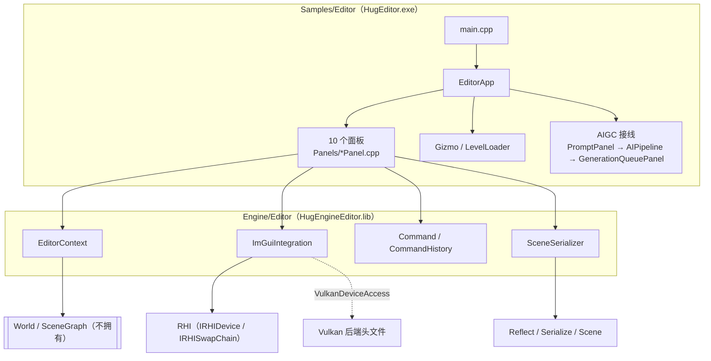

# HugEngine 编辑器实现分析

> 分析日期：2026-09-22 | 范围：Engine/Editor + Samples/Editor | 依据：源码逐文件阅读
>
> **本文怎么读**：
> 本文是**现状说明**（"现在是什么样"），不是计划、不是验收记录。所有结论必须能追到 `文件:行号`；
> 凡是只凭计划文档或推理、无法在源码里定位的，一律不写进结论，而是汇总在第 11 节「未复核清单」。
> 类型名 / 文件名 / 成员名一律照抄代码，不改写成"更规范"的写法。
> 公式用 KaTeX；`$$...$$` 只用于确有算法含义的式子（Gizmo 拖拽、拾取射线），不给代码做装饰。
> 阅读顺序建议：第 1 节看结论，第 2 节看职责边界，第 3 节看 ImGui 与后端的关系，
> 第 4~8 节是逐模块实现，第 9 节查参数与快捷键，第 10/11 节看边界与缺口。
>
> **口径备注**：`Samples/Editor/Panels/` 下共 **12 组文件**（`ConsolePanel`、`ContentBrowserPanel`、
> `DetailsPanel`、`GenerationQueuePanel`、`Gizmo`、`LevelLoader`、`MaterialEditor`、`OutlinerPanel`、
> `ProjectSettingsPanel`、`PromptPanel`、`StatsPanel`、`ViewportPanel`，见 `Samples/Editor/CMakeLists.txt:2-30`），
> 其中**真正作为面板被创建并渲染的是 10 个**（`Gizmo` 是变换操控器、`LevelLoader` 是 Level 加载工具类，
> 二者没有自己的 ImGui 窗口）。本文第 4 节按这 10 个面板逐个说明，`Gizmo` / `LevelLoader` 分别在第 5 / 6 节。

---

## 目录

1. 结论速览（编辑器现状与成色）
2. 总体结构（Engine/Editor × Samples/Editor）
3. ImGui 集成（初始化 / 每帧流程 / 叠加方式 / 后端泄漏点）
4. 面板清单（10 个面板逐个）
5. Gizmo（变换操作）
6. 场景序列化与关卡加载
7. 可撤销命令体系
8. 材质编辑器
9. 关键参数 / 快捷键 / 配置表
10. 已知边界与未实现
11. 未复核清单

---

## 1. 结论速览（编辑器现状与成色）

| 维度 | 现状 | 依据 |
|---|---|---|
| 形态 | 独立可执行 `HugEditor`，进程内链接引擎静态库；`main` 只有 4 行 | `Samples/Editor/main.cpp:9-12`、`Samples/Editor/CMakeLists.txt:32-54` |
| 构建 | CMake 选项 `HUGENGINE_BUILD_EDITOR`（默认 ON），`Samples/Editor` 由 `Samples/CMakeLists.txt` 加入 | `CMakeLists.txt:34`、`Samples/CMakeLists.txt:10` |
| 引擎侧基础设施 | 只有 4 个编译单元：`EditorContext`、`ImGuiIntegration`、`Command`、`SceneSerializer` | `Engine/Editor/CMakeLists.txt:4-13` |
| 面板 | 10 个面板类全部住在 **Sample** 侧，不在 `Engine/Editor` 里 | `Samples/Editor/Panels/`、`Engine/Editor/CMakeLists.txt:4-13` |
| 渲染管线 | 固定 `ForwardPipeline`，且**只调用 `RenderScene`**（无阴影 / 天空盒 / ToneMap / AA / GI / GPU 剔除） | `Samples/Editor/EditorApp.cpp:155-161`、`Samples/Editor/Panels/ViewportPanel.cpp:51-55` |
| UI 布局 | 无 Docking：菜单栏 + 一个铺满的 `EditorMain` 窗口（Viewport 75% / Details 右 300px / Outliner 25%）+ 若干浮动窗口 | `Samples/Editor/EditorApp.cpp:468-512` |
| 选中与拾取 | 单选（`SelectEntity` 会清空列表）；视口射线-AABB 拾取已实现 | `Engine/Editor/Editor/EditorContext.cpp:15-21`、`Samples/Editor/Panels/ViewportPanel.cpp:181-260` |
| 属性面板 | **不是反射驱动**：按组件类型硬编码分支 + 手写控件 | `Samples/Editor/Panels/DetailsPanel.cpp:49-94` |
| Undo/Redo | 命令框架完整（256 深度），但**只有属性编辑与 AI 生成接入了命令**；增删实体 / Gizmo / 导入 / 场景加载均不可撤销 | `Engine/Editor/Editor/Command.h:36`、`Samples/Editor/Panels/DetailsPanel.cpp`（21 处）、`Engine/AI/AIGC/AICommand.cpp:13-27` |
| 场景持久化 | `.hescene` 二进制（`HESC`+version），但**只有 Transform 与四类光源真正被持久化**；网格/材质/Level 属性未注册反射，读回即默认值 | `Engine/Editor/Editor/SceneSerializer.cpp:25-39,130-138`、`Engine/Scene/Scene/SceneReflect.cpp:57-70,191-192` |
| 系统级功能 | 无 Sequencer / 时间线、无插件系统、无资源数据库、无 Prefab、无多视口 | 全仓 grep 无对应实现（见第 10 节） |
| 配置持久化 | CVar **无任何序列化**；ImGui 也**没有设定 `IniFilename`**，用默认相对路径 `imgui.ini` | `Engine/Core/Core/CVar.h:26-79`、`Engine/External/imgui/imgui.cpp:1354`、`Engine/Editor/Editor/ImGuiIntegration.cpp:24-63` |
| 后端耦合 | `ImGuiIntegration` 直接 include Vulkan 头并经 `VulkanDeviceAccess` 取 `VkInstance/VkDevice/VkQueue`，`IRHIDevice` 上还有 ImGui 专用后门 | `Engine/Editor/Editor/ImGuiIntegration.cpp:14,68-72`、`Engine/RHI/RHI/RHI.h:163-169` |
| 构建产物 | `Build/bin/Debug/HugEditor.exe` 已产出（2026-09-07） | 构建目录清单（非源码，仅作现状参考） |

一句话口径：**编辑器已经"能开、能看、能改、能存"，但它是一个把引擎能力直接摊开用的工具壳**——
面板是硬编码的、渲染路径是裁剪过的、持久化只覆盖一部分属性，系统级编辑器功能（序列、插件、资产库）都还没有。

---

## 2. 总体结构（Engine/Editor 提供什么 vs Samples/Editor 提供什么）

### 2.1 两个库的边界

| 层 | 内容 | 依据 |
|---|---|---|
| `Engine/Editor`（静态库 `HugEngineEditor`） | `EditorContext`（选中/状态/引擎引用）、`ImGuiIntegration`（ImGui 生命周期 + 后端）、`Command`/`CommandHistory`/`PropertyChangeCommand`、`SceneSerializer`（`.hescene` 读写） | `Engine/Editor/CMakeLists.txt:2-15` |
| `Engine/Editor` 的依赖 | `PUBLIC HugEngineRender HugEngineSerialize imgui`；并 `PRIVATE` 附加 `Engine/RHI/Vulkan` include 目录（`VulkanInternal.h`） | `Engine/Editor/CMakeLists.txt:20-26` |
| `Samples/Editor`（可执行 `HugEditor`） | `EditorApp`（生命周期 + 主循环 + 菜单栏 + 布局）、12 组 `Panels/` 文件、AIGC 接线、Shader 热重载接线 | `Samples/Editor/CMakeLists.txt:2-32` |
| `Samples/Editor` 的依赖 | Core / RHI / Shader / Render / Scene / **Editor** / Asset / AI / stb；并 `add_dependencies(HugEditor CompileShaders)` | `Samples/Editor/CMakeLists.txt:40-56` |

依赖方向是单向的：Sample 依赖引擎库，引擎库不反向依赖面板。`Engine/Editor` 里不存在任何
`ViewportPanel` / `OutlinerPanel` 之类的类型（`Engine/Editor/CMakeLists.txt:4-13` 的源文件清单即为全部）。

### 2.2 `EditorApp` 的生命周期

`Run()` 的顺序是固定的七步（`Samples/Editor/EditorApp.cpp:58-67`）：

1. `InitEngine()` — `Engine`（GLFW 窗口 + 日志等）→ RHI 设备（`Backend::Vulkan` + 校验层）→ SwapChain；注册窗口 resize 与 GLFW 拖放回调（`EditorApp.cpp:69-108`）。
2. `InitScene()` — 建 `World` + `SceneGraph`（World 反向持有 SceneGraph 指针，`EditorApp.cpp:113-114`），放置默认场景：一个 `Ground`（`CubeComponent`，scale 5×0.2×5）+ 一个 `DirectionalLight`（`EditorApp.cpp:117-135`）。**默认场景没有相机实体**。
3. `InitPipeline()` — `ForwardPipeline::Initialize` → `SetUseRenderGraph(false)` → `SetSwapChain` → `OnResize` → `SetPipeline(GetPipelineState())`；随后启动 `ShaderHotReload`（`EditorApp.cpp:151-178`）。
4. `InitEditor()` — `CommandHistory` → `EditorContext::Initialize` → `ImGuiIntegration::Initialize` → 创建 8 个面板并 `Initialize` 其中 5 个（`EditorApp.cpp:180-206`）。
5. `InitAIGC()` — `AIModule::Initialize`，拿不到 `IAIDevice` 就**直接 return**（AIGC 面板随后不会被创建）；否则建 `CloudAIGCProvider` + `AIPipeline`，创建 `PromptPanel` / `GenerationQueuePanel` 并互相接线（`EditorApp.cpp:208-230`）。
6. `MainLoop()`（`EditorApp.cpp:232-544`）。
7. `Shutdown()`（`EditorApp.cpp:546-571`）：先停热重载 → `WaitIdle` → ImGui 关停 → AIGC 管线/AI 运行时 → 管线 → SceneGraph → World → 纹理缓存 → 命令列表 → SwapChain → 设备；`Engine` 留给成员析构。

### 2.3 `EditorContext` 的职责

`EditorContext`（`Engine/Editor/Editor/EditorContext.h:23-69`）是一个**纯状态 + 引用聚合器**：

| 组成 | 内容 | 依据 |
|---|---|---|
| 引擎引用 | `Initialize(World*, SceneGraph*, CommandHistory*)` 只存裸指针，**不拥有任何对象** | `EditorContext.h:28`、`EditorContext.cpp:9-13` |
| 选中 | `SelectEntity` / `DeselectAll` / `GetSelection` / `IsSelected` | `EditorContext.h:31-34` |
| 状态机 | `EditorState{Edit, Play, Paused}` + `Play/Pause/Stop` + `IsPlaying/IsPaused` | `EditorContext.h:41-48` |
| 回调 | `OnSelectionChanged(std::function<void()>)`，选中变化时同步遍历回调（无优先级、无取消注册） | `EditorContext.h:56-58`、`EditorContext.cpp:35-39` |
| 属性编辑 | `template<typename T> void SetProperty(Entity, const char*, const T&)` —— **只有声明，工程里没有任何定义，也没有任何调用点** | `EditorContext.h:37-38`、`EditorContext.cpp:41-44`（注释自述"为 3-2 扩展预留"） |

两点值得强调（都能在源码里直接看到）：

- `SelectEntity` **先 `clear()` 再 `push_back`**，因此当前是严格单选；`IsSelected` 也只是线性查找（`EditorContext.cpp:15-21,28-33`）。设计文档里提到的 `AddToSelection` / `ToggleSelection` 在代码中不存在。
- `SetProperty` 模板是"声明了但没实现"的空接口：一旦有人调用会链接失败。`DetailsPanel` 走的不是这条路，而是自己构造 `PropertyChangeCommand`（`DetailsPanel.cpp:113-122` 等）。

### 2.4 为什么编辑器是 Sample 而不是引擎模块

从代码层面能看到的直接原因是**分工与依赖方向**，不是"顺手放在 samples 里"：

1. `Engine/Editor` 的定位是"可复用的编辑器**基础设施**"：ImGui 后端、命令栈、场景序列化、选中上下文——这些与具体面板无关，`06.GILab` / `07.Nanite` 这类自带 UI 的 Sample 也能复用其中的 `Command`（`Engine/AI/AIGC/AICommand.h:6,28` 即直接复用 `he::Command`）。
2. 具体面板依赖的东西太多、太杂：GLFW 输入、`stb_image`、`asset::LoadGLTF`、`AIModule`、`ShaderHotReload`、`ForwardPipeline::GetPipelineState()`。把这些塞进 `Engine/Editor` 会把 AI / Asset / Render 的依赖强行上提到编辑器库（对照 `Samples/Editor/CMakeLists.txt:44-54` 的链接清单）。
3. Sample 侧需要**编译期注入的路径常量**：`HUGE_CONTENT_DIR` 由 CMake 定义（`Samples/Editor/CMakeLists.txt:40-42`），面板用它作为 Content Browser 的默认目录（`Samples/Editor/Panels/ContentBrowserPanel.h:23-27`）。
4. 因此"编辑器"在这里的含义是：**引擎提供的编辑器能力集合 + 一个把能力拼起来的具体编辑器应用**。引擎模块本身对"编辑器"没有任何反向依赖。

需要提醒的是：`Engine/Editor/README.md:5-9` 里写的三行（"Editor/Engine 进程分离"、"Transaction 系统"、"自研 Docking 框架"、"多视口管理"）在源码中**都找不到对应实现**——本文只按源码口径描述（见第 10 节）。

---

## 3. ImGui 集成（初始化 / 每帧流程 / 叠加方式 / 后端泄漏点）

ImGui 版本：文件头注释写 "ImGui v1.91 + GLFW + Vulkan"（`Engine/Editor/Editor/ImGuiIntegration.cpp:2`），实际 vendored 版本 `1.91.0`（`Engine/External/imgui/imgui.h:30-31`）；且它是**非 docking 分支**（`DockSpace` / `DockBuilder` 在 `imgui.h` 中只出现在被注释掉的行里，`IMGUI_HAS_DOCK` 未定义）。后端实现在 `Engine/External/imgui/backends/`（`imgui_impl_glfw.{h,cpp}`、`imgui_impl_vulkan.{h,cpp}`）。

### 3.1 初始化（`Initialize`）

`ImGuiIntegration::Initialize(GLFWwindow*, IRHIDevice*, IRHISwapChain*)` 的顺序（`ImGuiIntegration.cpp:24-63`）：

1. `IMGUI_CHECKVERSION()` → `ImGui::CreateContext()` → `ImGui::StyleColorsDark()`（`:28-30`）。
2. **中文字体**：从硬编码绝对路径 `"C:\\Windows\\Fonts\\simhei.ttf"` 以 16px 加载，并显式给出 5 段 `ImWchar` 区段（Basic Latin、General Punctuation、CJK 符号与标点、CJK 统一表意文字、全角形式）；加载成功则设为 `io.FontDefault`，失败只打一条 warn（`:32-56`）。
3. `ImGui_ImplGlfw_InitForVulkan(window, true)` —— 第二个参数 `install_callbacks=true`，即由 ImGui 接管 GLFW 回调（`:58`）。
4. `CreateImGuiResources(device, swapchain)`（`:59`，实现见 `:65-101`）。
5. `m_Initialized = true` + 一条 `HE_CORE_INFO`（`:61-62`）。

`CreateImGuiResources` 内部（`:65-101`）：先经 `VulkanDeviceAccess` 取 5 个 Vulkan 句柄（`:68-72`）；再经 **RHI 接口**创建两个资源——`device->CreateImGuiDescriptorPool()`（`:75`）与 `device->CreateImGuiRenderPass(swapchain->GetBackendFormat())`（`:78-79`）；然后填 `ImGui_ImplVulkan_InitInfo`（`:82-95`）：`MinImageCount = ImageCount = rhi::kSwapchainImageCount`（= 3，`Engine/RHI/RHI/SwapChain.h:8`）、`Subpass = 0`、`MSAASamples = VK_SAMPLE_COUNT_1_BIT`（ImGui 永远走单采样，不随管线 AA 变化）；最后 `ImGui_ImplVulkan_Init(&initInfo)` + `ImGui_ImplVulkan_CreateFontsTexture()`（`:95-98`）。

销毁路径对称：`DestroyImGuiResources` 经 RHI 销毁 RenderPass / DescriptorPool（`:103-110`），`Shutdown()` 依次 `ImGui_ImplVulkan_Shutdown` → `ImGui_ImplGlfw_Shutdown` → `ImGui::DestroyContext` → `DestroyImGuiResources`（`:112-123`）。析构函数直接调 `Shutdown()`，且 `Shutdown` 用 `m_Initialized` 做幂等（`:22,113-114`）。

### 3.2 每帧流程（`EditorApp::MainLoop` 内与 UI 有关的顺序）

| 顺序 | 动作 | 依据 |
|---|---|---|
| 1 | `glfwGetTime()` 取 dt → `PollEvents()` | `EditorApp.cpp:234-238` |
| 2 | 每帧杂务：`ShaderHotReload::Poll()` → AA 模式切换 → `SetUseExecuteIndirect(CVar)` → `LevelLoader::SyncAll` → 消费拖放文件队列 | `EditorApp.cpp:241-358` |
| 3 | Ctrl+Z / Ctrl+Y（**被 `!ImGui::IsAnyItemActive()` 保护**，避免与文本编辑冲突） | `EditorApp.cpp:362-369` |
| 4 | `AcquireNextImage()` 失败则 `continue`（跳过整帧） | `EditorApp.cpp:371-372` |
| 5 | `Begin()` → `BeginRenderPass(1, rhi::Format::RGBA8_UNORM)`（打开**交换链**渲染通道，`colorCount=1`，loadOp 取默认 `Clear`） | `EditorApp.cpp:375-376` |
| 6 | `NextFrame()`（推进三缓冲槽）→ `BeginFrame(cmd,w,h)`（设 viewport/scissor）→ `SetViewportSize(w,h)` | `EditorApp.cpp:378-381` |
| 7 | Edit 模式：`ViewportPanel::Render(cmdList)`；Play/Paused：`World::Update(dt)`（+ Step 单帧）+ `RenderGameView` | `EditorApp.cpp:383-397` |
| 8 | `ImGuiIntegration::BeginFrame()`（Vulkan/GLFW NewFrame + `ImGui::NewFrame`） | `EditorApp.cpp:400`、`ImGuiIntegration.cpp:125-129` |
| 9 | 菜单栏 → （Play 时）覆盖层 / （Edit 时）`EditorMain` 布局 + 浮动面板 | `EditorApp.cpp:403-534` |
| 10 | `EndFrame(cmd)`：`ImGui::Render()` + `ImGui_ImplVulkan_RenderDrawData(GetDrawData(), vkCmdBuf)` | `EditorApp.cpp:536`、`ImGuiIntegration.cpp:131-136` |
| 11 | `EndRenderPass()` → `End()` → `Device::Submit` → `SwapChain::Present(true)` | `EditorApp.cpp:538-542` |

关键点：**场景渲染与 ImGui 录制在同一个渲染通道、同一个命令缓冲里**（第 5 步开 pass，第 7 步画场景，第 10 步录 UI 绘制数据），UI 是叠加在 3D 画面之上的覆盖层；这也是"Viewport 区域其实不是独立纹理，只是用 ImGui 子窗口画出边框"的原因（见 4.1）。

### 3.3 场景渲染路径（编辑器实际用到管线的哪一部分）

编辑器**从不调用** `ForwardPipeline::Render(...)`（`Engine/Render/Pipeline/ForwardPipeline.cpp:950`），只调用：

- `NextFrame()` → 推进三缓冲槽并同步阴影子系统帧槽（`ForwardPipeline.cpp:519-534`）；
- `BeginFrame(cmd, w, h)` → 仅设置 viewport/scissor（`ForwardPipeline.cpp:536-543`）；
- `RenderScene(cmd, world, sg, camera)`（`ForwardPipeline.cpp:1042`），由 `ViewportPanel` 直接调用（`ViewportPanel.cpp:51-55`）。

而 `Render()` 里才有：RSM 视锥刷新 / GI 合成 UBO（`:954-958`）、RG 或非 RG 分支、`SyncPhysicalSkyToSun`、**`m_ShadowSystem->Render`（`:979`）**、`PrepareGI`（`:985`）、`RunGPUCulling`（`:987`）、`BeginHDRPass`/`EndHDRPass`（`:988,992`）、`RenderSkybox`（`:991`）、`m_AntiAliasing->Render`（`:995-998`）。

因此可以确认三件事（均为代码路径事实）：

1. 编辑器视口的 3D 画面是 **PBR PSO 直接写交换链颜色附件**，没有 HDR 离屏 RT、没有 ToneMap、没有阴影渲染、没有天空盒、没有 GI 预处理、没有 GPU 剔除（对照上段行号）。
2. `EditorApp` 里那段 AA 模式切换代码（`EditorApp.cpp:245-267`）会真实地创建并 `SetAntiAliasing`（`AA_FXAA` / `AA_None`，`taa` 会回退为 `none` 并写回 CVar，`:255-260`），但编辑器路径不调 `Render()`，而 AA 的 `Render()` 只在 `ForwardPipeline.cpp:995-998` 被调用——**该 CVar 在当前编辑器渲染路径上不产生画面效果**（结论基于上述调用点，见第 11 节备注）。
3. `SetUseRenderGraph(false)`（`EditorApp.cpp:157`）说明编辑器走的是非 RenderGraph 的旧路径；但 `RenderScene` 本身不区分两条路径，GPU 剔除（`RunGPUCulling`）由 `Render()` 负责，所以编辑器路径下也不会发生 GPU 剔除 Dispatch（`ForwardPipeline.cpp:1014`）。

`RenderScene` 内部会做 `sceneGraph.UpdateTransforms()`（`ForwardPipeline.cpp:1048`），因此"每帧至少有一次世界矩阵更新入口"。

### 3.4 后端访问路径与**后端泄漏点**（如实记录）

`ImGuiIntegration.h` 的注释宣称"Vulkan 特定资源（RenderPass / DescriptorPool）通过 RHI 接口创建，不直接调用 Vulkan API"（`ImGuiIntegration.h:20-21`），实现文件也重复了这句（`ImGuiIntegration.cpp:4-5`）。**这个说法只有一半成立**，实际泄漏点如下（全部可定位）：

| # | 泄漏点 | 位置 | 说明 |
|---|---|---|---|
| L1 | 直接 include 后端头 `"Vulkan/VulkanDevice.h"` | `ImGuiIntegration.cpp:14` | 注释自述用途"VulkanDeviceAccess（获取 Vk 句柄）"。这也解释了 `Engine/Editor/CMakeLists.txt:23` 为什么必须把 `Engine/RHI/Vulkan` 加进 include 目录 |
| L2 | 经 `rhi::VulkanDeviceAccess` 取原生句柄 | `ImGuiIntegration.cpp:68-72` | 取 `VkInstance` / `VkPhysicalDevice` / `VkDevice` / graphics family / `VkQueue`；`VulkanDeviceAccess` 定义在 `Engine/RHI/Vulkan/VulkanDevice.h:426-437` |
| L3 | 函数体内出现原生 Vulkan 类型与常量 | `ImGuiIntegration.cpp:68-93` | `VkInstance`、`VkPhysicalDevice`、`VkDevice`、`VkQueue`、`VkDescriptorPool`、`VkRenderPass`、`VK_SAMPLE_COUNT_1_BIT` |
| L4 | `void*` 与 Vulkan 类型之间的强转 | `ImGuiIntegration.cpp:88,91` | `reinterpret_cast<VkDescriptorPool>(m_DescPool)`、`static_cast<VkRenderPass>(m_RenderPass)`；反向 `static_cast<VkCommandBuffer>(m_Device->GetImGuiCommandBuffer(cmd))` 在 `:134` |
| L5 | 头文件用 `void*` 藏后端句柄 | `ImGuiIntegration.h:46-48` | 注释写明"`VkDescriptorPool` / `ID3D12DescriptorHeap`"与"`VkRenderPass`"——头文件保持了物理隔离，但语义上仍是后端专属资源 |
| L6 | RHI 接口上的 ImGui 专用后门 | `Engine/RHI/RHI/RHI.h:163-169` | `CreateImGuiDescriptorPool()` / `DestroyImGuiDescriptorPool()` / `CreateImGuiRenderPass(u32 swapchainFormat)` / `DestroyImGuiRenderPass()` / `GetImGuiCommandBuffer()` 全部返回/接收 `void*`，默认实现返回 `nullptr`；Vulkan 实现在 `Engine/RHI/Vulkan/VulkanDevice.h:128-132`。**RHI 里出现了只为某个 UI 库存在的接口，且交换链格式要靠 `GetBackendFormat()` 以 `u32` 裸传**（`Engine/RHI/RHI/SwapChain.h:37`） |
| L7 | 平台/后端组合在编译期写死 | `ImGuiIntegration.cpp:58` | `ImGui_ImplGlfw_InitForVulkan(window, true)`；全仓没有 `ImGui_ImplGlfw_InitForOther` / DX12 初始化路径，也没有 `ImGui_ImplVulkan_SetMinImageCount` 调用 |

结论（由 L1~L7 直接支撑）：**当前 `ImGuiIntegration` 事实上是"Vulkan 专属"实现**——RHI 侧的 `Backend` 枚举已预留 `D3D12` / `Metal` / `WebGPU`（`Engine/RHI/RHI/Types.h:80-86`），但仓库里只有 Vulkan 设备实现（`Engine/RHI/Vulkan/`），这是"规划多后端"与"编辑器写死 Vulkan"之间的落差。
它的头文件和 RHI 接口都摆出了后端无关的姿态，实现却在 4 个位置把 Vulkan 写死。要在 DX12 后端上跑，需要改的是
`ImGuiIntegration.cpp`（L2/L3/L4/L7 四处）+ 实现 RHI 的 ImGui 后门（L6）。

另外两个与配置相关的实情：

- **没有设置 `io.IniFilename`**：`Initialize` 里只动了 `io.FontDefault`（`ImGuiIntegration.cpp:48-52`），因此 ImGui 用默认值 `"imgui.ini"`（相对当前工作目录，`Engine/External/imgui/imgui.cpp:1354`），且编辑器**没有**主动 `SaveIniSettingsToDisk`。对比 `07.Nanite`（`Samples/07.Nanite/07.Nanite.cpp:890-891` 设置到 `Content/Config/07_Nanite_imgui.ini`，`:2154-2156` 主动保存）与 `06.GILab`（`Samples/06.GILab/06.GILab.cpp:767-768,1792-1794`），可见"面板布局落盘"这件事在编辑器里没做。
- **没有设置任何 `ImGuiConfigFlags`**（`Samples/Editor` 全目录 grep 无 `ImGuiConfigFlags` 命中）：导航键、多视口、Docking 一概未启用。`EditorMain` 窗口还显式带了 `ImGuiWindowFlags_NoSavedSettings`（`EditorApp.cpp:474`），即主布局本身也不参与 ini 记忆。

---

## 4. 面板清单（10 个面板逐个）

### 4.1 总表

| 面板 | 类 | 窗口形态 | 默认可见 | 数据来源 | 是否改场景 | 依据 |
|---|---|---|---|---|---|---|
| Viewport | `ViewportPanel` | 嵌入 `EditorMain` 的 `ViewportRegion` 子窗口 | 恒显示 | `EditorContext`（World/SceneGraph/选中）+ `ForwardPipeline` + GLFW | 改（Gizmo 写 Transform） | `EditorApp.cpp:483-496`、`ViewportPanel.cpp:40-56` |
| Outliner | `OutlinerPanel` | 嵌入 `OutlinerRegion`（底部 25%） | 恒显示 | `World::ForEachEntity` + `SceneGraph` 父子关系 | 改（增/删实体） | `EditorApp.cpp:509-511`、`OutlinerPanel.cpp:16-86` |
| Details | `DetailsPanel` | 嵌入 `DetailsRegion`（右侧 300px） | 恒显示 | 选中实体的组件（硬编码 `HasComponent`/`GetComponent`） | 改（属性 + 加组件） | `EditorApp.cpp:502-504`、`DetailsPanel.cpp:25-95` |
| Content Browser | `ContentBrowserPanel` | 浮动窗口 | 否（`m_Visible=false`） | `std::filesystem` 遍历 `HUGE_CONTENT_DIR` | 改（导入 glTF / 载入 `.hescene`） | `ContentBrowserPanel.h:39`、`ContentBrowserPanel.cpp:15-124` |
| Project Settings | `ProjectSettingsPanel` | 浮动窗口 | 否 | `CVarBase::GetAll()` | 改（写 CVar） | `ProjectSettingsPanel.h:26`、`ProjectSettingsPanel.cpp:28-91` |
| Stats | `StatsPanel` | 浮动窗口 | 是（`m_Visible=true`） | `dt` + 管线 draw/tri 计数 | 否 | `StatsPanel.h:11`、`StatsPanel.cpp:8-45` |
| Console | `ConsolePanel` | 浮动窗口 | 否（`~` 切换） | 自身日志/历史 + `CVarBase::GetAll()` / `FindCVar` | 改（`set` 改 CVar） | `ConsolePanel.h:12`、`ConsolePanel.cpp:14-55` |
| Material Editor | `MaterialEditor` | 浮动窗口 | 否 | 自身节点图数据（**不接引擎**） | 否 | `MaterialEditor.h:39`、`MaterialEditor.cpp:111-234` |
| Prompt（AI 生成场景） | `PromptPanel` | 浮动窗口 | 是 | `AIPipeline` + `GenerationQueuePanel` | 否（只入队） | `PromptPanel.h:16,19-22`、`PromptPanel.cpp:15-56` |
| Generation Queue（生成队列） | `GenerationQueuePanel` | 浮动窗口 | 是 | 自身待接受队列 | 改（接受时经命令装配，可撤销） | `GenerationQueuePanel.h:21`、`GenerationQueuePanel.cpp:21-71` |

菜单可达性：`View` 菜单只暴露 3 个开关（Content Browser / Project Settings / Material Editor，`EditorApp.cpp:429-434`）；
Console 靠 `~`、Stats/Prompt/GenQueue 靠默认可见、Outliner/Details/Viewport 恒显示。
**没有"Panels/Window 布局"菜单，也没有 Docking 拖拽**。Play/Paused 状态下，除菜单栏与覆盖层外，
所有面板都不渲染（浮动面板在 `else` 分支里，`EditorApp.cpp:521-533`）。

### 4.2 ViewportPanel — 3D 视口 / 拾取 / 调试绘制

- 文件：`Samples/Editor/Panels/ViewportPanel.h`、`ViewportPanel.cpp`。
- 职责：在 ImGui 子窗口区域内呈现 3D 场景；管理编辑器相机；驱动 Gizmo 叠加层；实现点击拾取；提供 Debug 视锥绘制；提供 `FocusOn`。
- 数据来源：`EditorContext*`（World/SceneGraph/选中/命令历史）与 `render::ForwardPipeline*`、`GLFWwindow*`，三者都在 `Initialize` 注入（`ViewportPanel.cpp:28-38`）；初始化时把 `CameraController` 设为 `MoveMode::Ground`（`:36`）。相机速度取自全局 CVar `editor.camera.speed`（`:18,156`）。
- 渲染：`Render(cmdList)` 里 `SetPipeline(m_Pipeline->GetPipelineState())` 后调 `ForwardPipeline::RenderScene`（`:51-55`）——**不调 `Render()`**，故无阴影/天空盒/ToneMap/AA（见 3.3）。
- 相机交互：右键按下时禁用光标并开始累积 yaw/pitch（`:125-143`，灵敏度 0.003）；WASD 前后左右、E/Q 升降、Shift 冲刺（`:146-157`）；**当 Gizmo 处于拖拽或 hover 时，W 与 E/Q 会被屏蔽**（`:147-153`），原因见 5 节（W/E/Q/S 与 Gizmo 模式键冲突）。
- 视口几何：面板自己不创建纹理或视图，只接收 `EditorApp` 每帧写入的两套坐标——`m_VP_Pos/m_VP_Size` 用全窗口（Gizmo 投影用），`m_VP_ChildMin/m_VP_ChildMax` 用 ImGui 子窗口区域（点击命中判定用）（`EditorApp.cpp:486-492`、`ViewportPanel.h:65-69`）。
- 拾取（`HandleClickSelect`，`:181-260`）：用 GLFW 左键做边沿检测（规避 ImGui 子窗口吞事件，`:184-189`）；右键按下时不处理（`:192`）；Gizmo 交互中不处理（`:194`）；鼠标必须落在 child 矩形内（`:202-203`）；屏幕坐标 → NDC → 世界射线（`:211-220`）：

  $$ n_x = \frac{2(m_x - p_x)}{W} - 1,\qquad n_y = 1 - \frac{2(m_y - p_y)}{H} $$
  $$ o = \frac{(M_{vp}^{-1}\,(n_x,n_y,0,1))_{xyz}}{w},\qquad d = \operatorname{normalize}\!\left(f - o\right) $$

  然后对**所有** `MeshComponent` / `CubeComponent` / `SphereComponent` 取世界 AABB（`sg->GetWorldMatrix` 变换，`:230-244`），逐个做 slab 法射线-AABB 求交（`:160-179`），取最小 $t$ 者（`:246-253`），命中才 `SelectEntity`（`:256-259`）。整个过程有 4 条 `HE_CORE_INFO` 调试输出（`:204-205,219-220,255,258`）。
- Debug 叠加层（`RenderDebugOverlay`，`:262-399`）：`F` 键切换一个**函数内 `static bool`**（`:264-266`，注意它并不读 CVar `editor.debug.frustum`）；只对**选中实体**画：`CameraComponent` 的四棱锥视锥（`:296-314`）、`PointLight` 的 6 面视锥（`:317-341`）、`SpotLight` 的内外双锥（20 段，`:344-369`）、`DirectionalLight` 的正交视锥盒（near 0.1 / far 10 / half 3，`:380-398`）。绘制全部经 `ImGui::GetWindowDrawList()` 手工线。
- 游戏视角：`RenderGameView` 复用**同一个** `m_CamCtrl`（`:66-72`）——Play 模式并不会切到场景里的 `CameraComponent`（`World::GetPrimaryCamera()` 存在，`Engine/Scene/Scene/World.h:59-62`，但编辑器路径没调用）。
- `FocusOn(worldPos)`：相机放到 `worldPos + (0,2,5)` 并朝向目标（`:58-64`）；被拖放导入路径调用（`EditorApp.cpp:344-349`）。

### 4.3 OutlinerPanel — 场景层级树

- 文件：`Samples/Editor/Panels/OutlinerPanel.{h,cpp}`。
- 职责：展示 World 中所有实体的层级树，支持搜索过滤、点击选中、右键删除、`+` 菜单新建实体。
- 数据来源：`world->ForEachEntity` 与 `sg->GetParent`；先一次性建 `childrenMap`（O(N)）再做 O(1) 子树遍历（`OutlinerPanel.cpp:71-85`），这个优化有明确注释（`:70`）。
- 交互细节：
  - `TreeNodeEx` 用 `entity.id` 作为节点 ID（`:132`），`IsItemClicked() && !IsItemToggledOpen()` 才选中（`:135-137`）。
  - 过滤只对**合成出来的名字**做 `find`（`:94-101`）——而名字本身是 `"Entity #" + id`（`:94`），因此过滤框实际上无法匹配到用户在 `CreateEntity(name)` 传入的名字（`World::CreateEntity` 只用 name 打日志、不存储，`Engine/Scene/Scene/World.cpp:23-29`）。
  - 图标是文本：`(L)` 表示有 3 种 Light 组件之一，`(M)` 表示有 `MeshComponent` 或 `CubeComponent`，其余为两个空格（`:104-112`）；缩进用 `depth * 2` 个空格手工拼接（`:115`）。
  - 右键 `Delete` → `world->DestroyEntity(entity)` + `DeselectAll()`（`:141-144`）；`Rename` 是 TODO 空项（`:145-147`）。
  - `+` 弹出菜单可建 6 种：Empty Entity / Cube / Sphere / Point Light / Spot Light / Directional Light，每种都会先加 `TransformComponent`、`SetParent` 到根、并立即选中（`:37-68`）。
- 依赖的引擎能力：`World`（增删实体/加组件）、`SceneGraph`（父子关系）、`EditorContext`（选中）。
- 注意：**删除与新建都不经过 `CommandHistory`**（代码中无 `Execute` 调用），即不可撤销；删除还会把选中清空，而撤销栈里可能仍握有指向已销毁组件的 lambda（见 7.4）。

### 4.4 DetailsPanel — 属性检查器（硬编码，非反射驱动）

- 文件：`Samples/Editor/Panels/DetailsPanel.{h,cpp}`（`.cpp` 513 行，是最大的面板）。
- 职责：显示**单选中的第一个实体**的组件属性并提供编辑（`:31-42`，`selection[0]`）。
- 数据来源与分支：按组件类型硬编码判定（`:49-65`）——`TransformComponent` → `RenderTransform`；`Mesh/Cube/Sphere` 任一 → `RenderMesh`；光源按 `DirectionalLight` → `PointLight` → `SpotLight` → `LightComponent` 的优先级（`else if` 链，只渲染一个）。头文件注释说"通过 ReflectionAPI 枚举属性，按类型渲染编辑器控件"（`DetailsPanel.h:7-8`），**与实现对不上**（这里没有 `ForEachProperty`，反射只被 `SceneSerializer` 用）。
- Transform 段（`:97-174`）：
  - Position：`DragFloat3` 步长 0.1，拖动中即时写回并 `MarkDirty`（`:109-112`），`IsItemDeactivatedAfterEdit()` 后与旧值比较，不同才压入 `PropertyChangeCommand("Change Position")`（`:113-122`）。
  - Rotation：以欧拉角显示（`glm::degrees(glm::eulerAngles(q))`）拖动，范围 ±360，回写时 `glm::quat(glm::radians(...))` 重建（`:124-142`）。
  - Scale：`DragFloat3` + 一个 `static bool uniformScale` 的"等比缩放"勾选框；勾选后按"哪一轴变了"把三轴同步（`:144-168`）。**注意 Scale 分支不调用 `sg->MarkDirty`（`:157-158`），其撤销/重做 lambda 也不调用（`:164-165`）**——与 Position/Rotation 不一致。
  - 末尾又打印一遍四元数分量（`:171-172`），后跟一条已过期的注释"Phase 3-2: 改为欧拉角 DragFloat3 + Undo"（`:173-174`，该功能其实在上面已经实现）。
- Mesh 段（`:176-325`，共用 `MeshComponent*` 指针，`CubeComponent`/`SphereComponent` 因继承而兼容，`:180-183`）：Base Color（`ColorEdit4`）、Metallic、Roughness、Emissive、5 条纹理路径只读文本、`Alpha Mode` 下拉（Opaque/Mask/Blend）、`Alpha Cutoff`（仅 `alphaMode == 1` 时出现）、`Double Sided`、`Unlit`、`AO Strength`。以上 9 项都按"先改后记命令"的模式接入 Undo（行号见 4.4 末尾统计）。
- 光源段：`RenderLightBase`（`:327-375`，Color / Intensity / Cast Shadow）被三个子类各自调用（`:386,415,442`）；`RenderDirectionalLight` 额外 Direction（归一化后写回，`:389-403`）；`RenderPointLight` 额外 Range（`:418-430`）；`RenderSpotLight` 额外 Direction / Range / Inner+Outer Cone Angle（UI 用角度、内部弧度，`:476-510`）。
- `Add Component`（`:67-94`）：9 个候选项 Mesh / Cube (Debug) / Sphere (Debug) / Level / Point Light / Spot Light / Directional Light / Camera / Skybox，选中即 `AddComponent` 并 `CloseCurrentPopup`；**不经过命令历史**（不可撤销）。
- 依赖的引擎能力：`World`（`HasComponent`/`GetComponent`/`AddComponent`）、`SceneGraph::MarkDirty`、`glm::euler_angles`、`CommandHistory`。

### 4.5 ContentBrowserPanel — 资源浏览器

- 文件：`Samples/Editor/Panels/ContentBrowserPanel.{h,cpp}`。
- 职责：浏览 Content 目录、导入 glTF、加载 `.hescene`。
- 数据来源：`std::filesystem::directory_iterator(m_CurrentPath)`，初始路径取自编译期常量 `HUGE_CONTENT_DIR`（`ContentBrowserPanel.h:23-27`）。
- 交互：
  - 两栏布局（`Columns(2)`，左 200px）（`:21-22`）；左栏列出子目录（`[D] 目录名` 的可选项，点击进入）（`:49-67`）；右栏顶部有一个"回上级"箭头按钮，到根目录时 `BeginDisabled`（`:29-38`）。
  - 文件网格只显示 5 种扩展名：`.glb` `.gltf` `.png` `.jpg` `.hescene`（`:78-79`），每行 4 个（`:118-121`）。
  - **单击**（或双击）图标按钮即触发动作（`:88-89`）：glTF → `ImportGLTF`（`:90-91`，实现 `:126-139`，内部走 `asset::LoadGLTF`）；`.hescene` → `SceneSerializer::Load`（`:92-97`）；`.png`/`.jpg` 被列出但点击**不做任何事**（分支里没有对应处理）。
  - 右键菜单只有两项：`Import to Scene`（仅 glTF）与 `Show in Explorer`（空实现）（`:107-113`）。
- 依赖的引擎能力：`asset::LoadGLTF`、`SceneSerializer::Load`、`EditorContext`。
- 注意：设计文档提到的"搜索过滤""显示文件大小""GLB header 预览"在这份实现里都不存在（本文只按源码口径描述）；另外文件名超过 12 字符会被截成前 10 字符 + `..`（`:100-104`）。

### 4.6 ProjectSettingsPanel — CVar 可视化编辑

- 文件：`Samples/Editor/Panels/ProjectSettingsPanel.{h,cpp}`。
- 职责：把进程内所有注册的 CVar 列出来并提供按类型的编辑控件，支持搜索。
- 数据来源：`CVarBase::GetAll()`（`ProjectSettingsPanel.cpp:28`），即**所有模块注册的 CVar**，不限于编辑器自己的 10 个。
- 交互：搜索框（`:17`）对名称与描述都做不区分大小写匹配（手工转小写，`:20-48`）；每项显示 `名称 + (描述)`，用 `PushID(cvar)` 隔离控件（`:51`）；按值类型渲染：`i32`→`InputInt`、`f32`→`DragFloat(0.1f)`、`bool`→`Checkbox`、`String`→`InputText`（固定 256 字节缓冲）（`:62-87`）；每项后 `Separator()`（`:90`）。
- 写回方式：统一 `cvar->SetFromString(...)`（`:65,70,75,85`），`f32` 走 `std::to_string` 再 parse（`:70`），字符串解析在 `CVar::SetFromString` 里用 `std::stoi`/`std::stof`（`Engine/Core/Core/CVar.h:65-70`）。
- 依赖的引擎能力：`CVar` / `CVarBase`（`Engine/Core/Core/CVar.h:26-79`）。
- 注意：**没有按 Category 分组**（CVar 也没有 category 概念，`CVarBase` 只有 name + description，`CVar.h:26-44`），也没有持久化（见第 9 节）；`i32` 用的是 `InputInt` 而非设计文档写的 `DragInt`。

### 4.7 StatsPanel — 性能统计

- 文件：`Samples/Editor/Panels/StatsPanel.{h,cpp}`。
- 职责：显示 FPS / 帧时间曲线 / Draw Calls / Triangles。
- 数据来源：`Render(dt, drawCalls, triCount)` 由 `EditorApp` 每帧传入 `m_Pipeline->GetLastDrawCount()` 与 `GetLastTriCount()`（`EditorApp.cpp:524-526`；管线侧 `Engine/Render/Pipeline/ForwardPipeline.h:119-120`）。
- 细节：`m_FrameTimes` 固定 120 样本环形填充（`StatsPanel.cpp:23-26`，`StatsPanel.h:16`）；`PlotLines` 的 y 范围取当前窗口的最小/最大值，且当极差小于 0.1ms 时强制撑到 16.7ms 以便可读（`:28-36`）；窗口首次使用尺寸 280×200（`:11`）。
- 依赖的引擎能力：仅管线计数器 + `ImGui::PlotLines`。这是唯一"读渲染统计"的面板。

### 4.8 ConsolePanel — 交互式 CVar 控制台

- 文件：`Samples/Editor/Panels/ConsolePanel.{h,cpp}`。
- 职责：`~` 键唤起的命令行，用来读写 CVar。
- 数据来源与命令集（`ConsolePanel.cpp:14-55`）：`help`（打印 4 条用法）、`list`（遍历 `CVarBase::GetAll()` 打印 `name = value`）、`set <name> <value>`（`FindCVar` → `SetFromString`）、`get <name>`；未知命令给提示（`:54`）。
- 交互与状态：日志上限 1000 行，超出从头 `erase`（`:8-12`）；命令历史上限 100，方向键上/下浏览（`:88-100`、`:107-109`），用 `InputText` 的 `CallbackHistory` + `EnterReturnsTrue`，提交后清空缓冲并请求下一帧聚焦（`:83-116`）；自动滚动在"已经贴底"时才执行（`:72-73`）。
- 依赖的引擎能力：`CVarBase::GetAll()`、`FindCVar`（`Engine/Core/Core/CVar.h:39,77`）。
- 注意两点（代码可见）：`AddLog(text, color)` 的 `color` 参数**从未被使用**（日志用 `TextUnformatted` 单色输出，`:70-71`）；面板**没有接入引擎日志系统**——它只显示自己命令的输出（`Samples/Editor` 全目录没有任何日志 sink 注册），因此它是"CVar 控制台"而不是"引擎控制台"。

### 4.9 MaterialEditor — 节点图材质编辑器

见第 8 节（含其与引擎的隔离程度）。

### 4.10 PromptPanel — AI 生成场景入口

- 文件：`Samples/Editor/Panels/PromptPanel.{h,cpp}`。
- 职责：一句话提示词 → 提交后台生成 → 结果进"待接受队列"。
- 数据来源与接线：`SetTargets(AIPipeline*, GenerationQueuePanel*)` 由 `EditorApp::InitAIGC` 注入（`PromptPanel.h:19-22`、`EditorApp.cpp:225`）；默认提示词是一句中文场景描述（`PromptPanel.h:29`）。
- 交互：`InputTextMultiline`（2048 字节缓冲）+ 底部"生成场景"按钮；生成中按钮变"生成中..."且 `canGenerate` 为假（`:27-28`）；空提示词直接给错误（`:30-32`）；提交时 `m_Pipeline->Enqueue({GenKind::Scene, prompt}, cb)`，回调里 `m_Generating=false`，成功则 `m_Queue->AddPending(prompt, sceneJson)`（`:36-46`）。
- 线程模型：回调由 `AIPipeline::Poll()` 在主线程派发（`EditorApp.cpp:531`；管线侧注释与实现见 `Engine/AI/AIGC/AIPipeline.h:13-24,43`）。
- 依赖的引擎能力：`he::ai::AIModule`（设备/调度器）、`CloudAIGCProvider`、`AIPipeline`。若 `InitAIGC` 拿不到 AI 设备，本面板与队列面板**根本不会被创建**，也不会出现在界面上（`EditorApp.cpp:211-215`）。

### 4.11 GenerationQueuePanel — 生成结果待接受队列

- 文件：`Samples/Editor/Panels/GenerationQueuePanel.{h,cpp}`。
- 职责：逐项展示"提示词 + 场景 JSON 预览"，用户接受或拒绝。
- 数据来源：`AddPending(prompt, sceneJson)` 由 PromptPanel 的完成回调写入（`GenerationQueuePanel.cpp:16-19`）；`Initialize(World*, SceneGraph*, CommandHistory*)` 由 `EditorApp` 注入（`EditorApp.cpp:226`）。
- 交互：空队列时给引导文案（`:27-31`）；每项 `CollapsingHeader("查看场景 JSON")` 用 `%.1000s` 只显示前 1000 字符（`:40-42`）；`接受` 按钮构造 `GenerateSceneCommand` 并 `m_History->Execute(...)`（`:45-53`），生成器是捕获 `sceneJson` 的 lambda，执行时调 `he::ai::BuildScene(w, g, sceneJson)`（`:51-52`；`BuildScene` 硬编码支持 `Cube/Sphere/DirectionalLight/PointLight/PhysicalSky` 五种组件，见 `Engine/AI/SceneBuilder.h:31-32`）；`拒绝` 直接丢弃（`:63-67`）。两种操作后都 `erase` 该项并回退索引（`:58-59,65-66`）。
- 依赖的引擎能力：`CommandHistory` + `he::ai::BuildScene` + `World`/`SceneGraph`。
- 这是**唯一一条"AI 生成结果真正落到场景"的路径，而且是可撤销的**（`Engine/AI/AIGC/AICommand.cpp:13-27`：Execute 记录创建的实体，Undo 逆序销毁）。

---

## 5. Gizmo（变换操作）

- 文件：`Samples/Editor/Panels/Gizmo.{h,cpp}`（不是面板，是 `ViewportPanel` 的成员 `m_Gizmo`，`ViewportPanel.h:79`）。
- 实现方式：**纯 `ImDrawList` 绘制 + 手工命中判定**，不用 `ImGuizmo`、不用额外着色器或几何体（文件头注释即说明这一点，`Gizmo.h:8-13`）。因此 Gizmo 的线宽/箭头/环都是屏幕空间像素量（线宽 2.0、箭头 10px、圆环半径 50px、方块 6~8px，`Gizmo.cpp:45,50,128,173-180`）。
- 状态：`mode`（Translate/Rotate/Scale）、`space`（Local/World）、`rotateAxis`（0/1/2，`cycleRotateAxis()` 循环，`Gizmo.h:17-26`）；吸附参数 `snapEnabled` / `snapGridSize` / `snapAngle` / `snapScale`（`Gizmo.h:37-40`）；拖拽态 `m_Dragging` / `m_ActiveAxis` / 起始 pos/mouse/rot/scale/angle（`Gizmo.h:62-68`）。
- 轴向：Local 模式下三轴由当前四元数旋转（`rotation * (1,0,0)` 等），World 模式用世界轴（`Gizmo.cpp:66-68`）；世界空间轴长固定 `kAxisLength = 2.0`（`Gizmo.h:60`）；配色是 ABGR（X 红 / Y 绿 / Z 蓝 / 选中黄，`Gizmo.h:56-59`）。投影带 Vulkan Y 翻转（`Gizmo.cpp:16`）。
- 模式切换与吸附来源：`W`/`R`/`S` 切换，`R` 在已是 Rotate 时改为循环旋转轴，`X` 切换 Local/World（`ViewportPanel.cpp:87-97`，仅在 `!io.WantCaptureKeyboard` 时生效）；`m_Gizmo.snapEnabled = !ImGui::GetIO().KeyCtrl`（按住 Ctrl 临时关闭吸附），三个吸附量来自 CVar（`:99-103`）。
- 与相机/输入的交互：Gizmo 的返回值同时表示"hover 或拖拽"（`Gizmo.cpp:227`），`ViewportPanel` 用它做三件事——标记 `m_GizmoHovered`、`MarkDirty`（`:111-119`）、屏蔽相机按键与点击选中（`ViewportPanel.cpp:147-153,194`）。`RenderGizmoOverlay` 在 `HandleClickSelect` **之前**调用，注释明确写了这个顺序原因（`EditorApp.cpp:493-494`）。
- 平移算法（`Gizmo.cpp:98-116`）：把鼠标位移投影到"该轴在屏幕上的方向"上，再换算回世界单位：

  $$ s = \Pi(p + a) - \Pi(p),\qquad \hat{s} = \frac{s}{\lVert s \rVert} $$
  $$ \Delta_{world} = \langle \Delta_{mouse}, \hat{s} \rangle \cdot \frac{L}{\max(\lVert s \rVert, 1)} ,\qquad p' = p_{start} + a\,\Delta_{world} $$

  其中 $L = 2.0$（`kAxisLength`）、$\Pi$ 是 `WorldToScreen`；吸附按轴分量取整到网格：
  $$ p'_i \mapsto \operatorname{round}\!\left(\frac{p'_i}{g}\right) g $$

- 旋转算法（`Gizmo.cpp:117-164`）：只画**当前一个**轴的颜色环（其余两个画淡色参考环），环是屏幕空间的正圆（半径 50px），命中判定用"鼠标到中心的距离与半径之差 < 12px"（`:142-143`）；拖拽用屏幕极角差：

  $$ \Delta\theta = \operatorname{atan2}(m_y - c_y,\; m_x - c_x) - \theta_{start} $$
  $$ \Delta\theta \mapsto \operatorname{radians}\!\left(\operatorname{round}\!\left(\frac{\operatorname{degrees}(\Delta\theta)}{\theta_{snap}}\right)\theta_{snap}\right),\qquad q' = \operatorname{angleAxis}(\Delta\theta, a)\, q_{start} $$

- 缩放算法（`Gizmo.cpp:165-224`）：三轴末端方块 + 中央白方块（中央=等比，`m_ActiveAxis = -1`，`:200-211`）；拖拽量取鼠标位移两分量之和：

  $$ \Delta = 0.01\,(\Delta x + \Delta y),\qquad s_i = \max\!\left(0.01,\ s_{i,start} + \Delta\right) $$

  吸附步长 `snapScale`（默认 0.1）；等比模式下以 `.x` 为基准统一赋值（`:218-222`）。
- 写回与脏标记：`Gizmo::Render` 通过引用直接改 `pos/rot/scl`，`ViewportPanel` 随后写回 `TransformComponent`，并在拖拽或 hover 时 `SceneGraph::MarkDirty`（`ViewportPanel.cpp:106-119`）。
- 两个必须说明的实现性质（都是"屏幕空间近似"，不是 3D 精确 gizmo）：
  1. 平移没有"过中心轴的平面"概念，只是把鼠标位移投影到该轴的**屏幕投影方向**上（`Gizmo.cpp:101-108`）；
  2. 旋转环是屏幕正圆而非三维圆在屏幕上的椭圆投影，绕轴旋转量由屏幕极角差给出（`Gizmo.cpp:128,154-161`）。
- **不可撤销**：整条 Gizmo 路径没有任何 `CommandHistory` 调用（grep `Samples/Editor/Panels/Gizmo.cpp` / `ViewportPanel.cpp` 无 `Execute`）。

---

## 6. 场景序列化与关卡加载

### 6.1 `.hescene` 文件布局

序列化器是 `Engine/Editor/Editor/SceneSerializer.{h,cpp}`，接口两个静态方法（`SceneSerializer.h:21-24`），常量 `kMagic = 0x43534548`（"HESC" 小端）与 `kVersion = 1`（`SceneSerializer.h:27-28`）。

按 `Save` 的写入顺序（`SceneSerializer.cpp:44-87`），文件内容是纯小端、无对齐、无字段名：

$$ S = \underbrace{8}_{\text{magic+version}} + \underbrace{4}_{N_e} + \sum_{i=1}^{N_e}\Big(8 + 4 + \sum_{j=1}^{c_i}\big(8 + 4 + d_{ij}\big)\Big) + \underbrace{4}_{N_p} + 16\,N_p $$

- 头部：`w32(kMagic)` + `w32(kVersion)`（`:49-50`）。
- 实体数：`world.ForEachEntity` 先数一遍（`:53`）；每个实体写 `u64 id`（`:55`），再写组件数与每个组件的 `u64 typeHash` + `u32 size` + 原始字节（`:70-71`）。
- 组件 payload：`comp->GetClass()` 取 `ClassInfo`，用 `BinaryArchive(Write)` 逐属性序列化**仅带 `PF_Serializable` 标志**的属性（`:59-69`），`ar.GetBuffer()` 作为 payload。
- 层级：只写有父节点的 `(childId, parentId)` 对（`:75-79`）。
- 文件：一次性 `ofstream` 写出整个 buffer，失败打 error 并返回 false（`:82-86`）。

### 6.2 属性类型分派（唯一的"反射"痕迹）

`SerializeProperty` 按 `PropertyInfo::typeName` 字符串分派（`SceneSerializer.cpp:25-39`），支持的**完整类型名单**是：
`bool` / `i32` / `u32` / `i64` / `u64` / `f32` / `f64` / `String` / `float3` / `float4` / `quat`；
其余类型**静默跳过**（`:38` 注释 "else: 跳过未知类型"）。因此像 `float2`（`BillboardComponent.size`）、`u8`（`MeshComponent.alphaMode`、`DecalComponent.blendMode`）这类已注册属性即便出现在 payload 里也不会被写/读。

`BinaryArchive` 本身也值得记一笔：`Serialize(name, v)` 忽略 `name` 直接写裸字节，`BeginObject` / `EndObject` 是空实现，`float3/float4/quat` 展开为分量（`Engine/Serialize/Serialize/BinaryArchive.cpp:27-104`）。**结论：payload 是"按属性枚举顺序的位置化布局"，没有类型标签、没有字段名、没有长度版本号**——写读两端必须对同一类型枚举出同样的顺序与类型。

### 6.3 `Load` 的实际行为

`Load(filePath, world, sg)`（`SceneSerializer.cpp:92-158`）：

1. 读整个文件到 `std::vector<u8>`（`:93-97`）；读取 lambda `r32/r64` **没有边界检查**（`:99-100`），损坏文件会越界读。
2. 校验 magic / version，不符即报错返回（`:102-103`）。
3. **先销毁当前 World 的全部实体**（收集列表再逐个 `DestroyEntity`，`:108-110`）。
4. 重建实体：`world.CreateEntity("Entity")` 并建立 `idMap[旧id] = 新Entity`（`:114-117`）——因为 `World::CreateEntity` 自增 `m_NextID`、`Entity` 又不存名字（`Engine/Scene/Scene/World.cpp:23-29`），所以**保存的 id 不会被复用、实体名全部丢失**。
5. 组件重建：`TypeRegistry::FindClassByHash(hash)` 找到类后，**用一张硬编码的类型名 if/else 表**决定怎么 `AddComponent`（`:130-138`）：

   | 表里有的类型名 | 表里没有 = `p += ds; continue`（静默丢弃 payload） |
   |---|---|
   | `TransformComponent`、`MeshComponent`、`CubeComponent`、`SphereComponent`、`DirectionalLight`、`PointLight`、`SpotLight`、`LightComponent` | 其余全部，例如 `CameraComponent`、`SkyboxComponent`、`PhysicalSkyComponent`、`LevelComponent`、`AnimationComponent`、`RectLight`、`InstancedMeshComponent`、`SkeletalMeshComponent` … |

   注意 `ClassInfo` 里其实**有 `factory`**（`Engine/Reflect/Reflect/ReflectionAPI.h:66`，由 `HE_CLASS`/`HE_COMPONENT` 宏填充 `s_Info.factory =  -> void* { return new ClassName(); }`，`Engine/Reflect/Reflect/ReflectionMacros.h:49`），但 `Load` 没有用它——这就是"反序列化靠名字表"的直接证据。
6. 属性反序列化：`BinaryArchive(Read)` + `SetBuffer(payload)` + 同名 `SerializeProperty` 逐属性读回（`:141-147`）。
7. 层级：`sg.SetParent(idMap[c], idMap[p])`（`:153-154`）。

### 6.4 已知限制（逐条给依据）

| 限制 | 说明 | 依据 |
|---|---|---|
| 靠名字表而非 `factory` | 新增组件类型必须同时改 `SceneSerializer.cpp` 的表（以及 `LevelLoader.cpp` 的另一张表），否则读回时组件消失 | `SceneSerializer.cpp:130-138`、`LevelLoader.cpp:41-56` |
| 大量组件"注册了但零属性" | `MeshComponent`、`CubeComponent`、`SphereComponent`、`LightComponent`、`SkyboxComponent`、`PhysicalSkyComponent`、`LevelComponent` 的反射注册体是空的 | `Engine/Scene/Scene/SceneReflect.cpp:57-70,153-157,191-192` |
| 因此网格/材质参数不落盘 | `MeshComponent` 的 `baseColorFactor`/`metallicFactor`/纹理路径/`materialID` 等**都不是反射属性**，payload 长度为 0；`CubeComponent::halfExtent`、`LevelComponent::levelPath` 同理 | `Engine/Scene/Scene/MeshComponent.h:44-90`、`Engine/Scene/Scene/CubeComponent.h:20`、`Engine/Scene/Scene/LevelComponent.h:20` |
| 光源只存子类注册过的那几项 | 例如 `PointLight` 只存 `color/intensity/range`；`LightComponent` 基类的 `enabled`/`colorTemperature`/`luminousIntensity`/`shadow*` 与 `DirectionalLight::syncWithPhysicalSky` 都不在反射里 | `SceneReflect.cpp:87-97`、`LightComponent.h:31-57` |
| GPU 资源不序列化 | `MeshComponent` 的 VBO/IBO 是 `unique_ptr` 成员、无序列化路径；`Load` 后网格只剩空组件，渲染/拾取都要求 `GetIndexCount() > 0` 才会被处理 | `MeshComponent.h:35-39,94-98`、`ViewportPanel.cpp:231,236,241` |
| 位置化格式无版本兼容 | payload 无字段名/类型标签/长度前缀；属性顺序或类型一变，旧文件读出来就是错值（且 `BinaryArchive::ReadBytes` 越界时直接静默返回，`BinaryArchive.cpp:21-25`） | `BinaryArchive.cpp:27-69` |
| 加载不可撤销、且不清空命令历史 | `SceneSerializer` 完全不接触 `CommandHistory`（头文件签名里没有该参数），`EditorApp` 在 `Load` 之后也没 `Clear()`；而撤销栈里的 `PropertyChangeCommand` lambda 捕获的是**旧组件的裸指针**（如 `[t, oldPos]`），加载后这些指针已随实体销毁而失效 | `SceneSerializer.h:18-29`、`EditorApp.cpp:408-413`、`DetailsPanel.cpp:116-120` |
| 菜单路径写死且相对 CWD | `File → Open/Save Scene` 用字面量 `"Content/Scenes/scene.hescene"`（相对当前工作目录），而 Content Browser 用的是绝对路径 `HUGE_CONTENT_DIR` | `EditorApp.cpp:409,412`、`ContentBrowserPanel.h:26` |
| `New Scene` 是空实现、`Exit` 无回调 | `New Scene` 的 body 只有一句注释；`Exit` 只是 `MenuItem` 没有处理分支 | `EditorApp.cpp:405-407,415` |
| 没有版本升级路径 | 版本不匹配直接失败返回（不尝试迁移） | `SceneSerializer.cpp:102-103` |

`Content/Scenes/` 目录当前只有一个 `.gitkeep`，仓库里**没有任何 `.hescene` 文件**（`Content/Scenes/` 目录清单），即该格式尚无随仓资产。

### 6.5 `LevelLoader` — Level 块加载

`Samples/Editor/Panels/LevelLoader.{h,cpp}` 是 `LevelComponent`（"类 UE5 Level Instance"，`Engine/Scene/Scene/LevelComponent.h:7-13`）的加载实现：

- `SyncAll(World&)` 遍历所有 `LevelComponent`，对"未展开且 path 非空"的调用 `LoadLevel`（`LevelLoader.cpp:135-140`）；`EditorApp` 在**每帧**调用它（`EditorApp.cpp:273`）。
- `LoadLevel`（`LevelLoader.cpp:59-125`）：读文件后校验 magic（**只读 version 不校验**，`:73`）；为每个实体建 `"LEnt"` 并**无条件**加 `TransformComponent`（`:85-86`）；组件用**另一张名字表** `AddComponentByHash` 创建，覆盖面与 `SceneSerializer` 不同：`MeshComponent`/`CubeComponent`/`SphereComponent`/三种光源/`LightComponent`/`SkyboxComponent`/`CameraComponent`/`AnimationComponent`（`:41-56`，注意**没有** `TransformComponent`，因为上面已加）；属性用与 `SceneSerializer` 重复实现的 `DeserProp` 读回（`:26-39`）；层级用局部 `idMap` 处理，未挂上父节点的实体统一挂到 `LevelComponent` 所属实体下（`:117-121`）；最后 `SetExpanded(true)` 并记录 children（`:123-124`）。
- `UnloadLevel`（`:127-133`）会销毁 children 并复位展开标志，但**全仓没有任何调用点**（只有声明与定义）。
- **现状结论（代码可验证）**：编辑器 UI 里唯一能碰到 `LevelComponent` 的地方是 Details 的 `Add Component → Level`（`DetailsPanel.cpp:82`），而 `levelPath` 在整个 `Samples/Editor` 里**没有任何 UI 或代码给它赋值**（grep `levelPath` 只命中 `LevelComponent.h:20` 与 `LevelLoader.cpp:60,62,63,76,137`），`DetailsPanel` 也没有渲染 `LevelComponent` 的分支（`DetailsPanel.cpp:49-65`）。再叠加 `LevelComponent` 零反射属性、且不在 `Load` 的名字表里——**从编辑器界面出发，Level 加载实际上是走不通的路径**，`LevelLoader` 当前是"已实现但不可达"的组件。

---

## 7. 可撤销命令体系

### 7.1 接口与实现

- `Command`：纯虚 `Execute()` / `Undo()` / `GetDescription()`（默认 `"Command"`）（`Engine/Editor/Editor/Command.h:25-31`）。
- `CommandHistory`：`kMaxHistory = 256` 的命令栈（`Command.h:34-56`）。语义（`Engine/Editor/Editor/Command.cpp:6-44`）：
  - `Execute(cmd)`：`cmd->Execute()` → 压入 undo 栈 → 超过 256 从**队首**丢弃（`deque::pop_front`）→ **清空 redo 栈**（`:6-19`）。
  - `Undo()`：从 undo 栈尾取出 → `cmd->Undo()` → 压入 redo 栈（`:21-29`）。
  - `Redo()`：从 redo 栈尾取出 → **再调一次 `Execute()`** → 压回 undo 栈（`:31-39`）。因此命令的 `Execute()` 必须幂等（作者责任，代码未校验）。
  - `Clear()`：两栈清空（`:41-44`）。
- `PropertyChangeCommand`：用两个 `std::function`（undo=恢复旧值 / redo=应用新值）包装任意属性修改，构造时接收描述串（`Command.h:59-74`）。**没有任何变更合并（coalescing）/事务（Transaction）机制**：一次拖动结束后产生一条命令，拖动过程中不产生（靠 `IsItemDeactivatedAfterEdit`，见 7.2）。

### 7.2 已接入命令的操作（穷举）

| 操作 | 命令类型 | 触发点 |
|---|---|---|
| Transform：Position / Rotation / Scale | `PropertyChangeCommand` | `DetailsPanel.cpp:116,136,162` |
| Mesh：Base Color / Metallic / Roughness / Emissive / Alpha Mode / Alpha Cutoff / Double Sided / Unlit / AO Strength | `PropertyChangeCommand` | `DetailsPanel.cpp:195,211,226,243,271,284,296,307,319` |
| Light 公共：Color / Intensity / Cast Shadow | `PropertyChangeCommand` | `DetailsPanel.cpp:341,356,369`（经 `RenderLightBase` 被三个子类共用） |
| DirectionalLight：Direction | `PropertyChangeCommand` | `DetailsPanel.cpp:397` |
| PointLight：Range | `PropertyChangeCommand` | `DetailsPanel.cpp:424` |
| SpotLight：Direction / Range / Inner Cone / Outer Cone | `PropertyChangeCommand` | `DetailsPanel.cpp:453,468,488,504` |
| AI 生成场景（接受生成结果） | `GenerateSceneCommand` | `GenerationQueuePanel.cpp:49-53`（实现 `Engine/AI/AIGC/AICommand.cpp:13-27`） |

合计 **21 处 `PropertyChangeCommand` + 1 处 `GenerateSceneCommand`**（grep `Execute(std::make_unique` 在 `Samples/Editor` 与 `Engine/AI/AIGC` 的全部命中）。

调用时机模式统一为：拖动中直接写字段（即时预览）→ `ImGui::IsItemDeactivatedAfterEdit()` → 与进入本帧前保存的旧值比较 → 有差异才 `Execute`（例：`DetailsPanel.cpp:107-122`）。

### 7.3 快捷键与菜单入口

- 全局：`Ctrl+Z` / `Ctrl+Y`，且被 `!ImGui::IsAnyItemActive()` 保护（`EditorApp.cpp:362-369`）；注释说明了原因（避免与 ImGui 文本编辑的快捷键冲突，`:360-361`）。
- 菜单：`Edit → Undo/Redo`，enable 状态取 `CanUndo()` / `CanRedo()`（`EditorApp.cpp:418-427`）。
- 没有 Undo 历史面板、没有命令列表、没有按命令类型过滤。

### 7.4 **不可撤销**的操作（重要口径）

| 操作 | 依据 |
|---|---|
| Outliner 新建实体（6 种） | `OutlinerPanel.cpp:37-68`（无命令） |
| Outliner 删除实体（含子树连带影响） | `OutlinerPanel.cpp:141-144` |
| Details `Add Component`（9 种） | `DetailsPanel.cpp:70-94` |
| Gizmo 平移/旋转/缩放拖拽结果 | `ViewportPanel.cpp:106-119`、`Gizmo.cpp`（全文件无命令） |
| 拖放导入 glTF / Content Browser 导入 glTF（会产生数十上百实体） | `EditorApp.cpp:276-358`、`ContentBrowserPanel.cpp:126-139` |
| 场景加载（`File → Open Scene`、Content Browser 双击 `.hescene`） | `EditorApp.cpp:408-413`、`ContentBrowserPanel.cpp:92-97` |
| 场景保存、窗口尺寸/位置、CVar 修改 | `EditorApp.cpp:411-413`、`ProjectSettingsPanel.cpp:62-87`、`ConsolePanel.cpp:32-43` |
| AIGC 结果的"拒绝"（丢弃操作本身不可撤销，符合直觉） | `GenerationQueuePanel.cpp:63-67` |

连带的风险（代码可见，非推测）：撤销栈保留的是**lambda + 裸指针**（如 `[t, sg, entity, oldPos]` 捕获 `TransformComponent*`，`DetailsPanel.cpp:118`），而删除实体（`OutlinerPanel.cpp:142`）与场景加载（`SceneSerializer.cpp:108-110`）都会销毁这些组件，且两条路径都不清空历史。删除/加载之后按 `Ctrl+Z`，会通过已失效的指针写内存。

---

## 8. 材质编辑器

### 8.1 `MaterialEditor`（独立窗口，节点图）

- 文件：`Samples/Editor/Panels/MaterialEditor.{h,cpp}`；窗口默认 800×500（`MaterialEditor.cpp:113`），由 `View → Material Editor` 开关（`EditorApp.cpp:432`）。
- 数据模型（`MaterialEditor.h:12-60`）：`PinKind{Float, Float2, Float3, Float4, Color, Texture}`、`MPin{id,label,kind,isInput,nodeId}`、`MLink{id,fromPin,toPin}`、`MNode{id,name,pos,inputs,outputs,floatVal,colorVal,texPath}`；容器是 `std::vector<MNode>` / `std::vector<MLink>` + `m_NextId` 自增 ID。
- 节点种类（`AddNode`，`MaterialEditor.cpp:97-109`）：`PBR Output`（BaseColor/Metallic/Roughness 三个输入）、`Texture2D`（Color/Alpha 输出）、`Float`、`Color`、`Multiply`（A/B→Result）、`Lerp`（A/B/T→Result）。工具栏 6 个 `+` 按钮（`:120-130`）与右键画布弹出菜单（`:147-156`）都能建节点。
- 交互：画布 `InvisibleButton` 承载输入（`:138`）；空白处拖拽平移画布 `m_CanvasOffset`（`:182-183`）；节点体内拖拽移动节点（`:186-188`）；点击引脚开始拉线、松开在输入引脚上成形，且校验"源是输出、目标是输入"（`:191-212`）；连线用三次贝塞尔绘制（`:83-95`）；`Float` / `Color` 节点内嵌 `DragFloat(0.01)` / `ColorEdit4`，用 `const_cast<MNode&>` 写回（`:65-80`）。
- **与引擎的关系：没有关系。** `MaterialEditor` 的成员只有节点/连线/交互状态（`MaterialEditor.h:48-59`），**不持有 `World`、`EditorContext`、`IRHIDevice` 或任何 `MeshComponent` 引用**；`Render()` 只画窗口。也就是说：图里连出的线**不会**生成材质、不会被任何网格使用、不参与绑定（与 Bindless 材质数组也没有交互——`materialID` 只在拖放导入路径里由 `EditorApp` 直接注册，`EditorApp.cpp:336-341`）。
- 同样**没有**：撤销/重做、序列化、连线删除、类型兼容校验（只校验方向）、环路检测、节点重命名。默认两个节点（`PBR Output` + `Float`）在首次渲染时懒创建（`:117`）。

### 8.2 真正能改材质的地方是 `DetailsPanel`

当前"改材质"的唯一有效路径是 Details 面板的 Mesh 段（见 4.4）：`baseColorFactor`、`metallicFactor`、`roughnessFactor`、`emissiveFactor`、`alphaMode`、`alphaCutoff`、`doubleSided`、`unlit`、`aoFactor` 九项，全部都接了 Undo，并且都是直接写 `MeshComponent` 字段（渲染下一帧即生效，因为 `SceneRenderer` 每帧从世界读取）。纹理相关的字段只有**只读文本**（`DetailsPanel.cpp:251-261`），没有纹理选择器/缩略图。

边界汇总：纹理缩略图（`ImGui::Image`）没有（`DetailsPanel.h` 无相关成员）；材质资产（`.hemat` 之类）不存在；材质与节点图的绑定不存在。

---

## 9. 关键参数 / 快捷键 / 配置表

### 9.1 编辑器注册的 CVar（全部 10 个）

注册位置是 `Samples/Editor/EditorApp.cpp:139-149`（全局对象，中文描述即注释用途）：

| CVar | 类型 | 默认 | 描述 | 是否被读取 |
|---|---|---|---|---|
| `editor.camera.speed` | f32 | 5.0 | 编辑器相机移速 | ✅ `ViewportPanel.cpp:156` |
| `editor.gizmo.snap_grid` | f32 | 1.0 | Gizmo 平移吸附网格 | ✅ `ViewportPanel.cpp:101` |
| `editor.gizmo.snap_angle` | f32 | 15.0 | Gizmo 旋转吸附角度 | ✅ `ViewportPanel.cpp:102` |
| `editor.gizmo.snap_scale` | f32 | 0.1 | Gizmo 缩放吸附步长 | ✅ `ViewportPanel.cpp:103` |
| `render.vsync` | bool | true | 垂直同步 | ❌ 无读取点（swapchain 的 vsync 是 `InitEngine` 里写死的 `true`，`EditorApp.cpp:106`） |
| `render.shadow_enabled` | bool | true | 阴影开关 | ❌ 无读取点（编辑器路径本来不渲染阴影） |
| `editor.debug.frustum` | bool | false | Debug 视锥体显示 | ❌ 无读取点（`F` 键用的是函数内 `static bool`，`ViewportPanel.cpp:264`） |
| `render.pipeline` | String | "forward" | 渲染管线（描述写"需重启"） | ❌ 无读取点（管线固定 `ForwardPipeline`，`EditorApp.cpp:155`） |
| `render.aa_mode` | String | "none" | 抗锯齿 none/fxaa/taa | ✅ `EditorApp.cpp:247`（但见 3.3：编辑器路径不渲染 AA） |
| `render.execute_indirect` | bool | true | ExecuteIndirect | ✅ `EditorApp.cpp:270` |

结论：**10 个里 4 个是"只出现在 Project Settings 里的死开关"**（`render.vsync`、`render.shadow_enabled`、`editor.debug.frustum`、`render.pipeline`）。

### 9.2 快捷键一览（全部来自代码）

| 按键 | 作用 | 生效条件 | 依据 |
|---|---|---|---|
| `Ctrl+Z` / `Ctrl+Y` | Undo / Redo | 无 ImGui 活动控件 | `EditorApp.cpp:362-369` |
| `W` / `R` / `S` | Gizmo 平移 / 旋转 / 缩放（`R` 再按一次循环旋转轴） | `!io.WantCaptureKeyboard` | `ViewportPanel.cpp:88-94` |
| `X` | Gizmo Local ↔ World | 同上 | `ViewportPanel.cpp:95-96` |
| `Ctrl`（按住） | 临时关闭 Gizmo 吸附 | — | `ViewportPanel.cpp:100` |
| `W A S D` | 相机前后左右 | 非 Gizmo hover/drag 时 W 才生效 | `ViewportPanel.cpp:148-151` |
| `E` / `Q` | 相机升 / 降 | 非 Gizmo hover/drag | `ViewportPanel.cpp:152-153` |
| `Shift` | 相机冲刺（3×） | — | `ViewportPanel.cpp:154`（倍率见 `CameraController.h:46`） |
| 鼠标右键拖动 | 相机视角旋转（禁用光标） | — | `ViewportPanel.cpp:125-143` |
| 鼠标左键 | 视口点击拾取 | 不在 Gizmo 交互中、右键未按下、落在 viewport child 内 | `ViewportPanel.cpp:186-203` |
| `F` | 切换 Debug 视锥叠加层 | — | `ViewportPanel.cpp:264-266` |
| `~`（GraveAccent） | 切换 Console 窗口 | — | `ConsolePanel.cpp:59-62` |
| `ESC` | Play/Paused → Stop | 在 Play 覆盖层分支内 | `EditorApp.cpp:464-465` |
| 控制台内 `↑` / `↓` | 命令历史 | — | `ConsolePanel.cpp:88-100` |

注意 `EditorApp.cpp:59-67` 的初始化顺序与 `MainLoop` 分支决定了：`ESC` 只在 Play/Paused 分支里被检查（`:455-465`），Edit 模式下按 `ESC` 无作用。

### 9.3 硬编码常量（易踩的值）

| 常量 | 值 | 位置 |
|---|---|---|
| 窗口与交换链 | 1920×1080、`enableVSync=true`、`vsync=true`、Vulkan + 校验层开 | `EditorApp.cpp:73-75,93-94,106` |
| 三缓冲 | `rhi::kSwapchainImageCount = 3`（同时作为 ImGui 的 Min/ImageCount） | `Engine/RHI/RHI/SwapChain.h:8`、`ImGuiIntegration.cpp:89-90` |
| ImGui 字体 | 绝对路径 `C:\Windows\Fonts\simhei.ttf`、16px、5 段 CJK 区段 | `ImGuiIntegration.cpp:36-49` |
| 面板布局 | Details 宽 300、Viewport 高 75%、Outliner 高 25%-4 | `EditorApp.cpp:478-479,483,502,509` |
| 编辑器相机 | 默认位置 `(0,5,10)`、FOV 60°、near 0.1、far 2000、初始宽高比 16:9、`MoveMode::Ground` | `Engine/Render/Pipeline/Camera.h:19-26`、`ViewportPanel.cpp:36-37` |
| 相机灵敏度 | `dx*0.003` / `-dy*0.003`（控制器默认 `m_LookSensitivity=0.003`） | `ViewportPanel.cpp:142`、`CameraController.h:83` |
| Gizmo | 轴长 2.0、环半径 50px、命中阈值 8/10/12px、拖拽缩放系数 0.01 | `Gizmo.h:60`、`Gizmo.cpp:85,143,186,214` |
| 场景默认内容 | Ground = Cube（scale 5/0.2/5、baseColor 0.3/0.3/0.35、roughness 0.9）+ DirectionalLight（intensity 5） | `EditorApp.cpp:117-135` |
| 热重载路径 | shader 目录 `"../../../Engine/Shader/Shaders"`（相对），`slangc` 走 PATH | `EditorApp.cpp:166-168` |
| State 上限 | 控制台日志 1000 行 / 历史 100 条；Stats 曲线 120 样本；命令历史 256 | `ConsolePanel.cpp:11,108`、`StatsPanel.h:16`、`Command.h:36` |
| 拖放支持格式 | `glb` / `gltf`（其余只打印一条"未处理的格式"） | `EditorApp.cpp:281-282,353-355` |

### 9.4 配置持久化（现状：基本没有）

| 项目 | 编辑器 | 对照：07.Nanite / 06.GILab |
|---|---|---|
| ImGui 窗口布局 | 未设置 `io.IniFilename` → 用默认 `"imgui.ini"`（相对 CWD），且不主动保存；主布局窗口还带 `NoSavedSettings` | `07.Nanite.cpp:890-891` 设到 `Content/Config/07_Nanite_imgui.ini`、`:2154-2156` 主动 `SaveIniSettingsToDisk`；`06.GILab.cpp:767-768,1792-1794` 同 |
| CVar | **无任何序列化**：`CVarBase` 只有 `GetName/GetDescription/GetValue/GetString/SetFromString` 与静态 `GetAll` | `07.Nanite.cpp:64-67` 自己实现 `key=value` 配置（`LoadConfigFile:69` / `SaveConfigFile:85`，写 `Content/Config/07_Nanite.cfg`，`:2320-2321`） |
| 场景/关卡 | `.hescene`（见第 6 节），`Content/Scenes/` 目前为空 | — |
| 工程文件 | 不存在（没有 `.heproj` 之类） | — |

也就是说：**编辑器关闭后，CVar 与窗口布局都不会被记住**；重启回到代码里的默认值。

---

## 10. 已知边界与未实现

### 10.1 明确的未实现（有依据的"没有"）

| 缺口 | 依据 |
|---|---|
| **Sequencer / 时间线 / 关键帧动画编辑** | 全仓无相关源码或类型；`AnimationComponent` 存在但 Details 面板没有渲染分支（`DetailsPanel.cpp:49-65`），`Load` 的名字表也没有它（`SceneSerializer.cpp:130-138`） |
| **插件系统 / 模块热插拔** | 全仓无相关实现；`Engine/Editor/README.md:7-9` 提到的 "Transaction 系统"、"自研 Docking 框架"、"多视口管理"、"Editor/Engine 进程分离" 在源码中均无对应代码 |
| **Docking / 多视口** | vendored ImGui 为非 docking 分支（`imgui.h` 中 `DockSpace` 仅出现在注释里）；编辑器未设置任何 `ImGuiConfigFlags`；布局是硬编码的 3 个 `BeginChild` + 浮动窗口（`EditorApp.cpp:468-512`） |
| **Prefab / 实体模板 / 复制粘贴** | 无实现（`OutlinerPanel` 只有新建与删除） |
| **实体重命名** | `Outliner` 的 `Rename` 是 TODO 空项（`OutlinerPanel.cpp:145-147`）；根因是 `Entity` 不存名字（`World.cpp:23-29`），Outliner 只能显示 `Entity #id`（`OutlinerPanel.cpp:94`），序列化也不保存名字（`SceneSerializer.cpp:114-117`） |
| **多选编辑** | `EditorContext::SelectEntity` 清空后单压（`EditorContext.cpp:15-21`）；Details 只取 `selection[0]`（`DetailsPanel.cpp:37`） |
| **反射驱动的属性面板** | `DetailsPanel` 全硬编码（`DetailsPanel.cpp:49-65`）；`EditorContext::SetProperty` 只有声明（`EditorContext.h:37-38`） |
| **资产数据库 / 缩略图 / 依赖跟踪** | `ContentBrowserPanel` 直接 `std::filesystem` 遍历，图标是文字 `"3D"/"IMG"`（`ContentBrowserPanel.cpp:88`） |
| **纹理选择器** | Details 里纹理路径只读（`DetailsPanel.cpp:251-261`） |
| **撤销范围** | 见 7.4（结构性操作全部不可撤销） |
| **Play/Paused 的语义** | `Play()` 只改状态位（`EditorContext.h:43`），没有任何 World 复制/快照代码，因此 Play 期间对场景的修改会留在 World 里；`RenderGameView` 用的是编辑器相机控制器（`ViewportPanel.cpp:66-72`），`World::GetPrimaryCamera()`（`World.h:59-62`）未被编辑器使用；`Paused` 跳过 `World::Update`，`Step` 用固定 0.016s 更新一帧再回到 Paused（`EditorApp.cpp:383-392`） |
| **编辑器自有的日志面板** | `ConsolePanel` 只显示命令输出，未接引擎日志（无 sink 注册） |
| **视口渲染的完整管线特性** | 无阴影 / 天空盒 / ToneMap / AA / GI / GPU 剔除（见 3.3） |
| **`EditorContext` 属性编辑接口** | `SetProperty` 无定义（`EditorContext.cpp:41-44`） |
| **`.hescene` 之外的场景格式（JSON/文本）** | 无 |
| **测试** | `Tests/` 下有 `TestAICommand.cpp` 覆盖 `GenerateSceneCommand`，但没有任何针对 `SceneSerializer` / `EditorContext` / 面板的测试（`Tests/` 目录内容） |

### 10.2 代码质量层面的现状（都在源码里能看见）

| 现象 | 依据 |
|---|---|
| `Samples/Editor/EditorApp.cpp` 存在**非 UTF-8 的 GBK 注释残留**（按 UTF-8 解码为替换字符），共 11 处行（38/70/91/101/111/128/189/360/402/559/570） | 字节级校验：该文件是 `Engine/Editor` + `Samples/Editor` 范围内**唯一**含非法 UTF-8 字节的文件（114 个替换字符） |
| 注释与实际不符 | `DetailsPanel.h:7-8` 说"通过 ReflectionAPI 枚举属性"；`DetailsPanel.cpp:173` 留着已完成任务的 TODO（"Phase 3-2: 改为欧拉角 DragFloat3 + Undo"）；`Engine/Editor/README.md:5-9` 描述的功能大多不存在 |
| 序列化逻辑**重复实现两份** | `SceneSerializer.cpp:25-39` 与 `LevelLoader.cpp:26-39` 的 `SerializeProperty` / `DeserProp` 内容几乎逐行相同，且两张组件名字表也不一致（`SceneSerializer.cpp:130-138` vs `LevelLoader.cpp:41-56`） |
| 调试输出直接进日志 | `ViewportPanel::HandleClickSelect` 每次点击输出 4 条 INFO（`ViewportPanel.cpp:204-205,219-220,255,258`） |
| 拾取每帧全遍历所有网格 | 每次点击遍历全部 Mesh/Cube/Sphere 并构造 `std::vector<HitTarget>`（`ViewportPanel.cpp:227-253`）；没有加速结构，也没有复用 GPU 侧的可见性结果 |
| `scale` 编辑不置脏标记 | `DetailsPanel.cpp:157-158`（及其撤销 lambda `:164-165`）无 `sg->MarkDirty`，与 Position/Rotation 不一致；而 `SceneGraph::UpdateTransforms` 只对 `dirty` 节点用缓存的 `localMatrix` 重算（`SceneGraph.cpp:66-84`），`localMatrix` 只在 `GetWorldMatrix` 里刷新（`SceneGraph.cpp:47`） |
| AIGC 初始化失败即静默降级 | 拿不到 AI 设备时 `InitAIGC` 直接 return（`EditorApp.cpp:211-215`），两个面板成员保持空指针，`MainLoop` 里的空指针判断保证不崩（`EditorApp.cpp:531-533`），界面上没有任何提示 |
| `File` 菜单三项都不可用/半可用 | `New Scene` 空实现、`Open/Save` 走固定相对路径、`Exit` 无回调（`EditorApp.cpp:405-415`） |

---

## 11. 未复核清单

以下条目**本文没有下结论**，要么源码里没有直接证据，要么需要运行/实测才能确认。列在这里以免被误当作已核实事实。

1. **运行期画面是否真的"没有阴影/ToneMap/AA"**：第 3.3 节的结论来自调用点静态分析（编辑器不调 `ForwardPipeline::Render`）。未实际抓帧或跑校验层确认；交换链 RenderPass 的深度附件由 Vulkan 后端提供（`Engine/RHI/Vulkan/VulkanCommandList_RenderPass.cpp:227-230`），但编辑器传入的 `depthFormat` 参数在后端实现里**未被使用**（签名处参数无名，`VulkanCommandList_RenderPass.cpp:129`），其实际行为未逐条核对。
2. **`AA_*` CVar 的实际视觉影响**：同上，未实测；仅能确认"编辑器路径不调用 AA 的 `Render`"。
3. **`scale` 不置脏标记的可见后果**：未实测（可能因为渲染/拾取路径都走 `SceneGraph::GetWorldMatrix` 而在多数情况下看不出问题，但子节点缓存世界矩阵是否级联失效未验证）。
4. **撤销栈悬垂指针的实际表现**（删除实体 / 场景加载后按 Ctrl+Z 是否崩溃）：仅从捕获方式与销毁路径推断有风险，未运行复现。
5. **`.hescene` 的文件正确性**：`Content/Scenes/` 为空、仓库内没有样本文件，因此"保存后立即加载能否还原 Transform 与光源"没做端到端验证；`Load` 的越界读风险（`SceneSerializer.cpp:99-100` 无边界检查）也是静态阅读结论。
6. **`EditorContext::OnSelectionChanged` 的实际订阅者**：接口存在（`EditorContext.h:56-58`），但 `Samples/Editor` 全目录 grep 无 `OnSelectionChanged` 调用点；"谁在订阅选中变化"没有找到，未进一步确认是否有跨模块订阅者（`Engine/AI` 侧亦未命中）。
7. **AIGC 链路在真实后端上的行为**：`CloudAIGCProvider` 的实际网络行为、`GenResult.sceneJson` 的 schema、`BuildScene` 的解析容错，本文只核到接口层（`Engine/AI/AIGC/AIPipeline.h`、`Engine/AI/SceneBuilder.h`）。
8. **`HugEditor.exe` 的实际运行表现**（启动、拖放、Play、导入 Sponza 等）：本次只读源码，未运行程序；构建产物时间戳（2026-09-07）不代表当前源码状态。
9. **ImGui 版本升级带来的 API 差异**：`ImGui_ImplVulkan_Init` 不带 `VkRenderPass` 参数的 v1.90+ 新签名、未调用 `ImGui_ImplVulkan_SetMinImageCount` 等是否与 vendored 后端完全匹配，未逐项核对后端实现。
10. **`Engine/Editor/README.md:5-9` 中"Phase"列的含义**：文档把各子系统标为 P1/P1-2，但源码里找不到对应的阶段实现痕迹（例如"Transaction 系统"），未判断它是"曾计划但未做"还是"曾在别处实现后被删"。
11. **`LevelComponent` 的加载入口与面板数口径**：本文结论是"从编辑器 UI 不可达"（`levelPath` 无赋值点、Details 无渲染分支），但未做全仓确认是否存在过 `Samples` 之外的调用方（`Panels/LevelLoader.h:29` 的 `UnloadLevel` 已确认无调用点）。另外"12 组文件 / 10 个面板"是本文按源码给出的口径，若上游文档统计成"12 个面板"，差异来源是 `Gizmo` 与 `LevelLoader` 是否计入，未见权威定义。
