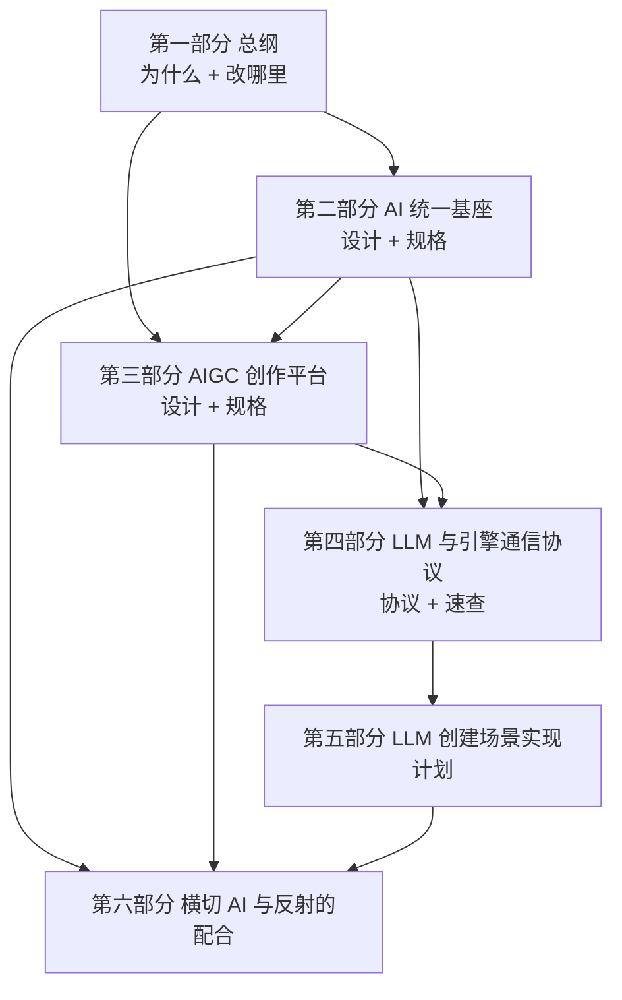
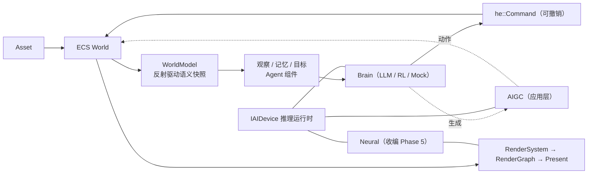
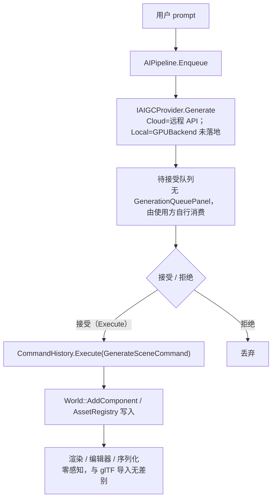
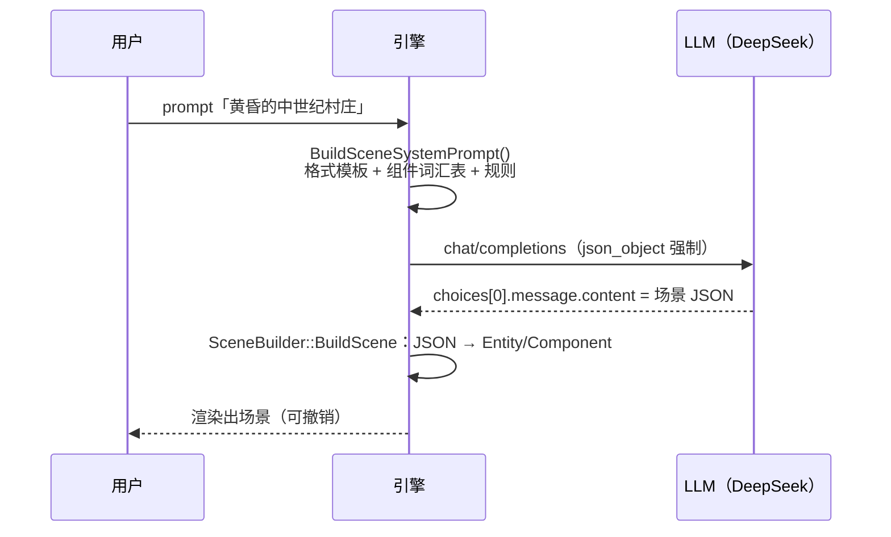
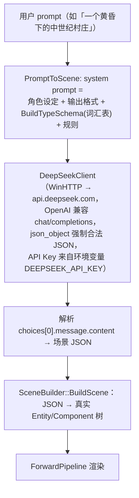

# HugEngine AI 架构设计（一等公民 · 统一基座 · AIGC 平台 · LLM 协议与实现计划）

> **文档定位**：AI 架构的合并定稿。覆盖「为什么把 AI 做成一等公民 → 统一基座怎么设计、规格是什么 → AIGC 平台怎么复用生产管线 → LLM 与引擎之间说什么 → LLM 创建场景是怎么实现的 → AI 与反射如何互相配合」这一整条链路，并给出代码复核结论。
> **版本**：v1.0（合并定稿）；**适用版本**：与复核基准同一源码树，见下。
> **状态口径**：以**代码为唯一事实源**。凡标注「规划中 / 未落地」的，表示截至复核时点在仓库中找不到对应实现；凡给出 `file:line` 的，均为本次复核后确认的当前行号；无法在源码中确认的断言标 `（未能复核）`。
> **复核基准**：源码树 `Engine/AI/`、`Engine/Reflect/Reflect/`、`Engine/Scene/Scene/`、`Samples/07.AISamples/`、`Tests/`；**复核日期 2026-09-21**。落地状态的两处时间戳（2026-09-21）均指该基准日。
> **语言与记号约定**：`he::X` 指引擎命名空间类型；`String`=`std::string`、`TArray<T>`=`std::vector<T>`、`Ref<T>`=`std::shared_ptr<T>`（库内别名，见 §2.6.1）。

---

## 阅读指引

本文按**内容分层**组织，而不是按原始写作顺序。六部分的依赖关系是：



**按问题找章节**：

| 你的问题 | 去哪看 |
|---|---|
| 为什么要把 AI 提成与 RHI 平级的层？ | §1.1、§1.5 |
| 推理运行时（`IAIDevice`）的接口长什么样？ | §2.6 |
| "反射即世界模型"具体怎么实现？ | §2.7、§6.1、§6.3 |
| 智能体组件、大脑、动作、工具调用怎么做？ | §2.8 |
| AI 生成的内容为什么不需要渲染开分支？ | §3.2、§3.10 |
| LLM 到底输出什么格式？引擎怎么解释？ | §4.3、§4.4 |
| 已有 14 类组件字段的完整速查清单 | §4.4.2 |
| LLM 创建场景是哪几步、每步验收什么？ | §5.6 ~ §5.10 |
| 现在到底落地了什么、什么还是规划？ | §2.12、§3.12、§6.8、§A.4 |
| 文档里的说法和代码不一致怎么办？ | §A.2、§A.3、§A.5 |

**源码落点总览**：

| 层/方向 | 落点 |
|---|---|
| 基座接口与后端 | `Engine/AI/Runtime/`（`AIDevice` / `AIModule` / `InferenceScheduler` / `Backend/`） |
| 世界模型（读方向） | `Engine/AI/WorldModel/`（`WorldModel` / `Observation.h` / `Action.h`） |
| 智能体 | `Engine/AI/Agent/`（组件 + `Brain` + `AgentSystem` + `ToolUse` + `AgentReflect.cpp`） |
| AIGC（应用层） | `Engine/AI/AIGC/`（`GenerativeAssetFactory` / `AIGCProvider` / `AICommand` / `AIPipeline` / `*Generator`） |
| LLM 直连 MVP | `Engine/AI/`（`LLMClient.h` / `DeepSeekClient` / `TypeSchema` / `SceneBuilder` / `PromptToScene`） |
| 神经收编 | `Engine/AI/Neural/NeuralUpscaler`（首个 `IRenderSubsystem` 形态） |
| 反射注解 | `Engine/Reflect/Reflect/Attribute.h`、`ReflectionMacros.h`、`Engine/Scene/Scene/SceneReflect.cpp` |
| 演示窗口 | `Samples/07.AISamples/Features/`（6 个 ImGui Feature） |
| 常驻单测 | `Tests/Test{AIModule,AICommand,AIGCProvider,AIPipeline,AgentAction,AgentBrain,WorldModel,InferenceScheduler,SceneBuilder,PromptToScene,DeepSeekProtocol}.cpp` |

---

## 目录

- [第一部分 · 总纲：AI 一等公民](#第一部分--总纲ai-一等公民)
  - [1.1 核心判断：AI 与渲染平级、反射即世界模型](#11-核心判断ai-与渲染平级反射即世界模型)
  - [1.2 现状：AI 被放在两处"插件位"](#12-现状ai-被放在两处插件位)
  - [1.3 两条路线：统一基座与应用层](#13-两条路线统一基座与应用层)
  - [1.4 数据流重构：AI 与渲染共享同一个 World](#14-数据流重构ai-与渲染共享同一个-world)
  - [1.5 分层变化：插入 L2.5 AI 运行时层](#15-分层变化插入-l25-ai-运行时层)
  - [1.6 落地顺序与依赖](#16-落地顺序与依赖)
  - [1.7 对现有代码的整体影响面](#17-对现有代码的整体影响面)
  - [1.8 结论](#18-结论)
- [第二部分 · AI 统一基座](#第二部分--ai-统一基座)
  - [2.1 目标与非目标](#21-目标与非目标)
  - [2.2 复用基础：为什么"几乎免费"](#22-复用基础为什么几乎免费)
  - [2.3 核心设计原则](#23-核心设计原则)
  - [2.4 架构分层：L2.5 AI 运行时层](#24-架构分层l25-ai-运行时层)
  - [2.5 模块目录结构](#25-模块目录结构)
  - [2.6 规格 · Runtime：推理硬件接口（IHI）](#26-规格--runtime推理硬件接口ihi)
  - [2.7 规格 · WorldModel 与 AI 反射注解](#27-规格--worldmodel-与-ai-反射注解)
  - [2.8 规格 · Agent 一等公民智能体](#28-规格--agent-一等公民智能体)
  - [2.9 规格 · Neural 神经渲染收编](#29-规格--neural-神经渲染收编)
  - [2.10 错误处理与降级](#210-错误处理与降级)
  - [2.11 对现有代码的改动清单](#211-对现有代码的改动清单)
  - [2.12 分阶段实施与落地现状](#212-分阶段实施与落地现状)
  - [2.13 测试策略与验收标准](#213-测试策略与验收标准)
  - [2.14 风险与开放问题](#214-风险与开放问题)
- [第三部分 · AIGC 创作平台](#第三部分--aigc-创作平台)
  - [3.1 目标与非目标](#31-目标与非目标)
  - [3.2 实现原理：生成即标准资产](#32-实现原理生成即标准资产)
  - [3.3 依赖](#33-依赖)
  - [3.4 模块目录结构](#34-模块目录结构)
  - [3.5 规格 · GenerativeAssetFactory](#35-规格--generativeassetfactory)
  - [3.6 规格 · AIGCProvider](#36-规格--aigcprovider)
  - [3.7 规格 · AICommand：生成即命令](#37-规格--aicommand生成即命令)
  - [3.8 规格 · AIPipeline：异步生成管线](#38-规格--aipipeline异步生成管线)
  - [3.9 数据流](#39-数据流)
  - [3.10 错误处理与审核](#310-错误处理与审核)
  - [3.11 对现有代码的改动清单](#311-对现有代码的改动清单)
  - [3.12 分阶段实施与落地现状](#312-分阶段实施与落地现状)
  - [3.13 测试策略与验收标准](#313-测试策略与验收标准)
  - [3.14 风险](#314-风险)
- [第四部分 · LLM 与引擎的通信协议](#第四部分--llm-与引擎的通信协议)
  - [4.1 协议本质与核心原则](#41-协议本质与核心原则)
  - [4.2 双向通道总览](#42-双向通道总览)
  - [4.3 上行协议：引擎到 LLM](#43-上行协议引擎到-llm)
    - [4.3.1 system prompt 结构](#431-system-prompt-结构)
    - [4.3.2 组件词汇表](#432-组件词汇表)
    - [4.3.3 强制 JSON 输出](#433-强制-json-输出)
  - [4.4 下行协议：LLM 到引擎](#44-下行协议llm-到引擎)
    - [4.4.1 场景 JSON 格式](#441-场景-json-格式)
    - [4.4.2 组件字段速查](#442-组件字段速查)
    - [4.4.3 解释执行与容错](#443-解释执行与容错)
    - [4.4.4 容错读取助手](#444-容错读取助手)
  - [4.5 两种生成模式](#45-两种生成模式)
  - [4.6 LLM 跑在哪、怎么连](#46-llm-跑在哪怎么连)
  - [4.7 错误处理：三层兜底](#47-错误处理三层兜底)
  - [4.8 调用链与代码位置索引](#48-调用链与代码位置索引)
  - [4.9 扩展规则](#49-扩展规则)
  - [4.10 一句话总结](#410-一句话总结)
- [第五部分 · LLM 创建场景：实现计划](#第五部分--llm-创建场景实现计划)
  - [5.1 计划定位与落地状态](#51-计划定位与落地状态)
  - [5.2 目标、架构与技术栈](#52-目标架构与技术栈)
  - [5.3 全局约束](#53-全局约束)
  - [5.4 文件结构与接口约定](#54-文件结构与接口约定)
  - [5.5 场景 JSON 格式约定](#55-场景-json-格式约定)
  - [5.6 Task 1：测试脚手架](#56-task-1测试脚手架)
  - [5.7 Task 2：HugEngineAI 模块与 SceneBuilder](#57-task-2hugengineai-模块与-scenebuilder)
  - [5.8 Task 3：LLMClient 与 DeepSeekClient](#58-task-3llmclient-与-deepseekclient)
  - [5.9 Task 4：PromptToScene 胶水](#59-task-4prompttoscene-胶水)
  - [5.10 Task 5：端到端示例](#510-task-5端到端示例)
  - [5.11 自审备注与后续演进](#511-自审备注与后续演进)
- [第六部分 · 横切：AI 与反射的配合](#第六部分--横切ai-与反射的配合)
  - [6.1 核心设计原则：反射即世界模型](#61-核心设计原则反射即世界模型)
  - [6.2 反射侧：AI 注解如何挂进属性系统](#62-反射侧ai-注解如何挂进属性系统)
  - [6.3 AI 侧读方向：WorldModel 消费反射](#63-ai-侧读方向worldmodel-消费反射)
  - [6.4 AI 侧写方向：LLM 端到端场景生成](#64-ai-侧写方向llm-端到端场景生成)
  - [6.5 两条 schema 路径：现状与演进目标](#65-两条-schema-路径现状与演进目标)
  - [6.6 推理运行时：与 RHI 同构](#66-推理运行时与-rhi-同构)
  - [6.7 配合关系总览](#67-配合关系总览)
  - [6.8 现状评估](#68-现状评估)
- [附：复核说明与未能复核清单](#附复核说明与未能复核清单)
  - [A.1 复核方法与口径](#a1-复核方法与口径)
  - [A.2 行号漂移对照](#a2-行号漂移对照)
  - [A.3 事实性修正与过时表述](#a3-事实性修正与过时表述)
  - [A.4 规划中与未落地清单](#a4-规划中与未落地清单)
  - [A.5 未能复核清单](#a5-未能复核清单)
  - [A.6 关联文档](#a6-关联文档)

---

## 第一部分 · 总纲：AI 一等公民

> 本部分回答"为什么"和"改哪里"：如何从根本上重新思考传统引擎的模块划分与数据流，把 AI 从"事后集成的功能插件"变成"一等公民"。
> 详细设计见 §2（统一基座）与 §3（AIGC 平台）。

### 1.1 核心判断：AI 与渲染平级、反射即世界模型

把 AI 视为一等公民，落到两个根本动作：

1. **AI 与渲染平级**：新增一个与 RHI 平级的「AI 运行时层」。RHI 之于渲染 = AI 运行时之于 AI —— 推理成为和绘制同等级的硬件抽象，而不是渲染或游戏性下面的一个子系统。
2. **反射即世界模型**：不另造"AI 专用场景格式"。用引擎已有的宏驱动反射 + ECS 作为 AI 读写的**唯一事实源**。

传统引擎把"渲染数据（mesh/light/camera）"和"游戏性数据（AI/行为/状态）"分成两套互不相干的存储，所以 AI 只能是"事后挂上去的系统"。而 HugEngine 的反射系统（`TypeRegistry` + `ClassInfo::factory` + `PropertyInfo`）已经让**任何组件都能按名内省、按名构造**——等于世界模型已经就位，缺的只是把它接到 AI 身上的那层运行时。

### 1.2 现状：AI 被放在两处"插件位"

| 位置 | 形态 | 问题 |
|---|---|---|
| 神经渲染（技术全景 Phase 5，`M73~M79`） | DLSS/FSR/XeSS、NRC、神经材质、RTXNS、LinAlg 被当作渲染管线里一串各自为政的加速插件 | 没有统一推理运行时，各 SDK 各自对接，`rhi::DeviceCaps` 里只是几个散落的布尔位 |
| 游戏性 AI（架构文档 L7 游戏逻辑层） | 一句 `Gameplay Systems (Physics, Audio, AI...)` | AI 与物理、音频并列成一个"系统"，正是"事后集成的功能插件" |

**撰写时点的代码事实**：`Engine/` 下没有任何 AI/ML/推理模块（当时 `grep -r "Neural|Inference|Agent|LLM|AI" Engine/` 无结果）。AI 当时 100% 只存在于规划文档里，且被切成"渲染的 AI"和"游戏的 AI"两块互不相干的东西。

> 📌 **现状更新（本次复核）**：上述"代码为零"已不成立。AI 一等公民已落地为 `Engine/AI/` 模块（推理运行时 / WorldModel / AIGC / Agent / Neural / GPU 后端），并接入构建目标 `HugEngineAI`（`Engine/AI/CMakeLists.txt:8`）。当前落地边界见 §2.12、§3.12、§6.8 与 §A.4。

根因：**引擎里没有一个与 RHI 平级的推理运行时，也没有一个 AI 可读写的世界表示**。

### 1.3 两条路线：统一基座与应用层

| | 方案 1：统一 AI 基座（底座） | 方案 4：AIGC 创作平台（应用层） |
|---|---|---|
| 定位 | 与 RHI 平级的推理硬件抽象 + 世界模型 + 智能体 | AI 原生内容创作工具 |
| 目录 | `Engine/AI/`（Runtime / WorldModel / Agent / Neural，外加顶层的 LLM 场景生成与 AIGC） | `Engine/AI/AIGC/` |
| 解决 | 推理/智能体/神经渲染都建立在一个基座上 | AI 生成内容走与人工编辑相同的生产管线 |
| 依赖 | 只依赖 RHI + 反射 + JobSystem | 依赖方案 1 的推理运行时（可先用远程后端解耦先行） |

**关系**：方案 4 建立在方案 1 之上，但二者可解耦开发 —— AIGC 先用远程 LLM 后端即可跑通，不必等本地 GPU 推理就绪。这一点在落地时被采纳：`CloudAIGCProvider` 只依赖 `IAIDevice::Chat`（远程），`LocalAIGCProvider` 至今未落地（§3.12）。

### 1.4 数据流重构：AI 与渲染共享同一个 World

**现状（单向）**：

```
Asset → AssetRegistry → Entity+Components → RenderSystem::OnUpdate → RenderGraph → Present
```

**目标（AI 与渲染共享 World，双向闭环）**：



关键点：AI 读（`WorldModel::Snapshot`）与写（`Action → he::Command`）都与渲染走**同一条反射通道**，而不是在边上另开一个"AI 系统"。

### 1.5 分层变化：插入 L2.5 AI 运行时层

在现有 L0~L8 分层中，插入一个与 L2 RHI 平级的新层：

```
┌─────────────────────────────────────────────────────────────┐
│ L5 组件层   Agent/Memory/Goal 组件（与 MeshComponent 平级）     │
├─────────────────────────────────────────────────────────────┤
│ L4 渲染层   Neural（NRC/超分/神经材质）—— 作为 IRenderSubsystem   │
├─────────────────────────────────────────────────────────────┤
│ L2.5 AI 运行时层  ★ 新增 ★                                    │
│   IAIDevice ─ WorldModel ─ InferenceScheduler                │
│   ├ GPU Backend（CoopVec/linalg/RTXNS/DirectML）             │
│   ├ CPU Backend（ONNX Runtime / GGUF）                       │
│   └ Remote Backend（LLM：OpenAI/Anthropic/Ollama）            │
├─────────────────────────────────────────────────────────────┤
│ L2 RHI 层   Vulkan / D3D12 / Metal / WebGPU                 │
├─────────────────────────────────────────────────────────────┤
│ L1 反射层   TypeRegistry / ClassInfo / PropertyInfo          │
└─────────────────────────────────────────────────────────────┘
```

### 1.6 落地顺序与依赖

```
方案 1（基座）─► 是方案 4（AIGC）的引擎，但 AIGC 可用远程后端先行

① A1 基座：IAIDevice 门面 + CPU/Remote 后端 + 流式调度 + WorldModel + HE_ATTR_AI_*  （P1末~P2初）
② G1 最小闭环：AIGCProvider + PromptToScene + 生成命令 + 面板                      （P2末，可与 P3/P4 并行）
③ A2 智能体：Agent/Memory/Goal 组件 + IBrain + ToolUse + Action→Command + AI 面板   （P4）
④ A3 神经收编：GPUBackend + 神经渲染落地为 IRenderSubsystem                         （P5）
⑤ G2 资产生成：TextToTexture/Mesh/Material/Animation 接本地 GPU 后端                （P5）
⑥ G3 深度编辑：AI 驱动材质编辑/场景重排/批量修饰                                    （P6+）
```

> **关键调整**：把 AI 运行时 + 世界模型**提前到 Phase 1 末 / Phase 2 初**，否则 Phase 5 的神经渲染仍是"事后插件"。

### 1.7 对现有代码的整体影响面

| 类别 | 内容 |
|---|---|
| 新增 | `Engine/AI/**`（含 `Engine/AI/AIGC/**`） |
| 修改 | `Engine/Core/Core/Engine.h`（持有 `IAIDevice`——**实际未采纳**：改由 `Engine/AI/Runtime/AIModule.h` 进程级单例承载，避免 L0 Core 反向依赖 AI，见 `Engine/AI/Runtime/AIModule.h:14-16`）、`Engine/Core/Threading/JobSystem.h`（流式/优先级车道——**实际未采纳**：由 `he::ai::InferenceScheduler` 自建线程实现）、`Engine/Reflect/Reflect/Attribute.h` + `ReflectionMacros.h`（`HE_ATTR_AI_*`）、`Engine/Scene/Scene/SceneReflect.cpp`（注册 AI 组件——**实际改在** `Engine/AI/Agent/AgentReflect.cpp`）、`Engine/Render/**`（神经渲染改为走 `IAIDevice`，当前仅 `NeuralUpscaler` 一例）、`Engine/Editor/**`（AI 面板——**未落地**，演示窗口在 `Samples/07.AISamples`） |
| 复用（零改动） | `he::reflect::TypeRegistry`/`ClassInfo`/`PropertyInfo`、`he::World`（ECS）、`he::Command`/`he::CommandHistory`/`he::PropertyChangeCommand`（`Engine/Editor/Editor/Command.h`）、`he::asset::LoadGLTF`（作为生成器的返回形状对齐基准）、`he::render::IRenderSubsystem`（神经渲染子系统模式） |

### 1.8 结论

AI 一等公民的改造重心不是"新造多少代码"，而是在正确位置插入一层抽象，把已存在的反射 / ECS / 命令 / RHI 能力串成一条 AI 可用的数据通路。

---

## 第二部分 · AI 统一基座

> 本部分把"与 RHI 平级的推理硬件抽象 + 反射驱动的世界模型 + 一等公民智能体"的设计与规格合并在一处：**§2.1 ~ §2.5 讲设计与理由，§2.6 ~ §2.9 讲接口、字段与常量**，两者互相引用而不重复描述；落地状态集中在 §2.10 ~ §2.13。

### 2.1 目标与非目标

**目标**：新增 `Engine/AI` 模块，使推理成为与渲染平级的一等硬件抽象，AI 与渲染共享同一个反射类型化的 World。具体验收为三条：

- **推理**成为与**渲染**平级的一等硬件抽象（RHI 之于渲染 = AI 运行时之于 AI）；
- **AI 与渲染共享同一个反射类型化的 World** 作为唯一事实源，AI 读（观察）与写（动作）都走同一条反射通道；
- Phase 5 的神经渲染从"散装 SDK 插件"重收编为该运行时的**消费者**，而非孤立模块。

**非目标（Non-Goals）**：

- **不做训练框架**。只做推理 + 微调（LoRA 等）的**调用钩子**；训练由外部工具链完成，产出标准格式模型（ONNX / GGUF / SafeTensors / RTXNS）。
- **不重新实现通用 ML 库**。复用 ONNX Runtime、GGUF、NVIDIA Streamline、RTX Kit；本层只做统一抽象与调度。
- **不做 AI 状态的网络复制**（`HE_ATTR_REPLICATED` 暂不扩展到 AI 组件，留到后续）。
- **不覆盖 AIGC 内容生成**（见 §3）。

### 2.2 复用基础：为什么"几乎免费"

本设计的改造重心是"在正确位置插入一层抽象"，而非新造代码。下表把两处来源的复用清单合并为一份（原两处分册各写了一遍）：

| 现有设施 | 位置（本次复核后的当前行号） | 本设计的用途 |
|---|---|---|
| 宏驱动反射：`ClassInfo`（含 `factory`）、`PropertyInfo`（name/offset/typeName/attributes）、`TypeRegistry` | `Engine/Reflect/Reflect/ReflectionAPI.h` | WorldModel 内省世界、Agent/AIGC 按名构造组件 |
| `ForEachProperty` / `GetMemberPtr`（偏移量读写属性） | 同上 | 观察/动作对属性的泛化读写 |
| ECS：`World::AddComponent<T>` / `ForEachEntity` / `ForEachComponent` | `Engine/Scene/Scene/World.h`（`AddComponent` 模板：`:42`、定义 `:105`） | 世界模型的数据源、动作的执行目标 |
| `Component` 基类 + `HE_COMPONENT()` 生命周期 | `Engine/Scene/Scene/Component.h` | Agent 组件挂载 |
| `Command` / `CommandHistory` / `PropertyChangeCommand` | `Engine/Editor/Editor/Command.h` | AI 动作的撤销/重做（可回滚） |
| `rhi::DeviceCaps` 已声明 `supportsCooperativeVectors` / `supportsLinearAlgebra` | `Engine/RHI/RHI/Types.h:309-310` | 设计上用于 GPU 推理能力探测；**当前 `he::ai` 未读取 `DeviceCaps`**（`GPUBackend` 用普通 compute 核），能力位仅"已预埋" |
| `rhi::IRHIDevice`（`CreateBuffer/CreateTexture`） | `Engine/RHI/RHI/RHI.h` | GPU 后端的底层承载 + 零拷贝 |
| `JobSystem`（Taskflow） | `Engine/Core/Threading/JobSystem.h` | 异步推理调度（**实际未采用**：见 §2.6.4） |
| `render::IRenderSubsystem` | `Engine/Render/Subsystem/RenderSubsystem.h` | 神经渲染子系统复用的接口模式 |

> ⚠ **行号修正**：旧规格把 `DeviceCaps` 的两个能力位标为 `Engine/RHI/RHI/Types.h:288`，本次复核实际位于 `:309-310`（漂移详情见 §A.2）。

**结论**：改造重心不是"新造多少代码"，而是**在正确的位置插入一层抽象**，把上述已存在的反射/ECS/命令/RHI 能力串成一条 AI 可用的数据通路。

### 2.3 核心设计原则

1. **AI 与渲染平级**：`Engine/AI` 与 `Engine/RHI`、`Engine/Render` 平级，不隶属于 Render 或 Gameplay。
2. **反射即世界模型**：不另造一套"AI 专用场景格式"；`World` + `TypeRegistry` 就是世界模型，观察/动作直接基于 `PropertyInfo` 生成。
3. **动作可撤销**：AI 对世界的任何写操作都封装为 `he::Command`，走 `CommandHistory`，保证 AI 可回滚、可审查。
4. **后端可插拔、能力可降级**：GPU / CPU / 远程后端统一接口；设备不支持时静默降级（如无 Cooperative Vectors 则走 CPU 或远程）。**降级链目前是设计目标，尚未实现**，见 §2.10。
5. **流式优先**：LLM 是流式 token 输出，调度器必须支持流式回调，而非只有 `std::future`。
6. **零拷贝优先**：神经渲染需要 AI 张量与 RHI 纹理/缓冲共享内存，避免 GPU↔CPU 拷贝。

### 2.4 架构分层：L2.5 AI 运行时层

在现有 L0~L8 分层中插入一个新层 **L2.5 AI 运行时层**（与 L2 RHI 平级、共同位于 L3 着色器层之下），并向上支撑 L5 组件层（Agent 组件）与 L4 渲染层（神经渲染）：

```
┌─────────────────────────────────────────────────────────────┐
│ L5 组件层   Agent/Memory/Goal 组件（新增，与 MeshComponent 平级）│
├─────────────────────────────────────────────────────────────┤
│ L4 渲染层   Neural（NRC/超分/神经材质）—— 作为 IRenderSubsystem   │
├─────────────────────────────────────────────────────────────┤
│ L2.5 AI 运行时层  ★ 新增  ★                                  │
│   IAIDevice ─ WorldModel ─ InferenceScheduler                │
│   ├ GPU Backend（CoopVec/linalg/RTXNS/DirectML）             │
│   ├ CPU Backend（ONNX Runtime / GGUF）                       │
│   └ Remote Backend（LLM：OpenAI/Anthropic/Ollama）            │
├─────────────────────────────────────────────────────────────┤
│ L2 RHI 层   Vulkan / D3D12 / Metal / WebGPU                 │
├─────────────────────────────────────────────────────────────┤
│ L1 反射层   TypeRegistry / ClassInfo / PropertyInfo          │
└─────────────────────────────────────────────────────────────┘
```

### 2.5 模块目录结构

新增目录 `Engine/AI/`，`namespace he::ai`。四块：Runtime、WorldModel、Agent、Neural（外加应用层 `AIGC/` 与 LLM 直连 MVP 文件）。

```
Engine/AI/
├── CMakeLists.txt
├── LLMClient.h                     # ILLMClient 接口
├── DeepSeekClient.h/.cpp           # DeepSeek（OpenAI 兼容）HTTP 客户端
├── TypeSchema.h/.cpp               # 硬编码组件词表（注入 system prompt）
├── SceneBuilder.h/.cpp             # JSON → World（当前为 type 硬编码映射）
├── PromptToScene.h/.cpp            # 端到端胶水
├── Runtime/                        # 「IHI」— 推理硬件接口，并行 RHI
│   ├── AIDevice.h/.cpp             # IAIDevice + AIDeviceCaps（门面）
│   ├── AIModule.h/.cpp             # 进程级单例入口（Initialize/GetDevice/GetScheduler）
│   ├── InferenceScheduler.h/.cpp   # 优先级车道 + 主线程流式回调投递
│   └── Backend/
│       ├── IAIBackend.h            # 后端接口 + 共享基础类型（IAIModel/IAITensor/AIModelFormat/AIDataType/AITensorDesc/InferenceRequest）
│       ├── GPUBackend.h/.cpp       # 包装 RHI compute（内置核 + 外部 SPIR-V 核）
│       └── RemoteBackend.h/.cpp    # LLM HTTP（经 DeepSeekClient）
│   # ※ CPUBackend（ONNX Runtime / GGUF）为规划项，尚未落地
├── WorldModel/
│   ├── WorldModel.h/.cpp           # World → 语义快照（反射驱动）
│   ├── Observation.h               # ObservationFilter（观察过滤）
│   └── Action.h/.cpp               # 动作（AI 写世界 → he::Command）
├── Agent/
│   ├── AgentComponent.h            # 一等公民实体组件
│   ├── AgentReflect.cpp            # AI 组件反射注册（不放在 Scene 的 SceneReflect.cpp）
│   ├── Brain.h                     # IBrain / ActionPlan 策略抽象
│   ├── LLMBrain.h/.cpp             # LLM 策略
│   ├── MockBrain.h                 # 测试用固定策略
│   ├── GoalComponent.h/.cpp        # 目标
│   ├── MemoryComponent.h/.cpp      # 记忆（当前仅短期 KV）
│   ├── ToolUse.h/.cpp              # 工具调用原语
│   └── AgentSystem.h/.cpp          # 节律驱动（thinkInterval → Decide → Command）
├── Neural/
│   └── NeuralUpscaler.h/.cpp       # 首个神经子系统（IRenderSubsystem，零拷贝互操作验证）
│   # ※ NeuralRadianceCache / NeuralMaterial / RTXNeuralShader 为规划项，尚未落地
└── AIGC/                           # 应用层（见 §3）
```

> 注：设计中的 Editor 面板（`AIObserverPanel` / `AgentInspectorPanel` / `PromptConsolePanel`）**未落地**；本次复核在 `Engine/` 下未找到任何面板实现（仅注释中提及）。AI 演示窗口位于 `Samples/07.AISamples`。

### 2.6 规格 · Runtime：推理硬件接口（IHI）

`IAIDevice` 是 `rhi::IRHIDevice` 的镜像，区别在于它抽象"模型执行"而非"图元绘制"。`Engine/AI/Runtime/AIDevice.h:10-19` 的原文注释即为此意。

#### 2.6.1 共享基础类型与推理请求

> **归属修正**：旧规格把 `AIModelFormat` / `AIDataType` / `AITensorDesc` / `InferenceRequest` / `IAIInference` 一并写进 `AIDevice.h`。实际这些**共享基础类型定义在 `Engine/AI/Runtime/Backend/IAIBackend.h:25-84`**，`AIDevice.h` 仅 `#include` 之（`Engine/AI/Runtime/AIDevice.h:4`），以避免循环包含（`IAIBackend.h:15` 注释）。下表按实际归属标注。

```cpp
// Engine/AI/Runtime/Backend/IAIBackend.h:21-84
namespace he::ai {

// 引用类型别名（文档用 Ref<T>；库内统一为 shared_ptr）
template<typename T>
using Ref = std::shared_ptr<T>;                       // :21-22

class IAIModel { public: virtual ~IAIModel() = default; };   // :25-28 模型句柄
class IAITensor { public: virtual ~IAITensor() = default; }; // :31-34 张量句柄（bindless 可见）

// 模型格式 / 张量数据类型                                        // :37 / :40
enum class AIModelFormat { ONNX, GGUF, SafeTensors, RTXNS_Slang };
enum class AIDataType    { FP32, FP16, BF16, FP8, INT8, INT4 };

// 张量描述 —— 镜像 rhi::BufferDesc/TextureDesc                    // :43-47
struct AITensorDesc {
    u32        elementCount = 0;
    AIDataType dtype        = AIDataType::FP32;
    bool       bindlessVisible = true;   // 与渲染共享（零拷贝）
};

// 推理请求                                                       // :50-73
struct InferenceRequest {
    IAIModel*               model = nullptr;      // 编译后的模型句柄（真实模型推理用；预置核可空）
    // --- 计算核选择（二选一）---
    String                  kernel;               // 内置核名（如 "tensor_scale"；customSpirv 非空时忽略）
    Span<const u32>         customSpirv = {};     // 外部核 SPIR-V（优先于 kernel）
    // --- 外部核描述（customSpirv 非空时使用）---
    u32                     pushConstantSize = 0;
    std::vector<u8>         pushConstants;
    // --- 内置核便利参数（kernel 非空时使用）---
    std::vector<std::pair<String, String>> params;  // KV 文本，如 {"scale","2.5"}
    // --- 张量与调度 ---
    // 描述符绑定约定（MVP）：
    //   binding 0..n-1    = inputs（StorageBuffer，只读）
    //   binding n..n+m-1  = textureInputs（CombinedImageSampler，只读）
    //   binding n+m..     = outputs（StorageBuffer，可写）
    std::vector<IAITensor*> inputs;
    std::vector<IAITensor*> textureInputs;
    std::vector<IAITensor*> outputs;
    u32                     batchSize = 1;
};

// 推理句柄 —— 支持阻塞等待 + 流式回调（LLM 必需）                  // :76-84
class IAIInference {
public:
    virtual ~IAIInference() = default;
    virtual bool IsDone() const = 0;
    virtual void Wait() = 0;
    virtual void Cancel() = 0;
    virtual void SetStreamCallback(std::function<void(const String&)> cb) = 0;
};
} // namespace he::ai
```

**字段速查**：

| 类型 | 字段 | 语义 | 备注 |
|---|---|---|---|
| `AITensorDesc` | `elementCount` / `dtype` / `bindlessVisible` | 元素数 / 数据类型 / 是否对渲染可见 | `bindlessVisible=true` 即零拷贝前提 |
| `InferenceRequest` | `model` | 编译后模型句柄 | 预置 compute 核可为空 |
| | `kernel` ↔ `customSpirv` | 内置核名 ↔ 运行时自定义 SPIR-V | **二选一，`customSpirv` 优先** |
| | `pushConstantSize` / `pushConstants` | 外部核 push constant 布局与数据 | 与 shader 布局对齐 |
| | `params` | 内置核 KV 文本参数 | 后端按核名解释 |
| | `inputs` / `textureInputs` / `outputs` | 绑定顺序即 binding 序号 | 见上注释的绑定约定 |
| | `batchSize` | 批大小 | 默认 1 |
| `IAIInference` | `IsDone` / `Wait` / `Cancel` / `SetStreamCallback` | 阻塞等待 + 流式回调 | 流式是 LLM 的硬需求 |

#### 2.6.2 IAIDevice 门面

`AIDeviceCaps` 是 **AI 专属能力位，不复制 `rhi::DeviceCaps`**（`Engine/AI/Runtime/AIDevice.h:34-41`）：

```cpp
// Engine/AI/Runtime/AIDevice.h:35-41
struct AIDeviceCaps {
    bool supportsGPU       = false;   // GPUBackend 可用（张量 + compute 推理）
    bool supportsCPU       = false;   // ONNX Runtime / GGUF 可用
    bool supportsRemoteLLM = false;   // 远程大模型可用
    bool supportsNPU       = false;   // NPU 直通（预留）
    u32  maxModelSizeMB    = 0;       // 单模型内存上限
};
```

```cpp
// Engine/AI/Runtime/AIDevice.h:44-83（节选，注释保留原文）
class IAIDevice {
public:
    virtual ~IAIDevice() = default;
    virtual AIDeviceCaps GetCaps() const = 0;

    // 模型生命周期（按格式分派后端；无可用后端返回 nullptr）
    virtual Ref<IAIModel>  LoadModel(AIModelFormat fmt, Span<const u8> weights, const String& path) = 0;
    // 张量创建（GPU/CPU 后端未就绪时返回 nullptr）
    virtual Ref<IAITensor> CreateTensor(const AITensorDesc& desc) = 0;
    // 提交推理（异步，返回句柄）
    virtual Ref<IAIInference> Submit(InferenceRequest&& req) = 0;

    // ★ 与渲染零拷贝互操作（神经渲染的关键；后端不支持则返回 nullptr）  // :60-63
    virtual Ref<IAITensor> WrapRHITexture(rhi::IRHITexture* tex) = 0;   // 读渲染纹理（he::rhi）
    virtual Ref<IAITensor> WrapRHIBuffer(rhi::IRHIBuffer* buf)  = 0;    // 读 bindless 缓冲
    virtual rhi::IRHIBuffer* ExportBuffer(IAITensor* t)          = 0;   // 写回渲染缓冲

    // --- LLM 便捷方法（委托 RemoteBackend；无则返回空串）---            // :65-69
    virtual String Chat(const String& systemPrompt, const String& userPrompt) = 0;
    virtual void   ChatStream(const String& systemPrompt, const String& userPrompt,
                              std::function<void(const String&)> onToken) = 0;

    // --- 张量数据交换（CPU ↔ GPU，A3.1 验证用）---                      // :71-75
    virtual bool WriteTensor(IAITensor* t, Span<const float> data, u32 offsetElems = 0) = 0;
    virtual bool ReadTensor (IAITensor* t, Span<float> out,         u32 offsetElems = 0) = 0;
};

// 工厂：注册 RemoteBackend + GPUBackend                              // :78-83
std::unique_ptr<IAIDevice> CreateAIDevice(InferenceScheduler* scheduler = nullptr,
                                          rhi::IRHIDevice* rhiDevice = nullptr);
```

**零拷贝方法的实现状态**（`Engine/AI/Runtime/AIDevice.cpp`）：

| 方法 | 状态 | 证据 |
|---|---|---|
| `WrapRHITexture` | 已实现（委托 `GPUBackend::WrapTexture`，GPU 后端未注册时返回 `nullptr`） | `AIDevice.cpp:82-84` |
| `ExportBuffer` | 已实现（委托 `GPUBackend::ExportBuffer`） | `AIDevice.cpp:86-88` |
| `WrapRHIBuffer` | **仍为占位**：直接 `return nullptr` | `AIDevice.cpp:85` |

#### 2.6.3 IAIBackend 与后端实现

`IAIBackend` 是 `IAIDevice` 的实现单元，`IAIDevice` 作为门面按模型格式 + 能力选择后端：

```cpp
// Engine/AI/Runtime/Backend/IAIBackend.h:90-101
class IAIBackend {
public:
    virtual ~IAIBackend() = default;
    virtual bool             Supports(AIModelFormat fmt) const = 0;   // 是否支持该模型格式
    virtual Ref<IAIModel>    Load(AIModelFormat fmt, Span<const u8> weights, const String& path) = 0;
    virtual Ref<IAITensor>   Allocate(const AITensorDesc& desc) = 0;
    virtual Ref<IAIInference> Run(InferenceRequest&& req) = 0;
};
```

| 后端 | 状态 | 说明 |
|---|---|---|
| `RemoteBackend` | 已实现 | LLM HTTP（经 `DeepSeekClient`）；`Supports`/`Load`/`Allocate`/`Run` 全部返回"不支持"，`Chat`/`ChatStream` 是其领域能力（`Engine/AI/Runtime/Backend/RemoteBackend.h:21-35`） |
| `GPUBackend` | 已实现 | 包装 RHI compute：内置核 `tensor_scale` / `texture_sample` / `texture_gen`（`Engine/AI/Runtime/Backend/GPUBackend.h:25-27`）+ 外部 SPIR-V 核；另提供 `WriteTensor`/`ReadTensor`/`WrapTexture`/`ExportBuffer`（`:77-84`） |
| `CPUBackend`（ONNX Runtime / GGUF） | **未落地** | `Engine/AI/Runtime/Backend/` 下无该文件 |

工厂 `CreateAIDevice` 的注册逻辑（`Engine/AI/Runtime/AIDevice.cpp:128-147`）：

- 传入 `rhiDevice` 时注册 `GPUBackend`（`:134-136`）；
- 环境变量 `DEEPSEEK_API_KEY` 非空时注册 `RemoteBackend`，否则 `HE_CORE_WARN`（`:139-145`）；
- `GetCaps()` 只置 `supportsGPU` / `supportsRemoteLLM`，**`supportsCPU` / `supportsNPU` 恒为 false**（`AIDevice.cpp:39-44`）。

#### 2.6.4 InferenceScheduler：优先级车道与流式投递

**自建工作线程 + 优先级队列，不依赖 `JobSystem`**（`Engine/AI/Runtime/InferenceScheduler.h:15` 注释）：

```cpp
// Engine/AI/Runtime/InferenceScheduler.h:25-44
enum class InferencePriority {
    Frame      = 0,   // 帧内高优先：渲染耦合推理（NRC/超分）
    Normal     = 1,   // 普通推理
    Background = 2,   // 后台低优先：LLM 智能体等
};

void Submit(InferencePriority prio, std::function<void()> task);  // :37
void PostToMain(std::function<void()> cb);                        // :41 任何线程可调，线程安全
void DrainMainThread();                                           // :44 主线程每帧调用，FIFO 执行
```

- **优先级车道**：`Frame` > `Normal` > `Background`，互不阻塞；同优先级 FIFO（`InferenceScheduler.h:56-65` 的 `Task::operator<`）。
- **流式回调**：经 `PostToMain()` 把 token 按序投递到主线程队列，主线程每帧 `DrainMainThread()` 执行，**禁止在推理线程直接改 World**（`InferenceScheduler.h:39-44`、`:18-19`）。
- `WaitIdle()` / `Shutdown()` 供测试与关闭使用（`:47-50`）。

#### 2.6.5 AIModule：进程级单例入口

设计上曾提出由 L0 Core 的 `Engine` 直接持有 `m_AIDevice`；实际按"避免 Core 反向依赖 AI/Scene"改为模块单例（`Engine/AI/Runtime/AIModule.h:14-16` 记录了这一决策）：

```cpp
// Engine/AI/Runtime/AIModule.h:21-34
class AIModule {
public:
    static void Initialize();     // 幂等：创建调度器 + AI 设备（含后端）
    static void Shutdown();       // 幂等：逆序释放
    static IAIDevice* GetDevice();
    static InferenceScheduler* GetScheduler();
private:
    static std::unique_ptr<InferenceScheduler> s_Scheduler;
    static std::unique_ptr<IAIDevice> s_Device;
};
```

本次复核：`Engine/Core/` 下 grep `AIDevice|AIModule|he::ai` **无匹配**，印证 `Engine/Core/Core/Engine.h` 未被改动。

### 2.7 规格 · WorldModel 与 AI 反射注解

**不新增任何场景数据结构**。`WorldModel` 遍历 `World` + `TypeRegistry`，把反射属性自动序列化为 LLM 可读的语义快照（设计理由见 §6.1、§6.3）。

#### 2.7.1 ObservationFilter

```cpp
// Engine/AI/WorldModel/Observation.h:18-23
struct ObservationFilter {
    float  radius = -1.0f;                       // 以 center 为球心的空间范围（-1 = 全场景，暂未启用）
    float3 center = {0, 0, 0};                   // 空间过滤中心（配合 radius 使用）
    u64    targetEntity = 0;                     // 0 = 全部实体，否则仅该实体
    std::vector<StringView> componentTypes;      // 只导出这些组件类型（空 = 全部）
};
```

| 字段 | 是否生效 | 说明 |
|---|---|---|
| `targetEntity` | **已生效** | 非 0 时只快照该实体（`Engine/AI/WorldModel/WorldModel.cpp:78` 起的过滤逻辑） |
| `componentTypes` | **已生效** | 白名单过滤组件类型（同上） |
| `radius` / `center` | 声明但**暂未启用** | `Observation.h:19-20` 注释明确标注；用于后续 token 预算裁剪 |

#### 2.7.2 Snapshot / TypeSchema

```cpp
// Engine/AI/WorldModel/WorldModel.h:22-31
class WorldModel {
public:
    /// 生成语义快照（LLM 可读 JSON 文本）。
    /// 只导出带 HE_ATTR_AI_VISIBLE 标记的属性；附带 HE_ATTR_AI_DESCRIPTION 作为字段说明。
    String Snapshot(World& world, const ObservationFilter& filter) const;

    /// 生成类型 schema（供 LLM 了解"世界长什么样、能做什么"）。
    /// 遍历 TypeRegistry，输出所有含 AI_VISIBLE 属性的组件类型及其字段清单。
    String TypeSchema() const;
};
```

**实现要点**（`Engine/AI/WorldModel/WorldModel.cpp`）：

- `IsAiVisible(prop)`：`prop.GetAttribute(AttrKey::AiVisible) == "1"`（`:68-69`）；
- `Snapshot`：遍历实体 → `comp->GetClass()` 取反射元数据 → 无任何可见属性的组件整组跳过（`:93`、`:109`）→ 逐属性 `reinterpret_cast<char*>(comp) + p.offset` 按偏移读值（`:117`），按 `typeName` 字符串分派序列化（`:28-31`）；
- `TypeSchema`：`TypeRegistry::Instance().ForEachClass(...)` 遍历全部注册类（`:141`），只输出含 `AI_VISIBLE` 属性的类型（`:145`），字段附带 `writable`（`:157`）与 `description`（`:159`）。

#### 2.7.3 HE_ATTR_AI_* 注解

新增反射注解，沿用 `prop.attributes.emplace_back(...)` 模式（键名收敛在 `AttrKey`）：

| 注解 | 语义 | 定义位置 |
|---|---|---|
| `HE_ATTR_AI_VISIBLE` | 该属性进入世界模型快照 | `Engine/Reflect/Reflect/ReflectionMacros.h:77` |
| `HE_ATTR_AI_DESCRIPTION("...")` | 该属性/类型的自然语言说明（LLM 用） | `ReflectionMacros.h:79` |
| `HE_ATTR_AI_WRITABLE` | 该属性允许 AI 写入（否则只读） | `ReflectionMacros.h:81` |
| `HE_ATTR_AI_TOOL("name")` | 该方法暴露为 AI 可调用的工具 | `ReflectionMacros.h:83` |

```cpp
// Engine/Reflect/Reflect/Attribute.h:49-52
constexpr const char* AiVisible     = "AiVisible";     // 该属性进入世界模型快照
constexpr const char* AiDescription = "AiDescription"; // 自然语言说明（LLM 用）
constexpr const char* AiWritable    = "AiWritable";    // 允许 AI 写入（否则只读）
constexpr const char* AiTool        = "AiTool";        // 该方法暴露为 AI 可调用工具
```

> ⚠ **复核发现**：`HE_ATTR_AI_TOOL` 与 `AttrKey::AiTool` 已在宏/常量层定义，但**全仓库没有任何一处使用**（`Engine/` 下 grep 只命中宏定义自身）。原因：反射目前只注册属性（`PropertyInfo`），没有方法注册通道——"方法暴露为工具"在机制上尚不成立。当前工具清单由 `ToolUse` 中硬编码的 `kTools` 提供（见 §2.8.4）。

### 2.8 规格 · Agent 一等公民智能体

Agent 是**挂载到 Entity 上的组件**，与 `MeshComponent` 平级，享受同样的反射/序列化/编辑器内省。

#### 2.8.1 组件三件套

```cpp
// Engine/AI/Agent/AgentComponent.h:17-27
class AgentComponent : public he::Component {
    HE_COMPONENT()
public:
    String brainType      = "LLM";   // 策略类型（LLM / Mock / RL，反射工厂构造 IBrain）
    String systemPrompt;             // 系统提示词（LLM 策略用）
    f32    thinkInterval  = 0.5f;    // 思考间隔（秒）
    bool   enabled        = true;    // 是否启用

    // --- 运行时状态（不注册为反射属性）---
    f32    m_ThinkTimer   = 0.0f;    // 距上次思考的计时
};
```

| 组件 | 字段/能力 | 当前状态 |
|---|---|---|
| `AgentComponent` | `brainType` / `systemPrompt` / `thinkInterval` / `enabled` | 四个属性均注册反射，且带完整 AI 注解（`Engine/AI/Agent/AgentReflect.cpp:17-30`）；`brainType` 实际支持 `LLM` / `Mock` |
| `MemoryComponent` | `AddShortTerm` / `Query` / `GetShortTermCount` / `ClearShortTerm`；短期记忆上限 `kMaxShortTerm = 64` | 只注册类型、不注册属性（`AgentReflect.cpp:33-34`）；长期/情景记忆为后续扩展（`Engine/AI/Agent/MemoryComponent.h:30-42`） |
| `GoalComponent` | `AddGoal` / `MarkAchieved` / `GetCurrentGoal` / `GetGoals`（按优先级降序 + 达成标记） | 只注册类型、不注册属性（`AgentReflect.cpp:36-37`） |

**注册位置说明**：AI 组件在 `Engine/AI/Agent/AgentReflect.cpp` 内注册，**不放进** `Engine/Scene/Scene/SceneReflect.cpp`，以避免 Scene → AI 的反向依赖（该文件 `:9-15` 注释说明了这一取舍）。

反射注册实样（`Engine/AI/Agent/AgentReflect.cpp:14-39`，原文）：

```cpp
namespace he::ai {

// --- AgentComponent 注册（带 AI 注解示范）---
HE_BEGIN_REGISTER(he::ai::AgentComponent)
    HE_REGISTER_PROPERTY(he::ai::AgentComponent, String, brainType)
        HE_ATTR_CATEGORY("AI") HE_ATTR_AI_VISIBLE() HE_ATTR_AI_WRITABLE() HE_ATTR_AI_DESCRIPTION("大脑策略类型：LLM/Mock/RL")
    HE_END_PROPERTY()
    HE_REGISTER_PROPERTY(he::ai::AgentComponent, String, systemPrompt)
        HE_ATTR_CATEGORY("AI") HE_ATTR_AI_VISIBLE() HE_ATTR_AI_WRITABLE() HE_ATTR_AI_DESCRIPTION("系统提示词")
    HE_END_PROPERTY()
    HE_REGISTER_PROPERTY(he::ai::AgentComponent, f32, thinkInterval)
        HE_ATTR_CATEGORY("AI") HE_ATTR_AI_VISIBLE() HE_ATTR_AI_WRITABLE() HE_ATTR_AI_DESCRIPTION("思考间隔（秒）")
    HE_END_PROPERTY()
    HE_REGISTER_PROPERTY(he::ai::AgentComponent, bool, enabled)
        HE_ATTR_CATEGORY("AI") HE_ATTR_AI_VISIBLE() HE_ATTR_AI_WRITABLE() HE_ATTR_AI_DESCRIPTION("是否启用")
    HE_END_PROPERTY()
HE_END_REGISTER()

// --- MemoryComponent / GoalComponent：组件类型注册（内部数据结构暂不注册属性）---
HE_BEGIN_REGISTER(he::ai::MemoryComponent)
HE_END_REGISTER()

HE_BEGIN_REGISTER(he::ai::GoalComponent)
HE_END_REGISTER()

} // namespace he::ai
```

**要点**：`brainType="LLM"` 的实际消费点在 `AgentSystem`——按该字符串选择 `LLMBrain` / `MockBrain`（`Engine/AI/Agent/AgentSystem.cpp:73-85`），即"策略可插拔"落到代码上是**字符串分派**而非反射工厂构造（`AgentComponent.h:20` 注释里"反射工厂构造 IBrain"描述的是设计意图，当前实现未走反射）。

#### 2.8.2 IBrain 策略抽象

```cpp
// Engine/AI/Agent/Brain.h:19-32
struct ActionPlan { TArray<Action> actions; };

class IBrain {
public:
    virtual ~IBrain() = default;
    /// 依据观察（语义快照 JSON）+ 记忆，产出动作计划
    /// @param observationJson WorldModel::Snapshot 输出
    /// @param memory 实体记忆（可空）
    virtual ActionPlan Decide(const String& observationJson, const MemoryComponent* memory) = 0;
};
```

> ⚠ **签名修正**：观察以 **JSON 文本**传入，而非 `Observation` 对象；记忆以组件**指针**传入（可空）。实现类：`LLMBrain`（LLM 策略）、`MockBrain`（测试用固定策略）。

#### 2.8.3 Action → Command

`Action` 内部映射到 `he::Command`，执行走 `he::CommandHistory`，因此 AI 的每次写世界都可回滚。

```cpp
// Engine/AI/WorldModel/Action.h:28-37
struct Action {
    u64    targetEntity = 0;   // 目标实体（SpawnEntity 忽略）
    String op;                 // 操作类型
    String argsJson;           // 参数（JSON 对象文本）
};

/// 非法动作（实体不存在、属性不存在、op 不支持）返回 nullptr，不产生副作用。
std::unique_ptr<he::Command> CompileAction(he::World& world, he::SceneGraph& sg,
                                           const Action& a);
```

**支持的 op 与实现位置**（`Engine/AI/WorldModel/Action.cpp`）：

| op | 语义 | 位置 |
|---|---|---|
| `SpawnEntity` | 新建实体（复用 `SceneBuilder` 装配单个实体场景 JSON），可撤销 | `Action.cpp:153-155`（命令类 `:45-69`） |
| `SetTransform` | 修改 `TransformComponent` 的 position/scale | `Action.cpp:159-172` |
| `SetProperty` | **经反射**修改指定组件属性（`FindProperty` + 偏移量读写） | `Action.cpp:176-201` |
| `CastAbility` | 施放技能（B4 简化 GAS 对接点），可撤销 | `Action.cpp:204-227` |

> ⚠ **文档/代码不一致（头文件注释过时）**：`Engine/AI/WorldModel/Action.h:30` 的字段注释写的是 `SpawnEntity / SetTransform / SetProperty / CallTool`，而 `Action.cpp` 实际实现的是第 4 项为 **`CastAbility`**（`Action.cpp:204`）；同文件 `:13-16` 的"支持的 op（MVP）"注释也只列了 3 项。**以 `.cpp` 为准**：共 4 个 op，无 `CallTool`。

**签名说明**：`CompileAction` 带 `he::SceneGraph&`（`SpawnEntity` 需装配层级）。

#### 2.8.4 ToolUse 工具清单

当前工具清单为 3 项，以"名称 + 说明"的 JSON 数组注入 LLM 决策 prompt（**参数 schema 未由反射自动生成**）：

```cpp
// Engine/AI/Agent/ToolUse.cpp:13-17
const std::vector<ToolInfo> kTools = {
    {"SpawnEntity",  "新建实体。argsJson={name, transform{position,scale}, components[{type,Cube|Sphere|DirectionalLight|PointLight|PhysicalSky, ...}]}"},
    {"SetTransform", "修改实体 Transform。targetEntity=实体id，argsJson={position:[x,y,z], scale:[sx,sy,sz]}"},
    {"SetProperty",  "经反射修改组件属性。targetEntity=实体id，argsJson={component:\"he::TransformComponent\", property:\"position\", value:[x,y,z]}"},
};
```

- `GetTools()` 返回清单（`ToolUse.cpp:20-22`）；`BuildToolSchema()` 把它们序列化成 `[{"name","description"}]`（`:24-30`）。
- 设计中的 `QueryVisible` / `PlayAnimation` / `CaptureScreenshot` / `list_assets` 等**尚未落地**。
- ⚠ **次要不一致**：`SpawnEntity` 的工具说明里仍然只写 `Cube|Sphere|DirectionalLight|PointLight|PhysicalSky` 五种组件，而 `SceneBuilder` 实际已支持 14 种（§4.4.2）——说明文本未随组件扩充同步更新。

#### 2.8.5 AgentSystem 节律驱动

节律驱动链路：`thinkInterval` 计时到点 → `WorldModel::Snapshot` 生成观察 → 按 `brainType` 构造 `IBrain` → `Decide` 产出 `ActionPlan` → 逐条 `CompileAction` → 交给 `CommandHistory` 执行。证据（`Engine/AI/Agent/AgentSystem.cpp`）：

| 环节 | 位置 |
|---|---|
| 入口签名带 `CommandHistory&` 与 `IAIDevice*` | `AgentSystem.cpp:54` |
| `m_ThinkTimer < thinkInterval` 时跳过 | `:61` |
| `WorldModel::Snapshot(world, filter)` | `:68` |
| 按 `brainType == "Mock"` 选择大脑 | `:73-75` |
| `brain->Decide(obs, memory)` | `:87` |
| `CompileAction(world, sg, a)` | `:91` |

### 2.9 规格 · Neural 神经渲染收编

Phase 5 的 `M73~M79`（DLSS/FSR/XeSS、NRC、神经材质、RTXNS）重定义为**`he::ai` 运行时的消费者**：

- 每个神经渲染特性实现为 `he::render::IRenderSubsystem`（复用现有子系统模式），在其内部通过 `IAIDevice` 做推理；
- NRC 用 `WrapRHITexture` 读取渲染结果、用 `ExportBuffer` 写回辐射缓存；
- 神经材质权重以 bindless 缓冲存在，经 `WrapRHIBuffer` 零拷贝接入 `IAIDevice`。

**落地现状**：目前只有 `NeuralUpscaler` 一个子系统（`Engine/AI/Neural/`），实现形态为 `class NeuralUpscaler : public IRenderSubsystem`（`Engine/AI/Neural/NeuralUpscaler.h:30`），内部经 `IAIDevice` 推理（`:11` 注释）。其 `Update` 内**同步**完成一次推理（`NeuralUpscaler.cpp:76-83`：Wrap 纹理 → `Submit(texture_sample)` → 读回统计），输出仅用于统计展示、未写入渲染目标（`:87`、`:97`、`:117-123`），属"架构形态验证"实现；真实超分（DLSS/FSR/XeSS）需待 Streamline SDK 接入。`NeuralRadianceCache` / `NeuralMaterial` / `RTXNeuralShader` **均未落地**。零拷贝侧 `WrapRHITexture` / `ExportBuffer` 已实现，`WrapRHIBuffer` 仍为占位（§2.6.2）。

### 2.10 错误处理与降级

本节把"设计意图"与"当前实现"分开陈述（原两处分册各写了一遍且互相矛盾，这里以代码为准）：

| 场景 | 设计策略 | 当前实现 |
|---|---|---|
| **后端不可用** | 调用方按能力降级（GPU→CPU→Remote→功能禁用） | `LoadModel` / `CreateTensor` / `Submit` 返回 `nullptr` 并 `HE_CORE_WARN`（`Engine/AI/Runtime/AIDevice.cpp:53`、`:59`、`:67`）。**降级链本身未实现**；未定义 `AIBackendUnavailable` 异常 |
| **设备能力不足**（无 CoopVec/linalg） | `GPUBackend` 退化为普通 compute dispatch，或转交 `CPUBackend` | 前半句**已经是现状**（`GPUBackend` 本就走普通 compute 核，未读 `DeviceCaps`）；转交 `CPUBackend` **未实现**（`CPUBackend` 本身未落地） |
| **远程 LLM 失败**（网络/限流/超时） | 返回空串 + 记录错误 + Agent 侧退避重试 | `Chat` / `ChatStream` 返回空串并记录错误（`DeepSeekClient::Chat` 内部兜底）；设计中的 `IAIInference::Failed` 状态与 `onError` 回调**未实现**；Agent 侧退避重试**未实现** |
| **动作非法**（目标实体已销毁、属性不存在） | `CompileAction` 返回 `nullptr`，不产生副作用；`WorldModel` 快照时跳过脏引用 | 已实现（`Engine/AI/WorldModel/Action.h:35-37` 注释即契约；`Action.cpp:162/181/187/207/214/218` 各处 `HE_CORE_WARN` + 返回 `nullptr`） |
| **AI 写世界可回滚** | 所有写操作经 `CommandHistory`，异常时 `Undo` | 已实现（`SpawnEntity`/`SetTransform`/`SetProperty`/`CastAbility` 四种 op 各自封命令） |

### 2.11 对现有代码的改动清单

（合并自两处分册的同名清单，按当前代码校订）

| 文件/模块 | 改动 | 类型 |
|---|---|---|
| `Engine/AI/**` | 新增整个模块 | 新增 |
| `Engine/CMakeLists.txt` | 添加 `Engine/AI` 子目录 | 修改 |
| `Engine/AI/CMakeLists.txt` | `HugEngineAI` 静态库；PUBLIC 链接 `HugEngineScene`/`HugEngineCore`/`HugEngineRender`/`HugEngineEditor`/`HugEnginePhysics`/`nlohmann_json`，PRIVATE 链接 `winhttp`/`stb` | 新增（`Engine/AI/CMakeLists.txt:75-83`） |
| `Engine/RHI/RHI/Types.h` | `DeviceCaps` 已含 CoopVec/linalg 位（`:309-310`），确认导出即可 | 确认（未改动） |
| `Engine/RHI/RHI/RHI.h` | 新增底层句柄导出（供 AI 零拷贝），或由 AI 层经 `Bindless.h` 取 index | 小改 |
| `Engine/Core/Core/Engine.h` | **未改动**：`Engine` 未持有 `m_AIDevice`；实际以 `he::ai::AIModule` 进程级单例落地 | 未落地（有意改设计） |
| `Engine/Core/Threading/JobSystem.h` | **未改动**：优先级车道 + 流式回调投递由 `he::ai::InferenceScheduler` 自建线程实现 | 未落地（有意改设计） |
| `Engine/Reflect/Reflect/Attribute.h` | `AttrKey` 增加 `AiVisible/AiDescription/AiWritable/AiTool`（`:49-52`） | 已实现 |
| `Engine/Reflect/Reflect/ReflectionMacros.h` | 增加 `HE_ATTR_AI_*` 宏（`:77-83`） | 已实现 |
| `Engine/Scene/Scene/Component.h` | 无需改基类（Agent 组件继承 `he::Component`） | 无 |
| `Engine/Scene/Scene/SceneReflect.cpp` | **未改动**（就 AI 组件而言）：Agent 组件改在 `Engine/AI/Agent/AgentReflect.cpp` 注册；但该文件本身已为 20 余个场景组件补上 AI 注解（§6.2） | 已实现（注解面） |
| `Engine/Editor/Editor/Command.h` | 复用 `Command`/`CommandHistory`/`PropertyChangeCommand`；可选新增 `CompositeCommand` 打包批动作 | 可选（**未实现**） |
| `Engine/Editor/` | **未改动**：AI 观察/Agent/Prompt 三面板未落地（演示窗口在 `Samples/07.AISamples`） | 未落地 |
| `Engine/Render/**` | 神经渲染特性改为 `IRenderSubsystem` 且内部走 `IAIDevice`（当前仅 `NeuralUpscaler` 一例） | 部分实现 |

### 2.12 分阶段实施与落地现状

（合并两处分册的同名里程碑表）

| 里程碑 | 内容 | 对齐现有 Phase | 前置 |
|---|---|---|---|
| A1 基座 | `IAIDevice` 门面 + `IAIBackend` + `CPUBackend` + `RemoteBackend` + `InferenceScheduler`(流式) + `WorldModel` + `HE_ATTR_AI_*` | P1 末 ~ P2 初 | RHI、Reflect、JobSystem |
| A2 智能体 | `AgentComponent/Memory/Goal` + `IBrain` + `ToolUse` + `Action→Command` + 三个 Editor 面板 | P4 | A1 |
| A3 神经收编 | `GPUBackend`(CoopVec/linalg/RTXNS/DirectML) + `NeuralUpscaler/NRC/NeuralMaterial/RTXNeuralShader` 落地为 `IRenderSubsystem` | P5 | A1 + 渲染管线 |

> **落地现状（复核）**：**A1** 除 `CPUBackend` 外均已落地（以 `AIModule` 单例替代 Engine 直接持有）；**A2** 除"三个 Editor 面板"外均已落地；**A3** 仅 `GPUBackend` + `NeuralUpscaler`（形态验证）落地，NRC/NeuralMaterial/RTXNeuralShader 未落地。

### 2.13 测试策略与验收标准

（合并两处分册的测试表与验收清单，去重后保留一份）

| 层级 | 覆盖 |
|---|---|
| 单元 | `WorldModel::Snapshot`/`TypeSchema` 对反射属性的正确导出；`CompileAction` 对各 op 的编译与 Undo；`InferenceScheduler` 流式回调顺序 |
| 后端 | `CPUBackend` 用小型 ONNX 模型跑黄金输入输出比对（**未落地，无对应测试**）；`RemoteBackend` 用纯函数用例（`BuildRequestBody`）；`GPUBackend` 用已知 compute 结果校验 |
| 集成 | `AgentComponent + IBrain(Mock) → Action → CommandHistory` 端到端；`WrapRHITexture` 与渲染共享内存正确性 |
| 冒烟 | `07.AISamples` 的 `FeatureLLMScene`/`FeatureAgentScene` 输出与观察；远程 LLM 智能体完成一次"生成并撤销"（编辑器内面板未落地） |

对应测试文件（`Tests/`，均已接入 `HugEngineTests`，见 `Tests/CMakeLists.txt:9,28-37,92`）：`TestSceneBuilder` / `TestDeepSeekProtocol` / `TestPromptToScene` / `TestWorldModel` / `TestInferenceScheduler` / `TestAIModule` / `TestAICommand` / `TestAIGCProvider` / `TestAIPipeline` / `TestAgentAction` / `TestAgentBrain`。本次复核实测：这 11 个文件共 **40 个 `TEST_CASE` / 219 处断言**（`CHECK`/`REQUIRE` 计数）。

**验收标准**：

1. AI 观察面板能对当前 `World` 生成 `Snapshot`，字段来自 `HE_ATTR_AI_VISIBLE`（**面板未落地**；现由 `WorldModel` 单测 + `07.AISamples` 覆盖）。
2. Mock Brain 驱动 `AgentComponent` 完成一次 `SpawnEntity` 并经 `CommandHistory.Undo()` 完整回滚。
3. `CPUBackend` 加载一个 ONNX 模型跑通推理（**未落地**）；`RemoteBackend` 对接一个真实 LLM 返回结果——注意当前 `ChatStream` 是"取回完整响应后按块回调"，**非真实 SSE 增量流式**（§4.6）。
4. 神经渲染模块（`NeuralUpscaler`）通过 `IAIDevice`（而非直接调 SDK）完成一次推理并写入渲染资源（当前推理已走 `IAIDevice`，但"写入渲染资源"部分为形态验证，见 §2.9）。

### 2.14 风险与开放问题

| 风险 | 影响 | 缓解 |
|---|---|---|
| `IAIDevice` 与 `IRHIDevice` 职责边界模糊 | 中 | 规则：`IAIDevice` 只做"模型执行"，不碰图元绘制；RHI 只提供底层句柄导出，不含模型语义 |
| 零拷贝在不同 RHI 后端（Vulkan/D3D12）句柄导出方式不一 | 中 | `Wrap/Export` 定义为可选能力，不支持则回退 staging 拷贝 |
| 流式回调线程安全 | 中 | 回调统一投递到主线程队列，禁止在推理线程直接改 World（已由 `PostToMain`/`DrainMainThread` 落实） |
| 远程 LLM 依赖外部服务 | 低 | `RemoteBackend` 抽象隔离；开源发布时排除密钥/端点配置（密钥已走环境变量） |
| 反射快照体积过大（整帧世界塞进 prompt） | 中 | `ObservationFilter` 强制空间/类型裁剪 + token 预算上限——**类型裁剪已生效，空间裁剪（`radius`/`center`）尚未启用** |

---

## 第三部分 · AIGC 创作平台

> 本部分是"方案 4 · 应用层"的设计与规格合并稿：**§3.1 ~ §3.4 与 §3.9 讲设计与理由，§3.5 ~ §3.8 讲接口与字段**。它建立在 §2 的推理运行时之上，但两者可解耦开发。

### 3.1 目标与非目标

**目标**：让 AI 生成的内容走**与人工编辑器完全相同的生产管线**——生成 = 产出标准资产 + 标准 Entity/Component 树，渲染栈与序列化对"这堆东西是 AI 生成的还是 glTF 导入的"**零感知**。覆盖文生场景、文生图、文生 3D、文生材质、文生动画，生成结果直接进入引擎生产管线。

**问题陈述**：传统引擎里 AIGC 通常以"插件/第三方工具"形式存在：生成结果需要导出→导入→人工摆放，无法直接进入引擎的生产管线。其结果是 AI 产出与人工产出的资产是**两套东西**，渲染、编辑器、序列化都要为 AI 内容开特殊分支。

**非目标**：

- **不做模型训练**。文生图/文生 3D 等生成模型由底座层（`IAIDevice`）加载，本层只做调度与资产落地。
- **不做生成模型的算法研究**。复用现成模型（SD/Flux、文生 3D、LLM）。
- **不覆盖"AI 驱动运行时代理"**（见 §2.8 的 Agent 部分）。
- **不做版权/审核的最终裁定**，但预留审核钩子。

### 3.2 实现原理：生成即标准资产

核心洞察：**生成内容 = 把"人工在编辑器里点出来的操作"换成"模型输出的操作"，落点仍是同一套 Entity/Component/Asset/Command/Archive**。因此 AIGC 不引入任何新的资产类型、存储结构或渲染分支：

| 生成目标 | 复用现有机制 | 特殊分支数 |
|---|---|---|
| 生成 Component / Entity | `TypeRegistry::FindClass` + `ClassInfo::factory` + `World::AddComponent<T>`（**设计目标**：当前 `SceneBuilder` 为 type 硬编码映射，未走该反射路径） | 0 |
| 设置属性 | `PropertyInfo` + 偏移量写值（`CompileAction` 的 `SetProperty` 已如此实现——`Engine/AI/WorldModel/Action.cpp:176-201`；`SceneBuilder` 仍为直接字段赋值） | 0 |
| 产出网格/贴图/材质资产 | 与 `asset::LoadGLTF` 同构（数据源换成生成器输出） | 0 |
| 撤销/重做一次生成 | `he::Command` / `he::CommandHistory` / `PropertyChangeCommand` | 0 |
| 保存 AI 生成场景 | `he::Serialize`（`Archive` Binary/JSON，遍历 `PropertyInfo`） | 0 |

**与 `LoadGLTF` 同构**是关键：`GenerativeAssetFactory` 的返回类型与 `glTFResult` 保持同一形状（实体列表 + 计数 + `success`/`error`），调用方无需区分数据来源。二者字段名并不逐字相同——实际 `glTFResult` 为 `meshCount` + `skeletons`（`Engine/Asset/Asset/glTFLoader.h:30-36`），`GenerationResult` 为 `assetCount` 且无 `skeletons`（`Engine/AI/AIGC/GenerativeAssetFactory.h:34-39`）。

**结论**：AIGC 只是把"人工在编辑器里点出来的操作"换成"模型输出的操作"，落点仍是同一套 Entity/Component/Asset/Command/Archive。**唯一尚未闭环的一环**：`TextTo*` 只产出内存数据/PNG 文件，**未**写入 `AssetRegistry`、也未走 `Archive` 落库——即"Asset/Archive 同管线"目前只在场景生成这一支成立（§3.12、§6.8）。

### 3.3 依赖

| 依赖 | 位置 | 用途 |
|---|---|---|
| AI 推理运行时（底座） | `he::ai::IAIDevice` / `RemoteBackend` / `GPUBackend` | 生成模型的执行引擎 |
| 宏驱动反射 | `he::reflect::TypeRegistry` + `ClassInfo::factory` | 按名构造组件 |
| ECS | `he::World::AddComponent<T>` | 把生成结果装配成 Entity |
| 资产导入同构 | `he::asset::LoadGLTF`（`glTFResult`） | 生成器返回形状对齐 |
| 命令系统 | `he::Command` / `he::CommandHistory` | 生成可撤销 |
| 序列化 | `he::Serialize`（`Archive` Binary/JSON） | 生成场景可保存 |

### 3.4 模块目录结构

新增目录 `Engine/AI/AIGC/`（也可独立为 `Engine/AIGC/`，本设计放 `Engine/AI/AIGC/`，`namespace he::ai::aigc`）：

```
Engine/AI/AIGC/
├── GenerativeAssetFactory.h/.cpp   # 「AI 版 glTFLoader」：prompt → 标准资产
├── AIGCProvider.h/.cpp             # 生成后端抽象（当前仅 CloudAIGCProvider），并行 IAIBackend
├── AICommand.h/.cpp                # 生成操作 = he::Command
├── AIPipeline.h/.cpp               # 任务队列 / 调度 / 增量刷新
├── TextureGenerator.h/.cpp         # 纹理规格 → 程序化像素 → PNG
└── MeshGenerator.h/.cpp            # 形状规格 → 顶点/索引
```

> 界面部分**不在 `Engine/Editor`**：AIGC 与智能体的演示窗口实现为 `Samples/07.AISamples` 下的 ImGui Feature（`FeatureLLMScene` / `FeatureTextureGen` / `FeatureMaterialGen` / `FeatureMeshAnimGen` / `FeatureAgentScene` / `FeatureGPUInference`，见 `Samples/07.AISamples/Features/`）；设计中的 `PromptPanel` / `GenerationQueuePanel` **尚未落地**（`Engine/` 下仅 `Engine/AI/AIGC/AIPipeline.h:20`、`AIGCProvider.h:14` 的注释提及，无实现）。

### 3.5 规格 · GenerativeAssetFactory

```cpp
// Engine/AI/AIGC/GenerativeAssetFactory.h:34-92（节选）
namespace he::ai::aigc {

// 生成结果 —— 与 asset::glTFResult 同构（对齐 Engine/Asset/Asset/glTFLoader.h）
struct GenerationResult {
    TArray<Entity> entities;    // 生成的实体树（与 glTF 导入一致）
    usize          assetCount = 0;
    bool           success    = false;
    String         error;
};

// 材质生成结果 —— 标准材质资产（MeshComponent PBR 字段 + 可选纹理）
struct MaterialGenResult {
    bool success = false;  String error;
    float4 baseColor = {1,1,1,1};  float3 emissive = {0,0,0};
    float  metallic  = 0.0f;       float  roughness = 0.8f;
    TextureGenResult texture;      // 可选生成纹理（可空）
};

// 动画生成结果 —— 标准动画资产（Transform 关键帧轨道）
struct AnimGenResult {
    bool success = false;  String error;
    String name = "gen_anim";  float duration = 1.0f;  bool loop = true;
    std::vector<TranslationKey> translations;   // 位置关键帧
    std::vector<ScaleKey>       scales;         // 缩放关键帧
};

class GenerativeAssetFactory {
public:
    /// 只产出场景规格 JSON（不装配实体），供 AIPipeline 的「待接受队列」使用；失败返回空串
    String GenerateSceneJson(he::ai::IAIDevice& device, const String& prompt);
    /// 一句话生成一个场景，返回标准 Entity 树（生成 + 立即装配）
    GenerationResult GenerateScene(World& world, SceneGraph& sg,
                                   he::ai::IAIDevice& device, const String& prompt);
    // 单资产生成（G2）：LLM 出规格 → 程序化生成；纹理/材质可写盘为 PNG
    TextureGenResult  TextToTexture  (he::ai::IAIDevice& device, const String& prompt, const String& outPath);
    MaterialGenResult TextToMaterial (he::ai::IAIDevice& device, const String& prompt, const String& textureOutPath);
    MeshGenResult     TextToMesh     (he::ai::IAIDevice& device, const String& prompt);
    AnimGenResult     TextToAnimation(he::ai::IAIDevice& device, const String& prompt);
};
}
```

**关键实现**（`Engine/AI/AIGC/GenerativeAssetFactory.cpp`）：

- `GenerateSceneJson`：`device.Chat(BuildSceneSystemPrompt(), prompt)`（`:114`）——把 prompt 交给 `IAIDevice::Chat`（远程 `RemoteBackend`）；system prompt 由 `BuildSceneSystemPrompt` 注入**硬编码**组件词表（`Engine/AI/TypeSchema.cpp`），LLM 直接输出完整场景 JSON；
- `GenerateScene`：`GenerateSceneJson` → `BuildScene`（`:127`、`:134`），即"生成 + 立即装配"；
- `TextToTexture` / `TextToMaterial` / `TextToMesh` / `TextToAnimation`：分别定义在 `:68` / `:141` / `:169` / `:198`；
- 装配路径：`BuildScene` 按 **type 硬编码映射** 装配实体（支持 14 类，§4.4.2），**尚未**走 `TypeRegistry::FindClass(name)->factory()` + `World::AddComponent<T>` 的反射泛型路径——那是明确的后续演进目标（§6.5）。

> 生成模型的执行统一经 `IAIDevice&`（而非直接持有某个后端）；`TextTo*` 的返回类型是具体的结果结构体（`TextureGenResult` / `MeshGenResult` / `MaterialGenResult` / `AnimGenResult`），**不存在** `AssetRef<TextureAsset>` 这类资产句柄类型。

### 3.6 规格 · AIGCProvider

```cpp
// Engine/AI/AIGC/AIGCProvider.h:31-65（节选）
namespace he::ai::aigc {

enum class GenKind { Scene, Texture, Mesh, Material, Animation };   // :31

// 生成请求 / 结果（场景类结果携带 LLM 场景规格 JSON，装配推迟到「接受」命令）
struct GenRequest { GenKind kind = GenKind::Scene; String prompt; };          // :35
struct GenResult  { bool success = false; String error; String sceneJson; };

// 生成后端 —— 并行底座层的 IAIBackend，但语义是「生成」而非「通用推理」
class IAIGCProvider {
public:
    virtual ~IAIGCProvider() = default;
    virtual bool Supports(GenKind kind) const = 0;
    virtual void Generate(const GenRequest& req, std::function<void(GenResult&&)> onDone) = 0;
};

// 已实现：CloudAIGCProvider（LLM 编排 → 场景规格 JSON；仅 Supports(GenKind::Scene)）
class CloudAIGCProvider : public IAIGCProvider {                  // :58-65
    bool Supports(GenKind kind) const override { return kind == GenKind::Scene; }
};
// 规划中：LocalAIGCProvider（经 GPUBackend 跑扩散/文生3D）——未落地
}
```

> **设计要点**：`IAIGCProvider::Generate` 只产出**规格**，不装配实体——装配由"接受"时的 `GenerateSceneCommand` 负责，从而同时保证可撤销与线程安全（`AIGCProvider.h:57` 注释）。

### 3.7 规格 · AICommand：生成即命令

复用现有 `he::Command`，一次生成 = 一条命令。

```cpp
// Engine/AI/AIGC/AICommand.h:27-46（节选）
class GenerateSceneCommand : public he::Command {
public:
    // 生成器可注入（默认走 GenerativeAssetFactory），便于测试
    using Generator = std::function<SceneBuildResult(World&, SceneGraph&, const String&)>;
    GenerateSceneCommand(World& world, SceneGraph& sg, String prompt, Generator generator);

    void Execute() override;   // 生成器装配 → 记录创建的 Entity 列表
    void Undo()    override;   // 逆序遍历记录的 Entity → World::DestroyEntity
    String GetDescription() const override;   // "AI 生成场景: " + m_Prompt
private:
    World&         m_World;      // 场景世界（不拥有）
    SceneGraph&    m_SG;         // 场景图（不拥有）
    String         m_Prompt;
    Generator      m_Generator;
    TArray<Entity> m_Created;    // 回滚用
};
```

- **「修改属性」命令**：直接复用 `PropertyChangeCommand`（`Engine/Editor/Editor/Command.h`）；
- **「添加资产」命令**：设计为 `Execute` 写入 `AssetRegistry`、`Undo` 移除引用——**未实现**。

### 3.8 规格 · AIPipeline：异步生成管线

```cpp
// Engine/AI/AIGC/AIPipeline.h:28-66（节选）
class AIPipeline {
public:
    AIPipeline(IAIGCProvider* provider, InferenceScheduler* scheduler);   // 均不拥有
    /// 提交生成请求（后台异步）。去重：相同 (kind, prompt) 的排队任务合并。
    /// @return 任务 id；0 表示无法提交
    u64  Enqueue(const GenRequest& req, std::function<void(GenResult&&)> onDone);
    void Cancel(u64 taskId);   // 执行中的无法中断，仅不再派发 onDone
    void Poll();               // 主线程每帧调用：派发挂起的完成回调
    void Shutdown();           // 清空队列并等待后台任务结束
private:
    struct Task {
        u64 id;  GenRequest req;  std::function<void(GenResult&&)> onDone;
        std::atomic<bool> cancelled{false};   // 取消标志
        int  retriesLeft = 1;                 // 失败重试次数
        GenResult result;                     // 完成结果（主线程读取）
    };
    void RunTask(const std::shared_ptr<Task>& task);
    // m_Provider / m_Scheduler（不拥有）、m_Mutex、m_Queue（去重/取消/清理）、m_NextId
};
```

**管线时序**：

```
用户 prompt → AIPipeline.Enqueue(GenRequest)
            → 后台线程（InferenceScheduler）调用 IAIGCProvider.Generate
            → 完成回调经 PostToMain 投递主线程 → 主线程 Poll() 派发 onDone → 结果入「待接受队列」
            → 接受 / 拒绝
            → 接受 = CommandHistory.Execute(GenerateSceneCommand)  ← 可撤销
```

`AIPipeline` 已实现：任务去重/合并（`Enqueue` 按 `(kind, prompt)` 合并，`AIPipeline.h:35`）、取消（`Cancel`）、失败重试（`retriesLeft`，初值 1）、主线程回调派发（`Poll`）。**并发上限与进度回调尚未实现**；设计中的 `GenerationQueuePanel` 亦未落地。

### 3.9 数据流



### 3.10 错误处理与审核

- **生成失败**（模型不可用/网络/超时）：`GenResult.success=false` + `error`，入队列但标记失败态，面板显示重试按钮。
- **生成内容不合法**（引用不存在资产、属性类型不符）：`GenerateSceneCommand::Execute` 内校验，失败则 `Undo` 已创建的部分，报错不落脏数据。
- **审核钩子**（规划）：`IAIGCProvider` 结果先经可插拔的 `ContentPolicyFilter`（默认放行），再由用户接受；为版权/安全留接口，不做最终裁定。**当前未实现**（`Engine/` 下无该符号）。
- **撤销一致性**：`GenerateSceneCommand::Undo` 必须销毁 `m_Created` 里的全部实体，并对资产引用计数做对应回滚——**已实现**（`Engine/AI/AIGC/AICommand.cpp`；单测 `Tests/TestAICommand.cpp`）。

### 3.11 对现有代码的改动清单

| 文件/模块 | 改动 | 类型 |
|---|---|---|
| `Engine/AI/AIGC/**` | 新增整个模块 | 新增 |
| `Engine/AI/CMakeLists.txt` | 加入 AIGC 源文件；额外链接 `HugEngineRender`（IRenderSubsystem）、`HugEngineEditor`（he::Command）、`HugEnginePhysics`（RigidBodyComponent）、`nlohmann_json`、`stb`（PNG 写盘） | 新增（`Engine/AI/CMakeLists.txt:75-83`） |
| `Engine/Asset/Asset/glTFLoader.h` | 不改动，仅作为 `GenerationResult` 对齐基准 | 无 |
| `Engine/Editor/Editor/Command.h` | 复用；如需批量原子化新增 `CompositeCommand` | 可选（**未实现**） |
| `Engine/Editor/` | **未改动**：`PromptPanel`、`GenerationQueuePanel` 未落地（AIGC 演示窗口在 `Samples/07.AISamples`） | 未落地 |
| `Engine/Editor/Editor/EditorContext` | **未改动**：注入 `AIPipeline` 单例 + 面板注册未实施 | 未落地 |
| `Engine/Core/Threading/JobSystem.h` | 未改动：后台调度实际复用的是 `he::ai::InferenceScheduler`（自带优先级车道） | 无 |

### 3.12 分阶段实施与落地现状

| 里程碑 | 内容 | 对齐现有 Phase | 前置 |
|---|---|---|---|
| G1 最小闭环 | `AIGCProvider` + `CloudAIGCProvider`(LLM 编排) + `GenerativeAssetFactory::GenerateScene` + `GenerateSceneCommand` + `PromptPanel`/`GenerationQueuePanel` | P2 末（可与 P3/P4 并行） | 底座 A1 + 反射 + Asset |
| G2 资产生成 | `TextToTexture / TextToMesh / TextToMaterial / TextToAnimation` 接本地 `GPUBackend` | P5 | 底座 A3 |
| G3 深度编辑 | AI 驱动的材质编辑、场景重排、批量修饰（全部走 `PropertyChangeCommand`） | P6+ | G1 |

> **关键**：G1 只依赖 `World` + `Reflect` + `Asset` + 底座 `RemoteBackend`，**完全不依赖渲染进度**，可与 Nanite/GI 并行开发。
>
> **落地现状（复核）**：**G1、G2 已实现**，但 G1 的 `PromptPanel`/`GenerationQueuePanel` 未落地（演示窗口在 `07.AISamples`）；**G2 的实现方式与设计不同**——`TextTo*` 走「LLM 出规格 + CPU 程序化生成（纹理经 stb 写 PNG）」，而非设计中的本地扩散/文生 3D 模型；`LocalAIGCProvider` 未落地。**G3 未开始**。

### 3.13 测试策略与验收标准

| 层级 | 覆盖 |
|---|---|
| 单元 | `GenerateSceneCommand` Execute/Undo 对称性（创建 N 实体 → Undo 后 `World::GetEntityCount` 复原）；`AIPipeline` 队列去重/取消/失败重试 |
| 后端 | `CloudAIGCProvider` 用 mock 服务返回固定场景 JSON；`LocalAIGCProvider` 用小型文生图模型产出可加载纹理（**未落地**） |
| 集成 | "一句话生成房间"端到端：prompt → 生成 → 接受 → 渲染可见 → 撤销 → 场景复原 |
| 冒烟 | `07.AISamples` 的 `FeatureLLMScene` 生成简单场景并出现在视口；保存/加载后 Entity 树一致 |

对应常驻单测：`Tests/TestAICommand.cpp`、`Tests/TestAIGCProvider.cpp`、`Tests/TestAIPipeline.cpp`（`Tests/CMakeLists.txt:33-35`）。

**验收标准**：

1. 输入一句话，`GenerateScene` 生成可渲染、可选中、出现在 Outliner 的 Entity 树。
2. 对生成结果执行 `Undo`，`World` 回到生成前的实体数量。
3. 生成的场景经 `Archive` 保存→加载后 Entity/Component 树一致。
4. 生成失败在面板显示错误并可重试，不产生脏数据（**面板未落地**，当前由调用方自行处理失败态）。

### 3.14 风险

| 风险 | 影响 | 缓解 |
|---|---|---|
| 生成结果质量不稳定 | 中 | 待接受队列 + 用户裁定 + 可重试；不自动提交 |
| prompt 解析出的动作非法 | 中 | `CompileAction`/`Execute` 双重校验 + 可撤销 |
| 生成任务阻塞主线程 | 中 | `AIPipeline` 全后台执行，主线程仅收回调 |
| 云端生成依赖外部服务 | 低 | `IAIGCProvider` 抽象隔离，本地后端兜底（本地后端未落地） |

---

## 第四部分 · LLM 与引擎的通信协议

> 本部分是 LLM ↔ 引擎之间"说什么、怎么说、怎么执行"的完整契约。它把**协议正文（原则/双向通道/模式/错误处理）**与**代码级速查（prompt 原文、词汇表、字段明细、代码索引、扩展规则）**合并到一处：协议侧只讲"为什么这么约定"，速查侧只放"常量与查表"，两者互相引用而不重复描述。
> 本协议是 §2.8 智能体 `ToolUse` 与 §3 的 `GenerateScene` 共用的横切机制。

### 4.1 协议本质与核心原则

**LLM 不直接写 C++、不直接改内存。它只输出结构化 JSON（"场景规格"），引擎用一个解释器把 JSON 翻译成 `World` 的变更。**

三条推论：

1. **上行（引擎 → LLM）**：注入 **system prompt**（格式模板 + 组件词汇表 + 规则）——告诉 LLM"能造什么、怎么写"；
2. **下行（LLM → 引擎）**：输出 **场景 JSON**——引擎按反射/硬编码映射解释执行；
3. **所有变更走 `he::Command`**（可撤销/可审查）。

因为引擎已有反射（`TypeRegistry::FindClass` + `ClassInfo::factory` + `PropertyInfo`），"LLM 输出的任意 JSON"**设计上**都能被类型安全地变成真实组件，因此确定性、安全、可撤销。注意这里说的是设计目标：当前 MVP 走的是硬编码映射（§4.4.3），反射泛型化是明确的后续演进（§6.5）。

### 4.2 双向通道总览

```
上行（引擎 → LLM）：注入「类型 schema」—— 告诉 LLM 能造什么（语法）
下行（LLM → 引擎）：输出场景 JSON —— 引擎解释执行（语句）
```



### 4.3 上行协议：引擎到 LLM

#### 4.3.1 system prompt 结构

拼接函数：`Engine/AI/PromptToScene.cpp:14` → `BuildSceneSystemPrompt()`（已导出到头文件 `Engine/AI/PromptToScene.h:27`，供 `PromptToScene` 与 `GenerativeAssetFactory` 共用）。原文模板：

```
你是 3D 场景生成器。根据用户描述，生成一个 JSON 场景描述。
输出必须是合法 JSON，格式如下：
{ "entities": [ { "name":"...", "transform":{"position":[x,y,z],"scale":[sx,sy,sz]},
                  "components":[{"type":"...", ...字段}] } ] }

可用的组件类型与字段（只能使用这些）：
<BuildTypeSchema() 输出>

规则：
- 只使用上述组件类型和字段，不要发明新类型。
- position 单位米，color 是 [r,g,b] 0~1，intensity 是正数。
- 场景必须包含至少一个光源和一个地面。
- 只输出 JSON，不要输出任何解释文字。
```

这段 schema 就是 LLM 的"语法"——它只能引用 schema 里出现的类型和字段，从根上杜绝"瞎编一个引擎里没有的组件"。

#### 4.3.2 组件词汇表

由 `Engine/AI/TypeSchema.cpp` → `BuildTypeSchema()` 返回**硬编码**字符串（`:10-27`）：

```json
{
  "component_types": {
    "Cube":             {"fields": ["halfExtent", "baseColor", "metallic", "roughness"]},
    "Sphere":           {"fields": ["radius", "segmentCount", "ringCount", "baseColor", "metallic", "roughness"]},
    "DirectionalLight": {"fields": ["direction", "color", "intensity", "castShadow"]},
    "PointLight":       {"fields": ["color", "intensity", "range"]},
    "SpotLight":        {"fields": ["direction", "color", "intensity", "range", "innerConeAngle", "outerConeAngle", "castShadow"]},
    "RectLight":        {"fields": ["normal", "color", "intensity", "width", "height", "range", "softness", "castShadow"]},
    "Camera":           {"fields": ["fov", "nearPlane", "farPlane", "isMain"]},
    "Health":           {"fields": ["maxHealth", "currentHealth", "bInvincible"]},
    "Decal":            {"fields": ["decalTexture", "size", "opacity", "projectionDepth"]},
    "PhysicalSky":      {"fields": ["sunDirection", "turbidity", "intensity"]},
    "Animation":        {"fields": ["currentClip", "time", "speed", "playing"]},
    "RigidBody":        {"fields": ["shape", "radius", "halfExtent", "height", "mass", "friction", "restitution", "isDynamic", "enabled"]},
    "NavMesh":          {"fields": ["cellSize", "width", "height"]},
    "NavAgent":         {"fields": ["target", "speed"]}
  },
  "transform": {"fields": ["position [x,y,z] 米", "scale [x,y,z] 可选"]},
  "color_format": "[r,g,b] 0~1",
  "notes": "每个实体必须有 transform.position；场景至少一个光源和一个地面；isMain=true 的 Camera 是主相机"
}
```

**词汇表 = 14 类组件**（`TypeSchema.cpp:11-24`），与 `SceneBuilder` 的硬编码分支一一对应（§4.4.2）。

> ⚠ **与设计示例的差异**：早期设计稿给出的 schema 示例是"数组 + 富类型元数据"形态（`{"type":"TransformComponent","fields":[{"name":"position","type":"float3","unit":"m"}]}`，含 `unit`/`filter`/`light_type` 枚举等）。当前实现是"对象 + 纯字段名字符串"形态，**没有单位/过滤/枚举等元数据**，且类型名用的是短名（`Cube`/`PointLight`）而非 `*Component` 全名。富元数据形态属于反射驱动演进后的目标（§6.5）。

#### 4.3.3 强制 JSON 输出

由 `Engine/AI/DeepSeekClient.cpp` → `BuildRequestBody` 在 OpenAI 兼容 API 层强制：

```cpp
req["response_format"] = { {"type","json_object"} };   // 强制模型输出合法 JSON
req["stream"] = false;
req["temperature"] = 0.2;                              // 低温度：输出更稳定
```

### 4.4 下行协议：LLM 到引擎

#### 4.4.1 场景 JSON 格式

```json
{
  "entities": [
    {
      "name": "实体名（可选）",
      "transform": { "position": [x,y,z], "scale": [sx,sy,sz] },
      "components": [ { "type": "...", ...组件字段 } ]
    }
  ]
}
```

LLM 输出的**是数据，不是代码**：它描述"有什么实体、每个实体挂什么组件、属性是多少"，执行交给引擎。

#### 4.4.2 组件字段速查

下表是 `SceneBuilder` 的**硬编码映射**明细（`Engine/AI/SceneBuilder.cpp:133-245`）——这是本协议最常查的部分，也是"什么字段能被 LLM 写"的完整清单：

| type | 字段 | 类型/说明 | 代码位置 |
|---|---|---|---|
| `Cube` | `halfExtent` | float，半边长（缺省用组件默认值） | `:135` |
| | `baseColor` | [r,g,b] 或 [r,g,b,a]，0~1 | `:88` |
| | `metallic` / `roughness` | float，0~1（安全读取，缺省降级） | `:89-90` |
| | `emissive` | [r,g,b]，可选 | `:91` |
| `Sphere` | `radius` | float | `:141` |
| | `segmentCount` / `ringCount` | uint（细分） | `:142-143` |
| | `baseColor` / `metallic` / `roughness` / `emissive` | 同上 | `:144` |
| `DirectionalLight` | `direction` | [x,y,z] 世界空间光线方向 | `:149` |
| | `color` | [r,g,b] 0~1 | `:150` |
| | `intensity` | float 正数 | `:151` |
| | `castShadow` | bool，可选 | `:152` |
| `PointLight` | `color` / `intensity` | 同上 | `:156-157` |
| | `range` | float，影响范围（米） | `:158` |
| `SpotLight` | `direction` | [x,y,z] 聚光锥轴方向（世界空间） | `:163` |
| | `color` / `intensity` / `range` / `castShadow` | 同 `DirectionalLight` | `:164-169` |
| | `innerConeAngle` / `outerConeAngle` | float，内/外锥角（弧度） | `:167-168` |
| `RectLight` | `normal` | [x,y,z] 发光面朝向法线 | `:174` |
| | `color` / `intensity` / `range` / `castShadow` | 同上 | `:175-181` |
| | `width` / `height` | float，发光面尺寸（米） | `:177-178` |
| | `softness` | float，软阴影系数 [0,1] | `:180` |
| `Camera` | `fov` / `nearPlane` / `farPlane` | float，垂直视场角（度）/近远裁剪面 | `:186-188` |
| | `isMain` | bool，是否主相机（缺省为组件默认值 true） | `:189` |
| `Health` | `maxHealth` / `currentHealth` | float，最大/当前生命值 | `:194-195` |
| | `bInvincible` | bool，是否无敌 | `:196` |
| `Decal` | `decalTexture` | String，贴花纹理路径（空 = 纯色片） | `:201` |
| | `size` | [x,y] 世界单位尺寸 | `:202` |
| | `opacity` | float [0,1] 不透明度 | `:203` |
| `PhysicalSky` | `sunDirection` | [x,y,z]，`OnCreate` 归一化 | `:208` |
| | `turbidity` | float 大气浑浊度 | `:209` |
| | `intensity` | float 天空亮度 | `:210` |
| `Animation` | `currentClip` | 整数，当前播放的动画片段索引 | `:215` |
| | `time` / `speed` | float，播放时间（秒）/速度倍率 | `:216-217` |
| | `playing` | bool，是否播放 | `:218` |
| `RigidBody` | `shape` | 整数形状枚举（0=球 1=盒…，见 `RigidBodyComponent`） | `:222` |
| | `radius` / `halfExtent` / `height` | float，形状尺寸 | `:223-225` |
| | `mass` / `friction` / `restitution` | float，质量/摩擦/弹性 | `:226-228` |
| | `isDynamic` / `enabled` | bool | `:229-230` |
| `NavMesh` | `cellSize` | float，每格尺寸（米） | `:234` |
| | `width` / `height` | 整数，网格列数/行数（均 >0 时才 `Resize`） | `:235-237` |
| `NavAgent` | `target` | [x,y,z] 寻路目标点（世界坐标） | `:241-243` |
| | `speed` | float，移动速度（米/秒） | `:244` |

> ⚠ **两处已知出入**（复核确认）：
> 1. **`projectionDepth` 只在词表里**：`TypeSchema.cpp:19` 列出了 `Decal` 的 `projectionDepth`，但 `SceneBuilder` 的 `Decal` 分支只读取 `decalTexture` / `size` / `opacity`（`SceneBuilder.cpp:201-203`），**未解析该字段**。
> 2. **`size` 缺省读取不做检查**：`SceneBuilder.cpp:202` 直接写 `d->size = ParseVec2(comp["size"], d->size);`，没有像其他字段那样先 `comp.contains(...)`。对 `const json&` 而言，键缺失时 `operator[]` 依赖 nlohmann 的实现（Debug 断言/未定义），**不保证安全降级**——这与 §4.4.3 "字段类型不符 → 安全降级"的描述存在出入。LLM 省略 `size` 时属于风险点。

#### 4.4.3 解释执行与容错

**设计目标**（"六步反射解释器"，六步全是现有反射 + ECS 能力）：

```cpp
for (auto& ent : json.entities) {
    Entity e = world.CreateEntity(ent.name);                 // 1. 建实体
    for (auto& comp : ent.components) {
        const auto* info = TypeRegistry::FindClass(comp.type); // 2. 反射找类型
        void* ptr = info->factory();                           // 3. 工厂构造（按名 new）
        for (auto& [field, value] : comp.fields) {
            const auto* prop = info->FindProperty(field);      // 4. 反射找属性
            SetByOffset(ptr, *prop, value);                    // 5. GetMemberPtr 按偏移写值
        }
        world.AddComponent(e, (Component*)ptr);                // 6. 挂到实体
    }
}
```

**当前实现**（`Engine/AI/SceneBuilder.cpp:98-260`）：走的是 **type 硬编码映射**——逐个 `if (type == "Cube") ... else if (type == "Sphere") ...` 调模板版 `World::AddComponent<T>` 并直接赋字段，**未使用** `ClassInfo::factory` / `PropertyInfo` 写值。补充事实：`World` 目前**没有**非模板的 `AddComponent(Entity, Component*)` 重载（`Engine/Scene/Scene/World.h:42` 的 `AddComponent` 是唯一的 `template<typename T, typename... Args>` 形态，定义在 `:105`）。泛型化是明确记录的后续演进点（§6.5）。

实际执行步骤与容错（速查口径）：

```
对每个 entity：
  1. World::CreateEntity(name)
  2. AddComponent<TransformComponent> → position / scale
  3. 对每个 component：按 type 硬编码创建组件并赋字段（§4.4.2 表）
  4. SceneGraph::SetParent(根)（SceneBuilder.cpp:254）
容错（LLM 不可靠的三层兜底）：
  - 非法 JSON → 整体失败，零实体（:103-108）
  - 字段类型不符（如 halfExtent 传数组）→ 安全降级默认值，不抛异常
    （GetFloatField / GetU32Field / GetBoolField / ParseVec2/3/4，:69-84）
  - 未知组件类型 → 跳过并告警，不影响其余实体（:246-249）
```

设计上应有的两项保证（反射泛型化之后才成立）：

- LLM 造出的 `LightComponent`、`StaticMeshComponent`，与 glTF 导入器造出的实体**是同一种对象**，渲染、编辑器、序列化零区分；
- 整个过程封装成一条 `GenerateSceneCommand`，`Undo()` 销毁刚建的实体——**可撤销**（这一条当前已成立，见 §3.7）。

#### 4.4.4 容错读取助手

"LLM 输出不可靠（字段可能缺失、类型不符、越界）"这一前提的具体落点是 `Engine/AI/SceneBuilder.cpp:25-92` 的解析辅助族——**新增字段时应复用它们**：

| 助手 | 语义 | 位置 |
|---|---|---|
| `ParseVec2` / `ParseVec3` / `ParseVec4` | JSON 数组 → `float2/3/4`；逐元素 `is_number()` 检查，非法/缺省返回 `def`（`ParseVec4` 第 4 分量默认 1.0） | `:33` / `:42` / `:52` |
| `GetString` | 字符串字段，非字符串/缺省返回 `def` | `:63` |
| `GetFloatField` | float 字段，非数值/缺省返回 `def` | `:69` |
| `GetU32Field` | u32 字段（要求 `is_number_integer()`） | `:75` |
| `GetBoolField` | bool 字段（要求 `is_boolean()`） | `:81` |
| `SetMeshMaterial` | `Cube`/`Sphere` 共用材质参数写入（`baseColor`/`metallic`/`roughness`/`emissive`） | `:87` |

**使用规约**：(1) 新增字段一律经助手读取，**不要**裸写 `comp["x"].get<float>()`（类型不符会抛异常，违背"绝不抛异常"的容错承诺）；(2) 仅当"字段缺省 = 保持组件默认值"时助手才安全，需要"缺省另行处理"的语义要显式 `comp.contains(...)` 判断。当前**已知违反该规约的一处**是 `Decal::size`（§4.4.2）。

### 4.5 两种生成模式

#### 模式 A：一次性结构化生成（简单地图，一次成型）

```
用户 prompt → schema 注入 → LLM 输出完整 JSON → 解释器一把建完 → 用户预览 → 接受 / 撤销
```

适合"一句话生成一个场景"，即当前已落地的路径（§3.5、§5）。

#### 模式 B：智能体工具调用循环（复杂地图，迭代式）

复杂地图（先地形 → 放建筑 → 调光照 → 看截图再改）用 agentic 循环，LLM 不一次性吐完，而是**反复调用引擎暴露的"工具"**：

| 工具（设计目标） | 作用 | 当前状态 |
|---|---|---|
| `spawn_entity(type, fields)` | 造一个实体 | 已落地为 `SpawnEntity` |
| `set_transform(entity, pos, rot, scale)` | 摆位置 | 已落地为 `SetTransform` |
| `query_entities(filter)` | 读回当前场景（观察） | **未实现**（观察走 `WorldModel::Snapshot`，非工具） |
| `capture_screenshot()` | 截一帧渲染图给 LLM 看 | **未实现** |
| `list_assets(filter)` | 列出可用模型/贴图 | **未实现** |
| （额外）`SetProperty` | 经反射改属性 | 已落地 |

循环：LLM 调一个工具 → 引擎执行并返回结果（JSON 观察或截图）→ LLM 看结果决定下一步 → …… 直到 LLM 说"完成"。每个工具调用封装成 `he::Command`，可撤销。

**落地现状**：实际 `ToolUse`（`Engine/AI/Agent/ToolUse.cpp:13-17`）只暴露 `SpawnEntity` / `SetTransform` / `SetProperty` 三项（工具名为 PascalCase，且只有"名称 + 说明"，参数 schema 未由反射生成）；`CompileAction` 另支持 `CastAbility`（`Engine/AI/WorldModel/Action.cpp:204`）。`query_entities` / `capture_screenshot` / `list_assets` 均未实现——**LLM 侧目前没有"截图自检"这双眼睛**。

模式 B 的关键是**给 LLM 一双"眼睛"**——`capture_screenshot` 让 LLM 能"看到"它建出来的地图，从而自我修正。

### 4.6 LLM 跑在哪、怎么连

| 后端 | 通信方式 | 用途 |
|---|---|---|
| `RemoteBackend` | HTTP（OpenAI 兼容 chat/completions，经 `DeepSeekClient`/WinHTTP） | 云端大模型（质量高、迭代快）。**当前 `ChatStream` 是"取回完整响应后按块回调"（`Engine/AI/Runtime/Backend/RemoteBackend.cpp:19-21`、`RemoteBackend.h:32-33` 注释明确），尚未接真实 SSE 增量流式** |
| `CPUBackend`（GGUF） | 本地进程/库内推理 | 本地小模型（离线、免费）——**规划项，未落地** |

密钥来源：环境变量 `DEEPSEEK_API_KEY`，**不硬编码**（`Engine/AI/Runtime/AIDevice.cpp:139-145`；未设置时仅 `HE_CORE_WARN` 并跳过注册）。

引擎侧 `AIPipeline` 后台等 LLM 吐完 JSON → 主线程 `Poll()` 派发回调 → 结果入「待接受队列」→ 接受后 `CommandHistory.Execute(GenerateSceneCommand)`（`GenerationQueuePanel` 未落地）。**LLM 推理不阻塞帧循环。**

### 4.7 错误处理：三层兜底

LLM 可能输出非法 JSON、编造类型名、给越界值，因此协议层设三层兜底（设计意图 → 当前实现）：

| 层 | 设计意图 | 当前实现 |
|---|---|---|
| 1. **JSON Schema 校验** | 先按 schema 校验结构，非法直接拒收 | 工程实现为"JSON 解析失败即整体失败 + 逐字段类型检查降级"（`SceneBuilder.cpp:103-114`、`:69-84`）；**正式 JSON Schema 校验未落地** |
| 2. **反射校验** | `FindClass` 找不到类型 / `FindProperty` 找不到字段 → 报错并丢弃该条，不产生副作用 | MVP 为硬编码映射 + 未知 type 跳过告警（`SceneBuilder.cpp:246-249`）。反射侧该校验已存在于 `CompileAction` 的 `SetProperty`（`Action.cpp:176-201`） |
| 3. **可撤销兜底** | 即使部分创建成功，也封装在 `GenerateSceneCommand` 里，出错就 `Undo` 全部回滚 | 已实现（§3.7） |

### 4.8 调用链与代码位置索引

**端到端调用链**（`Samples/07.AISamples` → `FeatureLLMScene`）：

```
用户 prompt（"一个黄昏下的中世纪村庄..."）
  → GenerativeAssetFactory::GenerateSceneJson（device = IAIDevice，无 RHI/设备时直接失败）
      → system prompt = BuildSceneSystemPrompt()   ← 上行协议（§4.3.1）
      → IAIDevice::Chat → RemoteBackend → DeepSeekClient（json_object 强制）
      → ExtractSceneJsonFromResponse（取 content）  ← 下行协议（§4.4）
  → GenerativeAssetFactory::GenerateScene → BuildScene（JSON → World）  ← 解释执行（§4.4.3）
  → ForwardPipeline 渲染
```

**代码位置索引**（协议环节 → 落点）：

| 协议环节 | 位置 |
|---|---|
| 上行 · system prompt 拼接 | `Engine/AI/PromptToScene.cpp:14` → `BuildSceneSystemPrompt`（声明 `Engine/AI/PromptToScene.h:27`） |
| 上行 · 组件词汇表 | `Engine/AI/TypeSchema.cpp:10-27` → `BuildTypeSchema` |
| 强制 JSON | `Engine/AI/DeepSeekClient.cpp` → `BuildRequestBody`（`response_format` / `stream=false` / `temperature=0.2`） |
| 下行 · 取 content | `Engine/AI/PromptToScene.cpp:30` → `ExtractSceneJsonFromResponse`；`:49` → `ParseLLMResponseToScene` |
| 下行 · 解释执行 | `Engine/AI/SceneBuilder.cpp:98` → `BuildScene` |
| 批量入口 | `Engine/AI/PromptToScene.cpp:64` → `PromptToScene`（拼接 schema → 调 LLM → 解析 → 建场景） |
| AIGC · 场景规格生成 | `Engine/AI/AIGC/GenerativeAssetFactory.cpp:110` / `:127` → `GenerateSceneJson` / `GenerateScene` |
| 上行 schema（反射版，未接进 prompt） | `Engine/AI/WorldModel/WorldModel.cpp:137` → `WorldModel::TypeSchema` |
| 异步不阻塞 | `he::ai::InferenceScheduler`（自建线程 + 优先级车道 + 主线程回调队列）→ `Engine/AI/Runtime/InferenceScheduler.h` |
| LLM 执行 | `he::ai::RemoteBackend`（`CPUBackend` 未落地）→ `Engine/AI/Runtime/Backend/` |
| 可撤销 | `he::Command` / `he::CommandHistory` / `he::PropertyChangeCommand` → `Engine/Editor/Editor/Command.h` |
| 建实体/挂组件 | `World::CreateEntity` / `World::AddComponent<T>` → `Engine/Scene/Scene/World.h` |

### 4.9 扩展规则

新增字段 / 新增组件类型时的操作规约（当前硬编码阶段）：

1. **加字段**（现有组件）：改 `Engine/AI/TypeSchema.cpp` 词表 + `Engine/AI/SceneBuilder.cpp` 字段读取（**务必用 `GetFloatField`/`GetBoolField`/`GetU32Field` 等安全读取**，避免出现 §4.4.2 中 `Decal::size` 那样的缺省检查遗漏）。
2. **加组件类型**：改词表 + 在 `SceneBuilder.cpp` 加一个 `else if (type == ...)` 分支（用现有 `World::AddComponent<T>` + 字段赋值），并在 `Samples/07.AISamples` 侧确认渲染可见。
3. **泛型化目标**：迁移到 `ClassInfo::factory` 按名构造 + `PropertyInfo` 写字段后，词汇表由 `WorldModel::TypeSchema()` 反射自动生成，`SceneBuilder` 无需再改——见 §6.5。届时本节规则 1/2 将退化为"只改组件反射注册"。

### 4.10 一句话总结

LLM 与引擎之间用"JSON 场景规格"沟通：引擎把类型词表（当前为硬编码，设计上由反射生成）喂给 LLM 当语法，LLM 按语法吐出场景 JSON，引擎把它翻译成真实 Entity/Component（当前为 `SceneBuilder` 的 type 硬编码映射，设计目标是用 `factory` + `PropertyInfo` 泛型化），整个过程走命令系统可撤销；复杂场景升级为"LLM 反复调用引擎工具 + 截图自检"的 agentic 循环（当前仅 `SpawnEntity`/`SetTransform`/`SetProperty` 三个工具，无截图）。

---

## 第五部分 · LLM 创建场景：实现计划

> 本部分是"用一句话让 DeepSeek 生成场景 JSON，引擎翻译成真实 Entity/Component 并渲染"的**最小竖切实施计划**，按 5 个 Task（每个 Task 含文件清单、接口契约、步骤、验收、提交点）记录如何把 §3 的设计切成可执行切片。
> **实施状态：5 个 Task 已全部实施完毕，本部分保留为实施记录**；与当前代码的差异在 §5.1 逐条说明，接口以 §5.4 为准。

### 5.1 计划定位与落地状态

| 计划中的约定 | 当前实现 |
|---|---|
| 端到端示例在 `Samples/05.LLMScene` | 该目录**已不存在**；端到端演示并入 `Samples/07.AISamples`（`Features/FeatureLLMScene.cpp`，经 `GenerativeAssetFactory::GenerateScene`） |
| 初始只支持 5 种组件（Cube/Sphere/DirectionalLight/PointLight/PhysicalSky） | 现支持 **14 种**（新增 `SpotLight`/`RectLight`/`Camera`/`Health`/`Decal`/`Animation`/`RigidBody`/`NavMesh`/`NavAgent`，见 §4.4.2） |
| `Engine/AI/CMakeLists.txt` 只链接 `HugEngineScene`/`HugEngineCore`/`nlohmann_json` + `winhttp` | 已扩展为额外链接 `HugEngineRender`/`HugEngineEditor`/`HugEnginePhysics` + `stb`，并新增 `WorldModel`/`Agent`/`Runtime`/`Neural`/`AIGC` 大量源文件（`Engine/AI/CMakeLists.txt:10-83`） |
| `BuildSceneSystemPrompt` 是 `PromptToScene.cpp` 内部静态函数 | 已导出到头文件（`Engine/AI/PromptToScene.h:27`），并拆出 `ExtractSceneJsonFromResponse`（`:31`）/ `ParseLLMResponseToScene`（`:35`）供 AIGC 复用 |
| 测试只有 `TestSceneBuilder` / `TestDeepSeekProtocol` / `TestPromptToScene` | 三个用例仍在（`Tests/CMakeLists.txt:9,28,29`），并已新增 `TestWorldModel` / `TestAgentBrain` / `TestAgentAction` / `TestAIPipeline` / `TestAIGCProvider` / `TestAICommand` / `TestAIModule` / `TestInferenceScheduler` |

**计划覆盖范围说明**：§3 的 `GenerateScene`/`AIGCProvider`/`AICommand`/`AIPipeline` 中，本计划只落地 `GenerateScene` 的最小切片（`PromptToScene` + `SceneBuilder`）。`AIGCProvider` 抽象、`AICommand` 撤销、`AIPipeline` 队列、编辑器面板留作后续（G1 里程碑的其余部分）——这是**有意裁剪，非遗漏**。该裁剪后来由 G1/G2 补齐（§3.12）。

### 5.2 目标、架构与技术栈

**Goal**：用一句话（prompt）让 DeepSeek 大模型生成一个场景 JSON，引擎把它翻译成真实的 Entity/Component 并渲染出来。

**Architecture**：最小竖切。新增 `Engine/AI` 模块，含三块：

- `SceneBuilder`（JSON → World，纯逻辑）；
- `ILLMClient` / `DeepSeekClient`（DeepSeek 的 OpenAI 兼容 HTTP 调用）；
- `PromptToScene`（胶水：拼 schema + prompt → 调 LLM → 解析 → 建场景）。

MVP 用**硬编码组件映射**（不碰反射属性注册），当时只支持 Cube/Sphere/DirectionalLight/PointLight/PhysicalSky 五种已注册的程序化组件（现为 14 种，§5.1）。

**Tech Stack**：C++20 / MSVC、nlohmann/json（header-only）、doctest（header-only 测试）、WinHTTP（Windows 内置 HTTPS）、Vulkan RHI（复用现有管线）。

**设计依据**：§3（AIGC 平台应用层）、§4（LLM 与引擎通信协议）。

### 5.3 全局约束

- **C++20**，MSVC 已开 `/Zc:preprocessor /bigobj /MP /utf-8`，代码里中文字符串可直接写。
- **代码必须附带中文注释**（项目规则 `CLAUDE.md`）。
- **不自动 commit**：每个任务的提交步骤需先经用户确认；提交信息用中文、不含任何 AI 相关信息（无 `Co-Authored-By` 等）。
- **任务完成判定**：编译通过 + 跑对应 exe（测试目标或 Sample）冒烟通过才算完成（项目规则）。
- 复用既有类型：`he::String`=`std::string`、`he::TArray<T>`=`std::vector<T>`、`he::float3/float4/quat` 为 glm 类型、`he::u32/u8/f32/f64`。
- `MeshComponent::SetMeshData` 依赖 `rhi::GetDevice()`：无设备时仅跳过几何缓冲创建（组件仍创建），因此 `SceneBuilder` 可无设备单测。
- DeepSeek API key 从环境变量 `DEEPSEEK_API_KEY` 读取，**不硬编码密钥**。

### 5.4 文件结构与接口约定

**新增（计划）**：

- `Engine/External/doctest/doctest.h` — 单头测试库（从 taskflow 3rd-party 拷贝，零网络）
- `Engine/AI/CMakeLists.txt` — `HugEngineAI` 静态库 + nlohmann/json
- `Engine/AI/LLMClient.h` — `ILLMClient` 接口
- `Engine/AI/DeepSeekClient.h` / `.cpp` — WinHTTP 实现 + 可单测的 `BuildRequestBody`
- `Engine/AI/SceneBuilder.h` / `.cpp` — JSON → World 解释器
- `Engine/AI/TypeSchema.h` / `.cpp` — 组件 schema 字符串
- `Engine/AI/PromptToScene.h` / `.cpp` — 胶水
- `Tests/CMakeLists.txt` / `Tests/Main.cpp` — doctest 测试目标
- `Tests/TestSceneBuilder.cpp` / `Tests/TestPromptToScene.cpp`
- `Samples/05.LLMScene/CMakeLists.txt` / `05.LLMScene.cpp` — 端到端冒烟（现已并入 `Samples/07.AISamples`，§5.1）

**修改（计划）**：根 `CMakeLists.txt`（加 `HugEngineAI` 到 folder 循环、加 Sample folder、加 Tests 子目录）、`Engine/CMakeLists.txt`（`add_subdirectory(AI)`）、`Samples/CMakeLists.txt`。

**接口契约（跨任务依赖，按此签名实现）**：

```cpp
// Engine/AI/LLMClient.h
namespace he::ai {
class ILLMClient {
public:
    virtual ~ILLMClient() = default;
    /// 发送 system + user 两条消息，返回原始 HTTP 响应 JSON 文本
    /// （OpenAI 兼容：choices[0].message.content 是模型输出）。
    virtual String Chat(const String& systemPrompt, const String& userPrompt) = 0;
};
}

// Engine/AI/SceneBuilder.h
namespace he::ai {
struct SceneBuildResult {
    bool success = false;
    String error;
    TArray<Entity> entities;   // 已创建的实体（按 JSON 顺序）
};
/// 把场景 JSON 解释成真实的 Entity/Component 树。
SceneBuildResult BuildScene(World& world, SceneGraph& sg, const String& sceneJson);
}

// Engine/AI/TypeSchema.h
namespace he::ai {
String BuildTypeSchema();   // 返回组件类型 schema JSON 字符串
}

// Engine/AI/PromptToScene.h
namespace he::ai {
SceneBuildResult PromptToScene(ILLMClient& llm, World& world, SceneGraph& sg,
                               const String& prompt);
}

// Engine/AI/DeepSeekClient.h
namespace he::ai {
class DeepSeekClient : public ILLMClient {
public:
    /// @param apiKey 从环境变量 DEEPSEEK_API_KEY 读入
    /// @param model  deepseek-chat（V3，性价比高）或 deepseek-reasoner（R1）
    explicit DeepSeekClient(String apiKey, String model = "deepseek-chat");
    String Chat(const String& systemPrompt, const String& userPrompt) override;
    /// 纯函数：构造请求体 JSON（可单测，不涉及网络）
    static String BuildRequestBody(const String& model, const String& system,
                                   const String& user);
private:
    String m_ApiKey;
    String m_Model;
};
}
```

**类型一致性核对**：`SceneBuildResult`（`success`/`error`/`entities`）、`BuildScene`、`BuildTypeSchema`、`PromptToScene`、`ILLMClient::Chat`、`DeepSeekClient::BuildRequestBody` 在 Task 2~5 之间签名一致。当前代码中这套签名仍然成立（`Engine/AI/SceneBuilder.h`、`Engine/AI/LLMClient.h`、`Engine/AI/DeepSeekClient.h`）。

### 5.5 场景 JSON 格式约定

（计划撰写时点使用的示例，用于测试与冒烟；与 §4.4.1 的正式格式同一套）

```json
{ "entities": [
  { "name":"Ground", "transform":{"position":[0,-1,0],"scale":[10,0.2,10]},
    "components":[{"type":"Cube","halfExtent":0.5,"baseColor":[0.3,0.3,0.35],"roughness":0.9}] },
  { "name":"Sun", "transform":{"position":[0,10,0]},
    "components":[{"type":"DirectionalLight","direction":[0.5,-1,0.5],"color":[1,0.95,0.85],"intensity":5.0}] }
] }
```

### 5.6 Task 1：测试脚手架

**Files**：`Engine/External/doctest/doctest.h`（拷贝自 taskflow）、`Tests/CMakeLists.txt`、`Tests/Main.cpp`；修改根 `CMakeLists.txt`。

**Produces**：可编译运行的 `HugEngineTests` 目标（后续任务往里加测试用例）。

**步骤**：

1. **拷贝 doctest 单头文件**：doctest.h 已存在于 taskflow 的 3rd-party 里，直接拷贝（零网络）。
2. **写 doctest main**：

   ```cpp
   // Tests/Main.cpp — doctest 测试入口
   #define DOCTEST_CONFIG_IMPLEMENT_WITH_MAIN
   #include "doctest.h"
   ```

3. **写 `Tests/CMakeLists.txt`**：

   ```cmake
   # Tests — doctest 单元测试
   add_executable(HugEngineTests
       Main.cpp
   )

   target_include_directories(HugEngineTests PRIVATE
       ${CMAKE_SOURCE_DIR}/Engine/External/doctest
   )
   ```
4. **在根 `CMakeLists.txt` 接入 Tests**：在 `add_subdirectory(Engine)` 之后、`if(HUGENGINE_BUILD_SAMPLES)` 之前插入：

   ```cmake
   if(HUGENGINE_BUILD_TESTS)
       enable_testing()
       add_subdirectory(Tests)
   endif()
   ```

5. **配置 + 编译验证空测试目标可构建**：`cmake -B build -S . --preset=default -DHUGENGINE_BUILD_TESTS=ON`，然后 `cmake --build build --target HugEngineTests`。预期：编译通过（当前无测试用例，空跑返回 0）。
6. **提交**：提交信息「build: 新增 doctest 测试目标与测试脚手架」（按项目规则先确认，中文、不含 AI 相关信息）。

**现状**：`Tests/Main.cpp` 与 `Tests/CMakeLists.txt` 均已存在，`HugEngineTests` 已是多文件测试目标（`Tests/CMakeLists.txt:7-92`）。

### 5.7 Task 2：HugEngineAI 模块与 SceneBuilder

**Files**：新建 `Engine/AI/CMakeLists.txt`、`Engine/AI/SceneBuilder.{h,cpp}`、`Engine/AI/TypeSchema.{h,cpp}`、`Tests/TestSceneBuilder.cpp`；修改 `Engine/CMakeLists.txt`、根 `CMakeLists.txt`。

**Interfaces**：Consumes `Tests` 目标（Task 1）、`he::World/SceneGraph/TransformComponent/CubeComponent/SphereComponent/LightComponent/PhysicalSkyComponent`；Produces `he::ai::BuildScene`、`he::ai::BuildTypeSchema`、`HugEngineAI` 库（Task 3/4/5 依赖）。

**步骤**：

1. **写 `Engine/AI/CMakeLists.txt`**（当时的形态）：

   ```cmake
   # AI — LLM 场景生成（L2.5 AI 运行时层最小实现）
   add_library(HugEngineAI STATIC)
   set(AI_SOURCES LLMClient.h SceneBuilder.h SceneBuilder.cpp TypeSchema.h TypeSchema.cpp)
   target_sources(HugEngineAI PRIVATE ${AI_SOURCES})
   huge_source_group(${AI_SOURCES})
   target_include_directories(HugEngineAI PUBLIC ${CMAKE_CURRENT_SOURCE_DIR} PRIVATE ${CMAKE_CURRENT_SOURCE_DIR})
   include(FetchContent)
   FetchContent_Declare(json URL https://github.com/nlohmann/json/releases/download/v3.11.3/json.tar.xz)
   FetchContent_MakeAvailable(json)
   target_link_libraries(HugEngineAI PUBLIC HugEngineScene HugEngineCore nlohmann_json::nlohmann_json)
   ```

   > **现状差异**：nlohmann/json 已改为本地 vendor 目标 `nlohmann_json`（不再 FetchContent 联网），include 根改为 `Engine/`，源文件扩至 50 余项（`Engine/AI/CMakeLists.txt:10-83`）。

2. **在 `Engine/CMakeLists.txt` 接入 AI 模块**：`add_subdirectory(Scene)` 之后插入 `add_subdirectory(AI)`；并在根 `CMakeLists.txt` 的 Engine 模块 folder 循环（`foreach(_eng ...)`）里把 `HugEngineAI` 加入列表。
3. **写 `TypeSchema`**：

   ```cpp
   // Engine/AI/TypeSchema.h
   namespace he::ai {
   /// 返回组件类型 schema JSON 字符串（注入 LLM system prompt 作为「可用词汇表」）
   String BuildTypeSchema();
   }
   ```

   实现即 §4.3.2 的硬编码字符串（`Engine/AI/TypeSchema.cpp:10-27`）；注释明确"只列出 MVP 支持的组件类型与字段；LLM 只能引用这里出现的类型"。

4. **写 `SceneBuilder` 头文件**：`SceneBuildResult` + `BuildScene` 签名（§5.4），注释说明"硬编码支持 Cube/Sphere/DirectionalLight/PointLight/PhysicalSky"。
5. **写 `SceneBuilder` 实现**（当时形态，5 个组件分支）：

   ```cpp
   // Engine/AI/SceneBuilder.cpp
   #include "AI/SceneBuilder.h"
   #include "Scene/World.h"
   #include "Scene/SceneGraph.h"
   #include "Scene/Transform.h"
   #include "Scene/CubeComponent.h"
   #include "Scene/SphereComponent.h"
   #include "Scene/LightComponent.h"
   #include "Scene/PhysicalSkyComponent.h"
   #include "Core/Log.h"
   #include "nlohmann/json.hpp"

   using nlohmann::json;

   namespace he::ai {

   // 解析 JSON 数组为 float3（默认 def）
   static float3 ParseVec3(const json& j, const float3& def = float3(0.0f)) {
       if (!j.is_array() || j.size() < 3) return def;
       return float3(j[0].get<float>(), j[1].get<float>(), j[2].get<float>());
   }

   // 解析 JSON 数组为 float4（第 4 分量默认 1.0）
   static float4 ParseVec4(const json& j, const float4& def = float4(1.0f)) {
       if (!j.is_array() || j.size() < 3) return def;
       float w = j.size() >= 4 ? j[3].get<float>() : 1.0f;
       return float4(j[0].get<float>(), j[1].get<float>(), j[2].get<float>(), w);
   }

   // 从 JSON 读取可选字符串字段
   static String GetString(const json& j, const char* key, const char* def) {
       if (j.contains(key) && j[key].is_string()) return j[key].get<String>();
       return def;
   }

   // 设置网格材质参数（MeshComponent 基类字段）
   static void SetMeshMaterial(MeshComponent* mesh, const json& comp) {
       if (comp.contains("baseColor")) mesh->baseColorFactor = ParseVec4(comp["baseColor"]);
       if (comp.contains("metallic"))  mesh->metallicFactor  = comp["metallic"].get<float>();
       if (comp.contains("roughness")) mesh->roughnessFactor = comp["roughness"].get<float>();
       if (comp.contains("emissive"))  mesh->emissiveFactor  = ParseVec3(comp["emissive"]);
   }

   SceneBuildResult BuildScene(World& world, SceneGraph& sg, const String& sceneJson) {
       SceneBuildResult result;

       json root;
       try {
           root = json::parse(sceneJson);
       } catch (const std::exception& e) {
           result.error = String("JSON 解析失败: ") + e.what();
           return result;
       }

       if (!root.contains("entities") || !root["entities"].is_array()) {
           result.error = "JSON 缺少 entities 数组";
           return result;
       }

       for (const auto& ent : root["entities"]) {
           Entity e = world.CreateEntity(GetString(ent, "name", "Entity"));

           // --- Transform ---
           auto* xform = world.AddComponent<TransformComponent>(e);
           if (ent.contains("transform")) {
               const auto& t = ent["transform"];
               if (t.contains("position")) xform->position = ParseVec3(t["position"]);
               if (t.contains("scale"))    xform->scale    = ParseVec3(t["scale"], float3(1.0f));
           }

           // --- 组件 ---
           if (ent.contains("components") && ent["components"].is_array()) {
               for (const auto& comp : ent["components"]) {
                   String type = GetString(comp, "type", "");

                   if (type == "Cube") {
                       auto* c = world.AddComponent<CubeComponent>(e);
                       if (comp.contains("halfExtent")) c->halfExtent = comp["halfExtent"].get<float>();
                       SetMeshMaterial(static_cast<MeshComponent*>(c), comp);
                       c->OnCreate();  // 用新 halfExtent 重建几何
                   }
                   else if (type == "Sphere") {
                       auto* s = world.AddComponent<SphereComponent>(e);
                       if (comp.contains("radius"))       s->radius       = comp["radius"].get<float>();
                       if (comp.contains("segmentCount")) s->segmentCount = comp["segmentCount"].get<u32>();
                       if (comp.contains("ringCount"))    s->ringCount    = comp["ringCount"].get<u32>();
                       SetMeshMaterial(static_cast<MeshComponent*>(s), comp);
                       s->OnCreate();
                   }
                   else if (type == "DirectionalLight") {
                       auto* l = world.AddComponent<DirectionalLight>(e);
                       if (comp.contains("direction"))  l->direction  = ParseVec3(comp["direction"], l->direction);
                       if (comp.contains("color"))      l->color      = ParseVec3(comp["color"], l->color);
                       if (comp.contains("intensity"))  l->intensity  = comp["intensity"].get<float>();
                       if (comp.contains("castShadow")) l->castShadow = comp["castShadow"].get<bool>();
                   }
                   else if (type == "PointLight") {
                       auto* l = world.AddComponent<PointLight>(e);
                       if (comp.contains("color"))     l->color     = ParseVec3(comp["color"], l->color);
                       if (comp.contains("intensity")) l->intensity = comp["intensity"].get<float>();
                       if (comp.contains("range"))     l->range     = comp["range"].get<float>();
                   }
                   else if (type == "PhysicalSky") {
                       auto* s = world.AddComponent<PhysicalSkyComponent>(e);
                       if (comp.contains("sunDirection")) s->sunDirection = ParseVec3(comp["sunDirection"], s->sunDirection);
                       if (comp.contains("turbidity"))    s->turbidity    = comp["turbidity"].get<float>();
                       if (comp.contains("intensity"))    s->intensity    = comp["intensity"].get<float>();
                       s->OnCreate();  // 归一化 sunDirection
                   }
                   else {
                       HE_CORE_WARN("[SceneBuilder] 未知组件类型，已跳过: {}", type);
                   }
               }
           }

           sg.SetParent(e, Entity{kInvalidEntity});
           result.entities.push_back(e);
       }

       result.success = true;
       return result;
   }

   } // namespace he::ai
   ```

   > **现状差异**：该实现已在后续 G1/G2 扩充为 **14 个组件分支**，并把裸 `comp["x"].get<float>()` 换成安全读取助手 `GetFloatField`/`GetU32Field`/`GetBoolField` + 容错的 `ParseVec2/3/4`（元素逐个 `is_number()` 检查），避免 LLM 给错类型时抛异常。当前完整字段表见 §4.4.2，当前实现在 `Engine/AI/SceneBuilder.cpp:98-260`。

6. **写 `SceneBuilder` 测试**（3 个 `TEST_CASE`，`Tests/TestSceneBuilder.cpp`）：

   ```cpp
   // Tests/TestSceneBuilder.cpp
   #include "doctest.h"
   #include "AI/SceneBuilder.h"
   #include "Scene/World.h"
   #include "Scene/SceneGraph.h"
   #include "Scene/Transform.h"
   #include "Scene/CubeComponent.h"
   #include "Scene/SphereComponent.h"
   #include "Scene/LightComponent.h"

   using namespace he;
   using namespace he::ai;

   TEST_CASE("BuildScene 解析有效场景 JSON") {
       World world;
       SceneGraph sg(world);

       String json = R"({
         "entities": [
           {"name":"Ground","transform":{"position":[0,-1,0],"scale":[10,0.2,10]},
            "components":[{"type":"Cube","halfExtent":0.5,"baseColor":[0.3,0.3,0.35],"roughness":0.9}]},
           {"name":"Sun","transform":{"position":[0,10,0]},
            "components":[{"type":"DirectionalLight","direction":[0.5,-1,0.5],"color":[1,0.95,0.85],"intensity":5.0}]}
         ]
       })";

       SceneBuildResult r = BuildScene(world, sg, json);

       REQUIRE(r.success == true);
       REQUIRE(r.entities.size() == 2);
       REQUIRE(world.GetEntityCount() == 2);

       auto* xform = world.GetComponent<TransformComponent>(r.entities[0]);
       REQUIRE(xform != nullptr);
       CHECK(xform->position.y == doctest::Approx(-1.0f));
       CHECK(xform->scale.x == doctest::Approx(10.0f));

       auto* cube = world.GetComponent<CubeComponent>(r.entities[0]);
       REQUIRE(cube != nullptr);
       CHECK(cube->halfExtent == doctest::Approx(0.5f));
       CHECK(cube->roughnessFactor == doctest::Approx(0.9f));

       auto* dl = world.GetComponent<DirectionalLight>(r.entities[1]);
       REQUIRE(dl != nullptr);
       CHECK(dl->intensity == doctest::Approx(5.0f));
       CHECK(dl->color.x == doctest::Approx(1.0f));
   }

   TEST_CASE("BuildScene 对非法 JSON 返回失败") {
       World world;
       SceneGraph sg(world);
       SceneBuildResult r = BuildScene(world, sg, "{ 不是合法 JSON ");
       REQUIRE(r.success == false);
       CHECK(!r.error.empty());
   }

   TEST_CASE("BuildScene 跳过未知组件类型且不崩溃") {
       World world;
       SceneGraph sg(world);
       String json = R"({"entities":[{"name":"X","components":[{"type":"Nope"}]}]})";
       SceneBuildResult r = BuildScene(world, sg, json);
       REQUIRE(r.success == true);       // 实体仍被创建
       REQUIRE(r.entities.size() == 1);
       REQUIRE(world.GetComponent<TransformComponent>(r.entities[0]) != nullptr);
   }
   ```

   三个用例分别锁定**正常路径**、**非法 JSON 的整体失败语义**、**未知类型的容错语义**——后者是"LLM 会编造类型名"这一现实风险的回归测试。

7. **把测试文件加入 `Tests/CMakeLists.txt`**：`add_executable` 加 `TestSceneBuilder.cpp`，`target_link_libraries(... PRIVATE HugEngineAI HugEngineScene HugEngineCore)`。
8. **跑测试**：`cmake --build build --target HugEngineTests` 后运行 `./build/bin/HugEngineTests`。预期 3 个 `TEST_CASE` 全部 PASS。**注意**：无 RHI 设备时 `SetMeshData` 会打印 `MeshComponent::SetMeshData: RHI device not available` 的 ERROR 日志，属预期噪声，不影响断言。
9. **提交**：提交信息「feat: 新增 HugEngineAI 模块与 SceneBuilder JSON 场景构建器」。

**现状**：`Tests/TestSceneBuilder.cpp` 现含 **8 个 `TEST_CASE` / 69 处断言**（本次复核计数），已远超计划的 3 个；`SceneBuilder` 组件分支扩至 14 类。

### 5.8 Task 3：LLMClient 与 DeepSeekClient

**Files**：新建 `Engine/AI/LLMClient.h`、`Engine/AI/DeepSeekClient.{h,cpp}`、`Tests/TestDeepSeekProtocol.cpp`；修改 `Engine/AI/CMakeLists.txt`。

**Interfaces**：Consumes `HugEngineAI`（Task 2）、`he::String`；Produces `he::ai::ILLMClient`、`he::ai::DeepSeekClient`（Task 4/5 依赖）。

**步骤**：

1. **写 `LLMClient.h`** 接口（§5.4）——注释说明"抽象『大模型对话』这一动作，便于测试替换"。
2. **写 `DeepSeekClient.h`**：`explicit DeepSeekClient(String apiKey, String model = "deepseek-chat")`、`Chat` override、`static String BuildRequestBody(...)`（纯函数，可单测）；私有 `m_ApiKey` / `m_Model`。
3. **写 `DeepSeekClient.cpp`**：

   - `BuildRequestBody`：`model` + `messages`（system/user）+ `response_format={"type","json_object"}` + `stream=false` + `temperature=0.2`（§4.3.3）；
   - `Chat`：WinHTTP `WinHttpOpen`（User-Agent `HugEngine/1.0`）→ `WinHttpConnect(L"api.deepseek.com", INTERNET_DEFAULT_HTTPS_PORT)` → `WinHttpOpenRequest(POST, L"/chat/completions", ... WINHTTP_FLAG_SECURE)` → 头 `Content-Type: application/json` + `Authorization: Bearer <key>` → `WinHttpSendRequest`/`WinHttpReceiveResponse`/`WinHttpQueryDataAvailable`/`WinHttpReadData` 循环拼接响应 → 关闭句柄返回响应文本；
   - UTF-8 → 宽字符转换用 `MultiByteToWideChar(CP_UTF8, ...)`；失败路径 `HE_CORE_ERROR` 并返回空串。
   - `#pragma comment(lib, "winhttp.lib")`。

   代码（当时形态）：

   ```cpp
   // Engine/AI/DeepSeekClient.cpp
   #include "AI/DeepSeekClient.h"
   #include "Core/Log.h"
   #include "nlohmann/json.hpp"

   #include <windows.h>
   #include <winhttp.h>
   #include <vector>
   #pragma comment(lib, "winhttp.lib")

   namespace he::ai {

   DeepSeekClient::DeepSeekClient(String apiKey, String model)
       : m_ApiKey(std::move(apiKey)), m_Model(std::move(model)) {}

   String DeepSeekClient::BuildRequestBody(const String& model,
                                           const String& system,
                                           const String& user) {
       nlohmann::json req;
       req["model"] = model;
       req["messages"] = {
           { {"role","system"}, {"content", system} },
           { {"role","user"},   {"content", user} }
       };
       req["response_format"] = { {"type","json_object"} };  // 强制模型输出合法 JSON
       req["stream"] = false;
       req["temperature"] = 0.2;
       return req.dump();
   }

   // UTF-8 String → 宽字符（WinHTTP 需要宽字符）
   static std::wstring ToWide(const String& s) {
       if (s.empty()) return {};
       int n = MultiByteToWideChar(CP_UTF8, 0, s.data(), (int)s.size(), nullptr, 0);
       std::wstring w(n, L'\0');
       MultiByteToWideChar(CP_UTF8, 0, s.data(), (int)s.size(), w.data(), n);
       return w;
   }

   String DeepSeekClient::Chat(const String& systemPrompt, const String& userPrompt) {
       String body = BuildRequestBody(m_Model, systemPrompt, userPrompt);

       HINTERNET hSession = WinHttpOpen(L"HugEngine/1.0", WINHTTP_ACCESS_TYPE_DEFAULT_PROXY,
                                        WINHTTP_NO_PROXY_NAME, WINHTTP_NO_PROXY_BYPASS, 0);
       if (!hSession) { HE_CORE_ERROR("[DeepSeek] WinHttpOpen 失败"); return {}; }

       HINTERNET hConnect = WinHttpConnect(hSession, L"api.deepseek.com",
                                           INTERNET_DEFAULT_HTTPS_PORT, 0);
       HINTERNET hRequest = WinHttpOpenRequest(hConnect, L"POST", L"/chat/completions", nullptr,
                                               WINHTTP_NO_REFERER, WINHTTP_DEFAULT_ACCEPT_TYPES,
                                               WINHTTP_FLAG_SECURE);
       if (!hRequest) { WinHttpCloseHandle(hConnect); WinHttpCloseHandle(hSession); return {}; }

       std::wstring headers = L"Content-Type: application/json\r\n";
       headers += L"Authorization: Bearer " + ToWide(m_ApiKey) + L"\r\n";

       BOOL ok = WinHttpSendRequest(hRequest, headers.c_str(), (DWORD)headers.size(),
                                    (LPVOID)body.data(), (DWORD)body.size(), (DWORD)body.size(), 0);
       String response;
       if (ok) {
           ok = WinHttpReceiveResponse(hRequest, nullptr);
           DWORD bytesAvail = 0;
           do {
               bytesAvail = 0;
               if (!WinHttpQueryDataAvailable(hRequest, &bytesAvail)) break;
               if (bytesAvail == 0) break;
               std::vector<char> buf(bytesAvail);
               DWORD read = 0;
               if (!WinHttpReadData(hRequest, buf.data(), bytesAvail, &read)) break;
               response.append(buf.data(), read);
           } while (bytesAvail > 0);
       } else {
           HE_CORE_ERROR("[DeepSeek] WinHttpSendRequest 失败, err={}", GetLastError());
       }

       WinHttpCloseHandle(hRequest);
       WinHttpCloseHandle(hConnect);
       WinHttpCloseHandle(hSession);
       return response;
   }

   } // namespace he::ai
   ```

   > 该 `.cpp` 至今仍保持这一形态（`Engine/AI/DeepSeekClient.cpp`）；`RemoteBackend` 在它之上封装 LLM 领域能力（`Engine/AI/Runtime/Backend/RemoteBackend.h:15-39`）。

4. **把 `DeepSeekClient` 加入 AI 模块源列表**，并 `target_link_libraries(HugEngineAI PRIVATE winhttp)`。
5. **写请求体构造的单测**（`Tests/TestDeepSeekProtocol.cpp`）：

   ```cpp
   TEST_CASE("DeepSeekClient::BuildRequestBody 包含 model 与 json_object 模式") {
       String body = DeepSeekClient::BuildRequestBody("deepseek-chat", "你是助手", "你好");
       CHECK(body.find("deepseek-chat") != String::npos);
       CHECK(body.find("json_object")  != String::npos);
       CHECK(body.find("system")       != String::npos);
       CHECK(body.find("user")         != String::npos);
   }
   ```

6. **跑测试**：预期全部 PASS。
7. **提交**：提交信息「feat: 新增 DeepSeek LLM 客户端（WinHTTP + OpenAI 兼容协议）」。

**现状**：`Tests/TestDeepSeekProtocol.cpp` 现为 1 个 `TEST_CASE` / 4 处断言，与计划一致。

### 5.9 Task 4：PromptToScene 胶水

**Files**：新建 `Engine/AI/PromptToScene.{h,cpp}`、`Tests/TestPromptToScene.cpp`；修改 `Engine/AI/CMakeLists.txt`。

**Interfaces**：Consumes `ILLMClient`（Task 3）、`BuildTypeSchema`/`BuildScene`（Task 2）；Produces `he::ai::PromptToScene`（Task 5 依赖）。

**步骤**：

1. **写 `PromptToScene.h`**：声明 `PromptToScene(ILLMClient& llm, World& world, SceneGraph& sg, const String& prompt)`（§5.4）。
2. **写 `PromptToScene.cpp`**：

   - `BuildSystemPrompt()`（后改名并导出为 `BuildSceneSystemPrompt`）：拼"角色设定 + 输出格式 + `BuildTypeSchema()` + 4 条规则"，原文见 §4.3.1；
   - `PromptToScene`：拼 system prompt → `HE_CORE_INFO` 打印请求 → `llm.Chat(...)` → `json::parse` 响应（失败返回错误）→ 校验 `choices` 数组非空 → 取 `resp["choices"][0]["message"]["content"]` → `BuildScene(...)`。
   - **现状**：取 content 的逻辑已抽为 `ExtractSceneJsonFromResponse`（`Engine/AI/PromptToScene.cpp:30`），解析+建场景抽为 `ParseLLMResponseToScene`（`:49`），供 `GenerativeAssetFactory` 复用，避免 AIGC 侧重复实现。

   代码（当时形态）：

   ```cpp
   // Engine/AI/PromptToScene.cpp
   #include "AI/PromptToScene.h"
   #include "AI/LLMClient.h"
   #include "AI/TypeSchema.h"
   #include "Core/Log.h"
   #include "nlohmann/json.hpp"

   using nlohmann::json;

   namespace he::ai {

   static String BuildSystemPrompt() {
       String p = "你是 3D 场景生成器。根据用户描述，生成一个 JSON 场景描述。\n";
       p += "输出必须是合法 JSON，格式如下：\n";
       p += "{ \"entities\": [ { \"name\":\"...\", \"transform\":{\"position\":[x,y,z],\"scale\":[sx,sy,sz]}, ";
       p += "\"components\":[{\"type\":\"...\", ...字段}] } ] }\n\n";
       p += "可用的组件类型与字段（只能使用这些）：\n";
       p += BuildTypeSchema();
       p += "\n\n规则：\n";
       p += "- 只使用上述组件类型和字段，不要发明新类型。\n";
       p += "- position 单位米，color 是 [r,g,b] 0~1，intensity 是正数。\n";
       p += "- 场景必须包含至少一个光源和一个地面。\n";
       p += "- 只输出 JSON，不要输出任何解释文字。\n";
       return p;
   }

   SceneBuildResult PromptToScene(ILLMClient& llm, World& world, SceneGraph& sg,
                                  const String& prompt) {
       String systemPrompt = BuildSystemPrompt();
       HE_CORE_INFO("[PromptToScene] 请求 LLM 生成场景: {}", prompt);

       String response = llm.Chat(systemPrompt, prompt);

       json resp;
       try {
           resp = json::parse(response);
       } catch (const std::exception& e) {
           SceneBuildResult r;
           r.error = String("LLM 响应解析失败: ") + e.what();
           return r;
       }
       if (!resp.contains("choices") || !resp["choices"].is_array() || resp["choices"].empty()) {
           SceneBuildResult r;
           r.error = "LLM 响应缺少 choices 字段";
           return r;
       }

       String sceneJson = resp["choices"][0]["message"]["content"].get<String>();
       HE_CORE_INFO("[PromptToScene] LLM 返回场景 JSON:\n{}", sceneJson);

       return BuildScene(world, sg, sceneJson);
   }

   } // namespace he::ai
   ```

3. **把 `PromptToScene` 加入 AI 模块源列表**。
4. **写 `PromptToScene` 测试（用假 LLM）**：定义 `struct FakeLLM : ILLMClient`，使 `Chat` 返回构造好的 OpenAI 兼容响应。代码（当时形态）：

   ```cpp
   // Tests/TestPromptToScene.cpp
   #include "doctest.h"
   #include "AI/PromptToScene.h"
   #include "AI/LLMClient.h"
   #include "Scene/World.h"
   #include "Scene/SceneGraph.h"
   #include "Scene/SphereComponent.h"
   #include "nlohmann/json.hpp"

   using namespace he;
   using namespace he::ai;

   // 假 LLM：返回固定 HTTP 响应（choices[0].message.content = 场景 JSON）
   struct FakeLLM : ILLMClient {
       String Chat(const String&, const String&) override {
           nlohmann::json scene = {
               {"entities", {{
                   {"name","Ball"},
                   {"transform",{{"position",{1,2,3}}}},
                   {"components",{ {{"type","Sphere"},{"radius",1.0}} }}
               }}}
           };
           nlohmann::json resp = { {"choices", { {{"message", {{"content", scene.dump()}}}} }} };
           return resp.dump();
       }
   };

   TEST_CASE("PromptToScene 用假 LLM 生成场景") {
       World world;
       SceneGraph sg(world);
       FakeLLM fake;

       SceneBuildResult r = PromptToScene(fake, world, sg, "一个球");

       REQUIRE(r.success == true);
       REQUIRE(r.entities.size() == 1);
       auto* sphere = world.GetComponent<SphereComponent>(r.entities[0]);
       REQUIRE(sphere != nullptr);
       CHECK(sphere->radius == doctest::Approx(1.0f));
       auto* xform = world.GetComponent<TransformComponent>(r.entities[0]);
       REQUIRE(xform != nullptr);
       CHECK(xform->position.x == doctest::Approx(1.0f));
   }
   ```

   > `FakeLLM` 的价值：把"HTTP 网络"这一不可控因素换成纯函数，使 `PromptToScene` 的**协议解析 + 场景装配**两部分可离线测试；真实网络路径只由 `TestDeepSeekProtocol` 覆盖请求体构造。
5. **跑测试**：预期全部 PASS（含 Task 2/3 的用例）。
6. **提交**：提交信息「feat: 新增 PromptToScene 端到端场景生成胶水」。

**现状**：`Tests/TestPromptToScene.cpp` 现为 4 个 `TEST_CASE` / 29 处断言。

### 5.10 Task 5：端到端示例

**Files**：新建 `Samples/05.LLMScene/CMakeLists.txt`、`Samples/05.LLMScene/05.LLMScene.cpp`；修改 `Samples/CMakeLists.txt`、根 `CMakeLists.txt`。（**现状**：该目录已不存在，功能并入 `Samples/07.AISamples/Features/FeatureLLMScene.cpp`。）

**Interfaces**：Consumes `PromptToScene`/`DeepSeekClient`（Task 3/4）、`he::Engine`/`rhi`/`render::ForwardPipeline`/`render::CameraController`。

**步骤**：

1. **写 Sample CMakeLists**：

   ```cmake
   # 05.LLMScene — LLM 一句话生成场景演示
   add_executable(05.LLMScene 05.LLMScene.cpp)

   target_link_libraries(05.LLMScene PRIVATE
       HugEngineCore
       HugEngineRHI
       HugEngineShader
       HugEngineScene
       HugEngineRender
       HugEngineEditor
       HugEngineAI
       stb
   )

   target_compile_definitions(05.LLMScene PRIVATE
       HUGE_CONTENT_DIR="${CMAKE_SOURCE_DIR}/Content/"
   )

   add_dependencies(05.LLMScene CompileShaders)
   ```

2. **在 `Samples/CMakeLists.txt` 注册**：

   ```cmake
   add_subdirectory(05.LLMScene)
   ```

   并在根 `CMakeLists.txt` 的 Samples folder 区补一段：

   ```cmake
   if(TARGET 05.LLMScene)
       set_target_properties(05.LLMScene PROPERTIES FOLDER "Samples")
   endif()
   ```
3. **写 Sample 主程序**，结构为 7 步：

   - ① 读环境变量 `DEEPSEEK_API_KEY`，缺失则打印提示并 `return -1`；
   - ② 取命令行 prompt（缺省值："一个黄昏下的中世纪村庄，几间石屋、一口井和一盏温暖的篝火"）；
   - ③ 建 `Engine` + `rhi::CreateDevice(Vulkan)` + `CreateSwapChain`；
   - ④ **★ 核心**：`he::ai::DeepSeekClient llm(key)` → `he::ai::PromptToScene(llm, world, sceneGraph, prompt)`，失败则 `HE_CORE_ERROR` 并退出；成功打印 `[LLMScene] LLM 生成了 N 个实体`；
   - ⑤ `render::ForwardPipeline` 初始化 + swapchain + command list；
   - ⑥ `editor::ImGuiIntegration` + `render::CameraController`（WASD 移动 / 右键拖拽旋转 / 滚轮缩放）；
   - ⑦ 主循环：`NextFrame` → `SyncPhysicalSkyToSun(world)` + 阴影系统 `Update` → `pipeline.Render(...)` → `RenderToneMapPass` → ImGui 叠加（FPS / 实体数 / Prompt）→ `Submit` + `Present`。

   代码（当时形态；当前等价实现位于 `Samples/07.AISamples/Features/FeatureLLMScene.cpp`，已改为 ImGui Feature 形式）：

   ```cpp
   // 05.LLMScene.cpp — LLM 一句话生成场景（DeepSeek）
   // 用法：先设置环境变量 DEEPSEEK_API_KEY，然后：
   //   05.LLMScene.exe "一个黄昏下的中世纪村庄"
   #include "Core/Core.h"
   #include "Core/Engine.h"
   #include "Platform/Window.h"
   #include "RHI/RHI.h"
   #include "Pipeline/ForwardPipeline.h"
   #include "Pipeline/CameraController.h"
   #include "Scene/World.h"
   #include "Scene/SceneGraph.h"
   #include "Scene/Transform.h"
   #include "Scene/PhysicalSkyComponent.h"
   #include "AI/PromptToScene.h"
   #include "AI/DeepSeekClient.h"
   #include "Editor/ImGuiIntegration.h"
   #include "imgui.h"

   #include <cstdlib>
   #include <cstring>

   #define GLFW_INCLUDE_NONE
   #include <GLFW/glfw3.h>

   using namespace he;

   int main(int argc, char** argv) {
       // --- 1. 读 DeepSeek API Key（不硬编码，从环境变量读）---
       const char* key = std::getenv("DEEPSEEK_API_KEY");
       if (!key || !*key) {
           printf("[LLMScene] 请先设置环境变量 DEEPSEEK_API_KEY\n");
           return -1;
       }

       // --- 2. 用户 prompt（命令行参数，或默认值）---
       String prompt = (argc > 1) ? String(argv[1])
                                  : "一个黄昏下的中世纪村庄，几间石屋、一口井和一盏温暖的篝火";

       // --- 3. 引擎 + RHI + SwapChain ---
       EngineConfig config;
       config.appName       = "HugEngine — LLM 场景生成";
       config.windowWidth   = 1280;
       config.windowHeight  = 720;
       Engine engine(config);
       engine.Initialize();

       rhi::DeviceInitDesc rhiDesc;
       rhiDesc.backend          = rhi::Backend::Vulkan;
       rhiDesc.enableValidation = false;
       rhiDesc.windowHandle     = engine.GetWindow()->GetNativeHandleRaw();
       auto device = rhi::CreateDevice(rhiDesc.backend);
       device->Initialize(rhiDesc);
       rhi::SetDevice(device.get());

       auto swapchain = device->CreateSwapChain({
           .windowHandle = engine.GetWindow()->GetNativeHandleRaw(),
           .width  = engine.GetWindow()->GetWidth(),
           .height = engine.GetWindow()->GetHeight(),
           .vsync  = true,
           .hdr    = false,
       });

       // --- 4. LLM 生成场景（★ 核心：替代手工搭场景）---
       World world;
       SceneGraph sceneGraph(world);

       he::ai::DeepSeekClient llm(String(key));
       he::ai::SceneBuildResult result = he::ai::PromptToScene(llm, world, sceneGraph, prompt);
       if (!result.success) {
           HE_CORE_ERROR("[LLMScene] 场景生成失败: {}", result.error);
           return -1;
       }
       HE_CORE_INFO("[LLMScene] LLM 生成了 {} 个实体", result.entities.size());

       // --- 5. 前向管线 + 命令列表 ---
       render::ForwardPipeline pipeline;
       pipeline.Initialize(device.get());
       pipeline.SetUseRenderGraph(false);
       pipeline.SetMultiThreadedRecording(false);
       pipeline.SetSwapChain(swapchain.get());
       pipeline.OnResize(swapchain->GetWidth(), swapchain->GetHeight());

       auto cmdList = device->CreateCommandList();
       cmdList->SetSwapChain(swapchain.get());
       cmdList->SetPipeline(pipeline.GetPipelineState());

       GLFWwindow* glfwWin = engine.GetWindow()->GetNativeHandle();
       editor::ImGuiIntegration imgui;
       imgui.Initialize(glfwWin, device.get(), swapchain.get());

       // --- 6. 自由相机 ---
       render::CameraController camCtrl;
       camCtrl.SetAspectRatio((float)swapchain->GetWidth(), (float)swapchain->GetHeight());
       camCtrl.SetPosition(float3(0.0f, 5.0f, 12.0f));
       camCtrl.SetOrientation(-1.57f, -0.2f);

       bool rightMouseDown = false;
       double lastMouseX = 0.0, lastMouseY = 0.0;

       // --- 7. 主循环 ---
       HE_CORE_INFO("[LLMScene] WASD=移动 右键拖拽=旋转 滚轮=缩放");
       f64 lastTime = glfwGetTime();
       while (!engine.GetWindow()->ShouldClose()) {
           f64 now = glfwGetTime();
           f32 dt  = (f32)(now - lastTime);
           lastTime = now;

           engine.GetWindow()->PollEvents();
           if (!swapchain->AcquireNextImage()) continue;

           // 相机控制（与 02.Cube 一致）
           bool mouseDown = glfwGetMouseButton(glfwWin, GLFW_MOUSE_BUTTON_RIGHT) == GLFW_PRESS;
           if (mouseDown && !rightMouseDown) {
               rightMouseDown = true;
               glfwGetCursorPos(glfwWin, &lastMouseX, &lastMouseY);
               glfwSetInputMode(glfwWin, GLFW_CURSOR, GLFW_CURSOR_DISABLED);
           } else if (!mouseDown && rightMouseDown) {
               rightMouseDown = false;
               glfwSetInputMode(glfwWin, GLFW_CURSOR, GLFW_CURSOR_NORMAL);
           } else if (mouseDown && rightMouseDown) {
               double cx, cy; glfwGetCursorPos(glfwWin, &cx, &cy);
               float dx = (float)(cx - lastMouseX), dy = (float)(cy - lastMouseY);
               lastMouseX = cx; lastMouseY = cy;
               camCtrl.Rotate(dx * 0.003f, -dy * 0.003f);
           }

           render::CameraController::MoveInput moveIn;
           moveIn.forward  = glfwGetKey(glfwWin, GLFW_KEY_W) == GLFW_PRESS;
           moveIn.backward = glfwGetKey(glfwWin, GLFW_KEY_S) == GLFW_PRESS;
           moveIn.left     = glfwGetKey(glfwWin, GLFW_KEY_A) == GLFW_PRESS;
           moveIn.right    = glfwGetKey(glfwWin, GLFW_KEY_D) == GLFW_PRESS;
           moveIn.up       = glfwGetKey(glfwWin, GLFW_KEY_E) == GLFW_PRESS;
           moveIn.down     = glfwGetKey(glfwWin, GLFW_KEY_Q) == GLFW_PRESS;
           moveIn.sprint   = glfwGetKey(glfwWin, GLFW_KEY_LEFT_SHIFT) == GLFW_PRESS;
           camCtrl.Update(dt, moveIn);

           rhi::Format backFmt = swapchain->GetColorFormat();

           // 渲染（Forward 模式，路径与 02.Cube 一致，含阴影系统设置）
           cmdList->Begin();
           pipeline.NextFrame();

           auto* shadowSys = pipeline.GetShadowSystem();
           shadowSys->SetRenderResources(
               pipeline.GetCurrentShadowObjectBuffer(),
               pipeline.GetCurrentShadowBuffer(),
               pipeline.GetCurrentDescSet());
           render::SubsystemContext shadowCtx;
           shadowCtx.world = &world; shadowCtx.sceneGraph = &sceneGraph;
           shadowCtx.camera = &camCtrl.GetCamera();
           he::SyncPhysicalSkyToSun(world);   // 同步物理天空太阳方向到方向光
           shadowSys->Update(shadowCtx);

           pipeline.Render(cmdList.get(), world, sceneGraph, camCtrl.GetCamera());
           cmdList->BeginRenderPass(1, backFmt);
           pipeline.RenderToneMapPass(cmdList.get());

           // ImGui 叠加：FPS + 实体数
           imgui.BeginFrame();
           ImGui::SetNextWindowPos({10, 10}, ImGuiCond_Once);
           ImGui::SetNextWindowBgAlpha(0.5f);
           ImGui::Begin("LLM 场景生成");
           ImGui::Text("FPS: %.0f", 1.0f / (dt > 0 ? dt : 0.016f));
           ImGui::Text("实体数: %zu", result.entities.size());
           ImGui::TextWrapped("Prompt: %s", prompt.c_str());
           ImGui::End();
           imgui.EndFrame(cmdList.get());
           cmdList->EndRenderPass();
           cmdList->End();

           device->Submit(cmdList.get());
           swapchain->Present(true);
       }

       imgui.Shutdown();
       device->WaitIdle();
       pipeline.Shutdown();
       HE_CORE_INFO("[LLMScene] 退出");
       return 0;
   }
   ```

4. **编译 Sample**：`cmake --build build --target 05.LLMScene`，预期编译通过。
5. **冒烟测试（实测才算完成）**：设置 `DEEPSEEK_API_KEY` 后运行 `05.LLMScene.exe "一个雪地上的三个金属球和两个点光源"`，预期：

   1. 控制台打印 `[PromptToScene] LLM 返回场景 JSON: ...`（能看到模型输出的 JSON）；
   2. 打印 `[LLMScene] LLM 生成了 N 个实体`（N > 0）；
   3. 窗口渲染出场景，可用 WASD/右键旋转观察。

   若 `sceneJson` 里出现 LLM 编造的未知组件类型，会在日志看到 `[SceneBuilder] 未知组件类型，已跳过`，属正常容错。

6. **提交**：提交信息「feat: 新增 05.LLMScene 示例（DeepSeek 一句话生成场景）」。

### 5.11 自审备注与后续演进

- **Spec 覆盖**：方案 4 的 `GenerateScene`/`AIGCProvider`/`AICommand`/`AIPipeline` 中，本计划只落地 `GenerateScene` 的最小切片（`PromptToScene` + `SceneBuilder`）。`AIGCProvider` 抽象、`AICommand` 撤销、`AIPipeline` 队列、编辑器面板留作后续（G1 里程碑的其余部分）。这是有意裁剪，非遗漏。
- **类型一致性**：`SceneBuildResult`（`success`/`error`/`entities`）、`BuildScene`、`BuildTypeSchema`、`PromptToScene`、`ILLMClient::Chat`、`DeepSeekClient::BuildRequestBody` 在 Task 2~5 之间签名一致。
- **后续演进**：当前 `SceneBuilder` 硬编码组件映射；迁移到反射属性注册后即可泛型化——即 §2.12 的 A1 里程碑与 §6.5 的"两条 schema 路径合流"。届时词汇表由 `WorldModel::TypeSchema()` 自动生成，`SceneBuilder` 不再需要随组件扩充而改（详见 §4.9）。

---

## 第六部分 · 横切：AI 与反射的配合

> 本部分是横切视角：AI 侧如何**消费**反射与注解。它把前五部分之间"反射 ↔ AI"的双向契约单独抽出来讲清楚——这也是"反射即世界模型"能否成立的判据。

### 6.1 核心设计原则：反射即世界模型

HugEngine 的 AI 架构有一个关键设计决策：

> **不另造"AI 专用场景格式"**。`World`（ECS）+ `TypeRegistry`（反射注册表）本身就是世界模型，AI 读（观察）与写（动作）都走**同一条反射通道**。

这意味着 **AI 层不感知渲染数据结构**，它只通过反射元数据来内省世界——这正是反射系统对 AI 的全部价值所在。工程实际落地了两套互补的实现（均属 `Engine/AI/`，已接入构建目标 `HugEngineAI`）：

1. **LLM 场景生成 MVP**（`SceneBuilder` + `PromptToScene` + `DeepSeekClient`）——"写"方向，prompt → 场景 JSON → 真实 ECS 世界；
2. **反射驱动世界模型**（`WorldModel` + `HE_ATTR_AI_*` 注解）——"读"方向，世界 → LLM 可读语义快照。

### 6.2 反射侧：AI 注解如何挂进属性系统

反射宏体系（`Engine/Reflect/Reflect/ReflectionMacros.h`）在原有的 `HE_REGISTER_PROPERTY` 基础上扩展了 4 个 AI 注解宏（`:77-83`）：

```cpp
HE_ATTR_AI_VISIBLE()          // 该属性进入世界模型快照（WorldModel 只导出带此注解的属性）
HE_ATTR_AI_DESCRIPTION(text)  // 自然语言说明（注入 LLM 帮助理解）
HE_ATTR_AI_WRITABLE()         // 允许 AI 写入（否则只读）
HE_ATTR_AI_TOOL(name)         // 该方法暴露为 AI 可调用的工具
```

这些宏实现为往 `PropertyInfo::attributes` 追加键值对（`("AiVisible","1")` 等），键名统一收敛在 `Engine/Reflect/Reflect/Attribute.h:49-52` 的 `AttrKey::Ai*` 常量（`AiVisible` / `AiDescription` / `AiWritable` / `AiTool`），与 `Category`/`Range`/`Tooltip` 等编辑器注解共用同一套属性存储——**AI 注解是反射属性系统的"一等公民"，而非另开机制**。

> ⚠ **前三个宏已投入使用，第四个还没有**：`HE_ATTR_AI_TOOL` / `AttrKey::AiTool` 全仓库零使用（§2.7.3）。

**已实际落地的注解**（`Engine/Scene/Scene/SceneReflect.cpp`；本次复核统计该文件共 **89 处 `HE_ATTR_AI_VISIBLE`**，注解面已随组件扩充大幅扩展）：

- `TransformComponent`：`position`（"世界空间位置，单位米"，`:46`）、`rotation`（`:49`）、`scale`（`:52`），均 `AI_VISIBLE + AI_WRITABLE + AI_DESCRIPTION`；
- 光照族：`DirectionalLight`（`direction/color/intensity/castShadow`，`:74-83`）、`PointLight`（`color/intensity/range`，`:89-95`）、`SpotLight`（含 `innerConeAngle/outerConeAngle`，`:103-121`）、`RectLight`（含 `width/height/normal/softness`，`:128-149`），均带 AI 注解；
- 其余已注解组件（不逐一列字段）：`CameraComponent`、`AnimationComponent`、`ParticleComponent`、`ProjectileMovementComponent`、`HealthComponent`、`SpringArmComponent`、`BillboardComponent`、`TextRenderComponent`、`DecalComponent`、`CollisionComponent`、`CharacterMovementComponent`、`AbilityComponent`、`SplineComponent`、`SplineMeshComponent`、`NavMeshComponent`、`NavAgentComponent`、`InstancedMeshComponent`、`SkeletalMeshComponent`（分别见 `:163-172`、`:178-187`、`:196`、`:204-216`、`:223-229`、`:237-246`、`:254-260`、`:267-276`、`:283-298`、`:305-317`、`:325-337`、`:345-348`、`:356-359`、`:367-376`、`:382-400`、`:408-411`、`:418-427`）。
- AI 智能体组件在 `Engine/AI/Agent/AgentReflect.cpp` 内注册（`AgentComponent` 四个属性带完整 AI 注解，`:17-30`；`MemoryComponent` / `GoalComponent` 仅注册类型、暂不注册属性，`:33-37`），以避免 Scene → AI 的反向依赖。

### 6.3 AI 侧（读方向）：WorldModel 消费反射

`Engine/AI/WorldModel/WorldModel.cpp` 是反射驱动的核心，两个函数展示了完整的"反射 → AI"数据通路：

**① `Snapshot(World&, filter)` — 世界 → LLM 语义快照**（`WorldModel.cpp:78` 起）

```
遍历 World 所有实体
  └─ ForEachComponent → comp->GetClass()            ← 每个组件对象都持有反射 ClassInfo（:93）
       ├─ 按 AI_VISIBLE 注解过滤（无可见属性的组件整组跳过，:109）
       └─ 遍历 cls->properties：
            ├─ PropertyInfo::offset  → 直接从组件对象内存读值（:117）
            ├─ PropertyInfo::typeName → 字符串分派序列化（float/float3/quat/String...，:28-31）
            └─ 输出 JSON：{entity:{id, components:[{type, fields}]}}（:113-116）
```

**② `TypeSchema()` — 反射注册表 → LLM 词汇表**（`WorldModel.cpp:137` 起）

```
遍历 TypeRegistry 全部注册类                        ← ForEachClass（:141）
  └─ 只输出含 AI_VISIBLE 属性的组件类型（:145）
       ├─ 字段名 + 类型（来自 PropertyInfo::name/typeName，:155）
       ├─ writable（来自 AiWritable 注解，:157）
       └─ description（来自 AiDescription 注解，:159）
```

**配套过滤器**（`Engine/AI/WorldModel/Observation.h:18-23` 的 `ObservationFilter`）：`targetEntity` / `componentTypes` 两个字段已在 `Snapshot` 中生效，控制快照范围，避免把上千实体的整帧世界塞进 LLM prompt（token 预算控制）；`radius` / `center` 空间半径字段已声明但**暂未启用**（`Observation.h:19-20` 注释明确标注）。

### 6.4 AI 侧（写方向）：LLM 端到端场景生成

`Engine/AI/PromptToScene.cpp` 把上面两层串起来，构成完整闭环：



`BuildScene` 的每个实体走：`CreateEntity` + `AddComponent<TransformComponent>` + 按 type 创建组件（当前 14 类，§4.4.2，含材质参数）→ `SceneGraph::SetParent(根)`；**全程容错**：字段类型检查、缺省降级、未知组件类型跳过不崩溃（§4.4.3）。

渲染路径不变：早期示例用 `ForwardPipeline` 直接渲染出 LLM 生成的场景，现已并入 `Samples/07.AISamples` 的 `FeatureLLMScene`（`GenerativeAssetFactory::GenerateScene` → `BuildScene`）。

### 6.5 两条 schema 路径：现状与演进目标

| 路径 | 实现 | 现状 |
|---|---|---|
| 硬编码 MVP | `Engine/AI/TypeSchema.cpp`（`BuildTypeSchema`，`:10-27`）+ `SceneBuilder` 硬编码组件映射（`:133-245`） | ✅ 已落地，注释明确"不碰反射属性注册" |
| **反射驱动** | `WorldModel::TypeSchema()`（`WorldModel.cpp:137`）/ `Snapshot()`（`:78`） | ✅ 已实现且组件已打注解，`Tests/TestWorldModel.cpp` 验证（5 用例 / 37 断言） |
| 泛型化（目标） | `SceneBuilder` 迁移到 `ClassInfo::factory` 按名构造组件 + `PropertyInfo` 写字段 | ⬜ 设计文档明确为后续演进（§5.11 结尾） |

即：**当前 MVP 用硬编码映射保证"能跑"，反射通路（WorldModel + 注解）已就位并测试通过，两者未来会在 SceneBuilder 泛型化时合流**——届时"AI 创建组件"与"编辑器添加组件"走的是完全相同的反射路径。

### 6.6 推理运行时：与 RHI 同构

`Engine/AI/Runtime/` 进一步把 AI 提升为与渲染平级的抽象：

- `IAIDevice` 是 `IRHIDevice` 的镜像（`Engine/AI/Runtime/AIDevice.h:13` 注释原话："抽象『模型执行』而非『图元绘制』"），按模型格式 + 能力选择后端（GPU/CPU/Remote；当前 **GPUBackend + RemoteBackend 可用**，CPUBackend 未接入）；
- **零拷贝互操作**：`WrapRHITexture` / `ExportBuffer` 已实现（`GPUTextureTensor` 包装渲染纹理、推理输出缓冲导出），`WrapRHIBuffer` 仍为占位（`Engine/AI/Runtime/AIDevice.cpp:82-88`）；
- `AIModule` 单例（进程级入口，`Engine/AI/Runtime/AIModule.h:21-34`）+ `InferenceScheduler`（流式 token 按序投递主线程，`Engine/AI/Runtime/InferenceScheduler.h:25-44`）。

设计目标中的"AI 写世界封装为 `he::Command` 走 `CommandHistory`"（**可撤销/可审查**）——**已实现**（A2 的 `Action → CompileAction → he::Command`，支持 SpawnEntity/SetTransform/SetProperty/CastAbility，见 §2.8.3）；AIGC 场景生成走 `GenerateSceneCommand`（可撤销）+ 与人工编辑相同的 Entity/Component 树——**已实现**（G1，§3.7）；但资产生成（G2 的 `TextTo*`）只产出内存数据/PNG 文件，**未**写入 `AssetRegistry`、也未经 `Archive` 落库（`Engine/AI/AIGC/GenerativeAssetFactory.cpp` 中无这两者的引用），即"Asset/Archive 同管线"尚未闭环。

### 6.7 配合关系总览

```
                反射系统（单一事实源）
   ┌──────────────────────────────────────────────┐
   │  HE_REGISTER_PROPERTY + HE_ATTR_AI_*          │
   │  → TypeRegistry → ClassInfo / PropertyInfo    │
   └───────┬───────────────────────────┬──────────┘
           │ 读：内省                   │ 写：构造/赋值
           ▼                           ▼
   WorldModel::Snapshot        SceneBuilder（现状硬编码
   WorldModel::TypeSchema      → 未来 ClassInfo::factory）
           │                           │
           ▼                           ▼
   LLM（DeepSeek）◄── 场景 JSON ──► ECS World ──► RenderPipeline
```

- **反射是 AI 的"眼睛"**（观察：快照 + 词汇表）与**"手"**（动作：建场景、写属性）；
- **AI 是反射的"消费者"**（也是编辑器 Details 面板之外反射系统的第二个主要消费方）；
- 两者通过 `PropertyInfo`（offset/typeName/attributes）这一个数据契约解耦——AI 层完全不需要包含任何 `Scene/*Component.h` 的具体头文件依赖。（唯一例外：`SceneBuilder` 为了硬编码映射需要包含具体组件头文件，`Engine/AI/SceneBuilder.cpp:5-16`；这正是泛型化之后可以去掉的耦合。）

### 6.8 现状评估

**已落地**：

- **反射侧**：4 个 `HE_ATTR_AI_*` 宏 + `AttrKey::Ai*` 键 + 20 余个组件类型的实际注解（`SceneReflect.cpp` 共 89 处 `AI_VISIBLE`，见 §6.2）；
- **AI 侧**：`WorldModel`（反射读）、`SceneBuilder`/`PromptToScene`/`DeepSeekClient`（LLM 写）、`IAIDevice`/`InferenceScheduler`/`AIModule`/`GPUBackend`/`RemoteBackend`（推理运行时）；
- **AIGC**：`GenerateSceneCommand`（可撤销）+ `GenerativeAssetFactory`（场景/纹理/材质/网格/动画四类）+ `AIPipeline` + `07.AISamples` 的 ImGui 功能窗口（`FeatureLLMScene` / `FeatureTextureGen` / `FeatureMaterialGen` / `FeatureMeshAnimGen` / `FeatureAgentScene` / `FeatureGPUInference`；**不在 `Engine/Editor` 内**）；
- **智能体**：`AgentComponent`/`Memory`/`Goal` + `IBrain`/`LLMBrain`/`MockBrain` + `Action→Command`（SpawnEntity/SetTransform/SetProperty/CastAbility 可撤销）+ `AgentSystem` 节律驱动 + `ToolUse`；
- **神经收编**：零拷贝互操作（`WrapRHITexture`/`ExportBuffer`）+ 首个神经子系统 `NeuralUpscaler`（IRenderSubsystem 形态）+ GPU 纹理生成核（`texture_gen`）；
- **测试**：AI 相关 doctest 用例 **40 个 / 219 处断言**（11 个测试文件，本次复核计数；旧记录为 218 处，差异来自统计口径）；`Samples/07.AISamples` 提供端到端演示（6 个 Feature，见 §3.4）。

**未落地**（设计文档中的后续路线，多数依赖外部 SDK/模型或属较大工程）：

- `SceneBuilder` 反射泛型化（硬编码组件映射 → `ClassInfo::factory` 按名构造）——MVP 与反射通路合流的演进点；
- `CPUBackend`（ONNX Runtime / GGUF）；
- 真实神经特性：NRC / NeuralMaterial / RTXNS / 超分 SDK（DLSS/FSR/XeSS，需 Streamline SDK 与许可）；
- 模式 B 完整 agentic 工具（`capture_screenshot` / `list_assets` 等；当前仅 SpawnEntity/SetTransform/SetProperty）；
- 编辑器 AI 观察面板（AIObserver / AgentInspector / PromptConsole）；
- G3 深度编辑（AI 驱动材质编辑 / 场景重排 / 批量修饰）与 `ContentPolicyFilter` 审核钩子；
- 能力降级链（无 CoopVec 设备自动降级逻辑）与正式 JSON Schema 校验。

---

## 附：复核说明与未能复核清单

### A.1 复核方法与口径

- **事实源**：仓库当前源码树（`Engine/AI/`、`Engine/Reflect/Reflect/`、`Engine/Scene/Scene/`、`Engine/RHI/RHI/`、`Engine/Asset/Asset/`、`Samples/07.AISamples/`、`Tests/`）。设计文档中的断言一律以代码为准。
- **行号来源**：使用逐行读取工具与 `Select-String` 取得，规避 PowerShell 5.1 下 `Get-Content` 不带 `-Encoding UTF8` 按 GBK 误读导致的**行号少算**。
- **"已落地"判定**：必须定位到真实文件与符号；找不到即改写为"规划中/未落地"。
- **"未实现"判定**：同样反向复核（曾出现文档说缺失、实际已落地的情形，见 §A.3）。
- **统计口径**：`TEST_CASE` 数按 `^\s*TEST_CASE` 计；断言数按 `CHECK`/`REQUIRE`/`CHECK_FALSE`/`REQUIRE_FALSE`/`CHECK_THROWS` 计。

### A.2 行号漂移对照

| 断言 | 旧行号 | 当前行号 | 备注 |
|---|---|---|---|
| `rhi::DeviceCaps::supportsCooperativeVectors` / `supportsLinearAlgebra` | `Engine/RHI/RHI/Types.h:288` | `Engine/RHI/RHI/Types.h:309` / `:310` | 源文档中唯一出现的显式 `file:line`；已在本稿全部更新 |

> 除上表外，源文档其余引用均为"文件级"（只写文件名不写行号），因此不存在行号漂移；本稿为涉及实现的断言补齐了当前行号（约 120 处 `file:line`），供后续核对。

### A.3 事实性修正与过时表述

| 旧说法 | 代码事实 | 位置 |
|---|---|---|
| `Engine/Core/Core/Engine.h` 持有 `IAIDevice`（改动清单标"修改"） | 未改动；改为 `he::ai::AIModule` 进程级单例。`Engine/Core/` 下 grep `AIDevice\|AIModule\|he::ai` 无匹配 | `Engine/AI/Runtime/AIModule.h:14-16`、`:21-34` |
| 流式/优先级车道由 `JobSystem` 扩展 | `InferenceScheduler` 自建工作线程 + 优先级队列，不依赖 `JobSystem` | `Engine/AI/Runtime/InferenceScheduler.h:15`、`:52-79` |
| AI 组件注册在 `Engine/Scene/Scene/SceneReflect.cpp` | 注册在 `Engine/AI/Agent/AgentReflect.cpp`，以避免 Scene → AI 反向依赖 | `Engine/AI/Agent/AgentReflect.cpp:9-15`、`:17-37` |
| `WrapRHIBuffer` 已实现（早期接口注释） | 仍是占位：直接 `return nullptr` | `Engine/AI/Runtime/AIDevice.cpp:85` |
| `ChatStream` 为流式 | "取回完整响应后按块回调"，非 SSE 增量流式 | `Engine/AI/Runtime/Backend/RemoteBackend.cpp:19-21`、`RemoteBackend.h:32-33` |
| `CompileAction` 支持 `CastAbility`（旧稿有的写 3 个 op、有的写 4 个） | 实为 4 个 op：SpawnEntity / SetTransform / SetProperty / **CastAbility**；`Action.h:30` 与 `:13-16` 的头注释写成了 `CallTool` 且只列 3 项，**头注释过时应修** | `Engine/AI/WorldModel/Action.cpp:153/159/176/204` |
| 上行 schema 示例含 `unit` / `filter` / 枚举元数据 | 实际词表是"对象 + 纯字段名"，无元数据；类型名用短名 | `Engine/AI/TypeSchema.cpp:10-27` |
| `Decal` 的 `projectionDepth` 可被 LLM 使用 | 词表列出但 `SceneBuilder` 未解析；且 `size` 读取未做缺省检查 | `Engine/AI/TypeSchema.cpp:19`、`Engine/AI/SceneBuilder.cpp:201-203` |
| `ToolUse` 的 `SpawnEntity` 说明列出 5 种组件 | 说明文本停留在 5 种，`SceneBuilder` 实际 14 种 | `Engine/AI/Agent/ToolUse.cpp:14` vs `Engine/AI/SceneBuilder.cpp:133-245` |
| `AI 相关单测 218 处断言` | 实测 219 处（40 个用例数一致） | `Tests/`（11 个 AI 测试文件） |
| `GenerationResult` 与 `glTFResult` 字段一致 | 形状一致但字段名不同：`glTFResult::meshCount`+`skeletons` ↔ `GenerationResult::assetCount`（无 `skeletons`） | `Engine/Asset/Asset/glTFLoader.h:30-36`、`Engine/AI/AIGC/GenerativeAssetFactory.h:34-39` |

### A.4 规划中与未落地清单

| 条目 | 判定依据 |
|---|---|
| `CPUBackend`（ONNX Runtime / GGUF） | `Engine/AI/Runtime/Backend/` 下无该文件 |
| 能力降级链（GPU→CPU→Remote→禁用） | `AIDeviceImpl` 只做"按格式找第一个支持的后端"，无降级逻辑；`GetCaps()` 中 `supportsCPU`/`supportsNPU` 恒 false（`Engine/AI/Runtime/AIDevice.cpp:39-44`、`:46-55`） |
| `WrapRHIBuffer` 零拷贝 | `Engine/AI/Runtime/AIDevice.cpp:85` 占位 |
| `NeuralRadianceCache` / `NeuralMaterial` / `RTXNeuralShader` / 真实超分 SDK | `Engine/AI/Neural/` 下仅有 `NeuralUpscaler` |
| `LocalAIGCProvider`（本地扩散/文生 3D） | `Engine/AI/AIGC/AIGCProvider.h:14` 注释标为规划 |
| `ContentPolicyFilter` 审核钩子 | `Engine/` 下无该符号 |
| Editor AI 面板（`AIObserverPanel`/`AgentInspectorPanel`/`PromptConsolePanel`）、`PromptPanel`、`GenerationQueuePanel` | `Engine/` 下无实现，仅 `Engine/AI/AIGC/AIPipeline.h:20`、`AIGCProvider.h:14` 注释提及 |
| `CompositeCommand`（批量原子化命令） | `Engine/Editor/Editor/Command.h` 无该类型 |
| 正式 JSON Schema 校验 | `SceneBuilder` 仅做解析失败判定 + 逐字段类型降级 |
| `IAIInference::Failed` 状态 / `onError` 回调 / Agent 退避重试 | `Engine/AI/Runtime/Backend/IAIBackend.h:76-84` 无 `Failed`；Agent 侧无退避逻辑 |
| `SetProperty` 以外的"添加资产"命令 | `Engine/AI/AIGC/AICommand.h` 只有 `GenerateSceneCommand` |
| `TextTo*` 结果写入 `AssetRegistry` / 经 `Archive` 落库 | `Engine/AI/AIGC/GenerativeAssetFactory.cpp` 无 `AssetRegistry`/`Archive` 引用 |
| `HE_ATTR_AI_TOOL` 的实际使用 | 仅宏/常量定义，全仓库零调用（反射目前只有属性注册通道，无方法注册通道） |
| G3 深度编辑（材质编辑 / 场景重排 / 批量修饰） | 无对应实现与测试 |
| `ObservationFilter::radius` / `center` 空间裁剪 | `Engine/AI/WorldModel/Observation.h:19-20` 注释标注"暂未启用" |

### A.5 未能复核清单

以下条目**未能在源码中确认**，本稿已按"未核实"措辞处理，列此备查：

1. **历史提交号**：源分析文档列出的 9 个提交哈希（`4ca47f1` / `d75d56d` / `113fb4e` / `fd97458` / `132c599` / `a8b720d` / `4c21a87` / `6d5024f` / `9da585d`）未复核（本次未执行任何版本库查询），故本稿不引用这些哈希。
2. **运行期行为**：`07.AISamples` 各 Feature 的实际渲染结果、`FeatureLLMScene` 对真实 DeepSeek API 的端到端表现、`NeuralUpscaler` 的统计数值——未运行程序，未复核。
3. **`GPUBackend` compute 核的数值正确性**：仅确认核名注册与调用路径（`Engine/AI/Runtime/Backend/GPUBackend.h:25-27`），未验证输出数值。
4. **`stb` 写 PNG 的实际产物**：确认 `stb` 已链接且 `TextureGenerator` 存在（`Engine/AI/CMakeLists.txt:83`、`Engine/AI/AIGC/TextureGenerator.cpp`），未运行生成流程验证 PNG 内容。
5. **`AIPipeline` 重试次数的语义**：`Task::retriesLeft = 1` 的初值语义（是否表示"最多重试 1 次"）未在代码注释中明确，未复核。
6. **`AIModule` 在编辑器/运行时中的实际调用点**：确认其接口存在（`Engine/AI/Runtime/AIModule.h`），未逐一核对所有调用方。
7. **旧文档"验收标准 3"中的真实 LLM 对接结果**：`RemoteBackend` 对接真实服务的返回质量属外部依赖，未复核。
8. **`Engine/Editor` 面板是否存在于其他分支/未合并代码**：仅就当前工作树复核，未核查其他分支。
9. **`Samples/07.AISamples` 的历史沿革**：源分析文档称其"已合并原 05~10 号 AI 示例"；本次复核只确认当前 `Samples/` 下存在 `07.AISamples` 与 `07.Nanite`（`Samples/CMakeLists.txt:8-9`）、且不存在 `05.LLMScene`，**未能复核**"合并了哪几个示例"这一说法，故本稿不采用该表述。
10. **`Samples/05.Sponza-PathTracing` 与历史 AI 示例的编号冲突**：当前 `05` 号被路径追踪示例占用（`Samples/CMakeLists.txt:6`），历史计划中的 `Samples/05.LLMScene` 编号已不可复用——这一编号迁移过程未复核。

### A.6 关联文档

| 文档 | 关系 |
|---|---|
| `19.反射与序列化实现分析.md` | "AI 与反射配合"的另一侧：反射/序列化本体机制（本稿只讲 AI 如何消费它） |
| `04.功能缺口与对标分析.md` | AI 配套缺口清单（对标视角） |
| `16.Entity-Component 架构与组件功能.md` | 被 AI 消费的组件与 ECS 基础 |
| `18.资产管线与glTF加载实现分析.md` | `GenerationResult` 对齐基准 `glTFResult` 的来源 |
| `22.开发与验证手册.md` | 构建、跑测与冒烟的操作口径 |
