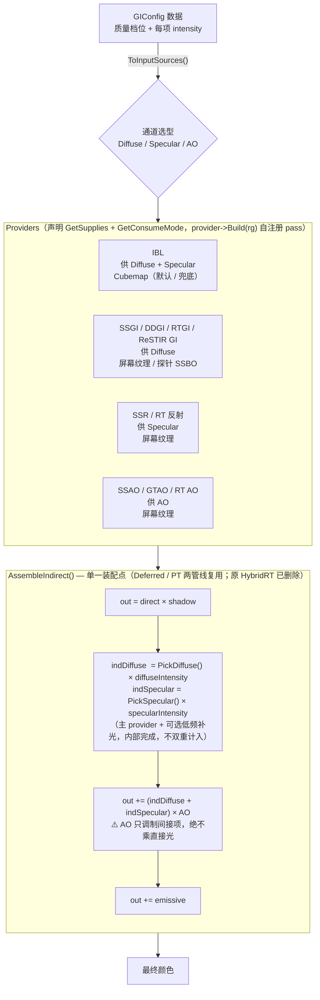

# HugEngine 全局光照（GI）实现分析与架构优化方案

> 日期：2026-09-08（内容核对更新：2026-09-21）
>
> 说明：本文由三份文档按逻辑顺序（**现状分析 → 架构选型 → 工程落地**）合并而成：
> 1. `HugEngine全局光照GI实现分析与优化建议.md`（现状盘点 + 正确性缺陷 + 优化建议 + 工业界缺口）
> 2. `HugEngine GI架构优化与选型方案.md`（三层模型与 5 个 Phase 概要设计 + 第八章修订）
> 3. `HugEngine GI架构优化-详细落地方案.md`（工程落地细化）

## 目录

- 第一部分 · GI 实现分析（现状盘点 + 正确性缺陷 + 优化建议 + 工业界缺口）
- 第二部分 · 架构优化与选型方案
- 第三部分 · 详细落地方案

---

# 第一部分 · GI 实现分析（现状盘点 + 正确性缺陷 + 优化建议 + 工业界缺口）

> 范围：`Engine/Render/GI/` 光栅化 GI 子系统 + `Engine/Render/RT/` 硬件光追路径 + `Engine/Render/PostProcess/SSAO`
> 说明：本部分在 `docs/HugEngine引擎介绍/HugEngine全局光照GI实现原理.md`（实现细节）之上，聚焦"现有实现的正确性缺陷与优化空间"。

---

## 一、现有 GI 技术清单

工程里 GI 分三套并行体系：**光栅化 GI 子系统**（`Engine/Render/GI/`，`GI_*` 类统一继承 `IGlobalIllumination`，并由 `IGIProvider` 包装成帧图可遍历的 Provider）、**硬件光追路径**（`Engine/Render/RT/`，继承 `RTEffectPass`），以及**虚拟化几何 GI（Lumen）**（`Engine/Render/GI/LumenProvider.h` + `Engine/Render/Lumen/`）。

| # | 技术 | 文件 | 原理 | 反弹 | 动态性 | 状态 |
|---|---|---|---|---|---|---|
| 1 | **GI_IBL** | `GI/GI_IBL.cpp` | Split-Sum 近似：辐照度图 + 预滤波图 + BRDF LUT | 环境光 | 天空盒变化时 | ✅ 完整 |
| 2 | **GI_SSGI** | `GI/GI_SSGI.cpp` | 屏幕空间半球采样 + 深度可见性 + 前帧 HDR 作 `L_in` | 1 次 | 每帧 | ✅ |
| 3 | **GI_SSR** | `GI/GI_SSR.cpp` | Hi-Z 层次 march（含线性回退）镜面反射 | 1 次 | 每帧 | ✅ |
| 4 | **GI_RSM** | `GI/GI_RSM.cpp` | 光源 POV 渲染 VPL（3 附件）+ 半分辨率 16 点 Poisson 盘求和 | 1 次 | 每帧 | ✅ |
| 5 | **GI_DDGI** | `GI/GI_DDGI.cpp` | 探针网格 + 二阶 4 系数 SH 辐照度 + 时间混合 | 多帧累积 | 每帧 | ✅ |
| 6 | **RTGIPass** | `RT/RTGIPass.cpp` | 硬件光追余弦半球采样 1 次反弹 | 1 次 | 每帧 | ✅ |
| 7 | **SSAO / GTAO** | `PostProcess/SSAO.cpp` | 半球采样环境光遮蔽（GTAO 为地平线切片，同 pass 双模式）| — | 每帧 | ✅ |
| 8 | **Lumen** | `GI/LumenProvider.h` + `Lumen/` | Mesh SDF + Surface Cache + Screen Probe + Radiance Cache | 多帧累积 | 每帧 | 🚧 在建（骨架已接入层栈）|

`GIMode` 枚举中 **VXGI（体素锥追踪）和 ReSTIR GI 仍是占位，无实现类**（`ReSTIRPass` 实现的是直接光照 DI 重采样）。

## 二、各技术现状要点

- **IBL**：辐照度 32²、预滤波 128²×5 mip、BRDF LUT 512²；用光栅化全屏三角形逐面 offscreen pass 生成（共 37 个 pass = 辐照度 6 面 + 预滤波 5 mip×6 面 + BRDF LUT 1），仅在 `m_Dirty` 时重建。⚠️ **BRDF LUT 的 Smith `k` 值存疑**：`IBL_BRDF_LUT.frag.slang:49-50` 是 `a = roughness*roughness; k = a*a*0.5;`，实际展开为 `k = roughness⁴/2`，比 Karis/UE4 IBL 标准的 `k = roughness²/2`（`a=roughness²` 时 `k=a/2`）**多平方了一次**。高粗糙度下几何遮蔽项偏小、间接高光偏亮，建议对照参考实现核查是否为笔误。
- **SSGI**：采样核 32 方向（CPU 固定种子生成，`kSSGIKernelSize = 32`）、默认 16 采样/半径 1.0；`halfRes` 可半分辨率；降噪链 `[Denoise@信号分辨率] → [Upscale]`（步骤 34 起半分辨率也降噪）；参数走 UBO（720 字节超 push constant 256 上限）。
- **SSR**：默认 **Hi-Z 层次 march**（屏幕空间 DDA，`useHiZ = true`），另有线性回退路径；`maxSteps ≥ 256`、`thickness = 场景对角线×0.0025`（场景尺度参数，帧图推导）；半分辨率 + 空间降噪（`SpatialDenoiseAux`）；无时域重投影。
- **RSM**：512² 光源 POV **三 MRT**（世界位置 / 编码法线 / VPL 出射辐射度 `L_v`）；消费端为**半分辨率独立 pass**（`RSM_Indirect`，16 点 Poisson 盘），VPL 采样缩放由光锥半宽推出（`RSMVplScale`），不再是经验常数。
- **DDGI**：二阶 4 系数 SH（`4×float4/探针`）、32 Fibonacci 球面采样、`blendAlpha=0.85`；网格默认按场景包围盒**自动拟合**（`autoFitGrid`，字段默认 8×4×8/cellSize 3.0 仅为回退值）；三线性插值消费；辐射度来源优先级为 Screen Probe → 光追 march → RSM → IBL 辐照度（不再采前帧 HDR）。
- **RTGI**：**每轴 /4（= 总 1/16 像素）**分辨率、SPP 默认 **1**（shader 端 clamp 1–8、cpp 端 clamp 1–16，见 `RTGIPass::Execute` 与 `RT_GI.rgen.slang` 的 `min(g_PC.sampleCount, 8u)`）、miss 回退 DDGI 探针（**仅当 DDGI 不在漫反射层栈时**）、CVar 热更新。作为 GI 源由 Deferred 层栈消费（`RTEffectProvider::Effect::GI` 注册），RT 输出纹理在本帧产出时绑给 Lighting（`DeferredPipeline_FrameGraph.cpp` 的 `in.rtGI = rtGITex`）。
- **SSAO**：64 采样核 + 4² 噪声旋转 + blur。

---

## 三、优化建议（按优先级）

> **状态标注（2026-09-21 核对）**：本节是 2026-09-08 的缺陷盘点。下列第 1–7、10–13 项已修复或改造，第 14 项的一半（余弦加权）已按标准做法落地；第 8 项（GBuffer 采样数）与第 15 项（IBL 用 Compute 生成）至今仍然成立，第 9 项部分成立。每项保留原始分析，并在标题后标注现状。

### 🔴 第一优先级：正确性 Bug

**1. SSGI 采样点投影用了错误的矩阵** —— ✅ **已修复**

```hlsl
// 当时（错误）：u_Proj 实际是逆投影矩阵，却用它把 view-space 采样点投影到屏幕
float4 off = mul(u_Proj, float4(sPos, 1.0)); off.xyz /= off.w;  // ❌
```

`u_Proj` 曾被赋值为 `glm::inverse(perspective...)`（**逆**投影，clip→view）：用它重建 view 位置是对的，把 view-space 采样点 `sPos` 再乘**逆**投影矩阵去求屏幕 UV 则是数学错误的——应该乘**正向**投影矩阵。这导致可见性检测采样的屏幕位置 `suv` 是错的，SSGI 一度处于"半残"状态。

**现状**：UBO 里 `invProj` / `proj` / `view` 三个矩阵各自独立（`GI_SSGI.cpp` 的 `Render` 填充 `ub.invProj/ub.proj/ub.view`），着色器重建用逆矩阵、投影用正矩阵（`SSGI.frag.slang` 的 `mul(u_Proj, float4(sPos,1.0))`），法线用 `u_View` 从世界空间转到 view 空间。

**2. DDGI 网格参数在 C++ 与 Shader 里硬编码重复，且不同步** —— ✅ **已修复**

```hlsl
// 当时：RT_DDGI.slang 自持常量
static const uint kDDGI_GridX = 8; ... static const float3 kDDGI_Origin = float3(-10,-2,-10);
```

而 `GI_DDGI.h` 的 `gridX/gridY/gridZ/gridOrigin/cellSize` 是可变运行时字段；一旦 C++ 侧改网格，`SampleDDGI` 的三线性插值索引与钳位边界就会错位。

**现状**：`RT_DDGI.slang` 不再自持常量，网格参数由 includer 声明为 cbuffer（`u_DDGIGridOrigin` / `u_DDGIGridSize`，与 `GI_DDGI::ProbeGridUniform` 前两个 float4 一致）——Deferred 侧走 `ShaderTypes` 的 `kGPUBinding_DDGIGridParams = 6`，RTGI 侧走 set0 的 binding 8。**三处参数源已收敛为一处**。

**3. RSM 无条件索引 `u_ShadowData[0]` 且守卫字段选错** —— ✅ **已修复**

```hlsl
// 当时（逻辑 UB，非内存越界）：
if (iblIntensity > 0.0 && u_ShadowData[0].shadowParams.z > 0.0) {
```

`u_ShadowData` 是 `StructuredBuffer<GPUShadowData>`，C++ 侧恒按 `MAX_SHADOWS` 分配，故 `[0]` 始终在界内；真正的缺陷是**读脏数据 + 守卫字段选错**：`lightCount==0` 时该元素保留上一帧残留，`shadowParams.z` 为脏值可能误触发；首个 shadow 非方向光时又会用 spot/point 的 VP 矩阵去采样方向光 RSM 渲染的图。

**现状**：RSM 求和已搬进共享的半分辨率 pass（`GI/RSM_Indirect.frag.slang`），该 pass 由帧图按 `rsmPassRegistered && rsmDirLightValid` 门控（方向光存在且投影才注册），光源类型与阴影强度在 C++ 侧判定；`DeferredLighting.frag.slang` 不再读 `u_ShadowData[0]` 走 RSM 分支，只对 `u_RSMIndirect` 做一次采样。原建议的"校验 `shadowParams.w`"由帧图的 `rsmDirLightValid` 谓词承担。

### 🟠 第二优先级：性能

**4. 光栅化 GI 全部跑在全分辨率，`GISettings.halfRes` 从未接线** —— ✅ **已接线**

`GlobalIllumination.h` 的 `halfRes`（以及 `GITypes.h` 的 `GIConfig::halfRes`）现在真正生效：`GI_SSGI` / `GI_SSR` 用 `halfResW/halfResH` 决定输出纹理尺寸，`SSAO` 有同名的半分辨率尺寸，帧图在构图前调 `SyncOutputSize()` 让开关当场生效；Lighting 侧线性升采样，SSGI/SSR 的降噪链按信号分辨率自适应（`[Denoise@信号分辨率] → [Upscale]`）。

**5. DDGI 探针用全分辨率 HDR 采样低频辐照度** —— ✅ **已改造（该路径已不存在）**

```hlsl
// 当时：
float3 radiance = u_PrevHDR.SampleLevel(u_LinearSampler, uv, 0).rgb;
```

`GI_DDGI` 曾自持 `m_PrevHDR` + 下采样 pass，256 探针 × 32 方向 = 8192 次全分辨率 HDR 采样。

**现状**：探针辐射度来源改为世界空间、视角无关的四条路径（Screen Probe → 光追 march → RSM 世界辐射度 → IBL 辐照度），`DDGI.comp.slang` 已不再采样前帧 HDR；前帧 HDR 也收敛成共享组件 `GIRadianceHistory`（帧图 `CaptureRadiance` 一次捕获，供 SSGI 的 `L_in` 等消费者共用），不再各源各拷一份。

**6. SSR 用 64 步线性 march，无 Hi-Z 层级追踪** —— ✅ **已实现**

**现状**：`GI_SSR::useHiZ = true`（默认）时走 Hi-Z 层次 march（屏幕空间 DDA：射线先投影成屏幕段 s0→s1，按 `2^level` 像素步进，穿透则升层、被遮挡则降层，level 0 用世界空间厚度判据细化），`useHiZ = false` 时回退线性 march；`maxSteps` 默认提到 ≥256（场景尺度参数下），Hi-Z 深度金字塔由 `HiZ_Build` 产出并绑到 binding 4。命中判据仍是世界空间厚度带，另加透视校正（屏幕段参数 `t` ≠ 射线参数 `tau`）。

**7. RSM 每像素 25 次 VPL 采样** —— ✅ **已改造**

**现状**：5×5 全分辨率邻域累积已被替换为**半分辨率独立 pass**（`GI/RSM_Indirect.frag.slang`，`RSMIndirect::kDownscale = 2`）+ **16 点 Poisson 盘**（`RSM_VPL_COUNT = 16`）；VPL 采样缩放由光锥半宽推出（`RSMVplScale`）。实测该项从 Lighting 里独占约 0.45 ms 降到 1/4 量级，Lighting 侧只剩一次升采样。

**8. DeferredLighting 一次采样 7 张 GBuffer MRT + 阴影/IBL/RSM/SSGI/SSR/DDGI/AO 全套** —— 仍然成立

`DeferredLighting.frag.slang` 每像素采样 GBuffer A/B/C/Depth/E/F/G 与光照图键，加阴影贴图 + IBL 3 张 + RSM 间接光 + Lumen/SSGI/SSR/AO/DDGI。其中 `u_GBufferE`（worldPos）与 `u_Depth` 在阴影、SSGI、clustered 中重复读取。可考虑合并 GBuffer 通道（如把 metallic/roughness 打包进一个 R8G8B8A8），并让 SSGI/SSR 输出降采样纹理减少后续采样带宽。

**9. 两处 push constant 采样核可下沉为静态常量** —— 部分成立

SSGI 的采样核本身确实是"固定种子生成一次的常量"（`static std::vector<float4> kernel`，只在首次 `Render` 时生成）；但每帧仍要把整个 `ub`（含 `ub.k[32]`）`Map/Unmap` 写进 UBO，所以核数据仍在每帧重传。若要省下这部分，应把核拆到独立的、只写一次的缓冲（或改用 specialization constant），与 SSAO 的一次性 kernel 同做法。

### 🟡 第三优先级：质量与架构

**10. 多种 GI 同时叠加 + 魔法系数，能量不守恒** —— ✅ **已解决（Wave 1 层栈归一化）**

`DeferredLighting.frag.slang` 里曾 IBL + RSM + SSGI/RTGI + DDGI + SSR **全部累加**，靠 `*0.5`（DDGI）、`*0.03`（RSM）等硬编码系数压亮度。

**现状**：三个通道（漫反射 / 镜面 / AO）各持一个**源数组**（`GIBlendParams` UBO，binding 31），合成端按 `GISourceId` 分派采样并做**归一化加权** `Σ(源×w)/Σw`（`mode == 0` 时才是直接相加，仅作 A/B 对照）；IBL / RSM 已变成层栈里的普通源，`*0.5` / `*0.03` 两个魔法系数**在着色器里已不存在**（`GI_DDGI::debugScale` 只用于调试可视化，不参与合成）。强度改由 `giIntensity` / `aoIntensity` 与每源 `weight` 控制。

**11. RTGI 声称"时域累积"但实际没有历史缓冲** —— ✅ **已补齐**

**现状**：RTGI 输出的降噪链由 `RTEffectProvider` 参数化装配：`SetGIPass(pass, temporal, spatial, upscale)` → `[RT_GI_Temporal] → [RT_GI_Denoise] → [RT_GI_Upscale]`（`RTDenoiser` 时域累积 + `Denoiser` 空间滤波 + 亚分辨率重建升采样）。`RT_GI.rgen.slang` 仍用 `frameIndex` 做逐帧抖动供时域累积使用；shader 侧 SPP 上限 8（`min(g_PC.sampleCount, 8u)`）。

**12. DDGI 与 RTGI 双重计入** —— ✅ **已修复（按"源独立"处理）**

**现状**：`RT_GI.rgen.slang` 的 miss 分支在 **DDGI 也在漫反射层栈**时贡献 0——`RTEffectProvider::SetDDGIInStack` 把"DDGI 是否自己就是层栈源"写进 push constant 的 `flags` bit1，rgen 据此决定是否回退 `SampleDDGI`（且回退时要按 `E/π = L` 换算量纲）。归一化合成因此不再把同一份 DDGI 信息按两个槽位的权重计入。同时 RT 输出纹理在本帧产出时**真的绑给了 Lighting**（`in.rtGI = rtGITex`），"RT 纹理恒 nullptr、缺陷未激活"的描述已不成立。

**13. DDGI 探针"屏幕空间采样"导致屏幕外探针永不更新** —— ✅ **已移除屏幕空间依赖**

**现状**：探针辐射度不再来自屏幕空间重投影采样，改为世界空间来源（Screen Probe 的探针辐射度 SH / 光追 march 的 `u_TracedRadiance` / RSM 世界辐射度 / IBL 辐照度），因此不存在"采样点投影到屏幕外就 `continue`、屏外探针只靠历史混合"的问题；Screen Probe 是屏幕空间的，故加入了深度一致性门限与"没有可用屏幕探针就整条继承历史"的处理（`DDGI.comp.slang` 的 `FetchScreenProbe`）。DDGI 仍保留 `blendAlpha` 时间混合与 `updateStride` 分摊，低频时滞是其固有特性。

**14. DDGI SH 投影缺余弦加权 + 评估端 `max(result,0)` 破坏重建** —— 一半已按标准做法处理

**现状**：探针投影得到的是**辐射度** SH（`L_lm = 4π/N·Σ L·Y`，不含 cos），Lambert 余弦波瓣的卷积系数 `A_l` 在**评估端**施加（`RT_DDGI.slang` 的 `kDDGI_SH_A0` / `kDDGI_SH_A1`，`EvalDDGI_SH` 里 `E(n) = Σ_l A_l·L_lm·Y_lm(n)`）——这已是 Ramamoorthi & Hanrahan 的标准形式：不能在投影时乘 cos，因为 cos 依赖评估方向（法线），而探针存储时方向未知。**仍保留**的是评估端的 `max(result, 0)` 负值截断（二阶表示的振铃防护）；若要进一步抑制，可改为 SH 窗口化。另：band 2 已在步骤 30 随 Radiance Cache 的统一表示（二阶 4 系数）一并移除。

**15. IBL 生成是光栅化全屏三角形，可用 Compute 一步替代** —— 仍然成立

37 个 offscreen pass 属一次性开销，问题不大；但若未来做**运行时动态天空盒**（日夜切换），这 37 pass 会每帧跑。届时建议换 Compute Shader（辐照度/预滤波各一个 dispatch，共享内存分块）。

---

## 四、建议的落地顺序

> 完成状态（2026-09-21 核对）：下列 1–5 项**已全部落地**，括号内为落点。

1. ✅ 先修 3 个正确性 bug（SSGI 投影矩阵、DDGI 参数同步、RSM 门控）——低成本、消除隐性错误。（第 1–3 项，见 §三）
2. ✅ 接上半分辨率管线（`halfRes` 落地到 SSGI/SSR/SSAO，RSM 走半分辨率 `RSM_Indirect`）——最大性能杠杆。
3. ✅ SSR 上 Hi-Z（默认路径，含线性回退）。（DDGI 侧原计划的"降采样 HDR 副本"已不需要：探针辐射度来源已改为 Screen Probe / 光追 march / RSM / IBL，不再采样前帧 HDR。）
4. ✅ 统一 GI 叠加策略（三通道层栈 + 归一化加权），去掉魔法系数，解决 DDGI/RTGI 双重计入。
5. ✅ RTGI 的时域累积/降噪链与 DDGI 探针射线 march（`DDGITracePass` + `DDGI_Trace.rgen`）均已实现。

---

## 五、工业界 GI 缺口对比（尚未实现的技术）

> 说明：上文聚焦"现有实现的修正与优化"。本章补充一个更广的视角——对照工业界主流 GI 技术，列出 HugEngine 尚未实现的部分，作为路线图参考。
> 注意：除 `Engine/Render/GI/` 光栅化子系统外，工程另有 `PathTracingPipeline`（全路径追踪，maxBounces=4）+ `ReSTIRPass`（ReSTIR DI）+ `RTDenoiser`（时域降噪）+ `PTAtrousPass`（A-Trous）+ STBN 蓝噪声，因此"多反弹 GI 与降噪栈"已有雏形，不作为缺口。

### 5.1 工业界有、HugEngine 完全空白

#### 预计算 / 烘焙类（离线）
| 技术 | 说明 | 代表 |
|---|---|---|
| Lightmap 光照贴图烘焙 | 离线烘间接光进纹理，运行时零成本 | UE Lightmass、Unity、Bakery |
| 静态 Light / Reflection Probe | 手工放置探针 + 烘焙 SH/cubemap | Unity Light Probe、UE Reflection Capture |
| PRT 预计算辐射传输 | 静态几何 + 动态光照 | 老牌技术 |

#### 体素类实时 GI
| 技术 | 说明 | 代表 |
|---|---|---|
| VXGI 体素锥追踪 | 3D Clipmap 体素化 + 锥追踪 | NVIDIA VXGI（`GIMode::VXGI` 占位）|
| LPV 光传播体积 | RSM 注入 SH + 3D 网格迭代传播 | CryEngine |
| SVOGI 稀疏体素八叉树 | VXGI 稀疏变体 | UE4 |

#### 光追 GI 进阶
| 技术 | 说明 | 差距 |
|---|---|---|
| ReSTIR GI | 时空重采样用于间接光 | 现有 `ReSTIRPass` 是 DI，`GIMode::ReSTIR` 占位 |
| RTXGI | DDGI 商业版：relocation / classification / 可见性 / infinite scroll | 现有 DDGI 缺进阶特性 |
| 多反弹 RT GI | 现有 RTGI 仅 1 次反弹 | PT 管线 4 反弹属离线参考模式 |
| Photon Mapping / PPM | 渐进光子映射 | 经典离线技术 |

#### 全动态混合标杆
| 技术 | 说明 | 状态 |
|---|---|---|
| Lumen（UE5） | Surface Cache + 屏幕追踪 + HW/软光追 + Final Gather | **已落地自研实现**（`GI/LumenProvider.h` + `Engine/Render/Lumen/`：Mesh SDF、Surface Cache、Screen Probe、Radiance Cache），并作为 `GISourceId::Lumen` 接入层栈；与 UE5 完整 Lumen 相比仍在建（详见 `Lumen设计与实现.md`）|

#### 神经 / 学习类（前沿）
| 技术 | 说明 | 代表 |
|---|---|---|
| Neural Radiance Cache (NRC) | 神经网络缓存/预测低采样 GI | NVIDIA 2023 |
| 神经降噪 | transformer 降噪 | DLSS Ray Reconstruction、NRD ReBLUR |
| RTX Neural Shading / Materials | 神经材质/着色压缩 | NVIDIA 2025（实验性）|

### 5.2 已有雏形、缺进阶升级

| 现有 | 升级方向 | 对标 |
|---|---|---|
| DDGI | 探针 relocation / 可见性 / 无限滚动体积 | → RTXGI |
| RTGI（1 bounce）| 时空重采样 + 多反弹 | → ReSTIR GI |
| SSAO / GTAO | 方向遮蔽、GTAO 的地平线搜索已落地；再往上是 HBAO / SSDO | → HBAO / SSDO |
| SSR | Hi-Z 层级追踪已落地；缺时域重投影 | → UE / 寒霜 SSR |
| 降噪栈（RTDenoiser + A-Trous）| SVGF / NRD | 实时光追 GI 配套 |

### 5.3 落地建议（按性价比）

1. **ReSTIR GI**：工程已有 ReSTIR DI 完整基础设施（蓄水池、时域/空间复用、STBN），推广到间接光即实现 `GIMode::ReSTIR`，性价比最高。
2. **DDGI → RTXGI 进阶**：修探针缺陷（可见性、屏幕外更新、relocation），不动现有架构。
3. **SSAO → GTAO**：✅ **已落地**（`GISourceId::GTAO` + `GI/GTAO.frag.slang`，与 SSAO 共用一个 Provider/pass 双模式）。
4. **Lightmap 烘焙**：仅进军移动端/主机静态场景时需要，PC 实时路线可缓。
5. **体素类（VXGI/LPV/SVOGI）与神经类（NRC 等）**：作为长期/研究方向，不在近期工程路线内。

---

# 第二部分 · 架构优化与选型方案

> 本文聚焦：在算法已经足够多的前提下，如何通过**架构层改造**，让多种 GI 算法可以被方便地选取/组合进渲染管线。
> 现状盘点、正确性缺陷与工业界缺口见**第一部分**。

---

## 一、当前架构的根本问题

> **现状更新（2026-09-21）**：本节是方案提出时（2026-09-08）的盘点。其中前两条与第四条的第一半已由 Wave 0/1 解决——`DeferredLighting.frag.slang` 不再硬编码累加、魔法系数已移除，选型改由 `GITypes.h` 的**通道层栈**（`GIChannelStack` 源数组）表达，`rtDiffuseSource` / `rtSpecularSource` / `rtAOSource` 三个 push constant 字段已删除，`halfRes` 已接线。仍然成立的是：`GIMode::VXGI/ReSTIR` 空占位、`GISettings::maxBounces` 未接线，以及 PT 与实时路径之间没有统一入口。

提出时的问题：不是"算法不够"，而是**"选型"散落在各处，没有统一编排层**：

- `DeferredLighting.frag.slang` 把所有 GI **硬编码累加**，靠 `*0.5`、`*0.03` 压亮度；
- 选型靠零散的 push constant（`rtDiffuseSource` / `rtSpecularSource` / `rtAOSource`），每加一种算法就要改 shader + 改 `LightingPass` 绑定；
- 光栅化 GI（`Engine/Render/GI/`）、Hybrid RT（`RTGIPass`）、PT 三条路径**各自为政**，没有一个"挑算法"的统一入口；
- `GISettings.halfRes`、`maxBounces` 定义了但没接线，`GIMode` 枚举里 `VXGI/ReSTIR` 是空占位。

## 二、核心设计原则

1. **按"光照通道"分，而不是按"算法"分** —— 用户选的是"漫反射用谁、镜面用谁"，不是"我要开 DDGI"。
2. **Provider 输出统一契约** —— LightingPass 只消费通道结果，不关心是谁算出来的。
3. **选型 = 数据，不是代码** —— 组合方式放进一个配置结构，CVar / ImGui / 质量档位驱动。
4. **统一能量预算** —— 每个通道一个 `intensity`，消灭散落的魔法系数。
5. **帧图自动编排** —— 每种 GI 是 RenderGraph 的可选节点，配置决定哪些启用。

## 三、目标架构：三层模型

> ⚠️ **修订提示**：本章的"4 个正交通道"模型经代码核对后发现 3 处建模缺陷（见第八章），推荐读者结合第八章的**改良模型**理解本章。本章保留原始设计以呈现演进脉络。

```
┌─────────────────────────────────────────────────────┐
│  第 1 层  GI 通道（GILayer）—— 4 个正交语义槽        │
│  Ambient  │  Diffuse  │  Specular  │  AO             │
├─────────────────────────────────────────────────────┤
│  第 2 层  Provider 实现（统一接口）                    │
│  IBL  SSGI  RSM  DDGI  RTGI  ReSTIRGI  SSR  SSAO ... │
├─────────────────────────────────────────────────────┤
│  第 3 层  组合配置（GIConfig / 质量档位预设）          │
│  Low / Medium / High / Ultra + 运行时 CVar 覆盖       │
└─────────────────────────────────────────────────────┘
```

### 第 1 层：通道抽象

把 GI 拆成 4 个正交通道，每个通道独立选 provider：

```cpp
// 通道语义：对应 LightingPass 里"间接光"的几个正交加项
enum class GILayer : u8 {
    Ambient,     // 无限远环境光（IBL 天空盒）
    Diffuse,     // 间接漫反射
    Specular,    // 间接镜面反射
    AO,          // 环境光遮蔽
};
```

### 第 2 层：统一 Provider 接口（在现有 `IGlobalIllumination` 上收窄）

现有接口已经不错，只需把"输出"收敛成一个标准契约，并声明自己属于哪个通道：

```cpp
// 现有 IGlobalIllumination 已具备 GetMode/GetQuality/GetIndirect*Texture
// 需要补的只是两点：声明通道归属 + 统一强度
class IGlobalIllumination : public IRenderSubsystem {
public:
    [[nodiscard]] virtual GILayer GetLayer() const = 0;      // 本算法属于哪个通道
    [[nodiscard]] virtual float   GetIntensity() const;      // 由 GIConfig 统一注入
    // 输出：统一为"通道纹理"（diffuse/specular/ao），空表示该通道由别人填充
    [[nodiscard]] virtual rhi::IRHITexture* GetChannelTexture() const;
};
```

> `GI_SSR` 现在的 `GetMode()` 复用 `SSGI` 这种 hack 也可以借机理顺：SSR 归 `Specular` 通道，SSGI 归 `Diffuse` 通道。

### 第 3 层：数据驱动的组合配置

这是"方便选取"的核心。选型变成填一个 struct：

```cpp
// 每个通道的 provider 选择（多选一 + 可降级）
struct GILayerConfig {
    GIMode provider  = GIMode::None;   // 主 provider
    GIMode fallback  = GIMode::None;   // 主 provider 不可用（屏幕外/未初始化）时的降级
    float  intensity = 1.0f;           // 通道统一强度（归一化预算）
    bool   enabled   = true;
};

// 全局 GI 配置 = 4 通道 + 质量档位 + 全局预算
struct GIConfig {
    GILayerConfig layers[4];           // Ambient/Diffuse/Specular/AO
    GIQuality     quality = GIQuality::Medium;
    float         globalBudget = 1.0f; // 整帧 GI 能量预算（超了按比例压）
};
```

**质量档位 = 预设表**（一组 `GIConfig` 静态默认值 + 每档算法参数）：

| 档位 | Ambient | Diffuse | Specular | AO |
|---|---|---|---|---|
| Low | IBL | SSGI(半分辨率) | 关 | SSAO |
| Medium | IBL | DDGI | SSR(Hi-Z) | SSAO |
| High | IBL | RTGI + DDGI 兜底 | RT 反射 | GTAO |
| Ultra | IBL | ReSTIR GI | RT 反射 | RT AO |

运行时切换只改一个 `GIConfig`，ImGui 面板直接暴露 4 个下拉框即可，不必碰代码。

## 四、Shader 消费端收敛

`DeferredLighting.frag` 不再写死每个算法，只读 4 个通道输入：

```hlsl
// 之前：硬编码累加 7 种算法 + 魔法系数
// 之后：每个通道一个统一输入，provider 已由 CPU 侧配置选好并填充
float3 color = 直接光照;
color += u_GI_Ambient;                     // provider 已填充（IBL）
color += u_GI_Diffuse;                     // SSGI/DDGI/RTGI/ReSTIRGI 之一已填充
color += u_GI_Specular;                    // SSR/RT反射/IBL prefilter 之一
color *= u_GI_AO;                          // SSAO/GTAO/RT AO 之一
```

`rtDiffuseSource/rtSpecularSource/rtAOSource` 三个零散开关，统一收敛成"通道绑定"——由 CPU 侧 `GIConfig` 决定把哪个 provider 的纹理绑定到 `u_GI_Diffuse` 等 slot，shader 里不再有分支判断。

## 五、帧图自动编排

工程已有 RenderGraph。把每种 provider 的 pass 注册成**可选节点**，`GIConfig` 决定 enable 谁：

```
DeferredFrameGraph::BuildGI(cmd, giConfig):
    if giConfig.layers[Diffuse].provider == DDGI:   add(DDGIProbeUpdate)
    if giConfig.layers[Diffuse].provider == SSGI:   add(SSGIPass)
    if giConfig.layers[Specular].provider == SSR:   add(SSRPass)
    ...
```

选型自动反映到"跑哪些 pass"，未选中的 pass 连资源都不分配（省显存/带宽）。

## 六、结合现有代码的演进路径（不推倒重来）

现有 `IGlobalIllumination` / `GIMode` / `GISettings` / `GIMode::None`（Null Object）已经是对的骨架，只需增量改造：

1. **Phase 1 — 收窄接口**：给 `IGlobalIllumination` 加 `GetLayer()` + `GetIntensity()`，把 SSR 的 mode hack 理顺。改动集中在 `GI/` 目录，风险低。
2. **Phase 2 — 收敛消费端**：`DeferredLighting.frag` 改成 4 通道采样，`LightingPass.cpp` 按 `GIConfig` 绑定通道纹理，替换掉 `rt*Source` 三开关。**这一步就解决了"双重计入"和"魔法系数"两个老问题**。
3. **Phase 3 — 数据驱动**：引入 `GIConfig` + 质量档位预设表，ImGui 暴露 4 通道下拉框 + 档位切换。
4. **Phase 4 — 帧图编排**：把各 provider pass 改为 RenderGraph 可选节点，按配置启用。
5. **Phase 5（可选）— 分层混合**：同通道支持"主 provider + 距离/屏幕外降级"（如 RTGI 中距离 + DDGI 远距离），用 `fallback` 字段表达。

## 七、总结

把"选 GI"从"改 shader 和管线代码"变成"填一个 `GIConfig` 配置"：

- 用 **4 个正交通道**（Ambient / Diffuse / Specular / AO）承载任意算法组合；
- **质量档位预设**绑定默认组合；
- **帧图自动编排**让选型反映到实际执行的 pass；
- 加一种新算法（比如 ReSTIR GI）只需三步：实现 provider、注册到 `GIMode`、加一行档位预设，其余自动生效。

---

## 八、方案修订：从"4 正交通道"到"2 加性间接项 + 单一装配点"

> 结论先行：前七章的**方向正确**（数据驱动选型、Provider 统一接口、帧图条件编排应保留），但核心抽象"4 个正交通道"经代码核对存在 3 处建模缺陷，且**没有击中真正的病根**。本章给出改良模型，不推翻增量精神。

### 8.1 原模型的 3 处建模缺陷（代码佐证）

#### 缺陷 1：4 个通道并不正交，"Ambient=IBL"是错误建模。
`DeferredLighting.frag.slang` 里 IBL **同时**贡献两项：
- `SampleDiffuseSource(GISOURCE_IBL, …)`：`kD * u_IrradianceMap... * albedo`（间接**漫反射**）
- `SampleSpecularSource(GISOURCE_IBL, …)`：`prefiltered * (F*envBRDF.r + envBRDF.g)`（间接**镜面**）

而第三章预设表把 IBL 只放进 `Ambient` 一列。实际上 IBL **不是一个通道**，而是 Diffuse 和 Specular 两项的**默认 provider / 兜底**。同理 **AO 不是加性通道**，它是对间接项的**乘法调制**——把相加与相乘两种运算并列为"正交通道"是概念混淆。

#### 缺陷 2：`GetChannelTexture()` 单纹理契约对非屏幕空间技术不成立。
IBL 输出 cubemap（irradiance + prefilter），DDGI 输出探针 SSBO（`SampleDDGI` 用 worldPos+normal 采样），只有 SSGI/SSR/SSAO/RTGI 是屏幕空间纹理。**恰恰是非屏幕空间的 IBL/DDGI 不适配"统一纹理"契约**——第二章 `LightingInputs` 已不得不把 `ddgiProbeBuffer` 单列，即是此漏抽象的证据。

#### 缺陷 3（最关键）：真正的病根是"光照方程的装配顺序随意"，而非"选谁"。
提出方案时 `DeferredLighting.frag.slang` 的 AO 是这样施加的：
```hlsl
color *= ao * aoVal;   // 当时位于 IBL/RSM 之后、SSGI/DDGI/SSR 之前
```
当时的累加顺序为：直接光 → `*rtShadow` → +IBL(diffuse+spec) → +RSM → **`*AO`** → +SSGI/RTGI → +DDGI → +SSR → +emissive。结果是 **AO 乘到了直接光上（物理错误，AO 只该衰减间接光），又完全漏掉了 SSGI/DDGI/SSR 三个间接项**。这是真实的正确性 bug，而"4 slot 通道"模型**并不能防止它**——它只管"哪个 provider 填哪个 slot"，不管"这些 slot 按什么方程、什么顺序装配"。

> **已修复（§9.2-D / Wave 0.5）**：现在先记下 `directColor`，AO 只以 `aoFactor` 乘在 `(indirectDiffuse * giIntensity + indirectSpecular)` 上，直接光与自发光原样保留（`color = directColor + (indirectDiffuse * giIntensity + indirectSpecular) * aoFactor; color += emissive;`）。本条的历史价值在于：**该缺陷不是"选型"能防住的，只有"装配"能防住**——这正是本章主张单一装配点的依据。

> **原模型抽象了"选型"，却没有抽象"装配（composite）"——而装配才是双重计入、魔法系数、AO 错位这些问题的共同来源。**

### 8.2 改良模型

**目标架构（数据流）**：



> 三条纵向要点：**选型是数据**（`GIConfig` 驱动，不改代码）→ **Provider 声明能力而非固定通道**（IBL 一个 provider 同时供两项）→ **装配在单一 `AssembleIndirect()` 收口**（方程只此一处定义，结构性杜绝双重计入 / 魔法系数 / AO 错位）。

**① 通道模型：2 个加性间接项 + 1 个只调制间接的 AO**

```
IndirectDiffuse    加性；单一主 provider + 可选低频补光（如 DDGI）
IndirectSpecular   加性；单一 provider
AO                 乘法调制，只作用于上面两项，绝不乘直接光
```
- **去掉虚构的 Ambient 通道**；IBL 建模成"Diffuse 与 Specular 两项的默认 provider / fallback"，自然承担二者兜底 → 修正缺陷 1 与预设表错位。
- AO 明确为"间接项调制器" → 修正 `:266` 的 AO 错位。

**② Provider 声明"能力位掩码 + 消费方式"，而非单一 channel**

```cpp
[[nodiscard]] virtual GITermMask   GetSupplies()    const = 0; // Diffuse | Specular（IBL 返回两者）
[[nodiscard]] virtual GIConsumeMode GetConsumeMode() const = 0; // ScreenTexture | ProbeBuffer | Cubemap
```
装配端按消费方式绑定正确的资源类型 → 修正缺陷 2。UI 也能据能力位**只显示合法组合**（避免"SSAO 填进 Diffuse"这类无效项）。

**③ 单一 `AssembleIndirect()` —— 一处定义方程，三条管线复用（本方案的核心）**

把光照方程装配收敛成一个函数，取代散在 `DeferredLighting.frag` 里逐行的 `color +=`：
```
outColor  = directLight * shadow;
float3 indDiffuse  = PickDiffuse()  * diffuseIntensity;   // provider 内部已处理"主+兜底"
float3 indSpecular = PickSpecular() * specularIntensity;
outColor += (indDiffuse + indSpecular) * ao;              // AO 只调制间接项
outColor += emissive;
```
- **结构性消灭双重计入**：RTGI 在 miss 时回退 DDGI 属 `PickDiffuse()` 内部实现细节，装配端只拿到"一份 diffuse"，不可能再加第二次。
- **消灭魔法系数**：`*0.03`/`*0.5` 全变成 provider 归一化输出 + 通道 intensity。
- **两条管线（Deferred / PT）共用同一装配函数**，不再各写一遍——这是原方案未提及、但真正解耦的关键。
  （原第三条 HybridRT 已于 2026-09 删除。）

**④ 用 `CompositePolicy` 表达空间混合，取代单一 `fallback` 枚举**

原第五章 Phase 5 想要"RTGI 中距离 + DDGI 远距离"，但数据模型只有一个 `fallback` 枚举，**只能表达"A 不可用则用 B"（可用性降级），表达不了"按距离/置信度逐像素混合"**。真实 Lumen 式混合需要：
```cpp
enum class CompositePolicy : u8 { Add, DistanceBlend };
struct BlendParams { float nearDist, farDist, transition; };
```
这是唯一值得比原方案"多花一点"之处。

**⑤ 去掉 `globalBudget`**

"所有通道强度之和超 1 就按比例压"（第三章 `GIConfig::globalBudget`）**不是能量守恒**，只是全局亮度旋钮，且会误导使用者以为它保证了物理正确。真正守能量靠"每项单一来源（不重复计）+ 正确 kD/kS 拆分"（`:238` 已有 `kD=(1-F)(1-metallic)`）。删除此假承诺。

**⑥ 帧图：provider 自注册 `Build(rg)`，而非管线里 if/else 枚举**

原第五章 Phase 4 仍是管线文件里 `if (cfg.diffuse==DDGI) add(...)` 逐个枚举。更彻底、也更贴合"加算法只改三处"的目标：
```cpp
for (auto* p : enabledProviders) p->Build(rg, giResources); // 新增技术完全不碰管线文件
```

### 8.3 altitude 判断与采纳优先级

对 HugEngine 这种 **GI 对比实验室 / 学习型引擎**，原方案是合理的低风险增量，**不需要**做成 Lumen 那种"单一 GI 系统内部按距离自选技术"的黑盒——那会牺牲本引擎"并排对比各算法"的核心价值。故建议**不推翻、只修正建模**，按性价比采纳：

| 优先级 | 改动 | 解决的问题 |
|---|---|---|
| 🔴 最高 | 单一 `AssembleIndirect()` 装配点（②③） | 结构性根治双重计入 + AO 错位 + 魔法系数 + 三管线重复 |
| 🔴 高 | IBL 建模为"双项 provider/fallback"，去掉 Ambient 伪通道（①） | 修正预设表与光照方程对不上 |
| 🟠 中 | 能力位掩码 + 消费方式（②）、删 `globalBudget`（⑤） | 补漏抽象、去假承诺 |
| 🟡 按需 | `CompositePolicy` 空间混合（④）、provider 自注册（⑥） | 为 Lumen 式 hybrid 留路 |

> **更激进的替代范式（备选）**：不分固定通道，用单一 `IndirectComposer` + 贡献列表 `{term, resource, sampleMode, weight}`，composer 按 term 求和。比 4 个固定 slot 更灵活、代码更少，能自然容纳体积 GI / 透射 GI 等第 5、6 类；代价是"菜单式选型"的直观性略降。追求扩展性可选此范式；当前"4 下拉框"易用性目标下，上面的改良模型更合适。

---

# 第三部分 · 详细落地方案

> 本部分是前述架构方案的**工程落地细化**：精确到文件、接口签名、结构体、shader 改动与验收标准，可直接据此编码。
> 现状基线见**第一部分**，架构设计见**第二部分**。

---

## 0. 现状基线（方案的前提）

通过代码核对，方案提出时有 4 个关键事实决定方案走向（**2026-09-21 现状标注见每行末尾**）：

| # | 事实 | 位置 |
|---|---|---|
| F1 | **`LightingSource` 枚举 + `LightingInputSources` 结构体已定义但未接线**——`Render` 仍用 33 个位置参数（含 cmd）+ 裸指针推断 | `LightingPass.h`、`LightingPass.cpp`。**现状：已收敛为 `LightingPass::Render(cmd, const LightingInputs&)`（M1.1）；但 `LightingSource` / `LightingInputSources` 这两个类型从未落地（全仓 0 命中），选型实际由 `GITypes.h` 的 `GIChannelStack` 源数组表达** |
| F2 | **GI 是分散成员**：`m_GI`(IBL, `unique_ptr<IGlobalIllumination>`) + `m_RSM` + `m_SSGI`/`m_SSR`/`m_DDGI`(值成员)，`GetGI()` 只返回 IBL，无统一注册表 | `DeferredPipeline.h`。**现状：底层成员仍是分散的（另有 `m_LumenScene`），但已有统一注册表 `std::vector<std::unique_ptr<IGIProvider>> m_GIProviders`（帧图按它遍历）** |
| F3 | **帧图硬编码顺序**：DDGI → SSAO → SSR → DenoiseSSR → SSGI → DenoiseSSGI → IBL → Lighting → DDGI_CaptureHDR，无选型分支 | `DeferredPipeline_FrameGraph.cpp`。**现状：GI pass 已按 Provider 注册表 + `NeedsPass(层栈)` 条件注册（降噪附属链由 `GetAuxPassCount()` 自报），帧图不再为每种源手写；前帧 HDR 捕获改由 `NeedsRadianceHistory()` 门控的 `CaptureRadiance` pass 承担** |
| F4 | **shader 端魔法系数叠加**：IBL + RSM(`*0.03`) + SSGI/RTGI + DDGI(`*0.5`) + SSR 全部累加；DDGI 双重计入为**潜在缺陷**（当时 `DeferredPipeline` 里 RT 指针恒 `nullptr`、`rtDiffuseSource` 恒 0，仅原 `HybridRTPipeline`（该类已于 2026-09 删除；RT 现作为 GI 源由 Deferred 层栈消费）接线后触发） | `DeferredLighting.frag.slang`、`DeferredPipeline_FrameGraph.cpp`。**现状：魔法系数与 `rtDiffuseSource` 已随 Wave 1 层栈合成移除；RT 纹理在本帧产出时真的绑给 Lighting（`in.rtGI = rtGITex`），DDGI 双重计入已按"源独立"修复（`RT_GI.rgen` 的 flags bit1）** |

结论：**骨架已经存在（F1），问题在"接线"**。本方案基于现有骨架增量改造，不重写管线。

---

## 1. 总体路线（依赖图）

```
Phase 1（接口收敛）──► Phase 2（shader 通道化）──► Phase 3（配置驱动）
                                                    │
Phase 4（帧图编排）──────────────────────────────────┘
        │
Phase 5（注册表 + fallback，可独立、最后做）
```

- **Phase 1–2** 是低风险的"接线 + 去魔法系数"，解决 F1/F4，可单独合入。
- **Phase 3–4** 是真正的"方便选取"，落地数据驱动选型与自动编排。
- **Phase 5** 是可选增强（支持主 provider 不可用时的自动降级）。

---

## 2. Phase 1 —— 激活 `LightingInputSources`，收敛 `Render` 签名

### 目标
把 `LightingPass::Render` 的 33 个位置参数打包成结构体，选型信息显式进入 `LightingInputSources`，替换"裸指针推断 rt*Source"。

### 改动文件
- `Engine/Render/Pipeline/LightingPass.h`
- `Engine/Render/Pipeline/LightingPass.cpp`

> **后续演进（M1.1 / 2026-09）**：`Render` 签名已收敛为 `Render(rhi::IRHICommandList* cmd, const LightingInputs& in)`（33 参数 → 2 参数），但落地形态不是本章的 `LightingSource` / `LightingInputSources`（这两个类型全仓 0 命中）：选型由 `GI/GITypes.h` 的 `GIChannelStack`（每通道一个 4 槽源数组）+ `IGIProvider` 注册表表达，强度经 `LightingInputs::giIntensity/aoIntensity` 与 UBO 里的每源权重传递。本章余下内容保留为演进脉络。

### 2.1 扩展 `LightingSource` 枚举（补 ambient 通道 + 预留未来算法）

```cpp
// LightingPass.h —— 现状基础上增量扩展
enum class LightingSource : u8 {
    None = 0,
    // 环境光（无限远）—— 新增，把 IBL 纳入统一选型
    Ambient_IBL,
    // 阴影
    Shadow_CSM, Shadow_RT,
    // 环境光遮蔽
    AO_SSAO, AO_RTAO, AO_GTAO,        // GTAO 预留
    // 镜面反射
    Specular_SSR, Specular_RT,
    // 间接漫反射
    Diffuse_SSGI, Diffuse_RTGI, Diffuse_DDGI,
    Diffuse_RSM, Diffuse_ReSTIRGI,     // RSM / ReSTIR GI 预留
};
```

### 2.2 扩展 `LightingInputSources`（补 ambient、强度、fallback）

```cpp
struct LightingInputSources {
    // ── 4 个正交通道的 provider 选择 ──
    LightingSource ambient  = LightingSource::Ambient_IBL;
    LightingSource shadow   = LightingSource::Shadow_CSM;
    LightingSource ao       = LightingSource::AO_SSAO;
    LightingSource specular = LightingSource::Specular_SSR;
    LightingSource diffuse  = LightingSource::Diffuse_SSGI;

    // ── 低频补光 / 兜底（显式化原 useDDGI 语义）──
    // diffuse 主 provider 之外，可选叠加一个低频 provider（如 DDGI）
    // None = 不叠加。这取代旧的 `bool useDDGI`，并解决"DDGI 无条件 *0.5"问题。
    LightingSource diffuseFallback = LightingSource::Diffuse_DDGI;

    // ── 每通道统一强度预算（取代 shader 魔法系数）──
    float ambientIntensity        = 1.0f;
    float diffuseIntensity        = 1.0f;
    float diffuseFallbackIntensity = 0.5f;   // 对应原 *0.5
    float specularIntensity       = 1.0f;
    float aoIntensity             = 1.0f;
};
```

### 2.3 打包输入结构 `LightingInputs`（取代 33 参数）

```cpp
// 实际纹理/缓冲输入（"是什么"），与 LightingInputSources（"选哪个"）解耦
struct LightingInputs {
    // GBuffer（7 张）
    rhi::IRHITexture* gbA=nullptr, *gbB=nullptr, *gbC=nullptr, *gbDepth=nullptr,
                     *gbE=nullptr, *gbF=nullptr, *gbG=nullptr;
    // 阴影（CSM×3 + Spot）
    rhi::IRHITexture* shadowMap0=nullptr, *shadowMap1=nullptr,
                     *shadowMap2=nullptr, *spotShadow=nullptr;
    // 光源 / 阴影数据 SSBO
    rhi::IRHIBuffer* lightBuffer=nullptr, *shadowBuffer=nullptr;
    // 屏幕空间效果（由 provider 填充，空则用占位）
    rhi::IRHITexture* ssaoTex=nullptr, *ssgiTex=nullptr, *ssrTex=nullptr;
    rhi::IRHISampler* ssgiSampler=nullptr, *ssrSampler=nullptr;
    // DDGI 探针缓冲（低频补光用）
    rhi::IRHIBuffer* ddgiProbeBuffer=nullptr;
    // RT 效果纹理（可选）
    rhi::IRHITexture* rtShadowMask=nullptr, *rtReflection=nullptr,
                     *rtAO=nullptr, *rtGI=nullptr;
    // 聚集着色
    ClusteredShading* clusteredShading=nullptr;
    rhi::IRHIBuffer* lightGridBuffer=nullptr, *lightIndexListBuffer=nullptr;
    std::vector<GPULight>* cachedLights=nullptr;
};
```

### 2.4 收敛 `Render` 签名

```cpp
// 之前：Render(cmd, gbA, gbB, ..., 33 个位置参数)
// 之后：
void Render(rhi::IRHICommandList* cmd,
            const LightingInputs& in,
            const LightingInputSources& src,
            const float4& cameraPos, float iblIntensity,
            u32 lightCount, u32 width, u32 height);
```

### 2.5 内部：由 `src` 派生 rt*Source push constant

```cpp
// LightingPass.cpp —— 替换掉 `rtShadowMask ? 1u : 0u` 这种裸指针推断
lpc.rtShadowSource   = (src.shadow   == LightingSource::Shadow_RT)   ? 1u : 0u;
lpc.rtAOSource       = (src.ao       == LightingSource::AO_RTAO)     ? 1u : 0u;
lpc.rtSpecularSource = (src.specular == LightingSource::Specular_RT) ? 1u : 0u;
lpc.rtDiffuseSource  = (src.diffuse  == LightingSource::Diffuse_RTGI)? 1u : 0u;
```

### 验收标准
- [ ] `LightingPass::Render` 参数从 33 个降到 6 个（`in`/`src` 两结构 + 标量）。
- [ ] `DeferredPipeline_FrameGraph.cpp` 调用点编译通过，行为不变（仅重构）。
  （历史：原 `HybridRTPipeline.cpp` 已删除，无需再改。）

---

## 3. Phase 2 —— shader 通道化 + 强度预算

### 目标
`DeferredLighting.frag` 去掉散落魔法系数，改为每通道显式强度；DDGI 从"无条件叠加"变成"由 `diffuseFallback` 控制"。

### 改动文件
- `Engine/Shader/Shaders/Lighting/DeferredLighting.frag.slang`
- `Engine/Shader/Shaders/ShaderTypes.slang`（`DeferredLightingPushConstant` 结构）

> **后续演进（Wave 0/1 / 2026-09）**：本节目标已达成 —— 魔法系数 `*0.03` / `*0.5` 已从 `DeferredLighting.frag.slang` 移除；`rt*Source` 二选一开关已删除，改为遍历层栈源数组并按 `GISourceId` 分派（`SampleDiffuseSource` / `SampleSpecularSource` / `SourceWeight`）。每通道的源、模式与边缘淡出落在 `GIBlendParams` UBO（binding 31，`GIChannelBlendParams` = 4 槽源数组 + `mode` + `edgeFade` + `furnaceMode`）；每通道强度落在 push constant 的 `giIntensity` / `aoIntensity`。DDGI 是否参与不再由 `diffuseFallback` 决定，而由"漫反射层栈里有没有 DDGI"决定。

### 3.1 push constant 增加每通道强度字段

```hlsl
// ShaderTypes.slang —— DeferredLightingPushConstant 追加
struct DeferredLightingPushConstant {
    // ... 现有字段 ...
    // 新增：每通道统一强度预算
    float4 giIntensity;   // x=ambient, y=diffuse, z=diffuseFallback, w=specular
    float  aoIntensity;   // AO 通道强度
};
```

### 3.2 消费端去魔法系数

```hlsl
// 之前：
//   color += rsmIndirect * 0.03 * iblIntensity;      // 魔法系数
//   color += ddgi * 0.5;                              // 魔法系数

// 之后：
// RSM 作为 diffuse 可选 provider（src.diffuse == Diffuse_RSM 时生效）
if (g_PC.diffuseSource == DIFFUSE_RSM) {
    color += rsmIndirect * g_PC.giIntensity.y;
}
// DDGI 作为 diffuseFallback（默认叠加，但强度可配、可关）
if (g_PC.diffuseFallbackEnabled) {
    color += ddgi * g_PC.giIntensity.z;
}
// SSGI/RTGI 主 diffuse
color += rtGI.rgb * g_PC.giIntensity.y;
// 镜面
color += rtRefl.rgb * g_PC.giIntensity.w;
// AO
color *= ao * aoVal * g_PC.aoIntensity;
```

### 3.3 用枚举常量替代裸 `rt*Source` 判断

把 `rtDiffuseSource`（0/1 二选一）升级为枚举编码的 `diffuseSource`（可表达 SSGI/RTGI/RSM/DDGI/None 多值），shader 里用 `switch` 或 `if` 分支选择，而非布尔。

### 验收标准
- [ ] 魔法系数 `*0.03`、`*0.5` 从 shader 移除，全部由 push constant 强度驱动。
- [ ] `useDDGI` 语义由 `diffuseFallback` + `diffuseFallbackEnabled` 表达，关掉后 DDGI 贡献严格为 0（消除双重计入）。

---

## 4. Phase 3 —— `GIConfig` 数据驱动 + 质量档位 + ImGui

### 目标
选型彻底数据化：一个 `GIConfig` 承载全部组合，质量档位预设绑定默认组合，ImGui 暴露 4 个通道下拉框。

### 改动文件（新增）
- `Engine/Render/GI/GIConfig.h`（新增）
- `Engine/Render/GI/GIConfig.cpp`（新增：质量档位预设表）

> **后续演进（P0/D2）**：GI 数据模型已下沉到 `Engine/Render/GI/GITypes.h`（RHI-free，只依赖
> `Core/Types.h`）；`GIConfig.cpp` 已删除（`GIConfigFromPreset` 转为 `inline`），
> `GIConfig.h` 与 `GIRegistry.h` 两个转发头也已移除。当前状态见
> 《HugEngine GI架构与开发计划.md》（已归档到 `docs/已实现功能/` —— 该计划内的任务已全部完成）。

### 4.1 定义 `GIConfig`

```cpp
// GIConfig.h —— GI 组合配置（数据驱动选型的核心）
struct GIConfig {
    // 4 通道 provider（直接复用 LightingPass 的 LightingSource，避免双份枚举）
    LightingSource ambient  = LightingSource::Ambient_IBL;
    LightingSource diffuse  = LightingSource::Diffuse_SSGI;
    LightingSource diffuseFallback = LightingSource::Diffuse_DDGI;
    LightingSource specular = LightingSource::Specular_SSR;
    LightingSource ao       = LightingSource::AO_SSAO;

    // 强度预算
    float ambientIntensity  = 1.0f;
    float diffuseIntensity  = 1.0f;
    float diffuseFallbackIntensity = 0.5f;
    float specularIntensity = 1.0f;
    float aoIntensity       = 1.0f;

    // 全局预算（所有通道强度之和超 1 时按比例压）
    float globalBudget = 1.0f;

    GIQuality quality = GIQuality::Medium;

    // 便捷转换：→ LightingInputSources（供 LightingPass 消费）
    LightingInputSources ToInputSources() const;
};
```

### 4.2 质量档位预设表

```cpp
// GIConfig.cpp —— 静态预设，ImGui / CVar 切换只需改一个 GIConfig
static const GIConfig kGIPresets[4] = {
    // Low   —— 移动/入门：IBL + 半分辨率 SSGI + SSAO
    { Ambient_IBL, Diffuse_SSGI, None, None, AO_SSAO,
      1.0f, 1.0f, 0.0f, 0.0f, 1.0f, 1.0f, GIQuality::Low },
    // Medium —— IBL + DDGI + SSR + SSAO
    { Ambient_IBL, Diffuse_None, Diffuse_DDGI, Specular_SSR, AO_SSAO,
      1.0f, 0.0f, 0.8f, 1.0f, 1.0f, 1.0f, GIQuality::Medium },
    // High   —— IBL + RTGI(主) + DDGI(兜底) + RT 反射 + RT AO
    { Ambient_IBL, Diffuse_RTGI, Diffuse_DDGI, Specular_RT, AO_RTAO,
      1.0f, 1.0f, 0.4f, 1.0f, 1.0f, 1.0f, GIQuality::High },
    // Ultra  —— IBL + ReSTIR GI + RT 反射 + RT AO
    { Ambient_IBL, Diffuse_ReSTIRGI, None, Specular_RT, AO_RTAO,
      1.0f, 1.0f, 0.0f, 1.0f, 1.0f, 1.0f, GIQuality::Ultra },
};

GIConfig GIConfig::FromQuality(GIQuality q) { return kGIPresets[(int)q]; }
```

### 4.3 管线持有 `GIConfig` 而非零散 bool

`DeferredPipeline` 持有一个 `GIConfig m_GIConfig`，每帧从 `m_GIConfig.ToInputSources()` 得到选型，再据选型 enable/disable 各 GI 子系统。
（原文还列了 `HybridRTPipeline`；该类已于 2026-09 删除。）

### 4.4 ImGui 面板

暴露 4 个通道 `Combo`（枚举下拉）+ 质量档位 `Combo` + 每通道强度 `SliderFloat`。改动即改 `m_GIConfig`，下帧生效。

### 验收标准
- [ ] 切换质量档位只改一个 `GIConfig`，无需重建 PSO。
- [ ] ImGui 可任意组合 4 通道 provider 并实时生效。

---

## 5. Phase 4 —— 帧图自动编排

### 目标
`DeferredPipeline_FrameGraph.cpp` 里硬编码的 GI pass 顺序，改为按 `GIConfig` 条件注册。

### 改动文件
- `Engine/Render/Pipeline/DeferredPipeline_FrameGraph.cpp`

> **后续演进（Wave 2 / P4 / 2026-09）**：帧图已改为按 Provider 注册表遍历 —— `DeferredPipeline::Initialize` 把 Provider 注册进 `m_GIProviders`（顺序即遍历顺序），帧图对每个 Provider 询问 `NeedsPass(层栈)` 决定是否注册 pass，附属降噪链由 `GetAuxPassCount/Name/Input/Output` 自报。因此"未选中的源不注册 pass"这一判据已经成立；差别是判定不在管线文件里写 `if (cfg.diffuse == …)`，而是 Provider 自己声明。

### 5.1 用 `shouldRun` 判定包装每个 GI pass

```cpp
// 之前：无条件依次 add（DDGI → SSAO → SSR → SSGI → ...）
// 之后：按配置决定是否注册节点

const auto& cfg = m_GIConfig;

// DDGI 探针更新：仅当 diffuse 或 diffuseFallback 用到了 DDGI
if (cfg.diffuse == LightingSource::Diffuse_DDGI
    || cfg.diffuseFallback == LightingSource::Diffuse_DDGI) {
    rg.AddPass("DDGI_Update", ...,
        [&](auto c) { m_DDGI.Update(...); m_DDGI.Render(c); });
}

// SSGI：仅当 diffuse == Diffuse_SSGI
if (cfg.diffuse == LightingSource::Diffuse_SSGI) {
    rg.AddPass("SSGI", ..., [&](auto c) { m_SSGI.SetInputs(...); m_SSGI.Render(c); });
    rg.AddPass("SSGI_Denoise", ...);
}

// SSR：仅当 specular == Specular_SSR
if (cfg.specular == LightingSource::Specular_SSR) { ... }

// RSM：仅当 diffuse == Diffuse_RSM
if (cfg.diffuse == LightingSource::Diffuse_RSM) { ... }
```

### 5.2 Lighting 节点消费 `GIConfig`

```cpp
rg.AddPass("Lighting", ..., [&, w, h](auto c) {
    // IBL：ambient 通道为 IBL 时才生成 + 绑定
    if (cfg.ambient == LightingSource::Ambient_IBL && giIBL) {
        if (giIBL->IsDirty()) giIBL->Render(c);
        m_Lighting.SetIBLTextures(...);
    }
    LightingInputs in = BuildInputs();          // 汇总各 provider 输出
    m_Lighting.Render(c, in, cfg.ToInputSources(), ...);
});
```

### 验收标准
- [ ] 未选中的 GI pass 不注册、不分配资源（RenderDoc 里看不到对应 pass）。
- [ ] 切换 provider 后帧图节点数量随之变化。

---

## 6. Phase 5（可选）—— Provider 注册表 + 自动降级

### 目标
支持"主 provider 不可用（屏幕外/未初始化/设备不支持）时自动降级到 fallback"，为分层混合打基础。

### 改动文件
- `Engine/Render/GI/GIRegistry.h`（新增）

> **后续演进（P0/D2）**：`GIRegistry` 已并入 `Engine/Render/GI/GITypes.h`，本转发头已移除。

### 6.1 注册表 + 工厂

```cpp
// 按 GIMode 注册 provider 工厂，运行时按配置实例化/查询
class GIRegistry {
public:
    using Factory = std::function<std::unique_ptr<IGlobalIllumination>()>;
    void Register(GIMode m, Factory f);
    std::unique_ptr<IGlobalIllumination> Create(GIMode m);
    bool IsAvailable(GIMode m, rhi::IRHIDevice* dev);  // 设备能力查询
};
```

### 6.2 降级链

```cpp
// 每帧解析：主 provider 不可用 → 沿 fallback 链降级
LightingSource ResolveSource(LightingSource primary, const GIRegistry& reg, rhi::IRHIDevice* dev) {
    if (reg.IsAvailable(primary, dev)) return primary;
    return FallbackOf(primary);   // 预定义降级表，如 RTGI→DDGI→SSGI→None
}
```

### 验收标准
- [ ] 不支持的设备上，High 档自动落到 Medium 档的 provider 组合。

---

## 7. 数据流总览（改造前后）

**改造前**：管线代码硬编码"跑哪些 pass + 传哪些纹理"，shader 硬编码"叠加哪些 + 系数多少"。

**改造后**：

```
GIConfig（数据）
   │  ToInputSources()
   ▼
LightingInputSources（4 通道选型 + 强度）
   │
   ├──► 帧图编排：按选型 add/跳过 GI pass（Phase 4）
   │
   └──► LightingPass::Render(in, src)（Phase 1）
            │  push constant：通道强度 + 枚举 source（Phase 2/3）
            ▼
        DeferredLighting.frag：读通道、按枚举选 provider、乘通道强度（无魔法系数）
```

---

## 8. 验收标准汇总（跨 Phase）

| Phase | 验收要点 |
|---|---|
| 1 | `Render` 33 参数 → 6 参数；调用点行为不变 |
| 2 | 魔法系数移除；DDGI 可显式关闭；diffuse 多 provider 枚举化 |
| 3 | `GIConfig` 驱动；质量档位切换只改一份配置；ImGui 实时组合 |
| 4 | 未选中的 GI pass 不注册不分配；帧图节点数随选型变化 |
| 5 | 主 provider 不可用自动降级 |

---

## 9. 建议的合入顺序与风险

1. **Phase 1 + 2 一起合**（重构 + 去魔法系数）：纯内部改动，行为等价，风险低，先打地基。
2. **Phase 3 + 4 一起合**（数据驱动 + 自动编排）：对外可见的行为变化（ImGui 选型），需在 `06.GILab` sample 里验证各档位组合。
3. **Phase 5 独立合**：纯增量，不影响前四项。
