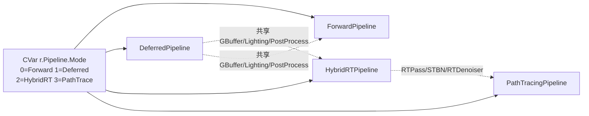

# HugEngine 渲染管线实现分析

> 基于 `Engine/Render/Pipeline` 四个管线全部源码的逐行分析（2026-08-19），
> 覆盖公共基础设施（RenderGraph / GPU Scene / ShaderTypes / 粒子 / Profiler / PSO 预热 / 热重载）。
> 架构总览见 [HugEngine架构UML文档.md](HugEngine架构UML文档.md)。

---

## 目录

1. [四个管线速览](#1-四个管线速览)
2. [管线切换与生命周期](#2-管线切换与生命周期)
3. [公共基础设施](#3-公共基础设施)
4. [ForwardPipeline](#4-forwardpipeline前向--forward)
5. [DeferredPipeline](#5-deferredpipeline延迟--gpu-driven)
6. [HybridRTPipeline](#6-hybridrtpipeline光栅--硬件rt)
7. [PathTracingPipeline](#7-pathtracingpipeline全路径追踪--restir)
8. [跨管线已知问题汇总](#8-跨管线已知问题汇总)

---

## 1. 四个管线速览

| 维度 | ForwardPipeline | DeferredPipeline | HybridRTPipeline | PathTracingPipeline |
|---|---|---|---|---|
| 源码规模 | .cpp 1009 行 + FG 226 行 | .cpp 444 行 + FG 737 行 | .cpp 952 行 | .cpp 595 行 |
| 定位 | 前向 PBR + Forward+ 聚集着色 | GBuffer + Lighting 主管线，GPU Driven | 光栅 GBuffer + 硬件 RT 替代屏幕空间效果 | 全路径追踪（阶段 A）+ ReSTIR DI（阶段 B） |
| 阴影 | 光栅 ShadowSystem（CSM×3/Point/Spot） | 同左 | RT 阴影（1 SPP 硬 / 4 SPP 软，半分辨率） | 无独立阴影（路径内直接光照） |
| GI | IBL + RSM | IBL + RSM + SSGI/SSR/DDGI + SSAO | RT GI + DDGI（中距离 RT + 远距离探针叠加） | 路径追踪天然 GI |
| AA | 运行时切换 AA_None/FXAA（仅非 RG 路径） | TAA（HDR 空间）+ SMAA/FXAA（LDR） | FXAA 强制启用 | FXAA（SDR 交换链下） |
| CPU 并行 | MTCR：≤8 Secondary CB 并行录制 | AsyncCompute（帧首连续 Compute 前缀） | 同 Deferred | 同 Deferred |
| GPU 驱动 | GPUCulling + ExecuteIndirect | GPUCulling（单阶段/两阶段/PTG）+ DGC 可选 | 同 Deferred | 无（全 RT） |
| Shader 热重载 | ✅ PBR.vert/frag | ❌ | ❌ | ❌ |
| 使用方 | 02.Cube mode0 / Editor / 03.Sponza | 02.Cube mode1 / 04.Deferred | 02.Cube mode2 | 02.Cube mode3 |



---

## 2. 管线切换与生命周期

切换机制在 `Samples/02.Cube/02.Cube.cpp`：

1. **四个管线启动时一次性全部 `Initialize`**（02.Cube.cpp:306-327），常驻整个应用生命周期，**不是每帧 switch 重建、也不是惰性重建**；退出时统一 `Shutdown()`（02.Cube.cpp:774-777）。
2. **主循环四分支**（02.Cube.cpp:481-523）：
   - mode 0（Forward）：`NextFrame()` → `shadowSys->SetRenderResources(shadowObjBuf, shadowBuf, descSet)` → `SyncPhysicalSkyToSun` → `shadowSys->Update` → `Render()` → **宿主再开交换链 RenderPass 并调 `RenderToneMapPass()`**（非 RG 路径 ToneMap 在管线外）。
   - mode 1/2/3：`NextFrame()` → `Render()` → 开交换链 RP（LoadOp::Load）供 ImGui 叠加。
3. **无 RT 设备回退**（02.Cube.cpp:573-580）：ImGui Combo 按 `supportsRayTracing` 收缩选项；mode≥2 且无 RT 时强制 `mode=1`（Deferred）并写回 CVar。
4. ImGui Combo 实时改写 CVar（02.Cube.cpp:561-584）。

---

## 3. 公共基础设施

### 3.1 IRenderPipeline 接口（IRenderPipeline.h:28-79）

| 方法 | 语义 |
|---|---|
| `Initialize(IRHIDevice*)` | 创建全部 GPU 资源（PSO/描述符集/纹理/缓冲） |
| `Shutdown()` | 逆序释放 |
| `NextFrame()` | 帧首推进三缓冲槽位（须在 Render 前） |
| `Render(cmd, World&, SceneGraph&, CameraData&, dt)` | 渲染完整一帧 |
| `OnResize(w, h)` | 视口变更 |
| `GetShadowSystem() / GetGI()` | 默认返回 nullptr |
| `ReloadShader(name, spirv)` | 默认返回 -1；仅 ForwardPipeline 覆写 |

### 3.2 RenderGraph 实现（RenderGraph.h/.cpp）

**数据结构**：`ResourceHandle = u32` 索引；三组并行数组 `m_Resources` / `m_ResourceStates` / `m_AliasInfo` 下标对齐。
`PassResource { handle, access }`，`ResourceAccess = None/Read/Write/ReadWrite/UAV`。
`PassNode`：dependencies / order / preBarriers / queueHint / asyncSchedule / requiresSync / crossQueueAcquire / crossQueueRelease。

**Compile 实际六步**（cpp:125-140，注意头文件注释顺序与实际不一致）：

| 步骤 | 算法 |
|---|---|
| 1. BuildDependencies | O(N²) 两两比较：RAW（i.reads∩j.writes）、WAW、WAR 按优先级只记一种 |
| 2. TopologicalSort | Kahn 算法，栈式弹出 |
| 3. DeriveBarriers | 按执行序逐 Pass 推导状态转换；首次使用不产生 Barrier；srcStage 由旧状态反推（DSWrite/RT→ColorAttachmentOutput，UAV→RayTracingShader，否则 FragmentShader） |
| 4. CullDeadPasses | consumed = 所有 reads ∪ 导入纹理 ∪ BackBuffer；writes 全不在 consumed 且 writes 非空 → 裁剪 |
| 5. ApplyAliasing | **贪心 first-fit 区间放置**：按资源 Lifetime{first,last} 与已有 pool 区间重叠判定；纹理大小按 `w*h*8` 粗略估算；offset 仅作"是否别名"标记，`poolId>0` 走 CreateTransientTexture |
| 6. ScheduleAsyncPasses | 仅 queueHint==Compute 且 write 不被后续非 Compute Pass 读 → asyncSchedule=true + InsertCrossQueueBarrier（只转移所有权、不改变布局） |

**ResourceState 转换表**（cpp:106-119）：

| access | isDepth=true | isDepth=false |
|---|---|---|
| Read | DepthStencilRead | ShaderResource |
| Write | DepthStencilWrite | RenderTarget |
| ReadWrite / UAV | DepthStencilWrite | UnorderedAccess |

**Execute 双路径**（cpp:351-563）：帧首 `AdvanceTransientResources()` → 创建/导入资源（别名资源走瞬态）→
`m_AsyncComputeEnabled && HasComputePasses()` 时走 **ExecuteWithAsyncCompute**：
**仅拓扑序开头的"连续 Compute 前缀"**被提到独立 Compute 队列（遇到第一个非 Compute Pass 即停，
`crossedCompute` 规则），`BeginLightweight()`（不推进帧计数）→ 每 Pass 双端 `QueueOwnershipTransfer` →
`SetTimelineSignal/Wait` → computeCmd 异步 `Submit()`；主队列剩余 Pass 与单队列路径一致。

### 3.3 场景数据流（SceneRenderer / GPUScene / MeshBatcher / GPUCulling）

```
SceneRenderer::Prepare（SceneRenderer.cpp:13-91）
  ① ForEach<Mesh/Cube/Sphere> 收集（indexCount==0 跳过，预计算 worldBounds）
  ② JobSystem::ParallelForChunked(total, 64)：每 chunk 局部 vector，
     视锥相交判定（无效 AABB 视为可见），非空时 mutex 锁尾合并；>1024 截断
  ③ Map GPUObjectData[] 全量写入（默认材质兜底 + FillObjectData + materialID）

GPUScene（GPUScene.cpp:40-84）
  Collect：worldMatrix != m_CachedMatrices[idx] 才标 dirty（首帧全量）
  Upload：只 memcpy dirty 索引段

MeshBatcher（MeshBatcher.cpp:12-103）
  Build（仅首帧）：合并全部 StaticVertex 到共享 VB/IB（baseVertex 偏移）
  FillGPUScene：把 {indexCount, 1, baseIndex, baseVertex, 0} 写回 GPUSceneObject

GPUCulling（GPUCulling.cpp）
  单阶段：GPUCull.comp —— 6 平面 AABB 测试 → 8 角点屏幕 AABB → HiZ 保守遮挡
          （首帧跳过 Hi-Z；单阶段恒用全分辨率深度）→ InterlockedAdd 输出
           IndirectDraw（firstInstance=objectID）
  两阶段：Phase1 粗筛输出紧凑候选索引 → BuildHiZPyramid 逐 mip 取最小深度
          → Phase2 用当前帧 Hi-Z 精筛输出 IndirectDraw+DrawCount
  PTG：PersistentCull.comp（PTG_PERSISTENT=0 每帧 Dispatch 1 组 64 线程，
        MAX_ITERATIONS=1024 TDR 保护）
  Readback：帧首 Map DrawCountBuf + 前 count 个 firstInstance → 可见索引（延迟一帧）
```

`IndirectDrawCommand` 20B 匹配 `VkDrawIndexedIndirectCommand`；`GPUSceneObject` 128B 内含
localToWorld + boundsMin/Max + meshIndex/materialIndex/objectID + IndirectDraw 参数（indexCount/firstIndex/vertexOffset）。

### 3.4 ShaderTypes.slang 全结构

**binding 常量**（与 RHI/Types.h 同步）：

| set | binding | 符号 | 用途 |
|---|---|---|---|
| 0 | 0 | GBufferA | Deferred：albedo.rgb + metallic.a |
| 0 | 1 | u_Lights / GBufferB | Forward：GPULight[]；Deferred：normal+roughness |
| 0 | 2 | u_Objects / GBufferC | GPUObjectData[]；Deferred：emissive+ao |
| 0 | 3 | u_ShadowData / Depth | GPUShadowData[]；Deferred：GBuffer 深度 |
| 0 | 4 | ShadowMap0 | CSM cascade0 |
| 0 | 5 | u_Textures[] | bindless 纹理数组（4096，VARIABLE_COUNT） |
| 0 | 6 | u_Samplers[] | bindless 采样器数组 |
| 0 | 7 | u_LightGrid | 聚集着色 grid（Forward 已分配，Deferred 死路径） |
| 0 | 8 | u_LightIndexList | 聚集着色索引列表 |
| 0 | 9 | PointShadow / SpotShadow | 点阴影 Cubemap / Deferred Spot 阴影 |
| 0 | 10/11 | ShadowMap1/2 | CSM cascade1/2 |
| 0 | 12/13/14 | Irradiance/Prefilter/BRDF_LUT | IBL |
| 0 | 15/16 | RSMPosition/RSMFlux | RSM GI |
| 0 | 17/18 | Lights_DL/ShadowData_DL | Deferred Lighting 用光源/阴影 SSBO |
| 0 | 19/20/21 | SSGI/SSAO_DL/SSR | 屏幕空间效果 |
| 0 | 22 | DDGIProbes | DDGI 探针 |
| 0 | 23 | GBufferE | worldPos MRT4 |
| 0 | 24-27 | RT_ShadowMask/RT_Reflection/RT_AO/RT_GI | HybridRT 效果纹理 |
| 0 | 28/29 | GBufferF/G | disneyA/B MRT5/6 |
| 0 | 30 | u_SSBO[] / u_Materials[] | bindless SSBO（最高 binding 承载 VARIABLE_COUNT） |
| 2 | — | kGPUDescSet_Bindless | TLAS 等无绑定资源 |

**Push Constant 结构**（static_assert 校验于 Material.h:49-59）：

| 结构 | 大小 | 关键字段 |
|---|---|---|
| PushConstantData（Forward） | 144B | viewProjMatrix、cameraPosition、lightCount、objectIndex、useInstanceID、iblIntensity、cluster 参数、useClustered、useBindlessMaterial、atmosphere |
| ShadowPushConstant | 80B | lightViewProj、objectIndex |
| GBufferPushConstant | 192B | viewProjMatrix（含 TAA jitter）、prevViewProjMatrix（无 jitter）、objectIndex、useInstanceID |
| DeferredLightingPushConstant | 80B | cameraPosition、lightCount、cluster 参数、useClustered、rtShadow/AO/Specular/DiffuseSource 4 标志、atmosphere |
| RTShadowPushConstant | 112B | invViewProj、cameraPos、dispatchDim、maxShadowDist、shadowFlags（bit1 半分辨率/bit2 软阴影）、lightCount、softSPP |
| RTRayEffectPushConstant | 112B | 同布局；maxDistance/sampleCount/maxRoughness/flags（bit0 半分辨率）——AO/Reflection/GI 复用 |
| PTPushConstant | 176B | invViewProj、prevViewProj、cameraPos、maxBounces、sampleCount、frameIndex、lightCount、skyIntensity、dispatchDim、flags（bit0 ReSTIR/bit1 MIS/bit2 轮盘赌/bit3 NEE） |
| ReSTIRPushConstant | 128B | candidateCount、spatialRadius、spatialSamples、maxDistance、flags（bit0 temporal/bit1 spatial/bit2 historyValid） |

**关键 GPU 结构**：`GPULight` 64B（colorIntensity/directionType/positionRange/coneAngles/shadowIndex/shadowRadius）、
`GPUShadowData` 256B（lightViewProj[3]+shadowParams+splitDistances+cameraForward+pointLightData）、
`GPUObjectData` 176B（worldMatrix+内联材质+materialID+dielectricF0+disneyA/B/C）、
`GPUMaterialData` 112B（去掉 worldMatrix/materialID 的材质参数）、
`PTReservoir` 32B（lightIndex/weightSum/M/W/lightPos——**lightPos 必须 float4**：GLM_FORCE_DEFAULT_ALIGNED_GENTYPES 下 vec3 16B 与 GPU 12B 不匹配）。

### 3.5 材质系统（Material.h）

- `PBRMaterial`：glTF 2.0 PBR + Disney 扩展（ior/specular/specularTint/sheen/clearcoat/anisotropic/subsurface）；
  `dielectricF0 = (ior-1)²/(ior+1)²` CPU 预计算；`disneyA = (anisotropic, subsurface, specular, sheen)`、
  `disneyB = (clearcoat, clearcoatGloss, specularTint.rg)`、`disneyC = specularTint.b`。
- `FillObjectData`（GPUObjectData 每帧）与 `FillMaterialData`（bindless SSBO）字段映射一致，
  差异仅是后者去掉 worldMatrix/materialID。
- 材质 flags：MF_DoubleSided=1<<0、MF_AlphaMask=1<<1、MF_Unlit=1<<2。

### 3.6 粒子系统（ParticleRenderer）

`DispatchCompute` 六步（ParticleRenderer.cpp:467-694）：**回读上帧 renderCount 缓存** →
Init（一次性 deadList 初始化）→ Emit（按 emitCount dispatch）→ Simulate（全量 maxParticles）→
Culling（CPU 提取 6 平面）→ Sort（Bitonic，单 workgroup 512 线程 shared memory）→
`Barrier(ComputeShader→VertexShader, UAV→ShaderResource)`。
**cachedRenderCount 坑**：Render 用缓存值而非读 counters（本帧 CPU 已清零、GPU 未写回）。
每步之间 `PipelineBarrier(ComputeShader→ComputeShader, UAV→UAV)`（Culling→Sort 间无显式屏障，实现简化）。

### 3.7 ProfilerManager

每帧独立 timestampPool（maxPasses×2 + 256 子 scope 槽）；**2 帧延迟回读**
（帧 N 写入 → 帧 N+2 读回，`rbIdx = (frameIndex+2)%3`）；时间戳换算 ns→ms；支持嵌套 PushGroup/PopGroup 与帧预算告警。

### 3.8 PSO 预热现状

- `PrecompileQueuePSO` 全引擎仅 **SSAO.cpp:101,126** 两处注册；
- `StartPSOPrecompile()` 在 DeferredPipeline.cpp:160 **被注释禁用**——本机 Intel Arc B370 驱动
  igc-default64.dll 预编译 worker 线程约 50% 概率 SIGSEGV；
- 帧内限流 `EnqueuePSOCreate` 仅 DeferredPipeline.cpp:188 的 GPL 变体演示使用，`NextFrame` 每帧
  `ProcessPSOCreateQueue(3)`；
- Forward/HybridRT/PathTrace 无任何预热调用。

### 3.9 Shader 热重载（ShaderHotReload）

Win32 `ReadDirectoryChangesW` + OVERLAPPED + 500ms 轮询退出标志 + 200ms debounce；
`CreateProcessA` 直调 slangc（`-target spirv -entry -stage -I -o -Wno-39001`，stderr 临时文件，30s 超时）；
mutex 队列投递主线程 `Poll()` → `IRenderPipeline::ReloadShader`。
**只有 `.vert/.frag/.comp.slang` 触发**（`.rgen/.rchit` 等 RT shader 不触发）；
**只有 ForwardPipeline 实现了 ReloadShader**。

---

## 4. ForwardPipeline（前向 + Forward+）

### 4.1 成员与初始化

- **三缓冲 ×4**：ObjectBuffers（176B×1024）、LightBuffers（64B×8）、ShadowBuffers（256B×4）、
  **ShadowObjBuffers**（阴影专用 ObjectBuffer，避免 CPU 录制时覆盖场景缓冲）；
- **set=0 描述符集布局 17 个 binding**（见 §3.4 表）：Forward 特有的 Lights=1、ShadowMap0=4、
  PointShadow=9、ShadowMap1/2=10/11、IBL=12-14、RSM=15/16；
- **初始化顺序关键点**：ShadowSystem 必须先于描述符集（需要纹理访问器）；bindless 占位纹理 +
  `SetDefaultTexture` + **预注册 materialID=0 的 4 个纹理槽**（无纹理立方体/球体依赖兜底）；
  IBL binding 12/13 初始指向 PointShadowMap 占位（IBL 生成后替换）；
- PBR PSO：push constant 0..144B、depthTest LessEqual D32、单附件 RGBA16_FLOAT、仅 set=0；
- Secondary CB 池：`min(kMaxSecRecordLists=8, JobSystem::GetThreadCount())`；
- **PSO 注册表坑**（ForwardPipeline.cpp:330-365）：push_back 后必须重定位 desc.vertexShader/pixelShader
  到向量内自有副本（移动构造复制了指向栈变量的指针，否则悬空）。

### 4.2 每帧流程

```
cmdList->Begin()
pipeline.NextFrame()                       // 槽位+1、退休 PSO 回收（3 帧延迟）、阴影槽位同步
shadowSys->SetRenderResources(...)         // 注入阴影专用 buffer + 描述符集
SyncPhysicalSkyToSun(world)                // 阴影烘焙前同步太阳方向
shadowSys->Update(ctx)                     // 收集光源 → 合并上传 GPUShadowData
pipeline.Render(...)
   ── RG 路径（m_UseRenderGraph）：RenderGraph 栈对象 + SetProfiler → BuildFrameGraph → Compile → Execute
   ── 非 RG 路径：
      1. 交换链格式 → SetHDREnabled（A2B10G10R10 判定）
      2. 阴影：临时改绑 set[slot] binding2 → ShadowObjBuffer → shadowSys->Render → 恢复
      3. PrepareGI（IBL dirty + RSM）→ BeginHDRPass → BeginFrame → RenderScene → RenderSkybox → EndHDRPass
      4. AA Pass（RG 路径没有 AA pass！）
cmdList->BeginRenderPass(backbuffer) + RenderToneMapPass()   // 宿主执行（非 RG 路径）
```

**RenderScene 数据流**：UpdateTransforms → 组装 framePC → CollectLights → Forward+ 参数 →
GPU 剔除（Readback 上帧结果 → SceneRenderer::Prepare → GPUScene.Collect/MeshBatcher.Build(首帧)/
FillGPUScene/Upload → Dispatch → **恢复 PBR PSO**）→ UploadMaterialBindless → bindless Flush → 绘制。

### 4.3 多线程命令录制（MTCR，ForwardPipeline.cpp:893-933）

- 条件：`m_MultiThreadRecord && !m_SecRecordLists.empty() && totalDraws > 0`；
- 切分：`numThreads = min(池大小, totalDraws)`，按 draw 区间 `chunkSize = ceil(totalDraws/numThreads)`；
- 每 worker：池内**专属** Secondary CB → `BeginSecondary(m_PBR_PSO)`（继承主 RenderPass）→
  SetViewport（Y 翻转）/SetScissor → 每 draw：BindDescriptorSet + DebugLabel + SetPushConstants(144B) +
  VB/IB + DrawIndexed（**每 draw 重绑描述符集**，无惰性绑定）；
- `JobSystem::ParallelInvoke` 等待全部 → 主 CB 按序 `ExecuteSecondary` 合并。各 worker 独占 CB 无锁。

### 4.4 材质 bindless 上传（ForwardPipeline.cpp:567-613）

1. `unordered_map<u32, GPUMaterialData>` 按 materialID 去重（收集源与 SceneRenderer 一致）；
2. **槽位对齐**：SSBO 元素索引 = `materialID >> 2`（每材质占 4 个 bindless 纹理槽），空槽填零；
3. **重建条件**：`!m_MaterialBuffer || newCount != m_MaterialCount`——材质集静态时零上传；
4. `RegisterBuffer` → handle=0 → 每帧 `heap->Flush()` 推 binding 30；
5. shader 分支（PBR.frag.slang:151-162）：`useBindlessMaterial != 0` 读
   `u_Materials[0][obj.materialID >> 2]`，否则读 GPUObjectData 内联字段。
   **当前默认内联（m_UseBindlessMaterial=false 且无 setter）**。

### 4.5 阴影 / GI / AA 集成

- **阴影 binding 2 交换技巧**：阴影渲染期间 set=0 的 u_Objects 临时指向阴影专用 buffer，避免与场景录制覆盖；
  RG 路径用 `RG_WRITE(hdrDepth)` 制造 WAW 假依赖保证 Shadow→Scene 顺序（FG:78）；
- **IBL**：SkyboxComponent 存在且 enabled 时 dirty → Render（辐照度 32²、预滤波 128²×5 mips、
  BRDF LUT 512²）；`UpdateIBLBindings` 更新全部 3 个 set 的 12/13/14；
- **RSM**：需 HasActiveShadows 且 `determinant(lightVP)!=0`；**RSM 用自有独立深度缓冲，不复用 CSM
  ShadowMap 避免布局冲突**；RSM_Generate.frag 硬编码方向光；
- **AA**：默认 AA_None；EditorApp 按 `render.aa_mode` CVar 运行时新建替换（TAA 不支持 Forward）。

### 4.6 坑与备注

| # | 坑 | 位置 |
|---|---|---|
| 1 | `m_UseRenderGraph` 实际默认 **true**，注释写"默认关闭"；所有 sample 显式置 false | ForwardPipeline.h:149-150 |
| 2 | RG 路径缺失 AA pass：m_AntiAliasing 仅非 RG 路径执行 | ForwardPipeline.cpp:796-799 |
| 3 | 非 RG 路径 ToneMap 在管线外（宿主执行） | 02.Cube.cpp:497-498 |
| 4 | PSO 注册表 push_back 后指针悬空坑 | ForwardPipeline.cpp:358-362 |
| 5 | 旧 PSO 延迟 3 帧销毁（GPU 可能仍用其 VkRenderPass） | ForwardPipeline.cpp:399-403 |
| 6 | PCF 纹素大小硬编码 1/2048 | pbr_common.slang:91 |
| 7 | CollectLights 逐光源一次 Map/Unmap | ForwardPipeline.cpp:538-540 |
| 8 | 无光源时注入默认方向光（强度 5，shadowIndex=-1） | ForwardPipeline.cpp:549-558 |
| 9 | `m_UseBindlessMaterial` 无 setter：bindless 材质路径代码完整但不可运行时开启 | ForwardPipeline.h:143 |
| 10 | 物理光照编码 hack：`positionRange.w<0` 标记物理模式（lux/cd + 平方反比） | PBR.frag.slang:103-110 |
| 11 | VS 的 push constant 块只到 useClustered（120B），FS 到 144B——Vulkan 允许按阶段不同布局 | PBR.vert.slang:18-31 |

---

## 5. DeferredPipeline（延迟 + GPU Driven）

### 5.1 成员要点

- **三缓冲 ×4** 同 Forward（Object/Light/Shadow/ShadowObj）；
- **AsyncCompute 三件套**：`m_ComputeCmdList`（**死代码，从未创建**——RenderGraph 内部临时创建
  Compute 命令列表）、`m_CrossQueueFence`（timeline 信号量，首次启用时惰性创建）、
  `m_FrameCounter`（timeline 基址，**每帧 +2**）；`m_ComputePendingSubmit`（未使用）；
- GBufferRenderer / LightingPass / PostProcessChain 三大共享组件；
- **ClusteredShading 死路径**：`m_LightGridBuffer`/`m_LightIndexListBuffer` 声明但**从未分配**；
- GPU Driven：GPUCulling/GPUScene/MeshBatcher + `m_BatchBuilt`（Build 只做一次）；
- DGC：`m_DGCEnabled`（帧内计算）；
- 效果子系统：SSGI/SSR/DDGI/DenoiseSSGI/DenoiseSSR/SSAO（默认关）；
- 相机矩阵缓存 m_PrevViewProj/m_CurrViewProj（velocity + TAA）。

### 5.2 初始化流程（DeferredPipeline.cpp:45-197，严格顺序）

GBuffer → Lighting → 三缓冲 → ShadowSystem（注册 CSM/Point/Spot 三技术）→ GI_IBL try/catch →
GI_RSM try/catch → PostProcessChain → Skybox `SetColorLoadOp(Load)`（天空盒叠加在 Lighting 上）→
SceneRenderer → GPUCulling（+PTG）→ GPUScene → **五个指针注入 GBufferRenderer** →
SSGI/SSR/DDGI/SSAO → `CreateShadowPSO(m_GBuffer->GetLayout())`（阴影 VS 只消费 binding 2，
复用 GBuffer set=0 layout）→ **DGC 初始化**（supportsDGC → InitializeDGC(GBuffer PSO, 2048, 1024)）→
Profiler → 瞬态测试 PSO → 粒子（软粒子场景深度）→ **StartPSOPrecompile 被注释禁用（Intel Arc 崩溃）** →
GPL 变体演示入队（cvGPLVariantTest）。

### 5.3 BuildFrameGraph 全 Pass 详表（DeferredPipeline_FrameGraph.cpp）

帧首：SyncPhysicalSkyToSun → 导入 GBuffer 8 纹理 + HDR + BackBuffer → TAA OnBeginFrame →
GPUScene Collect→(MeshBatcher)→Upload → GPU 剔除 Readback（禁用时 clear 防脏数据）。

| # | Pass | 队列 | reads | writes | 要点 |
|---|---|---|---|---|---|
| 1 | GPU_Cull_Phase1 | **Compute** | 上帧 gbDepth | — | 仅两阶段模式；粗筛→候选索引；末恢复 GBuffer PSO |
| 2 | GPU_Cull | **Compute** | 上帧 gbDepth | — | 单阶段/PTG；末恢复 GBuffer PSO |
| 3 | Shadow | Graphics | — | CSM0-2+Spot | **WAW 假写 gbDepth/gbWorldPos** 强制排在 GB_Clear 前；binding2 切换到 ShadowObjBuffer |
| 4 | GB_Clear | Graphics | — | 7 MRT + gbDepth | DGC 上下文注入（§5.4） |
| 5 | HiZ_Build | Graphics | 当前帧 gbDepth | — | 仅两阶段；逐 mip 下采样取最小深度 |
| 6 | GPU_Cull_Phase2 | Graphics | 当前帧 gbDepth | — | **binding3 被更新回全分辨率深度（覆盖 Hi-Z 绑定）** |
| 7 | DDGI_Update | **Compute** | gbA/gbB/gbDepth | — | 必须在所有 offscreen pass 前；末恢复 Lighting PSO |
| 8 | SSAO | Graphics | — | ssaoOut | 白清除（AO=1.0） |
| 9 | SSR | Graphics | — | ssrOut | 未启用仅清屏 |
| 10 | SSR_Denoise | Graphics | ssrOut | ssrDenoised | |
| 11 | SSGI | Graphics | — | ssgiOut | |
| 12 | SSGI_Denoise | Graphics | ssgiOut | ssgiDenoised | |
| 13 | Lighting | Graphics | gbA/B/C/WorldPos/DisneyA/B + ssgi/ssr | hdrC | IBL 内联生成（dirty）→ 深度屏障 → CollectLights → 聚集缓存 → 全屏 Draw(3) |
| 14 | Skybox | Graphics | gbDepth + hdrC | hdrC | LoadOp=Load；depth=Equal 只画无几何处 |
| 15 | DDGI_CaptureHDR | Graphics | hdrC | — | 拷贝 HDR 供探针采样 |
| 16 | AutoExposure | **Compute** | hdrC | — | reduction → SSBO；末恢复 Lighting PSO |
| 17 | ParticleRender | Graphics | hdrC | hdrC | 每组件一个 Pass；需先 SetPipeline(粒子 PSO) |
| 18 | TransientTest_A/B | Graphics | hdrC | transientA/B | 空操作验证瞬态分配器端到端 |
| 19 | Bloom | Graphics | hdrC | bloomOut | barrier RT→SRV |
| 20 | DOF | Graphics | hdrC | dofOut | 源选择：Bloom > HDR |
| 21 | MotionBlur | Graphics | hdrC | mbOut | 源选择：DOF > Bloom > HDR；velocity 输入 |
| 22 | TAA_Resolve | Graphics | hdrC | — | 输入链：mb > dof > bloom > HDR；HDR 空间运行 |
| 23 | ToneMap | Graphics | — | LDR 或 backBuf | 输入三级选择：TAA > 后处理末端 > HDR；物理曝光 = AE × 2^exposureBias；`needLDR = FXAA‖SMAA‖ColorGrading‖CameraEffects` |
| 24 | ColorGrading | Graphics | ldrTarget | cgOut | |
| 25 | CameraEffects | Graphics | ldrTarget | fxOut | 输入：CG > LDR |
| 26 | SMAA | Graphics | ldrTarget | backBuf | 输入链：FX > CG > LDR；Pass3 直写 BackBuffer |
| 27 | FXAA | Graphics | ldrTarget | backBuf | 仅 SMAA 未启用时 |

帧末：`m_PrevViewProj = m_CurrViewProj`。

### 5.4 DGC 集成（VulkanDGC + GBufferRenderer_GPU）

- 开关四条件与：cvDGC_Enable(0) + IsDGCReady + 间接缓冲存在 + GPUCulling.enabled；
- DGCContext：indirectCommandsLayout/ExecutionSet ← GetDGC*；preprocessBufferAddr/Size；
  maxSequenceCount=2048；sequenceBuffer ← GPUCulling.GetIndirectBuffer()；countBuffer ← GetDrawCountBuffer()；
- 执行：`ExecuteGeneratedCommands`（`vkCmdExecuteGeneratedCommandsEXT`），间接步长 20B
  （5×u32 = VkDrawIndexedIndirectCommand 布局）；
- **坑**：MeshBatcher 的 32B `DGCDrawToken`（含 objectIndex）无任何消费方——实际 DGC 序列走 20B
  IndirectDrawCommand，objectIndex 由 firstInstance=objectID 传递。

### 5.5 AsyncCompute 现状

- 触发：`HasAsyncComputeQueue()`（设备有独立 compute family）→ 惰性创建 fence →
  `rg.SetAsyncComputeEnabled(true)` + `SetCrossQueueFence` + `SetTimelineBase(m_FrameCounter)`，
  每帧 +2 个时间线值；
- **实际只有帧首的 GPU_Cull 真正走 Compute 队列**：DDGI_Update/AutoExposure 虽标记 Compute，
  但按"连续 Compute 前缀"规则（前面隔了 GB_Clear 等非 Compute Pass）落在主队列；
- computeCmd 每帧临时创建 + `BeginLightweight()`（不推进帧计数避免延迟销毁提前触发）；
- `FlushComputeWork()` 为空壳（兼容 04.Deferred 调用）。

### 5.6 GBufferRenderer（CPU/GPU 双策略）

**7 MRT 格式清单**：

| 槽 | 内容 | 格式 |
|---|---|---|
| 0 | Albedo.rgb + Metallic.a | RGBA16_FLOAT |
| 1 | Normal.xyz(×0.5+0.5) + Roughness.a | RGBA16_FLOAT |
| 2 | Emissive.rgb + AO.a | RGBA16_FLOAT |
| 3 | **Velocity.xy**（UV 空间运动矢量） | **RG16_FLOAT** |
| 4 | WorldPos.xyz + dielectricF0.a | RGBA16_FLOAT |
| 5 | DisneyA（anisotropic/subsurface/specular/sheen） | RGBA16_FLOAT |
| 6 | DisneyB（clearcoat/clearcoatGloss/specularTint.rg） | RGBA16_FLOAT |
| 深度 | — | D32_FLOAT（DepthStencil+ShaderResource） |

- **CPU 策略**：不做 GPU 剔除，用上帧 Readback 的 gpuVisibleIndices 过滤 DrawItem（安全校验
  visIndices.size ≤ drawItems.size 且 objectCount 匹配）；每物体独立 VB/IB（未合并）+ push constant
  objectIndex；
- **GPU 策略**：合并 VB/IB + useInstanceID=1（SV_InstanceID）；路径三分：DGC → ExecuteIndirect →
  首帧/异常回退 CPU 逐对象；
- 模式切换走 API `SetGBufferMode(Mode)`（无 CVar）；GPU 模式才执行 MeshBatcher.Build+FillGPUScene。

### 5.7 LightingPass

- 输入源：GBuffer 0-3/23/28-29 + 阴影 4/10/11/9 + SSBO 17/18/22 + 聚集 7/8 + 屏幕空间 19/20/21 +
  RT 占位 24-27 + IBL 12-14；
- **全部 binding 预填充占位纹理防 Intel GPU 白屏**；12/13 必须黑色 Cubemap 占位
  （白色会产生非零环境光）；
- 聚集着色触发条件 `clusteredShading->enabled && lightGridBuffer && lightIndexListBuffer && cachedLights 非空`
  ——**Deferred 下 grid/index 缓冲为 nullptr 恒不触发**，shader 走线性回退
  `min(lightCount, 8)` 前 8 光源；
- RT 纹理 4 参数恒传 nullptr（RT 效果归 HybridRT 管线）。

### 5.8 CollectLights（DeferredPipeline.cpp:364-434）

- 三类光源 ForEach 按注册顺序连续编号；色温 `KelvinToRGB`；
- 阴影索引 = 光源 Entity 在 ShadowSystem m_AllEntities 中的下标；
- **物理光照 hack**：`positionRange.w < 0` 标记物理模式（Directional 照度 lux / Point 发光强度 cd /
  Spot cd，范围取负）；shader 端 w<0 → 1/d² 平方反比 + smoothstep 软截止，w>0 → 1/(1+2d+d²) 多项式衰减；
- 逐光源一次 Map/Unmap（性能低但简单）；MAX_LIGHTS=8 上限。

### 5.9 坑与备注

| # | 坑 | 位置 |
|---|---|---|
| 1 | **ClusteredShading 死路径**：grid/index 缓冲未分配，useClustered 恒 0，最多 8 光源线性渲染 | DeferredPipeline.h:147-148 |
| 2 | **Phase2 的 Hi-Z 绑定被覆盖**：BuildHiZPyramid 设为 Hi-Z，GPU_Cull_Phase2 lambda 又改回全分辨率深度——金字塔构建纯属浪费 | FrameGraph:246-248 |
| 3 | **一帧错位风险**：Readback 帧首读上帧 count，而 IndirectCmdBuf 帧中被本帧覆盖；可见数减少时会多绘未初始化 command 条目 | GBufferRenderer_GPU.cpp:57,109 |
| 4 | Intel Arc B370：PSO 预编译 worker 在 igc-default64.dll ~50% 概率 SIGSEGV → StartPSOPrecompile 注释禁用 | DeferredPipeline.cpp:156-160 |
| 5 | Dispatch 后 `m_LastVisibleCount=0` 三处，全部依赖下次 Readback | GPUCulling.cpp:391,541,697 |
| 6 | MSAA 运行时切换无效（需重启） | DeferredPipeline.cpp:256-259 |
| 7 | Shadow Pass 的 descriptor 就地改绑与 AsyncCompute 队列有 cross-queue 风险 | FrameGraph:184-193 |
| 8 | Compute dispatch 后必须恢复 graphics pipeline（4 处防御） | FrameGraph:112,132,269,454 |
| 9 | 头部注释过时："GBuffer 5×MRT" 实际 7 MRT；"两阶段模式在 AsyncCompute 队列"实际进主队列 | DeferredPipeline.h:43, GPUCulling.h:18 |
| 10 | 4 个"CVar"实为 static int32 编译期常量，**未注册控制台**，注释声称可在控制台改实际不行 | DeferredPipeline.cpp:25-36 |
| 11 | 多处 CPU Map 同步点：CollectLights 逐光源 Map/Unmap、聚集回读、剔除 Readback、PTG 参数写入 | — |
| 12 | GBuffer.frag 法线贴图强度固定 0.5，无独立参数 | GBuffer.frag.slang:58 |
| 13 | CPU 模式"jitteredVP"注释与实际不符：直接取 camera.GetViewProjMatrix() | GBufferRenderer_CPU.cpp:87 |
| 14 | HDR 模式（A2B10G10R10）强制关闭 FXAA/SMAA/ColorGrading/CameraEffects（TAA 不受影响） | FrameGraph:601-603 |
| 15 | DGC 的 32B DGCDrawToken 死代码 | MeshBatcher.h:31-38 |

---

## 6. HybridRTPipeline（光栅 + 硬件 RT）

### 6.1 定位

与 DeferredPipeline **平行**，共享 GBufferRenderer / LightingPass / PostProcessChain 三大组件 +
GPU Driven 全家桶 + 三缓冲 SSBO。RT 效果替换屏幕空间效果：

| RT 效果 | 替代 | 输出 |
|---|---|---|
| RT Shadow（R16_FLOAT 半分辨率） | CSM/Spot 光栅阴影 | shadowIndex=-1，Lighting 用 rtShadowMask |
| RT Reflection（RGBA16_FLOAT 半分辨率） | SSR | Lighting rtSpecularSource |
| RT AO（R8_UNORM 半分辨率） | SSAO | Lighting rtAOSource |
| RT GI（RGBA16_FLOAT 四分之一分辨率） | SSGI | Lighting rtDiffuseSource（DDGI 保留叠加） |

Lighting 参数路径：`LightingPass::Render` 末尾 4 个 RT 纹理非空 → push constant 4 个 rt*Source=1 →
binding 24-27 替代。

### 6.2 初始化（HybridRTPipeline.cpp:28-205）与降级链

GBuffer → Lighting → PostProcess（**FXAA 强制启用**）→ GPU Driven 组件 → 三缓冲 → RT 子系统：

1. `supportsRayTracing` 检查，不支持则"以光栅化模式运行"跳过全部 RT；
2. **RTPass AS-only**（空 shader 列表：跳过管线+SBT，仅描述符集 + 预建 TLAS 4096 实例 +
   scratch/instance buffer）；失败 → m_RTEnabled=false + RTPass 置空；
3. 4 个效果 Pass 各自 Initialize（halfRes=true，GI quarterRes=true），**任一失败仅该效果降级**；
4. 4 个 RTDenoiser（阴影 blend=0.05/depthThreshold=0.02、AO 0.05/0.02、反射 0.10/0.05、
   GI 0.15/0.05）+ 反射/GI 空间 Denoiser（5×5 双边）；
5. 场景材质纹理懒构建（首帧 BuildFrameGraph 时，失败仅 WARN）。

### 6.3 帧流程与 Pass 表

`Render`：CVar 分辨率热更新（检测变化 → Shutdown+Initialize 重建 Pass+降噪器）→ BuildFrameGraph → Execute。

| Pass | 要点 |
|---|---|
| AS_Build | BLAS 仅几何变更重建（hash 检测），TLAS 每帧重建 |
| GB_Clear | 与 Deferred 相同的光栅 GBuffer |
| RT_Shadow → RT_Shadow_Denoise | 半分辨率 1SPP（软阴影 4SPP） |
| RT_AO → RT_AO_Denoise | 余弦半球采样，TMax=2m |
| RT_Reflection → RT_Reflection_Temporal → RT_Reflection_Spatial | roughness>0.6 回退 IBL；递归深度 0 |
| RT_GI → RT_GI_Temporal → RT_GI_Spatial | 四分之一分辨率；miss 回退 DDGI 探针 SH 查询 |
| DDGI_Update | Compute 队列；末恢复 Lighting PSO |
| Lighting | **显式声明 RT 纹理读依赖**（否则 RG LIFO 排序把 Lighting 排到 RT Pass 前采样上帧数据） |
| DDGI_CaptureHDR → AutoExposure → Bloom → ToneMap → FXAA | FXAA 在 HDR 下禁用 |

### 6.4 RTPass 细节

- **BLAS 增量**：`HashGeometry` = 顶点数×31+索引数，再混入 VB/IB device address（buffer 重建即
  地址变化）；hash 未变跳过重建；scratch 不足才重分配；
- **TLAS 每帧**：收集 Mesh/Cube/Sphere 实例 → float4x4 转 float3x4 行主序 → `instanceID = 递增序号`
  （**与材质纹理列索引一致**）→ Map/memcpy → BuildTLAS；
- **场景材质纹理 4×N RGBA32F**（BuildSceneMaterialTexture，RTPass.cpp:517-630）：
  row0 = albedo.rgb+metallic；row1 = roughness+ao；row2 = (法线线性起始=tri×3, 三角形数, 法线纹理宽, 0)；
  row3 = emissive.rgb。三角形法线纹理 `width×1024` RGBA32F，每三角形 3 顶点法线扁平排列；
- **设计决策**（RTPass.h:79-81 注释）：必须用纹理而非 SSBO——slangc 在 ClosestHitKHR 访问
  StructuredBuffer 已知 GPU fault；且不依赖 position_fetch（GTX 1070 等不支持）；
- **SBT buffer 必须带 ShaderBindingTable usage**，否则 vkCmdTraceRaysKHR deviceAddress 无有效缓冲。

### 6.5 RTEffectPass 基类

- **RTHitLightGPU 48B 光源 UBO**：从 64B GPULight[] 每帧显式抽取到紧凑 UBO（ClosestHit 规避 SSBO）；
- **BindRT 必须在 SetPushConstants 之前**：vkCmdPushConstants 用当前绑定管线布局，先推常量会写到
  上一 Pass（降噪图形 PSO）布局、范围不匹配；
- PrepareOutputUAV：首帧 Undefined→UAV，后续帧 SRV→UAV；反向转换由 RG 自动生成——
  **pass 内不重复转换**（否则 oldLayout 不匹配 VUID 报错）。

### 6.6 四个 RT 效果 shader 细节

- **RTShadowPass**：每像素对每光源一条射线；方向光 tMax=10000、点/聚光 tMax=到光源距离；
  NdotL≤0 跳过；`ACCEPT_FIRST_HIT_AND_END_SEARCH | SKIP_CLOSEST_HIT_SHADER`，AnyHit 置
  payload.blocked（**旧版在 ClosestHit 置 blocked 配 SKIP_CLOSEST → payload 恒 false → 恒无阴影 bug**）；
- **RTAOPass**：复用 RT_Shadow.rahit + RT_Common.rmiss；余弦权重半球采样 n 条（clamp 8）；
  TMax=maxDistance(2m)；输出 1 - occluded/n；
- **RTReflectionPass**：roughness>maxRoughness(0.6) 不发射回退 IBL；>0.02 GGX 重要性采样，
  否则镜面；递归深度 0（单次反弹），ClosestHit 评估命中点辐射度（环境光常量 × albedo + 各光源 diffuse）；
  rmiss 程序化天空渐变，a=-1 标记未命中；
- **RTGIPass**：miss 时 `SampleDDGI(worldPos, dir)`（9 系数 SH 辐照度 + 8 探针三线性插值，网格 8×4×8、
  cell 3m、每探针 16 float4）替代纯天空色；hit 取 ClosestHit 辐射度。

### 6.7 RTDenoiser（时域累积）

velocity 重投影 → 屏幕外用当前帧 → 去遮挡验证（深度差 > depthThreshold 或法线 dot <
normalThreshold → historyWeight=0）→ `effectiveBlend = max(temporalBlend, motionBlend)` → lerp 混合；
帧末 `m_History.swap(m_Output)` 角色互换；首帧（frameIndex≤1）直接输出当前帧初始化历史；
全部点采样；与屏幕空间 Denoiser（单帧 5×5 双边）串联为 temporal → spatial。

### 6.8 RT 质量 CVar 清单（RTQualityCVars.cpp）

| CVar | 默认 | 作用 |
|---|---|---|
| r.RT.Shadow / AO / Reflection / GI | true | 效果开关 |
| r.RT.Shadow.HalfRes / AO.HalfRes / Reflection.HalfRes | true | 分辨率（热更新重建） |
| r.RT.GI.QuarterRes | true | 同上 |
| r.RT.AO.SPP / MaxDistance | 2 / 2.0m | AO 采样数/遮蔽半径 |
| r.RT.Reflection.SPP / MaxDistance / MaxRoughness | 1 / 500m / 0.6 | 反射参数 |
| r.RT.GI.SPP / MaxDistance | 1 / 30m | GI 参数 |
| r.RT.Shadow.MaxDistance / Soft / SPP | 200m / false / 4 | 阴影参数 |
| r.RT.Denoise.Temporal / Spatial | true | 降噪开关 |
| r.RT.Denoise.Shadow/AO/Reflection/GI.Blend | 0.05/0.05/0.10/0.15 | 时域混合（clamp [0,1]） |

### 6.9 坑与备注

| # | 坑 |
|---|---|
| 1 | ClosestHitKHR StructuredBuffer GPU fault → 材质/法线一律纹理、光源紧凑 UBO |
| 2 | 必须先 BindRT 再 SetPushConstants（常量写到上一 Pass 布局） |
| 3 | 输出纹理屏障只能由 RG 做一次（双屏障 oldLayout 不匹配 VUID） |
| 4 | Lighting 必须声明 RT 纹理读依赖（RG LIFO 排序坑） |
| 5 | SBT buffer 需 ShaderBindingTable usage |
| 6 | **HybridRT 效果管线无热重载路径**（RTPass 是 AS-only 模式，RTEffectPass 私有管线无 ReloadShader） |
| 7 | **半分辨率采样偏差**：半/四分之一分辨率 RT Pass 直接 Load(int3(idx)) 全分辨率 GBuffer
     深度/法线（未做坐标缩放）——数据取自屏幕左上象限，世界坐标按全屏网格重建 |
| 8 | kRTMaxPayloadSize=16 与 RTPass.h:137 注释矛盾（注释说 Reflection/GI 需要 32B，实际全 16B） |
| 9 | 头文件流程注释与代码注册顺序不一致（DDGI_Update 实际在 RT GI 之后） |
| 10 | 空间滤波输入捕获时机：必须构建时捕获时域输出指针（时域 Pass 已交换历史角色，GetOutput 不可用） |
| 11 | Blend CVar 越界破坏时域累积 → clamp [0,1] |
| 12 | 空间 Denoiser 与 RTDenoiser 的降级独立性（各自失败仅 WARN） |

---

## 7. PathTracingPipeline（全路径追踪 + ReSTIR）

### 7.1 定位

Mode=3。阶段 A：`PTPass` 迭代式路径追踪（NEE+MIS+俄罗斯轮盘赌+天空）；阶段 B：`ReSTIRPass`
ReSTIR DI（三个 compute：Init WRS → Temporal → Spatial）。降噪链：`RTDenoiser` 时域累积 →
`PTAtrousPass` SVGF 风格多迭代滤波。STBN 蓝噪声 128×128×64 共用。

### 7.2 初始化（PathTracingPipeline.cpp:40-157）

PostProcess（FXAA 强制开）→ 线性采样器 → 粒子（**m_ParticleDepth D32 每帧清远平面——PT 场景深度
不走光栅化，粒子永远通过深度测试**）→ 三缓冲 GPULight SSBO → RT 能力检查 → RTPass AS-only →
PTPass（payload 48B，报错提示设备 maxPayloadSize 可能不足）→ ReSTIRPass（失败仅禁 ReSTIR）→
**STBN 失败直接禁用整个 RT**（shader 随机全走 STBN 无 Hash 回退，继续 dispatch 会读未绑定
描述符 UB）→ RTDenoiser（RGBA16F、blend=0.30、**depthThreshold=1.0 米制 viewZ**、
normalThreshold=0.85）→ PTAtrousPass（CVar 读初值）。

### 7.3 帧流程与 Pass 表（PathTracingPipeline.cpp:329-593）

帧首（图外）：相机矩阵更新 → **相机运动自适应混合**（`motionBlend = clamp((posDelta + rotDelta) × 3.0,
0, 1)`，约 0.33m 平移或 0.33rad≈19° 旋转即抬满）→ CollectLights 填当前帧槽位。

| Pass | 读 | 写 | 要点 |
|---|---|---|---|
| AS_Build | — | — | 首帧 BuildSceneMaterialTexture（4×N） |
| PT_Render | — | 5 UAV：HDR/Depth/Normal/Velocity/AlbedoMetallic | PTRenderContext 填充 → Execute |
| ParticleRender | PT_HDR | PT_HDR | 每组件一个 Pass；ClearDepth(1.0) → 提前 SetPipeline(粒子 PSO) → LoadOp=Load 保留 PT 结果 → 翻转 viewport |
| ReSTIR_DI | PT_Depth/Normal/Velocity/Albedo | —（SSBO 对 RG 不可见） | **同一 RG Pass 内三 compute 顺序 dispatch**（RAW 靠 PT_Render 写依赖，SSBO 靠同队列提交序）；末恢复 ToneMap PSO |
| PT_Denoise | PT_HDR/Depth/Normal/Velocity | PT_Denoised | SetInputs + Render |
| PT_Atrous | PT_Denoised/Depth/Normal | PT_AtrousOut | **每帧 SetParams 热更新 CVar** |
| ToneMap | 输入选择链 | LDR 或 backBuf | `needLDR = useFXAA && !isHDR`；曝光 exp2(exposureBias) |
| FXAA | LDR | backBuf | HDR 下禁用；先 ToneMap PreBind 保证 RP 兼容 |

帧末：`m_PrevViewProj = m_CurrViewProj`；`m_ReSTIR->EndFrame()`（CPU 交换历史槽位）。

### 7.4 PTPass raygen 算法（PT_Full.rgen.slang:72-248）

1. 相机光线：StratifiedJitter（√N 网格 + STBN 偏移）→ ndc → invViewProj 反投影；
2. 反弹循环（bounce < maxBounces）：TraceRay 后 payload.emissiveT.a<0 即 Miss → 加天空色终止
   （**阴影射线哨兵技巧**：ACCEPT_FIRST_HIT + SKIP_CLOSEST，命中 payload.a=0=被遮挡，miss 由 rmiss
   写 a=-1）；
3. bounce==0 捕获 GBuffer 五元组（viewZ = -hitT；miss 保持 -1000 哨兵）；
4. 自发光累加；法线背向防御 break；
5. **ReSTIR DI**（bounce==0 且 flag）：读 g_FinalReservoir → SampleLight → 阴影射线 →
   `w = res.W * res.M / max(res.weightSum, 1e-6)` 无偏估计；
6. **NEE**（!restirDone）：遍历 min(lightCount,8) 光源，混合分布采样（pSpec = lerp(0.35, 0.95, metallic)），
   MIS PowerHeuristic；
7. **IBL**（仅 bounce==0）：漫反射 SampleSky(N)×albedo×(1-metallic) + 镜面 reflect(-V,N) 方向
   SampleSky×F0（**曾试绑天空盒 Cubemap，Slang 组合采样器声明破坏描述符集 → 回退程序天空**）；
8. 俄罗斯轮盘赌（bounce>2 后，survival=min(max(throughput.xyz),1)）；
9. SampleBSDF（漫反射余弦+GGX 两瓣混合，pdf 两瓣之和）→ throughput 更新；
10. 输出：radiance/spp；velocity = currUV - TransformWorldToUV(primaryP, prevViewProj)；
    g_Depth 存线性视图深度。

**PTPass set0 绑定**：b0=TLAS、b1-4=四输出 UAV、b5=GPULight[]、b6=材质纹理(CH)、b7=三角形法线(CH)、
b8=FinalReservoir SSBO、b9=第 5 UAV、b10=STBN 3D（无采样器 Load）。
**payload 48B、递归深度 2（循环全内联在 RayGen）**。
rchit：sceneMaterialTex 4 行查询（row0/1/3 材质、row2 定位法线纹理）+ 重心插值平滑法线 + 背面翻转。

### 7.5 ReSTIRPass 实现（ReSTIRPass.cpp + 三个 comp.slang）

`PTReservoir` 32B：lightIndex（无效=0xFFFFFFFF）/weightSum/M/W/lightPos。

| compute | 职责 |
|---|---|
| Init（WRS） | miss 像素（depth≥-0.01 哨兵）写空蓄水池；有效像素重建世界坐标，对 candidateCount（1-64）个随机光源评估 p̂ = Luminance(brdf·Li)/max(lightPdf,1e-6)，WRS 替换 |
| Temporal | **先把本帧 depth/normal 拷贝到历史槽（早于一切 early-out，保证天空像素历史也被填充）**；速度重投影 historyUV = uv - velocity；去遮挡验证（深度差 < maxDistance=1.0 且 dot(N,histN)>0.9）；对历史样本**对当前像素重评估**后 WRS 合并（totalW/totalM 累加） |
| Spatial | 邻域随机采样 spatialSamples（1-16）个、radius（1-8）像素；几何验证（距离>1.0 跳过、法线 dot<0.9 跳过）；重评估 + WRS 合并 → FinalReservoir |

- **双缓冲换槽**：CPU 侧 `EndFrame()` 帧末 `m_HistorySlot ^= 1`（读取槽=上帧，写入槽=本帧）；
- **历史失效**：`lightCount != m_PrevLightCount` → reservoirReady=false → PT 走 NEE、
  Temporal 的 historyValid=0（一帧后恢复）；
- **三 dispatch 同一 RG Pass 的原因**（PathTracingPipeline.cpp:458-460 注释）：SSBO 对 RenderGraph
  不可见，同命令缓冲提交序天然有序（无需 token 链）。

### 7.6 降噪链

- **RTDenoiser**：velocity 重投影 → 去遮挡（depthDiff > 1.0 米制 || normalDot < 0.85 → 历史权重 0）
  → `effectiveBlend = max(temporalBlend=0.30, motionBlend)` → lerp；首帧直接输出；全部点采样；
- **PTAtrousPass**：CVar 迭代次数（默认 4，clamp 1-5），步长 1/2/4/8 翻倍，5-tap 十字核；
  边权重 = exp(-|Δz|/σdepth=0.05m) × pow(dot(N), 128) × exp(-|ΔLum|/σcolor)，
  σcolor 由 3×3 局部亮度方差自适应；火萤钳制（默认关）；
- **ToneMap 输入选择链**：atrous > denoised > raw（`PathTracingPipeline.cpp:546-548`）。

### 7.7 PT 质量 CVar 清单（PTQualityCVars.cpp）

| CVar | 默认 | 作用 |
|---|---|---|
| r.PT.SPP | 1 | PTPass sampleCount（clamp 1-8） |
| r.PT.Bounces | 4 | maxBounces（clamp 1-8） |
| r.PT.SkyIntensity | 1.0 | 天空强度 |
| r.PT.Denoise | false | 时域降噪开关 |
| r.PT.ReSTIR | false | **ReSTIR 默认关**（阶段 A 先落稳朴素 NEE） |
| r.PT.MIS | true | PT flags bit1 |
| r.PT.Roulette | true | PT flags bit2（NEE 恒开 bit3） |
| r.PT.Denoise.Blend | 0.30 | 时域混合（"历史损坏时仍有 30% 当前帧保底避免全黑"） |
| r.PT.Atrous | true | A-Trous 开关 |
| r.PT.Atrous.Iterations / SigmaDepth / SigmaNormal / SigmaColor / Clamp | 4 / 0.05 / 128 / 0.5 / 0.0 | A-Trous 参数（每帧热更新） |
| r.PT.ReSTIR.Candidates / Radius / Samples | 16 / 3 / 5 | ReSTIR 候选数/半径/采样数 |

### 7.8 坑与备注

| # | 坑 |
|---|---|
| 1 | ClosestHitKHR StructuredBuffer GPU fault（材质必须纹理；PTPass 自带绑定声明副本，不 include RT_HitCommon 因绑定 4/5/6 冲突） |
| 2 | 不依赖 position_fetch（GTX 1070 不支持） |
| 3 | Slang 组合采样器破坏描述符集 → 程序天空替代天空盒 Cubemap |
| 4 | STBN 无 Hash 回退：初始化失败直接禁 RT |
| 5 | 必须先 BindRTPipeline 再 SetPushConstants |
| 6 | ReSTIR dispatch 后必须恢复 graphics pipeline（ToneMap PSO，崩溃防御 3 条之一） |
| 7 | SSBO 不进 RenderGraph：FinalReservoir 跨帧、蓄水池同帧链靠提交序；历史槽 CPU 指针帧末交换 |
| 8 | 光源数变化 → ReSTIR 历史失效（一帧后恢复） |
| 9 | PTReservoir.lightPos 必须 float4（GLM 对齐陷阱） |
| 10 | **`m_ReservoirReady` 从未赋值**：.cpp 只用局部变量，`IsReservoirReady()` 恒返回 false（疑似遗留死代码） |
| 11 | Temporal 先写历史槽再早退（保证天空像素历史正确填充） |
| 12 | NEE 恒开：ReSTIR 开启时 shader 用 !restirDone 兜底 |
| 13 | PT 无传统阴影（shadowIndex=-1，阴影包含在路径中） |
| 14 | **PT 热重载不支持**（未覆写 ReloadShader；PTPass 管线不登记 RTPass shader 表） |
| 15 | 主光线深度哨兵 -1000 与 ReSTIR 无效判定 depth≥-0.01 的魔法值约定 |
| 16 | OnResize 重建蓄水池与输出纹理（历史丢失） |

---

## 8. 跨管线已知问题汇总

| 类别 | 问题 | 影响管线 | 严重度 |
|---|---|---|---|
| 功能死路径 | Deferred ClusteredShading grid/index 缓冲未分配 → 恒线性 8 光源回退 | Deferred | 高 |
| 功能死路径 | `m_ReservoirReady` 未赋值 → IsReservoirReady() 恒 false | PT | 低（实际用局部变量） |
| 功能死路径 | `m_ComputeCmdList` / `m_ComputePendingSubmit` 声明未使用 | Deferred | 低 |
| 渲染偏差 | Phase2 Hi-Z 绑定被覆盖成全分辨率深度（金字塔白建） | Deferred | 中 |
| 渲染偏差 | 半分辨率 RT Pass 深度/法线采样未做坐标缩放（左上象限偏差） | HybridRT | 中 |
| 时序风险 | GPU 剔除 Readback 一帧错位（可见数减少时多绘脏 command） | Deferred/HybridRT/Forward | 中 |
| 驱动兼容 | Intel Arc B370 igc-default64.dll 预编译 SIGSEGV ~50% → 预热禁用 | 全部 | 高（已规避） |
| 配置失效 | 4 个 static CVar 未注册控制台（r.DGC.Enable 等注释宣称可改实际不行） | Deferred | 低 |
| 热重载缺口 | 仅 Forward 支持；RT/PT shader（.rgen/.rchit）监听器也不触发 | Deferred/HybridRT/PT | 低 |
| 文档漂移 | m_UseRenderGraph 默认值与注释矛盾；RenderGraph 头注释顺序与实际不符；"5×MRT" 实际 7 张；payload 注释 32B 实际 16B | 全部 | 低 |
| 性能 | CollectLights 逐光源 Map/Unmap；多处 CPU-GPU 同步点 | Forward/Deferred | 低 |

---

*本文档由 5 个并行分析代理通读四个管线全部源码生成，含 60+ 条带文件:行号引用的实现细节与坑位记录。*
